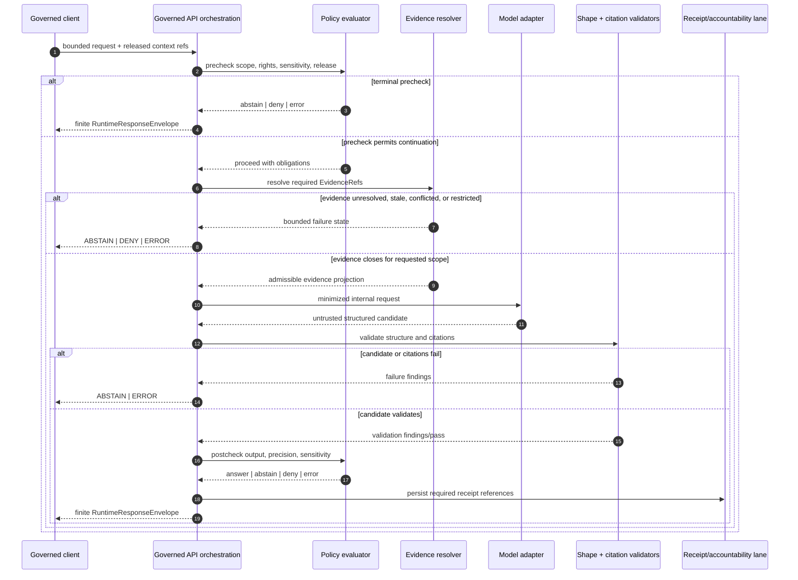

<a id="top"></a>
<!-- [KFM_META_BLOCK_V2]
doc_id: kfm://doc/architecture/governed-ai
title: Kansas Frontier Matrix — Governed AI
type: architecture
version: v1.0
status: draft; repository-grounded; cross-cutting; explanatory; no-runtime-authority
owners:
  - '@bartytime4life — verified CODEOWNERS review route'
owner_status: 'CODEOWNERS routing is confirmed. Governed-AI, Governed API, evidence, citation, policy, security, privacy, correction, rollback, and release stewardship assignments and independent review remain NEEDS VERIFICATION.'
created: 2026-05-25
updated: 2026-08-18
policy_label: public
truth_posture: cite-or-abstain
owning_root: docs/
responsibility: 'Explain the cross-cutting governed-AI trust seam and current repository maturity without becoming decision, contract, schema, policy, evidence, runtime, receipt, release, or publication authority.'
current_path: docs/architecture/governed-ai.md
document_relationship: 'CONFLICTED / NARROWED — this flat note is the cross-cutting overview; docs/architecture/governed-ai/README.md is the detailed subsystem inventory. No accepted decision establishes precedence, retirement, redirect, or canonicality between them.'
evidence_snapshot:
  repository: bartytime4life/Kansas-Frontier-Matrix
  base_ref: main
  base_commit: 109c8fd52ceaed9c6628f9364f88dc18449903e6
  target_prior_blob: fea0342e79c904b15237e58487858b4ea6238b83
  sibling_overview_blob: 9e1071bb69910bde3f364d319923c4db00637639
  directory_rules_blob: fd49a0b83e55cef52c1124281f093e263526898d
  directory_rules_adoption_adr_blob: a4de0d7a96b78da59cfc499d1025e1508afd8dd9
  codeowners_blob: dd2a84aa514d8ecd9208bc347f90f9a2ed37dd61
  runtime_response_contract_blob: 5060aaaa30fea37b6eeea6e1428b9effa6a163bd
  runtime_response_schema_blob: 8b86e7db8b18b65a56a4e639dfc54e1b2db93155
  runtime_response_builder_blob: 5dacededc1bda64292259ba39b6387facafbd1e8
  runtime_response_proof_blob: 70ca80226bf06c3b28b59096e3812312a00c03b6
  ai_receipt_contract_blob: f4d8183dbed38f83144f6d9dbde30ae02a01edb8
  ai_receipt_schema_blob: 2e0bebdb3a38acbc3c58a919db46970c6e829b4a
  ai_receipt_validator_blob: eb80e77aed15f478c32215c8f773f308a87a092a
  mock_adapter_blob: 04d37e59b14c9e3b85126cb3380b6221b44e26d1
  mock_adapter_proof_blob: be1b1d2b4178b30ce9be754671a2c42271ad91bc
  ollama_adapter_blob: 1769a719d6a6df53e001abbc4c67ad486ab5c944
  governed_api_route_registry_blob: 3418168d0b267160d6ad6dd87f289e880ef4a024
  governed_api_stub_blob: 371e60d9f96c78e31c8a1e6109d19dee5da4213b
  governed_api_ai_readme_blob: cd38e803fa21262303ace292a1300e53a3e7ef7e
  explorer_focus_resolver_blob: 45aa4e7479a8c95138f98cc48c846f39a16aec2d
  focus_request_schema_blob: a2f298f014fa299bdec03afbf14ba9937aa95ef8
  focus_response_schema_blob: fd109e4a3c859115d4ad138e9303cf8c5bdd8873
  focus_worker_blob: 7715d01fc585b03dedae7bb535591064bd6d055c
  focus_mock_workflow_blob: fbd56c7cda991ff8f3b804cc0c278e62daaa7abf
inspection_boundary: >
  Current-session GitHub reads covered this complete target; accepted Directory Rules
  placement authority; CODEOWNERS; the detailed governed-AI sibling README; AI-adjacent
  ADRs and the unassigned Focus adapter-boundary candidate; RuntimeResponseEnvelope and
  AIReceipt contracts, schemas, validators, builders, fixtures, and bounded proofs; runtime
  adapter documentation and implementations; Governed API route registration, stub
  envelopes, and AI source documentation; Explorer Focus resolution; Focus schemas;
  runtime policy documentation; citation-package documentation; the Focus worker
  placeholder; and the Focus mock workflow. No model daemon, provider endpoint,
  credential, admitted model, live evidence resolver, policy evaluator, citation service,
  AIReceipt emitter or store, end-to-end Focus route, deployed public client, release,
  correction propagation, rollback drill, or publication was exercised.
related:
  - docs/architecture/README.md
  - docs/architecture/governed-ai/README.md
  - docs/architecture/governed-ai/BOUNDARIES.md
  - docs/architecture/governed-ai/FOCUS_FLOW.md
  - docs/architecture/governed-ai/ADAPTER_CONTRACT.md
  - docs/architecture/governed-ai/AI_RECEIPTS.md
  - docs/architecture/governed-ai/MOCK_FIRST.md
  - docs/architecture/governed-ai/OLLAMA_INTEGRATION.md
  - docs/architecture/governed-api.md
  - docs/architecture/evidence-identity.md
  - docs/architecture/map-shell.md
  - docs/architecture/contract-schema-policy-split.md
  - docs/doctrine/directory-rules.md
  - docs/doctrine/truth-posture.md
  - docs/doctrine/trust-membrane.md
  - docs/doctrine/lifecycle-law.md
  - docs/adr/ADR-0004-apps-governed-api-is-the-trust-membrane.md
  - docs/adr/ADR-0008-ollama-subordinate-to-governed-api.md
  - docs/adr/ADR-0019-ai-adapter-contract-and-finite-envelopes.md
  - docs/adr/ADR-0020-abstain-is-a-first-class-decision.md
  - docs/adr/ADR-0025-public-client-never-reads-canonical-internal-stores.md
  - docs/adr/ADR-0029-adopt-directory-governance-standard-v2.md
  - docs/adr/ADR-focus-model-adapter-boundary.md
  - contracts/runtime/runtime_response_envelope.md
  - contracts/runtime/ai_receipt.md
  - schemas/contracts/v1/runtime/runtime_response_envelope.schema.json
  - schemas/contracts/v1/runtime/ai_receipt.schema.json
  - schemas/contracts/v1/focus/focus_request.schema.json
  - schemas/contracts/v1/focus/focus_response.schema.json
  - runtime/model_adapters/README.md
  - runtime/model_adapters/MockAdapter.py
  - runtime/model_adapters/OllamaAdapter.py
  - apps/governed-api/src/governed_api/routes/registry.py
  - apps/governed-api/src/governed_api/stub.py
  - apps/governed-api/src/ai/README.md
  - apps/explorer-web/src/features/focus_panel/resolver.ts
  - apps/workers/src/ai_focus_worker/main.py
  - packages/envelopes/src/envelopes/runtime_response.py
  - packages/citation/src/citation/README.md
  - policy/runtime/README.md
  - tools/validators/validate_ai_receipt.py
  - tests/runtime_proof/test_envelope_finite_outcomes.py
  - tests/runtime_proof/test_mock_adapter_finite_outcomes.py
  - .github/workflows/focus-mock-test.yml
tags: [kfm, architecture, governed-ai, focus-mode, model-adapter, runtime-response-envelope, ai-receipt, evidence-before-model, citation-validation, policy, finite-outcomes, trust-membrane, cite-or-abstain]
notes:
  - 'v1.0 is a same-path, repository-grounded replacement of the v0.1 document.'
  - 'The rewrite removes obsolete no-repository claims, speculative object shapes, unsupported optional outcomes, and unverified runtime assertions.'
  - 'Legacy section anchors are retained as explicit compatibility anchors.'
  - 'This change modifies documentation only. It does not accept an ADR, resolve the parallel-overview conflict, alter runtime behavior, admit a provider, activate policy, create a route, release, deploy, or publish.'
[/KFM_META_BLOCK_V2] -->

# Kansas Frontier Matrix — Governed AI

> **Governed AI may interpret already-governed evidence behind the Governed API. It does not create truth, source authority, policy, review, release, correction, rollback, or publication state.**

[](#authority-and-placement)
[](#current-evidence)
[](#current-evidence)
[](#runtime-response-envelope)
[](#trust-membrane-and-client)
[](#model-adapter-boundary)
[](#change-review-rollback)

> [!IMPORTANT]
> **Architecture explanation is not runtime or decision authority.** Contracts own semantic meaning, schemas own machine shape, policy owns admissibility rule source, implementation roots own executable behavior, evidence and accountability lanes own their records, and `release/` owns release, correction, withdrawal, and rollback decisions. This page explains how those responsibilities should compose.

> [!CAUTION]
> **Current maturity is bounded.** The repository contains a closed four-outcome response schema, deterministic envelope helpers and proof tests, an `AIReceipt` schema and local validator, a no-I/O `MockAdapter` fixture selector, and defensive Focus projection code. It does **not** establish an end-to-end governed-AI route, executing policy evaluator, evidence-resolution composition, citation-validation service, receipt emitter/store, admitted provider, deployed AI surface, or public AI release.

> [!WARNING]
> **Two human overviews remain.** This flat file and [`docs/architecture/governed-ai/README.md`](./governed-ai/README.md) overlap. This revision narrows the flat file to the cross-cutting architecture and current-maturity overview; the folder README remains the detailed subsystem inventory. That editorial split does not settle canonicality, precedence, retirement, or redirection.

**Quick navigation:** [Purpose](#purpose-and-scope) · [Authority](#authority-and-placement) · [Operating law](#operating-law) · [Evidence checkpoint](#current-evidence) · [Flow](#governed-request-flow) · [Response envelope](#runtime-response-envelope) · [AIReceipt](#ai-receipt) · [Adapters](#model-adapter-boundary) · [Evidence and citations](#evidence-and-citation) · [Policy and sensitivity](#policy-and-sensitivity) · [Trust membrane](#trust-membrane-and-client) · [Validation](#validation-and-graduation) · [Anti-patterns](#anti-patterns) · [Open decisions](#open-decisions) · [Rollback](#change-review-rollback) · [Related](#related-surfaces)

---

<a id="1-purpose--scope"></a>
<a id="purpose-and-scope"></a>

## 1 · Purpose and scope

This page is the cross-cutting architecture overview for model-mediated behavior in KFM. It explains the trust path from a caller request to a finite governed response, identifies which responsibility owns each step, and records the implementation depth proven by the current repository snapshot.

The durable rule is simple:

```text
scope
  -> policy precheck
  -> EvidenceRef resolution
  -> admissible-context minimization
  -> provider-neutral adapter
  -> structured-candidate validation
  -> citation validation
  -> policy postcheck
  -> finite RuntimeResponseEnvelope
  -> AIReceipt accountability
  -> governed client projection
```

Every step is subordinate to evidence, policy, review, release, correction, and rollback. A fluent answer, model score, map click, vector hit, fixture pass, receipt, or pull request cannot substitute for those authorities.

### In scope

- the evidence-before-model ordering;
- the Governed API and public-client boundary;
- finite runtime outcomes;
- the current `RuntimeResponseEnvelope` and `AIReceipt` contract surfaces;
- the model-adapter responsibility split;
- citation, policy, sensitivity, precision, freshness, and correction obligations;
- current component evidence, implementation gaps, tests, graduation gates, and rollback posture.

### Out of scope

- accepting AI-related ADRs;
- defining contract or schema fields in architecture prose;
- selecting or admitting a model/provider;
- activating policy or a source;
- creating a public route;
- claiming evidence closure, runtime deployment, release, or publication;
- resolving the competing flat-file and folder-README relationship by documentation fiat.

### Relationship to the subsystem folder

| Surface | Role in this revision | Authority |
|---|---|---|
| `docs/architecture/governed-ai.md` | Cross-cutting overview, current maturity, trust flow, and integration gates. | Explanatory only. |
| [`docs/architecture/governed-ai/README.md`](./governed-ai/README.md) | Detailed subsystem inventory, sibling-document map, per-surface evidence, and local open work. | Explanatory only. |
| Sibling pages such as [`FOCUS_FLOW.md`](./governed-ai/FOCUS_FLOW.md), [`BOUNDARIES.md`](./governed-ai/BOUNDARIES.md), and [`AI_RECEIPTS.md`](./governed-ai/AI_RECEIPTS.md) | Topic-specific architecture notes, several of which still carry older evidence assumptions. | Explanatory; reverify before relying on current-state claims. |

[Back to top](#top)

---

<a id="2-where-this-note-belongs"></a>
<a id="authority-and-placement"></a>

## 2 · Authority, placement, and document relationship

The target is an existing tracked architecture page. Accepted [ADR-0029](../adr/ADR-0029-adopt-directory-governance-standard-v2.md) adopts the exact Directory Rules v2 bytes at [`docs/doctrine/directory-rules.md`](../doctrine/directory-rules.md). Those rules place human-readable system structure under `docs/architecture/`.

The v0.1 page's claim that this path needed a new placement ADR because it was absent from an illustrative v1.3 tree is stale. Directory Rules v2 govern by responsibility, not by whether every permissible child filename appears in a sample tree. This page explains a cross-root system seam and therefore fits the existing `docs/architecture/` responsibility.

| Question | Current answer |
|---|---|
| **Tracked path** | `docs/architecture/governed-ai.md` — **CONFIRMED** |
| **Owning root** | `docs/` |
| **Primary responsibility** | Human-readable, cross-cutting architecture explanation |
| **Placement authority** | ADR-0029 + adopted Directory Rules v2 |
| **Verified review route** | `@bartytime4life` through `.github/CODEOWNERS` |
| **Stewardship** | Governed-AI/API/evidence/citation/policy/security/correction/release stewardship is **NEEDS VERIFICATION** |
| **Runtime or publication effect** | None |
| **Flat-file vs folder-README disposition** | **CONFLICTED / unresolved**; no accepted decision establishes precedence or retirement |

### Responsibility routing

| Concern | Owning surface | This page's relationship |
|---|---|---|
| Architecture explanation | `docs/architecture/` | Owns this overview only. |
| Binding architecture decision | `docs/adr/` | Links and reports status; cannot accept a proposal. |
| Semantic object/interface meaning | `contracts/` | Must quote current contracts accurately; cannot redefine them. |
| Machine-checkable shape | `schemas/` | Must follow current schemas; cannot add fields or outcomes in prose. |
| Admissibility rules | `policy/` | Explains precheck/postcheck roles; cannot make a decision. |
| Public/deployable orchestration | `apps/governed-api/` | Intended trust-membrane app; current AI route is absent. |
| Provider/runtime composition | `runtime/` | Owns adapters and local harnesses; no public ingress. |
| Reusable helpers | `packages/` | Owns envelope, evidence, citation, and related reusable implementation. |
| Evidence, receipt, proof, registry, published instances | `data/` responsibility lanes | Referenced by stable IDs; not stored or approved here. |
| Promotion, release, correction, withdrawal, rollback | `release/` | Separate decision authority. |
| Executable proof | `tests/`, `fixtures/`, `tools/validators/`, workflows | Demonstrates bounded conformance only. |

> [!NOTE]
> CODEOWNERS routes review requests. It is not proof of review, steward assignment, policy approval, provider admission, release approval, or separation of duties.

[Back to top](#top)

---

<a id="3-the-ai-rule"></a>
<a id="operating-law"></a>

## 3 · Operating law

AI is an interpretive subsystem. `EvidenceBundle` and governing release/policy state outrank generated language.

| Governed AI **MAY** | Governed AI **MUST NOT** |
|---|---|
| Summarize or compare already-admissible evidence inside an authorized scope. | Invent support from model memory, map pixels, feature properties, vector hits, graph centrality, or plausible prose. |
| Produce an untrusted structured candidate through an admitted adapter. | Decide evidence sufficiency, source authority, rights, sensitivity, review, release, correction, or publication. |
| Return `ANSWER`, `ABSTAIN`, `DENY`, or `ERROR` through the current response-envelope family. | Add undocumented outcomes or fall through to free-form content when a gate fails. |
| Create process accountability through an `AIReceipt` when the orchestration contract requires one. | Treat an `AIReceipt`, model log, test, or digest as evidence or release proof. |
| Draft material for explicit steward review on non-public surfaces. | Collapse generation and approval into one action. |
| Fail closed when evidence, policy, citations, precision, freshness, or correction state cannot be evaluated. | Convert missing evaluation into permission or an answer. |

### Non-negotiable invariants

1. **Evidence before model.** Consequential claims require governed evidence resolution before model invocation.
2. **Public clients use governed interfaces.** A browser does not call a model daemon, evidence store, policy store, canonical store, or receipt store directly.
3. **Finite outcomes.** The current runtime outcome vocabulary is exactly `ANSWER`, `ABSTAIN`, `DENY`, and `ERROR`.
4. **No raw lifecycle context.** RAW, WORK, QUARANTINE, unpublished candidate, and direct canonical-store bytes do not enter ordinary public AI context.
5. **Policy before and after generation.** Precheck protects request/context admission; postcheck protects the candidate output.
6. **Citation validation is distinct from generation.** A model-provided citation is an untrusted claim until validation binds it to admissible evidence.
7. **Precision and freshness remain visible.** An answer may not imply more spatial, temporal, or attribute precision than its evidence supports.
8. **No private chain-of-thought as a truth object.** Store bounded inputs/outputs, digests, decisions, citations, findings, and receipts—not hidden deliberation traces.
9. **Watchers and AI do not publish.** Promotion remains a governed state transition with review, release, correction, and rollback.
10. **Unknown sensitive posture fails closed.** Rights, sovereignty, living-person data, genomics, archaeology, rare-species locations, critical infrastructure, and harmful precision require denial, abstention, generalization, staging, or review.

[Back to top](#top)

---

<a id="current-evidence"></a>

## 4 · Current repository evidence checkpoint

The table below separates tracked bytes and bounded proofs from the end-to-end behavior they do not establish.

| Surface | Current evidence | Proven boundary | Not proven |
|---|---|---|---|
| `RuntimeResponseEnvelope` contract/schema | Present, closed schema, four outcomes, conditional `ANSWER` precision profile. | Machine shape and documented semantics at proposed status. | Evidence resolution, policy correctness, answer payload composition, deployed API/client behavior. |
| Envelope candidate builder | Deterministic local helper under `packages/envelopes/`. | Local shape checks from caller-supplied authority-bearing values. | Policy, freshness, correction, precision calculation, release, or public response creation. |
| Envelope proof suite | Standard-library tests cover four outcomes, aliases, fixtures, and critical precision rules. | Bounded shape and fixture conformance. | Runtime orchestration or publication. |
| `AIReceipt` contract/schema | Present, closed nine-field schema with four outcomes. | Receipt shape at proposed status. | Receipt emission, persistence, decision authentication, evidence/citation closure, release. |
| `AIReceipt` validator | Deterministic, no-network local validator with finite `PASS`/`FAIL`/`ERROR`. | Schema shape and local consistency checks. | Policy/citation authenticity, model approval, public answer authorization. |
| `MockAdapter.py` | Deterministic no-I/O selector over prevalidated complete envelopes. | Four-outcome fixture selection, isolation, fail-closed configuration. | Request interpretation, semantic outcome selection, model invocation, evidence, policy, citation, or receipt behavior. |
| MockAdapter proof suite | Tests cover all outcomes, deep-copy isolation, safe unknown scenarios, and restricted imports/calls. | Bounded fixture-selector proof. | A production adapter contract or end-to-end Focus runtime. |
| Ollama adapter | One-line greenfield placeholder. | Path presence only. | Any provider call, model pin, network policy, secret handling, structured output, or admission. |
| Governed API route registry | Registers only bootstrap, layers, and evidence routes. | Current route inventory at the checkpoint. | A governed-AI or Focus route. |
| Governed API stub | Emits fail-closed `ABSTAIN` and `ERROR` envelopes. | Safe scaffold behavior. | AI orchestration, evidence closure, policy evaluation, or citation validation. |
| Governed API AI source subtree | README boundary exists. | Intended app-local responsibility. | Source modules, route wiring, DTOs, middleware, adapter integration, or execution. |
| Explorer Focus resolver | Defensive parser/projection path with an injected governed resolver; rejects missing scope, malformed responses, scope mismatch, and out-of-request evidence. | Browser-side fail-closed projection and no direct transport/model/store logic in that function. | A deployed governed resolver, evidence closure, policy, citation service, or model path. |
| Focus request/response schemas | Empty permissive scaffolds with `additionalProperties: true`. | Placeholder path presence. | A usable closed request or response contract. |
| Runtime policy lane | README plus non-enforcing greenfield stubs and a fail-closed RunReceipt scaffold. | Documented hold and tracked rule-source bytes. | Accepted bundle, evaluator, native decisions, consumer binding, or runtime enforcement. |
| Citation package | Python `0.0.0` scaffold with an empty initializer and documentation. | Package boundary documentation. | Executable citation-validation service or accepted report shape. |
| AI Focus worker | One-line greenfield placeholder. | Path presence only. | Queue, worker, orchestration, provider, receipt, or deployment behavior. |
| Focus mock workflow | Static readiness/HOLD checks plus no-network envelope and MockAdapter proofs. | Bounded CI proof surfaces. | Operational Focus runtime, model output, receipt emission, release, or publication. |

### Maturity determination

| Layer | State | Basis |
|---|---|---|
| Architecture and boundary documentation | **PARTIAL** | Multiple detailed docs exist, but overlap, stale evidence, and unresolved decisions remain. |
| Contracts and schemas | **PARTIAL / PROPOSED** | Runtime envelope and AIReceipt are fielded and closed; Focus request/response remain permissive scaffolds. |
| Deterministic component proof | **CONFIRMED bounded slices** | Envelope builder/proofs, AIReceipt validator, MockAdapter selector/proofs, and Explorer projection exist. |
| Governed-AI orchestration | **HOLD / not established** | No AI route, executing policy/evidence/citation composition, or receipt emitter/store. |
| Live provider integration | **ABSENT from proven implementation** | Ollama and worker files are placeholders; no provider is admitted. |
| Deployment and public release | **NONE proven** | No runtime, public session, release record, correction propagation, rollback drill, or publication was exercised. |

> [!IMPORTANT]
> A component can be `CONFIRMED` while the subsystem remains on `HOLD`. KFM does not upgrade a bounded selector, schema, or UI parser into an end-to-end AI claim.

[Back to top](#top)

---

<a id="4-required-flow"></a>
<a id="governed-request-flow"></a>

## 5 · Governed request flow

The sequence below is the **target responsibility flow**. It is not a claim that the current repository executes every stage.


```mermaid
sequenceDiagram
    autonumber
    participant C as Governed client
    participant G as Governed API orchestration
    participant P as Policy evaluator
    participant E as Evidence resolver
    participant A as Model adapter
    participant V as Shape + citation validators
    participant R as Receipt/accountability lane

    C->>G: bounded request + released context refs
    G->>P: precheck scope, rights, sensitivity, release
    alt terminal precheck
        P-->>G: abstain | deny | error
        G-->>C: finite RuntimeResponseEnvelope
    else precheck permits continuation
        P-->>G: proceed with obligations
        G->>E: resolve required EvidenceRefs
        alt evidence unresolved, stale, conflicted, or restricted
            E-->>G: bounded failure state
            G-->>C: ABSTAIN | DENY | ERROR
        else evidence closes for requested scope
            E-->>G: admissible evidence projection
            G->>A: minimized internal request
            A-->>G: untrusted structured candidate
            G->>V: validate structure and citations
            alt candidate or citations fail
                V-->>G: failure findings
                G-->>C: ABSTAIN | ERROR
            else candidate validates
                V-->>G: validation findings/pass
                G->>P: postcheck output, precision, sensitivity
                P-->>G: answer | abstain | deny | error
                G->>R: persist required receipt references
                G-->>C: finite RuntimeResponseEnvelope
            end
        end
    end
```

### Stage ownership and current state

| Stage | Owner responsibility | Current state |
|---|---|---|
| Request and scope validation | Governed API orchestration + accepted request contract/schema | **HOLD:** Focus request/response schemas are permissive scaffolds; no AI route is registered. |
| Policy precheck | Policy evaluator consuming governed identity, rights, sensitivity, review, and release state | **HOLD:** rule-source stubs exist; no evaluator binding is established. |
| Evidence resolution | Evidence resolver converting required `EvidenceRef`s to admissible `EvidenceBundle` support | **NEEDS VERIFICATION / not integrated** into an AI route. |
| Context minimization | Governed orchestration | **UNKNOWN:** no executing assembler was established. |
| Model invocation | Provider-neutral adapter behind the server-side boundary | **BOUNDED MOCK ONLY:** current MockAdapter selects complete fixture envelopes; Ollama is a placeholder. |
| Structured-candidate validation | Schema/contract validators outside the provider | **PARTIAL:** response-envelope shape proof exists; a candidate-answer contract is not established here. |
| Citation validation | Independent citation/evidence validation | **HOLD:** documentation/scaffolds exist; no executing service is established. |
| Policy postcheck | Policy evaluator over proposed output and precision | **HOLD:** no runtime binding. |
| Outcome/envelope assembly | Governed orchestration using current response contract | **PARTIAL:** local builder and fixtures exist; no AI route uses them. |
| `AIReceipt` creation/persistence | Orchestration + accountability storage | **HOLD:** contract/schema/validator exist; emitter/store not established. |
| Client projection | Explorer Web consumes a governed projection | **PARTIAL:** defensive composed-claim resolver exists; upstream governed service does not. |

> [!CAUTION]
> The current `MockAdapter` returns deep-copied, prevalidated **complete response envelopes**. The unassigned Focus adapter-boundary candidate instead proposes that a production adapter return an **untrusted candidate** while orchestration owns validation, policy, citation, receipts, and final envelope selection. That difference is unresolved and must not be hidden by architecture prose.

[Back to top](#top)

---

<a id="5-finite-outcomes"></a>
<a id="8-runtimeresponseenvelope"></a>
<a id="runtime-response-envelope"></a>

## 6 · `RuntimeResponseEnvelope`: current contract

The current response contract is defined by [`contracts/runtime/runtime_response_envelope.md`](../../contracts/runtime/runtime_response_envelope.md) and its paired closed schema at [`schemas/contracts/v1/runtime/runtime_response_envelope.schema.json`](../../schemas/contracts/v1/runtime/runtime_response_envelope.schema.json).

### Schema-confirmed field surface

| Field | Required | Current machine role |
|---|---:|---|
| `id` | yes | Stable response-envelope identifier. |
| `spec_hash` | yes | SHA-256 contract/spec lineage binding. |
| `version` | yes | Envelope version token. |
| `issued_at` | yes | Offset-aware date-time at emission. |
| `outcome` | yes | Exactly `ANSWER`, `ABSTAIN`, `DENY`, or `ERROR`. |
| `reason_code` | yes | Primary safe reason classification. |
| `evidence_refs` | yes | EvidenceRef array; at least one item when outcome is `ANSWER`. |
| `policy_state` | yes | Policy-state summary; vocabulary remains a separate semantic concern. |
| `freshness` | yes | Freshness/staleness posture. |
| `correction_state` | yes | Correction/withdrawal/supersession posture. |
| `precision_actually_used` | `ANSWER` only | Closed spatial, temporal, attribute, evidence, and transform-receipt disclosure. |

The schema sets `additionalProperties: false`.

### Conditional rules

- `ANSWER` requires at least one top-level `EvidenceRef`.
- `ANSWER` requires `precision_actually_used`.
- `ABSTAIN`, `DENY`, and `ERROR` forbid `precision_actually_used`.
- The precision profile contains `spatial`, `temporal`, `attribute`, `evidence_refs`, and `transform_receipt_refs`; `requested_precision` is optional.
- The local builder and bounded proof add semantic checks such as evidence-ref alignment, interval order, and a transform-receipt requirement when generalization is declared. The schema alone is not the whole semantic decision system.

### Finite outcomes

| Outcome | Governed meaning | Must not become |
|---|---|---|
| `ANSWER` | The caller may receive the response posture only after evidence, policy, precision, freshness, correction, and other required gates are satisfied. | Model confidence, schema pass, or fixture selection alone. |
| `ABSTAIN` | Support or evaluability is insufficient for a substantive answer. | A disguised partial answer or silent fallback. |
| `DENY` | Policy, rights, sensitivity, access, review, or release posture forbids the operation or disclosure. | A detailed oracle that leaks protected facts through the denial reason. |
| `ERROR` | The governed path could not complete safely. | An implicit allow, retry through an ungoverned path, or fabricated answer. |

> [!IMPORTANT]
> The current schema does **not** define `answer`, `citations`, `ai_receipt_id`, separate abstain/denial objects, or the optional `NARROWED` and `BOUNDED` outcomes that appeared in the v0.1 architecture note. This revision removes those invented shapes. Any substantive answer-payload composition or outcome extension requires a contract/schema decision and compatible client design; architecture prose cannot add it.

### Consequence for clients

The current envelope is a governance-posture carrier. Where substantive content lives and how it is bound to the envelope is still an open integration question. Until that interface is accepted and implemented, clients must not infer that a valid envelope schema alone authorizes display of model-generated text.

[Back to top](#top)

---

<a id="6-aireceipt--the-ais-promise-of-accountability"></a>
<a id="ai-receipt"></a>

## 7 · `AIReceipt`: current contract

[`contracts/runtime/ai_receipt.md`](../../contracts/runtime/ai_receipt.md) defines the current semantic proposal; [`schemas/contracts/v1/runtime/ai_receipt.schema.json`](../../schemas/contracts/v1/runtime/ai_receipt.schema.json) defines the paired closed machine shape.

### Schema-confirmed field surface

| Field | Required | Current machine role |
|---|---:|---|
| `id` | yes | Stable receipt identifier. |
| `run_id` | yes | Runtime/adapter event identifier. |
| `adapter` | yes | Provider-neutral adapter identifier. |
| `model_ref` | yes | Model reference used by the adapter. |
| `inputs_digest` | yes | SHA-256 digest of canonicalized bounded inputs. |
| `outputs_digest` | yes | SHA-256 digest of canonicalized outputs. |
| `policy_decision_ref` | yes | Reference to the governing policy decision. |
| `citation_validation_ref` | yes | Reference to citation validation. |
| `outcome` | yes | `ANSWER`, `ABSTAIN`, `DENY`, or `ERROR`. |

The schema sets `additionalProperties: false`.

The v0.1 page's speculative `provider_id`, `model_pin`, `parameter_pin`, `prompt_contract_hash`, pre/post policy fields, timing, timestamp, and envelope-hash fields are **not** in the current schema. Adding them requires a coordinated contract/schema/fixture/validator/migration change.

### What the local validator proves

[`tools/validators/validate_ai_receipt.py`](../../tools/validators/validate_ai_receipt.py):

- reads bounded UTF-8 JSON without network access;
- rejects symlinks, oversized files, duplicate keys, non-finite values, malformed JSON, and non-object roots;
- validates the current schema;
- rejects empty key string fields and all-zero placeholder digests;
- returns finite `PASS`, `FAIL`, or `ERROR` for local validation.

It does **not** authenticate the referenced policy decision, validate the referenced citation report, resolve evidence, approve a model, emit/store the receipt, authorize an answer, promote state, release, or publish.

### Receipt anti-collapse rules

- An `AIReceipt` is process accountability, not evidence.
- A digest is integrity support, not truth.
- A `policy_decision_ref` is not a policy decision unless it resolves to the governing decision object.
- A `citation_validation_ref` is not citation closure unless the report resolves and supports the answer.
- Receipt presence does not establish review, release, correction, rollback, or publication.
- Private chain-of-thought, scratchpad text, credentials, exact protected locations, and raw sensitive context do not belong in receipt fields or outward reason text.

[Back to top](#top)

---

<a id="7-adapter-contract--order"></a>
<a id="model-adapter-boundary"></a>

## 8 · Model-adapter boundary

The runtime adapter is a provider-facing implementation boundary, not the governed transaction owner.

### Current adapter evidence

| Surface | State | Safe conclusion |
|---|---|---|
| `runtime/model_adapters/README.md` | Repository-grounded documentation | The canonical provider-neutral adapter lane is documented; production behavior is not. |
| `runtime/model_adapters/MockAdapter.py` | Executable bounded selector | Useful deterministic test infrastructure; not a semantic model adapter. |
| `runtime/model_adapters/OllamaAdapter.py` | One-line placeholder | No Ollama behavior is implemented. |
| `apps/workers/src/ai_focus_worker/main.py` | One-line placeholder | No worker behavior is implemented. |
| Provider/model registry or admission record | Not established by inspected evidence | No provider or model is admitted. |

### Proposed production responsibility split

The nearby ADR surfaces are not settled. [ADR-0019](../adr/ADR-0019-ai-adapter-contract-and-finite-envelopes.md) remains proposed, and the [Focus adapter-boundary candidate](../adr/ADR-focus-model-adapter-boundary.md) is unassigned and overlaps it. The narrower candidate proposes the following split:

| Governed orchestration owns | Adapter owns |
|---|---|
| Caller request validation and scope. | Provider-specific invocation under an admitted capability profile. |
| Evidence resolution and admissible-context minimization. | Translation between the internal adapter request and provider API/runtime. |
| Policy precheck and postcheck. | Provider/model error normalization into an internal candidate result. |
| Structured-candidate schema validation. | Returning an untrusted structured candidate—never a public envelope. |
| Citation validation. | No evidence, policy, release, receipt, or publication decisions. |
| Precision, freshness, correction, and release checks. | No direct client response and no canonical-store access. |
| Final finite-outcome selection and `RuntimeResponseEnvelope`. | No final outcome authority unless an accepted decision explicitly changes the split. |
| `AIReceipt` assembly/persistence and incident linkage. | Supplying the bounded provider/model metadata required by the receipt contract. |

That split is **PROPOSED**, not current implementation. The complete-envelope MockAdapter remains a bounded test fixture selector until the decision and implementation converge.

### Provider admission minimum

A provider/model integration is not admitted by adding a filename or environment variable. Before status advances, reviewers need:

1. assigned ownership and an accepted/non-conflicting adapter decision;
2. a closed internal adapter request/candidate contract and machine shape;
3. provider/model identity, version or digest, capabilities, limits, and deactivation path;
4. network, credential, secret-reference, data-retention, privacy, rights, and residency review;
5. context-minimization and no-canonical-store proof;
6. structured-output, injection, tool-use, denial, timeout, malformed-output, and leakage fixtures;
7. citation, policy, evidence, precision, freshness, correction, and receipt integration;
8. no direct browser/provider path;
9. deterministic mock parity and bounded replay expectations;
10. correction, incident, kill-switch, and rollback procedures.

A provider swap is not automatically “configuration only.” Different providers may change security, privacy, retention, model behavior, output shape, policy obligations, and replay guarantees.

[Back to top](#top)

---

<a id="9-citation-validation--cite-or-abstain"></a>
<a id="evidence-and-citation"></a>

## 9 · Evidence and citation closure

An `EvidenceRef` is a pointer, not evidence closure. A citation string is not a validated claim. A model mention of a source does not create support.

### Target evidence-before-model rules

1. Every consequential answer scope names its required evidence dependencies.
2. Required `EvidenceRef`s resolve through a governed resolver to admissible `EvidenceBundle` support.
3. Evidence role, temporal support, spatial support, rights, sensitivity, review, release, freshness, and correction posture remain visible.
4. Context assembly includes only the minimum authorized projection needed by the adapter.
5. Each consequential candidate claim is checked against resolved evidence anchors.
6. Missing, stale, conflicted, restricted, withdrawn, or out-of-scope support terminates in `ABSTAIN`, `DENY`, or `ERROR`; the model does not fill the gap.
7. A composed claim does not become stronger than its weakest required dependency.

### Current implementation boundary

- The Explorer Focus resolver validates the local request/projection shape, requires an allowed evidence scope, rejects response scope mismatch, and rejects projected evidence outside the request.
- That browser code does not resolve `EvidenceRef`s, read evidence stores, validate source authority, run policy, or prove citation closure.
- `packages/citation/` is a Python `0.0.0` scaffold with an empty initializer and documentation. The inspected helper modules and executable citation service were not established.
- CitationValidationReport documentation and scaffolded schema surfaces exist in more than one family, but accepted field-complete machine authority and runtime service wiring remain unresolved.
- The Governed API does not register a governed-AI route that composes citation validation.

> [!CAUTION]
> “Citation present” and “citation valid” are different states. The former is syntax; the latter requires a resolvable, admissible support relationship for the exact claim scope.

### Safe failure mapping

| Finding | Required posture |
|---|---|
| Required evidence ref missing or unresolved | `ABSTAIN` unless policy requires `DENY`. |
| Evidence stale with no accepted historical-use rule | `ABSTAIN`. |
| Sources conflict and no reviewed resolution exists | `ABSTAIN` with safe conflict disclosure. |
| Evidence restricted for the caller/operation | `DENY`. |
| Citation points outside admitted evidence scope | `ABSTAIN` or `DENY`; never widen context silently. |
| Citation service/evidence resolver unavailable | `ERROR`; never use model memory as fallback. |
| Release withdrawn or correction invalidates support | Suppress or terminate per correction/release policy; do not serve cached text as current. |

[Back to top](#top)

---

<a id="10-ai-hard-denials"></a>
<a id="11-sensitive-domain-interactions"></a>
<a id="policy-and-sensitivity"></a>

## 10 · Policy, rights, sensitivity, and precision

Policy is evaluated around the model; it is not delegated to the model.

### Precheck and postcheck

| Gate | Protects | Example terminal posture |
|---|---|---|
| **Precheck** | Caller scope, operation, rights, source terms, sensitivity, release/review state, allowed evidence classes, provider/tool permissions. | `DENY` before evidence or model invocation; `ABSTAIN` when scope cannot be supported; `ERROR` when policy cannot evaluate. |
| **Postcheck** | Candidate claims, protected attributes, sensitive geometry, source-role upgrade, unsupported precision, directive language, citation leakage, and output obligations. | `DENY`, `ABSTAIN`, or `ERROR`; never sanitize by unsupported paraphrase and then call it an answer. |

### Current policy evidence

The inspected `policy/runtime/` lane contains documentation, three explicit non-enforcing denial stubs whose active defaults do not deny, a fail-closed RunReceipt allow scaffold, and placeholder subdirectories. No accepted bundle, evaluator, outcome mapping, native decision record, or governed consumer was established.

> [!WARNING]
> **No denial is not permission.** A false/default rule, missing result, absent evaluator, malformed input, schema pass, or workflow pass must not be inverted into `ANSWER` or public access.

### Sensitive-domain posture

When authority, rights, sovereignty, consent, sensitivity, or harmful precision is unclear, KFM fails closed.

| Concern | Public-AI default |
|---|---|
| Archaeology, burial, sacred, or cultural sites | Deny exact location and restricted context; use only pre-approved generalized projections. |
| Rare species and protected ecological occurrences | Deny exact occurrence coordinates; use released generalized products where approved. |
| Living persons, genealogy, DNA/genomics, or household-level joins | Deny personal or inferential exposure; use only approved aggregate/public-safe products. |
| Critical infrastructure, private systems, or exploitable operational detail | Deny harmful precision and operational instructions; use coarse released context only. |
| Private land/title/rights assertions | Abstain or deny until authoritative rights and scope are documented. |
| Hazards, air, water, or emergency conditions | KFM is not an alert authority; cite released official evidence and direct users to official operational channels. |
| Restricted source terms | Deny public derivative use; internal processing remains subject to the source terms and approved policy. |

Sensitive transforms occur **before** adapter context assembly. Client-side style hiding, prompt wording, or post-generation redaction is not an adequate primary control.

### Precision actually used

The current response contract requires an `ANSWER` to disclose evidence-supported spatial, temporal, and attribute precision through `precision_actually_used`.

Consequences:

- map zoom, user-requested precision, model confidence, or formatting precision cannot upgrade evidence;
- generalized or transformed context must preserve transform-receipt lineage where the accepted semantic checks require it;
- the model must not reconstruct or infer suppressed precision from adjacent context;
- stale, historical, or unknown freshness must remain explicit;
- correction/withdrawal state must be evaluated before answer display.

[Back to top](#top)

---

<a id="trust-membrane-and-client"></a>

## 11 · Trust membrane and client behavior

The normal client path is:

```text
Explorer Web / review-capable client
  -> governed service boundary
  -> finite RuntimeResponseEnvelope and authorized payload/projection
```

It is not:

```text
browser
  -X-> model daemon
  -X-> RAW / WORK / QUARANTINE
  -X-> canonical/internal evidence store
  -X-> policy store
  -X-> receipt/proof store
  -X-> provider SDK with client credentials
```

### Current route and client evidence

- The Governed API route registry currently exposes bootstrap, layers, and evidence only. A governed-AI/Focus route is absent.
- The Governed API scaffold returns finite fail-closed envelopes; it does not run AI.
- The app-local AI subtree is documentation, not route implementation.
- The Explorer Focus resolver uses an injected `GovernedFocusComposedClaimResolver`. The resolver function itself performs no transport, model, policy, evidence-store, graph, vector-store, renderer, or lifecycle-store access.
- Local client guards return `ABSTAIN` or `ERROR` for invalid requests, missing evidence scope, upstream failures, malformed projections, request/response mismatch, and out-of-scope evidence.
- A process-receipt label is explicitly presented as “not release proof.”

### Client obligations

A mature client must:

- render only the finite outcome and payload authorized by the governed response;
- never replace `ABSTAIN`, `DENY`, or `ERROR` with raw provider output;
- preserve safe reason codes, evidence references, precision/freshness/correction posture, and Evidence Drawer navigation;
- avoid exposing sensitive denial details or internal identifiers;
- invalidate or refresh cached content after correction, withdrawal, or release change;
- keep accessibility behavior for negative states;
- avoid treating a spinner, timeout, empty payload, or unknown outcome as success.

The current browser guard is useful, but client-side checks are defense in depth. They cannot replace backend evidence, policy, citation, release, or correction enforcement.

[Back to top](#top)

---

<a id="14-acceptance-criteria"></a>
<a id="validation-and-graduation"></a>

## 12 · Validation and graduation gates

### Current bounded proof surfaces

| Proof surface | Current role | Limit |
|---|---|---|
| RuntimeResponseEnvelope JSON Schema and fixtures | Closed field/outcome/precision shape. | Does not select a truthful outcome. |
| `validate_runtime_response_envelope.py` + schema workflows | Canonical local schema/semantic validation path. | Does not resolve evidence or policy. |
| Envelope candidate builder | Deterministic local construction with safe errors. | Caller supplies authority-bearing values. |
| `test_envelope_finite_outcomes.py` | Dependency-light four-outcome and precision proof. | No runtime, model, evidence, or policy. |
| `MockAdapter.py` + proof suite | Deterministic complete-envelope fixture selection and no-I/O boundary. | Not the proposed production adapter seam. |
| `AIReceipt` schema + validator | Receipt shape and local consistency. | No emitter/store or reference authentication. |
| Explorer Focus parser/resolver tests | Defensive client projection and scope containment. | No upstream governed service proof. |
| `focus-mock-test.yml` | Static readiness/HOLD plus no-network shape/selector proof. | Deliberately does not claim an executable Focus runtime. |

### Minimum gates before an end-to-end governed-AI claim

1. **Decision closure:** reconcile ADR-0019 with the unassigned Focus adapter-boundary candidate; record ownership and review.
2. **Request/response closure:** replace permissive Focus scaffolds with accepted semantic contracts, closed schemas, positive/negative fixtures, validators, and compatibility rules.
3. **Route closure:** register a bounded Governed API route with authentication/authorization, safe errors, rate/resource limits, and no direct provider exposure.
4. **Evidence closure:** integrate the approved `EvidenceRef`→`EvidenceBundle` resolver and prove required, stale, conflicted, restricted, withdrawn, and error cases.
5. **Policy closure:** bind an accepted evaluator/bundle for precheck and postcheck; prove evaluator failure does not allow.
6. **Context closure:** prove minimization, no RAW/WORK/QUARANTINE/canonical bytes, no protected precision, and no secret leakage.
7. **Adapter closure:** implement the accepted internal request/candidate interface, provider admission, timeout/cancellation, structured output, and safe error mapping.
8. **Citation closure:** implement and independently test claim-to-evidence validation; prove unsupported citations force a non-answer.
9. **Envelope/payload closure:** decide how substantive content binds to the current governance envelope without inventing fields or bypassing the schema.
10. **Receipt closure:** emit, validate, persist, retrieve, redact, correct, and retire `AIReceipt` instances; prove refs resolve.
11. **Client closure:** consume only governed outputs, preserve negative states, and prove no browser-to-model or internal-store route.
12. **Security and privacy closure:** threat model prompt injection, tool/provider misuse, SSRF, exfiltration, denial oracles, logs, telemetry, credentials, retention, and supply chain.
13. **Correction and rollback closure:** propagate correction/withdrawal through caches, clients, citations, receipts, and provider/context references; rehearse kill switch and rollback.
14. **Hosted exact-head validation:** run focused and aggregate repository checks and classify introduced, inherited, and external failures separately.
15. **Release decision:** complete review, release, correction, and rollback records through their owning authorities. A merge alone is not release or publication.

### Negative tests that must remain first-class

- unresolved required evidence;
- stale or conflicted support;
- citation outside request scope;
- malformed provider output;
- unknown outcome;
- policy evaluator unavailable;
- receipt reference unresolved;
- withdrawn release;
- exact sensitive geometry in context/output;
- direct browser/provider access;
- prompt injection attempting to widen scope or reveal stores;
- context/log/telemetry leakage;
- correction occurring after cached answer creation;
- adapter timeout, cancellation, and retry without duplicate side effects.

[Back to top](#top)

---

<a id="12-anti-patterns"></a>
<a id="anti-patterns"></a>

## 13 · Anti-patterns and failure modes

| Anti-pattern | Failure | Counter-rule |
|---|---|---|
| “The model cited something, so it is supported.” | Model syntax substitutes for evidence closure. | Validate claim-to-evidence support independently. |
| “The schema passed, so the answer is true.” | Shape validation becomes truth authority. | Schema validates shape only; evidence/policy/release remain separate. |
| “The receipt proves the answer.” | Process memory becomes evidence or proof. | Resolve the objects referenced by the receipt; do not upgrade the receipt. |
| “No policy rule denied it.” | Missing/non-enforcing policy becomes permission. | Fail closed on absent evaluator, bundle, decision, or obligation. |
| Browser-to-model shortcut | Trust membrane, evidence, policy, citation, receipts, and safe errors are bypassed. | Server-side governed orchestration only. |
| Model reads RAW/WORK/QUARANTINE or canonical stores | AI becomes a shadow truth path. | Minimized released/authorized projections only. |
| Client-side style hiding protects sensitive data | Protected bytes still reach browser/model. | Transform/generalize before delivery and context assembly. |
| Optional `NARROWED`/`BOUNDED` outcome in prose | Contract vocabulary drifts. | Use only the schema's four outcomes; amend contracts deliberately. |
| Speculative AIReceipt fields in docs | Architecture prose creates a parallel schema. | Quote the current nine-field schema exactly. |
| Current MockAdapter described as production adapter | A fixture selector is promoted into runtime maturity. | Keep its bounded responsibility explicit. |
| Provider swap treated as harmless configuration | Security/privacy/retention/behavior differences disappear. | Re-run provider admission and compatibility review. |
| Persist private chain-of-thought | Hidden deliberation leaks and is mistaken for proof. | Store bounded artifacts, findings, decisions, digests, and receipts only. |
| Denial text reveals protected facts | Policy becomes a sensitive-data oracle. | Return safe reason classes and approved alternatives only. |
| AI drafts and approves the same release | Separation of duties collapses. | Human/accountable review and release authority remain distinct. |
| Two architecture overviews silently diverge | Readers pick whichever supports a preferred claim. | Keep roles explicit; resolve overlap through review/ADR, not repetition. |
| Merge or workflow pass called “publication” | Repository state is confused with governed release. | Release, correction, rollback, deployment, and publication remain separate transitions. |

[Back to top](#top)

---

<a id="15-tensions--open-questions"></a>
<a id="open-decisions"></a>

## 14 · Open decisions and verification backlog

| ID | Open item | Current status | Closure evidence |
|---|---|---|---|
| `GAI-OVERVIEW-001` | Flat overview versus folder README relationship. | **CONFLICTED** | Accepted docs/architecture disposition, migration/redirect plan if needed, link and anchor closure, rollback. |
| `GAI-ADR-001` | ADR-0019 overlap with the unassigned Focus adapter-boundary candidate. | **HOLD** | Fold, narrow, supersede, or assign without overlapping authority; update ADR index. |
| `GAI-FOCUS-001` | Focus request/response schemas are empty permissive scaffolds. | **HOLD** | Accepted contracts, closed schemas, fixtures, validators, compatibility, and tests. |
| `GAI-PAYLOAD-001` | Current RuntimeResponseEnvelope has governance fields but no substantive answer/payload field. | **NEEDS DECISION** | Accepted payload/envelope composition and client contract. |
| `GAI-POLICY-001` | Runtime policy stubs lack evaluator/bundle/consumer binding. | **HOLD** | Versioned bundle, evaluator, native tests, decision records, finite mapping, fail-closed integration. |
| `GAI-EVIDENCE-001` | Evidence resolver is not proven in an AI route. | **HOLD** | Bounded resolver contract, identity/digest lookup, policy/release checks, no-network fixtures, route integration. |
| `GAI-CITATION-001` | Citation package/service and CitationValidationReport authority are unresolved. | **HOLD** | One accepted semantic/machine family, implementation, fixtures, independent tests, runtime integration. |
| `GAI-RECEIPT-001` | AIReceipt emitter, persistence, retrieval, correction, and rollback are absent from proven flow. | **HOLD** | End-to-end receipt lifecycle with reference resolution and redaction tests. |
| `GAI-ADAPTER-001` | Production adapter request/candidate contract is not accepted. | **HOLD** | Contract/schema, provider-neutral interface, mode adapters, negative tests, owner/reviewer decision. |
| `GAI-PROVIDER-001` | No provider/model is admitted; Ollama remains placeholder. | **HOLD** | Provider/model card, digest/version, security/privacy/rights review, network/secret controls, tests, kill switch. |
| `GAI-OWNER-001` | Specialist stewardship and independent review assignments are not verified. | **NEEDS VERIFICATION** | Accountable assignments distinct from CODEOWNERS routing. |
| `GAI-CORRECTION-001` | Correction/withdrawal/cache/receipt propagation is not exercised. | **HOLD** | Deterministic correction and rollback rehearsal across API, client, citations, receipts, and caches. |
| `GAI-DEPLOY-001` | Deployed runtime, logs, dashboards, SLOs, and incident response are unverified. | **UNKNOWN** | Deployment and operational evidence tied to an exact release. |

Open items are not permission to create parallel contracts, schemas, policy, routes, stores, or release objects. The smallest implementation slice should close one dependency-bounded seam at a time.

[Back to top](#top)

---

<a id="13-schema-contract-and-code-homes"></a>
<a id="14-acceptance-criteria-legacy"></a>
<a id="16-appendix--illustrative-shapes"></a>
<a id="change-review-rollback"></a>

## 15 · Change, review, and rollback

### Effect of this documentation change

This revision:

- preserves the existing path and document identity;
- replaces no-repository assumptions with commit-pinned evidence;
- removes speculative response and receipt shapes;
- aligns outcomes with the current closed schemas;
- distinguishes bounded executable components from missing orchestration;
- records the flat-file/folder-README conflict rather than resolving it by prose;
- preserves the prior section fragments through compatibility anchors.

It does **not** change a contract, schema, policy rule, fixture, validator, runtime, API route, model adapter, worker, client, receipt, evidence record, release, deployment, or publication state.

### Review burden

At minimum, review should verify:

- the target remains explanatory and subordinate to accepted decisions;
- every current-state claim is supported by the evidence snapshot;
- contract/schema field lists match the exact current files;
- proposed flow is labeled as target architecture, not current behavior;
- the sibling README relationship is disclosed without false canonicality;
- no sensitive implementation detail, credential, hidden prompt, or protected location is introduced;
- links and legacy anchors resolve;
- validation results are reported without treating CI as release proof.

CODEOWNERS routes this path to `@bartytime4life`. Specialist and independent review remain separate decisions.

### Rollback

Before merge, close the draft pull request and delete its feature branch if the rewrite is not accepted. After an authorized merge, revert the documentation commit. The prior v0.1 bytes remain recoverable by blob SHA `fea0342e79c904b15237e58487858b4ea6238b83`.

No data migration, policy rollback, runtime restart, cache invalidation, release withdrawal, or publication correction is required because this change is documentation-only.

### Future update propagation

When governed-AI behavior changes materially, update the smallest dependency-closed documentation set, which may include:

- this overview and the detailed subsystem README;
- the accepted ADR/index entry;
- semantic contracts and machine schemas;
- policy and evaluator docs;
- adapter/runtime docs;
- Governed API route and client docs;
- validators, fixtures, tests, and workflow docs;
- release, correction, rollback, and runbook surfaces.

Documentation follows verified behavior and accepted decisions; it does not pre-authorize them.

[Back to top](#top)

---

<a id="17-related-docs"></a>
<a id="related-surfaces"></a>

## 16 · Related surfaces and evidence ledger

### Governing and explanatory surfaces

| Surface | Relationship | Current posture |
|---|---|---|
| [`docs/doctrine/directory-rules.md`](../doctrine/directory-rules.md) | Adopted placement and responsibility law through ADR-0029. | **ACCEPTED BY ADR-0029** |
| [`docs/doctrine/truth-posture.md`](../doctrine/truth-posture.md) | Cite-or-abstain doctrine. | Governing doctrine; reverify edition when changing behavior. |
| [`docs/doctrine/trust-membrane.md`](../doctrine/trust-membrane.md) | Public/internal boundary. | Governing doctrine; implementation remains separately evidenced. |
| [`docs/architecture/governed-ai/README.md`](./governed-ai/README.md) | Detailed subsystem inventory and local evidence map. | Repository-grounded explanatory doc; overlaps this page. |
| [`docs/architecture/governed-api.md`](./governed-api.md) | Governed service boundary and finite response architecture. | Explanatory; current route evidence remains bounded. |
| [`docs/architecture/evidence-identity.md`](./evidence-identity.md) | EvidenceRef/EvidenceBundle identity and binding. | Explanatory; resolver implementation remains separate. |
| [`docs/architecture/map-shell.md`](./map-shell.md) | Map/Focus/Evidence Drawer client relationship. | Explanatory. |
| [`docs/architecture/contract-schema-policy-split.md`](./contract-schema-policy-split.md) | Meaning/shape/admissibility/proof separation. | Explanatory. |

### Decision surfaces

| Decision record | Status at checkpoint | Relevance |
|---|---|---|
| [ADR-0029](../adr/ADR-0029-adopt-directory-governance-standard-v2.md) | **accepted** | Adopts Directory Rules v2. |
| [ADR-0004](../adr/ADR-0004-apps-governed-api-is-the-trust-membrane.md) | draft / proposed | Governed API trust-membrane decision. |
| [ADR-0008](../adr/ADR-0008-ollama-subordinate-to-governed-api.md) | draft / proposed | Local runtime subordination. |
| [ADR-0019](../adr/ADR-0019-ai-adapter-contract-and-finite-envelopes.md) | draft / proposed | Provider-neutral adapter and finite envelopes. |
| [ADR-0020](../adr/ADR-0020-abstain-is-a-first-class-decision.md) | proposed | First-class abstention. |
| [ADR-0025](../adr/ADR-0025-public-client-never-reads-canonical-internal-stores.md) | draft / proposed | Public-client storage boundary. |
| [Focus adapter-boundary candidate](../adr/ADR-focus-model-adapter-boundary.md) | proposed / not assigned | Focus-specific orchestration/adapter split; overlaps ADR-0019. |

### Trust-bearing implementation and proof surfaces

| Surface | Role |
|---|---|
| [`contracts/runtime/runtime_response_envelope.md`](../../contracts/runtime/runtime_response_envelope.md) | Runtime response semantics. |
| [`schemas/contracts/v1/runtime/runtime_response_envelope.schema.json`](../../schemas/contracts/v1/runtime/runtime_response_envelope.schema.json) | Closed current response shape. |
| [`contracts/runtime/ai_receipt.md`](../../contracts/runtime/ai_receipt.md) | AIReceipt semantics. |
| [`schemas/contracts/v1/runtime/ai_receipt.schema.json`](../../schemas/contracts/v1/runtime/ai_receipt.schema.json) | Closed current AIReceipt shape. |
| [`packages/envelopes/src/envelopes/runtime_response.py`](../../packages/envelopes/src/envelopes/runtime_response.py) | Deterministic local envelope-candidate helper. |
| [`runtime/model_adapters/MockAdapter.py`](../../runtime/model_adapters/MockAdapter.py) | Bounded no-I/O complete-envelope selector. |
| [`tools/validators/validate_ai_receipt.py`](../../tools/validators/validate_ai_receipt.py) | Local AIReceipt shape/consistency validator. |
| [`tests/runtime_proof/test_envelope_finite_outcomes.py`](../../tests/runtime_proof/test_envelope_finite_outcomes.py) | Finite-envelope shape proof. |
| [`tests/runtime_proof/test_mock_adapter_finite_outcomes.py`](../../tests/runtime_proof/test_mock_adapter_finite_outcomes.py) | MockAdapter boundary proof. |
| [`apps/governed-api/src/governed_api/routes/registry.py`](../../apps/governed-api/src/governed_api/routes/registry.py) | Current route registry; no AI route. |
| [`apps/explorer-web/src/features/focus_panel/resolver.ts`](../../apps/explorer-web/src/features/focus_panel/resolver.ts) | Defensive client-side Focus projection. |
| [`policy/runtime/README.md`](../../policy/runtime/README.md) | Current runtime-policy stub inventory and hold. |
| [`packages/citation/src/citation/README.md`](../../packages/citation/src/citation/README.md) | Citation package scaffold and authority limits. |
| [`.github/workflows/focus-mock-test.yml`](../../.github/workflows/focus-mock-test.yml) | Bounded static/HOLD and finite-envelope/MockAdapter workflow. |

---

**Last reviewed:** 2026-08-18 against `main@109c8fd52ceaed9c6628f9364f88dc18449903e6` · **Prior blob:** `fea0342e79c904b15237e58487858b4ea6238b83` · [Back to top](#top)
