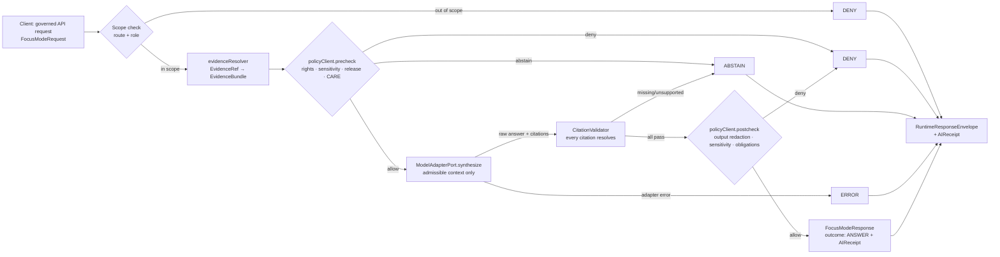
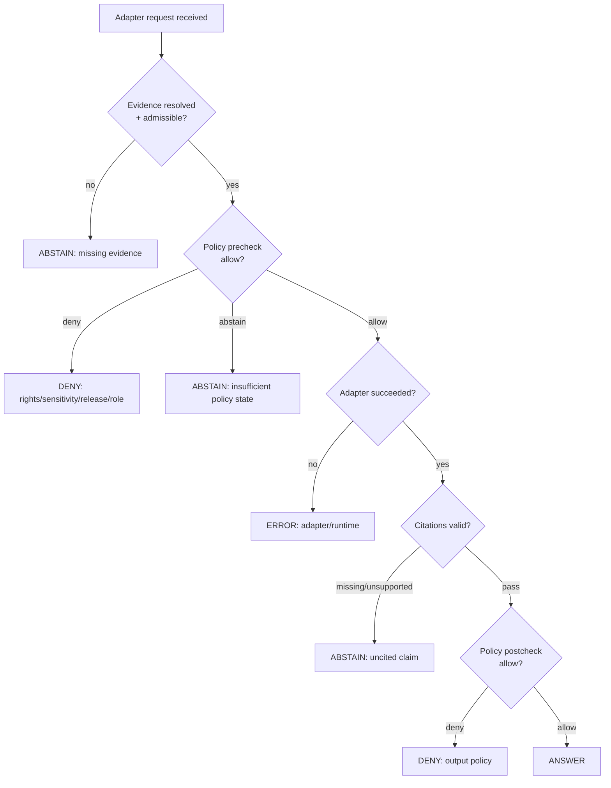

<!-- [KFM_META_BLOCK_V2]
doc_id: kfm://doc/NEEDS-VERIFICATION
title: Governed AI — Adapter Contract
type: standard
version: v1
status: draft
owners: OWNER_TBD (governed-AI subsystem owner + API steward + security steward)
created: NEEDS-VERIFICATION
updated: NEEDS-VERIFICATION
policy_label: public
related: [
  "docs/architecture/governed-ai/README.md",
  "docs/architecture/governed-ai/BOUNDARIES.md",
  "docs/architecture/governed-ai/FOCUS_FLOW.md",
  "docs/architecture/governed-ai/STATE_OWNERSHIP.md",
  "docs/runbooks/governed_ai_LOCAL_DEV.md",
  "docs/runbooks/governed_ai_VALIDATION.md",
  "docs/runbooks/governed_ai_ROLLBACK.md",
  "docs/adr/ADR-focus-model-adapter-boundary.md",
  "docs/doctrine/trust-membrane.md",
  "docs/doctrine/truth-posture.md",
  "contracts/OBJECT_MAP.md",
  "schemas/contracts/v1/focus/focus_request.schema.json",
  "schemas/contracts/v1/focus/focus_response.schema.json",
  "schemas/contracts/v1/focus/citation_validation_report.schema.json",
  "schemas/contracts/v1/ai/ai_receipt.schema.json",
  "schemas/contracts/v1/policy/policy_decision.schema.json",
  "schemas/contracts/v1/evidence/evidence_bundle.schema.json",
  "schemas/contracts/v1/runtime/runtime_response_envelope.schema.json"
]
tags: [kfm, governed-ai, adapter, focus-mode, evidence, policy, citations]
notes: [
  "doc_id, owners, dates are NEEDS-VERIFICATION pending repo + ownership inspection.",
  "All paths in `related` are PROPOSED per Directory Rules §0 until repo is mounted.",
  "All TypeScript-shaped surfaces below are illustrative PROPOSED contracts, not verified implementation."
]
[/KFM_META_BLOCK_V2] -->

# Governed AI — Adapter Contract

> The provider-neutral model boundary that keeps generated language **subordinate to evidence**, **subject to policy**, **fully cited**, and **finitely outcome-bound** — so AI can be useful inside KFM without becoming a sovereign truth source.

<p align="center">
  
  
  
  
  
  
</p>

> [!IMPORTANT]
> **Status:** PROPOSED contract / draft architecture doc
> **Owner:** `OWNER_TBD` — governed-AI subsystem owner, API steward, security steward
> **Truth posture:** CONFIRMED doctrine · PROPOSED implementation · UNKNOWN repo depth
> **Governing ADR:** `docs/adr/ADR-focus-model-adapter-boundary.md` (PROPOSED)

> [!NOTE]
> This document states KFM doctrine where supported by project sources. Specific file paths, route names, framework conventions, DTO field sets, package managers, CI behaviour, deployment posture, and any claim about *current implementation* remain **UNKNOWN** until the live repository, tests, workflows, and emitted artifacts are inspected. Treat illustrative TypeScript interfaces as **PROPOSED contracts**, not as verified code.

---

## Quick jumps

- [1. Purpose & scope](#1-purpose--scope)
- [2. Operating law](#2-operating-law)
- [3. End-to-end flow](#3-end-to-end-flow)
- [4. The `ModelAdapterPort` contract](#4-the-modeladapterport-contract)
- [5. Finite outcomes](#5-finite-outcomes)
- [6. Companion components](#6-companion-components)
- [7. Adapter variants](#7-adapter-variants)
- [8. Failure boundaries (fail-closed)](#8-failure-boundaries-fail-closed)
- [9. Receipts & audit](#9-receipts--audit)
- [10. Validation & tests](#10-validation--tests)
- [11. Rollback path](#11-rollback-path)
- [12. Verification checklist](#12-verification-checklist)
- [13. Evidence basis & limits](#13-evidence-basis--limits)
- [14. Related documents](#14-related-documents)
- [Appendix A — Illustrative payload sketches](#appendix-a--illustrative-payload-sketches)
- [Appendix B — Glossary](#appendix-b--glossary)

---

## 1. Purpose & scope

### 1.1 What this document is

The **Adapter Contract** specifies the boundary between the KFM governed-API and any model runtime (mock, local, hosted) that participates in interpretive workflows — most centrally **Focus Mode**, but also Story Node synthesis, Evidence Drawer enrichment, steward review aids, and bounded export language.

It defines:

1. The **provider-neutral interface** (`ModelAdapterPort`) every model adapter must satisfy.
2. The **request preconditions** (evidence resolved, policy prechecked, scope bounded) the adapter is allowed to receive.
3. The **response postconditions** (cited, policy-postchecked, finite outcome, receipted) the adapter must produce — or fail closed.
4. The **companion components** (`evidenceResolver`, `policyClient`, `CitationValidator`) that wrap the adapter on either side.
5. The **failure boundaries** that determine when the system MUST abstain, deny, or error.

### 1.2 What this document is *not*

- It is **not** a prompt-engineering guide.
- It is **not** a model-selection guide (no opinion on Ollama vs. OpenAI vs. local).
- It does **not** define field-level shape — those live in `schemas/contracts/v1/` (PROPOSED).
- It does **not** define admissibility — that lives in `policy/` (PROPOSED).

> [!CAUTION]
> If a future change weakens any of cite-or-abstain, fail-closed defaults, evidence subordination, policy postcheck, or receipt emission, it MUST be raised as an ADR — not patched into the adapter. The contract is the trust boundary; bending it silently is the highest-risk anti-pattern in §29 of the operating doctrine.

[Back to top](#governed-ai--adapter-contract)

---

## 2. Operating law

These statements are **CONFIRMED doctrine** (supported by the Whole-UI Governed AI Expansion Report, the Unified Implementation Architecture Build Manual, and the Master MapLibre Components report). Implementation of any specific file or route remains UNKNOWN.

### 2.1 Five invariants

| # | Invariant | Why it exists |
|---|---|---|
| L1 | **Evidence outranks generation.** `EvidenceBundle`, source authority, policy decision, review state, and release state outrank generated language. | Prevents fluent prose from substituting for inspectable claim support. |
| L2 | **No public browser-to-model path.** Public clients never call a model provider directly. All model traffic transits the governed API and the adapter port. | Preserves the trust membrane; concentrates policy enforcement on the server side. |
| L3 | **Cite-or-abstain.** Every consequential claim must resolve to one or more `EvidenceRef → EvidenceBundle`, validated by `CitationValidator`. Otherwise the outcome is `ABSTAIN`. | Default truth posture for KFM. |
| L4 | **Finite outcomes only.** Every adapter-mediated response is exactly one of `ANSWER`, `ABSTAIN`, `DENY`, `ERROR`. Free-form "best effort" responses are not permitted. | Forces explicit handling of insufficient evidence and policy denial in UI and exports. |
| L5 | **Receipted + reversible.** Every adapter invocation emits an `AIReceipt`; release-significant runs additionally emit a `RunReceipt`. Adapter activation is feature-flagged and rollback-able. | Auditability and reversibility per KFM change discipline. |

### 2.2 What the adapter is and is not

- The adapter is an **interpretive layer**, not a truth source.
- The adapter is a **port** (in the hexagonal-architecture sense): it isolates KFM's domain from any specific provider's interface and quirks, much as a downstream anticorruption layer protects the model from an upstream system. The KFM domain talks to `ModelAdapterPort`; concrete adapters translate to and from the provider.
- The adapter does **not** decide whether evidence is admissible. That is the `policyClient`.
- The adapter does **not** decide whether citations are valid. That is the `CitationValidator`.
- The adapter does **not** read RAW, WORK, QUARANTINE, canonical stores, unpublished candidates, vector indexes, graph stores, or credentials. (See §8.)

[Back to top](#governed-ai--adapter-contract)

---

## 3. End-to-end flow

A governed AI request — most commonly **Focus Mode** — follows a strict sequence. The adapter call is the narrow middle stage; everything before it enforces admissibility, everything after it enforces support.

### 3.1 Sequence



### 3.2 Stage responsibilities

| Stage | Component | Responsibility | Failure mode |
|---|---|---|---|
| 1 | governed API route | Authenticate, authorize, schema-validate the request | `DENY` (auth/scope) or `ERROR` (schema) |
| 2 | `evidenceResolver` | Resolve every supplied `EvidenceRef` to an `EvidenceBundle`; reject missing/stale | `ABSTAIN` (missing) or `ERROR` (lookup failure) |
| 3 | `policyClient.precheck` | Evaluate rights, sensitivity, release state, role, CARE labels against scope | `DENY` (policy) or `ABSTAIN` (insufficient state) |
| 4 | `ModelAdapterPort.synthesize` | Generate bounded answer + citation list over admissible context only | `ERROR` (provider/runtime) |
| 5 | `CitationValidator` | Verify every claim citation resolves and is admissible in scope | `ABSTAIN` (uncited/unsupported) |
| 6 | `policyClient.postcheck` | Re-check output against sensitivity, redaction, obligations | `DENY` (output policy) |
| 7 | Response assembly | Emit `RuntimeResponseEnvelope` + `AIReceipt` | — |

> [!TIP]
> The precheck/postcheck split exists because policy can apply to **the request** (e.g., role-gated layer access) *and* to **the output** (e.g., redacting a sensitive coordinate that ended up in a quoted paraphrase). Both gates are mandatory; neither subsumes the other.

[Back to top](#governed-ai--adapter-contract)

---

## 4. The `ModelAdapterPort` contract

### 4.1 Required surface (PROPOSED)

The illustrative TypeScript surface below is a **PROPOSED contract**. Field names and exact module location are subject to ADR confirmation and repo-convention verification.

```ts
// PROPOSED — schemas/contracts/v1/ai/model_adapter_port.schema.json
// PROPOSED home: apps/governed-api/src/ai/ModelAdapterPort.ts  (NEEDS VERIFICATION)

export interface ModelAdapterPort {
  /** Adapter identifier; appears in AIReceipt.model_provider. */
  readonly name: string;

  /** Adapter-declared capabilities. Used by the router to refuse incompatible requests early. */
  readonly capabilities: AdapterCapabilities;

  /**
   * Synthesize a bounded answer from admissible context only.
   *
   * The implementation MUST NOT:
   *   - read RAW / WORK / QUARANTINE / canonical stores
   *   - call out-of-band providers not declared in `capabilities.providers`
   *   - persist private chain-of-thought as truth
   *   - return free-form output (must conform to AdapterRawResponse)
   */
  synthesize(req: AdmissibleAdapterRequest): Promise<AdapterRawResponse>;
}

export interface AdmissibleAdapterRequest {
  /** Stable hash of resolved evidence + scope; used in AIReceipt. */
  readonly context_hash: string;

  /** Structured, policy-cleared evidence the model may cite. No raw store handles. */
  readonly admissible_evidence: ReadonlyArray<AdmissibleEvidenceFragment>;

  /** Bounded question and synthesis intent. */
  readonly task: AdapterTask;

  /** Hard caps the adapter MUST enforce or refuse. */
  readonly limits: AdapterLimits;

  /** Policy obligations carried forward from precheck (e.g., redaction profile). */
  readonly obligations: ReadonlyArray<PolicyObligation>;
}

export interface AdapterRawResponse {
  /** Adapter-internal outcome signal — translated by the API layer to the finite envelope. */
  readonly outcome_signal: "answer" | "abstain" | "error";

  /** Bounded answer text. Empty for abstain/error. */
  readonly answer_text: string;

  /** Citations the adapter claims support each answer span. CitationValidator decides validity. */
  readonly citations: ReadonlyArray<AdapterCitation>;

  /** Adapter-side reason if abstain/error. */
  readonly reason?: string;

  /** Adapter-side metadata for the AIReceipt (model id, temperature, token budgets). */
  readonly model_metadata: AdapterModelMetadata;
}
```

### 4.2 What the adapter MUST receive

| Field | Constraint | Why |
|---|---|---|
| `admissible_evidence` | Already resolved, rights-cleared, sensitivity-cleared, release-checked | Adapter never resolves evidence itself |
| `task` | Bounded scope; no open-ended "do anything" prompts | Keeps interpretive surface narrow |
| `limits` | Token, time, citation-density caps | Bounds runtime and prevents drift |
| `obligations` | Carried forward from `policyClient.precheck` | Postcheck must be able to verify obligations were respected |
| `context_hash` | Deterministic | Appears in `AIReceipt`; enables replay and drift detection |

### 4.3 What the adapter MUST NOT receive

- Raw `EvidenceRef` strings without a resolved bundle.
- Source pointers to RAW / WORK / QUARANTINE / canonical stores.
- Credentials, secrets, or service handles to internal infrastructure.
- Restricted geometry at original precision (must be generalized upstream where policy requires).
- Living-person PII unless an explicit, audited internal workflow allows it.
- Any field whose sensitivity label has not been cleared by precheck.

### 4.4 What the adapter MUST emit

- Exactly one `outcome_signal`.
- Either a cited `answer_text` (for `answer`) or a structured `reason` (for `abstain` / `error`).
- A `citations` list whose every entry the `CitationValidator` can decide on — *not* prose footnotes.
- `model_metadata` sufficient to populate `AIReceipt` without exposing private chain-of-thought.

### 4.5 What the adapter MUST NOT emit

- Free-form answers without `citations`.
- Coordinates, names, or attributes flagged as sensitive upstream.
- Speculation framed as fact.
- Private chain-of-thought, scratchpad reasoning, or intermediate prompts as part of the response payload.
- Any field not declared in `AdapterRawResponse`.

[Back to top](#governed-ai--adapter-contract)

---

## 5. Finite outcomes

The API layer translates `AdapterRawResponse.outcome_signal` and the surrounding gate decisions into one of four finite outcomes carried by `FocusModeResponse` / `RuntimeResponseEnvelope`.

| Outcome | When | Required fields | UI surface |
|---|---|---|---|
| `ANSWER` | Evidence resolved, precheck allow, adapter `answer`, all citations valid, postcheck allow | `answer`, `citations[]`, `evidence_used[]`, `policy_decisions[]`, `ai_receipt_id` | Cited answer with Evidence Drawer links |
| `ABSTAIN` | Missing/unsupported citations, insufficient evidence, or precheck `abstain` | `abstain_reason`, `policy_decisions[]`, `ai_receipt_id` | Plain-language "cannot answer with current evidence" + suggested next step |
| `DENY` | Precheck or postcheck `deny` (rights, sensitivity, release, role) | `deny_reason`, `policy_decisions[]`, `ai_receipt_id` | Plain-language policy explanation, never the denied content |
| `ERROR` | Schema invalid, resolver failure, adapter crash, infra failure | `error_class`, `ai_receipt_id` (best effort) | Generic operator message + correlation id |

> [!WARNING]
> `ABSTAIN` is not a softer `ANSWER`. The UI MUST NOT silently fall back to a partial uncited answer when the validator finds an unsupported claim. Doing so collapses cite-or-abstain.

[Back to top](#governed-ai--adapter-contract)

---

## 6. Companion components

The adapter is only one of five components in the contract. The others enforce the conditions that make a generated answer admissible.

### 6.1 `evidenceResolver`

- **PROPOSED home:** `apps/governed-api/src/evidence/evidenceResolver.ts` (path NEEDS VERIFICATION; framework convention may rename).
- **Responsibility:** Take an `EvidenceRef` (or list) and return a resolved `EvidenceBundle` (or list) with `spec_hash`, source roles, rights status, sensitivity, limitations, and receipts.
- **Boundary:** Never returns RAW source bytes; never exposes canonical-store paths to the adapter.
- **Failure modes:** missing → `ABSTAIN`; stale beyond cadence → `ABSTAIN` or `DENY` per policy; lookup error → `ERROR`.

### 6.2 `policyClient`

- **PROPOSED home:** `apps/governed-api/src/policy/policyClient.ts` (NEEDS VERIFICATION).
- **Responsibility:** Two-call wrapper — `precheck(scope, evidence)` and `postcheck(scope, output)` — returning `PolicyDecision` objects with finite `outcome`, `reasons`, and `obligations`.
- **Boundary:** Does not itself synthesize; does not relax sensitivity to make a hard question easier.
- **Failure modes:** deny → `DENY`; insufficient state → `ABSTAIN`; engine error → `ERROR`.

### 6.3 `CitationValidator`

- **PROPOSED home:** `apps/governed-api/src/ai/CitationValidator.ts` (NEEDS VERIFICATION).
- **Responsibility:** For every citation the adapter returns, confirm the cited `EvidenceRef` resolves to an admissible `EvidenceBundle` *within the request scope*, and that the cited span actually supports the claim it is attached to. Emits `CitationValidationReport` with `resolved`, `missing`, `unsupported`, `verdict`.
- **Boundary:** Does not edit the answer. Either the validator passes and the API surfaces `ANSWER`, or it fails and the API surfaces `ABSTAIN` with reasons.
- **Failure modes:** any missing/unsupported → `ABSTAIN`.

### 6.4 `MockAdapter`

- **PROPOSED home:** `apps/governed-api/src/ai/MockAdapter.ts` (NEEDS VERIFICATION).
- **Responsibility:** Deterministic, fixture-backed adapter for local development, contract tests, and negative-state tests. It exists so the contract is testable **before** a live provider is admitted.
- **Boundary:** Never makes network calls; never reads real data stores; outputs are marked with obvious mock markers per `tests/fixtures/ui/README.md` (PROPOSED).

> [!NOTE]
> The MockAdapter is not optional infrastructure. It is **prerequisite** for accepting any provider adapter, because negative-state tests (`DENY`, `ABSTAIN`, `ERROR`) require deterministic outputs that real providers cannot guarantee.

[Back to top](#governed-ai--adapter-contract)

---

## 7. Adapter variants

### 7.1 Provided / planned variants

| Variant | Status | Purpose | Activation gate |
|---|---|---|---|
| `MockAdapter` | PROPOSED — required first | Tests, fixtures, local dev | Schema + contract tests pass |
| Local-model adapter (e.g., Ollama) | DEFERRED | Local or privately hosted runtime behind the same port | MockAdapter green; security review; deployment evidence verified |
| Hosted-provider adapter (e.g., OpenAI) | DEFERRED | Hosted runtime behind the same port | MockAdapter green; security review; rights/sensitivity review; rate-limit and egress policy verified |

### 7.2 Adding a new adapter

A new adapter MUST:

1. Implement `ModelAdapterPort` without widening it.
2. Pass the full contract test suite (`tests/fixtures/focus/*` — PROPOSED — including positive, ABSTAIN, DENY, and ERROR fixtures).
3. Be feature-flagged off by default.
4. Be registered in `contracts/OBJECT_MAP.md` (PROPOSED).
5. Be accompanied by an ADR if it introduces a new capability class (e.g., tool-use, multimodal input).

A new adapter MUST NOT:

- Add side channels (logging prompt text, evidence content, or user identifiers to a third party).
- Widen `AdmissibleAdapterRequest` to bypass `policyClient.precheck`.
- Return outcomes outside the `AdapterRawResponse` shape.
- Become the default before MockAdapter and at least one negative-state test suite are green.

[Back to top](#governed-ai--adapter-contract)

---

## 8. Failure boundaries (fail-closed)

The adapter contract is designed so that **every uncertainty resolves toward denial or abstention**, never toward a fluent but unsupported answer.



### 8.1 Hard fail-closed rules

| Condition | Outcome | Note |
|---|---|---|
| `EvidenceRef` cannot be resolved | `ABSTAIN` | Never substitute a "best guess" without evidence. |
| Evidence is stale beyond declared cadence | `ABSTAIN` or `DENY` per policy | Stale badges are not a license to answer authoritatively. |
| Sensitivity label includes restricted location / living person / DNA / archaeology / infrastructure at precise resolution | `DENY` or generalized response per policy | Style filters alone are NOT a sensitivity control. |
| Output contains a sensitive coordinate not present in admissible evidence | `DENY` (postcheck) | Catches adapter hallucination of precise coordinates. |
| Adapter returns no citations for a load-bearing claim | `ABSTAIN` | Cite-or-abstain. |
| Adapter exceeds `limits` (tokens, time, citation density) | `ERROR` | Surface to operator; do not silently truncate cited content. |
| Provider returns 5xx, timeout, or schema violation | `ERROR` | Never coerce into `ANSWER`. |
| Auth/role check fails | `DENY` | Before evidence resolution. |

### 8.2 What MUST NOT happen

- Browser fetch of a model endpoint directly.
- A "demo mode" that bypasses `policyClient`.
- A debug toggle that returns raw chain-of-thought to clients.
- A fallback path that downgrades `ABSTAIN` to `ANSWER` because the UI looks emptier without prose.
- A logging path that ships prompt text, raw evidence, or restricted geometry to telemetry.

[Back to top](#governed-ai--adapter-contract)

---

## 9. Receipts & audit

Every adapter invocation produces an `AIReceipt`. Receipts are **process memory**, not release proof — they live under `data/receipts/` (PROPOSED), separate from `data/proofs/` and `release/`.

### 9.1 `AIReceipt` minimum fields

| Field | Purpose |
|---|---|
| `receipt_id` | Stable, addressable id |
| `model_provider`, `model_id` | From `AdapterCapabilities` + `AdapterModelMetadata` |
| `context_hash` | From `AdmissibleAdapterRequest` |
| `evidence_ids` | Resolved bundle ids (not raw refs) |
| `citation_report_id` | Pointer to the `CitationValidationReport` |
| `policy_ids` | Pointers to `PolicyDecision` for precheck and postcheck |
| `runtime` | Token budget actual/limit, latency, adapter version |
| `outcome` | One of `ANSWER` / `ABSTAIN` / `DENY` / `ERROR` |

### 9.2 What receipts MUST NOT contain

- Prompt text.
- Raw evidence content.
- Restricted geometry.
- Secrets.
- Private chain-of-thought.
- Full `EvidenceBundle` copies (use ids).

> [!IMPORTANT]
> Telemetry derived from receipts is safe by construction only if the schema enforces these exclusions. Adapter authors do not get to "add a useful field" without an ADR.

[Back to top](#governed-ai--adapter-contract)

---

## 10. Validation & tests

### 10.1 Required test families (PROPOSED)

| Family | Lives in (PROPOSED) | Must include |
|---|---|---|
| Schema validation | `tests/contracts/ai/` | `FocusModeRequest`, `FocusModeResponse`, `AIReceipt`, `CitationValidationReport`, `PolicyDecision`, `ModelAdapterPort` capability descriptor |
| MockAdapter contract | `tests/fixtures/focus/` | Positive `ANSWER` fixture |
| Negative-state — abstain | `tests/fixtures/focus/abstain_*` | Missing evidence, uncited claim, stale source |
| Negative-state — deny | `tests/fixtures/focus/deny_*` | Sensitivity, rights, release, role |
| Negative-state — error | `tests/fixtures/focus/error_*` | Adapter timeout, provider 5xx, schema violation |
| Postcheck redaction | `tests/policy/postcheck/` | Output contains sensitive coordinate; postcheck denies |
| Receipt minimality | `tests/contracts/ai/receipt_*` | Receipt MUST NOT contain prompt text or raw evidence |

### 10.2 Definition of done for this contract

- [ ] `ModelAdapterPort` schema published under `schemas/contracts/v1/ai/` (PROPOSED home).
- [ ] `MockAdapter` implementation + fixtures committed.
- [ ] Positive + at least one fixture per negative outcome (`ABSTAIN`, `DENY`, `ERROR`) passing in CI.
- [ ] `policyClient.precheck` and `policyClient.postcheck` wired and tested.
- [ ] `CitationValidator` wired with at least one `missing` and one `unsupported` negative fixture.
- [ ] `AIReceipt` emission tested for all four outcomes.
- [ ] Feature flag verified `off` by default.
- [ ] ADR `ADR-focus-model-adapter-boundary.md` accepted.

[Back to top](#governed-ai--adapter-contract)

---

## 11. Rollback path

The adapter is **always** behind a feature flag. Rollback is a flag flip plus, if needed, a PR revert. Schema rollback follows separate discipline because schemas can be depended on by other contracts.

| Failure type | Rollback action | Notes |
|---|---|---|
| Adapter regression | Flip Focus feature flag off | Evidence Drawer and layer browsing remain intact |
| New provider adapter regression | Swap adapter binding back to `MockAdapter` | Port unchanged |
| Schema breakage in `AIReceipt` / `FocusModeResponse` | Revert PR before published schemas are depended on; if released, deprecate with versioned successor | Never silent delete |
| Policy postcheck false-deny storm | Re-enable previous policy bundle; keep adapter off until reviewed | Fail closed is acceptable during rollback |
| Telemetry leak (prompt text or evidence in logs) | Flip flag off immediately; rotate any exposed credentials; treat as incident | See `docs/security/` (PROPOSED) |

**Rollback target:** `ROLLBACK_TARGET_TBD` — populated when the first release manifest references this contract.

[Back to top](#governed-ai--adapter-contract)

---

## 12. Verification checklist

Before this document leaves `draft`:

- [ ] Confirm the canonical home for adapter source (e.g., `apps/governed-api/src/ai/`) against mounted repo evidence and record the result in this doc.
- [ ] Confirm the canonical home for `ModelAdapterPort` schema under `schemas/contracts/v1/ai/` per ADR-0001.
- [ ] Confirm the path of `policyClient`, `evidenceResolver`, `CitationValidator` (these are PROPOSED here).
- [ ] Confirm the four finite-outcome wire names match `RuntimeResponseEnvelope` and any UI consumers.
- [ ] Confirm `AIReceipt` field set against `schemas/contracts/v1/ai/ai_receipt.schema.json`.
- [ ] Confirm `CitationValidationReport` field set against `schemas/contracts/v1/focus/citation_validation_report.schema.json`.
- [ ] Confirm at least one negative-state fixture exists for each of `ABSTAIN`, `DENY`, `ERROR`.
- [ ] Confirm feature-flag default is `off` and is enforced in CI.
- [ ] Confirm receipt minimality (no prompt text, no raw evidence) is enforced by schema, not by hope.
- [ ] Confirm rollback drill has been executed at least once.
- [ ] Confirm `ADR-focus-model-adapter-boundary.md` is `accepted`, not `proposed`.
- [ ] Confirm `OWNER_TBD` resolved in CODEOWNERS and in the meta block.

[Back to top](#governed-ai--adapter-contract)

---

## 13. Evidence basis & limits

### 13.1 What is supported

| Claim | Evidence | Status |
|---|---|---|
| Adapter must be provider-neutral | KFM Whole-UI Governed AI Expansion Report, §§ adapter ladder + adapter rollback | CONFIRMED doctrine |
| Cite-or-abstain is the truth posture | KFM core invariants; Operating Doctrine §6 (Core Invariants) | CONFIRMED doctrine |
| Finite outcomes `ANSWER` / `ABSTAIN` / `DENY` / `ERROR` | Whole-UI Report (FocusModeResponse), Master MapLibre Object Map | CONFIRMED doctrine |
| Precheck + postcheck policy split | Master MapLibre Object Map; Build Manual §AI request flow | CONFIRMED doctrine |
| MockAdapter prerequisite to provider adapter | Build Manual UIAI-GAI / UIAI-OLLAMA reconciliation note | CONFIRMED doctrine |
| AIReceipt minimality (no prompt text, no raw evidence) | Whole-UI Report §25 security/policy boundary notes | CONFIRMED doctrine |
| `docs/architecture/governed-ai/*` path family | Whole-UI Report §11; Directory Rules §6.1 | PROPOSED — path family supported by doctrine; specific filenames PROPOSED |

### 13.2 What is not supported in current session

| Claim | Status |
|---|---|
| `apps/governed-api/src/ai/ModelAdapterPort.ts` exists | UNKNOWN — repo not mounted |
| Framework / runtime / package manager of `apps/governed-api/` | UNKNOWN |
| Route names for Focus Mode | UNKNOWN |
| Field names in the live `FocusModeRequest` / `FocusModeResponse` | UNKNOWN — schema files not inspected this session |
| CI workflows that gate this contract | UNKNOWN |
| Whether `policyClient` is currently a wrapper around OPA, custom engine, or other | UNKNOWN |
| Whether any provider adapter has been admitted | UNKNOWN |

### 13.3 What this doc does **not** claim

- It does not claim the contract is implemented.
- It does not claim any specific framework, ORM, or model runtime.
- It does not claim policy enforcement is live in CI.
- It does not endorse any provider; the contract is provider-neutral by design.

[Back to top](#governed-ai--adapter-contract)

---

## 14. Related documents

- `docs/architecture/governed-ai/README.md` — subsystem overview (PROPOSED).
- `docs/architecture/governed-ai/BOUNDARIES.md` — what must not cross the membrane (PROPOSED).
- `docs/architecture/governed-ai/FOCUS_FLOW.md` — request-by-request walkthrough (PROPOSED).
- `docs/architecture/governed-ai/STATE_OWNERSHIP.md` — where each piece of runtime state lives (PROPOSED).
- `docs/adr/ADR-focus-model-adapter-boundary.md` — the governing ADR (PROPOSED).
- `docs/runbooks/governed_ai_LOCAL_DEV.md` — MockAdapter and local dev (PROPOSED).
- `docs/runbooks/governed_ai_VALIDATION.md` — Focus validation runbook (PROPOSED).
- `docs/runbooks/governed_ai_ROLLBACK.md` — kill switch and rollback (PROPOSED).
- `docs/doctrine/trust-membrane.md` — RAW → … → PUBLISHED invariant (PROPOSED).
- `docs/doctrine/truth-posture.md` — cite-or-abstain (PROPOSED).
- `contracts/OBJECT_MAP.md` — object families ↔ schemas ↔ fixtures crosswalk (PROPOSED).
- `schemas/contracts/v1/ai/*.schema.json` — executable shape (PROPOSED).
- `schemas/contracts/v1/focus/*.schema.json` — Focus Mode schemas (PROPOSED).
- `schemas/contracts/v1/policy/policy_decision.schema.json` — `PolicyDecision` (PROPOSED).
- `schemas/contracts/v1/evidence/evidence_bundle.schema.json` — `EvidenceBundle` (PROPOSED).

[Back to top](#governed-ai--adapter-contract)

---

## Appendix A — Illustrative payload sketches

<details>
<summary><strong>A.1 — Illustrative <code>FocusModeRequest</code> (PROPOSED shape)</strong></summary>

````json
{
  "request_id": "req_01H...",
  "question": "What evidence supports the reroute of the Santa Fe Trail through this section after 1859?",
  "scope": {
    "domain": "roads-rail-trade",
    "role": "public"
  },
  "map_context_envelope": {
    "visible_layers": ["layer_santa_fe_trail_v3"],
    "bounds": [[-100.1, 37.9], [-99.4, 38.4]],
    "zoom": 9,
    "time_window": { "from": "1855-01-01", "to": "1870-12-31" },
    "selected_features": ["feat_sft_seg_412"]
  },
  "evidence_refs": [
    "evref:bundle/sft-reroute-1859/v3",
    "evref:bundle/gnis-station-corridor/v1"
  ],
  "policy_context": { "release_state": "published" },
  "user_role": "public"
}
````

</details>

<details>
<summary><strong>A.2 — Illustrative <code>FocusModeResponse</code> — <code>ANSWER</code> (PROPOSED shape)</strong></summary>

````json
{
  "outcome": "ANSWER",
  "answer": "Survey and post-office records cited below indicate a corridor shift north of the river after 1859 (paraphrased; see citations).",
  "citations": [
    {
      "span": [0, 102],
      "evidence_ref": "evref:bundle/sft-reroute-1859/v3",
      "claim_id": "claim_corridor_shift_1859"
    }
  ],
  "evidence_used": [
    "evref:bundle/sft-reroute-1859/v3",
    "evref:bundle/gnis-station-corridor/v1"
  ],
  "policy_decisions": ["pd_precheck_01H...", "pd_postcheck_01H..."],
  "ai_receipt_id": "rcpt_01H..."
}
````

</details>

<details>
<summary><strong>A.3 — Illustrative <code>FocusModeResponse</code> — <code>ABSTAIN</code> (PROPOSED shape)</strong></summary>

````json
{
  "outcome": "ABSTAIN",
  "abstain_reason": {
    "code": "uncited_claim",
    "message": "Citation validator could not resolve one or more claims to admissible evidence."
  },
  "citation_report_id": "crv_01H...",
  "policy_decisions": ["pd_precheck_01H..."],
  "ai_receipt_id": "rcpt_01H..."
}
````

</details>

<details>
<summary><strong>A.4 — Illustrative <code>AIReceipt</code> (PROPOSED shape)</strong></summary>

````json
{
  "receipt_id": "rcpt_01H...",
  "model_provider": "mock",
  "model_id": "mock-1",
  "context_hash": "ctx_sha256:9f1a...",
  "evidence_ids": [
    "bundle/sft-reroute-1859/v3",
    "bundle/gnis-station-corridor/v1"
  ],
  "citation_report_id": "crv_01H...",
  "policy_ids": ["pd_precheck_01H...", "pd_postcheck_01H..."],
  "runtime": {
    "adapter_version": "MockAdapter@0.1.0",
    "tokens_used": 412,
    "tokens_limit": 2048,
    "latency_ms": 17
  },
  "outcome": "ANSWER"
}
````

</details>

[Back to top](#governed-ai--adapter-contract)

---

## Appendix B — Glossary

<details>
<summary>Expand glossary</summary>

| Term | Meaning |
|---|---|
| **Adapter** | Implementation of `ModelAdapterPort` that wraps a specific model runtime. |
| **Admissible evidence** | An `EvidenceBundle` that has passed `evidenceResolver` and `policyClient.precheck` for the current scope. |
| **`AIReceipt`** | Audit object recording a single adapter invocation without exposing private chain-of-thought. Process memory; lives under `data/receipts/` (PROPOSED). |
| **`CitationValidationReport`** | Pass/fail closure object proving every cited `EvidenceRef` resolves and is admissible. |
| **Cite-or-abstain** | KFM default truth posture: a consequential claim either resolves to admissible evidence or the outcome is `ABSTAIN`. |
| **`EvidenceBundle`** | Truth-bearing evidence object with `bundle_id`, `source_refs`, `claims`, `citations`, `spec_hash`, `rights_status`, `sensitivity`, `limitations`, `receipts`. Outranks generated language. |
| **`EvidenceRef`** | Pointer that resolves to an `EvidenceBundle` via `evidenceResolver`. |
| **Fail closed** | Default behavior when state is uncertain: deny, abstain, or error — never silently approximate. |
| **Finite outcomes** | The four allowed outcome labels: `ANSWER`, `ABSTAIN`, `DENY`, `ERROR`. |
| **`ModelAdapterPort`** | The provider-neutral interface every model adapter implements. |
| **`PolicyDecision`** | Output of `policyClient` carrying `outcome`, `reasons`, `obligations`. |
| **Postcheck** | Policy evaluation applied to the *adapter output* before it leaves the API. |
| **Precheck** | Policy evaluation applied to the *request + admissible evidence* before the adapter is called. |
| **`PromotionDecision`** | Governed state transition that releases a candidate; not part of the adapter call but referenced by downstream release manifests. |
| **`RunReceipt`** | Build/run receipt for pipelines and tile generation; distinct from `AIReceipt`. |
| **`RuntimeResponseEnvelope`** | Common governed response wrapper carrying finite outcome, reasons, obligations, and audit references. |
| **`spec_hash`** | Deterministic hash of an `EvidenceBundle`'s claim/evidence content; appears in receipts for drift detection. |
| **Trust membrane** | The lifecycle invariant `RAW → WORK / QUARANTINE → PROCESSED → CATALOG / TRIPLET → PUBLISHED`. Adapters operate only on `PUBLISHED` or governed-access subsets. |

</details>

[Back to top](#governed-ai--adapter-contract)
