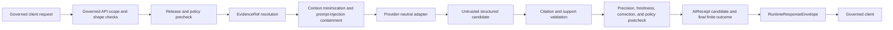

<!-- [KFM_META_BLOCK_V2]
doc_id: kfm://doc/architecture-governed-ai-adapter-contract
title: Governed AI — Adapter Contract
type: architecture-standard
version: v1.1
status: draft; repository-grounded; decision-proposed; bounded-proof-only; non-authoritative
owners:
  - "@bartytime4life — verified CODEOWNERS review route"
  - "NEEDS VERIFICATION — governed-AI, Governed API, runtime, evidence, policy, citation, security, contracts, schemas, validation, correction, and release reviewers"
created: 2026-05-14
updated: 2026-08-19
policy_label: public
owning_root: docs/
responsibility: Explain the current bounded model-adapter proof, the proposed provider-neutral production seam, and the authority boundaries that keep evidence, policy, citations, receipts, finite envelopes, release, correction, and rollback outside provider control.
truth_posture: CONFIRMED current repository evidence / PROPOSED target adapter seam / UNKNOWN live provider, composed runtime, deployment, and release
repository: bartytime4life/Kansas-Frontier-Matrix
base_commit: 59fd6dff1a2015fac08fc1ccd8206433f09f2013
target_prior_blob: d76a32bab4f44186d04881806944fe24f720ca68
directory_rules_blob: fd49a0b83e55cef52c1124281f093e263526898d
adr_0029_blob: a4de0d7a96b78da59cfc499d1025e1508afd8dd9
adr_0019_blob: 5c45cbaf0aae510638088913757634ea978c9ec3
runtime_adapter_note_blob: e371e5ca008ecbd0775bea9c2a31ef76131e7575
mock_adapter_blob: 04d37e59b14c9e3b85126cb3380b6221b44e26d1
mock_adapter_test_blob: be1b1d2b4178b30ce9be754671a2c42271ad91bc
runtime_response_schema_blob: 8b86e7db8b18b65a56a4e639dfc54e1b2db93155
ai_receipt_validator_blob: eb80e77aed15f478c32215c8f773f308a87a092a
inspection_boundary: Current-session GitHub reads covered the complete prior page, accepted Directory Rules, relevant ADR proposals, runtime model-adapter files, finite-envelope contracts and schemas, focused proof tests, Focus scaffolds, Governed API route inventory, AIReceipt validation, CODEOWNERS, and the bounded Focus workflow. No model daemon, provider endpoint, credential, live evidence resolver, active policy evaluator, citation service, receipt store, deployed AI route, public client session, correction flow, rollback drill, release environment, or publication path was exercised.
related:
  - README.md
  - BOUNDARIES.md
  - FOCUS_FLOW.md
  - MOCK_FIRST.md
  - AI_RECEIPTS.md
  - OLLAMA_INTEGRATION.md
  - ../../adr/ADR-0019-ai-adapter-contract-and-finite-envelopes.md
  - ../../adr/ADR-focus-model-adapter-boundary.md
  - ../../adr/ADR-0029-adopt-directory-governance-standard-v2.md
  - ../../doctrine/directory-rules.md
  - ../../../runtime/model_adapters/README.md
  - ../../../runtime/model_adapters/AdapterContract.md
  - ../../../runtime/model_adapters/MockAdapter.py
  - ../../../runtime/model_adapters/OllamaAdapter.py
  - ../../../contracts/runtime/runtime_response_envelope.md
  - ../../../contracts/runtime/ai_receipt.md
  - ../../../schemas/contracts/v1/runtime/runtime_response_envelope.schema.json
  - ../../../schemas/contracts/v1/runtime/ai_receipt.schema.json
  - ../../../schemas/contracts/v1/focus/focus_request.schema.json
  - ../../../schemas/contracts/v1/focus/focus_response.schema.json
  - ../../../schemas/contracts/v1/focus/runtime_response_envelope.schema.json
  - ../../../tools/validators/validate_runtime_response_envelope.py
  - ../../../tools/validators/validate_ai_receipt.py
  - ../../../tools/validators/ai/evidence_before_model/README.md
  - ../../../tests/runtime_proof/test_mock_adapter_finite_outcomes.py
  - ../../../.github/workflows/focus-mock-test.yml
notes:
  - "This same-path revision changes documentation and its generated authoring receipt only."
  - "ADR-0019 and the Focus-specific adapter-boundary candidate remain proposed; this page does not accept either decision."
  - "The executable MockAdapter selects prevalidated complete synthetic envelopes for tests; it is not the proposed production candidate-generating adapter."
  - "No provider, model, AI route, runtime policy, release, deployment, source activation, publication, or repository setting is authorized by this page."
[/KFM_META_BLOCK_V2] -->

<a id="top"></a>

# Governed AI — Adapter Contract

> **Operating boundary.** KFM may use a model only inside governed orchestration. Evidence resolution, policy, citation validation, precision and freshness checks, receipt assembly, finite-outcome selection, client-envelope construction, release, correction, and rollback remain outside provider control.

[](#status-and-authority)
[](#directory-rules-basis)
[](#current-bounded-proof)
[](#target-production-seam)
[](#7-adapter-variants)
[](#status-and-authority)

> [!IMPORTANT]
> **This page is architecture documentation, not the canonical semantic contract or machine schema.** ADR-0019 and the Focus-specific adapter-boundary candidate remain proposed. `contracts/` owns accepted meaning, `schemas/` owns machine shape, `policy/` owns admissibility, runtime code owns execution, and release objects own public-use decisions.

> [!CAUTION]
> **The current `MockAdapter` is not the proposed production adapter.** It deep-copies one of four prevalidated synthetic `RuntimeResponseEnvelope` fixtures. It does not interpret a request, resolve evidence, evaluate policy, validate citations, call a model, choose an outcome semantically, or emit an `AIReceipt`.

> [!WARNING]
> **No direct browser-to-model path is permitted.** Current repository evidence does not show an AI-mediated Governed API route, an admitted provider, active composed runtime policy, or a released public AI operation.

**Quick navigation:** [Status](#status-and-authority) · [Purpose](#1-purpose--scope) · [Operating law](#2-operating-law) · [Flow](#3-end-to-end-flow) · [Port](#4-the-modeladapterport-contract) · [Outcomes](#5-finite-outcomes) · [Companions](#6-companion-components) · [Variants](#7-adapter-variants) · [Failures](#8-failure-boundaries-fail-closed) · [Receipts](#9-receipts--audit) · [Tests](#10-validation--tests) · [Rollback](#11-rollback-path) · [Checklist](#12-verification-checklist) · [Evidence](#13-evidence-basis--limits) · [Related](#14-related-documents) · [Payloads](#appendix-a--illustrative-payload-sketches) · [Glossary](#appendix-b--glossary)

---

## Status and authority

| Question | Current evidence-backed answer |
|---|---|
| Is this a tracked architecture document? | **CONFIRMED.** The target has existed at this path since at least the 2026-05-14 repository commit that expanded it. |
| Is this path allowed? | **CONFIRMED.** Accepted ADR-0029 adopts Directory Rules v2; a same-path human architecture explanation receives `PLACE`. |
| Is this page the semantic adapter contract? | **No.** It explains the seam and current proof. Accepted semantic meaning would belong under `contracts/`. |
| Is there an accepted adapter-boundary ADR? | **No.** ADR-0019 remains `proposed`; the Focus-specific candidate remains unassigned and `not-assigned`. |
| Is there executable adapter proof? | **Yes, bounded.** `MockAdapter.py` plus focused tests prove deterministic, no-I/O selection of complete synthetic envelopes covering four outcomes. |
| Is there a production model adapter? | **No verified implementation.** `OllamaAdapter.py` is a one-line placeholder and no other admitted provider implementation was established. |
| Is there a governed AI API route? | **No verified route.** The inspected Governed API route inventory contains bootstrap, layers, evidence, and registry surfaces, not a Focus/model route. |
| Is the final client envelope machine-shaped? | **Yes, proposed profile.** The current `RuntimeResponseEnvelope` schema is closed, finite, fixture-backed, and locally validated. |
| Is receipt shape locally validated? | **Yes, bounded.** `validate_ai_receipt.py` checks proposed `AIReceipt` shape and local consistency only; runtime emission and persistence are not established. |
| Does this change release or publish anything? | **No.** Documentation and its authoring receipt have no runtime, provider-admission, release, deployment, or publication effect. |

### Directory Rules basis

Accepted [ADR-0029](../../adr/ADR-0029-adopt-directory-governance-standard-v2.md) adopts [Directory Rules v2](../../doctrine/directory-rules.md). The existing path belongs under `docs/` because it explains architecture to humans without owning contract meaning, machine shape, policy, code, data, receipts, or release state.

| Responsibility | Owning surface | This page may do |
|---|---|---|
| Human architecture explanation | `docs/architecture/governed-ai/` | Explain current evidence, proposal lineage, boundaries, risks, and verification gates. |
| Semantic meaning and compatibility | `contracts/` | Link to and summarize; never redefine silently. |
| Machine grammar | `schemas/` | Describe current fields; never create a second envelope shape. |
| Admissibility and access | `policy/` | State required gates; never claim a policy decision occurred. |
| Provider/runtime execution | `runtime/`, `apps/`, and approved packages | Record current maturity and target seam. |
| Fixtures, tests, validators, CI | `fixtures/`, `tests/`, `tools/`, `.github/` | Cite bounded proof and remaining gaps. |
| Receipts and proofs | governed `data/` families | Require accountable linkage without treating receipts as truth. |
| Release, correction, rollback | their distinct governed families | Preserve separation and fail closed. |

[Back to top](#top)

---

## 1. Purpose & scope

### 1.1 Purpose

This page defines the **architecture boundary** between governed KFM orchestration and any mock, local, or hosted model runtime. Its job is to keep provider behavior replaceable and untrusted while preserving KFM's evidence, policy, finite-outcome, correction, and release controls.

It distinguishes four objects that must not collapse:

1. a caller-facing request submitted through a governed client;
2. an internal, minimized request prepared after pre-model gates;
3. an untrusted structured candidate returned by an adapter; and
4. the final governed `RuntimeResponseEnvelope` returned to a client.

### 1.2 In scope

- current bounded `MockAdapter` behavior and proof limits;
- the proposed provider-neutral production seam;
- allowed and forbidden adapter inputs and outputs;
- ownership of evidence, policy, citations, receipts, outcomes, envelopes, and provider admission;
- finite failures and safe diagnostics;
- validation, graduation, rollback, and open HOLDs.

### 1.3 Out of scope

This page does not:

- accept ADR-0019 or assign/accept the Focus-specific ADR candidate;
- define the final field-level `AdmissibleAdapterRequest` or adapter-candidate schema;
- admit Ollama, OpenAI, or any other provider/model/profile;
- implement an evidence resolver, policy engine, citation service, adapter, API route, or worker;
- authorize credentials, live network calls, source access, deployment, or publication;
- make generated language evidence, policy, review, release, correction, or rollback authority.

[Back to top](#top)

---

## 2. Operating law

### 2.1 Non-negotiable invariants

| Invariant | Required behavior | Failure posture |
|---|---|---|
| Evidence outranks generation | Consequential claims depend on resolvable evidence; generated text is interpretive only. | `ABSTAIN` when support cannot be resolved. |
| Governed API is the trust membrane | Public and ordinary UI clients do not call providers directly or receive raw provider streams. | `DENY` direct-client/provider paths. |
| Evidence before model | Scope, release state, EvidenceRef resolution, rights, sensitivity, and policy precheck occur before provider invocation. | `ABSTAIN`, `DENY`, `HOLD`, or `ERROR`; never call the model optimistically. |
| Candidate, not authority | A provider returns an untrusted structured candidate. It does not decide evidence sufficiency, policy, citations, public outcome, or release. | Reject out-of-contract output. |
| Citation and policy after model | Answer-like candidates undergo citation validation, precision/freshness review, and policy postcheck. | Downgrade to `ABSTAIN` or `DENY`; use `ERROR` for operational failure. |
| Finite client outcomes | The governed caller emits exactly `ANSWER`, `ABSTAIN`, `DENY`, or `ERROR`. | No free-form fifth state. |
| Receipted accountability | AI-mediated runs bind adapter/model identity, input/output digests, policy and citation references, and outcome where the receipt profile applies. | Fail closed when a required receipt cannot be assembled. |
| Reversible admission | Provider configuration, route activation, and public use remain separately reviewable and disable-able. | Remove or disable the exact provider/profile without weakening the envelope. |

### 2.2 Authority split

The provider-neutral adapter is an **anticorruption boundary**, not a new authority root. It translates between KFM's internal admissible request and provider-specific mechanics while preventing provider vocabulary, streaming formats, tool calls, token accounting, or model quirks from becoming the public contract.

The adapter may own:

- provider request translation;
- provider invocation within an approved profile;
- provider-response parsing into an internal structured candidate;
- provider-local timeout, cancellation, and bounded usage metadata;
- a provider-safe failure signal to orchestration.

The adapter must not own:

- source admission or evidence authority;
- EvidenceRef resolution or EvidenceBundle admissibility;
- rights, sensitivity, user-role, or release decisions;
- citation validation;
- final precision, freshness, or correction posture;
- `RuntimeResponseEnvelope` outcome selection;
- public response construction;
- `AIReceipt` approval, release, or publication.

[Back to top](#top)

---

## 3. End-to-end flow

<a id="target-production-seam"></a>

### 3.1 Target production seam — PROPOSED


```mermaid
flowchart LR
    A[Governed client request] --> B[Governed API scope and shape checks]
    B --> C[Release and policy precheck]
    C --> D[EvidenceRef resolution]
    D --> E[Context minimization and prompt-injection containment]
    E --> F[Provider-neutral adapter]
    F --> G[Untrusted structured candidate]
    G --> H[Citation and support validation]
    H --> I[Precision, freshness, correction, and policy postcheck]
    I --> J[AIReceipt candidate and final finite outcome]
    J --> K[RuntimeResponseEnvelope]
    K --> L[Governed client]
```

The proposed seam is:

```text
AdmissibleAdapterRequest
  -> ModelAdapterPort
  -> AdapterCandidate
```

The public seam is separately:

```text
caller request
  -> governed orchestration
  -> RuntimeResponseEnvelope
```

`AdmissibleAdapterRequest`, `ModelAdapterPort`, and `AdapterCandidate` are architecture vocabulary in this page. Their final names, semantic contract locations, and machine shapes remain **PROPOSED** until accepted and implemented.

### 3.2 Stage ownership

| Stage | Owner | Required result | Adapter access? |
|---|---|---|:---:|
| Caller request normalization | Governed API / orchestration | Bounded intent, role, geography, time, feature, and operation | No |
| Release and policy precheck | Policy-aware orchestration | Allow, deny, abstain, hold, or error with safe reason | No |
| Evidence resolution | Evidence service / resolver | Resolved and admissible EvidenceBundles or finite non-answer | No |
| Context construction | Orchestration | Minimal released/authorized fragments plus obligations and limits | No provider call yet |
| Provider translation and call | Adapter | Structured candidate or bounded adapter failure | Yes |
| Citation and support validation | Citation/evidence validation | Support map or finite non-answer | No provider authority |
| Policy and precision postcheck | Orchestration / policy | Public-safe candidate or finite non-answer | No provider authority |
| Receipt assembly | Runtime accountability lane | Digest-bound receipt candidate or required failure | No provider authority |
| Final envelope | Governed API / envelope builder | Canonical finite `RuntimeResponseEnvelope` | No provider authority |

<a id="current-bounded-proof"></a>

### 3.3 Current bounded proof — CONFIRMED

The current executable `runtime/model_adapters/MockAdapter.py` implements a deliberately smaller responsibility:

```text
prevalidated synthetic scenario matrix
  -> validate that all four outcomes are represented
  -> select by scenario_id
  -> return a deep-copied complete envelope
```

Focused tests establish that it:

- covers `ANSWER`, `ABSTAIN`, `DENY`, and `ERROR`;
- returns deterministic but isolated copies;
- isolates constructor inputs from later mutation;
- fails closed for incomplete, malformed, or unknown scenarios;
- avoids echoing an untrusted unknown scenario identifier in the raised error; and
- imports no filesystem, network, clock, randomness, secret, or dynamic-execution surface.

That proof does **not** establish the production seam above. It is a fixture selector used to exercise final-envelope behavior without a provider.

### 3.4 Current repository maturity

| Surface | Current state | Safe conclusion |
|---|---|---|
| `MockAdapter.py` | Executable deterministic selector | Bounded test utility only. |
| `OllamaAdapter.py` | One-line placeholder | No local-provider implementation. |
| Governed API AI/Focus route | Not present in inspected route inventory | No composed client-to-adapter transaction. |
| `focus_request.schema.json` | Empty permissive proposed scaffold | No enforced caller or internal adapter request shape. |
| `focus_response.schema.json` | Empty permissive proposed scaffold | No enforced Focus response contract. |
| Focus runtime-envelope alias | `$ref` to canonical runtime envelope schema | Focus must not create a second final envelope shape. |
| Evidence-before-model validator | Documentation plus a parent-level docstring placeholder | Gate ordering is not executable proof. |
| Focus mock workflow | Static readiness/HOLD plus bounded finite-envelope proof | No accepted mock Focus runtime or semantic generation. |
| AIReceipt validator | Executable shape/local-consistency validator | No runtime emission, persistence, or reference-resolution proof. |

[Back to top](#top)

---

## 4. The `ModelAdapterPort` contract

### 4.1 Contract status

`ModelAdapterPort` is a **PROPOSED architecture interface**. No accepted semantic contract or machine schema currently establishes its exact method name, language, field set, module path, async behavior, or error type.

A future implementation must select one canonical semantic contract and one machine schema rather than treating this Markdown or the runtime note as executable authority.

### 4.2 Required conceptual surface

```text
ModelAdapterPort
  adapter_identity() -> stable adapter/profile reference
  capabilities()     -> bounded declared capability set
  generate(request)  -> AdapterCandidate | AdapterFailure
  cancel(run_ref)    -> optional, only when the provider/profile supports it
  health()            -> operational readiness only, never truth or release status
```

The exact programming language is an implementation choice. The stable contract is the responsibility split, not this pseudocode.

### 4.3 `AdmissibleAdapterRequest` — PROPOSED minimum

| Field family | Meaning | Required boundary |
|---|---|---|
| Request identity | Traceable run/request identifier without secret content | Deterministic or auditable; no private identifiers unless authorized. |
| Task | Bounded synthesis, classification, extraction, or explanation instruction | No open-ended authority-seeking prompt. |
| Evidence fragments | Minimal released or otherwise authorized evidence text/structured fragments | Every fragment links to evidence support outside the provider. |
| Evidence aliases | Opaque citation handles the provider may return | No unrestricted store handles or internal URLs. |
| Scope | Domain, geography, valid time, release context, audience, and operation | Narrow enough for policy and citation validation. |
| Obligations | Redaction, attribution, precision, CARE/rights, and non-disclosure constraints | Carried from policy precheck; provider cannot weaken them. |
| Limits | Token/size/time/tool/network/output caps | Hard-enforced by orchestration and adapter. |
| Prompt/profile refs | Effective reviewed instruction/profile identity | Digest- or version-bound where relied on. |

### 4.4 Forbidden adapter input

The normal adapter path must not receive:

- direct RAW, WORK, or QUARANTINE payloads;
- unpublished candidate records represented as released truth;
- database credentials, provider secrets, ambient tokens, private `.env` values, or signing material;
- unrestricted canonical-store handles;
- sensitive exact locations or living-person/genomic data without an authorized transform and access decision;
- hidden policy reasons whose disclosure would expose protected state;
- private chain-of-thought from another model or reviewer;
- client-controlled system instructions treated as trusted configuration;
- unbounded tool or network authority.

### 4.5 `AdapterCandidate` — PROPOSED minimum

| Field family | Meaning | Authority limit |
|---|---|---|
| Candidate text/structure | Provider-generated interpretation | Untrusted until post-model gates pass. |
| Claimed citations | Opaque aliases and claim/span linkage | Claims only; citation validation owns acceptance. |
| Provider metadata | Model/profile, timing, usage, stop reason | Operational accountability only. |
| Candidate status | Provider-local success, abstain, refused, timeout, malformed, or failed | Not the public finite outcome. |
| Safe diagnostics | Bounded, non-secret diagnostic code | No prompt, credential, restricted payload, or chain-of-thought disclosure. |

The adapter must not return a provider response object, raw stream, tool transcript, or free-form exception as the public contract.

### 4.6 Candidate versus final envelope

| Concern | Adapter candidate | `RuntimeResponseEnvelope` |
|---|---|---|
| Audience | Internal orchestration only | Governed client boundary |
| Evidence acceptance | Not decided | Reflected after validation |
| Policy result | Not decided | Reflected after pre/postcheck |
| Outcome vocabulary | Provider-local internal signal | Closed `ANSWER`, `ABSTAIN`, `DENY`, `ERROR` |
| Precision disclosure | Candidate may suggest | Governed `ANSWER` requires `precision_actually_used` |
| Correction/freshness | Not authoritative | Required top-level posture fields |
| Receipt | Supplies metadata inputs | Receipt assembled outside adapter |
| Release/publication | None | Still not publication by itself |

### 4.7 Error contract

Provider-specific exceptions must be translated to a small internal adapter-failure vocabulary. Orchestration decides whether the final result is `ABSTAIN`, `DENY`, or `ERROR`.

Minimum internal classes should cover:

- unavailable or disabled provider/profile;
- deadline exceeded or cancellation;
- malformed or schema-incompatible provider output;
- configured size/token/tool limit exceeded;
- provider authentication/configuration failure without exposing secrets;
- provider safety/refusal signal;
- unexpected internal failure with safe diagnostics.

A provider refusal is not automatically a KFM `DENY`; a timeout is not automatically retryable; and a successful provider call is not automatically `ANSWER`.

[Back to top](#top)

---

## 5. Finite outcomes

### 5.1 Final outcomes belong to governed orchestration

The current canonical machine profile supports exactly:

| Outcome | Use when | Minimum posture |
|---|---|---|
| `ANSWER` | Evidence is resolvable, policy allows, citations/support pass, precision is bounded, and output is in scope. | At least one `evidence_ref` and `precision_actually_used`. |
| `ABSTAIN` | Evidence, citation, freshness, supported precision, scope, or confidence is insufficient. | Explain a safe reason without inventing an answer. |
| `DENY` | Rights, sensitivity, access role, release state, or policy forbids the operation or disclosure. | Safe reason only; do not reveal protected content. |
| `ERROR` | Adapter, validator, policy, envelope, configuration, or dependency failure prevents safe completion. | Bounded diagnostics and no unsafe fallback. |

The current `RuntimeResponseEnvelope` schema requires these ten unconditional fields:

```text
id · spec_hash · version · issued_at · outcome · reason_code
evidence_refs · policy_state · freshness · correction_state
```

For `ANSWER`, it additionally requires `precision_actually_used` and at least one evidence reference. For non-`ANSWER` outcomes, `precision_actually_used` is prohibited by the current profile.

### 5.2 Outcome derivation

| Condition | Final outcome candidate | Notes |
|---|---|---|
| Evidence missing or unresolved | `ABSTAIN` | Unless the resolver itself fails operationally, which may be `ERROR`. |
| Requested access prohibited | `DENY` | Do not call the provider when precheck is decisive. |
| Candidate uncited or unsupported | `ABSTAIN` | Provider fluency does not rescue missing support. |
| Candidate reveals prohibited detail | `DENY` | Preserve safe reason; do not echo the detail. |
| Provider unavailable/malformed | `ERROR` | A caller may later retry only under an explicit idempotency/transport profile. |
| Valid candidate passes every gate | `ANSWER` | Still requires governed envelope and applicable receipt linkage. |

### 5.3 Reason codes and diagnostics

Reason-code vocabulary, HTTP status, finite outcome, response identity, and internal diagnostics are separate channels. This page does not create a new reason-code registry. Public codes must be stable, safe, and bounded; restricted operational detail belongs in authorized logs/receipts, not the client payload.

[Back to top](#top)

---

## 6. Companion components

The adapter is one narrow stage. The full transaction depends on adjacent components with separate owners.

| Component | Responsibility | Current evidence | Adapter must not replace |
|---|---|---|---|
| Request normalizer | Bound intent, audience, space, time, feature, and operation | Focus request schemas remain permissive scaffolds | Caller/API contract authority |
| Evidence resolver | Resolve `EvidenceRef` to admissible `EvidenceBundle` support | Separate evidence contracts/schemas exist; composed runtime resolver not proven here | Evidence authority |
| Policy precheck | Evaluate role, rights, sensitivity, release, and allowed operations | Runtime/Focus policy files are scaffolded; active composed enforcement not proven | Policy authority |
| Context minimizer | Build the smallest provider-safe prompt/context | Architecture requirement; implementation not verified | Data minimization and prompt-injection containment |
| Citation validator | Verify claim/support linkage and scope | Contract/schema surfaces exist with uneven maturity; composed service not proven | Evidence acceptance |
| Policy postcheck | Re-evaluate generated candidate and disclosure obligations | Architecture requirement; active composed enforcement not proven | Output admissibility |
| Envelope builder/validator | Build and validate the closed finite client profile | Deterministic candidate builder, schema, fixtures, and validator are present | Final client contract |
| AIReceipt builder/validator | Bind run, adapter/model, digests, policy/citation refs, and outcome | Contract/schema and executable local validator exist; runtime emission/persistence not proven | Evidence, policy, or release authority |
| Correction/rollback coordinator | Propagate supersession, withdrawal, disablement, and replay targets | Required by doctrine; end-to-end AI correction flow not proven | Historical lineage and release control |

### 6.1 Evidence-before-model proof gap

The repository contains detailed documentation for an evidence-before-model validator and a parent-level named Python placeholder. Current evidence does not establish executable stage-order validation, direct tests, accepted policy entrypoints, or CI enforcement for the composed sequence.

A valid final envelope therefore proves shape, not that evidence and policy actually preceded the model. Graduation requires an ordered, digest-bound event record or equivalent proof that can be checked without storing hidden reasoning.

[Back to top](#top)

---

## 7. Adapter variants

### 7.1 Current variant matrix

| Variant | Current state | Allowed interpretation |
|---|---|---|
| `MockAdapter` | **CONFIRMED executable bounded selector** | Deterministic fixture-backed proof of the four final outcomes; not semantic generation. |
| `OllamaAdapter` | **CONFIRMED placeholder** | No local model invocation, structured-output enforcement, or admission proof. |
| Hosted/provider adapters | **UNKNOWN / not established** | No provider is admitted by this page or the inspected runtime lane. |
| Future rule/model hybrid | **PROPOSED** | Must still return an internal candidate and remain downstream of evidence/policy. |

### 7.2 Provider-neutrality

Provider-neutrality means the governed caller does not change its evidence, policy, receipt, finite-outcome, or public-envelope contract when the provider changes. It does not mean every provider has identical capabilities or risk.

Every concrete provider profile needs explicit declarations for:

- provider and model identity/version;
- local versus remote execution and network destination;
- allowed data/sensitivity classes;
- supported task families and structured-output profile;
- tool use, retrieval, streaming, and attachment posture;
- time, size, token, concurrency, and cost limits;
- retention, telemetry, training-use, and privacy terms;
- failure/cancellation semantics;
- prompt/profile digest and configuration source;
- activation owner, review evidence, disable switch, and rollback target.

### 7.3 Admission gates

A provider/profile remains on `HOLD` until all applicable gates are evidenced:

1. accepted responsibility boundary and contract/schema compatibility;
2. threat, privacy, rights, sensitivity, and prompt-injection review;
3. deterministic fixture and negative-test coverage;
4. no-direct-client and least-privilege network proof;
5. citation/policy/envelope/receipt composition proof;
6. timeout, cancellation, malformed output, and secret-redaction tests;
7. correction, provider-disablement, and rollback rehearsal;
8. independent human review appropriate to consequence;
9. separately governed route/release decision for any public or semi-public use.

[Back to top](#top)

---

## 8. Failure boundaries (fail-closed)

### 8.1 Failure matrix

| Failure | Required posture | Forbidden fallback |
|---|---|---|
| Request out of scope | `DENY` or narrowed operation | Sending the prompt to a model “to see what it says” |
| Evidence missing/unresolved | `ABSTAIN` | Provider prior knowledge or uncited completion |
| Rights/sensitivity/release unclear | `DENY`, `ABSTAIN`, or `HOLD` | Broadening access or reducing precision silently |
| Context exceeds provider profile | `DENY` or `ERROR` | Truncating in a way that changes claim meaning without receipt |
| Prompt injection detected or unbounded instructions | `DENY`, `ABSTAIN`, or safe context rebuild | Treating source text as system authority |
| Provider timeout/unavailable | `ERROR` | Unreviewed provider substitution or cached answer presented as current |
| Malformed candidate | `ERROR` | Parsing free text heuristically into a trusted object |
| Citation missing/unsupported | `ABSTAIN` | Returning the answer with a warning badge only |
| Output policy violation | `DENY` | Redacting opportunistically without a governed transform record |
| Receipt required but cannot be assembled | `ERROR` or `HOLD` | Returning an unreceipted answer |
| Final envelope invalid | `ERROR` | Exposing raw candidate/provider output |

### 8.2 Prompt-injection and untrusted content

All retrieved text, metadata, attachments, and provider output are untrusted data. They may contain instructions but do not gain authority from phrasing, source format, location in an EvidenceBundle, or model confidence.

The orchestration layer should:

- separate system policy, user intent, evidence content, and tool results structurally;
- allowlist tools and arguments rather than exposing ambient capabilities;
- minimize context and remove unnecessary sensitive fields;
- reject or neutralize instructions embedded in evidence;
- validate structured output before any post-model action;
- prohibit autonomous publication, repository mutation, source activation, or policy changes;
- avoid storing private chain-of-thought while retaining safe event metadata and receipts.

### 8.3 Secrets and diagnostics

Provider errors, logs, traces, receipts, and public envelopes must not contain credentials, raw Authorization headers, private endpoints, sensitive payloads, hidden policy reasons, or unrestricted prompt/context bodies. Hashes and references are not automatically safe if they enable enumeration or linkage attacks.

[Back to top](#top)

---

## 9. Receipts & audit

### 9.1 `AIReceipt` role

The current proposed `AIReceipt` profile requires:

```text
id · run_id · adapter · model_ref · inputs_digest · outputs_digest
policy_decision_ref · citation_validation_ref · outcome
```

The executable local validator checks schema shape, non-empty bounded fields, digest form, placeholder digests, duplicate JSON keys, finite numbers, file size, and safe input handling. A passing validation proves only proposed receipt shape and local consistency.

An `AIReceipt` does not prove:

- the output is true or adequately cited;
- evidence refs resolve;
- policy or citation decisions are authentic;
- the provider profile was admitted;
- the route was released or public-safe;
- correction or rollback propagation completed.

### 9.2 Receipt assembly ownership

Orchestration, not the provider adapter, assembles the authoritative receipt candidate because it owns the actual bounded inputs, post-model output, policy decision reference, citation validation reference, and final outcome.

The adapter supplies only provider-local metadata needed for that assembly, such as adapter/profile identity, model reference, provider run reference where safe, timing, usage, and stop/failure reason.

### 9.3 Audit and retention

A mature implementation must define:

- canonicalization and digest profiles for inputs and outputs;
- which payloads are retained, redacted, or represented only by digest/ref;
- receipt identity, storage, access, and retention policy;
- linkage to final envelope, incident, correction, withdrawal, and replay records;
- clock/source of `issued_at` and run timestamps;
- public versus restricted receipt projections;
- behavior when referenced evidence, policy, citation, or release objects are corrected or withdrawn.

Private chain-of-thought is not an audit requirement and must not be used as proof.

[Back to top](#top)

---

## 10. Validation & tests

### 10.1 Current executable proof

| Proof surface | Current result established by repository bytes | Limit |
|---|---|---|
| `test_mock_adapter_finite_outcomes.py` | All four outcomes, deterministic ordering, deep-copy isolation, fail-closed malformed/unknown cases, safe error text, no-I/O source surface | Complete-envelope fixture selector only |
| Runtime envelope schema/fixtures/validator | Closed four-outcome envelope shape and `ANSWER` precision/evidence conditions | Does not prove evidence/policy/citation ordering |
| `validate_ai_receipt.py` | Proposed receipt shape and local consistency | Does not prove runtime emission or referenced-object authenticity |
| `focus-mock-test.yml` | Static mock-readiness HOLD plus bounded finite-envelope/selector checks | No semantic mock Focus runtime or provider call |
| Governed API tests | Bounded non-AI scaffold routes and trust-membrane guards | No AI-mediated route |

### 10.2 Target production acceptance matrix

A production adapter slice is not complete until focused positive and negative tests prove at least:

| Area | Positive case | Required negative cases |
|---|---|---|
| Request minimization | Only allowlisted fields reach adapter | RAW/canonical handle, secret, sensitive precision, oversized context rejected |
| Provider translation | Approved profile receives deterministic structured request | Undeclared model/tool/network destination rejected |
| Candidate parsing | Valid structured candidate accepted internally | Free text, duplicate keys, oversized payload, invalid citation alias, extra fields rejected |
| Evidence ordering | Provider call occurs only after resolved admissible evidence | Missing/stale/unreleased evidence prevents call |
| Policy ordering | Precheck before call and postcheck after candidate | Deny/hold prevents call; postcheck violation never reaches client |
| Citation | Every answer claim maps to allowed support | Missing, unknown, out-of-scope, or conflicting citation produces non-answer |
| Finite envelope | Exactly four outcomes and canonical shape | Raw provider response or fifth outcome rejected |
| Receipt | Digests and policy/citation refs bind the actual event | Placeholder/missing/unresolvable refs fail when required |
| Security | Secrets and protected content absent from client/errors/log projections | Prompt injection, error echo, path traversal, SSRF/tool misuse, and diagnostic leakage blocked |
| Operations | Timeout, cancellation, disablement, and deterministic retry posture | Provider swap/fallback not automatic; partial stream never becomes answer |
| Correction/rollback | Disabled/corrected provider/evidence invalidates or supersedes affected outputs predictably | Stale cached answer cannot survive correction silently |

### 10.3 Validation commands

Use repository-owned commands and workflow definitions rather than inventing provider-specific shortcuts. The currently relevant focused surfaces are:

```text
tests/runtime_proof/test_mock_adapter_finite_outcomes.py
tests/runtime_proof/test_envelope_finite_outcomes.py
tools/validators/validate_runtime_response_envelope.py
tools/validators/validate_ai_receipt.py
.github/workflows/focus-mock-test.yml
```

The exact command set for a future production adapter belongs in its implementation PR and must be no-network for deterministic fixtures unless a separately classified, credential-scrubbed integration test is explicitly approved.

### 10.4 Graduation outcomes

| Outcome | Meaning |
|---|---|
| `PASS_BOUNDED_COMPONENT` | One narrow responsibility, such as deterministic fixture selection, is proven. |
| `HOLD_COMPOSED_RUNTIME` | Components exist, but evidence/policy/citation/receipt/envelope composition is not proven. |
| `HOLD_PROVIDER_ADMISSION` | Adapter code exists, but provider/model/profile review is incomplete. |
| `HOLD_PUBLIC_ROUTE` | Runtime works internally, but no governed route/release decision authorizes clients. |
| `FAIL` | Current change violates a contract, policy, security, or compatibility requirement. |

Current repository evidence supports `PASS_BOUNDED_COMPONENT` for the `MockAdapter` selector and retains the composed runtime, provider admission, and public route on `HOLD`.

[Back to top](#top)

---

## 11. Rollback path

### 11.1 Documentation change

Before merge, close the draft pull request and delete its feature branch. After an authorized merge, revert the documentation and generated-receipt commits. No runtime, provider, source, deployment, release, cache, or public artifact needs migration for this docs-only revision.

### 11.2 Future provider/runtime change

A production adapter rollback must be designed before activation:

1. disable the exact provider/model/profile or route without changing the client envelope;
2. stop new calls and cancel in-flight work where supported;
3. preserve historical receipts and incident evidence;
4. invalidate or mark stale affected caches and derived answers;
5. propagate correction/withdrawal state to clients and exports where applicable;
6. return a safe finite outcome while the provider is unavailable;
7. restore only after the failed profile and correction path are reviewed.

Rollback must not silently substitute another provider, reuse stale answers as current, delete historical accountability, or bypass evidence/policy gates.

[Back to top](#top)

---

## 12. Verification checklist

### Architecture and authority

- [ ] ADR-0019 or a successor is accepted before its decision is treated as normative.
- [ ] The Focus-specific candidate is folded into ADR-0019 or assigned a non-overlapping decision scope before numbering.
- [ ] One semantic contract home and one machine schema home are selected without parallel authority.
- [ ] The runtime note, architecture page, contracts, schemas, code, policy, and tests use compatible object names.

### Pre-model controls

- [ ] Caller request shape and audience/operation semantics are enforced.
- [ ] EvidenceRefs resolve to admissible EvidenceBundles before provider invocation.
- [ ] Rights, sensitivity, release, correction, freshness, and role prechecks are executable.
- [ ] Context minimization and prompt-injection containment are tested.
- [ ] Forbidden fields, secrets, raw stores, and harmful precision cannot reach the provider.

### Adapter controls

- [ ] Provider/model/profile is explicitly admitted for named tasks and data classes.
- [ ] Network, tools, attachments, streaming, retention, telemetry, and limits are allowlisted.
- [ ] Structured candidate parsing fails closed.
- [ ] Timeout, cancellation, disablement, and safe diagnostics are tested.
- [ ] The adapter cannot construct or publish the final client envelope directly.

### Post-model controls

- [ ] Citations are validated against allowed evidence and claim scope.
- [ ] Precision, freshness, correction, and policy postchecks are enforced.
- [ ] Final outcome is exactly `ANSWER`, `ABSTAIN`, `DENY`, or `ERROR`.
- [ ] `ANSWER` carries evidence support and `precision_actually_used` as required by the current profile.
- [ ] Required AIReceipt data binds the actual event without storing secrets or chain-of-thought.
- [ ] Correction, withdrawal, cache invalidation, and provider rollback are rehearsed.

### Delivery boundary

- [ ] Public/ordinary clients call only the Governed API or released public-safe artifacts.
- [ ] No raw provider stream, provider exception, prompt, or tool transcript reaches the client.
- [ ] Route admission, deployment, and public release are separately reviewed and evidenced.
- [ ] Human review remains distinct from a green test, receipt, pull request, merge, or deployment.

[Back to top](#top)

---

## 13. Evidence basis & limits

### 13.1 Current-session evidence

| Evidence | CONFIRMED observation | What it does not prove |
|---|---|---|
| Target prior blob `d76a32b…` | Proposal-era architecture page with a provider-neutral port and finite-outcome doctrine | Current implementation or accepted authority |
| Accepted ADR-0029 and Directory Rules blob `fd49a0b…` | Same-path human architecture placement is valid | Adapter decision acceptance or runtime maturity |
| ADR-0019 blob `5c45cba…` | Numbered decision remains proposed and records bounded proof/current HOLDs | Acceptance, provider admission, or public release |
| Focus-specific ADR candidate | Unassigned, not-assigned proposal separating orchestration from candidate adapter output | Accepted Focus seam |
| `MockAdapter.py` blob `04d37e5…` | Deterministic no-I/O selector of complete synthetic envelopes | Semantic adapter behavior or provider integration |
| Focused mock test blob `be1b1d2…` | Four-outcome coverage, isolation, fail-closed configuration, safe error, no-I/O source checks | Evidence/policy/citation ordering |
| Runtime envelope schema blob `8b86e7d…` | Closed final shape and `ANSWER` precision/evidence conditions | That a runtime produced a truthful or released answer |
| Focus request/response schemas | Empty permissive proposed scaffolds | Enforced caller/internal adapter contract |
| AIReceipt contract/schema/validator | Bounded proposed receipt profile and local validator | Emission, persistence, authenticity, or correction propagation |
| Governed API route inventory | No AI/Focus route in inspected routes | Absence in every branch/deployment or future work |
| Focus workflow | Static HOLD plus deterministic envelope/selector proof | A model call, public route, or release |
| CODEOWNERS | `@bartytime4life` is the verified GitHub review route | Independent human approval or release authority |

### 13.2 Truth labels used

- **CONFIRMED** — verified from current repository bytes or accepted placement evidence.
- **PROPOSED** — target seam, object names, field families, provider profiles, and future gates not accepted/implemented.
- **UNKNOWN** — runtime, deployment, provider, review, or public behavior not established by inspected evidence.
- **NEEDS VERIFICATION** — a concrete contract, schema, code, test, workflow, policy, runtime, review, or release check remains.
- **HOLD** — deliberate fail-closed state pending the missing evidence or decision.

### 13.3 Not exercised

No model daemon, provider endpoint, credential, live network call, evidence resolver, active policy evaluator, citation service, receipt store, Focus worker, AI route, browser session, deployment, operational log, correction flow, rollback drill, release environment, or publication surface was exercised.

A repository file, schema pass, test, receipt, pull request, merge, or deployment cannot by itself establish truth, policy approval, release, or publication.

[Back to top](#top)

---

## 14. Related documents

### Architecture and decisions

- [Governed AI overview](README.md)
- [Governed AI boundaries](BOUNDARIES.md)
- [Focus flow](FOCUS_FLOW.md)
- [Mock-first posture](MOCK_FIRST.md)
- [AI receipts](AI_RECEIPTS.md)
- [Ollama integration boundary](OLLAMA_INTEGRATION.md)
- [ADR-0019 — AI Adapter Contract and Finite Envelopes](../../adr/ADR-0019-ai-adapter-contract-and-finite-envelopes.md)
- [Focus Mode–Model Adapter Boundary candidate](../../adr/ADR-focus-model-adapter-boundary.md)
- [ADR-0029 — Adopt Directory Governance Standard v2](../../adr/ADR-0029-adopt-directory-governance-standard-v2.md)

### Runtime, contracts, schemas, and proof

- [Runtime model-adapter lane](../../../runtime/model_adapters/README.md)
- [Runtime adapter contract note](../../../runtime/model_adapters/AdapterContract.md)
- [`MockAdapter.py`](../../../runtime/model_adapters/MockAdapter.py)
- [`OllamaAdapter.py`](../../../runtime/model_adapters/OllamaAdapter.py)
- [`RuntimeResponseEnvelope` contract](../../../contracts/runtime/runtime_response_envelope.md)
- [`AIReceipt` contract](../../../contracts/runtime/ai_receipt.md)
- [Runtime response schema](../../../schemas/contracts/v1/runtime/runtime_response_envelope.schema.json)
- [AIReceipt schema](../../../schemas/contracts/v1/runtime/ai_receipt.schema.json)
- [Focus runtime-envelope compatibility alias](../../../schemas/contracts/v1/focus/runtime_response_envelope.schema.json)
- [Evidence-before-model validation boundary](../../../tools/validators/ai/evidence_before_model/README.md)
- [Focused `MockAdapter` proof](../../../tests/runtime_proof/test_mock_adapter_finite_outcomes.py)
- [Focus mock workflow](../../../.github/workflows/focus-mock-test.yml)

[Back to top](#top)

---

## Appendix A — Illustrative payload sketches

These payloads illustrate the **proposed internal seam** only. They are not accepted schemas, fixtures, executable examples, or public contracts.

### A.1 Internal admissible request — PROPOSED

```json
{
  "request_id": "focus:example:001",
  "task": {
    "kind": "evidence_summary",
    "question": "Summarize the released evidence for the selected feature."
  },
  "scope": {
    "audience": "public",
    "domain": "hydrology",
    "geography_ref": "kfm://example/geography/huc12/SYNTHETIC",
    "valid_time": "2026-08-19"
  },
  "evidence": [
    {
      "citation_alias": "E1",
      "evidence_ref": "kfm://example/evidence-ref/SYNTHETIC",
      "fragment": "Synthetic fixture text for contract discussion only."
    }
  ],
  "obligations": ["cite_every_claim", "do_not_infer_current_advisory"],
  "limits": {
    "max_output_characters": 1200,
    "tools": [],
    "network": false
  }
}
```

### A.2 Internal adapter candidate — PROPOSED

```json
{
  "candidate_status": "generated",
  "text": "A bounded synthetic summary supported by E1.",
  "citations": [
    {
      "claim_span": "A bounded synthetic summary",
      "citation_aliases": ["E1"]
    }
  ],
  "provider_metadata": {
    "adapter": "example-adapter",
    "model_ref": "example/model@fixture",
    "stop_reason": "complete"
  }
}
```

Orchestration must still validate citations, policy, precision, freshness, correction state, receipt linkage, and the final envelope. The candidate above is not safe to send to a client directly.

### A.3 Final envelope shape — current proposed machine profile

```json
{
  "id": "runtime:example:001",
  "spec_hash": "sha256:0000000000000000000000000000000000000000000000000000000000000000",
  "version": "1.0.0",
  "issued_at": "2026-08-19T00:00:00Z",
  "outcome": "ABSTAIN",
  "reason_code": "EXAMPLE_ONLY",
  "evidence_refs": [],
  "policy_state": "not_evaluated_example",
  "freshness": "unknown",
  "correction_state": "not_applicable"
}
```

> [!NOTE]
> This final example intentionally uses `ABSTAIN` and a placeholder digest to remain non-authoritative. It is documentation, not a validator-positive fixture.

[Back to top](#top)

---

## Appendix B — Glossary

| Term | Meaning in this page |
|---|---|
| Adapter | Provider-specific translation/invocation component behind a provider-neutral boundary. |
| `ModelAdapterPort` | PROPOSED architecture interface implemented by concrete adapters. |
| `AdmissibleAdapterRequest` | PROPOSED minimized internal request assembled only after pre-model gates. |
| `AdapterCandidate` | PROPOSED untrusted structured provider output consumed only by orchestration. |
| Caller request | Governed client-facing request; not automatically safe for provider use. |
| `RuntimeResponseEnvelope` | Current proposed closed final client profile with four finite outcomes. |
| `AIReceipt` | Proposed accountability record for an AI-mediated event; not evidence or publication authority. |
| EvidenceRef | Reference that must resolve to evidence support for consequential claims. |
| EvidenceBundle | Evidence authority object that outranks generated language. |
| Precheck | Policy/release/scope decision before provider invocation. |
| Postcheck | Citation, precision, freshness, correction, and policy evaluation after candidate generation. |
| Provider admission | Separate reviewed decision for one provider/model/profile and bounded use. |
| `HOLD` | Deliberate fail-closed state pending missing evidence, authority, validation, review, or release. |

[Back to top](#top)
