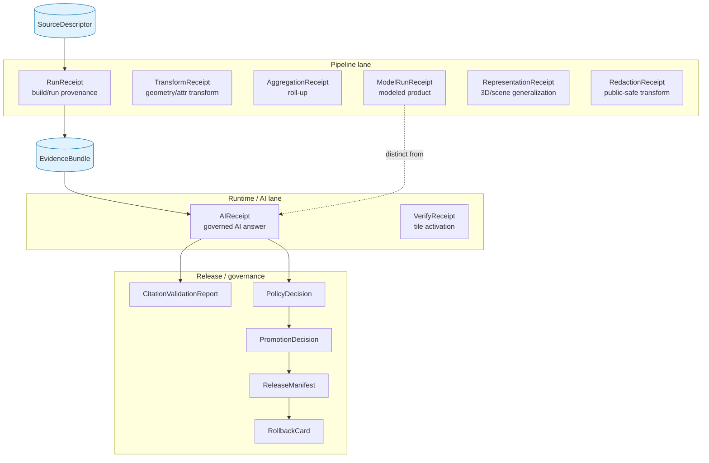
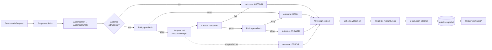

<!-- [KFM_META_BLOCK_V2]
doc_id: kfm://doc/architecture/governed-ai/ai-receipts
title: AI Receipts — Governed AI Subsystem
type: standard
version: v1
status: draft
owners: Docs steward + governed-AI subsystem owner
created: 2026-05-15
updated: 2026-05-15
policy_label: public
related:
  - docs/architecture/governed-ai/README.md
  - docs/architecture/governed-ai/STATE_OWNERSHIP.md
  - docs/architecture/governed-ai/ROUTE_MAP.md
  - docs/architecture/governed-ai/BOUNDARIES.md
  - docs/architecture/governed-ai/CONTINUITY_NOTES.md
  - docs/architecture/governed-api.md
  - docs/architecture/evidence-flow.md
  - docs/architecture/contract-schema-policy-split.md
  - docs/governance/cite-or-abstain.md
  - docs/doctrine/directory-rules.md
  - docs/doctrine/trust-membrane.md
  - contracts/runtime/ai_receipt.md
  - contracts/runtime/run_receipt.md
  - schemas/contracts/v1/runtime/ai_receipt.schema.json
  - schemas/contracts/v1/focus/citation_validation_report.schema.json
  - policy/runtime/ai_receipts.rego
  - tools/validators/ai/
tags: [kfm, architecture, governed-ai, receipts, focus-mode, evidence, replay]
notes:
  - Repository unmounted in authoring session; every repo-shape, field-shape, and validator-name claim is PROPOSED until verified.
  - Placement justified by Directory Rules §6.1 (docs/architecture/) and the Whole-UI + Governed AI Expansion Report Appendix A (governed-ai subsystem doc set).
  - This is the subsystem-view explanation. Canonical object meaning lives in contracts/runtime/ai_receipt.md; machine shape lives in schemas/contracts/v1/runtime/ai_receipt.schema.json per ADR-0001.
[/KFM_META_BLOCK_V2] -->

<a id="top"></a>

# AI Receipts

> **A signed, evidence-subordinate accountability record for every governed AI answer.**
> Records *that* a bounded model call happened, against *which* evidence, under *which* policy, with *which* finite outcome — never the model's private chain-of-thought, never the raw prompt body, never a substitute for `EvidenceBundle`.

<p align="center">
  <b>Kansas Frontier Matrix — Evidence First · Cite or Abstain · Fail Closed</b>
</p>

<p align="center">
  
  
  
  
  
  
  
</p>

> [!IMPORTANT]
> **AIReceipt is a runtime accountability record. It is not the answer.**
>
> The answer's truth comes from `EvidenceBundle`, source role, policy decision, citation validation, review state, and release state — never from generated language.
>
> An AI answer **without a valid AIReceipt** is, in the governed sense, **an answer that did not happen.** If the receipt cannot be produced, validated, persisted, and (where required) signed, the finite outcome **MUST** be `ABSTAIN` or `ERROR`, never `ANSWER`.

---

## Quick links

- [1. Purpose](#1-purpose)
- [2. What AIReceipt is — and is not](#2-what-aireceipt-is--and-is-not)
- [3. Where AIReceipts are emitted](#3-where-aireceipts-are-emitted)
- [4. Receipt shape (PROPOSED)](#4-receipt-shape-proposed)
- [5. Finite outcomes and reason codes](#5-finite-outcomes-and-reason-codes)
- [6. Receipt-family relationships](#6-receipt-family-relationships)
- [7. Lifecycle: emit → validate → persist → replay](#7-lifecycle-emit--validate--persist--replay)
- [8. Signing, integrity, replay verification](#8-signing-integrity-replay-verification)
- [9. Storage and retention](#9-storage-and-retention)
- [10. Validator expectations and negative-path coverage](#10-validator-expectations-and-negative-path-coverage)
- [11. Anti-patterns](#11-anti-patterns)
- [12. Verification checklist](#12-verification-checklist)
- [13. Rollback and change discipline](#13-rollback-and-change-discipline)
- [14. Open questions](#14-open-questions)
- [15. Related documents](#15-related-documents)
- [Appendix A — Field cross-reference (PROPOSED)](#appendix-a--field-cross-reference-proposed)

---

## 1. Purpose

`AIReceipt` is the governed AI subsystem's **process-memory object**: a structured, persisted record that a specific bounded model invocation took place under a specific evidence, policy, and runtime configuration, and produced a specific finite outcome.

It exists so KFM can answer four questions about any AI surface — Focus Mode, AI-drafted notes, AI exports, AI-assisted review suggestions — long after the moment the model spoke:

| Question | Answered by | Without AIReceipt |
|---|---|---|
| **Did this answer happen?** | Receipt presence, signature, time | Unverifiable; treat as never happened |
| **What did it see?** | `evidence_refs[]`, `prompt_scope_digest`, `context_window_digest` | Unverifiable; treat as ungoverned |
| **What was permitted?** | `policy_decision_ref`, `policy_bundle_hash` | Admissibility unknown; cannot publish |
| **Can it be re-derived?** | `model_id`, `seed`, `temperature`, `spec_hash`, deterministic reducer state | Not replayable; not audit-defensible |

This document is the **subsystem-view** explanation of `AIReceipt` — how it fits Focus Mode, the trust membrane, and the receipt family. Canonical object meaning lives in `contracts/runtime/ai_receipt.md` (**PROPOSED**) and machine shape lives in `schemas/contracts/v1/runtime/ai_receipt.schema.json` (**PROPOSED**) per ADR-0001 schema-home rule.

[↩ back to top](#top)

---

## 2. What AIReceipt is — and is not

### 2.1 Is

- A **runtime accountability record** for governed AI use.
- A **provenance witness** that links a finite outcome to a specific evidence set, policy decision, citation report, model identity, and runtime configuration.
- A **replay anchor**: same evidence + same prompt envelope + same model + same seed + same policy bundle **MUST** yield the same receipt digest.
- A **deterministic, structured object** — JSON, schema-validated, optionally DSSE-signed.
- A **first-class member of the receipt family** alongside `RunReceipt`, `VerifyReceipt`, `TransformReceipt`, `RedactionReceipt`, `AggregationReceipt`, `ModelRunReceipt`, and `RepresentationReceipt`.

### 2.2 Is not

> [!CAUTION]
> The following are **MUST NOT** for every AIReceipt emitter, regardless of provider, lane, or surface.

- **Not a transcript.** Receipts MUST NOT carry free-form private chain-of-thought, hidden reasoning tokens, or unstructured model deliberation. Only the *outcome*, *digests*, and *governance metadata* persist.
- **Not the prompt body.** Receipts carry `prompt_scope_digest` and `prompt_template_id`, never the raw user-plus-context prompt text. Raw prompts MUST be derivable only inside the governed runtime, behind policy.
- **Not the raw model output.** Receipts carry `output_digest` and a *governance-safe* outcome envelope. The raw model text MUST NOT escape the governed API as a public surface.
- **Not a substitute for `EvidenceBundle`.** A signed AIReceipt over a wrong, missing, or stale `EvidenceBundle` is a faithfully signed record of a non-answer. Cite-or-abstain still applies.
- **Not a release artifact.** AIReceipts are *process memory* (`data/receipts/`), not release decisions (`release/`) and not evidence proofs (`data/proofs/`). The receipt-family-mixing anti-pattern is called out in Directory Rules §13.2.
- **Not a public surface.** AIReceipts MAY be exposed in projection (a governed `AIReceiptSummaryDTO`) but the raw receipt object MUST NOT be the public path to truth. The Evidence Drawer cites `EvidenceBundle`; it cites the receipt only as a process pointer.

[↩ back to top](#top)

---

## 3. Where AIReceipts are emitted

> [!NOTE]
> All emission points listed are **PROPOSED** until verified against mounted-repo evidence. Doctrine is CONFIRMED by the encyclopedia, MapLibre report (v1.5/1.7/1.9), and Domain Atlas v1.1 §24.2.

| Surface | Trigger | Outcome set | Receipt class | Notes |
|---|---|---|---|---|
| **Focus Mode** | `FocusModeRequest` resolved through adapter | `ANSWER` · `ABSTAIN` · `DENY` · `ERROR` | `AIReceipt` | Every Focus response — even `ABSTAIN`/`DENY` — carries a receipt. |
| **AI-drafted note / summary** | Steward-invoked AI drafting inside review console | `ANSWER` · `ABSTAIN` · `DENY` · `ERROR` | `AIReceipt` | The draft is *candidate* content; receipt anchors provenance. |
| **AI-assisted export** | Public-safe export with AI-rendered narrative | `ANSWER` · `ABSTAIN` · `DENY` · `ERROR` | `AIReceipt` + `ExportReceipt` | Export gate requires both. |
| **AI candidate generation for review** | Anomaly explanation, schema suggestion, validator hint | `ANSWER` · `ABSTAIN` · `ERROR` | `AIReceipt` | Internal lane; still receipt-bearing. |
| **Modeled product** (forecasts, suitability surfaces, restoration models) | Model pipeline run | n/a (artifact, not Q&A) | `ModelRunReceipt` (sibling class) | `AIReceipt` ≠ `ModelRunReceipt`; see §6. |

The watcher-as-non-publisher invariant applies: AI surfaces emit receipts and finite outcomes, but **MUST NOT** write to `data/catalog/`, `data/published/`, or `release/`. Promotion remains a separate governed state transition.

[↩ back to top](#top)

---

## 4. Receipt shape (PROPOSED)

> [!WARNING]
> Field names below are **PROPOSED** until the canonical schema lands at `schemas/contracts/v1/runtime/ai_receipt.schema.json` and ADR-0001 confirms the runtime schema home. Where this doc and the live schema conflict, the schema wins and a drift entry **MUST** be opened in `docs/registers/DRIFT_REGISTER.md`.

### 4.1 Required fields (PROPOSED)

The encyclopedia, MapLibre report v1.5/1.7/1.9, and Domain Atlas v1.1 §24.2 converge on a required-field set. The names below normalize that vocabulary into a single PROPOSED shape.

| Field | Type | Why required |
|---|---|---|
| `receipt_id` | string (deterministic ULID/UUID) | Stable identity; receipt is addressable. |
| `receipt_class` | const `"ai_receipt"` | Disambiguates from `RunReceipt`, `VerifyReceipt`, etc. |
| `schema_uri` | URI | Schema versioning; spec-hash-match per `C5-04`. |
| `created_at` | RFC 3339 UTC | When the receipt was sealed. |
| `outcome` | enum `ANSWER` \| `ABSTAIN` \| `DENY` \| `ERROR` | Finite-outcome contract. No free-form states. |
| `reason_code` | enum (PROPOSED catalog) | Machine-readable explanation; see §5.2. |
| `surface` | enum `focus` \| `note` \| `export` \| `review_assist` \| `other` | Which AI surface emitted it. |
| `model_id` | string | Provider-stable model identity (e.g. `local/llama3.1:8b-q4_K_M`). |
| `model_provider` | string | `mock` \| `ollama` \| `openai` \| `anthropic` \| … |
| `runtime_adapter` | string | Adapter contract path/version; provider-agnostic boundary. |
| `model_params_digest` | hex digest | Hash of `{seed, temperature, top_p, num_ctx, …}` — deterministic. |
| `prompt_template_id` | string | Pinned, reviewable template; never freeform. |
| `prompt_scope_digest` | hex digest | Hash of the assembled context envelope (not the body). |
| `evidence_refs` | array of `EvidenceRef` | Admissible evidence used; cite-or-abstain enforced here. |
| `citation_validation_ref` | `CitationValidationReport` ref | Closure proof for cited claims. |
| `policy_decision_ref` | `PolicyDecision` ref | The allow/deny/restrict/abstain decision that admitted this call. |
| `policy_bundle_hash` | hex digest | Pins the policy version that decided admissibility. |
| `spec_hash` | hex digest | Combined hash of schema + template + adapter contract. |
| `output_digest` | hex digest | Hash of the structured (not raw) outcome envelope. |
| `runtime_metadata` | object | Adapter-bounded metadata (latency, tokens, num_ctx) — no PII, no prompt body. |

### 4.2 Conditionally required fields (PROPOSED)

| Field | Required when |
|---|---|
| `seed` | Provider supports seeded determinism (Ollama, MockAdapter, llama.cpp). MUST be present for `ANSWER` outcomes in lanes claiming replay. |
| `output_envelope_ref` | `outcome = ANSWER`. Points to the governed response envelope (not raw text). |
| `denial_reason_ref` | `outcome = DENY`. Points to policy or sensitivity rationale. |
| `abstention_reason_ref` | `outcome = ABSTAIN`. Points to missing-evidence or citation-failure detail. |
| `error_ref` | `outcome = ERROR`. Points to structured error envelope. |
| `dsse_envelope_ref` | Lane requires signed receipts (publication path, sensitive lanes). |
| `signature_ref` | DSSE/cosign signing applied; references `release/signatures/` blob. |
| `domain` | Lane is a domain surface (hazards, hydrology, archaeology, …). Required for domain-aware Rego per `I4.4`. |
| `domain_constraints` | `domain` set. Encodes per-domain admissibility (e.g. `max_mapunit_uncertainty` for soils). |

### 4.3 Forbidden fields (MUST NOT)

> [!CAUTION]
> Any field below appearing in a receipt is a **policy violation** and MUST cause the receipt to be rejected by `policy/runtime/ai_receipts.rego` (**PROPOSED** path).

- `prompt_body` — the raw assembled prompt text.
- `chain_of_thought` / `reasoning_tokens` / `scratchpad` — private model deliberation.
- `raw_model_output` — the un-enveloped completion string.
- `user_pii` — names, emails, IPs, geolocation precise enough to identify a person.
- `source_internal_paths` — direct file paths to `data/raw/`, `data/work/`, `data/quarantine/`, or other canonical/internal stores.
- `bearer_tokens`, `api_keys`, `secrets` — handled in `configs/` policy, not in receipts.

### 4.4 Minimal example (PROPOSED, illustrative)

```json
{
  "receipt_id": "01J7XYZ7K1Q9V0H8W2M3R4N5T6",
  "receipt_class": "ai_receipt",
  "schema_uri": "kfm://schema/runtime/ai_receipt/v1",
  "created_at": "2026-05-15T03:10:43Z",
  "outcome": "ABSTAIN",
  "reason_code": "EVIDENCE_INSUFFICIENT",
  "surface": "focus",
  "model_id": "mock/deterministic-v1",
  "model_provider": "mock",
  "runtime_adapter": "kfm://adapter/runtime/mock@v1",
  "model_params_digest": "blake3:8a7c…",
  "prompt_template_id": "focus.evidence_qa.v1",
  "prompt_scope_digest": "blake3:e3b0…",
  "evidence_refs": [],
  "citation_validation_ref": "kfm://citation_validation/2026/…",
  "policy_decision_ref": "kfm://policy_decision/2026/…",
  "policy_bundle_hash": "blake3:9f1c…",
  "spec_hash": "blake3:2d4e…",
  "output_digest": "blake3:cf9b…",
  "runtime_metadata": {
    "decode_latency_ms": 42,
    "tokens_in": 0,
    "tokens_out": 0,
    "num_ctx": 8192
  },
  "abstention_reason_ref": "kfm://abstain_reason/no_evidence_in_scope"
}
```

> [!NOTE]
> The example shows a *deterministic ABSTAIN* — a Focus Mode question whose scope returned no admissible evidence. Notice: no prompt body, no model output, evidence array empty, abstention reason linked. The receipt is still complete and replayable.

[↩ back to top](#top)

---

## 5. Finite outcomes and reason codes

### 5.1 Outcome set (CONFIRMED doctrine)

The governed AI subsystem emits exactly four runtime outcomes. There is no fifth state, no `UNKNOWN`, no `PARTIAL`, no `MAYBE`.

| Outcome | Meaning | Required receipt content |
|---|---|---|
| **`ANSWER`** | Evidence sufficient; citations validated; policy permits; release state allows. | Full receipt + `output_envelope_ref` + non-empty `evidence_refs[]` + passing `citation_validation_ref`. |
| **`ABSTAIN`** | Evidence missing, citations failed to resolve, source role conflicted, temporal scope insufficient, or evidence stale. | Full receipt + `abstention_reason_ref`. `evidence_refs[]` MAY be empty. `output_envelope_ref` MUST be absent or null. |
| **`DENY`** | Policy, rights, sensitivity, role, or release state forbids the answer. Sensitive lanes default here. | Full receipt + `denial_reason_ref` + `policy_decision_ref` with `decision = DENY`. |
| **`ERROR`** | The governed surface could not evaluate (schema violation, adapter failure, infrastructure error, contract violation). | Full receipt + `error_ref`. Never a silent fall-through. |

Validators **MUST** assert receipts exercise all four outcomes — see §10.2.

### 5.2 Reason-code catalog (PROPOSED)

The reason-code vocabulary is **PROPOSED**; the catalog will be hardened by an ADR once domain Rego packs land (see `I4.4`).

| Reason code (PROPOSED) | Family | Typical outcome | Recovery path |
|---|---|---|---|
| `EVIDENCE_INSUFFICIENT` | Evidence gap | `ABSTAIN` | Add admissible evidence; rerun. |
| `EVIDENCE_STALE` | Freshness | `ABSTAIN` | Re-ingest; refresh `EvidenceBundle`. |
| `CITATION_UNRESOLVED` | Citation closure | `ABSTAIN` | Repair `EvidenceRef` resolution; rerun. |
| `SOURCE_ROLE_CONFLICT` | Source-role collapse | `ABSTAIN` | Restore role; do not upcast. |
| `SENSITIVITY_DENY` | Sensitivity / rights | `DENY` | Steward review; tier reassignment. |
| `RIGHTS_DENY` | Rights | `DENY` | Resolve rights; reassign tier. |
| `SOVEREIGNTY_DENY` | CARE / sovereignty | `DENY` | Convene rights-holder review. |
| `PUBLIC_LEAK_RISK` | Public-safe transform missing | `DENY` | Apply generalization/redaction; re-emit. |
| `POLICY_BUNDLE_STALE` | Replay drift | `ERROR` | Refresh policy bundle; rerun. |
| `MODEL_UNAPPROVED` | Allowlist | `DENY` / `ERROR` | Use approved model; rerun. |
| `SCHEMA_VIOLATION` | Receipt-shape failure | `ERROR` | Fix emitter; rerun. |
| `ADAPTER_ERROR` | Runtime adapter failure | `ERROR` | Inspect adapter logs; rerun. |

> [!NOTE]
> Reason codes are **machine-readable**. The user-facing message lives in the response envelope. Receipts carry the code; UI carries the prose. Do not blur these layers — see Anti-pattern §11.3.

[↩ back to top](#top)

---

## 6. Receipt-family relationships

`AIReceipt` is one member of the KFM receipt family. Each receipt class records a different governed transformation. **MUST NOT** collapse them.



### 6.1 `AIReceipt` vs `RunReceipt`

| Concern | `AIReceipt` | `RunReceipt` |
|---|---|---|
| Records | A bounded **AI answer** (Q→A surface) | A **pipeline/tile build** (data transform) |
| Triggered by | Focus Mode, AI export, AI-drafted note | Connector run, COG/PMTiles build, OCI publish, validator run |
| Primary digest | `output_digest` of governed envelope | `artifact_digests[]` of built outputs |
| Replay key | `model + seed + prompt_scope + policy_bundle` | `inputs + config_hash + spec_hash` |
| Home (**PROPOSED**) | `data/receipts/ai/` | `data/receipts/runs/` |

> The MapLibre report v1.4 §ML-056-023 makes this explicit: *"build-run receipts and live-answer runtime receipts are distinct."* Do not collapse pipeline provenance and response provenance.

### 6.2 `AIReceipt` vs `ModelRunReceipt`

| Concern | `AIReceipt` | `ModelRunReceipt` |
|---|---|---|
| Records | An **interactive** AI surface answer | A **modeled product** publication (forecast, suitability surface, restoration model) |
| Outcome class | Q&A finite envelope | Modeled artifact with uncertainty surface |
| Source-role implication | `evidence_role` from cited sources | `source_role = modeled` on the produced layer |
| Home (**PROPOSED**) | `data/receipts/ai/` | `data/receipts/models/` |

Domain Atlas v1.1 §24.2 lists both as distinct receipt classes. The `SourceDescriptor` field `role_model_run_ref` MUST point to a `ModelRunReceipt`, never an `AIReceipt`.

### 6.3 `AIReceipt` + `CitationValidationReport`

The two are paired. An `AIReceipt` with `outcome = ANSWER` is admissible only when its `citation_validation_ref` resolves to a passing `CitationValidationReport`. The encyclopedia §I makes this an invariant: *"No uncited claims; DENY sensitive exposure."*

[↩ back to top](#top)

---

## 7. Lifecycle: emit → validate → persist → replay



The pipeline is **fail-closed** at every gate. A failure at any node before `AIReceipt sealed` MUST coerce the outcome to `ABSTAIN`, `DENY`, or `ERROR` — never silent success.

### 7.1 Emission

1. **Scope resolution.** `FocusModeRequest` → bounded scope envelope. Bounded means: capped context size, declared evidence-depth budget, pinned time basis, pinned release state, pinned policy bundle.
2. **Evidence resolution.** `EvidenceRef` array → `EvidenceBundle` resolution. Stale, missing, or rights-unresolved bundles short-circuit to `ABSTAIN` / `DENY`.
3. **Policy precheck.** Rights, sensitivity, role, release state, user purpose. Deny short-circuits before any model call.
4. **Adapter call.** Provider-agnostic adapter contract. Structured output only (JSON envelope, schema-validated). No raw text drop.
5. **Citation validation.** Every cited claim's `EvidenceRef` MUST resolve, MUST be released or review-authorized, MUST be in scope. Fail → `ABSTAIN`.
6. **Policy postcheck.** A second pass over the candidate answer for surface-level sensitivity leak (coordinate precision, living-person inference, restricted DNA inference). Fail → `DENY`.
7. **Seal.** Compute `output_digest`, `prompt_scope_digest`, `model_params_digest`, `spec_hash`. Stamp `created_at`. Receipt is now immutable.

### 7.2 Validation

The receipt is validated by **three** independent checks before persistence:

| Check | Tool (PROPOSED) | Fails on |
|---|---|---|
| Schema shape | `tools/validators/ai/receipt_schema.py` | Missing required field, type error, additionalProperties, forbidden field present. |
| Admissibility | `policy/runtime/ai_receipts.rego` | Outcome/reason mismatch, unapproved model, missing citation when `ANSWER`, forbidden field present. |
| Replay integrity | `tools/validators/ai/replay_check.py` | `spec_hash` drift, `policy_bundle_hash` drift, `model_params_digest` non-deterministic. |

Failure at any of the three coerces the surface to `ERROR` and the receipt is recorded with `outcome = ERROR` rather than dropped.

### 7.3 Persistence

PROPOSED layout:

```text
data/
└── receipts/
    └── ai/
        ├── 2026/
        │   ├── 05/
        │   │   ├── 15/
        │   │   │   ├── 01J7XYZ…_ai_receipt.json
        │   │   │   └── 01J7XYZ…_ai_receipt.dsse.json    # when signed
        │   │   └── _index.jsonl
        └── _schema/
            └── ai_receipt.schema.json -> ../../../../schemas/contracts/v1/runtime/
```

The directory is **append-only**. Receipts MUST NOT be edited or deleted after seal; corrections are issued as **new** receipts with `supersedes_ref`. Lifecycle-skip and lifecycle-rewrite anti-patterns are called out in Directory Rules §13.

### 7.4 Replay

The replay invariant is the strongest property AIReceipt buys KFM:

> **same evidence + same prompt envelope + same model + same seed + same policy bundle ⇒ same receipt digest**

`make ai-replay-check` (PROPOSED CI target) rebuilds a fixture set and asserts byte-identical receipt JSON. Drift on any axis (model version bump, policy bundle change, schema bump) breaks replay and is **expected** — it signals that admissibility moved and prior publications must be re-evaluated.

[↩ back to top](#top)

---

## 8. Signing, integrity, replay verification

### 8.1 Why sign receipts

Receipts are *process memory*, but in publication lanes they become *promotion-chain evidence*. A tampered or unsigned receipt is indistinguishable from a fabricated one. Signing buys:

- **Tamper detection.** DSSE envelope over the canonical JSON.
- **Replay trust.** Signature pins the exact receipt that was sealed.
- **Promotion-chain integrity.** `PromotionDecision` may consume signed receipts as proof.
- **Publication auditability.** Public corrections and rollbacks can name the receipt by digest.

### 8.2 PROPOSED signing flow

```text
ai_receipt.json
    │
    ├─► canonical JSON (RFC 8785 / deterministic)
    │
    ├─► BLAKE3 / SHA-256 digest
    │
    ├─► cosign sign-blob ──► ai_receipt.sig
    │
    └─► DSSE envelope ────► ai_receipt.dsse.json
                              │
                              └─► release/signatures/ on publication
```

Signing keys, key rotation policy, and verification posture are **OUT OF SCOPE** for this document and live under `docs/security/` (**PROPOSED**) and the signing ADR (**PROPOSED**, not yet authored).

### 8.3 Replay verification

The replay validator (`tools/validators/ai/replay_check.py`, **PROPOSED**) re-executes a fixture receipt against the current adapter and policy bundle and asserts identity. CI runs replay on every PR that touches:

- `schemas/contracts/v1/runtime/ai_receipt.schema.json`
- `policy/runtime/ai_receipts.rego`
- `policy/bundles/` (any bundle hash change)
- any approved-model identity

A non-identity result is **not** a test failure to be ignored — it is a **promotion-chain break** that requires correction lineage.

[↩ back to top](#top)

---

## 9. Storage and retention

### 9.1 Where AIReceipts live (PROPOSED)

| Class of receipt | Home | Notes |
|---|---|---|
| Unsigned receipts (dev, mock, ABSTAIN/DENY/ERROR not promoted) | `data/receipts/ai/YYYY/MM/DD/` | Append-only. |
| Signed receipts (publication path) | `data/receipts/ai/YYYY/MM/DD/*.dsse.json` + `release/signatures/` | DSSE envelope persisted twice — once with the receipt, once in the release signature lane. |
| Supersession (corrected receipt) | New receipt at new path with `supersedes_ref` | The old receipt is **not deleted**; it is marked superseded by the new one. |
| Audit projection | `data/receipts/ai/_index.jsonl` | Append-only audit log; one line per receipt. |

> [!CAUTION]
> AIReceipts are receipts. They MUST NOT land in `artifacts/`, `release/`, `data/published/`, or `data/proofs/`. Mixing the receipt / proof / release / artifact lanes is one of the four drift patterns called out in Directory Rules §13.2.

### 9.2 Retention (OPEN)

> **OPEN:** Retention policy for AIReceipts is **NEEDS VERIFICATION**. Pass 10 Idea Index `C12-03` notes: *"the corpus does not yet specify retention policy for GENERATED_RECEIPTS — do they live as long as the artifact, or longer?"*
>
> PROPOSED default: **keep forever, append-only.** Retention shortening requires an ADR per Directory Rules §2.4(4). Track in `docs/registers/VERIFICATION_BACKLOG.md`.

### 9.3 Public exposure

Receipts MAY be projected into a public-safe summary (`AIReceiptSummaryDTO`, **PROPOSED**) carrying outcome, reason code, evidence refs count, citation pass/fail, and signature presence — never `prompt_scope_digest`, `model_params_digest`, or `output_digest` raw bytes. The Evidence Drawer surfaces the projection, not the receipt.

[↩ back to top](#top)

---

## 10. Validator expectations and negative-path coverage

### 10.1 Required validator surface (PROPOSED)

Per Directory Rules §13.5 ("Test-only validator" anti-pattern), validators live in `tools/validators/ai/`, not buried in test files.

```text
tools/
└── validators/
    └── ai/
        ├── README.md
        ├── receipt_schema.py        # JSON Schema validator
        ├── receipt_admissibility.py # Rego runner
        ├── replay_check.py          # determinism + digest re-compute
        ├── hash_utils.py            # canonical JSON / BLAKE3 / SHA-256
        └── fixtures/
            ├── valid/
            │   ├── minimal_answer.json
            │   ├── minimal_abstain.json
            │   ├── minimal_deny.json
            │   ├── minimal_error.json
            │   └── deterministic_replay.json
            └── invalid/
                ├── missing_outcome.json
                ├── prompt_body_present.json          # forbidden field
                ├── raw_model_output_present.json     # forbidden field
                ├── chain_of_thought_present.json     # forbidden field
                ├── answer_without_citation.json
                ├── unapproved_model.json
                ├── stale_policy_bundle.json
                ├── duplicate_receipt_id.json
                ├── invalid_outcome_enum.json
                └── temperature_nonzero_without_seed.json
```

### 10.2 Negative-path coverage rule

> [!IMPORTANT]
> **An AIReceipt validator that has never exercised `ABSTAIN`, `DENY`, or `ERROR` is not a validator — it is a hopeful test of the happy path.**

Every CI run **MUST** prove all four outcomes are emittable, schema-valid, and policy-admissible. The negative-state rule established for KFM validators applies here verbatim: silence on the bad cases is the failure mode that drift exploits.

### 10.3 Test families (PROPOSED)

| Test family | What it asserts |
|---|---|
| Schema validation | Every `valid/` fixture passes; every `invalid/` fixture fails with the expected error class. |
| Outcome coverage | Each of `ANSWER`/`ABSTAIN`/`DENY`/`ERROR` is exercised at least once per release. |
| Forbidden-field rejection | `prompt_body`, `chain_of_thought`, `raw_model_output`, `user_pii` cause Rego `deny`. |
| Citation closure | `outcome = ANSWER` ∧ empty `evidence_refs[]` → Rego `deny`. |
| Replay identity | Deterministic fixture, byte-identical receipt digest across re-runs. |
| Policy-bundle drift | Policy bundle hash change while fixture unchanged → `ERROR` outcome, not silent re-publication. |
| Approved-model allowlist | Unknown `model_id` → `DENY` with reason `MODEL_UNAPPROVED`. |
| Domain-aware rules | (per `I4.4`) Soil receipt with `max_mapunit_uncertainty > 0.10` → `DENY`. |
| No-network | Replay runs without internet; no provider call leaks; MockAdapter only. |
| DSSE signing | Sign → verify → tamper → verify-fails; round-trip identity preserved. |

[↩ back to top](#top)

---

## 11. Anti-patterns

> [!WARNING]
> Each pattern below has been observed in adjacent systems and called out in KFM doctrine. Reviewers SHOULD reject PRs exhibiting any of them.

### 11.1 Persisting chain-of-thought as receipt content

**Symptom:** AIReceipt includes a `reasoning` field with model deliberation tokens.
**Why it's wrong:** Chain-of-thought is private model state, not governed evidence. Persisting it (a) trains future systems on it as truth, (b) leaks reasoning that may contain disallowed inferences, (c) confuses receipt readers about what is admissible.
**Fix:** Drop the field. The receipt records the *outcome* and *digests*, not the deliberation.

### 11.2 Collapsing AIReceipt and RunReceipt

**Symptom:** A pipeline-build receipt is filed as an AIReceipt because the pipeline used an AI​​​​​​​​​​​​​​​​
