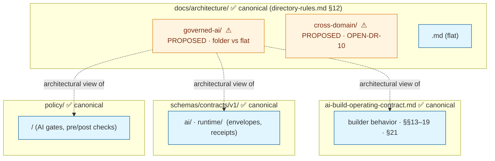
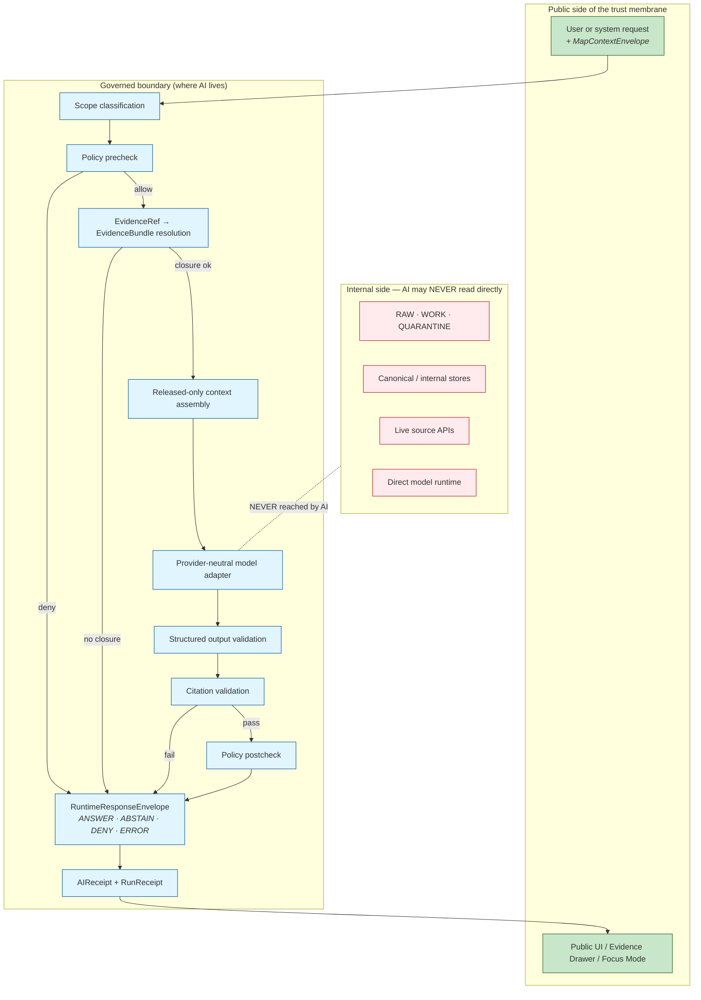

<!-- [KFM_META_BLOCK_V2]
doc_id: kfm://doc/architecture-governed-ai-boundaries
title: Governed AI — Boundaries
type: standard
version: v0.1
status: draft
owners: <AI-SURFACE-STEWARD> · NEEDS VERIFICATION
created: 2026-05-24
updated: 2026-05-24
policy_label: public
related:
  - directory-rules.md#12
  - ai-build-operating-contract.md#14
  - ai-build-operating-contract.md#15
  - ai-build-operating-contract.md#21
  - ai-build-operating-contract.md#34
  - kfm_unified_doctrine_synthesis.md#11
  - kfm_unified_doctrine_synthesis.md#20
  - kfm_unified_doctrine_synthesis.md#21
  - Kansas_Frontier_Matrix_-_Domains_v1_1___Pass_23_32_Consolidated_Atlas.md#19
  - Kansas_Frontier_Matrix_-_Domains_v1_1___Pass_23_32_Consolidated_Atlas.md#205
  - KFM_Unified_Implementation_Architecture_Build_Manual.md#15
  - Master_MapLibre_Components-Functions-Features_v2_1_FULL.md#10
  - docs/architecture/cross-domain/README.md
tags: [kfm, architecture, governed-ai, boundaries, trust-membrane, cite-or-abstain, ai-receipt]
notes:
  - PROPOSED. Folder-vs-flat-file placement diverges from directory-rules.md §12 pattern (same family as OPEN-DR-10).
  - ALL-CAPS filename is a deliberate "foundational doc" signal; not a KFM-wide convention. Flagged as OPEN-DR-11 (PROPOSED).
  - This doc is an architectural view; ai-build-operating-contract.md remains canonical for builder behavior.
  - No mounted repo evidence in this session; all repo-shaped claims labeled PROPOSED.
[/KFM_META_BLOCK_V2] -->

<a id="top"></a>

# Governed AI — Boundaries

> *The architectural view of what AI may and may not do inside KFM — across both the builder surface (AI authoring code, docs, schemas) and the runtime surface (Focus Mode answering over evidence). One set of boundaries; two contexts where they apply.*


-blue)


**Status:** draft · **Owners:** `<AI-SURFACE-STEWARD>` *(NEEDS VERIFICATION)* · **Last updated:** 2026-05-24

> [!IMPORTANT]
> **AI is an interpretive layer, never the root truth source.** `EvidenceBundle` outranks generated language. Generated text never substitutes for evidence, policy, review state, source authority, or release state. This is **CONFIRMED doctrine** *(KFM Operating Law §1.8; `kfm_unified_doctrine_synthesis.md` §20; `ai-build-operating-contract.md` §1)*. Every other rule in this doc derives from it.

> [!CAUTION]
> **Path placement diverges from Directory Rules v1.2 §12** in two ways: §12 shows the convention as `docs/architecture/<topic>.md` *(flat file)*, and this file uses a **subfolder** plus an **ALL-CAPS filename**. Recorded as **OPEN-DR-11 (PROPOSED)** below. The ALL-CAPS form is intentional — it signals a foundational doc the way `README.md`, `CHANGELOG.md`, `CONTRIBUTING.md`, `LICENSE`, and `CODEOWNERS` do — but it is not a KFM-wide convention. See [§2 — Repo fit](#2-repo-fit--directory-rules-basis).

> [!NOTE]
> **What this doc is and is not.** It is the **architectural** statement of the AI surface boundaries. It is **not** the AI builder operating contract *(that is `ai-build-operating-contract.md` — canonical)*; it is **not** the runtime envelope schema *(those are `schemas/contracts/v1/runtime/` and `schemas/contracts/v1/ai/`)*; it is **not** the per-domain sensitivity matrix *(that is `kfm_unified_doctrine_synthesis.md` §15–16 + Atlas §20.5)*. It points to all of them and consolidates the boundary view.

---

## Table of contents

1. [Scope](#1-scope)
2. [Repo fit — Directory Rules basis](#2-repo-fit--directory-rules-basis)
3. [Two surfaces, one set of boundaries](#3-two-surfaces-one-set-of-boundaries)
4. [The boundary picture](#4-the-boundary-picture)
5. [First principles](#5-first-principles)
6. [The five canonical boundaries](#6-the-five-canonical-boundaries)
7. [Trust-membrane crossings — what may pass in and out](#7-trust-membrane-crossings--what-may-pass-in-and-out)
8. [Finite outcomes — the only legal AI return values](#8-finite-outcomes--the-only-legal-ai-return-values)
9. [Runtime contract (Focus Mode flow)](#9-runtime-contract-focus-mode-flow)
10. [Adapter discipline — MockAdapter-first; provider-neutral](#10-adapter-discipline--mockadapter-first-provider-neutral)
11. [Hard denials — when AI MUST `DENY` or `ERROR`](#11-hard-denials--when-ai-must-deny-or-error)
12. [Sensitive-domain denial defaults](#12-sensitive-domain-denial-defaults)
13. [No chain-of-thought as evidence](#13-no-chain-of-thought-as-evidence)
14. [Schema and contract homes](#14-schema-and-contract-homes)
15. [Anti-patterns](#15-anti-patterns)
16. [Open questions and ADR triggers](#16-open-questions-and-adr-triggers)
17. [Related docs](#17-related-docs)
18. [Appendix — glossary and quick reference](#18-appendix--glossary-and-quick-reference)

---

## 1. Scope

This doc states **what the boundaries of governed AI are in KFM**, architecturally. It applies to two contexts simultaneously:

- **Builder context** — an AI system *(Claude, Cursor, Copilot, custom agents, AI-assisted maintainers)* proposing, creating, editing, validating, or explaining KFM repository content.
- **Runtime context** — an AI system *(Focus Mode, governed-API AI surfaces, local model adapters)* answering questions over released evidence at runtime.

> [!TIP]
> **The boundaries are the same in both contexts.** AI's role does not change: interpret, summarize, draft, propose — never publish, never decide truth, never bypass evidence, never read internal stores. The implementation surfaces differ; the boundaries do not.

[↑ Back to top](#top)

---

## 2. Repo fit — Directory Rules basis

### 2.1 Path divergence (to reconcile)

| Concern | Requested path | Canonical pattern *(`directory-rules.md` §12)* | Recommended resolution |
|---|---|---|---|
| Folder vs flat file | `docs/architecture/governed-ai/BOUNDARIES.md` *(folder)* | `docs/architecture/<topic>.md` *(flat file)* | If the `governed-ai/` lane needs ≥3 sibling docs, keep the folder. Otherwise flatten to `docs/architecture/governed-ai.md`. **PROPOSED.** |
| ALL-CAPS filename | `BOUNDARIES.md` | KFM convention is kebab-case for most docs; ALL-CAPS reserved for `README.md`, `CHANGELOG.md`, `CONTRIBUTING.md`, etc. | Decide via ADR whether `BOUNDARIES.md` joins the "foundational doc" ALL-CAPS family. The ALL-CAPS signal is intentional *(this is doctrine, not narrative)*; the convention is just unspecified for non-standard names. **PROPOSED.** |

> [!IMPORTANT]
> **OPEN-DR-11 (PROPOSED).** Resolve folder-vs-flat-file *and* ALL-CAPS-filename-convention in one ADR. Companion to OPEN-DR-10 *(cross-domain folder)*. Resolution lands as either an amendment to `directory-rules.md §12` *(extending the convention)* or as a clarification stating both patterns are acceptable when the doc carries a foundational role.

### 2.2 Where this folder sits



> **Doctrine basis.** `directory-rules.md` §12: *"Cross-domain doctrine → `docs/architecture/<topic>.md`, not under `docs/domains/<picked-one>/`"* — **CONFIRMED**. This doc is cross-domain doctrine *(governed AI applies to every domain)* and therefore correctly lives under `docs/architecture/`; the only divergence is folder + filename style.

[↑ Back to top](#top)

---

## 3. Two surfaces, one set of boundaries

| Surface | What it does | Where its rules live | Where its schemas live |
|---|---|---|---|
| **Builder** | AI proposes/creates/edits/validates KFM repo content *(docs, schemas, fixtures, validators, policies, ADRs, runbooks, UI payloads, API contracts)*. | `ai-build-operating-contract.md` §§13–19 *(preflight, allowed, denied, response posture, file creation/edit/move contracts)*; §34 *(`GENERATED_RECEIPT`)* | `schemas/contracts/v1/ai/generated_receipt.schema.json` *(PROPOSED)* |
| **Runtime** | AI answers questions at runtime via Focus Mode or governed-API AI routes, over released `EvidenceBundle`. | `ai-build-operating-contract.md` §21 *(Governed AI runtime contract)*; `KFM_Unified_Implementation_Architecture_Build_Manual.md` §15 *(governed AI and Focus Mode)*; `Master_MapLibre_Components-Functions-Features_v2.1_FULL.md` §10 *(governance and trust-membrane chapter)* | `schemas/contracts/v1/ai/focus_mode_request.schema.json` · `focus_mode_response.schema.json` · `ai_receipt.schema.json` · `evidence/citation_validation_report.schema.json` · `runtime/decision_envelope.schema.json` *(all PROPOSED)* |

> [!IMPORTANT]
> **Same boundaries; different shapes of receipt.** The builder emits `GENERATED_RECEIPT.json`; the runtime emits `AIReceipt`. Both record context + provider/model + inputs/outputs + policy decisions + citations. **Both are mandatory whenever AI participates.**

[↑ Back to top](#top)

---

## 4. The boundary picture

> **Evidence basis:** Atlas §19 *(Cross-Domain Systems — Governed AI runtime and AIReceipt)*; `kfm_unified_doctrine_synthesis.md` §§20–21; `KFM_Unified_Implementation_Architecture_Build_Manual.md` §15. **CONFIRMED doctrine.**



> [!NOTE]
> **Read the picture as a containment statement.** Everything between the user and the UI passes through the governed boundary. The internal stores at the bottom *(RAW/WORK/QUARANTINE, canonical/internal stores, live source APIs, direct model runtimes)* are not on any path AI may take. The boundary is what makes them unreachable; bypassing the boundary is the canonical anti-pattern.

[↑ Back to top](#top)

---

## 5. First principles

> **Evidence basis:** `ai-build-operating-contract.md` §1.8; `kfm_unified_doctrine_synthesis.md` §§20–21; Atlas §19; SRC-GAI doctrine. **CONFIRMED doctrine throughout.**

1. **AI is interpretive, not the truth source.** Generated text never substitutes for evidence, policy, review state, source authority, or release state.
2. **`EvidenceBundle` outranks generated language.** A cited bundle is authoritative; a fluent paragraph is not.
3. **Cite-or-abstain is the default truth posture.** If the AI surface cannot cite resolved evidence, it MUST `ABSTAIN`.
4. **Memory is not evidence.** Recollection, guessed paths, likely behavior, and generic best practice are not facts. Confidence is not a substitute for verification.
5. **AI runs behind the governed API boundary, never as a direct public surface.** Browser-to-model traffic without the governed boundary is a hard denial.
6. **AI may not bypass policy, rights, sensitivity, or release state.** Urgency is not an exception; convenience is not an exception.
7. **Every AI inference emits a receipt.** Builder → `GENERATED_RECEIPT`; runtime → `AIReceipt`. No receipt, no inference.
8. **Private chain-of-thought is never persisted as evidence.** KFM may store auditable summaries, inputs, outputs, hashes, citations, policy decisions, validation reports, and receipts — never the model's hidden reasoning.

[↑ Back to top](#top)

---

## 6. The five canonical boundaries

> **Doctrine status:** the five boundaries below are CONFIRMED individually across the corpus *(citations in each row)*. The grouping under "five canonical boundaries" is a **PROPOSED naming** for this architectural view; the rules themselves are CONFIRMED.

| # | Boundary | What AI MUST NOT cross | Doctrine source |
|---|---|---|---|
| 1 | **Truth boundary** | AI MUST NOT decide truth. `EvidenceBundle` is authoritative; generated language is not. | `kfm_unified_doctrine_synthesis.md` §20; Atlas §19 |
| 2 | **Trust-membrane boundary** | AI MUST NOT read `RAW` / `WORK` / `QUARANTINE`, canonical/internal stores, live source APIs, or feed those into prompts. | Atlas §24.9.2; `KFM_Unified_Implementation_Architecture_Build_Manual.md` §15.5 |
| 3 | **Citation boundary** | AI MUST NOT emit consequential claims without resolved citations. If citation validation fails, AI MUST `ABSTAIN`. | `kfm_unified_doctrine_synthesis.md` §21; `ai-build-operating-contract.md` §21 |
| 4 | **Receipt boundary** | AI MUST NOT operate without emitting `AIReceipt` *(runtime)* or `GENERATED_RECEIPT` *(builder)*. Private chain-of-thought MUST NOT be persisted as evidence. | `ai-build-operating-contract.md` §21.4, §34 |
| 5 | **Authority boundary** | AI MUST NOT publish, promote, approve releases, set policy, decide source role, or change review state. AI proposes; humans + policy decide. | `ai-build-operating-contract.md` §15; Atlas §19 |

> [!IMPORTANT]
> **A violation of any one is a violation of all five — because they are inter-locked.** Reading `RAW` *(boundary 2)* would let AI emit uncited claims *(boundary 3)* that become truth *(boundary 1)* without a receipt *(boundary 4)* and effectively bypass authority *(boundary 5)*. The boundaries are a single membrane viewed from five angles.

[↑ Back to top](#top)

---

## 7. Trust-membrane crossings — what may pass in and out

> **Evidence basis:** Atlas §19, §24.9.2; `kfm_unified_doctrine_synthesis.md` §20; `Master_MapLibre_Components-Functions-Features_v2.1_FULL.md` §10. **CONFIRMED doctrine.**

### 7.1 What may cross **inward** (toward the AI adapter)

| Inward crossing | Allowed | Required gating |
|---|---|---|
| `MapContextEnvelope` *(camera, layers, features, time, evidence refs)* | ✅ | Envelope admission check; release-ref binding required. |
| Released `EvidenceBundle`(s) resolved from `EvidenceRef` | ✅ | Citation closure verified before context assembly. |
| User question text *(prompt)* | ✅ | Anti-prompt-injection scan *(see `ai-build-operating-contract.md` §12)*; scope classification. |
| Policy context *(decision IDs, sensitivity tier, audience class)* | ✅ | `PolicyDecision` references; not raw policy bytes. |
| RAW / WORK / QUARANTINE bytes | ❌ | Hard denial *(boundary 2)*. |
| Canonical / internal store content | ❌ | Hard denial. |
| Live source API responses *(unfetched, ungoverned)* | ❌ | Hard denial; sources cross the membrane via the connector + intake lifecycle, not via AI context. |
| Hidden feature properties not in `LayerManifest` | ❌ | Hard denial. |
| Unreleased candidate artifacts | ❌ | Hard denial. |

### 7.2 What may cross **outward** (toward the UI)

| Outward crossing | Allowed | Required gating |
|---|---|---|
| `RuntimeResponseEnvelope` with `outcome ∈ {ANSWER, ABSTAIN, DENY, ERROR}` | ✅ | Structured output validation; citation validation report attached on `ANSWER`. |
| `EvidenceDrawerPayload` *(governed projection of `EvidenceBundle`)* | ✅ | Policy postcheck; sensitivity-redacted projection. |
| Reason codes *(abstain reason, denial reason, error code)* | ✅ | Bounded vocabulary; no free-text leak of internal state. |
| `AIReceipt` ID *(reference)* | ✅ | Full receipt persisted internally; reference exposed for audit. |
| Raw fluent prose without envelope | ❌ | Hard denial *(no envelope = no exit)*. |
| Private chain-of-thought | ❌ | Hard denial *(never persisted as evidence)*. |
| Citations to unresolved `EvidenceRef` | ❌ | `ABSTAIN`, not `ANSWER`. |
| Synthetic content presented as observed | ❌ | Hard denial; `Reality Boundary Note` required. |

[↑ Back to top](#top)

---

## 8. Finite outcomes — the only legal AI return values

> **Evidence basis:** `kfm_unified_doctrine_synthesis.md` §11; Atlas §24.3.1; `ai-build-operating-contract.md` §21.2. **CONFIRMED doctrine.**

Every governed-AI response — builder or runtime — terminates in exactly one outcome from the finite set. **No silent fall-through to a different outcome.**

| Outcome | When *(CONFIRMED doctrine)* | Required artifacts |
|---|---|---|
| **`ANSWER`** | Evidence sufficient · policy permits · release state allows · review *(if required)* recorded. | Resolved `EvidenceBundle`; `PolicyDecision = ALLOW`; `ReleaseManifest` applies; `AIReceipt` emitted; `CitationValidationReport` PASS. |
| **`ABSTAIN`** | Evidence insufficient · cannot cite · evidence stale and no released alternative · citation validation fails. | `AIReceipt` with reason; **no claim emitted**. |
| **`DENY`** | Policy · rights · sensitivity · or release state forbids the answer. Sensitive lanes default here. | `PolicyDecision = DENY` + reason code; `AIReceipt` records denial. |
| **`ERROR`** | Governed API cannot evaluate — missing schema, malformed query, contract violation, infra failure. | Error envelope with diagnostic code; **no claim leakage**. |

Optional extensions: `NARROWED` or `BOUNDED` if and only if contract schemas define them *(`ai-build-operating-contract.md` §21.2)*.

> [!CAUTION]
> **`HOLD` is a release-state, not an AI runtime outcome.** When promotion is held *(steward/policy review pending)*, the AI runtime sees the artifact as **not-yet-released** and `ABSTAIN`s. `HOLD` proper lives in the promotion gate, not in the runtime envelope.

[↑ Back to top](#top)

---

## 9. Runtime contract (Focus Mode flow)

> **Evidence basis:** `ai-build-operating-contract.md` §21.1; `KFM_Unified_Implementation_Architecture_Build_Manual.md` §15.3; `Master_MapLibre_Components-Functions-Features_v2.1_FULL.md` §10. **CONFIRMED doctrine.**

The runtime flow is fixed; the order is doctrine. Each step is **gated**, and any failure produces a finite outcome.

```text
User question + MapContextEnvelope
  → scope classification
  → policy precheck                 (DENY here exits as DENY)
  → EvidenceRef → EvidenceBundle resolution   (no closure exits as ABSTAIN)
  → released-only context assembly  (sensitivity redaction applies)
  → provider-neutral ModelAdapter   (NOT a public client; behind governed API)
  → structured output validation    (malformed exits as ERROR)
  → CitationValidator               (fail exits as ABSTAIN)
  → policy postcheck                (DENY here exits as DENY)
  → RuntimeResponseEnvelope         (ANSWER | ABSTAIN | DENY | ERROR)
  → AIReceipt + RunReceipt          (persisted internally)
  → governed client response        (envelope-shaped; no raw fluent prose)
```

> [!IMPORTANT]
> **The order is not optional.** Resolution before context assembly; output validation before citation validation; citation validation before policy postcheck; envelope before receipt; receipt before response. A reorder is a contract change and ADR-class *(`ai-build-operating-contract.md` §28)*.

[↑ Back to top](#top)

---

## 10. Adapter discipline — MockAdapter-first; provider-neutral

> **Evidence basis:** `KFM_Unified_Implementation_Architecture_Build_Manual.md` §15.2; `ai-build-operating-contract.md` §21.3, §21.5. **CONFIRMED doctrine.**

| Adapter | Role | Build phase |
|---|---|---|
| **`MockAdapter`** | Deterministic fixture adapter; **no network, no model**. | **First** implementation. Proves the entire boundary works before any live model touches it. |
| **`NullAdapter`** | Explicit disabled/offline adapter returning `ABSTAIN` / `ERROR`. | With `MockAdapter`. |
| **`OllamaAdapter`** | Local/private runtime behind the governed API only. | **After** contracts, policy, citation tests are green. |
| **`OpenAICompatibleAdapter`** *(or any hosted)* | Provider-compatible runtime behind the same internal contract. | **After** adapter contract and external provider verification. |

**The MockAdapter slice MUST prove:**

- cited answer flow; missing-evidence abstention; stale-evidence abstention; policy denial; sensitive-geometry denial; citation failure abstention; runtime error; `AIReceipt` emitted; **no direct model client path**.

> [!WARNING]
> **Provider neutrality is not negotiable.** The first governed-AI slice MUST NOT start with a specific provider, a browser chat panel, or UI polish *(`ai-build-operating-contract.md` §21.5)*. Provider choice — including Ollama, OpenAI-compatible runtimes, anthropic-compatible, etc. — is admissible **only behind the governed boundary**: adapter contract, evidence gates, finite envelopes, citation validation, receipts.

[↑ Back to top](#top)

---

## 11. Hard denials — when AI MUST `DENY` or `ERROR`

> **Evidence basis:** `KFM_Unified_Implementation_Architecture_Build_Manual.md` §15.5; `ai-build-operating-contract.md` §15; Atlas §20.5. **CONFIRMED doctrine.**

The runtime MUST `DENY` or `ERROR` *(never `ANSWER`)* when:

- A browser calls a model runtime directly *(boundary 2 violation)*.
- Context includes `RAW` / `WORK` / `QUARANTINE` / private / canonical direct access *(boundary 2)*.
- Evidence is not published / cataloged / proof-backed *(boundary 1)*.
- Sensitive precise geometry would leak *(boundary 5; sensitivity matrix §12)*.
- Rights are unknown *(boundary 5)*.
- Citation validator fails *(boundary 3 → `ABSTAIN`)*.
- Source ledger is missing *(boundary 1)*.
- Policy engine is unavailable *(fail-closed; `ERROR`)*.
- Model output includes uncited consequential claims *(boundary 3)*.
- KFM is used as an emergency/alert/life-safety authority *(out-of-scope use; Atlas §20.4)*.
- Synthetic content would be presented without `Reality Boundary Note` *(boundary 1)*.

[↑ Back to top](#top)

---

## 12. Sensitive-domain denial defaults

> **Evidence basis:** Atlas §20.5 *(Deny-by-Default Register and Sensitivity Matrix)*. **CONFIRMED doctrine.**

| Domain / surface | Denied by default | Allowed only when |
|---|---|---|
| **Archaeology** | exact sites, burials, human remains, sacred sites, looting-risk detail | steward / cultural review + transform receipt + `EvidenceBundle` |
| **Fauna** | exact sensitive occurrences, nests / dens / roosts / hibernacula / spawning | geoprivacy + `RedactionReceipt` + public-safe derivative |
| **Flora** | exact rare / protected / culturally sensitive plant locations | review + generalized / withheld geometry + `RedactionReceipt` |
| **Settlements / Infrastructure** | critical assets, dependencies, condition detail | steward review + public-safe generalization |
| **People / DNA / Land** | living-person private output, raw DNA IDs, DNA segments, private person-parcel joins | consent + policy + restricted authorized surface |
| **Hazards** | emergency instructions or KFM as alert authority | **not allowed** as KFM authority |
| **Governed AI** *(meta)* | `RAW` / `WORK` access, uncited claims, direct model-public traffic | released `EvidenceBundle` + policy-safe context + `AIReceipt` |

> [!CAUTION]
> **Sensitive-lane defaults are not overridden by aggregation.** Aggregating to county or state scale does NOT lower sensitivity *(`docs/architecture/cross-domain/README.md` §7 — invariant 3)*. AI answering at any scale follows the same defaults.

[↑ Back to top](#top)

---

## 13. No chain-of-thought as evidence

> **Evidence basis:** `ai-build-operating-contract.md` §21.4; `kfm_unified_doctrine_synthesis.md` §21. **CONFIRMED doctrine.**

KFM **MAY** store, as governed audit material:

- auditable summaries; inputs; outputs; hashes; citations; policy decisions; validation reports; receipts.

KFM **MUST NOT** store, as evidence / proof / publication justification:

- private chain-of-thought; the model's hidden reasoning trace; speculative deliberation; "thinking-out-loud" tokens.

> [!NOTE]
> **The distinction matters because audit ≠ evidence.** A receipt records *that* an inference happened and *what* it bound to; it does not record *how* the model reasoned. The model's reasoning is irreproducible across runs and providers; treating it as evidence would let one model's idiosyncrasy become repository truth.

[↑ Back to top](#top)

---

## 14. Schema and contract homes

> **Evidence basis:** `Master_MapLibre_Components-Functions-Features_v2.1_FULL.md` §9 *(component table)*; `ai-build-operating-contract.md` §47; `directory-rules.md` §6.4 *(schema home)*. **CONFIRMED doctrine for the schema-home rule; PROPOSED for specific file presence.**

| Object | Purpose | Canonical home *(PROPOSED — verify at next mounted-repo session)* |
|---|---|---|
| `FocusModeRequest` | Structured request for governed synthesis. | `schemas/contracts/v1/ai/focus_mode_request.schema.json` |
| `FocusModeResponse` | Finite-outcome envelope for the response. | `schemas/contracts/v1/ai/focus_mode_response.schema.json` |
| `AIReceipt` | Audit trail for runtime model execution. | `schemas/contracts/v1/ai/ai_receipt.schema.json` |
| `MapContextEnvelope` | Bounded map context sent to governed API / Focus Mode. | `schemas/contracts/v1/ui/map_context_envelope.schema.json` |
| `CitationValidationReport` | Validates cite-or-abstain before display / export. | `schemas/contracts/v1/evidence/citation_validation_report.schema.json` |
| `DecisionEnvelope` | Generic policy/governed-API outcome envelope. | `schemas/contracts/v1/runtime/decision_envelope.schema.json` |
| `GENERATED_RECEIPT` | Builder-side receipt for AI-authored artifacts. | `schemas/contracts/v1/ai/generated_receipt.schema.json` |
| `RunReceipt` | Process memory for the runtime inference *(non-AI-specific)*. | `schemas/contracts/v1/proofs/run_receipt.schema.json` |
| `PolicyDecision` | Policy verdict and obligations. | `schemas/contracts/v1/policy/policy_decision.schema.json` |
| AI-builder Rego policy | Builder-time AI gates *(allowed / denied actions, GENERATED_RECEIPT presence)*. | `policy/ai_builder/operating_contract.rego` *(or `policy/<topic>/...`)* |
| AI-runtime Rego policy | Runtime gates *(precheck, postcheck, sensitivity, citation)*. | `policy/governed_ai/...` *(PROPOSED)* |

> [!IMPORTANT]
> **Schema home rule is ADR-class.** Per `directory-rules.md` §6.4 and `ADR-0001`, `.schema.json` files live under `schemas/contracts/v1/<...>`. Authoring them elsewhere *(under `docs/`, under `contracts/`, under `jsonschema/`)* is drift.

[↑ Back to top](#top)

---

## 15. Anti-patterns

> **Evidence basis:** Atlas §24.9.2; `ai-build-operating-contract.md` §38; `kfm_unified_doctrine_synthesis.md` §21. **CONFIRMED doctrine.**

| Anti-pattern | Why it breaks the boundary | Mitigation |
|---|---|---|
| **AI returns uncited language.** | Generated text substitutes for evidence; boundary 3 broken. | Citation validator; `ABSTAIN` on failure; `AIReceipt` records reason. |
| **AI answers from `RAW` / `WORK` rather than `EvidenceBundle`.** | AI becomes its own truth source; boundaries 1 and 2 broken. | Released-only context assembly; runtime denies on non-released refs. |
| **Browser calls model runtime directly.** | Trust membrane bypassed; boundary 2 broken. | Governed-API boundary; no direct public model traffic. |
| **Generated text published without receipt.** | Boundary 4 broken; inference is unauditable. | `AIReceipt` *(runtime)* / `GENERATED_RECEIPT` *(builder)* MANDATORY. |
| **Private chain-of-thought stored as evidence.** | Boundary 4 + 1 broken; irreproducible reasoning becomes truth. | Persist auditable summaries only; never hidden tokens. |
| **AI generation routed through admin shortcut.** | Admin bypass becomes a normal-path public route; boundary 5 broken. | Trust-membrane audit; infra denies direct model traffic; admin paths documented, constrained, kept out of normal public path. |
| **AI suggestion treated as approval.** | Boundary 5 broken; review state silently set by AI. | AI suggestions are draft; `ReviewRecord` requires human reviewer. |
| **Specific provider chosen before MockAdapter green.** | Provider neutrality lost before the boundary is proven. | MockAdapter-first rule; provider adapter behind same contract. |
| **AI bypasses policy "because of urgency".** | Boundary 5 broken; fail-closed inverted. | Operating contract §15 #11: never bypass policy for urgency or convenience. |
| **Source-role collapsed by AI** *(e.g., AI synthesizes "observed" from modeled inputs)*. | Boundary 1 broken via source-role anti-collapse *(`docs/architecture/cross-domain/README.md` §6.2)*. | Role-preserving DTO field; AI MUST preserve source role across summary. |

[↑ Back to top](#top)

---

## 16. Open questions and ADR triggers

| Open item | Class | Suggested ADR title *(PROPOSED)* |
|---|---|---|
| **OPEN-DR-11** — Reconcile `docs/architecture/governed-ai/` *(folder)* vs `docs/architecture/governed-ai.md` *(flat)*; reconcile ALL-CAPS `BOUNDARIES.md` filename convention. | Directory Rules §2.4 *(structural + naming)* | "Architecture lane — folder vs flat; ALL-CAPS doctrine docs". |
| Which local or hosted model adapters are admissible behind the governed boundary, and how are they verified? *(`KFM-P1-FEAT-0066` open question)* | Runtime | "Governed AI adapter allowlist". |
| Should `NARROWED` / `BOUNDED` outcomes ship in v1 of the envelope, or stay deferred? | Vocabulary | "Finite outcome v1 — NARROWED/BOUNDED inclusion". |
| Where does AI-runtime Rego policy live — `policy/governed_ai/` vs `policy/ai_runtime/` vs `policy/ai/`? | Schema/policy home | "Governed AI policy home". |
| Should `Reality Boundary Note` apply to **AI-summary outputs** as well as Planetary/3D scenes? | Object family | "Reality Boundary Note for AI outputs". |
| Receipt schema layout — `schemas/contracts/v1/ai/receipts/` vs `schemas/contracts/v1/receipts/ai/` vs flat? | Schema home | ADR-S-03 *(Atlas §24.12 — PROPOSED)*. |
| What is the SLA on the citation validator? *(Pass 10 C5-01 open question for promotion gates also applies here.)* | Operations | "Citation validator SLA and failure modes". |

> [!IMPORTANT]
> **Until OPEN-DR-11 resolves, this doc is doctrinally usable but structurally provisional.** Cite it as `kfm://doc/architecture-governed-ai-boundaries` *(stable `doc_id`)*, not as a path.

[↑ Back to top](#top)

---

## 17. Related docs

| Reference | Role | Truth label |
|---|---|---|
| `ai-build-operating-contract.md` *(full text)* | **Canonical** builder behavior; §§13–19 *(preflight, allowed, denied, response, file contracts)*; §21 *(runtime contract)*; §34 *(`GENERATED_RECEIPT`)* | CONFIRMED doctrine |
| `kfm_unified_doctrine_synthesis.md` §11 *(finite outcome envelope vocabulary)* | Outcome semantics | CONFIRMED doctrine |
| `kfm_unified_doctrine_synthesis.md` §§20–21 *(governed AI and local model runtimes; citation validation and AIReceipt discipline)* | First-principles source | CONFIRMED doctrine |
| `Kansas_Frontier_Matrix_-_Domains_v1_1___Pass_23_32_Consolidated_Atlas.md` §19 *(Cross-Domain Systems — Governed AI runtime and AIReceipt)* | Cross-domain system view | CONFIRMED doctrine |
| `Kansas_Frontier_Matrix_-_Domains_v1_1___Pass_23_32_Consolidated_Atlas.md` §20.5 *(Deny-by-Default Register and Sensitivity Matrix)* | Per-domain denial defaults | CONFIRMED doctrine |
| `Kansas_Frontier_Matrix_-_Domains_v1_1___Pass_23_32_Consolidated_Atlas.md` §24.9.2 *(Trust-membrane anti-patterns)* | Anti-pattern register | CONFIRMED doctrine |
| `KFM_Unified_Implementation_Architecture_Build_Manual.md` §15 *(Governed AI and Focus Mode)* | Build manual — adapter order, flow, envelope sketch | CONFIRMED doctrine |
| `Master_MapLibre_Components-Functions-Features_v2.1_FULL.md` §10 *(Governance and Trust-Membrane Chapter)* | Renderer-side trust-membrane rules | CONFIRMED doctrine |
| `docs/architecture/cross-domain/README.md` *(or `cross-domain.md` per OPEN-DR-10)* | Cross-domain doctrine landing | PROPOSED placement |
| `directory-rules.md` §12 *(Domain Placement Law; cross-domain doctrine home)* | Placement authority | CONFIRMED doctrine |
| `directory-rules.md` §6.4 + ADR-0001 *(schema home)* | Schema-home authority | CONFIRMED doctrine |

[↑ Back to top](#top)

---

## 18. Appendix — glossary and quick reference

<details>
<summary><strong>18.1 Glossary of governed-AI vocabulary</strong></summary>

| Term | Definition *(CONFIRMED doctrine unless noted)* |
|---|---|
| **Governed AI** | Doctrine + implementation interface that places AI behind evidence, policy, release, finite outcomes, and audit. AI is downstream of KFM evidence and policy, not a peer. |
| **Cite-or-abstain** | Default truth posture: an AI surface that cannot cite resolved evidence MUST `ABSTAIN`. |
| **`AIReceipt`** | Runtime audit record: context + provider/model + inputs/outputs + policy decisions + citations. Mandatory for every runtime inference. |
| **`GENERATED_RECEIPT`** | Builder audit record: scope + truth labels + directory rules basis + evidence inspected + validation + rollback. Mandatory for every AI-authored artifact. |
| **`MapContextEnvelope`** | Bounded context the AI sees of the map *(camera + layers + features + time + evidence refs)*. |
| **`FocusModeRequest` / `FocusModeResponse`** | Structured request/response envelope for governed runtime AI. |
| **`CitationValidationReport`** | Pass/fail closure for citations; AI `ABSTAIN`s on fail. |
| **`Reality Boundary Note`** | Marker that distinguishes synthetic / reconstructed / AI-generated content from observed reality. |
| **`Representation Receipt`** | Companion to `Reality Boundary Note`; records the transform that produced a synthetic surface. |
| **`MockAdapter` / `NullAdapter` / `OllamaAdapter` / `OpenAICompatibleAdapter`** | Adapter family enforcing provider neutrality. `MockAdapter` ships first. |
| **`NARROWED` / `BOUNDED`** | Optional finite-outcome extensions; admissible only if contract schemas define them. |
| **Trust membrane** | Doctrine boundary that prevents raw, unreviewed, restricted, or generated state from becoming public truth. |

</details>

<details>
<summary><strong>18.2 Allowed vs Denied — quick reference</strong></summary>

**AI MAY:**

1. Summarize attached or mounted evidence with citations.
2. Compare doctrine and implementation, labeling conflicts.
3. Draft proposed docs, schemas, fixtures, validators, policies, ADRs, tests, runbooks.
4. Generate no-network fixtures.
5. Propose minimal PR plans.
6. Write deterministic validation scripts when scoped.
7. Draft policy tests that fail closed.
8. Generate migration notes and rollback plans.
9. Explain why a claim should be `CONFIRMED`, `PROPOSED`, `UNKNOWN`, or `NEEDS VERIFICATION`.
10. Suggest source descriptors and source-role taxonomies.
11. Generate public-safe mock data.
12. Propose `EvidenceBundle`, `EvidenceRef`, `RuntimeResponseEnvelope`, `AIReceipt`, `CitationValidationReport` fixture shapes.
13. Draft bounded Focus Mode answers over provided evidence.
14. Draft corrections, withdrawal notes, and rollback cards.
15. Emit a `GENERATED_RECEIPT.json` companion for AI-authored artifacts.
16. Surface detected prompt-injection signals to the reviewer.

**AI MUST NOT:**

1. Treat generated text as truth.
2. Treat memory as evidence.
3. Claim a repo contains a file without verifying it.
4. Claim tests passed unless it ran or inspected them.
5. Claim runtime behavior without logs, screenshots, emitted artifacts, or source-execution evidence.
6. Invent citations, source IDs, registry entries, or release IDs.
7. Create root-level domain folders by topic.
8. Create parallel schema, policy, proof, source, release, or catalog homes.
9. Publish or promote directly.
10. Move RAW/WORK/QUARANTINE material to PUBLISHED.
11. Bypass policy due to urgency or convenience.
12. Persist private chain-of-thought as evidence.

*(Per `ai-build-operating-contract.md` §§14–15, CONFIRMED.)*

</details>

<details>
<summary><strong>18.3 Schema map (PROPOSED homes)</strong></summary>

```text
schemas/contracts/v1/
├── ai/
│   ├── focus_mode_request.schema.json
│   ├── focus_mode_response.schema.json
│   ├── ai_receipt.schema.json
│   └── generated_receipt.schema.json
├── ui/
│   └── map_context_envelope.schema.json
├── evidence/
│   └── citation_validation_report.schema.json
├── runtime/
│   └── decision_envelope.schema.json
├── policy/
│   └── policy_decision.schema.json
└── proofs/
    └── run_receipt.schema.json

policy/
├── ai_builder/
│   └── operating_contract.rego        # builder-time AI gates
└── governed_ai/                        # PROPOSED home
    ├── precheck.rego                   # runtime precheck
    ├── postcheck.rego                  # runtime postcheck
    ├── citation.rego                   # citation gate
    └── sensitivity.rego                # sensitivity gate
```

All paths PROPOSED — verify at next mounted-repo session.

</details>

<details>
<summary><strong>18.4 Truth-label legend</strong></summary>

- **CONFIRMED** — verified this session from attached docs, workspace evidence, tests, logs, or generated artifacts.
- **PROPOSED** — design, recommendation, file path, placement, or inference not yet verified in implementation.
- **INFERRED** — reasonably derivable from visible evidence but not directly stated.
- **NEEDS VERIFICATION** — checkable, but not yet checked strongly enough to act as fact.
- **UNKNOWN** — not resolvable without more evidence.
- **EXTERNAL** — sourced from authoritative external research *(not applied in this doc; no external research was triggered)*.

</details>

---

**Related (mini)** · [`ai-build-operating-contract.md`](../../../ai-build-operating-contract.md) · [`kfm_unified_doctrine_synthesis.md` §§11, 20–21](../../../kfm_unified_doctrine_synthesis.md) · [`Kansas_Frontier_Matrix_-_Domains_v1_1___Pass_23_32_Consolidated_Atlas.md` §§19, 20.5, 24.9.2](../../../Kansas_Frontier_Matrix_-_Domains_v1_1___Pass_23_32_Consolidated_Atlas.md) · [`KFM_Unified_Implementation_Architecture_Build_Manual.md` §15](../../../KFM_Unified_Implementation_Architecture_Build_Manual.md) · [`docs/architecture/cross-domain/README.md`](../cross-domain/README.md)

**Last updated:** 2026-05-24 · **Doc version:** v0.1 · **Doc status:** draft · **Path status:** PROPOSED *(OPEN-DR-11)*

[↑ Back to top](#top)
