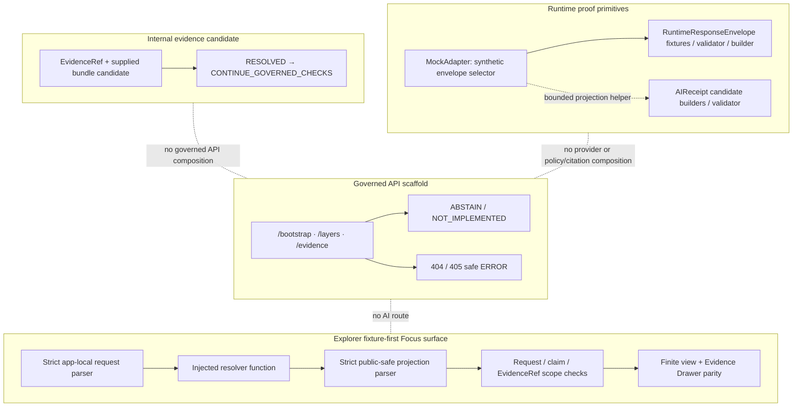

<!-- [KFM_META_BLOCK_V2]
doc_id: kfm://doc/architecture-governed-ai-boundaries
title: Governed AI — Boundary and Trust-Membrane Reference
type: architecture-reference
version: v2.0.0-draft
status: draft; repository-grounded; bounded-guards-present; end-to-end-runtime-hold; non-authoritative; no-release; no-publication
owners:
  - "@bartytime4life — verified CODEOWNERS review route"
  - "NEEDS VERIFICATION — independent Governed API, governed-AI, runtime, evidence, policy, citation, security, privacy, contracts, schemas, validation, correction, release, UI, and accessibility stewardship"
created: 2026-05-24
updated: 2026-08-20
policy_label: public
truth_posture: cite-or-abstain
owning_root: docs/
current_path: docs/architecture/governed-ai/BOUNDARIES.md
responsibility: >-
  Explain the current governed-AI trust boundaries, the bounded repository
  guards that exist, the target evidence-to-model-to-client flow, the object
  families that must not collapse, and the proof required before a live
  governed-AI operation may cross the trust membrane.
evidence_snapshot:
  repository: bartytime4life/Kansas-Frontier-Matrix
  base_ref: main
  base_commit: 4592507a4698a08b74bf154d1249e2ce0bf1592a
  target_prior_blob: 5364452ed999cd79154afcfa7bf8bd50379a944b
  directory_rules_blob: fd49a0b83e55cef52c1124281f093e263526898d
  directory_rules_decision: ADR-0029 accepted
  governed_ai_readme_blob: 9e1071bb69910bde3f364d319923c4db00637639
  adapter_architecture_blob: d38351198939b63a57e583cb404a0daf379fa3a4
  ai_receipts_architecture_blob: 721bf4647f49a510a597d7b3c4d305bc70fa3097
  focus_flow_blob: 6f6d98f4101acfe686d20d31665317240d705f42
  mock_first_blob: 7d123cab64a6da5dd6a191dd5b42d44418f3da23
  governed_api_main_blob: 4eb335c7c0b27f62c7419c478542e8fe40e1ff38
  governed_api_registry_blob: 3418168d0b267160d6ad6dd87f289e880ef4a024
  governed_api_boundary_test_blob: 4035e537e6c52194928df5ab8ceb41a35f5f30ca
  governed_api_abstain_test_blob: 2be20f5d93c03da7677c34b11a31875a00b2ed28
  explorer_focus_types_blob: 919ba17b92405d0998689ca8579fa42e74f4df60
  explorer_focus_parser_blob: 35f068145735430ad05d7bd7e4db6c4fe017a19b
  explorer_focus_resolver_blob: 45aa4e7479a8c95138f98cc48c846f39a16aec2d
  explorer_boundary_test_blob: 97d44069b0a5ab4a82b1e1fc48665e905c08a287
  boundary_constants_blob: 6c61f8e9160faa6d91b9c3e0cb6713dad153d9b5
  evidence_resolver_readme_blob: d64f112e9fe6538178c74dd31cc751235781c7f3
  evidence_runtime_projection_blob: af3fe40b628e15530878e4bbe0449e5d61827442
  runtime_response_contract_blob: 5060aaaa30fea37b6eeea6e1428b9effa6a163bd
  runtime_response_schema_blob: 8b86e7db8b18b65a56a4e639dfc54e1b2db93155
  ai_receipt_contract_blob: f4d8183dbed38f83144f6d9dbde30ae02a01edb8
  ai_receipt_schema_blob: 2e0bebdb3a38acbc3c58a919db46970c6e829b4a
inspection_boundary: >-
  Current-session GitHub reads covered the complete prior target, accepted
  Directory Rules and ADR-0029, the governed-AI folder inventory and current
  companions, current Governed API dispatcher, registry, stubs, route and
  boundary tests, Explorer Focus request/projection types, parser, resolver,
  policy boundary tests, the internal evidence-resolver package and runtime
  projection, model-adapter documentation and Mock/Ollama implementations,
  RuntimeResponseEnvelope and AIReceipt contracts/schemas/validators, current
  route and decision ADRs, generated-receipt requirements, current main, and
  exact-target open-PR overlap. No authenticated identity provider, grant
  store, active Focus policy evaluator, authoritative evidence service,
  citation service, AIReceipt emitter or durable store, provider endpoint,
  model daemon, deployed Focus route, public client session, runtime log,
  release environment, correction propagation, rollback drill, or publication
  was exercised.
related:
  - README.md
  - ADAPTER_CONTRACT.md
  - AI_RECEIPTS.md
  - CONTINUITY_NOTES.md
  - FOCUS_FLOW.md
  - MOCK_FIRST.md
  - OLLAMA_INTEGRATION.md
  - PROMPT_INJECTION.md
  - ROUTE_MAP.md
  - ../TRUST_MEMBRANE.md
  - ../../adr/ADR-0004-apps-governed-api-is-the-trust-membrane.md
  - ../../adr/ADR-0008-ollama-subordinate-to-governed-api.md
  - ../../adr/ADR-0019-ai-adapter-contract-and-finite-envelopes.md
  - ../../adr/ADR-0025-public-client-never-reads-canonical-internal-stores.md
  - ../../adr/ADR-0029-adopt-directory-governance-standard-v2.md
  - ../../doctrine/directory-rules.md
  - ../../../apps/governed-api/src/governed_api/main.py
  - ../../../apps/governed-api/src/governed_api/routes/registry.py
  - ../../../apps/governed-api/tests/test_boundary_guards.py
  - ../../../apps/explorer-web/src/features/focus_panel/resolver.ts
  - ../../../packages/evidence-resolver/README.md
  - ../../../contracts/runtime/runtime_response_envelope.md
  - ../../../contracts/runtime/ai_receipt.md
  - ../../../data/receipts/generated/README.md
tags: [kfm, architecture, governed-ai, boundaries, trust-membrane, public-client, evidence, policy, model-adapter, citation, finite-outcomes, ai-receipt, runtime-response-envelope, cite-or-abstain]
notes:
  - "v2.0.0-draft is a same-path repository-grounded rewrite; it changes documentation and its required generated authoring receipt only."
  - "The former OPEN-DR-11 placement discussion is obsolete for this file: accepted ADR-0029 supports PLACE at the existing docs/architecture/governed-ai/ path."
  - "The previous page mixed builder-AI and runtime-AI receipt requirements and named speculative schema homes; this revision separates current object families and removes unverified paths."
  - "Current source-level and fixture-level guards are bounded proof, not deployed network, identity, policy, evidence, citation, release, or publication enforcement."
[/KFM_META_BLOCK_V2] -->

<a id="top"></a>
<a id="governed-ai-boundaries"></a>
<a id="governed-ai--boundaries"></a>

# Governed AI — Boundaries

> **Operating boundary.** KFM may use generated language only as a bounded interpretation of governed context. Public clients, model providers, receipts, projections, schemas, tests, and documents do not create evidence truth, policy permission, review approval, release authority, or publication state.

| Field | Current repository-grounded result |
|---|---|
| **Evidence snapshot** | `main@4592507a4698a08b74bf154d1249e2ce0bf1592a` |
| **Placement** | Existing architecture reference under `docs/architecture/governed-ai/`; `PLACE` under accepted ADR-0029 and adopted Directory Rules v2 |
| **Current dynamic API surface** | Three `GET` routes: `/bootstrap`, `/layers`, and `/evidence`; all return deterministic `ABSTAIN / NOT_IMPLEMENTED` scaffold responses |
| **Governed-AI / Focus HTTP route** | **Absent from the current registry** |
| **Current Explorer Focus surface** | Fixture-first, no-network, strict app-local request and public-safe projection parsing through an injected resolver |
| **Current evidence resolution** | Internal, non-authoritative `v1alpha1` candidate check; `RESOLVED` means continue governed checks, not `ANSWER` |
| **Current model adapter** | Deterministic no-I/O `MockAdapter` selector; Ollama implementation remains a placeholder |
| **Current policy and citation composition** | Not established as an executing end-to-end Focus flow |
| **Current runtime accountability** | Proposed nine-field `AIReceipt` shape with bounded candidate builders and validator; no emitter or durable store verified |
| **Current client envelope** | Proposed schema-paired `RuntimeResponseEnvelope`; no answer text, citations, or AIReceipt reference in its current machine shape |
| **Current boundary proof** | Selected source-level import/path guards, strict client parsers, finite-envelope fixtures, validators, and focused tests |
| **End-to-end governed-AI operation** | **Not established / HOLD** |
| **Release or publication effect** | None |

> [!IMPORTANT]
> **A boundary is an authority separation, not a slogan.** “No direct model client” does not mean governed orchestration can never consult internal authority services. It means the browser and provider do not receive direct store access. Evidence, policy, release, and correction services may be consulted only through bounded internal interfaces; the provider receives minimized admissible context, and the client receives only an accepted public-safe response profile.

> [!CAUTION]
> **Current guards are deliberately narrow.** Import scans, forbidden path-literal scans, strict TypeScript parsers, fixture tests, and a no-I/O mock selector prove selected properties of source and synthetic inputs. They do not prove deployed network isolation, authentication, authorization, secret handling, egress control, policy execution, evidence authority, citation closure, receipt persistence, release binding, or public safety.

> [!WARNING]
> **Do not collapse current object families.** The app-local Focus projection is not the canonical runtime envelope. An evidence-resolver `RESOLVED` candidate is not an `ANSWER`. An `AIReceipt` is not evidence or release proof. A generated authoring receipt is not a runtime `AIReceipt`. A passing workflow, pull request, merge, deployment, or polished document is not publication.

**Quick navigation:** [Checkpoint](#0-current-repository-checkpoint) · [Scope](#1-scope) · [Placement](#2-repo-fit--directory-rules-basis) · [Two AI contexts](#3-two-surfaces-one-set-of-boundaries) · [Boundary picture](#4-the-boundary-picture) · [Principles](#5-first-principles) · [Boundary set](#6-the-five-canonical-boundaries) · [Crossings](#7-trust-membrane-crossings--what-may-pass-in-and-out) · [Outcomes](#8-finite-outcomes--the-only-legal-ai-return-values) · [Focus flow](#9-runtime-contract-focus-mode-flow) · [Adapters](#10-adapter-discipline--mockadapter-first-provider-neutral) · [Denials](#11-hard-denials--when-ai-must-deny-or-error) · [Sensitivity](#12-sensitive-domain-denial-defaults) · [Reasoning](#13-no-chain-of-thought-as-evidence) · [Object homes](#14-schema-and-contract-homes) · [Anti-patterns](#15-anti-patterns) · [Open work](#16-open-questions-and-adr-triggers) · [Related](#17-related-docs) · [Appendix](#18-appendix--glossary-and-quick-reference)

---

<a id="0-current-repository-checkpoint"></a>

## 0. Current repository checkpoint

The prior edition was useful doctrine, but it was authored before current repository evidence was available. It treated paths and controls as proposed, kept an obsolete Directory Rules divergence discussion, named speculative schema locations, and implied a more complete receipt and runtime flow than the current repository proves.

Current evidence supports a narrower and more useful split.

### 0.1 Confirmed bounded surfaces

| Surface | What current bytes prove | What they do **not** prove |
|---|---|---|
| [`apps/governed-api/src/governed_api/main.py`](../../../apps/governed-api/src/governed_api/main.py) | Small WSGI dispatcher, bounded JSON responses, `404` for unknown paths, and `405` for unsupported methods on registered paths | Authentication, authorization, policy, evidence resolution, citation validation, model invocation, release binding, or deployment |
| [`routes/registry.py`](../../../apps/governed-api/src/governed_api/routes/registry.py) | Exactly `/bootstrap`, `/layers`, and `/evidence` are registered | A Focus/model/AI route or a complete public API |
| [`test_abstain_routes.py`](../../../apps/governed-api/tests/test_abstain_routes.py) | Every registered route returns schema-shaped `ABSTAIN / NOT_IMPLEMENTED` scaffold state | Evidence-backed `ANSWER`, accepted policy, or production behavior |
| [`test_boundary_guards.py`](../../../apps/governed-api/tests/test_boundary_guards.py) | Selected forbidden imports, route manifest, safe `404`/`405`, and forbidden internal path literals are checked | Complete dependency, network, credential, data-flow, or deployment isolation |
| [`types.ts`](../../../apps/explorer-web/src/features/focus_panel/types.ts) | Closed app-local Focus request/projection vocabulary and finite client states | Canonical semantic or schema authority |
| [`parsers.ts`](../../../apps/explorer-web/src/features/focus_panel/parsers.ts) | Exact-field parsing, bounded text, HTTPS citation syntax, answer/negative-state coherence, and Evidence Drawer parity | Authentication of evidence, policy, review, release, freshness, citation, or receipt declarations |
| [`resolver.ts`](../../../apps/explorer-web/src/features/focus_panel/resolver.ts) | Injected-resolver boundary, empty-scope abstention, identity binding, and EvidenceRef allowlist enforcement without browser transport or store access | Governed API transport, EvidenceBundle resolution, policy execution, model inference, or receipt emission |
| [`test_explorer_web_adapter_boundary.py`](../../../tests/policy/test_explorer_web_adapter_boundary.py) | Selected map-import placement and forbidden store-literal checks | Complete browser dependency graph, network egress, or deployed isolation |
| [`packages/evidence-resolver/`](../../../packages/evidence-resolver/README.md) | Pure internal candidate evaluation with finite local statuses and no I/O | Authoritative lookup, source admission, policy, review, release, public answer, or publication |
| [`runtime_projection.py`](../../../packages/evidence-resolver/src/evidence_resolver/runtime_projection.py) | `RESOLVED` projects only to `CONTINUE_GOVERNED_CHECKS`; other candidate states fail closed | Final runtime outcome or render authority |
| [`MockAdapter.py`](../../../runtime/model_adapters/MockAdapter.py) | Deterministic deep-copy selection from a complete synthetic four-outcome matrix without I/O | Request interpretation, evidence resolution, policy, citations, provider calls, outcome authority, or receipt emission |
| [`OllamaAdapter.py`](../../../runtime/model_adapters/OllamaAdapter.py) | Placeholder file exists | An admitted or executable local provider |
| [`RuntimeResponseEnvelope`](../../../contracts/runtime/runtime_response_envelope.md) and [schema](../../../schemas/contracts/v1/runtime/runtime_response_envelope.schema.json) | Proposed closed finite client-envelope profile and `ANSWER`-only precision disclosure | Answer payload, citations, receipt reference, semantic outcome selection, or release |
| [`AIReceipt`](../../../contracts/runtime/ai_receipt.md) and [schema](../../../schemas/contracts/v1/runtime/ai_receipt.schema.json) | Proposed closed nine-field accountability profile and bounded local validation/building | Runtime emission, persistence, reference resolution, retention, signing, correction, approval, or release |
| [`data/receipts/generated/`](../../../data/receipts/generated/README.md) | Separate process-memory lane for AI-authored repository artifacts | Runtime AI accountability, factual proof, human approval, or publication |

### 0.2 Current maturity statement

**CONFIRMED:** KFM has meaningful boundary primitives: a fail-closed API scaffold, strict fixture-first client projection, internal evidence-candidate check, deterministic mock selector, finite envelope profile, receipt profile, and selected negative tests.

**CONFIRMED:** those pieces are not composed into a live governed-AI transaction.

**PROPOSED:** the target boundary model in this page defines how a complete transaction should separate authority and fail safely.

**UNKNOWN:** deployed network paths, live identities, effective grants, provider processes, operational policy, authoritative evidence lookup, citation service, receipt storage, correction propagation, and public behavior.

**NEEDS VERIFICATION:** accepted decision status, canonical request/response composition, executing controls, independent review, exact-head hosted checks, release binding, and rollback rehearsal.

[Back to top](#top)

---

<a id="1-scope"></a>

## 1. Scope

This page explains the architecture boundaries that govern model-mediated and AI-assisted behavior in KFM.

### In scope

- the public-client, Governed API, evidence, policy, provider, output, receipt, correction, and release separations;
- current repository-present guards and their proof limits;
- the target sequence from bounded request to finite client outcome;
- the distinction between runtime AI and repository-authoring AI;
- provider context minimization and prompt-injection containment;
- finite outcomes and fail-closed precedence;
- sensitive-domain, precision, data-minimization, telemetry, and chain-of-thought rules;
- current contract, schema, package, app, policy, receipt, and release homes;
- validation, graduation, rollback, and open verification.

### Out of scope

This page does not:

- accept [`ADR-0004`](../../adr/ADR-0004-apps-governed-api-is-the-trust-membrane.md), [`ADR-0008`](../../adr/ADR-0008-ollama-subordinate-to-governed-api.md), [`ADR-0019`](../../adr/ADR-0019-ai-adapter-contract-and-finite-envelopes.md), or [`ADR-0025`](../../adr/ADR-0025-public-client-never-reads-canonical-internal-stores.md);
- define a new semantic contract, JSON Schema, policy rule, route, provider profile, fixture, validator, workflow, data object, or release record;
- authenticate current declarations embedded in fixtures;
- claim a live provider, Focus route, evidence service, citation service, receipt store, release, deployment, or publication;
- make documentation the source of runtime authority.

### Authority rule

Architecture prose may explain and reconcile current evidence. It cannot override:

1. accepted decisions;
2. semantic contracts;
3. machine schemas;
4. policy source;
5. implementation and observed runtime behavior;
6. evidence, review, release, correction, and rollback records.

When those surfaces conflict, this page records the conflict and keeps the operation on `HOLD`; it does not choose a winner silently.

[Back to top](#top)

---

<a id="2-repo-fit--directory-rules-basis"></a>

## 2. Repo fit — Directory Rules basis

### Placement outcome: `PLACE`

Accepted [`ADR-0029`](../../adr/ADR-0029-adopt-directory-governance-standard-v2.md) adopts [`docs/doctrine/directory-rules.md`](../../doctrine/directory-rules.md) as the writable placement authority. This target is an existing human-readable architecture reference under `docs/architecture/governed-ai/`; it remains at the same path.

The former `OPEN-DR-11` treatment is not current placement authority for this file. No new root, parallel architecture home, contract home, schema home, policy home, receipt family, or release lane is created.

| Responsibility | Owning root or surface | Role of this page |
|---|---|---|
| Human boundary explanation | `docs/architecture/governed-ai/` | Current owning lane |
| Binding decisions | `docs/adr/` | Report status and dependencies; never accept by prose |
| Semantic meaning | `contracts/` | Link and summarize |
| Machine shape | `schemas/` | Link and report exact current fields |
| Admissibility and obligations | `policy/` | Report current scaffolds and target gates |
| Deployable API and clients | `apps/` | Report current executable evidence |
| Provider-neutral runtime lane | `runtime/model_adapters/` | Report current selector/placeholder evidence |
| Reusable evidence and envelope code | `packages/` | Report bounded package behavior |
| Fixtures, validators, and tests | `fixtures/`, `tools/`, `tests/` | Bound proof claims to exact scope |
| Process-memory receipt instances | governed `data/receipts/` lanes | Preserve object-family separation |
| Release, correction, withdrawal, rollback | `release/` and accepted companion families | Never decide here |

### Decision status

| Decision | Current source posture | Boundary consequence |
|---|---|---|
| ADR-0029 — Directory Rules v2 | **Accepted** | Governs placement |
| ADR-0004 — Governed API as dynamic membrane | **Draft / effectively proposed** | Current app is a candidate scaffold, not an accepted complete membrane |
| ADR-0008 — Ollama subordinate to Governed API | **Draft / effectively proposed** | Consistent with current structure; no provider admission |
| ADR-0019 — provider-neutral adapter and finite envelopes | **Draft / effectively proposed** | Bounded code exists; production seam remains unaccepted |
| ADR-0025 — public client store isolation | **Draft / effectively proposed** | Selected guards exist; deployed isolation remains unproved |

Implementation can be consistent with a proposed decision without accepting it. Conversely, accepting a decision would not prove complete enforcement.

[Back to top](#top)

---

<a id="3-two-surfaces-one-set-of-boundaries"></a>

## 3. Two AI contexts, one trust posture—not one contract

The prior page described “builder AI” and “runtime AI” as two surfaces using one set of boundaries. The useful idea remains, but the object families and authority paths must stay distinct.

| Context | What it does | Evidence source | Receipt family | Terminal authority |
|---|---|---|---|---|
| **Repository-authoring AI** | Inspects authorized repository evidence, proposes or writes bounded changes, runs available validation, and opens reviewable work | Current user authority, attached sources, repository bytes, tests, checks, and generated artifacts | [`GENERATED_RECEIPT`](../../../data/receipts/generated/README.md) when required for AI-authored diffs | Human review and repository governance; never release/publication by the receipt |
| **Runtime governed AI** | Interprets a bounded request over admitted context and returns a candidate inside governed orchestration | Resolved and policy-admissible evidence, release/correction state, request scope, and accepted runtime controls | Proposed [`AIReceipt`](../../../contracts/runtime/ai_receipt.md) where an accepted operation requires it | Governed orchestration plus separate evidence, policy, citation, review, release, correction, and rollback authority |

Shared posture:

- generated language is never root truth;
- authority-bearing refs must resolve or the operation fails closed;
- no secret or protected payload is exposed to the wrong surface;
- finite outcomes replace improvisational fallback;
- receipts preserve process memory but do not approve their own subject;
- changes and runtime operations remain reviewable and reversible.

Non-collapse rules:

- a generated authoring receipt is not an AI runtime receipt;
- a repository tool may read files within authorized task scope; that does not authorize a runtime model to read lifecycle stores;
- runtime orchestration may consult internal authority services; the provider receives only minimized context;
- a runtime receipt may record an event; it does not make the event's answer true or releasable.

[Back to top](#top)

---

<a id="4-the-boundary-picture"></a>

## 4. The boundary picture

### 4.1 CONFIRMED current disconnected proof surfaces


```mermaid
flowchart TB
  subgraph CLIENT["Explorer fixture-first Focus surface"]
    FR["Strict app-local request parser"]
    IR["Injected resolver function"]
    FP["Strict public-safe projection parser"]
    SC["Request / claim / EvidenceRef scope checks"]
    UI["Finite view + Evidence Drawer parity"]
    FR --> IR --> FP --> SC --> UI
  end

  subgraph API["Governed API scaffold"]
    REG["/bootstrap · /layers · /evidence"]
    NEG["ABSTAIN / NOT_IMPLEMENTED"]
    SAFE["404 / 405 safe ERROR"]
    REG --> NEG
    REG --> SAFE
  end

  subgraph EVIDENCE["Internal evidence candidate"]
    ERC["EvidenceRef + supplied bundle candidate"]
    RP["RESOLVED → CONTINUE_GOVERNED_CHECKS"]
    ERC --> RP
  end

  subgraph RUNTIME["Runtime proof primitives"]
    MOCK["MockAdapter: synthetic envelope selector"]
    ENV["RuntimeResponseEnvelope fixtures / validator / builder"]
    REC["AIReceipt candidate builders / validator"]
    MOCK --> ENV
    MOCK -. "bounded projection helper" .-> REC
  end

  API -. "no AI route" .- CLIENT
  EVIDENCE -. "no governed API composition" .- API
  RUNTIME -. "no provider or policy/citation composition" .- API
```

The absence of connecting arrows is material. Current pieces exercise boundaries separately. They do not establish a live request path.

### 4.2 PROPOSED target governed runtime flow


```mermaid
flowchart LR
  C["Governed client request"] --> A["Authentication, capability, audience, purpose, scope"]
  A --> P1["Policy / rights / sensitivity precheck"]
  P1 -->|blocked| O["Finite outcome selection"]
  P1 --> E["EvidenceRef resolution through authority service"]
  E -->|unresolved / denied / error| O
  E --> R["Release, correction, withdrawal, freshness, precision checks"]
  R -->|blocked| O
  R --> M["Minimized admissible context"]
  M --> AD["Provider-neutral adapter"]
  AD --> UC["Untrusted structured candidate"]
  UC --> SV["Structured-output validation"]
  SV --> CV["Citation / support validation"]
  CV --> P2["Policy postcheck and disclosure obligations"]
  P2 --> O
  O --> AR["AIReceipt candidate and persistence if required"]
  AR --> RESP["Accepted public-safe response composition"]
  RESP --> G["Governed API"]
  G --> CL["Strict client projection"]
```

The target sequence preserves three hard facts:

1. evidence and permission are determined outside the provider;
2. provider output is still untrusted after generation;
3. final client state is selected by orchestration, not by fluent text.

The exact request contract, response payload, route, receipt sequencing, and envelope composition remain **PROPOSED / NEEDS VERIFICATION**.

[Back to top](#top)

---

<a id="5-first-principles"></a>

## 5. First principles

### 5.1 Evidence outranks generation

A consequential claim must depend on admitted support appropriate to its scope. A model may summarize, compare, classify, translate, or draft from that support. It cannot create the missing authority.

Failure posture:

- unresolved or inadequate support → `ABSTAIN`;
- explicit rights, sensitivity, or access prohibition → `DENY`;
- failed service or malformed state → `ERROR`.

### 5.2 Public clients use governed interfaces

The browser must not address lifecycle stores, canonical stores, evidence-internal stores, release-internal stores, graph/search internals, provider endpoints, or credentials directly.

A separately governed static edge may eventually serve immutable released public-safe carriers. Placement under `data/published/` alone is not public routing or release authority.

### 5.3 Orchestration is allowed to mediate; providers are not

A safe system must be able to resolve evidence, policy, review, release, correction, and freshness. Those internal authority calls belong to governed orchestration or dedicated services.

The provider adapter must not receive:

- store handles, database credentials, service tokens, or unrestricted network tools;
- raw lifecycle paths or arbitrary internal queries;
- unresolved or out-of-scope EvidenceRefs;
- hidden policy source or protected denial rationale;
- more precise or sensitive context than the approved operation needs.

### 5.4 Candidate output is not a final response

Adapter output remains untrusted. Structured parsing, citation validation, evidence-scope checks, policy postcheck, precision/freshness/correction review, and finite outcome selection occur after generation.

### 5.5 Receipts are accountability, not truth

A receipt records provenance or process state. It cannot replace:

- an EvidenceBundle;
- a PolicyDecision;
- citation validation;
- human review;
- release or correction authority;
- observed runtime behavior.

### 5.6 Boundaries fail closed

Unknown authority does not become permissive because the system can produce plausible language. Missing, malformed, stale, corrected, withdrawn, denied, or operationally unavailable state yields a finite negative outcome.

### 5.7 Boundaries are reversible

A provider, route, policy profile, response version, released answer, or cached projection must be independently disableable, supersedable, correctable, and rollback-bound. Current repository evidence does not yet prove this operationally for Focus.

[Back to top](#top)

---

<a id="6-the-five-canonical-boundaries"></a>

## 6. The five boundary families

The old section name is retained for anchor compatibility. “Canonical” here does not mean these prose labels are accepted contract or ADR authority.

### 6.1 Truth and evidence boundary

**Question:** What can support a consequential claim?

| May support progression | Cannot create support |
|---|---|
| Admitted source roles, resolvable EvidenceRefs, admissible EvidenceBundles, valid temporal/spatial scope, correction-aware verification state | Model confidence, repeated generated wording, map pixels, search ranking, graph centrality, receipt presence, or schema validity alone |

Current nuance: the evidence-resolver package evaluates one caller-supplied candidate and returns `authoritative: false`. Its `RESOLVED` state permits remaining governed checks; it does not authorize rendering.

### 6.2 Public-client and trust-membrane boundary

**Question:** Which interfaces may public or ordinary clients use?

Allowed target:

- a governed dynamic API response;
- an approved static release-resolved carrier;
- a strict app-local projection derived from one of those surfaces.

Forbidden target:

- direct lifecycle/canonical/evidence-internal/release-internal/model-runtime access;
- browser-held provider credentials;
- browser-side policy or release authority;
- raw provider streams rendered as answers.

Current nuance: source-level guards and fixture-only clients exist; deployed network and static-edge enforcement remain unverified.

### 6.3 Provider and context boundary

**Question:** What may enter or leave a provider adapter?

The adapter may receive a bounded internal request and minimized context after prechecks. It may return a structured candidate plus provider-local status and bounded usage metadata.

It must not own evidence admission, policy, citations, final outcomes, public envelope assembly, receipts as approval, release, correction, or rollback.

Current nuance: `MockAdapter` does not implement this semantic seam; it selects already complete synthetic envelopes. Ollama remains a placeholder.

### 6.4 Output, citation, and accountability boundary

**Question:** What must happen before candidate language can become a client-visible answer?

Target gates:

1. structured-output validation;
2. claim-to-support and citation checks;
3. EvidenceRef scope and authority checks;
4. policy postcheck;
5. precision, freshness, correction, and withdrawal checks;
6. finite outcome selection;
7. required accountability record assembly and persistence.

Current nuance: isolated envelope, receipt, and citation-report profiles exist, but no service composes them end to end. The current `RuntimeResponseEnvelope` machine shape has no answer text, citation array, or AIReceipt reference; that composition must be decided explicitly.

### 6.5 Authority, release, correction, and publication boundary

**Question:** Who decides that a response or carrier may be exposed?

Neither a model, adapter, resolver candidate, receipt, validator, document, pull request, merge, workflow, nor deployment can decide publication alone.

A claim-bearing public path requires support appropriate to consequence, including:

- identity and request authority;
- evidence and source role;
- rights and sensitivity;
- validation and citation closure;
- review and release state;
- correction, withdrawal, and rollback behavior;
- current response/profile compatibility.

Current nuance: no Focus release or public operation is established.

[Back to top](#top)

---

<a id="7-trust-membrane-crossings--what-may-pass-in-and-out"></a>

## 7. Trust-membrane crossings — what may pass in and out

### 7.1 Browser to Governed API

A future request may carry only accepted, bounded client state such as:

- request/correlation identity;
- question or requested transform;
- audience, purpose, and capability context;
- map, feature, domain, spatial, temporal, and release scope;
- allowed EvidenceRefs or a governed scope selector;
- requested output profile and precision.

It must not carry or request:

- provider credentials or direct endpoint selection;
- internal filesystem/database paths;
- unrestricted store or tool access;
- authority expansion hidden in free text;
- sensitive precision outside the caller's capability.

Current app-local request shape is smaller: profile, request ID, claim ID, question, and allowed EvidenceRefs.

### 7.2 Governed orchestration to authority services

Internal orchestration may request:

- EvidenceRef resolution and candidate/bundle state;
- rights, sensitivity, role, purpose, and policy evaluation;
- review, release, correction, withdrawal, and freshness state;
- citation and support validation;
- required receipt persistence.

Those calls must be explicit, authenticated where required, scope-bound, observable without leaking protected content, and fail closed.

No current Focus composition proves these calls.

### 7.3 Governed orchestration to provider adapter

Allowed target context:

- minimized public-safe or role-authorized excerpts;
- stable evidence identifiers needed for candidate citation mapping;
- explicit limitations and unavailable dependencies;
- accepted prompt/profile identity;
- bounded output schema;
- cancellation, timeout, and provider-safe request metadata.

Forbidden context:

- credentials or secret-bearing configuration;
- raw source archives or arbitrary canonical-store handles;
- unresolved, denied, withdrawn, or out-of-scope evidence;
- hidden chain-of-thought from earlier runs;
- protected exact geometry when generalized context is sufficient;
- internal policy source or confidential review rationale.

### 7.4 Provider adapter to orchestration

Allowed output:

- one untrusted structured candidate;
- provider/model identity and version/digest where available;
- bounded usage, timing, timeout, or cancellation state;
- safe provider error classification.

Forbidden output path:

- raw token stream directly to browser;
- invented evidence authority;
- final policy decision;
- self-approved citation;
- final `RuntimeResponseEnvelope`;
- release/publication decision.

### 7.5 Governed API to client

A target response may contain only an accepted public-safe response composition, potentially including:

- finite outcome and safe reason;
- answer payload only for `ANSWER`;
- validated citations and public-safe EvidenceRefs;
- actual supported precision;
- limitations and obligations;
- freshness/correction/withdrawal posture;
- safe process references where disclosure is allowed.

Current unresolved seam: the canonical-looking `RuntimeResponseEnvelope` does not contain answer text, citations, or receipt reference, while the app-local Focus projection does. A versioned decision is required before live integration.

### 7.6 Logs, telemetry, receipts, and diagnostics

May record:

- stable request/run/profile identifiers;
- outcome and safe reason code;
- component/version/digest references;
- timing and bounded counts;
- policy/citation/receipt references where allowed;
- correction and rollback correlation.

Must not record:

- secrets or credentials;
- private prompts or hidden chain-of-thought;
- full raw evidence or restricted payloads;
- exact protected locations;
- confidential policy rationale;
- living-person or genomic detail beyond an approved purpose;
- unsanitized provider output.

[Back to top](#top)

---

<a id="8-finite-outcomes--the-only-legal-ai-return-values"></a>

## 8. Finite outcomes — the only legal client results

| Outcome | Meaning | Typical causes | Client rule |
|---|---|---|---|
| `ANSWER` | A bounded answer may be rendered under the accepted response profile | Evidence, policy, citation, review, release, freshness, correction, precision, and required accountability gates all pass | Render only the validated public-safe payload and obligations |
| `ABSTAIN` | The system cannot support the requested claim without guessing or overreaching | Missing/unresolved/stale/conflicted evidence, unsupported scope, citation insufficiency, or incomplete context | Show insufficiency or narrower scope; no inferred answer |
| `DENY` | The operation or detail is prohibited | Rights, sensitivity, access, purpose, release, withdrawal, or harmful-precision rule | Withhold restricted payload and expose only approved safe reason/alternative |
| `ERROR` | The transaction could not complete safely or deterministically | Malformed state, unavailable service, invalid candidate, receipt failure where required, timeout, or internal fault | Show bounded error; no stale/model fallback |

### 8.1 States that are not fifth client outcomes

| State | Meaning | Required treatment |
|---|---|---|
| `RESOLVED` evidence candidate | The bounded candidate check passed | Continue evidence-authority, rights, sensitivity, policy, review, release, citation, and correction checks |
| `ALLOW` policy result | A named policy evaluation permits a bounded operation | Continue remaining gates; not an answer |
| Citation report `PASS` | Declared or resolved citation checks passed for its profile | Continue policy/release/outcome selection; not an answer |
| Closure `SUPPORTED` / `QUALIFIED` | App-local composed-claim support state | Maps to app-local `ANSWER`; not a fifth runtime outcome |
| `HOLD` | Implementation/review graduation is blocked | Do not expose as a client runtime outcome unless a future contract defines it |
| `NARROWED` / `BOUNDED` | Descriptive qualifier in some doctrine | Do not emit as a fifth outcome without contract/schema change |

### 8.2 Outcome precedence

A future accepted contract should define exact precedence. The safe current architecture rule is:

1. malformed or failed component state → `ERROR`;
2. explicit policy/access prohibition → `DENY`;
3. insufficient or unresolved support → `ABSTAIN`;
4. `ANSWER` only after every required positive gate closes.

A provider's preference, confidence, or fluent completion cannot upgrade a negative state.

[Back to top](#top)

---

<a id="9-runtime-contract-focus-mode-flow"></a>

## 9. Runtime contract: Focus Mode flow

### 9.1 Current confirmed client flow

```text
unknown request input
  -> exact app-local request parser
  -> empty EvidenceRef scope => ABSTAIN without resolver call
  -> injected resolver
  -> exact public-safe projection parser
  -> request/claim identity check
  -> returned EvidenceRef subset check
  -> finite view model + Evidence Drawer parity
```

This flow is useful because it proves the browser can reject malformed, over-scoped, or incoherent fixture projections without direct provider or lifecycle-store access.

It does not prove the injected resolver is a Governed API, that declarations are authentic, or that any upstream evidence/policy/citation/release work occurred.

### 9.2 Target governed server transaction

```text
validate request and profile
  -> authenticate identity and capability
  -> bind audience, purpose, spatial/temporal/release scope
  -> policy / rights / sensitivity precheck
  -> resolve allowed EvidenceRefs through authority services
  -> apply verification, review, release, correction, withdrawal, freshness, precision checks
  -> assemble minimized admissible context
  -> invoke provider-neutral adapter
  -> reject malformed or out-of-contract candidate
  -> validate citations and support
  -> policy postcheck and disclosure obligations
  -> choose ANSWER / ABSTAIN / DENY / ERROR
  -> persist required AIReceipt or fail closed
  -> compose accepted public-safe payload and RuntimeResponseEnvelope relationship
  -> return through Governed API
  -> strict client parser and renderer
```

### 9.3 Unresolved contract seam

Three current profiles cannot be silently treated as one:

1. app-local Explorer Focus request/projection types;
2. generic permissive Focus request/response schemas;
3. proposed `RuntimeResponseEnvelope`.

A live route requires an accepted composition or versioned migration that answers:

- where answer text and citations live;
- how an AIReceipt is referenced;
- which object carries policy/citation references and obligations;
- which identity binds request, claim, envelope, payload, receipt, evidence, and release;
- which client versions may render which response;
- how correction, withdrawal, and rollback invalidate cached answers.

Until then, the end-to-end Focus route remains on `HOLD`.

[Back to top](#top)

---

<a id="10-adapter-discipline--mockadapter-first-provider-neutral"></a>

## 10. Adapter discipline — MockAdapter first, provider neutral

### 10.1 Current `MockAdapter`

The executable mock is a deterministic selector over caller-supplied complete synthetic envelopes.

It proves:

- all four finite outcomes can be represented;
- configuration fails when the matrix is incomplete;
- selection is deterministic;
- returned values are isolated copies;
- no provider/file/network/clock/secret I/O is required for the selected proof.

It does not prove:

- request or prompt parsing;
- semantic outcome selection;
- evidence, policy, citation, precision, freshness, or correction logic;
- provider behavior;
- AIReceipt emission;
- Governed API or client integration.

### 10.2 Proposed production adapter seam

A production adapter should translate between one accepted internal admissible request and provider-specific mechanics. Provider vocabulary must not leak into public contracts.

The adapter may own:

- provider request translation;
- invocation within an approved profile;
- response parsing into an internal candidate;
- provider-local timeout, cancellation, and bounded usage state;
- safe provider failure classification.

The adapter must not own:

- evidence or source authority;
- policy, rights, sensitivity, or access;
- citation validation;
- final finite outcome;
- public response or envelope construction;
- receipt approval;
- release, correction, rollback, or publication.

### 10.3 Provider admission gates

Before a live provider/profile may be used:

1. the adapter decision and semantic interface are accepted;
2. exact provider/model/version/profile identity is pinned;
3. license, terms, privacy, security, and data-use posture are reviewed;
4. credentials and network egress are least-privilege and non-browser;
5. timeout, cancellation, concurrency, and resource budgets are defined;
6. prompt-injection and structured-output negative tests pass;
7. evidence, policy, citation, receipt, and response composition are already proven with mocks;
8. telemetry and logs exclude protected content;
9. provider disablement and safe fallback are rehearsed;
10. release and rollback bind the exact operation.

Current provider posture: none admitted; Ollama remains a placeholder.

[Back to top](#top)

---

<a id="11-hard-denials--when-ai-must-deny-or-error"></a>

## 11. Hard denials — when AI must abstain, deny, or error

The old heading is retained for anchor compatibility. The outcome must match the owning failure, not be forced into `DENY`.

| Condition | Target outcome | Reason |
|---|---|---|
| Request or response shape malformed | `ERROR` | The transaction cannot be interpreted safely |
| Required EvidenceRef scope absent | `ABSTAIN` | No governed support was supplied |
| Evidence unresolved, stale, contradicted, corrected-away, or insufficient | `ABSTAIN` | Cite-or-abstain |
| Evidence authority service unavailable | `ERROR` | Do not call the provider without evidence |
| Caller lacks capability or purpose is prohibited | `DENY` | Access/purpose policy blocks the operation |
| Rights, sovereignty, sensitivity, or harmful precision explicitly blocks exposure | `DENY` | Protected material must not cross |
| Policy evaluator unavailable | `ERROR` or accepted fail-closed policy result | No permissive fallback |
| Provider unavailable or times out | `ERROR` | No fabricated answer |
| Provider candidate violates structured contract | `ERROR` | Raw candidate must not cross |
| Candidate support or citations are incomplete | `ABSTAIN` | No unsupported answer |
| Candidate contains restricted detail | `DENY` | Withhold or offer an approved generalized alternative |
| Required receipt cannot be assembled or persisted | `ERROR` / block `ANSWER` | Accountability requirement is unmet |
| Release withdrawn or response invalidated by correction | `ABSTAIN` or `DENY` according to accepted state semantics | Never serve affected answer as current |
| All required gates pass | `ANSWER` | Render only the bounded public-safe response |

### 11.1 Current fail-closed behavior

Current Governed API routes already demonstrate one safe posture: unimplemented operations return `ABSTAIN`, unknown paths and disallowed methods return safe `ERROR`, and no route emits an evidence-backed `ANSWER`.

That is useful negative proof. It is not proof of the target matrix above.

[Back to top](#top)

---

<a id="12-sensitive-domain-denial-defaults"></a>

## 12. Sensitive-domain denial defaults

KFM's fail-closed posture applies before context reaches a provider and again before output reaches a client.

| Material | Default boundary posture | Evidence needed to relax |
|---|---|---|
| Archaeological, cultural, sacred, or sovereignty-sensitive locations | Withhold or generalize exact detail; stage access | Qualified stewardship, rights/sovereignty review, approved transform, review and release record |
| Rare or vulnerable species locations | Generalize, delay, or deny exact geometry | Domain policy, geoprivacy transform, reviewer approval, public-safe release |
| Living-person, genealogy, genomic, consent, or private-land data | Deny broad public/model exposure unless a lawful, consented, purpose-bound operation is accepted | Legal/privacy/consent authority, minimization, access control, retention and correction plan |
| Critical infrastructure or exploitable operational detail | Generalize or role-gate | Security review, purpose/capability binding, approved disclosure profile |
| Hazard, health, or public-safety material | Never imply alert authority; preserve source time and official-channel direction | Official source role, freshness, disclaimers, release and correction behavior |
| Unknown source terms, rights, or redistribution posture | Quarantine or deny exposure | Verified terms and source admission record |
| Precision beyond supporting evidence | Reduce to supported precision or abstain | Evidence-bound precision profile and transform receipts where required |

### 12.1 Aggregation is not automatic declassification

Summaries, embeddings, indexes, graph projections, tiles, generalized prose, and model context can still leak protected information. Every transform needs its own policy and disclosure review appropriate to consequence.

### 12.2 Provider minimization

Sensitive handling is not delegated to the model. Redaction, generalization, role filtering, release checks, and scope minimization occur before provider invocation. Postcheck remains required because generated candidates may recombine or infer restricted detail.

### 12.3 Current enforcement status

These are governing defaults and target controls. No active end-to-end Focus policy evaluator or sensitive-domain provider flow was exercised in this session.

[Back to top](#top)

---

<a id="13-no-chain-of-thought-as-evidence"></a>

## 13. No chain-of-thought as evidence

KFM needs inspectable decisions, not private hidden reasoning.

### May be recorded when safe and required

- request and scope identifiers;
- accepted prompt/profile identity or hash;
- model/provider identity and version/digest;
- input/output digests;
- EvidenceRefs and authority-bearing decision references;
- finite outcome and safe reason codes;
- validation findings and limitations;
- concise public rationale tied to evidence;
- correction, supersession, withdrawal, and rollback correlation.

### Must not be treated as evidence or stored in public/accountability objects

- private chain-of-thought;
- hidden scratchpads;
- raw system prompts;
- credentials or secrets;
- unrestricted provider traces;
- full protected evidence payloads;
- confidential review or policy rationale;
- exact sensitive locations not authorized for the object.

A concise explanation of why an outcome occurred is allowed when it is evidence-linked and policy-safe. That explanation is not a substitute for the underlying evidence, policy decision, validation report, or release record.

[Back to top](#top)

---

<a id="14-schema-and-contract-homes"></a>

## 14. Contract, schema, policy, code, and receipt homes

The prior edition listed several speculative paths as though they were the target architecture. This revision reports current repository surfaces and leaves missing authority explicit.

| Object or behavior | Current home | Current status | Boundary note |
|---|---|---|---|
| Runtime client outcome semantics | [`contracts/runtime/runtime_response_envelope.md`](../../../contracts/runtime/runtime_response_envelope.md) | **PROPOSED; schema-paired** | Ten unconditional fields; `ANSWER` requires evidence and precision disclosure |
| Runtime client outcome shape | [`schemas/contracts/v1/runtime/runtime_response_envelope.schema.json`](../../../schemas/contracts/v1/runtime/runtime_response_envelope.schema.json) | **PROPOSED; fixture/validator backed** | No answer text, citations, or AIReceipt ref |
| Runtime AI accountability semantics | [`contracts/runtime/ai_receipt.md`](../../../contracts/runtime/ai_receipt.md) | **PROPOSED; schema-paired** | Nine fields; accountability only |
| Runtime AI accountability shape | [`schemas/contracts/v1/runtime/ai_receipt.schema.json`](../../../schemas/contracts/v1/runtime/ai_receipt.schema.json) | **PROPOSED; bounded validator/builders** | No emitter/store/retention/correction proof |
| Citation-readiness profile | [`contracts/evidence/citation_validation_report.md`](../../../contracts/evidence/citation_validation_report.md) and paired schema | **PROPOSED; fixture-first** | Declaration consistency is not live evidence authentication |
| Explorer Focus request/projection | [`apps/explorer-web/src/features/focus_panel/`](../../../apps/explorer-web/src/features/focus_panel/) | **CONFIRMED app-local implementation** | Strict local profile; not canonical semantic/schema authority |
| Generic Focus schemas | `schemas/contracts/v1/focus/` | **PROPOSED permissive scaffolds** | Must not silently replace app-local strict profile or runtime envelope |
| Evidence candidate resolver | [`packages/evidence-resolver/`](../../../packages/evidence-resolver/README.md) | **CONFIRMED internal alpha** | Non-authoritative, no I/O, no public API |
| Provider-neutral runtime lane | [`runtime/model_adapters/`](../../../runtime/model_adapters/README.md) | **CONFIRMED lane; mixed implementation** | Mock selector exists; provider adapter absent |
| Focus/runtime policy | [`policy/focus/`](../../../policy/focus/README.md), [`policy/runtime/`](../../../policy/runtime/README.md) | **Scaffold / non-enforcing for composed Focus flow** | No current end-to-end evaluator proof |
| Governed-AI HTTP transport | [`apps/governed-api/`](../../../apps/governed-api/) | **Current non-AI scaffold** | No AI/Focus route |
| AI-authored repository provenance | [`data/receipts/generated/`](../../../data/receipts/generated/README.md) | **CONFIRMED separate process-memory lane** | Not runtime AIReceipt, review, proof, or release |

### 14.1 Current exact object-field references

#### `RuntimeResponseEnvelope`

Unconditional current schema fields:

```text
id
spec_hash
version
issued_at
outcome
reason_code
evidence_refs
policy_state
freshness
correction_state
```

Conditional rule:

```text
ANSWER     -> requires precision_actually_used and at least one EvidenceRef
non-ANSWER -> forbids precision_actually_used
```

#### `AIReceipt`

Current schema fields:

```text
id
run_id
adapter
model_ref
inputs_digest
outputs_digest
policy_decision_ref
citation_validation_ref
outcome
```

Do not invent absent timestamp, prompt, EvidenceRef, token, cost, signature, retention, correction, supersession, or release fields in architecture prose.

### 14.2 Object-family non-collapse

| Object/state | Not equivalent to |
|---|---|
| `EvidenceRef` | `EvidenceBundle` or resolved authority |
| Resolver `RESOLVED` | `ANSWER`, policy clearance, citation pass, review, release, or render authority |
| Policy `ALLOW` | Evidence truth, citation closure, release, or answer |
| Citation report `PASS` | Source admission, evidence authority, policy, or publication |
| `AIReceipt` | Evidence, proof pack, policy decision, review, release manifest, or publication |
| `GENERATED_RECEIPT` | Runtime `AIReceipt`, human approval, factual proof, or merge authorization |
| `RuntimeResponseEnvelope` | Answer payload store, EvidenceBundle, release manifest, or publication |
| App-local Focus projection | Canonical runtime envelope |
| Fixture/test/workflow pass | Deployment, release, or publication |
| Merge/deployment | Governed promotion or KFM publication |

[Back to top](#top)

---

<a id="15-anti-patterns"></a>

## 15. Anti-patterns

| Anti-pattern | Why it fails |
|---|---|
| Browser calls Ollama, OpenAI, or another provider directly | Bypasses identity, evidence, policy, citation, receipt, release, correction, and safe failure |
| Provider receives database handles or unrestricted tools | Provider behavior becomes an authority and exfiltration path |
| Model output streams directly to the UI | Unvalidated candidate crosses the membrane |
| `RESOLVED`, `ALLOW`, schema-valid, or citation `PASS` is treated as `ANSWER` | Collapses independent gates |
| App-local Focus fields are copied into RuntimeResponseEnvelope by prose | Creates a parallel, unversioned contract |
| AIReceipt is required rhetorically but no emitter/store exists | Documentation claims accountability that runtime cannot perform |
| AIReceipt or generated receipt is displayed as proof or approval | Receipt presence is process memory, not truth/release authority |
| A fixture declares `REVIEWED`, `RELEASED`, or `CURRENT` and the browser treats it as authenticated | Client parser validates shape/coherence, not upstream authority |
| Missing policy/evidence/citation service falls back to model text | Fail-open behavior |
| Unknown rights or sensitive precision are left for the model to “avoid” | Safety is delegated to an untrusted candidate generator |
| Hidden chain-of-thought is stored as evidence | Private reasoning is unverifiable and may expose protected content |
| Logs capture prompts, raw evidence, exact locations, or credentials | Creates a second uncontrolled data path |
| Green workflow, PR, merge, deployment, or badge is described as publication | Collapses engineering delivery and governed release |
| Documentation selects a provider, route, policy, schema, or release authority without accepted decision and implementation proof | Prose becomes false authority |
| Boundary tests scan only literals but are described as full information-flow proof | Overstates the test's declared scope |

[Back to top](#top)

---

<a id="16-open-questions-and-adr-triggers"></a>

## 16. Open questions and ADR triggers

| Priority | Item | Current status | Closure evidence |
|---|---|---|---|
| P0 | Reconcile and decide ADR-0004, ADR-0008, ADR-0019, ADR-0025, and the overlapping Focus-specific adapter candidate | **PROPOSED / CONFLICTED / HOLD** | Accepted decisions with explicit relationships and supersession |
| P0 | Select canonical Focus request, answer-payload, runtime-envelope, citation, and receipt composition | **CONFLICTED / NEEDS VERIFICATION** | Versioned semantic contracts, schemas, fixtures, validators, consumers, migration note |
| P0 | Define authenticated Governed API Focus route, audience, purpose, capability, rate, and safe error model | **PROPOSED** | Route code, contract binding, auth tests, no-bypass proof |
| P0 | Integrate authoritative EvidenceRef-to-EvidenceBundle lookup and current verification/correction state | **PROPOSED** | Positive and exact-negative integration fixtures, replay/correction tests, observed consumer |
| P0 | Activate complete Focus policy precheck/postcheck and sensitivity controls | **PROPOSED / HOLD** | Reviewed policy bundle, entrypoints, tests, identity, runtime binding |
| P0 | Integrate citation validation against authenticated evidence and scope | **PROPOSED** | Service/validator composition, fail-closed tests, stable report identity |
| P0 | Decide AIReceipt applicability, sequencing, persistence, retention, access, correction, signing, and response linkage | **PROPOSED / HOLD** | Accepted contract evolution or companion objects, emitter, durable store, tests, runbook |
| P0 | Establish provider/model admission and egress/credential isolation | **HOLD** | Approved provider card, pinned model/profile, security/privacy review, negative tests, disablement |
| P1 | Mount Focus in the normal Explorer composition behind governed transport | **PROPOSED** | Strict client integration, accessibility/browser tests, no direct model/store path |
| P1 | Define telemetry and diagnostics without prompts, raw evidence, hidden reasoning, or protected precision | **PROPOSED** | Contract/schema/policy, negative tests, retention review |
| P1 | Propagate correction, withdrawal, supersession, stale state, and cache invalidation | **PROPOSED** | End-to-end rehearsal and rollback evidence |
| P1 | Define operational kill switch and safe degradation independent of non-AI map/evidence functions | **PROPOSED** | Config/route/client controls and restoration drill |
| P1 | Name independent stewards and separation-of-duties reviewers | **NEEDS VERIFICATION** | Accepted ownership and review records |
| P1 | Modernize and reconcile stale prompt-injection companion claims with current repository evidence | **NEEDS VERIFICATION** | Same-path evidence-backed update without importing speculative fields |
| P2 | Establish latency, context, concurrency, cost, timeout, retry, and load budgets | **UNKNOWN** | Measured tests and operational SLOs |
| P2 | Prove deployed network isolation, CSP/CORS, secret handling, incident response, and observability | **UNKNOWN** | Named-environment configuration, tests, logs, and rehearsal |

### ADR triggers

An accepted decision or migration record is required before:

- selecting or changing the dynamic public AI trust boundary;
- creating a canonical provider-neutral request/candidate contract;
- changing finite outcome vocabulary;
- adding answer/citation/receipt fields to RuntimeResponseEnvelope;
- making AIReceipt mandatory for a runtime operation or changing its field semantics;
- admitting a provider/model/profile;
- creating a second public API, provider path, schema home, policy home, or receipt family;
- exposing released static carriers through a new public edge;
- weakening direct-client/store/provider prohibitions;
- changing correction, withdrawal, rollback, or release authority.

[Back to top](#top)

---

<a id="17-related-docs"></a>

## 17. Related docs

| Path | Current role |
|---|---|
| [`README.md`](./README.md) | Governed-AI subsystem entry point and maturity map |
| [`ADAPTER_CONTRACT.md`](./ADAPTER_CONTRACT.md) | Current mock proof and proposed provider-neutral seam |
| [`AI_RECEIPTS.md`](./AI_RECEIPTS.md) | Current nine-field AIReceipt architecture and operational HOLDs |
| [`FOCUS_FLOW.md`](./FOCUS_FLOW.md) | Current client proof and proposed end-to-end Focus sequence |
| [`MOCK_FIRST.md`](./MOCK_FIRST.md) | Deterministic mock proof and provider graduation gates |
| [`ROUTE_MAP.md`](./ROUTE_MAP.md) | Current executable route inventory and absent AI route |
| [`CONTINUITY_NOTES.md`](./CONTINUITY_NOTES.md) | Cross-request/version/correction continuity |
| [`OLLAMA_INTEGRATION.md`](./OLLAMA_INTEGRATION.md) | Local-provider integration posture; implementation remains held |
| [`PROMPT_INJECTION.md`](./PROMPT_INJECTION.md) | Threat-doctrine companion; implementation claims require current reconciliation |
| [`../TRUST_MEMBRANE.md`](../TRUST_MEMBRANE.md) | Cross-root membrane architecture and current bounded enforcement map |
| [`ADR-0004`](../../adr/ADR-0004-apps-governed-api-is-the-trust-membrane.md) | Proposed dynamic trust-boundary decision |
| [`ADR-0008`](../../adr/ADR-0008-ollama-subordinate-to-governed-api.md) | Proposed provider subordination decision |
| [`ADR-0019`](../../adr/ADR-0019-ai-adapter-contract-and-finite-envelopes.md) | Proposed provider-neutral adapter and finite-envelope decision |
| [`ADR-0025`](../../adr/ADR-0025-public-client-never-reads-canonical-internal-stores.md) | Proposed public-client information-flow decision |
| [`ADR-0029`](../../adr/ADR-0029-adopt-directory-governance-standard-v2.md) | Accepted placement authority |
| [`Directory Rules`](../../doctrine/directory-rules.md) | Writable repository placement law |
| [`RuntimeResponseEnvelope`](../../../contracts/runtime/runtime_response_envelope.md) | Proposed client-facing runtime posture contract |
| [`AIReceipt`](../../../contracts/runtime/ai_receipt.md) | Proposed runtime accountability contract |
| [`Evidence resolver`](../../../packages/evidence-resolver/README.md) | Internal non-authoritative candidate resolver |
| [`Generated work receipts`](../../../data/receipts/generated/README.md) | Separate repository-authoring process-memory lane |

[Back to top](#top)

---

<a id="18-appendix--glossary-and-quick-reference"></a>

## 18. Appendix — glossary and quick reference

### 18.1 Boundary glossary

| Term | Meaning |
|---|---|
| **Trust membrane** | Composition of evidence, policy, review, release, delivery, and client refusal controls separating internal/unwarranted state from bounded public-safe use |
| **Governed orchestration** | Internal coordination that may consult authority services, minimize context, call an adapter, validate the candidate, and select a finite outcome |
| **Provider-neutral adapter** | Anticorruption seam translating an admissible internal request to provider mechanics and returning an untrusted candidate |
| **Public-safe projection** | Strict client-consumable shape that carries no more data or authority than its accepted profile permits |
| **Evidence candidate** | Non-authoritative result of bounded checks over caller-supplied evidence objects |
| **Finite outcome** | `ANSWER`, `ABSTAIN`, `DENY`, or `ERROR` |
| **AIReceipt** | Proposed nine-field runtime accountability object; not evidence or release authority |
| **GENERATED_RECEIPT** | Repository-authoring provenance record; not runtime AIReceipt, human approval, or publication |
| **Precision actually used** | Structured disclosure of the spatial, temporal, and attribute precision supported for an `ANSWER` |
| **HOLD** | Graduation status indicating named evidence is missing; not a fifth runtime outcome |

### 18.2 Current exact boundary matrix

| Boundary | Current proof | Missing proof |
|---|---|---|
| Public client → provider | No direct provider code in current Focus resolver; source-level guards | Full dependency graph, network policy, deployed egress |
| Public client → internal stores | Forbidden path-literal tests and no-store-access resolver design | Runtime/browser/network enforcement |
| Governed API route surface | Exact three-route registry, safe negative tests | Auth, policy, evidence, AI route, deployment |
| Evidence resolution | Internal deterministic candidate package and runtime projection | Authoritative lookup and governed consumer |
| Provider seam | Mock selector and proposed architecture | Accepted request/candidate contract and live adapter |
| Finite envelope | Closed schema, fixtures, validator, builder, tests | Semantic selection and route/client integration |
| AI accountability | Closed schema, builders, validator, fixtures | Emitter, store, retention, reference resolution, correction |
| Citation boundary | Fixture-first report profile elsewhere in repo | Live authenticated citation service |
| Release/correction | Separate repository families and doctrine | Focus release, propagation, rollback rehearsal |
| Publication | None | Governed release and observed public operation |

### 18.3 Documentation rollback

This same-path documentation slice is reversible:

1. close the draft pull request before merge, or revert the reviewed change after an authorized merge;
2. restore prior target blob `5364452ed999cd79154afcfa7bf8bd50379a944b`;
3. remove only the paired generated authoring receipt;
4. rerun Markdown, link, metadata, receipt, and aggregate checks.

No runtime, provider, evidence, policy, release, deployment, cache, or public-state rollback is required because this change modifies documentation and authoring provenance only.

### 18.4 Future operational rollback requirement

A live Focus operation should be independently disableable while preserving non-AI map browsing and Evidence Drawer access. Provider deactivation must not create a direct fallback. Affected cached answers must be invalidated when evidence, policy, release, correction, or withdrawal state changes.

This is a **PROPOSED requirement**, not current kill-switch proof.

### 18.5 No-loss reconciliation ledger

| Prior material | v2.0 disposition |
|---|---|
| Builder AI and runtime AI both need governance | Preserved, with separate object and authority paths |
| Evidence-first, policy pre/postcheck, citation validation, finite outcomes | Preserved and grounded |
| Five boundary framing | Preserved as five modernized boundary families |
| “AI never reads internal stores” | Corrected: public clients/providers do not; governed orchestration mediates authority services |
| AIReceipt + RunReceipt every runtime call | Retired as unsupported universal current behavior; exact AIReceipt profile and missing emitter/store recorded |
| Generated receipt for builder work | Preserved as separate authoring provenance where repository rules require it |
| Focus request/response examples and speculative schema homes | Replaced with current app-local profiles, current schemas, and explicit gaps |
| `OPEN-DR-11` placement issue | Retired for this path under accepted ADR-0029 |
| Prompt-schema hashes, NullAdapter, provider matrix, and unverified routes as current facts | Removed or bounded as future decision work |
| Sensitive-domain fail-closed posture | Preserved without inventing operational thresholds |
| No chain-of-thought as evidence | Preserved and clarified for receipts, logs, diagnostics, and public explanations |
| Anti-patterns, open questions, glossary | Preserved and expanded with current repository evidence |
| Publication language | Tightened: no document, receipt, test, PR, merge, deployment, or provider result is publication authority |

---

**Last reviewed:** 2026-08-20 against `main@4592507a4698a08b74bf154d1249e2ce0bf1592a`. Human review and hosted exact-head validation for this revision remain pending until the draft pull request is created.

[Back to top](#top)
