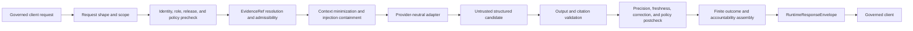

<!-- [KFM_META_BLOCK_V2]
doc_id: kfm://doc/architecture-governed-ai-boundaries
title: Governed AI — Trust, Authority, and Exposure Boundaries
type: architecture-standard
version: v2.0
status: draft; repository-grounded; bounded-proof-only; non-authoritative
owners:
  - "@bartytime4life — verified CODEOWNERS review route"
  - "NEEDS VERIFICATION — governed-AI, Governed API, runtime, evidence, policy, citation, security, privacy, contracts, schemas, validation, correction, retention, and release reviewers"
created: 2026-05-24
updated: 2026-08-20
policy_label: public
owning_root: docs/
responsibility: Explain the current governed-AI trust, authority, exposure, adapter, evidence, citation, receipt, correction, and release boundaries without becoming semantic, schema, policy, runtime, evidence, receipt-instance, release, or publication authority.
truth_posture: CONFIRMED current repository evidence / PROPOSED target orchestration and provider seam / UNKNOWN deployed isolation, composed runtime, provider admission, receipt persistence, correction propagation, and public release
repository: bartytime4life/Kansas-Frontier-Matrix
base_commit: 1162f7fccc902bfd56e2679e0b14f2633b7a9fd9
target_prior_blob: 5364452ed999cd79154afcfa7bf8bd50379a944b
codeowners_blob: dd2a84aa514d8ecd9208bc347f90f9a2ed37dd61
directory_rules_blob: fd49a0b83e55cef52c1124281f093e263526898d
adr_0029_blob: a4de0d7a96b78da59cfc499d1025e1508afd8dd9
adr_0004_blob: f2737900569447e8e20c8ce12b275167724b0cc5
adr_0019_blob: 5c45cbaf0aae510638088913757634ea978c9ec3
governed_ai_readme_blob: 9e1071bb69910bde3f364d319923c4db00637639
adapter_contract_blob: d38351198939b63a57e583cb404a0daf379fa3a4
ai_receipts_blob: 721bf4647f49a510a597d7b3c4d305bc70fa3097
runtime_response_contract_blob: 5060aaaa30fea37b6eeea6e1428b9effa6a163bd
runtime_response_schema_blob: 8b86e7db8b18b65a56a4e639dfc54e1b2db93155
runtime_response_builder_blob: 5dacededc1bda64292259ba39b6387facafbd1e8
mock_adapter_blob: 04d37e59b14c9e3b85126cb3380b6221b44e26d1
mock_adapter_test_blob: be1b1d2b4178b30ce9be754671a2c42271ad91bc
ollama_placeholder_blob: 1769a719d6a6df53e001abbc4c67ad486ab5c944
governed_api_routes_blob: 3418168d0b267160d6ad6dd87f289e880ef4a024
governed_api_stub_blob: 371e60d9f96c78e31c8a1e6109d19dee5da4213b
governed_api_boundary_test_blob: 4035e537e6c52194928df5ab8ceb41a35f5f30ca
explorer_focus_resolver_blob: 45aa4e7479a8c95138f98cc48c846f39a16aec2d
citation_report_contract_blob: 29c507e76a9c15c44f2c195b7342e93630cdc701
evidence_resolver_readme_blob: d64f112e9fe6538178c74dd31cc751235781c7f3
inspection_boundary: >
  Current-session GitHub reads covered the complete prior target, the governed-AI
  folder inventory and repository-grounded sibling pages, accepted Directory Rules
  and CODEOWNERS, relevant proposed ADRs, RuntimeResponseEnvelope and AIReceipt
  contracts/schemas/builders/validators, the deterministic MockAdapter and focused
  proof, the Ollama placeholder, Governed API route/stub/boundary-test surfaces,
  Explorer Focus resolution, runtime-policy stubs, the fixture-first
  CitationValidationReport profile, and the internal evidence-resolver candidate.
  No model daemon, provider endpoint, credential, active AI/Focus API route,
  authoritative evidence service, executing policy bundle, citation service
  integration, AIReceipt emitter or store, authentication deployment, public client
  session, correction propagation, rollback drill, release environment, or
  publication path was exercised.
related:
  - README.md
  - ADAPTER_CONTRACT.md
  - AI_RECEIPTS.md
  - FOCUS_FLOW.md
  - MOCK_FIRST.md
  - OLLAMA_INTEGRATION.md
  - PROMPT_INJECTION.md
  - ../../adr/ADR-0004-apps-governed-api-is-the-trust-membrane.md
  - ../../adr/ADR-0019-ai-adapter-contract-and-finite-envelopes.md
  - ../../adr/ADR-0029-adopt-directory-governance-standard-v2.md
  - ../../doctrine/directory-rules.md
  - ../../../contracts/runtime/runtime_response_envelope.md
  - ../../../contracts/runtime/ai_receipt.md
  - ../../../contracts/evidence/citation_validation_report.md
  - ../../../schemas/contracts/v1/runtime/runtime_response_envelope.schema.json
  - ../../../schemas/contracts/v1/runtime/ai_receipt.schema.json
  - ../../../packages/envelopes/src/envelopes/runtime_response.py
  - ../../../packages/evidence-resolver/README.md
  - ../../../runtime/model_adapters/MockAdapter.py
  - ../../../runtime/model_adapters/OllamaAdapter.py
  - ../../../apps/governed-api/src/governed_api/routes/registry.py
  - ../../../apps/governed-api/src/governed_api/stub.py
  - ../../../apps/governed-api/tests/test_boundary_guards.py
  - ../../../apps/explorer-web/src/features/focus_panel/resolver.ts
  - ../../../policy/runtime/README.md
  - ../../../tests/runtime_proof/test_mock_adapter_finite_outcomes.py
tags: [kfm, architecture, governed-ai, boundaries, trust-membrane, evidence-before-model, finite-outcomes, model-adapter, citation-validation, ai-receipt, prompt-injection, sensitive-data, correction, rollback]
notes:
  - "v2.0 replaces a stale doctrine-only page with a current repository-grounded architecture companion."
  - "Accepted ADR-0029 confirms the existing same-path docs/architecture/governed-ai lane; the former OPEN-DR-11 path warning is removed."
  - "ADR-0004 and ADR-0019 remain proposed; this page documents current evidence without accepting either decision."
  - "This revision changes documentation and its generated authoring receipt only."
  - "No contract, schema, policy, package, runtime, fixture, validator, test, workflow, receipt instance, provider, route, release, deployment, publication, source, or repository setting is changed."
[/KFM_META_BLOCK_V2] -->

# Governed AI — Trust, Authority, and Exposure Boundaries

> **Operating boundary.** KFM may use AI only as a bounded, untrusted interpretive stage inside governed orchestration. Evidence, policy, citations, precision, freshness, correction, finite outcomes, release, and publication remain outside provider control.

> [!IMPORTANT]
> **This page is explanatory architecture, not authority.** Semantic meaning belongs in `contracts/`; machine shape in `schemas/`; admissibility in `policy/`; implementation in `apps/`, `runtime/`, and `packages/`; evidence, receipts, and proofs in their governed data families; and release, correction, withdrawal, and rollback in their owning families. This page may explain those boundaries but cannot change them.

> [!CAUTION]
> **Bounded components are not an end-to-end governed-AI implementation.** The repository has a closed finite response schema, deterministic candidate builders, a no-I/O MockAdapter proof, local AIReceipt and citation-report validation surfaces, fail-closed API scaffolds, and a defensive Explorer Focus projection. It does not have a verified AI/Focus API route, executing runtime-policy bundle, composed evidence-and-citation path, admitted provider, durable AIReceipt store, deployed public AI operation, or release authorization.

> [!WARNING]
> **No raw model stream or direct browser-to-model path may become the normal public path.** Current source guards and tests are bounded repository evidence; they do not by themselves prove network isolation, authentication, deployment configuration, or runtime enforcement.

**Quick navigation:** [Status](#status-and-authority) · [Purpose](#purpose-and-scope) · [Evidence](#current-bounded-proof) · [Authority split](#responsibility-and-authority-split) · [Boundary families](#boundary-families) · [Inputs](#inbound-context-boundary) · [Outputs](#outbound-response-boundary) · [Outcomes](#finite-runtime-outcomes) · [Target flow](#target-governed-flow) · [Builder/runtime](#builder-and-runtime-contexts) · [Injection](#untrusted-content-and-prompt-injection) · [Sensitivity](#rights-sensitivity-and-harmful-precision) · [Reasoning](#private-reasoning-and-audit) · [Validation](#validation-and-graduation) · [Rollback](#change-discipline-and-rollback) · [Open work](#open-decisions-and-holds) · [Ledger](#evidence-ledger) · [Related](#related-documents)

---

## Status and authority

| Question | Current evidence-backed answer |
|---|---|
| Is this a tracked architecture document? | **CONFIRMED.** `docs/architecture/governed-ai/BOUNDARIES.md` exists at the inspected `main` commit. |
| Is this placement valid? | **CONFIRMED.** Accepted ADR-0029 adopts Directory Rules v2; this established same-path human architecture document remains under `docs/`. |
| Is there still a folder-vs-flat-file placement hold for this page? | **No current basis.** The governed-AI folder contains multiple distinct architecture companions, and the former flat `docs/architecture/governed-ai.md` entrypoint is absent at the inspected `main`. |
| Does this page accept the governed-AI trust-membrane or adapter decisions? | **No.** ADR-0004 and ADR-0019 remain draft/effectively proposed. This page cannot change their status. |
| Is a finite client-envelope profile implemented? | **CONFIRMED, bounded and proposed.** The `RuntimeResponseEnvelope` contract/schema, fixtures, validator, candidate builder, and proof tests exist. |
| Is a production AI route implemented? | **No verified route.** The current Governed API registry contains only `/bootstrap`, `/layers`, and `/evidence`. |
| Is a provider admitted? | **No.** `MockAdapter` is a deterministic fixture selector; `OllamaAdapter.py` remains a one-line placeholder. |
| Is runtime policy executing? | **No verified evaluator.** `policy/runtime/` documents non-enforcing stubs and an unbound fail-closed scaffold. |
| Are evidence and citation components fully composed into AI runtime? | **No.** A bounded internal evidence-resolver candidate and a fixture-first citation-report validator exist, but runtime/API adoption is not established. |
| Does this revision release, deploy, or publish anything? | **No.** It changes architecture documentation and generated authoring provenance only. |

### Directory Rules basis

Accepted [ADR-0029](../../adr/ADR-0029-adopt-directory-governance-standard-v2.md) adopts [Directory Rules v2](../../doctrine/directory-rules.md). The target receives `PLACE` as an existing same-path architecture explanation.

The owning root is `docs/` because the artifact explains cross-root responsibilities to humans. It does not create a second contract, schema, policy, evidence, receipt, proof, implementation, release, or publication authority.

[Back to top](#top)

---

## Purpose and scope

### Purpose

This page defines the architecture boundaries that prevent AI participation from collapsing KFM's trust spine. It applies wherever model-mediated generation or interpretation could affect repository work, runtime answers, map-assisted Focus experiences, exports, or review surfaces.

The page distinguishes:

1. **authority-bearing inputs** owned outside the model;
2. **admissible minimized context** prepared by governed orchestration;
3. **an untrusted adapter candidate** returned by a mock, local, or hosted provider;
4. **governed decisions and validation** applied after model execution;
5. **a finite client envelope** that downstream clients may render; and
6. **accountability records** that document participation without becoming truth or release authority.

### In scope

- current repository evidence for the Governed API, envelope, adapter, receipt, citation, evidence-resolver, policy, and client boundaries;
- the boundary between direct internal-store access and governed projection/resolution;
- allowed and forbidden adapter inputs and outputs;
- finite runtime outcomes;
- builder-side and runtime-side receipt distinctions;
- prompt-injection containment, data minimization, sensitive-content handling, safe diagnostics, and correction posture;
- validation, graduation, rollback, and unresolved holds.

### Out of scope

This page does not:

- accept ADR-0004, ADR-0019, or any provider-specific decision;
- define or change a contract, schema, policy rule, reason-code vocabulary, route, DTO, or storage model;
- implement a model adapter, evidence resolver, policy evaluator, citation service, API route, worker, receipt writer, or data store;
- admit credentials, live network access, sources, models, tools, or providers;
- authorize an `ANSWER`, release, deployment, promotion, publication, correction, withdrawal, or rollback.

[Back to top](#top)

---

## Current bounded proof

The table separates current repository evidence from the larger target architecture.

| Surface | CONFIRMED current evidence | Boundary and limitation |
|---|---|---|
| Governed-AI docs lane | Repository-grounded `README.md`, adapter, receipt, Focus, mock-first, Ollama, prompt-injection, continuity, route-map, and boundary companions are tracked. | Documentation explains relationships; it does not activate runtime behavior or settle proposed ADRs. |
| Runtime response | `RuntimeResponseEnvelope` has a semantic contract, closed Draft 2020-12 schema, validator, fixtures, deterministic candidate builder, and finite-outcome proof. | Local shape and consistency do not prove evidence resolution, policy authorization, public safety, or deployed client behavior. |
| `MockAdapter` | Deterministic, no-I/O selection of isolated prevalidated synthetic envelopes covering `ANSWER`, `ABSTAIN`, `DENY`, and `ERROR`. | It does not interpret a request, call a model, choose an outcome semantically, resolve evidence, evaluate policy, validate citations, or emit a receipt. |
| Provider lane | `OllamaAdapter.py` exists as a one-line greenfield placeholder. | No local or hosted provider/model/profile is admitted or operational. |
| Governed API | Three scaffolded GET routes return fail-closed envelopes; boundary tests cover route inventory, safe errors, methods, forbidden imports, and internal-store path literals. | No AI/Focus route or composed governed-AI flow exists. Tests do not prove deployed network controls. |
| Explorer Focus projection | The resolver accepts an injected governed resolver, emits safe local `ABSTAIN`/`ERROR`, validates response scope, and rejects evidence outside the request. | The browser performs no verified transport, model, policy, evidence-store, graph, vector-store, renderer, or lifecycle-store operation through this helper. |
| AIReceipt | Contract/schema, validator, fixture profile, deterministic candidate helpers, and documentation exist. | Runtime emission, durable persistence, retention, access control, signing, correction propagation, and release use remain unverified. |
| Citation validation | A fixture-first `CitationValidationReport` contract/schema/validator profile derives `PASS`, `ABSTAIN`, `DENY`, or `ERROR` from declared states. | It does not resolve evidence, authenticate bundles or review, evaluate policy, verify release, or authorize a public answer. |
| Evidence resolution | Internal alpha candidate checks can return `RESOLVED`, `UNRESOLVED`, `DENIED`, or `ERROR` over caller-supplied snapshots. | No registry/store access, source admission, claim-scope inference, policy evaluation, public-outcome mapping, or authoritative consumer is established. |
| Runtime policy | `policy/runtime/` documents proposed stubs and an unbound RunReceipt scaffold. | No accepted bundle, evaluator, native outcome mapping, reason surface, or governed consumer is established. |
| Focus schemas | `focus_request.schema.json` and `focus_response.schema.json` exist as open, empty proposed scaffolds. | They are not a production request/response contract and must not be treated as admission proof. |

> [!NOTE]
> **A green local validator is evidence about the named profile only.** It is not evidence that upstream references are authentic, the policy decision was authorized, a provider was admitted, a client is safe, or a release occurred.

[Back to top](#top)

---

## Responsibility and authority split

| Responsibility | Owning surface | Governed-AI boundary |
|---|---|---|
| Human architecture explanation | `docs/architecture/governed-ai/` | Explain current evidence, target composition, risks, holds, and rollback. |
| Architecture decisions | `docs/adr/` | Accept, reject, supersede, or narrow the trust-membrane, adapter, provider, or outcome decisions. |
| Semantic meaning | `contracts/` | Define what requests, envelopes, receipts, evidence objects, citations, policy decisions, and release objects mean. |
| Machine shape | `schemas/` | Define closed machine-readable profiles and compatibility. |
| Policy rule source | `policy/` | Define admissibility and obligations; policy source is not its own authenticated decision. |
| Governed public orchestration | `apps/governed-api/` | Compose authorized services and emit safe finite client envelopes. |
| Model/provider execution | `runtime/` and accepted implementation packages | Translate admitted minimized requests to provider mechanics and return untrusted candidates. |
| Reusable evidence/citation/envelope helpers | `packages/` | Implement bounded reusable behavior without acquiring public or release authority. |
| Evidence and source authority | evidence contracts, source registry, governed evidence services, and lifecycle records | Resolve support through governed interfaces; never let a model invent or self-admit evidence. |
| Receipt and proof instances | governed `data/receipts/` and `data/proofs/` lanes | Record process and proof objects without turning them into release decisions. |
| Release, correction, withdrawal, rollback | their distinct release and accountability families | Decide public-use state; AI may not self-promote or self-correct public records. |
| Public and ordinary clients | `apps/explorer-web/` and other governed consumers | Consume finite envelopes and released public-safe artifacts; never become model or internal-store clients. |

The model adapter is an **anticorruption seam**, not an authority root. Provider vocabulary, streaming formats, tool conventions, token accounting, or model confidence must not become KFM's public contract by leakage.

[Back to top](#top)

---

## Boundary families

The grouping below is an architecture convenience. The underlying rules come from KFM's evidence, lifecycle, policy, public-client, receipt, and release invariants.

### 1. Truth and evidence boundary

AI may interpret admissible context. It may not create evidence authority, source authority, claim-scope closure, or release state.

Required posture:

- consequential `ANSWER` candidates depend on governed support;
- `EvidenceRef` pointers are not closure until resolved through an owning interface;
- a model-proposed citation is untrusted until validated;
- model confidence, repetition, fluency, or provider reputation cannot upgrade evidence;
- maps, graph projections, vector indexes, retrieval scores, summaries, and prior model output remain derivatives;
- missing, stale, conflicted, revoked, corrected, withdrawn, or otherwise unresolved support remains a negative state.

Current implementation boundary: the repository has bounded candidate profiles for evidence resolution and citation reports, but no verified composed runtime path authenticates them for a public AI answer.

### 2. Exposure and trust-membrane boundary

The model adapter and ordinary public clients must not receive direct lifecycle-store, canonical-store, internal-service, credential, or protected-source access.

This does **not** mean governed orchestration can never consult internal systems. It means consultation occurs through explicit owning interfaces that return purpose-limited, policy-aware, release-aware projections or references. Direct bytes and query authority are not delegated to the model or browser.

Required posture:

- no direct browser-to-provider traffic in the normal public path;
- no direct browser-to-lifecycle or canonical-store traffic;
- no adapter-selected source lookup;
- no hidden feature properties outside the admitted request projection;
- no unrestricted tool or network authority merely because a provider supports tools;
- no raw provider stream returned to a client;
- no internal path, secret, prompt, restricted locator, or sensitive reason leaked through logs, errors, telemetry, or receipts.

Current proof is source-level and fixture-level. Deployed identity, egress, authentication, authorization, proxy, firewall, CSP/CORS, secrets, and runtime isolation remain **NEEDS VERIFICATION**.

### 3. Policy and authority boundary

AI may propose a candidate. It may not decide rights, sensitivity, source role, reviewer authority, release state, correction state, or publication.

Required posture:

- pre-model checks decide whether model invocation is admissible;
- post-model checks decide whether a candidate may become a client response;
- evaluator failure, missing policy context, or unknown authority fails closed;
- urgency, convenience, user insistence, or model confidence does not bypass policy;
- no AI-generated approval, receipt, test, PR, or explanation counts as human review;
- `HOLD` remains a governance/release status, not an invented fifth runtime outcome.

Current runtime-policy files do not implement this target. Three denial stubs are non-enforcing, and the RunReceipt scaffold has no consumer or result mapping. Absence of a denial is not permission.

### 4. Model and adapter boundary

A provider receives a minimized admitted request and returns an untrusted structured candidate. The adapter may translate provider mechanics; it must not own final KFM semantics.

An admitted adapter may eventually own:

- translation from an accepted internal request to provider-specific request syntax;
- bounded provider invocation under an approved profile;
- timeout, cancellation, and provider-local failure handling;
- parsing into an internal candidate shape;
- bounded usage metadata permitted by policy.

It must not own:

- evidence resolution or source admission;
- rights, sensitivity, review, policy, or release decisions;
- citation validation;
- final precision, freshness, or correction posture;
- public finite-outcome selection;
- client-envelope construction;
- receipt approval, release, correction, or publication.

The current `MockAdapter` is intentionally smaller: it selects prevalidated synthetic envelopes and proves no provider behavior.

### 5. Accountability, correction, and release boundary

AI participation should be auditable without converting audit records into truth.

Required separation:

- runtime `AIReceipt` records a bounded AI-mediated event when the accepted operation requires it;
- builder `GENERATED_RECEIPT` records AI authorship and validation of repository artifacts;
- `RunReceipt`, `AIReceipt`, `GENERATED_RECEIPT`, `CitationValidationReport`, `PolicyDecision`, `EvidenceBundle`, review records, proofs, release manifests, correction notices, and rollback records remain distinct object families;
- no receipt proves the referenced evidence, policy, review, or release decision merely because it names a reference;
- correction and withdrawal state must propagate to future responses and caches before operational graduation;
- no provider, adapter, or AI-authored document may promote, release, publish, withdraw, or roll back itself.

Current AIReceipt shape/validation exists, but runtime emission, store identity, retention, access, correction, signing, and public-reference behavior remain on HOLD.

[Back to top](#top)

---

## Inbound context boundary

The model adapter receives only the context needed for the admitted operation.

| Candidate input | Adapter posture | Required treatment |
|---|---:|---|
| Bounded user question or structured request | Conditional | Normalize, scope, size-limit, and treat as untrusted data. |
| Purpose-limited map context | Conditional | Include only admitted layers/features/time/refs and supported precision. |
| Released or otherwise operation-authorized evidence projection | Conditional | Resolve through owning interfaces; minimize fields; preserve source role, limitations, freshness, correction, and citation anchors. |
| Policy obligations and safe decision references | Conditional | Pass only what the adapter needs; do not delegate policy evaluation. |
| Output schema/profile reference | Allowed | Pin to the admitted operation and validate after model execution. |
| Raw `EvidenceBundle` copies | Denied by default | Prefer minimized projections; any larger context requires explicit contract and policy support. |
| RAW, WORK, QUARANTINE, PROCESSED, CATALOG, PUBLISHED, release, or canonical-store direct access | Denied | The adapter is not a lifecycle or canonical-store client. |
| Live source API or connector authority | Denied | Sources enter through governed intake, not model-directed fetching. |
| Credentials, signed URLs, private endpoints, secrets, cookies, or tokens | Denied | Never place in model context or receipts. |
| Hidden UI properties outside the admitted request | Denied | Do not bypass manifest/projection boundaries. |
| Private personal data, protected locations, restricted cultural material, or harmful precision | Denied unless specifically authorized and minimized | Prefer denial, abstention, generalization, redaction, staged access, or restricted non-public handling. |
| Prior model output presented as evidence | Denied | Prior generation remains untrusted derivative material. |
| Instructions embedded in evidence or source content | Data only | Never grant instruction precedence; contain and quote only as needed. |

Context assembly must be deterministic enough to inspect and replay where practical. Determinism does not make the underlying content true or policy-safe.

[Back to top](#top)

---

## Outbound response boundary

A provider candidate does not leave the governed boundary directly.

| Candidate output | Public/client posture | Required gate |
|---|---:|---|
| Valid `RuntimeResponseEnvelope` | Conditional | Schema and semantic validation, evidence/citation checks, policy/release/freshness/correction checks, and required accountability complete. |
| `ANSWER` content | Conditional | At least one top-level EvidenceRef; `precision_actually_used`; supported citations; required notices and obligations. |
| `ABSTAIN` | Allowed | Safe reason code; no answer-shaped precision or unsupported claim. |
| `DENY` | Allowed | Safe denial reason; no protected payload or sensitive rationale leak. |
| `ERROR` | Allowed | Safe diagnostic code; no prompt, raw provider output, internal path, or secret. |
| Raw provider text or stream | Denied | Parse and validate inside orchestration. |
| Unresolved or out-of-scope citation | Denied as `ANSWER` | Preserve `ABSTAIN`, `DENY`, or `ERROR` according to the owning decision semantics. |
| Model-proposed policy or release approval | Denied | Only owning policy/review/release processes may decide. |
| Private chain-of-thought or hidden reasoning trace | Denied | Do not persist or expose as evidence, proof, audit justification, or client output. |
| Synthetic/reconstructed content represented as observed | Denied | Label representation and limitations through owning contracts before any allowed use. |

The current Governed API stub emits `ABSTAIN` and safe `ERROR` envelopes only. That is fail-closed scaffold behavior, not proof of the target AI output path.

[Back to top](#top)

---

## Finite runtime outcomes

The current `RuntimeResponseEnvelope` schema permits exactly four client-facing outcomes.

| Outcome | Meaning at the client boundary | Minimum posture |
|---|---|---|
| `ANSWER` | The governed system may present a response under the supplied support and constraints. | Nonempty top-level evidence refs; `precision_actually_used`; policy, freshness, correction, and release posture appropriate to the operation; required citation/accountability artifacts. |
| `ABSTAIN` | The system does not have sufficient, current, admissible, or safely citable support for an answer. | Safe reason; no precision disclosure or inferred answer. |
| `DENY` | Policy, rights, sensitivity, role, release, consent, or exposure rules prohibit response delivery. | Safe reason; no restricted payload or rationale leak. |
| `ERROR` | The governed system could not complete safely or deterministically. | Safe diagnostic; no fallback to `ANSWER`. |

`precision_actually_used` is required for `ANSWER` and forbidden for the other three outcomes. Requested map zoom, display formatting, or model confidence cannot upgrade evidence-supported spatial, temporal, or attribute precision.

Package-local outcomes such as `RESOLVED`, `UNRESOLVED`, `DENIED`, `PASS`, or `HOLD` do not become public runtime outcomes automatically. Every mapping needs an accepted contract and fail-closed composition.

[Back to top](#top)

---

## Target governed flow

The full flow below is **PROPOSED architecture**, not a claim of current runtime composition.

```mermaid
flowchart LR
    A[Governed client request] --> B[Request shape and scope]
    B --> C[Identity, role, release, and policy precheck]
    C --> D[EvidenceRef resolution and admissibility]
    D --> E[Context minimization and injection containment]
    E --> F[Provider-neutral adapter]
    F --> G[Untrusted structured candidate]
    G --> H[Output and citation validation]
    H --> I[Precision, freshness, correction, and policy postcheck]
    I --> J[Finite outcome and accountability assembly]
    J --> K[RuntimeResponseEnvelope]
    K --> L[Governed client]
```

### Stage contract

| Stage | Owner | Model invoked? | Safe negative state |
|---|---|:---:|---|
| Request shape and scope | Governed API/orchestration | No | `ERROR` or `ABSTAIN` |
| Identity, role, release, and policy precheck | Auth/policy-aware orchestration | No | `DENY`, `ABSTAIN`, or `ERROR` |
| Evidence resolution and admissibility | Evidence service/resolver plus policy obligations | No | `ABSTAIN`, `DENY`, or `ERROR` |
| Context minimization | Governed orchestration | No | `ABSTAIN`, `DENY`, or `ERROR` |
| Provider-neutral adapter | Admitted runtime adapter | Yes | Adapter candidate failure only; no public outcome authority |
| Output and citation validation | Contract/schema/citation services | No | `ABSTAIN`, `DENY`, or `ERROR` |
| Precision, freshness, correction, policy postcheck | Owning services/orchestration | No | `ABSTAIN`, `DENY`, or `ERROR` |
| Outcome, receipt, and envelope assembly | Governed orchestration | No | Fail closed; no client response until required records are assembled |
| Client rendering | Governed client | No | Render only the finite envelope and required notices |

The order may be refined only through accepted contracts and decisions. No reordering may let provider execution precede required admission checks or let raw provider output reach a client.

[Back to top](#top)

---

## Builder and runtime contexts

KFM uses the same non-sovereignty rule in two different contexts.

| Context | AI role | Accountability family | Boundary |
|---|---|---|---|
| Repository builder | Draft, edit, compare, validate, explain, and propose repository work under current authority. | `GENERATED_RECEIPT` for substantively AI-authored artifacts where required. | The receipt records authorship and validation; it does not prove implementation, approval, mergeability, release, or publication. |
| Runtime interpretation | Produce an untrusted candidate over admitted governed context. | `AIReceipt` for an AI-mediated runtime event where the accepted profile requires it. | The receipt records bounded model participation; it does not prove evidence, policy, citation, review, or release authority. |

Builder activity must not be smuggled into runtime truth. Runtime receipts must not be reused as approval of repository changes. Both remain subordinate to current evidence, policy, human review, and release state.

[Back to top](#top)

---

## Untrusted content and prompt injection

Prompt injection is an architecture problem before it is a prompt-writing problem. User text, source text, evidence text, retrieved text, tool output, file content, URLs, comments, metadata, and model output are all untrusted data.

Required posture:

1. instruction authority is established outside untrusted content;
2. source or evidence text cannot change system policy, allowed tools, output schema, or release state;
3. context fields are selected explicitly rather than passed wholesale;
4. tool and network access are deny-by-default and operation-scoped;
5. model output is parsed into a closed candidate profile;
6. citations are checked against the admitted support scope;
7. postchecks inspect the candidate, not the model's claimed compliance;
8. logs, telemetry, errors, receipts, and exports exclude prompts, secrets, raw evidence, restricted geometry, and protected detail;
9. a fully compromised or hallucinating model still cannot authorize public truth.

The repository has architecture documentation for this posture, but the complete runtime defense stack is not verified. Do not turn documentation controls into implementation claims.

[Back to top](#top)

---

## Rights, sensitivity, and harmful precision

Unknown rights, consent, sovereignty, cultural authority, sensitivity, or release state fails closed.

Higher-risk families include:

- living-person and private household information;
- DNA, genomic, genealogy, and person-parcel joins;
- rare species, nests, dens, roosts, hibernacula, spawning, and protected flora;
- archaeology, burials, human remains, sacred places, and looting-risk locations;
- critical infrastructure, dependencies, condition detail, and exploitable operational state;
- private wells, land/title records, protected cultural material, and exact restricted sites.

Possible governed responses include `ABSTAIN`, `DENY`, quarantine, redaction, generalization, aggregation, staged access, delayed release, restricted review, or complete withholding.

Aggregation alone does not prove public safety. Domain thresholds, reviewer authority, consent requirements, transform semantics, and release obligations remain owned by their contracts, policies, qualified reviewers, and release records. This page does not invent them.

KFM is not an emergency, alert, medical, legal, or operational command authority. AI must not turn context into action instructions that exceed the released evidence and stated use boundary.

[Back to top](#top)

---

## Private reasoning and audit

KFM may retain bounded audit material such as:

- admitted input and output digests;
- adapter and model identity;
- policy and citation references;
- finite outcome;
- safe reason codes;
- validation reports;
- timestamps and version references where accepted;
- human-readable summaries and limitations;
- correction and supersession references.

KFM must not persist or expose as evidence, proof, review justification, or public output:

- private chain-of-thought;
- hidden reasoning tokens;
- speculative internal deliberation;
- raw prompts or provider request/response bodies by default;
- credentials, secrets, signed URLs, or private endpoints;
- raw evidence or protected details copied merely for audit convenience.

A receipt proves only what its accepted profile and validated bindings prove. It must state its non-effects.

[Back to top](#top)

---

## Validation and graduation

### Current repository-owned proof surfaces

| Surface | Focused evidence | What a pass would not prove |
|---|---|---|
| Runtime envelope | `tools/validators/validate_runtime_response_envelope.py`, fixtures, candidate-builder tests, finite-outcome tests | Evidence authenticity, policy authority, public release, deployed client behavior |
| MockAdapter | `tests/runtime_proof/test_mock_adapter_finite_outcomes.py` | Provider behavior, semantic outcome selection, evidence/citation composition |
| AIReceipt | `tools/validators/validate_ai_receipt.py` and focused package tests | Runtime emission, reference resolution, persistence, signing, correction, release |
| Governed API boundary | `apps/governed-api/tests/test_boundary_guards.py` | Deployed network isolation, authn/authz, egress, secrets, rate limits, public release |
| Citation report | `tools/validators/citation/validate_citation_validation_report.py` and synthetic fixtures | Source access, EvidenceBundle authenticity, policy/review/release authentication |
| Evidence resolver candidate | `make evidence-resolver` and `make evidence-resolver-deny` | Authoritative registry/store integration, claim-scope closure, public outcome mapping |
| Repository topology | `make repository-topology` | Semantic correctness of this page or runtime safety |

### Minimum graduation evidence

A public or semi-public governed-AI operation remains on HOLD until evidence appropriate to consequence establishes:

1. accepted request, candidate, envelope, receipt, citation, evidence, policy, and reason-code contracts;
2. an admitted provider-neutral adapter implementation and explicit provider/model/profile decision;
3. authenticated caller context and least-privilege authorization;
4. authoritative evidence-resolution composition with correction and verification-history handling;
5. executing policy precheck/postcheck with fail-closed evaluator behavior;
6. citation validation over the admitted support scope;
7. output schema and semantic validation;
8. prompt-injection, tool, network, secret, logging, telemetry, cache, and safe-error controls;
9. AIReceipt emission, durable storage, retention, access, correction, and incident-review behavior where required;
10. exact positive and negative fixtures, deterministic no-network tests, and bounded integration tests;
11. release, withdrawal, correction, cache invalidation, and rollback drills;
12. human review and the required release decision;
13. monitored deployment evidence without direct model or internal-store bypass.

A documentation update, schema pass, receipt, workflow, commit, pull request, merge, or badge cannot satisfy these gates by itself.

[Back to top](#top)

---

## Change discipline and rollback

### Change classes

| Change | Required discipline |
|---|---|
| Clarify current evidence or limitations in this page | Same-path documentation update with link and claim validation |
| Change semantic meaning or outcome vocabulary | Update owning contract and schema dependency-closed; ADR if decision-significant |
| Add or admit a provider/model/profile | Security, privacy, rights, policy, operational, compatibility, fixture, and rollback review |
| Add an AI/Focus API route | Governed API boundary review, contracts/schemas, authn/authz, evidence/policy/citation composition, tests, deployment controls |
| Change adapter input/output fields | Contract/schema/versioning and compatibility review; no provider-driven public-shape drift |
| Change receipt persistence or public exposure | Data, retention, access, privacy, correction, and release review |
| Permit sensitive context or greater precision | Qualified steward/policy/release decision with transform and correction support |

### Rollback

For this documentation slice:

- before merge, close the draft pull request and abandon the feature branch;
- after an authorized merge, revert the documentation and generated authoring-receipt commits or restore the prior target blob;
- no runtime, provider, policy, evidence, receipt-instance, release, deployment, or publication state requires restoration.

For future runtime changes, rollback must disable the exact route/provider/profile without weakening finite envelopes, evidence gates, policy, citation checks, correction state, or audit lineage.

[Back to top](#top)

---

## Open decisions and HOLDs

| Item | Current state | Closure evidence |
|---|---|---|
| ADR-0004 trust-membrane decision | Proposed | Accepted decision or explicit successor/narrowing record |
| ADR-0019 adapter/finite-envelope decision | Proposed | Accepted decision with compatibility and rollback |
| Governed-AI route | Absent | Accepted contract/schema, implementation, tests, authn/authz, deployment and release evidence |
| Focus request/response profiles | Open empty scaffolds | Semantic contract, closed schema, fixtures, validator, consumers, compatibility decision |
| Runtime policy | Non-enforcing/unbound stubs | Accepted bundle, evaluator, reason/obligation mapping, tests, consumer, fail-closed error behavior |
| Evidence resolver | Internal non-authoritative alpha candidate | Accepted contract/result mapping, authoritative snapshots/services, consumer, correction semantics |
| Citation validation | Fixture-first declaration profile | Authenticated upstream resolution and runtime integration |
| Provider/model/profile | None admitted | Provider-neutral seam plus explicit security/privacy/operational admission |
| Ollama adapter | Placeholder | Implemented and reviewed adapter behind the same boundary; no browser shortcut |
| AIReceipt runtime | Shape/validation only | Emitter, reference resolution, durable store, retention, access, correction, signing decision |
| Prompt-injection controls | Architecture described; composition unverified | End-to-end negative tests and deployed control evidence |
| Safe telemetry/logging | NEEDS VERIFICATION | Data classification, redaction, retention, access, tests, dashboards, incident path |
| Correction/withdrawal propagation | UNKNOWN | Runtime, cache, client, receipt, and release drill |
| Independent stewardship | NEEDS VERIFICATION | Verified named responsibility assignments and required review path |
| Public AI release | None | Promotion/release decision with correction and rollback evidence |

[Back to top](#top)

---

## Evidence ledger

| Evidence | Verified use in this revision | Limitation |
|---|---|---|
| `main@1162f7fccc902bfd56e2679e0b14f2633b7a9fd9` | Exact repository baseline | A commit proves bytes, not deployed behavior |
| Accepted ADR-0029 and Directory Rules v2 | Same-path placement and responsibility-root authority | Do not infer runtime or release maturity |
| Current `BOUNDARIES.md` blob `5364452e...` | Prior target identity and stale-claim inventory | Superseded only if this revision merges |
| Governed-AI README, Adapter Contract, and AIReceipt page | Current subsystem inventory, bounded proof, and HOLD posture | Architecture companions are not decisions |
| RuntimeResponseEnvelope contract/schema/builder | Current finite machine profile and local builder boundary | Proposed profile; no public runtime authorization |
| MockAdapter and focused proof | Deterministic no-I/O four-outcome selection | Not a model/provider adapter |
| Governed API registry/stub/boundary tests | Current route inventory and fail-closed scaffold behavior | No AI route or deployed network proof |
| Explorer Focus resolver | Defensive client projection and evidence-scope checks | No transport or full orchestration proof |
| Runtime policy README and files | Current stub/non-enforcing status | No evaluator or decision |
| CitationValidationReport contract | Fixture-first declared-state semantics | No authenticated evidence/policy/release resolution |
| Evidence-resolver README | Internal alpha candidate boundary | No authoritative/public consumer |
| CODEOWNERS | Verified GitHub review routing to `@bartytime4life` | Not stewardship, independent review, approval, or release authority |

### Evidence limit

No current-session model call, provider endpoint, credential, live source, authoritative evidence lookup, policy evaluation, citation-service call, AIReceipt emission/store, deployed API, browser session, correction propagation, release environment, rollback drill, or publication was exercised. Claims outside the inspected bounded surfaces remain `PROPOSED`, `UNKNOWN`, or `NEEDS VERIFICATION`.

[Back to top](#top)

---

## Related documents

### Governed-AI architecture

- [Subsystem README](./README.md)
- [Adapter Contract](./ADAPTER_CONTRACT.md)
- [AIReceipt Architecture](./AI_RECEIPTS.md)
- [Focus Flow](./FOCUS_FLOW.md)
- [Mock First](./MOCK_FIRST.md)
- [Ollama Integration](./OLLAMA_INTEGRATION.md)
- [Prompt Injection](./PROMPT_INJECTION.md)

### Decisions and placement

- [ADR-0004 — Governed API trust membrane](../../adr/ADR-0004-apps-governed-api-is-the-trust-membrane.md)
- [ADR-0019 — AI adapter and finite envelopes](../../adr/ADR-0019-ai-adapter-contract-and-finite-envelopes.md)
- [ADR-0029 — Adopt Directory Governance Standard v2](../../adr/ADR-0029-adopt-directory-governance-standard-v2.md)
- [Directory Rules v2](../../doctrine/directory-rules.md)

### Current implementation and proof surfaces

- [RuntimeResponseEnvelope contract](../../../contracts/runtime/runtime_response_envelope.md)
- [AIReceipt contract](../../../contracts/runtime/ai_receipt.md)
- [CitationValidationReport contract](../../../contracts/evidence/citation_validation_report.md)
- [RuntimeResponseEnvelope schema](../../../schemas/contracts/v1/runtime/runtime_response_envelope.schema.json)
- [AIReceipt schema](../../../schemas/contracts/v1/runtime/ai_receipt.schema.json)
- [Runtime response candidate builder](../../../packages/envelopes/src/envelopes/runtime_response.py)
- [Evidence resolver package](../../../packages/evidence-resolver/README.md)
- [MockAdapter](../../../runtime/model_adapters/MockAdapter.py)
- [Ollama placeholder](../../../runtime/model_adapters/OllamaAdapter.py)
- [Governed API route registry](../../../apps/governed-api/src/governed_api/routes/registry.py)
- [Governed API safe stub](../../../apps/governed-api/src/governed_api/stub.py)
- [Governed API boundary tests](../../../apps/governed-api/tests/test_boundary_guards.py)
- [Explorer Focus resolver](../../../apps/explorer-web/src/features/focus_panel/resolver.ts)
- [Runtime policy boundary](../../../policy/runtime/README.md)
- [MockAdapter proof](../../../tests/runtime_proof/test_mock_adapter_finite_outcomes.py)

---

**Last updated:** 2026-08-20 · **Doc version:** v2.0 · **Status:** repository-grounded draft · **Runtime/publication effect:** none

[Back to top](#top)
