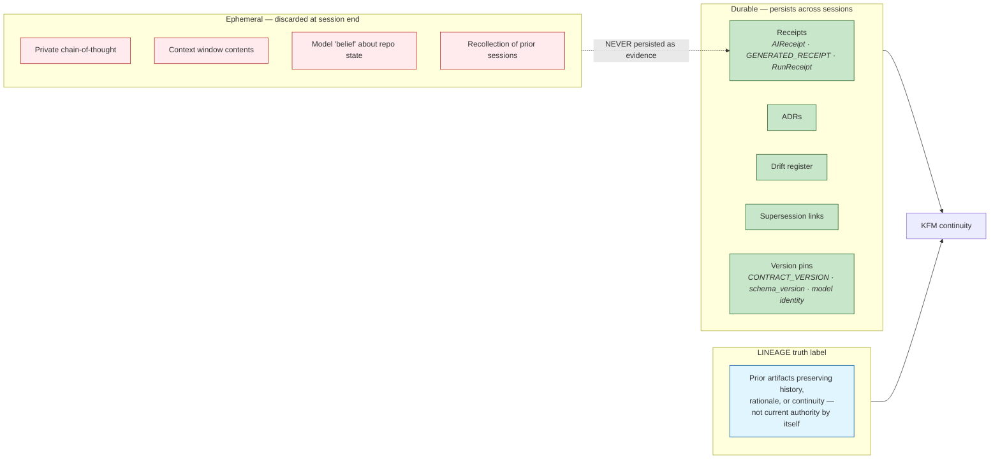

<!-- [KFM_META_BLOCK_V2]
doc_id: kfm://doc/architecture-governed-ai-continuity-notes
title: Governed AI — Continuity Notes
type: standard
version: v0.1
status: draft
owners: <AI-SURFACE-STEWARD> · NEEDS VERIFICATION
created: 2026-05-24
updated: 2026-05-24
policy_label: public
related:
  - directory-rules.md#12
  - ai-build-operating-contract.md#5
  - ai-build-operating-contract.md#8
  - ai-build-operating-contract.md#12
  - ai-build-operating-contract.md#34
  - ai-build-operating-contract.md#37
  - ai-build-operating-contract.md#38
  - kfm_unified_doctrine_synthesis.md#21
  - Kansas_Frontier_Matrix_-_Domains_v1_1___Pass_23_32_Consolidated_Atlas.md#248
  - docs/architecture/governed-ai/BOUNDARIES.md
  - docs/architecture/cross-domain/README.md
  - docs/registers/DRIFT_REGISTER.md
tags: [kfm, architecture, governed-ai, continuity, lineage, receipts, supersession, stateless]
notes:
  - PROPOSED. Folder + ALL-CAPS filename placement diverges from directory-rules.md §12 (same OPEN-DR-11 family as BOUNDARIES.md).
  - This is the second sibling under docs/architecture/governed-ai/; strengthens the "keep folder" resolution of OPEN-DR-11.
  - No mounted repo evidence in this session; all repo-shaped claims labeled PROPOSED.
[/KFM_META_BLOCK_V2] -->

# Governed AI — Continuity Notes

> *Architectural notes on how governance-bearing continuity is maintained in KFM, given that AI itself is stateless. The system remembers; the model does not. This doc names where that memory lives and what its limits are.*

-blue)

**Status:** draft · **Owners:** `<AI-SURFACE-STEWARD>` *(NEEDS VERIFICATION)* · **Last updated:** 2026-05-24

> [!IMPORTANT]
> **AI is stateless. KFM is not.** Every AI inference is a fresh, isolated event with no memory of prior runs. Continuity in KFM lives in **durable artifacts** — receipts, ADRs, the drift register, supersession links, version pins — not in the model. Mistaking the model's confidence for memory is the canonical continuity anti-pattern *(`ai-build-operating-contract.md` §38.25, CONFIRMED)*.

> [!CAUTION]
> **Path placement diverges from Directory Rules v1.2 §12** — same family as **OPEN-DR-11** *(see `BOUNDARIES.md` §2)*. This file is the **second** sibling under `docs/architecture/governed-ai/`. Per the OPEN-DR-11 recommendation *(keep the folder if ≥3 sibling docs)*, this brings the count to 2 — one more substantive sibling tips the resolution toward "keep folder".

> [!NOTE]
> **Scope.** This doc is the **architectural** view of governed-AI continuity. It is not the AIBOC contract lifecycle spec *(that is `ai-build-operating-contract.md` §37)*; it is not the per-object supersession register *(that is Atlas §24.8.2)*; it is not the drift register itself *(that is `docs/registers/DRIFT_REGISTER.md`)*. It consolidates how those mechanisms compose into one continuity story.

---

## Table of contents

1. [Scope](#1-scope)
2. [Repo fit — Directory Rules basis](#2-repo-fit--directory-rules-basis)
3. [The continuity problem](#3-the-continuity-problem)
4. [First principle — AI is stateless; KFM is not](#4-first-principle--ai-is-stateless-kfm-is-not)
5. [The five durable substrates of continuity](#5-the-five-durable-substrates-of-continuity)
6. [The `LINEAGE` truth label](#6-the-lineage-truth-label)
7. [Continuity dimensions](#7-continuity-dimensions)
8. [Supersession and stale state](#8-supersession-and-stale-state)
9. [The `AIReceipt` is never superseded retroactively](#9-the-aireceipt-is-never-superseded-retroactively)
10. [What continuity does NOT provide](#10-what-continuity-does-not-provide)
11. [Anti-patterns](#11-anti-patterns)
12. [Open questions and ADR triggers](#12-open-questions-and-adr-triggers)
13. [Related docs](#13-related-docs)
14. [Appendix — glossary and reference](#14-appendix--glossary-and-reference)

---

## 1. Scope

This doc covers **all the ways governance has to survive time** in a system where the AI participating in that governance has no memory between runs. Five time-axes are in scope:

1. **Cross-session** — between AI runs *(this Claude session vs the next; one agent vs another)*.
2. **Cross-model-version** — when the underlying model updates *(Claude Opus 4.6 → 4.7; mid-review provider changes)*.
3. **Cross-contract-version** — when `ai-build-operating-contract.md` itself bumps version *(v2 → v3; future v4)*.
4. **Cross-schema-version** — when an object schema *(EvidenceBundle, FocusModePayload, AIReceipt)* changes shape under ADR.
5. **Cross-time** — when sources go stale, geographies update, reviews age out, policies supersede.

> [!TIP]
> **The boundaries this doc addresses are temporal.** [`BOUNDARIES.md`](./BOUNDARIES.md) covers the **spatial** boundaries of the AI surface *(what AI may touch, what AI may emit)*. This doc covers the **temporal** boundaries *(how AI work persists, supersedes, or stales out across time)*. Read both as one architectural picture.

[↑ Back to top](#top)

---

## 2. Repo fit — Directory Rules basis

### 2.1 Same divergence family as `BOUNDARIES.md`

This doc reuses the path pattern recorded under **OPEN-DR-11** *(see [`BOUNDARIES.md` §2.1](./BOUNDARIES.md#2-repo-fit--directory-rules-basis))*. Same two divergences:

- **Folder vs flat file** — `docs/architecture/governed-ai/` *(folder)* vs the §12 pattern `docs/architecture/<topic>.md` *(flat)*.
- **ALL-CAPS filename** — `CONTINUITY_NOTES.md` follows the foundational-doc signaling convention *(`README.md`, `CHANGELOG.md`, `CONTRIBUTING.md`, `LICENSE`, `CODEOWNERS`)*.

### 2.2 The OPEN-DR-11 sibling count update

| Sibling | Path | Role | Status |
|---|---|---|---|
| 1 | `BOUNDARIES.md` | What AI may and may not do *(spatial boundaries)* | draft *(prior turn)* |
| 2 | `CONTINUITY_NOTES.md` *(this file)* | How AI work persists across time *(temporal boundaries)* | draft *(this turn)* |
| ≥3 | *future* | *(any third substantive sibling tips OPEN-DR-11 toward "keep folder")* | — |

> [!IMPORTANT]
> **At two siblings, OPEN-DR-11 is still PROPOSED.** The recommendation tips toward "keep the folder" at three. The two existing siblings cover *complementary* axes *(spatial + temporal)*, which is itself an argument for the folder pattern; if the third sibling materializes *(e.g., `ADAPTERS.md` or `REVIEW_FLOW.md`)*, the folder pattern becomes the natural home.

[↑ Back to top](#top)

---

## 3. The continuity problem

> **Evidence basis:** `ai-build-operating-contract.md` §38.25 *(anti-pattern: "I previously verified this in another session, so it's CONFIRMED now")*; §5 *(authority order, including #7 lineage docs)*; §12.2 *(trust boundaries, including "Prior AI session outputs not under steward sign-off | LINEAGE only")*. **CONFIRMED doctrine.**

KFM accumulates work over months and years — sources admitted, evidence bundles closed, schemas evolved, policies refined, releases promoted, corrections issued, atlases superseded. **The AI systems participating in that work do not accumulate anything.** Every Claude session starts with no memory of the prior one. Every Ollama restart starts with no memory of the prior run. Every Copilot interaction starts with no memory of yesterday.

If KFM relied on AI memory, the doctrine would be unenforceable. Instead, it relies on a small set of durable artifacts that the model **does not own** — receipts, ADRs, the drift register, supersession links, version pins — and a formal truth label *(`LINEAGE`)* that distinguishes "useful for continuity" from "current authority".

> [!NOTE]
> **The continuity problem is not new to AI.** Human teams have the same problem at a slower scale *(turnover, knowledge silos, oral history)*. KFM solves both with the same mechanism: durable artifacts that outlast any one participant. AI just makes the problem **acute and per-session** instead of slow and per-decade.

[↑ Back to top](#top)

---

## 4. First principle — AI is stateless; KFM is not

> **Evidence basis:** `ai-build-operating-contract.md` §1.13 *(current-session evidence limit)*, §7 *(current-session evidence limit elaborated)*, §38.25 *(anti-pattern)*. **CONFIRMED doctrine.**

The picture has three regions:

- **Ephemeral** — what the model "knows" *during* a session and discards at the end. Useful for the inference; not evidence.
- **Durable** — what KFM stores. Receipts, ADRs, drift register, supersession links, version pins. **This is where continuity lives.**
- **`LINEAGE`** — the formal truth label that bridges the two. A prior artifact is `LINEAGE` material: useful for understanding history, not authoritative for the current decision.

> [!IMPORTANT]
> **"I previously verified this in another session, so it's `CONFIRMED` now."** This is an explicitly named anti-pattern *(`ai-build-operating-contract.md` §38.25, CONFIRMED)*. Prior-session confidence is `LINEAGE` at best; it must be re-verified against current evidence to become `CONFIRMED`.

[↑ Back to top](#top)

---

## 5. The five durable substrates of continuity

> **Doctrine status:** the five substrates below are CONFIRMED individually across the corpus. The grouping under "five substrates" is a **PROPOSED naming** for this architectural view; the substrates themselves are CONFIRMED.

| # | Substrate | What it carries forward | Canonical home |
|---|---|---|---|
| 1 | **Receipts** *(`AIReceipt`, `GENERATED_RECEIPT`, `RunReceipt`)* | What happened, when, by which model/agent, against what inputs, with what citations and policy decisions. **Never superseded retroactively** *(§9)*. | `schemas/contracts/v1/ai/*.schema.json`; `schemas/contracts/v1/receipts/*.schema.json`; `schemas/contracts/v1/proofs/*.schema.json` *(PROPOSED)* |
| 2 | **ADRs** *(Architecture Decision Records)* | Why a structural decision was made, what alternatives were considered, what the rollback path is. Superseded only by another ADR; prior preserved. | `docs/adr/ADR-####-<topic>.md` |
| 3 | **Drift register** | The log of every divergence between doctrine and current repo evidence. Open entries are visible, not silent. | `docs/registers/DRIFT_REGISTER.md` *(per `directory-rules.md` §19; `ai-build-operating-contract.md` §37.3)* |
| 4 | **Supersession links** *(per-object lineage chains)* | Which object replaced which; what the rollback target is; whether both versions remain queryable. Per-object rules in §8 below. | Distributed across `data/registry/`, `schemas/contracts/v1/*` headers, `release/manifests/`, ADR appendices, atlas supersession appendices |
| 5 | **Version pins** | The exact context any receipt was emitted under: `contract_version`, `schema_version`, `GeographyVersion`, model identity + parameter hash, prompt hash. | `CONTRACT_VERSION` *(§37 of AIBOC)*; `schema_version` in YAML/JSON heads; `model_identity` field in `GENERATED_RECEIPT` and `AIReceipt` |

> [!TIP]
> **Why five substrates instead of one big "audit trail".** Each substrate answers a different continuity question. Receipts answer *what happened*; ADRs answer *why we decided*; the drift register answers *where doctrine and reality diverge*; supersession links answer *which version is current*; version pins answer *under which rules did this record validly apply*. Collapsing them loses information.

[↑ Back to top](#top)

---

## 6. The `LINEAGE` truth label

> **Evidence basis:** `ai-build-operating-contract.md` §8 *(truth labels extended set)*; §5.7 *(authority order — lineage docs)*; §12.2 *(trust boundaries — prior AI session outputs as LINEAGE)*; §4 *(lineage note on earlier KFM corpus references)*; §34.6 *(model-version-change handling)*; §37.5 *(supersession)*. **CONFIRMED doctrine.**

`LINEAGE` is the formal truth label for **"prior artifact preserving history, rationale, or continuity; not current authority by itself"** *(AIBOC §8, CONFIRMED verbatim definition)*.

| Artifact class | When labeled `LINEAGE` | Why |
|---|---|---|
| Prior corpus references *(older greenfield plans, older atlas editions, prior pass dossiers)* | After a current edition supersedes them. | Useful for continuity, not current implementation proof. |
| Prior AI session outputs not under steward sign-off | At the next session that reads them. | Cannot be re-asserted as truth without re-verification. |
| Prior contract editions *(AIBOC v1, v2 if v3 is current)* | After supersession via §52-style changelog. | Preserved, not deleted *(§37.5)*. |
| Prior ADRs that an accepted later ADR supersedes | At the moment of the superseding ADR. | Preserves rationale lineage. |
| External references *(DDD, Fundamentals of Data Engineering, PostGIS book)* | Always. | They inform vocabulary; they are not KFM authority. |
| Old `AIReceipt` after a model-version update mid-review | If re-review under the new model is impractical *(§34.6)*. | Preserves the original inference for audit. |

> [!CAUTION]
> **`LINEAGE` is not deprecation.** A `LINEAGE`-labeled artifact is **kept**, **citable**, **readable**, and **part of the audit trail**. It is just not the place a reviewer goes to learn current state. The corpus is explicit *(AIBOC §4 lineage note)*: *"Conflicts between lineage and the current corpus are resolved by the current corpus."*

[↑ Back to top](#top)

---

## 7. Continuity dimensions

> **Evidence basis:** AIBOC §37 *(contract lifecycle and versioning)*; §34.6 *(model-version-change handling)*; Atlas §24.8.1 *(stale-state markers)*; §24.8.2 *(supersession lineage)*. **CONFIRMED doctrine.**

Five axes; the corpus has explicit rules for each.

| Axis | What changes | What persists | Required mechanism |
|---|---|---|---|
| **Cross-session** *(AI run → AI run)* | The model has no memory of the prior session. | Receipts, ADRs, drift register, supersession links, version pins. | Re-verify against current evidence; treat prior outputs as `LINEAGE` *(AIBOC §12.2)*. |
| **Cross-model-version** *(e.g., Claude 4.6 → 4.7 mid-review)* | `model_identity.version` changes. | Prior `AIReceipt` retained; new `AIReceipt` emitted under new model identity. | Re-emit receipt if post-update contributions exist; prior receipt preserved as `LINEAGE` if re-review impractical *(AIBOC §34.6)*. |
| **Cross-contract-version** *(AIBOC v2 → v3)* | `CONTRACT_VERSION` bumps. | All prior receipts retain their original `contract_version` pin. | Receipts MUST carry the `contract_version` they were emitted under *(AIBOC §37.1)*; supersession preserves prior edition as `LINEAGE` *(§37.5)*; changelog enumerates delta *(§52-style)*; drift register notes any compatibility seams. |
| **Cross-schema-version** *(EvidenceBundle, FocusModePayload, AIReceipt schemas evolve)* | `schema_version` bumps; old schema retained. | All prior artifacts validate against the schema version they were emitted under. | Schema-drift markers in Evidence Drawer *(Atlas §24.8.1)*; ADR + supersession link in schema header *(Atlas §24.8.2)*; migrate, re-validate, re-release — or mark stale. |
| **Cross-time** *(sources stale; reviews age out; geographies update)* | Source freshness expires; review records age; `GeographyVersion` replaces; policy versions supersede. | The published claim and its supporting evidence are retained. | Stale-state markers and visible badges in UI *(Atlas §24.8.1)*; required action per marker; supersession lineage preserved *(§24.8.2)*. |

> [!IMPORTANT]
> **The contract version pin is doctrinal.** Per AIBOC §37.1: *"Emitted `GENERATED_RECEIPT` and `AIReceipt` records MUST carry the `contract_version` they were emitted under."* This is what lets a receipt from v2 remain readable and audit-able after the contract bumps to v3 — the receipt is interpretable under its emission-time rules, not retroactively re-judged under v3.

[↑ Back to top](#top)

---

## 8. Supersession and stale state

> **Evidence basis:** Atlas §24.8.1 *(stale-state markers)*; §24.8.2 *(supersession lineage — per-object rules)*; AIBOC §37.5. **CONFIRMED doctrine.**

### 8.1 Stale ≠ wrong

The corpus separates them explicitly *(Atlas §24.8, CONFIRMED)*:

- **Stale** — evidence, source freshness, dependent data, or context has aged past declared tolerance. Visible markers; supersedeable.
- **Wrong** — substance is incorrect. Different mechanism: `CorrectionNotice` + supersession + potential `RollbackCard`.

Both states have visible markers and traceable lifecycles. KFM does not silently refresh stale claims; it surfaces them and lets governance decide *(re-admit, supersede, or downgrade)*.

### 8.2 Stale-state markers *(CONFIRMED — Atlas §24.8.1)*

| Marker | Triggered by | Required action |
|---|---|---|
| Source freshness expired | Cadence in `SourceDescriptor` passed without a new admission. | Re-admit or supersede; otherwise mark dependent claims stale. |
| Schema version drift | Object schema upgraded past the published claim's schema version. | Migrate, re-validate, re-release; or mark stale. |
| Geography version drift | `GeographyVersion` replaced; published claim still bound to prior version. | Rebind to current `GeographyVersion`; re-release; or mark stale. |
| Time-scope outside support | Claim's temporal scope falls outside current data support window. | Mark stale; **do not refresh silently**. |
| Model version superseded | `ModelRunReceipt` references an older model than current. | Re-run; supersede; or mark stale. |
| Review aged out | `ReviewRecord` older than the review-cycle tolerance. | Trigger steward review; potentially downgrade tier. |
| Rights status changed | Rights change in `SourceDescriptor` or rights-holder communication. | Re-evaluate tier; potentially downgrade; emit `CorrectionNotice` if necessary. |
| Policy version changed | Policy referenced by `PolicyDecision` was superseded. | Re-run gate; potentially supersede release. |

### 8.3 Supersession lineage — per object class *(CONFIRMED — Atlas §24.8.2)*

| Object class | Supersession rule | Required lineage artifact |
|---|---|---|
| `SourceDescriptor` | Replaced by a newer descriptor; old descriptor retained with `superseded_by` link. | Supersession entry in source register. |
| `EvidenceBundle` | Replaced when corrected; old bundle retained for audit. | `EvidenceBundle` + `CorrectionNotice` + supersession link. |
| `GeographyVersion` | Replaced by a newer version; **both versions remain queryable** for time-bound claims. | Version register entry + crosswalk. |
| Schema *(under `schemas/contracts/v1/...`)* | Replaced via ADR; old schema retained. | ADR + supersession link in schema header. |
| Policy | Replaced via accepted ADR; old policy retained. | ADR + supersession link. |
| `ReleaseManifest` | Replaced by next release; rollback target remains valid. | Manifest history + rollback chain. |
| **`AIReceipt`** | **Never superseded retroactively.** Old answer retained; new answer is a new receipt. | Two distinct `AIReceipt`s with cross-reference. |
| Atlas / supplement | Superseded by ADR-recorded new version; lineage retained. | Atlas / supplement supersession appendix. |
| **AIBOC contract itself** | Superseded by new edition; prior preserved as `LINEAGE` *(§37.5)*. | §52-style changelog + drift register entry for any compatibility seam. |

> [!CAUTION]
> **`GeographyVersion` is special.** Unlike most objects, both prior and new versions **remain queryable**. This is necessary because time-bound claims may legitimately reference the prior geography *(e.g., "1880 county boundaries are not the same as 1920 county boundaries")*. Rebinding to a newer geography is a **decision**, not a default.

[↑ Back to top](#top)

---

## 9. The `AIReceipt` is never superseded retroactively

> **Evidence basis:** Atlas §24.8.2 — *"AIReceipt: Never superseded retroactively. Old answer retained; new answer is a new receipt. Two distinct AIReceipts with cross-reference."* **CONFIRMED doctrine.**

This rule deserves its own section because it is the cleanest example of how KFM handles AI continuity.

| Scenario | What KFM does | What KFM does NOT do |
|---|---|---|
| User asks the same Focus Mode question two weeks later, and the underlying `EvidenceBundle` has been corrected. | Emits a **new** `AIReceipt` referencing the new evidence. The old `AIReceipt` is retained, with a cross-reference link. | Retroactively edit the old `AIReceipt` to "fix" the old answer. |
| Model updates from Claude 4.6 to 4.7 mid-review. | Emits a new `AIReceipt` under the new `model_identity`. Prior receipt preserved as `LINEAGE` if re-review impractical *(AIBOC §34.6)*. | Pretend the old answer was produced under the new model. |
| Policy version updates after the original answer. | The original `AIReceipt` carries the `PolicyDecision.id` it consulted at emit time. If the answer is queried again, a new `AIReceipt` may emit; the old one is unchanged. | Re-evaluate the old answer under the new policy and overwrite the receipt. |
| The original answer turns out to be wrong. | A `CorrectionNotice` chain handles the correction at the **claim** level; the old `AIReceipt` remains as the record of what was said at the time. | Delete or "correct" the old `AIReceipt`. |

> [!IMPORTANT]
> **Why never-retroactively.** An `AIReceipt` is a record of *what the model said*, not *what the truth is*. If it could be retroactively rewritten, the audit trail would be uninspectable — a reviewer in 2027 trying to understand a 2026 controversy would not be able to see what the model actually emitted. The rule preserves audit integrity at the cost of slight duplication.

[↑ Back to top](#top)

---

## 10. What continuity does NOT provide

The continuity substrates are powerful, but they are **not** any of the following — and conflating them is a doctrine violation.

| Continuity does NOT provide | Why | What does provide it |
|---|---|---|
| Authority for current claims | `LINEAGE` is for history, not authority. | Current `EvidenceBundle`, current `ReleaseManifest`, current ADR. |
| Forgiveness for stale evidence | Stale-state markers are **markers**, not automatic refresh. | Re-admission or supersession with new evidence. |
| AI memory across sessions | Receipts are records, not context. The model still reads them as inputs, not as memory. | Explicit re-reading + re-verification each session. |
| Permission to skip review | The drift register notes drift; it does not auto-resolve it. | An ADR + a reviewer decision. |
| A way to "merge" model outputs across runs | Each inference is its own `AIReceipt`. Two runs of the same question produce two cross-referenced receipts, not a merged one. | The cross-reference; not a merge. |
| Continuity of *meaning* under schema changes | A schema bump means old artifacts validate against the old schema; meaning may shift. | Migration ADR + crosswalk + supersession link in schema header. |
| Retroactive correction of receipts | Receipts are append-only. | A `CorrectionNotice` at the claim level *(not the receipt level)*. |

> [!WARNING]
> **The substrates are read-mostly, append-mostly.** Receipts append. ADRs append *(prior is preserved on supersession)*. The drift register appends. Supersession links append. Version pins are fixed at emit time. Almost nothing in the continuity story is *mutated in place*. This is intentional — mutation breaks audit.

[↑ Back to top](#top)

---

## 11. Anti-patterns

> **Evidence basis:** AIBOC §38 *(anti-patterns)*; §39 *(self-check)*; Atlas §24.9. **CONFIRMED doctrine.**

| Anti-pattern | Why it breaks continuity | Mitigation |
|---|---|---|
| **"I previously verified this in another session, so it's `CONFIRMED` now."** *(AIBOC §38.25)* | Prior-session confidence is not evidence in the current session. | Treat prior outputs as `LINEAGE`; re-verify against current evidence. |
| **Retroactively editing an `AIReceipt`** to "fix" what the model said | Breaks audit trail; rewrites history. | Emit a new `AIReceipt` with cross-reference; never edit the old one. |
| **Treating `LINEAGE` documents as current implementation proof** | Conflates history with authority. | `LINEAGE` is for continuity; current evidence settles current claims. |
| **Backfilling a missing `GENERATED_RECEIPT`** *(AIBOC §38.28: "Backfilling the receipt is fine because no one noticed.")* | Receipt loses its emit-time authenticity. | Receipts MUST be emitted at the time of authorship; backfill is a violation. |
| **Silently refreshing a stale claim** *(Atlas §24.8)* | Bypasses governance; reviewer never sees the change. | Mark stale; require re-admission or supersession via the governed path. |
| **Storing private chain-of-thought as continuity** | Chain-of-thought is not reproducible across runs or providers; treating it as memory makes one session's idiosyncrasy permanent. | Persist auditable summaries only; hidden reasoning never persisted. |
| **Schema migration without supersession link** *(Atlas §24.8.2)* | Old artifacts orphan; no way to interpret prior claims. | ADR + supersession link in schema header; old schema retained. |
| **Silent migrations between schema or policy homes** *(Atlas §24.9.3)* | Drift becomes invisible. | ADR required *(`directory-rules.md` §2.4)*; migration plan; supersession entry. |
| **Conflating stale and wrong** *(Atlas §24.8)* | Different mechanisms; conflating them produces wrong fix *(refresh vs correction)*. | Stale → re-admit or supersede; wrong → `CorrectionNotice` + supersession + potential `RollbackCard`. |
| **"The drift register doesn't have this entry, so there's no drift."** | Absence of an entry is not absence of drift; it just means no one logged it. | Reviewer responsibility to log drift on detection. |
| **Pretending an `AIReceipt` is for the model's benefit** | The model never re-reads its own receipts. Receipts exist for human + automated audit. | Receipt content optimized for audit, not for model prompt re-injection. |

[↑ Back to top](#top)

---

## 12. Open questions and ADR triggers

| Open item | Class | Suggested ADR title *(PROPOSED)* |
|---|---|---|
| **OPEN-DR-11** *(carried)* — Reconcile `docs/architecture/governed-ai/` *(folder)* vs flat. With two siblings now, recommendation tips toward "keep folder"; the third sibling resolves it. | Directory Rules §2.4 *(structural + naming)* | "Architecture lane — folder vs flat; ALL-CAPS doctrine docs". |
| Retention policy for `AIReceipt` and `GENERATED_RECEIPT` *(AIBOC §34.5 gives minimums; lineage policy unspecified)*. | Operations | "Receipt retention and `LINEAGE` archival". |
| Whether a "continuity drill" *(periodic re-verification of `LINEAGE`-labeled claims under current evidence)* should be a standing operations practice. | Operations / governance | "Continuity drill cadence". |
| Whether `LINEAGE` should split into sub-labels *(`LINEAGE-CORPUS`, `LINEAGE-SESSION`, `LINEAGE-EXTERNAL`)* or stay unified. | Vocabulary | "LINEAGE label decomposition". |
| Whether `AIReceipt` cross-references *(when a question is re-asked)* should be a graph or a chain. | Schema | "AIReceipt cross-reference shape". |
| How `CONTRACT_VERSION` semantics interact with **model-version-pin** semantics — do they compose or override? | Vocabulary / receipts | "Contract-version × model-version pin interaction". |
| Where the drift register's schema lives, and whether it's machine-checkable. | Schema home | "Drift register schema and validation". |

> [!IMPORTANT]
> **Until OPEN-DR-11 resolves, this doc is structurally provisional.** Cite via `doc_id: kfm://doc/architecture-governed-ai-continuity-notes`, not via path.

[↑ Back to top](#top)

---

## 13. Related docs

| Reference | Role | Truth label |
|---|---|---|
| `docs/architecture/governed-ai/BOUNDARIES.md` | **Companion** — spatial boundaries of the AI surface | PROPOSED placement; CONFIRMED doctrine |
| `ai-build-operating-contract.md` §5 *(authority order; lineage docs at #7)* | Authority order for AI builders | CONFIRMED doctrine |
| `ai-build-operating-contract.md` §8 *(extended truth labels including `LINEAGE`)* | Formal definition of `LINEAGE` | CONFIRMED doctrine |
| `ai-build-operating-contract.md` §12 *(anti-prompt-injection; trust boundaries)* | Prior AI session outputs as `LINEAGE` only | CONFIRMED doctrine |
| `ai-build-operating-contract.md` §34 *(`GENERATED_RECEIPT` contract; including §34.5 retention + §34.6 model-version handling)* | Receipt lifecycle | CONFIRMED doctrine |
| `ai-build-operating-contract.md` §37 *(contract lifecycle and versioning; `CONTRACT_VERSION`; supersession)* | Contract-level continuity | CONFIRMED doctrine |
| `ai-build-operating-contract.md` §38 *(anti-patterns including §38.25 prior-session-verified, §38.28 backfilling receipt)* | Continuity anti-patterns | CONFIRMED doctrine |
| `Kansas_Frontier_Matrix_-_Domains_v1_1___Pass_23_32_Consolidated_Atlas.md` §24.8 *(Master Stale-State and Supersession Reference)* | Per-object supersession lineage; stale-state markers | CONFIRMED doctrine |
| `kfm_unified_doctrine_synthesis.md` §21 *(citation validation and AIReceipt discipline)* | Receipt discipline | CONFIRMED doctrine |
| `directory-rules.md` §19 *(glossary including drift register definition)* | Drift register home | CONFIRMED doctrine |
| `docs/registers/DRIFT_REGISTER.md` | The drift log itself | PROPOSED *(home confirmed; presence at next mounted-repo session)* |
| `docs/architecture/cross-domain/README.md` | Cross-domain doctrine sibling | PROPOSED placement |

[↑ Back to top](#top)

---

## 14. Appendix — glossary and reference

<strong>14.1 Glossary of continuity vocabulary</strong>

| Term | Definition *(CONFIRMED doctrine unless noted)* |
|---|---|
| **`LINEAGE`** | Truth label for prior artifact preserving history, rationale, or continuity; not current authority by itself *(AIBOC §8)*. |
| **`CONTRACT_VERSION`** | Semantic version pin on AIBOC; every `GENERATED_RECEIPT` and `AIReceipt` MUST carry the value it was emitted under *(AIBOC §37.1)*. |
| **`AIReceipt`** | Per-inference runtime audit record. **Never superseded retroactively** *(Atlas §24.8.2)*. |
| **`GENERATED_RECEIPT`** | Per-artifact builder audit record for AI-authored work *(AIBOC §34)*. |
| **`RunReceipt`** | Process memory for any governed run *(not AI-specific)*. |
| **Supersession link** | Per-object pointer from a superseded artifact to its replacement; preserved on both sides. |
| **Stale-state marker** | Visible badge in UI indicating a published claim has aged past tolerance on one of eight axes *(Atlas §24.8.1)*. |
| **Drift register** | `docs/registers/DRIFT_REGISTER.md` — operational home for divergences between doctrine and current repo evidence *(`directory-rules.md` §19; AIBOC §37.3)*. |
| **`GeographyVersion`** | Object class whose superseded versions **remain queryable** for time-bound claims *(unique among supersession rules)*. |
| **`CorrectionNotice`** | Claim-level correction record; the mechanism for "wrong", distinct from "stale". |
| **`RollbackCard`** | Rollback decision artifact; rollback chain preserved across `ReleaseManifest` supersession. |
| **`PromotionDecision`** *(negative direction)* | The mechanism for **demoting** a feature *(AIBOC §36.7)*. Demotion is a governed transition, not a delete. |

<strong>14.2 Continuity quick-reference — what to do when…</strong>

| When… | Do this |
|---|---|
| Starting a new AI session that touches prior AI work | Treat prior outputs as `LINEAGE`; re-verify against current evidence before any `CONFIRMED` claim. |
| Model version updates mid-review | Re-emit `AIReceipt` under new `model_identity` if any AI contribution post-dates the update *(AIBOC §34.6)*. |
| `CONTRACT_VERSION` bumps | Continue emitting receipts under the new version; prior receipts retain their original pin and remain readable. |
| A schema you use is superseded | Old artifacts validate against the old schema; migrate, re-validate, re-release — or mark stale *(Atlas §24.8.1)*. |
| `GeographyVersion` replaces | Decide *(per claim)* whether to rebind or remain bound to prior; both versions queryable. |
| A source goes stale | Mark stale via the badge; do not silently refresh. |
| A claim turns out to be wrong | File a `CorrectionNotice`; **do not** edit prior `AIReceipt`. |
| You find a doctrine/repo divergence | Log it in `docs/registers/DRIFT_REGISTER.md`. Drift is not silent *(AIBOC §37.3)*. |
| You want to backfill a missing `GENERATED_RECEIPT` | **Don't** *(AIBOC §38.28)*. Emit on the next AI-authored change forward; note the gap. |

<strong>14.3 The continuity matrix — substrate × axis</strong>

| Axis ↓ \ Substrate → | Receipts | ADRs | Drift register | Supersession links | Version pins |
|---|---|---|---|---|---|
| **Cross-session** | ✅ primary mechanism | ✅ for structural decisions | ✅ for drift detected this session | — | — |
| **Cross-model-version** | ✅ re-emit on update | — | ✅ if compatibility seam | ✅ chain prior `AIReceipt`s | ✅ `model_identity` pin |
| **Cross-contract-version** | ✅ each pins emission-time | ✅ if MAJOR bump | ✅ compatibility seams | ✅ prior edition as `LINEAGE` | ✅ `CONTRACT_VERSION` pin |
| **Cross-schema-version** | ✅ each pins schema | ✅ schema-home changes | ✅ migration in progress | ✅ ADR + header link | ✅ `schema_version` pin |
| **Cross-time** | — | ✅ for policy / sensitivity decisions | ✅ if doctrine ↔ reality drift | ✅ stale-state + correction lineage | ✅ source freshness + `GeographyVersion` |

A blank cell means the substrate is not the primary continuity mechanism for that axis. A ✅ does not mean "sufficient" — most axes require multiple substrates.

<strong>14.4 Truth-label legend</strong>

- **CONFIRMED** — verified this session from attached docs, workspace evidence, tests, logs, or generated artifacts.
- **PROPOSED** — design, recommendation, file path, placement, or inference not yet verified in implementation.
- **INFERRED** — reasonably derivable from visible evidence but not directly stated.
- **NEEDS VERIFICATION** — checkable, but not yet checked strongly enough to act as fact.
- **UNKNOWN** — not resolvable without more evidence.
- **`LINEAGE`** — prior artifact preserving history, rationale, or continuity; not current authority by itself.
- **EXTERNAL** — sourced from authoritative external research *(not applied in this doc; no external research was triggered)*.

---

**Related (mini)** · [`BOUNDARIES.md`](./BOUNDARIES.md) · [`ai-build-operating-contract.md` §§5, 8, 12, 34, 37, 38](../../../ai-build-operating-contract.md) · [`Kansas_Frontier_Matrix_-_Domains_v1_1___Pass_23_32_Consolidated_Atlas.md` §24.8](../../../Kansas_Frontier_Matrix_-_Domains_v1_1___Pass_23_32_Consolidated_Atlas.md) · [`directory-rules.md` §19](../../../directory-rules.md) · [`docs/registers/DRIFT_REGISTER.md`](../../registers/DRIFT_REGISTER.md)

**Last updated:** 2026-05-24 · **Doc version:** v0.1 · **Doc status:** draft · **Path status:** PROPOSED *(OPEN-DR-11 family)*

[↑ Back to top](#top)
