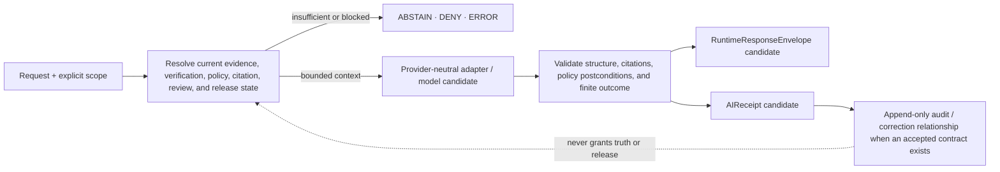

<!-- [KFM_META_BLOCK_V2]
doc_id: kfm://doc/architecture-governed-ai-continuity-notes
title: Governed AI — Continuity Notes
type: architecture-reference
version: v2.0.0-draft
status: draft; repository-grounded; implementation-partial; no-live-continuity-runtime
owners:
  - "@bartytime4life — verified CODEOWNERS review route"
  - "NEEDS VERIFICATION — independent governed-AI, runtime, evidence, policy, citation, security, privacy, correction, retention, and release stewardship"
created: 2026-05-24
updated: 2026-08-20
policy_label: public
truth_posture: cite-or-abstain
owning_root: docs/
current_path: docs/architecture/governed-ai/CONTINUITY_NOTES.md
responsibility: >-
  Explain how governed-AI work remains inspectable across requests, sessions,
  model or provider revisions, contract and schema changes, evidence corrections,
  repository changes, and release transitions without treating model memory,
  generated language, a receipt, or documentation as authority.
evidence_snapshot:
  repository: bartytime4life/Kansas-Frontier-Matrix
  base_ref: main
  base_commit: cadfb652d6e6963c8fb60a8977aeb0ca82b916d6
  target_prior_blob: 57bc973de3c950067ca7e29c59d361f37a7dae3c
  codeowners_blob: dd2a84aa514d8ecd9208bc347f90f9a2ed37dd61
  directory_rules_blob: fd49a0b83e55cef52c1124281f093e263526898d
  directory_rules_adoption_adr_blob: a4de0d7a96b78da59cfc499d1025e1508afd8dd9
  governed_ai_readme_blob: 9e1071bb69910bde3f364d319923c4db00637639
  ai_receipts_architecture_blob: 721bf4647f49a510a597d7b3c4d305bc70fa3097
  ai_receipt_contract_blob: f4d8183dbed38f83144f6d9dbde30ae02a01edb8
  ai_receipt_schema_blob: 2e0bebdb3a38acbc3c58a919db46970c6e829b4a
  ai_receipt_validator_blob: eb80e77aed15f478c32215c8f773f308a87a092a
  ai_receipt_builder_blob: 5fe03c96f22ea99b3e8689b92c7ee23d4fc12a65
  verification_history_contract_blob: 93070c981d492585a3b66adc9adc1bfbce31f87c
  verification_history_schema_blob: db9cdb8c657677792267bf0c8b4baca124655da7
  verification_history_validator_blob: 340c983a19f72f71156bc50c26b17df1d1d36d42
  evidence_resolver_readme_blob: d64f112e9fe6538178c74dd31cc751235781c7f3
  generated_receipt_lane_blob: 5a67f8d743306799a014590ccb45fa9f1177f16a
  generated_receipt_schema_blob: fba21ed27ebccf1362fe397fe0c3ebd85e072685
  generated_receipt_validator_blob: f5cbcec72a4217190c5e88711cc70975688dd275
  ai_receipt_data_lane_blob: e2b8971c19ae6edd4f1e6a566eee2ec24d14becc
  pull_request_template_blob: c5624d7dbc2b83055421b4fb4542794bafa10bee
inspection_boundary: >-
  Current-session GitHub reads covered the complete prior target, the current
  governed-AI child inventory and parent README, accepted Directory Rules v2 and
  ADR-0029, CODEOWNERS, the current AIReceipt contract/schema/validator and
  deterministic candidate builder, the VerificationStateHistory
  contract/schema/validator and internal evidence-resolver boundary, the
  generated-receipt lane/schema/validator, the AI receipt data-lane README, the
  pull-request template, current main, recent same-path documentation delivery,
  and open-pull-request overlap for the target. No live model, provider endpoint,
  credential, governed-AI API route, evidence store, policy evaluator, citation
  service, AIReceipt emitter or durable store, retention job, correction
  propagation, deployed client, release environment, rollback drill, or public
  operation was exercised.
related:
  - ./README.md
  - ./BOUNDARIES.md
  - ./AI_RECEIPTS.md
  - ./ADAPTER_CONTRACT.md
  - ./FOCUS_FLOW.md
  - ./MOCK_FIRST.md
  - ./PROMPT_INJECTION.md
  - ./ROUTE_MAP.md
  - ../../adr/ADR-0029-adopt-directory-governance-standard-v2.md
  - ../../doctrine/directory-rules.md
  - ../../../contracts/runtime/ai_receipt.md
  - ../../../schemas/contracts/v1/runtime/ai_receipt.schema.json
  - ../../../tools/validators/validate_ai_receipt.py
  - ../../../packages/envelopes/src/envelopes/ai_receipt.py
  - ../../../contracts/evidence/verification_state_history.md
  - ../../../schemas/contracts/v1/evidence/verification_state_history.schema.json
  - ../../../tools/validators/validate_verification_state_history.py
  - ../../../packages/evidence-resolver/README.md
  - ../../../data/receipts/generated/README.md
  - ../../../data/receipts/ai/README.md
  - ../../../.github/PULL_REQUEST_TEMPLATE.md
tags: [kfm, architecture, governed-ai, continuity, lineage, receipts, verification-history, correction, supersession, replay, cite-or-abstain]
notes:
  - "v2.0.0-draft is a same-path repository-grounded rewrite. It changes documentation and its required generated authoring receipt only."
  - "Accepted ADR-0029 and adopted Directory Rules v2 make this existing docs/architecture/governed-ai/ path placement-safe; the former OPEN-DR-11 sibling-count warning is retired."
  - "LINEAGE is used only as a qualifier on one of the core four truth labels; it is not a replacement truth label."
  - "Conversational context, platform memory, retrieval, and model state may assist a request, but none is self-authenticating evidence or continuity authority."
  - "The current AIReceipt schema has no correction, supersession, timestamp, evidence-ref, signature, or retention fields. Any operational correction relationship remains PROPOSED and must not be invented in documentation."
  - "No contract, schema, policy, package, validator, fixture, test, workflow, receipt instance, runtime, release, deployment, publication, or repository setting is changed."
[/KFM_META_BLOCK_V2] -->

<a id="top"></a>

# Governed AI — Continuity Notes

> **Operating rule.** Governed-AI continuity lives in explicit, reviewable, version-bound artifacts outside the model. A model may receive conversation context, retrieved records, or platform memory, but none of those is self-authenticating evidence, current authority, or permission to answer.

| Field | Current repository-grounded result |
|---|---|
| **Evidence snapshot** | `main@cadfb652d6e6963c8fb60a8977aeb0ca82b916d6` |
| **Document role** | Human architecture explanation; not contract, schema, policy, evidence, receipt, runtime, review, release, correction, or publication authority |
| **Placement** | Existing `docs/architecture/governed-ai/` lane; `PLACE` under accepted ADR-0029 and adopted Directory Rules v2 |
| **Current bounded runtime-receipt surface** | Proposed nine-field `AIReceipt` contract/schema, deterministic no-network validator, and deterministic candidate builder |
| **Current bounded evidence-history surface** | Proposed bitemporal `VerificationStateHistory` contract/schema/validator plus one internal non-authoritative evidence-resolver consumer |
| **Current authoring-provenance surface** | Populated `data/receipts/generated/` lane, strict generated-receipt schema, bounded hash validator, and PR-template requirement for AI-authored diffs |
| **Live continuity runtime** | Not established: no verified emitter, durable AIReceipt store, retention service, policy/citation/evidence composition, correction propagation, deployed route, or public operation |

> [!IMPORTANT]
> **Continuity does not upgrade authority.** A prior answer, receipt, pull request, test, or verification event remains useful history only within its declared scope. A consequential current claim must still resolve current evidence, policy, citation, review, release, freshness, and correction state.

> [!CAUTION]
> **Do not mutate history to make the present look clean.** Historical receipt or decision bytes should remain inspectable. Corrections and supersessions should be appended through their owning object families. The current `AIReceipt` profile does not yet define such a relation, so operational AIReceipt correction remains `PROPOSED / HOLD` rather than silently implemented by prose.

> [!NOTE]
> **This revision is documentation closure, not runtime admission.** Repository evidence proves several bounded continuity components. It does not prove that they are composed into a live governed-AI request path.

## Quick navigation

- [0. Current repository checkpoint](#0-current-repository-checkpoint)
- [1. Scope](#1-scope)
- [2. Repo fit — Directory Rules basis](#2-repo-fit--directory-rules-basis)
- [3. The continuity problem](#3-the-continuity-problem)
- [4. First principle — continuity is external to the model](#4-first-principle--ai-is-stateless-kfm-is-not)
- [5. Durable continuity substrates](#5-the-five-durable-substrates-of-continuity)
- [6. Truth labels and the `LINEAGE` qualifier](#6-the-lineage-truth-label)
- [7. Continuity dimensions](#7-continuity-dimensions)
- [8. Supersession and stale state](#8-supersession-and-stale-state)
- [9. `AIReceipt` immutability and correction boundary](#9-the-aireceipt-is-never-superseded-retroactively)
- [10. What continuity does not provide](#10-what-continuity-does-not-provide)
- [11. Anti-patterns](#11-anti-patterns)
- [12. Open questions and graduation gates](#12-open-questions-and-adr-triggers)
- [13. Related documents and ownership](#13-related-docs)
- [14. Appendix — glossary and reference](#14-appendix--glossary-and-reference)

---

<a id="0-current-repository-checkpoint"></a>

## 0. Current repository checkpoint

The prior edition was written as proposal-only doctrine before the present bounded implementation surfaces existed. The current tree supports a narrower and more useful conclusion: KFM has several continuity primitives, but no verified end-to-end governed-AI continuity runtime.

### 0.1 Confirmed repository-present surfaces

| Surface | What current bytes prove | What they do **not** prove |
|---|---|---|
| [`contracts/runtime/ai_receipt.md`](../../../contracts/runtime/ai_receipt.md) | A proposed semantic contract for AI runtime accountability and clear object-family exclusions | That an AIReceipt is emitted, stored, reviewed, corrected, signed, retained, or used by a live route |
| [`ai_receipt.schema.json`](../../../schemas/contracts/v1/runtime/ai_receipt.schema.json) | A closed Draft 2020-12 shape with nine required fields and finite `ANSWER`, `ABSTAIN`, `DENY`, `ERROR` outcomes | That policy/citation references resolve, digests cover the right canonical bytes, or an answer is authorized |
| [`validate_ai_receipt.py`](../../../tools/validators/validate_ai_receipt.py) | Deterministic no-network shape and local-consistency validation with finite `PASS`, `FAIL`, `ERROR` validator outcomes | Evidence resolution, policy evaluation, citation validation, model admission, public-answer authority, release, or publication |
| [`ai_receipt.py`](../../../packages/envelopes/src/envelopes/ai_receipt.py) | A deterministic candidate builder for exactly the current nine schema fields | Digest calculation, model execution, evidence/policy/citation checks, persistence, or authority |
| [`VerificationStateHistory`](../../../contracts/evidence/verification_state_history.md) and [schema](../../../schemas/contracts/v1/evidence/verification_state_history.schema.json) | A proposed bounded bitemporal history for `VERIFIED`, `REVERIFIED`, `CORRECTED`, `SUPERSEDED`, and `REVOKED` events over one subject | A universal correction ledger, an EvidenceBundle, policy/release state, or public-answer authority |
| [`validate_verification_state_history.py`](../../../tools/validators/validate_verification_state_history.py) | Deterministic validation and replay over bounded synthetic fixtures | Live source resolution, production history storage, policy, review, release, or public runtime behavior |
| [`packages/evidence-resolver/`](../../../packages/evidence-resolver/README.md) | One internal alpha candidate consumes validated history and returns non-authoritative `RESOLVED`, `UNRESOLVED`, `DENIED`, or `ERROR` | A public API, production resolver, accepted runtime outcome mapping, or permission to answer |
| [`data/receipts/generated/`](../../../data/receipts/generated/README.md) | An existing populated authoring-provenance lane with a strict schema, bounded validator, and PR-template requirement | Factual proof, human approval, runtime AIReceipt emission, policy approval, release, or publication |
| [`data/receipts/ai/`](../../../data/receipts/ai/README.md) | A documented AI receipt-family lane and explicit no-public-path boundary | That runtime AIReceipt instances, a canonical emitter, a durable store, or retention/correction processes exist |
| [CODEOWNERS](../../../.github/CODEOWNERS) | Review requests route to `@bartytime4life` for the repository and relevant roots | Independent stewardship, approval, review completion, policy decision, or release authority |

### 0.2 Current maturity statement

**CONFIRMED:** KFM can validate and construct bounded AIReceipt candidates, validate and replay bounded verification histories, and evaluate one internal non-authoritative evidence-resolution candidate without network access.

**CONFIRMED:** these surfaces deliberately stop before evidence creation, policy evaluation, citation validation, public outcome authorization, release, deployment, or publication.

**PROPOSED:** later sections define how those bounded pieces should compose into durable governed-AI continuity.

**UNKNOWN:** whether any external or deployed system provides equivalent behavior outside the inspected repository surfaces.

[Back to top](#top)

---

<a id="1-scope"></a>

## 1. Scope

This document covers the continuity obligations that arise when governed-AI work crosses time, execution, or authority boundaries.

| Dimension | Continuity question |
|---|---|
| **Cross-request or cross-session** | Which explicit artifacts must be retrieved and revalidated instead of relying on remembered context? |
| **Cross-model, provider, or profile revision** | Which adapter/model/profile identity and input/output digests bound a prior runtime event? |
| **Cross-contract or schema revision** | Under which semantic and machine-shape version was an object valid, and what migration or compatibility rule applies now? |
| **Cross-evidence verification state** | What was effective at a requested time, what had KFM recorded by another time, and does current replay block an answer? |
| **Cross-policy, citation, review, or release state** | Do the authority-bearing references still resolve and still allow the requested operation? |
| **Cross-correction, withdrawal, or rollback** | Which current object supersedes the prior object, what remains inspectable, and which public/cache surfaces must stop relying on stale state? |
| **Cross-repository revision** | Which base commit, target blob, generated receipt, validation evidence, and rollback target bound an authored change? |

### In scope

- durable, explicit continuity artifacts and their authority limits;
- current AIReceipt, VerificationStateHistory, evidence-resolver, and generated-receipt proof surfaces;
- provider-neutral identity, digest, version, replay, correction, and stale-state obligations;
- finite fail-closed outcomes when continuity cannot be established;
- data minimization, no-chain-of-thought, and no-public-receipt-path rules;
- graduation gates for a future operational composition.

### Out of scope

This page does not:

- define or change the semantic AIReceipt or VerificationStateHistory contracts;
- change a schema, validator, fixture, package, policy, API route, data store, workflow, or release object;
- establish a model-memory feature, conversation archive, vector-memory system, or user-profile store;
- decide retention, signing, correction, or supersession semantics for AIReceipt;
- accept a proposed ADR or authorize a public answer, release, deployment, or publication.

> [!TIP]
> [`BOUNDARIES.md`](./BOUNDARIES.md) explains what governed AI may cross. This page explains what must remain explicit and re-checkable when a permitted crossing occurs at a later time.

[Back to top](#top)

---

<a id="2-repo-fit--directory-rules-basis"></a>

## 2. Repo fit — Directory Rules basis

### Placement outcome: `PLACE`

Accepted [ADR-0029](../../adr/ADR-0029-adopt-directory-governance-standard-v2.md) adopts [Directory Rules v2](../../doctrine/directory-rules.md). This target is an existing human-readable architecture document under `docs/architecture/governed-ai/`; the revision stays at the same path and does not change ownership, lifecycle, object-family meaning, or canonical/generated relationships.

The former proposal-era warning that this folder needed one more sibling before it could be retained is obsolete. The current governed-AI folder contains a substantive multi-document architecture family and a repository-grounded landing page. This revision does not reopen that structural decision.

### Authority map

| Responsibility | Owning surface | This page may do |
|---|---|---|
| Cross-root architecture explanation | `docs/architecture/governed-ai/` | Explain current evidence, target composition, limitations, and graduation gates |
| Semantic meaning | `contracts/` | Summarize and link; never redefine by prose |
| Machine shape | `schemas/` | Report the current profile; never add undocumented fields |
| Admissibility and access | `policy/` | State the boundary; never claim a decision occurred |
| Executable candidate construction | `packages/` and runtime/application roots | Cite bounded behavior; never infer an operational route |
| Validation and fixtures | `tools/`, `tests/`, `fixtures/`, workflows | State what passing checks prove and do not prove |
| Runtime and authoring receipts | Governed lanes under `data/receipts/` | Explain process-memory roles; never expose them as public truth |
| Evidence verification history | Evidence contracts/schemas/validators and governed stores | Explain replay semantics; never universalize one bounded profile |
| Correction, withdrawal, rollback, and release | Their owning contract, data, policy, and `release/` families | Require explicit lineage; never create it in this page |
| Review routing | `.github/CODEOWNERS` | Report the verified route; never present routing as approval |

[Back to top](#top)

---

<a id="3-the-continuity-problem"></a>

## 3. The continuity problem

KFM must distinguish three different questions:

1. **What happened then?** A receipt, commit, run record, or decision record may preserve the event as it was observed.
2. **What did KFM know then?** Bitemporal history may distinguish effective time from recorded time.
3. **What may KFM claim or do now?** Current evidence, policy, citation, review, release, freshness, correction, and access state must be resolved again.

Collapsing those questions creates false continuity. A prior answer can be faithfully recorded and still be unsafe or unsupported now. A prior test can have passed and still say nothing about a later commit. A model can be given prior conversation context and still lack current repository or evidence authority.

> [!IMPORTANT]
> **Context is not evidence merely because it persists.** Conversation state, retrieval indexes, user memory features, summaries, vector stores, caches, and model context windows may help locate evidence. They do not authenticate it, make it current, or grant permission to use it.

The continuity problem applies to humans and automation alike. KFM addresses it through durable, independently inspectable artifacts with bounded owners and explicit versions—not through confidence, recollection, or repeated prose.

[Back to top](#top)

---

<a id="4-first-principle--ai-is-stateless-kfm-is-not"></a>

## 4. First principle — continuity is external to the model

The prior edition used the shorthand “AI is stateless; KFM is not.” That shorthand remains directionally useful but is too absolute as an implementation claim. A model invocation may receive conversation context, retrieved artifacts, cached state, or platform memory. The governing rule is more precise:

> **No implicit model, conversation, retrieval, cache, or platform state is continuity authority. Governed continuity must be reconstructed from explicit, version-bound, policy-safe artifacts.**


```mermaid
flowchart LR
  REQUEST["Request + explicit scope"] --> RESOLVE["Resolve current evidence, verification, policy, citation, review, and release state"]
  RESOLVE -->|insufficient or blocked| NEG["ABSTAIN · DENY · ERROR"]
  RESOLVE -->|bounded context| ADAPTER["Provider-neutral adapter / model candidate"]
  ADAPTER --> VALIDATE["Validate structure, citations, policy postconditions, and finite outcome"]
  VALIDATE --> RESPONSE["RuntimeResponseEnvelope candidate"]
  VALIDATE --> RECEIPT["AIReceipt candidate"]
  RECEIPT --> HISTORY["Append-only audit / correction relationship when an accepted contract exists"]
  HISTORY -. "never grants truth or release" .-> RESOLVE
```

### Ephemeral, durable, and authoritative are different

| Class | Examples | Continuity posture |
|---|---|---|
| **Ephemeral execution context** | Context window, hidden reasoning, transient tool results, in-memory cache | May assist the current run; must not be persisted as evidence or assumed current later |
| **Durable process memory** | AIReceipt, GENERATED_RECEIPT, run logs, commits, pull requests | Preserves what happened within a declared scope; not factual or release authority |
| **Durable authority-bearing state** | EvidenceBundle, PolicyDecision, accepted ADR, review/release/correction objects in their owning families | Must be resolved and interpreted under current rules before consequential use |
| **Derived navigation state** | Search index, graph projection, vector store, summary, dashboard, map layer | Helps discovery or delivery; never replaces the governing source/evidence/release objects |

Private chain-of-thought is not a continuity substrate. KFM may retain bounded inputs, outputs, digests, citations, reason codes, validation findings, and decisions where the governing contract permits them; it must not convert hidden reasoning into evidence.

[Back to top](#top)

---

<a id="5-the-five-durable-substrates-of-continuity"></a>

## 5. Durable continuity substrates

The previous edition grouped continuity into five substrates. Current repository evidence supports a broader seven-part map and sharper authority boundaries.

| # | Substrate | Current repository surface | What it preserves | Authority limit |
|---:|---|---|---|---|
| 1 | **Repository identity and review history** | Commit SHA, blob SHA, compare, branch, pull request, CODEOWNERS route | Exact authored bytes, base/head relation, review discussion, rollback target | A commit or PR does not prove runtime behavior, policy approval, release, or publication |
| 2 | **Contracts and schemas** | `contracts/`, `schemas/` | Meaning, closed machine shape, profile and version identity | Proposed status remains proposed; documentation cannot accept a contract or schema |
| 3 | **Runtime AI accountability** | `AIReceipt` contract/schema, candidate builder, validator | Adapter/model reference, run identity, input/output digests, policy/citation refs, finite outcome | Current profile does not prove refs resolve and has no emitter, store, timestamp, correction, signing, or retention fields |
| 4 | **Evidence verification history** | `VerificationStateHistory` contract/schema/validator | Bitemporal `VERIFIED`, `REVERIFIED`, `CORRECTED`, `SUPERSEDED`, `REVOKED` events for one subject | Bounded proposed profile; not a universal correction ledger or public answer |
| 5 | **Repository authoring provenance** | `GENERATED_RECEIPT` schema, validator, and `data/receipts/generated/` | AI-authored artifact paths/hashes, prompt-contract hash, evidence refs, validation, review state | Process memory only; cannot approve its own work or become a runtime AIReceipt |
| 6 | **Decisions, drift, and migration records** | Accepted/proposed ADRs, registers, migration notes | Why a decision changed, which authority controls, unresolved divergence, rollback | Status and scope must be read from the current record; repetition does not create acceptance |
| 7 | **Release, correction, withdrawal, and rollback lineage** | Separate governed families under their owning contracts/data/policy/release roots | Which public state is current, what was corrected or withdrawn, and how to recover | Not implemented by a receipt or this document; public correction may require more than a Git revert |

### Why these substrates remain separate

Each answers a different question:

- **repository identity** — which bytes changed;
- **contract/schema** — what an object means and which shape is valid;
- **AIReceipt** — which AI-mediated runtime event was recorded;
- **VerificationStateHistory** — which verification state was effective and known at an as-of query;
- **GENERATED_RECEIPT** — which repository artifacts an AI authored and how they were validated;
- **decision/drift records** — why authority or architecture changed;
- **release/correction records** — which public state may be served now.

Collapsing them would let process memory masquerade as truth, or let a current public state erase the history needed to audit it.

[Back to top](#top)

---

<a id="6-the-lineage-truth-label"></a>

## 6. Truth labels and the `LINEAGE` qualifier

KFM's core truth labels remain:

| Core label | Meaning in this page |
|---|---|
| `CONFIRMED` | Verified in the current work session from pinned repository evidence, tests, logs, or accepted decisions |
| `PROPOSED` | Design, contract status, composition, or recommendation not verified as current behavior |
| `UNKNOWN` | Evidence is insufficient or inaccessible |
| `NEEDS VERIFICATION` | A concrete current check remains before relying on the claim |

`LINEAGE` may qualify one of those labels; it does not replace the core four.

| Correct usage | Meaning |
|---|---|
| `CONFIRMED / LINEAGE` | The historical artifact or event is confirmed to exist and is useful for reconstructing history, but is not current authority by itself |
| `PROPOSED / LINEAGE` | A prior proposal is retained to explain design evolution; it was never accepted as current behavior |
| `NEEDS VERIFICATION / LINEAGE` | The artifact may matter to continuity, but its identity, status, or current relevance must be rechecked |

### Upgrade rule

A prior-session or historical artifact may support a new `CONFIRMED` claim only after the current session verifies the material claim against current admissible evidence. A repeated answer, old receipt, cached summary, or model confidence does not perform that upgrade.

### Runtime outcomes are not truth labels

`ANSWER`, `ABSTAIN`, `DENY`, and `ERROR` are runtime outcomes. `RESOLVED`, `UNRESOLVED`, `DENIED`, and `ERROR` are currently package-local evidence-resolver candidate outcomes. `PASS`, `FAIL`, and `ERROR` are validator outcomes. They must not be substituted for the four truth labels or silently mapped across layers.

[Back to top](#top)

---

<a id="7-continuity-dimensions"></a>

## 7. Continuity dimensions

| Dimension | Durable binding required | Current bounded support | Fail-closed posture when missing |
|---|---|---|---|
| **Request/run** | Explicit request identity, scope, input/output digests, finite outcome | AIReceipt candidate fields exist | Do not claim replay or equivalence; `ABSTAIN` or `ERROR` as applicable |
| **Model/provider/profile** | Adapter and model reference; admitted provider/profile decision when required | `adapter` and `model_ref` are required strings | Treat equivalence and reproducibility as `UNKNOWN`; do not backfill a model identity |
| **Contract/schema** | Contract/profile version, schema identity, migration or compatibility rule | AIReceipt and VerificationStateHistory schemas are explicit; statuses remain proposed | Reject unknown shape or hold the consumer until a supported profile is selected |
| **Repository** | Base/head commit, target blob, final artifact hash, exact diff, rollback commit | Git objects and GENERATED_RECEIPT validation exist | Do not claim current behavior from an old commit; repin and rerun affected checks |
| **Evidence verification** | Subject identity, effective as-of, recorded as-of, valid transition chain | VerificationStateHistory replay exists; resolver blocks non-`ACTIVE` replay | `UNRESOLVED` in the current alpha package; no public `ANSWER` mapping is established |
| **Policy and citation** | Resolvable decisions/reports bound to the same request and scope | AIReceipt carries string references only | Missing or unresolved authority blocks a governed answer |
| **Review and release** | Authentic review/release object and current public-safe state | No current AIReceipt field proves either | Hold public exposure; a receipt or test cannot substitute |
| **Correction/withdrawal** | Append-only relation to the corrected, superseded, revoked, or withdrawn object | VerificationStateHistory supports one evidence-history profile; AIReceipt correction is undefined | Stop relying on stale state; preserve prior bytes; require owning-family correction behavior |
| **Retention and access** | Accepted retention period, access role, redaction, deletion/hold rules | Data-lane READMEs state no-public-path; operational enforcement is unverified | Deny direct public access; avoid storing payloads or hidden reasoning |

### As-of semantics

Where time matters, continuity should identify at least:

- the time an underlying fact or verification state became effective;
- the time KFM recorded it;
- the time the request was evaluated;
- the version or release state used;
- the correction or supersession state visible at that request time.

The current VerificationStateHistory profile implements the first two axes for one bounded evidence subject. It does not automatically provide the remaining runtime or release axes.

[Back to top](#top)

---

<a id="8-supersession-and-stale-state"></a>

## 8. Supersession and stale state

### 8.1 General rule

A continuity-bearing artifact should not be silently rewritten to erase a prior state. The governing family should retain the prior identity and append a correction, supersession, revocation, withdrawal, migration, or rollback relation with explicit scope.

### 8.2 What is currently implemented in a bounded form

`VerificationStateHistory` defines one append-ordered transition chain for one subject. The current internal evidence-resolver candidate:

1. validates the history;
2. requires the history subject to equal the candidate EvidenceRef;
3. replays the requested effective and recorded as-of times;
4. returns non-authoritative `UNRESOLVED` for `CORRECTED`, `SUPERSEDED`, `REVOKED`, `UNKNOWN`, or otherwise incomplete context;
5. permits `RESOLVED` only when the bounded checks close and the replay is `ACTIVE`.

That behavior is meaningful but narrow. It does not follow a successor, authenticate a correction authority, create evidence, evaluate policy, verify release, or issue a public runtime outcome.

### 8.3 Stale-state response pattern

| Condition | Required posture |
|---|---|
| Prior evidence is corrected, superseded, or revoked | Stop issuing an authoritative answer from the affected closure until a valid current path exists |
| Contract/schema version is unsupported | Reject or hold; do not coerce or drop fields silently |
| Model/provider/profile changed | Emit a new event if an operational emitter exists; do not rewrite the prior model identity |
| Policy/citation/review/release reference no longer resolves | Fail closed; a preserved receipt does not keep the old authorization alive |
| Release is corrected or withdrawn | Apply the governing release/correction path and invalidate downstream caches/projections as required; documentation alone does not perform this |
| Repository base changed | Reconcile only the affected bytes, authorities, dependencies, and validation; do not treat unrelated drift as permission to rewrite history |

[Back to top](#top)

---

<a id="9-the-aireceipt-is-never-superseded-retroactively"></a>

## 9. `AIReceipt` immutability and correction boundary

The prior heading asserted that AIReceipt is “never superseded retroactively.” The safe current statement is more precise:

> **Historical AIReceipt bytes should not be edited to conceal or rewrite a recorded event. The current contract and schema do not yet define an AIReceipt correction or supersession relation, so any operational correction mechanism remains proposed and must live in an explicitly owned object family.**

### 9.1 Current schema-paired profile

The current AIReceipt machine shape contains exactly nine required fields:

| Field | Continuity contribution | What it does not prove |
|---|---|---|
| `id` | Stable receipt identifier | Uniqueness in an authoritative store or correction lineage |
| `run_id` | Runtime event identifier | That logs, envelope, or provider records resolve |
| `adapter` | Provider-neutral adapter identifier | Provider admission, availability, or security posture |
| `model_ref` | Model reference supplied by the caller | Reproducibility, equivalence, or model truth |
| `inputs_digest` | Digest binding supplied by the caller | Which canonicalization profile or semantic inputs were correct |
| `outputs_digest` | Digest binding supplied by the caller | Truth, citation validity, or public display eligibility |
| `policy_decision_ref` | Reference to a policy decision | That the decision exists, is authentic, is current, or applies to this scope |
| `citation_validation_ref` | Reference to citation validation | That citations resolve or passed |
| `outcome` | `ANSWER`, `ABSTAIN`, `DENY`, or `ERROR` | Release, review, correction, or publication authority |

The schema is closed with `additionalProperties: false`. It currently has no fields for:

- creation or event timestamp;
- contract/schema version inside the receipt payload;
- evidence references or answer citations;
- prompt, context, or hidden reasoning;
- correction, supersession, withdrawal, or revocation links;
- review or release state;
- signatures, attestations, retention, or access class.

Those absences are not permission to smuggle extra fields into an instance. They identify explicit contract-evolution or companion-object questions.

### 9.2 Candidate builder and validator limits

The current candidate builder requires callers to supply all nine fields and rejects empty values, unsupported outcomes, malformed digests, and all-zero placeholder digests. It does not calculate digests or resolve any authority-bearing reference.

The validator checks JSON shape and limited local consistency. A `PASS` proves only that bounded profile. It does not authenticate policy or citation objects, establish correction lineage, approve a model, authorize an answer, or make the receipt durable.

### 9.3 Proposed correction pattern

Until an accepted contract says otherwise:

1. preserve the original AIReceipt bytes and digest;
2. stop relying on the affected event when current evidence/policy/citation/release state blocks it;
3. emit a new runtime event and receipt only when an operational emitter and current authority support one;
4. record the relation through a separately governed correction/supersession object or contract evolution;
5. keep the relation out of the public path unless a governed projection intentionally exposes safe lineage;
6. do not backfill a fabricated receipt for a past event whose inputs, outputs, model identity, or decisions cannot be reconstructed exactly.

[Back to top](#top)

---

<a id="10-what-continuity-does-not-provide"></a>

## 10. What continuity does not provide

| Continuity artifact or mechanism | It does **not** provide |
|---|---|
| Conversation context or platform memory | Current evidence, authority, policy permission, or reproducibility |
| AIReceipt | Model truth, EvidenceBundle closure, policy/citation authentication, review, release, or publication |
| GENERATED_RECEIPT | Runtime accountability, factual proof, human approval, or permission to merge |
| VerificationStateHistory | Universal correction semantics, successor resolution, policy/release state, or public answer |
| Evidence-resolver `RESOLVED` | Governed `ANSWER`, rights/sensitivity clearance, review, release, or publication |
| Commit or pull request | Architecture acceptance, deployed behavior, security, release, or public operation |
| Passing validator/test | Authority beyond the declared fixture and implementation boundary |
| ADR text | Acceptance unless the current record says accepted through the governed process |
| Drift entry | Permission to normalize, migrate, or delete the drifted surface |
| Documentation | Runtime activation, source admission, correction execution, rollback execution, or publication |

Continuity also does not justify retaining secrets, raw prompts, chain-of-thought, private evidence payloads, protected locations, credentials, or sensitive internal reasoning. Preserve the minimum reviewable bindings required by the governing contract.

[Back to top](#top)

---

<a id="11-anti-patterns"></a>

## 11. Anti-patterns

| Anti-pattern | Why it fails | Required correction |
|---|---|---|
| “The model remembers, so the prior claim is still confirmed.” | Implicit state is neither authenticated nor current evidence | Retrieve and verify the current governing artifacts |
| Reusing a prior answer after evidence was corrected | Preserves prose while discarding current verification state | Replay current history and fail closed until a valid current closure exists |
| Treating `LINEAGE` as a fifth core truth label | Hides whether a claim is confirmed, proposed, unknown, or needs verification | Apply one core label and use `LINEAGE` only as a qualifier |
| Editing an AIReceipt in place | Erases the recorded event and breaks auditability | Preserve bytes; append an owned correction/supersession relation |
| Adding correction fields to AIReceipt without schema evolution | Creates a parallel undocumented profile | Use the current closed shape or propose a reviewed contract/schema change |
| Using GENERATED_RECEIPT as AIReceipt | Collapses repository authoring provenance into runtime accountability | Keep the receipt families separate |
| Backfilling a receipt from memory | Fabricates provenance and model/input/output identity | Record a provenance gap or emit only a current, reconstructable event |
| Mapping evidence-resolver `RESOLVED` directly to public `ANSWER` | Skips evidence authority, policy, citation, review, release, and scope gates | Compose the governed path explicitly and preserve finite failures |
| Letting public clients read `data/receipts/` | Exposes internal process memory and bypasses governed projection | Serve only intentional public-safe data through governed interfaces |
| Persisting prompt bodies or hidden reasoning in receipts | Increases privacy, security, and data-minimization risk without creating proof | Store hashes, bounded summaries, decisions, and safe findings only |
| Provider-specific continuity prose presented as current architecture | Couples doctrine to a volatile implementation detail | Use provider-neutral roles and pin exact provider/model data in receipts or runtime config |
| Treating a merged documentation PR as runtime continuity | Confuses repository state with operational behavior | Require implementation, tests, deployment evidence, and the relevant release transition |

[Back to top](#top)

---

<a id="12-open-questions-and-adr-triggers"></a>

## 12. Open questions and graduation gates

### 12.1 Operational graduation gates

The governed-AI continuity path remains on `HOLD` until the applicable gates close.

| Gate | Required evidence | Current status |
|---:|---|---|
| 1 | Accepted semantic ownership for AIReceipt persistence, correction, supersession, retention, and access | `NEEDS VERIFICATION` |
| 2 | Schema/contract evolution or a companion correction object with stable identifiers and migration rules | `PROPOSED / HOLD` |
| 3 | Deterministic runtime emitter that binds the actual canonical input/output bytes and effective adapter/model/profile | `UNKNOWN` |
| 4 | Durable, access-controlled, append-safe storage with retention and deletion/hold policy | `UNKNOWN` |
| 5 | Resolvable EvidenceRef/EvidenceBundle, VerificationStateHistory, policy, citation, review, and release snapshots bound to one request | `UNKNOWN` end-to-end |
| 6 | Provider-neutral adapter execution with admitted provider/profile and safe failure behavior | `PARTIAL / HOLD` outside this page |
| 7 | Citation and policy pre/post checks with finite outcomes and no sensitive reason leakage | `UNKNOWN` operationally |
| 8 | Correction, revocation, withdrawal, and release propagation through API/UI/cache/search/map/AI consumers | `UNKNOWN` |
| 9 | Deterministic replay/idempotency tests and exact negative fixtures across model, schema, evidence, and correction changes | `PARTIAL` only in isolated components |
| 10 | Security, privacy, prompt-injection, access-control, logging, and incident-response review | `NEEDS VERIFICATION` |
| 11 | Independent review and separation of duties appropriate to policy/release significance | `NEEDS VERIFICATION` |
| 12 | Governed release, rollback/correction drill, deployed observation, and public-safe acceptance evidence | `UNKNOWN / not authorized here` |

### 12.2 Open decisions

| Open decision | Why it matters | Likely owning roles |
|---|---|---|
| How should AIReceipt correction or supersession be represented? | Current closed schema has no relation fields | Runtime, contracts, evidence/correction, schema, policy stewards |
| Is AIReceipt stored as immutable instances, append-only events, or another accepted profile? | Determines identity, replay, retention, and audit behavior | Runtime, data, receipt, security/privacy stewards |
| Which canonicalization profile binds `inputs_digest` and `outputs_digest`? | A digest without canonicalization cannot prove reproducible byte identity | Contracts, runtime, validation, security stewards |
| What does `model_ref` minimally identify? | Provider/model/profile drift must be visible without leaking sensitive configuration | Runtime, adapter, security, receipt stewards |
| How are VerificationStateHistory and release/correction history composed? | One bounded evidence history must not become a universal release ledger | Evidence, correction, release, API stewards |
| What is the retention and public-projection posture for runtime receipts? | Receipts can contain sensitive process metadata even without payload text | Privacy, security, data, policy, release stewards |
| When is an AIReceipt mandatory, optional, or denied? | Avoids both missing accountability and indiscriminate overcollection | Runtime, policy, privacy, architecture stewards |
| Which runtime outcome mapping, if any, consumes evidence-resolver candidate results? | Package-local outcomes are not yet public runtime authority | Governed API, runtime, evidence, policy stewards |

No open item above is resolved by this document. A contract/schema change, new authority family, or public-path behavior requires its own reviewed implementation and any applicable ADR or migration record.

[Back to top](#top)

---

<a id="13-related-docs"></a>

## 13. Related documents and ownership

| Reference | Current role | Status boundary |
|---|---|---|
| [`README.md`](./README.md) | Governed-AI architecture landing page | Explanatory; does not accept ADRs or prove runtime composition |
| [`BOUNDARIES.md`](./BOUNDARIES.md) | What AI may and may not cross | Architecture companion; current runtime claims must still be reverified |
| [`AI_RECEIPTS.md`](./AI_RECEIPTS.md) | Repository-grounded AIReceipt architecture and proof limits | Best current explanatory companion for the nine-field profile |
| [`ADAPTER_CONTRACT.md`](./ADAPTER_CONTRACT.md) | Provider-neutral adapter architecture | Does not admit a provider by documentation |
| [`FOCUS_FLOW.md`](./FOCUS_FLOW.md) | Target Focus orchestration | Proposed until current route/runtime evidence closes |
| [`PROMPT_INJECTION.md`](./PROMPT_INJECTION.md) | Untrusted-content and prompt-injection boundaries | Separate security architecture concern |
| [`AIReceipt contract`](../../../contracts/runtime/ai_receipt.md) | Semantic meaning and invariants | Proposed contract; this page defers to it |
| [`AIReceipt schema`](../../../schemas/contracts/v1/runtime/ai_receipt.schema.json) | Current machine shape | Proposed closed schema with nine required fields |
| [`AIReceipt validator`](../../../tools/validators/validate_ai_receipt.py) | Bounded no-network validation | Shape/local consistency only |
| [`VerificationStateHistory contract`](../../../contracts/evidence/verification_state_history.md) | Bitemporal evidence-verification replay semantics | Proposed bounded profile |
| [`Evidence resolver package`](../../../packages/evidence-resolver/README.md) | Internal non-authoritative candidate resolution | Alpha, no public API or production authority |
| [`Generated receipt lane`](../../../data/receipts/generated/README.md) | Repository authoring provenance | Process memory, not runtime truth or approval |
| [`AI receipt data lane`](../../../data/receipts/ai/README.md) | AI receipt-family documentation | No public path; actual operational payload/storage remains unverified |
| [ADR-0029](../../adr/ADR-0029-adopt-directory-governance-standard-v2.md) | Accepted Directory Rules v2 adoption | Placement authority only; does not accept governed-AI contracts |
| [CODEOWNERS](../../../.github/CODEOWNERS) | Verified GitHub review routing | Not stewardship assignment, review completion, policy, or release approval |

### Review burden

A material change to continuity semantics should include review from the owners of every affected authority family. At minimum, changes to AIReceipt correction, persistence, or public projection implicate runtime, contracts, schemas, evidence/correction, policy, citation, security/privacy, data retention, API/UI, and release review. CODEOWNERS provides only the currently verified GitHub routing identity.

[Back to top](#top)

---

<a id="14-appendix--glossary-and-reference"></a>

## 14. Appendix — glossary and reference

### 14.1 Glossary

| Term | Meaning in this page |
|---|---|
| **Continuity** | Ability to reconstruct and re-evaluate the bindings needed for a later governed operation without relying on implicit model state |
| **Process memory** | Durable record of what a tool, model, or authoring process did; not domain truth or release authority |
| **Authority-bearing reference** | Reference whose owning object must resolve and still apply before a consequential operation proceeds |
| **Bitemporal replay** | Evaluation using both when an event was effective and when KFM recorded it |
| **Correction** | Explicit relation that changes current reliance while preserving prior history |
| **Supersession** | Explicit replacement relation; prior object remains inspectable according to its governing retention/access rules |
| **Revocation** | Explicit state that blocks continued reliance on a prior verification or authority |
| **Withdrawal** | Release/publication state that removes an artifact from current serving without erasing lineage |
| **`LINEAGE` qualifier** | Historical-context qualifier attached to a core truth label; never a substitute for `CONFIRMED`, `PROPOSED`, `UNKNOWN`, or `NEEDS VERIFICATION` |

### 14.2 Continuity matrix

| Artifact | Stable identity | Version/digest binding | Correction relation in current profile | Current executable proof | Public authority |
|---|---:|---:|---:|---:|---:|
| AIReceipt candidate | `id`, `run_id` | input/output SHA-256 strings; model ref | **No** | Builder + validator | **No** |
| GENERATED_RECEIPT | `receipt_id` | artifact hashes + prompt/contract hash | Not a runtime correction mechanism | Schema + validator + populated lane | **No** |
| VerificationStateHistory | `history_id`, subject/event IDs | `schema_version`, `spec_hash`, bitemporal events | **Yes, bounded to its event profile** | Validator/replay + internal resolver consumer | **No** |
| ADR | ADR ID | document bytes/status/history | Superseded by governed decision record | Repository/document controls | Decision authority only when current record is accepted |
| Release/correction object | Family-specific ID/digest | Family-specific contract | Expected in owning family | `UNKNOWN` for governed-AI composition in this review | Only through governed release/publication controls |

### 14.3 Validation and acceptance notes

For this documentation change, the expected validation boundary is:

```text
- parse the complete Markdown source;
- verify one H1 and balanced metadata/fences;
- verify explicit anchors are unique and every local fragment resolves;
- verify repository-relative links point to current tracked paths;
- verify stale provider-specific examples, OPEN-DR-11 sibling-count claims,
  and LINEAGE-as-core-label claims are absent;
- verify the generated authoring receipt binds the final document bytes;
- compare the feature branch against its immutable base and confirm the declared paths only;
- report hosted exact-head checks separately from draft-PR delivery.
```

A passing documentation or generated-receipt check does not prove a live continuity runtime, accepted AIReceipt correction semantics, receipt persistence, policy/citation resolution, provider admission, deployment, release, or publication.

### 14.4 No-loss modernization ledger

| Prior material | v2.0 disposition |
|---|---|
| “AI is stateless; KFM is not” shorthand | Preserved as direction, corrected to the precise rule that implicit model/session/platform state is not continuity authority |
| Five temporal axes | Preserved and expanded into request, model/provider, contract/schema, evidence, policy/citation/release, correction, retention, and repository dimensions |
| Folder/ALL-CAPS/OPEN-DR-11 warning | Retired as stale; accepted ADR-0029 and current folder evidence support same-path `PLACE` |
| Five durable substrates | Preserved conceptually and reconciled into seven current responsibility-separated substrates |
| `LINEAGE` as a formal replacement truth label | Corrected: `LINEAGE` is a qualifier on one of the core four labels |
| Provider-specific model-version example | Replaced with provider-neutral adapter/model/profile language |
| AIReceipt “never superseded retroactively” | Narrowed to immutable historical bytes plus an explicit `PROPOSED / HOLD` correction relation because the current schema has no correction fields |
| Prior generic canonical-home table | Replaced with current tracked contracts, schemas, validators, packages, receipt lanes, and their statuses |
| Supersession/stale-state discussion | Preserved and grounded in current VerificationStateHistory and evidence-resolver limits |
| No-chain-of-thought and no-memory-as-evidence rules | Preserved and strengthened with data-minimization and implicit-context boundaries |
| Top-level section fragments | Preserved through explicit compatibility anchors |

### 14.5 Rollback and non-effects

This revision is additive documentation modernization at the existing path plus the repository-required generated authoring receipt.

Rollback before merge: close the draft pull request and leave the branch unmerged.

Rollback after an authorized merge: revert the documentation commit through the normal reviewed path, restoring prior target blob `57bc973de3c950067ca7e29c59d361f37a7dae3c`; remove the paired generated authoring receipt in the same revert. No schema migration, data reprocessing, runtime restart, provider deactivation, cache invalidation, release withdrawal, public correction, or deployment rollback is required because this change has no runtime or publication effect.

[Back to top](#top)
