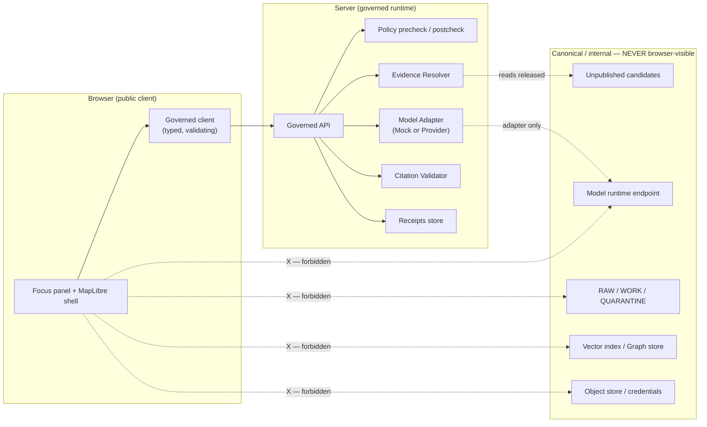

# Focus Flow

> **The governed, evidence-bounded request → policy → evidence → adapter → citation → policy → envelope path for Focus Mode answers. No browser-to-model shortcut; no answer without resolved EvidenceBundles and a passing CitationValidationReport.**


<!-- [KFM_META_BLOCK_V2]
doc_id: kfm://doc/architecture/governed-ai/focus-flow
title: Focus Flow
type: standard
version: v1
status: draft
owners: Governed AI subsystem owner + Docs steward (TODO confirm)
created: 2026-05-14
updated: 2026-05-14
policy_label: public
related:
  - docs/architecture/governed-ai/README.md
  - docs/architecture/governed-ai/STATE_OWNERSHIP.md
  - docs/architecture/governed-ai/ROUTE_MAP.md
  - docs/architecture/governed-ai/BOUNDARIES.md
  - docs/architecture/governed-ai/CONTINUITY_NOTES.md
  - docs/architecture/ui/EVIDENCE_DRAWER.md
  - docs/runbooks/governed_ai_VALIDATION.md
  - docs/runbooks/governed_ai_ROLLBACK.md
  - docs/adr/ADR-focus-model-adapter-boundary.md
  - schemas/contracts/v1/focus/
  - policy/focus/
tags: [kfm, governed-ai, focus-mode, runtime, evidence, citation, policy]
notes:
  - Doctrine CONFIRMED from attached KFM sources.
  - All quoted file paths, route names, module names, and runtime owners remain PROPOSED until verified against mounted-repo evidence.
[/KFM_META_BLOCK_V2] -->

| Status | Owners | Last reviewed |
|---|---|---|
| Draft · Doctrine **CONFIRMED**, implementation **PROPOSED** | Governed AI subsystem owner + Docs steward *(TODO confirm in CODEOWNERS)* | TODO |

---

## Contents

1. [Purpose & scope](#1-purpose--scope)
2. [Repo fit](#2-repo-fit)
3. [Finite outcomes](#3-finite-outcomes)
4. [End-to-end flow](#4-end-to-end-flow)
5. [Stage-by-stage walkthrough](#5-stage-by-stage-walkthrough)
6. [Object families involved](#6-object-families-involved)
7. [Trust boundary and forbidden paths](#7-trust-boundary-and-forbidden-paths)
8. [Outcome decision matrix](#8-outcome-decision-matrix)
9. [State ownership snapshot](#9-state-ownership-snapshot)
10. [Validation and tests](#10-validation-and-tests)
11. [Rollback and kill switch](#11-rollback-and-kill-switch)
12. [Open questions and verification backlog](#12-open-questions-and-verification-backlog)
13. [Related docs](#13-related-docs)
14. [Appendices](#14-appendices)

---

## 1. Purpose & scope

Focus Mode is KFM's **evidence-bounded question answering surface** over a bounded slice of released or review-authorized evidence — typically anchored by a `MapContextEnvelope` (camera, time, visible layers, clicked feature) but usable from non-map surfaces too. This document specifies the **flow** a Focus request travels: how a question enters the governed AI subsystem, what gates it passes, what artifacts it produces, and what finite outcome it returns.

The flow exists because **a fluent answer is not authority**. The model is a candidate generator, ranker, and summarizer — never a sovereign truth source. `EvidenceBundle`, source authority, `PolicyDecision`, review state, release state, and citation validation outrank generated language. This file documents the path that makes that ordering enforceable at runtime.

> [!IMPORTANT]
> **Doctrinal frame.** Doctrine items below are **CONFIRMED** from the attached KFM source corpus (governed-AI report, MapLibre master, encyclopedia, unified implementation manual, Directory Rules). **Implementation specifics** — route names, module paths, adapter package, telemetry envelope, owners — remain **PROPOSED** until the live repository is mounted and inspected.

**In scope**

- The runtime request/response lifecycle for a Focus answer.
- The fixed sequence of gates: scope → policy precheck → evidence retrieval → `EvidenceRef`→`EvidenceBundle` resolution → adapter call → citation validation → policy postcheck → envelope.
- The finite outcome grammar (`ANSWER` / `ABSTAIN` / `DENY` / `ERROR`).
- The object families crossing the boundary, their roles, and where they are forbidden.
- Rollback and kill-switch posture.

**Out of scope**

- Subsystem overview and entry points → `README.md`.
- Who owns which piece of in-flight state → `STATE_OWNERSHIP.md`.
- Concrete route shapes, paths, verbs → `ROUTE_MAP.md`.
- Boundary anti-patterns and what the browser is forbidden to do → `BOUNDARIES.md`.
- Continuity with prior governed-AI plans → `CONTINUITY_NOTES.md`.

[Back to top ↑](#focus-flow)

---

## 2. Repo fit

| Aspect | Value | Basis |
|---|---|---|
| **This file** | `docs/architecture/governed-ai/FOCUS_FLOW.md` | Directory Rules §4 Step 1 — "Explains something to humans" → `docs/`; §11/§12 implication that subsystem architecture docs live under `docs/architecture/<subsystem>/`. |
| **Owning root** | `docs/` (canonical governance root) | Directory Rules §3, §5. |
| **Sibling docs** | `README.md`, `STATE_OWNERSHIP.md`, `ROUTE_MAP.md`, `BOUNDARIES.md`, `CONTINUITY_NOTES.md` | Planned governed-AI subsystem doc set; all **PROPOSED**. |
| **Executable contracts (PROPOSED)** | `schemas/contracts/v1/focus/*.schema.json` | Whole-UI + Governed AI Expansion Report — Canonical home decisions table. |
| **Fixtures (PROPOSED)** | `tests/fixtures/focus/` | Same source. |
| **Policy (PROPOSED)** | `policy/focus/README.md`, `policy/focus/focus_request.rego`, `policy/focus/focus_response.rego` | Same source. |
| **Emitted records (PROPOSED)** | `data/receipts/ai/` | Same source. AIReceipts are *process memory*, not release proof. |
| **Runbooks (PROPOSED)** | `docs/runbooks/governed_ai_VALIDATION.md`, `docs/runbooks/governed_ai_ROLLBACK.md`, `docs/runbooks/governed_ai_LOCAL_DEV.md` | Same source. |
| **ADR (PROPOSED)** | `docs/adr/ADR-focus-model-adapter-boundary.md` | Decision record for "no direct browser-to-model path." |

> [!NOTE]
> **Path posture.** Every path above is **PROPOSED** per Directory Rules §0. The Rules are CONFIRMED doctrine; specific paths remain proposed until checked against the mounted repository. If the live repo settles on `apps/governed_api/`, `packages/api/`, or a different schema-home convention than `schemas/contracts/v1/<subsystem>/`, this document and its siblings must be updated and an ADR recorded.

[Back to top ↑](#focus-flow)

---

## 3. Finite outcomes

Focus Mode returns **exactly one** of four outcomes — there is no implicit allow, no soft fall-through, no silent re-routing.

| Outcome | When it applies (CONFIRMED doctrine) | Required artifacts | Public-surface effect |
|---|---|---|---|
| **ANSWER** | Evidence resolves, policy allows, release/review state permits, citations validate. | `EvidenceBundle`(s) resolved · `PolicyDecision = allow` · `CitationValidationReport` pass · `AIReceipt` · `RuntimeResponseEnvelope`. | Substantive answer text rendered with citations and Evidence Drawer linkage. |
| **ABSTAIN** | Evidence is missing, insufficient, stale without a released alternative, conflicted, or citations cannot be validated. | `AIReceipt` with abstain reason · no claim emitted · optional `CitationValidationReport` with failures. | Non-substantive notice with reason; never an invented claim. |
| **DENY** | Rights, sensitivity, sovereignty/CARE label, release state, or policy gate forbids the response. Sensitive lanes default here. | `PolicyDecision = deny` with `reason_code` · `AIReceipt` records denial · optional generalized alternative pointer. | Denial reason returned; never reveals exact restricted geometry, restricted person/DNA inference, or canonical-store contents. |
| **ERROR** | The governed API cannot evaluate — malformed request, schema violation, evidence-resolver unavailable, adapter contract violation, infrastructure failure. | Error envelope with diagnostic code · no claim leakage. | Finite, actionable error; never silently downgraded to `ABSTAIN`/`ANSWER`. |

> [!CAUTION]
> **Outcome grammar is enum-strict.** `RuntimeResponseEnvelope.outcome` and `FocusModeResponse.outcome` use the closed set `ANSWER | ABSTAIN | DENY | ERROR`. Schemas should validate with `additionalProperties: false` and a closed `enum`. Validators **fail closed** on unknown values. `PolicyDecision` uses its own decision vocabulary (`allow | deny | abstain | error`, plus `restrict` where evidenced) — see [§12 Open questions](#12-open-questions-and-verification-backlog) for the `ALLOW`-vs-`ANSWER` reconciliation note.

[Back to top ↑](#focus-flow)

---

## 4. End-to-end flow

The Focus Mode flow is **CONFIRMED doctrine**. The component names below (Browser, Governed API, Policy, Evidence Resolver, Model Adapter, Citation Validator) refer to logical responsibilities — concrete module paths are **PROPOSED**.

```mermaid
sequenceDiagram
    autonumber
    participant U as User (Browser)
    participant API as Governed API
    participant POL as Policy (precheck / postcheck)
    participant ER  as Evidence Resolver
    participant ADP as Model Adapter (Mock / Provider)
    participant CIT as Citation Validator
    participant REC as Receipts (AIReceipt / RunReceipt)

    U->>API: FocusModeRequest<br/>(question, MapContextEnvelope,<br/>evidence_refs, user_role)
    API->>API: Schema-validate request<br/>(closed enums; fail-closed)
    API->>POL: precheck(request, context)
    alt Policy denies (rights / sensitivity / release / role)
        POL-->>API: PolicyDecision: deny
        API->>REC: AIReceipt (deny)
        API-->>U: RuntimeResponseEnvelope: DENY
    else Policy abstains (scope unclear / unsupported)
        POL-->>API: PolicyDecision: abstain
        API->>REC: AIReceipt (abstain)
        API-->>U: RuntimeResponseEnvelope: ABSTAIN
    else Policy allows
        POL-->>API: PolicyDecision: allow
        API->>ER: Resolve EvidenceRefs → EvidenceBundle(s)
        alt Evidence missing / stale / conflicted
            ER-->>API: resolution failure
            API->>REC: AIReceipt (abstain)
            API-->>U: RuntimeResponseEnvelope: ABSTAIN
        else Evidence resolves
            ER-->>API: EvidenceBundle(s)
            API->>ADP: Bounded context (admissible evidence only,<br/>structured output requested)
            ADP-->>API: Structured candidate answer + cited spans
            API->>CIT: Validate every citation against EvidenceBundle(s)
            alt Citation validation fails
                CIT-->>API: CitationValidationReport: fail
                API->>REC: AIReceipt (abstain)
                API-->>U: RuntimeResponseEnvelope: ABSTAIN
            else Citation validation passes
                CIT-->>API: CitationValidationReport: pass
                API->>POL: postcheck(answer, citations, evidence)
                alt Policy postcheck denies (e.g. leaked sensitive geometry)
                    POL-->>API: PolicyDecision: deny
                    API->>REC: AIReceipt (deny)
                    API-->>U: RuntimeResponseEnvelope: DENY
                else Policy postcheck allows
                    POL-->>API: PolicyDecision: allow
                    API->>REC: AIReceipt (answer)
                    API-->>U: RuntimeResponseEnvelope: ANSWER<br/>+ citations + receipt ref
                end
            end
        end
    end
```

> [!NOTE]
> **Reading the diagram.** Every alt-branch terminates in a finite envelope; there is no implicit fallthrough. Any infrastructure or contract failure (schema validation, resolver unavailable, adapter contract violation) collapses to `ERROR` with no claim leakage — those edges are omitted from the diagram for clarity but covered in [§8](#8-outcome-decision-matrix).

[Back to top ↑](#focus-flow)

---

## 5. Stage-by-stage walkthrough

Each stage is a **mandatory gate**. Stages may **only** be skipped when the prior stage produces a terminal outcome (`DENY` / `ABSTAIN` / `ERROR`); no stage may be silently bypassed for performance, convenience, or admin shortcut.

### 5.1 Define scope (client + API)

The browser composes a `FocusModeRequest`:

- `question` — bounded natural-language question (length-capped).
- `MapContextEnvelope` — camera, bounds, zoom, time/version lock, visible layers, clicked feature *(released context only — no candidate or RAW/WORK/QUARANTINE state)*.
- `evidence_refs` — typed `EvidenceRef` list scoping the search; the request **does not** ship raw bundles.
- `user_role` — coarse role/principal label used by policy.
- `requested_transform` *(optional)* — e.g. summarize, compare, explain, draft-steward-note.

The Governed API runtime-validates the request against the published schema. Schema failure → `ERROR`.

### 5.2 Policy precheck

The API calls policy (e.g. an OPA/Rego bundle in `policy/focus/`) with the request, role, derived sensitivity context, and release state. The precheck can produce:

- `allow` — proceed.
- `deny` — terminal `DENY` with `reason_code`.
- `abstain` — scope unsupported or unclear; terminal `ABSTAIN`.
- `error` — malformed policy input or policy infrastructure failure; terminal `ERROR`.

Precheck is the place where **DENY** for sensitive lanes (archaeology, rare-species, living-person/DNA, exact-infrastructure coordinates) fires before any evidence is touched.

### 5.3 Evidence retrieval & EvidenceRef → EvidenceBundle resolution

The Evidence Resolver looks up only **released or review-authorized** evidence under the scope. Each `EvidenceRef` must resolve to a concrete `EvidenceBundle`. If resolution fails — missing bundle, stale without a released alternative, conflicting source roles, unresolved temporal scope — the API returns `ABSTAIN`.

> [!TIP]
> Cite-or-abstain is the default truth posture. A "best guess" answer with no resolvable EvidenceBundle is **not** a permitted output, regardless of how plausible it is.

### 5.4 Bounded context assembly

The API assembles the **admissible context** for the adapter:

- Released `EvidenceBundle`(s) (or governed projections of them).
- Scope metadata from `MapContextEnvelope`.
- A `requested_transform` and structured-output schema reference.
- **Never:** RAW / WORK / QUARANTINE bytes, unpublished candidates, credentials, raw PII, exact sensitive geometry, internal store handles.

### 5.5 Model adapter call

The API calls the `ModelAdapter` (mock or provider). The adapter contract requires:

- Structured output (JSON conforming to a published schema, not freeform prose).
- Spans that explicitly cite `EvidenceRef`/bundle anchors.
- No persistence of private chain-of-thought as truth.
- Deterministic behavior in the `MockAdapter` so fixtures are reproducible.

The adapter is the **only** component permitted to invoke a model runtime, and it is **server-side only**. The browser never talks to a model runtime.

### 5.6 Citation validation

Every claim span returned by the adapter must point to a resolved `EvidenceBundle` anchor. The Citation Validator produces a `CitationValidationReport` with the citation targets, resolved bundle IDs, pass/fail status, and any missing or unsupported claims. A failed report forces `ABSTAIN`; an answer is **never** returned with unvalidated citations.

### 5.7 Policy postcheck

Policy runs again on the **proposed answer**:

- Verifies no restricted content leaked into the response (e.g. sensitive coordinates, restricted attributes, CARE-restricted excerpts).
- Confirms obligations (redaction, generalization, attribution) are honored.
- Confirms the response is consistent with release/correction state.

Postcheck denial collapses the response to `DENY` even if generation succeeded and citations validated.

### 5.8 Envelope assembly & receipts

If all gates pass, the API assembles a `RuntimeResponseEnvelope` carrying:

- `outcome = ANSWER`.
- The answer text (or structured response payload).
- The citation list with resolvable `EvidenceRef`s.
- `PolicyDecision` summary.
- A reference (not a copy) to the `AIReceipt`.
- Confidence and limitation fields where supported.

`AIReceipt` is persisted (`data/receipts/ai/` — **PROPOSED**) with: provider/model identity, adapter version, context hash, evidence refs, policy decisions, output digest, citation report, and runtime metadata. The receipt is **process memory**, not release proof, and never contains private chain-of-thought.

[Back to top ↑](#focus-flow)

---

## 6. Object families involved

The Focus flow crosses a small set of typed boundaries. Each object family has its own canonical home; this section names the role each plays inside Focus.

| Object family | Role inside Focus | Doctrine status | Path home (PROPOSED) |
|---|---|---|---|
| `FocusModeRequest` | Inbound request: question, `MapContextEnvelope`, evidence refs, user role, requested transform. | CONFIRMED doctrine / PROPOSED schema | `schemas/contracts/v1/focus/focus_request.schema.json` |
| `FocusModeResponse` | Outbound response with finite outcome, answer text, citations, denial/abstain reasons, `AIReceipt` ref. | CONFIRMED doctrine / PROPOSED schema | `schemas/contracts/v1/focus/focus_response.schema.json` |
| `MapContextEnvelope` | Bounded map state (camera, bounds, zoom, time/version lock, visible layers, clicked feature, release IDs). Input scope only; **not** proof. | CONFIRMED doctrine / PROPOSED schema | `schemas/contracts/v1/focus/map_context_envelope.schema.json` |
| `EvidenceRef` | Reference that must resolve to an `EvidenceBundle` before public claim authority. | CONFIRMED | Canonical home per Directory Rules ADR — **NEEDS VERIFICATION**. |
| `EvidenceBundle` | Resolved evidence package for a claim. Outranks generated language. | CONFIRMED | Same as above. |
| `PolicyDecision` | `allow` / `deny` / `abstain` / `error` (+ `restrict` where supported) with reason codes, obligations, rights/sensitivity posture, redaction/generalization profile. | CONFIRMED doctrine / PROPOSED schema | `schemas/contracts/v1/policy/` *(home **NEEDS VERIFICATION**)*. |
| `CitationValidationReport` | Per-claim pass/fail with citation IDs, resolved bundle IDs, missing refs, source-ledger coverage. | CONFIRMED doctrine / PROPOSED schema | `schemas/contracts/v1/citation/` *(home **NEEDS VERIFICATION**)*. |
| `AIReceipt` | Provider/model, prompt/context hash, evidence refs, policy decisions, output digest, citation report, runtime metadata. **No private chain-of-thought.** | CONFIRMED doctrine / PROPOSED schema | `schemas/contracts/v1/receipts/ai_receipt.schema.json` *(home **NEEDS VERIFICATION**)*. |
| `RuntimeResponseEnvelope` | Governed runtime wrapper carrying outcome, evidence context, citations, policy state, validation result. Shared across Focus, promotion, review, and map-click surfaces. | CONFIRMED doctrine / PROPOSED schema | `schemas/contracts/v1/runtime/` *(home **NEEDS VERIFICATION**)*. |
| `DecisionEnvelope` | Finite decision wrapper for APIs/UI/AI; conceptually the parent shape `RuntimeResponseEnvelope` specializes for AI surfaces. | CONFIRMED doctrine | Same. See [§12](#12-open-questions-and-verification-backlog) for the relationship question. |
| `RunReceipt` | Optional companion when Focus invocations participate in a larger pipeline run (rare). | CONFIRMED doctrine | `data/receipts/` *(home **NEEDS VERIFICATION**)*. |

[Back to top ↑](#focus-flow)

---

## 7. Trust boundary and forbidden paths

Focus Mode sits **behind** the trust membrane. The membrane has two sides, and the flow must never blur them.



**Forbidden by doctrine (CONFIRMED):**

- The **browser must not** call a model runtime (Ollama, OpenAI, local provider, or any other) directly. All AI traffic goes through the governed API and the server-side `ModelAdapter`.
- The **browser must not** read RAW, WORK, QUARANTINE, canonical stores, graph stores, object stores, vector indexes, unpublished candidates, credentials, or internal service handles — even via Focus Mode context assembly.
- The **adapter must not** receive raw evidence bytes, raw PII, exact sensitive geometry, or credentials. Only governed bundles or governed projections of them.
- The **answer must not** be returned without a passing `CitationValidationReport`. Uncited authoritative claims are explicitly forbidden.
- The **`AIReceipt` must not** persist private chain-of-thought as truth, nor full raw `EvidenceBundle` copies; only digests, refs, and validation summaries.
- The **telemetry stream must not** carry prompt text, raw evidence, restricted geometry, secrets, or full bundle copies.

> [!WARNING]
> **Admin shortcuts.** Any admin or steward path that bends these rules (e.g. internal review use of unpublished evidence) must be justified, constrained, documented, and kept **off** the normal public path. It is not a license to weaken the standard Focus flow.

[Back to top ↑](#focus-flow)

---

## 8. Outcome decision matrix

Reading: a Focus invocation walks down the rows. The **first** condition matched fixes the outcome.

| # | Condition observed | Stage | Outcome | Reason carried in envelope |
|---|---|---|---|---|
| 1 | `FocusModeRequest` fails schema validation. | 5.1 | `ERROR` | `request_schema_invalid` |
| 2 | Required identity / role missing or malformed. | 5.1 | `ERROR` | `request_principal_missing` |
| 3 | Policy precheck denies on rights / sensitivity / sovereignty / release. | 5.2 | `DENY` | `policy_precheck_deny:<code>` |
| 4 | Policy precheck abstains on unsupported scope. | 5.2 | `ABSTAIN` | `policy_precheck_abstain:<code>` |
| 5 | Policy infrastructure unavailable. | 5.2 | `ERROR` | `policy_infrastructure_error` |
| 6 | `EvidenceRef` cannot be resolved to `EvidenceBundle`. | 5.3 | `ABSTAIN` | `evidence_unresolved` |
| 7 | Evidence is stale with no released alternative. | 5.3 | `ABSTAIN` | `evidence_stale_no_alternative` |
| 8 | Evidence resolver unavailable. | 5.3 | `ERROR` | `evidence_resolver_error` |
| 9 | Adapter contract violation (non-structured output, missing citation spans). | 5.5 | `ERROR` | `adapter_contract_violation` |
| 10 | Adapter unavailable / timeout. | 5.5 | `ERROR` | `adapter_unavailable` |
| 11 | `CitationValidationReport` fails (unsupported claim, missing ref). | 5.6 | `ABSTAIN` | `citation_validation_failed` |
| 12 | Policy postcheck denies (e.g. answer leaks restricted content). | 5.7 | `DENY` | `policy_postcheck_deny:<code>` |
| 13 | All gates pass. | 5.8 | `ANSWER` | n/a |

> [!NOTE]
> Reason codes shown are illustrative shape; the canonical set lives in the `FocusModeResponse` schema and the `policy/focus/` Rego bundle. Both are **PROPOSED** and must be specified once the schema-home ADR lands.

[Back to top ↑](#focus-flow)

---

## 9. State ownership snapshot

The authoritative home for state ownership is `STATE_OWNERSHIP.md`; the table below is a **summary** for orientation within this flow doc. Where the two documents disagree, `STATE_OWNERSHIP.md` wins.

| State | Lives in | Crosses the boundary? |
|---|---|---|
| Map camera / time / layer selection | Browser shell state | Yes — packaged into `MapContextEnvelope` as scope only, never as proof. |
| `FocusModeRequest` draft | Browser (Focus panel) | Yes — sent to API after typed client validation. |
| Policy bundle version | Server (policy engine) | No — referenced by ID in `PolicyDecision`. |
| `EvidenceBundle` content | Server (evidence resolver) | **No.** Bundles do not travel to the browser; the response carries `EvidenceRef`s, citations, and Evidence Drawer linkage. |
| Adapter prompt / context | Server (adapter) | No — only a context hash appears in `AIReceipt`. |
| `CitationValidationReport` | Server | Summary travels in the envelope; full report addressable by ref. |
| `AIReceipt` | Server receipts store | Reference only travels in envelope. |
| `RuntimeResponseEnvelope` | Server → Browser | Yes — finite, validated at the client boundary. |

[Back to top ↑](#focus-flow)

---

## 10. Validation and tests

Focus Mode requires both **positive** fixtures (every outcome representable) and **negative** fixtures (every gate's failure path exercised). The home `tests/fixtures/focus/` is **PROPOSED**.

**Required fixture families (PROPOSED):**

```text
tests/fixtures/focus/
├── answer.valid.json              # gates pass; ANSWER envelope
├── abstain_missing_evidence.json  # EvidenceRef cannot resolve
├── abstain_stale_evidence.json    # stale source, no released alternative
├── abstain_citation_failure.json  # adapter cited unsupported claim
├── deny_sensitive_geometry.json   # exact sensitive coordinate
├── deny_restricted_role.json      # policy precheck deny by role
├── deny_postcheck_leak.json       # answer would leak restricted content
├── error_request_schema.json      # malformed FocusModeRequest
├── error_adapter_contract.json    # adapter returned non-structured output
└── error_resolver_unavailable.json
```

**Required test families (PROPOSED):**

- **Schema validation** — request, response, `AIReceipt`, `CitationValidationReport`, `MapContextEnvelope` validate; invalid fixtures fail closed.
- **Outcome representability** — runtime asserts that `ANSWER`, `ABSTAIN`, `DENY`, and `ERROR` are all representable and distinguishable.
- **No browser-to-model client** — static analysis or contract test confirming no model-runtime URL is reachable from the browser bundle.
- **No public RAW / WORK / QUARANTINE path** — request and response fixtures cannot reference unreleased candidates.
- **Citation validation pass/fail** — paired fixtures for cited answer and citation-failure abstention.
- **Sensitive geometry deny** — exact-coordinate input produces `DENY` (or generalized alternative), not `ANSWER`.
- **Stale-source abstain** — stale fixture produces `ABSTAIN` and a stale badge in the surface layer.
- **Adapter determinism** — `MockAdapter` is deterministic; same input → same `AIReceipt` digest.
- **Receipt minimization** — `AIReceipt` contains no prompt text, no raw evidence, no chain-of-thought.

> [!TIP]
> The accepted negative-state pattern is "fail closed with a finite outcome." A test that fails because Focus *silently returned `ANSWER` instead of `ABSTAIN`* is a stronger signal than a test that fails on shape.

[Back to top ↑](#focus-flow)

---

## 11. Rollback and kill switch

Focus is **kill-switchable**. The rest of the UI continues to function — Evidence Drawer, layer browsing, map shell — when Focus is disabled.

| Scenario | Action | Result |
|---|---|---|
| Adapter regression detected | Toggle feature flag `focus.adapter.enabled = false`. | Focus route disabled; UI hides Focus panel; Evidence Drawer unaffected. |
| Provider adapter failing (live model) | Swap to `MockAdapter` server-side. | Focus returns `ERROR` for live questions; tests/fixtures still run. |
| Citation validator regression | Disable Focus route; revert validator PR. | Returns `ERROR` for new requests; Drawer unaffected. |
| Policy bundle regression | Revert policy bundle; **fail closed** until fixed. | Affected requests return `DENY` or `ERROR`. |
| Schema breaking change | Deprecate with versioned successor; do not delete silently if a published schema has been depended on. | Old clients continue against prior schema version. |
| Receipt store unavailable | Refuse to return `ANSWER` without a writable receipt. | `ERROR` until receipts can be persisted. |

> [!IMPORTANT]
> **Doctrine on rollback (CONFIRMED).** "Focus rollback: disable Focus route/client feature flag and leave Evidence Drawer and layer browsing intact. MockAdapter remains for tests only." Any departure from this posture requires an ADR and a documented migration note.

[Back to top ↑](#focus-flow)

---

## 12. Open questions and verification backlog

Items below are tracked candidates for the verification backlog (`docs/registers/VERIFICATION_BACKLOG.md` — **PROPOSED**) and/or drift register (`docs/registers/DRIFT_REGISTER.md` — **PROPOSED**).

| # | Question / item | Status | Resolves when |
|---|---|---|---|
| 1 | Canonical schema home: `schemas/contracts/v1/focus/` vs sibling layout. | **NEEDS VERIFICATION** | Schema-home ADR (`ADR-ui-schema-home.md`) is accepted and repo is verified. |
| 2 | Governed API package: `apps/governed-api`, `apps/governed_api`, or `packages/api`. | **CONFLICTED / NEEDS VERIFICATION** | Repo route convention is inspected and an ADR records the decision. |
| 3 | `RuntimeResponseEnvelope` vs `DecisionEnvelope`: distinct types or one specializes the other. | **UNKNOWN** | Encyclopedia + Unified manual reconciliation, then ADR. |
| 4 | Policy-decision enum `allow` vs Focus outcome `ANSWER`. New-Ideas (2026-05-08) proposes runtime outcomes `ALLOW / DENY / ABSTAIN / ERROR`; established KFM doctrine uses `ANSWER / ABSTAIN / DENY / ERROR` for `FocusModeResponse` and `RuntimeResponseEnvelope`, reserving `allow/deny/...` for `PolicyDecision`. | **CONFLICTED** | Surfaced here, not silently picked. Resolve via ADR; this doc currently keeps the established `ANSWER`-family for Focus. |
| 5 | Whether `MapContextEnvelope` is required (map-anchored Focus only) or optional (non-map Focus). | **UNKNOWN** | Whole-UI plan finalization; ADR if non-map Focus is in scope. |
| 6 | Whether `RunReceipt` is ever paired with Focus invocations or only `AIReceipt`. | **UNKNOWN** | Receipts-home ADR. |
| 7 | Owners listed in CODEOWNERS for `docs/architecture/governed-ai/` and `policy/focus/`. | **TODO** | Mounted repo inspected. |
| 8 | Telemetry envelope shape (must not carry prompt text, raw evidence, restricted geometry). | **PROPOSED** | `schemas/contracts/v1/telemetry/ui_event.schema.json` lands. |
| 9 | Confidence and limitation field semantics in `FocusModeResponse` — bounded, explicit, or omitted. | **UNKNOWN** | Schema authoring + adapter contract review. |
| 10 | Provider activation order: `MockAdapter` only → Ollama → others. | **PROPOSED** | UIAI-OLLAMA reconciliation and security review pass. |

[Back to top ↑](#focus-flow)

---

## 13. Related docs

| Path *(PROPOSED unless verified)* | Role |
|---|---|
| `docs/architecture/governed-ai/README.md` | Subsystem overview and adapter-first runtime boundary. |
| `docs/architecture/governed-ai/STATE_OWNERSHIP.md` | Focus request, evidence retrieval, adapter, citation validation, response-envelope state ownership. |
| `docs/architecture/governed-ai/ROUTE_MAP.md` | Focus and AI-adjacent API surfaces. |
| `docs/architecture/governed-ai/BOUNDARIES.md` | No direct model browser call; no RAW/WORK/QUARANTINE; no prompt telemetry leakage. |
| `docs/architecture/governed-ai/CONTINUITY_NOTES.md` | Carries prior governed AI report forward. |
| `docs/architecture/ui/EVIDENCE_DRAWER.md` | The trust object that the Drawer renders; Focus citations link into it. |
| `docs/architecture/ui/BOUNDARIES.md` | Browser allowed/forbidden operations; complements Focus boundary. |
| `docs/runbooks/governed_ai_LOCAL_DEV.md` | `MockAdapter` and provider-adapter local-dev runbook. |
| `docs/runbooks/governed_ai_VALIDATION.md` | Focus Mode evidence / citation / policy validation runbook. |
| `docs/runbooks/governed_ai_ROLLBACK.md` | AI adapter rollback and kill-switch runbook. |
| `docs/adr/ADR-focus-model-adapter-boundary.md` | Decision record for "no direct browser-to-model path." |
| `docs/adr/ADR-ui-schema-home.md` | Decision record for `schemas/contracts/v1/` home after repo verification. |
| `docs/doctrine/directory-rules.md` | Authority for path placement; §0, §3, §4, §11 are the working basis here. |
| `contracts/OBJECT_MAP.md` | Semantic crosswalk for the object families used in Focus. |
| `schemas/contracts/v1/focus/` | Executable DTO schemas. |
| `policy/focus/` | OPA/Rego precheck and postcheck. |
| `tests/fixtures/focus/` | Positive and negative fixture set. |
| `data/receipts/ai/` | Emitted `AIReceipt`s. |

[Back to top ↑](#focus-flow)

---

## 14. Appendices

<details>
<summary><strong>Appendix A — Illustrative <code>FocusModeRequest</code> shape</strong> (PROPOSED — for orientation only)</summary>

```json
{
  "request_id": "fmr-2026-05-14-0001",
  "principal": {
    "role": "public-viewer",
    "session_id": "opaque-id"
  },
  "question": "When was this hydrograph last refreshed and what does the late-1990s gap mean?",
  "requested_transform": "explain",
  "map_context": {
    "camera": { "center": [-98.42, 38.92], "zoom": 9.2 },
    "bounds": [-99.10, 38.45, -97.74, 39.40],
    "time": { "valid_time": "1995-01-01/2005-12-31", "version_lock": "release:hyd@2026-04-30" },
    "visible_layers": ["hyd.huc12.streamflow@2026-04-30"],
    "clicked_feature": { "layer_id": "hyd.huc12.streamflow@2026-04-30", "feature_id": "huc12:10250017" },
    "release_refs": ["release:hyd@2026-04-30"]
  },
  "evidence_refs": [
    "evidence:hyd/streamflow/huc12-10250017/1990-2005",
    "evidence:hyd/source-descriptor/usgs-nwis"
  ]
}
```

> **Illustrative only.** Field names, casing, and required/optional posture are determined by the schema in `schemas/contracts/v1/focus/focus_request.schema.json` (**PROPOSED**), not by this example.

</details>

<details>
<summary><strong>Appendix B — Illustrative <code>RuntimeResponseEnvelope</code> shapes for each outcome</strong> (PROPOSED — for orientation only)</summary>

**ANSWER**

```json
{
  "envelope_kind": "RuntimeResponseEnvelope",
  "outcome": "ANSWER",
  "request_id": "fmr-2026-05-14-0001",
  "answer": {
    "text": "The release for this HUC12 is dated 2026-04-30; the 1996–1998 gap reflects an upstream gauge outage documented in the source descriptor.",
    "claim_spans": [
      { "claim_id": "c1", "evidence_ref": "evidence:hyd/streamflow/huc12-10250017/1990-2005", "supports": "release date" },
      { "claim_id": "c2", "evidence_ref": "evidence:hyd/source-descriptor/usgs-nwis",            "supports": "gauge outage" }
    ]
  },
  "policy_decision_ref": "policy-decision:fmr-2026-05-14-0001",
  "citation_validation_ref": "cvr:fmr-2026-05-14-0001",
  "ai_receipt_ref": "ai-receipt:fmr-2026-05-14-0001",
  "limitations": ["temporal scope bounded to 1990-2005 release"]
}
```

**ABSTAIN**

```json
{
  "envelope_kind": "RuntimeResponseEnvelope",
  "outcome": "ABSTAIN",
  "request_id": "fmr-2026-05-14-0002",
  "reason_code": "evidence_unresolved",
  "reason_text": "No EvidenceBundle resolves for the requested route alignment in this time window.",
  "ai_receipt_ref": "ai-receipt:fmr-2026-05-14-0002"
}
```

**DENY**

```json
{
  "envelope_kind": "RuntimeResponseEnvelope",
  "outcome": "DENY",
  "request_id": "fmr-2026-05-14-0003",
  "policy_decision_ref": "policy-decision:fmr-2026-05-14-0003",
  "reason_code": "policy_precheck_deny:sensitive_geometry",
  "reason_text": "Exact location requests for this sensitive class are denied; a generalized surface is available.",
  "alternative": { "kind": "generalized_surface", "layer_id": "arch.generalized.h3-7@2026-04-30" },
  "ai_receipt_ref": "ai-receipt:fmr-2026-05-14-0003"
}
```

**ERROR**

```json
{
  "envelope_kind": "RuntimeResponseEnvelope",
  "outcome": "ERROR",
  "request_id": "fmr-2026-05-14-0004",
  "error_code": "adapter_contract_violation",
  "error_text": "Adapter returned non-structured output; request not evaluated.",
  "ai_receipt_ref": "ai-receipt:fmr-2026-05-14-0004"
}
```

</details>

<details>
<summary><strong>Appendix C — Glossary</strong></summary>

| Term | Meaning |
|---|---|
| **Focus Mode** | Evidence-bounded question answering surface over a bounded slice of released or review-authorized evidence. |
| **Trust membrane** | Doctrine boundary that prevents raw, unreviewed, restricted, or generated state from becoming public truth. |
| **Cite-or-abstain** | Default truth posture — a claim is supported by resolved citations or the surface abstains. |
| **Finite outcome** | One of `ANSWER`, `ABSTAIN`, `DENY`, `ERROR`. No implicit or freeform states. |
| **Bounded context** | The admissible, governed slice of evidence + scope handed to the adapter. Never RAW/WORK/QUARANTINE. |
| **Fail closed** | When a gate cannot confirm a permit/pass, the runtime denies, errors, or abstains rather than allowing. |
| **MockAdapter** | Deterministic adapter implementation used by tests and local fixtures; produces no live model traffic. |

</details>

<details>
<summary><strong>Appendix D — Doctrinal anchors used in this document</strong></summary>

- KFM Whole-UI + Governed AI Expansion Report — Focus Mode flow, finite outcomes, MockAdapter rollback posture, file-home decisions table.
- Master MapLibre Components-Functions-Features (v1.4–v1.9 packets) — `FocusModeRequest` / `FocusModeResponse` field intent, validation matrix, finite-outcome grammar at the trust membrane.
- KFM Domain & Capability Encyclopedia — Section I (AI and Focus Mode possibilities), Section H (Knowledge systems), §24.3 Master Decision Outcome Envelope Reference.
- KFM Unified Implementation Architecture Build Manual — provider-neutral, evidence-subordinate runtime slice; AI request flow doctrine; failure boundary.
- Directory Rules — §0 (path posture), §3 (root responsibilities), §4 (placement protocol), §11/§12 (UI/domain placement), §15 (per-root README contract, used for sibling READMEs not this file).

</details>

---

### Related

- [`README.md`](./README.md) · [`STATE_OWNERSHIP.md`](./STATE_OWNERSHIP.md) · [`ROUTE_MAP.md`](./ROUTE_MAP.md) · [`BOUNDARIES.md`](./BOUNDARIES.md) · [`CONTINUITY_NOTES.md`](./CONTINUITY_NOTES.md)
- [`../ui/EVIDENCE_DRAWER.md`](../ui/EVIDENCE_DRAWER.md) · [`../../runbooks/governed_ai_VALIDATION.md`](../../runbooks/governed_ai_VALIDATION.md) · [`../../runbooks/governed_ai_ROLLBACK.md`](../../runbooks/governed_ai_ROLLBACK.md) · [`../../adr/ADR-focus-model-adapter-boundary.md`](../../adr/ADR-focus-model-adapter-boundary.md)

**Last reviewed:** TODO · *(this doc is draft; flag for review when the schema-home ADR and the governed-AI README land)*

[Back to top ↑](#focus-flow)
