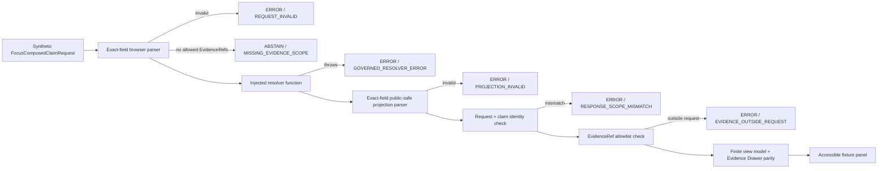
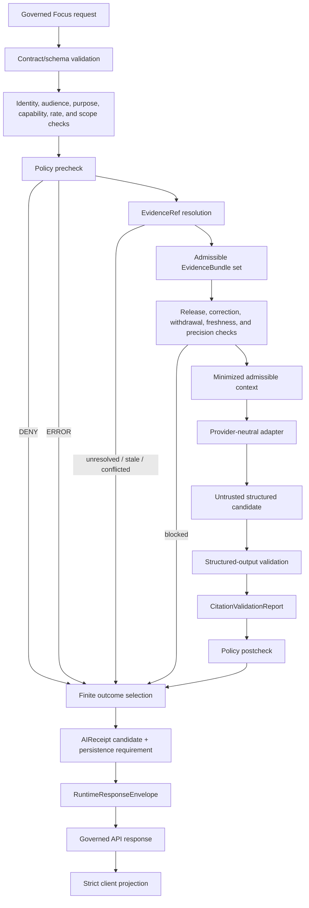

<!-- [KFM_META_BLOCK_V2]
doc_id: kfm://doc/architecture-governed-ai-focus-flow
title: Governed AI — Focus Flow
type: architecture-reference
version: v2.0.0-draft
status: draft; repository-grounded; client-proof-present; server-orchestration-hold; no-live-focus-route; no-release; no-publication
owners:
  - "@bartytime4life — verified CODEOWNERS review route"
  - "NEEDS VERIFICATION — independent governed-AI, Governed API, runtime, evidence, policy, citation, security, privacy, correction, release, UI, and accessibility stewardship"
created: 2026-05-14
updated: 2026-08-20
policy_label: public
truth_posture: cite-or-abstain
owning_root: docs/
current_path: docs/architecture/governed-ai/FOCUS_FLOW.md
responsibility: >-
  Explain the current bounded Focus client projection, the proposed server-side
  evidence/model decision flow, the finite outcome boundary, and the proof
  required before a live governed Focus route may exist without becoming
  contract, schema, policy, evidence, runtime, release, or publication authority.
evidence_snapshot:
  repository: bartytime4life/Kansas-Frontier-Matrix
  base_ref: main
  base_commit: 3295d5faf38c521e8cc5f4544dc9920a7b17efc1
  target_prior_blob: 2dc6213d667e7d2f130427355c5af6b7d59813e2
  directory_rules_blob: fd49a0b83e55cef52c1124281f093e263526898d
  directory_rules_decision: ADR-0029 accepted
  explorer_main_blob: 86c16e43e03601e65eb01b0b4949f7850089e877
  explorer_focus_types_blob: 919ba17b92405d0998689ca8579fa42e74f4df60
  explorer_focus_parsers_blob: 35f068145735430ad05d7bd7e4db6c4fe017a19b
  explorer_focus_resolver_blob: 45aa4e7479a8c95138f98cc48c846f39a16aec2d
  explorer_focus_panel_blob: 47fb994c88ccb4dec6872d1b42d560787492dfe9
  explorer_focus_test_blob: c32dbb2ccfa73b0b195aff3c231c19c5e8a19333
  governed_api_registry_blob: 3418168d0b267160d6ad6dd87f289e880ef4a024
  governed_api_stub_blob: 371e60d9f96c78e31c8a1e6109d19dee5da4213b
  mock_adapter_blob: 04d37e59b14c9e3b85126cb3380b6221b44e26d1
  ollama_adapter_blob: 1769a719d6a6df53e001abbc4c67ad486ab5c944
  focus_worker_blob: 7715d01fc585b03dedae7bb535591064bd6d055c
  runtime_response_contract_blob: 5060aaaa30fea37b6eeea6e1428b9effa6a163bd
  runtime_response_schema_blob: 8b86e7db8b18b65a56a4e639dfc54e1b2db93155
  runtime_response_builder_blob: 5dacededc1bda64292259ba39b6387facafbd1e8
  ai_receipt_contract_blob: f4d8183dbed38f83144f6d9dbde30ae02a01edb8
  ai_receipt_schema_blob: 2e0bebdb3a38acbc3c58a919db46970c6e829b4a
  ai_receipt_validator_blob: eb80e77aed15f478c32215c8f773f308a87a092a
  citation_report_contract_blob: 29c507e76a9c15c44f2c195b7342e93630cdc701
  citation_report_schema_blob: 60e5d3696d5afbe59cb382094bc673bdad1ad2bd
  focus_request_schema_blob: a2f298f014fa299bdec03afbf14ba9937aa95ef8
  focus_response_schema_blob: fd109e4a3c859115d4ad138e9303cf8c5bdd8873
inspection_boundary: >-
  Current-session GitHub reads covered the complete prior target, accepted
  Directory Rules v2 and ADR-0029, the repository-grounded governed-AI and UI
  Focus companions, the current Explorer Focus types, parsers, resolver, panel,
  tests, and normal site entrypoint, the Governed API route registry and stubs,
  the runtime adapter lane and Mock/Ollama implementations, the Focus policy
  boundary, proposed Focus schemas, RuntimeResponseEnvelope and AIReceipt
  contracts/schemas/helpers/validators, CitationValidationReport contract/schema,
  the Focus worker placeholder, relevant proposed ADRs, generated-receipt
  requirements, current main, and exact-target open-PR overlap. No live model
  daemon, provider endpoint, credential, authenticated Focus route, evidence
  resolver service, active Focus policy evaluator, citation service, AIReceipt
  emitter/store, deployed client, release environment, rollback drill, or public
  operation was exercised.
related:
  - ./README.md
  - ./ADAPTER_CONTRACT.md
  - ./AI_RECEIPTS.md
  - ./BOUNDARIES.md
  - ./CONTINUITY_NOTES.md
  - ./MOCK_FIRST.md
  - ./OLLAMA_INTEGRATION.md
  - ./PROMPT_INJECTION.md
  - ./ROUTE_MAP.md
  - ../ui/FOCUS_FLOW.md
  - ../ui/EVIDENCE_DRAWER.md
  - ../../adr/ADR-0019-ai-adapter-contract-and-finite-envelopes.md
  - ../../adr/ADR-0029-adopt-directory-governance-standard-v2.md
  - ../../adr/ADR-focus-model-adapter-boundary.md
  - ../../doctrine/directory-rules.md
  - ../../../apps/explorer-web/src/features/focus_panel/types.ts
  - ../../../apps/explorer-web/src/features/focus_panel/parsers.ts
  - ../../../apps/explorer-web/src/features/focus_panel/resolver.ts
  - ../../../apps/explorer-web/src/features/focus_panel/panel.ts
  - ../../../apps/explorer-web/tests/focus-composed-claim.test.ts
  - ../../../apps/governed-api/src/governed_api/routes/registry.py
  - ../../../runtime/model_adapters/MockAdapter.py
  - ../../../contracts/runtime/runtime_response_envelope.md
  - ../../../contracts/runtime/ai_receipt.md
  - ../../../contracts/evidence/citation_validation_report.md
  - ../../../policy/focus/README.md
tags: [kfm, architecture, governed-ai, focus-mode, evidence, policy, citation, model-adapter, runtime-response-envelope, ai-receipt, finite-outcomes, trust-membrane, cite-or-abstain]
notes:
  - "v2.0.0-draft is a same-path repository-grounded rewrite; it changes documentation and its required generated authoring receipt only."
  - "The architecture convergence split is preserved: ui/FOCUS_FLOW.md owns current client interaction/projection; this page owns proposed server evidence/model orchestration and cross-root responsibility."
  - "The current executable Focus slice is fixture-first and browser-local; it has no registered Governed API Focus route and is not mounted in the normal Explorer composition."
  - "RuntimeResponseEnvelope and AIReceipt are separate proposed object families. The current RuntimeResponseEnvelope schema does not carry an ai_receipt_ref field."
  - "The current AIReceipt schema has exactly nine required fields and no timestamp, evidence-ref, correction, supersession, retention, or signature field."
  - "No contract, schema, policy, fixture, validator, test, workflow, route, package, runtime, provider, data object, release, deployment, publication, or repository setting is changed."
[/KFM_META_BLOCK_V2] -->

<a id="top"></a>
<a id="focus-flow"></a>

# Governed AI — Focus Flow

> **Operating rule.** A Focus answer may cross the trust membrane only after the request is bounded, evidence is resolved, policy permits the operation, citations close, current release and correction state are respected, and the result is reduced to one finite client outcome. The model, browser, receipt, test, or document cannot create those authorities.

| Field | Current repository-grounded result |
|---|---|
| **Evidence snapshot** | `main@3295d5faf38c521e8cc5f4544dc9920a7b17efc1` |
| **Placement** | Existing `docs/architecture/governed-ai/` lane; `PLACE` under accepted ADR-0029 and adopted Directory Rules v2 |
| **Current executable Focus surface** | Strict fixture-first Explorer composed-claim request/projection parsing, injected-resolver boundary, EvidenceRef allowlist enforcement, finite view derivation, Evidence Drawer parity, accessible panel rendering, and focused tests |
| **Current Governed API Focus route** | **Absent.** The executable registry contains only `/bootstrap`, `/layers`, and `/evidence` |
| **Current model integration** | **Absent.** `MockAdapter` is a no-I/O synthetic envelope selector; `OllamaAdapter.py` and the Focus worker remain placeholders |
| **Current policy integration** | **Inactive scaffold.** `policy/focus/` does not establish an active evaluator or complete Focus rule set |
| **Current generic Focus schemas** | **Permissive proposed scaffolds.** They do not define the strict app-local profile or a canonical end-to-end request/response contract |
| **Current runtime trust objects** | Proposed, schema-paired `RuntimeResponseEnvelope`, `AIReceipt`, and fixture-first `CitationValidationReport` surfaces with bounded local proof |
| **Live end-to-end Focus transaction** | **Not established / HOLD** |
| **Release or publication effect** | None |

> [!IMPORTANT]
> **Current bounded proof is client-side and fixture-first.** The Explorer feature can reject malformed or out-of-scope projections and render safe finite states. It does not authenticate the fixture declarations, resolve an `EvidenceRef`, execute policy, call a provider, emit or persist an `AIReceipt`, verify a release, or publish an answer.

> [!CAUTION]
> **Do not collapse the app-local projection into the canonical runtime envelope.** The Explorer profile carries fields useful to one synthetic UI slice, including closure, citation, role, trust-state, drawer, and `aiReceiptRef` data. The current canonical-looking `RuntimeResponseEnvelope` schema is a different proposed object with ten unconditional fields and an `ANSWER`-only precision disclosure. Architecture prose must not silently merge them.

> [!WARNING]
> **No direct browser-to-model, browser-to-policy, browser-to-evidence-store, or browser-to-lifecycle-store path is authorized.** A future Focus route belongs behind the Governed API and must fail closed when identity, evidence, policy, citation, release, correction, or receipt obligations cannot be proved.

## Quick navigation

- [0. Current repository checkpoint](#0-current-repository-checkpoint)
- [1. Purpose and scope](#1-purpose-and-scope)
- [2. Repo fit — Directory Rules basis](#2-repo-fit--directory-rules-basis)
- [3. Finite outcomes — the trust grammar](#3-finite-outcomes--the-trust-grammar)
- [4. End-to-end flow](#4-end-to-end-flow)
- [5. Stage-by-stage walkthrough](#5-stage-by-stage-walkthrough)
- [6. Object families and homes](#6-object-families-and-homes)
- [7. Trust boundary](#7-trust-boundary)
- [8. Outcome decision matrix](#8-outcome-decision-matrix)
- [9. State ownership snapshot](#9-state-ownership-snapshot)
- [10. Validation and tests](#10-validation-and-tests)
- [11. Rollback and kill switch](#11-rollback-and-kill-switch)
- [12. Open questions and verification backlog](#12-open-questions-and-verification-backlog)
- [13. Related docs](#13-related-docs)
- [14. Appendices](#14-appendices)

---

<a id="0-current-repository-checkpoint"></a>

## 0. Current repository checkpoint

The prior edition described one proposed full-stack Focus flow as though all named components were equally immature. Current repository evidence supports a more precise split:

1. **CONFIRMED bounded client proof** — a strict, no-network Explorer projection exists and has focused test definitions.
2. **CONFIRMED bounded runtime primitives** — a no-I/O `MockAdapter`, a deterministic `RuntimeResponseEnvelope` candidate builder, a strict AIReceipt shape/validator, and a fixture-first CitationValidationReport profile exist.
3. **CONFIRMED absent integration** — no Focus HTTP route, live evidence-resolution composition, active Focus policy evaluator, citation service, provider adapter, AIReceipt emitter/store, or normal Explorer Focus mount is established.
4. **PROPOSED target orchestration** — the server-side sequence in this page defines the dependency and authority order a future implementation must prove.
5. **UNKNOWN deployed behavior** — no deployed route, provider, client session, environment, dashboard, log, or release was exercised.

### 0.1 Confirmed current surfaces

| Surface | What current bytes prove | What they do **not** prove |
|---|---|---|
| [`types.ts`](../../../apps/explorer-web/src/features/focus_panel/types.ts) | Closed app-local request/projection profiles, finite outcomes, closure states, reason codes, trust-state fields, and a view-model boundary | Canonical Focus semantic or schema authority |
| [`parsers.ts`](../../../apps/explorer-web/src/features/focus_panel/parsers.ts) | Exact-field parsing, bounded values, HTTPS citation checks, answer/negative-state coherence, and Evidence Drawer parity | Authentication of evidence, policy, review, release, freshness, or receipt references |
| [`resolver.ts`](../../../apps/explorer-web/src/features/focus_panel/resolver.ts) | Empty-scope abstention, injected resolver, request/claim binding, EvidenceRef allowlist enforcement, and fixed local failures | Network transport, Governed API integration, evidence resolution, policy execution, or model inference |
| [`panel.ts`](../../../apps/explorer-web/src/features/focus_panel/panel.ts) | Finite DOM rendering, Evidence Drawer embedding, `aria-live`, Escape close, and focus return | Normal Explorer integration, deployed accessibility conformance, or public operation |
| [`focus-composed-claim.test.ts`](../../../apps/explorer-web/tests/focus-composed-claim.test.ts) | Executable test definitions for strict parsing, no-leak negative states, scope mismatch, and no browser network/provider/lifecycle imports | That every branch, environment, or deployment executed and passed those tests |
| [`main.ts`](../../../apps/explorer-web/src/main.ts) | Normal Explorer startup mounts `mountExplorerSite` | A normal-site Focus composed-claim mount |
| [`registry.py`](../../../apps/governed-api/src/governed_api/routes/registry.py) | Exactly three registered route paths | A Focus, model, citation, policy, receipt, or review route |
| [`MockAdapter.py`](../../../runtime/model_adapters/MockAdapter.py) | Deterministic deep-copy selection from a complete synthetic four-outcome matrix without I/O | Request interpretation, semantic outcome selection, evidence resolution, policy evaluation, model calls, citations, or receipt emission |
| [`RuntimeResponseEnvelope`](../../../contracts/runtime/runtime_response_envelope.md) and [schema](../../../schemas/contracts/v1/runtime/runtime_response_envelope.schema.json) | A proposed client-facing finite envelope profile with closed shape and `ANSWER`-only precision disclosure | Semantic outcome selection, evidence closure, policy correctness, release, or live client use |
| [`AIReceipt`](../../../contracts/runtime/ai_receipt.md), [schema](../../../schemas/contracts/v1/runtime/ai_receipt.schema.json), and [validator](../../../tools/validators/validate_ai_receipt.py) | A proposed nine-field accountability shape and deterministic no-network shape/local-consistency validation | AI execution, receipt emission, persistence, policy/citation resolution, correction, retention, or public-answer authority |
| [`CitationValidationReport`](../../../contracts/evidence/citation_validation_report.md) and [schema](../../../schemas/contracts/v1/evidence/citation_validation_report.schema.json) | A closed fixture-first declaration-consistency profile with finite results and explicit non-effects | Live citation lookup, evidence authentication, policy/review/release authentication, or public-answer authorization |
| [`policy/focus/README.md`](../../../policy/focus/README.md) | Repository-present policy boundary and explicit inactive/scaffold posture | Active Focus policy evaluation |
| [`OllamaAdapter.py`](../../../runtime/model_adapters/OllamaAdapter.py) and [Focus worker](../../../apps/workers/src/ai_focus_worker/main.py) | Placeholder files exist | An admitted provider, worker process, or end-to-end runtime |

### 0.2 Current maturity statement

**CONFIRMED:** KFM can exercise a synthetic client projection and several isolated trust-object profiles without network or provider access.

**CONFIRMED:** those pieces are not composed into a live Focus transaction.

**PROPOSED:** the target flow below is the minimum safe orchestration order for future implementation.

**NEEDS VERIFICATION:** accepted ownership, contract convergence, policy entrypoints, evidence and citation service boundaries, route identity, release binding, operational rollback, and independent review.

[Back to top](#top)

---

<a id="1-purpose-and-scope"></a>

## 1. Purpose and scope

This page explains the **governed-AI side of Focus Mode**:

- the current boundary between the client projection and server authority;
- the target order of scope, evidence, policy, adapter, citation, receipt, and envelope operations;
- the finite outcomes that cross the trust membrane;
- the responsibility root that owns each object or behavior;
- the proof required before a live route, provider, or public answer may be claimed.

### In scope

- the current repository-present Focus client projection and its limits;
- the proposed server-side orchestration transaction;
- current `RuntimeResponseEnvelope`, `AIReceipt`, and `CitationValidationReport` profiles;
- provider-neutral adapter and no-direct-model-client rules;
- `EvidenceRef` to `EvidenceBundle` resolution as a required target gate;
- precheck/postcheck policy ordering;
- finite outcome selection and safe reason disclosure;
- correction, withdrawal, freshness, precision, review, and release obligations;
- validation, rollback, and graduation gates.

### Out of scope

This page does not:

- define or change a semantic contract, JSON Schema, Rego rule, adapter interface, route, worker, fixture, test, workflow, or data record;
- accept [`ADR-0019`](../../adr/ADR-0019-ai-adapter-contract-and-finite-envelopes.md) or the unassigned [`Focus adapter-boundary candidate`](../../adr/ADR-focus-model-adapter-boundary.md);
- authenticate the fixture-declared policy, review, release, freshness, or AIReceipt states;
- admit Ollama or another provider/model;
- authorize a source, public answer, release, deployment, or publication;
- make architecture prose the runtime source of truth.

### Responsibility split with the UI page

The existing architecture split remains:

| Page | Owns in documentation | Must not own |
|---|---|---|
| [`docs/architecture/ui/FOCUS_FLOW.md`](../ui/FOCUS_FLOW.md) | Client request composition, strict projection parsing, rendering, Evidence Drawer handoff, accessibility, browser-negative authority | Evidence truth, policy, model execution, citation authority, receipt emission, release |
| This page | Server orchestration order, evidence/model seam, finite outcome authority chain, cross-root object map, graduation proof | UI implementation behavior, contract/schema/policy definitions, runtime authority |

This is a documentation split, not proof of two deployed services.

[Back to top](#top)

---

<a id="2-repo-fit--directory-rules-basis"></a>

## 2. Repo fit — Directory Rules basis

### Placement outcome: `PLACE`

Accepted [`ADR-0029`](../../adr/ADR-0029-adopt-directory-governance-standard-v2.md) adopts [`docs/doctrine/directory-rules.md`](../../doctrine/directory-rules.md) as the writable Directory Rules authority. This target is an existing human architecture reference under `docs/architecture/governed-ai/`; it remains at the same path.

| Responsibility | Owning root or surface | Role of this page |
|---|---|---|
| Human architecture explanation | `docs/architecture/governed-ai/` | Current owning lane |
| Accepted decisions | `docs/adr/` | Link and report status; never accept by prose |
| Semantic meaning | `contracts/` | Link only |
| Machine shape | `schemas/` | Link only |
| Admissibility rules | `policy/` | Link only |
| Executable apps and workers | `apps/` | Report current evidence |
| Provider-neutral runtime adapter lane | `runtime/model_adapters/` | Report current evidence |
| Reusable envelope helpers | `packages/` | Report current evidence |
| Validation implementation | `tools/validators/` | Report current evidence |
| Fixtures and tests | `fixtures/`, `tests/` | Report proof scope |
| Receipt instances | governed `data/receipts/` families | Reference only |
| Release, correction, withdrawal, rollback decisions | `release/` and accepted companion families | Never decide here |

No new root, domain, schema home, policy home, receipt family, route family, or release path is created by this revision.

### Decision posture

| Decision surface | Current status | Consequence |
|---|---|---|
| ADR-0029 — Directory Rules v2 | **Accepted** | Governs placement |
| ADR-0019 — adapter contract and finite envelopes | **Proposed** | Useful architecture direction; not accepted runtime authority |
| Focus Mode–model adapter boundary candidate | **Not assigned / proposed** | Must converge with or be distinguished from ADR-0019 before acceptance |
| Focus route, provider, policy bundle, and release decision | **Absent or not established** | Remain on `HOLD` |

[Back to top](#top)

---

<a id="3-finite-outcomes--the-trust-grammar"></a>

## 3. Finite outcomes — the trust grammar

The public or semi-public Focus boundary uses four finite outcomes:

| Outcome | Meaning | Minimum client posture |
|---|---|---|
| `ANSWER` | A bounded response may be rendered under current evidence, policy, citation, review, release, freshness, correction, and precision constraints | Render only the validated public-safe envelope, citations, limitations, and obligations |
| `ABSTAIN` | The system cannot support an answer for the requested scope without guessing or overreaching | Show safe insufficiency/staleness/scope language; do not infer an answer |
| `DENY` | Policy, rights, sensitivity, access, release, or harmful-precision rules prohibit the requested operation or detail | Withhold restricted payload and expose only approved safe reason/alternative |
| `ERROR` | The transaction could not complete safely or deterministically | Show a bounded error; do not fall back to model text, stale state, or an inferred answer |

These outcomes are client-facing runtime results. They are not identical to validator results such as `PASS`, policy decisions such as `ALLOW`, evidence-resolver results such as `RESOLVED`, or closure states such as `SUPPORTED` and `QUALIFIED`.

### Outcome non-collapse

| Upstream state | May contribute to | Does not automatically become |
|---|---|---|
| Citation report `PASS` | `ANSWER` eligibility | `ANSWER` or release |
| Policy `ALLOW` | `ANSWER` eligibility | Evidence closure, review, or release |
| Evidence resolver `RESOLVED` | Context assembly | Policy permission or answer truth |
| Closure `SUPPORTED` / `QUALIFIED` | App-local answer projection | Canonical RuntimeResponseEnvelope outcome |
| Validator `PASS` | Shape/consistency confidence | Runtime authority |
| `AIReceipt` present | Accountability | Evidence, approval, or release |

Unknown or missing upstream state fails closed to `ABSTAIN`, `DENY`, or `ERROR` according to the owning authority and reason taxonomy.

[Back to top](#top)

---

<a id="4-end-to-end-flow"></a>

## 4. End-to-end flow

There are two different flows in the current repository. They must remain explicit.

### 4.1 CONFIRMED current fixture-first client flow


```mermaid
flowchart LR
  A["Synthetic FocusComposedClaimRequest"] --> B["Exact-field browser parser"]
  B -->|invalid| E1["ERROR / REQUEST_INVALID"]
  B -->|no allowed EvidenceRefs| E2["ABSTAIN / MISSING_EVIDENCE_SCOPE"]
  B --> C["Injected resolver function"]
  C -->|throws| E3["ERROR / GOVERNED_RESOLVER_ERROR"]
  C --> D["Exact-field public-safe projection parser"]
  D -->|invalid| E4["ERROR / PROJECTION_INVALID"]
  D --> F["Request + claim identity check"]
  F -->|mismatch| E5["ERROR / RESPONSE_SCOPE_MISMATCH"]
  F --> G["EvidenceRef allowlist check"]
  G -->|outside request| E6["ERROR / EVIDENCE_OUTSIDE_REQUEST"]
  G --> H["Finite view model + Evidence Drawer parity"]
  H --> I["Accessible fixture panel"]
```

What this proves:

- strict app-local parsing and finite view derivation;
- no resolver call when the request has no governed evidence scope;
- no citation or Evidence Drawer drift inside an accepted projection;
- no unsupported EvidenceRef can escape the request allowlist;
- no private thrown error or fixture diagnostic is copied into public negative text;
- the browser modules contain no `fetch`, provider import, lifecycle-store import, or private-reasoning field.

What this does not prove:

- authenticated transport;
- real evidence resolution;
- policy execution;
- provider/model execution;
- citation service execution;
- AIReceipt emission or persistence;
- release/correction lookup;
- normal-site mounting;
- public deployment.

### 4.2 PROPOSED target governed server flow


```mermaid
flowchart TB
  REQ["Governed Focus request"] --> SHAPE["Contract/schema validation"]
  SHAPE --> ID["Identity, audience, purpose, capability, rate, and scope checks"]
  ID --> PRE["Policy precheck"]
  PRE -->|DENY| OUT["Finite outcome selection"]
  PRE -->|ERROR| OUT
  PRE --> EVR["EvidenceRef resolution"]
  EVR -->|unresolved / stale / conflicted| OUT
  EVR --> BUNDLE["Admissible EvidenceBundle set"]
  BUNDLE --> REL["Release, correction, withdrawal, freshness, and precision checks"]
  REL -->|blocked| OUT
  REL --> CTX["Minimized admissible context"]
  CTX --> ADAPTER["Provider-neutral adapter"]
  ADAPTER --> CAND["Untrusted structured candidate"]
  CAND --> STRUCT["Structured-output validation"]
  STRUCT --> CIT["CitationValidationReport"]
  CIT --> POST["Policy postcheck"]
  POST --> OUT
  OUT --> REC["AIReceipt candidate + persistence requirement"]
  REC --> ENV["RuntimeResponseEnvelope"]
  ENV --> API["Governed API response"]
  API --> CLIENT["Strict client projection"]
```

The target ordering is deliberate:

1. scope and policy are checked before evidence or model work that should not occur;
2. evidence is resolved before model invocation;
3. only minimized admissible context reaches the adapter;
4. adapter output remains untrusted;
5. citation and policy postchecks occur after candidate generation;
6. orchestration—not the adapter—selects the final finite outcome;
7. the receipt records the AI event but does not authorize it;
8. only the governed runtime envelope crosses to the client.

This target remains **PROPOSED / HOLD** until its contracts, schemas, policy, code, fixtures, tests, route, persistence, correction, rollback, security, review, and release evidence close.

[Back to top](#top)

---

<a id="5-stage-by-stage-walkthrough"></a>

## 5. Stage-by-stage walkthrough

### Stage 1 — Request admission

A future caller-facing request should bind at least:

- stable request and correlation identity;
- authenticated principal or explicitly anonymous audience class;
- purpose and requested operation;
- spatial, temporal, domain, feature, and release scope;
- map context when the operation is map-anchored;
- the maximum allowed EvidenceRef scope;
- requested precision, output mode, and capability;
- client contract/profile version.

**Current state:** the strict app-local request carries only profile, request ID, claim ID, question, and allowed EvidenceRefs. The generic Focus request schema remains an empty permissive scaffold.

**Failure posture:** malformed request → `ERROR`; missing evidence scope → `ABSTAIN`; unauthorized capability or harmful scope → `DENY`.

### Stage 2 — Identity, capability, and precheck

The Governed API should verify identity, audience, capability, purpose, rate, and applicable policy before expensive or sensitive work.

**Current state:** no Focus route or authenticated Focus middleware is established.

**Failure posture:** missing authentication where required → `DENY` or `ERROR`; policy uncertainty → fail closed; safe reason text must not reveal protected policy internals.

### Stage 3 — Evidence resolution

Every consequential claim path should resolve allowed `EvidenceRef` objects to admissible `EvidenceBundle` state. Resolution must account for:

- subject and claim scope;
- source role;
- valid and recorded time;
- current verification state;
- rights and sensitivity;
- review and release state;
- correction, supersession, withdrawal, and rollback;
- spatial and temporal fitness;
- precision actually supported.

**Current state:** the Explorer resolver checks only that projection refs stay inside the request allowlist. That is scope enforcement, not EvidenceBundle resolution.

**Failure posture:** unresolved, stale, incomplete, role-incompatible, corrected-away, or out-of-scope support normally yields `ABSTAIN`; denied or restricted support yields `DENY`; resolver failure yields `ERROR`.

### Stage 4 — Context assembly

Only the smallest admissible context should reach the adapter. Context should be:

- derived from resolved, released or review-authorized evidence;
- bounded to the request scope;
- stripped of secrets, internal identifiers, hidden policy reasons, and unnecessary sensitive precision;
- version and digest bound;
- explicit about limitations and unavailable dependencies;
- resistant to source-content prompt injection.

**Current state:** no production context assembler is established.

### Stage 5 — Provider-neutral adapter

The adapter should receive an internal request, not the public request object or direct store handles. It should return an untrusted structured candidate.

The adapter must not own:

- evidence resolution;
- policy permission;
- citation validation;
- final finite outcome authority;
- client RuntimeResponseEnvelope assembly;
- release or publication.

**Current state:** `MockAdapter` selects prevalidated complete synthetic envelopes; it is not the target semantic adapter seam. `OllamaAdapter.py` is a placeholder.

### Stage 6 — Structured-output and citation validation

Candidate output must pass:

- bounded structured-output validation;
- claim-to-citation mapping;
- EvidenceRef and EvidenceBundle scope checks;
- source-role compatibility;
- freshness and temporal support checks;
- public-candidate policy/review/release declarations;
- no unsupported or invented citations.

The current `CitationValidationReport` profile checks declared-state consistency and deterministic identity. It does not perform live resolution or authenticate declarations.

**Failure posture:** unsupported or incomplete citations → `ABSTAIN`; denied support → `DENY`; validator/service failure → `ERROR`.

### Stage 7 — Policy postcheck and precision

Postcheck should evaluate the candidate actually produced, including:

- sensitive or restricted detail leakage;
- precision beyond evidence support;
- unsafe transformations or missing transform receipts;
- prohibited advice or alert-authority language;
- obligations, disclaimers, attribution, and audience restrictions;
- stale, corrected, superseded, withdrawn, or rollback-affected material.

For `ANSWER`, the current proposed `RuntimeResponseEnvelope` requires a `precision_actually_used` object and at least one EvidenceRef. Negative outcomes forbid that precision object.

### Stage 8 — Finite outcome selection

Orchestration selects `ANSWER`, `ABSTAIN`, `DENY`, or `ERROR` from verified upstream states. A provider cannot upgrade a blocked result. Confidence scores, fluent text, retries, or user pressure cannot turn missing authority into `ANSWER`.

### Stage 9 — AIReceipt

The current proposed AIReceipt profile has exactly nine required fields:

- `id`;
- `run_id`;
- `adapter`;
- `model_ref`;
- `inputs_digest`;
- `outputs_digest`;
- `policy_decision_ref`;
- `citation_validation_ref`;
- `outcome`.

It has no timestamp, EvidenceRef, EvidenceBundle, prompt/profile version, contract/schema version, correction, supersession, signature, or retention field. Those absent semantics must remain explicit gaps.

A receipt records accountability. It does not establish evidence truth, policy correctness, citation pass, review, release, or publication.

### Stage 10 — RuntimeResponseEnvelope and client projection

The current proposed RuntimeResponseEnvelope has ten unconditional fields:

- `id`;
- `spec_hash`;
- `version`;
- `issued_at`;
- `outcome`;
- `reason_code`;
- `evidence_refs`;
- `policy_state`;
- `freshness`;
- `correction_state`.

`ANSWER` additionally requires `precision_actually_used`; negative outcomes forbid it.

The current schema does **not** include `ai_receipt_ref`, answer text, citations, policy-decision ref, or citation-report ref. A future composition must decide whether those are separate payload references, a versioned envelope extension, or another governed response object. This page does not invent the answer.

[Back to top](#top)

---

<a id="6-object-families-and-homes"></a>

## 6. Object families and homes

| Object or behavior | Current repository surface | Status | Authority limit |
|---|---|---|---|
| App-local Focus request/projection | `apps/explorer-web/src/features/focus_panel/` | **CONFIRMED bounded executable** | Client profile only; not canonical contract/schema |
| Generic Focus request/response schemas | `schemas/contracts/v1/focus/` | **PROPOSED permissive scaffolds** | No strict shape or semantic contract |
| Focus semantic notes | `contracts/ui/`, `contracts/ai/`, and related lanes | **CONFLICTED / NEEDS VERIFICATION** | Must converge before a live route |
| RuntimeResponseEnvelope | `contracts/runtime/` + `schemas/contracts/v1/runtime/` | **PROPOSED, schema-paired, bounded proof** | Client envelope shape; not outcome authority |
| AIReceipt | `contracts/runtime/` + `schemas/contracts/v1/runtime/` | **PROPOSED, schema-paired, bounded validator/builder** | Accountability only |
| CitationValidationReport | `contracts/evidence/` + `schemas/contracts/v1/evidence/` | **PROPOSED, fixture-first** | Declaration consistency only |
| Focus policy source | `policy/focus/` | **Inactive scaffold** | No evaluator or complete enforcement |
| Provider-neutral adapters | `runtime/model_adapters/` | **Mixed** | Mock selector executable; provider adapter absent |
| Focus HTTP route | `apps/governed-api/` | **Absent** | No route contract or execution |
| Focus worker | `apps/workers/src/ai_focus_worker/` | **Placeholder** | No process behavior |
| Evidence resolution | governed evidence package/service boundary | **Partial candidates elsewhere; no Focus composition proved** | Must not be inferred from allowlist checks |
| Runtime AIReceipt instances | governed `data/receipts/ai/` lane | **No emitter/store established** | No public path; receipt is not proof |
| Release/correction/rollback | `release/` and accepted companion families | **No Focus release established** | Separate authority |

### Required anti-collapse rules

- App-local profile ≠ canonical semantic contract.
- Semantic contract ≠ machine schema.
- Schema pass ≠ evidence or policy pass.
- EvidenceRef allowlist ≠ EvidenceBundle resolution.
- Citation report ≠ source or bundle authentication.
- Policy decision ≠ evidence truth.
- AIReceipt ≠ RuntimeResponseEnvelope.
- RuntimeResponseEnvelope ≠ release manifest.
- MockAdapter ≠ provider integration.
- Route registration ≠ deployment or publication.
- Test pass ≠ release approval.

[Back to top](#top)

---

<a id="7-trust-boundary"></a>

## 7. Trust boundary

### 7.1 What may cross to the browser

Only public-safe, validated, bounded material appropriate to the outcome may cross:

- the finite outcome and safe reason code;
- answer text only when an accepted response profile permits it;
- public-safe citations and EvidenceRefs;
- precision actually supported for an `ANSWER`;
- limitations, freshness, correction, and withdrawal posture;
- approved obligations and safe alternatives;
- opaque process or receipt references only when policy allows disclosure;
- an Evidence Drawer projection consistent with the same evidence scope.

### 7.2 What must not cross

- raw model/provider output or token stream;
- raw prompts or private chain-of-thought;
- RAW, WORK, QUARANTINE, or unreleased candidate content;
- canonical/internal store handles;
- secrets, credentials, provider traces, or hidden system details;
- protected exact coordinates or sensitive denial reasons;
- unresolved evidence content;
- unvalidated citations;
- internal policy source, evaluator internals, or confidential rule rationale;
- a receipt represented as evidence or release proof.

### 7.3 What the model must never receive directly

- unrestricted source, evidence, graph, vector, or lifecycle-store access;
- browser credentials or user secrets;
- policy engine internals beyond the minimized decision context required;
- hidden review notes or protected identities;
- unrestricted tool or network capability;
- evidence outside the admitted request scope;
- exact sensitive location data unless an approved operation explicitly allows it.

### 7.4 Prompt-injection boundary

Source text, user text, map labels, citations, retrieved records, and model output are untrusted content. They cannot:

- change system or policy authority;
- expand the EvidenceRef allowlist;
- request credentials or hidden prompts;
- authorize a tool, route, provider, release, or publication;
- suppress citations, receipts, or safe negative outcomes;
- convert a model candidate into a final envelope.

[Back to top](#top)

---

<a id="8-outcome-decision-matrix"></a>

## 8. Outcome decision matrix

| Condition | Target outcome | Safe public posture |
|---|---|---|
| Request shape invalid | `ERROR` | Generic invalid-request message; no payload echo |
| Required evidence scope absent | `ABSTAIN` | Explain that no governed support was supplied |
| Caller lacks capability or access | `DENY` | Safe denial; no hidden policy details |
| EvidenceRef unresolved or bundle incomplete | `ABSTAIN` | No answer text |
| Evidence or release explicitly denied/withdrawn | `DENY` | Withhold restricted content |
| Evidence stale and current support required | `ABSTAIN` | Show stale limitation or narrower historical scope |
| Evidence resolver unavailable | `ERROR` | No model fallback |
| Policy evaluator unavailable | `ERROR` or fail-closed `DENY` per accepted policy | No permissive fallback |
| Adapter unavailable after all prechecks | `ERROR` | No fabricated answer |
| Adapter returns malformed candidate | `ERROR` | No raw candidate exposure |
| Candidate citations incomplete or unsupported | `ABSTAIN` | Cite-or-abstain |
| Candidate leaks restricted detail | `DENY` | Withhold and optionally offer approved generalized alternative |
| Receipt persistence required but unavailable | `ERROR` | No `ANSWER` until accountability requirement is met |
| All evidence, policy, citation, review, release, freshness, correction, precision, and receipt gates pass | `ANSWER` | Render bounded answer with citations, limitations, and obligations |

### Qualified support

The current app-local profile permits `closureOutcome=QUALIFIED` to map to `ANSWER` when required support is present, optional roles are unavailable, and explicit limitations are shown. A future canonical runtime contract must decide whether qualified support remains an `ANSWER` reason/profile, becomes a separate field, or is represented another way. It must not create a fifth public outcome without an accepted contract change.

[Back to top](#top)

---

<a id="9-state-ownership-snapshot"></a>

## 9. State ownership snapshot

| State | Owner | Browser authority | Adapter authority |
|---|---|---:|---:|
| Request form and local interaction state | Explorer UI | Compose and validate locally | None |
| Authenticated identity, audience, purpose, capability | Governed API/auth boundary | Present approved client token/context only | Receive minimized internal claims only if needed |
| Allowed EvidenceRef scope | Governed orchestration | Submit declared scope; enforce response subset | Must not expand |
| EvidenceRef resolution and EvidenceBundle admission | Evidence resolver / evidence authority | None | None |
| Policy precheck/postcheck | Policy evaluator | Render result/obligations | None |
| Review and release state | Review/release authorities | Render public-safe projection | None |
| Correction, withdrawal, rollback, freshness | Owning lifecycle/release services | Render current posture | None |
| Minimized model context | Governed orchestration | None | Consume only |
| Provider/model execution | Provider-neutral adapter/runtime | None | Execute bounded request |
| Structured candidate | Adapter → orchestration | Never render directly | Produce untrusted candidate |
| Citation validation | Citation validator/report service | Render validated projection | None |
| Final finite outcome | Governed orchestration | Render only | Cannot finalize |
| AIReceipt candidate and persistence | Runtime receipt emitter/store | Optional safe reference only | Supply adapter/model identity and digests as required |
| RuntimeResponseEnvelope | Governed orchestration/API | Strictly validate and render | Cannot own |
| Evidence Drawer projection | Governed API/UI adapter | Strictly validate and render | None |
| Release or publication decision | Release authority | None | None |

The missing `STATE_OWNERSHIP.md` link from the prior edition is removed. This section is the explanatory ownership snapshot until a verified canonical companion exists.

[Back to top](#top)

---

<a id="10-validation-and-tests"></a>

## 10. Validation and tests

### 10.1 Confirmed bounded proof surfaces

| Proof surface | Current scope |
|---|---|
| Explorer Focus unit tests | Strict request/projection parsing, supported/qualified/negative paths, scope binding, no-leak copy, no browser fetch/provider/lifecycle imports |
| Explorer browser tests | Fixture panel behavior and accessibility mechanics defined in the UI lane |
| Runtime envelope schema/fixtures/tests | Four finite outcomes and `ANSWER` precision shape |
| RuntimeResponseEnvelope builder tests | Deterministic local candidate checks; no authority creation |
| MockAdapter proof tests | Complete four-outcome synthetic matrix and no-I/O behavior |
| AIReceipt validator/fixtures | Strict nine-field shape and local consistency |
| CitationValidationReport fixtures/validator/tests | Declared-state consistency, deterministic identity, finite results, non-effects |
| Focus policy docs/workflows | Boundary and shape-readiness signals only; no active Focus evaluator proof |

A current file or test definition is not proof that the exact branch or deployed environment passed. Hosted exact-head results must be reported separately.

### 10.2 Minimum target test matrix

A live Focus implementation should add dependency-closed positive and negative proof for:

1. strict canonical request and response schemas;
2. authenticated route and capability denial;
3. empty and out-of-scope EvidenceRef handling;
4. real resolver success, unresolved, denied, stale, corrected, superseded, revoked, withdrawn, and error states;
5. policy precheck and postcheck with stable reason/obligation vocabularies;
6. context minimization and prompt-injection resistance;
7. provider-neutral adapter contract with no final-envelope authority;
8. structured candidate rejection;
9. citation validation success and every failure precedence;
10. harmful precision and sensitive-geometry denial/generalization;
11. review, release, correction, withdrawal, and rollback propagation;
12. AIReceipt emission, digest binding, persistence failure, retention, and correction posture;
13. RuntimeResponseEnvelope semantic selection and client parsing;
14. Evidence Drawer parity and citation/evidence scope consistency;
15. no direct browser-to-model or browser-to-internal-store path;
16. no secrets, raw prompts, chain-of-thought, provider traces, or protected denial details in logs/telemetry;
17. feature disablement and safe client degradation;
18. no-network deterministic fixture profile;
19. realistic integration tests at the Governed API trust membrane;
20. release-candidate and rollback rehearsal.

### 10.3 Graduation evidence

Before describing Focus as operational, the repository should provide:

- accepted, non-overlapping ADR authority;
- canonical semantic contracts and strict schemas;
- active policy bundle and evaluator binding;
- authenticated Governed API route;
- EvidenceRef-to-EvidenceBundle service integration;
- citation service/report integration;
- provider/model admission record;
- AIReceipt emitter and durable store;
- client integration behind a verified feature-control path;
- correction/withdrawal/rollback propagation;
- security, privacy, sensitivity, accessibility, and observability review;
- exact-head hosted checks and independent review;
- governed release manifest and rollback target for the exact operation.

[Back to top](#top)

---

<a id="11-rollback-and-kill-switch"></a>

## 11. Rollback and kill switch

### 11.1 This documentation change

Rollback for this revision is repository-only:

1. close the draft pull request before merge, or
2. after an authorized merge, revert the reviewed change;
3. restore prior target blob `2dc6213d667e7d2f130427355c5af6b7d59813e2`;
4. remove only the paired generated authoring receipt;
5. rerun documentation, link, metadata, receipt, and aggregate checks.

No runtime, provider, source, evidence, lifecycle, release, deployment, cache, or public-state rollback is required because this slice changes documentation and authoring provenance only.

### 11.2 Future operational Focus rollback

A mature Focus operation should be independently disableable without disabling the Evidence Drawer, map browsing, or other non-AI Explorer behavior. That is a **PROPOSED requirement**, not current feature-flag evidence.

Required operational rollback properties:

- deny-by-default route disablement at the Governed API;
- client hides or disables Focus without exposing stale answers;
- adapter/provider deactivation without bypass or fallback to raw model access;
- receipt and audit continuity for attempted requests;
- cache invalidation for affected responses;
- correction/withdrawal propagation to visible answers and citations;
- versioned schema and contract compatibility;
- rollback target bound to the released operation;
- tested restoration of the prior safe configuration.

### 11.3 Failure-specific posture

| Failure | Target action | Client result |
|---|---|---|
| Provider regression | Disable admitted adapter/profile | `ERROR`; non-AI UI remains |
| Evidence resolver regression | Disable Focus route or affected capability | `ERROR`; never call model without evidence |
| Citation validator regression | Disable answer path | `ERROR` or `ABSTAIN` according to accepted failure contract |
| Policy evaluator regression | Fail closed | `DENY` or `ERROR`; no permissive fallback |
| Receipt store unavailable when receipt is required | Refuse `ANSWER` | `ERROR` |
| Correction/withdrawal propagation uncertain | Stop serving affected answer | `ABSTAIN` or `DENY` |
| Client parser incompatibility | Serve prior compatible profile or disable capability | Safe negative state |
| Security or privacy incident | Revoke capability/provider/route and preserve incident evidence | No answer exposure |

[Back to top](#top)

---

<a id="12-open-questions-and-verification-backlog"></a>

## 12. Open questions and verification backlog

| Priority | Item | Status | Closure evidence |
|---|---|---|---|
| P0 | Converge ADR-0019 and the unassigned Focus adapter-boundary candidate | **CONFLICTED / HOLD** | Accepted decision with explicit scope and supersession/relationship |
| P0 | Select canonical Focus semantic contracts and strict request/response schemas | **CONFLICTED / NEEDS VERIFICATION** | One contract/schema family, migration note, fixtures, validators, consumers |
| P0 | Define authenticated Governed API Focus route, capability, audience, purpose, and safe error contract | **PROPOSED** | Route code, contract binding, auth tests, no-bypass proof |
| P0 | Bind a real EvidenceRef-to-EvidenceBundle resolution service | **PROPOSED** | Positive/negative integration fixtures and replay/correction tests |
| P0 | Activate a complete Focus policy bundle and evaluator | **PROPOSED / HOLD** | Reviewed rules, entrypoints, tests, bundle identity, consumer binding |
| P0 | Integrate CitationValidationReport with authenticated upstream state | **PROPOSED** | Service/validator composition and fail-closed integration tests |
| P0 | Decide how RuntimeResponseEnvelope references answer payload, citations, policy/citation results, and AIReceipt | **CONFLICTED / NEEDS VERIFICATION** | Versioned contract/schema decision; no prose-only merge |
| P0 | Establish AIReceipt emission, persistence, canonicalization, timestamp/version identity, correction, retention, and security semantics | **PROPOSED** | Contract evolution or companion objects, tests, store, runbook |
| P1 | Admit one exact provider/model/profile | **HOLD** | Security/privacy review, capability limits, version/digest pin, rollback |
| P1 | Mount Focus in the normal Explorer composition | **PROPOSED** | Governed route, strict client integration, accessibility/browser tests, feature control |
| P1 | Define telemetry and observability without prompts, raw evidence, sensitive locations, hidden policy details, or provider traces | **PROPOSED** | Contract/schema/policy, negative tests, retention review |
| P1 | Define correction, withdrawal, supersession, stale-state, and cache propagation | **PROPOSED** | End-to-end rehearsal and rollback evidence |
| P1 | Define qualified-answer semantics in the canonical response profile | **NEEDS VERIFICATION** | Contract decision and compatibility tests |
| P1 | Name independent stewards and separation-of-duties reviewers | **NEEDS VERIFICATION** | Accepted ownership and review records |
| P2 | Establish rate, latency, token/context, cost, concurrency, timeout, and retry budgets | **UNKNOWN** | Measured load/security tests and operational SLOs |
| P2 | Establish public-safe receipt/reference disclosure | **UNKNOWN** | Policy and privacy review plus client contract |
| P2 | Prove deployed accessibility, security headers, incident response, and operational kill switch | **UNKNOWN** | Named-environment evidence and rehearsal |

### Stop conditions

Do not activate or describe Focus as public when any of these remain unresolved for the operation:

- evidence, rights, sensitivity, review, release, correction, or rollback state;
- canonical request/response shape;
- active policy and citation enforcement;
- provider/model admission;
- receipt/accountability requirement;
- no-direct-model-client proof;
- safe negative states;
- independent review appropriate to consequence.

[Back to top](#top)

---

<a id="13-related-docs"></a>

## 13. Related docs

| Path | Current role |
|---|---|
| [`README.md`](./README.md) | Governed-AI subsystem entry point and current maturity |
| [`ADAPTER_CONTRACT.md`](./ADAPTER_CONTRACT.md) | Provider-neutral adapter architecture |
| [`AI_RECEIPTS.md`](./AI_RECEIPTS.md) | Runtime receipt architecture and current gaps |
| [`BOUNDARIES.md`](./BOUNDARIES.md) | Trust-membrane and forbidden-path doctrine view; some proposal-era evidence notes remain |
| [`CONTINUITY_NOTES.md`](./CONTINUITY_NOTES.md) | Cross-request/version/correction continuity and current AIReceipt limits |
| [`MOCK_FIRST.md`](./MOCK_FIRST.md) | Mock-first proof posture |
| [`OLLAMA_INTEGRATION.md`](./OLLAMA_INTEGRATION.md) | Deferred local-provider integration posture |
| [`PROMPT_INJECTION.md`](./PROMPT_INJECTION.md) | Untrusted-content boundary |
| [`ROUTE_MAP.md`](./ROUTE_MAP.md) | Current executable route inventory and absent Focus route |
| [`../ui/FOCUS_FLOW.md`](../ui/FOCUS_FLOW.md) | Current client interaction/projection flow |
| [`../ui/EVIDENCE_DRAWER.md`](../ui/EVIDENCE_DRAWER.md) | Evidence Drawer client boundary |
| [`ADR-0019`](../../adr/ADR-0019-ai-adapter-contract-and-finite-envelopes.md) | Proposed repository-wide adapter/finite-envelope decision |
| [`ADR-focus-model-adapter-boundary`](../../adr/ADR-focus-model-adapter-boundary.md) | Unassigned Focus-specific candidate overlapping ADR-0019 |
| [`ADR-0029`](../../adr/ADR-0029-adopt-directory-governance-standard-v2.md) | Accepted placement authority |
| [`directory-rules.md`](../../doctrine/directory-rules.md) | Writable Directory Rules authority |
| [`RuntimeResponseEnvelope`](../../../contracts/runtime/runtime_response_envelope.md) | Proposed semantic client-envelope contract |
| [`AIReceipt`](../../../contracts/runtime/ai_receipt.md) | Proposed runtime accountability receipt contract |
| [`CitationValidationReport`](../../../contracts/evidence/citation_validation_report.md) | Proposed fixture-first citation-readiness report |
| [`policy/focus/README.md`](../../../policy/focus/README.md) | Current inactive Focus policy boundary |
| [`runtime/model_adapters/README.md`](../../../runtime/model_adapters/README.md) | Provider-neutral adapter lane and current implementation limits |

The prior edition linked a missing `STATE_OWNERSHIP.md` and several proposed runbooks as though they were current companions. This revision removes the missing link and limits this table to repository-present surfaces verified in the current run.

[Back to top](#top)

---

<a id="14-appendices"></a>

## 14. Appendices

<details>
<summary><strong>Appendix A — Current app-local profile reference</strong></summary>

The Explorer Focus feature currently uses these profile identifiers:

```text
request:    kfm.explorer.focus-composed-claim-request.v1
projection: kfm.explorer.focus-composed-claim.public-safe.v1
```

The request is closed to:

```text
profile
request_id
claim_id
question
allowed_evidence_refs
```

The public-safe projection is closed to:

```text
profile
request_id
claim_id
outcome
reason_code
closure_id
closure_outcome
answer
evidence_refs
citations
resolved_roles
unavailable_roles
limitations
policy
review
release
freshness
ai_receipt_ref
evidence_drawer
```

This is an app-local fixture profile enforced by TypeScript parsers. It is not the canonical generic Focus contract, RuntimeResponseEnvelope schema, AIReceipt schema, or release object.

</details>

<details>
<summary><strong>Appendix B — Current proposed runtime trust-object field reference</strong></summary>

### RuntimeResponseEnvelope

Unconditional current schema fields:

```text
id
spec_hash
version
issued_at
outcome
reason_code
evidence_refs
policy_state
freshness
correction_state
```

Conditional rule:

```text
ANSWER     -> requires precision_actually_used and at least one EvidenceRef
non-ANSWER -> forbids precision_actually_used
```

### AIReceipt

Current schema fields:

```text
id
run_id
adapter
model_ref
inputs_digest
outputs_digest
policy_decision_ref
citation_validation_ref
outcome
```

Neither object currently embeds the other. Both remain proposed and require runtime composition proof.

</details>

<details>
<summary><strong>Appendix C — Target orchestration pseudocode</strong></summary>

```text
validate_request()
authenticate_and_authorize()
policy_precheck()

resolve_evidence_refs()
admit_evidence_bundles()
check_release_correction_freshness_precision()

assemble_minimized_context()
candidate = adapter.generate(admissible_context)

validate_structured_candidate(candidate)
citation_report = validate_citations(candidate)
policy_postcheck(candidate, citation_report)

outcome = select_finite_outcome()
persist_ai_receipt_or_fail_closed()
envelope = build_runtime_response_envelope(outcome)

return governed_api_response(envelope)
```

Every call represents a separate authority or bounded component. The sequence is a target architecture, not current runtime code.

</details>

<details>
<summary><strong>Appendix D — No-loss reconciliation ledger</strong></summary>

| Prior material | v2.0 disposition |
|---|---|
| Focus is evidence-subordinate and finite-outcome | Preserved and grounded |
| Browser never calls model directly | Preserved and tied to current client tests |
| Evidence before model | Preserved as target order; current integration marked absent |
| Policy precheck and postcheck | Preserved; current policy scaffold marked inactive |
| Citation validation | Preserved; current fixture-first report profile distinguished from live validation |
| AIReceipt accountability | Preserved; exact current nine-field profile and absent semantics recorded |
| RuntimeResponseEnvelope | Preserved; exact current field surface and app-local-profile non-collapse added |
| State ownership | Preserved in §9; missing companion link removed |
| Positive and negative tests | Preserved; current bounded proofs separated from target integration matrix |
| Rollback and kill switch | Narrowed: docs rollback confirmed; operational kill switch remains proposed |
| Illustrative request/response JSON | Retired because it conflicted with current schemas and implied unsupported fields |
| Proposed file tree and route names | Replaced with current verified paths and explicit absent/HOLD states |
| Provider activation order | Replaced with provider admission gates; Ollama remains placeholder |
| `LINEAGE` or other qualifiers as truth labels | Not used as replacements for the core four labels |
| Publication language | Tightened: no document, receipt, test, PR, merge, route, or deployment is publication authority |

</details>

---

**Last reviewed:** 2026-08-20 against `main@3295d5faf38c521e8cc5f4544dc9920a7b17efc1`. Human review and hosted exact-head validation for this revision remain pending until the draft pull request is created.

[Back to top](#top)
