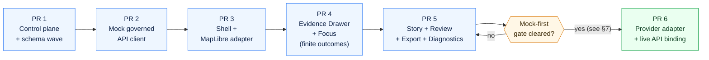

# Mock-First Discipline

> **The first useful slice of the Governed AI subsystem must run on contract-valid mocks before any live model provider, real source endpoint, or production binding is admitted. Mocks prove the trust membrane and the finite-outcome grammar; live providers come later, behind the same governed interface.**


| Status | Owners | Last reviewed |
|---|---|---|
| `draft` — PROPOSED path, PROPOSED placement | Docs steward · Governed AI subsystem owner · API owner | `2026-05-14` |

<!-- [KFM_META_BLOCK_V2]
doc_id: kfm://doc/governed-ai-mock-first
title: Mock-First Discipline
type: standard
version: v1
status: draft
owners: docs-steward, governed-ai-subsystem-owner, api-owner, security-steward
created: 2026-05-14
updated: 2026-05-14
policy_label: public
related:
  - docs/architecture/governed-ai/README.md
  - docs/architecture/governed-ai/BOUNDARIES.md
  - docs/architecture/governed-ai/STATE_OWNERSHIP.md
  - docs/architecture/governed-ai/ROUTE_MAP.md
  - docs/architecture/governed-ai/FOCUS_FLOW.md
  - docs/architecture/governed-ai/CONTINUITY_NOTES.md
  - docs/runbooks/governed_ai_LOCAL_DEV.md
  - docs/runbooks/governed_ai_VALIDATION.md
  - docs/runbooks/governed_ai_ROLLBACK.md
  - contracts/OBJECT_MAP.md
  - directory-rules.md
tags: [kfm, governed-ai, doctrine, mocks, fixtures, finite-outcomes]
notes:
  - Path PROPOSED; repository not mounted this session.
  - Operationalizes UIAI-GAI MockAdapter recommendation in a single place.
[/KFM_META_BLOCK_V2] -->

---

## Contents

- [0. Status & Authority](#0-status--authority)
- [1. Why Mock-First](#1-why-mock-first)
- [2. Glossary](#2-glossary)
- [3. Mock-First Invariants](#3-mock-first-invariants)
- [4. The Increment Sequence](#4-the-increment-sequence)
- [5. Mock Fixture Rules](#5-mock-fixture-rules)
- [6. Finite-Outcome Coverage](#6-finite-outcome-coverage)
- [7. Graduation Criteria (mocks → live)](#7-graduation-criteria-mocks--live)
- [8. Anti-Patterns](#8-anti-patterns)
- [9. PROPOSED File Homes](#9-proposed-file-homes)
- [10. Validation](#10-validation)
- [11. Rollback](#11-rollback)
- [12. Related Docs](#12-related-docs)
- [Appendix A — Mock-marker shape (sketch)](#appendix-a--mock-marker-shape-sketch)

---

## 0. Status & Authority

| Field | Value |
|---|---|
| **Document type** | Subsystem doctrine — Governed AI |
| **Authority of this doctrine** | `CONFIRMED` derivation from UIAI-GAI, IMPL-PIPE §20, and the Whole-UI + Governed AI Expansion Report |
| **Authority of any specific path quoted here** | `PROPOSED` until verified against mounted-repo evidence (per Directory Rules §0) |
| **Proposed canonical home** | `docs/architecture/governed-ai/MOCK_FIRST.md` |
| **Sibling docs (PROPOSED)** | `README.md`, `STATE_OWNERSHIP.md`, `ROUTE_MAP.md`, `BOUNDARIES.md`, `CONTINUITY_NOTES.md`, `FOCUS_FLOW.md` |
| **Schema-home convention** | `schemas/contracts/v1/<…>` (default per ADR-0001; see `directory-rules.md` §7.4) |
| **Lifecycle invariant referenced** | `RAW → WORK / QUARANTINE → PROCESSED → CATALOG / TRIPLET → PUBLISHED` |
| **Supersedes** | none |
| **ADRs that may bear on this doc** | `ADR-focus-model-adapter-boundary` (PROPOSED); `ADR-ui-schema-home` (PROPOSED) |

> [!IMPORTANT]
> This file is a **doctrine page**, not an implementation contract. Path, sibling doc, schema home, and route names cited here are `PROPOSED` until the live repo is mounted. Treat anything that looks repo-shaped as a placeholder for verification, not as a claim of current state.

---

## 1. Why Mock-First

KFM's Governed AI subsystem mediates a small but high-stakes question: *can a language model surface an answer over Kansas Frontier Matrix evidence without ever displacing the evidence?* The answer is yes — but only if the trust membrane, the finite-outcome grammar, and the citation contract are proven **before** a real model, real source connector, or real release ever touches the path.

The project's standing recommendation (UIAI-GAI; IMPL-PIPE §20) is unambiguous:

> Begin with a **provider-neutral, evidence-subordinate runtime slice** using `MockAdapter`, policy precheck, citation validation, finite `RuntimeResponseEnvelope`, `AIReceipt`, `RunReceipt`, and source-coverage checks. Live providers are admitted only after this slice is proven.

Mock-first is how that recommendation becomes a working discipline:

- It separates **adapter contracts** (stable) from **adapter implementations** (replaceable).
- It forces every finite outcome — `ANSWER`, `ABSTAIN`, `DENY`, `ERROR` — to be exercised under test before any live model emits one.
- It keeps `RAW`, `WORK`, `QUARANTINE`, canonical stores, candidate data, and direct model clients **out of the browser** by construction, not by hope.
- It makes the *next* PR cheap and reversible: a mock-only PR can be reverted without published artifacts, public claims, or correction notices.

> [!NOTE]
> Mock-first is not a hostility toward live providers. It is the **order of operations** that lets a live provider be admitted later without rewriting the trust membrane underneath it.

---

## 2. Glossary

| Term | Meaning in this doc |
|---|---|
| `MockAdapter` | Deterministic implementation of `ModelAdapterPort` used in tests and local fixtures. Never emits public claims. `PROPOSED` home: `apps/governed-api/src/ai/MockAdapter.ts`. |
| `ModelAdapterPort` | Provider-neutral interface for any AI model runtime behind the governed API. Live providers (Ollama, hosted) implement this same port. |
| `mockGovernedApi` | Browser-side mock fixture adapter that returns contract-valid envelopes with a visible mock marker. `PROPOSED` home: `apps/explorer-web/src/api/mockGovernedApi.ts`. |
| `mock_only` fixture | A contract-valid example payload, plainly marked, **never releasable** as public evidence. |
| `mock marker` | A required, visible field on every mock payload that prevents confusion with released artifacts. See [Appendix A](#appendix-a--mock-marker-shape-sketch). |
| `RuntimeResponseEnvelope` | Governed AI/API response wrapper carrying outcome, evidence context, citations, policy state, and validation result. |
| `DecisionEnvelope` | Finite decision wrapper used by APIs, runtime surfaces, and UI/AI payloads. |
| `EvidenceBundle` / `EvidenceRef` | Authoritative resolution target for any claim. `EvidenceRef` resolves to `EvidenceBundle`; AI never substitutes for it. |
| Finite outcomes | The closed set `ANSWER` · `ABSTAIN` · `DENY` · `ERROR` (validator variants add `PASS` / `FAIL`; promotion may add `HOLD`). |
| Negative-state fixture | A fixture whose expected result is `ABSTAIN`, `DENY`, or `ERROR` — not `ANSWER`. |
| Mock-first slice | Any PR that admits a new governed-AI capability with mocks alone, no live provider, no live source connector. |

---

## 3. Mock-First Invariants

The following invariants are **non-negotiable** while this doctrine applies. Bending one requires an ADR per Directory Rules §2.4.

1. **No live model in the first slice.** The first slice that exposes a Governed AI surface MUST use `MockAdapter` and `mockGovernedApi` only. Live providers (Ollama, hosted models, vendor APIs) are admitted only after the graduation gates in §7.
2. **No direct model client from the browser, ever.** Mock or live, the browser MUST NOT call a model runtime, vector index, graph store, object store, canonical store, or `RAW` / `WORK` / `QUARANTINE` path. All access goes through the governed API.
3. **Schema before behavior.** A surface SHOULD NOT acquire UI behavior until its DTOs (`DecisionEnvelope`, `RuntimeResponseEnvelope`, `EvidenceDrawerPayload`, `LayerDescriptor`, `FocusRequest`/`FocusResponse`) are schema-defined and validators reject malformed shapes.
4. **Every fixture is contract-valid.** Mocks pass the same schema/contract gates as released artifacts. A mock that cannot validate is a broken mock, not a useful one.
5. **Every fixture carries a visible mock marker.** Mocks MUST be plainly distinguishable from released evidence in code, in tests, and in any rendered UI surface. See [Appendix A](#appendix-a--mock-marker-shape-sketch).
6. **Fixtures are not publication artifacts.** Mock payloads MUST NOT appear under `data/published/`, in `ReleaseManifest`, or in any `EvidenceBundle` consumed by a public surface. Their home is `tests/fixtures/<subsystem>/` (PROPOSED).
7. **Every object family exercises positive and negative states.** Each fixture family SHOULD include at least one valid case, one invalid case, one denied case, one abstention case, and one rollback or correction case (per IMPL-PIPE fixture rule).
8. **Every finite outcome is exercised before merge.** A Governed AI PR SHOULD NOT merge until `ANSWER`, `ABSTAIN`, `DENY`, and `ERROR` all render correctly from fixtures.
9. **Feature flags off by default.** Mock-first PRs land with their route flag `off`; turning the route on is a separate, reviewable change.
10. **Telemetry is safe by construction.** No raw evidence, prompt text, restricted geometry, credentials, or full `EvidenceBundle` copies appear in any telemetry payload — mock or live.

> [!CAUTION]
> If a proposal weakens any of these invariants, mark it `PROPOSED` and route it through an ADR. Quiet erosion is the failure mode this doctrine exists to prevent.

[⬆ Back to top](#mock-first-discipline)

---

## 4. The Increment Sequence

KFM's governed-AI rollout is staged so each PR is reversible and proves a specific property before the next PR depends on it. The mock-first regime spans PR 1 through PR 5; live providers are admitted only at PR 6.



| PR | Scope (PROPOSED) | Mock-first? | Reversibility | Validation |
|---|---|:---:|---|---|
| **PR 1** | Authority docs, `OBJECT_MAP`, core DTO schemas, fixtures, validators, ADRs | n/a (no runtime) | No runtime exposure; revert PR if homes are wrong | Schema + fixture validation |
| **PR 2** | Typed `governedClient`, `responseValidators`, `mockGovernedApi`, fixtures with mock markers | ✅ | Feature flag off; no live endpoints | Contract + unit tests |
| **PR 3** | Persistent shell, `MapRuntimePort`, `MapLibreAdapter`, `TimeState`, layer catalog from fixtures | ✅ | Feature flag off; rollback component tree | Typecheck · component · e2e smoke · a11y smoke |
| **PR 4** | `EvidenceDrawer`, `FocusPanel`, `OutcomeRenderer` rendering `ANSWER` / `ABSTAIN` / `DENY` / `ERROR` from mocks | ✅ | Kill switch for Focus; no live model provider | Negative-state tests · policy-fixture tests |
| **PR 5** | `StoryManifest` player, read-only review console, compare/export/settings/diagnostics | ✅ | Routes feature-flagged | E2E smoke · docs propagation |
| **PR 6** | Provider adapter + live API binding (admitted only after §7 gates) | ❌ | Adapter-level rollback to `MockAdapter` | Integration tests · policy gates · security review |

> [!NOTE]
> Sources for the table: KFM Whole-UI + Governed AI Expansion Report, §8.1 increment sequence and §28 "next smallest useful PR." Paths and component names remain `PROPOSED` until the repo is inspected.

[⬆ Back to top](#mock-first-discipline)

---

## 5. Mock Fixture Rules

Every mock payload that participates in the Governed AI surface MUST satisfy all of the following.

| Rule | Requirement | Why |
|---|---|---|
| **Contract-valid** | Validates against the corresponding `schemas/contracts/v1/<…>` schema. | A mock that bypasses validation hides bugs the live path would catch. |
| **Mock marker** | Carries a visible, schema-required marker (e.g., `mock_marker: true`, `source_role: "mock_only"`, or an equivalent enum). | Prevents confusion with released artifacts in code, tests, and UI. |
| **Not releasable** | MUST NOT appear in `data/published/`, `ReleaseManifest`, or any `EvidenceBundle` consumed by a public surface. | Mocks are evidence of *the system working*, not evidence of *the world*. |
| **Negative states required** | Each family includes valid, invalid, denied, abstention, and (where relevant) rollback/correction fixtures. | Negative states are the cheapest places to find trust-membrane bugs. |
| **Sensitive-lane public-safe** | Fixtures for archaeology, living-person, DNA, rare-species, infrastructure, or hazards lanes use transformed/redacted geometry — never real exact locations. | Sensitivity posture applies to fixtures as strictly as it does to released data. |
| **No prompt or credential leakage** | Fixtures MUST NOT embed model prompts, secrets, source credentials, or internal store handles. | Telemetry-safety extends to anything checked into the repo. |
| **Deterministic** | Given the same inputs, `MockAdapter` returns the same outputs. | Determinism is what makes the mock-first slice CI-stable. |

> [!TIP]
> When in doubt about a fixture, ask: *"If this leaked into a `ReleaseManifest`, would a steward catch it before publication?"* If the answer is "maybe," strengthen the mock marker.

[⬆ Back to top](#mock-first-discipline)

---

## 6. Finite-Outcome Coverage

The mock-first slice MUST exercise every finite outcome on every governed-AI-adjacent surface it ships. The matrix below is the **minimum** coverage; PRs MAY add additional fixtures.

| Surface (PROPOSED route) | `ANSWER` | `ABSTAIN` | `DENY` | `ERROR` | Forbidden behavior |
|---|:---:|:---:|:---:|:---:|---|
| Claim resolution (`/claims`) | ✅ | ✅ | ✅ | ✅ | Returning unreleased candidate as `ANSWER`; leaking internal store ids |
| Focus Mode (`/focus`) | ✅ | ✅ | ✅ | ✅ | Direct model call from browser; uncited answer surfaced as `ANSWER` |
| Evidence Drawer payload | ✅ | ✅ | ✅ | ✅ | Drawer rendered without payload schema validation |
| Layer manifest (`/layers/{id}/manifest`) | ✅ | n/a | ✅ | ✅ | Serving `WORK` / `CATALOG` layers to public clients |
| Review read-only console (`/review`) | ✅ | n/a | ✅ | ✅ | Approving release from a public/read-only path |
| Export request (`/export`) | ✅ | n/a | ✅ | ✅ | Exporting without proof refs, release state, or correction lineage |

Outcome semantics (per KFM Domains Culmination Atlas §24.3):

- **`ANSWER`** — Evidence sufficient, policy permits, release state allows, review state recorded.
- **`ABSTAIN`** — Evidence insufficient, AI cannot cite, or evidence is stale with no released alternative.
- **`DENY`** — Policy, rights, sensitivity, or release state forbids the answer. **Sensitive lanes default here.**
- **`ERROR`** — Schema, contract, infrastructure, or query fault — never silent fallthrough to a different outcome.

> [!WARNING]
> Cancellation, timeout, stale evidence, restricted material, and invalid-citation states are rendered explicitly. They are **not** hidden as generic failures.

[⬆ Back to top](#mock-first-discipline)

---

## 7. Graduation Criteria (mocks → live)

A live provider adapter (Ollama, hosted model, or otherwise) is admitted **only** after every gate below clears. Until then, `MockAdapter` is the only adapter the governed API binds.

- [ ] Repo mounted; `directory-rules.md` placement verified for all touched paths.
- [ ] `OBJECT_MAP.md` crosswalk lists every Governed AI DTO and resolves to a `schemas/contracts/v1/<…>` home.
- [ ] All six DTO schemas validate (positive and negative fixtures): `DecisionEnvelope`, `RuntimeResponseEnvelope`, `EvidenceDrawerPayload`, `LayerDescriptor`, `FocusRequest`, `FocusResponse`.
- [ ] `mockGovernedApi` and `responseValidators` ship with visible mock markers and CI gates that fail closed on invalid fixtures.
- [ ] All finite outcomes (`ANSWER` · `ABSTAIN` · `DENY` · `ERROR`) render correctly from fixtures in `EvidenceDrawer` and `FocusPanel`.
- [ ] Boundary check passes: no direct browser call to `RAW` / `WORK` / `QUARANTINE`, canonical stores, vector indexes, model runtimes, or credentials.
- [ ] `CitationValidator` (or equivalent) rejects every uncited or invalid-citation fixture.
- [ ] `policyClient` precheck and postcheck reject every restricted, sensitive, or unreleased fixture.
- [ ] `AIReceipt` and `RunReceipt` are emitted for every fixture run; receipts validate against their schemas.
- [ ] Security review for the chosen provider completed; CORS / auth / network posture documented under `docs/runbooks/governed_ai_LOCAL_DEV.md` (PROPOSED).
- [ ] `ADR-focus-model-adapter-boundary` (PROPOSED) accepted; rollback path documented in `docs/runbooks/governed_ai_ROLLBACK.md`.

> [!IMPORTANT]
> The graduation gate is **the only path** from mocks to live. There is no "temporary" live-provider PR that skips it. If pressure builds to ship a live provider sooner, that pressure is a signal to fix the gate, not to bypass it.

[⬆ Back to top](#mock-first-discipline)

---

## 8. Anti-Patterns

The patterns below have shown up in prior AI rollouts elsewhere and are out-of-bounds for the mock-first slice.

| Anti-pattern | Why it fails | Correct posture |
|---|---|---|
| **Browser → model runtime direct call** | Bypasses policy, citation validation, evidence resolution, receipts. | Browser calls only the governed API; the API mediates the adapter. |
| **"Just for demo"** live provider | Demos become production paths; the trust membrane is rebuilt under pressure. | Ship the demo on mocks; gate live providers behind §7. |
| **Mock without a marker** | A mock that looks like released evidence eventually gets cited as released evidence. | Every mock carries a visible marker; CI rejects unmarked mocks. |
| **Only happy-path fixtures** | `ABSTAIN` / `DENY` / `ERROR` paths ship untested and fail in front of users. | Every surface ships with negative-state fixtures before merge. |
| **Schema-after-behavior** | UI hardens around an unstable shape; later schema work breaks the UI. | Schema and fixtures land in PR 1; UI consumes the validator boundary. |
| **Fixture under `data/published/`** | A mock leaks into release inventory; `ReleaseManifest` and rollback drills become unreliable. | Fixtures live under `tests/fixtures/<subsystem>/`; `data/published/` is for released artifacts only. |
| **Prompt or restricted geometry in telemetry** | Sensitivity posture breaks via the back door. | Telemetry is safe-by-construction; see `BOUNDARIES.md` (PROPOSED). |
| **Mock graduating itself** | A long-lived mock becomes the de facto contract; live providers regress against it. | `MockAdapter` is for tests and local fixtures only; live providers implement the same port, not the mock. |

[⬆ Back to top](#mock-first-discipline)

---

## 9. PROPOSED File Homes

> [!NOTE]
> Every path below is **PROPOSED** per Directory Rules §0 until the repository is mounted and inspected. Treat this table as the file-home decision frame, not as a description of the current tree.

```text
docs/architecture/governed-ai/
├── README.md                     # subsystem overview (PROPOSED)
├── MOCK_FIRST.md                 # this file (PROPOSED)
├── STATE_OWNERSHIP.md            # state owners (PROPOSED)
├── ROUTE_MAP.md                  # AI-adjacent route surfaces (PROPOSED)
├── BOUNDARIES.md                 # browser/AI/RAW/telemetry boundaries (PROPOSED)
├── FOCUS_FLOW.md                 # Focus request/response flow (PROPOSED)
└── CONTINUITY_NOTES.md           # prior governed-AI lineage (PROPOSED)
```

| Family | PROPOSED path | Role |
|---|---|---|
| Subsystem doctrine | `docs/architecture/governed-ai/MOCK_FIRST.md` | This doc. |
| DTO schemas | `schemas/contracts/v1/runtime/{decision_envelope,runtime_response_envelope}.schema.json` · `schemas/contracts/v1/focus/{focus_request,focus_response,citation_validation_report}.schema.json` · `schemas/contracts/v1/ui/evidence_drawer_payload.schema.json` | Machine shape per ADR-0001. |
| Mock client | `apps/explorer-web/src/api/mockGovernedApi.ts` · `apps/explorer-web/src/api/responseValidators.ts` | Browser-side mock fixture adapter + validator layer. |
| Mock adapter | `apps/governed-api/src/ai/MockAdapter.ts` · `apps/governed-api/src/ai/ModelAdapterPort.ts` | Deterministic adapter behind the governed API. |
| Citation validator | `apps/governed-api/src/ai/CitationValidator.ts` | Validates every Focus citation against `EvidenceBundle` refs. |
| Policy client | `apps/governed-api/src/policy/policyClient.ts` | Policy pre/postcheck wrapper. |
| Evidence resolver | `apps/governed-api/src/evidence/evidenceResolver.ts` | `EvidenceRef` → `EvidenceBundle` resolver boundary. |
| Fixtures (UI) | `tests/fixtures/ui/evidence_drawer/{answer,abstain_missing_evidence,deny_restricted}.valid.json` | Drawer outcome fixtures with mock markers. |
| Fixtures (Focus) | `tests/fixtures/focus/{answer,abstain,deny,error}.valid.json` | Focus outcome fixtures. |
| Policy | `policy/focus/` · `policy/evidence/` | Gate logic for the mock-first slice. |
| Receipts (docs) | `data/receipts/README.md` · `data/proofs/README.md` | Where emitted receipts/proofs are described; receipts live under `data/receipts/`. |
| Runbooks | `docs/runbooks/governed_ai_LOCAL_DEV.md` · `governed_ai_VALIDATION.md` · `governed_ai_ROLLBACK.md` | Operational runbooks for the slice. |
| ADRs | `docs/adr/ADR-focus-model-adapter-boundary.md` · `ADR-ui-schema-home.md` | Adapter and schema-home decisions. |

[⬆ Back to top](#mock-first-discipline)

---

## 10. Validation

A mock-first PR SHOULD clear at least the following checks before merge. Specific commands and workflow names are `PROPOSED` until the live repo and CI conventions are verified.

| Check | What it proves | Default status (this session) |
|---|---|---|
| Schema validation (`jsonschema` / `ajv` over `schemas/contracts/v1/<…>` + fixtures) | Every valid fixture passes; every invalid fixture fails. | `PROPOSED` |
| Boundary scan (static import / grep) | No browser import of model runtime, vector DB, object store, canonical store, or internal DB. | `PROPOSED` |
| Mock-marker scan | Every fixture under `tests/fixtures/<subsystem>/` carries the mock marker. | `PROPOSED` |
| Finite-outcome render tests | `ANSWER` · `ABSTAIN` · `DENY` · `ERROR` render with citations, reasons, and obligations as appropriate. | `PROPOSED` |
| Negative-state policy fixtures | Restricted, sensitive, unreleased, and uncited inputs return `DENY` (or `ABSTAIN` per §6). | `PROPOSED` |
| Citation validation | Every Focus `ANSWER` fixture references resolvable `EvidenceRef` entries; uncited answers `ABSTAIN`. | `PROPOSED` |
| Receipt emission | Every fixture run produces a schema-valid `AIReceipt` and `RunReceipt`. | `PROPOSED` |
| Accessibility smoke | Drawer and Focus panels are keyboard-navigable; finite outcomes are announced. | `PROPOSED` |
| Docs propagation | Every changed schema/route/policy has docs, fixtures, runbook updates. | `PROPOSED` |

[⬆ Back to top](#mock-first-discipline)

---

## 11. Rollback

| Failure mode | Rollback |
|---|---|
| Schema change breaks fixtures | Revert PR before any published schema depends on it; if already released, deprecate with a versioned successor. |
| Mock client regression | Feature flag the route off; previous mock client remains in place; revert UI PR. |
| Focus surface misbehavior | Disable Focus route via feature flag; leave Evidence Drawer and layer browsing intact; `MockAdapter` remains for tests only. |
| Provider adapter (PR 6) regression | Swap binding back to `MockAdapter`; live route flag off; integration tests re-run in CI before re-enabling. |
| Policy gate ambiguity | Revert policy bundle; gates fail closed while ambiguity persists. |
| Docs drift | Update `docs/registers/DRIFT_REGISTER.md` and `docs/registers/VERIFICATION_BACKLOG.md`; do not silently delete prior doctrine. |

> [!TIP]
> Reversibility is a feature of mock-first, not a side effect. A mock-only PR has **no published artifacts to retract**, **no public claims to correct**, and **no release manifest to roll back** — only code and fixtures.

[⬆ Back to top](#mock-first-discipline)

---

## 12. Related Docs

- `docs/architecture/governed-ai/README.md` — subsystem overview *(PROPOSED)*
- `docs/architecture/governed-ai/STATE_OWNERSHIP.md` — Focus request, evidence retrieval, adapter, citation validation, response envelope state ownership *(PROPOSED)*
- `docs/architecture/governed-ai/ROUTE_MAP.md` — Focus and AI-adjacent API surfaces *(PROPOSED)*
- `docs/architecture/governed-ai/BOUNDARIES.md` — no direct model browser call · no `RAW` / `WORK` / `QUARANTINE` · no prompt telemetry leakage *(PROPOSED)*
- `docs/architecture/governed-ai/FOCUS_FLOW.md` — Focus request/response flow *(PROPOSED)*
- `docs/architecture/governed-ai/CONTINUITY_NOTES.md` — prior governed-AI lineage *(PROPOSED)*
- `docs/runbooks/governed_ai_LOCAL_DEV.md` — local setup and mock fixture runbook *(PROPOSED)*
- `docs/runbooks/governed_ai_VALIDATION.md` — validation, accessibility, contract, e2e smoke *(PROPOSED)*
- `docs/runbooks/governed_ai_ROLLBACK.md` — rollback steps *(PROPOSED)*
- `contracts/OBJECT_MAP.md` — DTO ↔ schema ↔ fixture ↔ policy crosswalk *(PROPOSED)*
- `directory-rules.md` — placement law (CONFIRMED doctrine in project knowledge)

---

## Appendix A — Mock-marker shape (sketch)

> [!NOTE]
> The shape below is **illustrative**. It is `PROPOSED` and `NEEDS VERIFICATION` against the eventual `schemas/contracts/v1/<…>` definitions. Field names, casing, and required-vs-optional posture are subject to ADR.

<details>
<summary>Show illustrative mock-marker shape</summary>

```json
{
  "object_type": "EvidenceDrawerPayload",
  "schema_version": "v1",
  "mock_marker": {
    "is_mock": true,
    "fixture_id": "ui/evidence_drawer/answer.valid.json",
    "fixture_purpose": "renders ANSWER outcome with cited evidence",
    "not_releasable": true,
    "created_by": "mockGovernedApi",
    "spec_hash": "sha256:PLACEHOLDER"
  },
  "outcome": "ANSWER",
  "evidence_refs": [
    "kfm://evidence/PLACEHOLDER-1",
    "kfm://evidence/PLACEHOLDER-2"
  ],
  "policy_decision_ref": "kfm://policy/PLACEHOLDER",
  "citation_validation_ref": "kfm://citation/PLACEHOLDER"
}
```

```json
{
  "object_type": "RuntimeResponseEnvelope",
  "schema_version": "v1",
  "mock_marker": {
    "is_mock": true,
    "fixture_id": "focus/abstain.valid.json",
    "fixture_purpose": "renders ABSTAIN when evidence is insufficient",
    "not_releasable": true,
    "created_by": "MockAdapter"
  },
  "outcome": "ABSTAIN",
  "reasons": ["insufficient_evidence_for_claim"],
  "ai_receipt_ref": "kfm://receipt/PLACEHOLDER",
  "policy_decision": {
    "decision": "ALLOW",
    "obligations": []
  }
}
```

**Marker contract (illustrative):**

- `mock_marker` is a required object on every fixture payload, not a free-text field.
- `is_mock: true` MUST be present and MUST trip a UI banner / dev console warning when rendered.
- `not_releasable: true` is enforced by a release-manifest validator — any artifact in `data/published/` containing `mock_marker` fails closed.
- `fixture_id` resolves to a file under `tests/fixtures/<subsystem>/` (PROPOSED).

</details>

---

> Last updated: `2026-05-14` · Status: `draft` · Path: `PROPOSED` · [⬆ Back to top](#mock-first-discipline)
