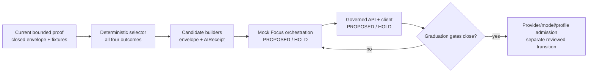

<!-- [KFM_META_BLOCK_V2]
doc_id: kfm://doc/governed-ai-mock-first
title: Governed AI — Mock-First Discipline and Current Proof Boundary
type: architecture-standard
version: v2.0.0-draft
status: draft; repository-grounded; bounded-mock-proof; focus-runtime-hold; non-authoritative
owners:
  - "@bartytime4life — verified CODEOWNERS review route"
  - "NEEDS VERIFICATION — independent governed-AI, Governed API, runtime, evidence, policy, citation, security, privacy, contracts, schemas, validation, accessibility, correction, and release stewardship"
created: 2026-05-14
updated: 2026-08-20
policy_label: public
owning_root: docs/
current_path: docs/architecture/governed-ai/MOCK_FIRST.md
responsibility: >-
  Explain the current deterministic mock proof, distinguish fixture selection and
  candidate construction from semantic governed-AI orchestration, define the
  evidence required before a live provider may be admitted, and keep mocks,
  receipts, tests, documentation, and generated language outside truth and
  publication authority.
truth_posture: >-
  CONFIRMED current tracked path, accepted Directory Rules placement, closed
  four-outcome RuntimeResponseEnvelope shape, positive and negative envelope
  fixtures, deterministic no-I/O MockAdapter selector, focused standard-library
  proof tests, RuntimeResponseEnvelope candidate builder, AIReceipt candidate
  builder, MockAdapter-to-AIReceipt candidate projection, mock-first environment
  example, and hosted workflow boundaries / PROPOSED end-to-end mock Focus
  orchestration, final Focus request and response profiles, machine-visible mock
  provenance beyond the current fixture and receipt boundaries, policy and
  citation composition, durable receipt emission, client integration, and live
  provider admission / UNKNOWN deployed Focus runtime, provider endpoint,
  operational policy, evidence-resolution service, citation service, receipt
  store, public AI route, correction propagation, and release use / NEEDS
  VERIFICATION independent review and hosted exact-head validation.
repository: bartytime4life/Kansas-Frontier-Matrix
base_commit: 3295d5faf38c521e8cc5f4544dc9920a7b17efc1
target_prior_blob: 742cb7092f8e877b874b8ba1f0d13e4a3c55c54d
codeowners_blob: dd2a84aa514d8ecd9208bc347f90f9a2ed37dd61
directory_rules_blob: fd49a0b83e55cef52c1124281f093e263526898d
directory_rules_adoption_adr_blob: a4de0d7a96b78da59cfc499d1025e1508afd8dd9
adapter_architecture_blob: d38351198939b63a57e583cb404a0daf379fa3a4
ai_receipts_architecture_blob: 721bf4647f49a510a597d7b3c4d305bc70fa3097
adapter_adr_blob: 5c45cbaf0aae510638088913757634ea978c9ec3
mock_adapter_blob: 04d37e59b14c9e3b85126cb3380b6221b44e26d1
mock_adapter_test_blob: be1b1d2b4178b30ce9be754671a2c42271ad91bc
runtime_response_contract_blob: 5060aaaa30fea37b6eeea6e1428b9effa6a163bd
runtime_response_schema_blob: 8b86e7db8b18b65a56a4e639dfc54e1b2db93155
runtime_response_validator_blob: 44ce7d51038a9adf9fcbdb18108cc27da8381e33
runtime_response_builder_blob: 5dacededc1bda64292259ba39b6387facafbd1e8
mock_receipt_projection_blob: 6b77074f1b47c575abd00fff989ff7d0795bedb1
mock_receipt_projection_test_blob: 6ac251c7ea2a17ec2c7bd326880d582cc012e6b4
focus_mock_workflow_blob: fbd56c7cda991ff8f3b804cc0c278e62daaa7abf
ai_receipt_workflow_blob: 1192926b29a6007b78887ade1058e8e2c6ce8023
focus_request_schema_blob: a2f298f014fa299bdec03afbf14ba9937aa95ef8
focus_response_schema_blob: fd109e4a3c859115d4ad138e9303cf8c5bdd8873
governed_api_routes_blob: 3418168d0b267160d6ad6dd87f289e880ef4a024
ollama_adapter_blob: 1769a719d6a6df53e001abbc4c67ad486ab5c944
inspection_boundary: >-
  Current-session GitHub reads covered the complete prior target, current main,
  accepted Directory Rules and CODEOWNERS, adjacent governed-AI architecture,
  proposed adapter ADR, runtime adapter lanes and implementations, the closed
  RuntimeResponseEnvelope contract/schema/fixtures/validator/builder and focused
  proof tests, AIReceipt contract/schema/validator/builders, the MockAdapter
  receipt projection and tests, Focus request/response scaffolds, the Focus mock
  and AIReceipt workflows, Focus fixture documentation, the governed API route
  registry and AI source README, the mock environment example, and placeholder
  worker/provider files. No mounted checkout, dependency installation, local
  repository-native suite, model daemon, provider endpoint, credential, live
  evidence resolver, policy evaluator, citation service, receipt store, deployed
  client, correction flow, rollback execution, release environment, or
  publication path was exercised.
related:
  - README.md
  - ADAPTER_CONTRACT.md
  - AI_RECEIPTS.md
  - BOUNDARIES.md
  - FOCUS_FLOW.md
  - CONTINUITY_NOTES.md
  - OLLAMA_INTEGRATION.md
  - ROUTE_MAP.md
  - ../../adr/ADR-0019-ai-adapter-contract-and-finite-envelopes.md
  - ../../adr/ADR-0029-adopt-directory-governance-standard-v2.md
  - ../../doctrine/directory-rules.md
  - ../../../runtime/model_adapters/README.md
  - ../../../runtime/model_adapters/MockAdapter.py
  - ../../../runtime/model_adapters/OllamaAdapter.py
  - ../../../runtime/model_adapters/mock/README.md
  - ../../../runtime/mock/README.md
  - ../../../contracts/runtime/runtime_response_envelope.md
  - ../../../contracts/runtime/ai_receipt.md
  - ../../../schemas/contracts/v1/runtime/runtime_response_envelope.schema.json
  - ../../../schemas/contracts/v1/runtime/ai_receipt.schema.json
  - ../../../schemas/contracts/v1/focus/focus_request.schema.json
  - ../../../schemas/contracts/v1/focus/focus_response.schema.json
  - ../../../fixtures/contracts/v1/runtime/runtime_response_envelope/README.md
  - ../../../tests/runtime_proof/test_mock_adapter_finite_outcomes.py
  - ../../../tests/runtime_proof/test_envelope_finite_outcomes.py
  - ../../../tools/validators/validate_runtime_response_envelope.py
  - ../../../tools/validators/validate_ai_receipt.py
  - ../../../packages/envelopes/src/envelopes/runtime_response.py
  - ../../../packages/envelopes/src/envelopes/ai_receipt.py
  - ../../../packages/envelopes/src/envelopes/mock_adapter_receipt.py
  - ../../../tests/packages/envelopes/test_mock_adapter_ai_receipt_candidate.py
  - ../../../.github/workflows/focus-mock-test.yml
  - ../../../.github/workflows/ai-receipt.yml
  - ../../../apps/governed-api/src/governed_api/routes/registry.py
  - ../../../apps/governed-api/src/ai/README.md
  - ../../../tests/fixtures/focus/README.md
  - ../../../.env.example
tags: [kfm, architecture, governed-ai, mock-first, mock-adapter, deterministic, no-io, finite-outcomes, runtime-response-envelope, ai-receipt, focus-hold, cite-or-abstain, non-publication]
notes:
  - "v2.0.0-draft replaces proposal-only and no-repository language with a current repository evidence checkpoint."
  - "The executable MockAdapter is a deterministic selector of prevalidated complete synthetic envelopes, not a model emulator, semantic outcome engine, or production adapter."
  - "The current closed RuntimeResponseEnvelope schema has no mock_marker property; this page does not invent one or create a parallel payload shape."
  - "The mock Focus workflow proves envelope shape and selector behavior while explicitly holding end-to-end Focus runtime readiness."
  - "This same-path revision changes documentation and its generated authoring receipt only."
[/KFM_META_BLOCK_V2] -->

<a id="top"></a>
<a id="mock-first-discipline"></a>

# Mock-First Discipline

> **Operating boundary.** KFM proves deterministic contracts, finite outcomes, safe negative behavior, and provider-neutral handoffs with synthetic inputs before any live model is admitted. A mock can prove a boundary. It cannot prove evidence, policy, citation validity, runtime composition, release, or public truth.

[](#0-status--authority)
[](#5-current-mockadapter-boundary)
[](#6-finite-outcome-coverage)
[](#8-current-focus-readiness-hold)
[](#7-graduation-criteria-mocks--live)
[](#11-rollback)

> [!IMPORTANT]
> **This page is explanatory architecture, not implementation, contract, schema, policy, evidence, receipt, release, or publication authority.** Current repository proof is deliberately narrow: a closed finite envelope profile, fixture polarity, a deterministic no-I/O selector, local candidate builders, and bounded tests. The semantic governed-AI flow remains incomplete.

> [!CAUTION]
> **The current `MockAdapter` does not call or imitate a model.** It receives a caller-supplied matrix of already validated synthetic envelopes, requires all four finite outcomes, and returns isolated copies. It does not parse a request, choose an outcome from evidence, resolve evidence, evaluate policy, validate citations, emit a receipt, or construct a public response.

> [!WARNING]
> **Do not add an ad hoc `mock_marker` to `RuntimeResponseEnvelope`.** Its current schema is closed with `additionalProperties: false` and contains no mock-marker field. Mock provenance is currently established by fixture identity, scenario identity, the bounded test harness, workflow context, and—where an AIReceipt candidate is built—`adapter: mock` plus `model_ref: fixture-only`. A new payload field requires explicit contract/schema evolution.

**Quick navigation:** [Status](#0-status--authority) · [Why mock-first](#1-why-mock-first) · [Vocabulary](#2-glossary) · [Invariants](#3-mock-first-invariants) · [Sequence](#4-the-increment-sequence) · [Fixtures](#5-mock-fixture-rules) · [Outcomes](#6-finite-outcome-coverage) · [Graduation](#7-graduation-criteria-mocks--live) · [Focus HOLD](#8-current-focus-readiness-hold) · [Anti-patterns](#8-anti-patterns) · [Routing](#9-proposed-file-homes) · [Validation](#10-validation) · [Rollback](#11-rollback) · [Open work](#13-open-verification-register) · [Evidence](#14-evidence-ledger) · [Related](#12-related-docs) · [Mock identity](#appendix-a--mock-marker-shape-sketch) · [No-loss ledger](#appendix-b--no-loss-modernization-ledger)

---

<a id="0-status--authority"></a>

## 0. Status & Authority

| Question | Current evidence-backed answer |
|---|---|
| Is this a tracked architecture document? | **CONFIRMED.** The target exists at `docs/architecture/governed-ai/MOCK_FIRST.md`. |
| Is the same-path placement valid? | **CONFIRMED.** Accepted ADR-0029 adopts Directory Rules v2; this existing human architecture explanation receives `PLACE` under `docs/`. |
| Is this page a semantic or machine contract? | **No.** Semantic meaning remains under `contracts/`; machine shape remains under `schemas/`; this page explains boundaries and maturity. |
| Does executable mock code exist? | **CONFIRMED, bounded.** `runtime/model_adapters/MockAdapter.py` selects deep-copied prevalidated synthetic envelopes and requires coverage of all four outcomes. |
| Does executable finite-envelope proof exist? | **CONFIRMED, bounded.** The closed schema, valid and invalid fixtures, validator, candidate builder, standard-library tests, and hosted workflow surfaces exist. |
| Does AIReceipt candidate compatibility exist? | **CONFIRMED, bounded.** A helper projects a prevalidated mock outcome into the current nine-field AIReceipt candidate with fixed mock identity; callers supply digests and authority-bearing refs. |
| Does a full mock Focus runtime exist? | **No verified implementation.** The workflow explicitly records `WORKFLOW_HOLD`; request/response schemas and policy remain scaffolds; no operational Focus fixtures or native command are present. |
| Does an AI/Focus Governed API route exist? | **No verified route.** The inspected registry exposes bootstrap, layers, and evidence only. |
| Is a live provider admitted? | **No.** `OllamaAdapter.py` is a one-line placeholder, and no provider endpoint or approved model profile was established. |
| Does this revision release or publish anything? | **No.** Documentation plus authoring provenance only. |

### Placement and authority split

| Responsibility | Owning surface | This page may do |
|---|---|---|
| Human architecture explanation | `docs/architecture/governed-ai/` | Explain evidence, boundaries, maturity, HOLDs, graduation, and rollback. |
| Adapter/runtime execution | `runtime/`, accepted packages, and deployable apps | Cite observed behavior and tests; never invent execution. |
| Semantic meaning | `contracts/` | Summarize and link; never silently redefine. |
| Machine shape | `schemas/` | Report current fields and closure; never create a second shape. |
| Fixtures and tests | `fixtures/`, `tests/` | Describe current proof and missing coverage. |
| Admissibility | `policy/` | State required gates; never claim a policy decision ran. |
| Receipts and proofs | governed `data/` families | Require accountable references without treating them as truth. |
| Public route and UI | `apps/governed-api/`, `apps/explorer-web/` | Record verified composition only. |
| Release, correction, rollback | their distinct governed families | Keep mock success outside release authority. |

[Back to top](#top)

---

<a id="1-why-mock-first"></a>

## 1. Why Mock-First

A live model introduces nondeterminism, provider behavior, network and credential exposure, version drift, cost, latency, cancellation, prompt-injection risk, and generated text. None of those concerns should be allowed to obscure whether KFM's own trust boundaries work.

Mock-first therefore orders implementation so KFM can answer narrower questions first:

1. **Can the canonical response shape represent all legal outcomes?**
2. **Do valid fixtures pass and invalid fixtures fail closed?**
3. **Can a deterministic selector replay those outcomes without I/O or mutation?**
4. **Can candidate builders preserve the current closed field sets without creating authority?**
5. **Can an AIReceipt candidate bind explicit mock identity, digests, policy and citation refs, and outcome?**
6. **Can the full request → evidence → policy → adapter → citation → receipt → envelope flow run deterministically before a provider is admitted?**

Current repository evidence answers questions 1–5 only in bounded ways. Question 6 remains on **HOLD**.

> [!NOTE]
> Mock-first is not “pretend production.” It is **progressive proof**. Each layer proves only its own responsibility and leaves evidence, policy, citation, release, and publication authority with their owning objects and services.

[Back to top](#top)

---

<a id="2-glossary"></a>

## 2. Glossary

| Term | Current meaning |
|---|---|
| `MockAdapter` | Deterministic Python selector at `runtime/model_adapters/MockAdapter.py`. It returns isolated copies from a prevalidated four-outcome scenario matrix. |
| Scenario matrix | Caller-supplied mapping from synthetic scenario IDs to complete response envelopes. The adapter requires all four outcomes before construction succeeds. |
| `RuntimeResponseEnvelope` | Current closed, schema-paired client-envelope profile with `ANSWER`, `ABSTAIN`, `DENY`, or `ERROR`. `ANSWER` additionally requires evidence and precision disclosure. |
| Runtime envelope fixture | Synthetic JSON under `fixtures/contracts/v1/runtime/runtime_response_envelope/`; valid and invalid lanes exercise machine shape and local semantics. |
| `AIReceipt` candidate | Current closed nine-field accountability candidate. It is process-memory shape, not truth, policy, citation closure, or release approval. |
| Mock receipt projection | Helper that copies a prevalidated mock envelope's outcome into an AIReceipt candidate and fixes `adapter` to `mock` and `model_ref` to `fixture-only`. |
| Mock provenance | Evidence that an artifact or run is synthetic. Current mechanisms are fixture/scenario identity, test/workflow context, and explicit mock identity in the AIReceipt candidate—not an envelope `mock_marker` field. |
| Mock Focus runtime | **PROPOSED / HOLD.** A deterministic end-to-end Focus request flow that performs the same orchestration boundaries a live provider would use without network or provider access. |
| Live provider admission | A separately reviewed transition that allows a provider/model/profile behind the same governed interface after graduation gates close. |
| Finite outcomes | The closed runtime set `ANSWER`, `ABSTAIN`, `DENY`, and `ERROR`. Validator result vocabularies such as `PASS` and `FAIL` are separate. |

[Back to top](#top)

---

<a id="3-mock-first-invariants"></a>

## 3. Mock-First Invariants

1. **Evidence remains outside the mock.** Synthetic envelopes and generated text never become EvidenceBundles or source authority.
2. **No direct browser-to-model path.** Browser and ordinary clients use governed interfaces; neither mock nor live modes authorize direct model access.
3. **Closed shapes remain closed.** Tests and examples must not add convenience fields that the current schema forbids.
4. **Fixture polarity is explicit.** Valid fixtures must pass; invalid fixtures must fail for known reasons.
5. **All four runtime outcomes are first-class.** No test harness may treat missing or unknown outcomes as `ANSWER`.
6. **The selector is deterministic and isolated.** Repeated responses are equal but not the same mutable object; caller changes do not mutate registered scenarios.
7. **No I/O in the bounded selector.** Filesystem, network, clock, randomness, environment, secrets, dynamic execution, and provider calls remain outside `MockAdapter`.
8. **Candidate construction is not orchestration.** Building a schema-shaped envelope or receipt does not prove evidence resolution, policy, citation validation, or release eligibility.
9. **Mock provenance is reviewable without schema drift.** Use current fixture, scenario, workflow, and receipt identity; evolve contracts explicitly if stronger machine-visible provenance is required.
10. **Sensitive examples remain synthetic and public-safe.** No exact rare-species, archaeology, infrastructure, living-person, genomic, private-land, or other protected material is needed to test denial behavior.
11. **Mock success has no lifecycle effect.** Tests, fixtures, receipts, PRs, and green workflows do not promote material to `PUBLISHED`.
12. **Provider admission is reversible and separate.** A provider can be disabled without changing the public envelope grammar or bypassing the mock proof path.

[Back to top](#top)

---

<a id="4-the-increment-sequence"></a>
<a id="5-current-mockadapter-boundary"></a>

## 4. The Increment Sequence

The prior edition described a fixed six-PR rollout. Current repository evidence supports a more durable **graduation sequence**, not a fixed PR count.


```mermaid
flowchart LR
    A["Current bounded proof\nclosed envelope + fixtures"] --> B["Deterministic selector\nall four outcomes"]
    B --> C["Candidate builders\nenvelope + AIReceipt"]
    C --> D["Mock Focus orchestration\nPROPOSED / HOLD"]
    D --> E["Governed API + client\nPROPOSED / HOLD"]
    E --> F{"Graduation gates close?"}
    F -- no --> D
    F -- yes --> G["Provider/model/profile admission\nseparate reviewed transition"]
```

| Increment | Current state | Proof gained | Still not proved |
|---|---|---|---|
| Closed response profile | **CONFIRMED / PROPOSED schema status** | Four legal outcomes, required fields, `ANSWER` evidence/precision constraints, negative-outcome precision denial. | Evidence resolution, policy, citation, release, client behavior. |
| Fixture polarity and validator | **CONFIRMED bounded proof** | Valid and invalid cases can be checked deterministically. | Runtime invocation or public safety. |
| `MockAdapter` selector | **CONFIRMED bounded proof** | Full four-outcome matrix, deterministic order, deep-copy isolation, safe unknown-scenario failure, no-I/O source boundary. | Request interpretation or semantic outcome choice. |
| Envelope/receipt candidate builders | **CONFIRMED bounded proof** | Current closed field sets can be assembled from explicit caller inputs. | Authentic digests, authority-ref resolution, persistence, public response. |
| MockAdapter → AIReceipt projection | **CONFIRMED bounded proof** | Mock identity and selected outcome can be carried into a candidate receipt. | Receipt emission, storage, signature, retention, correction, audit lookup. |
| Mock Focus orchestration | **HOLD** | Would prove precheck/evidence/context/adapter/citation/postcheck/envelope composition. | Not currently implemented or executed. |
| Governed client integration | **HOLD / UNKNOWN** | Would prove safe UI rendering and no direct provider path. | Not established by the inspected mock Focus surfaces. |
| Live provider | **HOLD** | Would prove provider-specific translation behind the same seam. | No provider or model profile admitted. |

No implementation increment may convert a bounded proof into an end-to-end claim merely because the component tests are green.

[Back to top](#top)

---

<a id="5-mock-fixture-rules"></a>

## 5. Mock Fixture Rules

### 5.1 Current fixture families

| Fixture family | Current evidence | Role |
|---|---|---|
| `fixtures/contracts/v1/runtime/runtime_response_envelope/valid/` | **CONFIRMED** four JSON fixtures | Complete schema-valid examples for the four finite outcomes. |
| `fixtures/contracts/v1/runtime/runtime_response_envelope/invalid/` | **CONFIRMED** negative fixtures and expected-error sidecars | Fail-closed shape and local-semantic cases. |
| `tests/fixtures/focus/` | **CONFIRMED README and `.gitkeep`; payload inventory absent** | Proposed unit-test fixture lane, not current executable Focus coverage. |
| Static Hydrology Focus example | **CONFIRMED static expected-`ABSTAIN` walkthrough through the workflow inspection** | Documentation example only; not a runtime request. |

### 5.2 Rules for current and future fixtures

| Rule | Required posture |
|---|---|
| Use the owning schema | A runtime envelope fixture must validate against the canonical runtime schema, not a convenience copy. |
| Preserve valid/invalid separation | A file's location and expected-error sidecar must make polarity unambiguous. |
| Keep synthetic identity explicit | Use stable fixture paths and scenario IDs; never present synthetic identifiers as source or release identities. |
| Do not mutate closed payloads | Do not add `mock_marker`, test-only notes, prompts, or arbitrary metadata to the closed envelope or AIReceipt shape. |
| Keep authority refs synthetic | Policy, citation, evidence, release, correction, and receipt refs must not impersonate production records. |
| Deny real sensitive details | Test policy behavior with toy or generalized values, not real protected coordinates or personal data. |
| Keep execution deterministic | No live network, provider, source, clock, randomness, environment-dependent outcome, or external secret. |
| Test negative behavior as a first-class path | Missing evidence, invalid shape, unknown outcome, policy denial, citation failure, correction/withdrawal, and adapter failure need explicit expected outcomes before runtime graduation. |
| Keep fixtures outside publication | Fixture presence under `fixtures/` or `tests/` never authorizes inclusion in a release manifest or public artifact. |

### 5.3 Mock identity without schema drift

Current mock provenance is distributed across the test boundary:

```text
fixture path
  + stable scenario id
  + test/workflow name
  + source commit
  + AIReceipt candidate adapter=mock
  + AIReceipt candidate model_ref=fixture-only
```

That is enough for the current bounded proofs. A future public-facing mock/demo mode needs a reviewed wrapper, environment indicator, test manifest, or explicit contract evolution so users cannot confuse synthetic output with a governed response. Documentation prose or UI color alone is not sufficient authority.

[Back to top](#top)

---

<a id="6-finite-outcome-coverage"></a>

## 6. Finite-Outcome Coverage

| Surface | `ANSWER` | `ABSTAIN` | `DENY` | `ERROR` | Current conclusion |
|---|:---:|:---:|:---:|:---:|---|
| RuntimeResponseEnvelope valid fixtures | ✅ | ✅ | ✅ | ✅ | **CONFIRMED machine-shape coverage.** |
| `MockAdapter` scenario selection | ✅ | ✅ | ✅ | ✅ | **CONFIRMED deterministic selector coverage.** |
| MockAdapter → AIReceipt candidate projection | ✅ | ✅ | ✅ | ✅ | **CONFIRMED candidate compatibility.** |
| Static Hydrology Focus walkthrough | — | ✅ | — | — | **CONFIRMED expected-`ABSTAIN` documentation example only.** |
| Executable Focus request → response flow | HOLD | HOLD | HOLD | HOLD | No accepted deterministic Focus runtime, fixture suite, or command. |
| Policy precheck/postcheck composition | HOLD | HOLD | HOLD | HOLD | Current Focus policy files remain scaffolds. |
| EvidenceRef → EvidenceBundle resolution in Focus | HOLD | HOLD | HOLD | HOLD | No operational resolver composition established for this route. |
| Citation validation in Focus | HOLD | HOLD | HOLD | HOLD | No executing citation service established for this route. |
| Durable AIReceipt emission/persistence | HOLD | HOLD | HOLD | HOLD | Candidate builders exist; emitter/store is not established. |
| Governed API AI/Focus route | — | — | — | — | Inspected route registry has no AI/Focus route. |
| Live provider adapter | — | — | — | — | No provider/model/profile admitted. |

A green `finite-envelope-shape` job means the **shape and selector proof** passed. It does not mean the Focus flow ran or that a client may render an answer.

[Back to top](#top)

---

<a id="7-graduation-criteria-mocks--live"></a>

## 7. Graduation Criteria — Mocks → Live

A live provider is **not** the next step merely because the bounded selector is complete. The following dependency-ordered gates must close first.

| Gate | Required evidence before provider admission |
|---|---|
| 1. Request and response authority | Accepted or explicitly reviewed semantic contracts, one canonical machine shape per object, compatibility aliases documented, and no permissive placeholder used as production admission. |
| 2. Deterministic Focus fixtures | Synthetic valid and exact-negative fixtures for all four outcomes, malformed requests, missing evidence, denied roles, citation failure, adapter failure, correction/withdrawal, and sensitive-data canaries. |
| 3. No-network mock orchestration | One repository-owned command runs request admission, policy precheck, synthetic evidence resolution, bounded context assembly, mock adapter invocation, citation validation, postcheck, receipt candidate assembly, and final envelope validation without network or secrets. |
| 4. Evidence and citation closure | `ANSWER` cannot occur unless its EvidenceRefs resolve to admissible synthetic bundles and citation validation supports every consequential claim span. |
| 5. Policy closure | Precheck and postcheck have finite, tested allow/abstain/deny/error behavior; unknown rights, sensitivity, role, release, or source posture fails closed. |
| 6. Receipt accountability | Canonical digest profile, AIReceipt emission semantics, storage/retention boundary, safe redaction, validator coverage, and correction linkage are reviewed. Candidate construction alone is insufficient. |
| 7. Governed API composition | A reviewed server-side route validates input, owns orchestration, returns only a valid finite envelope, exposes no provider stream, and has safe diagnostics. |
| 8. Client trust behavior | Explorer consumes the governed route only; all outcomes, obligations, stale/correction state, keyboard behavior, and safe negative copy are tested. |
| 9. Security and privacy | Threat review covers prompt injection, context minimization, credentials, network egress, logs, telemetry, caches, rate limits, timeouts, cancellation, resource caps, and sensitive content. |
| 10. Provider/model/profile decision | Provider, model identity, version/digest, configuration, terms, data handling, network scope, tool permissions, fallback, and disable path are explicitly reviewed; relevant ADR status is resolved. |
| 11. Rollback and correction | Provider disable, route disable, fallback to held mock behavior, cache invalidation, receipt lineage, and public correction posture are rehearsed without rewriting history. |
| 12. Validation and review | Focused and aggregate checks pass at the exact head; independent governed-AI, evidence, policy, citation, security, accessibility, correction, and release review is recorded. |

> [!IMPORTANT]
> Provider admission remains a separate reviewed transition. A provider must implement the same governed seam; it must not weaken the envelope, invent a fifth outcome, bypass evidence, or turn its own output into authority.

[Back to top](#top)

---

<a id="8-current-focus-readiness-hold"></a>

## 8. Current Focus Readiness HOLD

The `focus-mock-test` workflow intentionally separates two conclusions:

1. `finite-envelope-shape` executes the repository-owned standard-library proofs for the envelope and `MockAdapter`;
2. `mock-focus-flows` performs static readiness inspection and emits an explicit hold instead of pretending a runtime ran.

### Evidence for the HOLD

| Required surface | Current evidence | Consequence |
|---|---|---|
| Focus request schema | Empty permissive `PROPOSED` scaffold under `schemas/contracts/v1/focus/`. | No accepted closed request profile for runtime composition. |
| Focus response schema | Empty permissive `PROPOSED` scaffold under `schemas/contracts/v1/focus/`. | No accepted closed response profile beyond the runtime-envelope compatibility path. |
| Separate UI FocusRequest contract/schema | Proposed semantic contract plus permissive schema requiring only `id`. | Useful design input; not closed runtime admission. |
| Focus fixture payloads | `tests/fixtures/focus/` contains documentation and `.gitkeep`, not executable payloads. | No full outcome fixture matrix for Focus. |
| Focus policy | Exact scaffold files monitored by workflow. | No executing policy pre/postcheck proof. |
| Native mock Focus command | Workflow confirms none exists in the Makefile. | No repository-native end-to-end command. |
| Governed API route | Registry exposes bootstrap, layers, and evidence only. | No AI/Focus route proved. |
| AI worker | One-line greenfield placeholder. | No worker execution. |
| Live local adapter | `OllamaAdapter.py` is a one-line placeholder. | No live provider implementation. |

This hold is healthy. It makes missing orchestration visible instead of turning static files into a runtime claim.

[Back to top](#top)

---

<a id="8-anti-patterns"></a>

## 9. Anti-Patterns

| Anti-pattern | Why it fails | Correct posture |
|---|---|---|
| Treating `MockAdapter` as a model emulator | It selects complete prevalidated envelopes and performs no semantic reasoning. | Describe and test it as a deterministic fixture selector. |
| Claiming “mock Focus works” because the workflow is green | The workflow explicitly holds mock Focus orchestration while separately proving envelope shape. | Report shape proof and runtime HOLD as two different facts. |
| Adding `mock_marker` to a closed envelope | The schema forbids extra properties; an ad hoc field creates shape drift. | Use current test/fixture/receipt identity or evolve the contract deliberately. |
| Building only `ANSWER` fixtures | Negative paths become untested and unsafe. | Require all finite outcomes and exact-negative cases before runtime graduation. |
| Letting a mock select policy or evidence truth | Synthetic selection cannot authenticate authorities. | Supply explicit synthetic authority inputs and keep decisions in their owning layers. |
| Treating an AIReceipt candidate as emitted process memory | A candidate builder does not persist, sign, retain, or authenticate refs. | Keep emission/store claims on HOLD until executable proof exists. |
| Direct browser → provider traffic | Bypasses the governed API, policy, evidence, citation, receipt, and safe-error boundary. | Browser uses the governed API only. |
| “Temporary” live provider before gates close | Temporary paths harden into public dependencies. | Complete deterministic orchestration and provider admission review first. |
| Storing prompts, raw evidence, secrets, or protected details in fixtures/receipts | Creates security, privacy, rights, and sensitivity exposure. | Use minimized synthetic values and closed safe shapes. |
| Treating test success as release approval | Tests prove bounded behavior, not rights, policy, review, release, or publication. | Preserve separate promotion and release decisions. |
| Hardcoding implementation to a historical PR sequence | Repository maturity changes independently of old planning packets. | Use dependency and evidence gates, not ordinal PR folklore. |

[Back to top](#top)

---

<a id="9-proposed-file-homes"></a>

## 10. Responsibility Routing and Current Homes

The earlier page presented a speculative tree. Current repository evidence supports the following ownership map.

| Concern | Current or governing home | Status and boundary |
|---|---|---|
| This architecture explanation | `docs/architecture/governed-ai/MOCK_FIRST.md` | **CONFIRMED same-path `PLACE`.** |
| Provider-neutral adapter architecture | `docs/architecture/governed-ai/ADAPTER_CONTRACT.md` | **CONFIRMED explanatory page; production seam remains proposed.** |
| Bounded selector implementation | `runtime/model_adapters/MockAdapter.py` | **CONFIRMED executable selector.** |
| Provider-neutral adapter lane | `runtime/model_adapters/` | **CONFIRMED canonical runtime lane.** |
| Broad deterministic mock-runtime lane | `runtime/mock/` | **CONFIRMED documentation lane; executable runtime not established.** |
| Mock-adapter child lane | `runtime/model_adapters/mock/` | **CONFIRMED README/index lane; responsibility split needs review before implementation.** |
| Runtime envelope meaning | `contracts/runtime/runtime_response_envelope.md` | **CONFIRMED file; contract status proposed.** |
| Runtime envelope shape | `schemas/contracts/v1/runtime/runtime_response_envelope.schema.json` | **CONFIRMED closed shape; status proposed.** |
| Runtime envelope fixtures | `fixtures/contracts/v1/runtime/runtime_response_envelope/` | **CONFIRMED valid/invalid family.** |
| Runtime envelope validator/tests | `tools/validators/`, `tests/runtime_proof/` | **CONFIRMED bounded proof.** |
| Candidate construction | `packages/envelopes/` | **CONFIRMED bounded helpers; no authority created.** |
| AIReceipt meaning/shape | `contracts/runtime/ai_receipt.md`, `schemas/contracts/v1/runtime/ai_receipt.schema.json` | **CONFIRMED files; profile status proposed.** |
| AIReceipt fixtures/validator/tests | `fixtures/contracts/v1/runtime/ai_receipt/`, `tools/validators/`, `tests/` | **CONFIRMED bounded shape/local-consistency proof.** |
| Focus request/response shapes | `schemas/contracts/v1/focus/` and related UI contract surfaces | **CONFIRMED scaffolds; final authority split and closed profiles unresolved.** |
| Focus fixtures | `tests/fixtures/focus/` | **CONFIRMED documentation-only payload lane at the inspected snapshot.** |
| Governed API orchestration | `apps/governed-api/` | **Correct deployable app root; AI route not established.** |
| Explorer client | `apps/explorer-web/` | **Governed consumer only; mock Focus composition not established here.** |
| Workflows | `.github/workflows/focus-mock-test.yml`, `.github/workflows/ai-receipt.yml` | **CONFIRMED bounded checks.** |
| Receipt instances | governed `data/receipts/` lanes | **Documented family; operational mock receipt emission/store remains unknown.** |
| Provider-specific runtime | reviewed adapter/runtime lane after admission | **HOLD.** `OllamaAdapter.py` is currently a placeholder. |
| Release/correction/rollback | `release/` and accepted supporting object families | **Never owned by mocks or this page.** |

### Lane-split HOLD

`runtime/mock/` and `runtime/model_adapters/mock/` both describe mock concerns. Before adding an end-to-end mock runtime, maintainers should decide one dependency direction:

```text
runtime/mock/                 owns scenario orchestration and failure injection
runtime/model_adapters/mock/  owns adapter-specific cards or compatibility notes
```

or adopt another reviewed split. Do not implement the same selector, scenario registry, policy simulator, or receipt helper independently in both lanes.

[Back to top](#top)

---

<a id="10-validation"></a>

## 11. Validation

### 11.1 Repository-owned focused commands

Run from a mounted repository checkout with declared dependencies installed as required:

```bash
KFM_NO_NETWORK=1 python -m unittest \
  tests.runtime_proof.test_mock_adapter_finite_outcomes --verbose

KFM_NO_NETWORK=1 python -m unittest \
  tests.runtime_proof.test_envelope_finite_outcomes --verbose

KFM_NO_NETWORK=1 python \
  tools/validators/validate_runtime_response_envelope.py --fixtures

KFM_NO_NETWORK=1 PYTHONPATH=packages/envelopes/src:. python -m pytest -q \
  tests/packages/envelopes/test_mock_adapter_ai_receipt_candidate.py

KFM_NO_NETWORK=1 python \
  tools/validators/validate_ai_receipt.py --fixtures
```

### 11.2 Hosted checks

| Workflow/check | Current responsibility | A green result does not prove |
|---|---|---|
| `focus-mock-test / finite-envelope-shape` | Standard-library envelope and selector proof plus validator/fixture wiring. | Focus orchestration, evidence resolution, policy, citation validation, receipt persistence, provider operation, client rendering, release, or publication. |
| `focus-mock-test / mock-focus-flows` | Static readiness inspection and explicit runtime HOLD. | That a Focus request executed. |
| `ai-receipt` | AIReceipt fixture profile, local consistency, and generated-receipt integrity. | Authentic policy/citation refs, emitted runtime receipts, answer authorization, release, or publication. |
| schema/contract/validator aggregate checks | Repository-wide shape and validator coverage in their declared scope. | End-to-end governed-AI operation. |

### 11.3 Documentation-change validation

For this page, reviewers should confirm:

- metadata markers and fenced blocks are balanced;
- there is one H1;
- historical top-level fragments still resolve;
- every relative link resolves at the reviewed ref;
- no stale missing-state-ownership link, invented app-local adapter path, unsupported mock-provenance field claim, fixed PR-number requirement, or live-provider claim remains;
- the generated authoring receipt binds final document bytes;
- the exact PR diff contains only the document and its receipt;
- hosted exact-head checks are reported separately from documentation correctness.

[Back to top](#top)

---

<a id="11-rollback"></a>

## 12. Rollback

### Documentation change

Before merge, close the draft pull request or abandon the task branch. After an authorized merge, revert the documentation commit and its generated authoring receipt through the normal reviewed path.

No data migration, schema rollback, policy rollback, runtime restart, model deactivation, source deactivation, cache purge, release withdrawal, public correction, or publication rollback is required for this documentation-only change.

### Future implementation failure modes

| Failure | Fail-closed response | Recovery target |
|---|---|---|
| Selector loses determinism or isolation | Fail focused tests; do not advance the runtime. | Restore last passing selector and scenario matrix. |
| Envelope/schema drift | Reject fixtures and candidates; hold consumers. | Restore paired contract/schema/fixture/validator compatibility or migrate explicitly. |
| Mock Focus orchestration fails | Return `ERROR` or remain disabled; no provider fallback. | Repair deterministic mock composition before provider work. |
| Evidence or citation cannot close | `ABSTAIN`; never synthesize support. | Repair synthetic resolver/citation fixtures and tests. |
| Policy is unknown or unavailable | `DENY`, `ABSTAIN`, or `ERROR` per accepted semantics; never allow by default. | Restore reviewed policy bundle and decision references. |
| AIReceipt cannot be assembled or persisted when required | Fail closed; do not claim accountable completion. | Restore receipt candidate/emitter/store compatibility. |
| Live provider regression | Disable provider and governed route; do not expose mock output as public truth. | Return to the last reviewed non-provider state and rerun gates. |
| Sensitive-data fixture leak | Quarantine the change, remove exposed detail through a reviewed correction, and audit history/receipts. | Replace with synthetic/generalized canary data. |

[Back to top](#top)

---

<a id="13-open-verification-register"></a>

## 13. Open Verification Register

| Item | Status | Closure evidence |
|---|---|---|
| Final Focus request/response semantic and machine authority | `NEEDS VERIFICATION` | Accepted responsibility split, closed schemas, compatibility plan, fixtures, validators, policy tests. |
| `runtime/mock/` versus `runtime/model_adapters/mock/` implementation split | `NEEDS VERIFICATION` | Reviewed lane contract or ADR/migration note before duplicate execution surfaces appear. |
| Machine-visible mock provenance | `PROPOSED / HOLD` | Decide wrapper, fixture manifest, receipt field use, or contract/schema evolution without mutating closed payloads ad hoc. |
| Deterministic mock Focus runner | `UNKNOWN / HOLD` | Repository-owned no-network command and tests covering the full governed flow. |
| Evidence resolver composition | `UNKNOWN / HOLD` | Synthetic authoritative snapshot interface, exact negative fixtures, and no-network tests. |
| Focus policy precheck/postcheck | `UNKNOWN / HOLD` | Executable policy bundle, controlled vocabularies, fixtures, and fail-closed tests. |
| Citation-validation service | `UNKNOWN / HOLD` | Structured citation contract, resolver, claim-span tests, and exact-negative cases. |
| AIReceipt digest profile and emitter/store | `UNKNOWN / HOLD` | Canonicalization, digest calculation, durable emission, retention/access, correction, and lookup proof. |
| Governed API AI/Focus route | `UNKNOWN / HOLD` | Registered route, input/output validation, safe errors, auth/policy/evidence composition, tests. |
| Explorer rendering and accessibility | `UNKNOWN / HOLD` | All-outcome client tests, obligations, focus management, keyboard behavior, safe copy, no provider calls. |
| Provider/model/profile admission | `HOLD` | Explicit review of identity, version/digest, terms, data handling, network/tool scope, security, rollback, and ADR status. |
| Correction, withdrawal, and rollback propagation | `UNKNOWN / HOLD` | Synthetic end-to-end drill through receipt, envelope, cache, client, and release-facing controls. |
| Independent stewardship | `NEEDS VERIFICATION` | Verified named reviewers and separation appropriate to risk. |
| Adjacent documentation freshness | `NEEDS VERIFICATION` | Reconcile older README claims that still describe the Focus workflow or mock implementation as TODO-only/absent. |

[Back to top](#top)

---

<a id="14-evidence-ledger"></a>

## 14. Evidence Ledger

| Evidence | Current observation | What it supports | What it does not support |
|---|---|---|---|
| `runtime/model_adapters/MockAdapter.py` | Deterministic no-I/O four-outcome selector. | Selector behavior and bounded errors. | Semantic request handling or model behavior. |
| `test_mock_adapter_finite_outcomes.py` | Tests coverage, isolation, safe errors, and no-I/O source surface. | Executable bounded proof source. | Current hosted pass until exact-head CI reports it. |
| RuntimeResponseEnvelope contract/schema | Closed four-outcome profile; `ANSWER` evidence/precision requirements. | Current machine grammar and semantic documentation. | Evidence resolution, policy, public safety, or accepted ADR. |
| Runtime response fixtures/validator/tests | Valid and invalid polarity plus precision semantics. | Shape/local-semantic validation. | End-to-end runtime. |
| Runtime response candidate builder | Local deterministic construction from explicit values. | Builder compatibility. | Authority or public response. |
| AIReceipt contract/schema/validator/builder | Closed nine-field candidate and local consistency. | Accountability shape. | Authentic refs, emission, persistence, or approval. |
| Mock receipt projection/tests | Fixed mock identity and all-outcome projection. | Candidate compatibility. | Digest calculation, receipt storage, or signing. |
| `focus-mock-test.yml` | Shape proof plus explicit mock Focus HOLD. | Current workflow boundary. | Executed Focus request, policy, evidence, citation, or provider. |
| `ai-receipt.yml` | Synthetic AIReceipt validation. | Bounded fixture profile. | Operational receipt stream. |
| Focus request/response schemas | Open empty `PROPOSED` scaffolds. | Confirms unresolved Focus machine profiles. | Runtime admission. |
| Focus fixture README | Proposed test plan; no payload inventory. | Backlog and safety expectations. | Executable coverage. |
| Governed API registry | Bootstrap, layers, evidence routes. | Current registered route set inspected here. | AI/Focus route. |
| `.env.example` | Mock runtime selected; loopback endpoints. | Safe local default example. | Loader, runtime, provider, or deployment activation. |
| `OllamaAdapter.py` | One-line placeholder. | Provider HOLD. | Live local model integration. |

[Back to top](#top)

---

<a id="12-related-docs"></a>

## 15. Related Docs

- [`README.md`](./README.md) — governed-AI subsystem architecture and current maturity.
- [`ADAPTER_CONTRACT.md`](./ADAPTER_CONTRACT.md) — bounded selector versus proposed production adapter seam.
- [`AI_RECEIPTS.md`](./AI_RECEIPTS.md) — current AIReceipt shape, builders, validation, and operational HOLDs.
- [`BOUNDARIES.md`](./BOUNDARIES.md) — evidence, policy, browser, provider, and public-path boundaries.
- [`FOCUS_FLOW.md`](./FOCUS_FLOW.md) — target governed Focus flow and current implementation limits.
- [`CONTINUITY_NOTES.md`](./CONTINUITY_NOTES.md) — continuity, lineage, correction, and replay boundaries.
- [`OLLAMA_INTEGRATION.md`](./OLLAMA_INTEGRATION.md) — local-provider posture and admission requirements.
- [`ROUTE_MAP.md`](./ROUTE_MAP.md) — governed-AI route-family architecture.
- [`ADR-0019`](../../adr/ADR-0019-ai-adapter-contract-and-finite-envelopes.md) — proposed adapter and finite-envelope decision.
- [`ADR-0029`](../../adr/ADR-0029-adopt-directory-governance-standard-v2.md) — accepted Directory Rules adoption.
- [`Directory Rules v2`](../../doctrine/directory-rules.md) — placement and authority-root doctrine adopted by ADR-0029.
- [`runtime/model_adapters/README.md`](../../../runtime/model_adapters/README.md) — canonical provider-neutral adapter lane.
- [`MockAdapter.py`](../../../runtime/model_adapters/MockAdapter.py) — bounded deterministic selector.
- [`RuntimeResponseEnvelope contract`](../../../contracts/runtime/runtime_response_envelope.md) and [schema](../../../schemas/contracts/v1/runtime/runtime_response_envelope.schema.json).
- [`AIReceipt contract`](../../../contracts/runtime/ai_receipt.md) and [schema](../../../schemas/contracts/v1/runtime/ai_receipt.schema.json).
- [`focus-mock-test.yml`](../../../.github/workflows/focus-mock-test.yml) — shape proof and explicit mock Focus HOLD.
- [`ai-receipt.yml`](../../../.github/workflows/ai-receipt.yml) — bounded synthetic AIReceipt validation.

[Back to top](#top)

---

<a id="appendix-a--mock-marker-shape-sketch"></a>

## Appendix A — Mock-Marker Proposal Disposition

The prior edition proposed adding a `mock_marker` object directly to every mock payload. That proposal is **not compatible with the current closed `RuntimeResponseEnvelope` or AIReceipt schemas** and is retired from this page as a current recommendation.

### Current supported identity

```text
RuntimeResponseEnvelope fixture
  identified by repository path + fixture hash + scenario id + source commit

MockAdapter selection
  identified by test/workflow context + deterministic scenario id

AIReceipt candidate
  adapter: mock
  model_ref: fixture-only
  explicit caller-supplied input/output digests and authority refs
```

### Future options — PROPOSED

| Option | Tradeoff | Required governance |
|---|---|---|
| External fixture manifest | Keeps canonical envelopes unchanged and can bind paths, hashes, scenarios, and purposes. | Contract/schema/validator for the manifest plus test wiring. |
| Test-harness wrapper | Can display a visible UI banner without changing the governed payload. | Strict non-production routing and client tests. |
| AIReceipt-based provenance | Uses existing mock identity fields for AI-mediated candidate runs. | Canonical digest profile and real emission/storage semantics. |
| New envelope provenance field | Makes mock status machine-visible in the payload. | Explicit RuntimeResponseEnvelope contract/schema version change, compatibility plan, fixtures, validators, and clients. |

No option is adopted by this document. Until one is reviewed, do not fabricate a schema field or infer public safety from a badge.

[Back to top](#top)

---

<a id="appendix-b--no-loss-modernization-ledger"></a>

## Appendix B — No-Loss Modernization Ledger

| Prior section or idea | Current disposition |
|---|---|
| Mock-first purpose | Preserved and grounded in current evidence. |
| Status and authority | Replaced proposal-only/no-repo wording with pinned current repository state and Directory Rules `PLACE`. |
| Glossary | Preserved with current object and path meanings. |
| Ten mock-first invariants | Preserved where supported; corrected mock marker, feature-flag, fixture-home, and receipt-emission overclaims. |
| Fixed PR 1–6 sequence | Replaced with dependency-ordered graduation increments; historical ordinal plan is not current implementation authority. |
| Mock fixture rules | Preserved with current fixture families and closed-schema discipline. |
| Finite-outcome matrix | Preserved and expanded to separate shape/selector/receipt-candidate proof from Focus runtime HOLD. |
| Graduation checklist | Preserved and expanded into twelve evidence gates. |
| Anti-patterns | Preserved and grounded in current repository boundaries. |
| Proposed file homes | Replaced with verified responsibility routing and explicit unresolved lane split. |
| Validation | Replaced speculative commands with current repository-owned tests, validators, and workflow boundaries. |
| Rollback | Preserved; separated documentation rollback from future runtime recovery. |
| Related docs | Removed the missing state-ownership and unverified runbook/object-map links; retained verified paths. |
| `mock_marker` JSON sketch | Retired as incompatible with current closed schemas; replaced with supported identity and explicit future options. |
| “Every fixture run emits AIReceipt and RunReceipt” | Corrected: candidate builders/projection exist; operational emission and persistence remain on HOLD. |
| Browser mock client and app-local TypeScript adapter paths | Removed as unsupported current-path claims. |
| Live provider admission | Preserved as a separate governed transition after evidence gates close. |

---

**Last reviewed:** 2026-08-20
**Document version:** `v2.0.0-draft`
**Status:** repository-grounded architecture draft
**Runtime effect:** none
**Release/publication effect:** none

[Back to top](#top)
