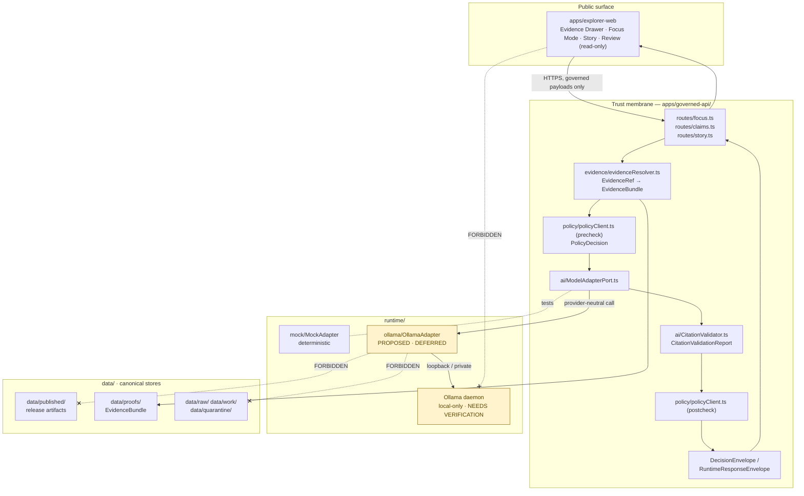
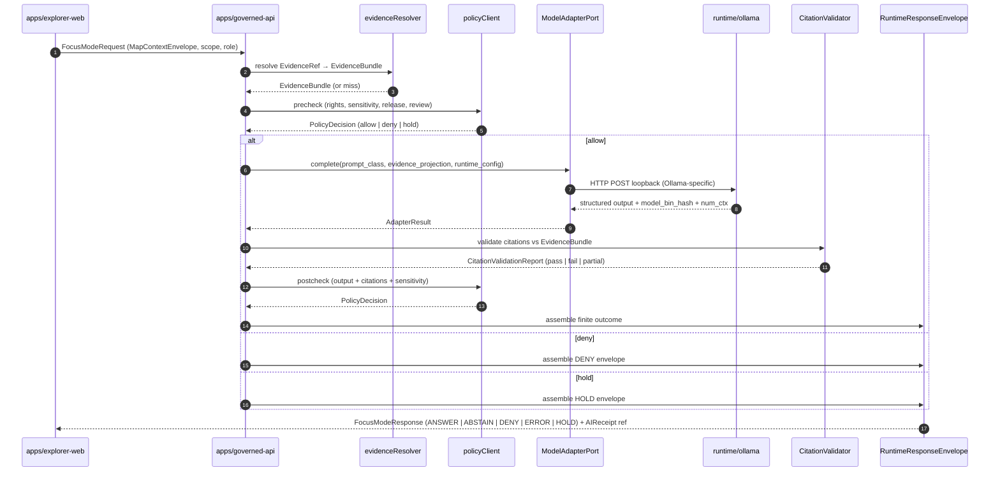

<!-- [KFM_META_BLOCK_V2]
doc_id: kfm://doc/architecture/governed-ai/ollama-integration
title: Ollama Integration — Governed AI Local Runtime Boundary
type: standard
version: v1
status: draft
owners: <docs steward + governed-ai subsystem owner + security steward — placeholder, NEEDS VERIFICATION>
created: 2026-05-14
updated: 2026-05-14
policy_label: public
related:
  - docs/architecture/governed-ai/README.md            # PROPOSED
  - docs/architecture/governed-ai/BOUNDARIES.md        # PROPOSED
  - docs/architecture/governed-ai/ROUTE_MAP.md         # PROPOSED
  - docs/architecture/governed-ai/STATE_OWNERSHIP.md   # PROPOSED
  - docs/runbooks/governed_ai_LOCAL_DEV.md             # PROPOSED
  - docs/runbooks/governed_ai_VALIDATION.md            # PROPOSED
  - docs/runbooks/governed_ai_ROLLBACK.md              # PROPOSED
  - docs/adr/ADR-focus-model-adapter-boundary.md       # PROPOSED
  - docs/doctrine/directory-rules.md                   # CONFIRMED, mounted
  - runtime/ollama/README.md                           # PROPOSED
  - runtime/model_adapters/README.md                   # PROPOSED
  - contracts/runtime/runtime_response_envelope.md     # PROPOSED
  - schemas/contracts/v1/runtime/ai_receipt.schema.json # PROPOSED
  - policy/runtime/README.md                           # PROPOSED
tags: [kfm, governed-ai, ollama, local-runtime, model-adapter, focus-mode, evidence, trust-membrane]
notes:
  - "All path claims outside docs/doctrine/directory-rules.md are PROPOSED per Directory Rules §0."
  - "Ollama runtime is DEFERRED in the canonical sequencing until MockAdapter contracts, evidence/citation gates, and security review pass."
[/KFM_META_BLOCK_V2] -->

# Ollama Integration — Governed AI Local Runtime Boundary

> How Kansas Frontier Matrix (KFM) admits Ollama as a **replaceable, evidence-subordinate local model runtime** behind the governed API — without giving it a public surface, canonical-store access, or authority over evidence, policy, or release state.


**Status:** PROPOSED · **Owners:** Docs steward + governed-AI subsystem owner + security steward *(NEEDS VERIFICATION)* · **Last reviewed:** 2026-05-14

---

## Quick jump

- [1. Scope](#1-scope)
- [2. Authority and source anchors](#2-authority-and-source-anchors)
- [3. Sequencing rule — MockAdapter first, Ollama later](#3-sequencing-rule--mockadapter-first-ollama-later)
- [4. Where Ollama lives in the repo](#4-where-ollama-lives-in-the-repo)
- [5. Architectural position](#5-architectural-position)
- [6. Boundaries Ollama must respect](#6-boundaries-ollama-must-respect)
- [7. Adapter contract](#7-adapter-contract)
- [8. Request flow and finite outcomes](#8-request-flow-and-finite-outcomes)
- [9. AIReceipt — Ollama-specific capture](#9-aireceipt--ollama-specific-capture)
- [10. Deterministic runtime gates](#10-deterministic-runtime-gates)
- [11. Negative-path fixtures](#11-negative-path-fixtures)
- [12. Exposure and network posture](#12-exposure-and-network-posture)
- [13. Rollback and kill-switch](#13-rollback-and-kill-switch)
- [14. Verification backlog](#14-verification-backlog)
- [15. Related docs](#15-related-docs)
- [Appendix A — Operational placeholders](#appendix-a--operational-placeholders)

---

## 1. Scope

This document specifies **how Ollama is permitted to participate in KFM's governed-AI runtime**, and the boundaries it must respect. It covers:

- The repository home for Ollama-related runtime wiring.
- The adapter contract behind which Ollama (or any other provider) is admitted.
- The data, policy, and exposure boundaries Ollama may not cross.
- The receipts, policy gates, and finite outcomes Ollama-backed answers must produce.
- The deferred status of any live Ollama binding.

This document **does not** cover:

- The semantic meaning of governed-AI object families (`contracts/runtime/*`).
- Field-level schema shapes (`schemas/contracts/v1/runtime/*`, `schemas/contracts/v1/focus/*`).
- Admissibility / release policy (`policy/runtime/*`, `policy/release/*`).
- Local-dev and rollback runbook procedures (`docs/runbooks/governed_ai_*.md`).

> [!IMPORTANT]
> **Ollama is a runtime, not a truth source.** Generated language is subordinate to `EvidenceBundle`, source authority, `PolicyDecision`, review state, release state, and `CitationValidationReport`. Anywhere in this document the phrasing might suggest otherwise, the boundary doctrine controls.

---

## 2. Authority and source anchors

| Source | Class | Authoritative for | Truth posture |
|---|---|---|---|
| `docs/doctrine/directory-rules.md` §10.1, §6, §15 | Doctrine (mounted) | `runtime/ollama/` home; README contract; canonical roots | CONFIRMED |
| UIAI-OLLAMA — *Ollama & Ubuntu Information.pdf* | UI-AI runtime guide | Ollama as replaceable local/private runtime behind the governed API | CONFIRMED doctrine / PROPOSED realization |
| UIAI-GAI — *Governed AI Extended Pro Source Ledger Report* | UI-AI plan | Adapter boundaries, finite outcomes, AIReceipt, citation validation | CONFIRMED doctrine / PROPOSED realization |
| UIAI-WHOLE — *Whole-UI + Governed AI Expansion Report* | UI-AI plan | Subsystem path tree under `docs/architecture/governed-ai/*`; deferral of live provider adapters | PROPOSED |
| UIAI-MASTER — *Master MapLibre Components-Functions-Features* v1.9 | Atlas | `AIReceipt` Ollama-specific `num_ctx` capture; no-public-model-client tests | CONFIRMED doctrine |
| KFM Unified Implementation Architecture Build Manual §15, §27 | Unified manual | Reconciliation of UIAI-GAI vs UIAI-OLLAMA; AI exposure boundary | CONFIRMED |
| KFM Domains Culmination Atlas v1.1 §24.3 | Atlas | `ANSWER / ABSTAIN / DENY / ERROR / HOLD / PASS / FAIL` outcome semantics | CONFIRMED doctrine |
| New Ideas 5-8-26 — receipt/OPA gate sketches | Exploratory | Deterministic-runtime OPA `deny[msg]` patterns and negative-path fixture list | PROPOSED |

> [!NOTE]
> **Repository preflight.** No KFM repository is mounted in this session beyond `docs/doctrine/directory-rules.md`. Any specific file path quoted below outside that file is **PROPOSED** per Directory Rules §0 and §2.1 until verified against mounted-repo evidence.

[Back to top](#quick-jump)

---

## 3. Sequencing rule — MockAdapter first, Ollama later

KFM's governed-AI sequencing is **adapter-contract-first**, not provider-first. The reconciliation between UIAI-GAI (which says the first implementation slice should not start with Ollama, OpenAI, a browser chat panel, or UI polish) and UIAI-OLLAMA (which describes Ollama as a replaceable local or privately hosted runtime) is **resolved by sequencing**, not by choosing a side.

```mermaid
flowchart LR
  A["1 · Adapter contract<br/>ModelAdapterPort"] --> B["2 · MockAdapter<br/>deterministic tests"]
  B --> C["3 · Evidence + policy gates<br/>EvidenceRef → EvidenceBundle<br/>PolicyDecision"]
  C --> D["4 · CitationValidationReport<br/>finite outcome envelope"]
  D --> E["5 · AIReceipt / RunReceipt<br/>spec_hash, prompt_hash, model_bin_hash"]
  E --> F["6 · Security review<br/>exposure controls, OPA gates"]
  F --> G["7 · OllamaAdapter admitted<br/>behind the same boundary"]

  classDef done fill:#d4edda,stroke:#3c763d,color:#1b4220;
  classDef pending fill:#fff3cd,stroke:#856404,color:#5a4400;
  classDef deferred fill:#f8d7da,stroke:#a94442,color:#5a1a1d;
  class A,B,C,D,E pending;
  class F,G deferred;
```



| Stage | Truth posture | Gate |
|---|---|---|
| 1–5: contract, mock, evidence, citation, receipts | **PROPOSED** | Must exist and pass before stage 6 begins. |
| 6: security review | **DEFERRED** | Reverse proxy, CORS, secrets, network exposure, OPA bundle approved. |
| 7: live Ollama binding | **DEFERRED** | Permitted only when stages 1–6 are signed off. |

This matches the Whole-UI Report's explicit deferral: *"Live Ollama/OpenAI/provider adapter — DEFER — model provider choice is secondary to adapter contract, evidence resolution, and citation validation. Add after MockAdapter tests and security review pass."*

[Back to top](#quick-jump)

---

## 4. Where Ollama lives in the repo

Per `docs/doctrine/directory-rules.md` §10.1 (CONFIRMED, mounted), Ollama wiring lives under `runtime/`, not under `apps/`, `packages/`, `tools/`, or any new root-level `ai/` or `ollama/` folder. The relevant slice of the canonical tree is:

```text
runtime/
├── README.md           # canonical-root README per §15
├── local/              # local runtime wiring
├── model_adapters/     # adapter interfaces; provider-agnostic
├── ollama/             # local LLM runtime — this doc's primary subject
├── mock/               # MockAdapter for deterministic tests
├── service_configs/    # runtime service config
└── envelopes/          # finite-outcome envelope helpers
```

**Placement basis** (Directory Rules §4 placement protocol):

| Question | Answer for Ollama wiring |
|---|---|
| What is the primary responsibility? | Hosting a **local model runtime** behind the governed API. |
| Which responsibility root? | `runtime/` — adapters and harnesses behind the governed API. |
| Public surface? | No. Public clients route through `apps/governed-api/`, never `runtime/ollama/`. |
| Canonical or compatibility root? | Canonical (`runtime/`). |
| Could it live under `apps/`, `packages/`, `tools/`, or a new root? | **No.** A new root would require an ADR per §2.4; `apps/` is reserved for deployables; `packages/` for shared libraries; `tools/` for repo-wide validators/generators. |

> [!CAUTION]
> Do not create a sibling `ollama/` directory at repository root, under `apps/`, under `tools/`, or under `packages/`. Such a placement would establish a **parallel runtime authority** in violation of Directory Rules §2.4 (5) and §13. If a real repository inspection finds Ollama wiring elsewhere, raise it as a `docs/registers/DRIFT_REGISTER.md` entry and migrate under ADR.

[Back to top](#quick-jump)

---

## 5. Architectural position

Ollama sits **inside the trust membrane**, reached only via the `ModelAdapterPort` interface, never directly by a browser or any public client. The Evidence Drawer, Focus Mode, exports, and Story Nodes consume governed-API envelopes — they do not consume Ollama output.



Reading the diagram:

- **Solid lines** are the only permitted call paths.
- **Dashed crossed lines** are explicitly forbidden — no direct browser-to-model traffic, no Ollama reading `data/raw/`, `data/work/`, `data/quarantine/`, or canonical stores.
- The **MockAdapter** is the implementation reference for the `ModelAdapterPort` contract; the **OllamaAdapter** is admitted only after the contract is proven by MockAdapter tests.

[Back to top](#quick-jump)

---

## 6. Boundaries Ollama must respect

These boundaries are CONFIRMED doctrine (UIAI-OLLAMA §§1–3, 9–15; UIAI-GAI §§2–4; Unified Build Manual §15, §27; directory-rules.md §10.1).

### 6.1 MUST NOT

- **MUST NOT** receive direct public client traffic. The browser never calls Ollama; Focus Mode requests transit `apps/governed-api/`.
- **MUST NOT** read `data/raw/`, `data/work/`, `data/quarantine/`, unpublished candidate data, direct canonical stores, graph stores, object stores, vector indexes, or source credentials.
- **MUST NOT** receive sensitive exact-location material (archaeology coordinates, living-person / DNA data, rare-species occurrences, culturally sensitive sites, critical infrastructure detail, hazard precision) unless a governed, policy-allowed internal workflow explicitly permits bounded review use.
- **MUST NOT** emit answers that bypass `EvidenceRef → EvidenceBundle` resolution, `CitationValidationReport`, `PolicyDecision`, release state, correction lineage, or rollback discipline.
- **MUST NOT** be cited as a truth source. Generated language is downstream of evidence, source authority, and policy. AI/chat activity may have PROV but does not become truth.
- **MUST NOT** persist private chain-of-thought as a published artifact.

### 6.2 MUST

- **MUST** be reachable only through `ModelAdapterPort`, identically to any other provider.
- **MUST** receive only `MapContextEnvelope` plus the resolved `EvidenceBundle` projection that policy precheck has approved — never the raw user prompt against unfiltered context.
- **MUST** be configured deterministically (`temperature = 0`, fixed `seed`, recorded `num_ctx`, pinned `model_bin_hash`) so that runs are replayable. See §10.
- **MUST** emit structured output that conforms to the Focus response contract; free prose outside the response schema is treated as a contract violation (DENY).
- **MUST** produce an `AIReceipt` for every invocation; uncited or config-unrecorded answers are rejected.

[Back to top](#quick-jump)

---

## 7. Adapter contract

Ollama is one **implementation** of `ModelAdapterPort`. The port — not Ollama — is the trust boundary.

**Proposed home** *(PROPOSED, NEEDS VERIFICATION against real `apps/`/`packages/` convention)*:

| Path | Role | Truth posture |
|---|---|---|
| `apps/governed-api/src/ai/ModelAdapterPort.ts` | Provider-neutral interface | PROPOSED |
| `apps/governed-api/src/ai/MockAdapter.ts` | Deterministic adapter for tests and local fixtures | PROPOSED |
| `runtime/ollama/OllamaAdapter.ts` *(or `apps/governed-api/src/ai/OllamaAdapter.ts`)* | Ollama-specific implementation hidden behind the port | PROPOSED · DEFERRED |
| `runtime/model_adapters/README.md` | Provider-agnostic adapter docs | PROPOSED |
| `runtime/ollama/README.md` | Canonical-root README per Directory Rules §15 | PROPOSED |

> [!NOTE]
> The exact module split between `apps/governed-api/src/ai/` and `runtime/ollama/` is **NEEDS VERIFICATION**. Two acceptable shapes exist: (a) interface-and-mock under `apps/governed-api/src/ai/`, Ollama-specific adapter under `runtime/ollama/`; (b) all adapters under `apps/governed-api/src/ai/` with `runtime/ollama/` holding only config, harness, and systemd material. Either is consistent with Directory Rules; the choice belongs in an ADR (proposed: `docs/adr/ADR-focus-model-adapter-boundary.md`).

### 7.1 Contract surface (PROPOSED)

```text
ModelAdapterPort
  .health()       → ok | unavailable | degraded
  .complete(req)  → AdapterResult
       where req: AdapterRequest
                  { prompt_class, prompt_hash, schema_hash,
                    evidence_projection, runtime_config }
       where AdapterResult:
                  { output_text | structured_output,
                    output_digest, model_id, model_bin_hash,
                    runtime_config_echo, latency_ms }
```

The adapter **does not** decide outcomes. It returns raw structured output; the surrounding pipeline (`CitationValidator`, `policyClient` postcheck, `RuntimeResponseEnvelope` builder) decides `ANSWER / ABSTAIN / DENY / ERROR / HOLD`.

[Back to top](#quick-jump)

---

## 8. Request flow and finite outcomes

The governed Focus-Mode request flow is identical regardless of which adapter is bound. Ollama participates only as the `complete()` call at step 5.



### Finite outcome semantics

| Outcome | When (Ollama-relevant) | Required artifacts | Public-surface effect |
|---|---|---|---|
| **ANSWER** | Evidence sufficient, policy allows, release state OK, citation report passes. | `EvidenceBundle`, `PolicyDecision = allow`, `CitationValidationReport = pass`, `AIReceipt` | Substantive answer with citations in the Evidence Drawer. |
| **ABSTAIN** | Evidence insufficient/stale, citation report fails, or adapter output cannot be supported. | `AIReceipt` with reason; no claim emitted | Non-substantive note with reason; never invents. |
| **DENY** | Policy, rights, sensitivity, or release state forbid. Restricted lanes default here. | `PolicyDecision = deny + reason_code`, `AIReceipt` | Denial reason; alternative non-restricted surface offered where possible. |
| **ERROR** | Schema-invalid output (e.g., prose outside JSON), missing `model_bin_hash`, adapter unreachable, Ollama returns malformed UTF-8, contract violation. | Error envelope with diagnostic code; no claim leakage | Finite, actionable error; never silently falls through. |
| **HOLD** | Release/correction/review pending. | `ReviewRecord pending`, `PolicyDecision = hold` | Prior state preserved; no silent rollback. |

Forbidden patterns include returning a layer that lacks a `ReleaseManifest`, returning an unreleased candidate as ANSWER, exposing internal store identifiers, or returning raw source bytes.

[Back to top](#quick-jump)

---

## 9. AIReceipt — Ollama-specific capture

Every Ollama-backed invocation must emit an `AIReceipt`. The Ollama-specific addition over the provider-neutral `AIReceipt` schema is the **local context length / `num_ctx` capture**, plus a pinned `model_bin_hash` (UIAI-MASTER v1.9 explicitly notes both).

> [!IMPORTANT]
> An `AIReceipt` that omits `model.model_bin_hash`, `runtime.num_ctx`, `prompt.prompt_hash`, or `seed` is **rejected by policy**. Uncited and config-unrecorded answers do not publish.

### 9.1 PROPOSED receipt shape

```json
{
  "object_type": "AIReceipt",
  "schema_version": "v1",
  "outcome": "ANSWER",
  "spec_hash": "blake3:…",
  "model": {
    "id": "<ollama-tag-or-release>",
    "provider": "ollama",
    "model_bin_hash": "sha256:…"
  },
  "prompt": {
    "prompt_class": "focus_mode.kfm.v1",
    "prompt_hash": "blake3:…",
    "schema_hash": "sha256:…"
  },
  "runtime": {
    "temperature": 0,
    "top_p": 1,
    "seed": 42,
    "num_ctx": 8192,
    "max_tokens": 256
  },
  "evidence": {
    "evidence_refs": ["evidence://…"],
    "evidence_projection_digest": "blake3:…"
  },
  "artifacts": {
    "llm_output_digest": "blake3:…",
    "structured_output_digest": "blake3:…"
  },
  "policy": {
    "policy_bundle_hash": "sha256:…",
    "precheck_decision": "allow",
    "postcheck_decision": "allow"
  },
  "citation": {
    "citation_validation_report_ref": "report://…",
    "pass": true
  },
  "timestamp": "YYYY-MM-DDTHH:MM:SSZ"
}
```

### 9.2 Field-level intent

| Field group | Intent | Truth posture |
|---|---|---|
| `model.model_bin_hash` | Pins the exact model weights used; required for replay. | PROPOSED |
| `runtime.num_ctx` | Ollama-specific context length; affects what the model could possibly attend to. | PROPOSED · UIAI-MASTER v1.9 |
| `runtime.temperature`, `seed` | Deterministic-runtime gates; enforced by OPA (§10). | PROPOSED |
| `prompt.prompt_hash`, `schema_hash` | Pins the *exact* prompt and the schema the model was asked to honor. | PROPOSED |
| `evidence.evidence_projection_digest` | Pins the *filtered* evidence the adapter actually saw (post precheck). | PROPOSED |
| `policy.policy_bundle_hash` | Pins the policy version used for pre/postcheck. | PROPOSED |
| `citation.citation_validation_report_ref` | Externalizes the citation report so the receipt does not duplicate it. | PROPOSED |

The receipt is **process memory**, not release proof on its own. Release closure requires `ReleaseManifest`, `EvidenceBundle`, `PromotionDecision`, correction path, and rollback target in addition.

[Back to top](#quick-jump)

---

## 10. Deterministic runtime gates

Ollama is admitted only when its runtime behavior is **replayable**. The OPA gate pattern below is PROPOSED (basis: New Ideas 5-8-26) and is intended to live under `policy/runtime/` once an ADR confirms the policy-bundle home.

### 10.1 Required DENY conditions

| OPA rule (PROPOSED) | DENY when | Rationale |
|---|---|---|
| `runtime.temperature != 0` | Non-deterministic sampling | Replay impossible; receipts cannot be diffed. |
| `not input.seed` | Missing seed | Same prompt yields different outputs across runs. |
| `not input.model.model_bin_hash` | Missing model binary hash | Cannot prove which weights answered. |
| `input.prompt.schema_hash != data.allowed.prompt_schema_hash` | Unapproved prompt schema | Schema drift = silent contract change. |
| `input.confidence < threshold` *(threshold is policy-bundle defined)* | Confidence below minimum | Low-confidence answers must ABSTAIN, not ANSWER. |
| `input.outcome == "ANSWER" and not input.citation.pass` | Uncited ANSWER | Cite-or-abstain doctrine. |
| `count(input.evidence.evidence_refs) == 0 and input.outcome == "ANSWER"` | ANSWER without resolved evidence | Generation is not evidence. |

### 10.2 Replay check (PROPOSED CI command)

```bash
make ai-prefilter
make ai-prefilter-replay-check
# or:
sha256sum prefilter_run_receipt.json
diff prefilter_run_receipt.json expected_receipt.json
```

> [!TIP]
> Canonicalize JSON before hashing: `json.dumps(obj, sort_keys=True, separators=(",", ":"))`. Round float scores to a fixed precision (`round(score, 6)`). Normalize text with `unicodedata.normalize("NFC", text)`. Without these three steps, replay diffs will spuriously fail.

[Back to top](#quick-jump)

---

## 11. Negative-path fixtures

CONFIRMED doctrine (Unified Build Manual §27): validators must test DENY, ABSTAIN, ERROR, quarantine, stale, restricted, and review-needed paths — not only successful publication. For the Ollama adapter the minimum negative-fixture set is:

| Fixture | Expected outcome | Source basis |
|---|---|---|
| `prose_outside_json` | **DENY** (contract violation) | New Ideas 5-8-26 |
| `missing_decision` | **DENY** | New Ideas 5-8-26 |
| `confidence_nan` | **DENY** | New Ideas 5-8-26 |
| `missing_seed` | **DENY** | New Ideas 5-8-26 |
| `prompt_hash_mismatch` | **DENY** | New Ideas 5-8-26 |
| `temperature_nonzero` | **DENY** | New Ideas 5-8-26 |
| `unknown_decision_enum` | **DENY** | New Ideas 5-8-26 |
| `duplicate_item_ids` | **DENY** | New Ideas 5-8-26 |
| `malformed_utf8` | **DENY / ERROR** | New Ideas 5-8-26 |
| `hallucinated_fields` (output keys not in schema) | **DENY** | New Ideas 5-8-26 |
| `missing_evidence_refs_with_ANSWER` | **ABSTAIN** | UIAI-GAI §§2–4 |
| `citation_does_not_resolve_to_EvidenceBundle` | **ABSTAIN** | UIAI-GAI §§2–4 |
| `restricted_geometry_in_evidence_projection` | **DENY** | UIAI-OLLAMA §§9–15; sensitivity posture |
| `ollama_daemon_unreachable` | **ERROR** | UIAI-OLLAMA |
| `model_bin_hash_unrecorded` | **DENY** | New Ideas 5-8-26 |

Fixtures live under the canonical fixture home (PROPOSED `tests/fixtures/focus/` and `tests/fixtures/runtime/`); sensitive-lane fixtures must use public-safe transformed values, never real exact archaeology, living-person, DNA, rare-species, or infrastructure detail.

[Back to top](#quick-jump)

---

## 12. Exposure and network posture

For local KFM deployments where Ollama runs on the same host or LAN as the governed API, the exposure controls below are PROPOSED (basis: UIAI-MAP §13; BLD-GREEN §18; BLD-COMP §§21–23, 31; Whole-UI §25). They are **NEEDS VERIFICATION** against real deployment topology — none can be claimed as enforced without inspection of `infra/` and a deployment threat model.

| Concern | Required posture | Truth posture |
|---|---|---|
| Ollama listen address | Loopback or private network only; never a public interface. | NEEDS VERIFICATION |
| CORS | Deny-by-default at the **governed API**; Ollama daemon should reject browser-origin requests outright. | PROPOSED |
| Authentication to Ollama | Localhost trust + governed-API service identity; no shared browser-accessible credential. | PROPOSED |
| Reverse proxy / VPN exposure | Reverse proxy MUST NOT expose Ollama's port. Public path is governed-API only. | PROPOSED |
| Secrets | Real secrets never in `configs/`; environment-specific secret store, referenced by name. | CONFIRMED doctrine (Directory Rules §10.3) |
| Audit logs | Every adapter call logged with `AIReceipt` reference; logs governed by retention policy. | PROPOSED |
| Admin shortcuts | Justified, constrained, documented, kept out of the normal public path. | CONFIRMED doctrine (Directory Rules §10.2) |
| Prompt telemetry | Safe-by-construction: no raw prompts, evidence text, restricted geometry, secrets, or full `EvidenceBundle` copies in telemetry. | CONFIRMED doctrine (Whole-UI §25) |

> [!WARNING]
> If a deployment review finds Ollama's port exposed beyond loopback / private network — or if a reverse-proxy rule forwards external traffic to the model port — **treat as a security incident.** Disable the route, file a `docs/runbooks/` entry, rotate any tokens or service credentials that may have leaked, and add a `docs/registers/DRIFT_REGISTER.md` entry.

[Back to top](#quick-jump)

---

## 13. Rollback and kill-switch

Ollama-backed AI must be fully reversible behind a feature flag. The rollback path is PROPOSED but conforms to the Whole-UI Report §26 pattern.

| Layer | Rollback action |
|---|---|
| Live Ollama binding | Disable the `OllamaAdapter` provider flag in `apps/governed-api/`; route falls back to `MockAdapter` (or the route is disabled entirely). The Evidence Drawer and layer browsing remain intact. |
| Schema or contract change | Versioned successor schema; never silently delete a released schema. |
| Policy bundle | Revert to last-known-good `policy_bundle_hash`; fail closed during reversion. |
| `AIReceipt` schema | Deprecate with v-bump; preserve old receipts as lineage. |
| Adapter port change | Adapter-level rollback PR; if `ModelAdapterPort` signature changes, regenerate `MockAdapter` first and rerun the deterministic replay check. |

The kill-switch is a **single configurable flag** (PROPOSED home: `configs/<env>/governed_ai.flags.yaml`) that, when set to `disabled`, causes the Focus Mode route to return a finite ERROR envelope with reason code `model_runtime_disabled`. There must be no other path to live AI.

[Back to top](#quick-jump)

---

## 14. Verification backlog

These items cannot be settled from doctrine alone. They are **NEEDS VERIFICATION** and should be tracked in `docs/registers/VERIFICATION_BACKLOG.md`.

- [ ] Confirm the real `apps/` directory naming (`apps/governed-api/` vs `apps/governed_api/` vs `packages/api/`).
- [ ] Confirm whether `OllamaAdapter` lives under `apps/governed-api/src/ai/` or under `runtime/ollama/` (resolve via ADR-focus-model-adapter-boundary).
- [ ] Confirm Ollama version pin, model catalogue, and quantization choice. Version-sensitive runtime facts in UIAI-OLLAMA need recheck before use.
- [ ] Verify the policy-bundle home (`policy/runtime/` vs `policies/runtime/` legacy mirror) and the OPA / Conftest tooling decision (UIAI Build Manual §15 marks OPA/Conftest as PROPOSED bootstrap).
- [ ] Verify `apps/governed-api/` deployment topology — reverse proxy rules, CORS allowlist, audit retention, branch protections, signing key custody.
- [ ] Verify the `AIReceipt` schema home (`schemas/contracts/v1/runtime/ai_receipt.schema.json` is PROPOSED per ADR-0001 schema-home convention).
- [ ] Verify whether DSSE / Sigstore signing for receipts is in place at `release/signatures/`.
- [ ] Verify host hardening, package CVEs, dependency licenses, and SSO/role mapping (Unified Build Manual §27 marks these NEEDS VERIFICATION).
- [ ] Verify Ollama-specific `num_ctx` defaults for each registered prompt class.

[Back to top](#quick-jump)

---

## 15. Related docs

- [`docs/doctrine/directory-rules.md`](../../doctrine/directory-rules.md) — §6, §10.1, §15 (CONFIRMED, mounted).
- [`docs/architecture/governed-ai/README.md`](./README.md) — *PROPOSED* subsystem overview.
- [`docs/architecture/governed-ai/BOUNDARIES.md`](./BOUNDARIES.md) — *PROPOSED* trust-membrane boundary detail.
- [`docs/architecture/governed-ai/ROUTE_MAP.md`](./ROUTE_MAP.md) — *PROPOSED* Focus and AI-adjacent route surfaces.
- [`docs/architecture/governed-ai/STATE_OWNERSHIP.md`](./STATE_OWNERSHIP.md) — *PROPOSED* Focus request / evidence / adapter / citation / envelope state ownership.
- [`docs/architecture/governed-ai/FOCUS_FLOW.md`](./FOCUS_FLOW.md) — *PROPOSED* sequence detail.
- [`docs/adr/ADR-focus-model-adapter-boundary.md`](../../adr/ADR-focus-model-adapter-boundary.md) — *PROPOSED* decision record for no direct browser-to-model path.
- [`docs/runbooks/governed_ai_LOCAL_DEV.md`](../../runbooks/governed_ai_LOCAL_DEV.md) — *PROPOSED* MockAdapter and provider-adapter local-dev runbook.
- [`docs/runbooks/governed_ai_VALIDATION.md`](../../runbooks/governed_ai_VALIDATION.md) — *PROPOSED* Focus Mode evidence / citation / policy validation runbook.
- [`docs/runbooks/governed_ai_ROLLBACK.md`](../../runbooks/governed_ai_ROLLBACK.md) — *PROPOSED* AI adapter rollback and kill-switch runbook.
- [`runtime/README.md`](../../../runtime/README.md) — *PROPOSED* canonical-root README per Directory Rules §15.
- [`runtime/ollama/README.md`](../../../runtime/ollama/README.md) — *PROPOSED*.
- [`contracts/runtime/`](../../../contracts/runtime/) — `runtime_response_envelope`, `decision_envelope`, `run_receipt`, `ai_receipt` semantic homes (*PROPOSED*).
- [`schemas/contracts/v1/runtime/`](../../../schemas/contracts/v1/runtime/) — machine-checkable schema home (*PROPOSED*, ADR-0001).
- [`policy/runtime/`](../../../policy/runtime/) — runtime gate policy (Focus Mode, evidence resolution, abstain) (*PROPOSED*).

---

## Appendix A — Operational placeholders

<details>
<summary><strong>Click to expand — Ollama daemon and host posture (NEEDS VERIFICATION)</strong></summary>

The material below is **illustrative**. Concrete values (ports, paths, units, allow-listed origins, model tags) are **NEEDS VERIFICATION** against real `infra/` and deployment evidence.

### A.1 Daemon binding (illustrative)

> [!NOTE]
> Ports and environment-variable names below are placeholders for the section's shape. Verify against the Ollama version actually pinned in `runtime/ollama/` and against the host's reverse-proxy / firewall configuration before adopting.

```ini
# infra/systemd/ollama.service.d/override.conf  (PROPOSED, NEEDS VERIFICATION)
[Service]
Environment="OLLAMA_HOST=<loopback-or-private-interface>:<port>"
Environment="OLLAMA_ORIGINS=<empty-or-governed-api-origin-only>"
Environment="OLLAMA_KEEP_ALIVE=<duration>"
Environment="OLLAMA_NUM_PARALLEL=<n>"
```

### A.2 Reverse-proxy posture (illustrative)

```text
# infra/reverse_proxy/  (PROPOSED, NEEDS VERIFICATION)
# Public path: governed-api only. Ollama port MUST NOT be reverse-proxied
# to a public hostname.
location /api/v1/focus       → upstream apps/governed-api    (ALLOW)
location /ollama/*           → 404                            (DENY)
location /                   → apps/explorer-web              (ALLOW, static)
```

### A.3 OllamaAdapter call shape (illustrative)

```text
# runtime/ollama/OllamaAdapter (PROPOSED)
POST http://<loopback>:<port>/<ollama-api-route>
{
  "model":   "<registered-model-tag>",
  "options": {
    "temperature": 0,
    "seed":        <fixed-seed>,
    "num_ctx":     <pinned-for-prompt-class>,
    "num_predict": <max-tokens>
  },
  "format":  "json",
  "stream":  false,
  "prompt":  "<governed prompt rendered from prompt_class + evidence_projection>"
}
```

The adapter consumes the daemon response, computes `output_digest`, attaches `model_bin_hash`, and returns an `AdapterResult` to the governed-API pipeline. The adapter does not validate citations, does not apply policy, and does not assemble the response envelope — those responsibilities belong to `CitationValidator`, `policyClient`, and the envelope builder respectively.

### A.4 What this appendix does NOT establish

- It does **not** prove that any of these files exist in the KFM repository today.
- It does **not** select a specific Ollama version, model, or quantization.
- It does **not** authorize a public-facing model route.
- It does **not** replace the §14 verification backlog.

</details>

---

<sub>Doc status: **PROPOSED** · Authority: **subsystem architecture** · Last reviewed: **2026-05-14** · See [verification backlog](#14-verification-backlog) for open items.</sub>

[Back to top](#quick-jump)
