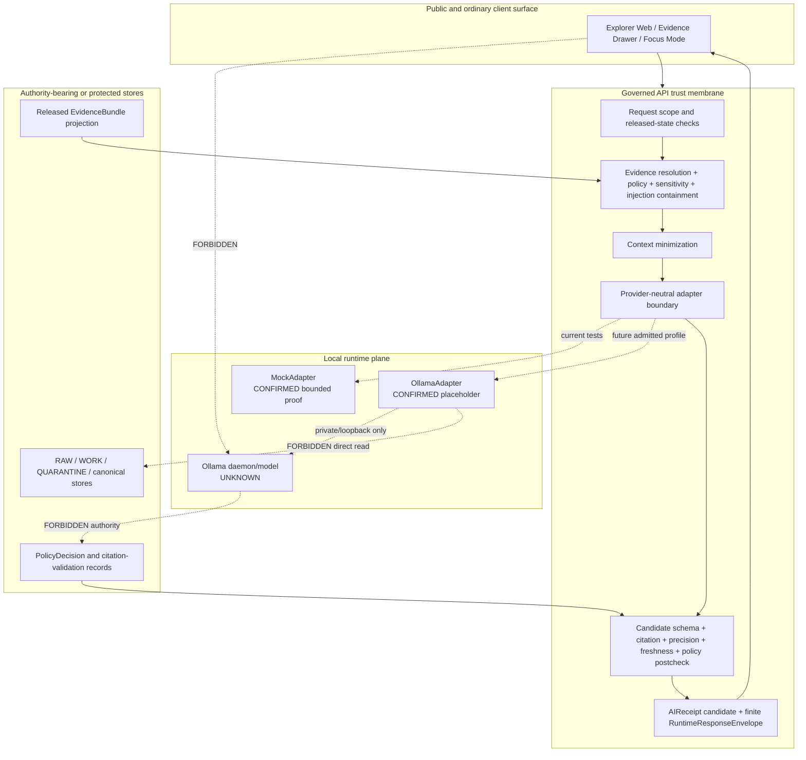
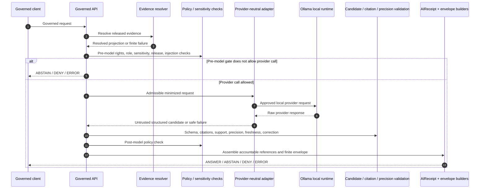

<!-- [KFM_META_BLOCK_V2]
doc_id: kfm://doc/architecture/governed-ai/ollama-integration
title: Ollama Integration — Governed Local Runtime Boundary
type: architecture-standard
version: v2.0
status: draft; repository-grounded; scaffold-only; live-binding-deferred; non-authoritative
owners:
  - "@bartytime4life — verified CODEOWNERS review route"
  - "NEEDS VERIFICATION — Governed API, governed-AI, runtime, evidence, policy, citation, security, privacy, contracts, schemas, validation, operations, correction, and release reviewers"
created: 2026-05-14
updated: 2026-08-20
policy_label: public
owning_root: docs/
responsibility: Explain the current Ollama-related repository surface, the provider-specific local-runtime boundary, the proposed admission path behind the Governed API, and the evidence, policy, citation, receipt, security, correction, and rollback controls that remain outside provider authority.
truth_posture: CONFIRMED current repository evidence / PROPOSED live-provider composition and admission controls / UNKNOWN installed daemon, approved model, deployed route, operational receipt persistence, and release use
repository: bartytime4life/Kansas-Frontier-Matrix
base_commit: 4592507a4698a08b74bf154d1249e2ce0bf1592a
target_prior_blob: 39cd49270781d9d5237d98264ccd3502e28f6790
directory_rules_blob: fd49a0b83e55cef52c1124281f093e263526898d
adr_0029_blob: a4de0d7a96b78da59cfc499d1025e1508afd8dd9
adr_0008_blob: 7eeae617986d053699da66c0f5cd0df063902ef7
runtime_ollama_readme_blob: b0708364fa002760383882f18843e31c6c4209c7
ollama_adapter_blob: 1769a719d6a6df53e001abbc4c67ad486ab5c944
mock_adapter_blob: 04d37e59b14c9e3b85126cb3380b6221b44e26d1
ai_receipt_contract_blob: f4d8183dbed38f83144f6d9dbde30ae02a01edb8
ai_receipt_schema_blob: 2e0bebdb3a38acbc3c58a919db46970c6e829b4a
runtime_response_schema_blob: 8b86e7db8b18b65a56a4e639dfc54e1b2db93155
env_example_blob: 5af73215557f4af432157409ff89ab17088d0953
inspection_boundary: Current-session GitHub reads covered this complete prior page, accepted Directory Rules and ADR-0029, ADR-0008, the governed-AI adapter and AIReceipt architecture companions, runtime/ollama, runtime/model_adapters, the Ollama and Mock adapter files, the Governed API AI directory, current runtime schemas, runtime policy files, the public environment template, CODEOWNERS, and focused proof references. No Ollama daemon, model inventory, provider credential, live model request, deployed AI route, evidence resolver, active composed policy engine, citation service, runtime receipt store, network boundary, client session, correction flow, rollback drill, release environment, or publication path was exercised.
related:
  - README.md
  - ADAPTER_CONTRACT.md
  - AI_RECEIPTS.md
  - BOUNDARIES.md
  - FOCUS_FLOW.md
  - MOCK_FIRST.md
  - PROMPT_INJECTION.md
  - ../../adr/ADR-0008-ollama-subordinate-to-governed-api.md
  - ../../adr/ADR-0019-ai-adapter-contract-and-finite-envelopes.md
  - ../../adr/ADR-0029-adopt-directory-governance-standard-v2.md
  - ../../doctrine/directory-rules.md
  - ../../../runtime/ollama/README.md
  - ../../../runtime/model_adapters/README.md
  - ../../../runtime/model_adapters/OllamaAdapter.py
  - ../../../runtime/model_adapters/MockAdapter.py
  - ../../../contracts/runtime/ai_receipt.md
  - ../../../contracts/runtime/runtime_response_envelope.md
  - ../../../schemas/contracts/v1/runtime/ai_receipt.schema.json
  - ../../../schemas/contracts/v1/runtime/runtime_response_envelope.schema.json
  - ../../../policy/runtime/README.md
  - ../../../apps/governed-api/src/ai/README.md
  - ../../../.env.example
notes:
  - "v2.0 replaces proposal-era, no-repository assumptions with current pinned repository evidence."
  - "The existing same-path architecture document receives PLACE under accepted Directory Rules v2; no file is moved, renamed, or retired."
  - "runtime/ollama is a confirmed provider-specific documentation lane; runtime/model_adapters is the confirmed provider-neutral adapter lane."
  - "OllamaAdapter.py remains a one-line placeholder; MockAdapter.py is a bounded deterministic no-I/O fixture selector, not a production model adapter."
  - "The current AIReceipt schema is a closed nine-field profile; Ollama-specific settings must not be added as undeclared fields."
  - "This page does not accept ADR-0008 or ADR-0019, admit a provider or model, activate Ollama, create a route, alter policy, release, deploy, publish, or change repository settings."
[/KFM_META_BLOCK_V2] -->

<a id="top"></a>

# Ollama Integration — Governed Local Runtime Boundary

> **Operating boundary.** Ollama may participate in KFM only as a replaceable, provider-specific local runtime behind provider-neutral orchestration and the Governed API. It is never an evidence source, policy authority, citation authority, release authority, public client contract, lifecycle store, or direct path to canonical or sensitive data.

[](#status-and-authority)
[](#4-where-ollama-lives-in-the-repo)
[](#current-repository-evidence)
[](#3-sequencing-rule--mockadapter-first-ollama-later)
[](#graduation-gates)
[](#12-exposure-and-network-posture)
[](#status-and-authority)

> [!IMPORTANT]
> **This page is explanatory architecture, not implementation or authority.** Semantic meaning belongs under `contracts/`; machine shape under `schemas/`; admissibility under `policy/`; runtime behavior under approved implementation paths; receipt instances under governed data lanes; and release, correction, withdrawal, and rollback under their own authorities.

> [!CAUTION]
> **The repository does not currently contain a working Ollama integration.** `runtime/model_adapters/OllamaAdapter.py` is one comment line. `runtime/ollama/` contains documentation only. The public environment template selects `mock`, and no live Governed API model route was established in the inspected tree.

> [!WARNING]
> **No browser, map shell, Evidence Drawer, Focus Mode client, or ordinary public client may call Ollama directly.** Any future model-mediated behavior must remain inside the Governed API trust membrane and return only the closed governed response envelope.

**Quick navigation:** [Status](#status-and-authority) · [Scope](#1-scope) · [Authority](#2-authority-and-source-anchors) · [Sequencing](#3-sequencing-rule--mockadapter-first-ollama-later) · [Placement](#4-where-ollama-lives-in-the-repo) · [Architecture](#5-architectural-position) · [Boundaries](#6-boundaries-ollama-must-respect) · [Adapter](#7-adapter-contract) · [Flow](#8-request-flow-and-finite-outcomes) · [AIReceipt](#9-aireceipt--ollama-specific-capture) · [Gates](#10-deterministic-runtime-gates) · [Fixtures](#11-negative-path-fixtures) · [Exposure](#12-exposure-and-network-posture) · [Rollback](#13-rollback-and-kill-switch) · [Backlog](#14-verification-backlog) · [Related](#15-related-docs) · [Appendix](#appendix-a--operational-placeholders)

---

## Status and authority

### Current repository evidence

| Surface | Pinned status | Safe conclusion |
|---|---|---|
| This architecture page | **CONFIRMED tracked** at the requested path; prior blob recorded in metadata | Same-path modernization is allowed. The prior page is stale because it describes a no-repository session and proposal-only paths that now exist. |
| Directory Rules | **ACCEPTED through ADR-0029** | `docs/architecture/governed-ai/OLLAMA_INTEGRATION.md` is a human architecture explanation under `docs/`; the placement outcome is `PLACE`. |
| ADR-0008 | **CONFIRMED present; effective decision status `proposed`** | Its subordination rule is strong design guidance, but this page cannot accept the ADR or activate Ollama. |
| `runtime/ollama/` | **CONFIRMED canonical provider-specific lane** | The directory currently contains only `README.md`; it does not prove daemon, model, adapter, or deployment maturity. |
| `runtime/model_adapters/` | **CONFIRMED canonical provider-neutral lane** | Provider-neutral adapter meaning and handoff stay here; Ollama-specific operational notes stay in `runtime/ollama/`. |
| `OllamaAdapter.py` | **CONFIRMED one-line placeholder** | No executable provider call, parsing, timeout, retry, receipt, policy, evidence, or citation behavior exists in that file. |
| `MockAdapter.py` | **CONFIRMED executable bounded proof** | It deterministically returns isolated prevalidated synthetic envelopes for `ANSWER`, `ABSTAIN`, `DENY`, and `ERROR`, performs no I/O, and does not decide semantics or call a model. |
| `.env.example` | **CONFIRMED safe public template** | `KFM_MODEL_RUNTIME=mock`; `OLLAMA_HOST` is loopback. The template does not prove a loader, daemon, provider, route, deployment, or release. |
| Governed API AI implementation directory | **CONFIRMED documentation/scaffold only** | `apps/governed-api/src/ai/` contains a README and `.gitkeep`, not an integrated model orchestration implementation. |
| AIReceipt contract/schema | **CONFIRMED present; status `PROPOSED`** | Current machine shape is a closed nine-field profile. Runtime emission, persistence, retention, and correction are not established. |
| RuntimeResponseEnvelope schema | **CONFIRMED present; status `PROPOSED`** | The client outcome vocabulary is exactly `ANSWER`, `ABSTAIN`, `DENY`, and `ERROR`; `ANSWER` requires evidence and precision disclosure. |
| Runtime policy files | **CONFIRMED present; operational composition unverified** | Small Rego files and a substantive README exist, but this review did not establish that a live Ollama path evaluates or enforces them. |
| Installed Ollama daemon, approved model, model rights, model digest, live network call, logs, receipts, route, deployment, release | **UNKNOWN** | Documentation, placeholders, schemas, fixtures, tests, and environment examples are not operational proof. |

### Authority split

| Concern | Owning surface | This page may do |
|---|---|---|
| Human architecture and current-state explanation | `docs/architecture/governed-ai/` | Explain evidence, boundaries, sequencing, risks, and graduation gates. |
| Provider-neutral adapter semantics | accepted `contracts/` surface after decision | Link and explain; never create semantic authority here. |
| Machine grammar | `schemas/` | Report the current closed profiles; never invent extra fields. |
| Provider/model admission and runtime obligations | `policy/`, accepted registers, and steward decisions | State required review; never claim approval. |
| Provider-specific local runtime notes | `runtime/ollama/` | Link the confirmed lane and keep it subordinate. |
| Provider-neutral adapter implementation/handoff | `runtime/model_adapters/` and an accepted implementation path | Record current maturity; do not guess a new code home. |
| Governed client orchestration | `apps/governed-api/` and approved packages | Require the trust membrane; do not invent route names. |
| Evidence, citation, receipts, release, correction, rollback | their separate governed families | Preserve reference boundaries and fail closed. |

[Back to top](#top)

---

## 1. Scope

This document defines the **Ollama-specific integration boundary** for KFM. It answers:

1. what is confirmed in the current repository;
2. where Ollama-specific and provider-neutral responsibilities belong;
3. which inputs a future Ollama adapter may receive;
4. which outputs it may return to orchestration;
5. which checks must happen before and after a provider call;
6. how AIReceipt, finite envelopes, security, observability, correction, and rollback remain separate; and
7. what must be proven before a live binding may graduate from deferred to admitted.

### In scope

- current Ollama, model-adapter, Governed API, environment, contract, schema, policy, and proof surfaces;
- mock-first sequencing and live-provider graduation gates;
- provider-specific local-runtime placement;
- direct-client, data-access, tool, network, prompt, and logging boundaries;
- finite runtime outcomes;
- the current AIReceipt profile and its limits;
- model/profile identity, determinism, resource, timeout, and replay requirements as **PROPOSED admission controls**;
- negative tests, deactivation, correction, rollback, and open verification work.

### Out of scope

This page does not:

- accept ADR-0008 or ADR-0019;
- define a canonical adapter request or candidate contract;
- implement `OllamaAdapter` or a Governed API AI route;
- install Ollama, pull a model, select a version, approve a license, or admit a quantization;
- create credentials, network rules, service units, reverse-proxy routes, or deployment config;
- define evidence, policy, citation, receipt, release, or correction authority;
- expose a public model endpoint;
- release, deploy, promote, publish, or change repository settings.

> [!NOTE]
> The word **deferred** in this document is an implementation/admission state. It is not a fifth runtime response outcome.

[Back to top](#top)

---

## 2. Authority and source anchors

This revision uses the following authority order for its material claims:

1. current pinned repository files and machine shapes for implementation status;
2. accepted ADR-0029 and the adopted Directory Rules for placement;
3. current proposed ADRs and architecture companions for design intent;
4. attached KFM doctrine and implementation guidance for continuity;
5. provider/version facts only after current official verification, which this documentation-only slice does not perform.

| Source | Current class | Supports | Cannot prove |
|---|---|---|---|
| [ADR-0029](../../adr/ADR-0029-adopt-directory-governance-standard-v2.md) and [Directory Rules](../../doctrine/directory-rules.md) | Accepted placement decision and adopted bytes | Same-path `docs/architecture/governed-ai/` placement; `runtime/ollama/` and `runtime/model_adapters/` responsibility separation | Provider admission, route behavior, model safety, deployment, or publication |
| [ADR-0008](../../adr/ADR-0008-ollama-subordinate-to-governed-api.md) | Proposed ADR with current evidence ledger | No-direct-public-model design, current placeholder maturity, mock-first posture, required future gates | Accepted decision or live integration |
| [Adapter Contract architecture](./ADAPTER_CONTRACT.md) | Repository-grounded draft | Current MockAdapter proof, proposed provider-neutral candidate seam, finite-outcome boundary | Accepted semantic adapter contract or production provider |
| [AIReceipt architecture](./AI_RECEIPTS.md) | Repository-grounded draft | Current nine-field profile, bounded validator/builder proof, persistence and correction HOLDs | Operational runtime emission or public answer authority |
| [`runtime/ollama/README.md`](../../../runtime/ollama/README.md) | Confirmed canonical lane README | Provider-specific local-runtime responsibility, current scaffold status, loopback/mock-first posture | Installed daemon, approved model, working adapter, or deployment |
| [`runtime/model_adapters/README.md`](../../../runtime/model_adapters/README.md) | Confirmed canonical adapter-lane README | Provider-neutral routing and current bounded proof | Accepted production interface or provider admission |
| Current schemas and code | Repository implementation evidence | Exact fields, outcome vocabularies, placeholder and bounded executable behavior | End-to-end semantics beyond their tested scope |
| Attached KFM repository-build prompt | Current task authority | Smallest coherent same-path documentation change, dependency closure, validation, draft PR ceiling | Repository facts that were not independently inspected |

> [!IMPORTANT]
> Version-sensitive Ollama product facts, model capabilities, API details, environment variables, and security recommendations are not accepted from the older page as current facts. They require a separate official-source verification before implementation or pinning.

[Back to top](#top)

---

<a id="3-sequencing-rule--mockadapter-first-ollama-later"></a>

## 3. Sequencing rule: MockAdapter first, Ollama later

KFM remains **contract- and proof-first**, not provider-first. Current repository evidence supports only the first bounded proof stage.


```mermaid
flowchart LR
    A["Current: closed finite envelopes"] --> B["Current: deterministic MockAdapter selector"]
    B --> C["PROPOSED: admissible request + provider candidate contracts"]
    C --> D["PROPOSED: evidence, policy, injection, and minimization pre-gates"]
    D --> E["PROPOSED: executable Ollama adapter + approved provider profile"]
    E --> F["PROPOSED: citation, precision, freshness, and policy post-gates"]
    F --> G["PROPOSED: AIReceipt emission, persistence, correction, and replay"]
    G --> H["PROPOSED: bounded Governed API route"]
    H --> I["PROPOSED: independent security and release review"]

    classDef confirmed fill:#dcfce7,stroke:#15803d,color:#14532d;
    classDef proposed fill:#fef3c7,stroke:#a16207,color:#713f12;
    class A,B confirmed;
    class C,D,E,F,G,H,I proposed;
```

### Current bounded proof

**CONFIRMED:**

- `MockAdapter.py` performs deterministic, no-I/O selection from prevalidated synthetic response envelopes.
- The synthetic matrix must cover all four finite outcomes.
- The current runtime response schema is closed and requires evidence plus precision disclosure for `ANSWER`.
- The current AIReceipt schema is closed and has nine required fields.
- The environment template selects `mock` by default.

**Not established by that proof:**

- request interpretation;
- semantic outcome selection;
- evidence resolution;
- policy evaluation;
- prompt-injection containment;
- provider invocation;
- structured provider-candidate validation;
- citation validation;
- runtime receipt emission or persistence;
- public client integration;
- deployment or release.

<a id="graduation-gates"></a>

### Graduation gates for a live Ollama binding

A live binding remains **DEFERRED** until all applicable gates have reviewable evidence:

| Gate | Minimum evidence | Failure posture |
|---|---|---|
| Adapter authority | Accepted semantic contract and machine schema for the admissible request and untrusted provider candidate | Do not implement against an invented shape. |
| Provider/model admission | Named provider profile, exact model reference/digest, rights/license review, allowed use cases, resource budget, and owner/reviewer record | `DENY` provider activation. |
| Pre-model trust closure | Released scope, resolvable evidence, rights/sensitivity checks, role/access checks, prompt-injection containment, and minimized context | Do not call the provider; return the governing finite outcome. |
| Provider implementation | Executable adapter with bounded timeout, cancellation, output size, structured parsing, safe diagnostics, and no unintended tool/network access | `ERROR`; no partial answer leakage. |
| Post-model validation | Candidate schema validation, citation/support validation, precision/freshness/correction checks, and policy postcheck | `ABSTAIN`, `DENY`, or `ERROR`; never optimistic `ANSWER`. |
| Receipt and traceability | Valid AIReceipt assembled from references/digests, durable internal storage, retention/access rules, correction/supersession linkage, and replay evidence | Fail closed for any operation requiring the receipt. |
| Client boundary | Governed API route returns only the accepted RuntimeResponseEnvelope; direct browser/model traffic is proven absent | `DENY` exposure. |
| Security and operations | Threat model, loopback/private binding, secrets handling, egress/tool controls, logging minimization, health checks, circuit breaker, kill switch, incident and rollback drill | Keep provider disabled. |
| Release review | Independent review appropriate to consequence; no provider capability is mistaken for publication readiness | No release or publication effect. |

[Back to top](#top)

---

## 4. Where Ollama lives in the repo

Accepted Directory Rules route responsibilities by owner, not by product name alone.

```text
runtime/
├── ollama/
│   └── README.md                 # provider-specific local-runtime documentation lane
├── model_adapters/
│   ├── README.md                 # provider-neutral adapter lane
│   ├── MockAdapter.py            # bounded deterministic selector
│   └── OllamaAdapter.py          # one-line placeholder
├── mock/                         # broader deterministic mock-runtime notes
├── local/                        # general local-runtime wiring
├── service_configs/              # non-secret runtime configuration notes
└── envelopes/                    # runtime-envelope helper notes

apps/governed-api/                # public dynamic trust membrane
contracts/runtime/                # semantic object meaning
schemas/contracts/v1/runtime/     # machine shape
policy/runtime/                   # runtime admissibility and obligations
fixtures/ and tests/              # positive and negative proof
data/receipts/                    # receipt instances under governed data rules
release/                          # release, correction, withdrawal, and rollback authority
```

### Placement decision

| Question | Determination |
|---|---|
| Is this document correctly placed? | **CONFIRMED — `PLACE`.** It explains cross-cutting governed-AI architecture to humans at an existing tracked path. |
| Is `runtime/ollama/` the Ollama-specific lane? | **CONFIRMED.** It owns provider-specific local-runtime notes and handoffs, not semantic contract authority. |
| Is `runtime/model_adapters/` the provider-neutral lane? | **CONFIRMED.** Adapter meaning and provider-neutral implementation handoff stay there. |
| Should a new root-level `ollama/` or `ai/` directory be created? | **DENY.** It would create parallel runtime authority. |
| Is the final executable adapter home settled? | **NEEDS VERIFICATION.** Current code architecture and accepted adapter contract must decide without creating a second authority lane. |
| Does file presence activate Ollama? | **No.** Documentation, a placeholder, `.env.example`, a schema, fixture, test, or PR is not provider admission or deployment. |

### Dependency direction

A future provider-specific adapter may depend on an accepted provider-neutral interface and approved runtime configuration. The reverse is not allowed: public schemas, contracts, client envelopes, evidence objects, or policy vocabulary must not become Ollama-specific.

[Back to top](#top)

---

## 5. Architectural position

Ollama is an **internal dependency of governed orchestration**, not a client-facing service.


```mermaid
flowchart TB
    subgraph PUBLIC["Public and ordinary client surface"]
      UI["Explorer Web / Evidence Drawer / Focus Mode"]
    end

    subgraph GOV["Governed API trust membrane"]
      SCOPE["Request scope and released-state checks"]
      PRE["Evidence resolution + policy + sensitivity + injection containment"]
      MIN["Context minimization"]
      PORT["Provider-neutral adapter boundary"]
      POST["Candidate schema + citation + precision + freshness + policy postcheck"]
      REC["AIReceipt candidate + finite RuntimeResponseEnvelope"]
    end

    subgraph LOCAL["Local runtime plane"]
      MOCK["MockAdapter\nCONFIRMED bounded proof"]
      OA["OllamaAdapter\nCONFIRMED placeholder"]
      OLL["Ollama daemon/model\nUNKNOWN"]
    end

    subgraph INTERNAL["Authority-bearing or protected stores"]
      EVD["Released EvidenceBundle projection"]
      RAW["RAW / WORK / QUARANTINE / canonical stores"]
      POL["PolicyDecision and citation-validation records"]
    end

    UI --> GOV
    SCOPE --> PRE
    EVD --> PRE
    PRE --> MIN
    MIN --> PORT
    PORT -. current tests .-> MOCK
    PORT -. future admitted profile .-> OA
    OA -. private/loopback only .-> OLL
    PORT --> POST
    POL --> POST
    POST --> REC
    REC --> UI

    UI -. "FORBIDDEN" .-> OLL
    OA -. "FORBIDDEN direct read" .-> RAW
    OLL -. "FORBIDDEN authority" .-> POL
```

### Reading the diagram

- The Governed API owns orchestration and the public response boundary.
- The provider receives only minimized, policy-approved context assembled after evidence resolution.
- The provider returns an **untrusted candidate**, not a final answer or outcome authority.
- Post-model checks decide whether a candidate can become `ANSWER` or must become `ABSTAIN`, `DENY`, or `ERROR`.
- The model never reads internal lifecycle stores directly and never writes release state.

> [!NOTE]
> The diagram is a target architecture boundary. It is not evidence that the composed flow currently runs.

[Back to top](#top)

---

## 6. Boundaries Ollama must respect

### 6.1 Must never

A future Ollama binding must never:

- receive direct traffic from a browser, MapLibre runtime, public client, or ordinary UI surface;
- read `data/raw/`, `data/work/`, `data/quarantine/`, unrestricted canonical stores, source credentials, signing material, or private model-management state;
- receive precise restricted locations, living-person or genomic data, cultural or sovereignty-sensitive material, rare-species occurrences, archaeology details, or critical-infrastructure precision unless a separately governed internal use is explicitly allowed and minimized;
- fetch live sources, browse the internet, call tools, execute code, or access arbitrary files merely because the provider supports those capabilities;
- decide source authority, evidence sufficiency, rights, sensitivity, access, citation validity, public precision, release state, correction state, rollback, or publication;
- return raw provider streams to clients;
- persist prompts, hidden reasoning, chain-of-thought, raw evidence, credentials, or protected details in AIReceipt or ordinary telemetry;
- treat generated text, confidence values, token probabilities, or repetition as truth;
- silently fall back from a failed gate to an ungoverned answer.

### 6.2 Must receive only

The provider request should be an accepted, bounded internal shape containing no more than:

- a registered prompt class or template reference;
- the user intent and scope after normalization;
- a minimized released evidence projection;
- policy-safe map/time context where applicable;
- an approved provider/model profile reference;
- bounded output-schema and resource constraints; and
- correlation identifiers that do not expose secrets or protected data.

The exact field-level shape is **PROPOSED** until accepted under the contract/schema authority split.

### 6.3 May return only an untrusted candidate

The adapter may translate the provider response into a closed internal candidate containing only approved structured fields and bounded provider metadata. It must not assemble the public RuntimeResponseEnvelope or declare that policy, citations, release, precision, or evidence closure passed.

### 6.4 Separation from AI authority

| Object or decision | Provider role | Owning authority |
|---|---|---|
| EvidenceRef / EvidenceBundle | Receives a minimized projection only after precheck | Evidence contracts, resolver, policy, and release state |
| PolicyDecision | No decision authority | Policy engine and policy records |
| Citation validation | No validation authority | Citation validator/report family |
| RuntimeResponseEnvelope outcome | No final authority | Governed orchestration and envelope contract |
| AIReceipt | Supplies bounded identity/usage facts; does not approve receipt | Receipt contract, builder, validator, and governed storage |
| Release/correction/rollback | No role beyond referenced audit evidence | Release and correction authorities |

[Back to top](#top)

---

## 7. Adapter contract

The current repository does **not** contain an accepted production `ModelAdapterPort` contract or an executable Ollama adapter. The authoritative current statement is therefore a split between bounded proof and proposed seam.

### Current implementation

```text
MockAdapter.respond(scenario_id)
  -> isolated prevalidated RuntimeResponseEnvelope fixture
```

That selector is intentionally narrower than a production provider adapter. It does not accept an admissible request or return a provider candidate.

### Proposed production seam

```text
AdmissibleAdapterRequest
  -> ProviderNeutralModelAdapter
  -> UntrustedAdapterCandidate
```

The public seam remains separate:

```text
GovernedRequest
  -> Governed orchestration
  -> RuntimeResponseEnvelope
```

### Provider-neutral interface responsibilities

| Adapter may own | Adapter must not own |
|---|---|
| Provider request translation | EvidenceRef resolution or EvidenceBundle admissibility |
| Invocation under an approved profile | Rights, sensitivity, access, or release decisions |
| Timeout, cancellation, size, and bounded retry behavior | Citation validation or precision/freshness determination |
| Parsing into a closed untrusted candidate | Final outcome selection or public response construction |
| Provider-local safe diagnostic and usage facts | Receipt approval, release, correction, rollback, or publication |

### Ollama-specific implementation responsibilities

An admitted Ollama implementation would additionally need to:

- use only an approved local/private endpoint reference;
- bind an approved model/profile identity;
- verify or record the model artifact digest through an accepted model-admission object;
- bound context, generated tokens, concurrency, memory, timeout, and keep-alive behavior;
- disable unapproved tools and network access;
- parse only the accepted structured response form;
- reject malformed, oversized, partial, or schema-invalid output;
- return safe error codes without leaking provider payloads or sensitive context.

The exact code path and class/module names remain **NEEDS VERIFICATION**. This document intentionally does not repeat the old speculative TypeScript route and class tree as current fact.

[Back to top](#top)

---

## 8. Request flow and finite outcomes

The only legal public runtime outcomes in the current RuntimeResponseEnvelope and AIReceipt profiles are:

| Outcome | Governed meaning | Ollama-specific examples |
|---|---|---|
| `ANSWER` | Released evidence supports the bounded claim; policy allows; candidate, citation, precision, freshness, and correction checks pass; required receipt references are available | The provider candidate validates and every postcheck passes. |
| `ABSTAIN` | Evidence/support is missing, stale, conflicted, out of scope, or citation validation cannot support an answer | Do not call the model when pre-model evidence closure fails; downgrade an unsupported candidate after postcheck. |
| `DENY` | Rights, sensitivity, role, public precision, release state, or provider/model policy forbids the operation | Block restricted context, unapproved provider/model profile, or direct-client access. |
| `ERROR` | Operational or contract failure prevents a valid governed result | Adapter unavailable, timeout, malformed output, receipt assembly failure, or validator failure. |

> [!IMPORTANT]
> `HOLD`, `PASS`, `FAIL`, provider health states, review states, and admission states may exist in other object families. They are not extra RuntimeResponseEnvelope outcomes.

### Target sequence


```mermaid
sequenceDiagram
    autonumber
    participant Client as Governed client
    participant API as Governed API
    participant Evidence as Evidence resolver
    participant Policy as Policy / sensitivity checks
    participant Adapter as Provider-neutral adapter
    participant Ollama as Ollama local runtime
    participant Validate as Candidate / citation / precision validation
    participant Receipt as AIReceipt + envelope builders

    Client->>API: Governed request
    API->>Evidence: Resolve released evidence
    Evidence-->>API: Resolved projection or finite failure
    API->>Policy: Pre-model rights, role, sensitivity, release, injection checks
    alt Pre-model gate does not allow provider call
        API-->>Client: ABSTAIN / DENY / ERROR
    else Provider call allowed
        API->>Adapter: Admissible minimized request
        Adapter->>Ollama: Approved local provider request
        Ollama-->>Adapter: Raw provider response
        Adapter-->>API: Untrusted structured candidate or safe failure
        API->>Validate: Schema, citations, support, precision, freshness, correction
        API->>Policy: Post-model policy check
        API->>Receipt: Assemble accountable references and finite envelope
        Receipt-->>Client: ANSWER / ABSTAIN / DENY / ERROR
    end
```

### Fail-closed rules

- A missing pre-model dependency prevents the provider call.
- A malformed provider response never becomes free-form client prose.
- Citation failure cannot produce `ANSWER`.
- A required but unbuildable AIReceipt causes the operation to fail closed according to the governing route contract.
- Provider unavailability must not trigger a less-governed fallback.
- The client never receives raw provider errors, prompt content, hidden reasoning, or protected evidence.

[Back to top](#top)

---

<a id="9-aireceipt--ollama-specific-capture"></a>

## 9. AIReceipt: Ollama-specific capture

The prior page proposed an Ollama-specific nested AIReceipt containing model binary hash, prompt hash, seed, context length, runtime parameters, evidence refs, and policy details. That shape conflicts with the current closed machine schema and is retired as implementation guidance.

### Current schema-paired profile

The current AIReceipt has exactly nine required properties:

```json
{
  "id": "ai_receipt:focus:example-001",
  "run_id": "run-example-001",
  "adapter": "ollama",
  "model_ref": "model-profile:ollama:example-001",
  "inputs_digest": "sha256:aaaaaaaaaaaaaaaaaaaaaaaaaaaaaaaaaaaaaaaaaaaaaaaaaaaaaaaaaaaaaaaa",
  "outputs_digest": "sha256:bbbbbbbbbbbbbbbbbbbbbbbbbbbbbbbbbbbbbbbbbbbbbbbbbbbbbbbbbbbbbbbb",
  "policy_decision_ref": "policy-decision:example-001",
  "citation_validation_ref": "citation-validation:example-001",
  "outcome": "ABSTAIN"
}
```

> [!NOTE]
> This is an illustrative schema-valid object, not an emitted receipt, provider approval, policy decision, citation result, or release record.

| Current rule | Value |
|---|---|
| Required fields | `id`, `run_id`, `adapter`, `model_ref`, `inputs_digest`, `outputs_digest`, `policy_decision_ref`, `citation_validation_ref`, `outcome` |
| Outcome enum | `ANSWER`, `ABSTAIN`, `DENY`, `ERROR` |
| Digest algorithm in current fields | SHA-256 |
| Additional properties | denied |
| Contract/schema status | `PROPOSED` |
| Operational emitter/persistence | not verified |

### Ollama-specific metadata boundary

Ollama-specific facts still matter for audit and replay, but they must not be inserted into AIReceipt as undeclared properties.

| Needed fact | Current disposition |
|---|---|
| Exact model artifact digest and quantization | **PROPOSED** provider/model admission record referenced by `model_ref`; current canonical object and schema are NEEDS VERIFICATION. |
| Ollama version and endpoint class | **PROPOSED** provider/runtime profile; endpoint value should remain internal and non-secret. |
| Context length, generation parameters, timeout, concurrency, resource limits | **PROPOSED** immutable runtime-profile record or digest-bound configuration object. |
| Prompt/template version | **PROPOSED** accepted prompt-policy/configuration record included in `inputs_digest` coverage or referenced by an evolved contract. |
| Minimized evidence projection | Bound through `inputs_digest`; raw evidence must not be copied into AIReceipt. |
| Raw provider output | Bound through `outputs_digest`; raw output storage and retention need separate policy. |
| Token/cost/latency observations | Separate telemetry or run-record family if admitted; never smuggle into the closed receipt. |

Any evolution of AIReceipt requires a versioned contract/schema change, fixtures, validator updates, compatibility analysis, migration notes, and rollback. Architecture prose cannot amend the profile.

### Receipt non-effects

A schema-valid AIReceipt does not prove:

- the model output is true;
- evidence or citation references resolve;
- policy was correctly evaluated;
- the provider/model was approved;
- the public client may receive an answer;
- the response was released or published;
- correction or rollback has been exercised.

[Back to top](#top)

---

## 10. Deterministic runtime gates

<a id="current-enforcement"></a>

### Current enforcement boundary

**CONFIRMED:** the MockAdapter selector is deterministic and performs no provider, network, file, clock, randomness, or secret access. The public environment template selects mock.

**UNKNOWN:** no reviewed evidence establishes live Ollama parameter enforcement, an approved model profile, a model digest verifier, a configuration loader, provider health checks, or replay parity.

### Proposed provider-admission controls

A future live profile should pin or bind every input that materially affects behavior:

| Control | Required evidence before admission | Status now |
|---|---|---|
| Provider and model identity | Exact provider, model reference, model artifact digest, quantization/profile, license/rights review | NEEDS VERIFICATION |
| Runtime version | Ollama binary/container/package identity and integrity reference | NEEDS VERIFICATION |
| Prompt and schema identity | Accepted prompt class/template and request/candidate schema references | NEEDS VERIFICATION |
| Generation configuration | Canonicalized digest of consequential settings; exact safe values set by policy and measured tests | PROPOSED |
| Resource bounds | Context, output, memory, concurrency, queue, timeout, retry, cancellation, and keep-alive budgets | PROPOSED |
| Network and tools | Explicitly denied by default; any exception separately reviewed and receipted | PROPOSED |
| Structured output | Closed candidate schema, maximum size, encoding and parser behavior, unknown-field denial | PROPOSED |
| Replay | Same pinned request/profile can be re-run and compared under documented tolerance; nondeterminism is disclosed rather than hidden | PROPOSED |
| Failure behavior | Provider unavailable, timeout, cancellation, malformed output, and partial stream map to finite safe errors | PROPOSED |

> [!CAUTION]
> `temperature = 0` and a fixed seed may reduce sampling variance, but they do not by themselves prove deterministic replay across runtime versions, hardware, model builds, or provider implementations. KFM should measure replay behavior and record the actual tolerance and limitations.

### Policy composition

The repository contains runtime-policy documentation and small Rego files, but this page does not claim they are composed into a live Ollama path. Before activation, tests must prove the exact policy bundle and call sequence used by the Governed API, including failure when policy is unavailable.

[Back to top](#top)

---

## 11. Negative-path fixtures

### Current bounded proof

| Proof surface | Confirmed scope | Does not prove |
|---|---|---|
| `MockAdapter.py` and focused tests | Deterministic isolated selection of complete synthetic envelopes for all four outcomes; configuration and scenario failures; no I/O | Provider invocation, semantic outcome selection, evidence, policy, citations, receipts, routes, or deployment |
| RuntimeResponseEnvelope schema/validator/fixtures | Closed finite response shape; evidence and precision requirement for `ANSWER` | Evidence truth, policy correctness, public release, or model integration |
| AIReceipt schema/validator/fixtures | Closed nine-field shape and bounded consistency checks | Runtime emission, reference resolution, provider admission, storage, signing, correction, or release |

### Minimum future Ollama negative matrix

| Scenario | Required behavior |
|---|---|
| EvidenceRef cannot resolve or evidence is not released | Do not invoke Ollama; return `ABSTAIN` or the governing finite failure. |
| Rights, sensitivity, role, precision, or release precheck denies | Do not invoke Ollama; return `DENY` with public-safe reason handling. |
| Prompt-injection or untrusted-instruction content cannot be contained | Do not invoke Ollama; return `DENY` or `ERROR` according to policy. |
| Provider/model profile is unapproved, expired, mismatched, or digest-invalid | Keep provider disabled; return `DENY` or configuration `ERROR`. |
| Direct browser or public-client request targets Ollama | Request is unreachable or denied; no provider response or metadata leaks. |
| Ollama endpoint is unavailable, times out, disconnects, or returns partial data | Return `ERROR`; no partial answer, raw stack, endpoint, or prompt leakage. |
| Provider output is malformed UTF-8, oversized, unknown-field, non-JSON, or schema-invalid | Reject candidate; return `ERROR`. |
| Candidate cites evidence not in the approved projection | `ABSTAIN` or `DENY`; never `ANSWER`. |
| Citation validation fails or is unavailable | `ABSTAIN` or `ERROR`; never `ANSWER`. |
| Candidate requests or leaks restricted precision | Redact/deny through policy; no protected value reaches client or telemetry. |
| AIReceipt cannot be assembled or required references are unresolved | Fail closed; no answer is released. |
| Runtime policy engine is unavailable | Fail closed; do not treat outage as allow. |
| Kill switch is active | No provider call occurs; route returns the documented finite disabled behavior. |
| Retry or circuit breaker activates | No duplicate public answers or uncontrolled repeated model calls; receipts/logs remain correlated. |
| Corrected or withdrawn evidence is replayed | Prior answer cannot remain silently current; correction/supersession path is visible. |

### Fixture safety

All fixtures must be synthetic and no-network by default. Restricted-domain tests must use public-safe transformed values, never real precise archaeology, living-person, genomic, rare-species, cultural, private-land, or critical-infrastructure details.

[Back to top](#top)

---

## 12. Exposure and network posture

### Confirmed repository posture

The public environment template currently states:

```dotenv
KFM_MODEL_RUNTIME=mock
OLLAMA_HOST=http://127.0.0.1:11434
```

It also says browser and public clients must use the Governed API, not Ollama directly. These are safe example values, not proof of a loader, daemon, firewall, reverse proxy, service identity, or deployed boundary.

### Required future posture

| Concern | Required boundary | Current status |
|---|---|---|
| Listen address | Loopback or an explicitly approved private service network; never a public listener | NEEDS VERIFICATION |
| Public reverse proxy | No route to the Ollama port; public dynamic traffic terminates at the Governed API | NEEDS VERIFICATION |
| Authentication/service identity | Governed internal caller identity appropriate to deployment; no browser credential | PROPOSED |
| CORS/browser access | Direct browser-origin model requests denied | PROPOSED |
| Secrets | External approved secret store or untracked local environment; never committed config or prompt text | CONFIRMED doctrine / NEEDS VERIFICATION implementation |
| Egress and tools | Deny by default; no arbitrary internet, filesystem, shell, code execution, or source connectors | PROPOSED |
| Request minimization | Only policy-approved evidence projection and necessary scope fields | PROPOSED |
| Logging | Correlation IDs, finite reason codes, digests/references, safe metrics; no raw prompts, evidence, hidden reasoning, credentials, or protected precision | PROPOSED |
| Retention and access | Explicit policy for provider logs, candidate output, AIReceipt, telemetry, and incident evidence | NEEDS VERIFICATION |
| Health and overload | Bounded queue, concurrency, memory, timeout, cancellation, circuit breaker, and backpressure | PROPOSED |
| Supply chain | Version pin, integrity verification, vulnerability review, model license/rights review, and update/rollback plan | NEEDS VERIFICATION |

### Security-event threshold

A discovered public route to Ollama, direct client model call, unapproved model/profile, protected-context leak, credential exposure, or unrestricted tool/network capability should trigger containment and incident review. Containment must not erase receipts, logs, or correction evidence needed for investigation.

[Back to top](#top)

---

## 13. Rollback and kill-switch

No executable Ollama binding or verified configuration loader exists in the inspected evidence, so the previous page's exact feature-flag path is not current fact. The rollback contract is therefore architectural until implemented.

### Required deactivation properties

A future live binding must be removable without changing public client contracts or weakening evidence/policy gates:

1. disable the exact provider/model profile;
2. prevent all new provider calls at the orchestration boundary;
3. return the route's documented finite disabled behavior—normally `ERROR` or a deliberately designed `ABSTAIN`, never a fabricated answer;
4. preserve released non-AI map, evidence, browsing, and export functions;
5. revoke provider credentials or internal network access where applicable;
6. retain AIReceipt, policy, citation, diagnostic, and incident references according to retention rules;
7. invalidate caches or derived answers that depend on the disabled profile;
8. propagate correction, withdrawal, or supersession where prior public answers are affected;
9. run a no-call proof showing the provider is unreachable from public and ordinary client paths; and
10. record the rollback target, reason, reviewer, validation, and restoration conditions.

### Rollback layers

| Layer | Rollback target |
|---|---|
| Provider/model admission | Last approved provider profile or disabled state |
| Adapter implementation | Last known-good adapter code and dependency lock, or complete removal |
| Prompt/runtime profile | Last approved immutable profile with digest-bound identity |
| Policy bundle | Last known-good policy bundle; fail closed while unavailable |
| AIReceipt or envelope contract | Versioned prior contract/schema; preserve historical instances and compatibility |
| Governed API route | Disable model-mediated operation without exposing a direct provider fallback |
| Deployment/network | Remove service exposure and credentials; verify loopback/private boundary |

### Restoration

Restoration is a new governed transition. It requires the failed condition to be remediated, focused and regression tests to pass, provider/model and security reviews to remain current, and rollback/correction evidence to be closed. A daemon restart alone is not restoration approval.

[Back to top](#top)

---

## 14. Verification backlog

### P0 — before any live provider call

- [ ] Accept or explicitly reject ADR-0008 and ADR-0019; do not infer acceptance from documentation or code.
- [ ] Define and accept semantic contracts plus closed schemas for `AdmissibleAdapterRequest` and `UntrustedAdapterCandidate`.
- [ ] Decide the executable adapter implementation home without creating parallel authority.
- [ ] Implement OllamaAdapter with bounded timeout, cancellation, parsing, safe diagnostics, no tools/egress by default, and focused tests.
- [ ] Create a provider/model admission record covering model identity/digest, quantization/profile, rights/license, allowed use, reviewer, expiry, and rollback.
- [ ] Prove evidence resolution, release state, rights, sensitivity, role, prompt-injection containment, and context minimization before every provider call.
- [ ] Prove candidate schema, citation, support, precision, freshness, correction, and policy postchecks after every provider call.
- [ ] Implement AIReceipt emission and governed persistence without expanding the closed schema informally.
- [ ] Implement a Governed API route that returns only the accepted RuntimeResponseEnvelope and proves no direct client/provider path.
- [ ] Complete deployment threat modeling, loopback/private binding, secrets, egress/tool, reverse-proxy, logging, retention, resource, and supply-chain reviews.
- [ ] Implement and rehearse a provider kill switch and no-call rollback proof.

### P1 — before pilot completion

- [ ] Add synthetic local integration tests against a pinned Ollama test profile, opt-in and isolated from default no-network CI.
- [ ] Measure replay behavior across repeated runs and document nondeterminism tolerance and limitations.
- [ ] Add overload, queue, timeout, cancellation, retry, circuit-breaker, memory-pressure, and malformed-stream tests.
- [ ] Add correction, withdrawal, supersession, and stale-evidence replay tests for prior model-mediated answers.
- [ ] Add operational metrics that reveal availability, latency, finite outcomes, citation failures, policy denials, receipt failures, and disabled-state calls without logging protected payloads.
- [ ] Prove model and runtime update rollback, including digest mismatch and expired admission records.
- [ ] Decide retention/access for provider candidates, telemetry, AIReceipt, incident evidence, and replay artifacts.

### P2 — before broader use

- [ ] Establish model/profile registry lifecycle, compatibility, deprecation, and migration rules.
- [ ] Benchmark approved models against KFM evidence-grounding, citation, sensitivity, precision, and abstention test sets.
- [ ] Define capacity plans for the actual host class and concurrency targets.
- [ ] Add independent review and separation of duties where policy significance justifies it.
- [ ] Verify downstream client behavior for corrections, stale state, disabled AI, and provider replacement.

[Back to top](#top)

---

## 15. Related docs

### Governed-AI architecture

- [Governed AI README](./README.md) — subsystem navigation and current architecture posture.
- [Adapter Contract](./ADAPTER_CONTRACT.md) — current bounded MockAdapter proof and proposed provider-neutral production seam.
- [AIReceipt architecture](./AI_RECEIPTS.md) — current closed receipt profile, bounded validation, and operational HOLDs.
- [Boundaries](./BOUNDARIES.md) — wider AI trust-membrane doctrine; reverify stale implementation claims against current evidence.
- [Focus flow](./FOCUS_FLOW.md) — Focus Mode sequencing companion.
- [Mock first](./MOCK_FIRST.md) — deterministic mock-first posture.
- [Prompt injection](./PROMPT_INJECTION.md) — untrusted-instruction boundary.

### Decisions and doctrine

- [ADR-0008 — Ollama subordinate to Governed API](../../adr/ADR-0008-ollama-subordinate-to-governed-api.md) — current proposed decision and implementation evidence ledger.
- [ADR-0019 — adapter contract and finite envelopes](../../adr/ADR-0019-ai-adapter-contract-and-finite-envelopes.md) — proposed provider-neutral adapter decision.
- [ADR-0029 — Directory Governance Standard v2](../../adr/ADR-0029-adopt-directory-governance-standard-v2.md) — accepted placement decision.
- [Directory Rules](../../doctrine/directory-rules.md) — adopted placement bytes.

### Runtime, API, contracts, schemas, policy, and proof

- [`runtime/ollama/README.md`](../../../runtime/ollama/README.md) — provider-specific local-runtime lane.
- [`runtime/model_adapters/README.md`](../../../runtime/model_adapters/README.md) — provider-neutral adapter lane.
- [`runtime/model_adapters/OllamaAdapter.py`](../../../runtime/model_adapters/OllamaAdapter.py) — confirmed one-line placeholder.
- [`runtime/model_adapters/MockAdapter.py`](../../../runtime/model_adapters/MockAdapter.py) — bounded deterministic no-I/O selector.
- [`apps/governed-api/src/ai/README.md`](../../../apps/governed-api/src/ai/README.md) — current Governed API AI scaffold documentation.
- [`contracts/runtime/ai_receipt.md`](../../../contracts/runtime/ai_receipt.md) — semantic AIReceipt contract.
- [`contracts/runtime/runtime_response_envelope.md`](../../../contracts/runtime/runtime_response_envelope.md) — semantic client-envelope contract.
- [`schemas/contracts/v1/runtime/ai_receipt.schema.json`](../../../schemas/contracts/v1/runtime/ai_receipt.schema.json) — current closed nine-field receipt shape.
- [`schemas/contracts/v1/runtime/runtime_response_envelope.schema.json`](../../../schemas/contracts/v1/runtime/runtime_response_envelope.schema.json) — current four-outcome client envelope.
- [`policy/runtime/README.md`](../../../policy/runtime/README.md) — runtime policy posture and scaffold inventory.
- [`tests/runtime_proof/test_mock_adapter_finite_outcomes.py`](../../../tests/runtime_proof/test_mock_adapter_finite_outcomes.py) — bounded MockAdapter proof.
- [`.env.example`](../../../.env.example) — safe public example selecting mock and loopback Ollama host.
- [CODEOWNERS](../../../.github/CODEOWNERS) — review routing only; not proof of completed review or release authority.

[Back to top](#top)

---

<a id="appendix-a--operational-placeholders"></a>

## Appendix A: Operational placeholders

The material in this appendix is deliberately **shape-only**. It does not select an Ollama version, API path, service manager, model, quantization, port, runtime parameter, configuration home, or deployment architecture.

### A.1 Minimal provider-admission record — PROPOSED

```yaml
provider_profile_id: provider-profile:ollama:example-001
provider: ollama
runtime_identity_ref: runtime-artifact:ollama:<digest>
model_ref: model-profile:ollama:<model-and-profile>
model_artifact_digest: sha256:<digest>
rights_review_ref: review:model-rights:<id>
allowed_prompt_classes:
  - focus_mode.kfm.v1
network_posture: loopback_or_approved_private
unapproved_tools: denied
runtime_options_digest: sha256:<digest>
resource_budget_ref: budget:local-model:<id>
policy_bundle_ref: policy-bundle:runtime:<id>
status: proposed
expires_at: <timestamp>
rollback_ref: rollback:provider-profile:<id>
```

This is not a canonical contract or schema. It shows the minimum concerns that an accepted provider/model admission object should cover.

### A.2 Conceptual adapter call — PROPOSED

```text
approved provider profile
  + admissible minimized request
  + closed output schema
  + timeout/cancellation/resource budget
    -> provider-neutral adapter
    -> Ollama-specific transport
    -> untrusted structured candidate or safe finite failure
```

The adapter must not receive raw lifecycle stores, source credentials, arbitrary tools, or a public client connection. It must not return a public RuntimeResponseEnvelope directly.

### A.3 Current public environment example — CONFIRMED bytes, non-operational

```dotenv
KFM_MODEL_RUNTIME=mock
OLLAMA_HOST=http://127.0.0.1:11434
```

These values express the intended safe default. They do not establish that code reads them or that a daemon is installed.

### A.4 What this appendix does not establish

- no provider or model is approved;
- no model digest or license review has been completed;
- no Ollama API route or environment-variable contract is selected;
- no daemon, service unit, firewall, reverse proxy, or secret exists;
- no AIReceipt emitter, persistent store, Governed API route, public client, release, deployment, or publication is proven;
- no proposed path or object becomes authoritative by appearing here.

---

<sub>Document status: **repository-grounded draft** · Live Ollama binding: **DEFERRED** · Direct public model access: **DENIED by architecture posture** · Runtime implementation: **placeholder / UNKNOWN beyond bounded mock proof** · Publication effect: **none**.</sub>

[Back to top](#top)
