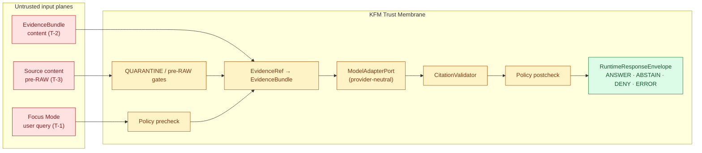

<!-- [KFM_META_BLOCK_V2]
doc_id: kfm://doc/governed-ai/prompt-injection
title: Prompt Injection — Governed AI Defense Doctrine
type: standard
version: v1
status: draft
owners: governed-ai subsystem owner; security steward; docs steward
created: 2026-05-14
updated: 2026-05-14
policy_label: public
related:
  - docs/architecture/governed-ai/README.md
  - docs/architecture/governed-ai/BOUNDARIES.md
  - docs/architecture/governed-ai/STATE_OWNERSHIP.md
  - docs/architecture/governed-ai/ROUTE_MAP.md
  - docs/architecture/governed-ai/CONTINUITY_NOTES.md
  - docs/doctrine/trust-membrane.md
  - docs/doctrine/truth-posture.md
  - docs/security/README.md
tags: [kfm, governed-ai, security, doctrine, prompt-injection]
notes:
  - "Path PROPOSED per Whole-UI + Governed AI Expansion Report; repository not mounted this session."
  - "All implementation-bearing claims (routes, packages, file paths) labeled PROPOSED until verified against mounted-repo evidence."
[/KFM_META_BLOCK_V2] -->

# 🛡️ Prompt Injection — Governed AI Defense Doctrine

> KFM treats prompt injection as a **governance and architecture** problem, not a prompt-engineering problem. Defenses live at the trust membrane, the adapter boundary, and the policy gates — not inside the model.


| Field | Value |
|---|---|
| **Status** | Draft (PROPOSED) |
| **Authority** | Doctrine — implementation-bearing claims remain PROPOSED until repo evidence is mounted |
| **Owners** | governed-AI subsystem owner · security steward · docs steward |
| **Last reviewed** | 2026-05-14 |
| **Supersedes** | None (new doc) |

---

## 📑 Contents

1. [Posture](#1-posture)
2. [Scope and non-goals](#2-scope-and-non-goals)
3. [Threat model](#3-threat-model)
4. [Where injection enters — surfaces and gates](#4-where-injection-enters--surfaces-and-gates)
5. [Defense doctrine — mechanisms mapped to threats](#5-defense-doctrine--mechanisms-mapped-to-threats)
6. [Required behaviors per surface](#6-required-behaviors-per-surface)
7. [Forbidden practices](#7-forbidden-practices)
8. [Validation requirements](#8-validation-requirements)
9. [Incident response and rollback](#9-incident-response-and-rollback)
10. [Open questions and verification backlog](#10-open-questions-and-verification-backlog)
11. [Glossary](#11-glossary)
12. [Related docs](#12-related-docs)

---

## 1. Posture

Prompt injection is the family of inputs — direct or smuggled through content — that try to convert a language model from a **candidate generator** into a **sovereign truth source**. KFM doctrine forecloses that route at the architecture level, not at the prompt: the model is one stage in a governed pipeline, and **EvidenceBundle outranks generated language at every gate**.

The defense, therefore, is not cleverer prompting. It is the same set of invariants KFM applies to every other untrusted input — a trust membrane, fixed contracts, deterministic transforms, policy pre- and postchecks, citation validation, and finite outcomes — applied uniformly to the model adapter.

> [!IMPORTANT]
> **Doctrinal precedence.** A prompt-injection mitigation that depends on the model "behaving correctly" is not a mitigation. Defenses must remain effective even if the model is fully compromised, fully hallucinating, or fully cooperating with the attacker.

A useful framing: in KFM, the model is permitted to be wrong. The governance layer is not. The defenses below preserve that property.

---

## 2. Scope and non-goals

**This document covers** the governed-AI subsystem's posture toward prompt-injection attacks — direct, indirect, and exfiltrative — at every surface where untrusted text can reach a model adapter, and at every surface where model output can reach a public client.

**In scope**

- Focus Mode (user query plane) and any AI-adjacent governed-API surface that accepts free text.
- The evidence plane: any text drawn from `EvidenceBundle` content resolved from an `EvidenceRef` and passed into model context.
- The ingestion plane: pre-RAW and RAW intake of source text that may later become evidence.
- The output plane: response envelopes, exports, telemetry, and any artifact that could leak prompt content, system context, or unsanitized model output.

**Out of scope**

- Model selection, model training, or model fine-tuning. The provider-neutral adapter contract is governed elsewhere; injection robustness must not depend on a specific provider.
- General application security (authn/authz, CORS, rate limits, network egress) — covered under `docs/security/`.
- Operational runbooks for active incidents — operational steps belong in `docs/runbooks/governed_ai_*` and are referenced here, not inlined.

> [!NOTE]
> If a control listed below depends on a route, contract, or test that has not been verified against the mounted repository, it is marked **PROPOSED**. Promotion of a PROPOSED control to CONFIRMED requires actual repo evidence per Directory Rules §0.

---

## 3. Threat model

KFM organizes prompt-injection threats by **where the adversarial text enters the trust membrane**, not by the cleverness of the payload. The threat names below are conventional security vocabulary; the entry points and defenses are KFM-specific.

| # | Threat | How it arrives | Adversary goal | KFM-relevant artifact at risk |
|---|---|---|---|---|
| T-1 | **Direct prompt injection** | Free-text user query at the Focus Mode surface | Override the pinned prompt; force uncited answers; extract system context | `FocusRequest`, `AIReceipt`, `DecisionEnvelope` |
| T-2 | **Indirect injection — in-evidence** | Adversarial text embedded in a source artifact that later resolves through an `EvidenceRef` to an `EvidenceBundle` | Hijack the model during summarization or claim resolution | `EvidenceBundle`, `EvidenceDrawerPayload`, `CitationValidationReport` |
| T-3 | **Indirect injection — connector/tool** | Adversarial text in a connector response, scraped HTML attribute, or third-party API payload | Smuggle instructions during pre-RAW intake | Pre-RAW event family (`event_envelope`, `prefilter_output`, `event_run_receipt`) |
| T-4 | **Prompt-schema attack** | Runtime attempt to alter the pinned prompt template or response format | Strip the "JSON-only / cite-or-abstain" constraints from the request | `prompt_schema_hash`, `AIReceipt.prompt.schema_hash` |
| T-5 | **System-prompt / credential exfiltration** | Output channel | Echo system prompt, secrets, or unpublished evidence back to the user | `RuntimeResponseEnvelope`, telemetry payload |
| T-6 | **Citation forgery** | Output channel | Emit plausible-looking `evidence_ref` IDs that do not resolve, or that resolve outside the policy-allowed scope | `CitationValidationReport` |
| T-7 | **Telemetry exfiltration** | "Safe" telemetry endpoint | Round-trip adversarial content out via logs or analytics | UI telemetry pipeline |
| T-8 | **Replay drift** | Same evidence, prompt, model, and seed produce a different receipt after policy or model swap | Cause silent admissibility drift, then point to old "approved" results | `RunReceipt`, `policy_bundle_hash`, `model_bin_hash` |



> [!NOTE]
> The diagram is **PROPOSED**: it expresses the doctrinal flow defined in the Whole-UI + Governed-AI Expansion Report, not a verified implementation. Module names align with `MapRuntimePort` / `ModelAdapterPort` naming in that report and remain PROPOSED until reconciled with the mounted repo.

---

## 4. Where injection enters — surfaces and gates

Each surface is a place adversarial content can cross or attempt to cross the trust membrane. The doctrine for each is the same: **the surface fails closed unless governed by an explicit, hashable contract.**

### 4.1 User query plane (Focus Mode)

The browser **never** speaks to a model runtime. Free-text queries are submitted to the governed API's Focus route, which performs policy precheck → `EvidenceRef` resolution → adapter call → citation validation → policy postcheck before any envelope leaves the membrane.

- Free-text query is treated as **untrusted input**, not as an instruction to the model.
- The prompt template assembled by the backend is selected by ID and pinned via `prompt_schema_hash`. The user query is inserted into a fixed `USER` slot, never into the `SYSTEM` slot or any field that could rewrite the response contract.
- Length, character class, and unicode normalization (NFC) are enforced server-side before the query is rendered into the template.

### 4.2 Evidence plane

The model never reads raw source text. It receives only fields drawn from the resolved `EvidenceBundle` that the policy precheck has admitted into scope.

- `EvidenceBundle` resolution is the **only** path by which source-derived text enters the prompt context.
- Fields passed into the prompt are explicitly enumerated by the adapter contract — not inferred from the bundle shape.
- Sensitive geometry, restricted rights, and unreviewed content are filtered before bundle resolution returns, not by relying on the model to ignore them.

### 4.3 Ingestion plane (pre-RAW / RAW / QUARANTINE)

Adversarial text injected upstream — in a scraped page, a CSV cell, an HTML attribute, a CDN payload — is captured under the pre-RAW event family long before it can reach a model. Zero-trust ingest, content-addressed staging, and `SourceDescriptor` rights/sensitivity intake apply uniformly.

- External blobs are staged by digest with signed logs **before** transforms.
- Content with unknown rights, undetermined sensitivity, or failed integrity checks is held in `QUARANTINE`. It does not enter `WORK`, `PROCESSED`, or any evidence path.
- Promotion to `EvidenceBundle` is a governed state transition, not a file move; the transition itself emits a `PromotionDecision` with gate results.

### 4.4 Output plane

The output is a `RuntimeResponseEnvelope` carrying one of four finite outcomes plus a `CitationValidationReport`. Raw model text never reaches a public client.

- Public surfaces receive only governed envelopes, released artifacts, evidence references, and policy-safe summaries.
- Telemetry is safe by construction: no raw evidence, no prompt text, no restricted geometry, no secrets, no full `EvidenceBundle` copies.
- Exports preserve citations and manifest/version references; an uncited export is denied at the export gate.

---

## 5. Defense doctrine — mechanisms mapped to threats

The matrix below maps existing KFM mechanisms to the threats from §3. Mechanism names follow established KFM vocabulary; specific file paths remain **PROPOSED** until verified.

| Mechanism | What it does | Threats addressed | Status |
|---|---|---|---|
| **Trust membrane** — public clients use governed APIs only | Denies any browser → model, browser → RAW/WORK/QUARANTINE, browser → canonical store path. | T-1, T-5, T-7 | CONFIRMED doctrine; PROPOSED implementation |
| **Adapter boundary** — `ModelAdapterPort` is the sole module that speaks the provider runtime | Removes the model runtime from the public surface; lets the model be swapped without changing the contract; enables `MockAdapter` for tests. | T-1, T-4, T-5 | PROPOSED |
| **Pinned prompt template + `prompt_schema_hash`** | Every approved prompt is byte-pinned. OPA `deny` fires on `input.prompt.schema_hash != data.allowed.prompt_schema_hash`. | T-4 | CONFIRMED doctrine; PROPOSED implementation |
| **Strict JSON response contract** | The model is instructed to emit only JSON with a fixed schema (`{"decision","confidence","items"}` for prefilter; analogous shapes for Focus Mode). A "prose-leak" check rejects characters outside the outer JSON object. | T-1, T-5 | CONFIRMED doctrine; PROPOSED implementation |
| **Schema validation of model output** | JSON-Schema validation with `additionalProperties: false`, strict enums (`"ALLOW"/"DENY"/"ABSTAIN"/"ERROR"` and `"ANSWER"/"ABSTAIN"/"DENY"/"ERROR"`), bounded numerics. Fail closed on parse error or schema drift. | T-1, T-5, T-6 | CONFIRMED doctrine; PROPOSED implementation |
| **Policy precheck** | Runs before model adapter is invoked. Confirms request scope, source-role admissibility, rights/sensitivity, and `prompt_schema_hash`. | T-1, T-2, T-4 | CONFIRMED doctrine; PROPOSED implementation |
| **`EvidenceRef → EvidenceBundle` resolver** | The only mechanism by which evidence text enters the prompt. Resolves only released, policy-allowed bundles. | T-2 | CONFIRMED doctrine; PROPOSED implementation |
| **`CitationValidator`** | Every cited `evidence_ref` in the model output must resolve to a released `EvidenceBundle` within the policy-allowed scope. Unresolved or out-of-scope refs → DENY/ABSTAIN. | T-6 | CONFIRMED doctrine; PROPOSED implementation |
| **Policy postcheck** | Runs after model adapter. Applies obligations, confidence floor (e.g., `< 0.70 → DENY`), rights re-check, and the "no public model output" rule. | T-5, T-6 | CONFIRMED doctrine; PROPOSED implementation |
| **Finite outcomes** — `ANSWER`/`ABSTAIN`/`DENY`/`ERROR` | The envelope cannot emit a free-form state. There is no "almost answered" path. | T-1, T-2 | CONFIRMED doctrine |
| **`AIReceipt` + `RunReceipt`** | Records prompt schema hash, model bin hash, policy bundle hash, seed, temperature, confidence, citation status, timestamp. Receipts are evidence, not truth. | T-4, T-8 | CONFIRMED doctrine; PROPOSED implementation |
| **DSSE-signed receipts (cosign)** | Tamper detection on the receipt itself; enables replay verification and publication auditability. | T-8 | PROPOSED |
| **Zero-trust ingest** | Sidecar fetch, content-addressed staging, signed logs, short-lived OIDC, license-first checks. | T-3 | CONFIRMED doctrine; PROPOSED implementation |
| **`QUARANTINE` lifecycle phase** | Governed holding state for rights, sensitivity, validation, source-role, evidence, temporal, or policy defects. Adversarial source text never escapes it without a promotion decision. | T-2, T-3 | CONFIRMED doctrine |
| **Telemetry safety contract** | No prompt text, no raw evidence, no restricted geometry, no secrets, no full bundles. | T-5, T-7 | CONFIRMED doctrine; PROPOSED implementation |
| **No-public-model-output rule** | OPA `deny[msg] { input.publication.includes_raw_model_output }`. | T-5 | PROPOSED |

> [!TIP]
> The mechanisms above compose. A successful prompt-injection attack must defeat **every** gate it crosses. The doctrine deliberately rejects single-layer defenses — including any defense that lives inside the prompt text itself.

---

## 6. Required behaviors per surface

### 6.1 Focus Mode (user query plane)

| Required behavior | Rationale | Status |
|---|---|---|
| The browser MUST NOT call a model runtime (Ollama, OpenAI, local llama.cpp, or any other) directly. | Trust membrane; removes T-1, T-5 entry vectors. | CONFIRMED doctrine |
| The Focus route MUST accept user query text only into a fixed `USER` slot of a pinned, hash-identified prompt template. | Closes T-4. | CONFIRMED doctrine |
| The Focus route MUST run `policy precheck` before adapter invocation and `policy postcheck` before envelope return. | Bracketed gating. | CONFIRMED doctrine |
| Adapter invocation MUST use `temperature=0`, fixed `seed`, and the response-format constraint of the provider (e.g., `response_format: {type:"json_object"}`). | Determinism enables replay verification; closes T-8. | CONFIRMED doctrine |
| Output MUST be JSON-Schema-validated with `additionalProperties: false` and strict outcome enum. Fail closed on any deviation. | Closes T-1, T-5. | CONFIRMED doctrine |
| Every cited `evidence_ref` MUST resolve to a released `EvidenceBundle` within policy scope. | Closes T-6. | CONFIRMED doctrine |
| The runtime envelope MUST be one of `ANSWER`, `ABSTAIN`, `DENY`, `ERROR` — no free-form state. | Finite outcomes. | CONFIRMED doctrine |

### 6.2 Evidence plane

| Required behavior | Rationale | Status |
|---|---|---|
| Only fields explicitly enumerated by the adapter contract are passed into prompt context. | Reduces T-2 attack surface to a bounded list. | CONFIRMED doctrine |
| Evidence content fields SHOULD be passed under content-typed wrappers (e.g., role tags, structured fields), not concatenated free-form. | Reduces ambiguity between instructions and content. | PROPOSED |
| `EvidenceBundle` resolution MUST verify release state, policy label, sensitivity, rights, and freshness before content is returned to the adapter. | Sensitive or unreleased content cannot reach the model. | CONFIRMED doctrine |
| `EvidenceRef` IDs cited by the model MUST be validated against the **resolved set** for this request, not against the full registry. | Prevents cross-request reference smuggling (T-6). | PROPOSED |

### 6.3 Ingestion plane

| Required behavior | Rationale | Status |
|---|---|---|
| External fetches MUST occur in a sidecar, with content-addressed staging by digest and signed logs. | Closes T-3 at admission. | CONFIRMED doctrine |
| `SourceDescriptor` MUST record source identity, rights, sensitivity, role (`authority`/`observation`/`context`/`model`), license SPDX, and cadence before any promotion. | Promotion gates have something to fail closed on. | CONFIRMED doctrine |
| Unknown rights, unknown sensitivity, unknown license, or failed integrity → `QUARANTINE`. | Fail-closed default. | CONFIRMED doctrine |
| Pre-RAW event receipts (`event_envelope`, `prefilter_output`, `event_run_receipt`) MUST be emitted for every admission attempt. | Auditability of attempted intake. | CONFIRMED doctrine |
| Promotion from `QUARANTINE` to `WORK` or `PROCESSED` MUST be a `PromotionDecision`, not a file move. | Governance over lifecycle. | CONFIRMED doctrine |

### 6.4 Output plane

| Required behavior | Rationale | Status |
|---|---|---|
| Public clients receive only governed envelopes, released artifacts, evidence references, and policy-safe summaries. | "No raw model output" rule. | CONFIRMED doctrine |
| Telemetry MUST NOT carry prompt text, raw evidence, restricted geometry, secrets, or full `EvidenceBundle` copies. | Closes T-7. | CONFIRMED doctrine |
| Exports MUST preserve citations and manifest/version references; an uncited export is denied at the export gate. | Closes T-5 via the export channel. | CONFIRMED doctrine |
| `RuntimeResponseEnvelope` MUST link to `AIReceipt` and `CitationValidationReport`; receipts are queryable through the review console, not the public client. | Auditability without leakage. | CONFIRMED doctrine; PROPOSED implementation |

---

## 7. Forbidden practices

> [!WARNING]
> **Hard DENY surfaces.** The practices below are not "discouraged." They are violations of governed-AI doctrine and SHOULD be enforced at the policy layer or by code review. Each forbidden practice maps to a threat in §3 and a defense in §5.

- **Direct browser → model calls.** Including direct fetch to Ollama, OpenAI, a local llama.cpp endpoint, or any vector index. The only client of a model runtime is the backend `ModelAdapterPort`.
- **Mixing user input into the `SYSTEM` slot.** Free text from a user, a scraped source, an EvidenceBundle field, or any other untrusted plane MUST NOT be concatenated into a position that can redefine the response contract.
- **Unpinned prompt templates.** Any model invocation whose `prompt_schema_hash` is not present in the allowed bundle SHOULD fail OPA precheck.
- **Free-form outcome states.** Anything other than `ANSWER`/`ABSTAIN`/`DENY`/`ERROR` (runtime) or `ALLOW`/`DENY`/`ABSTAIN`/`ERROR` (governance) emitted by the envelope is invalid.
- **Citing the rendered map or rendered features as evidence.** Rendered features are *selection candidates*; evidence support comes from `EvidenceBundle`. AI answers based only on rendered features must `ABSTAIN` or `DENY`.
- **Raw model output in publication.** Including pass-through summaries, screenshots of model answers, or copy-pasted "AI suggested" text without governed envelope and citation validation.
- **Prompt text or raw evidence in telemetry, logs, or error responses.** Even truncated. Even hashed without canonical normalization. Telemetry is safe by construction or it is denied.
- **Treating an `AIReceipt` as truth.** Receipts record what happened. They do not *make* a claim true. Only the underlying `EvidenceBundle` does.
- **Admin shortcuts that bypass the governed adapter.** Admin tooling MAY exist; it MUST NOT become the normal public path, and it MUST emit its own receipts.
- **Style-only hiding of sensitive geometry as a substitute for redaction.** Style filters do not protect data; if a CARE/locality restriction applies, transform, redact, generalize, restricted-tier, or deny before any public surface receives the geometry.

---

## 8. Validation requirements

> [!IMPORTANT]
> A defense without a negative-path fixture is not a defense. Every mechanism in §5 has at least one fixture in the test plan below.

### 8.1 Negative-path fixtures (required)

The fixture lane proposed by KFM doctrine is `tools/validators/ai/fixtures/{valid,invalid}/`. Each invalid fixture SHOULD produce a `DENY` from the governed pipeline.

| Fixture | Threat | Expected outcome |
|---|---|---|
| `prose_outside_json.json` | T-1, T-5 | DENY |
| `prompt_hash_mismatch.json` | T-4 | DENY |
| `temperature_nonzero.json` | T-8 | DENY |
| `missing_seed.json` | T-8 | DENY |
| `unknown_decision_enum.json` | T-1, T-5 | DENY |
| `confidence_below_floor.json` | T-1 | DENY |
| `confidence_nan.json` | T-1 | DENY |
| `duplicate_item_ids.json` | T-1 | DENY |
| `unresolved_evidence_ref.json` | T-6 | DENY |
| `out_of_scope_evidence_ref.json` | T-6 | DENY |
| `restricted_geometry_payload.json` | T-2, T-5 | DENY |
| `telemetry_contains_prompt_text.json` | T-7 | DENY |
| `raw_model_output_in_publication.json` | T-5 | DENY |
| `injected_user_text_in_system_slot.json` | T-1, T-4 | DENY |
| `quarantined_source_promoted_without_decision.json` | T-3 | DENY |
| `malformed_utf8.json` | T-1, T-3 | DENY |

> All fixture paths are **PROPOSED**. The list above synthesizes the negative-path matrix from KFM's prior governed-AI design memos with the threat model in §3.

### 8.2 Replay verification

The invariant is:

> **same evidence + same prompt + same model + same seed + same policy bundle ⇒ same receipt hash.**

A canonical CI target (PROPOSED) is `make ai-replay-check`, which re-runs the prefilter against a pinned fixture and verifies the receipt's `outputs_checksum` and signature against an expected value.

### 8.3 Policy bundle hashing

`AIReceipt` SHOULD include `policy_bundle_hash`. The same model output under a different policy is **not** the same outcome; the receipt must record which policy approved it.

### 8.4 CI gates (PROPOSED)

```text
ai-prefilter            # produce prefilter_run_receipt.json
ai-replay-check         # diff outputs_checksum against expected
ai-schema-validate      # JSON Schema validation, strict enums
ai-policy-eval          # OPA / conftest, fail closed
ai-attest-sign          # DSSE / cosign on the receipt
ai-citation-validate    # CitationValidationReport must pass for ANSWER
ai-telemetry-safety     # negative fixtures for prompt/evidence leakage
```

---

## 9. Incident response and rollback

> [!CAUTION]
> If a prompt-injection event reaches a release state, treat it as a **governed correction**, not as a hotfix. KFM's correction path preserves auditability; ad-hoc edits do not.

The operational steps belong in a runbook (PROPOSED home: `docs/runbooks/governed_ai_PROMPT_INJECTION_INCIDENT.md`). At the doctrinal level, the response posture is:

<details>
<summary><strong>1. Contain</strong> — disable the affected route or adapter</summary>

- Disable the Focus route via feature flag; the Evidence Drawer and layer browsing remain intact.
- Swap the adapter to `MockAdapter` for any test or sandbox surface.
- Withdraw any released artifact that was generated under the suspect receipt (rollback target → prior `MapReleaseManifest`).

</details>

<details>
<summary><strong>2. Preserve evidence</strong> — receipts, fixtures, and DSSE envelopes are now incident artifacts</summary>

- Capture the offending `AIReceipt`, `RunReceipt`, `CitationValidationReport`, and `PolicyDecision` at their DSSE-signed form.
- Snapshot the active policy bundle hash and prompt schema hash; both are now incident inputs.
- File a `DRIFT_REGISTER` entry referencing the incident.

</details>

<details>
<summary><strong>3. Correct</strong> — issue a CorrectionNotice and invalidate derivatives</summary>

- A `CorrectionNotice` MUST list invalidated derivatives. Tile, style, and catalog caches MUST be invalidated by `cache invalidation record`.
- If the prompt template, schema, or policy bundle is at fault, issue an ADR for the replacement; retain the old artifact with `status: superseded` and a forward link.

</details>

<details>
<summary><strong>4. Rollback</strong> — reversible release pointer</summary>

- Use the `rollback target` recorded in the prior `ReleaseManifest`.
- Verify the rollback restored the prior layer/tile/style/story-node version; emit the rollback receipt.

</details>

<details>
<summary><strong>5. Re-validate</strong> — add a fixture for the realized attack</summary>

- Add a negative-path fixture under `tools/validators/ai/fixtures/invalid/` reproducing the attack class.
- Add an ADR or runbook entry explaining what changed and why.
- Move the verification item from "incident" to the verification backlog if any control remains PROPOSED.

</details>

---

## 10. Open questions and verification backlog

The following items are flagged for verification once repository evidence is mounted. They are not blockers for adopting the doctrine; they are blockers for any claim that the doctrine is **implemented**.

- **NEEDS VERIFICATION** — Whether `apps/governed-api/src/ai/ModelAdapterPort.ts` (or equivalent) exists in the mounted repo, and whether it is the **only** module that imports the model provider SDK.
- **NEEDS VERIFICATION** — Whether `apps/governed-api/src/ai/CitationValidator.ts` (or equivalent) enforces resolution against the **resolved evidence set** for the current request rather than the global registry.
- **NEEDS VERIFICATION** — Whether telemetry middleware on the governed API explicitly strips prompt text and `EvidenceBundle` contents (not just by convention).
- **NEEDS VERIFICATION** — Whether OPA `deny` rules exist for: `temperature != 0`, missing `seed`, missing `model_bin_hash`, unapproved `prompt_schema_hash`, confidence below floor, and `includes_raw_model_output`.
- **NEEDS VERIFICATION** — Whether the pre-RAW event family (`event_envelope`, `prefilter_output`, `event_run_receipt`) is enforced for connector intake, or only for some lanes.
- **UNKNOWN** — Whether DSSE/cosign signing is wired in CI for `AIReceipt` and `RunReceipt`, or only proposed.
- **UNKNOWN** — Whether `policy_label` vocabulary is normalized to a canonical enum (`public`/`open`/`controlled`/`restricted`/`unknown`) across access and publication policies. A prior governance-gap note records this drift risk.
- **PROPOSED** — Whether `EvidenceBundle` content should be passed to the adapter under structured wrappers (role-tagged fields) rather than concatenated text. The doctrine prefers structured wrappers; the implementation choice is open.
- **PROPOSED** — Whether the prompt-template registry lives under `tools/validators/ai/prompts/`, `apps/governed-api/src/ai/prompts/`, or `packages/policy-runtime/prompts/`. Path requires ADR or repo evidence.

> [!NOTE]
> Items in this section MUST migrate into `docs/registers/VERIFICATION_BACKLOG.md` (PROPOSED home) for tracking and SHOULD be closed by a follow-up PR rather than by edits to this doc.

[⬆ Back to top](#-prompt-injection--governed-ai-defense-doctrine)

---

## 11. Glossary

<details>
<summary><strong>KFM-specific terms used in this doc</strong> (expand)</summary>

| Term | Definition (per KFM doctrine) |
|---|---|
| **`AIReceipt`** | AI runtime receipt recording the model/provider, prompt envelope, evidence IDs, policy decisions, output outcome, citation validation, and runtime metadata. Evidence, not truth. |
| **`CitationValidationReport`** | Pass/fail report verifying that every citation in an answer or export resolves to released evidence within policy scope. |
| **`DecisionEnvelope`** | Governed runtime result that wraps the policy decision, the receipt, and evidence references. |
| **`EvidenceBundle`** | Canonical evidence support resolved from an `EvidenceRef`. Outranks UI projection and generated language. |
| **`EvidenceRef`** | Pointer that resolves to an `EvidenceBundle` under the membrane. |
| **Finite outcomes** | `ANSWER` / `ABSTAIN` / `DENY` / `ERROR` (runtime); `ALLOW` / `DENY` / `ABSTAIN` / `ERROR` (governance). No free-form states. |
| **`ModelAdapterPort`** | Provider-neutral model adapter interface; the sole module permitted to import a model runtime SDK. |
| **`MockAdapter`** | Deterministic adapter used for tests, fixtures, and rollback states. |
| **`PolicyDecision`** | Subject/resource/purpose/sensitivity/rights/role decision record with reasons and obligations. |
| **`PromotionDecision`** | Governed state-transition record enumerating Promotion Gates as auditable promotion memory. |
| **`prompt_schema_hash`** | Byte-pinned hash of the approved prompt template. Mismatch → policy DENY. |
| **`QUARANTINE`** | Governed holding state for rights, sensitivity, validation, source-role, evidence, temporal, or policy defects. |
| **`ReleaseManifest`** | Record of published artifact set, digests, policy posture, release state, correction path, and rollback target. |
| **`RollbackCard` / rollback target** | Reversible release pointer to a prior layer/tile/style/story-node version. |
| **`RunReceipt`** | Execution record pinning inputs, outputs, hashes, tool versions, timestamps, failures, policy posture, and evidence refs. |
| **`RuntimeResponseEnvelope`** | Typed governed response with a finite outcome and references to receipts and citation reports. |
| **`SourceDescriptor`** | Versioned source shape recording identity, rights, sensitivity, role, license, cadence. |
| **`spec_hash`** | Canonical hash that pins the spec inputs for replay verification. |
| **Trust membrane** | Boundary ensuring public/UI/AI surfaces consume governed APIs and released artifacts, not raw or internal stores. |

</details>

---

## 12. Related docs

| Path | Relation | Status |
|---|---|---|
| `docs/architecture/governed-ai/README.md` | Subsystem overview and adapter-first runtime boundary | PROPOSED |
| `docs/architecture/governed-ai/BOUNDARIES.md` | No direct model browser call; no RAW/WORK/QUARANTINE; no prompt telemetry leakage | PROPOSED |
| `docs/architecture/governed-ai/STATE_OWNERSHIP.md` | Focus request, evidence retrieval, adapter, citation validation, response envelope state ownership | PROPOSED |
| `docs/architecture/governed-ai/ROUTE_MAP.md` | Focus and AI-adjacent API surfaces | PROPOSED |
| `docs/architecture/governed-ai/CONTINUITY_NOTES.md` | Carries prior governed-AI report forward | PROPOSED |
| `docs/doctrine/trust-membrane.md` | Membrane doctrine across the system | PROPOSED |
| `docs/doctrine/truth-posture.md` | Cite-or-abstain rule | PROPOSED |
| `docs/security/README.md` | Cross-subsystem threat model, exposure posture, incident response | PROPOSED |
| `docs/runbooks/governed_ai_PROMPT_INJECTION_INCIDENT.md` | Operational response runbook for an active incident | TODO — propose in follow-up PR |
| `tools/validators/ai/README.md` | Validator lane for prompt-injection negative fixtures, replay checks, schema validation | PROPOSED |
| `docs/adr/ADR-focus-model-adapter-boundary.md` | ADR for the adapter boundary | PROPOSED |

---

> **Doctrine over polish.** If a prompt-injection control depends on the model behaving correctly, it is not a control. The defenses in this document remain effective even when the model is wrong, hallucinating, or fully cooperating with the attacker.

---

*Last updated: 2026-05-14 — owners: governed-AI subsystem owner · security steward · docs steward.*

[⬆ Back to top](#-prompt-injection--governed-ai-defense-doctrine)
