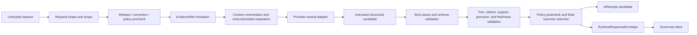

<!-- [KFM_META_BLOCK_V2]
doc_id: kfm://doc/governed-ai/prompt-injection
title: Governed AI — Prompt Injection Threat Model and Defense Boundary
type: architecture-security-standard
version: v2.0.0-draft
status: draft; repository-grounded; bounded-proof-present; end-to-end-defense-hold; no-live-provider; no-release; no-publication
owners:
  - "@bartytime4life — verified CODEOWNERS review route"
  - "NEEDS VERIFICATION — independent governed-AI, Governed API, runtime, evidence, policy, citation, security, privacy, incident-response, correction, and release review"
created: 2026-05-14
updated: 2026-08-20
policy_label: public
owning_root: docs/
current_path: docs/architecture/governed-ai/PROMPT_INJECTION.md
responsibility: >-
  Explain prompt-injection threats at KFM's governed-AI boundary, distinguish current
  bounded repository proof from proposed end-to-end controls, assign authority to the
  correct responsibility roots, and define fail-closed validation, incident, correction,
  rollback, and provider-admission gates without becoming executable security policy.
truth_posture: CONFIRMED current repository evidence / PROPOSED complete defense composition / UNKNOWN deployed and live-provider behavior
repository: bartytime4life/Kansas-Frontier-Matrix
base_commit: 21cdb5ff7d630a39f70fc03d44b31b91eb63b1aa
target_prior_blob: ebc8af5bf8d9937ee0c387b3c022bead10ac8e3c
directory_rules_blob: fd49a0b83e55cef52c1124281f093e263526898d
mock_adapter_blob: 04d37e59b14c9e3b85126cb3380b6221b44e26d1
mock_adapter_test_blob: be1b1d2b4178b30ce9be754671a2c42271ad91bc
ollama_adapter_blob: 1769a719d6a6df53e001abbc4c67ad486ab5c944
runtime_response_schema_blob: 8b86e7db8b18b65a56a4e639dfc54e1b2db93155
ai_receipt_schema_blob: 2e0bebdb3a38acbc3c58a919db46970c6e829b4a
ai_receipt_validator_blob: eb80e77aed15f478c32215c8f773f308a87a092a
evidence_before_model_placeholder_blob: 06b714d90874d69e6ba64cd674ff0c7dfe40e774
governed_api_route_registry_blob: 3418168d0b267160d6ad6dd87f289e880ef4a024
inspection_boundary: >-
  Current-session GitHub reads covered the complete prior target, accepted Directory
  Rules and ADR-0029, CODEOWNERS, governed-AI companion pages, the executable
  MockAdapter and focused tests, the Ollama placeholder, current finite-envelope and
  AIReceipt schemas and validators, the evaluator and AI-output-artifact validators,
  the evidence-before-model placeholder, Focus policy posture, and the Governed API
  route registry. No live model, credential, prompt registry, evidence resolver service,
  active Focus policy evaluator, citation service, tool broker, AIReceipt store, deployed
  Focus route, incident drill, correction propagation, release environment, or public
  transaction was exercised.
related:
  - ./README.md
  - ./BOUNDARIES.md
  - ./FOCUS_FLOW.md
  - ./ADAPTER_CONTRACT.md
  - ./MOCK_FIRST.md
  - ./AI_RECEIPTS.md
  - ./OLLAMA_INTEGRATION.md
  - ./ROUTE_MAP.md
  - ../../adr/ADR-0019-ai-adapter-contract-and-finite-envelopes.md
  - ../../adr/ADR-0029-adopt-directory-governance-standard-v2.md
  - ../../doctrine/ai-build-operating-contract.md
  - ../../doctrine/directory-rules.md
  - ../../security/README.md
  - ../../../runtime/model_adapters/MockAdapter.py
  - ../../../runtime/model_adapters/OllamaAdapter.py
  - ../../../schemas/contracts/v1/runtime/runtime_response_envelope.schema.json
  - ../../../schemas/contracts/v1/runtime/ai_receipt.schema.json
  - ../../../tools/validators/validate_ai_receipt.py
  - ../../../tools/validators/ai/validate_ai_evaluator_harness.py
  - ../../../tools/validators/ai/validate_ai_output_artifact.py
  - ../../../tools/validators/ai/validate_evidence_before_model.py
  - ../../../tests/runtime_proof/test_mock_adapter_finite_outcomes.py
  - ../../../apps/governed-api/src/governed_api/routes/registry.py
tags: [kfm, architecture, governed-ai, security, prompt-injection, trust-boundary, evidence-before-model, finite-outcomes, citation-validation, ai-receipt, fail-closed, correction, rollback]
notes:
  - "v2.0.0-draft replaces a proposal-only memo with a current repository-grounded architecture-security boundary."
  - "This same-path revision changes documentation and its generated authoring receipt only."
  - "It introduces no live attack payload, prompt text, credential, chain-of-thought, protected evidence, or precise sensitive location."
  - "No provider, route, policy bundle, source, runtime, release, deployment, publication, or repository setting is activated."
[/KFM_META_BLOCK_V2] -->

<a id="top"></a>
<a id="-prompt-injection--governed-ai-defense-doctrine"></a>

# Governed AI — Prompt Injection Threat Model and Defense Boundary

> **Operating boundary.** Treat every user string, source fragment, connector result, tool response, model candidate, citation identifier, and provider diagnostic as untrusted data. KFM must remain safe even when a model follows an attacker's instructions perfectly; authority stays in governed composition outside the model.

[](#0-current-repository-checkpoint)
[](#02-current-bounded-proof)
[](#03-current-holds)
[](#03-current-holds)
[](#status-and-authority)

> [!IMPORTANT]
> **Prompt injection is a trust-boundary problem, not a prompt-authoring contest.** The model is an untrusted candidate generator. Evidence resolution, policy, citation validation, final outcome selection, client-envelope construction, correction, release, and rollback remain outside provider control.

> [!CAUTION]
> **Current repository evidence does not establish an operational prompt-injection defense.** It establishes isolated, useful proof for deterministic mock selection, finite envelope shape, AIReceipt shape/local consistency, evaluator fixtures, and inactive AI-output artifact validation. Those pieces are not composed into a live Focus transaction.

> [!WARNING]
> **Do not store or publish raw prompts, adversarial payloads, credentials, private chain-of-thought, protected evidence, or precise sensitive locations in routine fixtures, receipts, logs, screenshots, telemetry, issues, or public diagnostics.** Use synthetic markers and payload-safe findings.

**Quick navigation:** [Checkpoint](#0-current-repository-checkpoint) · [Posture](#1-posture) · [Scope](#2-scope-and-non-goals) · [Threats](#3-threat-model) · [Entry surfaces](#4-where-injection-enters--surfaces-and-gates) · [Defenses](#5-defense-doctrine--mechanisms-mapped-to-threats) · [Required behavior](#6-required-behaviors-per-surface) · [Forbidden practices](#7-forbidden-practices) · [Validation](#8-validation-requirements) · [Incident and rollback](#9-incident-response-and-rollback) · [Open work](#10-open-questions-and-verification-backlog) · [Glossary](#11-glossary) · [Related](#12-related-docs)

---

<a id="0-current-repository-checkpoint"></a>

## 0. Current repository checkpoint

<a id="status-and-authority"></a>

### Status and authority

| Question | Current evidence-backed answer |
|---|---|
| Is this a tracked architecture document? | **CONFIRMED.** The target exists at this path and the prior blob is pinned above. |
| Is same-path placement valid? | **CONFIRMED.** Accepted ADR-0029 adopts Directory Rules v2; this remains a human architecture-security explanation under `docs/`. |
| Is this executable security policy? | **No.** Contracts own meaning, schemas own shape, policy owns admissibility, runtime/app roots own execution, and release objects own public-use decisions. |
| Is a Focus/model route registered? | **No at the pinned base.** The inspected registry contains bootstrap, layers, and evidence routes only. |
| Is a production provider implemented? | **No verified implementation.** `OllamaAdapter.py` is a one-line placeholder. |
| Is prompt/profile identity enforced? | **Not established.** No executable prompt registry or hash-verification path was verified. |
| Is evidence-before-model enforced? | **No.** The named validator is a short `PROPOSED` placeholder. |
| Is Focus policy active? | **No verified activation.** The repository-present lane is documented as scaffold/inactive. |
| Is there bounded executable proof? | **Yes.** Mock selection, finite-envelope shape, AIReceipt shape/local consistency, evaluator fixtures, and inactive AI-output artifact checks are independently testable. |
| Does this page release or publish anything? | **No.** It changes documentation and authoring provenance only. |

### Directory Rules basis

The current path receives `PLACE` because it explains architecture and security to humans without owning machine authority.

| Responsibility | Owning surface | This page may do |
|---|---|---|
| Threat model and architecture explanation | `docs/architecture/governed-ai/` | Explain current evidence, target controls, failures, review burden, and open gates. |
| Semantic object meaning | `contracts/` | Link and summarize; never redefine silently. |
| Machine grammar | `schemas/` | Cite current shapes; never add prose-only fields to closed profiles. |
| Admission and obligations | `policy/` | State required checks; never claim a decision executed. |
| Provider and tool execution | approved runtime/app/package lanes | Record maturity and required boundaries. |
| Tests and validators | `fixtures/`, `tests/`, `tools/`, `.github/` | Cite bounded proof and define missing exact-negative proof. |
| Receipts, evidence, release, correction | their governed object families | Preserve separation and fail closed. |

<a id="01-what-changed"></a>

### 0.1 What changed from the prior edition

The prior page had a sound central principle but mixed doctrine, future design, and implementation claims. This edition:

- removes unsupported claims that prompt hashes, provider parameters, confidence thresholds, active citation services, active Focus policy, signed runtime receipts, and incident runbooks already form one defense;
- narrows `MockAdapter` to its verified deterministic fixture-selector role;
- records the absent Focus route, provider placeholder, inactive policy, and evidence-before-model placeholder;
- preserves the closed RuntimeResponseEnvelope and nine-field AIReceipt profiles rather than inventing fields;
- defines a complete target control chain as **PROPOSED**, with explicit HOLDs and graduation evidence.

<a id="02-current-bounded-proof"></a>

### 0.2 Current bounded proof

| Surface | What current bytes prove | What they do **not** prove |
|---|---|---|
| `MockAdapter.py` and focused tests | Deterministic deep-copy selection from a complete synthetic four-outcome matrix; no filesystem, network, clock, randomness, secrets, or dynamic execution | Request interpretation, injection detection, evidence resolution, policy, citations, provider safety, or receipt emission |
| RuntimeResponseEnvelope schema/fixtures | Closed client shape with `ANSWER`, `ABSTAIN`, `DENY`, and `ERROR`; answer-only evidence/precision requirements | Correct semantic outcome, authentic evidence, policy permission, or public safety |
| AIReceipt schema/validator/tests | Closed nine-field shape and limited local consistency with payload-safe findings | Prompt identity, evidence closure, policy/citation authentication, signing, persistence, retention, release, or truth |
| AI evaluator harness | Deterministic fixture replay; network-enabled or nondeterministic records fail closed | A live provider, request pipeline, or Focus policy evaluator |
| AI output artifact validator | Strict checks for inactive per-input artifact and batch profiles, lineage, refs, hashes, and governance non-effects | Active generation, client delivery, injection resistance, or publication |
| Focus workflow | Static readiness plus finite-envelope/mock proof; explicit mock-Focus HOLD | An executable end-to-end Focus runtime |

<a id="03-current-holds"></a>

### 0.3 Current HOLDs

Before a live provider or public AI route, KFM needs reviewed and executable proof for:

- bounded caller request, minimized adapter input, structured candidate, and client envelope;
- release/correction/scope/policy checks before provider invocation;
- instruction-versus-data separation and context minimization;
- independent tool capability validation with no model-owned authorization;
- structural candidate parsing before any output reaches a public projection;
- citation/support validation against the request's admitted evidence set;
- post-model policy and finite outcome selection outside provider control;
- minimized receipt emission and protected persistence;
- synthetic direct and indirect injection fixtures with exact-negative assertions;
- resource budgets, cancellation, safe logging, monitoring, kill switch, incident response, correction, rollback, hosted exact-head validation, and independent security review.

[Back to top](#top)

---

<a id="1-posture"></a>

## 1. Posture

Prompt injection is any attempt to make untrusted content change the authority, instruction, capability, disclosure, or output boundaries of an AI-mediated operation. It can be direct or carried indirectly through evidence, source material, connector/tool results, metadata, filenames, markup, prior generated text, or provider diagnostics.

The governing assumption is stronger than “the model may misunderstand”: **assume the model can be fully manipulated**. A control is valid only when it remains effective outside the model.

KFM therefore separates:

```text
untrusted content
  -> governed admission and context construction
  -> provider-neutral adapter
  -> untrusted structured candidate
  -> independent support, policy, and disclosure checks
  -> finite RuntimeResponseEnvelope
```

EvidenceBundle outranks generated language. A receipt records what occurred; it does not make the output true. A schema validates shape; it does not authenticate evidence or policy. A green test proves only its declared scope.

[Back to top](#top)

---

<a id="2-scope-and-non-goals"></a>

## 2. Scope and non-goals

### In scope

- direct free-text requests and multi-turn state;
- indirect content from released evidence, sources, connectors, tools, metadata, markup, and prior outputs;
- provider input/output, tool-call candidates, citations, logs, receipts, telemetry, exports, review surfaces, and public projections;
- builder-side AI where repository content itself may contain hostile instructions;
- correction, withdrawal, rollback, provider disablement, and incident evidence preservation.

### Out of scope

This page does not:

- publish operational attack payloads or system prompts;
- claim prompt wording alone provides security;
- define provider selection or admit a model;
- create contracts, schemas, policy, fixtures, validators, routes, workers, stores, release records, or runbooks;
- replace broader authentication, authorization, rate-limit, dependency, secret, network, or infrastructure security controls;
- authorize live source access, release, deployment, publication, or repository-setting changes.

[Back to top](#top)

---

<a id="3-threat-model"></a>

## 3. Threat model

| ID | Threat | Entry path | Required failure posture |
|---|---|---|---|
| `PI-01` | Direct instruction override | User request or conversation state | Treat as data; preserve system/capability boundaries; finite non-answer when unsafe |
| `PI-02` | Indirect evidence/source injection | Evidence fragment, document, markup, metadata, filename | Keep source content typed as data; do not execute embedded instructions |
| `PI-03` | Connector/tool-result injection | API result, scrape, retrieval result, tool output | Revalidate every proposed action; tool output carries no authority |
| `PI-04` | Tool escalation | Candidate requests unauthorized tool, scope, target, or argument | Deny outside allowlist/capability/purpose; model cannot grant itself authority |
| `PI-05` | Citation fabrication or smuggling | Candidate cites unknown, global, stale, corrected, or out-of-scope refs | Block `ANSWER`; validate against admitted request evidence |
| `PI-06` | Sensitive-data exfiltration | Candidate, diagnostic, error, log, receipt, export, telemetry | Redact or deny; protected input must not be echoed |
| `PI-07` | Configuration tampering | Prompt/profile/provider/tool/policy identity changes | Reject unapproved or floating identity; require reviewed change lineage |
| `PI-08` | Parser/schema confusion | Prose leakage, duplicate keys, non-finite values, extra fields, oversized output | Parse strictly; fail closed with payload-safe findings |
| `PI-09` | Replay and stale-state abuse | Old evidence, policy, correction, model, or receipt reused as current | Bind current identities and states; reject revoked/superseded/stale support |
| `PI-10` | Resource amplification | Runaway context, recursion, tool loops, output, or cost | Enforce budgets, timeout, cancellation, and finite failure outside provider control |
| `PI-11` | Cross-scope contamination | Prior user/feature/domain context leaks into current request | Bind request, actor, audience, geography, time, feature, and admitted refs |
| `PI-12` | Public-path bypass | Browser/provider, browser/internal store, raw candidate/public response | Deny normal-path bypass; use Governed API and governed envelopes only |

Threat status is **PROPOSED** as a complete profile; current repository bytes do not yet prove all entry paths or controls.

[Back to top](#top)

---

<a id="4-where-injection-enters--surfaces-and-gates"></a>

## 4. Where injection enters — surfaces and gates


```mermaid
flowchart LR
  A[Untrusted request] --> B[Request shape and scope]
  B --> C[Release / correction / policy precheck]
  C --> D[EvidenceRef resolution]
  D --> E[Context minimization and instruction/data separation]
  E --> F[Provider-neutral adapter]
  F --> G[Untrusted structured candidate]
  G --> H[Strict parse and schema validation]
  H --> I[Tool, citation, support, precision, and freshness validation]
  I --> J[Policy postcheck and finite outcome selection]
  J --> K[AIReceipt candidate]
  J --> L[RuntimeResponseEnvelope]
  L --> M[Governed client]
```

The flow is **PROPOSED**. Required gate ownership:

| Gate | Owner outside the model | Injection rule |
|---|---|---|
| Request and scope | Governed API/orchestration | User text cannot rewrite operation, role, resource, or response grammar |
| Release/correction/policy precheck | Release/evidence/policy services | Do not call provider when support is inadmissible |
| Evidence resolution | Evidence service | Admit only released, authorized, task-relevant fragments |
| Context construction | Orchestration | Separate instructions from data structurally; minimize context |
| Adapter | Runtime/provider lane | Translate and invoke; return candidate only |
| Tool broker | Capability/runtime policy | Validate every call independently; no candidate-owned authority |
| Structural validation | Schema/validator lane | Strict parser, closed fields, bounded sizes, payload-safe errors |
| Citation/support validation | Evidence/citation lane | Resolve request-local support and verify claim coverage |
| Postcheck/outcome | Policy/orchestration | Select finite public outcome outside provider control |
| Receipt and client projection | Receipt/API/UI lanes | Persist minimum accountability; never expose raw candidate or protected content |

[Back to top](#top)

---

<a id="5-defense-doctrine--mechanisms-mapped-to-threats"></a>

## 5. Defense doctrine — mechanisms mapped to threats

| Mechanism | Primary threats | Current status |
|---|---|---|
| Governed API trust membrane; no browser-to-provider/internal-store path | `PI-01`, `PI-06`, `PI-12` | CONFIRMED doctrine; end-to-end runtime HOLD |
| Evidence before model | `PI-02`, `PI-05`, `PI-09`, `PI-11` | Named placeholder only |
| Instruction/data separation and context minimization | `PI-01`, `PI-02`, `PI-03` | PROPOSED |
| Provider-neutral adapter returning candidate, not public envelope | `PI-01`, `PI-07`, `PI-12` | Bounded MockAdapter proof; production seam PROPOSED |
| External tool broker with allowlisted operations and arguments | `PI-03`, `PI-04`, `PI-10` | UNKNOWN |
| Strict closed candidate and client schemas | `PI-08`, `PI-12` | Finite client envelope proved; adapter-candidate profile NEEDS VERIFICATION |
| Request-local citation/support validation | `PI-05`, `PI-09`, `PI-11` | Contract/schema surface present; service UNKNOWN |
| Policy precheck and postcheck | `PI-01`, `PI-04`, `PI-06`, `PI-12` | Focus lane inactive/scaffold |
| Finite outcomes outside provider control | all | Closed envelope profile and mock proof present; semantic orchestration HOLD |
| Minimal AIReceipt and safe diagnostics | `PI-06`, `PI-07`, `PI-09` | Nine-field shape/local validator present; emission/store UNKNOWN |
| Resource budgets and cancellation | `PI-10` | UNKNOWN |
| Synthetic exact-negative fixtures and stage-order proof | all | PROPOSED follow-on |
| Correction, provider disablement, route kill switch, rollback | `PI-06`, `PI-07`, `PI-09`, `PI-12` | Required doctrine; operational proof UNKNOWN |

### Defense invariants

1. No model output becomes policy, evidence, citation closure, release, or publication authority.
2. No tool operation runs merely because the model requested it.
3. No citation is trusted because it looks plausible.
4. No protected input is echoed in a public error or receipt.
5. No schema-valid object is treated as semantically valid without owning checks.
6. No fifth public outcome is admitted beyond `ANSWER`, `ABSTAIN`, `DENY`, and `ERROR`.
7. No provider/profile enters service without reviewed identity, capability, tests, disablement, and rollback.

[Back to top](#top)

---

<a id="6-required-behaviors-per-surface"></a>

## 6. Required behaviors per surface

### Request and conversation state

- Normalize and bound operation, actor, audience, geography, time, feature, domain, and allowed evidence references.
- Treat request text as data, not as permission or configuration.
- Bind every turn to one explicit request identity and prevent cross-user/cross-feature state reuse.
- Deny unknown operations; do not silently broaden scope.

### Evidence and retrieved content

- Resolve `EvidenceRef` through the governed evidence boundary before provider invocation.
- Admit only released, current, authorized, task-relevant fragments.
- Preserve source and field boundaries; do not concatenate content into system instructions.
- Apply rights, sensitivity, precision, freshness, correction, supersession, and revocation checks before context assembly.

### Adapter and provider

- Accept only a minimized, contract-shaped internal request.
- Return an untrusted candidate, not a public response or policy decision.
- Have no direct access to credentials, lifecycle stores, release state, or unrestricted tools.
- Enforce timeout, cancellation, size, recursion, and resource budgets outside the provider.
- Produce safe failure categories without echoing provider payloads.

### Tools and connectors

- Require a reviewed capability ID, operation, target, purpose, argument schema, and actor context for each call.
- Validate a call independently of model text before execution and validate the result before reuse.
- Deny shell, filesystem, network, secret, source-activation, release, publication, and settings operations unless explicitly admitted for the operation.
- Prevent connector/tool responses from changing instruction or capability boundaries.

### Candidate, citations, and public response

- Parse with duplicate-key and non-finite-number rejection, closed fields, bounded arrays/text, and size limits.
- Validate citations against the admitted evidence set for this request, not a global registry alone.
- Require claim-level support for `ANSWER`; unsupported candidates become `ABSTAIN` or `DENY` according to the owning policy.
- Select the finite outcome and build RuntimeResponseEnvelope outside provider control.
- Return no raw provider stream, hidden reasoning, prompt, or protected context to clients.

### Receipts, logs, and telemetry

- Record minimum stable identities, digests, refs, and finite outcome required by the accepted profile.
- Do not add unreviewed fields to the closed AIReceipt schema.
- Do not store prompt text, adversarial payloads, credentials, chain-of-thought, raw evidence, or precise sensitive locations.
- Keep payload-safe reason codes and findings separate from sensitive incident evidence.

[Back to top](#top)

---

<a id="7-forbidden-practices"></a>

## 7. Forbidden practices

- Direct browser-to-model, browser-to-tool, browser-to-policy, browser-to-lifecycle-store, or browser-to-canonical-store calls in the normal public path.
- Concatenating user, evidence, connector, tool, metadata, or prior-output text into authority-bearing instructions.
- Allowing the model to choose its role, provider, prompt/profile, evidence scope, tools, policy, public outcome, or release state.
- Treating temperature, seed, model confidence, or a “follow system instructions” prompt as a security boundary.
- Passing tool calls through without capability, target, argument, and purpose validation.
- Accepting fabricated, global, stale, corrected, revoked, or out-of-scope citations.
- Returning raw model text when candidate parsing, citation validation, policy, or receipt construction fails.
- Logging or publishing protected content, system prompts, credentials, payloads, or chain-of-thought.
- Treating MockAdapter success, schema validity, an AIReceipt, a workflow badge, or this document as end-to-end defense proof.
- Activating a provider, route, source, or public operation from a documentation-only change.

[Back to top](#top)

---

<a id="8-validation-requirements"></a>

## 8. Validation requirements

> [!IMPORTANT]
> A control without exact-negative proof is not established. Tests must prove both the required outcome and the absence of forbidden calls, fields, disclosures, and side effects.

### Required synthetic fixture classes

| Fixture class | Expected proof |
|---|---|
| Direct instruction override marker | Candidate cannot alter operation, authority, tool set, or response grammar |
| Instruction-like evidence fragment | Fragment remains typed data; no embedded instruction is executed |
| Hostile connector/tool result | Result cannot grant capability or change context authority |
| Unauthorized tool-call candidate | Tool broker denies; no tool invocation occurs |
| Fabricated/out-of-scope/stale/corrected citation | `ANSWER` is impossible; safe finite result returned |
| Protected-marker exfiltration attempt | Marker absent from response, receipt, logs, telemetry, and diagnostics |
| Duplicate key, extra field, non-finite value, oversized or malformed candidate | Structural validation fails closed before public projection |
| Cross-request reference or conversation reuse | Scope binding rejects contamination |
| Runaway tool/context/output request | Budget/cancellation produces safe bounded failure |
| Provider/profile identity mismatch | Invocation denied before provider call |

### Stage-order and exact-negative assertions

A future runner must prove:

1. policy/release/evidence denial prevents adapter invocation;
2. adapter invocation cannot occur without minimized admitted context;
3. tool execution cannot occur without broker approval;
4. failed parsing prevents citation and public response construction;
5. failed citation/support validation prevents `ANSWER`;
6. protected markers never appear in public artifacts or routine accountability records;
7. negative outcomes contain no answer payload or precision disclosure;
8. one final envelope and one bounded accountability record are emitted where required;
9. reruns are deterministic for the fixture profile;
10. the suite performs no network access and no provider call.

### Graduation gates

A live provider/route remains on HOLD until all are reviewed:

- accepted object boundaries and schemas;
- admitted provider/profile and prompt/config identity;
- evidence, policy, citation, tool, and receipt composition;
- positive and exact-negative fixtures;
- no-network deterministic suite plus bounded live-provider evaluation in a non-public environment;
- security/privacy/threat-model review;
- safe telemetry, retention, incident, kill-switch, correction, and rollback proof;
- hosted exact-head checks and independent reviewer disposition.

[Back to top](#top)

---

<a id="9-incident-response-and-rollback"></a>

## 9. Incident response and rollback

An injection event is a security and governance incident when it causes or attempts unauthorized capability use, disclosure, citation support, public outcome, release, or publication.

### Minimum incident sequence

1. **Contain** — disable the affected provider/profile/route/tool capability without weakening non-AI evidence browsing.
2. **Preserve** — retain minimized request/candidate digests, refs, policy/citation decisions, safe findings, version identities, and access records under incident controls.
3. **Assess** — identify exposed users, evidence, tools, artifacts, releases, caches, exports, and downstream consumers.
4. **Correct** — issue correction, supersession, withdrawal, credential rotation, cache invalidation, or release rollback through owning processes.
5. **Reproduce safely** — add a synthetic fixture that captures the attack class without persisting operational payload or protected content.
6. **Revalidate** — rerun focused, regression, security, correction, and rollback proof before re-enablement.
7. **Review** — record root cause, control failure, reviewer disposition, and residual risk.

### Rollback targets

| Surface | Rollback action |
|---|---|
| Provider/profile | Disable or restore the exact reviewed identity |
| Tool capability | Revoke capability and affected credentials/tokens |
| Runtime/API route | Disable or revert route while preserving safe non-AI paths |
| Policy/configuration | Restore prior reviewed bundle/profile and re-evaluate affected results |
| Public AI artifact | Withdraw or supersede and propagate correction state |
| Release | Use the owning release rollback target; a documentation revert is not a release rollback |

This page does not claim an operational runbook exists; incident ownership and drill evidence remain **NEEDS VERIFICATION**.

[Back to top](#top)

---

<a id="10-open-questions-and-verification-backlog"></a>

## 10. Open questions and verification backlog

- **NEEDS VERIFICATION:** accepted request, adapter-input, candidate, tool-call, citation-report, receipt-linkage, and client-envelope contract/schema convergence.
- **UNKNOWN:** executable EvidenceRef resolver and pre-model release/correction/policy/scope service.
- **UNKNOWN:** active claim-level citation/support validator and Focus policy evaluator binding.
- **UNKNOWN:** tool capability registry, broker, runtime egress/filesystem/secret restrictions, and provider budgets.
- **UNKNOWN:** prompt/profile/configuration identity, approval, change control, and rollback without storing raw prompts in receipts.
- **UNKNOWN:** AIReceipt emission, persistence, retention, access, signing, correction, and query behavior.
- **NEEDS VERIFICATION:** final synthetic fixture and runner home, payload-safe reason codes, client projection convergence, and correction consumer inventory.
- **NEEDS VERIFICATION:** incident owner, kill-switch operator, independent security reviewer, required hosted checks, and provider-admission approval route.

### Recommended smallest follow-on slice

**PROPOSED:** one deterministic, no-network stage-order and injection-containment proof using synthetic markers only. It should preserve current RuntimeResponseEnvelope and AIReceipt shapes, prove pre-model denial prevents adapter invocation, prove instruction-like evidence remains data, prove fabricated/out-of-scope citations prevent `ANSWER`, prove protected markers never enter public diagnostics or receipts, and introduce no live provider, route, source activation, release, or publication.

[Back to top](#top)

---

<a id="11-glossary"></a>

## 11. Glossary

| Term | Meaning |
|---|---|
| Prompt injection | Untrusted content attempting to change authority, instructions, tools, disclosure, or output boundaries. |
| Direct / indirect injection | Attack supplied by the requester / carried through sources, evidence, connectors, tools, metadata, or prior output. |
| Instruction/data separation | Structural boundary preventing content from becoming authority-bearing configuration; prose delimiters alone are insufficient. |
| Context minimization | Supplying only released, authorized, task-relevant fragments and metadata. |
| Model adapter | Provider translation/invocation boundary returning an untrusted candidate; owns no evidence, policy, citation, release, or public outcome authority. |
| Tool broker | External capability gate validating every proposed operation independently of the model. |
| Candidate | Untrusted provider output awaiting structural, support, freshness, correction, precision, and policy checks. |
| Exact-negative test | Proof that a forbidden call, field, disclosure, route, state, or side effect did not occur. |
| Safe diagnostic | Bounded finding identifying failure class without echoing untrusted or protected content. |
| AIReceipt | Bounded accountability trace; not evidence truth, policy permission, review, release, or publication. |
| Kill switch | Reversible control disabling a provider, profile, route, or tool without rewriting history. |

[Back to top](#top)

---

<a id="12-related-docs"></a>

## 12. Related docs

| Path | Relation | Current posture |
|---|---|---|
| [`README.md`](README.md) | Governed-AI overview and maturity map | Repository-present; verify against implementation |
| [`BOUNDARIES.md`](BOUNDARIES.md) | AI authority and trust-membrane boundaries | Architecture companion |
| [`FOCUS_FLOW.md`](FOCUS_FLOW.md) | Bounded client proof and proposed server orchestration | Live server transaction HOLD |
| [`ADAPTER_CONTRACT.md`](ADAPTER_CONTRACT.md) | Bounded MockAdapter proof and proposed provider-neutral seam | Production seam PROPOSED |
| [`MOCK_FIRST.md`](MOCK_FIRST.md) | Deterministic mock discipline and graduation gates | End-to-end Focus runtime HOLD |
| [`AI_RECEIPTS.md`](AI_RECEIPTS.md) | Current AIReceipt shape and accountability limits | Operational emitter/store HOLD |
| [`OLLAMA_INTEGRATION.md`](OLLAMA_INTEGRATION.md) | Local-provider integration proposal | Reconcile before operational use |
| [`ROUTE_MAP.md`](ROUTE_MAP.md) | Governed-AI-adjacent route architecture | Verify against executable registry |
| [ADR-0019](../../adr/ADR-0019-ai-adapter-contract-and-finite-envelopes.md) | Adapter and finite-envelope decision | Proposed; this page does not accept it |
| [ADR-0029](../../adr/ADR-0029-adopt-directory-governance-standard-v2.md) | Directory placement authority | Accepted |
| [AI Build Operating Contract](../../doctrine/ai-build-operating-contract.md) | Builder-side untrusted-content law | Doctrine; not runtime proof |
| [Security overview](../../security/README.md) | Broader exposure, security, and incident context | Operational maturity requires verification |

### Change discipline and rollback

This revision changes one explanatory document and its generated authoring receipt only. It does not alter contracts, schemas, policy, fixtures, validators, tests, workflows, providers, runtime, routes, tools, data, runtime-emitted receipts, evidence, release state, deployment, publication, or repository settings.

Before merge, rollback is closing the draft pull request or reverting the feature branch. After an authorized merge, revert the document and authoring receipt through normal reviewed Git history. No data migration, provider shutdown, cache invalidation, release withdrawal, or public correction is required for this documentation-only change.

---

> **Final rule.** Assume the provider can be manipulated. Keep authority, capabilities, evidence, citations, policy, finite outcomes, receipts, correction, release, and rollback outside it—and prove every boundary with exact-negative tests before admitting a live route.

[Back to top](#top)
