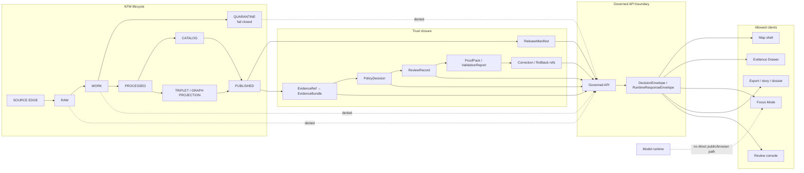

<!-- [KFM_META_BLOCK_V2]
doc_id: kfm://doc/NEEDS_VERIFICATION__docs_architecture_governed_api
title: Governed API
type: standard
version: v1
status: draft
owners: NEEDS_VERIFICATION__governed_api_owner
created: NEEDS_VERIFICATION__YYYY-MM-DD
updated: 2026-05-06
policy_label: NEEDS_VERIFICATION__public_or_restricted
related: [../../README.md, README.md, ../adr/ADR-0202-governed-api-path-canonicalization.md, ../../contracts/api/README.md, ../../contracts/runtime/governed_api_mock_payloads.md, ../../fixtures/api/governed_api_mock_payloads.json, ../../apps/api/README.md, ../../apps/api/server.py, ../../apps/api/ecology/README.md, ../../apps/web/src/api/governedClient.js, ../../tools/ci/check_governed_api_path_policy.py]
tags: [kfm, architecture, governed-api, trust-membrane, evidence, policy, runtime-envelope, focus-mode, evidence-drawer]
notes: [Repo-ready revision for docs/architecture/governed-api.md. Owners, created date, policy label, and final doc_id require maintainer verification. Current repo evidence confirms related files on main, but tests, CI pass state, deployment posture, branch protections, and production runtime behavior remain NEEDS VERIFICATION.]
[/KFM_META_BLOCK_V2] -->

<a id="top"></a>

# Governed API

The governed API is KFM’s trust membrane: the boundary where public, steward-facing, map, Evidence Drawer, Focus Mode, review, export, and diagnostic clients receive release-aware, evidence-resolving, policy-checked responses instead of raw data, direct model output, or unpublished project state.

<p align="center">
  
  
  
  
  
</p>

<p align="center">
  <a href="#architecture-rule">Architecture rule</a> ·
  <a href="#repo-fit">Repo fit</a> ·
  <a href="#current-evidence-snapshot">Evidence snapshot</a> ·
  <a href="#inputs-and-exclusions">Inputs & exclusions</a> ·
  <a href="#trust-flow">Trust flow</a> ·
  <a href="#contract-surface">Contract surface</a> ·
  <a href="#route-families">Route families</a> ·
  <a href="#path-canonicalization">Path canonicalization</a> ·
  <a href="#focus-mode-and-governed-ai">Focus Mode</a> ·
  <a href="#validation-gates">Validation gates</a> ·
  <a href="#open-verification">Open verification</a>
</p>

> [!IMPORTANT]
> **Status:** `draft`  
> **Owners:** `NEEDS_VERIFICATION__governed_api_owner`  
> **Path:** `docs/architecture/governed-api.md`  
> **Owning root:** `docs/` — the human-facing control plane.  
> **Current posture:** `CONFIRMED` architecture and adjacent repo evidence; `NEEDS VERIFICATION` for route parity, schema enforcement, CI pass state, production deployment, owners, policy label, and release maturity.

---

## Architecture rule

The governed API is not a generic backend. It is the controlled boundary where KFM turns released or review-authorized evidence into finite, policy-aware response envelopes.

KFM’s lifecycle remains the governing path:

```text
RAW -> WORK / QUARANTINE -> PROCESSED -> CATALOG / TRIPLET -> PUBLISHED
```

Normal public and ordinary UI clients must use governed APIs, released artifacts, catalog records, tile services, and `EvidenceBundle` resolution. They must not directly read or depend on:

- `RAW`, `WORK`, or `QUARANTINE` lifecycle stores;
- unpublished candidate data;
- canonical or restricted internal stores;
- source-system side effects;
- graph projections or vector/search indexes as truth;
- direct model runtime output;
- local filesystem paths, secrets, internal service handles, or unreviewed diagnostic detail.

The governing principle is simple:

> A KFM response may make a consequential public or semi-public claim only when it is downstream of evidence, source role, policy, review, release state, correction lineage, and rollback support appropriate to the consequence of the claim.

[Back to top](#top)

---

## Repo fit

**Path:** `docs/architecture/governed-api.md`  
**Role:** cross-cutting architecture note for the governed API trust membrane  
**Audience:** maintainers, API implementers, UI engineers, policy reviewers, domain-lane authors, release reviewers, and governed-AI contributors

This file explains the system boundary. It does not own route code, machine schemas, policy rules, source data, release artifacts, emitted proof objects, or UI implementation.

| Direction | Path | Relationship | Status |
|---|---|---|---|
| Architecture index | [`README.md`](README.md) | Local architecture landing page and cross-domain architecture rules. | CONFIRMED file exists. |
| Project landing page | [`../../README.md`](../../README.md) | Repo-wide trust law, responsibility roots, and object-family posture. | CONFIRMED file exists. |
| API contract lane | [`../../contracts/api/README.md`](../../contracts/api/README.md) | Human-readable governed API request/response semantics. | CONFIRMED file exists. |
| Mock payload contract | [`../../contracts/runtime/governed_api_mock_payloads.md`](../../contracts/runtime/governed_api_mock_payloads.md) | Documents no-network mock payload examples. | CONFIRMED file exists. |
| Mock payload fixture | [`../../fixtures/api/governed_api_mock_payloads.json`](../../fixtures/api/governed_api_mock_payloads.json) | Synthetic examples for health, Focus Mode, and Evidence Drawer payloads. | CONFIRMED file exists. |
| Runtime API app README | [`../../apps/api/README.md`](../../apps/api/README.md) | Runtime-boundary README with strong verification caveats. | CONFIRMED file exists. |
| Current API server file | [`../../apps/api/server.py`](../../apps/api/server.py) | Minimal FastAPI-style ecology/public-safe dry-run server evidence. | CONFIRMED file exists; execution not verified here. |
| Ecology API boundary README | [`../../apps/api/ecology/README.md`](../../apps/api/ecology/README.md) | Ecology EvidenceBundle resolver and proof-pack boundary guidance. | CONFIRMED file exists; implementation status remains cautious. |
| Browser API client | [`../../apps/web/src/api/governedClient.js`](../../apps/web/src/api/governedClient.js) | Web-side governed API client wrapper. | CONFIRMED file exists. |
| Path-policy ADR | [`../adr/ADR-0202-governed-api-path-canonicalization.md`](../adr/ADR-0202-governed-api-path-canonicalization.md) | Accepted canonical/legacy governed API implementation path decision. | CONFIRMED file exists. |
| Path-policy checker | [`../../tools/ci/check_governed_api_path_policy.py`](../../tools/ci/check_governed_api_path_policy.py) | Enforces canonical governed API path and legacy shim policy. | CONFIRMED file exists; CI pass state NEEDS VERIFICATION. |

> [!NOTE]
> This file intentionally lives in `docs/architecture/`, not under a new root-level API or domain folder. KFM root folders are responsibility boundaries; `docs/architecture/` is the cross-domain human architecture surface.

[Back to top](#top)

---

## Current evidence snapshot

The current repository evidence supports a stronger governed API architecture document, but it does not support overclaiming production readiness.

| Evidence | CONFIRMED from repo inspection | Still NEEDS VERIFICATION |
|---|---|---|
| `README.md` | The repo describes KFM as a governed, evidence-first, map-first, time-aware spatial knowledge and publication system centered on inspectable claims. | Whether every root README claim has matching implementation, tests, and release proof. |
| `docs/architecture/README.md` | Architecture docs are framed as cross-domain system-boundary documentation, with trust-law and evidence-first posture. | Full architecture inventory, owners, policy labels, and CI enforcement. |
| `contracts/api/README.md` | API contracts are described as human-readable governed API semantics with finite outcomes and trust-visible payload obligations. | Active schema links, exact route contracts, and validator execution. |
| `contracts/runtime/governed_api_mock_payloads.md` | Mock payload examples are explicitly contract examples only, not route implementation. | Whether examples are schema-enforced or runtime-tested. |
| `fixtures/api/governed_api_mock_payloads.json` | No-network examples exist for `healthz_response`, `focus_mode_request`, `focus_mode_response`, and `evidence_drawer_response`. | Whether fixture coverage is complete or enforced in CI. |
| `apps/api/server.py` | A FastAPI app defines public-safe ecology endpoints and fail-closed checks for evidence resolution, rights, sensitivity, promotion, and policy. | Deployment, active route parity, test status, production config, and branch-protection enforcement. |
| `apps/web/src/api/governedClient.js` | The web app has a governed API client wrapper for layer manifest, Evidence Drawer payload, and Focus outcome calls. | Whether the client paths match the server paths and whether UI tests cover all negative states. |
| `ADR-0202` | The repo records `apps/governed_api/...` as canonical and `apps/governed-api/...` as legacy shim-only. | Relationship between `apps/api/...` and the canonical path, plus checker pass state. |
| `tools/ci/check_governed_api_path_policy.py` | The checker names canonical files and legacy shim mappings and rejects inverted shim-only canonical modules. | Whether every named file exists on the active branch and whether CI runs the checker. |

### Current route drift to resolve

The inspected API server and web client do not yet prove route-family parity.

| Surface | Server evidence | Web client evidence | Status |
|---|---|---|---|
| Health | `/healthz`, `/api/healthz` | no direct client wrapper observed | CONFIRMED server route definitions; client use NEEDS VERIFICATION |
| Layer manifest | `/api/layers/manifest` | client calls `/api/ecology/layer-manifest` by default | NEEDS VERIFICATION / possible route drift |
| Evidence payload | `/api/ecology/evidence/{bundle_id}` plus legacy alias | client calls `/api/ecology/evidence/{claimId}` by default | Mostly aligned path shape; `bundle_id` vs `claimId` semantics NEEDS VERIFICATION |
| Focus Mode | no matching route verified in `apps/api/server.py` | client posts to `/api/ecology/focus` by default | NEEDS VERIFICATION / likely missing or separate route |
| STAC catalog | `/api/ecology/catalog/stac` plus legacy alias | no direct client wrapper observed | CONFIRMED server route definition; client use NEEDS VERIFICATION |

> [!WARNING]
> Do not treat path names in docs, mock fixtures, server code, and web client wrappers as equivalent until route registration, OpenAPI output, runtime tests, and UI tests confirm parity.

[Back to top](#top)

---

## Inputs and exclusions

### Accepted inputs

The governed API may accept bounded, reviewable request context. Typical accepted inputs include:

| Accepted input | Required guardrail |
|---|---|
| Stable IDs such as `claim_id`, `layer_id`, `release_id`, `bundle_id`, `source_id`, or domain subject IDs | Must resolve to released or explicitly review-authorized scope. |
| `EvidenceRef` or `EvidenceBundle` references | Must resolve server-side or return `ABSTAIN`, `DENY`, or `ERROR`. |
| Map/timeline selection state | Treated as selection context, not proof. |
| Focus Mode question | Scoped to admissible evidence, policy state, and release context. |
| Review action request | Authenticated, authorized, auditable, and role-sensitive. |
| Export, story, or dossier request | Must inherit release state, citation posture, correction lineage, and policy obligations. |
| Health or status request | Must not leak internal stores, paths, secrets, or restricted source state. |

### Exclusions

The following do not belong on normal governed API public paths:

| Excluded | Reason |
|---|---|
| RAW / WORK / QUARANTINE payloads | These are pre-publication lifecycle states. |
| Unpublished candidates | Candidate material lacks release authority. |
| Canonical/internal stores as direct public payloads | Public interfaces must cross evidence, policy, review, and release checks. |
| Direct model runtime calls | AI is interpretive and must sit behind governed API mediation. |
| Direct vector-store or graph-store answers | Retrieval and projection layers are derivatives, not truth. |
| Source connector side effects | Source activation belongs behind intake, validation, rights, and policy review. |
| Exact sensitive location material | Sensitive locations fail closed unless a reviewed public-safe transform allows exposure. |
| Living-person, DNA/genomic, archaeology, rare-species, cultural, infrastructure, or unclear-rights details | High-risk material requires domain-specific review and staged access. |
| Chain-of-thought or private reasoning | Receipts may record inputs, outputs, hashes, decisions, and refs; they must not preserve private reasoning traces. |

[Back to top](#top)

---

## Trust flow



The governed API should make trust state visible rather than hiding it. `ABSTAIN`, `DENY`, and `ERROR` are part of the product contract, not embarrassing edge cases.

[Back to top](#top)

---

## Contract surface

The governed API sits at the intersection of several KFM object families.

| Object family | Governed API obligation |
|---|---|
| `SourceDescriptor` | Preserve source role, authority limits, rights, cadence, scale, caveats, and activation state where relevant. |
| `EvidenceRef` | Accept as a reference only; do not treat it as resolved support until server-side resolution succeeds. |
| `EvidenceBundle` | Use as the inspectable support package for claims, layers, Focus answers, and Evidence Drawer payloads. |
| `PolicyDecision` | Carry allow, deny, restrict, abstain, review-needed, or error state with reason codes and obligations. |
| `DecisionEnvelope` | Emit finite decision outcomes where policy, release, evidence, or review state matters. |
| `RuntimeResponseEnvelope` | Emit finite AI-assisted/runtime outcomes for Focus Mode and model-mediated surfaces. |
| `LayerManifest` | Bind map-visible layers to release, evidence, source, sensitivity transform, time, and style state. |
| `ReleaseManifest` | Prevent public payloads from outrunning promotion, proof, correction, and rollback. |
| `RunReceipt` / `AIReceipt` | Preserve process memory and audit joins without treating receipts as truth. |
| `CorrectionNotice` / `RollbackCard` | Keep supersession, withdrawal, public correction, and rollback paths inspectable. |

### Architecture-level envelope sketch

The exact machine schema belongs in the accepted schema home. Until schema-home authority and active schemas are verified, the shape below is architecture-level guidance.

```json
{
  "schema_version": "v1",
  "outcome": "ANSWER | ABSTAIN | DENY | ERROR",
  "reason_code": "EVIDENCE_BUNDLE_NOT_RESOLVED",
  "message": "Safe human-readable summary",
  "scope": {
    "request_kind": "map | evidence_drawer | focus | review | export | diagnostic",
    "spatial_scope": "NEEDS_VERIFICATION",
    "temporal_scope": "NEEDS_VERIFICATION"
  },
  "evidence_refs": [],
  "evidence_bundle_refs": [],
  "policy_decision_ref": "kfm://policy-decision/NEEDS_VERIFICATION",
  "release_ref": "kfm://release/NEEDS_VERIFICATION",
  "review_state": "approved | pending | denied | not_required | unknown",
  "freshness_state": "current | stale | unknown | not_applicable",
  "correction_state": "current | corrected | superseded | withdrawn | unknown",
  "receipt_refs": [],
  "limitations": [],
  "obligations": []
}
```

[Back to top](#top)

---

## Runtime outcomes

| Outcome | Meaning | Required behavior |
|---|---|---|
| `ANSWER` | The request is supported by released or review-authorized evidence, policy allows it, citations/support validate, and scope is sufficiently bounded. | Return the bounded payload plus evidence, policy, release, freshness, review, correction, and audit references where material. |
| `ABSTAIN` | KFM cannot support a safe answer because evidence is missing, unresolved, stale, conflicted, insufficient, outside scope, or source-role-inadequate. | Return no unsupported answer. Include safe reason codes and narrowing guidance where appropriate. |
| `DENY` | KFM may not provide the requested content because policy, rights, sensitivity, access role, release state, or public safety blocks it. | Return no restricted content. Include only policy-safe reason and obligation metadata. |
| `ERROR` | A system, schema, adapter, resolver, validator, policy, release, or runtime failure prevents reliable handling. | Fail closed; do not substitute model prose, raw properties, or partial truth. |

### Current no-network examples

The inspected mock fixture currently models:

- `healthz_response` with `status`, `service`, and `mode`;
- `focus_mode_request` with `question`, `scope`, and `trace_id`;
- `focus_mode_response` returning `ABSTAIN` for `MISSING_EVIDENCE`;
- `evidence_drawer_response` with `ui_trust_state`, `release_status`, `evidence_ref`, and `evidence_bundle_id`.

These are useful as a fixture baseline. They are not complete runtime coverage until schema and test enforcement are verified.

[Back to top](#top)

---

## Route families

KFM should document and test route families by responsibility, not by whichever route string appears first.

| Route family | Typical clients | Must prove | Current repo evidence |
|---|---|---|---|
| Health / status | Operators, local checks | No secret, path, source, raw data, or restricted state leakage. | `apps/api/server.py` defines `/healthz` and `/api/healthz`; runtime execution NEEDS VERIFICATION. |
| Layer manifest | Map shell | Released/public-safe layer state, evidence support, rights/sensitivity posture, correction and release refs. | Server and client path names appear misaligned; route parity NEEDS VERIFICATION. |
| Evidence Drawer payload | Evidence Drawer, map popups, Focus | `EvidenceBundle` resolution, support state, release state, policy posture, source list, or safe abstention. | Server defines evidence-bundle route; client calls evidence path with `claimId`; ID semantics NEEDS VERIFICATION. |
| Domain read surfaces | Map shell, dashboards, exports | Released domain scope, temporal scope, public-safe geometry, policy, and release state. | `apps/api/server.py` includes ecology time-slice route examples. |
| Catalog / STAC-style discovery | Catalog views, map shell, export tools | Catalog closure, release linkage, public-safe metadata. | `apps/api/server.py` includes `/api/ecology/catalog/stac`. |
| Focus Mode | Focus panel, map shell | Scoped evidence, policy precheck, citation validation, finite runtime envelope, no direct model-client path. | Web client includes `getFocusOutcome`; no matching server route verified in `apps/api/server.py`. |
| Review / steward action | Review console, maintainers | Actor role, target hash/version, policy obligations, review receipt, rollback path. | NEEDS VERIFICATION. |
| Export / story / dossier | Public/steward export tools | Release scope, citation state, policy state, correction state, reproducible artifact refs. | NEEDS VERIFICATION. |

> [!WARNING]
> Route names above are architecture categories plus inspected examples. Do not infer production route coverage beyond branch-backed code, tests, OpenAPI output, or runtime evidence.

[Back to top](#top)

---

## Path canonicalization

KFM has a documented governed API path distinction.

| Path | Role | Status |
|---|---|---|
| `apps/governed_api/...` | Canonical governed API implementation home under ADR-0202. | ADR CONFIRMED; mapped file presence and checker pass state NEEDS VERIFICATION. |
| `apps/governed-api/...` | Legacy compatibility surface only; shim-only if retained. | ADR CONFIRMED; shim presence NEEDS VERIFICATION. |
| `apps/api/...` | Current visible API app path with confirmed README, ecology README, and server file. | Relationship to canonical path NEEDS VERIFICATION. |

The accepted path-policy rule is:

> Implementation goes in `apps/governed_api/...`; `apps/governed-api/...` only points back to it.

Because the current repo also contains `apps/api/...` API materials, maintainers should verify whether `apps/api/...` is the active runtime app, a transitional app, a domain-specific API app, or a compatibility surface. This document does not silently collapse those homes.

[Back to top](#top)

---

## Focus Mode and governed AI

Focus Mode is an evidence-bounded API consumer, not a free-form chatbot.

A safe Focus flow is:

```text
User question / map scope
-> governed API
-> scope resolver
-> policy precheck
-> released evidence retrieval
-> EvidenceRef -> EvidenceBundle resolution
-> bounded context assembly
-> provider-neutral adapter, if allowed
-> structured output validation
-> citation validation
-> policy postcheck
-> RuntimeResponseEnvelope
-> Focus UI state
-> receipts / audit joins
```

### AI boundary rules

- Model adapters are replaceable implementation details.
- `MockAdapter` and fixture-backed tests should precede live provider integration.
- The browser must not call Ollama, OpenAI-compatible endpoints, vector stores, graph internals, or model runtimes directly.
- Models may receive only released, policy-safe, bounded evidence context.
- Generated text is never proof.
- Citation validation must pass before `ANSWER`.
- Missing evidence should produce `ABSTAIN`, not plausible prose.
- Policy blocks should produce `DENY`, not softened summaries.
- Adapter or validation failures should produce `ERROR`, not fallback answer text.

[Back to top](#top)

---

## Map shell and Evidence Drawer integration

The governed API should feed the MapLibre shell and Evidence Drawer with trust-visible payloads.

| UI surface | Governed API responsibility |
|---|---|
| Map shell | Return only release-backed, public-safe layer manifests and feature payloads. |
| Timeline / time filter | Preserve valid time, observed time, retrieval time, release time, stale state, and correction state when material. |
| Evidence Drawer | Resolve and display evidence support, source roles, rights, sensitivity, review state, release state, and correction lineage. |
| Focus Mode | Use finite runtime envelopes and citation validation. |
| Review console | Submit review decisions through authenticated, auditable, role-aware endpoints. |
| Exports / story nodes | Carry citations, release refs, correction refs, and policy context into outward artifacts. |

Renderer rule:

> MapLibre renders released evidence carriers and interaction state. It is not the canonical store, policy engine, citation authority, publication authority, or AI authority.

[Back to top](#top)

---

## Security and exposure posture

The governed API should fail closed around public exposure.

| Risk | Required default |
|---|---|
| Unknown rights | `DENY` public release. |
| Unknown sensitivity | `DENY` or restrict. |
| Unresolved evidence | `ABSTAIN` or `ERROR`. |
| Direct public RAW/WORK/QUARANTINE access | `DENY`. |
| Direct browser model access | `DENY`. |
| Exact sensitive geometry | `DENY` unless a reviewed public-safe transform allows exposure. |
| Internal path disclosure | `ERROR` envelope with safe artifact names only. |
| CORS / browser access | Explicit allowlist; no broad public mutation surface by default. |
| Review/steward actions | Authenticated, authorized, audited, and reversible. |
| Runtime logs and receipts | Store audit-safe refs, hashes, outcomes, and decisions; avoid secrets and private reasoning. |

Current server evidence includes redaction of public-deny fields and fail-closed public-safety checks. Treat those as file-level evidence, not proof of deployed security posture.

[Back to top](#top)

---

## Validation gates

A governed API change is not ready just because it returns JSON.

| Gate | Minimum evidence |
|---|---|
| Directory placement | Directory Rules, ADRs, and current repo evidence support the path. |
| Contract alignment | Human-readable contract and machine schema agree, or the gap is explicit. |
| Schema validation | Valid and invalid fixtures cover the route/envelope. |
| Policy validation | Rights, sensitivity, access, release, stale, source-role, and exact-location checks fail closed. |
| Evidence closure | Consequential `ANSWER` responses resolve to `EvidenceBundle`. |
| Negative outcomes | `ABSTAIN`, `DENY`, and `ERROR` have tests and UI-visible payload states. |
| No raw-public path | API tests/static checks prevent public RAW/WORK/QUARANTINE access. |
| No direct model client | Browser and public clients do not call model/provider runtimes directly. |
| Release linkage | Public payloads include release or publication state when material. |
| Correction / rollback | Public or semi-public outputs can identify correction, supersession, withdrawal, or rollback state. |
| Documentation sync | Architecture, contracts, schemas, policy, tests, runbooks, and ADR links are updated or gaps are labeled. |
| Route parity | Server route registration, web client wrappers, OpenAPI output, and examples are aligned or the drift is recorded. |

### Suggested local checks

Run these only after confirming the repo-native toolchain and active branch.

```bash
git status --short
git branch --show-current || true

python tools/ci/check_governed_api_path_policy.py --root .

find docs/architecture docs/adr contracts schemas policy fixtures tests tools apps -maxdepth 4 -type f | sort

grep -RInE "RAW|WORK|QUARANTINE|localhost:11434|OLLAMA_HOST|/api/generate|/api/chat" \
  apps packages tools tests 2>/dev/null || true

grep -RInE "/api/layers/manifest|/api/ecology/layer-manifest|/api/ecology/focus|/api/ecology/evidence" \
  apps contracts docs tests fixtures 2>/dev/null || true
```

> [!NOTE]
> These are review aids. Do not report them as passing until they are actually run on the target branch.

[Back to top](#top)

---

## Definition of done

A governed API architecture or implementation change is reviewable when:

- [ ] the affected path is verified against Directory Rules and active ADRs;
- [ ] public, steward, internal, and diagnostic exposure classes are explicit;
- [ ] request and response contracts are documented or linked;
- [ ] machine schemas exist or are marked `NEEDS VERIFICATION`;
- [ ] valid and invalid fixtures exist for the changed envelope or route family;
- [ ] `ANSWER`, `ABSTAIN`, `DENY`, and `ERROR` behavior is tested where applicable;
- [ ] evidence resolution requirements are explicit;
- [ ] policy decision and obligation behavior is explicit;
- [ ] rights and sensitivity behavior fails closed;
- [ ] no public route exposes raw/work/quarantine/internal stores;
- [ ] no public/browser path calls model runtimes directly;
- [ ] server route registration, client wrappers, examples, and OpenAPI output agree or route drift is recorded;
- [ ] releases, corrections, withdrawals, supersessions, and rollback targets remain inspectable;
- [ ] docs, ADRs, contracts, schemas, policy, fixtures, tests, and runbooks are updated or gaps are listed;
- [ ] runtime behavior is not claimed unless directly verified.

[Back to top](#top)

---

## Open verification

| Item | Status | Verification path |
|---|---|---|
| Owner and policy label for this doc | NEEDS VERIFICATION | Confirm from CODEOWNERS, document registry, or governance index. |
| Created date and stable `doc_id` | NEEDS VERIFICATION | Confirm from Git history or document registry. |
| Whether `apps/api/...` or `apps/governed_api/...` is the active runtime home | NEEDS VERIFICATION | Inspect active branch, imports, app entrypoints, tests, ADRs, and workflows. |
| Whether the path-policy checker passes | NEEDS VERIFICATION | Run `python tools/ci/check_governed_api_path_policy.py --root .`. |
| Whether the path-policy checker runs in CI | NEEDS VERIFICATION | Inspect `.github/workflows/` and recent CI results. |
| Whether every canonical governed API file named by the checker exists | NEEDS VERIFICATION | Run the checker and inspect `apps/governed_api/...`. |
| Full route inventory | NEEDS VERIFICATION | Inspect app route registration, OpenAPI outputs, tests, and deployed runtime if applicable. |
| Server/client route parity | NEEDS VERIFICATION | Resolve `/api/layers/manifest` vs `/api/ecology/layer-manifest`, `/api/ecology/focus`, and `bundle_id` vs `claimId` semantics. |
| Schema-home authority | NEEDS VERIFICATION | Follow accepted schema-home ADR and active schema tree. |
| Runtime envelope schema enforcement | NEEDS VERIFICATION | Inspect `schemas/`, fixtures, validators, and tests. |
| Focus Mode citation validation | NEEDS VERIFICATION | Inspect Focus contracts, runtime tests, and emitted validation reports. |
| Evidence Drawer payload coverage | NEEDS VERIFICATION | Inspect UI tests, fixtures, and contracts. |
| Production deployment posture | UNKNOWN | Inspect deployment manifests, runtime config, access controls, logs, and dashboards. |
| Branch protections and release gates | UNKNOWN | Inspect GitHub settings, workflow requirements, and release artifacts. |

[Back to top](#top)

---

<details>
<summary>Appendix A — Review card for governed API changes</summary>

Use this in PR descriptions for substantial governed API changes.

```markdown
## Governed API review card

Goal:

Target path:

Owning root:
- [ ] docs/architecture
- [ ] apps/api
- [ ] apps/governed_api
- [ ] contracts/api
- [ ] schemas/contracts/v1
- [ ] policy
- [ ] tests/fixtures
- [ ] other:

Directory Rules basis:

Upstream evidence:
- Docs:
- ADRs:
- Code/config:
- Contracts/schemas:
- Policy:
- Tests/fixtures:
- Workflows/artifacts:

Truth labels:
- CONFIRMED:
- PROPOSED:
- UNKNOWN:
- NEEDS VERIFICATION:

Affected surfaces:
- Server route registration:
- Client wrapper:
- OpenAPI:
- Contracts:
- Schemas:
- Policy:
- Tests/fixtures:
- Data/release/proofs:
- UI/API/AI:
- Security:

Public exposure possible?
- [ ] yes
- [ ] no

EvidenceRef/EvidenceBundle impact:

Release/correction/rollback impact:

Route parity checked?
- [ ] server
- [ ] web client
- [ ] OpenAPI
- [ ] tests
- [ ] examples

Validation run:

Rollback or supersession plan:
```

</details>

<details>
<summary>Appendix B — Current branch route parity worksheet</summary>

| Route or wrapper | Location | Expected review |
|---|---|---|
| `/healthz` | `apps/api/server.py` | Confirm health route is safe and non-leaky. |
| `/api/healthz` | `apps/api/server.py` | Confirm API-prefixed health route is safe and non-leaky. |
| `/api/layers/manifest` | `apps/api/server.py` | Compare with web client expected layer-manifest path. |
| `/api/ecology/timeslices/{id}` | `apps/api/server.py` | Confirm public-safety checks and time-slice ID semantics. |
| `/api/ecology/evidence/{bundle_id}` | `apps/api/server.py` | Confirm bundle ID semantics and Evidence Drawer expectations. |
| `/api/ecology/catalog/stac` | `apps/api/server.py` | Confirm catalog closure and public-safe metadata behavior. |
| `/api/ecology/layer-manifest` | `apps/web/src/api/governedClient.js` default request path | Add server route, change client wrapper, or document compatibility alias. |
| `/api/ecology/focus` | `apps/web/src/api/governedClient.js` default request path | Verify server route, contract, Focus Mode tests, and citation validation. |

</details>

[Back to top](#top)
