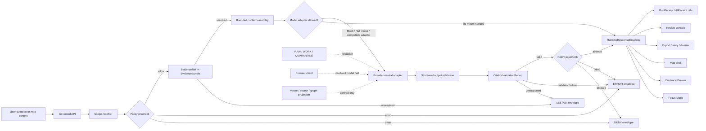

<!-- [KFM_META_BLOCK_V2]
doc_id: kfm://doc/NEEDS_VERIFICATION__docs_architecture_governed_ai_readme
title: Governed AI
type: standard
version: v1
status: draft
owners: NEEDS_VERIFICATION__governed_ai_owner
created: NEEDS_VERIFICATION__YYYY-MM-DD
updated: 2026-05-06
policy_label: NEEDS_VERIFICATION__public_or_restricted
related: [../../../README.md, ../README.md, ../governed-api.md, ../../adr/ADR-0207-governed-ai-runtime-envelope.md, ../../../contracts/runtime/README.md, ../../../policy/crosswalk/runtime-outcome-map.md, ../../../apps/web/README.md, ../../../schemas/README.md]
tags: [kfm, architecture, governed-ai, focus-mode, evidencebundle, runtime-response-envelope, ai-receipt, citation-validation, trust-membrane]
notes: [GitHub connector confirmed this target path exists, but current contents are governed-API-oriented rather than governed-AI-oriented; owners, created date, policy label, and final doc_id require repo governance verification.]
[/KFM_META_BLOCK_V2] -->

<a id="top"></a>

# Governed AI

Architecture landing page for KFM’s evidence-subordinate AI, Focus Mode, model-adapter, citation-validation, and runtime-envelope boundary.

<p align="center">
  
  
  
  
  
</p>

> [!IMPORTANT]
> **Status:** `active` architecture surface / `draft` document  
> **Owners:** `NEEDS_VERIFICATION__governed_ai_owner`  
> **Path:** `docs/architecture/governed-ai/README.md`  
> **Current repo posture:** `CONFIRMED` target path exists; `CONFIRMED` adjacent architecture, ADR, runtime-contract, root README, and empty CODEOWNERS were inspected through the GitHub connector; `UNKNOWN` runtime behavior, deployment, CI enforcement, model adapters, citation validator execution, and production readiness.  
> **Quick jumps:** [Scope](#scope) · [Repo fit](#repo-fit) · [Accepted inputs](#accepted-inputs) · [Exclusions](#exclusions) · [Current evidence snapshot](#current-evidence-snapshot) · [Directory tree](#directory-tree) · [Architecture rule](#architecture-rule) · [Runtime flow](#runtime-flow) · [Contract surface](#contract-surface) · [Adapter posture](#adapter-posture) · [Validation gates](#validation-gates) · [Open verification](#open-verification)

> [!NOTE]
> This README is intentionally about **governed AI**, not the broader governed API. The governed API is the trust membrane; governed AI is one evidence-bounded runtime family that must pass through it.

---

## Scope

`docs/architecture/governed-ai/` explains how model-assisted behavior is admitted into KFM without weakening the project’s trust law.

KFM’s durable public unit of value is the **inspectable claim**: a visible or semi-visible statement whose evidence, source role, spatial scope, temporal scope, policy posture, review state, release state, freshness, correction lineage, and rollback support can be inspected.

Governed AI exists to help users navigate evidence. It does not create truth.

This architecture covers:

- Focus Mode and bounded synthesis;
- provider-neutral model adapters;
- `MockAdapter` / `NullAdapter` first-slice behavior;
- optional local or private runtimes after security and policy gates;
- `EvidenceRef -> EvidenceBundle` resolution before consequential answers;
- policy precheck and postcheck;
- citation validation;
- finite `RuntimeResponseEnvelope` outcomes;
- `RunReceipt` and `AIReceipt` process memory;
- Evidence Drawer, map-shell, review, export, and story-preview consumption;
- no-direct-model-client and no-public-raw-path rules.

This directory does **not** own provider code, model weights, source data, machine schemas, policy-as-code, fixtures, tests, receipts, proof packs, releases, or UI components. It explains the architecture seam that those surfaces must preserve.

[Back to top](#top)

---

## Repo fit

| Relationship | Path | Role | Status |
|---|---|---|---|
| This file | `docs/architecture/governed-ai/README.md` | Governed AI architecture landing page. | `CONFIRMED path`; revised content proposed here. |
| Parent architecture index | [`../README.md`](../README.md) | Cross-cutting architecture directory index; links to this governed-AI README. | `CONFIRMED` inspected. |
| Governed API architecture | [`../governed-api.md`](../governed-api.md) | Broader trust-membrane architecture consumed by Focus Mode and model-assisted surfaces. | `CONFIRMED` inspected. |
| Runtime-envelope ADR | [`../../adr/ADR-0207-governed-ai-runtime-envelope.md`](../../adr/ADR-0207-governed-ai-runtime-envelope.md) | Draft/proposed ADR for finite AI-assisted runtime outcomes. | `CONFIRMED` inspected; implementation enforcement still `NEEDS VERIFICATION`. |
| Runtime contracts | [`../../../contracts/runtime/README.md`](../../../contracts/runtime/README.md) | Human-readable runtime contract lane for envelopes, receipts, model-adapter obligations, and negative states. | `CONFIRMED` inspected. |
| Schema parent | [`../../../schemas/README.md`](../../../schemas/README.md) | Machine-schema authority surface; exact runtime-envelope schema path still needs verification. | `NEEDS VERIFICATION` from this README. |
| Runtime outcome policy map | [`../../../policy/crosswalk/runtime-outcome-map.md`](../../../policy/crosswalk/runtime-outcome-map.md) | Policy-facing finite-outcome semantics and reason-code alignment. | `CONFIRMED path surfaced`; content not fully re-reviewed here. |
| Web shell | [`../../../apps/web/README.md`](../../../apps/web/README.md) | Browser-facing map-first shell that should consume governed API envelopes, not direct model output. | `CONFIRMED path surfaced`; runtime behavior not claimed. |
| Root orientation | [`../../../README.md`](../../../README.md) | Repo-wide KFM identity, trust law, responsibility roots, and object-family posture. | `CONFIRMED` inspected. |
| Ownership routing | [`../../../.github/CODEOWNERS`](../../../.github/CODEOWNERS) | Potential owner source. | `CONFIRMED` file is currently empty; owners remain `NEEDS VERIFICATION`. |

### Owning root

`docs/` owns human-facing doctrine, architecture, ADRs, runbooks, standards, and registers. This file belongs under `docs/architecture/` because it explains a cross-cutting system boundary.

It does **not** belong under a new root-level `ai/` folder. Model behavior crosses evidence, runtime, policy, API, UI, release, receipts, security, and review surfaces; a root-level domain-style AI folder would weaken the responsibility-root model.

[Back to top](#top)

---

## Accepted inputs

Content belongs in this README when it clarifies the governed-AI architecture seam.

| Accepted input | Belongs here when it explains… | Companion home |
|---|---|---|
| Runtime flow guidance | How scope, evidence, policy, adapter calls, citation validation, and envelopes compose. | `contracts/runtime/`, `schemas/`, `policy/`, `tests/` |
| Focus Mode architecture | How bounded questions become `ANSWER`, `ABSTAIN`, `DENY`, or `ERROR`. | `apps/web/`, `contracts/runtime/`, `fixtures/` |
| Model-adapter boundary | How providers remain replaceable and subordinate to KFM contracts. | `packages/`, `apps/`, or repo-native adapter home after verification |
| Citation-validation posture | Why model output is not public support until validated against `EvidenceBundle`. | `tools/validators/`, `tests/`, `contracts/runtime/` |
| Receipt obligations | What `RunReceipt` and `AIReceipt` should record without becoming truth. | `data/receipts/`, `contracts/runtime/` |
| Policy and sensitivity rules | How rights, restricted material, stale evidence, and access role block model behavior. | `policy/`, `docs/runbooks/`, `tests/policy/` |
| UI trust-state rules | How Evidence Drawer and Focus Mode display support, denial, freshness, review, and correction state. | `apps/web/`, `docs/architecture/`, `contracts/runtime/` |
| Operational hardening notes | Why local/private runtimes need deny-by-default exposure and no direct public/browser paths. | `runtime/`, `infra/`, `configs/`, `docs/runbooks/` |

### Runtime request inputs

A governed AI request may accept only bounded, reviewable context.

| Runtime input | Required guardrail |
|---|---|
| User question | Must be scoped to map, layer, claim, evidence, dossier, export, review, diagnostic, or other governed context. |
| Map selection | Selection context only; never proof by itself. |
| `EvidenceRef` | Must resolve server-side to `EvidenceBundle` or produce a finite negative outcome. |
| `EvidenceBundle` ref | Must be released or explicitly review-authorized for the caller and purpose. |
| Release or layer ref | Must carry release, freshness, correction, sensitivity, and public-safe state where material. |
| Model output | Must be structured, validated, citation-checked, policy-postchecked, and wrapped before reaching clients. |

[Back to top](#top)

---

## Exclusions

| Does not belong here | Why | Preferred home or outcome |
|---|---|---|
| Provider SDK code, model clients, adapter implementations | Architecture docs do not implement providers. | `packages/`, `apps/`, or repo-native adapter home after ADR/repo verification |
| Model weights, prompts with secrets, `.env` values, local runtime credentials | Security-sensitive and deployment-specific. | Secret manager, ignored local config, or `runtime/` runbook without secrets |
| Machine schemas | This README can link schema obligations, not own executable shape. | `schemas/contracts/v1/` after schema-home verification |
| Policy-as-code | AI architecture describes gates; policy enforces admissibility. | `policy/` |
| Valid/invalid fixtures | Fixtures prove contracts and failure modes. | `fixtures/`, `tests/fixtures/`, or repo-native fixture home |
| Runtime receipts and AI receipts as emitted objects | Receipts are process memory, not documentation. | `data/receipts/` |
| Proof packs, release manifests, promotion decisions | Publication proof belongs outside architecture prose. | `release/`, `data/proofs/`, `contracts/release/` |
| RAW, WORK, QUARANTINE, unpublished candidate, or canonical internal payloads | Governed AI must not expose or directly consume normal pre-publication material. | Lifecycle stores with policy access; public request returns `DENY`, `ABSTAIN`, or `ERROR` |
| Direct browser-to-model instructions | Breaks the trust membrane. | Use governed API mediation only |
| Private chain-of-thought | KFM stores audit-safe refs, hashes, inputs, outputs, and decisions, not private reasoning traces. | Nowhere as truth, evidence, receipt, proof, or publication object |

[Back to top](#top)

---

## Current evidence snapshot

| Evidence | What it confirms | What remains unverified |
|---|---|---|
| `docs/architecture/governed-ai/README.md` | Target path exists. Current content is governed-API-oriented and should be replaced or corrected for governed AI. | Maintainer acceptance of this revised content. |
| `docs/architecture/README.md` | Architecture README links to `./governed-ai/README.md` and treats this as an architecture surface. | Full architecture directory inventory and link-check state. |
| `docs/adr/ADR-0207-governed-ai-runtime-envelope.md` | ADR exists for finite governed AI runtime envelopes; it names `ANSWER`, `ABSTAIN`, `DENY`, and `ERROR`. | Accepted status, enforcement, schema alignment, citation validation, model adapter implementation, and CI behavior. |
| `contracts/runtime/README.md` | Runtime contracts describe finite, evidence-bound outward responses, receipts, model-adapter boundaries, and negative states. | Whether every companion contract file, schema, fixture, and test exists. |
| `README.md` | Root README defines KFM as governed, evidence-first, map-first, time-aware, and states AI is interpretive only. | Whether root README status has moved beyond draft/proposed. |
| `.github/CODEOWNERS` | Ownership file exists but is empty. | Governing owner for this directory and document. |
| Local `/mnt/data` workspace scan | Uploaded PDFs were visible; no mounted Git checkout was found locally. | Branch state, dirty state, local test runs, local workflows, runtime logs, dashboards, and deployed behavior. |

> [!WARNING]
> This README does not claim that model adapters, live providers, citation validators, runtime routes, proof packs, CI gates, or deployments are complete. Those claims require direct repo evidence, test output, workflow evidence, logs, dashboards, or emitted artifacts.

[Back to top](#top)

---

## Directory tree

Verified and adjacent architecture paths used by this README:

```text
docs/
└── architecture/
    ├── README.md                 # parent architecture index
    ├── governed-api.md           # governed API trust membrane
    ├── governed-ai/
    │   └── README.md             # this file
    └── tiles/
        └── README.md             # tile delivery architecture
```

Expected companion surfaces, subject to repo verification:

```text
contracts/runtime/
schemas/contracts/v1/
policy/
fixtures/
tests/
apps/web/
apps/api/ or apps/governed_api/
packages/
data/receipts/
release/
docs/adr/
docs/runbooks/
```

> [!IMPORTANT]
> Do not create parallel schema, policy, source, proof, release, or receipt homes to support AI work. Use the existing responsibility roots and ADRs; if placement is unclear, open or update the relevant ADR.

[Back to top](#top)

---

## Architecture rule

Governed AI is not a chatbot bolted onto the map.

It is a constrained runtime capability inside KFM’s trust architecture:

```text
SOURCE EDGE
-> RAW
-> WORK / QUARANTINE
-> PROCESSED
-> CATALOG / TRIPLET
-> PUBLISHED
-> governed API
-> Evidence Drawer / Focus Mode / map shell / export / review
```

AI may help synthesize, explain, compare, draft, narrow, or route users back to evidence. It must not decide truth, rights, source authority, policy, review state, release state, or publication.

The core rule:

> A model may speak only through a governed envelope, over admissible evidence, after policy checks, with citations validated, and with negative outcomes preserved as first-class product states.

### Consequential answer law

A governed AI surface may return `ANSWER` only when all material gates pass:

1. request scope is bounded;
2. caller and surface are allowed;
3. evidence resolves from `EvidenceRef` to `EvidenceBundle`;
4. source role is adequate for the claim;
5. release/review/freshness/correction state supports exposure;
6. policy precheck allows model mediation;
7. adapter receives only policy-safe bounded context;
8. generated output validates against the expected structure;
9. citations/support validate against the resolved evidence;
10. policy postcheck allows the final payload;
11. response is wrapped in a finite `RuntimeResponseEnvelope`;
12. receipts or audit refs record process memory where required.

When those gates do not pass, the correct outcome is usually `ABSTAIN`, `DENY`, or `ERROR`.

[Back to top](#top)

---

## Runtime flow



### Runtime responsibility order

```text
scope
-> policy precheck
-> evidence resolution
-> bounded context
-> model adapter, if allowed
-> structured output validation
-> citation validation
-> policy postcheck
-> finite envelope
-> receipts and UI/API consumption
```

[Back to top](#top)

---

## Runtime outcomes

| Outcome | Meaning | Required behavior |
|---|---|---|
| `ANSWER` | Evidence, policy, release/review/freshness state, citation validation, and output validation support a bounded answer. | Return answer plus evidence refs, citation state, policy state, release/review/correction/freshness state, limitations, obligations, and receipt refs where material. |
| `ABSTAIN` | KFM cannot support a reliable answer because evidence is missing, unresolved, stale, conflicting, insufficient, out of scope, or source-role-inadequate. | Return no unsupported answer; include safe reason codes and narrowing guidance. |
| `DENY` | Policy, rights, sensitivity, access role, release state, steward restriction, embargo, or public safety blocks the response. | Return no restricted content; include only safe policy reason and obligations. |
| `ERROR` | Resolver, adapter, validator, policy engine, schema check, manifest integrity, or envelope assembly failed. | Fail closed; do not substitute model prose or partial truth. |

> [!TIP]
> In KFM, a crisp `ABSTAIN` or `DENY` is often a better product outcome than a fluent answer.

[Back to top](#top)

---

## Contract surface

Governed AI should reuse KFM’s trust-bearing object families. Do not fork these terms into provider-specific names.

| Object family | Governed AI obligation |
|---|---|
| `SourceDescriptor` | Preserve source role, rights, cadence, scale, caveats, authority limits, and activation state before source content enters model context. |
| `EvidenceRef` | Treat as an unresolved pointer until server-side resolution succeeds. |
| `EvidenceBundle` | Use as the resolved support package for answerable claims. |
| `PolicyDecision` | Carry allow, deny, restrict, abstain, review-needed, obligations, and reason codes. |
| `RuntimeResponseEnvelope` | Stable public-edge response envelope for AI-assisted runtime surfaces. |
| `DecisionEnvelope` | Related decision-object family for non-AI or general governed decisions; do not duplicate without ADR alignment. |
| `ModelAdapterRequest` | Bounded provider-neutral request object after evidence and policy gates. |
| `ModelAdapterResponse` | Provider-neutral adapter output before final validation and policy postcheck. |
| `CitationValidationReport` | Required support check before `ANSWER`. |
| `RunReceipt` | Runtime process memory for execution, refs, hashes, outcome, and audit joins. |
| `AIReceipt` | Model-participation receipt without storing private chain-of-thought as truth. |
| `FocusQueryRequest` / `FocusQueryResponse` | Focus Mode-specific request/response contract, preferably wrapped by or aligned to runtime envelope. |
| `EvidenceDrawerPayload` | Trust-visible evidence and policy payload consumed by the drawer. |
| `NegativeStatePayload` | Shared representation for abstention, denial, and safe error states. |
| `ReleaseManifest` / `PromotionDecision` | Prevent model output from outrunning release state. |
| `CorrectionNotice` / `RollbackCard` | Keep supersession, withdrawal, correction, and rollback visible. |

### Envelope sketch

The exact schema belongs in the verified schema home. This architecture expects a runtime response envelope with at least the following field families.

```json
{
  "id": "kfm-runtime-request-NEEDS_VERIFICATION",
  "schema_version": "NEEDS_VERIFICATION",
  "outcome": "ANSWER | ABSTAIN | DENY | ERROR",
  "reason_code": "EVIDENCE_BUNDLE_UNRESOLVED",
  "scope": {
    "request_kind": "focus | drawer | claim | map | export | review | diagnostic",
    "spatial_scope": "NEEDS_VERIFICATION",
    "temporal_scope": "NEEDS_VERIFICATION",
    "release_ref": "kfm://release/NEEDS_VERIFICATION"
  },
  "answer": null,
  "evidence_refs": [],
  "evidence_bundle_refs": [],
  "citation_state": {
    "status": "PASS | NOT_RUN | FAIL | ERROR",
    "citation_validation_ref": "kfm://citation-validation/NEEDS_VERIFICATION"
  },
  "policy_state": {
    "outcome": "ALLOW | ABSTAIN | DENY | ERROR",
    "decision_ref": "kfm://policy-decision/NEEDS_VERIFICATION",
    "reason_codes": [],
    "obligations": []
  },
  "trust_state": {
    "release_state": "released | draft | superseded | withdrawn | unknown",
    "review_state": "approved | pending | denied | not_required | unknown",
    "freshness_state": "current | stale | unknown | not_applicable",
    "correction_state": "current | corrected | superseded | withdrawn | unknown"
  },
  "model_state": {
    "adapter": "MockAdapter | NullAdapter | OllamaAdapter | OpenAICompatibleAdapter | not_called",
    "model_id": "NEEDS_VERIFICATION",
    "prompt_template_hash": "NEEDS_VERIFICATION",
    "output_hash": "NEEDS_VERIFICATION"
  },
  "receipt_refs": [],
  "limitations": [],
  "obligations": []
}
```

[Back to top](#top)

---

## Adapter posture

KFM should define the adapter contract before optimizing any provider.

| Adapter family | Intended use | Admission posture |
|---|---|---|
| `MockAdapter` | Deterministic fixtures, golden tests, contract enforcement, and no-network first slice. | First target. |
| `NullAdapter` | Explicit no-model path for denial, abstention, maintenance, or disabled model state. | First target. |
| `OllamaAdapter` | Local/private model runtime after exposure, auth, model pinning, logging, and structured-output checks. | `PROPOSED`; do not expose directly to browser/public clients. |
| `OpenAICompatibleAdapter` | Optional compatible provider path after privacy, egress, provider terms, and contract tests. | `PROPOSED`; must preserve KFM envelope. |
| Future adapters | Provider replacement without public-contract drift. | Allowed only through the same policy, evidence, citation, receipt, and validation gates. |

### Provider neutrality rule

Provider details may affect:

- `model_state`;
- operational runbooks;
- adapter health checks;
- latency and failure budgets;
- receipt metadata;
- deployment and exposure controls.

Provider details must not affect:

- finite outcome grammar;
- evidence requirements;
- citation validation;
- policy gates;
- public envelope shape;
- rights and sensitivity behavior;
- review, release, correction, or rollback obligations.

[Back to top](#top)

---

## UI trust surfaces

Governed AI appears in UI only as a trust-visible consumer of governed responses.

| Surface | Allowed AI role | Required visible state |
|---|---|---|
| Focus Mode | Answer scoped questions over resolved released evidence or abstain/deny/error. | Outcome, reason, citations, evidence refs, policy state, freshness, limitations, obligations. |
| Evidence Drawer | Help explain what evidence supports a feature or why support is unavailable. | EvidenceBundle, source roles, review/release state, policy posture, correction line. |
| Map shell | Pass selection and temporal context to governed API. | Layer release state, stale state, sensitivity transform, evidence availability. |
| Review console | Summarize candidate review context only when role and policy allow. | Actor role, review state, source refs, policy obligations, rollback target. |
| Export / story / dossier | Draft bounded summaries over released evidence. | Citations, release refs, correction refs, policy warnings, abstentions preserved. |

The UI must never hide `ABSTAIN`, `DENY`, or `ERROR` behind generic copy. Negative states are part of the contract.

[Back to top](#top)

---

## Security and exposure posture

| Risk | Required default |
|---|---|
| Unknown rights | `DENY` public release or model mediation. |
| Unknown sensitivity | `DENY` or restrict until reviewed. |
| Unresolved evidence | `ABSTAIN` or `ERROR`; do not call the model for answer text. |
| Direct browser-to-model path | `DENY`; all public traffic goes through governed API. |
| RAW / WORK / QUARANTINE context | Excluded from normal governed AI public path. |
| Exact sensitive location | `DENY` unless a reviewed public-safe transform explicitly allows exposure. |
| Living-person, DNA, archaeology, rare-species, infrastructure, cultural, or unclear-rights material | Fail closed with staged access, redaction, generalization, delay, quarantine, or denial. |
| Provider response leakage | Validate structure and postcheck policy before exposing. |
| Internal path, secret, token, prompt, or endpoint leakage | Return safe `ERROR`; do not echo internal details. |
| Private chain-of-thought persistence | Do not store as a KFM truth, proof, evidence, receipt, or publication object. |

[Back to top](#top)

---

## Validation gates

A governed AI change is not ready because it “works” in a demo. It is ready when the trust seam is testable.

| Gate | Minimum evidence |
|---|---|
| Directory placement | Path follows Directory Rules, current repo convention, and active ADRs. |
| Runtime envelope | `ANSWER`, `ABSTAIN`, `DENY`, and `ERROR` have valid and invalid fixtures. |
| Evidence closure | `ANSWER` requires resolved `EvidenceBundle` refs. |
| Citation validation | Unsupported or unresolved citations cannot produce `ANSWER`. |
| Policy precheck | Rights, sensitivity, source role, access, release, stale, and public-safety gates run before model mediation. |
| Policy postcheck | Model output is checked before release to clients. |
| No direct model client | Browser/public clients cannot call provider runtimes directly. |
| No raw-public path | Runtime payloads do not expose RAW, WORK, QUARANTINE, unpublished candidate, or internal store paths. |
| Adapter determinism | `MockAdapter` and `NullAdapter` pass before live providers. |
| Receipt linkage | AI participation and runtime execution record audit-safe refs and hashes. |
| UI negative states | Focus Mode and Evidence Drawer render `ABSTAIN`, `DENY`, and `ERROR` as trust states. |
| Documentation sync | ADRs, contracts, schemas, policies, fixtures, tests, runbooks, and architecture docs agree or list gaps. |

### Suggested review commands

Run these only in a real checkout after confirming repo-native tooling.

```bash
git status --short
git branch --show-current || true
git rev-parse --show-toplevel || true

find docs/architecture docs/adr contracts schemas policy fixtures tests tools apps packages data release \
  -maxdepth 4 -type f 2>/dev/null | sort | sed -n '1,400p'

grep -RInE "RuntimeResponseEnvelope|ModelAdapter|CitationValidationReport|AIReceipt|RunReceipt|EvidenceBundle|Focus Mode|Evidence Drawer|ANSWER|ABSTAIN|DENY|ERROR" \
  docs contracts schemas policy fixtures tests tools apps packages 2>/dev/null | head -160

grep -RInE "localhost:11434|OLLAMA_HOST|/api/generate|/api/chat|OpenAI|raw|quarantine|chain.?of.?thought" \
  apps packages tools tests 2>/dev/null || true
```

> [!NOTE]
> Do not report any command, workflow, validator, route, or deployment as passing until it has actually run on the target branch.

[Back to top](#top)

---

## Definition of done

A governed AI architecture or implementation change is reviewable when:

- [ ] path placement is verified against Directory Rules and active ADRs;
- [ ] owner and review burden are assigned or explicitly marked `NEEDS VERIFICATION`;
- [ ] public/steward/internal exposure class is explicit;
- [ ] `RuntimeResponseEnvelope` outcome behavior is documented and fixture-backed;
- [ ] `ANSWER`, `ABSTAIN`, `DENY`, and `ERROR` are tested where applicable;
- [ ] `EvidenceRef -> EvidenceBundle` resolution is required before consequential answer text;
- [ ] citation validation failure cannot return `ANSWER`;
- [ ] policy precheck and postcheck are explicit;
- [ ] no browser/public path calls a model provider directly;
- [ ] no public path exposes RAW, WORK, QUARANTINE, unpublished candidate, or internal store data;
- [ ] AI receipts record audit-safe facts without private chain-of-thought;
- [ ] UI surfaces render negative states and obligations visibly;
- [ ] release, correction, supersession, withdrawal, and rollback refs remain inspectable;
- [ ] docs, ADRs, contracts, schemas, policy, fixtures, tests, runbooks, and app notes are synchronized or gaps are listed;
- [ ] runtime behavior is not claimed unless directly verified.

[Back to top](#top)

---

## Quickstart for maintainers

Use this sequence when revising governed AI.

1. Verify the target branch and path.
2. Check `docs/architecture/governed-ai/README.md` against `docs/architecture/README.md`.
3. Check `ADR-0207` and schema-home ADR status.
4. Inspect `contracts/runtime/` and runtime-envelope schemas.
5. Inspect policy outcome crosswalks and tests.
6. Inspect app/client code for no-direct-model-client posture.
7. Add or update fixtures for all finite outcomes.
8. Run repo-native tests and link checks.
9. Record remaining unknowns in the verification backlog.
10. Keep rollback simple: documentation-only changes should revert cleanly; schema/runtime changes need migration and compatibility notes.

[Back to top](#top)

---

## FAQ

### Is governed AI the same as the governed API?

No. The governed API is the broader trust membrane. Governed AI is a runtime capability that must pass through that membrane.

### Can Focus Mode answer without evidence?

Only with a safe negative outcome. Consequential answer text requires evidence resolution and citation validation.

### Can a local Ollama runtime be used?

Yes, as a replaceable private/local adapter after exposure, security, policy, structured-output, receipt, citation-validation, and no-direct-public-client gates are verified. It must not become the truth source or public API.

### Are receipts evidence?

No. Receipts record process memory: what ran, which refs and hashes were used, which adapter participated, and what outcome occurred. Evidence still comes from `EvidenceBundle` and source-backed support.

### Where should model adapter code live?

`UNKNOWN` until current repo conventions and ADRs are checked. It should not live in `docs/architecture/`. Use the repo-native implementation root and keep this README as the architecture contract.

[Back to top](#top)

---

## Open verification

| Item | Status | How to close |
|---|---:|---|
| Stable `doc_id` | `NEEDS VERIFICATION` | Confirm from document registry or assign through governance. |
| Owners | `NEEDS VERIFICATION` | Populate from CODEOWNERS, document registry, or maintainer assignment. |
| Created date | `NEEDS VERIFICATION` | Confirm from git history or document registry. |
| Policy label | `NEEDS VERIFICATION` | Confirm public/restricted classification with policy registry. |
| Whether this file should fully replace current governed-API-oriented content | `NEEDS VERIFICATION` | Maintainer review; ensure `../governed-api.md` remains the governed API architecture home. |
| Runtime envelope schema authority | `NEEDS VERIFICATION` | Resolve duplicate/shared/runtime schema paths through ADR-0001 or successor. |
| Citation validator implementation | `UNKNOWN` | Inspect tools, packages, tests, workflows, and emitted reports. |
| Model adapters | `UNKNOWN` | Inspect packages/apps/runtime surfaces; do not assume Ollama or other providers are wired. |
| Focus Mode UI coverage | `UNKNOWN` | Inspect app code and tests for all finite outcomes. |
| Evidence Drawer AI assistance | `UNKNOWN` | Inspect payload contracts, UI code, fixtures, and tests. |
| CI enforcement | `UNKNOWN` | Inspect `.github/workflows/`, branch protections, and latest runs. |
| Deployment and runtime logs | `UNKNOWN` | Inspect deployment manifests, logs, dashboards, and runtime configuration. |
| Security posture for local/private runtimes | `NEEDS VERIFICATION` | Review runtime runbooks, firewall/reverse-proxy/VPN posture, auth, logging, and secret handling. |

[Back to top](#top)

---

<details>
<summary>Appendix A — Governed AI review card</summary>

Use this card in PRs that affect model-assisted behavior.

```markdown
## Governed AI review card

Target paths:

Change type:
- [ ] documentation only
- [ ] contract/schema
- [ ] policy
- [ ] fixture/test
- [ ] adapter/runtime
- [ ] UI
- [ ] release/promotion
- [ ] other:

Truth labels:
- CONFIRMED:
- PROPOSED:
- UNKNOWN:
- NEEDS VERIFICATION:

Evidence path:
- EvidenceRef:
- EvidenceBundle:
- SourceDescriptor:
- ReleaseManifest:
- PolicyDecision:
- CitationValidationReport:

Runtime outcomes covered:
- [ ] ANSWER
- [ ] ABSTAIN
- [ ] DENY
- [ ] ERROR

Adapter posture:
- [ ] MockAdapter
- [ ] NullAdapter
- [ ] local/private adapter
- [ ] external/provider-compatible adapter
- [ ] no adapter change

No-bypass checks:
- [ ] no direct browser-to-model path
- [ ] no public RAW/WORK/QUARANTINE path
- [ ] no unresolved evidence as support
- [ ] no chain-of-thought persistence as truth
- [ ] no provider-specific public contract drift

Validation run:

Rollback or supersession plan:

Remaining verification items:
```

</details>

<details>
<summary>Appendix B — Pre-publish checklist</summary>

- [ ] KFM Meta Block v2 is present.
- [ ] One H1 only.
- [ ] One-line purpose follows the title.
- [ ] Status, owners, badges, and quick jumps are present.
- [ ] Repo fit names path and upstream/downstream links.
- [ ] Accepted inputs and exclusions are explicit.
- [ ] Directory tree is truth-labeled and not overclaimed.
- [ ] Mermaid diagram explains a real governed flow.
- [ ] Tables clarify contracts, outcomes, gates, and risks.
- [ ] Code fences are language-tagged.
- [ ] Long appendix material is collapsed.
- [ ] Relative links are written from `docs/architecture/governed-ai/`.
- [ ] Unknowns and placeholders are visible.
- [ ] No implementation, route, schema, CI, adapter, or runtime behavior is claimed without evidence.

</details>

[Back to top](#top)
