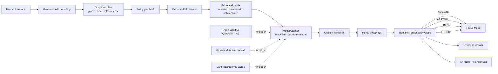

<!-- [KFM_META_BLOCK_V2]
doc_id: kfm://doc/<TODO: assign UUID after repo registration>
title: Governed AI Architecture
type: standard
version: v1
status: draft
owners: <TODO: confirm governed-ai owners>
created: 2026-04-22
updated: 2026-04-22
policy_label: <TODO: confirm policy label>
related: [<TODO: verify adjacent repo links after mounting KFM repo>]
tags: [kfm, governed-ai, evidence, policy, focus-mode]
notes: [Generated as repo-ready draft for docs/architecture/governed-ai/README.md; repo checkout, owners, policy label, and adjacent links NEED VERIFICATION]
[/KFM_META_BLOCK_V2] -->

# Governed AI Architecture

Evidence-bounded architecture for using AI inside KFM without letting model output become truth.

<p>
  
  
  
  
</p>

> [!IMPORTANT]
> **Status:** experimental  
> **Owners:** `<TODO: confirm governed-ai owners>`  
> **Path:** `docs/architecture/governed-ai/README.md`  
> **Quick jumps:** [Scope](#scope) · [Repo fit](#repo-fit) · [Inputs](#inputs) · [Exclusions](#exclusions) · [Architecture flow](#architecture-flow) · [Contracts](#contract-and-object-map) · [Validation](#validation-and-review-gates) · [Open verification](#open-verification-backlog)

---

## Scope

This directory documents how Kansas Frontier Matrix admits model-assisted synthesis, retrieval support, evaluator output, and local/private model runtimes **without weakening the KFM truth path**.

The governing rule is simple:

> [!IMPORTANT]
> AI is an interpretive layer. `EvidenceBundle`, policy state, source authority, review state, and release state outrank generated language.

This README is for maintainers working on:

- provider-neutral AI runtime boundaries;
- Focus Mode response envelopes;
- Evidence Drawer obligations for AI-assisted claims;
- citation validation and policy postchecks;
- AI receipts, run receipts, evaluator reports, and rollback controls;
- local/private runtime hardening when KFM is exposed through a home firewall, reverse proxy, or VPN.

It is **not** a chatbot spec, prompt collection, model benchmark page, provider setup guide, or proof that any runtime is already implemented.

## Repo fit

| Field | Value |
| --- | --- |
| Target path | `docs/architecture/governed-ai/README.md` |
| Document role | Architecture README for bounded AI, Focus Mode, adapters, citations, policy, receipts, and trust-surface integration |
| Upstream doctrine | `<TODO: verify links>` KFM pipeline/lifecycle manual, governed-AI architecture report, MapLibre UI doctrine, documentation architecture/source-ledger materials |
| Downstream surfaces | `<TODO: verify links>` `schemas/contracts/v1/`, `contracts/runtime/`, `policy/`, `tools/validators/`, `apps/governed-api/`, `apps/web/`, `tests/`, `release/` |
| Primary readers | Architecture, policy, API, UI, QA, source-ledger, release, and operations maintainers |
| Update trigger | Any material change to model adapters, Focus Mode, Evidence Drawer payloads, citation validation, policy gates, runtime exposure, receipts, or release behavior |

> [!NOTE]
> Repo-relative links are intentionally left as verification placeholders because the mounted checkout was not available during this drafting pass. Convert the path candidates above into live relative links after the real repo tree is inspected.

## Inputs

Content belongs here when it describes **architecture or governance** for KFM AI behavior.

Accepted inputs include:

| Accepted input | Belongs here when it answers |
| --- | --- |
| Runtime boundary notes | Where may a model runtime sit, and what must it never access? |
| Adapter decisions | How does KFM keep provider choice internal and replaceable? |
| Focus Mode contracts | What does a bounded answer, abstain, deny, or error need to carry? |
| Evidence/citation rules | How does generated text prove its support or fail safely? |
| Policy gate notes | Which checks happen before and after synthesis? |
| Receipt/proof distinctions | What is process memory, what is release proof, and what is review support? |
| UI trust obligations | What must Evidence Drawer, Focus, export, and review surfaces expose? |
| Local/private exposure guidance | What prevents a home-hosted model endpoint from becoming a public bypass? |

## Exclusions

Do not place operational secrets, runtime state, raw data, or machine-contract source of truth in this README.

| Exclusion | Why it does not belong | Preferred home |
| --- | --- | --- |
| Model weights, GGUF files, downloaded model blobs | Large runtime artifacts are not documentation and may carry licensing/storage risks. | Outside repo or ops-managed artifact store — `NEEDS VERIFICATION` |
| API keys, provider tokens, VPN secrets, `.env` values | Secrets must never be committed. | Secret manager or local `.env`, with safe `.env.example` only |
| Prompt experiments without evidence contracts | Prompt text is not proof and can drift from policy. | `packages/ai/prompts/` or test fixtures, if repo convention confirms |
| Chain-of-thought or hidden reasoning logs | Hidden reasoning is not a KFM truth object and should not be stored as provenance. | Do not persist; store bounded receipt metadata only |
| RAW / WORK / QUARANTINE data | Public and AI surfaces must not read lifecycle stages directly. | `data/raw/`, `data/work/`, `data/quarantine/` behind governed lifecycle controls |
| Vector indexes, summaries, tiles, scenes | Rebuildable derivatives are not sovereign truth. | Derived-data homes after release/catelog policy is verified |
| Live provider setup instructions | Provider commands are version-sensitive and operational. | `docs/runbooks/` after official-provider recheck |
| Source-rights decisions | Rights and sensitivity are source-governance decisions, not AI convenience settings. | Source registry / source intake records |

<p align="right"><a href="#governed-ai-architecture">Back to top ↑</a></p>

## Directory tree

Current requested target:

```text
docs/architecture/governed-ai/
└── README.md
```

Adjacent repo surfaces to verify before linking:

```text
docs/adr/
docs/runbooks/
docs/registers/
schemas/contracts/v1/
contracts/runtime/
policy/
tools/validators/
packages/ai/
packages/evidence/
apps/governed-api/
apps/web/
tests/
release/
```

> [!WARNING]
> The adjacent tree is a **PROPOSED placement map**, not a claim that these paths exist in the current checkout. Do not create duplicate schema or contract homes until schema authority is resolved by ADR or existing repo convention.

## Architecture flow



The model adapter never becomes the trust surface. It receives only scoped, policy-safe, resolved evidence context and returns structured output that must survive citation validation, policy postcheck, and finite-envelope emission before any user-facing surface can render it.

## Core operating rules

### 1. Resolve evidence before synthesis

`EvidenceRef` is a pointer. `EvidenceBundle` is the resolved, reviewable, policy-aware support surface.

A Focus response, map popup, export, story node, or AI-assisted explanation must not cite a bare pointer that has not been resolved under the current release and policy state.

### 2. Keep provider choice internal

KFM should expose a stable internal model adapter contract, not public behavior tied to one provider.

Provider-specific runtimes such as Ollama, OpenAI-compatible endpoints, or future local runtimes are implementation details behind the governed boundary.

### 3. Make negative outcomes first-class

A refusal is not a product failure when evidence, rights, sensitivity, source authority, or runtime health is insufficient.

| Outcome | Meaning | Required posture |
| --- | --- | --- |
| `ANSWER` | Evidence and policy support a bounded response. | Include citations, scope echo, receipt/audit reference, and drawer link. |
| `ABSTAIN` | Evidence is missing, unresolved, stale, ambiguous, or too weak. | Explain the evidence gap without inventing. |
| `DENY` | Policy, rights, sensitivity, safety, release state, or role constraints block the response. | Explain the class of restriction without leaking protected detail. |
| `ERROR` | Runtime, validation, resolver, policy, or contract failure occurred. | Fail closed; do not show raw model output. |

> [!NOTE]
> Some KFM materials also discuss `HOLD` in review/promotion contexts. This README treats runtime Focus outcomes as `ANSWER`, `ABSTAIN`, `DENY`, and `ERROR` until the mounted repo confirms a broader shared enum.

### 4. Never persist hidden reasoning as proof

Store bounded metadata, not hidden reasoning:

- model or adapter ID;
- runtime version or build reference when available;
- prompt/template digest;
- evidence bundle IDs and digests;
- policy decisions;
- citation validation report ID;
- output digest;
- receipt IDs.

### 5. Separate receipts from proofs

A run receipt records that a process happened. A proof pack supports release-significant trust. A catalog record improves discovery. None of those should silently replace the others.

## Contract and object map

| Object family | Truth role | AI-specific use | Status |
| --- | --- | --- | --- |
| `SourceDescriptor` | Source governance | Describes source identity, role, rights, sensitivity, access, citation obligations, and activation state. | PROPOSED unless repo confirms |
| `EvidenceRef` | Evidence pointer | Points to a released/candidate artifact under a claim scope. | PROPOSED unless repo confirms |
| `EvidenceBundle` | Resolved evidence support | Supplies the admissible context a model may use. | CONFIRMED doctrine / PROPOSED implementation |
| `PolicyDecision` | Governance result | Records allow, deny, abstain, scope, rights, sensitivity, and release-state decisions. | PROPOSED unless repo confirms |
| `CitationValidationReport` | Citation gate | Validates that consequential claims resolve to evidence refs in the bundle. | PROPOSED unless repo confirms |
| `RuntimeResponseEnvelope` | Runtime output contract | Carries `ANSWER`, `ABSTAIN`, `DENY`, or `ERROR` plus evidence, policy, and audit references. | PROPOSED unless repo confirms |
| `FocusModePayload` | UI contract | Renders bounded synthesis and negative states without raw model output. | PROPOSED unless repo confirms |
| `EvidenceDrawerPayload` | Trust surface contract | Shows support, source role, rights, sensitivity, freshness, review, correction, and audit links. | PROPOSED unless repo confirms |
| `AIReceipt` | AI process memory | Records model-adapter participation without storing hidden reasoning. | PROPOSED unless repo confirms |
| `RunReceipt` | Pipeline/runtime process memory | Records run metadata and deterministic execution context. | PROPOSED unless repo confirms |
| `EvaluatorReport` | Review support | Captures evaluator or test outcomes for proposed model-assisted artifacts. | PROPOSED unless repo confirms |
| `ProofPack` | Release proof | Bundles validation, policy, promotion, integrity, and release evidence. | PROPOSED unless repo confirms |
| `ReleaseManifest` | Published release state | Declares released artifacts, digests, rollback target, and publication scope. | PROPOSED unless repo confirms |

<p align="right"><a href="#governed-ai-architecture">Back to top ↑</a></p>

## Runtime adapter strategy

| Adapter | Role | Allowed use | Default maturity |
| --- | --- | --- | --- |
| `MockAdapter` | Deterministic test adapter | CI, fixtures, contract tests, finite-outcome proof | First implementation target |
| `NullAdapter` | Explicit disabled/non-answer adapter | Safe offline mode, feature flag off, runtime unavailable | Pair with `MockAdapter` |
| `OllamaAdapter` | Local/private model runtime adapter | Only behind governed API, after contracts/tests pass | Deferred |
| `OpenAICompatibleAdapter` | Provider-compatible remote or private endpoint | Same internal contract, no provider-specific public behavior | Deferred |
| Future adapters | Replaceable internal implementations | Must satisfy the same envelope, policy, citation, and receipt rules | Deferred |

Provider adapters must not:

- receive browser or public client traffic directly;
- read RAW, WORK, QUARANTINE, unpublished, private, or canonical stores directly;
- publish uncited answers;
- persist hidden reasoning as source evidence;
- make source-rights or sensitivity decisions by inference;
- change public response shape based on provider quirks.

## Focus Mode behavior

Focus Mode is bounded synthesis inside the governed shell, not a detached assistant.

A compliant Focus response carries:

| Field group | Minimum expectation |
| --- | --- |
| Scope | Place, time, role/audience, release window, and active layer/evidence context |
| Evidence | `evidence_bundle_ref`, cited evidence refs, bundle freshness, unresolved refs if any |
| Outcome | One finite runtime outcome and a human-readable reason |
| Policy | Policy decision ID, obligations, redaction/generalization notes where applicable |
| Citations | Inline citations to resolved evidence; no decorative citation strings |
| Audit | Request ID, receipt ID, citation validation report ID, safe trace reference |
| UI hooks | Evidence Drawer route, map re-highlight targets, export trust cue eligibility |

Focus must abstain or deny when the evidence pool cannot support the question. It must not “fill in” missing support with fluent synthesis.

## Evidence Drawer behavior

The Evidence Drawer is the mandatory trust object for consequential claims, layers, exports, and Focus outputs.

Minimum drawer groups:

| Group | What users must be able to inspect |
| --- | --- |
| Claim header | Claim title, evidence state, policy state, review state, freshness, correction state |
| Support | Support summary, knowledge character, source role, source authority |
| Identity | `EvidenceBundle`, `EvidenceRef`, object ID, dataset/release version |
| Scope | Place/geometry, time basis, opened-from surface |
| Rights and sensitivity | Rights class, sensitivity posture, transform/redaction/generalization reason |
| Freshness and review | Freshness timestamp/class, review state, promotion or correction state |
| Transform and provenance | Transform summary, lineage note, resolver/rule version, safe upstream pointers |
| Audit linkage | Receipt, trace, validation, correction, or review route references |

> [!TIP]
> Treat the drawer payload as a pure contract. It should be testable without a live model, live source connector, or map renderer.

## Local/private exposure posture

KFM may be locally hosted and exposed through a home firewall, VPN, or reverse proxy for trusted third-party access. Governed AI increases the risk of accidental bypass, so default posture is strict.

| Risk | Required boundary |
| --- | --- |
| Direct model access | No browser-to-model calls. No public traffic to a model runtime endpoint. |
| Raw source leakage | Model adapters receive resolved, released, policy-safe evidence context only. |
| Secret leakage | Provider keys, tokens, VPN secrets, and runtime credentials stay outside repo and receipts. |
| Overbroad logging | Logs record request IDs, policy decisions, adapter metadata, citation report refs, and receipt IDs; not hidden reasoning or raw sensitive evidence. |
| Runtime drift | Provider/runtime facts are version-sensitive and must be rechecked before operational docs are pinned. |
| Admin exposure | Debug, model-health, source-ledger, proof, and admin routes require authentication and authorization. |
| Policy outage | Policy engine unavailable means `ERROR` or `DENY`, not allow-by-default. |

## Quickstart for reviewers

Use this only after the real repository is mounted. Commands are read-only unless adapted.

```bash
# From the repo root after checkout verification.
git status --short

# Confirm this README exists.
test -f docs/architecture/governed-ai/README.md

# Locate current governed-AI object families, if implemented.
grep -RInE "EvidenceBundle|RuntimeResponseEnvelope|AIReceipt|CitationValidationReport|FocusModePayload" \
  docs schemas contracts packages apps tests 2>/dev/null | head -80

# Check for forbidden direct browser/model coupling candidates.
grep -RInE "localhost:11434|/api/generate|ollama" \
  apps web ui packages 2>/dev/null | head -80

# Locate policy or validator homes, if implemented.
find policy tools tests schemas contracts -maxdepth 4 -type f 2>/dev/null | sort | head -160
```

> [!CAUTION]
> The grep patterns above are discovery aids, not enforcement by themselves. Convert them into repo-native validators or CI checks only after package manager, test runner, and policy tooling are confirmed.

## Validation and review gates

A governed-AI change is not ready just because it produces a useful answer.

Minimum gate checklist:

- [ ] Evidence refs resolve to an `EvidenceBundle`.
- [ ] The evidence bundle is released, public-safe for the request context, and policy-compatible.
- [ ] Policy precheck runs before model invocation.
- [ ] Model adapter receives only scoped, released, policy-safe context.
- [ ] Adapter output is structured, deterministic where tests require, and schema-valid.
- [ ] Citation validation runs after synthesis and before display.
- [ ] Policy postcheck confirms the output did not exceed scope or leak blocked material.
- [ ] Runtime response uses a finite outcome: `ANSWER`, `ABSTAIN`, `DENY`, or `ERROR`.
- [ ] Evidence Drawer can show source role, rights, sensitivity, freshness, review, correction, and audit state.
- [ ] AIReceipt and RunReceipt are emitted where AI materially contributes.
- [ ] No direct browser-to-model call exists.
- [ ] No RAW, WORK, QUARANTINE, unpublished, private, or canonical-store access is available to the model adapter.
- [ ] Tests cover at least one valid answer and one negative path.
- [ ] Documentation, ADRs, or runbooks are updated for any behavior change.
- [ ] Rollback path is defined before provider integration is enabled.

## Recommended first slice

Build the smallest proof-bearing slice before adding any live provider runtime.

| Step | Slice element | Acceptance signal |
| --- | --- | --- |
| 1 | Tiny public-safe `EvidenceBundle` fixture | Fixture is released/public-safe and contains resolvable evidence refs. |
| 2 | Policy precheck | Unpublished, sensitive, raw/work/quarantine, missing-ledger, or rights-unknown inputs deny/abstain. |
| 3 | `MockAdapter` | Deterministic structured output; no network; no model dependency. |
| 4 | Citation validator | Consequential claims resolve to evidence refs in the bundle. |
| 5 | Policy postcheck | Output remains in scope and honors rights/sensitivity obligations. |
| 6 | `RuntimeResponseEnvelope` | Valid fixtures for `ANSWER`, `ABSTAIN`, `DENY`, and `ERROR`. |
| 7 | Evidence Drawer payload | Drawer shows support, source, freshness, review, policy, and audit fields. |
| 8 | Receipts | AIReceipt and RunReceipt record bounded process metadata. |
| 9 | Static no-bypass check | Browser/UI does not call model runtime directly. |
| 10 | Review note | Maintainer can inspect why the slice answered, abstained, denied, or errored. |

## Anti-patterns to reject

| Anti-pattern | Why it breaks KFM |
| --- | --- |
| “Chat first, evidence later” | Reverses the trust path and turns fluency into apparent authority. |
| Browser calls local model endpoint directly | Bypasses governed API, policy, citations, receipts, and audit. |
| Model reads canonical stores | Collapses interpretation into root truth access. |
| Vector index treated as evidence | Rebuildable retrieval acceleration becomes false authority. |
| Citation strings without resolver validation | Creates decorative citations that cannot support correction or audit. |
| One-off prompts outside contracts | Makes behavior untestable and hard to review. |
| Receipts treated as proof packs | Confuses process memory with release-significant proof. |
| Public answer on unknown rights | Violates fail-closed rights and sensitivity posture. |
| Hidden admin truth path | Creates a second system of record with weaker evidence law. |

## Documentation update rules

Update this README when any of these change:

- model adapter contract;
- Focus response envelope;
- Evidence Drawer AI field requirements;
- citation validation behavior;
- policy precheck or postcheck behavior;
- receipt fields;
- runtime exposure posture;
- provider integration policy;
- source-ledger or evidence resolver expectations;
- finite outcome grammar;
- rollback behavior.

Material behavior changes should also update the corresponding ADR, runbook, contract schema, fixtures, tests, and release notes once those homes are verified.

## Open verification backlog

| Item | Status | Why it matters |
| --- | --- | --- |
| Mounted repo tree | UNKNOWN | Cannot confirm existing docs, adjacent README patterns, route names, tests, workflows, owners, or schema homes. |
| Owners | NEEDS VERIFICATION | Metadata and review routing need confirmed responsible maintainers. |
| Policy label | NEEDS VERIFICATION | Public/restricted status must match repo policy. |
| Schema authority | NEEDS VERIFICATION | Avoid split authority between `contracts/` and `schemas/contracts/v1/`. |
| Package manager/test runner | UNKNOWN | Validation commands must be adapted to real tooling. |
| Policy engine | UNKNOWN | OPA/Conftest or equivalent must be confirmed before enforcement claims. |
| Provider runtime deployment | UNKNOWN | Do not claim Ollama, OpenAI-compatible, or other runtime integration exists. |
| Runtime route names | UNKNOWN | Do not document concrete API paths until implementation is inspected. |
| Evidence resolver implementation | UNKNOWN | Doctrine requires it; current mounted behavior is unverified. |
| Source ledger files | UNKNOWN | Needed for citations to project source IDs and source-status control. |
| Focus and Evidence Drawer components | UNKNOWN | UI doctrine is strong; mounted implementation is unverified. |
| Local exposure hardening | NEEDS VERIFICATION | Firewall, reverse proxy, VPN, TLS, rate limits, and auth are environment-sensitive. |

<details>
<summary>Appendix A — Review vocabulary</summary>

| Term | Meaning in this README |
| --- | --- |
| `CONFIRMED` | Verified from current-session evidence or attached doctrine. |
| `PROPOSED` | Recommended architecture or file placement not verified in mounted implementation. |
| `UNKNOWN` | Not verifiable without repo, runtime, logs, workflows, or platform evidence. |
| `NEEDS VERIFICATION` | Check required before treating as current fact or implementation instruction. |
| `EvidenceRef` | Pointer to evidence under a claim scope. |
| `EvidenceBundle` | Resolved evidence set with source refs, policy/review state, citation support, and bundle hash. |
| `Trust membrane` | Boundary preventing public clients, UI, AI, and exports from bypassing governed APIs and released artifacts. |
| `Focus Mode` | Evidence-bounded interpretive mode returning finite outcomes through governed runtime envelopes. |
| `AIReceipt` | Bounded record of AI participation; not hidden reasoning and not release proof. |
| `ProofPack` | Release-significant proof package; separate from receipts and catalogs. |

</details>

<details>
<summary>Appendix B — Pre-publish checklist</summary>

- [ ] KFM meta block is present and reviewable.
- [ ] Status, owners placeholder, badges, and quick jumps are present.
- [ ] Purpose line is directly below the H1.
- [ ] Repo fit includes target path and upstream/downstream placeholders.
- [ ] Accepted inputs and exclusions are explicit.
- [ ] Directory tree is present and truth-labeled.
- [ ] Mermaid diagram reflects governed-AI flow, not decoration.
- [ ] Finite outcomes are documented.
- [ ] Contracts/object families are separated from implementation claims.
- [ ] Local/private exposure posture is fail-closed.
- [ ] Validation checklist includes no-direct-model-client and no-raw/work/quarantine access.
- [ ] Commands are safe/read-only and marked as requiring repo verification.
- [ ] Open verification backlog captures owners, policy label, schema authority, repo tree, runtime, and UI unknowns.
- [ ] No claim says implementation exists without evidence.
- [ ] No section encourages model output as source truth.

</details>

<p align="right"><a href="#governed-ai-architecture">Back to top ↑</a></p>
