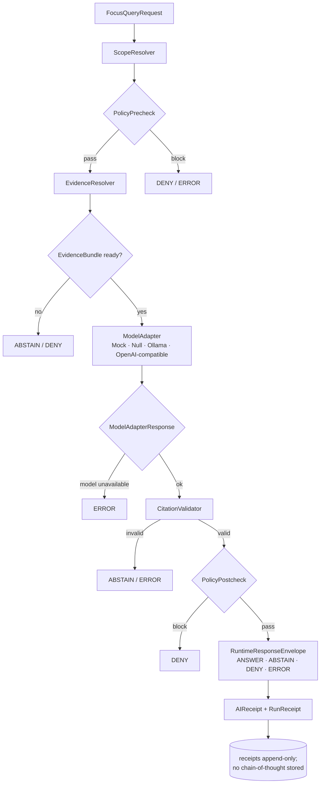

<!-- [KFM_META_BLOCK_V2]
doc_id: kfm://doc/architecture/governed-ai/readme
title: Governed AI Subsystem
type: standard
version: v1
status: draft
owners: Docs steward + governed-AI subsystem owner
created: 2026-05-09
updated: 2026-05-09
policy_label: public
related:
  - docs/architecture/README.md
  - docs/architecture/governed-ai/STATE_OWNERSHIP.md
  - docs/architecture/governed-ai/ROUTE_MAP.md
  - docs/architecture/governed-ai/BOUNDARIES.md
  - docs/architecture/governed-ai/FOCUS_FLOW.md
  - docs/architecture/governed-ai/CONTINUITY_NOTES.md
  - docs/architecture/governed-api.md
  - docs/architecture/evidence-flow.md
  - docs/architecture/focus-mode.md
  - docs/architecture/evidence-drawer-ai-implications.md
  - docs/governance/cite-or-abstain.md
  - docs/doctrine/directory-rules.md
  - contracts/OBJECT_MAP.md
tags: [kfm, architecture, governed-ai, focus-mode, evidence]
notes:
  - Repository unmounted in authoring session; every repo-shape claim is PROPOSED until verified.
  - Folder placement justified by Directory Rules §6.1 (docs/architecture/) and the Whole-UI + Governed AI Expansion Report Appendix A.
[/KFM_META_BLOCK_V2] -->

# Governed AI Subsystem

> **Adapter-first, evidence-subordinate, finite-outcome AI runtime behind a governed API.**
> Models are interpretive. **EvidenceBundle and policy outrank generated language.**

[](#11-implementation-status)
[](../../doctrine/truth-posture.md)
[](../../governance/cite-or-abstain.md)
[](#7-finite-outcomes)
[](#8-provider-neutral-adapter-ladder)
[](#10-trust-boundaries-summary)
[](#11-implementation-status)

| Field | Value |
|---|---|
| **Folder** | `docs/architecture/governed-ai/` |
| **Authority level** | Implementation-bearing (doctrinal); **PROPOSED** until cross-checked against mounted-repo evidence |
| **Owner** | Docs steward + governed-AI subsystem owner |
| **Reviewers** | Docs steward + at least one subsystem owner; ADR required to change adapter boundary or schema home |
| **Doctrinal basis** | Governed AI Extended Pro Source Ledger Report; Whole-UI + Governed AI Expansion Report; Build Companion §16; KFM Encyclopedia §8.C |
| **Lifecycle invariant** | RAW → WORK / QUARANTINE → PROCESSED → CATALOG / TRIPLET → PUBLISHED. Promotion is a **governed state transition, not a file move.** |

**Quick jump:**
[Scope](#1-scope--purpose) ·
[Repo fit](#2-repo-fit) ·
[Inputs](#3-what-belongs-here-inputs) ·
[Exclusions](#4-what-does-not-belong-here-exclusions) ·
[Tree](#5-directory-tree) ·
[Runtime](#6-runtime-flow) ·
[Outcomes](#7-finite-outcomes) ·
[Adapters](#8-provider-neutral-adapter-ladder) ·
[Objects](#9-object-families--homes) ·
[Boundaries](#10-trust-boundaries-summary) ·
[Status](#11-implementation-status) ·
[Gates](#12-readiness-gates--task-list) ·
[Failures](#13-failure-state-reference) ·
[Continuity](#14-continuity--lineage-notes) ·
[Open questions](#15-open-questions) ·
[Related](#16-related-documents)

---

## 1. Scope & Purpose

This folder is the **doctrinal home for the governed-AI subsystem**: how Focus Mode, the evidence resolver, the model adapter, the citation validator, and the runtime response envelope fit together behind the public trust membrane.

The subsystem exists to give KFM users **bounded, cited, evidence-subordinate** answers — and to make abstention, denial, and error first-class outcomes rather than failure modes that get smoothed over by fluent text.

Three commitments anchor everything below:

1. **Evidence outranks generation.** `EvidenceRef` resolves to `EvidenceBundle` *before* any model call, and citations are validated *against* the bundle *after* the call.
2. **Provider-neutral adapter.** A small `ModelAdapter` interface — `MockAdapter` first — fixes the contract before any provider (Ollama, OpenAI-compatible, future runtimes) is wired.
3. **Finite outcomes.** Every Focus call resolves to **`ANSWER` | `ABSTAIN` | `DENY` | `ERROR`** with reason codes. No fluent fallback ever substitutes for a missing or denied bundle.

> [!IMPORTANT]
> Documentation is part of the working system, but it does not decide. Schemas (`schemas/`), contracts (`contracts/`), policy (`policy/`), and tests (`tests/`) decide. This folder explains.

---

## 2. Repo Fit

`docs/architecture/governed-ai/` sits alongside its peer subsystems under `docs/architecture/`, refines (but does not contradict) `docs/architecture/governed-api.md`, and is governed by `docs/doctrine/directory-rules.md`.

```
docs/
├── README.md
├── doctrine/
│   ├── directory-rules.md            # placement authority
│   ├── truth-posture.md
│   └── trust-membrane.md
├── architecture/
│   ├── README.md                     # subsystem map
│   ├── governed-api.md               # public boundary
│   ├── evidence-flow.md              # EvidenceRef → EvidenceBundle
│   ├── focus-mode.md                 # Focus surface specifics
│   ├── evidence-drawer-ai-implications.md
│   ├── ui/                           # peer subsystem
│   ├── governed-ai/                  # ◀ this folder
│   ├── story/                        # peer subsystem
│   └── review/                       # peer subsystem
├── governance/cite-or-abstain.md
└── registers/                        # AUTHORITY_LADDER, DRIFT_REGISTER, VERIFICATION_BACKLOG
```

**Upstream docs (govern this folder):**
[`docs/doctrine/directory-rules.md`](../../doctrine/directory-rules.md) ·
[`docs/architecture/README.md`](../README.md) ·
[`docs/architecture/governed-api.md`](../governed-api.md)

**Downstream docs (refined by this folder):**
[`docs/architecture/focus-mode.md`](../focus-mode.md) ·
[`docs/architecture/evidence-flow.md`](../evidence-flow.md) ·
[`docs/architecture/evidence-drawer-ai-implications.md`](../evidence-drawer-ai-implications.md)

**Machine-checkable peers (homes referenced from here):**
`contracts/OBJECT_MAP.md` · `schemas/contracts/v1/ai/` · `schemas/contracts/v1/focus/` · `schemas/contracts/v1/runtime/` · `policy/ai/` · `policy/focus/` · `tests/fixtures/ai/` · `tests/fixtures/focus/` *(all PROPOSED)*

> [!NOTE]
> **Directory Rules basis.** This subsystem folder follows the §3 deeper rule (a docs subdirectory carries a repo-wide responsibility — *explaining a governance subsystem*) and the §6.1 sub-tree pattern. The peer set (`ui/`, `governed-ai/`, `story/`, `review/`) is taken from the Whole-UI + Governed AI Expansion Report Appendix A and is **PROPOSED** until reconciled with the mounted repo.

---

## 3. What Belongs Here (Inputs)

This folder MUST hold only **human-facing doctrinal Markdown** about the governed-AI subsystem. Concretely:

- Subsystem **README** (this file).
- **State ownership** — which component owns Focus request, evidence retrieval, adapter call, citation validation, and response envelope state.
- **Route map** — which API surfaces are governed-AI-bearing.
- **Boundaries** — what the browser, the API, and the model runtime are forbidden to do.
- **Focus flow** — request lifecycle, including failure transitions.
- **Continuity notes** — how prior governed-AI reports map forward, what is preserved/extended/superseded/deferred.

Files MUST cite their source basis (Project Source Ledger entries, ADRs, schemas, or upstream doctrine) and MUST mark every implementation claim with a truth label: **CONFIRMED**, **INFERRED**, **PROPOSED**, **UNKNOWN**, or **NEEDS VERIFICATION**.

---

## 4. What Does Not Belong Here (Exclusions)

The following SHALL live elsewhere. Drift entries open in `docs/registers/DRIFT_REGISTER.md` if any of these appear here.

| Not here | Goes here instead | Why |
|---|---|---|
| Executable JSON Schemas | `schemas/contracts/v1/ai/`, `schemas/contracts/v1/focus/`, `schemas/contracts/v1/runtime/` | Shape lives in `schemas/`, per ADR-0001. |
| Object-meaning definitions | `contracts/` (with `contracts/OBJECT_MAP.md` crosswalk) | `docs/` explains; `contracts/` defines meaning. |
| OPA / policy bundles | `policy/ai/`, `policy/focus/`, `policy/export/` | Admissibility lives in `policy/`. |
| Runtime adapter source | `apps/governed-api/src/ai/`, `runtime/` | Code, not docs. |
| Test fixtures | `tests/fixtures/ai/`, `tests/fixtures/focus/` | Proof, not prose. |
| Validators | `tools/validators/ai/`, `tools/validators/focus/` | Repo-wide validation lives in `tools/`. |
| Receipts / proofs / manifests | `data/receipts/`, `data/proofs/`, `release/` | Trust-bearing artifacts are not docs. |
| Provider-specific operational guides (Ollama, OpenAI-compatible) | `docs/runbooks/governed_ai_LOCAL_DEV.md`, `docs/runbooks/governed_ai_VALIDATION.md`, `docs/runbooks/governed_ai_ROLLBACK.md` | Operations live in runbooks, not architecture docs. |
| Domain-specific source rules (archaeology, hazards, fauna) | `docs/domains/<domain>/` | Domain segments under their lane, not here. |
| Architecture Decision Records | `docs/adr/` | ADRs are first-class governance objects. |

> [!WARNING]
> **No raw model output, no provider-specific behavior coupling, and no RAW/WORK/QUARANTINE references** belong in any document under this folder. If an explanation requires those, it belongs in a steward-facing runbook or an ADR with sensitivity gating.

---

## 5. Directory Tree

PROPOSED layout per the Whole-UI + Governed AI Expansion Report (Appendix A). Files are CREATE-PROPOSED unless mounted-repo evidence says otherwise.

```
docs/architecture/governed-ai/
├── README.md             # this file — overview & adapter-first runtime boundary
├── STATE_OWNERSHIP.md    # who owns Focus, evidence, adapter, citation, envelope state
├── ROUTE_MAP.md          # Focus + AI-adjacent API surfaces and shapes
├── BOUNDARIES.md         # no-direct-model-call, no RAW/WORK/QUARANTINE, no prompt telemetry
├── FOCUS_FLOW.md         # request lifecycle and failure-state transitions
└── CONTINUITY_NOTES.md   # carries prior governed-AI reports forward
```

---

## 6. Runtime Flow

The diagram below traces a single Focus request from scope intake to receipt emission. Every arrow is **fail-closed**: any unsatisfied step short-circuits to `ABSTAIN`, `DENY`, or `ERROR` — never to fluent guessing.



Key invariants visible in the flow:

- **EvidenceRef → EvidenceBundle resolves before the model call.** No model ever sees a pointer it cannot prove.
- **Policy runs twice.** Precheck guards inputs (rights, sensitivity, release state, source authority, ledger presence). Postcheck guards outputs (citations, obligations, leakage).
- **Citation validation is non-optional.** Claims must trace to the bundle and the Project Source Ledger.
- **Receipts are process memory, not evidence.** Receipts log adapter, context hash, prompt/template hash, output hash, and validation result — never private chain-of-thought.

---

## 7. Finite Outcomes

Every Focus response is exactly one of four outcomes. Negative states are **first-class** and the API contract MUST surface them with reason codes.

| Outcome | Meaning | Public surface |
|---|---|---|
| **`ANSWER`** | Released, policy-safe evidence exists; citations validate; obligations satisfied. | Cited prose + `evidence_bundle_refs` + obligations. |
| **`ABSTAIN`** | Evidence insufficient, conflicting, stale, unresolved, or out of scope. | `reason_code` + bounded explanation; never a fluent fallback. |
| **`DENY`** | Policy, rights, sensitivity, sovereignty, or sovereignty-adjacent concern blocks the response. | `reason_code` + (where allowed) generalized derivative. |
| **`ERROR`** | System or validator failure (model unavailable, policy engine down, schema invalid). | `reason_code`; **never** substituted with generated text. |

> [!CAUTION]
> Adding a fifth outcome is a **schema-significant change**. It requires an ADR amending the runtime contract, a schema version bump, fixture parity, and a correction notice path for any released artifact citing the old enum.

---

## 8. Provider-Neutral Adapter Ladder

The `ModelAdapter` contract is fixed **before** any provider is wired. `MockAdapter` is first so CI can validate envelopes, citation validation, policy gates, and receipt behavior **without** network or model nondeterminism.

| Adapter | Purpose | Allowed scope | First-slice status |
|---|---|---|---|
| **MockAdapter** | Deterministic test adapter returning fixture-controlled structured outputs. | Local fixtures only; no network/model. | First implementation (PROPOSED). |
| **NullAdapter** | Explicit non-answer adapter for safety, offline, or disabled runtime. | Returns `ERROR`/`ABSTAIN` with reason. | Implement alongside MockAdapter (PROPOSED). |
| **OllamaAdapter** | Local/private runtime behind governed API only. | Released, policy-safe `EvidenceBundle` context; localhost/private network; no browser direct calls. | Deferred until contracts/tests pass. |
| **OpenAICompatibleAdapter** | Provider/API-compatible behind governed API only. | Same `ModelAdapter` contract; no provider-specific public behavior. | Deferred until contracts/tests pass and external product facts re-checked. |

**Adapter methods (PROPOSED):** `generate_structured()`, `embed()`, `health()`, `model_info()`.
**Provider choice is internal** after the contract is fixed; public behavior MUST NOT couple to Ollama, OpenAI, Anthropic, GGUF, or any specific runtime.

---

## 9. Object Families & Homes

These are the families this subsystem touches. Schema/policy/test/validator paths are PROPOSED per the Governed AI Extended Pro Source Ledger Report.

| Family | Truth role | Schema home (PROPOSED) | Policy home (PROPOSED) |
|---|---|---|---|
| `FocusQueryRequest` | Inbound user/UI scope | `schemas/contracts/v1/focus/focus_request.schema.json` | `policy/focus/` |
| `EvidenceRef` | Pointer to evidence | `schemas/contracts/v1/evidence/evidence_ref.schema.json` | `policy/evidence/` |
| `EvidenceBundle` | Release-grade evidence support | `schemas/contracts/v1/evidence/evidence_bundle.schema.json` | `policy/evidence/` |
| `ModelAdapterRequest` | Provider-neutral input post-resolution | `schemas/contracts/v1/ai/model_adapter_request.schema.json` | `policy/ai/` |
| `ModelAdapterResponse` | Provider-neutral output pre-validation | `schemas/contracts/v1/ai/model_adapter_response.schema.json` | `policy/ai/` |
| `CitationValidationReport` | Claim-vs-evidence validator output | `schemas/contracts/v1/ai/citation_validation_report.schema.json` | `policy/ai/` |
| `DecisionEnvelope` | Normalized policy outcome | `schemas/contracts/v1/runtime/decision_envelope.schema.json` | `policy/runtime/` |
| `RuntimeResponseEnvelope` | Finite public envelope | `schemas/contracts/v1/runtime/runtime_response_envelope.schema.json` | `policy/runtime/` |
| `AIReceipt` | Append-only AI-call process memory | `schemas/contracts/v1/runtime/ai_receipt.schema.json` | `policy/runtime/` |
| `RunReceipt` | Append-only non-AI run process memory | `schemas/contracts/v1/runtime/run_receipt.schema.json` | `policy/runtime/` |

> [!NOTE]
> The subsystem **does not own** these object meanings. `contracts/` owns meaning; `schemas/` owns shape; `policy/` owns admissibility; this folder explains the *role each plays in the governed-AI flow*.

---

## 10. Trust Boundaries (Summary)

Full detail in [`BOUNDARIES.md`](BOUNDARIES.md). The headline rules:

> [!IMPORTANT]
> **Browser MUST NOT** call Ollama, OpenAI, a local model runtime, a vector database, a graph store, or an object store directly.
> **Public API MUST NOT** read RAW, WORK, QUARANTINE, canonical stores, or unpublished candidates.
> **Receipts MUST NOT** store chain-of-thought; they store input/output hashes, validation result, and citations.
> **Source content** (Markdown, YAML, JSON, map labels, transcripts) is **data, not instructions** — strip or isolate any embedded tool directives before model context.
> **Citations MUST resolve to `EvidenceBundle` items**, not to model output itself.

---

## 11. Implementation Status

| Surface | Doctrine | Repo evidence (this session) |
|---|---|---|
| Subsystem doctrine (this folder) | **CONFIRMED** anchor in source corpus. | **PROPOSED** — no mounted repo to confirm files exist. |
| `ModelAdapter` contract | **PROPOSED** doctrine; MockAdapter-first. | **UNKNOWN** — no source code visible. |
| `EvidenceRef` → `EvidenceBundle` resolver | **PROPOSED** doctrine. | **UNKNOWN** — `apps/governed-api/src/evidence/evidenceResolver.*` not verified. |
| Citation validator | **PROPOSED** doctrine. | **UNKNOWN** — `tools/validators/ai/` not verified. |
| Policy precheck/postcheck | **PROPOSED** doctrine. | **UNKNOWN** — `policy/ai/` not verified. |
| `RuntimeResponseEnvelope` schema | **PROPOSED** shape. | **UNKNOWN** — `schemas/contracts/v1/runtime/` not verified. |
| Focus route binding | **PROPOSED** route. | **UNKNOWN** — `apps/governed-api/openapi/ai.openapi.yaml` not verified. |
| OpenAPI surface | **PROPOSED**. | **UNKNOWN** — framework/route convention not verified. |
| End-to-end runtime proof fixtures | **PROPOSED**. | **UNKNOWN** — `tests/e2e/runtime_proof/ai/*` not verified. |

> [!NOTE]
> Until the repository is mounted and inspected, every "this exists" claim about implementation belongs in [`docs/registers/VERIFICATION_BACKLOG.md`](../../registers/VERIFICATION_BACKLOG.md), not in prose here.

---

## 12. Readiness Gates / Task List

Definition-of-done for the governed-AI thin slice. Items are **gates**, not nice-to-haves — each blocks the next.

- [ ] **Contract gate** — `ModelAdapter` interface frozen with `generate_structured()`, `embed()`, `health()`, `model_info()`; ADR recorded.
- [ ] **Schema gate** — Focus, evidence, AI, runtime, and receipt schemas land under `schemas/contracts/v1/` with `additionalProperties: false` where appropriate; positive + negative fixtures parity-checked.
- [ ] **Resolver gate** — `EvidenceRef` → `EvidenceBundle` resolver passes its full test matrix (valid public, missing target, unknown rights, sensitive exact location, stale, conflicting sources, model layer cited as evidence, supersession).
- [ ] **MockAdapter gate** — deterministic outputs drive `ANSWER`/`ABSTAIN`/`DENY`/`ERROR` end-to-end without network.
- [ ] **Citation validator gate** — every claim traces to the bundle and the Project Source Ledger; uncited claims yield `ABSTAIN` or `ERROR`.
- [ ] **Policy gate** — precheck and postcheck fail-closed when policy or ledger unavailable; obligations carried in `DecisionEnvelope`.
- [ ] **Envelope gate** — finite outcomes enforced; no fluent fallback path exists in code review.
- [ ] **Receipt gate** — `AIReceipt` and `RunReceipt` append-only, no chain-of-thought stored, hashes verifiable.
- [ ] **Boundary gate** — no direct browser-to-model traffic; no RAW/WORK/QUARANTINE reads from the public path; CI test denies any such call.
- [ ] **Documentation propagation gate** — `STATE_OWNERSHIP.md`, `ROUTE_MAP.md`, `BOUNDARIES.md`, `FOCUS_FLOW.md`, and `CONTINUITY_NOTES.md` are updated alongside any material behavior change.
- [ ] **Rollback gate** — feature flag, route disable, and revert PR rehearsed; fixtures retained as lineage.

---

## 13. Failure-State Reference

<details>
<summary><strong>Failure state → outcome mapping (Governed AI Extended Pro §13.1)</strong></summary>

| Failure state | Outcome | Note |
|---|---|---|
| `NO_EVIDENCE` | `ABSTAIN` | No released evidence in scope. |
| `EVIDENCE_NOT_PUBLISHED` | `DENY` | Candidate or unpublished evidence is not runtime context. |
| `EVIDENCE_POLICY_BLOCKED` | `DENY` | Rights/sensitivity/policy block. |
| `EVIDENCE_STALE` | `ABSTAIN` | Freshness below threshold unless stale answer is explicitly allowed. |
| `EVIDENCE_CONFLICTED` | `ABSTAIN` | Conflicting evidence needs review. |
| `SCOPE_TOO_BROAD` | `ABSTAIN` | Ask for narrower map/time/source scope. |
| `SENSITIVE_LOCATION_REDACTED` | `ANSWER` (generalized) or `DENY` | Answer only at generalized scope if policy allows. |
| `POLICY_ENGINE_UNAVAILABLE` | `ERROR` | Fail closed. |
| `CITATION_INVALID` | `ABSTAIN` or `ERROR` | Invalid claims cannot be released. |
| `MODEL_UNAVAILABLE` | `ERROR` | No fluent fallback. |
| `SOURCE_UNRESOLVED` | `ABSTAIN` | Source ID or `EvidenceRef` cannot resolve. |
| `SOURCE_AUTHORITY_CONFLICT` | `ABSTAIN` | Review needed. |
| `SOURCE_LEDGER_MISSING` | `ERROR` | Source governance absent. |
| `PROJECT_SOURCE_NOT_ACCESSIBLE` | `ABSTAIN` | Preserve unresolved reference; do not cite as verified. |

</details>

---

## 14. Continuity & Lineage Notes

Full lineage in [`CONTINUITY_NOTES.md`](CONTINUITY_NOTES.md). Headlines:

- The current Governed AI Extended Pro Source Ledger Report **supersedes** prior governed-AI PDF reports (`KFM-AI-EXT-PRO-2/3/6/7/8/FINAL`, `KFM-AI-EXT-PRO-BASE`, `KFM-AI-EXPANSION`). Prior reports are retained as **lineage**, not as independent implementation evidence.
- Convergent themes across the lineage — provider-neutral adapter, MockAdapter-first, `EvidenceBundle`-before-model, citation validation, policy gates, Focus/Evidence-Drawer separation — are **continuity signals**, not proof.
- Every prior file home named in this folder is **PROPOSED** until reconciled with the mounted repo. Reconciliation events are tracked in [`docs/registers/CANONICAL_LINEAGE_EXPLORATORY.md`](../../registers/CANONICAL_LINEAGE_EXPLORATORY.md) and [`docs/registers/DRIFT_REGISTER.md`](../../registers/DRIFT_REGISTER.md).

---

## 15. Open Questions

> [!TIP]
> A subsystem README without open questions is suspect. These are tracked in `docs/registers/VERIFICATION_BACKLOG.md`.

- **NEEDS VERIFICATION:** Whether `apps/governed-api/` (kebab) or `apps/governed_api/` (snake) is the live convention. Doctrine sources show both spellings.
- **NEEDS VERIFICATION:** Whether `schemas/contracts/v1/ai/`, `schemas/contracts/v1/focus/`, and `schemas/contracts/v1/runtime/` exist as separate trees or are merged.
- **OPEN:** How `DecisionEnvelope` obligations (e.g., `redact_geometry`, `steward_review`) compose with `RuntimeResponseEnvelope` — strictly advisory, or capable of forcing a downstream gate?
- **OPEN:** Replay-verification cadence — `same evidence + prompt + model + seed → same receipt hash` is doctrine; tooling and storage of replay caches are unspecified.
- **OPEN:** Prompt-contract registry shape — versioned, hashed `system + input + output schema + model-pin` per AI use case, but no schema home is yet ADR-fixed.
- **NEEDS VERIFICATION:** Whether `AIReceipt` and `RunReceipt` share a base envelope or are sibling top-level schemas.

---

## 16. Related Documents

**Doctrine (upstream):**
[`docs/doctrine/directory-rules.md`](../../doctrine/directory-rules.md) ·
[`docs/doctrine/truth-posture.md`](../../doctrine/truth-posture.md) ·
[`docs/doctrine/trust-membrane.md`](../../doctrine/trust-membrane.md) ·
[`docs/governance/cite-or-abstain.md`](../../governance/cite-or-abstain.md)

**Architecture peers:**
[`docs/architecture/README.md`](../README.md) ·
[`docs/architecture/governed-api.md`](../governed-api.md) ·
[`docs/architecture/evidence-flow.md`](../evidence-flow.md) ·
[`docs/architecture/focus-mode.md`](../focus-mode.md) ·
[`docs/architecture/evidence-drawer-ai-implications.md`](../evidence-drawer-ai-implications.md) ·
[`docs/architecture/source-ledger.md`](../source-ledger.md)

**Subsystem siblings (this folder):**
[`STATE_OWNERSHIP.md`](STATE_OWNERSHIP.md) ·
[`ROUTE_MAP.md`](ROUTE_MAP.md) ·
[`BOUNDARIES.md`](BOUNDARIES.md) ·
[`FOCUS_FLOW.md`](FOCUS_FLOW.md) ·
[`CONTINUITY_NOTES.md`](CONTINUITY_NOTES.md)

**Runbooks (operations):**
[`docs/runbooks/governed_ai_LOCAL_DEV.md`](../../runbooks/governed_ai_LOCAL_DEV.md) ·
[`docs/runbooks/governed_ai_VALIDATION.md`](../../runbooks/governed_ai_VALIDATION.md) ·
[`docs/runbooks/governed_ai_ROLLBACK.md`](../../runbooks/governed_ai_ROLLBACK.md)

**Crosswalks:**
[`contracts/OBJECT_MAP.md`](../../../contracts/OBJECT_MAP.md) ·
[`docs/registers/AUTHORITY_LADDER.md`](../../registers/AUTHORITY_LADDER.md) ·
[`docs/registers/VERIFICATION_BACKLOG.md`](../../registers/VERIFICATION_BACKLOG.md) ·
[`docs/registers/DRIFT_REGISTER.md`](../../registers/DRIFT_REGISTER.md)

**ADRs (file-home and trust-boundary decisions, PROPOSED):**
`docs/adr/ADR-0001-schema-home.md` ·
`docs/adr/ADR-focus-model-adapter-boundary.md`

---

<details>
<summary><strong>Appendix A — Glossary (collapsed)</strong></summary>

- **EvidenceRef** — small typed pointer (`ref_id`, `target{spec_hash, expected_bundle_digest}`, `resolution{strategy, environment}`, `policy{require_signatures, require_checks_pass, fail_closed}`) the runtime resolves to an `EvidenceBundle` before any claim is rendered.
- **EvidenceBundle** — release-grade support object containing identity, scope, evidence items, source posture, review/release state, limitations, and correction lineage.
- **DecisionEnvelope** — normalized policy output: `{decision_id, outcome ∈ {ANSWER, ABSTAIN, DENY, ERROR}, policy_family, reasons[], obligations[], evaluated_at}`.
- **RuntimeResponseEnvelope** — finite public envelope returned by Focus and AI-adjacent surfaces; carries citations, evidence refs, policy refs, release/review/correction state, reason codes, limitations.
- **AIReceipt** — append-only AI-call process memory: model adapter, context hash, prompt/template hash, output hash, validation result. **No** chain-of-thought.
- **Cite-or-abstain** — KFM truth posture. A consequential claim either cites resolvable evidence or abstains; fluent fallback is forbidden.
- **Trust membrane** — the boundary between public clients and canonical/internal stores; the public path runs through governed APIs and released artifacts only.

</details>

[↑ Back to top](#governed-ai-subsystem)
