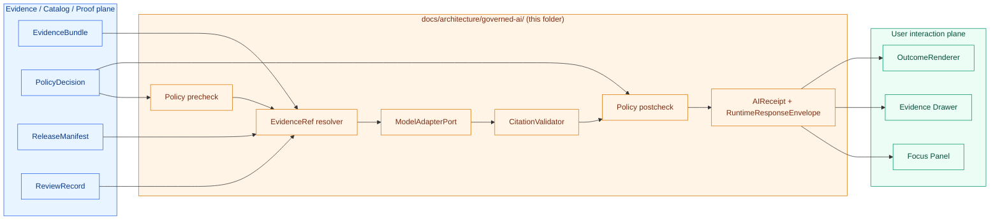
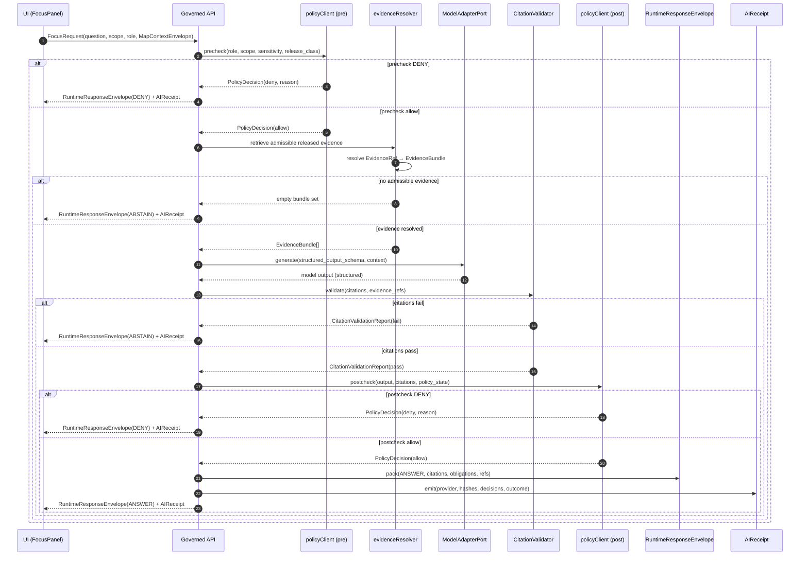

<!-- [KFM_META_BLOCK_V2]
doc_id: kfm://doc/architecture-governed-ai-readme
title: Governed AI Subsystem — Architecture README
type: standard
version: v1
status: draft
owners: Docs steward + Governed AI subsystem owner (TODO: confirm via CODEOWNERS)
created: 2026-05-15
updated: 2026-05-15
policy_label: public
related:
  - docs/architecture/README.md
  - docs/architecture/ui/README.md
  - docs/architecture/ui/EVIDENCE_DRAWER.md
  - docs/architecture/governed-ai/STATE_OWNERSHIP.md
  - docs/architecture/governed-ai/ROUTE_MAP.md
  - docs/architecture/governed-ai/BOUNDARIES.md
  - docs/architecture/governed-ai/FOCUS_FLOW.md
  - docs/architecture/governed-ai/CONTINUITY_NOTES.md
  - docs/architecture/contract-schema-policy-split.md
  - docs/doctrine/trust-membrane.md
  - docs/doctrine/truth-posture.md
  - docs/doctrine/authority-ladder.md
  - docs/doctrine/lifecycle-law.md
  - docs/doctrine/directory-rules.md
  - docs/runbooks/governed_ai_LOCAL_DEV.md
  - docs/runbooks/governed_ai_VALIDATION.md
  - docs/runbooks/governed_ai_ROLLBACK.md
  - docs/adr/ADR-focus-model-adapter-boundary.md
  - docs/adr/ADR-ui-schema-home.md
  - docs/registers/CANONICAL_LINEAGE_EXPLORATORY.md
  - docs/registers/DRIFT_REGISTER.md
  - docs/registers/VERIFICATION_BACKLOG.md
  - contracts/OBJECT_MAP.md
  - schemas/contracts/v1/runtime/runtime_response_envelope.schema.json
  - schemas/contracts/v1/focus/focus_request.schema.json
  - schemas/contracts/v1/focus/focus_response.schema.json
  - schemas/contracts/v1/runtime/ai_receipt.schema.json
  - schemas/contracts/v1/runtime/decision_envelope.schema.json
  - tests/fixtures/focus/README.md
  - tests/fixtures/runtime/README.md
  - policy/runtime/README.md
  - policy/focus/README.md
  - runtime/model_adapters/README.md
  - runtime/mock/README.md
  - runtime/ollama/README.md
tags: [kfm, architecture, governed-ai, focus-mode, ai-receipt, runtime-envelope, citation-validation, policy, model-adapter, mockadapter, ollama, trust-membrane]
notes:
  - All implementation-layer paths are PROPOSED until verified against mounted-repo evidence (Directory Rules §0).
  - This README is doctrine-bearing; specific schema files, route names, and adapter homes are placement proposals.
  - Reconciliation note: provider-neutral MockAdapter-first posture (UIAI-GAI) precedes admitting Ollama as a replaceable runtime (UIAI-OLLAMA).
[/KFM_META_BLOCK_V2] -->

# Governed AI Subsystem — Architecture README

> **AI is interpretive, not authoritative.** The Governed AI subsystem is the bounded runtime slice where evidence-subordinate language can be produced — behind the governed API, after policy precheck and EvidenceBundle resolution, with citation validation, finite outcomes, and an AIReceipt. Fluent generation never substitutes for evidence, policy, review state, release state, or source authority.


**Status:** `draft` · **Authority level:** implementation-bearing · **Owners:** Docs steward + Governed AI subsystem owner *(TODO — assign in CODEOWNERS)* · **Last reviewed:** `2026-05-15` · **Repo-state truth label:** PROPOSED

---

## Mini-TOC

1. [Purpose](#1--purpose)
2. [Authority level](#2--authority-level)
3. [What belongs here](#3--what-belongs-here)
4. [What does NOT belong here](#4--what-does-not-belong-here)
5. [Repo fit](#5--repo-fit)
6. [Proposed directory tree](#6--proposed-directory-tree)
7. [Inputs](#7--inputs)
8. [Outputs](#8--outputs)
9. [Core doctrine](#9--core-doctrine)
10. [Object families and homes](#10--object-families-and-homes)
11. [Finite outcomes — the trust grammar](#11--finite-outcomes--the-trust-grammar)
12. [The governed AI request flow](#12--the-governed-ai-request-flow)
13. [Adapter boundary](#13--adapter-boundary)
14. [Citation validation](#14--citation-validation)
15. [Policy precheck and postcheck](#15--policy-precheck-and-postcheck)
16. [AIReceipt and replay discipline](#16--aireceipt-and-replay-discipline)
17. [Trust membrane and exposure controls](#17--trust-membrane-and-exposure-controls)
18. [Validation](#18--validation)
19. [Sibling docs in this folder](#19--sibling-docs-in-this-folder)
20. [Anti-patterns](#20--anti-patterns)
21. [Update propagation](#21--update-propagation)
22. [Rollback](#22--rollback)
23. [Review burden](#23--review-burden)
24. [ADRs](#24--adrs)
25. [Open questions and verification backlog](#25--open-questions-and-verification-backlog)
26. [Related folders](#26--related-folders)
27. [Last reviewed](#27--last-reviewed)

---

## 1 · Purpose

The Governed AI subsystem is **the only path** by which KFM may produce model-mediated language for any user, agent, or downstream surface. It exists to:

- Subordinate generative output to **EvidenceBundle**, **PolicyDecision**, **ReviewRecord**, **ReleaseManifest**, and **CitationValidationReport** — never the other way around.
- Enforce a **finite outcome grammar** at every governed AI surface: `ANSWER` · `ABSTAIN` · `DENY` · `ERROR`.
- Keep model runtimes (`MockAdapter`, eventually Ollama or another provider) **behind the governed API**, never on the public client path.
- Emit an **AIReceipt** for every call — provider, model identity, evidence refs, policy decisions, citation report, and finite outcome — so each answer is replayable, auditable, and rollback-aware.
- Refuse to publish or expose model output that bypasses evidence resolution, citation validation, policy gates, release state, correction lineage, or rollback discipline.

This folder owns the **doctrine, contracts, and boundaries** of that runtime slice. It does not own model weights, provider credentials, or live runtime configuration — those live behind `runtime/`, `infra/`, and `configs/` per Directory Rules §10.

[Back to top](#governed-ai-subsystem--architecture-readme)

---

## 2 · Authority level

| Field | Value |
|---|---|
| **Authority class** | Implementation-bearing (`docs/architecture/<subsystem>/` per Directory Rules §6.1) |
| **Doctrine status** | CONFIRMED — evidence-subordinate AI, finite outcomes, no direct public model client, citation validation required |
| **Implementation status** | PROPOSED — adapters, route names, schema files, and CI workflows are not verified against a mounted repo in this session |
| **Schema home** | `schemas/contracts/v1/runtime/…` and `schemas/contracts/v1/focus/…` (per ADR-0001; PROPOSED) |
| **Reviewers** | Docs steward + Governed AI subsystem owner + Security steward for boundary changes |
| **Supersedes** | Prior UIAI-GAI and UIAI-OLLAMA PDF reports — those documents remain doctrinal lineage; this README is the operational architecture statement |
| **Related doctrine** | `docs/doctrine/trust-membrane.md`, `docs/doctrine/truth-posture.md`, `docs/doctrine/authority-ladder.md`, `docs/doctrine/directory-rules.md` |

[Back to top](#governed-ai-subsystem--architecture-readme)

---

## 3 · What belongs here

This folder contains **architecture documentation** for the Governed AI runtime slice. Accepted contents:

- `README.md` — this overview.
- `STATE_OWNERSHIP.md` — focus request lifecycle, evidence retrieval ownership, adapter ownership, citation validator ownership, response envelope ownership.
- `ROUTE_MAP.md` — Focus and AI-adjacent governed API surfaces.
- `BOUNDARIES.md` — what the subsystem MUST NOT touch (no direct model browser call, no RAW/WORK/QUARANTINE read, no prompt telemetry leakage).
- `FOCUS_FLOW.md` — the end-to-end Focus Mode flow with envelope and receipt linkage.
- `CONTINUITY_NOTES.md` — carries prior UIAI-GAI / UIAI-OLLAMA report content forward into the operating architecture.
- Topic-specific Markdown that genuinely belongs to **subsystem doctrine** (e.g., `STRUCTURED_OUTPUT.md`, `MOCK_ADAPTER_CONTRACT.md`) when warranted.

[Back to top](#governed-ai-subsystem--architecture-readme)

---

## 4 · What does NOT belong here

| Forbidden content | Where it goes |
|---|---|
| Executable schema files (`*.schema.json`) | `schemas/contracts/v1/runtime/…`, `schemas/contracts/v1/focus/…` |
| Object-meaning contracts | `contracts/runtime/…`, `contracts/focus/…` (canonical meaning lives there per Directory Rules §6) |
| Policy gate logic (Rego, conftest) | `policy/runtime/…`, `policy/focus/…` |
| Provider-neutral adapter interfaces | `runtime/model_adapters/` |
| Local model runtime (Ollama) | `runtime/ollama/` (never a public surface) |
| Deterministic test adapter | `runtime/mock/` |
| Backend AI route handlers | `apps/governed-api/src/ai/…` *(PROPOSED — verify framework before placement)* |
| Test fixtures | `tests/fixtures/focus/`, `tests/fixtures/runtime/` |
| Emitted AIReceipt instances | `data/receipts/ai/`, `data/receipts/runtime/` |
| Reverse-proxy / VPN / CORS posture | `infra/reverse_proxy/`, `infra/vpn/`, `infra/firewall/` |
| Operational runbooks | `docs/runbooks/governed_ai_*.md` |
| ADR records | `docs/adr/ADR-*.md` |
| Source-rights / sensitivity policy | `policy/sensitivity/`, `data/registry/sources/` |

> [!CAUTION]
> Provider credentials, model weights, prompt templates with embedded secrets, real source endpoints, and tokens **never** belong in this folder — not even in examples. `configs/` MUST NOT store real secrets per Directory Rules §10.3.

[Back to top](#governed-ai-subsystem--architecture-readme)

---

## 5 · Repo fit

The Governed AI subsystem sits at the boundary between the **evidence/catalog/proof plane** (upstream) and the **user interaction plane** (downstream). It is **never a sovereign source of truth.**



**Upstream dependency:** the Governed AI subsystem cannot operate without resolved EvidenceBundles, an evaluated PolicyDecision, and a current ReleaseManifest. Missing any of these MUST produce `ABSTAIN`, `DENY`, or `ERROR` — never a fluent guess.

**Downstream consumer:** the UI subsystem (`docs/architecture/ui/`) renders Governed AI output through `EvidenceDrawer`, `FocusPanel`, and `OutcomeRenderer`. UI components MUST NOT bypass the governed API and call a model adapter directly.

[Back to top](#governed-ai-subsystem--architecture-readme)

---

## 6 · Proposed directory tree

> [!IMPORTANT]
> This tree is **PROPOSED** — paths, filenames, and existence are unverified against a mounted KFM repository. Per Directory Rules §0 and §2.5, do not silently treat this as repo state. If repo evidence diverges, open a drift entry in `docs/registers/DRIFT_REGISTER.md`.

```text
docs/architecture/governed-ai/
├── README.md                    # this file — doctrine, object map, sibling index
├── STATE_OWNERSHIP.md           # focus request lifecycle, adapter / validator / envelope ownership
├── ROUTE_MAP.md                 # governed API surfaces for Focus and AI-adjacent endpoints
├── BOUNDARIES.md                # forbidden paths, leakage rules, exposure controls
├── FOCUS_FLOW.md                # detailed Focus Mode flow with envelope and receipt linkage
├── CONTINUITY_NOTES.md          # UIAI-GAI / UIAI-OLLAMA lineage carry-forward
├── STRUCTURED_OUTPUT.md         # (OPTIONAL) structured-output validation rules
└── MOCK_ADAPTER_CONTRACT.md     # (OPTIONAL) deterministic-fixture adapter contract
```

Related sibling lanes referenced from this folder:

```text
contracts/runtime/                       # object-meaning contracts (Markdown)
contracts/focus/                         # FocusRequest / FocusResponse semantic contracts
schemas/contracts/v1/runtime/            # executable DTO schemas
schemas/contracts/v1/focus/              # Focus request/response schemas
policy/runtime/                          # runtime policy bundle
policy/focus/                            # Focus-specific policy bundle
runtime/model_adapters/                  # ModelAdapterPort interface (provider-agnostic)
runtime/mock/                            # MockAdapter (deterministic tests)
runtime/ollama/                          # Ollama adapter (replaceable local runtime)
runtime/envelopes/                       # finite-outcome envelope helpers
apps/governed-api/src/ai/                # backend AI route handlers (PROPOSED path; NEEDS VERIFICATION)
tests/fixtures/focus/                    # ANSWER / ABSTAIN / DENY / ERROR fixtures
tests/fixtures/runtime/                  # RuntimeResponseEnvelope fixtures
data/receipts/ai/                        # emitted AIReceipt instances
data/receipts/runtime/                   # emitted RuntimeResponseEnvelope receipts
```

[Back to top](#governed-ai-subsystem--architecture-readme)

---

## 7 · Inputs

The Governed AI subsystem accepts the following as **admissible inputs only**:

| Input | Source | Required? |
|---|---|---|
| `FocusRequest` (question, scope, role, requested transform) | UI Focus panel via governed API | Required |
| `MapContextEnvelope` (camera, time, layer IDs, feature IDs, release refs, selected evidence refs) | UI map subsystem | Required when scope is map-bound |
| `EvidenceRef` list | Resolved upstream of model call | Required |
| `EvidenceBundle` | Result of `EvidenceRef` → `EvidenceBundle` resolution | Required |
| `PolicyDecision` (precheck) | `policy/runtime/`, `policy/focus/` bundles | Required |
| `ReleaseManifest` reference | `release/manifests/` | Required for `ANSWER` |
| `ReviewRecord` | `data/receipts/review/` | Required where review-gated |
| User role / purpose | Authenticated session context | Required |

Inputs the subsystem **rejects**:

- RAW, WORK, or QUARANTINE bytes.
- Unpublished candidate data.
- Direct canonical-store reads (vector index, graph store, object store).
- Source credentials or internal service handles.
- Unresolved `EvidenceRef` (resolution must complete before model call).
- Sensitive exact-location material unless a policy-allowed internal workflow explicitly permits bounded review use.

[Back to top](#governed-ai-subsystem--architecture-readme)

---

## 8 · Outputs

Every Governed AI call MUST emit, in this exact pairing:

| Output | Role | Required fields (CONFIRMED doctrine; PROPOSED shape) |
|---|---|---|
| `RuntimeResponseEnvelope` | Finite-outcome wrapper carried to the UI | `outcome` ∈ {ANSWER, ABSTAIN, DENY, ERROR}, `evidence_refs[]`, `citations[]`, `policy_decision_ref`, `confidence` (where applicable), `limitations`, `obligations`, `release_refs[]`, `receipt_ref` |
| `AIReceipt` | Auditable, replayable record | `provider`, `model_id`, `model_bin_hash`, `prompt_hash`, `schema_hash`, `runtime_params` (temperature, top_p, max_tokens, seed), `evidence_refs[]`, `policy_decision_ref`, `policy_bundle_hash`, `citation_validation_report_ref`, `output_digest`, `outcome`, `timestamp` |
| `CitationValidationReport` | Citation closure object | `claim_ids[]`, `citation_ids[]`, `resolved_evidence_bundle_ids[]`, `missing_evidence[]`, `unsupported_claims[]`, `pass`/`fail`, `source_coverage` |
| `RunReceipt` (where structurally a pipeline run) | Process memory | `run_id`, `tool_versions`, `inputs`, `outputs`, `hashes`, `commit`, `attestations` |

> [!NOTE]
> Private chain-of-thought is **never** persisted as truth. The AIReceipt records hashes and outcome metadata, not the model's internal reasoning trace. Telemetry is safe by construction: no raw evidence, no prompt text, no restricted geometry, no secrets, no full EvidenceBundle copies.

[Back to top](#governed-ai-subsystem--architecture-readme)

---

## 9 · Core doctrine

The following statements are **CONFIRMED doctrine** across attached KFM project materials (UIAI-GAI §§1–4, UIAI-OLLAMA §§1–16, UIAI-WHOLE §§18–25, IMPL-PIPE §20, BLD-GREEN §15, ENCY Cross-Domain Systems Chapter C). Implementation maturity behind each item is PROPOSED unless mounted-repo evidence verifies it.

1. **AI is interpretive, not authoritative.** AI may synthesize over admissible evidence, draft bounded explanations, support retrieval acceleration, or help evaluate candidate deltas. `EvidenceBundle`, source authority, `PolicyDecision`, review state, release state, and citation validation **outrank** generated language.
2. **No public direct-model path.** Browsers, public clients, and normal UI surfaces never call Ollama, OpenAI, a local model runtime, a vector database, a graph store, or an object store directly. Every AI call traverses the governed API.
3. **Finite outcomes are mandatory.** Every governed AI surface, validator, policy gate, and Focus Mode answer returns one of: `ANSWER`, `ABSTAIN`, `DENY`, `ERROR`. There is no fluent fallback, no "best guess," no popup substitute.
4. **MockAdapter first.** The first implementation slice is provider-neutral: `MockAdapter`, policy precheck, citation validation, finite `RuntimeResponseEnvelope`, `AIReceipt`, `RunReceipt`, and source-coverage checks. Only after adapter contracts, evidence gates, finite envelopes, citation validation, and receipts are in place does Ollama (or another provider) get admitted behind the same governed interface.
5. **Failure boundary.** Model output MUST NOT read RAW, WORK, QUARANTINE, unpublished candidate data, direct canonical stores, or sensitive exact-location material unless a governed, policy-allowed internal workflow explicitly permits bounded review use. Public answers MUST NOT bypass evidence resolution, citation validation, policy gates, release state, correction lineage, or rollback discipline.
6. **Receipt closure.** Every call emits an `AIReceipt`. Promotion, rollback, and audit paths reference the receipt, not the model's free text.
7. **No private chain-of-thought as truth.** Reasoning traces are not persisted as proof. Receipts record hashes, outcome metadata, citation closure, and policy decisions.

[Back to top](#governed-ai-subsystem--architecture-readme)

---

## 10 · Object families and homes

This table is the **canonical placement map** for objects this subsystem owns or composes. All implementation-layer paths are PROPOSED until repo evidence verifies them.

| Object family | Doctrine | Semantic home | Schema home (executable) | Fixture home | Policy home | Emitted-instance home |
|---|---|---|---|---|---|---|
| `RuntimeResponseEnvelope` | CONFIRMED / PROPOSED impl. | `contracts/runtime/RUNTIME_RESPONSE_ENVELOPE.md` | `schemas/contracts/v1/runtime/runtime_response_envelope.schema.json` | `tests/fixtures/runtime/` | `policy/runtime/` | `data/receipts/runtime/` |
| `DecisionEnvelope` | CONFIRMED / PROPOSED impl. | `contracts/runtime/DECISION_ENVELOPE.md` | `schemas/contracts/v1/runtime/decision_envelope.schema.json` | `tests/fixtures/runtime/` | `policy/runtime/` | `data/receipts/runtime/` |
| `FocusRequest` | CONFIRMED doctrine | `contracts/focus/FOCUS_REQUEST.md` | `schemas/contracts/v1/focus/focus_request.schema.json` | `tests/fixtures/focus/` | `policy/focus/` | — |
| `FocusResponse` | CONFIRMED doctrine | `contracts/focus/FOCUS_RESPONSE.md` | `schemas/contracts/v1/focus/focus_response.schema.json` | `tests/fixtures/focus/` | `policy/focus/` | `data/receipts/ai/` |
| `AIReceipt` | CONFIRMED / PROPOSED impl. | `contracts/runtime/AI_RECEIPT.md` | `schemas/contracts/v1/runtime/ai_receipt.schema.json` | `tests/fixtures/runtime/` | `policy/runtime/` | `data/receipts/ai/` |
| `CitationValidationReport` | CONFIRMED doctrine | `contracts/runtime/CITATION_VALIDATION_REPORT.md` | `schemas/contracts/v1/runtime/citation_validation_report.schema.json` | `tests/fixtures/runtime/` | `policy/runtime/` | `data/receipts/ai/` |
| `MapContextEnvelope` *(input — owned by UI subsystem)* | CONFIRMED doctrine | `docs/architecture/ui/CONTEXT_ENVELOPE.md` *(PROPOSED)* | `schemas/contracts/v1/ui/map_context_envelope.schema.json` | `tests/fixtures/ui/` | `policy/ui/` | — |
| `EvidenceBundle` *(consumed — owned by evidence subsystem)* | CONFIRMED doctrine | `contracts/evidence/EVIDENCE_BUNDLE.md` *(PROPOSED)* | `schemas/contracts/v1/evidence/evidence_bundle.schema.json` | `tests/fixtures/evidence/` | `policy/evidence/` | `data/proofs/` |
| `PolicyDecision` *(consumed — owned by policy subsystem)* | CONFIRMED doctrine | `contracts/policy/POLICY_DECISION.md` *(PROPOSED)* | `schemas/contracts/v1/policy/policy_decision.schema.json` | `tests/fixtures/policy/` | `policy/` | `data/receipts/policy/` |
| `ModelAdapterPort` | PROPOSED interface | `docs/architecture/governed-ai/STATE_OWNERSHIP.md` | — *(TypeScript / Python interface; framework NEEDS VERIFICATION)* | `tests/adapters/` | — | — |
| `MockAdapter` | PROPOSED implementation | `docs/architecture/governed-ai/MOCK_ADAPTER_CONTRACT.md` | — | `runtime/mock/__fixtures__/` | — | — |
| `Ollama` adapter | DEFERRED implementation | `runtime/ollama/README.md` | — | `runtime/ollama/__fixtures__/` | — | — |

[Back to top](#governed-ai-subsystem--architecture-readme)

---

## 11 · Finite outcomes — the trust grammar

Every Governed AI response collapses to **one of four outcomes**. There is no fifth, no "soft fail," and no fluent narration that hides which outcome was reached.

| Outcome | When (CONFIRMED doctrine) | Required artifacts | Public surface effect |
|---|---|---|---|
| **ANSWER** | Evidence resolves, policy allows, citations validate, release state applies, review state (if required) is recorded. | `EvidenceBundle` resolved; `PolicyDecision = allow`; `ReleaseManifest` applies; `CitationValidationReport.pass = true`. | Substantive answer with Evidence Drawer payload and inline citations. |
| **ABSTAIN** | Evidence insufficient, unresolved, or stale; or the AI surface cannot cite; or no released alternative exists. | `AIReceipt` with reason; no claim emitted; `CitationValidationReport` may indicate `missing_evidence`. | Non-substantive note with reason. Never invents. Never silently downgrades to a guess. |
| **DENY** | Policy, rights, sensitivity, or release state forbids the answer. Sensitive lanes default here. | `PolicyDecision = deny` + `reason_code`; `AIReceipt` records denial. | Denial reason; offer non-restricted alternative surface where possible. |
| **ERROR** | Governed API cannot evaluate — missing schema, malformed query, contract violation, infrastructure failure. | Error envelope with diagnostic code; no claim leakage. | Finite, actionable error. Never silently falls through to a different lane. |

> [!WARNING]
> Sensitive domains (archaeology exact coordinates, living-person / DNA-derived material, rare-species occurrence geometry, culturally sensitive route or site information, critical infrastructure detail, high-risk hazards context) **default to `DENY`**. Fail-closed is the posture; style filters and prompt instructions are insufficient.

Surface × outcome mapping for this subsystem:

| Surface | Outcomes returned | Forbidden behavior |
|---|---|---|
| Focus Mode answer | ANSWER / ABSTAIN / DENY / ERROR | Returning rendered feature properties as claims; uncited authoritative language |
| Map-click evidence resolution | ANSWER / ABSTAIN / DENY / ERROR | Returning quarantined source as ANSWER; exposing internal store identifiers |
| Export with model-drafted summary | ANSWER / DENY / ERROR | Returning an export without citation closure; releasing a sensitivity-tagged figure |
| Internal review summary | ANSWER / ABSTAIN / DENY / ERROR | Internal answers leaking to a public route; admin shortcut on the public path |

[Back to top](#governed-ai-subsystem--architecture-readme)

---

## 12 · The governed AI request flow

The end-to-end Focus Mode flow is **scope → policy precheck → evidence retrieval → EvidenceRef resolution → bounded adapter call → citation validation → policy postcheck → envelope + receipt**. The browser never short-circuits any stage.



Any failure in evidence resolution, adapter availability, or schema validation surfaces as `ERROR` with a diagnostic code — never a silent retry on a different lane.

[Back to top](#governed-ai-subsystem--architecture-readme)

---

## 13 · Adapter boundary

The adapter boundary is the single seam between provider-specific model machinery and the rest of KFM. It is **the only place** where provider APIs are imported.

| Component | Role | Status |
|---|---|---|
| `ModelAdapterPort` | Provider-neutral interface (request schema, structured-output contract, finite-outcome envelope) | PROPOSED interface; framework NEEDS VERIFICATION |
| `MockAdapter` | Deterministic adapter for tests and local fixtures; consumes fixed inputs and returns fixed structured output | PROPOSED first implementation |
| `OllamaAdapter` | Replaceable local or privately hosted runtime behind the governed boundary | DEFERRED — admitted only after MockAdapter contract, security review, and policy-bundle hashing are verified |
| `OpenAIAdapter` (or similar) | Cloud-hosted runtime, behind the same governed interface | DEFERRED — same admission rules |

> [!IMPORTANT]
> **Reconciliation note** (CONFIRMED doctrine, PROPOSED resolution): UIAI-GAI says the first implementation slice MUST NOT start with Ollama, OpenAI, a browser chat panel, or UI polish. UIAI-OLLAMA explains how Ollama can be used as a replaceable local runtime behind the governed API. **Resolution:** fix adapter contracts, evidence gates, finite envelopes, citation validation, and receipts **first**; only then admit Ollama or another provider behind the same governed interface.

Adapter responsibilities:

- Accept a bounded context (admissible `EvidenceBundle`s, scope, role, structured-output schema).
- Produce structured output that matches the requested schema.
- Return runtime metadata (provider, model id, model hash, runtime params, seed) for the `AIReceipt`.
- **Never** read RAW, WORK, QUARANTINE, canonical stores, vector index, graph store, source credentials.
- **Never** be imported by UI component code. Component code speaks to the governed API client, not to provider SDKs.

[Back to top](#governed-ai-subsystem--architecture-readme)

---

## 14 · Citation validation

Citation validation is the **gate that converts model output into evidence-bounded language**. A model answer without a passing `CitationValidationReport` cannot reach `ANSWER`.

| Check | Required behavior |
|---|---|
| Every cited `evidence_id` resolves to an `EvidenceBundle` reachable from the call's bounded context. | Pass / fail; failure → `ABSTAIN`. |
| Every emitted claim is backed by at least one citation. | Uncited claims → `ABSTAIN`. |
| Citations do not reference RAW, WORK, QUARANTINE, unpublished candidate, or restricted evidence. | Forbidden references → `DENY`. |
| Citation set covers the requested scope (per source-coverage rule). | Insufficient coverage → `ABSTAIN`. |
| Exact sensitive coordinates are not leaked through citation context. | Sensitive leakage → `DENY`. |

The validator is the only authority on whether an answer is "evidence-bounded." UI code MUST NOT recompute citation closure on the client.

[Back to top](#governed-ai-subsystem--architecture-readme)

---

## 15 · Policy precheck and postcheck

Policy runs **twice** around the model call:

| Stage | Decides | Outputs |
|---|---|---|
| **Precheck** | Whether the request is admissible at all — role, purpose, scope sensitivity, release class, source-rights posture. | `PolicyDecision` (`allow` / `deny` / `restrict` / `abstain` / `error`) with reason codes and obligations. |
| **Postcheck** | Whether the produced output is admissible to expose — generalization required, redaction required, denial required given the output's actual content. | `PolicyDecision` with reason codes and obligations; may attach `RedactionReceipt` reference. |

Both decisions are recorded in the `AIReceipt`. Both feed into the `RuntimeResponseEnvelope`'s `obligations` field.

The policy bundle hash (`policy.policy_bundle_hash`) is captured in the `AIReceipt` because the same model output under a different policy is, by definition, a different outcome.

[Back to top](#governed-ai-subsystem--architecture-readme)

---

## 16 · AIReceipt and replay discipline

Every governed AI call emits an `AIReceipt`. The receipt is **process memory**, not a claim — it records what happened, not what is true.

```json
{
  "object_type": "AIReceipt",
  "schema_version": "v1",
  "outcome": "ANSWER",
  "model": {
    "id": "PLACEHOLDER",
    "provider": "mock",
    "model_bin_hash": "sha256:PLACEHOLDER"
  },
  "runtime": {
    "temperature": 0,
    "top_p": 1,
    "max_tokens": 256,
    "seed": 42
  },
  "prompt": {
    "prompt_hash": "blake3:PLACEHOLDER",
    "schema_hash": "sha256:PLACEHOLDER"
  },
  "evidence_refs": ["evidence://PLACEHOLDER"],
  "policy": {
    "policy_bundle_hash": "sha256:PLACEHOLDER",
    "precheck_decision_ref": "decision://PLACEHOLDER",
    "postcheck_decision_ref": "decision://PLACEHOLDER"
  },
  "citation_validation_report_ref": "report://PLACEHOLDER",
  "artifacts": {
    "output_digest": "blake3:PLACEHOLDER"
  },
  "release_refs": ["release://PLACEHOLDER"],
  "timestamp": "2026-05-15T00:00:00Z"
}
```

> [!NOTE]
> The above JSON is **illustrative** and PROPOSED in shape. The executable schema lives at `schemas/contracts/v1/runtime/ai_receipt.schema.json` (PROPOSED path).

**Replay invariant** *(PROPOSED, per `New Ideas 5-8-26.pdf` ai-replay design):*

> Same evidence + same prompt + same model + same seed + same policy bundle MUST produce the same receipt hash.

This invariant is what makes promotion gates, rollback audits, publication admissibility, and provenance verification possible. It is **the** reason the receipt records hashes rather than free text. CI command pattern (PROPOSED): `make ai-replay-check`.

DSSE signing (PROPOSED): emitted receipts SHOULD be signed via `cosign sign-blob` or a full DSSE envelope before they participate in promotion or release gates.

[Back to top](#governed-ai-subsystem--architecture-readme)

---

## 17 · Trust membrane and exposure controls

The Governed AI subsystem is **inside** the trust membrane. It exists to keep generative output subordinate to evidence, policy, and release state.

| Rule | Enforcement |
|---|---|
| Deny by default | Public UI and normal clients use governed APIs and released payloads only. |
| No browser direct access | RAW, WORK, QUARANTINE, canonical stores, graph stores, object stores, vector indexes, model runtimes, unpublished candidates, credentials, and internal service handles are unreachable from the client. |
| Backend pre/postcheck | Focus Mode uses backend policy precheck and postcheck, EvidenceBundle resolution, adapter contract, citation validation, and finite `RuntimeResponseEnvelope`. |
| Safe-by-construction telemetry | No raw evidence, no prompt text, no restricted geometry, no secrets, no full EvidenceBundle copies leave the boundary. |
| Governed exports | Rights / sensitivity checks, proof references, release state, and correction lineage travel with the export or the export is denied. |
| No admin shortcut on public path | Admin or steward shortcuts must be justified, constrained, documented, and kept out of the normal public route. |

> [!WARNING]
> **NEEDS VERIFICATION operational facts:** package CVEs, dependency licenses, host hardening, model runtime settings, reverse-proxy rules, branch protections, signing key custody, storage bucket policy, source credentials, SSO/role mapping, audit retention, and backup/restore behavior are NOT established by the doctrine attached to this subsystem. They are verified in `infra/`, `docs/runbooks/`, and a security review — not here.

[Back to top](#governed-ai-subsystem--architecture-readme)

---

## 18 · Validation

How this subsystem is checked (PROPOSED test families; CI workflow names NEEDS VERIFICATION).

| Test family | Minimum check | Status |
|---|---|---|
| **Schema validation** | `RuntimeResponseEnvelope`, `DecisionEnvelope`, `FocusRequest`, `FocusResponse`, `AIReceipt`, `CitationValidationReport`, `PolicyDecision` schemas validate; valid fixtures pass, invalid fail. | PROPOSED |
| **Finite outcome coverage** | At least one fixture per outcome (`ANSWER`, `ABSTAIN`, `DENY`, `ERROR`) for each governed AI surface. | PROPOSED |
| **Citation validation** | Cited-answer fixture passes; uncited fixture abstains; references-restricted fixture denies. | PROPOSED |
| **Sensitive-geometry deny** | Exact-coordinate fixture for archaeology / fauna / flora / people-DNA / infrastructure returns `DENY` or generalized; style filter insufficient. | PROPOSED |
| **Stale-source ABSTAIN** | Evidence past its stale threshold without released alternative returns `ABSTAIN`. | PROPOSED |
| **No direct model client** | E2E test asserts that browser code cannot reach Ollama / OpenAI / model runtime / vector index / graph store / object store. | PROPOSED |
| **Replay determinism** | Same evidence + prompt + model + seed + policy bundle → same receipt hash. | PROPOSED |
| **Policy bundle hashing** | Receipt records `policy_bundle_hash`; stale-policy-hash fixture fails. | PROPOSED |
| **Structured-output validation** | Model output is validated against the request's structured-output schema before citation validation runs. | PROPOSED |
| **No prompt leakage in telemetry** | Telemetry pipeline asserts no prompt text, raw evidence, or restricted geometry appears in events. | PROPOSED |
| **Accessibility smoke** | UI-side: `FocusPanel` outcomes (`ANSWER`/`ABSTAIN`/`DENY`/`ERROR`) render with proper roles, focus management, and screen-reader-readable reasons. | PROPOSED (lives in UI test suite; cross-referenced here) |

Negative-path fixtures *(PROPOSED, from `New Ideas 5-8-26.pdf`)*:

| Fixture | Expected outcome |
|---|---|
| `prose_outside_json` | DENY |
| `missing_decision` | DENY |
| `confidence_nan` | DENY |
| `missing_seed` | DENY |
| `prompt_hash_mismatch` | DENY |
| `temperature_nonzero` *(where determinism is required)* | DENY |
| `unknown_decision_enum` | DENY |
| `duplicate_item_ids` | DENY |
| `malformed_utf8` | DENY |
| `hallucinated_fields` | DENY |
| `missing_rights` | DENY |
| `unresolved_source` | ABSTAIN / DENY (depends on policy) |
| `sensitive_exact_geometry` | DENY |
| `stale_evidence` | ABSTAIN |

[Back to top](#governed-ai-subsystem--architecture-readme)

---

## 19 · Sibling docs in this folder

| Doc | Purpose | Status |
|---|---|---|
| [`STATE_OWNERSHIP.md`](./STATE_OWNERSHIP.md) | Focus request lifecycle, evidence retrieval, adapter, citation validation, response envelope state ownership | PROPOSED |
| [`ROUTE_MAP.md`](./ROUTE_MAP.md) | Focus and AI-adjacent governed API surfaces | PROPOSED |
| [`BOUNDARIES.md`](./BOUNDARIES.md) | No direct model browser call; no RAW/WORK/QUARANTINE; no prompt telemetry leakage | PROPOSED |
| [`FOCUS_FLOW.md`](./FOCUS_FLOW.md) | Detailed Focus Mode end-to-end flow | PROPOSED |
| [`CONTINUITY_NOTES.md`](./CONTINUITY_NOTES.md) | Carry-forward of UIAI-GAI / UIAI-OLLAMA lineage | PROPOSED |
| [`STRUCTURED_OUTPUT.md`](./STRUCTURED_OUTPUT.md) *(optional)* | Structured-output validation rules and schema discipline | OPTIONAL — create when adapter contract solidifies |
| [`MOCK_ADAPTER_CONTRACT.md`](./MOCK_ADAPTER_CONTRACT.md) *(optional)* | Deterministic-fixture adapter contract | OPTIONAL |

[Back to top](#governed-ai-subsystem--architecture-readme)

---

## 20 · Anti-patterns

Surface these in PR review; they are the most common ways the trust membrane gets bypassed:

| Anti-pattern | What goes wrong | DENY / refuse path |
|---|---|---|
| Browser calls Ollama / OpenAI / local model runtime directly | Trust membrane bypassed; AI becomes its own truth source. | Governed API; Focus Mode steward. |
| AI returns uncited language | Generated text substitutes for evidence; cite-or-abstain broken. | `CitationValidator` → `ABSTAIN`. |
| AI answers from RAW / WORK / QUARANTINE | Pre-release content treated as truth. | `evidenceResolver` filters; precheck denies. |
| Free-text prose escapes the structured-output schema | Schema discipline broken; downstream cannot validate. | Structured-output validator → `ERROR` / `DENY`. |
| Receipt missing `policy_bundle_hash`, `seed`, or `model_bin_hash` | Replay invariant broken; promotion not auditable. | Receipt validator → `DENY`. |
| Private chain-of-thought persisted as truth | Reasoning trace cited as evidence. | Receipt schema rejects; review steward denies. |
| Admin shortcut routes AI generation around precheck | Admin bypass becomes a normal-path public route. | Trust-membrane audit; infra. |
| Public model output exported without citation closure | Cite-or-abstain broken downstream of the call. | Export gate denies; rollback. |
| Sensitive geometry rendered into Focus answer | Geoprivacy / CARE / sovereignty failure. | Sensitivity precheck → `DENY`; postcheck `DENY` if leaked. |
| Treating `ANSWER` as canonical truth | AI surface promoted above EvidenceBundle authority. | Authority ladder; promotion gates. |

[Back to top](#governed-ai-subsystem--architecture-readme)

---

## 21 · Update propagation

When something changes in this subsystem, update the matrix below (mirrors §24 of UIAI-WHOLE):

| Material change | Owning README | Object map | Fixtures / tests | Runbooks | Continuity notes | Rollback notes | Verification backlog |
|---|---|---|---|---|---|---|---|
| `FocusResponse` envelope shape | `docs/architecture/governed-ai/README.md` | `contracts/OBJECT_MAP.md` | `tests/fixtures/focus/` | `docs/runbooks/governed_ai_VALIDATION.md` | `docs/architecture/governed-ai/CONTINUITY_NOTES.md` | `docs/runbooks/governed_ai_ROLLBACK.md` | Track adapter and citation gaps |
| `AIReceipt` schema | this README | `contracts/OBJECT_MAP.md` | `tests/fixtures/runtime/` | `docs/runbooks/governed_ai_VALIDATION.md` | `CONTINUITY_NOTES.md` | `docs/runbooks/governed_ai_ROLLBACK.md` | Track DSSE signing |
| Adapter port interface | this README | `contracts/OBJECT_MAP.md` | adapter contract tests | `docs/runbooks/governed_ai_LOCAL_DEV.md` | `CONTINUITY_NOTES.md` | Feature flag off | Verify framework / package |
| Policy precheck / postcheck logic | `policy/runtime/README.md` | `contracts/OBJECT_MAP.md` | policy bundle tests + negative fixtures | `docs/runbooks/governed_ai_VALIDATION.md` | `docs/registers/DRIFT_REGISTER.md` | Revert policy bundle; fail closed | Tool version |
| Citation validation rules | this README + `contracts/runtime/CITATION_VALIDATION_REPORT.md` | `contracts/OBJECT_MAP.md` | `tests/fixtures/runtime/` | `docs/runbooks/governed_ai_VALIDATION.md` | `CONTINUITY_NOTES.md` | Disable Focus route | Track structured-output drift |

[Back to top](#governed-ai-subsystem--architecture-readme)

---

## 22 · Rollback

Per UIAI-WHOLE §26, the Governed AI rollback strategy is **feature-flag-first**, schema-deprecation-second:

- **Focus route rollback** — disable the Focus route / client feature flag. Evidence Drawer and layer browsing remain intact. `MockAdapter` continues to serve tests.
- **Adapter rollback** — if a provider adapter (Ollama, OpenAI) misbehaves, swap the runtime back to `MockAdapter` (tests-only) or a frozen prior adapter. The `ModelAdapterPort` interface is the rollback boundary.
- **Schema rollback** — if `RuntimeResponseEnvelope`, `AIReceipt`, `FocusRequest`, or `FocusResponse` schemas are released and depended on, do not delete: version-bump and deprecate per ADR-0001 conventions. Add a migration note.
- **Policy rollback** — revert the policy bundle; fail closed while policy is ambiguous. Update `docs/registers/DRIFT_REGISTER.md`.
- **Receipt rollback** — receipts are append-only process memory. A "rollback" of a bad release that used model output triggers a `CorrectionNotice` and an updated `ReleaseManifest`; receipts themselves are never silently deleted.

[Back to top](#governed-ai-subsystem--architecture-readme)

---

## 23 · Review burden

Changes to this subsystem require review by:

- **Docs steward** — doctrine, terminology, structure, anchor stability.
- **Governed AI subsystem owner** — adapter contract, envelope shape, receipt fields, citation validation rules.
- **Security steward** — exposure controls, trust-membrane boundaries, telemetry safety, credential handling.
- **API owner** — route names, request/response framing, governed API contract.
- **Policy steward** — policy precheck / postcheck contract, policy bundle hashing, sensitive-domain default-deny.

CODEOWNERS reference: *(PROPOSED — assign in `.github/CODEOWNERS` once owners are confirmed)*.

[Back to top](#governed-ai-subsystem--architecture-readme)

---

## 24 · ADRs

ADRs that govern (or should govern) this subsystem:

| ADR | Status | Purpose |
|---|---|---|
| `ADR-0001` schema home | CONFIRMED (per `directory-rules.md`) | `schemas/contracts/v1/<…>` is the canonical schema home |
| `ADR-focus-model-adapter-boundary` | PROPOSED | Records the adapter contract, MockAdapter-first posture, Ollama admission criteria |
| `ADR-ui-schema-home` | PROPOSED | Resolves UI vs runtime schema partitioning where envelopes are shared |
| `ADR-ai-replay-determinism` | PROPOSED | Records the replay invariant, required receipt fields, deterministic settings |
| `ADR-ai-public-output-gate` | PROPOSED | Records the "no raw model output in public" rule and the citation-closure gate |

[Back to top](#governed-ai-subsystem--architecture-readme)

---

## 25 · Open questions and verification backlog

Track in `docs/registers/VERIFICATION_BACKLOG.md`:

- **NEEDS VERIFICATION** — backend framework and route convention (drives `apps/governed-api/src/ai/*` paths).
- **NEEDS VERIFICATION** — language / runtime of `ModelAdapterPort` (TypeScript vs Python vs both via gRPC).
- **NEEDS VERIFICATION** — actual home of `MockAdapter` (`runtime/mock/` vs `apps/governed-api/src/ai/MockAdapter.ts`).
- **NEEDS VERIFICATION** — whether `policy/` or `policies/` is canonical (Directory Rules §18 open question).
- **NEEDS VERIFICATION** — current state of `schemas/contracts/v1/{runtime,focus}/`.
- **NEEDS VERIFICATION** — CI workflow names (`contracts-ui-ai.yml` vs `governed-ai.yml`).
- **NEEDS VERIFICATION** — policy engine choice (OPA / Rego / Conftest) and version.
- **NEEDS VERIFICATION** — DSSE signing tool (`cosign` / Sigstore) and key custody.
- **NEEDS VERIFICATION** — Ollama version and runtime settings (`num_ctx`, model file location) for the eventual local-runtime PR.
- **NEEDS VERIFICATION** — signing key custody, branch protections, secret store integration for `infra/` posture.
- **OPEN** — whether `RuntimeResponseEnvelope` and `DecisionEnvelope` are one schema or two (Focus, promotion, review, map-click all consume it; consolidation deferred to `ADR-focus-model-adapter-boundary`).
- **OPEN** — anchor stability for siblings if they are renamed during repo inspection.

[Back to top](#governed-ai-subsystem--architecture-readme)

---

## 26 · Related folders

<details>
<summary><strong>Architecture lanes</strong> — siblings and upstream/downstream subsystems</summary>

| Lane | Path | Role |
|---|---|---|
| Architecture index | `docs/architecture/README.md` | Parent index |
| UI subsystem | `docs/architecture/ui/README.md` | Downstream consumer; Focus panel, Evidence Drawer, Outcome renderer |
| Story subsystem | `docs/architecture/story/README.md` | Adjacent consumer; story-bound Focus answers |
| Review subsystem | `docs/architecture/review/README.md` | Adjacent consumer; review-bound AI summaries |
| Contract / schema / policy split | `docs/architecture/contract-schema-policy-split.md` | Three-layer object-definition discipline |
| Map shell | `docs/architecture/map-shell.md` | MapLibre renderer doctrine; provides `MapContextEnvelope` |

</details>

<details>
<summary><strong>Doctrine</strong> — what this README inherits from</summary>

| Doctrine | Path | Why it matters here |
|---|---|---|
| Trust membrane | `docs/doctrine/trust-membrane.md` | Defines public-client vs governed-API split |
| Truth posture | `docs/doctrine/truth-posture.md` | Cite-or-abstain |
| Authority ladder | `docs/doctrine/authority-ladder.md` | AI sits below evidence, policy, and release |
| Lifecycle law | `docs/doctrine/lifecycle-law.md` | RAW → WORK / QUARANTINE → PROCESSED → CATALOG / TRIPLET → PUBLISHED; AI reads only what release admits |
| Directory Rules | `docs/doctrine/directory-rules.md` | §15 README contract; §6.1 architecture home; §10.1 `runtime/` doctrine |

</details>

<details>
<summary><strong>Contracts, schemas, policy, fixtures</strong> — paired homes</summary>

| Family | Path |
|---|---|
| Object-family map (semantic) | `contracts/OBJECT_MAP.md` |
| Runtime contracts | `contracts/runtime/` |
| Focus contracts | `contracts/focus/` |
| Runtime schemas | `schemas/contracts/v1/runtime/` |
| Focus schemas | `schemas/contracts/v1/focus/` |
| Runtime policy | `policy/runtime/` |
| Focus policy | `policy/focus/` |
| Runtime fixtures | `tests/fixtures/runtime/` |
| Focus fixtures | `tests/fixtures/focus/` |
| Model adapters | `runtime/model_adapters/` |
| Mock adapter | `runtime/mock/` |
| Ollama adapter | `runtime/ollama/` |
| Envelope helpers | `runtime/envelopes/` |
| Emitted AI receipts | `data/receipts/ai/` |
| Emitted runtime receipts | `data/receipts/runtime/` |

</details>

<details>
<summary><strong>Runbooks</strong> — operational counterparts</summary>

| Runbook | Path |
|---|---|
| Local dev | `docs/runbooks/governed_ai_LOCAL_DEV.md` |
| Validation | `docs/runbooks/governed_ai_VALIDATION.md` |
| Rollback | `docs/runbooks/governed_ai_ROLLBACK.md` |

</details>

> [!NOTE]
> Per Directory Rules §2.5, if a mounted repo shows a structure that contradicts the related paths above, do **not** silently conform. Open a drift entry in `docs/registers/DRIFT_REGISTER.md`, propose an ADR or migration plan, and mark affected paths `PROPOSED / CONFLICTED` until resolved.

[Back to top](#governed-ai-subsystem--architecture-readme)

---

## 27 · Last reviewed

**Last reviewed:** `2026-05-15` *(initial draft — update on every material change; ≥ 6 months without review flags this file for re-review per Directory Rules §15)*

**Truth label of this document:** PROPOSED (doctrine confirmed; concrete paths, schema files, adapter homes, route names, and CI workflow names unverified against a mounted KFM repository in this session).

---

<!-- FOOTER -->

**Related docs (quick links):**
[Architecture index](../README.md) · [UI README](../ui/README.md) · [Story README](../story/README.md) · [Review README](../review/README.md) · [State ownership](./STATE_OWNERSHIP.md) · [Route map](./ROUTE_MAP.md) · [Boundaries](./BOUNDARIES.md) · [Focus flow](./FOCUS_FLOW.md) · [Continuity notes](./CONTINUITY_NOTES.md) · [Directory Rules](../../doctrine/directory-rules.md) · [Trust membrane](../../doctrine/trust-membrane.md) · [Truth posture](../../doctrine/truth-posture.md) · [Authority ladder](../../doctrine/authority-ladder.md)

[Back to top](#governed-ai-subsystem--architecture-readme)
