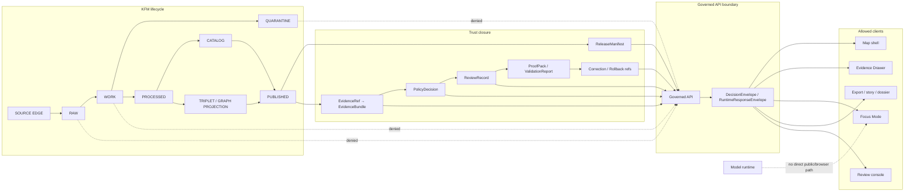

<!-- [KFM_META_BLOCK_V2]
doc_id: kfm://doc/NEEDS_VERIFICATION__docs_architecture_governed_api
title: Governed API
type: standard
version: v1
status: draft
owners: NEEDS_VERIFICATION__governed_api_owner
created: NEEDS_VERIFICATION__YYYY-MM-DD
updated: 2026-05-06
policy_label: NEEDS_VERIFICATION__public_or_restricted
related: [../../README.md, ../adr/ADR-0202-governed-api-path-canonicalization.md, ../adr/ADR-0014-truth-path.md, ../adr/ADR-0207-governed-ai-runtime-envelope.md, ../../contracts/api/README.md, ../../contracts/runtime/governed_api_mock_payloads.md, ../../fixtures/api/governed_api_mock_payloads.json, ../../apps/api/README.md, ../../apps/api/server.py, ../../apps/web/src/api/governedClient.js, ../../tools/ci/check_governed_api_path_policy.py]
tags: [kfm, architecture, governed-api, evidence, policy, runtime-envelope, trust-membrane]
notes: [Revises existing thin docs/architecture/governed-api.md, GitHub connector confirmed the target file currently exists and contains only a short two-line statement, owners created date policy label and final doc_id require repo governance verification]
[/KFM_META_BLOCK_V2] -->

<a id="top"></a>

# Governed API

The governed API is KFM’s trust membrane: the boundary where public, steward-facing, map, Focus Mode, review, export, and diagnostic clients receive release-aware, evidence-resolving, policy-checked responses instead of raw data, direct model output, or unpublished project state.

<p align="center">
  
  
  
  
  
</p>

<p align="center">
  <a href="#architecture-rule">Architecture rule</a> ·
  <a href="#repo-fit">Repo fit</a> ·
  <a href="#current-evidence-snapshot">Evidence snapshot</a> ·
  <a href="#inputs-and-exclusions">Inputs & exclusions</a> ·
  <a href="#trust-flow">Trust flow</a> ·
  <a href="#contract-surface">Contract surface</a> ·
  <a href="#runtime-outcomes">Runtime outcomes</a> ·
  <a href="#route-families">Route families</a> ·
  <a href="#validation-gates">Validation gates</a> ·
  <a href="#open-verification">Open verification</a>
</p>

> [!IMPORTANT]
> **CONFIRMED:** this file belongs under `docs/architecture/`, the human-facing architecture control plane.  
> **CONFIRMED:** KFM doctrine requires public clients and normal UI surfaces to use governed interfaces and released artifacts.  
> **CONFIRMED:** the repo contains API, contract, fixture, client, ADR, and CI-path-policy materials related to governed API behavior.  
> **NEEDS VERIFICATION:** owners, policy label, active runtime deployment, workflow enforcement, branch protections, route coverage, full schema coverage, and production readiness.

---

## Architecture rule

The governed API is not a generic backend. It is a policy-conscious, evidence-resolving boundary that protects KFM’s core lifecycle:

```text
RAW -> WORK / QUARANTINE -> PROCESSED -> CATALOG / TRIPLET -> PUBLISHED
```

Normal public and ordinary UI clients must use governed APIs, released artifacts, catalog records, tile services, and `EvidenceBundle` resolution. They must not directly read:

- `RAW`, `WORK`, or `QUARANTINE` lifecycle stores;
- unpublished candidate data;
- canonical or restricted internal stores;
- source-system side effects;
- vector/search indexes as truth;
- graph projections as canonical records;
- direct model runtime output;
- secrets, local paths, or internal service handles.

The governing principle is simple:

> A KFM response may make a consequential public or semi-public claim only when it is downstream of evidence, source role, policy, review, release state, correction lineage, and rollback support appropriate to the consequence of the claim.

[Back to top](#top)

---

## Repo fit

**Path:** `docs/architecture/governed-api.md`  
**Owning root:** `docs/`  
**Role:** repository architecture note for the governed API trust membrane  
**Audience:** maintainers, API implementers, UI engineers, policy reviewers, domain-lane authors, release reviewers, and governed-AI contributors

`docs/architecture/governed-api.md` explains the system boundary. It does not own route code, machine schemas, policy rules, source data, release artifacts, or UI implementation.

| Direction | Path | Relationship | Status |
|---|---|---|---|
| Parent architecture index | [`README.md`](README.md) | Local architecture directory index. | CONFIRMED file exists; content is currently thin. |
| Project orientation | [`../../README.md`](../../README.md) | Root trust law, responsibility roots, object families, proof-slice posture. | CONFIRMED file exists. |
| API contract lane | [`../../contracts/api/README.md`](../../contracts/api/README.md) | Human-readable governed API request/response semantics. | CONFIRMED file exists. |
| Mock payload contract | [`../../contracts/runtime/governed_api_mock_payloads.md`](../../contracts/runtime/governed_api_mock_payloads.md) | Documents fixture-backed mock API payload examples. | CONFIRMED file exists. |
| Mock payload fixture | [`../../fixtures/api/governed_api_mock_payloads.json`](../../fixtures/api/governed_api_mock_payloads.json) | Synthetic no-network examples for health, Focus, and Evidence Drawer payloads. | CONFIRMED file exists. |
| Runtime API surface | [`../../apps/api/README.md`](../../apps/api/README.md) | Runtime boundary README currently written with strong verification caveats. | CONFIRMED file exists. |
| Current API file | [`../../apps/api/server.py`](../../apps/api/server.py) | Minimal FastAPI-style ecology/public-safe dry-run server evidence. | CONFIRMED file exists; runtime execution not verified here. |
| Web API client | [`../../apps/web/src/api/governedClient.js`](../../apps/web/src/api/governedClient.js) | Browser-side governed client wrapper for ecology layer manifest, evidence, and Focus calls. | CONFIRMED file exists. |
| Path policy ADR | [`../adr/ADR-0202-governed-api-path-canonicalization.md`](../adr/ADR-0202-governed-api-path-canonicalization.md) | Settles `apps/governed_api/...` as canonical and `apps/governed-api/...` as legacy shim-only. | CONFIRMED file exists. |
| Trust path ADR | [`../adr/ADR-0014-truth-path.md`](../adr/ADR-0014-truth-path.md) | Defines lifecycle and public trust membrane posture. | CONFIRMED file exists; decision status still draft/proposed. |
| Runtime envelope ADR | [`../adr/ADR-0207-governed-ai-runtime-envelope.md`](../adr/ADR-0207-governed-ai-runtime-envelope.md) | Defines finite AI-assisted runtime outcomes and envelope expectations. | CONFIRMED file exists; decision status still draft/proposed. |
| CI path-policy checker | [`../../tools/ci/check_governed_api_path_policy.py`](../../tools/ci/check_governed_api_path_policy.py) | Enforces canonical governed API path and legacy shim policy. | CONFIRMED file exists; CI wiring still NEEDS VERIFICATION. |

> [!NOTE]
> This file intentionally lives in `docs/architecture/`, not under a new root-level API or domain folder. Directory discipline treats root folders as responsibility boundaries, while `docs/` is the human-facing control plane.

[Back to top](#top)

---

## Current evidence snapshot

The current repo evidence supports a stronger architecture document than the prior two-line file, but it does not support overclaiming production maturity.

| Evidence | What it confirms | What remains unverified |
|---|---|---|
| `docs/architecture/governed-api.md` | The target architecture file exists, but is only a short statement in the current repository. | Whether maintainers have already accepted this expanded architecture text. |
| `apps/api/server.py` | A current file defines public-safe ecology API behavior, including health, layer manifest, time-slice, evidence, and STAC catalog routes, with fail-closed public-safety checks. | Whether the server is deployed, CI-tested on the active branch, production-bound, or complete for all domains. |
| `apps/web/src/api/governedClient.js` | The web app has a governed client wrapper for layer manifest, evidence drawer payload, and Focus outcome calls. | Whether all rendered UI states and error paths are fully covered by tests. |
| `contracts/runtime/governed_api_mock_payloads.md` and `fixtures/api/governed_api_mock_payloads.json` | Mock payloads exist for `healthz_response`, `focus_mode_request`, `focus_mode_response`, and `evidence_drawer_response`. | Whether those examples are enforced by schema tests or runtime contract tests. |
| `docs/adr/ADR-0202-governed-api-path-canonicalization.md` | The repo records an accepted canonical path policy: `apps/governed_api/...` is canonical; `apps/governed-api/...` is shim-only legacy compatibility. | Whether every mapped file is present, every shim is present, and every CI workflow runs the checker. |
| `tools/ci/check_governed_api_path_policy.py` | The repo contains a checker for canonical governed API files and legacy shims. | Whether the checker currently passes in CI and whether all target canonical files exist in `main`. |

### Current implementation posture

- **CONFIRMED file evidence:** governed API-related docs, mock payloads, client wrapper, server file, ADRs, and checker are present.
- **NEEDS VERIFICATION:** active branch route inventory, framework/package status, CI wiring, test pass state, release-state integration, proof-pack linkage, production exposure, and domain coverage.
- **PROPOSED architecture:** use this document as the stable architecture guide that ties those files into one inspectable trust boundary.

[Back to top](#top)

---

## Inputs and exclusions

### Accepted inputs

The governed API may accept only bounded, reviewable request context. Typical accepted inputs include:

| Input | Required guardrail |
|---|---|
| Stable IDs such as `claim_id`, `layer_id`, `release_id`, `bundle_id`, `source_id`, or domain subject IDs | Must resolve to released or explicitly review-authorized scope. |
| `EvidenceRef` or `EvidenceBundle` references | Must resolve server-side or return `ABSTAIN`, `DENY`, or `ERROR`. |
| Map/timeline selection state | Must be treated as selection context, not proof. |
| Focus Mode question | Must be scoped to admissible evidence, policy state, and release context. |
| Review action requests | Must be authenticated/authorized, auditable, and role-sensitive. |
| Export/story/dossier requests | Must inherit release state, citation posture, and correction lineage. |
| Health/status requests | Must not leak internal stores, paths, secrets, or restricted source state. |

### Exclusions

The following do not belong on normal governed API public paths:

| Excluded | Reason |
|---|---|
| RAW / WORK / QUARANTINE payloads | These are pre-publication lifecycle states. |
| Unpublished candidates | Candidate material lacks release authority. |
| Canonical/internal stores as direct public payloads | Public interfaces must cross evidence/policy/release checks. |
| Direct model runtime calls | AI is interpretive and must sit behind governed API mediation. |
| Direct vector-store or graph-store answers | Retrieval and projection layers are derivatives, not truth. |
| Source connector side effects | Source activation belongs behind intake, validation, rights, and policy review. |
| Exact sensitive location material | Sensitive locations fail closed unless a release transform explicitly allows safe exposure. |
| Living-person, DNA/genomic, archaeology, rare species, cultural, infrastructure, or unclear-rights details | High-risk material requires domain-specific review and staged access rules. |
| Chain-of-thought or private reasoning | Receipts may record inputs, outputs, hashes, decisions, and refs, not private reasoning traces. |

[Back to top](#top)

---

## Trust flow



The governed API should make trust state visible rather than hiding it. `ABSTAIN`, `DENY`, and `ERROR` are part of the product contract, not embarrassing edge cases.

[Back to top](#top)

---

## Contract surface

The governed API sits at the intersection of several KFM object families.

| Object family | API obligation |
|---|---|
| `SourceDescriptor` | Preserve source role, authority limits, rights, cadence, scale, caveats, and activation state where relevant. |
| `EvidenceRef` | Accept as a reference only; do not treat it as resolved support until the resolver succeeds. |
| `EvidenceBundle` | Use as the inspectable support package for claims, layers, Focus answers, and Evidence Drawer payloads. |
| `PolicyDecision` | Carry allow, deny, restrict, abstain, review-needed, or error state with reason codes and obligations. |
| `DecisionEnvelope` | Emit finite non-AI or general decision outcomes where policy/release/evidence state matters. |
| `RuntimeResponseEnvelope` | Emit finite AI-assisted/runtime outcomes for Focus Mode and model-mediated surfaces. |
| `LayerManifest` | Bind map-visible layers to release, evidence, source, sensitivity transform, time, and style state. |
| `ReleaseManifest` | Prevent public payloads from outrunning promotion, proof, correction, and rollback. |
| `RunReceipt` / `AIReceipt` | Preserve process memory and audit joins without treating receipts as truth. |
| `CorrectionNotice` / `RollbackCard` | Keep supersession, withdrawal, public correction, and rollback paths inspectable. |

### Envelope shape

The exact machine schema belongs in the accepted schema home. Until schema-home authority is fully verified, this document treats the field set below as architecture-level guidance.

```json
{
  "outcome": "ANSWER | ABSTAIN | DENY | ERROR",
  "reason_code": "EVIDENCE_BUNDLE_NOT_RESOLVED",
  "message": "Safe human-readable summary",
  "scope": {
    "request_kind": "map | evidence_drawer | focus | review | export | diagnostic",
    "spatial_scope": "NEEDS_VERIFICATION",
    "temporal_scope": "NEEDS_VERIFICATION"
  },
  "evidence_refs": [],
  "evidence_bundle_refs": [],
  "policy_decision_ref": "kfm://policy-decision/NEEDS_VERIFICATION",
  "release_ref": "kfm://release/NEEDS_VERIFICATION",
  "review_state": "approved | pending | denied | not_required | unknown",
  "freshness_state": "current | stale | unknown | not_applicable",
  "correction_state": "current | corrected | superseded | withdrawn | unknown",
  "receipt_refs": [],
  "limitations": [],
  "obligations": []
}
```

[Back to top](#top)

---

## Runtime outcomes

| Outcome | Meaning | Required behavior |
|---|---|---|
| `ANSWER` | The request is supported by released or review-authorized evidence, policy allows it, citations/support validate, and scope is sufficiently bounded. | Return the bounded payload plus evidence, policy, release, freshness, review, correction, and audit references where material. |
| `ABSTAIN` | KFM cannot support a safe answer because evidence is missing, unresolved, stale, conflicted, insufficient, outside scope, or source-role-inadequate. | Return no unsupported answer. Include safe reason codes and narrowing guidance where appropriate. |
| `DENY` | KFM may not provide the requested content because policy, rights, sensitivity, access role, release state, or public safety blocks it. | Return no restricted content. Include only policy-safe reason and obligation metadata. |
| `ERROR` | A system, schema, adapter, resolver, validator, policy, release, or runtime failure prevents reliable handling. | Fail closed; do not substitute model prose, raw properties, or partial truth. |

### Runtime examples currently present

The repository’s mock fixture currently models:

- `healthz_response` with `status`, `service`, and `mode`;
- `focus_mode_request` with `question`, `scope`, and `trace_id`;
- `focus_mode_response` returning `ABSTAIN` for `MISSING_EVIDENCE`;
- `evidence_drawer_response` with `ui_trust_state`, `release_status`, `evidence_ref`, and `evidence_bundle_id`.

These examples are useful as a no-network fixture baseline. They should not be treated as complete runtime coverage until schema and test enforcement are verified.

[Back to top](#top)

---

## Route families

KFM should document and test route families by responsibility, not by whatever path happens to exist first.

| Route family | Typical clients | Must prove | Current repo evidence |
|---|---|---|---|
| Health / status | Operators, local checks | No secret, path, source, raw data, or restricted state leakage. | `apps/api/server.py` defines `/healthz` and `/api/healthz`; runtime execution still needs verification. |
| Layer manifest | Map shell | Released/public-safe layer state, evidence support, rights/sensitivity posture, correction and release refs. | `apps/web/src/api/governedClient.js` calls `/ecology/layer-manifest`; `apps/api/server.py` defines `/api/layers/manifest`. |
| Evidence drawer payload | Evidence Drawer, map popups, Focus | `EvidenceBundle` resolution, support state, release state, policy posture, source list or safe abstention. | `apps/web/src/api/governedClient.js` calls `/ecology/evidence/{claimId}`; mock payload fixture includes `evidence_drawer_response`. |
| Domain read surfaces | Map shell, dashboards, exports | Released domain scope, temporal scope, public-safe geometry, policy, and release state. | `apps/api/server.py` includes ecology time-slice route examples. |
| Catalog / STAC-style discovery | Catalog views, map shell, export tools | Catalog closure, release linkage, public-safe metadata. | `apps/api/server.py` includes `/api/ecology/catalog/stac`. |
| Focus Mode | Focus panel, map shell | Scoped evidence, policy precheck, citation validation, finite runtime envelope, no direct model-client path. | Web client includes `getFocusOutcome`; mock fixture returns `ABSTAIN` for missing evidence. |
| Review / steward action | Review console, maintainers | Actor role, target hash/version, policy obligations, review receipt, rollback path. | NEEDS VERIFICATION. |
| Export / story / dossier | Public/steward export tools | Release scope, citation state, policy state, correction state, and reproducible artifact refs. | NEEDS VERIFICATION. |

> [!WARNING]
> Route names above are architecture categories. Do not infer production route coverage beyond inspected files and passing tests.

[Back to top](#top)

---

## Canonical implementation path

KFM has a documented path distinction:

| Path | Role |
|---|---|
| `apps/governed_api/...` | Canonical governed API implementation home. |
| `apps/governed-api/...` | Legacy compatibility surface only; shim-only if retained. |
| `apps/api/...` | Current visible API app path with confirmed files; relationship to the canonical `apps/governed_api/...` decision needs active-branch reconciliation. |

The accepted path-policy rule is:

> Implementation goes in `apps/governed_api/...`; `apps/governed-api/...` only points back to it.

Because the current repo also contains `apps/api/...` API materials, maintainers should verify whether `apps/api/...` is the active runtime app, a transitional app, a domain-specific API app, or a compatibility surface. This document does not silently collapse those homes.

[Back to top](#top)

---

## Focus Mode and governed AI

Focus Mode is an evidence-bounded API consumer, not a free-form chatbot.

A safe Focus flow is:

```text
User question / map scope
-> governed API
-> scope resolver
-> policy precheck
-> released evidence retrieval
-> EvidenceRef -> EvidenceBundle resolution
-> bounded context assembly
-> provider-neutral adapter, if allowed
-> structured output validation
-> citation validation
-> policy postcheck
-> RuntimeResponseEnvelope
-> Focus UI state
-> receipts / audit joins
```

### AI boundary rules

- Model adapters are replaceable implementation details.
- `MockAdapter` and fixture-backed tests should precede live provider integration.
- The browser must not call Ollama, OpenAI-compatible endpoints, vector stores, graph internals, or model runtimes directly.
- Models may receive only released, policy-safe, bounded evidence context.
- Generated text is never proof.
- Citation validation must pass before `ANSWER`.
- Missing evidence should produce `ABSTAIN`, not plausible prose.
- Policy blocks should produce `DENY`, not softened summaries.
- Adapter or validation failures should produce `ERROR`, not fallback answer text.

[Back to top](#top)

---

## Map shell and Evidence Drawer integration

The governed API should feed the MapLibre shell and Evidence Drawer with trust-visible payloads.

| UI surface | Governed API responsibility |
|---|---|
| Map shell | Return only release-backed, public-safe layer manifests and feature payloads. |
| Timeline / time filter | Preserve valid time, observed time, retrieval time, release time, stale state, and correction state when material. |
| Evidence Drawer | Resolve and display evidence support, source roles, rights, sensitivity, review state, release state, and correction lineage. |
| Focus Mode | Use finite runtime envelopes and citation validation. |
| Review console | Submit review decisions through authenticated, auditable, role-aware endpoints. |
| Exports / story nodes | Carry citations, release refs, correction refs, and policy context into outward artifacts. |

Renderer rule:

> MapLibre renders released evidence carriers and interaction state. It is not the canonical store, policy engine, citation authority, publication authority, or AI authority.

[Back to top](#top)

---

## Security and exposure posture

The governed API should fail closed around public exposure.

| Risk | Required default |
|---|---|
| Unknown rights | `DENY` public release. |
| Unknown sensitivity | `DENY` or restrict. |
| Unresolved evidence | `ABSTAIN` or `ERROR`. |
| Direct public raw/work/quarantine access | `DENY`. |
| Direct browser model access | `DENY`. |
| Exact sensitive geometry | `DENY` unless a reviewed public-safe transform allows exposure. |
| Internal path disclosure | `ERROR` envelope with safe artifact names only. |
| CORS / browser access | Explicit allowlist; no broad public mutation surface by default. |
| Review/steward actions | Authenticated, authorized, audited, and reversible. |
| Runtime logs and receipts | Store audit-safe refs, hashes, outcomes, and decisions; avoid secrets and private reasoning. |

[Back to top](#top)

---

## Validation gates

A governed API change is not ready just because it returns JSON.

| Gate | Minimum evidence |
|---|---|
| Directory placement | Directory Rules, ADRs, and current repo evidence support the path. |
| Contract alignment | Human-readable contract and machine schema agree, or the gap is explicit. |
| Schema validation | Valid and invalid fixtures cover the route/envelope. |
| Policy validation | Rights, sensitivity, access, release, stale, source-role, and exact-location checks fail closed. |
| Evidence closure | Consequential `ANSWER` responses resolve to `EvidenceBundle`. |
| Negative outcomes | `ABSTAIN`, `DENY`, and `ERROR` have tests and UI-visible payload states. |
| No raw-public path | API tests/static checks prevent public RAW/WORK/QUARANTINE access. |
| No direct model client | Browser and public clients do not call model/provider runtimes directly. |
| Release linkage | Public payloads include release or publication state when material. |
| Correction / rollback | Public or semi-public outputs can identify correction, supersession, withdrawal, or rollback state. |
| Documentation sync | Architecture, contracts, schemas, policy, tests, runbooks, and ADR links are updated or gaps are labeled. |

### Suggested local checks

Run these only after confirming the repo-native toolchain and active branch.

```bash
git status --short
git branch --show-current || true

python tools/ci/check_governed_api_path_policy.py

find docs/architecture docs/adr contracts schemas policy fixtures tests tools apps -maxdepth 4 -type f | sort

grep -RInE "RAW|WORK|QUARANTINE|localhost:11434|OLLAMA_HOST|/api/generate|/api/chat" apps packages tools tests 2>/dev/null || true
```

> [!NOTE]
> Commands beyond the confirmed checker are review aids. Do not report them as passing until they are actually run on the target branch.

[Back to top](#top)

---

## Definition of done

A governed API architecture or implementation change is reviewable when:

- [ ] the affected path is verified against Directory Rules and active ADRs;
- [ ] public/steward/internal exposure class is explicit;
- [ ] request and response contracts are documented or linked;
- [ ] machine schemas exist or are marked `NEEDS VERIFICATION`;
- [ ] valid and invalid fixtures exist for the changed envelope or route family;
- [ ] `ANSWER`, `ABSTAIN`, `DENY`, and `ERROR` behavior is tested where applicable;
- [ ] evidence resolution requirements are explicit;
- [ ] policy decision and obligation behavior is explicit;
- [ ] rights and sensitivity behavior fails closed;
- [ ] no public route exposes raw/work/quarantine/internal stores;
- [ ] no public/browser path calls model runtimes directly;
- [ ] releases, corrections, withdrawals, supersessions, and rollback targets remain inspectable;
- [ ] docs, ADRs, contracts, schemas, policy, fixtures, tests, and runbooks are updated or gaps are listed;
- [ ] runtime behavior is not claimed unless directly verified.

[Back to top](#top)

---

## Open verification

| Item | Status | Verification path |
|---|---|---|
| Owner and policy label for this doc | NEEDS VERIFICATION | Confirm from CODEOWNERS, document registry, or governance index. |
| Created date and stable `doc_id` | NEEDS VERIFICATION | Confirm from Git history or document registry. |
| Whether `apps/api/...` or `apps/governed_api/...` is the active runtime home | NEEDS VERIFICATION | Inspect active branch, ADRs, imports, app entrypoints, tests, and workflows. |
| Whether the path-policy checker runs in CI | NEEDS VERIFICATION | Inspect `.github/workflows/` and recent CI results. |
| Whether every canonical governed API file in ADR-0202 exists | NEEDS VERIFICATION | Run the checker and inspect canonical/legacy paths. |
| Full route inventory | NEEDS VERIFICATION | Inspect app route registration and OpenAPI outputs. |
| Schema-home authority | NEEDS VERIFICATION | Follow accepted schema-home ADR and active schema tree. |
| Runtime envelope schema enforcement | NEEDS VERIFICATION | Inspect `schemas/`, fixtures, validators, and tests. |
| Focus Mode citation validation | NEEDS VERIFICATION | Inspect Focus contracts, runtime tests, and emitted validation reports. |
| Evidence Drawer payload coverage | NEEDS VERIFICATION | Inspect UI tests, fixtures, and contracts. |
| Production deployment posture | UNKNOWN | Inspect deployment manifests, runtime config, access controls, logs, and dashboards. |
| Branch protections and release gates | UNKNOWN | Inspect GitHub settings, workflow requirements, and release artifacts. |

[Back to top](#top)
