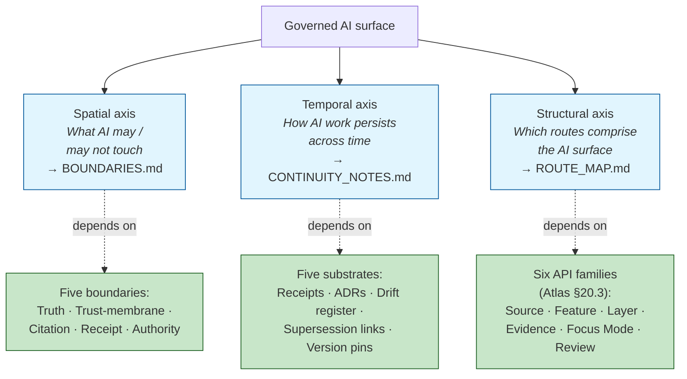
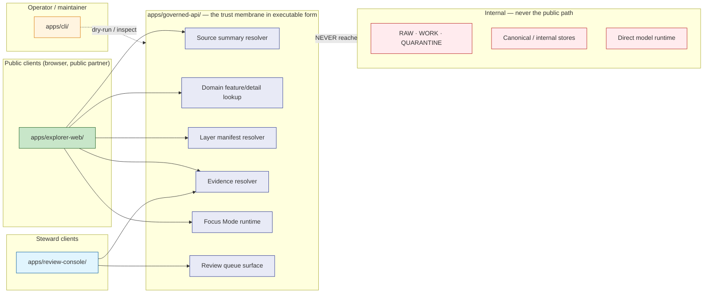
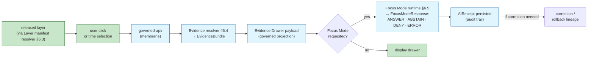

<!-- [KFM_META_BLOCK_V2]
doc_id: kfm://doc/architecture-governed-ai-route-map
title: Governed AI — Route Map
type: standard
version: v0.1
status: draft
owners: <AI-SURFACE-STEWARD> · NEEDS VERIFICATION
created: 2026-05-24
updated: 2026-05-24
policy_label: public
related:
  - directory-rules.md#7
  - directory-rules.md#12
  - ai-build-operating-contract.md#21
  - ai-build-operating-contract.md#22
  - kfm_unified_doctrine_synthesis.md#11
  - Kansas_Frontier_Matrix_-_Domains_v1_1___Pass_23_32_Consolidated_Atlas.md#203
  - Kansas_Frontier_Matrix_-_Domains_v1_1___Pass_23_32_Consolidated_Atlas.md#2432
  - Master_MapLibre_Components-Functions-Features_v2_1_FULL.md#10
  - docs/architecture/governed-ai/BOUNDARIES.md
  - docs/architecture/governed-ai/CONTINUITY_NOTES.md
  - docs/architecture/cross-domain/README.md
tags: [kfm, architecture, governed-ai, routes, api-surface, audience-class, structural]
notes:
  - PROPOSED. Third substantive sibling under docs/architecture/governed-ai/; with three siblings, OPEN-DR-11 recommendation tips toward "keep folder".
  - Atlas §20.3 Master API Surface Table is the CONFIRMED doctrinal source for the six API families listed here.
  - All concrete route names ("/v1/evidence/{id}", etc.) are PROPOSED — Atlas §20.3 names families, not paths.
  - No mounted repo evidence in this session; all repo-shaped and route-shaped claims labeled PROPOSED.
[/KFM_META_BLOCK_V2] -->

<a id="top"></a>

# Governed AI — Route Map

> *The structural inventory of every governed-AI runtime surface — which routes exist, what they return, what they forbid, who they're for, and where they sit in the apps tree. Atlas §20.3 names the API families; this doc consolidates them into a map.*


-blue)


**Status:** draft · **Owners:** `<AI-SURFACE-STEWARD>` *(NEEDS VERIFICATION)* · **Last updated:** 2026-05-24

> [!IMPORTANT]
> **Routes are doctrine, paths are PROPOSED.** Atlas §20.3 *(Master API Surface Table)* names the **six API families** that constitute the governed-AI runtime — Source summary resolver, Domain feature/detail lookup, Layer manifest resolver, Evidence resolver, Focus Mode runtime, Review queue surface — and gives each one its DTO/schema and finite outcomes. **CONFIRMED doctrine.** This doc consolidates them; concrete URL paths *(`/v1/evidence/{id}`, etc.)* are PROPOSED examples.

> [!NOTE]
> **OPEN-DR-11 — three-sibling threshold reached.** This is the third substantive sibling under `docs/architecture/governed-ai/`:
>
> 1. `BOUNDARIES.md` *(spatial — what AI may and may not touch)*
> 2. `CONTINUITY_NOTES.md` *(temporal — how AI work persists across time)*
> 3. `ROUTE_MAP.md` *(structural — which routes comprise the AI surface — this doc)*
>
> Per the OPEN-DR-11 recommendation in `BOUNDARIES.md` §2.1 *(keep the folder if ≥3 siblings)*, the threshold for "keep folder" is now met. **Final resolution still pending ADR** — the recommendation is now affirmative, but `directory-rules.md` §12 amendment is still required to make the folder pattern canonical.

> [!CAUTION]
> **Path placement still diverges from Directory Rules v1.2 §12** *(folder + ALL-CAPS filename — same OPEN-DR-11 family)*. The 3-sibling milestone strengthens the case for resolution but does not itself resolve it.

---

## Table of contents

1. [Scope](#1-scope)
2. [Repo fit — OPEN-DR-11 status update](#2-repo-fit--open-dr-11-status-update)
3. [The three axes of governed-AI architecture](#3-the-three-axes-of-governed-ai-architecture)
4. [The route map at a glance](#4-the-route-map-at-a-glance)
5. [The six API families *(CONFIRMED — Atlas §20.3)*](#5-the-six-api-families-confirmed--atlas-203)
6. [Per-route inventory](#6-per-route-inventory)
7. [The click-to-truth flow](#7-the-click-to-truth-flow)
8. [Audience classes](#8-audience-classes)
9. [App-to-route mapping](#9-app-to-route-mapping)
10. [Forbidden routes and shortcuts](#10-forbidden-routes-and-shortcuts)
11. [Schema and contract homes](#11-schema-and-contract-homes)
12. [UI negative states — the route's contract with the renderer](#12-ui-negative-states--the-routes-contract-with-the-renderer)
13. [Anti-patterns](#13-anti-patterns)
14. [Open questions and ADR triggers](#14-open-questions-and-adr-triggers)
15. [Related docs](#15-related-docs)
16. [Appendix — glossary and quick reference](#16-appendix--glossary-and-quick-reference)

---

## 1. Scope

This doc is the **structural inventory** of the governed-AI runtime surface. It answers four questions for every route AI participates in:

1. **What family is it?** *(per Atlas §20.3 — six families)*
2. **What's the contract?** *(request DTO + response envelope + finite outcomes)*
3. **Who is it for?** *(audience class — public · partner · steward · internal · denied)*
4. **Where does it live?** *(which app under `apps/` serves it; schema home; policy home)*

> [!TIP]
> **What this doc is not.** It is not the schema itself *(those live under `schemas/contracts/v1/`)*; not the policy *(`policy/governed_ai/`)*; not the route implementation *(`apps/governed-api/`)*. It is the **map** that tells implementers where each piece belongs and what shape it takes.

[↑ Back to top](#top)

---

## 2. Repo fit — OPEN-DR-11 status update

### 2.1 The three-sibling milestone

| # | Sibling | Axis | Status |
|---|---|---|---|
| 1 | `BOUNDARIES.md` | Spatial — what AI may / may not touch | draft *(prior turn)* |
| 2 | `CONTINUITY_NOTES.md` | Temporal — how AI work persists across time | draft *(prior turn)* |
| 3 | `ROUTE_MAP.md` *(this file)* | Structural — which routes comprise the AI surface | draft *(this turn)* |

**Recommendation shift:** with three substantive siblings — each addressing a *distinct architectural axis* — the OPEN-DR-11 recommendation moves from "PROPOSED" to "**RECOMMEND keep folder**". The folder is now earning its placement: it groups three orthogonal architectural views that would not be coherent as flat siblings of unrelated `<topic>.md` files under `docs/architecture/`.

### 2.2 Still PROPOSED until ADR

> [!IMPORTANT]
> **The recommendation is not the resolution.** Per `directory-rules.md` §2.4, a structural deviation requires an ADR. The ADR for OPEN-DR-11 SHOULD now be drafted, citing the three-sibling milestone as the justifying material. Suggested ADR title *(PROPOSED)*: **"Architecture lane — folder vs flat; ALL-CAPS doctrine docs"**. Until accepted, the path remains PROPOSED.

[↑ Back to top](#top)

---

## 3. The three axes of governed-AI architecture

> **Doctrine status:** the three-axis framing is **INFERRED from the structure of the corpus**, not asserted by any single carrier. The individual content of each axis is CONFIRMED doctrine.



The three views compose. A change to the AI surface that does not affect all three axes is unusual; a change that affects only one is suspicious. Reviewers SHOULD read all three docs when assessing a non-trivial AI-surface PR.

[↑ Back to top](#top)

---

## 4. The route map at a glance



> **Reading the picture.** Every client routes through `apps/governed-api/`. The six route families inside the membrane are the entire governed-AI runtime surface. Internal stores at the bottom are unreachable by any client; routes that would expose them are forbidden *(§10)*.

[↑ Back to top](#top)

---

## 5. The six API families *(CONFIRMED — Atlas §20.3)*

This is **CONFIRMED doctrine — preserved verbatim from Atlas §20.3 Master API Surface Table**. Concrete route paths are PROPOSED examples; the families themselves are the contract.

| # | API family | Domains | DTO / schema | Outcomes |
|---|---|---|---|---|
| 1 | **Source summary resolver** | All domains | `SourceDescriptor` projection | `ANSWER` / `ABSTAIN` / `DENY` / `ERROR` |
| 2 | **Domain feature/detail lookup** | All domain lanes | `DomainFeatureEnvelope` + `DecisionEnvelope` | `ANSWER` / `ABSTAIN` / `DENY` / `ERROR` |
| 3 | **Layer manifest resolver** | All map domains | `LayerManifest` / `GeoManifest` | `ANSWER` / `DENY` / `ERROR` |
| 4 | **Evidence resolver** | All domains | `EvidenceBundle` | `ANSWER` / `ABSTAIN` / `DENY` / `ERROR` |
| 5 | **Focus Mode runtime** | All domains | `RuntimeResponseEnvelope` + `AIReceipt` | `ANSWER` / `ABSTAIN` / `DENY` / `ERROR` |
| 6 | **Review queue surface** | Sensitive / release-significant domains | `ReviewRecord` + `PolicyDecision` | `ALLOW` / `RESTRICT` / `DENY` / `ERROR` |

> [!CAUTION]
> **Don't expand the list silently.** Adding a seventh API family is an ADR-class change *(`ai-build-operating-contract.md` §28; `directory-rules.md` §2.4)*. The Atlas explicitly states *(§24.3.1 verbatim)*: *"every governed API surface … returns a finite outcome from a small, well-known set."* A new family means a new outcome × surface row, a new schema home, a new policy home, and a new audit gate.

[↑ Back to top](#top)

---

## 6. Per-route inventory

Each row below expands one of the six families into a per-route operational view. **PROPOSED implementation throughout** *(per Atlas §20.3)*; doctrine for families and outcomes is CONFIRMED.

### 6.1 Source summary resolver

| Field | Value |
|---|---|
| Purpose | Project a `SourceDescriptor` to a public-safe summary *(who, what, rights, sensitivity, cadence, release class)*. |
| Audience | **Public** *(after rights/sensitivity gates)* |
| Request DTO | `{ source_id }` |
| Response envelope | `DecisionEnvelope` wrapping `SourceDescriptor` projection |
| Outcomes | `ANSWER` / `ABSTAIN` / `DENY` / `ERROR` |
| Suggested route *(PROPOSED)* | `GET /v1/sources/{source_id}` |
| Forbidden behavior *(Atlas §24.3.2)* | Returning raw source bytes; returning quarantined source as `ANSWER`. |
| Schema home *(PROPOSED)* | `schemas/contracts/v1/sources/source_descriptor.schema.json`; `schemas/contracts/v1/runtime/decision_envelope.schema.json` |
| Policy home *(PROPOSED)* | `policy/governed_ai/source_summary.rego` |

### 6.2 Domain feature/detail lookup

| Field | Value |
|---|---|
| Purpose | Resolve a clicked or queried feature in a domain *(hydrology stream, archaeology candidate, fauna occurrence, etc.)* to a governed envelope. |
| Audience | **Public** *(with per-domain sensitivity gates)* |
| Request DTO | `{ feature_id, layer_id, time_window? }` |
| Response envelope | `DomainFeatureEnvelope` + `DecisionEnvelope` |
| Outcomes | `ANSWER` / `ABSTAIN` / `DENY` / `ERROR` |
| Suggested route *(PROPOSED)* | `GET /v1/domains/{domain}/features/{feature_id}` |
| Forbidden behavior *(Atlas §24.3.2)* | Returning an unreleased candidate as `ANSWER`; exposing internal store identifiers. |
| Schema home *(PROPOSED)* | `schemas/contracts/v1/domains/<domain>/feature_envelope.schema.json` |
| Policy home *(PROPOSED)* | `policy/domains/<domain>/feature_lookup.rego` |

### 6.3 Layer manifest resolver

| Field | Value |
|---|---|
| Purpose | Resolve which layers a client may load *(public-safe; released-only)*. |
| Audience | **Public** *(release-state gated)* |
| Request DTO | `{ layer_id }` or `{ scope, time_window? }` *(list form)* |
| Response envelope | `LayerManifest` *(or `GeoManifest`)* |
| Outcomes | `ANSWER` / `DENY` / `ERROR` *(note: no `ABSTAIN` — layers either resolve or are denied)* |
| Suggested route *(PROPOSED)* | `GET /v1/layers/{layer_id}` · `GET /v1/layers?scope=...` |
| Forbidden behavior *(Atlas §24.3.2)* | Returning a layer that lacks a `ReleaseManifest`; serving `WORK` or `CATALOG` layers to public clients. |
| Schema home *(PROPOSED)* | `schemas/contracts/v1/map/layer_manifest.schema.json` · `map_release_manifest.schema.json` |
| Policy home *(PROPOSED)* | `policy/governed_ai/layer_manifest.rego` |

### 6.4 Evidence resolver

| Field | Value |
|---|---|
| Purpose | Resolve an `EvidenceRef` to a full `EvidenceBundle` with citations, source roles, review state, release state, correction lineage. |
| Audience | **Public** *(sensitivity-redacted projection)*; **steward** *(full projection)* |
| Request DTO | `{ evidence_ref }` or `{ feature_id, layer_id }` *(via Evidence Drawer)* |
| Response envelope | `EvidenceBundle` *(or `EvidenceDrawerPayload` for UI-side projection)* |
| Outcomes | `ANSWER` / `ABSTAIN` / `DENY` / `ERROR` |
| Suggested route *(PROPOSED)* | `GET /v1/evidence/{evidence_ref}` · `POST /v1/evidence-drawer` |
| Forbidden behavior *(Atlas §24.3.2)* | Returning a payload that includes restricted geometry or uncited claim text. |
| Schema home *(PROPOSED)* | `schemas/contracts/v1/evidence/evidence_bundle.schema.json` · `schemas/contracts/v1/ui/evidence_drawer_payload.schema.json` |
| Policy home *(PROPOSED)* | `policy/governed_ai/evidence_resolver.rego` *(redaction & sensitivity)* |

### 6.5 Focus Mode runtime

| Field | Value |
|---|---|
| Purpose | Bounded AI answer over map context + released `EvidenceBundle`. The canonical AI runtime surface. |
| Audience | **Public** *(cite-or-abstain enforced; sensitivity-gated; AIReceipt mandatory)* |
| Request DTO | `FocusModeRequest = { question, map_context_envelope, evidence_refs?, policy_context?, user_role? }` |
| Response envelope | `FocusModeResponse` *(extends `RuntimeResponseEnvelope`)* + `AIReceipt` reference |
| Outcomes | `ANSWER` / `ABSTAIN` / `DENY` / `ERROR` *(optionally `NARROWED` / `BOUNDED` if contract permits)* |
| Suggested route *(PROPOSED)* | `POST /v1/focus-mode` |
| Forbidden behavior *(Atlas §24.3.2)* | Generating uncited language as `ANSWER`; substituting model output for `EvidenceBundle`. |
| Schema home *(PROPOSED)* | `schemas/contracts/v1/ai/focus_mode_request.schema.json` · `focus_mode_response.schema.json` · `ai_receipt.schema.json` · `schemas/contracts/v1/ui/map_context_envelope.schema.json` · `schemas/contracts/v1/evidence/citation_validation_report.schema.json` |
| Policy home *(PROPOSED)* | `policy/governed_ai/precheck.rego` · `postcheck.rego` · `citation.rego` · `sensitivity.rego` |
| **Cross-ref** | See `BOUNDARIES.md` §9 for the full runtime flow; this row is the route-level view. |

### 6.6 Review queue surface

| Field | Value |
|---|---|
| Purpose | Steward / reviewer surface for promotion, correction, sensitivity, and AI-receipt auditing. |
| Audience | **Steward** / **internal** *(role-gated; never public)* |
| Request DTO | varies by action: `{ candidate_id, gate }` *(promotion)*; `{ correction_target, notice }` *(correction)*; `{ ai_receipt_id }` *(audit)* |
| Response envelope | `ReviewRecord` + `PolicyDecision` |
| Outcomes | `ALLOW` / `RESTRICT` / `DENY` / `HOLD` / `ERROR` |
| Suggested route *(PROPOSED)* | `POST /v1/review/{action}` · `GET /v1/review/queue` |
| Forbidden behavior *(Atlas §24.3.2)* | Mixing review and publication duties on the same actor when separation is required; bypassing logging. |
| Schema home *(PROPOSED)* | `schemas/contracts/v1/policy/policy_decision.schema.json` · `schemas/contracts/v1/release/review_record.schema.json` *(PROPOSED)* |
| Policy home *(PROPOSED)* | `policy/governed_ai/review_queue.rego` *(SoD enforcement)* |
| **Cross-ref** | Separation-of-duties matrix per Atlas §24.7.2 / AIBOC §33. |

[↑ Back to top](#top)

---

## 7. The click-to-truth flow

> **Evidence basis:** `connected-dots-architecture-brief.md` §8.1; `Master_MapLibre_Components-Functions-Features_v2.1_FULL.md` §10 *(Governance and Trust-Membrane Chapter)*; `ai-build-operating-contract.md` §22.1. **CONFIRMED doctrine.**



> [!IMPORTANT]
> **The flow composes routes from §6.** A user-visible "click on a feature → see evidence → ask AI" interaction is **never one route call** — it's three: layer resolution *(§6.3)*, evidence resolution *(§6.4)*, optional Focus Mode *(§6.5)*. Each emits its own envelope and audit record. Skipping a step *(e.g., asking Focus Mode without first resolving evidence)* is a contract violation.

[↑ Back to top](#top)

---

## 8. Audience classes

> **Evidence basis:** Pass 32 idea card `KFM-P9-PROG-0069` *(API audience class as a contract and exposure field)*. **PROPOSED doctrine** *(the five-class vocabulary is from the seed-card, not yet accepted via ADR)*; the underlying principle *(API exposure is a reviewable governance decision)* is CONFIRMED.

Every governed-AI route SHOULD declare its audience class on the contract. The five classes:

| Class | Definition | Example routes |
|---|---|---|
| **public** | Open to any client of the public governed API. | `GET /v1/sources/{id}`; `GET /v1/layers/{id}`; `GET /v1/evidence/{ref}` *(public-safe projection)*; `POST /v1/focus-mode`. |
| **partner** | Open to named partner organizations under agreement. | Partner-tier feature lookups for restricted data sets; aggregated time-series feeds. |
| **steward** | Restricted to authenticated stewards / domain owners. | `POST /v1/review/{action}`; `GET /v1/review/queue`; `GET /v1/evidence/{ref}?projection=full`. |
| **internal** | Restricted to KFM internal infra and audit clients; never public. | Receipt audit; drift register query; sensitive-domain steward-only views. |
| **denied** | Documented as **never to be exposed** by any audience class. | `GET /v1/raw/{...}`; `GET /v1/quarantine/{...}`; any direct model runtime. |

> [!NOTE]
> **Why audience class is on the contract, not on the route.** A route's path may be the same across audiences *(e.g., `/v1/evidence/{ref}`)* but its projection MUST change based on audience class. Putting the class on the contract makes the projection a **reviewable governance decision**, not an implicit middleware behavior *(per `KFM-P9-PROG-0069`)*.

[↑ Back to top](#top)

---

## 9. App-to-route mapping

> **Evidence basis:** `directory-rules.md` §7.1 *(`apps/` — deployable applications and roles)*. **CONFIRMED doctrine.**

Each governed-AI route is **served by exactly one app**, and each public-facing app **reads via `apps/governed-api/` only**. The mapping:

| App | Role | Audience classes served | Route families served |
|---|---|---|---|
| **`apps/governed-api/`** | Trust membrane in executable form. Returns `RuntimeResponseEnvelope` with finite outcomes. **The only public trust path.** | public; partner; steward; internal | All six families *(§6.1–6.6)* |
| **`apps/explorer-web/`** | Map-first public UI; reads via `apps/governed-api/`; **never** directly from `data/raw\|work\|quarantine`. | public *(client of `governed-api/`)* | Consumes §6.1–6.5 |
| **`apps/review-console/`** | Steward / reviewer surface; role-gated; audited. | steward; internal | Consumes §6.4 *(full projection)*, §6.6 |
| **`apps/cli/`** | Operator CLI; validation, release dry-runs, reports. | internal | Reads §6.1–6.6 via dry-run paths |
| **`apps/workers/`** | Background pipeline workers; **watcher-as-non-publisher** — emit receipts and candidate decisions; never publish or rewrite catalog. | internal | Emits candidates that §6.6 then promotes |
| **`apps/admin/`** | Restricted admin. **MUST NOT become the normal public path.** Justified, constrained, documented, audited. | internal *(narrowly)* | Out-of-band; not part of the route map |

> [!WARNING]
> **`apps/admin/` is not a shortcut.** Per `directory-rules.md` §7.1, `apps/admin/` is restricted and **must never become the normal public path**. An AI generation route that goes through `apps/admin/` to bypass the governed membrane is the canonical "AI generation through admin shortcut" anti-pattern *(Atlas §24.9.2; `BOUNDARIES.md` §15)*.

[↑ Back to top](#top)

---

## 10. Forbidden routes and shortcuts

> **Evidence basis:** Atlas §24.3.2 *(outcome × surface mapping — forbidden behavior column)*; `directory-rules.md` §13.5 *(placement anti-patterns)*; `Master_MapLibre_Components-Functions-Features_v2.1_FULL.md` §10 *(trust-membrane chapter — "no public RAW path", "no direct model client", "no unreleased tile load", "no sensitive geometry hidden only by style")*. **CONFIRMED doctrine.**

These are the routes that **MUST NOT exist** in `apps/governed-api/` *(or any public-facing app)*. Each is a hard denial.

| Forbidden route shape | Why it's forbidden | Counter-rule |
|---|---|---|
| `GET /v1/raw/{...}` · `GET /v1/work/{...}` · `GET /v1/quarantine/{...}` | Bypasses the lifecycle and trust membrane. | Public clients receive **`PUBLISHED` released artifacts only** *(`directory-rules.md` §9.2 lifecycle invariant)*. |
| `POST /v1/model/completion` *(or any direct LLM-style endpoint)* | Direct model traffic from a public client; bypasses evidence gates. | Model adapters live **behind** the governed membrane; never expose them directly *(`BOUNDARIES.md` §10)*. |
| `GET /v1/canonical/{...}` *(direct canonical store access)* | Renderer/AI bypasses governance and becomes its own truth source. | Canonical reads are internal; public surfaces consume `EvidenceBundle` *(§6.4)*. |
| `GET /v1/tiles/{unreleased_artifact_id}` | Serves unreleased tile artifacts. | Tile load requires `ReleaseManifest`, policy, rights, sensitivity, evidence refs, hashes, and rollback *(MapLibre §10)*. |
| `POST /v1/focus-mode/raw-prompt` *(any route accepting freeform model context)* | Allows context to bypass `MapContextEnvelope` admission. | Focus Mode accepts only the admitted envelope *(§6.5)*; freeform context is denied. |
| Any route returning **uncited prose** | `ANSWER` without citations breaks the cite-or-abstain rule. | `ABSTAIN` if citations fail; the envelope MUST carry `citation_validation_report_id`. |
| Any route serving **chain-of-thought** as response | Private chain-of-thought MUST NOT be persisted or transmitted as evidence. | Responses carry envelopes + reason codes + receipt references; never hidden reasoning *(`BOUNDARIES.md` §13)*. |
| `GET /v1/admin/...` exposed to public clients | `apps/admin/` is restricted; exposing it normalizes the bypass. | `apps/admin/` is justified, constrained, documented, audited *(directory-rules §7.1)*. |
| Any route that lets a client toggle `release_state` | Promotion is a governed transition, not a client action. | Promotion goes through §6.6 review queue + separation of duties. |

[↑ Back to top](#top)

---

## 11. Schema and contract homes

> **Evidence basis:** `Master_MapLibre_Components-Functions-Features_v2.1_FULL.md` §9 *(component table with PROPOSED schema homes)*; `directory-rules.md` §6.4 + ADR-0001 *(schema home rule)*. **CONFIRMED doctrine for the schema-home rule; PROPOSED for specific file presence.**

```text
schemas/contracts/v1/
├── sources/
│   └── source_descriptor.schema.json          # §6.1 Source summary resolver
├── domains/<domain>/
│   └── feature_envelope.schema.json           # §6.2 Domain feature/detail lookup
├── map/
│   ├── layer_manifest.schema.json             # §6.3 Layer manifest resolver
│   ├── style_manifest.schema.json
│   ├── tile_artifact_manifest.schema.json
│   └── map_release_manifest.schema.json
├── evidence/
│   ├── evidence_bundle.schema.json            # §6.4 Evidence resolver
│   └── citation_validation_report.schema.json
├── ai/
│   ├── focus_mode_request.schema.json         # §6.5 Focus Mode runtime
│   ├── focus_mode_response.schema.json
│   ├── ai_receipt.schema.json
│   └── generated_receipt.schema.json          # (builder-side; not a route)
├── ui/
│   ├── map_context_envelope.schema.json       # §6.5 input (FocusModeRequest)
│   └── evidence_drawer_payload.schema.json    # §6.4 UI projection
├── runtime/
│   └── decision_envelope.schema.json          # all routes
├── policy/
│   └── policy_decision.schema.json            # all routes
├── proofs/
│   └── run_receipt.schema.json                # all governed runs
└── release/
    └── review_record.schema.json              # §6.6 Review queue surface

policy/
└── governed_ai/                                # PROPOSED home
    ├── source_summary.rego                     # §6.1
    ├── feature_lookup.rego                     # §6.2 (or under policy/domains/)
    ├── layer_manifest.rego                     # §6.3
    ├── evidence_resolver.rego                  # §6.4
    ├── precheck.rego                           # §6.5 input gate
    ├── postcheck.rego                          # §6.5 output gate
    ├── citation.rego                           # §6.5 citation gate
    ├── sensitivity.rego                        # §6.5 sensitivity gate
    └── review_queue.rego                       # §6.6 separation-of-duties

apps/
└── governed-api/                               # the only public trust path
```

All paths PROPOSED — verify at next mounted-repo session.

[↑ Back to top](#top)

---

## 12. UI negative states — the route's contract with the renderer

> **Evidence basis:** `ai-build-operating-contract.md` §22.2; `connected-dots-architecture-brief.md` §8.3. **CONFIRMED doctrine.**

The route map is incomplete without the UI's side of the contract. Every governed-AI route MUST be able to return a **negative state** that the UI surfaces as a first-class state — not as an error toast, not as missing content, not silently.

| Negative state | Surfaced by route family | Meaning |
|---|---|---|
| `MISSING_EVIDENCE` | §6.2 · §6.4 · §6.5 | `EvidenceRef` did not resolve to an admissible `EvidenceBundle`. |
| `SOURCE_STALE` | §6.1 · §6.4 | `SourceDescriptor.cadence` passed without re-admission. |
| `DENIED_BY_POLICY` | All families | `PolicyDecision = DENY`. |
| `GENERALIZED_GEOMETRY` | §6.2 · §6.3 · §6.4 | Sensitivity-redacted projection applied. |
| `RESTRICTED_ACCESS` | §6.2 · §6.4 · §6.6 | Audience class does not match required tier. |
| `CONFLICTED_SUPPORT` | §6.4 · §6.5 | Multiple `EvidenceRef`s resolve with material disagreement. |
| `CITATION_FAILED` | §6.5 | `CitationValidationReport.verdict = FAIL`. |
| `RELEASE_WITHDRAWN` | §6.3 · §6.4 | `ReleaseManifest` superseded; rollback target active. |
| `RUNTIME_ERROR` | All families | Governed API cannot evaluate; envelope carries diagnostic code. |

> [!IMPORTANT]
> **Negative states are not error pages.** They are part of the route's contract. A `RuntimeResponseEnvelope` with `outcome = ABSTAIN` and `reason = MISSING_EVIDENCE` is a **valid, finite, successful** response — it just isn't an `ANSWER`. The UI MUST surface it accordingly *(per `BOUNDARIES.md` §8)*.

[↑ Back to top](#top)

---

## 13. Anti-patterns

| Anti-pattern | Why it breaks the route map | Mitigation |
|---|---|---|
| **Adding a seventh API family without ADR** | The six families are CONFIRMED doctrine *(Atlas §20.3)*; a new family is a contract-level change. | ADR required; `directory-rules.md` §2.4; AIBOC §28. |
| **Putting a route in `apps/admin/` to "ship faster"** | `apps/admin/` is restricted; normalizing the bypass breaks the membrane. | Route lives in `apps/governed-api/` with proper gates *(§9)*. |
| **Returning uncited prose from §6.5** | Cite-or-abstain rule broken; `ANSWER` without citations is forbidden. | `ABSTAIN` when citations fail; `CitationValidationReport` attached on `ANSWER`. |
| **Skipping `EvidenceBundle` resolution before Focus Mode** | Focus Mode answers from raw map state alone; trust membrane bypassed. | The click-to-truth flow §7 is sequential: layer → evidence → optional Focus Mode. |
| **Route returning raw `EvidenceBundle` projection to public** | Sensitivity / rights / restricted geometry leaks. | Audience-class-aware projection *(§8)*; sensitivity redaction enforced at policy postcheck. |
| **One-shot endpoint that bundles all six families** | Loses the per-route audit trail; impossible to enforce per-family gates. | Each family is its own route with its own envelope and receipt. |
| **Layer resolver returning `ABSTAIN`** | `ABSTAIN` is not a valid outcome for layer resolution *(per Atlas §20.3 / §24.3.2 — only `ANSWER` / `DENY` / `ERROR`)*. | Layers either resolve or are denied; no abstention. |
| **AI route exposed without `AIReceipt` emission** | Receipt boundary broken *(`BOUNDARIES.md` §6 boundary 4)*. | `AIReceipt` MANDATORY on every Focus Mode response. |
| **`apps/explorer-web/` calling internal stores directly** | Renderer becomes its own trust path; governance bypassed. | All reads via `apps/governed-api/`. |
| **Route accepting freeform `prompt` parameter** | Bypasses `MapContextEnvelope` admission. | Focus Mode accepts only the admitted envelope *(§6.5)*. |

[↑ Back to top](#top)

---

## 14. Open questions and ADR triggers

| Open item | Class | Suggested ADR title *(PROPOSED)* |
|---|---|---|
| **OPEN-DR-11** *(now at 3-sibling milestone)* — Reconcile `docs/architecture/governed-ai/` *(folder)* + ALL-CAPS filename convention. Recommendation tips toward "keep folder". | Directory Rules §2.4 *(structural + naming)* | "Architecture lane — folder vs flat; ALL-CAPS doctrine docs" |
| Concrete URL path conventions for the six families *(e.g., `/v1/sources/{id}` vs `/v1/source-summary/{id}`)*. | API design | "Governed AI route naming convention v1" |
| Whether `partner` audience class needs its own auth/rate-limit infrastructure separate from `public`. | API operations | "Audience-class infrastructure tiering" |
| Whether `apps/governed-api/` is a single deployable or fans out into per-family microservices. | Deployment | "Governed-api deployment topology" |
| Whether the Focus Mode runtime *(§6.5)* should be sync only, or also expose an async/job route for long-running requests. | API design | "Focus Mode sync vs async contract" |
| Whether `LayerManifest` and `MapReleaseManifest` should share a single resolver or split. | API design | "Layer vs release manifest resolver split" |
| `apps/governed-api/` vs `apps/api/` boundary — if both exist *(per `directory-rules.md` §7.1)*, declare canonical role per ADR. | Apps placement | OPEN-DR-06 *(referenced from prior turns)* |
| Whether `ConsentSidecar` *(per `KFM-P5-PROG-0005`)* introduces a seventh route family or composes into §6.6. | Object family | "ConsentSidecar route admission" |

> [!IMPORTANT]
> **The 3-sibling milestone is the trigger to draft the OPEN-DR-11 ADR.** Recommendation in §2.1 is now affirmative; the next step is the ADR itself. Until accepted, cite this doc as `kfm://doc/architecture-governed-ai-route-map`.

[↑ Back to top](#top)

---

## 15. Related docs

| Reference | Role | Truth label |
|---|---|---|
| `docs/architecture/governed-ai/BOUNDARIES.md` | **Companion** — spatial axis | PROPOSED placement; CONFIRMED doctrine |
| `docs/architecture/governed-ai/CONTINUITY_NOTES.md` | **Companion** — temporal axis | PROPOSED placement; CONFIRMED doctrine |
| `Kansas_Frontier_Matrix_-_Domains_v1_1___Pass_23_32_Consolidated_Atlas.md` §20.3 *(Master API Surface Table)* | **Canonical** for the six families | CONFIRMED doctrine |
| `Kansas_Frontier_Matrix_-_Domains_v1_1___Pass_23_32_Consolidated_Atlas.md` §24.3 *(Master Decision Outcome Envelope Reference; §24.3.2 outcome × surface mapping)* | **Canonical** for finite outcomes per surface | CONFIRMED doctrine |
| `directory-rules.md` §7.1 *(`apps/` and roles)* | App-to-route mapping authority | CONFIRMED doctrine |
| `directory-rules.md` §12 *(cross-domain doctrine home; Domain Placement Law)* | Placement authority | CONFIRMED doctrine |
| `ai-build-operating-contract.md` §21 *(governed AI runtime contract)*, §22 *(map, UI, renderer contract)*, §22.2 *(UI negative states)* | Runtime contract; UI states | CONFIRMED doctrine |
| `Master_MapLibre_Components-Functions-Features_v2.1_FULL.md` §9 *(component table — schema homes)*, §10 *(governance and trust-membrane chapter)* | Schema-home table; click-to-truth flow rules | CONFIRMED doctrine |
| `connected-dots-architecture-brief.md` §8 *(MapLibre, Evidence Drawer, and Focus Mode — surface table, runtime flow)* | Surface table and runtime flow | CONFIRMED doctrine |
| Pass 32 idea card `KFM-P9-PROG-0069` *(API audience class as a contract and exposure field)* | Audience class vocabulary | PROPOSED doctrine |

[↑ Back to top](#top)

---

## 16. Appendix — glossary and quick reference

<details>
<summary><strong>16.1 Glossary of route vocabulary</strong></summary>

| Term | Definition *(CONFIRMED doctrine unless noted)* |
|---|---|
| **API family** | One of the six categories named in Atlas §20.3 *(source / feature / layer / evidence / focus-mode / review)*. Each family has its own DTO, envelope, and finite outcomes. |
| **Route** | A specific URL/method endpoint within an API family *(e.g., `GET /v1/evidence/{ref}`)*. Routes are PROPOSED; families are doctrine. |
| **Audience class** | Contract-level declaration of who may call a route *(public / partner / steward / internal / denied)*. PROPOSED vocabulary per `KFM-P9-PROG-0069`. |
| **`RuntimeResponseEnvelope`** | Finite-outcome wrapper returned by every governed API surface *(`ai-build-operating-contract.md` §21.2)*. |
| **`DecisionEnvelope`** | Generic policy/governed-API outcome envelope *(MapLibre §9)*. |
| **`DomainFeatureEnvelope`** | Per-domain feature payload, wrapped in `DecisionEnvelope` for the §6.2 route *(per Atlas §20.3)*. |
| **`MapContextEnvelope`** | Bounded map context sent to governed API / Focus Mode *(camera + layers + features + time + evidence refs)*. |
| **`FocusModeRequest` / `FocusModeResponse`** | Per-call envelopes for §6.5 Focus Mode runtime. |
| **`AIReceipt`** | Runtime audit record for every Focus Mode inference *(`BOUNDARIES.md` §3, §6 boundary 4)*. |
| **`EvidenceDrawerPayload`** | UI-side projection of `EvidenceBundle` returned by §6.4. |
| **Trust membrane** | The boundary that prevents raw, unreviewed, restricted, or generated state from becoming public truth *(`directory-rules.md` §19)*. `apps/governed-api/` is the trust membrane in executable form. |
| **`apps/admin/`** | Restricted admin app; **MUST NOT become the normal public path** *(`directory-rules.md` §7.1)*. Not part of the route map. |
| **Negative state** | A finite, non-`ANSWER` outcome with a defined reason code that the UI surfaces as first-class. |

</details>

<details>
<summary><strong>16.2 The six families × finite outcomes matrix *(CONFIRMED — Atlas §20.3 + §24.3.2)*</strong></summary>

| Family | `ANSWER` | `ABSTAIN` | `DENY` | `ERROR` | Other |
|---|---|---|---|---|---|
| §6.1 Source summary | ✅ | ✅ | ✅ | ✅ | — |
| §6.2 Feature/detail | ✅ | ✅ | ✅ | ✅ | — |
| §6.3 Layer manifest | ✅ | — | ✅ | ✅ | — |
| §6.4 Evidence | ✅ | ✅ | ✅ | ✅ | — |
| §6.5 Focus Mode | ✅ | ✅ | ✅ | ✅ | `NARROWED` / `BOUNDED` *(if contract permits)* |
| §6.6 Review queue | — | — | ✅ | ✅ | `ALLOW` / `RESTRICT` / `HOLD` |

</details>

<details>
<summary><strong>16.3 Quick reference — "where does this kind of request go?"</strong></summary>

| User intent | Route family |
|---|---|
| "Tell me about this data source." | §6.1 Source summary |
| "What's at this feature on the map?" | §6.2 Feature/detail |
| "Which layers can I load right now?" | §6.3 Layer manifest |
| "Show me the evidence behind this claim." | §6.4 Evidence resolver |
| "AI: explain what I'm looking at, citing sources." | §6.5 Focus Mode |
| "Promote this candidate to PUBLISHED." | §6.6 Review queue |
| "Correct this published claim." | §6.6 Review queue |
| "Show me the AI receipt for that answer." | §6.6 Review queue *(audit)* |

</details>

<details>
<summary><strong>16.4 Truth-label legend</strong></summary>

- **CONFIRMED** — verified this session from attached docs, workspace evidence, tests, logs, or generated artifacts.
- **PROPOSED** — design, recommendation, file path, placement, or inference not yet verified in implementation.
- **INFERRED** — reasonably derivable from visible evidence but not directly stated.
- **NEEDS VERIFICATION** — checkable, but not yet checked strongly enough to act as fact.
- **UNKNOWN** — not resolvable without more evidence.
- **EXTERNAL** — sourced from authoritative external research *(not applied in this doc; no external research was triggered)*.

</details>

---

**Related (mini)** · [`BOUNDARIES.md`](./BOUNDARIES.md) · [`CONTINUITY_NOTES.md`](./CONTINUITY_NOTES.md) · [`Kansas_Frontier_Matrix_-_Domains_v1_1___Pass_23_32_Consolidated_Atlas.md` §§20.3, 24.3](../../../Kansas_Frontier_Matrix_-_Domains_v1_1___Pass_23_32_Consolidated_Atlas.md) · [`directory-rules.md` §7.1](../../../directory-rules.md) · [`ai-build-operating-contract.md` §21–22](../../../ai-build-operating-contract.md) · [`Master_MapLibre_Components-Functions-Features_v2.1_FULL.md` §§9–10](../../../Master_MapLibre_Components-Functions-Features_v2.1_FULL.md)

**Last updated:** 2026-05-24 · **Doc version:** v0.1 · **Doc status:** draft · **Path status:** PROPOSED *(OPEN-DR-11, 3-sibling milestone reached)*

[↑ Back to top](#top)
