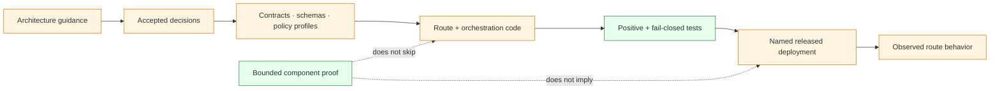
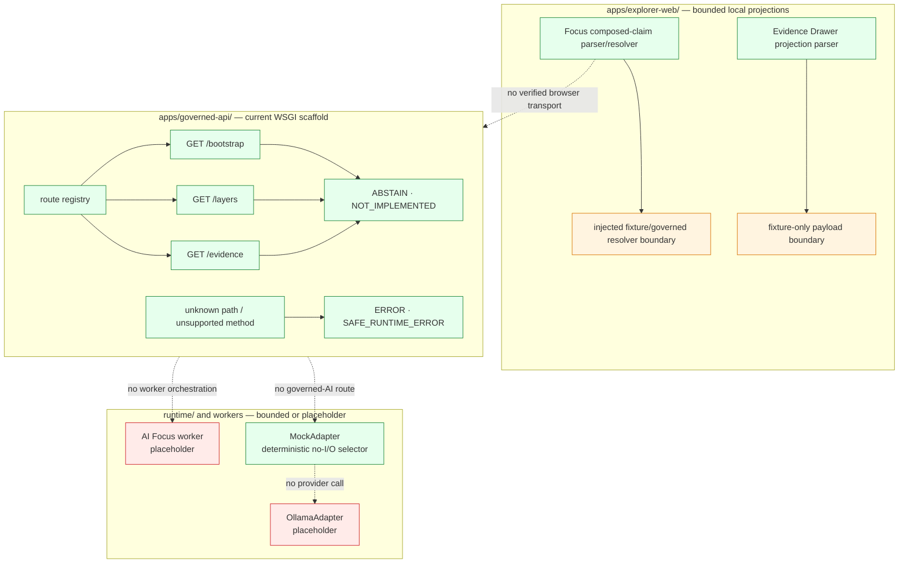

<!-- [KFM_META_BLOCK_V2]
doc_id: kfm://doc/architecture-governed-ai-route-map
title: Governed AI — Route Map
type: architecture-standard
version: v0.3
status: draft; repository-grounded; route-lineage-reconciled; governed-ai-route-absent; non-authoritative
maturity: bounded WSGI scaffold plus no-network client and adapter proofs; no end-to-end governed-AI transport
owners:
  - "@bartytime4life — verified CODEOWNERS review route"
  - "NEEDS VERIFICATION — Governed API maintainer"
  - "NEEDS VERIFICATION — governed-AI, evidence, citation, policy, security, review, correction, and release stewards"
created: 2026-05-24
updated: 2026-08-20
policy_label: public
truth_posture: cite-or-abstain
owning_root: docs/
current_path: docs/architecture/governed-ai/ROUTE_MAP.md
responsibility: "Explain the current executable route surface, bounded governed-AI client/runtime components, legacy six-family route taxonomy, ownership boundaries, forbidden paths, and graduation evidence without defining routes, contracts, schemas, policy, release state, or public exposure."
authority_class: explanatory architecture guidance
authority_limit: "This page does not register an endpoint, authenticate a caller, grant a capability, resolve evidence, execute policy, validate citations, invoke a provider, emit an AIReceipt, approve review, release an artifact, deploy a service, or publish a claim."
canonical_relationship: "CONFIRMED current topology — README.md is the active governed-AI landing page after merged PR #3149 retired the former flat docs/architecture/governed-ai.md entrypoint; the retired path remains historical lineage only."
evidence_snapshot:
  repository: bartytime4life/Kansas-Frontier-Matrix
  base_ref: main
  base_commit: e13f99b623e53d710d64dc2328eeb1471abf7f84
  target_prior_blob: c99296e4676e6a587ae6e6d003d163d31e217ee4
  directory_rules_blob: fd49a0b83e55cef52c1124281f093e263526898d
  adr_0029_blob: a4de0d7a96b78da59cfc499d1025e1508afd8dd9
  codeowners_blob: dd2a84aa514d8ecd9208bc347f90f9a2ed37dd61
  parent_readme_blob: 9e1071bb69910bde3f364d319923c4db00637639
  flat_overview_blob: f387e7709aab9f16f21fff18c18531fa250d710b
  governed_api_main_blob: 4eb335c7c0b27f62c7419c478542e8fe40e1ff38
  governed_api_registry_blob: 3418168d0b267160d6ad6dd87f289e880ef4a024
  governed_api_stub_blob: 371e60d9f96c78e31c8a1e6109d19dee5da4213b
  governed_api_envelopes_doc_blob: 4c80f1d1808d5bed8f56bc2fd1fb73222d65ee42
  governed_api_audience_doc_blob: 28662c84ac1347cd63f0246fc47d418f76b7ec0b
  governed_api_ai_readme_blob: cd38e803fa21262303ace292a1300e53a3e7ef7e
  runtime_response_builder_blob: 5dacededc1bda64292259ba39b6387facafbd1e8
  mock_adapter_blob: 04d37e59b14c9e3b85126cb3380b6221b44e26d1
  mock_adapter_test_blob: be1b1d2b4178b30ce9be754671a2c42271ad91bc
  ollama_adapter_blob: 1769a719d6a6df53e001abbc4c67ad486ab5c944
  ai_receipt_contract_blob: f4d8183dbed38f83144f6d9dbde30ae02a01edb8
  focus_request_schema_blob: a2f298f014fa299bdec03afbf14ba9937aa95ef8
  focus_response_schema_blob: fd109e4a3c859115d4ad138e9303cf8c5bdd8873
  focus_worker_blob: 7715d01fc585b03dedae7bb535591064bd6d055c
  explorer_focus_resolver_blob: 45aa4e7479a8c95138f98cc48c846f39a16aec2d
  explorer_focus_types_blob: 919ba17b92405d0998689ca8579fa42e74f4df60
  explorer_focus_test_blob: c32dbb2ccfa73b0b195aff3c231c19c5e8a19333
  explorer_governed_client_blob: 21f6e4d1225ab0427ecb689d6782f4b56fc25ea2
  focus_mock_workflow_blob: fbd56c7cda991ff8f3b804cc0c278e62daaa7abf
inspection_boundary: >-
  Current-session GitHub reads covered the complete prior target, the governed-AI
  folder inventory and repository-grounded parent/flat overviews, accepted Directory
  Rules placement authority, the current Governed API dispatcher/registry/stubs and
  app-local tests, modernized envelope and audience companions, the Governed API AI
  subtree inventory, RuntimeResponseEnvelope and AIReceipt surfaces, MockAdapter and
  proof tests, Ollama and worker placeholders, permissive Focus schemas, Explorer
  Focus composed-claim source/tests, the fixture-only GovernedClient, and the bounded
  focus-mock workflow. No authentication provider, grant store, active access bundle,
  EvidenceRef-to-EvidenceBundle service, citation service, AIReceipt emitter/store,
  model daemon, provider endpoint, governed-AI HTTP route, review mutation route,
  deployment, live request, release, correction propagation, rollback drill, or
  publication was exercised.
related:
  - README.md
  - BOUNDARIES.md
  - CONTINUITY_NOTES.md
  - FOCUS_FLOW.md
  - ADAPTER_CONTRACT.md
  - AI_RECEIPTS.md
  - MOCK_FIRST.md
  - OLLAMA_INTEGRATION.md
  - PROMPT_INJECTION.md
  - ../governed-api/README.md
  - ../governed-api/ENVELOPES.md
  - ../governed-api/AUDIENCE_CLASSES.md
  - ../../adr/ADR-0004-apps-governed-api-is-the-trust-membrane.md
  - ../../adr/ADR-0019-ai-adapter-contract-and-finite-envelopes.md
  - ../../adr/ADR-0029-adopt-directory-governance-standard-v2.md
  - ../../doctrine/directory-rules.md
  - ../../../apps/governed-api/src/governed_api/main.py
  - ../../../apps/governed-api/src/governed_api/routes/registry.py
  - ../../../apps/governed-api/src/governed_api/stub.py
  - ../../../apps/explorer-web/src/features/focus_panel/resolver.ts
  - ../../../runtime/model_adapters/MockAdapter.py
  - ../../../contracts/runtime/runtime_response_envelope.md
  - ../../../contracts/runtime/ai_receipt.md
  - ../../../schemas/contracts/v1/focus/focus_request.schema.json
  - ../../../schemas/contracts/v1/focus/focus_response.schema.json
tags: [kfm, architecture, governed-ai, route-map, governed-api, focus-mode, evidence, finite-outcomes, audience, trust-membrane, repository-grounded]
notes:
  - "v0.2 replaces the May 2026 proposal-era route catalogue with current repository evidence while preserving the document ID, path, H1, top anchor, numbered sections, and legacy section anchors."
  - "The executable Governed API registry contains only /bootstrap, /layers, and /evidence; all three are GET-only ABSTAIN / NOT_IMPLEMENTED stubs, with safe 404/405 ERROR behavior."
  - "The former six-family table is retained as architecture lineage and a migration crosswalk, not represented as an accepted enum, current router contract, or complete runtime surface."
  - "The Explorer Focus composed-claim projection and MockAdapter provide bounded no-network component proofs; neither establishes HTTP transport, evidence resolution, model inference, policy execution, citation validation, AIReceipt emission, release, deployment, or public AI operation."
  - "This documentation-only revision changes no route, app, package, contract, schema, policy, fixture, validator, test, workflow, provider, receipt, release, deployment, or publication state."
[/KFM_META_BLOCK_V2] -->

<a id="top"></a>

# Governed AI — Route Map

> **One-line purpose.** Reconcile the governed-AI route taxonomy with the repository's actual executable surface, distinguish routes from app-local projections and runtime components, and keep every unimplemented trust step on an explicit `HOLD`.

[](#1-scope)
[](#4-the-route-map-at-a-glance)
[](#6-per-route-inventory)
[](#5-the-six-api-families-confirmed--atlas-203)
[](#12-ui-negative-states--the-routes-contract-with-the-renderer)
[](#9-app-to-route-mapping)
[](#1-scope)

> [!IMPORTANT]
> **The current executable route map is small and non-AI.** `apps/governed-api/src/governed_api/routes/registry.py` registers exactly three paths—`/bootstrap`, `/layers`, and `/evidence`. Each accepts `GET` only and returns a schema-shaped `ABSTAIN / NOT_IMPLEMENTED` scaffold response. Unknown paths and disallowed methods return bounded `ERROR` envelopes. No Focus, model, source-summary, domain-feature, review-queue, authentication, authorization, or AIReceipt route is registered.

> [!CAUTION]
> **The historical six-family table is architecture lineage, not a current router contract.** It remains useful as a planning crosswalk, but current repository evidence does not establish it as an accepted enum, a complete public API, or six implemented endpoints. In particular, a route named `/layers` is not proof of manifest resolution, and `/evidence` is not proof of `EvidenceRef → EvidenceBundle` resolution.

> [!WARNING]
> **A bounded component is not an end-to-end route.** The repository has a no-I/O `MockAdapter`, a deterministic RuntimeResponseEnvelope candidate builder, proposed AIReceipt contract/schema support, and a fixture-first Explorer Focus composed-claim projection. Those surfaces are intentionally disconnected from provider, policy, evidence, citation, receipt-storage, and HTTP transport authority.

**Quick navigation:** [Scope](#1-scope) · [Placement](#2-repo-fit--open-dr-11-status-update) · [Architecture views](#3-the-three-axes-of-governed-ai-architecture) · [Current map](#4-the-route-map-at-a-glance) · [Legacy families](#5-the-six-api-families-confirmed--atlas-203) · [Inventory](#6-per-route-inventory) · [Trust flow](#7-the-click-to-truth-flow) · [Audience](#8-audience-classes) · [Apps](#9-app-to-route-mapping) · [Forbidden paths](#10-forbidden-routes-and-shortcuts) · [Contracts](#11-schema-and-contract-homes) · [UI states](#12-ui-negative-states--the-routes-contract-with-the-renderer) · [Anti-patterns](#13-anti-patterns) · [Open work](#14-open-questions-and-adr-triggers) · [Related](#15-related-docs) · [Appendix](#16-appendix--glossary-and-quick-reference)

---

<a id="1-scope"></a>

## 1. Scope

This page is the human-readable route and boundary map for governed-AI-adjacent behavior. It answers five questions:

1. Which paths are executable in the current Governed API registry?
2. Which bounded AI/Focus components exist without transport?
3. Which historical route families remain useful only as planning lineage?
4. Which contracts, schemas, policies, receipts, and applications own each responsibility?
5. What evidence must exist before a governed-AI route can be described as implemented, deployed, or public?

It does **not** define a route, URL convention, payload, audience enum, capability grant, policy bundle, review authority, deployment profile, or release state. Those remain in their owning roots and require their own evidence.

### 1.1 Current safe determination

| Claim | Status | Evidence-bounded conclusion |
|---|---|---|
| Target path and placement | **CONFIRMED** | This existing architecture page is under `docs/architecture/governed-ai/`; accepted ADR-0029 and Directory Rules v2 support human architecture guidance here. |
| Governed API executable paths | **CONFIRMED** | Exactly `/bootstrap`, `/layers`, and `/evidence` are registered. |
| Current registered-route outcome | **CONFIRMED / bounded** | Every registered route returns `ABSTAIN / NOT_IMPLEMENTED`; no substantive `ANSWER` is emitted. |
| Safe unknown/method behavior | **CONFIRMED / bounded** | Unknown path → `404` + safe `ERROR`; non-`GET` on a registered path → `405` + safe `ERROR`. |
| Governed-AI or Focus HTTP route | **CONFIRMED absent from the inspected registry** | No Focus/model/AI path is registered. |
| Route metadata | **CONFIRMED absent from the inspected registry** | No audience, purpose, capability, request/response profile, rate, release, or policy metadata is attached to route entries. |
| AI orchestration source | **CONFIRMED absent in the inspected app-local subtree** | `apps/governed-api/src/ai/` contains only `.gitkeep` and explanatory `README.md`. |
| Explorer Focus projection | **CONFIRMED / bounded** | A fixture-first, injected-resolver client projection parses strict app-local profiles, enforces EvidenceRef scope, renders finite outcomes, and performs no network/model/lifecycle-store access. |
| Mock adapter | **CONFIRMED / bounded** | A deterministic no-I/O selector returns isolated copies from a prevalidated four-outcome scenario matrix. It does not interpret, resolve evidence, execute policy, call a model, or emit a receipt. |
| Live provider | **CONFIRMED not established** | `OllamaAdapter.py` remains a one-line placeholder; no provider endpoint or admitted model was exercised. |
| Focus worker | **CONFIRMED placeholder** | The worker entrypoint is a one-line greenfield placeholder. |
| Authentication/authorization | **NOT PROVED** | No active provider, claim verifier, grant store, authorization middleware, capability binding, or revocation path was established. |
| Deployment/public exposure | **UNKNOWN / HOLD** | No live environment, ingress, observed request, service identity, log, dashboard, release binding, or publication decision was inspected. |
| Effect of this document | **None** | Documentation cannot register, release, deploy, or publish a route. |

### 1.2 Terms that must remain separate

| Term | Meaning here | Current example |
|---|---|---|
| **API family** | A planning or contract taxonomy grouping related operations. | The historical six-family atlas list. |
| **Executable route** | A path/method pair dispatched by current code. | `GET /bootstrap`, `GET /layers`, `GET /evidence`. |
| **Route declaration** | Metadata binding a route to capability, contracts, audience/exposure, policy, lifecycle, audit, and rollback. | **Not established** in the current registry. |
| **Client projection** | A browser-side, public-safe shape consumed or rendered after validation. | Explorer Focus composed-claim and Evidence Drawer fixture profiles. |
| **Semantic contract** | Human meaning of a trust-bearing object. | `contracts/runtime/runtime_response_envelope.md`. |
| **Machine schema** | Machine-valid shape. | `schemas/contracts/v1/runtime/runtime_response_envelope.schema.json`. |
| **Runtime component** | A reusable executable unit that may eventually participate behind a route. | `MockAdapter`; RuntimeResponseEnvelope candidate builder. |
| **Worker** | Background process boundary. | Current Focus worker is a placeholder, not a route implementation. |
| **Deployed endpoint** | Observed route in a named environment, bound to exact released bytes/configuration. | **UNKNOWN / not proved**. |

[↑ Back to top](#top)

---

<a id="2-repo-fit--open-dr-11-status-update"></a>

## 2. Repo fit — current placement and authority

### 2.1 Directory Rules basis

The prior edition treated this folder as a three-sibling proposal pending `OPEN-DR-11`. That framing is stale.

Accepted [`ADR-0029`](../../adr/ADR-0029-adopt-directory-governance-standard-v2.md) adopts Directory Rules v2. The current directory contains a landing page plus nine topic companions. This same-path update receives **`PLACE`** because it edits an existing human architecture document under the `docs/` responsibility root. It creates no root, route, object family, schema, policy lane, runtime surface, or authority migration.

### 2.2 Current sibling inventory

| Document | Primary explanatory concern | Current authority |
|---|---|---|
| [`README.md`](README.md) | Repository-grounded subsystem inventory and maturity boundary | Explanatory only |
| [`ADAPTER_CONTRACT.md`](ADAPTER_CONTRACT.md) | Provider-neutral adapter architecture | Explanatory only |
| [`AI_RECEIPTS.md`](AI_RECEIPTS.md) | Receipt/accountability architecture | Explanatory only |
| [`BOUNDARIES.md`](BOUNDARIES.md) | Trust and forbidden-path boundaries | Explanatory only |
| [`CONTINUITY_NOTES.md`](CONTINUITY_NOTES.md) | Lineage and continuity notes | Explanatory only |
| [`FOCUS_FLOW.md`](FOCUS_FLOW.md) | Proposed end-to-end Focus flow | Explanatory; older evidence assumptions require care |
| [`MOCK_FIRST.md`](MOCK_FIRST.md) | Mock-first architecture | Explanatory only |
| [`OLLAMA_INTEGRATION.md`](OLLAMA_INTEGRATION.md) | Deferred provider posture | Explanatory only |
| [`PROMPT_INJECTION.md`](PROMPT_INJECTION.md) | Untrusted-content boundaries | Explanatory only |
| `ROUTE_MAP.md` | Current route inventory, lineage crosswalk, and graduation map | This page; explanatory only |

The existence of a topic document does not prove its described implementation. Architecture pages may define target constraints while code, contracts, schemas, policy, tests, deployment records, and observed behavior decide current state.

### 2.3 Retired overview relationship

Merged [PR #3149](https://github.com/bartytime4life/Kansas-Frontier-Matrix/pull/3149) retired the former flat `docs/architecture/governed-ai.md` overview. [`README.md`](README.md) is the active subsystem landing page; immutable receipts, Git history, and the pinned convergence ledger retain the former path only as historical lineage. This navigation correction does not accept an ADR or create runtime, policy, release, or publication authority.

### 2.4 Responsibility split

| Responsibility | Owning surface | This page's role |
|---|---|---|
| Human architecture explanation | `docs/architecture/` | Explain current and target relationships. |
| Binding architecture decisions | `docs/adr/` | Report status; never accept by implication. |
| Semantic route/object meaning | `contracts/` | Link current contracts; never redefine them here. |
| Machine shape | `schemas/` | Report exact current maturity; never fork a schema. |
| Route dispatch and app behavior | `apps/governed-api/` | Read current code and tests. |
| Client composition | `apps/explorer-web/` | Report bounded projection behavior. |
| Provider-neutral adapters | `runtime/` | Report component proof and limits. |
| Admissibility, access, sensitivity | `policy/` | No active evaluator is inferred. |
| Evidence resolution | evidence contracts/packages/data surfaces | No resolver service is inferred. |
| Receipts and proofs | their distinct `data/` lanes | A schema or ref is not emitted history. |
| Review and release | review/release owning surfaces | A route or UI action is not approval or publication. |
| Deployment and exposure | `infra/`, app/config/runtime records | No environment is inferred from source presence. |

[↑ Back to top](#top)

---

<a id="3-the-three-axes-of-governed-ai-architecture"></a>

## 3. The three axes of governed-AI architecture

The prior spatial/temporal/structural framing is retained as a useful reading aid, not as a claim that three documents exhaust the subsystem.

| Axis | Question | Current architecture companion | What proves implementation |
|---|---|---|---|
| Spatial/trust boundary | What may model-mediated behavior read, transform, or expose? | [`BOUNDARIES.md`](BOUNDARIES.md) | Pinned code/configuration, negative tests, policy, and observed deployment boundaries |
| Temporal/continuity boundary | How are versions, receipts, corrections, supersessions, and replay relationships retained? | [`CONTINUITY_NOTES.md`](CONTINUITY_NOTES.md), [`AI_RECEIPTS.md`](AI_RECEIPTS.md) | Emitted records, validated references, storage behavior, correction/rollback evidence |
| Structural/route boundary | Which operation is reachable through which governed interface and profile? | `ROUTE_MAP.md`, [`FOCUS_FLOW.md`](FOCUS_FLOW.md) | Route registry, route declarations, contracts/schemas, tests, deployed probes |

A fourth practical distinction is essential: **component proof versus composed flow**. The current repository proves selected components but not the end-to-end sequence.


```mermaid
flowchart LR
  DOC["Architecture guidance"] --> DEC["Accepted decisions"]
  DEC --> PROFILE["Contracts · schemas · policy profiles"]
  PROFILE --> CODE["Route + orchestration code"]
  CODE --> TEST["Positive + fail-closed tests"]
  TEST --> DEPLOY["Named released deployment"]
  DEPLOY --> OBSERVE["Observed route behavior"]

  COMPONENT["Bounded component proof"] -. "does not skip" .-> CODE
  COMPONENT -. "does not imply" .-> DEPLOY

  classDef held fill:#fff4e0,stroke:#d97706;
  classDef confirmed fill:#e6ffed,stroke:#1f883d;
  class DOC,DEC,PROFILE,CODE,DEPLOY,OBSERVE held;
  class TEST,COMPONENT confirmed;
```

For the current governed-AI route, the chain stops before route/orchestration code. A green component test cannot bridge the missing stages.

[↑ Back to top](#top)

---

<a id="4-the-route-map-at-a-glance"></a>

## 4. The route map at a glance

### 4.1 Current executable and bounded-component map


```mermaid
flowchart TB
  subgraph API["apps/governed-api/ — current WSGI scaffold"]
    REG["route registry"]
    B["GET /bootstrap"]
    L["GET /layers"]
    E["GET /evidence"]
    N["unknown path / unsupported method"]
    REG --> B
    REG --> L
    REG --> E
    B --> AB["ABSTAIN · NOT_IMPLEMENTED"]
    L --> AB
    E --> AB
    N --> ER["ERROR · SAFE_RUNTIME_ERROR"]
  end

  subgraph CLIENT["apps/explorer-web/ — bounded local projections"]
    FP["Focus composed-claim parser/resolver"]
    ED["Evidence Drawer projection parser"]
    FP --> FX["injected fixture/governed resolver boundary"]
    ED --> FX2["fixture-only payload boundary"]
  end

  subgraph RUNTIME["runtime/ and workers — bounded or placeholder"]
    MOCK["MockAdapter<br/>deterministic no-I/O selector"]
    OLL["OllamaAdapter<br/>placeholder"]
    WORK["AI Focus worker<br/>placeholder"]
  end

  FP -. "no verified browser transport" .-> API
  API -. "no governed-AI route" .-> MOCK
  MOCK -. "no provider call" .-> OLL
  API -. "no worker orchestration" .-> WORK

  classDef current fill:#e6ffed,stroke:#1f883d;
  classDef held fill:#fff4e0,stroke:#d97706;
  classDef absent fill:#ffebe9,stroke:#cf222e;
  class REG,B,L,E,N,AB,ER,FP,ED,MOCK current;
  class FX,FX2 held;
  class OLL,WORK absent;
```

**Reading rule:** solid arrows show current local code relationships. Dotted arrows show expected seams whose transport or orchestration is **not verified**. The diagram does not represent a deployed topology.

### 4.2 Current executable route matrix

| Path or condition | Method | Current HTTP result | Current envelope outcome | Governed-AI binding |
|---|---|---|---|---|
| `/bootstrap` | `GET` | `200` | `ABSTAIN / NOT_IMPLEMENTED` | None |
| `/layers` | `GET` | `200` | `ABSTAIN / NOT_IMPLEMENTED` | None; no manifest resolution |
| `/evidence` | `GET` | `200` | `ABSTAIN / NOT_IMPLEMENTED` | None; no EvidenceRef resolution |
| Registered path | non-`GET` | `405` | `ERROR / SAFE_RUNTIME_ERROR` | Not applicable |
| Unknown path | any | `404` | `ERROR / SAFE_RUNTIME_ERROR` | Not applicable |
| Focus/model/review/source-summary/domain-feature path | any | Not registered | Not applicable | **ABSENT / HOLD** |

### 4.3 What the current map proves

It proves bounded dispatch, deterministic finite negative envelopes, a closed route set, method rejection, and safe errors in the inspected scaffold. It does not prove HTTP authentication, authorization, evidence resolution, policy execution, substantive content, release binding, AI orchestration, provider invocation, receipt persistence, deployment, or public availability.

[↑ Back to top](#top)

---

<a id="5-the-six-api-families-confirmed--atlas-203"></a>

## 5. The six API families — lineage crosswalk

The v0.1 page promoted the atlas's six-family planning table into “CONFIRMED doctrine” and treated it as the entire governed-AI runtime. Current repository evidence requires a narrower statement:

- the six labels are **CONFIRMED as historical repository/corpus lineage**;
- they remain a useful architecture crosswalk;
- they are **not established as an accepted canonical enum**;
- they are **not the current route registry**; and
- several named DTOs or bindings remain proposal-only, permissive, absent, or uncomposed.

| Historical family | Current executable relationship | Current profile evidence | Safe status |
|---|---|---|---|
| Source summary resolver | No registered source-summary route | Source-related contracts may exist elsewhere, but no binding was found in the inspected registry | **LINEAGE / route absent** |
| Domain feature/detail lookup | No registered domain-feature route | `DomainFeatureEnvelope` remains proposal lineage; the bounded envelope review found no paired governed profile | **LINEAGE / profile HOLD** |
| Layer manifest resolver | Name-adjacent `/layers` stub only | The route returns `ABSTAIN / NOT_IMPLEMENTED`; no release-manifest lookup is performed | **BOUNDED stub, not resolver** |
| Evidence resolver | Name-adjacent `/evidence` stub only | The route returns `ABSTAIN / NOT_IMPLEMENTED`; no `EvidenceRef → EvidenceBundle` resolution is performed | **BOUNDED stub, not resolver** |
| Focus Mode runtime | No registered Focus route | App-local no-network projection and MockAdapter proofs exist; Focus schemas are permissive scaffolds; no provider or orchestration | **BOUNDED components / route HOLD** |
| Review queue surface | No registered review route | Review Console documentation describes a proposed role-gated surface; no queue/decision route is proved | **LINEAGE / route absent** |

### 5.1 Taxonomy change discipline

Changing a route taxonomy may require an ADR when it creates a durable cross-system architecture, new public compatibility promise, new authority-bearing object family, or breaking migration. It is not accurate to say that any seventh label automatically requires an ADR merely because the prior atlas listed six. The controlling questions are authority, compatibility, ownership, exposure, and migration consequence.

### 5.2 No silent aliasing

The following pairs are not aliases without a reviewed crosswalk:

- route family ↔ URL path;
- `/layers` ↔ `LayerManifest` resolver;
- `/evidence` ↔ EvidenceBundle resolver;
- Explorer Focus projection ↔ Governed API Focus response;
- `MockAdapter` scenario selector ↔ model inference adapter;
- AIReceipt contract/schema ↔ emitted receipt;
- Review Console app boundary ↔ review mutation API;
- legacy audience label ↔ capability authorization.

[↑ Back to top](#top)

---

<a id="6-per-route-inventory"></a>

## 6. Per-route inventory

This section preserves the v0.1 family subsections for backlink compatibility while correcting each one to current evidence.

### 6.0 Current non-family route: bootstrap

`GET /bootstrap` is executable and returns `ABSTAIN / NOT_IMPLEMENTED`. The historical six-family list did not account for this current scaffold route. That mismatch is another reason to treat the list as lineage rather than the executable register.

### 6.1 Source summary resolver

| Field | Current conclusion |
|---|---|
| Registered path | **None found** |
| Request/response binding | **Not established** |
| Authentication/capability binding | **Not established** |
| Current outcome | Not applicable |
| What remains useful | The idea of a public-safe SourceDescriptor projection remains a proposal to reconcile with current contracts, rights, sensitivity, and exposure profiles. |
| HOLD | Do not publish a concrete URL, field list, or public audience claim until a route declaration, contract/schema, policy, tests, and deployment evidence agree. |

### 6.2 Domain feature/detail lookup

| Field | Current conclusion |
|---|---|
| Registered path | **None found** |
| `DomainFeatureEnvelope` | Proposal lineage; no current paired governed profile was established by the bounded envelope review |
| Browser feature support | Domain/UI features may consume fixture projections, but that is not this route |
| Current outcome | Not applicable |
| HOLD | Define semantic payload composition, field authorization, release/correction behavior, and sensitivity negatives before route registration. |

### 6.3 Layer manifest resolver

| Field | Current conclusion |
|---|---|
| Registered path | `GET /layers` |
| Current response | Schema-shaped `ABSTAIN / NOT_IMPLEMENTED` |
| Manifest lookup | **Not implemented in the inspected route** |
| Release binding | **Not implemented in the inspected route** |
| Audience/auth metadata | **Absent from registry** |
| HOLD | Do not call `/layers` a released manifest resolver until exact manifest contracts, release/correction checks, app behavior, tests, and observed transport prove it. |

The prior claim that this family cannot return `ABSTAIN` is not current runtime truth. The current `/layers` scaffold does return `ABSTAIN`. Future outcome semantics require an accepted route/profile decision; architecture prose cannot outlaw a current safe-held outcome.

### 6.4 Evidence resolver

| Field | Current conclusion |
|---|---|
| Registered path | `GET /evidence` |
| Current response | Schema-shaped `ABSTAIN / NOT_IMPLEMENTED` |
| EvidenceRef resolution | **Not implemented in the inspected route** |
| EvidenceBundle projection | **Not implemented in the inspected route** |
| Redaction/field authorization | **Not implemented in the inspected route** |
| HOLD | Require resolver integration, evidence/ref scope tests, rights/sensitivity projection, correction/withdrawal behavior, and release-aware negative cases before `ANSWER`. |

### 6.5 Focus Mode runtime

| Surface | Current evidence | Limit |
|---|---|---|
| Governed API route | No Focus path in current registry | No HTTP transport or server orchestration |
| `apps/governed-api/src/ai/` | `.gitkeep` + explanatory README | No implementation modules |
| Focus request/response schemas | PROPOSED empty-property scaffolds with `additionalProperties: true` | No closed runtime contract |
| Explorer Focus request/projection | Strict app-local profiles, injected resolver, EvidenceRef scope checks, fixed no-leak states | Browser transport and server semantics not supplied |
| Focus fixtures/tests | Supported, qualified, abstain, deny, malformed, mismatch, no-leak, and no-network cases | Synthetic projection proof only |
| `MockAdapter` | Four-outcome deterministic no-I/O selector | Does not interpret, call a model, resolve evidence, execute policy, validate citations, or emit receipt |
| `OllamaAdapter` | One-line placeholder | No provider |
| Focus worker | One-line placeholder | No worker behavior |
| AIReceipt contract/schema/validator | Proposed accountability profile exists | No verified emitter/store or route binding |

A fixture projection with `outcome = ANSWER` proves that the client can validate and render a bounded synthetic answer shape. It does **not** prove model inference, evidence closure, citation validation, policy allowance, receipt emission, release, deployment, or public AI operation.

### 6.6 Review queue surface

| Field | Current conclusion |
|---|---|
| Registered path | **None found** |
| Review Console | App README defines a proposed role-gated boundary |
| Decision recorder | **Not proved** |
| Reviewer identity/authorization | **Not proved** |
| Separation of duties | Architecture requirement; no route enforcement proved |
| Release authority | Remains separate; no console or route self-authorizes publication |
| HOLD | Require accepted decision vocabulary, ReviewRecord profile, actor authority, audit persistence, fail-closed tests, and release handoff before mutation. |

[↑ Back to top](#top)

---

<a id="7-the-click-to-truth-flow"></a>

## 7. The click-to-truth flow

### 7.1 Current bounded client behavior

The Explorer Focus component currently accepts an app-local request containing a `request_id`, `claim_id`, bounded question, and `allowed_evidence_refs`. It validates an injected projection, rejects unknown fields and identity/scope drift, and renders fixed `ANSWER`, `ABSTAIN`, `DENY`, or `ERROR` views. Its source contains no `fetch()` call and no provider, renderer, or lifecycle-store import.

The Explorer `GovernedClient` is also fixture-only and explicitly performs no network or lifecycle-store access.

Therefore the current flow is:

```text
synthetic/app-local request
  -> strict browser parser
  -> injected resolver boundary
  -> strict public-safe projection parser
  -> EvidenceRef scope check
  -> finite UI view
```

It is not:

```text
browser -> deployed Governed API -> evidence -> policy -> model -> citation -> receipt
```

### 7.2 Proposed governed target flow

The target sequence remains a useful architecture requirement, but every arrow below is **PROPOSED / HOLD** until its owning evidence exists:


```mermaid
flowchart LR
  REQ["bounded request"] --> DECL["admitted route declaration"]
  DECL --> AUTH["identity · capability · purpose · object"]
  AUTH --> PRE["policy / rights / sensitivity precheck"]
  PRE --> EV["EvidenceRef → EvidenceBundle resolution"]
  EV --> CTX["minimized admissible context"]
  CTX --> ADP["provider-neutral adapter"]
  ADP --> CAND["structured untrusted candidate"]
  CAND --> CIT["citation validation"]
  CIT --> POST["policy postcheck"]
  POST --> ENV["validated RuntimeResponseEnvelope"]
  ENV --> REC["AIReceipt emission when required"]
  REC --> CLIENT["governed client projection"]

  classDef hold fill:#fff4e0,stroke:#d97706;
  class REQ,DECL,AUTH,PRE,EV,CTX,ADP,CAND,CIT,POST,ENV,REC,CLIENT hold;
```

### 7.3 Graduation evidence by edge

| Edge | Minimum evidence before calling it implemented |
|---|---|
| Request → route | Closed semantic request contract, closed schema, route registration, method and size bounds, negative tests |
| Route → identity/capability | Auth provider/profile, issuer/audience checks, grants, expiry/revocation, purpose/object binding, audit |
| Capability → policy | Accepted input profile, active bundle identity, evaluator binding, obligations, fail-safe tests |
| Policy → evidence | Resolver implementation, deterministic identity, admissibility, sensitivity, stale/conflict/correction tests |
| Evidence → adapter | Context-minimization contract, no-secret/no-raw-store checks, provider-neutral adapter contract |
| Adapter → candidate | Structured-output profile, provider fault handling, timeout/cancellation, no hidden fallback |
| Candidate → citations | Citation report contract, exact support validation, unsupported-claim negatives |
| Citations → postcheck | Output sensitivity/rights/precision checks and fail-closed denial |
| Postcheck → envelope | Current RuntimeResponseEnvelope composition decision and validator |
| Envelope → receipt | Accepted AIReceipt emission trigger, canonicalization, persistence, reference closure, correction semantics |
| Receipt → client | Public-safe projection, accessibility, telemetry minimization, transport/integration tests |
| Client → deployed claim | Exact release/environment identity, final-edge probes, correction and rollback rehearsal |

Skipping an unresolved edge is not optimization; it is a trust-membrane defect.

[↑ Back to top](#top)

---

<a id="8-audience-classes"></a>

## 8. Audience classes

The prior edition presented `public`, `partner`, `steward`, `internal`, and `denied` as one route-class system. The current [`Governed API audience reconciliation`](../governed-api/AUDIENCE_CLASSES.md) establishes a safer conclusion:

> No canonical audience-class enum is accepted or enforced by the inspected repository evidence.

The five literals remain migration lineage only. In particular, `denied` is not a caller class; `DENY` is a finite decision outcome.

### 8.1 Axes that must remain separate

| Axis | Question | Current route evidence |
|---|---|---|
| Authentication | Who or what was verified, by which provider and assurance? | Not implemented in inspected dispatcher |
| Caller/workload role | Which bounded role is asserted? | No registry metadata |
| Capability | May this principal perform this operation on this object for this purpose/time? | No route-capability binding |
| Exposure posture | Internal-only, public candidate, unresolved, retired, prohibited? | No accepted route profile |
| Field projection | Which fields may leave the membrane? | No server-side route projection binding |
| Lifecycle/release | Which state may be returned? | Current stubs return no content |
| Finite outcome | What did this exact evaluation return? | `ABSTAIN` or safe `ERROR` today |
| Rate/availability | What budget and abuse controls apply? | No current route-bound profile |
| Review authority | Who may review or decide? | No review route or actor binding |

### 8.2 Current app-local vocabularies are not authorization

The Explorer Focus projection carries policy, review, release, and freshness labels so the browser can fail closed on a governed projection. Those labels do not authenticate the caller, grant access, execute policy, or make the projection released.

### 8.3 Documentation rule

Do not attach an audience label to a current route as factual until executable route metadata, identity/capability policy, field projection, tests, deployment configuration, and observed behavior agree. `UNBOUND` means no binding was verified; it does not mean public.

[↑ Back to top](#top)

---

<a id="9-app-to-route-mapping"></a>

## 9. App-to-route mapping

### 9.1 Current responsibility map

| Surface | Current repository evidence | Current route relationship |
|---|---|---|
| `apps/governed-api/` | Small WSGI dispatcher, three GET stubs, safe 404/405, app-local tests | Only current executable HTTP surface inspected |
| `apps/governed-api/src/ai/` | `.gitkeep` and README only | No AI orchestration route implementation |
| `apps/explorer-web/src/features/focus_panel/` | App-local parser/resolver/view code and focused fixture tests | Injected resolver boundary; no network transport |
| `apps/explorer-web/src/adapters/GovernedClient.ts` | Strict fixture-only Evidence Drawer projection parser | No network or lifecycle-store access |
| `apps/review-console/` | Architecture/app README and proposed surface map | No review route or decision recorder proved |
| `apps/workers/src/ai_focus_worker/` | Placeholder entrypoint | No route or worker behavior |
| `runtime/model_adapters/MockAdapter.py` | Deterministic no-I/O scenario selector with proof tests | Component only; not registered behind API |
| `runtime/model_adapters/OllamaAdapter.py` | Placeholder | No provider binding |
| `packages/envelopes/` | Deterministic RuntimeResponseEnvelope candidate builder and tests | Reusable candidate construction; not transport authority |
| `contracts/runtime/ai_receipt.md` + paired schema/validator | Proposed accountability profile | No emitter/store/route binding |

### 9.2 Target dependency direction

```text
public or role-gated client
  -> admitted Governed API route
  -> policy/evidence/citation/runtime dependencies behind the membrane
  -> validated finite envelope
  -> public-safe client projection

never:
client
  -> model adapter
  -> RAW / WORK / QUARANTINE / canonical store
  -> unreviewed review mutation
  -> release-state toggle
```

### 9.3 Route ownership rule

A route belongs to the deployable application that owns its behavior. Shared contracts, schemas, policy, adapters, evidence resolvers, and client projections remain separate dependencies. This page must not move implementation into `docs/` or turn a runtime package into public route authority.

[↑ Back to top](#top)

---

<a id="10-forbidden-routes-and-shortcuts"></a>

## 10. Forbidden routes and shortcuts

The path strings below are examples of prohibited capabilities, not claims that these routes currently exist.

| Prohibited capability | Why it fails | Required posture |
|---|---|---|
| Public read of RAW, WORK, QUARANTINE, or canonical/internal stores | Bypasses lifecycle, evidence, policy, release, and correction controls | Serve only governed projections or released public-safe artifacts |
| Browser-to-model or public completion endpoint | Lets model traffic bypass evidence, policy, citation, and receipt boundaries | Model adapters remain server-side behind admitted routes |
| Unreleased layer/tile/artifact lookup | Reachability is not release authorization | Require exact released artifact identity, policy, correction, rollback |
| Freeform prompt/context pass-through | Bypasses bounded request and context-minimization profiles | Accept only closed, validated, policy-bounded inputs |
| Client-controlled audience, role, policy, or release state | Lets an untrusted caller widen its own authority | Derive trusted context server-side and evaluate exact capability |
| Public review/admin mutation shortcut | Collapses review, release, and administrative duties | Role-gated, audited, policy-bound interfaces with separation where required |
| Route returning uncited authoritative prose | Breaks cite-or-abstain | `ABSTAIN` unless support validates |
| Route exposing chain-of-thought, provider traces, prompts, secrets, or protected diagnostics | Creates a new sensitive data surface | Return bounded reason codes and protected audit references only |
| AIReceipt used as EvidenceBundle or release proof | Receipt records process, not truth or approval | Keep evidence, policy, receipt, review, and release objects distinct |
| Silent fallback from failed policy/evidence/provider to a generic answer | Converts failure into privilege and truth widening | Return the appropriate finite negative outcome |
| Documentation-only endpoint catalogue treated as live | Replaces implementation evidence with prose | Verify registry, code, tests, deployment, and probes |

Current code is safely narrower than this target map. A future route change must preserve that fail-closed baseline rather than using documentation as permission to expand.

[↑ Back to top](#top)

---

<a id="11-schema-and-contract-homes"></a>

## 11. Schema and contract homes

### 11.1 Current profile register

| Object/profile | Current evidence | Current limit |
|---|---|---|
| `RuntimeResponseEnvelope` | Semantic contract, closed schema, validator, fixtures, deterministic candidate builder, proof tests, and schema-shaped API stubs | No substantive answer-body composition, evidence/policy/release binding, or deployed transport |
| `DecisionEnvelope` | Separate semantic contract, closed schema, fixtures, and bounded semantic validator | Not nested in or referenced by the current RuntimeResponseEnvelope profile |
| `AIReceipt` | Proposed semantic contract, closed paired schema, local validator, and receipt architecture docs | No verified runtime emitter, persistence, resolver, route binding, or public exposure |
| Focus request schema | Permissive PROPOSED scaffold with empty `properties` and `additionalProperties: true` | Not a closed request contract |
| Focus response schema | Permissive PROPOSED scaffold with empty `properties` and `additionalProperties: true` | Not a closed response contract |
| Explorer Focus composed-claim request | Strict app-local TypeScript profile | Client profile, not canonical HTTP contract/schema |
| Explorer Focus public-safe projection | Strict app-local TypeScript profile and fixtures | Client projection, not server route contract |
| Evidence Drawer projection | Strict fixture-only browser profile | Canonical schema-home decision and live transport remain outside this adapter |
| `DomainFeatureEnvelope` | Proposal references and historical taxonomy | No paired governed contract/schema/validator/fixture implementation established by the bounded envelope review |

### 11.2 Current exact homes used by this page

```text
contracts/runtime/
├── runtime_response_envelope.md
├── decision_envelope.md
└── ai_receipt.md

schemas/contracts/v1/runtime/
├── runtime_response_envelope.schema.json
├── decision_envelope.schema.json
└── ai_receipt.schema.json

schemas/contracts/v1/focus/
├── focus_request.schema.json       # permissive PROPOSED scaffold
└── focus_response.schema.json      # permissive PROPOSED scaffold

apps/governed-api/src/governed_api/
├── main.py
├── stub.py
└── routes/
    ├── registry.py
    ├── bootstrap.py
    ├── layers.py
    └── evidence.py

apps/explorer-web/src/features/focus_panel/
├── parsers.ts
├── resolver.ts
├── types.ts
└── panel.ts

runtime/model_adapters/
├── MockAdapter.py
└── OllamaAdapter.py
```

### 11.3 Placement rule for future work

Before adding route metadata, a request/response profile, receipt binding, policy module, or new object family:

1. identify the primary responsibility and owning root;
2. inspect current contracts, schemas, policy, registries, generators, and consumers;
3. avoid a parallel authority home;
4. record compatibility and migration consequences;
5. add positive and fail-closed fixtures/tests;
6. keep review, release, correction, rollback, and deployment state separate.

A proposed tree in architecture prose does not reserve a path.

[↑ Back to top](#top)

---

<a id="12-ui-negative-states--the-routes-contract-with-the-renderer"></a>

## 12. UI negative states — the route's contract with the renderer

The prior edition described negative states as if they were already shared server-route reason codes. Current evidence supports a narrower, useful claim: the Explorer implements bounded app-local Focus and Evidence Drawer negative-state handling.

### 12.1 Current Focus composed-claim behavior

| Condition | Current local result | Transport invoked? |
|---|---|---:|
| Request fails strict parse | `ERROR / REQUEST_INVALID` with fixed safe copy | No |
| No allowed EvidenceRef scope | `ABSTAIN / MISSING_EVIDENCE_SCOPE` | No |
| Injected resolver throws | `ERROR / GOVERNED_RESOLVER_ERROR` with no exception echo | Injected boundary called; no built-in network |
| Projection malformed | `ERROR / PROJECTION_INVALID` | Injected boundary called |
| Request/response identity mismatch | `ERROR / RESPONSE_SCOPE_MISMATCH` | Injected boundary called |
| Projection references evidence outside request | `ERROR / EVIDENCE_OUTSIDE_REQUEST` | Injected boundary called |
| Synthetic support closes | `ANSWER / COMPOSED_CLAIM_SUPPORTED` | Fixture/injected projection only |
| Synthetic support is qualified | `ANSWER / COMPOSED_CLAIM_QUALIFIED` with limitations | Fixture/injected projection only |
| Synthetic dependency unresolved | `ABSTAIN` with fixed non-substantive copy | Fixture/injected projection only |
| Synthetic policy denial | `DENY` with no citations/evidence leaked | Fixture/injected projection only |

The tests also reject unknown request/projection fields, duplicate evidence refs, unsafe control characters, citation drift, Evidence Drawer drift, private reasoning fields, provider imports, direct `fetch()`, renderer imports, and lifecycle-store imports.

### 12.2 Evidence Drawer projection boundary

The fixture-only `GovernedClient` validates finite outcomes, reason codes, trust state, negative history, correction chains, HTTPS citations, bounded text, exact fields, and no current-resolution use of held/superseded/withdrawn/revoked evidence. This is meaningful client-side fail-closed proof. It is not EvidenceBundle resolution, server policy, or a live API client.

### 12.3 Accessibility and disclosure

The Focus view selects `polite` or `assertive` live-region behavior by finite outcome, exposes fixed human-readable negative states, and labels an AIReceipt reference as a **process receipt, not release proof**. These are bounded UI behaviors, not proof that the referenced receipt exists or that the response was released.

### 12.4 Integration HOLD

Before these app-local states can be called route-contract behavior, KFM still needs:

- one accepted request/response and reason-code profile;
- a real Governed API transport binding;
- server-side identity/capability/policy/evidence/citation behavior;
- response validation at the trust boundary;
- AIReceipt emission and reference resolution where required;
- integration and browser tests against the exact route;
- deployment and final-edge observations;
- correction/withdrawal propagation and rollback evidence.

[↑ Back to top](#top)

---

<a id="13-anti-patterns"></a>

## 13. Anti-patterns

| Anti-pattern | Why it fails | Correction |
|---|---|---|
| Treating the six-family atlas list as the current registry | Taxonomy and executable paths are different evidence classes | Show the exact registry, then crosswalk lineage separately |
| Treating a familiar path name as implemented semantics | `/layers` and `/evidence` are abstention stubs | Inspect handler behavior and tests |
| Treating `DomainFeatureEnvelope` as current because docs mention it | No paired governed profile was established | Keep it proposal-only until contract/schema/validator/fixtures exist |
| Treating a fixture `ANSWER` as public AI operation | Synthetic client projection does not prove evidence/policy/model/receipt/release | Label scope and require composed runtime evidence |
| Treating `MockAdapter` as a model runtime | It selects prevalidated fixture envelopes and performs no I/O | Call it a deterministic scenario selector |
| Treating an AIReceipt schema as emitted accountability | Shape presence is not emission, persistence, or reference closure | Verify producer, store, resolver, tests, and correction behavior |
| Treating legacy audience labels as authentication or grants | Vocabulary is conflicted and no enforcement exists | Separate identity, role, capability, purpose, field, lifecycle, and outcome |
| Treating `DENY` as an audience | Outcome and caller class collapse | Use a finite outcome plus separate route/exposure state |
| Publishing concrete URL paths from architecture prose as current | Creates a false compatibility promise | Mark proposals and cite exact executable registration |
| Letting Explorer call internal stores or model providers | Browser becomes a parallel trust path | Keep injected/governed boundary and server-side dependencies |
| Adding AI source code under a documentation or policy root | Ownership and authority collapse | Use the responsible implementation root after placement review |
| Combining review and publication in one unreviewed route | Separation, audit, correction, and rollback become opaque | Keep review record and release decision distinct |
| Returning hidden diagnostics or chain-of-thought | Leaks sensitive implementation/model state | Fixed public copy plus protected audit reference |
| Calling a workflow green result an admitted route | CI proves only its declared checks | Require runtime/deployment evidence separately |

[↑ Back to top](#top)

---

<a id="14-open-questions-and-adr-triggers"></a>

## 14. Open questions and ADR triggers

### 14.1 Route and integration HOLD register

| ID | Decision or proof needed | Current state | Closure evidence |
|---|---|---|---|
| `AIR-01` | Is the six-family taxonomy retained, revised, or retired? | **LINEAGE / unresolved** | Accepted architecture/profile crosswalk with compatibility notes |
| `AIR-02` | Where does authoritative route declaration metadata live? | **UNKNOWN** | Directory Rules placement decision plus contract/schema/validator/tests |
| `AIR-03` | How does substantive answer content compose with the current RuntimeResponseEnvelope, which has no payload member? | **HOLD** | Accepted composition profile and migration tests |
| `AIR-04` | What is the canonical Focus request/response semantic contract? | **HOLD** | Contracts plus closed schemas replacing permissive scaffolds |
| `AIR-05` | Which reason-code grammar and HTTP/outcome mapping apply? | **CONFLICTED** | Accepted binding across app, contracts, schemas, validators, clients |
| `AIR-06` | Which identity, role, capability, purpose, object, field, and revocation model applies? | **UNKNOWN / HOLD** | Security/access decision, active config/policy, positive and negative tests |
| `AIR-07` | Which EvidenceRef resolver and admissibility profile serve the route? | **HOLD** | Integrated resolver, EvidenceBundle closure, stale/conflict/sensitivity tests |
| `AIR-08` | Which policy precheck/postcheck bundle is active? | **HOLD** | Accepted policy, exact bundle identity, evaluator binding, receipts/tests |
| `AIR-09` | Which citation report profile and validator gate `ANSWER`? | **HOLD** | Exact support validator, unsupported-claim negatives, runtime binding |
| `AIR-10` | When is AIReceipt required, who emits it, where is it stored, and how is it corrected? | **HOLD** | Producer/store/resolver/canonicalization/correction tests |
| `AIR-11` | Which provider/adapter is admitted? | **HOLD** | Provider decision, pinned model/profile, security/rights review, fault tests |
| `AIR-12` | Is Focus synchronous, asynchronous, or both? | **UNKNOWN** | Accepted transport/job semantics and cancellation/idempotency tests |
| `AIR-13` | What is the review queue mutation contract and actor authority? | **HOLD** | ReviewRecord profile, named/verified roles, SoD, audit store, fail-closed tests |
| `AIR-14` | How do correction, withdrawal, stale evidence, and rollback propagate to AI responses and receipts? | **HOLD** | Integrated lineage test and rollback rehearsal |
| `AIR-15` | What deployed route inventory exists? | **UNKNOWN** | Exact released digest/config, ingress inventory, probes, logs, rollback target |
| `AIR-16` | How are the flat governed-AI overview and folder README governed long term? | **CONFLICTED / HOLD** | Reviewed documentation disposition; no silent deletion |

### 14.2 ADR triggers

An ADR or accepted successor decision is appropriate when work:

- establishes or replaces the cross-system route taxonomy;
- creates a new trust-bearing route declaration object family or authority home;
- selects a durable authentication/capability or provider architecture;
- creates a public or semi-public model-mediated path;
- changes the RuntimeResponseEnvelope compatibility profile;
- changes review/release separation;
- retires or redirects a documented compatibility surface; or
- permits non-released or sensitive material to leave through an ordinary client path.

A small implementation that conforms to already accepted contracts and architecture may be an ordinary reviewed PR. Do not use an ADR merely to restate current code, and do not use an ordinary PR to smuggle in a new authority boundary.

### 14.3 Smallest coherent next route-proof slice

Before registering a governed-AI route, the smallest safe repository-owned slice is a deterministic, no-network route-inventory and declaration candidate:

1. read the current registry and enumerate exactly `/bootstrap`, `/layers`, and `/evidence`;
2. bind each to a candidate declaration with route/method identity and `UNRESOLVED` exposure/capability fields;
3. prove that missing identity, capability, evidence, policy, release, or field projection cannot produce `ANSWER`;
4. preserve the existing `ABSTAIN / NOT_IMPLEMENTED` responses;
5. emit no model call, network call, source activation, review decision, release, or publication;
6. add focused negative tests and a pending-review receipt;
7. use the result to decide whether route declarations belong in an existing contract family or require a new reviewed profile.

That slice proves inventory and fail-closed metadata only. It does not implement Focus, authentication, evidence resolution, policy, citation validation, provider invocation, or public exposure.

[↑ Back to top](#top)

---

<a id="15-related-docs"></a>

## 15. Related docs

| Reference | Role | Current bounded status |
|---|---|---|
| [`README.md`](README.md) | Governed-AI subsystem inventory | Repository-grounded; no end-to-end route |
| Former flat `docs/architecture/governed-ai.md` | Retired overview lineage | Removed by PR #3149; not an active navigation or authority target |
| [`FOCUS_FLOW.md`](FOCUS_FLOW.md) | Target Focus request flow | Architecture target; several implementation assumptions are not current proof |
| [`BOUNDARIES.md`](BOUNDARIES.md) | Forbidden paths and trust boundaries | Explanatory; implementation requires code/policy/tests |
| [`ADAPTER_CONTRACT.md`](ADAPTER_CONTRACT.md) | Adapter responsibility | Explanatory; current MockAdapter proof is narrower |
| [`AI_RECEIPTS.md`](AI_RECEIPTS.md) | Receipt architecture | Explanatory; emission/storage not proved |
| [`../governed-api/README.md`](../governed-api/README.md) | Governed API architecture boundary | Current app is a three-route fail-closed scaffold |
| [`../governed-api/ENVELOPES.md`](../governed-api/ENVELOPES.md) | Current envelope profiles and composition gaps | Repository-grounded; governed `ANSWER` remains HOLD |
| [`../governed-api/AUDIENCE_CLASSES.md`](../governed-api/AUDIENCE_CLASSES.md) | Audience/capability vocabulary reconciliation | No canonical or enforced audience enum |
| [`ADR-0004`](../../adr/ADR-0004-apps-governed-api-is-the-trust-membrane.md) | Governed API trust-membrane proposal | Proposed; not accepted by this page |
| [`ADR-0019`](../../adr/ADR-0019-ai-adapter-contract-and-finite-envelopes.md) | Adapter/envelope proposal | Proposed; not accepted by this page |
| [`ADR-0029`](../../adr/ADR-0029-adopt-directory-governance-standard-v2.md) | Directory Rules v2 adoption | Accepted placement authority |
| [`Directory Rules`](../../doctrine/directory-rules.md) | Responsibility-root and placement law | Accepted through ADR-0029 |
| [`route registry`](../../../apps/governed-api/src/governed_api/routes/registry.py) | Exact executable route set | Three GET paths |
| [`Governed API dispatcher`](../../../apps/governed-api/src/governed_api/main.py) | Exact method/path behavior | GET dispatch plus safe 404/405 |
| [`Focus resolver`](../../../apps/explorer-web/src/features/focus_panel/resolver.ts) | App-local injected-resolver boundary | Bounded no-network client proof |
| [`Focus tests`](../../../apps/explorer-web/tests/focus-composed-claim.test.ts) | Focus projection positive/negative proof | Synthetic and fixture-first |
| [`MockAdapter`](../../../runtime/model_adapters/MockAdapter.py) | Deterministic scenario selector | No-I/O component proof only |
| [`MockAdapter proof`](../../../tests/runtime_proof/test_mock_adapter_finite_outcomes.py) | Four-outcome/isolation/no-I/O tests | Does not start a runtime |
| [`AIReceipt contract`](../../../contracts/runtime/ai_receipt.md) | Proposed AI accountability meaning | No emitter/store/route binding |
| [`Focus mock workflow`](../../../.github/workflows/focus-mock-test.yml) | Bounded static/mock proof orchestration | Explicit runtime HOLD; no model output or route |

[↑ Back to top](#top)

---

<a id="16-appendix--glossary-and-quick-reference"></a>

## 16. Appendix — glossary and quick reference

<details>
<summary><strong>16.1 Current route inventory</strong></summary>

| Route | Handler class | Outcome today | AI? | Content authority? |
|---|---|---|---:|---:|
| `GET /bootstrap` | scaffold | `ABSTAIN / NOT_IMPLEMENTED` | No | No |
| `GET /layers` | scaffold | `ABSTAIN / NOT_IMPLEMENTED` | No | No |
| `GET /evidence` | scaffold | `ABSTAIN / NOT_IMPLEMENTED` | No | No |
| unknown | safe error | `ERROR / SAFE_RUNTIME_ERROR` | No | No |
| registered non-GET | safe error | `ERROR / SAFE_RUNTIME_ERROR` | No | No |

</details>

<details>
<summary><strong>16.2 Legacy family status matrix</strong></summary>

| Family | Current route | Bounded component | Live service | Status |
|---|---|---|---|---|
| Source summary | None | Not established here | Not proved | `LINEAGE / HOLD` |
| Domain feature/detail | None | Proposal references only | Not proved | `LINEAGE / HOLD` |
| Layer manifest | `/layers` stub | Finite negative envelope | Not proved | `STUB / HOLD` |
| Evidence | `/evidence` stub | Finite negative envelope; fixture-only client projection elsewhere | Not proved | `STUB / HOLD` |
| Focus Mode | None | Explorer projection + MockAdapter proofs | Not proved | `COMPONENT PROOF / HOLD` |
| Review queue | None | App/architecture docs only | Not proved | `LINEAGE / HOLD` |

</details>

<details>
<summary><strong>16.3 Repository-owned validation entrypoints</strong></summary>

```bash
# Governed API registry and schema-shaped ABSTAIN/ERROR behavior
make governed-api-smoke

python -m pytest \
  apps/governed-api/tests/test_abstain_routes.py \
  apps/governed-api/tests/test_boundary_guards.py \
  -q \
  --strict-config \
  --strict-markers

# Explorer fixture-first Focus projection
pnpm --dir apps/explorer-web run test:unit

# Deterministic no-I/O MockAdapter proof
python -m unittest discover \
  --start-directory tests/runtime_proof \
  --pattern 'test_mock_adapter_finite_outcomes.py' \
  --verbose

# Current bounded mock/finite-envelope workflow logic, when run by GitHub Actions
# .github/workflows/focus-mock-test.yml

# Documentation diff hygiene
git diff --check
```

These commands prove only their declared scopes. They do not prove authentication, evidence resolution, policy execution, citation validation, provider operation, AIReceipt persistence, release, deployment, or publication.

</details>

<details>
<summary><strong>16.4 Definition of done for one governed-AI route</strong></summary>

A route is not complete until:

- its exact path/method and stable route identity are registered;
- semantic request/response contracts and closed schemas agree;
- route declaration metadata binds capability, exposure, lifecycle, field projection, policy, audit, and rollback;
- caller/workload identity and authorization are implemented and negatively tested;
- EvidenceRefs resolve to admissible EvidenceBundles;
- rights, sensitivity, freshness, review, release, correction, and withdrawal are enforced;
- provider-neutral adapter input is minimized and output is treated as untrusted;
- structured output and every consequential citation validate;
- policy postcheck runs before `ANSWER`;
- RuntimeResponseEnvelope composition is accepted and validated;
- AIReceipt is emitted, persisted, resolvable, redacted, and corrected when required;
- Explorer/consumer behavior handles every finite outcome accessibly;
- logs, metrics, traces, caches, and errors do not leak protected content;
- exact released bytes/configuration are deployed to a named environment;
- positive, denied, abstained, error, replay, revocation, stale, correction, and rollback probes pass; and
- qualified human review is recorded without treating CI or the authoring receipt as approval.

</details>

<details>
<summary><strong>16.5 Truth-label legend</strong></summary>

- **CONFIRMED** — verified from pinned repository bytes, accepted decisions, deterministic tests, or named evidence inspected for this revision.
- **PROPOSED** — design or future state not verified as current implementation.
- **UNKNOWN** — evidence is insufficient to determine the answer.
- **NEEDS VERIFICATION** — a concrete check remains before relying on the claim.
- **HOLD** — graduation or exposure must stop until named evidence closes; it refines but does not replace a core truth label.
- **CONFLICTED** — current surfaces make incompatible claims or profiles and require reconciliation.
- **LINEAGE** — retained historical taxonomy or wording that is not represented as current authority.

</details>

<details>
<summary><strong>16.6 Change history and rollback</strong></summary>

| Version | Date | Change |
|---|---|---|
| `v0.1` | 2026-05-24 | Proposal-era six-family route map, audience classes, concrete URL examples, and three-sibling placement framing. |
| `v0.2` | 2026-08-19 | Grounds the page in the exact three-route WSGI scaffold; reclassifies six families as lineage; records bounded Explorer/MockAdapter proofs; removes unsupported route, audience, DTO, receipt, and provider claims; adds integration HOLDs and graduation evidence. |
| `v0.3` | 2026-08-20 | Reconciles the merged PR #3149 flat-entrypoint retirement, removes the dead navigation target, and preserves the former path only as explicit historical lineage. |

**Rollback:** revert this documentation commit, restore prior target blob `c99296e4676e6a587ae6e6d003d163d31e217ee4`, and remove or supersede the paired generated authoring receipt through reviewed history. No route, process, deployment, release, cache, or public rollback is required because this revision changes no operational state.

</details>

---

**Related (mini)** · [`README.md`](README.md) · [`FOCUS_FLOW.md`](FOCUS_FLOW.md) · [`../governed-api/ENVELOPES.md`](../governed-api/ENVELOPES.md) · [`../governed-api/AUDIENCE_CLASSES.md`](../governed-api/AUDIENCE_CLASSES.md) · [`route registry`](../../../apps/governed-api/src/governed_api/routes/registry.py) · [`Focus resolver`](../../../apps/explorer-web/src/features/focus_panel/resolver.ts) · [`MockAdapter`](../../../runtime/model_adapters/MockAdapter.py)

**Last updated:** 2026-08-20 · **Doc version:** v0.3 · **Doc status:** repository-grounded draft · **Governed-AI HTTP route:** ABSENT / HOLD

[↑ Back to top](#top)
