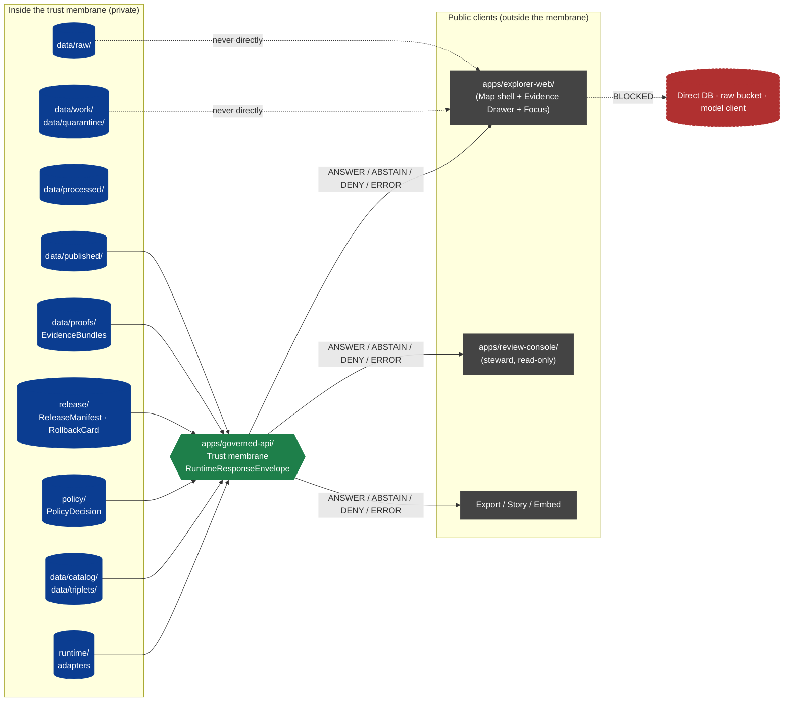
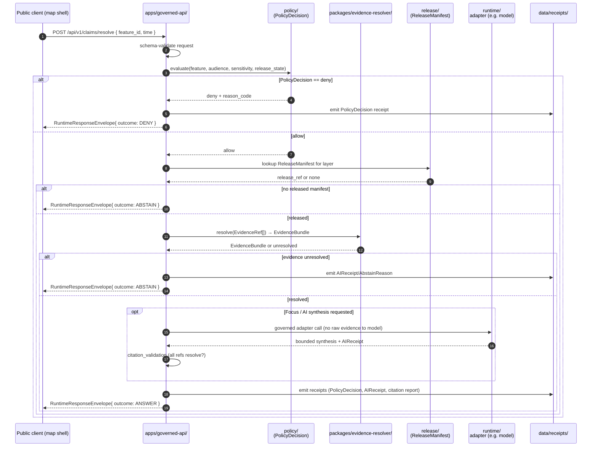
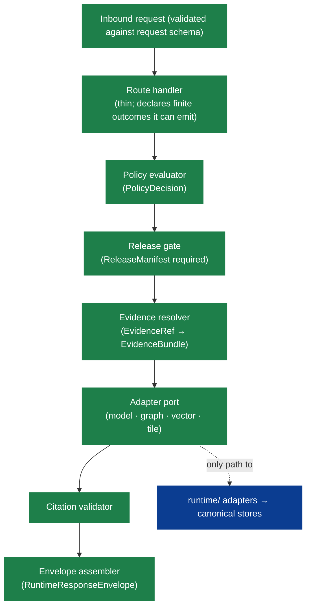

<!-- [KFM_META_BLOCK_V2]
doc_id: kfm://doc/architecture-governed-api
title: Governed API — Architecture
type: standard
version: v1
status: draft
owners: API steward + Security steward (TODO confirm)
created: 2026-05-14
updated: 2026-05-14
policy_label: public
related:
  - docs/doctrine/trust-membrane.md
  - docs/doctrine/authority-ladder.md
  - docs/architecture/README.md
  - docs/architecture/system-context.md
  - docs/architecture/map-shell.md
  - docs/architecture/contract-schema-policy-split.md
  - docs/architecture/governed-ai/README.md
  - contracts/OBJECT_MAP.md
  - schemas/contracts/v1/runtime/runtime_response_envelope.schema.json
  - apps/governed-api/README.md
tags: [kfm, architecture, governed-api, trust-membrane, finite-outcomes]
notes:
  - Implementation-shaped claims are PROPOSED until the live repo is inspected.
  - Schema, route, and package paths track Directory Rules defaults; ADR may amend.
[/KFM_META_BLOCK_V2] -->

# Governed API — Architecture

> The trust membrane in executable form. The single public trust path for KFM clients.


**Status:** draft · **Owners:** API steward + Security steward *(TODO confirm CODEOWNERS)* · **Last updated:** 2026-05-14

> [!IMPORTANT]
> KFM doctrine on the governed API (purpose, finite-outcome contract, trust-membrane rules) is **CONFIRMED** across the attached corpus. Specific repository artifacts (route files, framework choice, route prefixes, schema files, validators, workflows) are **PROPOSED / NEEDS VERIFICATION** until the live repo is inspected.

---

## Quick jump

- [1. Purpose](#1-purpose)
- [2. Position in the system](#2-position-in-the-system)
- [3. Doctrinal invariants](#3-doctrinal-invariants)
- [4. The finite-outcome contract](#4-the-finite-outcome-contract)
- [5. Endpoint catalogue (PROPOSED)](#5-endpoint-catalogue-proposed)
- [6. Request → response flow](#6-request--response-flow)
- [7. Trust-membrane rules (deny-by-default)](#7-trust-membrane-rules-deny-by-default)
- [8. Internal layering and adapter boundary](#8-internal-layering-and-adapter-boundary)
- [9. Contracts, schemas, policy, tests](#9-contracts-schemas-policy-tests)
- [10. Validators, observability, and proof](#10-validators-observability-and-proof)
- [11. Operational posture](#11-operational-posture)
- [12. Related docs and ADRs](#12-related-docs-and-adrs)
- [Appendix A — Outcome semantics reference](#appendix-a--outcome-semantics-reference)
- [Appendix B — Anti-patterns](#appendix-b--anti-patterns)
- [Appendix C — Open questions](#appendix-c--open-questions)

---

## 1. Purpose

The **Governed API** is the single public trust path for KFM. It is the executable form of the *trust membrane* described in `docs/doctrine/trust-membrane.md` and Directory Rules §7.1: the boundary that prevents raw, unreviewed, model-generated, or internal state from becoming public truth.

Every public KFM client — the map shell, Evidence Drawer, Focus Mode, Story player, review console, export surface — reaches KFM data **through this API and only through this API**. Clients never read `data/raw/`, `data/work/`, `data/quarantine/`, canonical stores, graph stores, object stores, vector indexes, model runtimes, or unpublished candidates. Those are inside the membrane; the API is the membrane.

**In one sentence:** the Governed API turns KFM's canonical, evidence-bound, policy-aware, release-state-aware truth objects into finite-outcome envelopes that public surfaces can render without leaking the unreleased layer beneath.

> [!NOTE]
> "Governed API" is doctrine, not framework. It is **what** the public boundary returns and **what** it refuses to return. The framework, language, and exact route file layout in `apps/governed-api/` are PROPOSED until verified against the mounted repo.

[⬆ Back to top](#governed-api--architecture)

---

## 2. Position in the system

The KFM trust spine has five cooperating planes. The Governed API plane is downstream of admission, lifecycle, evidence/catalog/proof — and upstream of every public client. It does not own canonical truth; it **gates access to released truth** and enforces finite outcomes.



| Plane | Role relative to the API |
|---|---|
| Governance / control plane | Defines what the API may expose: authority ladder, doctrine, registers. |
| Lifecycle / data plane | Produces released artifacts the API references; never exposed directly. |
| Evidence / catalog / proof plane | Supplies `EvidenceBundle`, `ReleaseManifest`, `RollbackCard` for resolution. |
| **Governed service / API plane** | **This document.** Enforces finite outcomes, policy, citation, release state. |
| User interaction plane | Public clients (`apps/explorer-web/`, `apps/review-console/`, etc.). Read-only consumers of API envelopes. |

[⬆ Back to top](#governed-api--architecture)

---

## 3. Doctrinal invariants

> [!IMPORTANT]
> These are non-negotiable. Bending an invariant requires an ADR (Directory Rules §2.4) and an entry in `docs/registers/DRIFT_REGISTER.md` if the live repo already conflicts.

1. **Cite-or-abstain.** No consequential claim leaves the API without a resolvable `EvidenceRef` chain to an `EvidenceBundle`, or the response is `ABSTAIN`.
2. **Lifecycle integrity.** Public responses derive only from `data/published/` (with `ReleaseManifest`) and the proof / receipt objects that support it. RAW, WORK, QUARANTINE, PROCESSED, and unpublished CATALOG/TRIPLET are never exposed.
3. **Finite outcomes only.** Every response is a `RuntimeResponseEnvelope` whose `outcome` is one of `ANSWER`, `ABSTAIN`, `DENY`, `ERROR`. No silent fallthrough, no partial truths, no implicit nulls.
4. **Policy at the boundary.** A `PolicyDecision` (`allow` / `deny` / `restrict` / `hold` / `abstain`) is evaluated before any answer is emitted. Sensitive lanes default to `DENY`.
5. **Deny-by-default exposure.** Unmarked surfaces are not public. The API exposes only what an explicit released artifact + policy decision + release state authorize.
6. **No direct model client.** Focus Mode and any other AI surface go *through* the API. Browsers never call a model provider directly; the API's adapter does, with policy gates and an `AIReceipt`.
7. **Promotion is governed.** Releasing a layer or claim is a state transition recorded in `ReleaseManifest`, not a file move. The API surface reflects release state; it cannot create it.
8. **Audit-grade traceability.** Every emitted envelope carries (or references) the `EvidenceRef`s, `PolicyDecision`, and `ReleaseManifest` that justified it, and a rollback target exists.
9. **Admin shortcuts are not public paths.** `apps/admin/` may exist for operations; it MUST NOT become the normal public path (Directory Rules §7.1).

[⬆ Back to top](#governed-api--architecture)

---

## 4. The finite-outcome contract

Every endpoint returns a `RuntimeResponseEnvelope`. Its `outcome` is one of four values; semantics are fixed.

| Outcome | When it is returned | Required artifacts | Public-surface effect |
|---|---|---|---|
| **`ANSWER`** | Evidence sufficient · policy permits · release state allows · review state (if required) recorded. | `EvidenceBundle` resolved; `PolicyDecision = allow`; `ReleaseManifest` applies. | Substantive payload with citations and drawer-renderable evidence. |
| **`ABSTAIN`** | Evidence insufficient, unresolvable, stale-without-released-alternative, or AI surface cannot cite. | `AIReceipt` (where AI is involved) with reason; no claim emitted. | Non-substantive note + reason. Never an invented answer. |
| **`DENY`** | Policy, rights, sensitivity, or release state forbids the answer. Sensitive lanes default here. | `PolicyDecision = deny` + `reason_code`; receipt records denial. | Denial with reason; may offer a non-restricted alternative surface. |
| **`ERROR`** | The API cannot evaluate — missing schema, malformed input, contract violation, infrastructure failure. | Error envelope with diagnostic code. **No claim leakage.** | Finite, actionable error. Never silent fallthrough into another lane. |

> [!NOTE]
> Validator-class outcomes `PASS` / `FAIL` (per `ValidationReport`) and the promotion-class outcome `HOLD` exist inside the membrane but are **not** values of the public `RuntimeResponseEnvelope.outcome`. They feed into whether an `ANSWER` is permitted, but the public API surface narrows to the four values above.

**Envelope sketch (PROPOSED — exact schema lives at `schemas/contracts/v1/runtime/runtime_response_envelope.schema.json`):**

```json
{
  "object_type": "RuntimeResponseEnvelope",
  "schema_version": "v1",
  "outcome": "ANSWER",
  "evidence_refs": ["kfm://evidence/<bundle_id>"],
  "policy_decision": {
    "decision": "allow",
    "reason_code": null,
    "policy_ref": "kfm://policy/<bundle>"
  },
  "release_ref": "kfm://release/<manifest_id>",
  "citation_validation": {
    "all_resolved": true,
    "report_ref": "kfm://proof/<citation_report_id>"
  },
  "payload": { "...": "endpoint-specific" },
  "trace": { "request_id": "...", "spec_hash": "b3:..." }
}
```

For `ABSTAIN`, `DENY`, `ERROR`: `payload` is omitted or replaced by a reason envelope; `evidence_refs` is empty or partial; the responsible receipt (`AIReceipt`, `PolicyDecision`, error diagnostic) is the substantive content.

[⬆ Back to top](#governed-api--architecture)

---

## 5. Endpoint catalogue (PROPOSED)

> [!WARNING]
> Endpoint paths, verbs, prefixes, and route file locations are **PROPOSED** consolidations of doctrine across the KFM corpus. Final route shape requires (a) confirming the framework and route convention in the mounted repo, and (b) — if `apps/governed_api/` or `packages/api/` is used instead of `apps/governed-api/` — an ADR per Directory Rules §2.4(5). See [§12](#12-related-docs-and-adrs).

| Surface | Method · Route | Purpose | Permitted outcomes | Status |
|---|---|---|---|---|
| Bootstrap | `GET /api/v1/runtime/bootstrap` | Initial shell config, access posture, feature flags, default time context, layer catalog summary. | `ANSWER` · `DENY` · `ERROR` | PROPOSED |
| Layer catalog | `GET /api/v1/layers` | Released layer descriptors only. | `ANSWER` · `ABSTAIN` · `ERROR` | PROPOSED |
| Layer descriptor | `GET /api/v1/layers/{layer_id}` | Layer descriptor and trust metadata. | `ANSWER` · `DENY` · `ERROR` | PROPOSED |
| Layer manifest | `GET /api/v1/layers/{layer_id}/manifest` | Release / proof / asset integrity metadata. | `ANSWER` · `ABSTAIN` · `DENY` · `ERROR` | PROPOSED |
| Evidence bundle | `GET /api/v1/evidence/{bundle_id}` | Resolve `EvidenceBundle` for drawer display. | `ANSWER` · `ABSTAIN` · `DENY` · `ERROR` | PROPOSED |
| Claim resolution | `POST /api/v1/claims/resolve` | Resolve a clicked feature to claim + drawer payload. | `ANSWER` · `ABSTAIN` · `DENY` · `ERROR` | PROPOSED |
| Focus query | `POST /api/v1/focus/query` | Bounded synthesis through governed model adapter. | `ANSWER` · `ABSTAIN` · `DENY` · `ERROR` | PROPOSED |
| Story manifest | `GET /api/v1/stories/{story_id}` | `StoryManifest` and node continuity. | `ANSWER` · `ABSTAIN` · `DENY` · `ERROR` | PROPOSED |
| Review queue | `GET /api/v1/review/queue` | Read-only steward queue. | `ANSWER` · `DENY` · `ERROR` | PROPOSED |
| Review decision | `POST /api/v1/review/{queue}/{id}/decision` | Steward decision record. | `ANSWER` · `DENY` · `ERROR` | PROPOSED |
| Correction submit | `POST /api/v1/corrections` | `CorrectionNoticeCandidate`. | `ANSWER` · `DENY` · `ERROR` | PROPOSED |
| Export request | `POST /api/v1/export` | Governed export with citations / redactions. | `ANSWER` · `DENY` · `ERROR` | PROPOSED |
| Telemetry | `POST /api/v1/telemetry` | Safe UI telemetry envelope. | `ANSWER` · `DENY` · `ERROR` | PROPOSED |

**Audience class.** Each route is classified as one of `public` · `partner` · `steward` · `internal` · `denied`. Audience class is part of the route's design-time contract, not an implicit deployment assumption. Restricted classes (`steward`, `internal`) require role-gated authorization and are audited; they MUST NOT be reachable by an unauthenticated public client.

[⬆ Back to top](#governed-api--architecture)

---

## 6. Request → response flow

A typical map-feature click — the canonical case — flows as follows. All other endpoints follow the same pattern with different resolution steps.



Three guarantees this flow enforces:

- **Policy precedes resolution.** A `DENY` never touches evidence or model runtime, preventing side-channel leakage through retrieval.
- **Resolution precedes synthesis.** Focus Mode and any AI adapter receive *resolved evidence references*, not raw stores. The adapter cannot "search the lake."
- **Citation validation precedes `ANSWER`.** If any cited `EvidenceRef` fails to resolve to an admissible `EvidenceBundle`, the outcome falls to `ABSTAIN`, not `ANSWER` with an invalid citation.

[⬆ Back to top](#governed-api--architecture)

---

## 7. Trust-membrane rules (deny-by-default)

The governed API is defined as much by what it refuses as by what it returns. The following rules are doctrinal across the KFM corpus and are enforced by policy gates, schema validation, and runtime checks.

| # | Rule | Reason | Enforcement surface |
|---|---|---|---|
| 1 | No public read of `RAW` / `WORK` / `QUARANTINE` / unpublished candidates / canonical stores. | Lifecycle integrity; promotion gates not yet passed. | API + policy gate; layer manifest resolver. |
| 2 | No direct model client from browser or map shell. | AI is interpretive and evidence-subordinate; runs through governed adapter only. | Runtime adapter port; browser CSP / network policy. |
| 3 | No unreleased tile / layer load. | Layer toggle is not publication; only `ReleaseManifest`-backed layers are public. | Layer descriptor / manifest endpoint. |
| 4 | No sensitive geometry hidden only by style. | Geoprivacy requires transformation and `RedactionReceipt`, not a CSS hack. | Sensitivity policy + redaction receipt validator. |
| 5 | No popup as Evidence Drawer substitute. | Popups summarize; consequential claims need the drawer payload and citation validation. | Drawer payload schema; UI policy. |
| 6 | No `ANSWER` from rendered features alone. | Rendered features are candidates; evidence carries truth support. | Claims resolver + citation validator. |
| 7 | No uncited export, screenshot, or Story snapshot. | Exports must preserve citation and release context. | Export endpoint + `StorySnapshot` / `ExportReceipt`. |
| 8 | No raw evidence, prompts, secrets, or restricted coordinates in telemetry. | Telemetry must not become a side channel. | Telemetry schema + policy; redaction at boundary. |
| 9 | Admin shortcuts MUST NOT be the normal public path. | Public traffic uses the governed surface; admin is justified, constrained, audited. | Network policy + deny-by-default infra. |

> [!CAUTION]
> A "small exception" to any of these rules is the most common way a trust membrane silently rots. The correct response to a hard case is a `DENY` outcome plus an ADR — not a one-off bypass.

[⬆ Back to top](#governed-api--architecture)

---

## 8. Internal layering and adapter boundary

The API is **internally** organized as thin, governance-aware layers. None of these layers is a public surface; only the outermost envelope is.



**Adapters live behind the API, not in front of it.** Directory Rules names `runtime/` as the home for "adapters and harnesses behind the governed API. Never a public surface." This is the *anti-corruption layer* between KFM's released truth objects and any external provider (model, tile, vector store). External providers see only what the adapter passes; the API sees only what the adapter returns, shaped to KFM contracts.

> [!TIP]
> When in doubt about whether something belongs in `apps/governed-api/` or `runtime/`: if it speaks HTTP outward, it's the API. If it speaks a provider protocol inward, it's a runtime adapter. The API never embeds provider SDKs at the route level.

[⬆ Back to top](#governed-api--architecture)

---

## 9. Contracts, schemas, policy, tests

The governed API is the *executable* expression of object meaning defined in `contracts/`, shape defined in `schemas/`, and admissibility decided in `policy/`. The split is doctrinal: meaning, shape, and decision do not collapse into one another.

> [!NOTE]
> Schema home defaults to `schemas/contracts/v1/...` per ADR-0001 (Directory Rules §0). Below paths are **PROPOSED** consolidations; final paths verify against the mounted repo and may require an ADR if they diverge.

| Object family | Contract meaning lives in… | Schema (shape) lives in… | Policy lives in… | Fixtures live in… |
|---|---|---|---|---|
| `RuntimeResponseEnvelope` | `contracts/OBJECT_MAP.md` | `schemas/contracts/v1/runtime/runtime_response_envelope.schema.json` | `policy/runtime/` | `tests/fixtures/runtime/` |
| `DecisionEnvelope` | `contracts/OBJECT_MAP.md` | `schemas/contracts/v1/runtime/decision_envelope.schema.json` | `policy/runtime/` | `tests/fixtures/runtime/` |
| `LayerDescriptor` / `LayerManifest` | `contracts/OBJECT_MAP.md` | `schemas/contracts/v1/layers/*.schema.json` | `policy/ui/` · `policy/release/` | `tests/fixtures/layers/` |
| `EvidenceBundle` / `EvidenceRef` | `contracts/OBJECT_MAP.md` | `schemas/contracts/v1/evidence/evidence_bundle.schema.json` | `policy/evidence/` | `tests/fixtures/evidence/` |
| Focus request / response | `contracts/OBJECT_MAP.md` | `schemas/contracts/v1/focus/{focus_request,focus_response}.schema.json` | `policy/focus/` | `tests/fixtures/focus/` |
| `CitationValidationReport` | `contracts/OBJECT_MAP.md` | `schemas/contracts/v1/focus/citation_validation_report.schema.json` | `policy/focus/` | `tests/fixtures/focus/` |
| `ReviewRecord` / `CorrectionNotice` | `contracts/OBJECT_MAP.md` | `schemas/contracts/v1/review/*.schema.json` | `policy/review/` | `tests/fixtures/review/` |
| `SourceDescriptor` | `contracts/OBJECT_MAP.md` | `schemas/contracts/v1/source/source_descriptor.schema.json` | `policy/sources/` | `tests/fixtures/sources/` |
| `TelemetryEvent` | `contracts/OBJECT_MAP.md` | `schemas/contracts/v1/telemetry/ui_event.schema.json` | `policy/telemetry/` | `tests/fixtures/telemetry/` |

**Test homes** (Directory Rules §6.6, PROPOSED layout):

```text
tests/
├── api/             # endpoint-level integration tests
├── contracts/       # contract/object-meaning tests
├── schemas/         # schema validation tests
├── policy/          # PolicyDecision tests (positive + negative)
├── validators/      # validator-level unit tests
├── runtime_proof/   # finite-outcome and abstain proofs
└── e2e/             # cross-surface smoke (with governed API)
```

[⬆ Back to top](#governed-api--architecture)

---

## 10. Validators, observability, and proof

The governed API is **proof-bearing** by design. Every consequential response leaves a trail.

| Emitted artifact | What it proves | Lives in (PROPOSED) |
|---|---|---|
| `PolicyDecision` receipt | The allow / deny / restrict / hold decision was evaluated against current policy. | `data/receipts/` |
| `AIReceipt` | When AI synthesis ran: adapter, inputs (refs only), outcome, citation validation. | `data/receipts/ai/` |
| `CitationValidationReport` | Every cited `EvidenceRef` resolved to an admissible `EvidenceBundle` (or the response abstained). | `data/proofs/` |
| `ValidationReport` | Schema and contract checks for inbound request and outbound payload passed. | `data/receipts/` |
| `TelemetryEvent` | Safe UI event recorded without leaking raw evidence, prompts, secrets, or restricted coordinates. | `data/receipts/telemetry/` |
| `RuntimeResponseEnvelope` (the response itself) | The finite outcome, with `evidence_refs`, `policy_decision`, `release_ref`, `trace`. | Emitted to client; trace mirrored to receipts. |

**Negative-state proof.** Per Directory Rules §6.6 the test tree includes a `runtime_proof/` subtree dedicated to finite-outcome and abstain proof. The API is not considered correct until it can produce `ABSTAIN`, `DENY`, and `ERROR` outcomes on fixtures designed to require them. An API that can only produce `ANSWER` is mis-classified as healthy.

> [!IMPORTANT]
> A green CI on `ANSWER` fixtures alone is not evidence of governance. The trust membrane is verified by the rejection paths: deny-on-sensitive-geometry, abstain-on-unresolvable-evidence, error-on-contract-violation. These cases are required tests, not nice-to-have.

[⬆ Back to top](#governed-api--architecture)

---

## 11. Operational posture

### 11.1 Deployment placement

| Question | PROPOSED answer | Status |
|---|---|---|
| Where does the API live in the repo? | `apps/governed-api/` (Directory Rules §7.1 canonical). | CONFIRMED doctrine · PROPOSED implementation |
| What if the live repo uses `apps/governed_api/` or `packages/api/`? | Adapt the path and record an ADR (Directory Rules §2.4(5)); preserve the boundary either way. | NEEDS VERIFICATION |
| Where do adapters live? | `runtime/` (canonical per Directory Rules). | CONFIRMED doctrine · PROPOSED implementation |
| Where does the public web client live? | `apps/explorer-web/` (canonical; `ui/` and `web/` are compatibility roots). | CONFIRMED doctrine · PROPOSED implementation |

### 11.2 Rollback and continuity

- **Feature flags** gate every new route until contracts, fixtures, policy, and validators are in place. Default off.
- **Schema deprecation** uses additive evolution; breaking changes require ADR + migration manifest (Directory Rules §14).
- **Rollback target** for any released layer or claim is recorded in the originating `ReleaseManifest` and concretized in `release/rollback_cards/`. The API surfaces the *current* release state; rollback is a release-plane action, not an API-plane edit.
- **Revert PR** is the unit of recovery: a failing API change is rolled back by reverting the PR plus disabling the feature flag.

### 11.3 Security and policy boundary (summary)

- Deny by default: public UI uses governed APIs and released payloads only.
- No browser access to canonical stores, model runtimes, vector indexes, graph stores, credentials, or internal service handles.
- No raw prompt or evidence content in telemetry; redactions enforced at the boundary.
- Sensitive lanes (archaeology, fauna, flora, people / DNA, infrastructure) default to `DENY` unless an explicit policy + redaction receipt allows otherwise.
- Admin endpoints, if present, are separately documented, constrained, and audited; they are never advertised on the public surface.

[⬆ Back to top](#governed-api--architecture)

---

## 12. Related docs and ADRs

| Relation | Document |
|---|---|
| Doctrine | `docs/doctrine/trust-membrane.md` *(TODO confirm path)* |
| Doctrine | `docs/doctrine/authority-ladder.md` *(TODO confirm path)* |
| Doctrine (placement law) | `docs/doctrine/directory-rules.md` (mounted as `directory-rules.md`) |
| Architecture index | `docs/architecture/README.md` *(PROPOSED)* |
| Sibling | `docs/architecture/system-context.md` *(PROPOSED)* |
| Sibling | `docs/architecture/map-shell.md` *(PROPOSED)* |
| Sibling | `docs/architecture/contract-schema-policy-split.md` *(PROPOSED)* |
| Subsystem | `docs/architecture/governed-ai/README.md` *(PROPOSED)* |
| Subsystem | `docs/architecture/governed-ai/ROUTE_MAP.md` *(PROPOSED)* |
| Subsystem | `docs/architecture/review/README.md` *(PROPOSED)* |
| Subsystem | `docs/architecture/story/README.md` *(PROPOSED)* |
| Object map | `contracts/OBJECT_MAP.md` *(PROPOSED)* |
| Public app boundary | `apps/governed-api/README.md` *(PROPOSED)* |
| Runbook | `docs/runbooks/governed_ai_VALIDATION.md` *(PROPOSED)* |
| Runbook | `docs/runbooks/governed_ai_ROLLBACK.md` *(PROPOSED)* |
| Register | `docs/registers/VERIFICATION_BACKLOG.md` *(PROPOSED)* |
| Register | `docs/registers/DRIFT_REGISTER.md` *(PROPOSED)* |

**ADRs that may apply** *(TODO link once recorded)*:

- ADR-0001 — Schema home (`schemas/contracts/v1/...`).
- ADR-`apps/governed-api` vs `apps/governed_api` vs `packages/api` boundary (PROPOSED, pending repo verification — Directory Rules §15 open-questions item).
- ADR-`policy/<subsystem>` layout for runtime / focus / evidence / review (PROPOSED).
- ADR-Focus model adapter boundary (PROPOSED).
- ADR-Story Node 3D admission boundary (PROPOSED).

[⬆ Back to top](#governed-api--architecture)

---

## Appendix A — Outcome semantics reference

<details>
<summary><strong>Expand: extended outcome × surface table</strong></summary>

| Surface | Returned outcomes | Forbidden behavior |
|---|---|---|
| Source summary resolver | `ANSWER` · `ABSTAIN` · `DENY` · `ERROR` | Returning raw source bytes; returning quarantined source as `ANSWER`. |
| Domain feature / detail lookup | `ANSWER` · `ABSTAIN` · `DENY` · `ERROR` | Returning an unreleased candidate as `ANSWER`; exposing internal store identifiers. |
| Layer descriptor resolver | `ANSWER` · `DENY` · `ERROR` | Returning a layer that lacks a `ReleaseManifest`. |
| Layer manifest resolver | `ANSWER` · `ABSTAIN` · `DENY` · `ERROR` | Serving WORK or CATALOG layers to public clients. |
| Evidence bundle resolver | `ANSWER` · `ABSTAIN` · `DENY` · `ERROR` | Returning a bundle whose `EvidenceRef`s do not all resolve. |
| Focus Mode (`/focus/query`) | `ANSWER` · `ABSTAIN` · `DENY` · `ERROR` | Returning an answer without `AIReceipt`; citing unresolved references. |
| Story manifest | `ANSWER` · `ABSTAIN` · `DENY` · `ERROR` | Returning a story whose nodes reference unreleased layers without redaction. |
| Review (steward, read-only) | `ANSWER` · `DENY` · `ERROR` | Exposing the queue to unauthenticated public clients. |
| Correction submit | `ANSWER` (i.e. `ACCEPTED`) · `DENY` · `ERROR` | Silently accepting a correction without `CorrectionNoticeCandidate` shape. |
| Export | `ANSWER` · `DENY` · `ERROR` | Producing an export without citations, redactions, and release refs. |
| Telemetry | `ANSWER` · `DENY` · `ERROR` | Accepting events containing raw evidence, prompts, secrets, or restricted coordinates. |

</details>

[⬆ Back to top](#governed-api--architecture)

---

## Appendix B — Anti-patterns

<details>
<summary><strong>Expand: trust-membrane anti-patterns and counter-rules</strong></summary>

| Anti-pattern | What goes wrong | Where it is denied |
|---|---|---|
| Public client reads RAW / WORK / QUARANTINE directly. | Membrane bypassed; promotion gates skipped. | API + layer manifest resolver. |
| Map shell consumes canonical / internal store directly. | Renderer becomes the public surface and inherits no governance. | MapLibre shell wiring; layer registry. |
| AI returns uncited language. | Generated text substitutes for evidence; cite-or-abstain broken. | Focus Mode; AI surface steward; citation validator. |
| AI answers from RAW rather than `EvidenceBundle`. | AI becomes its own truth source. | Governed AI runtime; `AIReceipt` evaluator. |
| Sensitive content released without redaction. | `RedactionReceipt` missing; rights / sovereignty violation. | Release queue; sensitivity reviewer. |
| Aggregate cited as per-place observation. | Source-role collapse; matrix-cell semantics violated. | Validator; Focus Mode citation evaluator. |
| Synthetic surface without `RealityBoundaryNote`. | Reconstruction read as observation. | Scene admission gate; representation receipt validator. |
| KFM used as alert / instruction authority. | Out-of-scope use of governed evidence as life-safety guidance. | Hazards / Air / Hydrology surfaces. |
| Release without `ReleaseManifest` or rollback target. | Public surface cannot be rolled back. | Release queue; release authority. |
| AI generation routed through admin shortcut. | Admin bypass becomes a normal-path public route. | Trust-membrane audit; infra. |
| Documenting a change instead of validating it. | Docs do not substitute for validators, fixtures, or schemas. | Directory Rules §17; PR review. |

</details>

[⬆ Back to top](#governed-api--architecture)

---

## Appendix C — Open questions

<details>
<summary><strong>Expand: items tracked in <code>docs/registers/VERIFICATION_BACKLOG.md</code> (PROPOSED)</strong></summary>

- **NEEDS VERIFICATION** — Whether the live repo uses `apps/governed-api/`, `apps/governed_api/`, or `packages/api/` (Directory Rules §18 open-question item).
- **NEEDS VERIFICATION** — Whether `policy/` or `policies/` is canonical in the live repo (Directory Rules default: `policy/`).
- **NEEDS VERIFICATION** — Whether `schemas/contracts/v1/` is the live schema home or whether `contracts/` carries machine schemas (Directory Rules default: `schemas/contracts/v1/` per ADR-0001).
- **NEEDS VERIFICATION** — Backend framework choice (TypeScript / Python / other) and route file convention.
- **NEEDS VERIFICATION** — Whether `GraphQL` co-exists with REST; if so, treat as adapter, not as a replacement of the governed REST envelope.
- **OPEN** — Whether `release/manifests/` or per-layer manifests under `data/published/` is the authoritative resolution target for layer-manifest endpoints (Directory Rules §18).
- **OPEN** — Audience class enum: stabilize `public` · `partner` · `steward` · `internal` · `denied` as the canonical vocabulary, or revise.
- **OPEN** — Whether `apps/admin/`, if it exists, exposes any read-only endpoints that the public surface might link to (default: no).

</details>

[⬆ Back to top](#governed-api--architecture)

---

### Last reviewed

2026-05-14 · *Doctrine grounded in attached KFM corpus; repository implementation PROPOSED pending live-repo verification.*

[⬆ Back to top](#governed-api--architecture)
