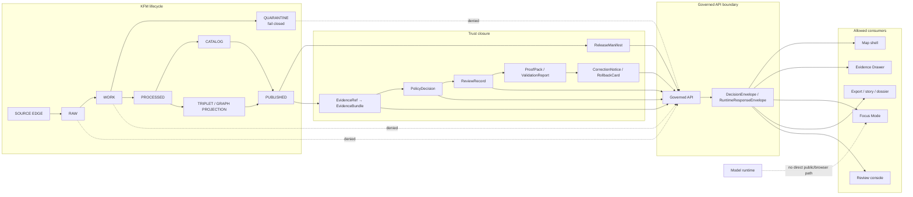

<!-- [KFM_META_BLOCK_V2]
doc_id: kfm://doc/NEEDS_VERIFICATION__docs_architecture_governed_api
title: Governed API
type: standard
version: v1
status: draft
owners: NEEDS_VERIFICATION__governed_api_owner
created: NEEDS_VERIFICATION__YYYY-MM-DD
updated: 2026-05-06
policy_label: NEEDS_VERIFICATION__public_or_restricted
related: [../../README.md, README.md, ../adr/ADR-0202-governed-api-path-canonicalization.md, ../adr/ADR-0014-truth-path.md, ../adr/ADR-0207-governed-ai-runtime-envelope.md, ../../contracts/api/README.md, ../../contracts/runtime/governed_api_mock_payloads.md, ../../fixtures/api/governed_api_mock_payloads.json, ../../apps/api/README.md, ../../apps/api/server.py, ../../apps/web/src/api/governedClient.js, ../../tools/ci/check_governed_api_path_policy.py, ../../tests/ci/test_check_governed_api_path_policy.py]
tags: [kfm, architecture, governed-api, evidence, policy, runtime-envelope, trust-membrane]
notes: [Revises docs/architecture/governed-api.md as a standard architecture doc; preserves Directory Rules placement under docs/architecture; owners created date policy label and stable doc_id require governance verification; current repo evidence confirms related files but leaves route alignment CI enforcement deployment and full runtime maturity as NEEDS VERIFICATION]
[/KFM_META_BLOCK_V2] -->

<a id="top"></a>

# Governed API

KFM’s governed API is the trust membrane where public, steward-facing, map, Focus Mode, review, export, and diagnostic clients receive evidence-resolving, policy-checked, release-aware envelopes instead of raw data, direct model output, or unpublished project state.

<p align="center">
  
  
  
  
  
</p>

<p align="center">
  <a href="#architecture-rule">Architecture rule</a> ·
  <a href="#repo-fit">Repo fit</a> ·
  <a href="#current-evidence-snapshot">Evidence snapshot</a> ·
  <a href="#integration-drift-to-resolve">Integration drift</a> ·
  <a href="#inputs-and-exclusions">Inputs & exclusions</a> ·
  <a href="#trust-flow">Trust flow</a> ·
  <a href="#contract-surface">Contract surface</a> ·
  <a href="#runtime-outcomes">Runtime outcomes</a> ·
  <a href="#route-families">Route families</a> ·
  <a href="#validation-gates">Validation gates</a> ·
  <a href="#open-verification">Open verification</a>
</p>

> [!IMPORTANT]
> **Status:** `draft` architecture document  
> **Owners:** `NEEDS_VERIFICATION__governed_api_owner`  
> **Path:** `docs/architecture/governed-api.md`  
> **Owning root:** `docs/` — the human-facing architecture control plane  
> **Current posture:** `CONFIRMED` doctrine and selected repo file evidence; `NEEDS VERIFICATION` for route alignment, CI enforcement, active runtime home, schema coverage, deployment posture, owners, policy label, and production maturity.

---

## Architecture rule

The governed API is not a generic backend. It is the policy-conscious boundary that protects KFM’s core lifecycle:

```text
RAW -> WORK / QUARANTINE -> PROCESSED -> CATALOG / TRIPLET -> PUBLISHED
```

Normal public clients, ordinary UI surfaces, map interactions, exports, Evidence Drawer, and Focus Mode must use governed APIs, released artifacts, catalog records, tile services, and `EvidenceBundle` resolution.

They must not directly read or expose:

- `RAW`, `WORK`, or `QUARANTINE` lifecycle stores;
- unpublished candidate data;
- canonical or restricted internal stores;
- source-system side effects;
- graph projections as canonical truth;
- vector/search indexes as truth;
- direct model runtime output;
- local filesystem paths, secrets, or internal service handles.

The governing rule is:

> A KFM response may make a consequential public or semi-public claim only when it is downstream of evidence, source role, policy, review, release state, correction lineage, and rollback support appropriate to the consequence of the claim.

[Back to top](#top)

---

## Repo fit

**Path:** `docs/architecture/governed-api.md`  
**Role:** cross-cutting architecture note for the governed API trust membrane  
**Audience:** maintainers, API implementers, UI engineers, policy reviewers, domain-lane authors, release reviewers, and governed-AI contributors

This file explains the boundary. It does not own route code, OpenAPI documents, machine schemas, policy-as-code, fixtures, source data, emitted receipts, proof packs, release manifests, or UI components.

| Direction | Path | Relationship | Status |
|---|---|---|---|
| Parent architecture index | [`README.md`](README.md) | Local architecture landing page and navigation surface. | CONFIRMED file exists. |
| Project landing page | [`../../README.md`](../../README.md) | Repo-wide purpose, trust law, responsibility roots, and object-family posture. | CONFIRMED file exists. |
| API contract lane | [`../../contracts/api/README.md`](../../contracts/api/README.md) | Human-readable governed API contract semantics. | CONFIRMED file exists. |
| Mock payload contract | [`../../contracts/runtime/governed_api_mock_payloads.md`](../../contracts/runtime/governed_api_mock_payloads.md) | Documents fixture-backed mock governed API payload examples. | CONFIRMED file exists. |
| Mock payload fixture | [`../../fixtures/api/governed_api_mock_payloads.json`](../../fixtures/api/governed_api_mock_payloads.json) | Synthetic no-network examples for health, Focus Mode, and Evidence Drawer payloads. | CONFIRMED file exists. |
| Runtime API surface | [`../../apps/api/server.py`](../../apps/api/server.py) | Current visible FastAPI-style ecology/public-safe dry-run API file. | CONFIRMED file exists; runtime execution not verified here. |
| Web API client | [`../../apps/web/src/api/governedClient.js`](../../apps/web/src/api/governedClient.js) | Browser-side governed API client wrapper. | CONFIRMED file exists; route alignment needs verification. |
| Path policy ADR | [`../adr/ADR-0202-governed-api-path-canonicalization.md`](../adr/ADR-0202-governed-api-path-canonicalization.md) | Establishes `apps/governed_api/...` as canonical and `apps/governed-api/...` as legacy shim-only. | CONFIRMED file exists; enforcement state needs verification. |
| Path-policy checker | [`../../tools/ci/check_governed_api_path_policy.py`](../../tools/ci/check_governed_api_path_policy.py) | Defines canonical governed API path and legacy shim checks. | CONFIRMED file exists. |
| Checker regression tests | [`../../tests/ci/test_check_governed_api_path_policy.py`](../../tests/ci/test_check_governed_api_path_policy.py) | Tests checker pass/fail behavior using synthetic trees. | CONFIRMED file exists. |

> [!NOTE]
> Directory Rules place `governed-api.md` under `docs/architecture/` because it explains a cross-cutting system boundary. It should not be moved into a domain root, schema root, policy root, app root, or emitted-artifact root.

[Back to top](#top)

---

## Current evidence snapshot

The current repo evidence is strong enough to support a real architecture document, but not strong enough to claim production readiness.

| Evidence | What it confirms | What remains unverified |
|---|---|---|
| `docs/architecture/governed-api.md` | The target file exists and already carries KFM Meta Block V2 style, badges, trust-flow framing, and governed API doctrine. | Whether maintainers have accepted this revised version as active canon. |
| `docs/architecture/README.md` | The architecture directory uses KFM Meta Block V2, status/owner blocks, quick jumps, scope, repo fit, accepted inputs, exclusions, Mermaid diagrams, and truth-labeled open verification. | Full architecture directory inventory and link/anchor status. |
| `README.md` | The root README states KFM’s governed, evidence-first, map-first, time-aware purpose and lifecycle law. | Active root authority, owners, Make targets, and validation status. |
| `contracts/api/README.md` | The contract lane documents governed API semantics, finite outcomes, Evidence Drawer payloads, Focus Mode, and contract/schema/policy separation. | Whether all proposed contract surfaces have schemas, fixtures, validators, and tests. |
| `contracts/runtime/governed_api_mock_payloads.md` | The mock-payload contract explicitly says it models payloads only and provides no route implementation guarantee. | Runtime route implementation and schema enforcement. |
| `fixtures/api/governed_api_mock_payloads.json` | Mock examples exist for `healthz_response`, `focus_mode_request`, `focus_mode_response`, and `evidence_drawer_response`. | Whether these payloads are validated by active schema and runtime tests. |
| `apps/api/server.py` | A current API file defines health, layer manifest, ecology time-slice, ecology evidence, and STAC catalog route functions with public-safety checks. | Deployment, active route registration, package/runtime status, all-domain coverage, and CI pass state. |
| `apps/web/src/api/governedClient.js` | The web app has a governed client wrapper for layer manifest, evidence drawer, and Focus calls. | Route compatibility with `apps/api/server.py` and UI negative-state coverage. |
| `docs/adr/ADR-0202-governed-api-path-canonicalization.md` | The repo records a canonical path decision: `apps/governed_api/...` is canonical; `apps/governed-api/...` is legacy shim-only. | Whether all mapped canonical files exist and whether the checker passes in CI. |
| `tools/ci/check_governed_api_path_policy.py` | A checker defines canonical file paths and legacy shim mappings. | Whether mapped files exist on the active branch and whether `.github/workflows/` runs the checker. |
| `tests/ci/test_check_governed_api_path_policy.py` | Synthetic tests cover checker success, invalid shim failure, missing canonical failure, and canonical-shim inversion failure. | Whether those tests pass in the active checkout and CI. |

### Current implementation posture

- **CONFIRMED:** related docs, contracts, fixtures, client file, API file, ADR, checker, and checker tests exist.
- **NEEDS VERIFICATION:** active runtime path, route alignment, canonical mapped file presence, CI wiring, schema enforcement, deployed behavior, proof-pack linkage, branch protections, and production exposure.
- **PROPOSED:** this document’s architecture model as the stable guide tying those surfaces into one inspectable trust boundary.

[Back to top](#top)

---

## Integration drift to resolve

The governed API surface currently shows useful implementation pressure and several verification gaps. These should be fixed or explicitly documented before stronger maturity claims are made.

| Finding | Status | Why it matters | Resolution path |
|---|---|---|---|
| `apps/api/server.py` is the inspected API file, but its docstring run hint names `apps.governed_api.server:app`. | NEEDS VERIFICATION | Runtime path naming may be transitional or stale. | Confirm active app import path, update run instructions, and link ADR-0202 if this is part of the governed API migration. |
| Server route for layer manifest is `GET /api/layers/manifest`; web client calls `/api/ecology/layer-manifest` when `baseUrl="/api"`. | NEEDS VERIFICATION | Map shell may call a route not provided by the current server file. | Align server route, client path, or add a compatibility route with tests. |
| Server provides `GET /api/ecology/evidence/{bundle_id}`; web client calls `/api/ecology/evidence/{claimId}`. | CONFIRMED shape / NEEDS VERIFICATION semantics | Path shape aligns, but identifier semantics differ: `bundle_id` versus `claimId`. | Decide whether this is claim-to-bundle resolution or direct bundle lookup; update contract, client name, and tests. |
| Web client posts `/api/ecology/focus`; inspected server file does not define a Focus route. | NEEDS VERIFICATION | Focus Mode must not imply implemented runtime behavior without route evidence. | Add route through governed runtime envelope or mark Focus client method experimental until implemented. |
| Checker maps canonical files under `apps/governed_api/ecology/...`; at least one mapped canonical file was not verified by direct file fetch during this revision. | NEEDS VERIFICATION | The checker may fail on the active branch or refer to future files. | Run checker in a real checkout; create canonical files, adjust mapping, or amend ADR/checker. |
| `tools/ci/python_syntax_targets.txt` lists both hyphenated and underscored governed API paths. | CONFIRMED / NEEDS VERIFICATION | Syntax target list may include future or missing files. | Reconcile with checker results and active package structure. |

> [!WARNING]
> Do not treat `apps/api/...`, `apps/governed_api/...`, and `apps/governed-api/...` as interchangeable. Verify their roles before moving code, writing docs, or claiming runtime behavior.

[Back to top](#top)

---

## Inputs and exclusions

### Accepted inputs

The governed API may accept only bounded, reviewable request context.

| Input | Required guardrail |
|---|---|
| Stable IDs such as `claim_id`, `bundle_id`, `layer_id`, `release_id`, `source_id`, or domain subject IDs | Must resolve to released or explicitly review-authorized scope. |
| `EvidenceRef` or `EvidenceBundle` references | Must resolve server-side or return `ABSTAIN`, `DENY`, or `ERROR`. |
| Map selection and timeline state | Treated as scope context, not proof. |
| Focus Mode question | Scoped to admissible evidence, policy state, release context, and citation validation. |
| Evidence Drawer lookup request | Must resolve support state, source roles, rights, sensitivity, review, release, and correction context. |
| Review action request | Authenticated, authorized, auditable, role-aware, and reversible. |
| Export, story, or dossier request | Must inherit release state, citation posture, correction state, and policy obligations. |
| Health or diagnostic request | Must not leak internal stores, local paths, secrets, restricted source state, or model handles. |

### Exclusions

The following do not belong on normal governed API public paths.

| Excluded | Reason |
|---|---|
| RAW / WORK / QUARANTINE payloads | Pre-publication lifecycle states. |
| Unpublished candidates | Candidate material lacks release authority. |
| Canonical/internal stores as direct public payloads | Public interfaces must cross evidence, policy, review, release, and correction checks. |
| Direct model runtime calls | AI is interpretive and must sit behind governed API mediation. |
| Direct vector-store or graph-store answers | Retrieval and projection layers are derivatives, not truth. |
| Source connector side effects | Source activation belongs behind intake, rights, validation, policy, and source-role review. |
| Exact sensitive location material | Sensitive locations fail closed unless reviewed public-safe transform allows exposure. |
| Living-person, DNA/genomic, archaeology, rare-species, cultural, infrastructure, private-landowner-sensitive, or unclear-rights details | High-risk material requires domain-specific review and staged access rules. |
| Chain-of-thought or private reasoning | Receipts may record inputs, outputs, hashes, decisions, and refs, not private reasoning traces. |

[Back to top](#top)

---

## Trust flow



The governed API should make trust state visible. `ABSTAIN`, `DENY`, and `ERROR` are part of the product contract, not embarrassing edge cases.

[Back to top](#top)

---

## Contract surface

The governed API sits at the intersection of several KFM object families.

| Object family | API obligation |
|---|---|
| `SourceDescriptor` | Preserve source role, authority limits, rights, cadence, sensitivity, caveats, and activation state where relevant. |
| `EvidenceRef` | Accept as a reference only; do not treat it as resolved support until resolver succeeds. |
| `EvidenceBundle` | Use as the inspectable support package for claims, layers, Focus answers, and Evidence Drawer payloads. |
| `PolicyDecision` | Carry allow, deny, restrict, abstain, review-needed, or error state with reason codes and obligations. |
| `DecisionEnvelope` | Emit finite non-AI or general decision outcomes where policy, release, and evidence state matter. |
| `RuntimeResponseEnvelope` | Emit finite AI-assisted or runtime outcomes for Focus Mode and other model-mediated surfaces. |
| `LayerManifest` | Bind visible layers to release, evidence, source, sensitivity transform, time semantics, style state, stale state, and correction state. |
| `ReleaseManifest` | Prevent public payloads from outrunning promotion, proof, correction, and rollback state. |
| `RunReceipt` / `AIReceipt` | Preserve process memory and audit joins without treating receipts as truth. |
| `CorrectionNotice` / `RollbackCard` | Keep supersession, withdrawal, public correction, and rollback paths inspectable. |

### Envelope sketch

The exact machine schema belongs in the accepted schema home. Until schema-home authority and fixture coverage are fully verified, the field set below is architecture-level guidance.

```json
{
  "outcome": "ANSWER | ABSTAIN | DENY | ERROR",
  "reason_code": "EVIDENCE_BUNDLE_NOT_RESOLVED",
  "message": "Safe human-readable summary",
  "scope": {
    "request_kind": "map | evidence_drawer | focus | review | export | diagnostic",
    "spatial_scope": "NEEDS_VERIFICATION",
    "temporal_scope": "NEEDS_VERIFICATION"
  },
  "evidence_refs": [],
  "evidence_bundle_refs": [],
  "policy_decision_ref": "kfm://policy-decision/NEEDS_VERIFICATION",
  "release_ref": "kfm://release/NEEDS_VERIFICATION",
  "review_state": "approved | pending | denied | not_required | unknown",
  "freshness_state": "current | stale | unknown | not_applicable",
  "correction_state": "current | corrected | superseded | withdrawn | unknown",
  "receipt_refs": [],
  "limitations": [],
  "obligations": []
}
```

[Back to top](#top)

---

## Runtime outcomes

| Outcome | Meaning | Required behavior |
|---|---|---|
| `ANSWER` | The request is supported by released or review-authorized evidence, policy allows it, citations/support validate, and scope is sufficiently bounded. | Return the bounded payload plus evidence, policy, release, freshness, review, correction, and audit references where material. |
| `ABSTAIN` | KFM cannot support a safe answer because evidence is missing, unresolved, stale, conflicted, insufficient, outside scope, or source-role-inadequate. | Return no unsupported answer. Include safe reason codes and narrowing guidance where appropriate. |
| `DENY` | KFM may not provide the requested content because policy, rights, sensitivity, access role, release state, or public safety blocks it. | Return no restricted content. Include only policy-safe reason and obligation metadata. |
| `ERROR` | A system, schema, adapter, resolver, validator, policy, release, or runtime failure prevents reliable handling. | Fail closed; do not substitute model prose, raw properties, or partial truth. |

### Fixture evidence currently present

The mock payload fixture currently models:

- `healthz_response` with `status`, `service`, and `mode`;
- `focus_mode_request` with `question`, `scope`, and `trace_id`;
- `focus_mode_response` returning `ABSTAIN` for `MISSING_EVIDENCE`;
- `evidence_drawer_response` with `ui_trust_state`, `release_status`, `evidence_ref`, and `evidence_bundle_id`.

These examples are useful as a no-network baseline. They are not complete runtime coverage until schema and route enforcement are verified.

[Back to top](#top)

---

## Route families

KFM should document and test route families by responsibility, not by whichever path happens to exist first.

| Route family | Typical clients | Must prove | Current repo evidence |
|---|---|---|---|
| Health / status | Operators, local checks | No secret, path, source, raw data, or restricted state leakage. | `apps/api/server.py` defines `/healthz` and `/api/healthz`; runtime execution not verified. |
| Layer manifest | Map shell | Released/public-safe layer state, evidence support, rights/sensitivity posture, correction refs, release refs. | Server defines `/api/layers/manifest`; web client currently calls `/api/ecology/layer-manifest` with default base URL. Alignment needs verification. |
| Evidence Drawer payload | Evidence Drawer, map popups, Focus | `EvidenceBundle` resolution, support state, release state, policy posture, source list or safe abstention. | Server defines `/api/ecology/evidence/{bundle_id}`; web client calls `/api/ecology/evidence/{claimId}`. Identifier semantics need verification. |
| Domain read surfaces | Map shell, dashboards, exports | Released domain scope, temporal scope, public-safe geometry, policy, and release state. | Server includes ecology time-slice route examples. |
| Catalog / STAC-style discovery | Catalog views, map shell, export tools | Catalog closure, release linkage, public-safe metadata. | Server defines `/api/ecology/catalog/stac` and legacy alias. |
| Focus Mode | Focus panel, map shell | Scoped evidence, policy precheck, citation validation, finite runtime envelope, no direct model-client path. | Web client includes `getFocusOutcome`; mock fixture includes Focus request/response; inspected server file has no Focus route. |
| Review / steward action | Review console, maintainers | Actor role, target hash/version, policy obligations, review receipt, rollback path. | NEEDS VERIFICATION. |
| Export / story / dossier | Public or steward export tools | Release scope, citation state, policy state, correction state, and reproducible artifact refs. | NEEDS VERIFICATION. |

> [!CAUTION]
> Route names above are architecture categories. Do not infer production route coverage beyond inspected files, route registration, tests, and runtime evidence.

[Back to top](#top)

---

## Canonical implementation path

KFM has a documented path distinction.

| Path | Role | Status |
|---|---|---|
| `apps/governed_api/...` | Canonical governed API implementation home under ADR-0202. | ADR-CONFIRMED; mapped file presence needs verification. |
| `apps/governed-api/...` | Legacy compatibility surface only; shim-only if retained. | ADR-CONFIRMED; shim presence needs verification. |
| `apps/api/...` | Current visible API app path with confirmed files. | CONFIRMED file evidence; relationship to canonical home needs active-branch reconciliation. |

ADR-0202’s operating rule is:

> Implementation goes in `apps/governed_api/...`; `apps/governed-api/...` only points back to it.

Because the current repo also contains `apps/api/...` API materials, maintainers should verify whether `apps/api/...` is:

- the active runtime app;
- a transitional app;
- a domain-specific API app;
- a compatibility surface;
- a candidate migration source for `apps/governed_api/...`.

This document does not silently collapse those homes.

[Back to top](#top)

---

## Focus Mode and governed AI

Focus Mode is an evidence-bounded API consumer, not a free-form chatbot.

A safe Focus flow is:

```text
User question / map scope
-> governed API
-> scope resolver
-> policy precheck
-> released evidence retrieval
-> EvidenceRef -> EvidenceBundle resolution
-> bounded context assembly
-> provider-neutral adapter, if allowed
-> structured output validation
-> citation validation
-> policy postcheck
-> RuntimeResponseEnvelope
-> Focus UI state
-> receipts / audit joins
```

### AI boundary rules

- Model adapters are replaceable implementation details.
- `MockAdapter` and fixture-backed tests should precede live provider integration.
- The browser must not call Ollama, OpenAI-compatible endpoints, vector stores, graph internals, or model runtimes directly.
- Models may receive only released, policy-safe, bounded evidence context.
- Generated text is never proof.
- Citation validation must pass before `ANSWER`.
- Missing evidence should produce `ABSTAIN`, not plausible prose.
- Policy blocks should produce `DENY`, not softened summaries.
- Adapter or validation failures should produce `ERROR`, not fallback answer text.

[Back to top](#top)

---

## Map shell and Evidence Drawer integration

The governed API should feed the MapLibre shell and Evidence Drawer with trust-visible payloads.

| UI surface | Governed API responsibility |
|---|---|
| Map shell | Return only release-backed, public-safe layer manifests and feature payloads. |
| Timeline / time filter | Preserve valid time, observed time, retrieval time, release time, stale state, and correction state when material. |
| Evidence Drawer | Resolve and display support state, evidence refs, source roles, rights, sensitivity, review state, release state, freshness, and correction lineage. |
| Focus Mode | Use finite runtime envelopes and citation validation. |
| Review console | Submit review decisions through authenticated, auditable, role-aware endpoints. |
| Exports / story nodes | Carry citations, release refs, correction refs, and policy context into outward artifacts. |

Renderer rule:

> MapLibre renders released evidence carriers and interaction state. It is not the canonical store, policy engine, citation authority, publication authority, or AI authority.

[Back to top](#top)

---

## Security and exposure posture

The governed API should fail closed around public exposure.

| Risk | Required default |
|---|---|
| Unknown rights | `DENY` public release. |
| Unknown sensitivity | `DENY` or restrict. |
| Unresolved evidence | `ABSTAIN` or `ERROR`. |
| Direct public raw/work/quarantine access | `DENY`. |
| Direct browser model access | `DENY`. |
| Exact sensitive geometry | `DENY` unless a reviewed public-safe transform allows exposure. |
| Internal path disclosure | Safe envelope only; expose artifact names, not filesystem paths. |
| CORS / browser access | Explicit allowlist; no broad public mutation surface by default. |
| Review or steward actions | Authenticated, authorized, audited, and reversible. |
| Runtime logs and receipts | Store audit-safe refs, hashes, outcomes, and decisions; avoid secrets and private reasoning. |

[Back to top](#top)

---

## Validation gates

A governed API change is not ready just because it returns JSON.

| Gate | Minimum evidence |
|---|---|
| Directory placement | Directory Rules, ADRs, and current repo evidence support the path. |
| Contract alignment | Human-readable contract and machine schema agree, or the gap is explicit. |
| Schema validation | Valid and invalid fixtures cover the route/envelope. |
| Policy validation | Rights, sensitivity, access, release, stale, source-role, and exact-location checks fail closed. |
| Evidence closure | Consequential `ANSWER` responses resolve to `EvidenceBundle`. |
| Negative outcomes | `ABSTAIN`, `DENY`, and `ERROR` have tests and UI-visible payload states. |
| No raw-public path | API tests/static checks prevent public RAW/WORK/QUARANTINE access. |
| No direct model client | Browser and public clients do not call model/provider runtimes directly. |
| Release linkage | Public payloads include release or publication state when material. |
| Correction / rollback | Public or semi-public outputs can identify correction, supersession, withdrawal, or rollback state. |
| Documentation sync | Architecture, contracts, schemas, policy, tests, runbooks, and ADR links are updated or gaps are labeled. |
| Route alignment | API server routes, browser client calls, contract docs, schemas, fixtures, and tests agree. |
| CI enforcement | Checker and tests are wired into repo-native workflows before enforcement is claimed. |

### Suggested local checks

Run these only after confirming the repo-native toolchain and active branch.

```bash
git status --short
git branch --show-current || true

python3 tools/ci/check_governed_api_path_policy.py --root .
python3 -m pytest -q tests/ci/test_check_governed_api_path_policy.py

grep -RInE "RAW|WORK|QUARANTINE|localhost:11434|OLLAMA_HOST|/api/generate|/api/chat" \
  apps packages tools tests 2>/dev/null || true

grep -RInE "layer-manifest|layers/manifest|ecology/focus|EvidenceBundle|RuntimeResponseEnvelope" \
  apps contracts schemas fixtures tests docs 2>/dev/null | head -120
```

> [!NOTE]
> Commands are review aids until they are actually run on the target branch. Do not report them as passing from this document alone.

[Back to top](#top)

---

## Definition of done

A governed API architecture or implementation change is reviewable when:

- [ ] the affected path is verified against Directory Rules and active ADRs;
- [ ] public, steward, admin, internal, and diagnostic exposure classes are explicit;
- [ ] request and response contracts are documented or linked;
- [ ] route names align across server, client, contract, fixture, and test surfaces;
- [ ] machine schemas exist or are marked `NEEDS VERIFICATION`;
- [ ] valid and invalid fixtures exist for the changed envelope or route family;
- [ ] `ANSWER`, `ABSTAIN`, `DENY`, and `ERROR` behavior is tested where applicable;
- [ ] evidence resolution requirements are explicit;
- [ ] policy decision and obligation behavior is explicit;
- [ ] rights and sensitivity behavior fails closed;
- [ ] no public route exposes raw/work/quarantine/internal stores;
- [ ] no public/browser path calls model runtimes directly;
- [ ] releases, corrections, withdrawals, supersessions, and rollback targets remain inspectable;
- [ ] docs, ADRs, contracts, schemas, policy, fixtures, tests, and runbooks are updated or gaps are listed;
- [ ] runtime behavior is not claimed unless directly verified.

[Back to top](#top)

---

## Open verification

| Item | Status | Verification path |
|---|---|---|
| Owner and policy label for this doc | NEEDS VERIFICATION | Confirm from `CODEOWNERS`, document registry, or governance index. |
| Created date and stable `doc_id` | NEEDS VERIFICATION | Confirm from Git history or document registry. |
| Whether `apps/api/...` or `apps/governed_api/...` is the active runtime home | NEEDS VERIFICATION | Inspect active branch imports, app entrypoints, package config, tests, and workflows. |
| Whether `apps/api/server.py` run instructions are current | NEEDS VERIFICATION | Run or inspect the repo-native app entrypoint. |
| Whether the path-policy checker passes on `main` | NEEDS VERIFICATION | Run `python3 tools/ci/check_governed_api_path_policy.py --root .`. |
| Whether the path-policy checker runs in CI | NEEDS VERIFICATION | Inspect `.github/workflows/` and recent CI results. |
| Whether every canonical governed API file in ADR-0202 exists | NEEDS VERIFICATION | Run the checker and inspect canonical/legacy paths. |
| Full route inventory | NEEDS VERIFICATION | Inspect route registration, OpenAPI output if present, tests, and app runtime. |
| Layer-manifest route alignment | NEEDS VERIFICATION | Align `apps/api/server.py`, `governedClient.js`, contracts, fixtures, and tests. |
| Focus Mode route implementation | NEEDS VERIFICATION | Inspect route code, runtime envelopes, citation validation, and test coverage. |
| Schema-home authority | NEEDS VERIFICATION | Follow accepted schema-home ADR and active schema tree. |
| Runtime envelope schema enforcement | NEEDS VERIFICATION | Inspect `schemas/`, fixtures, validators, and tests. |
| Evidence Drawer payload coverage | NEEDS VERIFICATION | Inspect UI tests, fixtures, and contracts. |
| Production deployment posture | UNKNOWN | Inspect deployment manifests, runtime config, access controls, logs, dashboards, and branch protections. |
| Release/proof object linkage | UNKNOWN | Inspect `release/`, `data/proofs/`, `data/receipts/`, CI outputs, and generated artifacts. |

[Back to top](#top)

---

<details>
<summary>Appendix A — Governed API review card</summary>

Use this in PR descriptions for non-trivial governed API changes.

```markdown
## Governed API review card

Goal:

Target path(s):

Owning root(s):
- [ ] docs/
- [ ] contracts/
- [ ] schemas/
- [ ] policy/
- [ ] tests/
- [ ] fixtures/
- [ ] apps/
- [ ] packages/
- [ ] tools/
- [ ] data/
- [ ] release/

Directory Rules basis:

Related ADRs:

Route family:
- [ ] health/status
- [ ] layer manifest
- [ ] evidence drawer
- [ ] domain read surface
- [ ] catalog/STAC
- [ ] Focus Mode
- [ ] review/steward action
- [ ] export/story/dossier
- [ ] other:

Truth labels:
- CONFIRMED:
- PROPOSED:
- UNKNOWN:
- NEEDS VERIFICATION:

Contracts changed:

Schemas changed:

Fixtures changed:

Policy gates affected:

Public exposure possible?
- [ ] yes
- [ ] no

EvidenceRef/EvidenceBundle impact:

Release/correction/rollback impact:

Server route(s):

Client call(s):

Validation commands run:

Known route/schema/test mismatches:

Rollback or supersession plan:
```

</details>

<details>
<summary>Appendix B — Pre-publish checklist</summary>

- [ ] KFM Meta Block V2 present and reviewable.
- [ ] One H1 only.
- [ ] One-line purpose directly under the title.
- [ ] Badges and quick jumps present.
- [ ] Repo fit includes path and upstream/downstream links.
- [ ] Accepted inputs and exclusions are explicit.
- [ ] Current evidence snapshot is truth-labeled.
- [ ] Mermaid diagram reflects KFM lifecycle and trust boundaries.
- [ ] Tables clarify relationships and verification state.
- [ ] Suggested commands are safe and marked as requiring a real checkout.
- [ ] Definition-of-done gates are present.
- [ ] Long appendix content is collapsed.
- [ ] No unsupported implementation, CI, test, route, deployment, or runtime claims.
- [ ] Remaining unknowns are visible.

</details>

[Back to top](#top)
