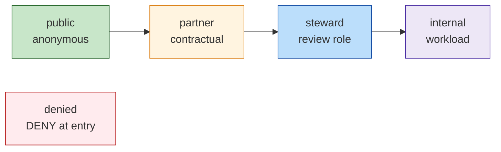

<!-- [KFM_META_BLOCK_V2]
doc_id: kfm://doc/architecture-governed-api-audience-classes
title: Governed API — Audience Classes
type: standard
version: v0.1
status: draft
owners: API steward + Security steward · NEEDS VERIFICATION
created: 2026-05-24
updated: 2026-05-24
policy_label: public
related:
  - README.md
  - ../governed-api.md
  - ../cross-domain/trust-membrane.md
  - THREAT_MODEL.md
  - ENVELOPES.md
  - DEPLOYMENT_RULES.md
tags: [kfm, architecture, governed-api, audience, auth, doctrine]
notes:
  - PROPOSED. Expands docs/architecture/governed-api.md §7 (trust-membrane rules) and §5 (endpoint catalogue).
  - Stabilizing the five-class enum is an open ADR (parent App. C, "audience class enum").
[/KFM_META_BLOCK_V2] -->

<a id="top"></a>

# Governed API — Audience Classes

> *The `public` / `partner` / `steward` / `internal` / `denied` vocabulary, the auth integration that backs it, and the rate-limit tiers that apply per class.*


%20·%20PROPOSED%20(auth)-blue)


**Status:** draft · **Owners:** API steward + Security steward *(NEEDS VERIFICATION)* · **Last updated:** 2026-05-24

> [!IMPORTANT]
> **Audience class is a design-time contract, not a deployment assumption.** A route's audience class is declared in its metadata; OPA enforces; the deployment topology *(network, ingress, secrets)* is downstream of the class, not upstream. A `partner` route does not become `public` because the VPN is down; it becomes `DENY` *(or `ERROR`)*.

> [!NOTE]
> **The five-class enum is PROPOSED-stabilizing.** It is the canonical vocabulary across the corpus; an ADR locks it as the stable enum *(see [§8](#8-open-questions-and-adr-triggers))*.

---

## Table of contents

1. [Scope](#1-scope)
2. [The five audience classes](#2-the-five-audience-classes)
3. [Class — `public`](#3-class--public)
4. [Class — `partner`](#4-class--partner)
5. [Class — `steward`](#5-class--steward)
6. [Class — `internal`](#6-class--internal)
7. [Class — `denied`](#7-class--denied)
8. [Auth integration](#8-auth-integration)
9. [Rate-limit tiers](#9-ratelimit-tiers)
10. [Route × class mapping (PROPOSED)](#10-route--class-mapping-proposed)
11. [Anti-patterns](#11-anti-patterns)
12. [Open questions and ADR triggers](#12-open-questions-and-adr-triggers)
13. [Related docs](#13-related-docs)
14. [Appendix](#14-appendix)

---

## 1. Scope

This doc defines the five-class audience vocabulary, what each class means, how clients of each class authenticate, what rate tier they receive, and how routes are classified.

> [!TIP]
> **When this doc binds.** Adding a new route, hardening an existing route, integrating a new auth provider, defining rate-limit tiers, or auditing whether a route is exposed at the correct class.

[↑ Back to top](#top)

---

## 2. The five audience classes

> **Evidence basis:** `governed-api.md` §5 *(audience-class enumeration, CONFIRMED across corpus)*; `governed-api.md` Appendix C *(stability is OPEN)*.

| Class | Definition | Auth posture | Default rate tier | Audit posture |
|---|---|---|---|---|
| **`public`** | Anonymous, unauthenticated readers of released artifacts. | None *(IP-bound rate limit)* | T-PUB *(see §9)* | Sampled telemetry; redacted. |
| **`partner`** | Authenticated external party with a contractual relationship. | OIDC / API-key with rotation | T-PART | Per-key audit; full receipts. |
| **`steward`** | KFM steward role with read/write privileges on the review queue. | OIDC with role claim `steward` | T-STEW | Full audit; receipts per action. |
| **`internal`** | Trusted KFM service / operator with elevated read on internal artifacts. | mTLS or workload identity | T-INT | Full audit; receipts per action; flag-gated. |
| **`denied`** | Class assigned to routes that **MUST NOT** be exposed to any client; reserved for retired routes, draft routes, or routes recorded as `DENY` by doctrine. | n/a — `DENY` envelope at route handler entry | n/a | `DENY` receipt; spike alert. |



> [!CAUTION]
> **`denied` is a class, not a deployment state.** A route classified `denied` returns a `DENY` envelope at handler entry regardless of where it is deployed. Use `denied` to keep retired or PROPOSED routes physically removable without surprises.

[↑ Back to top](#top)

---

## 3. Class — `public`

| Aspect | Detail |
|---|---|
| Who | Anonymous map-shell readers; embed consumers; story players in default mode. |
| Auth | None. IP-bound rate limit. |
| Reads | Released artifacts only *(via `LIFECYCLE_GATES.md`)*; cite-or-abstain enforced. |
| Writes | None. *(Correction submit is permitted via `partner` or higher; see §4.)* |
| Sensitive lanes | Default `DENY` per `governed-api.md` §11.3. |
| Telemetry | Sampled with redaction; no PII / restricted coords. |
| Rate tier | **T-PUB**. |

> [!IMPORTANT]
> **`public` is the default for the explorer-web client.** If a route is reachable from the unauthenticated browser, it is `public`. If it is reachable only with login, it is **not** `public`.

[↑ Back to top](#top)

---

## 4. Class — `partner`

| Aspect | Detail |
|---|---|
| Who | Authenticated external organizations with a contract, key, or OIDC binding. |
| Auth | OIDC *(preferred)* or API key with rotation policy; key never in logs. |
| Reads | Released artifacts + agreed-upon partner surfaces. |
| Writes | Where contractually permitted *(e.g., `POST /api/v1/corrections`, telemetry submission)*. |
| Sensitive lanes | Default `DENY` unless contract explicitly carves out. |
| Telemetry | Full attribution to partner id; rate-tracked. |
| Rate tier | **T-PART** *(higher than `public`)*. |

[↑ Back to top](#top)

---

## 5. Class — `steward`

| Aspect | Detail |
|---|---|
| Who | KFM stewards who operate the review queue, accept / reject candidates, and emit `ReviewRecord`. |
| Auth | OIDC with role claim `steward`; session bound to user identity. |
| Reads | `ANSWER` on the review queue and unreleased candidates *(within their lane)*; never raw stores directly — the API surfaces these to the review console. |
| Writes | Review decisions; correction acceptance. |
| Sensitive lanes | Lane-scoped: a fauna steward sees fauna candidates; not archaeology. |
| Telemetry | Full per-user audit; bounded label cardinality. |
| Rate tier | **T-STEW**. |

> [!NOTE]
> **Steward access does not bypass cite-or-abstain.** A steward reviewing a candidate sees the candidate's `EvidenceBundle` (or its incompleteness); they do not see "behind" the bundle to unreviewed raw stores.

[↑ Back to top](#top)

---

## 6. Class — `internal`

| Aspect | Detail |
|---|---|
| Who | KFM services or operators *(release plane, observability plane, ops jobs)*. |
| Auth | mTLS or workload identity *(SPIFFE-style, PROPOSED)*. |
| Reads | Released and unreleased metadata necessary for the job *(e.g., release plane reads draft manifests)*. |
| Writes | Release plane actions, rollback execution, operational telemetry. |
| Sensitive lanes | Lane-scoped per role. |
| Telemetry | Full audit; tied to workload identity, not human user. |
| Rate tier | **T-INT** *(highest)*. |

> [!IMPORTANT]
> **`internal` is not "admin shortcut".** Admin shortcuts are not public paths *(`governed-api.md` §3 invariant 9)*; `internal` is a class for **machine-to-machine** trust, not for human admin operations performed via the public surface.

[↑ Back to top](#top)

---

## 7. Class — `denied`

| Aspect | Detail |
|---|---|
| Who | Nobody. |
| Why | Route is retired, draft, or recorded as `DENY` by doctrine *(e.g., a route that would expose a fail-closed lane)*. |
| Behavior | Handler returns `DENY` envelope with stable reason code at entry; never reaches policy / release / resolver. |
| Use | Keep code path discoverable for audit while removing exposure. |
| Telemetry | Hit counter; alerts on spike *(indicates misconfiguration or probing)*. |

[↑ Back to top](#top)

---

## 8. Auth integration

> **Evidence basis:** **PROPOSED.** No live auth provider is verified in this session.

| Class | Recommended mechanism | Token lifetime | Rotation |
|---|---|---|---|
| `public` | None *(IP-bound)* | n/a | n/a |
| `partner` | OIDC client-credentials *(preferred)*; API key fallback | OIDC: ≤1h access token; API key: ≤90d | Mandatory rotation cadence; revocation list |
| `steward` | OIDC authorization-code with role claim | ≤8h session | Refresh with re-auth on role change |
| `internal` | mTLS *(preferred)*; workload identity | ≤24h material | Automatic rotation via secret manager |
| `denied` | n/a | n/a | n/a |

| Auth concern | Rule |
|---|---|
| Token in logs | Forbidden *(see `DEPLOYMENT_RULES.md` §log discipline)*. |
| Token in URL | Forbidden; headers only. |
| Token in error envelope | Forbidden; never echo claims. |
| Token validation | At ingress *(Boundary 1, `THREAT_MODEL.md` §3)*; cached briefly with revocation check. |
| Failure mode | `ERROR` with stable code `auth/*` *(see `ERROR_CODES.md`)*; never reveal which check failed. |

> [!CAUTION]
> **Class is checked at ingress.** A `steward` route receiving a `partner` token returns `DENY` with `auth/insufficient-class`; not `ANSWER` plus a downgrade.

[↑ Back to top](#top)

---

## 9. Rate-limit tiers

> **Evidence basis:** **PROPOSED.** Tier numbers below are illustrative; actual limits live in deployment config.

| Tier | Class | Typical limit *(PROPOSED)* | Burst | Notes |
|---|---|---|---|---|
| **T-PUB** | `public` | 60 req/min per IP | 120 | Tight; abuse-resistant. |
| **T-PART** | `partner` | 600 req/min per key | 1200 | Contractual; per-key. |
| **T-STEW** | `steward` | 1200 req/min per user | 2400 | Workflow-shaped. |
| **T-INT** | `internal` | unbounded *(soft cap)* | n/a | Workload-shaped; observability-tracked. |
| **T-DENY** | `denied` | — | — | Counter only; alert on spike. |

| Surfacing rule | Detail |
|---|---|
| Limit headers | `X-RateLimit-Limit`, `X-RateLimit-Remaining`, `Retry-After` on the envelope when relevant. |
| Outcome when exhausted | `ERROR` envelope with `rate/exhausted`; not `DENY` *(`DENY` is policy)*. |
| Disclosure | Whether tier numbers are publicly documented is an open ADR *(`README.md` §8)*. |

[↑ Back to top](#top)

---

## 10. Route × class mapping (PROPOSED)

> **Evidence basis:** `governed-api.md` §5 *(endpoint catalogue, PROPOSED)*. Mapping below is the natural reading of that catalogue.

| Surface | Method · Route | Class |
|---|---|---|
| Bootstrap | `GET /api/v1/runtime/bootstrap` | `public` |
| Layer catalog | `GET /api/v1/layers` | `public` |
| Layer descriptor | `GET /api/v1/layers/{layer_id}` | `public` |
| Layer manifest | `GET /api/v1/layers/{layer_id}/manifest` | `public` |
| Evidence bundle | `GET /api/v1/evidence/{bundle_id}` | `public` |
| Claim resolution | `POST /api/v1/claims/resolve` | `public` |
| Focus query | `POST /api/v1/focus/query` | `public` *(sensitive lanes default `DENY`)* |
| Story manifest | `GET /api/v1/stories/{story_id}` | `public` |
| Review queue | `GET /api/v1/review/queue` | `steward` |
| Review decision | `POST /api/v1/review/{queue}/{id}/decision` | `steward` |
| Correction submit | `POST /api/v1/corrections` | `partner` *(or `public` with rate-limited unauthenticated submission, ADR)* |
| Export request | `POST /api/v1/export` | `public` *(scoped)* / `partner` |
| Telemetry | `POST /api/v1/telemetry` | `public` |
| Admin / ops *(if present)* | Out of public surface | `internal` |

[↑ Back to top](#top)

---

## 11. Anti-patterns

| Anti-pattern | Mitigation |
|---|---|
| **Audience class implied by deployment** *(e.g., "behind VPN, so internal")* | Class declared in route metadata; OPA enforces. |
| **`partner` token granting `steward` access via custom claim** | Class boundary is the OIDC role; no custom escalation. |
| **`internal` reused as "admin shortcut"** | `internal` is M2M; admin operations have their own audited path. |
| **`public` route reading unreleased lifecycle state** | `LIFECYCLE_GATES.md` forbids; resolver returns `ABSTAIN`. |
| **Rate-limit headers omitted** | Clients can't back off gracefully; clients retry harder. |
| **`denied` removed by deleting the route file** | Route deletion is a release event; keep the `denied` entry until ADR retires it. |

[↑ Back to top](#top)

---

## 12. Open questions and ADR triggers

| Open item | Class | Suggested ADR title |
|---|---|---|
| Stabilize five-class enum as canonical. | Vocabulary | "Audience-class enumeration". |
| `correction submit` — `public` rate-limited, or `partner`-only? | Authorization | "Correction-submit audience". |
| Rate-limit tier disclosure — public manifest or internal-only? | Operational | "Rate-limit tier disclosure". |
| `internal` workload identity — SPIFFE adoption or mTLS-only? | Auth | "Internal-class workload identity". |
| Should `denied` be split into `denied/retired` and `denied/draft`? | Sub-vocabulary | "Denied sub-classification". |

[↑ Back to top](#top)

---

## 13. Related docs

| Reference | Role | Truth label |
|---|---|---|
| `README.md` *(this folder)* | Landing | CONFIRMED doctrine |
| `../governed-api.md` §5, §7, §11.3 | Audience and deny-by-default | CONFIRMED doctrine |
| `THREAT_MODEL.md` Boundary 1 | Class checked at ingress | PROPOSED |
| `ENVELOPES.md` | `DENY` and `ERROR` shape on class failure | PROPOSED |
| `LIFECYCLE_GATES.md` | What each class may read | PROPOSED |
| `ERROR_CODES.md` | `auth/*` and `rate/*` codes | PROPOSED |
| `DEPLOYMENT_RULES.md` | TLS / CORS / log discipline per class | PROPOSED |
| `directory-rules.md` §7.1 | Governed API placement | CONFIRMED doctrine |

[↑ Back to top](#top)

---

## 14. Appendix

<details>
<summary><strong>14.1 Class — at-a-glance card</strong></summary>

```text
public    — anonymous, IP rate-limited, released only
partner   — OIDC/API-key, contractual, T-PART
steward   — OIDC w/ role, review-queue, lane-scoped
internal  — mTLS/workload, M2M only, T-INT
denied    — DENY at entry, alert on spike
```

</details>

<details>
<summary><strong>14.2 Truth-label legend</strong></summary>

- **CONFIRMED** — verified this session from attached docs.
- **PROPOSED** — design / placement / inference not yet verified in implementation.
- **INFERRED** — derivable from confirmed evidence but not directly stated.
- **NEEDS VERIFICATION** — checkable, but not yet checked strongly enough to act as fact.

</details>

---

**Related (mini)** · [`README.md`](README.md) · [`../governed-api.md`](../governed-api.md) · [`THREAT_MODEL.md`](THREAT_MODEL.md) · [`ENVELOPES.md`](ENVELOPES.md) · [`LIFECYCLE_GATES.md`](LIFECYCLE_GATES.md) · [`ERROR_CODES.md`](ERROR_CODES.md) · [`DEPLOYMENT_RULES.md`](DEPLOYMENT_RULES.md)

**Last updated:** 2026-05-24 · **Doc version:** v0.1 · **Doc status:** draft · **Path status:** PROPOSED *(OPEN-DR-12 META)*

[↑ Back to top](#top)
