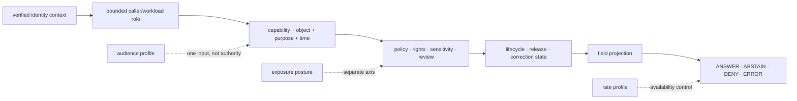

<!-- [KFM_META_BLOCK_V2]
doc_id: kfm://doc/architecture-governed-api-audience-classes
title: Governed API — Audience Classes
type: architecture-standard
version: v0.2
status: draft; repository-grounded; vocabulary-conflicted; enforcement-unbound; non-authoritative
maturity: current-state reconciliation with proposed graduation model
owners:
  - "NEEDS VERIFICATION — governed API maintainer"
  - "NEEDS VERIFICATION — access-policy steward"
  - "NEEDS VERIFICATION — identity and security reviewer"
  - "NEEDS VERIFICATION — affected client or domain steward"
created: 2026-05-24
updated: 2026-08-19
policy_label: public
truth_posture: cite-or-abstain
responsibility_root: docs/
owning_root: docs/
current_path: docs/architecture/governed-api/AUDIENCE_CLASSES.md
responsibility: "Explain the current audience, caller-role, exposure, field-projection, lifecycle, and finite-outcome vocabularies around the Governed API; reconcile their conflicts; and define evidence required before any audience vocabulary or enforcement profile can become stable."
authority_class: explanatory architecture guidance
authority_limit: "This document does not authenticate a caller, assign a role, grant a capability, execute policy, bind a route, configure a rate limit, approve a review, release an artifact, deploy a service, or publish a KFM claim."
canonical_relationship: "CONFIRMED existing same-path companion under docs/architecture/governed-api/; the five-literal vocabulary is retained as lineage, not accepted as a canonical enum."
evidence_snapshot:
  repository: bartytime4life/Kansas-Frontier-Matrix
  base_ref: main
  base_commit: 2a9a14018ab98bdf9022f7d4fbcd638ca895d0af
  target_prior_blob: 51a40d8deb4d43c4e6eebd57b40e54ae6852e471
  parent_readme_blob: 09f9f95ce7400055b8018f9f159796ac35959fbb
  directory_rules_blob: fd49a0b83e55cef52c1124281f093e263526898d
  adr_0029_blob: a4de0d7a96b78da59cfc499d1025e1508afd8dd9
  adr_0004_blob: f2737900569447e8e20c8ce12b275167724b0cc5
  codeowners_blob: dd2a84aa514d8ecd9208bc347f90f9a2ed37dd61
  governed_api_main_blob: 4eb335c7c0b27f62c7419c478542e8fe40e1ff38
  governed_api_route_registry_blob: 3418168d0b267160d6ad6dd87f289e880ef4a024
  governed_api_stub_blob: 371e60d9f96c78e31c8a1e6109d19dee5da4213b
  governed_api_route_test_blob: 2be20f5d93c03da7677c34b11a31875a00b2ed28
  governed_api_boundary_test_blob: 4035e537e6c52194928df5ab8ceb41a35f5f30ca
  access_policy_readme_blob: e03ffbc8fe329c2d8feddedee62a2149d25f195b
  api_exposure_contract_blob: cf3b1cef253d8f13b09c004a322d689ac08decba
  api_exposure_schema_blob: 52c2f7723e885eda0c19f2b07e88a7a6d6d29cb7
  field_authorization_contract_blob: 349cd38c31168c38c9e658848ebaf05f842ba875
  field_authorization_schema_blob: def2cf4885a87671a04587c99b809c5c6ee6b2e6
  policy_input_profile_schema_blob: d72288fe5e807ea76ad65636cca682cd0c3631e7
  reviewer_role_contract_blob: 41c438ff318a6764070bbedf69fd1b45ee41cf75
  generated_receipt_schema_blob: fba21ed27ebccf1362fe397fe0c3ebd85e072685
related:
  - README.md
  - README.md
  - ../trust-membrane.md
  - ../../adr/ADR-0004-apps-governed-api-is-the-trust-membrane.md
  - ../../adr/ADR-0029-adopt-directory-governance-standard-v2.md
  - ../../doctrine/directory-rules.md
  - THREAT_MODEL.md
  - ENVELOPES.md
  - LIFECYCLE_GATES.md
  - ERROR_CODES.md
  - DEPLOYMENT_RULES.md
  - ../../../apps/governed-api/README.md
  - ../../../apps/governed-api/src/governed_api/main.py
  - ../../../apps/governed-api/src/governed_api/routes/registry.py
  - ../../../apps/governed-api/src/governed_api/stub.py
  - ../../../apps/governed-api/tests/test_abstain_routes.py
  - ../../../apps/governed-api/tests/test_boundary_guards.py
  - ../../../policy/access/README.md
  - ../../../contracts/release/api_capability_exposure_assessment.md
  - ../../../schemas/contracts/v1/release/api_capability_exposure_assessment.schema.json
  - ../../../contracts/release/field_level_api_authorization_assessment.md
  - ../../../schemas/contracts/v1/release/field_level_api_authorization_assessment.schema.json
  - ../../../schemas/contracts/v1/policy/policy_input_bundle_profile_v1.schema.json
  - ../../../contracts/policy/policy_reviewer_role_vocabulary.md
tags: [kfm, architecture, governed-api, audience, caller-role, authorization, exposure, lifecycle, finite-outcomes, rate-limits, trust-membrane, repository-grounded]
notes:
  - "v0.2 replaces the May 2026 proposal-era class and route catalogue with current repository evidence."
  - "The historical public/partner/steward/internal/denied literals remain visible for compatibility and migration analysis, but no accepted ADR, contract, schema, policy bundle, route metadata profile, or runtime enforcement makes them canonical."
  - "Current executable routes remain /bootstrap, /layers, and /evidence; they carry no audience metadata and return ABSTAIN / NOT_IMPLEMENTED."
  - "The access-policy lane is documentation-only at the direct path and no authentication provider, grant store, audience resolver, authorization middleware, OPA binding, revocation service, or rate-limit implementation was verified."
  - "Fixture-only API-exposure and field-authorization profiles provide bounded candidate vocabularies and deterministic checks; they do not authorize a route or public use."
  - "The literal denied is treated as legacy vocabulary because DENY is a finite outcome, not a caller audience."
[/KFM_META_BLOCK_V2] -->

<a id="top"></a>

# Governed API — Audience Classes

> **One-line purpose.** Separate who or what is calling from what the caller may do, which lifecycle state may be projected, what fields may leave the trust membrane, and which finite outcome the Governed API returns—without pretending that KFM currently has an accepted audience enum or implemented authorization layer.

[](#1-scope)
[](#2-the-five-audience-classes)
[](#10-route--class-mapping-proposed)
[](#8-auth-integration)
[](#10-route--class-mapping-proposed)
[](#1-scope)

> [!IMPORTANT]
> **No canonical audience-class enum is accepted or enforced by the current repository evidence.** The prior five literals—`public`, `partner`, `steward`, `internal`, and `denied`—are design lineage. Current fixture-only schemas use different vocabularies for capability audience, field-level caller role, and policy-evaluation audience. None of those profiles authenticates a caller, grants a capability, binds a route, or authorizes release or public use.

> [!CAUTION]
> **Audience is not authorization.** Authentication context, caller or workload role, purpose, capability, object scope, lifecycle state, rights, sensitivity, evidence, review, release, correction, field projection, and rate policy remain separate inputs. A familiar role label cannot turn unresolved or unreleased material into an allowed response.

> [!WARNING]
> **`DENY` is a finite decision outcome, not an audience.** A retired, draft, disabled, or prohibited route may be represented by a separate route or exposure state, but the caller is not a member of an audience called `denied`.

**Quick navigation:** [Scope](#1-scope) · [Vocabulary status](#2-the-five-audience-classes) · [`public`](#3-class--public) · [`partner`](#4-class--partner) · [`steward`](#5-class--steward) · [`internal`](#6-class--internal) · [`denied`](#7-class--denied) · [Auth](#8-auth-integration) · [Rate limits](#9-ratelimit-tiers) · [Current routes](#10-route--class-mapping-proposed) · [Anti-patterns](#11-anti-patterns) · [Open decisions](#12-open-questions-and-adr-triggers) · [Related](#13-related-docs) · [Appendix](#14-appendix)

---

<a id="1-scope"></a>

## 1. Scope

This document explains the Governed API audience boundary at the level the current repository supports. It does four things:

1. records the current executable route surface and the absence of audience enforcement;
2. distinguishes audience-related concepts that the v0.1 document collapsed;
3. preserves the historical five-literal vocabulary as migration lineage; and
4. defines the evidence required before a stable audience profile, route binding, authentication mechanism, authorization policy, or rate profile can be represented as implemented.

It does **not** define semantic contract authority, machine schema authority, policy admissibility, credentials, grants, runtime middleware, deployment configuration, review approval, release state, or publication state. Those responsibilities remain in their owning roots.

### 1.1 Current safe determination

| Claim | Status | Current evidence-bounded conclusion |
|---|---|---|
| Target path exists | **CONFIRMED** | This is a same-path architecture companion under `docs/architecture/governed-api/`. |
| Placement authority | **CONFIRMED** | Accepted ADR-0029 and Directory Rules v2 place human architecture guidance under `docs/architecture/`. |
| Governed API app exists | **CONFIRMED** | The tracked WSGI scaffold dispatches three GET routes. |
| Route audience metadata exists | **CONFIRMED absent in the inspected registry** | `routes/registry.py` maps paths directly to callables and declares no audience, purpose, capability, or rate profile. |
| Current auth enforcement | **NOT PROVED** | The inspected dispatcher does not parse credentials, resolve identity, select an access policy, or check role/capability grants. |
| Current access-policy evaluator | **NOT PROVED** | The direct `policy/access/` lane contains documentation only; its README explicitly keeps evaluator binding and active bundles unimplemented. |
| Stable five-class enum | **CONFLICTED / HOLD** | Repository proposal surfaces use different literals and different semantic axes. |
| Current public deployment | **UNKNOWN** | No infrastructure, runtime log, ingress, identity-provider, CORS, TLS, rate-limit, or observed request evidence is used here. |
| Release/publication effect | **None** | Documentation, fixture checks, route presence, and CI cannot release or publish. |

### 1.2 State separation

The word “audience” must not become a catch-all. A future implementation must keep at least these axes distinct:

| Axis | Question answered | Current repository signal | Must not be collapsed into |
|---|---|---|---|
| Authentication context | Was a human or workload identity verified, by which provider and assurance level? | No active provider or verifier was confirmed. | Authorization, evidence, review, or release |
| Caller or workload role | What bounded role does the verified identity assert? | Fixture-only role candidates exist; no accepted role-to-grant binding. | Capability grant or reviewer approval |
| Audience profile | Which consumer class is this route or projection intended to serve? | Multiple conflicting proposal vocabularies. | Deployment location or rate tier |
| Capability authorization | May this caller perform this named operation on this object for this purpose and time? | `policy/access/` documents a proposed boundary; no active evaluator proved. | Authentication or broad role label |
| Exposure posture | Is the capability internal-only, a public candidate, unresolved, retired, or prohibited? | Fixture-only `INTERNAL_ONLY`, `PUBLIC_CANDIDATE`, and `UNRESOLVED` values exist. | Caller identity or finite outcome |
| Field classification | Which named fields may be projected to the downstream surface? | Fixture-only `PUBLIC`, `ROLE_SCOPED`, `EMBARGOED`, `NEVER_RETURN`. | Whole-route audience |
| Lifecycle phase | Which source state is eligible for the requested operation? | `RAW` through `PUBLISHED` remain separate. | Role or exposure posture |
| Finite outcome | What did this exact evaluation return? | `ANSWER`, `ABSTAIN`, `DENY`, `ERROR`. | Audience or route state |
| Route state | Is the route proposed, active, disabled, retired, or absent? | No accepted route-state profile was verified. | `DENY` outcome |
| Rate profile | What availability and abuse-control budget applies? | No current route-bound rate configuration was verified. | Authorization or policy decision |
| Reviewer role | Which qualified review responsibility is requested or recorded? | Proposed inactive reviewer-role vocabulary exists. | Caller grant or approval evidence |

### 1.3 Directory Rules basis

This is a same-path update under the accepted `docs/` responsibility root. It creates no new root and no parallel authority. Future implementation remains responsibility-split:

- semantic meaning in `contracts/`;
- machine shape in `schemas/`;
- admissibility and access rules in `policy/`;
- runtime enforcement in `apps/`, `packages/`, `runtime/`, `configs/`, and `infra/` as applicable;
- reusable examples and proof in `fixtures/`, `tools/validators/`, and `tests/`;
- review, release, correction, rollback, receipts, proofs, and published carriers in their distinct governed homes.

[↑ Back to top](#top)

---

<a id="2-the-five-audience-classes"></a>

## 2. The five audience classes

The v0.1 document presented five literals as one ordered class system. Current repository evidence does not support that claim. The literals are retained below so existing references can be reconciled rather than silently erased.

### 2.1 Current vocabulary register

| Surface | Literal set | Actual semantic axis | Status |
|---|---|---|---|
| This document v0.1 | `public`, `partner`, `steward`, `internal`, `denied` | Mixed caller, trust, exposure, and outcome concepts | **LEGACY / CONFLICTED** |
| `ApiCapabilityExposureAssessmentCandidate` | `PUBLIC_CLIENT`, `INTERNAL_OPERATOR`, `UNKNOWN` | Declared capability audience | **PROPOSED_INACTIVE / fixture-only** |
| Same exposure assessment | `INTERNAL_ONLY`, `PUBLIC_CANDIDATE`, `UNRESOLVED` | Exposure posture | **PROPOSED_INACTIVE / fixture-only** |
| `FieldLevelApiAuthorizationAssessmentCandidate` | `PUBLIC_CLIENT`, `AUTHENTICATED_RESEARCHER`, `STEWARD`, `INTERNAL_OPERATOR`, `UNKNOWN` | Request audience role | **PROPOSED / experimental / fixture-only** |
| `PolicyInputBundleProfileV1` | `PUBLIC`, `RESTRICTED_REVIEW`, `STEWARD`, `INTERNAL`, `AI_ADAPTER`, `MAP_RUNTIME`, `RELEASE_GATE` | Policy-evaluation audience/context | **PROPOSED_INACTIVE / fixture-only** |
| Policy reviewer-role vocabulary | `POLICY_STEWARD`, `EVIDENCE_STEWARD`, `DOMAIN_STEWARD`, `RELEASE_STEWARD`, `SECURITY_PRIVACY_REVIEWER` | Review responsibility | **PROPOSED_INACTIVE** |
| Runtime response envelope | `ANSWER`, `ABSTAIN`, `DENY`, `ERROR` | Finite response outcome | **Current proposed runtime contract family** |

These sets are not aliases. For example, `STEWARD` in a request context is not the same claim as `POLICY_STEWARD` in a reviewer vocabulary, and neither proves that a named person holds a grant or approved a record.

### 2.2 Legacy disposition summary

| v0.1 literal | Safe current disposition | Required before reuse as a stable literal |
|---|---|---|
| `public` | Retain as human-readable lineage for unauthenticated or public-client intent; do not infer current route exposure. | Accepted meaning, schema, route binding, policy tests, client and deployment evidence |
| `partner` | **HOLD.** No accepted repository meaning or direct equivalent was verified. | Define identity, contractual/grant semantics, purpose, scope, expiry, revocation, and audit |
| `steward` | Retain as a possible role concept, not a universal privilege level. | Accepted role/capability vocabulary, lane scope, separation of duties, grants, and negative tests |
| `internal` | **AMBIGUOUS.** It may refer to a service, operator, network exposure, or lifecycle visibility. | Split human operator, workload identity, service audience, and exposure posture explicitly |
| `denied` | Retire as an audience candidate; preserve the safety intent under finite `DENY` and separate route/exposure state. | Accepted route-state and decision vocabulary, compatibility plan |

### 2.3 No privilege ladder

The diagram in v0.1 implied `public → partner → steward → internal` as a monotonic privilege ladder. That is unsafe. A service workload may be authorized for one narrow machine capability but not a steward review action. A steward may inspect one domain candidate but not operate release infrastructure. An external authenticated researcher may receive a role-scoped field while an internal operator is still denied that field because the declared purpose does not match.


```mermaid
flowchart LR
    I["verified identity context"] --> R["bounded caller/workload role"]
    R --> C["capability + object + purpose + time"]
    C --> P["policy · rights · sensitivity · review"]
    P --> L["lifecycle · release · correction state"]
    L --> F["field projection"]
    F --> O["ANSWER · ABSTAIN · DENY · ERROR"]

    A["audience profile"] -. "one input, not authority" .-> C
    X["exposure posture"] -. "separate axis" .-> P
    Q["rate profile"] -. "availability control" .-> O
```

[↑ Back to top](#top)

---

<a id="3-class--public"></a>

## 3. Class — `public`

### 3.1 Legacy intent retained

The legacy `public` concept means a response or carrier intended for a public client and constrained to released, public-safe material. That intent is consistent with KFM’s trust-membrane doctrine.

### 3.2 Current implementation status

| Aspect | Current conclusion |
|---|---|
| Anonymous authentication mode | **UNKNOWN / not implemented in inspected app code** |
| Route binding | **ABSENT** from the current three-route registry |
| Released-data read path | **NOT IMPLEMENTED** by the current stubs |
| Evidence resolution | **NOT IMPLEMENTED** by the current `/evidence` stub |
| Policy/sensitivity enforcement | **NOT PROVED** |
| Explorer live transport | **NOT PROVED** |
| Public deployment | **UNKNOWN** |

A route that is callable without credentials is not automatically a governed public route. It may be an unprotected defect, a local scaffold, or an unbound candidate. Public status requires explicit route metadata, public-safe lifecycle constraints, policy and field-projection checks, release/correction binding, client behavior, deployment evidence, and review.

### 3.3 Minimum public-client conditions

A future public-client profile must at least prove:

- the route and method are declared and contract-bound;
- only `PUBLISHED` or separately governed immutable public-safe carriers are returned;
- evidence and citation requirements are resolved or the response abstains;
- rights, sensitivity, precision, correction, withdrawal, and rollback state are honored;
- no credential, private identifier, restricted coordinate, raw evidence, internal reason detail, prompt, stack trace, or canonical-store locator leaks;
- unsupported or malformed states fail closed through the finite envelope; and
- deployment and cache behavior cannot widen the declared public projection.

[↑ Back to top](#top)

---

<a id="4-class--partner"></a>

## 4. Class — `partner`

### 4.1 Status

`partner` is **legacy and unresolved**. No accepted contract, schema, registry, policy bundle, identity provider, grant store, or route metadata profile was verified that defines who qualifies, which capabilities follow, or how a relationship is revoked.

### 4.2 Why a label is insufficient

A contractual relationship does not itself authorize data or actions. Any future external authenticated profile must bind:

| Required dimension | Example question |
|---|---|
| Verified subject | Which organization, workload, or person was authenticated? |
| Relationship/grant | Which active grant or agreement authorizes this capability? |
| Purpose | Is this request within the approved purpose? |
| Scope | Which objects, domains, fields, geographies, and times are covered? |
| Obligations | Attribution, non-redistribution, generalization, logging, or deletion requirements? |
| Expiry/revocation | When does the grant end, and how quickly does revocation propagate? |
| Review and audit | Which independent record supports the decision and how is it replayed? |
| Release boundary | Does the grant permit only released material, or a separately reviewed restricted projection? |

The fixture-only field-authorization profile currently uses `AUTHENTICATED_RESEARCHER`, not `partner`. This document does not silently rename one to the other. That mapping is a governance decision.

### 4.3 Current route status

No current route is documented here as `partner`, and no current app test proves partner authentication or authorization. The old route examples and token-lifetime claims are removed from current-state guidance.

[↑ Back to top](#top)

---

<a id="5-class--steward"></a>

## 5. Class — `steward`

### 5.1 Role, grant, and review are separate

`STEWARD` appears in proposed fixture profiles, and more specific reviewer-role identifiers exist in a proposed inactive policy vocabulary. These are useful design inputs, but they do not assign a person, authenticate a session, grant a capability, or record approval.

| Concept | Meaning | Non-effect |
|---|---|---|
| Steward role token | Candidate responsibility or request-context label | Does not grant read/write access |
| Capability grant | Time-, purpose-, object-, and interface-bounded permission | Does not prove evidence, policy, or release correctness |
| Review assignment | Request for a qualified reviewer | Does not prove review occurred |
| `ReviewRecord` or equivalent | Recorded review decision with actor and scope | Does not by itself publish or promote |
| CODEOWNERS route | GitHub review routing to a verified account | Does not establish KFM stewardship or independent approval |

### 5.2 Current implementation status

The current three-route app has no review-queue route, role claim parser, lane-scoped authorization, decision-record writer, or steward-specific field projection. The v0.1 claims about review-queue reads and review-decision writes remain **PROPOSED**, not current route behavior.

### 5.3 Required controls

Before a steward audience can be implemented, KFM needs an accepted role and capability vocabulary, identity assurance, lane/object scope, purpose, expiry and revocation, separation-of-duties rules, field-level projection, audit persistence, negative tests, and a verified review-record contract/consumer flow. Sensitive lanes may require qualified or two-person review beyond a generic steward label.

[↑ Back to top](#top)

---

<a id="6-class--internal"></a>

## 6. Class — `internal`

### 6.1 Ambiguity register

The legacy `internal` literal collapsed at least four distinct ideas:

1. a human operator;
2. a machine workload or service identity;
3. an internal-only exposure posture; and
4. permission to inspect non-public lifecycle metadata.

Those are not equivalent. Network location, VPN placement, repository ownership, or service naming cannot substitute for a verified identity and exact capability decision.

### 6.2 Safe current rule

> **Internal placement is not implicit authority.** A request from a private network or KFM-managed workload still needs bounded identity, purpose, capability, object scope, lifecycle permission, policy obligations, audit, and failure behavior.

The current app does not implement mTLS, SPIFFE, workload identity, operator sessions, an internal route namespace, or a privileged metadata projection. The prior mechanism and token-lifetime table was a proposal and is removed from current-state claims.

### 6.3 Human and workload separation

A future profile should use separate identifiers and grants for human operators and machine workloads. Human administrative actions require attributable sessions and review/correction controls. Workload calls require service identity, narrowly scoped capabilities, rotation/revocation, workload-bound audit, and denial of interactive human shortcuts.

[↑ Back to top](#top)

---

<a id="7-class--denied"></a>

## 7. Class — `denied`

### 7.1 Corrected classification

`denied` is not an audience class. The safety intent is preserved through two separate constructs:

- **finite outcome `DENY`** — policy or authorization evaluated the exact request and prohibits it; and
- **route or exposure state** — a route may be absent, proposed, disabled, retired, internal-only, unresolved, or prohibited.

### 7.2 `DENY`, `ABSTAIN`, and `ERROR`

| Outcome | Use | Example boundary |
|---|---|---|
| `DENY` | An applicable policy or authorization rule prohibits the operation. | Caller lacks the required grant; sensitivity forbids the requested precision. |
| `ABSTAIN` | Evidence, scope, identity context, release state, or another required input is unresolved or unsupported. | EvidenceRef cannot resolve; audience binding is not yet implemented. |
| `ERROR` | The system cannot safely evaluate or execute. | Malformed request, unavailable evaluator, invalid response construction. |

The current registered routes return `ABSTAIN / NOT_IMPLEMENTED`. Unknown paths and unsupported methods return a safe `ERROR` envelope. They do not currently return `DENY` for audience mismatch because no audience evaluation exists.

### 7.3 Route retirement

Deleting a route, retaining a tombstone, returning a retirement response, or maintaining a compatibility alias are migration decisions. They require consumer inventory, deprecation notice where applicable, link/client repair, correction history, validation, and rollback. A documentation literal must not become a hidden runtime tombstone policy.

[↑ Back to top](#top)

---

<a id="8-auth-integration"></a>

## 8. Auth integration

### 8.1 Current repository status

No live authentication or access-enforcement path is claimed by this document.

| Surface | Current evidence | Safe conclusion |
|---|---|---|
| WSGI dispatcher | Reads path and method only | No credential or audience processing |
| Route registry | Maps three paths to callables | No route audience, capability, purpose, or rate metadata |
| `policy/access/` direct lane | README plus README-only Flora child | No active access rule module or evaluator proved |
| Identity provider or credential verifier | Not verified | Provider, assurance, claim mapping, and session behavior remain `UNKNOWN` |
| Grant/revocation store | Not verified | No role-to-capability authority can be inferred |
| OPA/access bundle binding | Not verified | The prior “OPA enforces” statement is not current implementation evidence |
| Audit sink | Not verified | No claim of durable access-decision persistence |
| Client integration | Fixture-first/no-network evidence only in the inspected architecture boundary | No browser authentication or live API transport proved |

### 8.2 Proposed evaluation order

A future implementation should preserve this fail-closed order without treating the diagram as current behavior:

```text
bounded route + request
  → authenticate subject or workload when required
  → normalize trusted identity context
  → resolve exact audience/capability/grant/purpose/object/time
  → evaluate access policy and obligations
  → resolve evidence, rights, sensitivity, review, lifecycle, release, correction
  → apply field-level projection
  → construct and validate RuntimeResponseEnvelope
  → emit audit-safe references and client response
```

If a required stage is missing or unavailable, the system returns the appropriate finite negative outcome; it does not downgrade the route to anonymous access, widen the field set, read an internal store directly, or invent evidence.

### 8.3 Required auth evidence packet

Before an auth mechanism is documented as implemented, record at least:

- provider and protocol version;
- accepted identity/claim mapping and issuer/audience checks;
- credential and session lifetimes derived from configuration, not prose;
- key/secret storage, rotation, revocation, and incident path;
- route-to-capability and field-projection bindings;
- purpose, object, domain, geography, time, and lifecycle constraints;
- policy bundle identity and deterministic decision reason/obligations;
- redacted audit records and data-minimization rules;
- positive, negative, expiry, revocation, replay, confused-deputy, and bypass tests;
- deployment and client evidence; and
- correction and rollback behavior.

### 8.4 Error disclosure

Authentication and authorization failures must not echo tokens, secrets, raw claims, private identities, sensitive coordinates, internal policy traces, stack traces, or hidden route inventory. Public reason codes require a reviewed compatibility and disclosure policy; internal diagnostics remain separately protected.

[↑ Back to top](#top)

---

<a id="9-ratelimit-tiers"></a>

## 9. Rate-limit tiers

### 9.1 Current status

The v0.1 values—T-PUB, T-PART, T-STEW, T-INT and their numeric request/burst limits—were illustrative proposals. No current deployment configuration, middleware, test, telemetry, capacity study, abuse model, contract, or route binding was verified. They are not current KFM limits.

### 9.2 Rate limiting is not authorization

Rate limits control availability and abuse; they do not create permission. A higher quota cannot widen lifecycle state, field projection, purpose, evidence, or sensitivity. Exhaustion is normally an operational `ERROR` or transport-level response, while a prohibited operation remains `DENY`; the exact public envelope/HTTP mapping requires an accepted contract.

### 9.3 Required future profile

A route-bound rate profile should define:

| Field | Requirement |
|---|---|
| Stable profile ID/version | Deterministic and configuration-bound |
| Route/method/capability binding | Exact, not inferred from network location |
| Identity key | IP, subject, workload, grant, or composite with privacy review |
| Window and burst semantics | Explicit algorithm and clock behavior |
| Resource weighting | Expensive export/query operations may cost more than simple reads |
| Retry contract | Status/envelope/header behavior and bounded disclosure |
| Exemptions | Explicit, time-bounded, approved, audited, and revocable |
| Telemetry | Cardinality-bounded, redacted, retention-governed |
| Failure behavior | Fail closed without authorization bypass or raw fallback |
| Tests | Boundary, burst, concurrency, clock, distributed consistency, and recovery |
| Rollback | Revert configuration without creating unbounded access |

### 9.4 Documentation rule

Do not publish numeric quotas as factual until the effective configuration, capacity evidence, consumer contract, and disclosure decision agree. Keep operational limits in their owning configuration/deployment surface and make this document point to verified evidence rather than duplicate mutable numbers.

[↑ Back to top](#top)

---

<a id="10-route--class-mapping-proposed"></a>

## 10. Route × class mapping (PROPOSED)

The prior `/api/v1/...` catalogue was not the current executable surface. Current repository code registers only these paths:

| Path | Method | Current response | Audience binding | Auth/policy binding | Release/evidence posture |
|---|---|---|---|---|---|
| `/bootstrap` | `GET` | `200` + `ABSTAIN / NOT_IMPLEMENTED` | **UNBOUND** | **NOT IMPLEMENTED** | No evidence refs; no released bootstrap resolution |
| `/layers` | `GET` | `200` + `ABSTAIN / NOT_IMPLEMENTED` | **UNBOUND** | **NOT IMPLEMENTED** | No released layer resolution |
| `/evidence` | `GET` | `200` + `ABSTAIN / NOT_IMPLEMENTED` | **UNBOUND** | **NOT IMPLEMENTED** | No EvidenceRef-to-EvidenceBundle resolution |
| unknown path | any | `404` + safe `ERROR` envelope | Not applicable | No audience evaluation | No payload fallback |
| registered path, non-`GET` | non-`GET` | `405` + safe `ERROR` envelope | Not applicable | No audience evaluation | No mutation fallback |

> [!IMPORTANT]
> **`UNBOUND` does not mean `public`.** It means the executable registry has no audience metadata and the app has no verified audience enforcement. The stubs fail closed, but that is not a public exposure decision.

### 10.1 Future route declaration requirements

Before one route can graduate beyond the current scaffold, its reviewed metadata or equivalent contract should bind:

```yaml
route_id: stable identifier
path_template: exact template
methods: explicit list
capability: named operation
audience_profile_ref: accepted profile or UNKNOWN/HOLD
exposure_posture: internal-only, public-candidate, unresolved, or accepted successor
request_contract_ref: semantic + machine shape
response_contract_ref: RuntimeResponseEnvelope profile
allowed_lifecycle_states: explicit list
field_projection_profile_ref: reviewed profile
policy_family_and_bundle_ref: exact accepted evaluator input
release_and_correction_requirements: explicit
rate_profile_ref: configuration-owned reference
audit_profile_ref: redaction and retention rules
rollback_or_disable_path: tested reference
authority_flags: all false until separate review/release decisions exist
```

This is a documentation template, not a new schema or route registry. Final field names and placement require contract/schema/policy review under Directory Rules.

### 10.2 Smallest coherent implementation proof

A bounded next slice could remain no-network and fixture-first:

1. inventory the three current routes from the executable registry;
2. emit a candidate exposure assessment for each route with `UNKNOWN` audience and `UNRESOLVED` exposure unless stronger evidence exists;
3. validate that no candidate claims auth, policy, evidence, release, deployment, publication, or public-use authority;
4. prove a missing or unknown audience cannot produce `ANSWER` or a released projection;
5. preserve current deterministic `ABSTAIN` behavior; and
6. add focused tests and a pending-review receipt.

That slice would prove inventory and fail-closed declaration behavior only. It would not implement authentication, accept an enum, activate policy, expose a route, or publish.

[↑ Back to top](#top)

---

<a id="11-anti-patterns"></a>

## 11. Anti-patterns

| Anti-pattern | Why it fails | Required correction |
|---|---|---|
| Treating deployment location as audience | VPN/private subnet is not identity or authorization. | Declare and enforce exact identity, capability, purpose, object, and policy. |
| Calling an unprotected route `public` | Accidental reachability is not governed exposure. | Require explicit public profile, release/field checks, tests, and deployment evidence. |
| Treating roles as a privilege ladder | Roles are non-monotonic and capability-specific. | Evaluate exact grant and context. |
| Reusing `internal` for humans and workloads | Hides identity, session, and audit differences. | Separate operator and workload profiles. |
| Treating `denied` as a caller class | Collapses audience, route state, and outcome. | Use `DENY` plus a separate route/exposure state. |
| Mapping `partner` to `AUTHENTICATED_RESEARCHER` silently | Changes semantics and consumers without a decision. | Record crosswalk and ADR/migration evidence. |
| Letting `steward` bypass evidence or release | Review privilege cannot create truth or publication. | Preserve evidence, policy, lifecycle, and release gates. |
| Making rate tier imply access | Availability budget is not permission. | Keep rate and authorization decisions separate. |
| Hard-coding mutable quota numbers in architecture prose | Documentation drifts from effective config. | Reference versioned configuration and measured evidence. |
| Returning all fields after route authorization | Route-level allow does not settle field-level rights/sensitivity. | Apply reviewed field projection and evidence requirements. |
| Downgrading failed auth to anonymous | Converts provider failure into privilege widening. | Return a finite negative outcome; no fallback. |
| Logging tokens or raw claims | Creates a second sensitive data surface. | Redact/minimize and audit by stable reference. |
| Treating a fixture `PASS` as exposure approval | Synthetic coherence is not runtime/release authority. | Keep authority flags false and require independent review. |
| Treating CODEOWNERS as stewardship | GitHub routing is not qualification or approval. | Record actual owner/reviewer assignments and ReviewRecords. |

[↑ Back to top](#top)

---

<a id="12-open-questions-and-adr-triggers"></a>

## 12. Open questions and ADR triggers

### 12.1 Decision register

| ID | Decision or verification item | Current state | Closure evidence |
|---|---|---|---|
| AUD-01 | Is there one cross-system audience enum, or separate caller, workload, exposure, and evaluator vocabularies? | **HOLD** | Accepted ADR plus contract/schema/policy crosswalk |
| AUD-02 | Which v0.1 literals are retained, renamed, split, deprecated, or retired? | **HOLD** | Compatibility inventory and migration/rollback plan |
| AUD-03 | What does `partner` mean, if retained? | **UNKNOWN** | Identity, agreement/grant, purpose, scope, expiry, revocation, audit model |
| AUD-04 | How are human stewards distinguished from reviewer roles and capability grants? | **HOLD** | Accepted role/capability and review-authority model |
| AUD-05 | How are human operators separated from machine workloads? | **HOLD** | Identity/workload contract, claim mapping, tests, audit and revocation |
| AUD-06 | Where does route audience metadata live, and which producer/validator owns it? | **NEEDS VERIFICATION** | Directory Rules path decision plus dependency-closed profile |
| AUD-07 | Which authentication provider/protocol and assurance levels are accepted? | **UNKNOWN** | Security/identity decision and measured implementation evidence |
| AUD-08 | Which access bundle and evaluator are active? | **UNKNOWN** | Accepted policy, bundle identity, tests, runtime binding, receipts |
| AUD-09 | How do route-level and field-level authorization compose? | **PROPOSED / fixture-only evidence** | Integrated candidate profile and negative matrix |
| AUD-10 | Which lifecycle/release states may each capability project? | **HOLD** | Capability contracts, policy, release/correction tests |
| AUD-11 | What route-state vocabulary replaces the legacy `denied` class? | **HOLD** | Route lifecycle/deprecation decision and migration plan |
| AUD-12 | What rate profiles exist, where are numbers configured, and what is public? | **UNKNOWN** | Capacity/abuse model, config, tests, disclosure decision |
| AUD-13 | Which audit fields and retention rules apply by audience and outcome? | **UNKNOWN** | Privacy/security review, audit contract, sink and deletion/correction behavior |
| AUD-14 | Which owners and independent reviewers approve the profile? | **NEEDS VERIFICATION** | Named assignments and recorded review; CODEOWNERS alone is insufficient |
| AUD-15 | What deployed exposure and client behavior exist? | **UNKNOWN** | Exact-head deployment, ingress, client, logs, probes, and rollback evidence |

### 12.2 ADR triggers

An ADR or accepted successor decision is required before this document can claim any of the following as stable:

- a global audience enum or cross-context published language;
- removal, rename, or semantic reassignment of a legacy literal;
- route metadata as a new trust-bearing object family or authority home;
- an authentication/identity provider and claim-to-role model;
- a direct public or semi-public exposure path;
- a privileged operator or workload bypass;
- a compatibility break in client-visible reason, role, audience, or rate semantics; or
- a change that lets non-`PUBLISHED` material leave through an ordinary client path.

### 12.3 Definition of done for a stable audience profile

A stable audience profile is not complete until:

- semantic meaning and machine shape agree;
- legacy and proposal vocabularies have an explicit crosswalk and migration state;
- identity, role, capability, purpose, object, lifecycle, field, and finite-outcome axes remain separate;
- policy and obligation semantics are accepted and executable;
- route declarations and consumers are inventoried;
- positive and fail-closed negative fixtures/tests cover expiry, revocation, mismatch, unknowns, leakage, and lifecycle violations;
- rate profiles are config-bound and measured;
- audit, privacy, rights, sensitivity, correction, withdrawal, and rollback behavior are proven;
- deployed/client behavior is verified at an exact revision; and
- qualified human review is recorded without treating the authoring receipt as approval.

[↑ Back to top](#top)

---

<a id="13-related-docs"></a>

## 13. Related docs

| Reference | Responsibility | Current use here |
|---|---|---|
| [`README.md`](README.md) | Governed API architecture boundary and current maturity map | Parent boundary; confirms this companion remains proposal/conflict work |
| [`README.md`](README.md) | Active Governed API architecture landing page | Folder landing survives merged PR #3150; runtime authority remains separate |
| [`ADR-0004`](../../adr/ADR-0004-apps-governed-api-is-the-trust-membrane.md) | Proposed trust-membrane decision | Decision remains effectively proposed |
| [`ADR-0029`](../../adr/ADR-0029-adopt-directory-governance-standard-v2.md) | Accepted Directory Rules v2 adoption | Placement authority only |
| [`Directory Rules`](../../doctrine/directory-rules.md) | Responsibility-root placement law | Governs same-path documentation and future object placement |
| [`THREAT_MODEL.md`](THREAT_MODEL.md) | Threat and boundary analysis | Proposal guidance; reconcile before operational claims |
| [`ENVELOPES.md`](ENVELOPES.md) | Envelope architecture lineage | Subordinate to current runtime contracts/schemas |
| [`LIFECYCLE_GATES.md`](LIFECYCLE_GATES.md) | Request-time lifecycle target design | No current route enforcement inferred |
| [`ERROR_CODES.md`](ERROR_CODES.md) | Proposed public reason namespace | Not a current controlled runtime enum |
| [`DEPLOYMENT_RULES.md`](DEPLOYMENT_RULES.md) | Deployment target posture | Requires infrastructure/runtime evidence |
| [`apps/governed-api`](../../../apps/governed-api/README.md) | Deployable app boundary | Current executable scaffold |
| [`main.py`](../../../apps/governed-api/src/governed_api/main.py) | WSGI dispatch | Current path/method behavior |
| [`routes/registry.py`](../../../apps/governed-api/src/governed_api/routes/registry.py) | Executable route inventory | Three paths; no audience metadata |
| [`stub.py`](../../../apps/governed-api/src/governed_api/stub.py) | Current negative envelope builder | `ABSTAIN`/`ERROR` scaffold behavior |
| [`test_abstain_routes.py`](../../../apps/governed-api/tests/test_abstain_routes.py) | Route-envelope checks | Current bounded fixture behavior |
| [`test_boundary_guards.py`](../../../apps/governed-api/tests/test_boundary_guards.py) | Structural boundary checks | Route manifest, 404/405, imports/path literals |
| [`policy/access/`](../../../policy/access/README.md) | Access-policy source boundary | Documentation-only direct lane; evaluator unbound |
| [`ApiCapabilityExposureAssessmentCandidate`](../../../contracts/release/api_capability_exposure_assessment.md) | Fixture-only capability declaration | Candidate audience/exposure vocabulary; no authority |
| [`FieldLevelApiAuthorizationAssessmentCandidate`](../../../contracts/release/field_level_api_authorization_assessment.md) | Fixture-only field projection | Candidate caller-role and field vocabulary; no response emission |
| [`PolicyInputBundleProfileV1`](../../../schemas/contracts/v1/policy/policy_input_bundle_profile_v1.schema.json) | Fixture-only policy input profile | Separate policy-evaluation audience vocabulary |
| [`Policy Reviewer Role Vocabulary`](../../../contracts/policy/policy_reviewer_role_vocabulary.md) | Proposed reviewer-role semantics | Review routing vocabulary, not caller grant |

[↑ Back to top](#top)

---

<a id="14-appendix"></a>

## 14. Appendix

<details>
<summary><strong>14.1 Legacy five-literal card</strong></summary>

```text
public    — legacy public-client intent; no current route binding
partner   — unresolved external authenticated relationship; HOLD
steward   — candidate role concept; not a universal grant or approval
internal  — ambiguous human/workload/exposure concept; split required
denied    — retire as audience; preserve DENY outcome + route state
```

</details>

<details>
<summary><strong>14.2 Current executable route card</strong></summary>

```text
GET /bootstrap  → ABSTAIN / NOT_IMPLEMENTED · audience UNBOUND
GET /layers     → ABSTAIN / NOT_IMPLEMENTED · audience UNBOUND
GET /evidence   → ABSTAIN / NOT_IMPLEMENTED · audience UNBOUND
unknown path    → 404 + safe ERROR
non-GET on registered path → 405 + safe ERROR
```

</details>

<details>
<summary><strong>14.3 Truth-label legend</strong></summary>

- **CONFIRMED** — verified from the pinned repository evidence or accepted decision cited here.
- **PROPOSED** — a design or future state not verified as implemented.
- **UNKNOWN** — evidence is insufficient for a stronger claim.
- **NEEDS VERIFICATION** — a concrete check remains before relying on the claim.
- **CONFLICTED** — current surfaces use incompatible vocabularies or authority claims.
- **HOLD** — implementation, adoption, exposure, or migration must stop until stated evidence or decisions close.

</details>

<details>
<summary><strong>14.4 No-loss and correction ledger</strong></summary>

| v0.1 material | v0.2 disposition |
|---|---|
| Five-literal table | Retained and reclassified as legacy/conflicted lineage |
| Monotonic class diagram | Removed as unsafe privilege-ladder implication |
| Per-class sections | Preserved under the same numbered headings and anchors; implementation claims corrected |
| OIDC/API-key/mTLS recommendations | Moved to unimplemented evidence requirements; no provider or lifetime claimed |
| Numeric rate tiers | Removed as unsupported current facts; future profile requirements retained |
| `/api/v1/...` route catalogue | Replaced with exact current `/bootstrap`, `/layers`, `/evidence` registry |
| `denied` as class | Corrected to finite `DENY` plus separate route/exposure state |
| Anti-patterns | Expanded and grounded in current boundaries |
| Open ADR list | Replaced with a dependency-complete decision register |
| Related docs and appendix | Preserved and updated to current authority surfaces |

</details>

### 14.5 Change history and rollback

| Version | Date | Change |
|---|---|---|
| v0.1 | 2026-05-24 | Proposal-era five-class vocabulary, auth mechanisms, rate tiers, and route catalogue. |
| v0.2 | 2026-08-19 | Repository-grounded reconciliation; separates vocabulary axes, records current three-route unbound scaffold, removes unsupported auth/rate/route claims, preserves legacy literals, and defines graduation evidence. |

**Documentation rollback:** restore prior blob `51a40d8deb4d43c4e6eebd57b40e54ae6852e471` through normal reviewed history. Because this file is explanatory only, rollback requires no credential revocation, route change, policy rollback, client migration, deployment rollback, release withdrawal, correction notice, or publication action.

---

**Related (mini)** · [`README.md`](README.md) · [`THREAT_MODEL.md`](THREAT_MODEL.md) · [`ENVELOPES.md`](ENVELOPES.md) · [`LIFECYCLE_GATES.md`](LIFECYCLE_GATES.md) · [`ERROR_CODES.md`](ERROR_CODES.md) · [`DEPLOYMENT_RULES.md`](DEPLOYMENT_RULES.md)

**Last updated:** 2026-08-19 · **Doc version:** v0.2 · **Doc status:** repository-grounded draft · **Enforcement:** unbound · **Publisher:** no

[↑ Back to top](#top)
