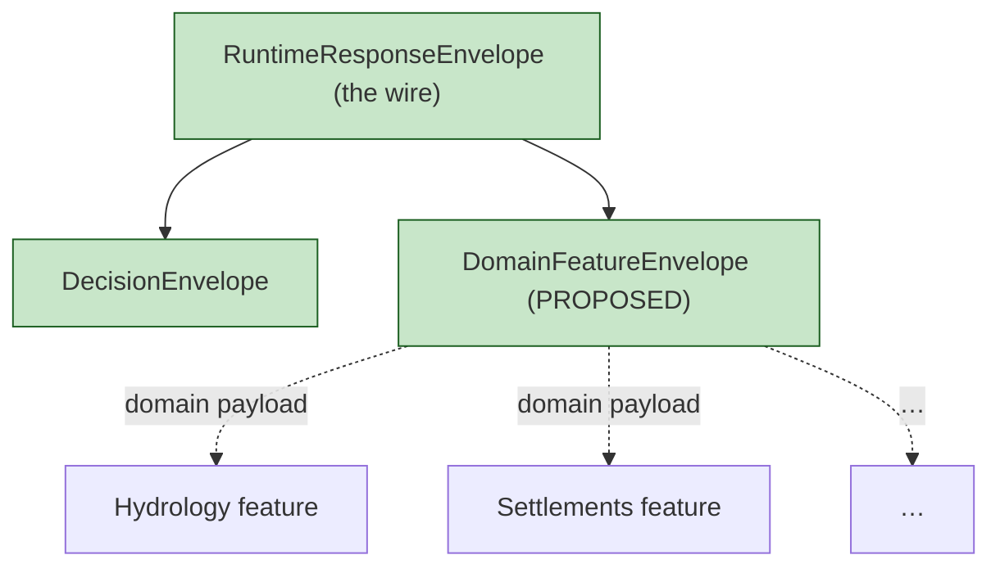

<!-- [KFM_META_BLOCK_V2]
doc_id: kfm://doc/architecture-governed-api-envelopes
title: Governed API — Envelopes
type: standard
version: v0.1
status: draft
owners: API steward + Security steward · NEEDS VERIFICATION
created: 2026-05-24
updated: 2026-05-24
policy_label: public
related:
  - README.md
  - ../governed-api.md
  - ../cross-domain/shared-kernel.md
  - AUDIENCE_CLASSES.md
  - LIFECYCLE_GATES.md
  - ERROR_CODES.md
tags: [kfm, architecture, governed-api, envelopes, runtime-response, doctrine]
notes:
  - PROPOSED. Field-level schemas live in schemas/contracts/v1/runtime/.
  - DomainFeatureEnvelope is PROPOSED — adoption is OPEN ADR.
[/KFM_META_BLOCK_V2] -->

<a id="top"></a>

# Governed API — Envelopes

> *The wire-level envelopes the governed API emits: `RuntimeResponseEnvelope`, `DecisionEnvelope`, `DomainFeatureEnvelope`. Plus the reason-code surface and the error vocabulary entry point.*


-blue)


**Status:** draft · **Owners:** API steward + Security steward *(NEEDS VERIFICATION)* · **Last updated:** 2026-05-24

> [!IMPORTANT]
> **Every endpoint returns a `RuntimeResponseEnvelope`.** Its `outcome` is one of `ANSWER` / `ABSTAIN` / `DENY` / `ERROR`. No silent fallthrough, no partial truths, no implicit nulls *(`governed-api.md` §4, CONFIRMED)*. `DecisionEnvelope` and `DomainFeatureEnvelope` are sub-shapes that ride inside the runtime envelope's `payload` or `policy_decision` slots.

> [!NOTE]
> **This doc is the catalog and the field-level prose contract.** The JSON Schemas live in `schemas/contracts/v1/runtime/`; the OPA rules live in `policy/runtime/`; the contracts of meaning live in `contracts/OBJECT_MAP.md`. This doc tells implementers what each field means and which other doc holds the canonical answer for shape, policy, and meaning.

---

## Table of contents

1. [Scope](#1-scope)
2. [The three envelopes](#2-the-three-envelopes)
3. [`RuntimeResponseEnvelope`](#3-runtimeresponseenvelope)
4. [`DecisionEnvelope`](#4-decisionenvelope)
5. [`DomainFeatureEnvelope` (PROPOSED)](#5-domainfeatureenvelope-proposed)
6. [Reason codes](#6-reason-codes)
7. [Error vocabulary entry](#7-error-vocabulary-entry)
8. [Envelope composition rules](#8-envelope-composition-rules)
9. [Anti-patterns](#9-anti-patterns)
10. [Open questions and ADR triggers](#10-open-questions-and-adr-triggers)
11. [Related docs](#11-related-docs)
12. [Appendix](#12-appendix)

---

## 1. Scope

This doc names the envelopes, lists their fields, and tells implementers how they nest. It does **not** define field-level JSON Schema *(that is in `schemas/contracts/v1/runtime/`)*; it does **not** define Rego *(that is in `policy/runtime/`)*; it does **not** enumerate every error code *(that is in `ERROR_CODES.md`)*.

> [!TIP]
> **When this doc binds.** Authoring a new envelope, evolving an existing one, deciding which envelope slot a new payload type belongs in, or reviewing a route's response shape.

[↑ Back to top](#top)

---

## 2. The three envelopes

> **Evidence basis:** `governed-api.md` §4 *(finite-outcome contract, CONFIRMED)*, §9 *(contracts, schemas, policy table, CONFIRMED)*; `kfm_unified_doctrine_synthesis.md` §11 *(finite outcome envelope, CONFIRMED)*.

| Envelope | Role | Schema home *(PROPOSED)* | Status |
|---|---|---|---|
| **`RuntimeResponseEnvelope`** | The wire envelope every endpoint emits. Always. | `schemas/contracts/v1/runtime/runtime_response_envelope.schema.json` | CONFIRMED |
| **`DecisionEnvelope`** | Pairs `PolicyDecision` with the runtime context that produced it. Nests inside `RuntimeResponseEnvelope.policy_decision` (or is referenced by it). | `schemas/contracts/v1/runtime/decision_envelope.schema.json` | CONFIRMED |
| **`DomainFeatureEnvelope`** | Per-domain feature payload shape that slots inside `RuntimeResponseEnvelope.payload` when the surface is a feature lookup or detail resolution. | `schemas/contracts/v1/runtime/domain_feature_envelope.schema.json` *(PROPOSED)* | PROPOSED |



[↑ Back to top](#top)

---

## 3. `RuntimeResponseEnvelope`

> **Evidence basis:** `governed-api.md` §4 *(envelope sketch, CONFIRMED)*; `kfm_unified_doctrine_synthesis.md` §11.

| Field | Type | Required | Meaning |
|---|---|---|---|
| `object_type` | string literal `"RuntimeResponseEnvelope"` | yes | Disambiguates from sibling kernel objects. |
| `schema_version` | string *(semver-ish)* | yes | Carries breaking-change discipline. |
| `outcome` | enum `ANSWER` · `ABSTAIN` · `DENY` · `ERROR` | yes | The finite-outcome verdict. |
| `evidence_refs` | array of `kfm://evidence/<bundle_id>` URIs | conditional | Required when `outcome == ANSWER`; may be empty / partial otherwise. |
| `policy_decision` | object *(or ref to)* | yes | The `DecisionEnvelope` *(§4)* that justified `outcome`. |
| `release_ref` | string `kfm://release/<manifest_id>` | conditional | Required when `outcome == ANSWER` for released content. |
| `citation_validation` | object | conditional | Carries `CitationValidationReport` ref and `all_resolved` flag when `ANSWER`. |
| `payload` | object | conditional | The substantive payload when `ANSWER`. Shape depends on surface; often `DomainFeatureEnvelope`. |
| `reason` | object | conditional | Reason envelope when `ABSTAIN` / `DENY` / `ERROR`. Carries stable `reason_code` *(§6)*. |
| `trace` | object | yes | At minimum `request_id` and `spec_hash`; optionally `parent_span`. |

**Sketch for each outcome:**

```text
ANSWER:    payload = <substantive>          evidence_refs = [≥1]   release_ref = required
ABSTAIN:   payload = omitted                evidence_refs = [] / partial   reason = { reason_code: "evidence/unresolved" | … }
DENY:      payload = omitted                policy_decision = { decision: "deny", reason_code: … }
ERROR:     payload = omitted                reason = { reason_code: "error/<class>/<detail>" }   (see ERROR_CODES.md)
```

> [!IMPORTANT]
> **No silent fallthrough.** A response missing `outcome` is malformed; the envelope assembler refuses to serialize it. A response with `outcome == ANSWER` but empty `evidence_refs` is malformed; same fate.

[↑ Back to top](#top)

---

## 4. `DecisionEnvelope`

> **Evidence basis:** `governed-api.md` §9 *(object family table, CONFIRMED)*; `kfm_unified_doctrine_synthesis.md` §10.

The envelope that pairs a `PolicyDecision` with the runtime context that produced it. It may nest inside `RuntimeResponseEnvelope.policy_decision` or be referenced by id.

| Field | Type | Required | Meaning |
|---|---|---|---|
| `object_type` | string literal `"DecisionEnvelope"` | yes | — |
| `schema_version` | string | yes | — |
| `decision` | enum `allow` · `deny` · `restrict` · `hold` · `abstain` | yes | The `PolicyDecision`. |
| `reason_code` | string | conditional | Required when `decision != allow`. Stable; see [§6](#6-reason-codes). |
| `policy_ref` | string `kfm://policy/<bundle>` | yes | Pin to the policy bundle that was evaluated. |
| `policy_bundle_hash` | string `b3:<hex>` | yes | Pin to the bundle content; rollback / re-evaluation auditable. |
| `obligations` | array of obligation objects | optional | E.g., `{ "kind": "redact", "spec": "…" }`. |
| `audience_class` | enum *(see `AUDIENCE_CLASSES.md`)* | yes | Class evaluated against. |
| `sensitivity_posture` | enum `public` · `restricted` · `sensitive` · `fail-closed` | yes | Joint posture after invariants applied. |
| `release_state_at_decision` | enum `RAW` · `WORK` · `QUARANTINE` · `PROCESSED` · `PUBLISHED` | yes | Lifecycle state observed at the time. |

> [!TIP]
> **`DecisionEnvelope` is what auditors read.** A `decision != allow` envelope is the canonical artifact of the deny path; reviewers reconstruct what was refused and why from this object.

[↑ Back to top](#top)

---

## 5. `DomainFeatureEnvelope` (PROPOSED)

> **Status:** PROPOSED. Adoption is OPEN ADR.

A per-domain feature payload shape that slots inside `RuntimeResponseEnvelope.payload` when the surface is a feature lookup, detail resolution, or claim resolution.

| Field | Type | Required | Meaning |
|---|---|---|---|
| `object_type` | string literal `"DomainFeatureEnvelope"` | yes | — |
| `schema_version` | string | yes | — |
| `domain` | string | yes | One of the thirteen KFM domains *(see `cross-domain/responsibility-layers.md` §11)*. |
| `feature_id` | string | yes | Stable id of the feature *(domain-scoped namespace)*. |
| `source_role` | enum *(see `cross-domain/source-role-anti-collapse.md` §2.1)* | yes | Carried across the envelope; never collapsed. |
| `sensitivity_posture` | enum | yes | Joint posture after cross-lane invariants. |
| `time` | object | optional | Domain-defined temporal slice if applicable. |
| `geometry_ref` | string | optional | URI to released geometry; never embedded if geometry is sensitive. |
| `attributes` | object | yes | Domain-defined fields *(per-domain schema)*. |
| `evidence_refs` | array of URIs | yes | Refs that support the feature's claims; cite-or-abstain. |
| `representation_receipt_ref` | string | conditional | Required when source role is `synthetic`. |
| `reality_boundary_note` | string | conditional | Required when source role is `synthetic` or includes reconstruction. |

> [!CAUTION]
> **`DomainFeatureEnvelope` does not flatten the four invariants.** Source role, sensitivity, ownership, and evidence are carried at the envelope level so a renderer cannot lose them by ignoring nested fields.

[↑ Back to top](#top)

---

## 6. Reason codes

Reason codes are **short, stable, namespaced identifiers** that surface inside `RuntimeResponseEnvelope.reason.reason_code` and `DecisionEnvelope.reason_code`. They MUST NOT include free text from policy internals or PII.

| Namespace | Used in outcome | Examples |
|---|---|---|
| `evidence/*` | `ABSTAIN` | `evidence/unresolved`, `evidence/stale`, `evidence/inconsistent-bundle` |
| `release/*` | `ABSTAIN`, `DENY` | `release/no-manifest`, `release/state-not-published`, `release/rollback-in-progress` |
| `policy/*` | `DENY` | `policy/sensitivity`, `policy/rights-unknown`, `policy/fail-closed-lane` |
| `auth/*` | `DENY`, `ERROR` | `auth/insufficient-class`, `auth/expired`, `auth/invalid` |
| `rate/*` | `ERROR` | `rate/exhausted` *(see [§7](#7-error-vocabulary-entry))* |
| `schema/*` | `ERROR` | `schema/invalid-request`, `schema/invalid-response` |
| `adapter/*` | `ABSTAIN`, `ERROR` | `adapter/refused`, `adapter/timeout` |
| `ai/*` | `ABSTAIN` | `ai/cite-or-abstain`, `ai/citation-unresolved` |
| `error/*` | `ERROR` | See `ERROR_CODES.md`. |

> [!IMPORTANT]
> **Reason codes are part of the public contract.** Adding, renaming, or retiring a code is a schema-evolution event; see `ERROR_CODES.md` for the discipline.

[↑ Back to top](#top)

---

## 7. Error vocabulary entry

When `outcome == ERROR`, the `reason.reason_code` belongs to the `error/*` namespace and has a structured form `error/<class>/<detail>`. The canonical vocabulary, ranges, and stability discipline live in [`ERROR_CODES.md`](ERROR_CODES.md). This section names the bridge:

| Bridge rule | Detail |
|---|---|
| `ERROR` always carries `reason.reason_code` | `ERROR_CODES.md` enumerates the codes. |
| `payload` MUST be absent on `ERROR` | No partial leakage. |
| `evidence_refs` is empty on `ERROR` | No partial citation. |
| `trace` always present | Operators can correlate. |
| `policy_decision` present | Records audience class and posture observed when error occurred. |

[↑ Back to top](#top)

---

## 8. Envelope composition rules

| Rule | Detail |
|---|---|
| `RuntimeResponseEnvelope` is the only top-level wire shape. | Other envelopes nest. |
| `DecisionEnvelope` nests in `policy_decision` OR is referenced via `kfm://policy/decisions/<id>`. | Reference form lets the audit store own the canonical copy. |
| `DomainFeatureEnvelope` nests in `payload`. | One per feature; arrays of features nest in a list payload. |
| `EvidenceBundle` is NOT inlined. | Refs only; the resolver returns the bundle via `GET /api/v1/evidence/{id}`. |
| `AIReceipt` is NOT inlined in the wire envelope. | Receipts live in `data/receipts/` and are referenced via URI. |
| Composition does not change `outcome` semantics. | A nested envelope cannot promote `ABSTAIN` to `ANSWER`. |

[↑ Back to top](#top)

---

## 9. Anti-patterns

| Anti-pattern | Mitigation |
|---|---|
| **Bare payload returned without envelope** *(legacy adapter habit)* | Envelope assembler is the only serializer; bypass fails review. |
| **`ANSWER` with empty `evidence_refs`** | Envelope schema requires non-empty on `ANSWER`. |
| **`payload` field set on `ABSTAIN` / `DENY` / `ERROR`** | Schema forbids; assembler strips. |
| **Free-text `reason` instead of `reason_code`** | Schema requires the code; free text is forbidden. |
| **`DomainFeatureEnvelope` invented per-domain *(forks)*** | Use the proposed shape; extend via `attributes`, not by forking the envelope. |
| **`DecisionEnvelope` lacking `policy_bundle_hash`** | Required: rollback / re-evaluation auditable. |

[↑ Back to top](#top)

---

## 10. Open questions and ADR triggers

| Open item | Class | Suggested ADR title |
|---|---|---|
| Adopt `DomainFeatureEnvelope` as canonical kernel object. | Object family | "DomainFeatureEnvelope adoption". |
| `DecisionEnvelope` inline vs reference — which is default? | Composition | "DecisionEnvelope inline vs ref". |
| `evidence_refs` cardinality cap on `ANSWER` *(or unbounded)*. | Schema | "EvidenceRef array cardinality". |
| Reason-code namespace registry home — single doc or split per namespace? | Layout | "Reason-code registry layout". |
| Should `trace.spec_hash` equal `policy_bundle_hash` to simplify replay? | Consistency | "spec_hash vs policy_bundle_hash". |

[↑ Back to top](#top)

---

## 11. Related docs

| Reference | Role | Truth label |
|---|---|---|
| `README.md` *(this folder)* | Landing | CONFIRMED doctrine |
| `../governed-api.md` §4, §9 | Doctrine spine and object-family table | CONFIRMED doctrine |
| `../cross-domain/shared-kernel.md` §5, §7 | Kernel-level definitions | CONFIRMED doctrine |
| `AUDIENCE_CLASSES.md` | `DecisionEnvelope.audience_class` enum | PROPOSED |
| `LIFECYCLE_GATES.md` | `DecisionEnvelope.release_state_at_decision` enum | PROPOSED |
| `ERROR_CODES.md` | `error/*` namespace canonical | PROPOSED |
| `kfm_unified_doctrine_synthesis.md` §11 | Finite outcome envelope | CONFIRMED doctrine |
| `contracts/OBJECT_MAP.md` | Object meaning | CONFIRMED doctrine *(PROPOSED path)* |
| `schemas/contracts/v1/runtime/runtime_response_envelope.schema.json` | Envelope shape | PROPOSED |

[↑ Back to top](#top)

---

## 12. Appendix

<details>
<summary><strong>12.1 Envelope quick-reference card</strong></summary>

```text
RuntimeResponseEnvelope
├── object_type · schema_version · outcome
├── evidence_refs[]      (ANSWER: ≥1)
├── policy_decision      (DecisionEnvelope or ref)
├── release_ref          (ANSWER for released content)
├── citation_validation  (ANSWER)
├── payload              (ANSWER; often DomainFeatureEnvelope)
├── reason               (ABSTAIN/DENY/ERROR; reason_code from §6)
└── trace                (always)

DecisionEnvelope
├── decision · reason_code
├── policy_ref · policy_bundle_hash
├── obligations[]
├── audience_class · sensitivity_posture
└── release_state_at_decision

DomainFeatureEnvelope (PROPOSED)
├── domain · feature_id · source_role
├── sensitivity_posture · time?
├── geometry_ref? · attributes
├── evidence_refs[]
└── representation_receipt_ref? · reality_boundary_note?
```

</details>

<details>
<summary><strong>12.2 Truth-label legend</strong></summary>

- **CONFIRMED** — verified this session from attached docs.
- **PROPOSED** — design / placement / inference not yet verified in implementation.
- **INFERRED** — derivable from confirmed evidence but not directly stated.
- **NEEDS VERIFICATION** — checkable, but not yet checked strongly enough to act as fact.

</details>

---

**Related (mini)** · [`README.md`](README.md) · [`../governed-api.md`](../governed-api.md) · [`AUDIENCE_CLASSES.md`](AUDIENCE_CLASSES.md) · [`LIFECYCLE_GATES.md`](LIFECYCLE_GATES.md) · [`ERROR_CODES.md`](ERROR_CODES.md) · [`THREAT_MODEL.md`](THREAT_MODEL.md)

**Last updated:** 2026-05-24 · **Doc version:** v0.1 · **Doc status:** draft · **Path status:** PROPOSED *(OPEN-DR-12 META)*

[↑ Back to top](#top)
