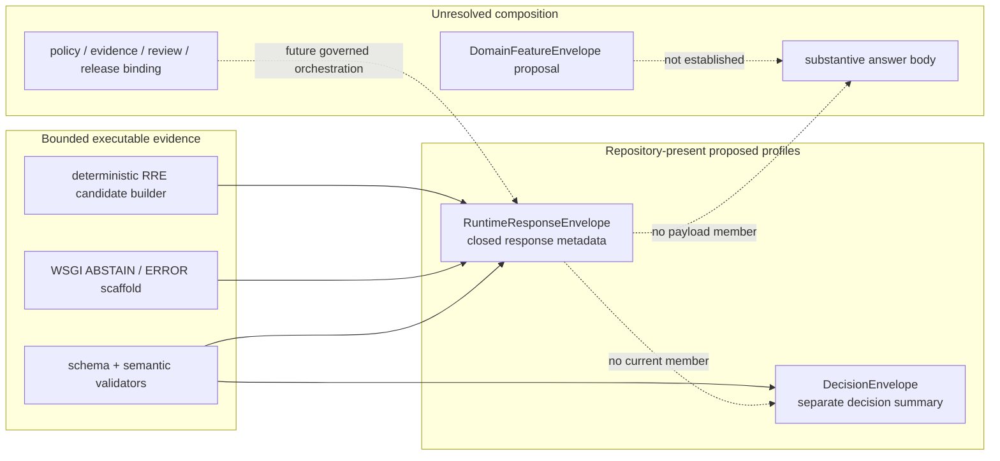
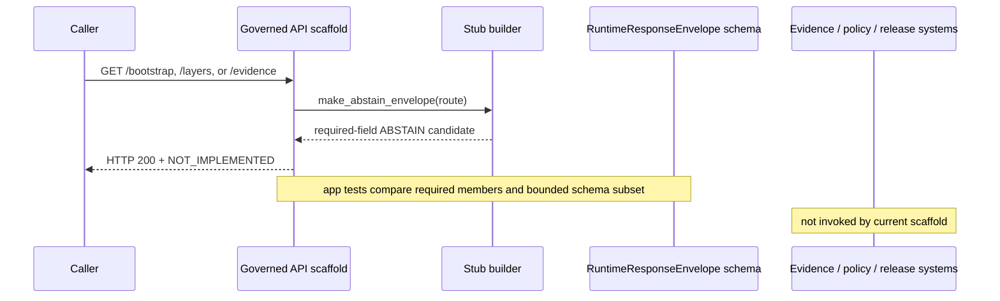

<!-- [KFM_META_BLOCK_V2]
doc_id: kfm://doc/architecture-governed-api-envelopes
title: Governed API — Envelopes
type: architecture-standard
version: v0.2
status: draft; repository-grounded; mixed-maturity; profile-conflicted; non-authoritative
maturity: bounded executable candidates and schema-shaped scaffold; no governed ANSWER transport
owners:
  - "@bartytime4life — verified CODEOWNERS review route"
  - "NEEDS VERIFICATION — governed API maintainer"
  - "NEEDS VERIFICATION — runtime and envelope package steward"
  - "NEEDS VERIFICATION — contract, schema, evidence, policy, security, correction, and release reviewers"
created: 2026-05-24
updated: 2026-08-19
policy_label: public
truth_posture: cite-or-abstain
responsibility_root: docs/
owning_root: docs/
current_path: docs/architecture/governed-api/ENVELOPES.md
responsibility: "Explain the current Governed API envelope families, actual contract and schema profiles, bounded executable candidate and scaffold behavior, composition gaps, reason-code conflicts, and graduation evidence without becoming semantic, schema, policy, runtime, release, or publication authority."
authority_class: explanatory architecture guidance
authority_limit: "This document does not define object meaning or machine shape, execute policy, resolve evidence, authenticate review, authorize an answer, create release state, configure HTTP transport, deploy a service, or publish a KFM claim."
canonical_relationship: "CONFIRMED existing same-path companion under docs/architecture/governed-api/; field meaning remains in contracts/, shape in schemas/, behavior in implementation and tests, and admissibility in policy/."
evidence_snapshot:
  repository: bartytime4life/Kansas-Frontier-Matrix
  base_ref: main
  base_commit: d2214bd46e78d3758b2a084a62b60eacaa98e170
  target_prior_blob: 0e518123aab1298a5430b8458808bc9c00072df5
  directory_rules_blob: fd49a0b83e55cef52c1124281f093e263526898d
  adr_0029_blob: a4de0d7a96b78da59cfc499d1025e1508afd8dd9
  adr_0004_blob: f2737900569447e8e20c8ce12b275167724b0cc5
  adr_0019_blob: 5c45cbaf0aae510638088913757634ea978c9ec3
  codeowners_blob: dd2a84aa514d8ecd9208bc347f90f9a2ed37dd61
  parent_readme_blob: 09f9f95ce7400055b8018f9f159796ac35959fbb
  audience_classes_blob: 28662c84ac1347cd63f0246fc47d418f76b7ec0b
  runtime_response_contract_blob: 5060aaaa30fea37b6eeea6e1428b9effa6a163bd
  runtime_response_schema_blob: 8b86e7db8b18b65a56a4e639dfc54e1b2db93155
  decision_envelope_contract_blob: b5120a208910f5e2907874b03af1fc8c7f43363d
  decision_envelope_schema_blob: 349782c8760f77e432ed1e9239d5ddc2ffe1f9b8
  evidence_ref_schema_blob: 42f499df613a9d68e5ca6fc5ec75ff8058c155b9
  runtime_response_builder_blob: 5dacededc1bda64292259ba39b6387facafbd1e8
  runtime_response_builder_test_blob: b8524a2243fcf3495c06aef62d5deba737c1acff
  runtime_response_validator_blob: 44ce7d51038a9adf9fcbdb18108cc27da8381e33
  decision_envelope_validator_blob: 76c2efaa65ece5bf4b2b727c40166e9d7e36f4bf
  governed_api_main_blob: 4eb335c7c0b27f62c7419c478542e8fe40e1ff38
  governed_api_registry_blob: 3418168d0b267160d6ad6dd87f289e880ef4a024
  governed_api_stub_blob: 371e60d9f96c78e31c8a1e6109d19dee5da4213b
  governed_api_route_test_blob: 2be20f5d93c03da7677c34b11a31875a00b2ed28
  governed_api_boundary_test_blob: 4035e537e6c52194928df5ab8ceb41a35f5f30ca
  http_binding_contract_blob: bccf51983d1818e74528b83d1f8f425488608d1e
  focus_alias_schema_blob: f83a7256913cfb9585067bf0b2c470e599dc01ea
inspection_boundary: >-
  Current-session GitHub reads covered the complete prior page, the governed-API
  parent boundary, current audience reconciliation, proposed ADR-0004 and
  ADR-0019 records, runtime contracts and schemas, EvidenceRef shape, validators,
  deterministic candidate builder and tests, Governed API WSGI scaffold and
  tests, the inactive HTTP binding, the focus compatibility alias, and bounded
  repository searches for DomainFeatureEnvelope and open target-path overlap.
  No mounted checkout, local repository-native command, live EvidenceRef resolver,
  policy evaluator, review service, release registry, receipt store, deployed API,
  browser transport, operational log, dashboard, or public request was exercised.
related:
  - README.md
  - README.md
  - AUDIENCE_CLASSES.md
  - LIFECYCLE_GATES.md
  - ERROR_CODES.md
  - THREAT_MODEL.md
  - ../../adr/ADR-0004-apps-governed-api-is-the-trust-membrane.md
  - ../../adr/ADR-0019-ai-adapter-contract-and-finite-envelopes.md
  - ../../adr/ADR-0029-adopt-directory-governance-standard-v2.md
  - ../../doctrine/directory-rules.md
  - ../../../contracts/runtime/runtime_response_envelope.md
  - ../../../contracts/runtime/decision_envelope.md
  - ../../../contracts/runtime/precision_actually_used.md
  - ../../../contracts/runtime/runtime_response_http_binding_v1.md
  - ../../../schemas/contracts/v1/runtime/runtime_response_envelope.schema.json
  - ../../../schemas/contracts/v1/runtime/decision_envelope.schema.json
  - ../../../packages/envelopes/src/envelopes/runtime_response.py
  - ../../../apps/governed-api/src/governed_api/stub.py
tags: [kfm, architecture, governed-api, envelopes, runtime-response, decision-envelope, finite-outcomes, evidence, precision, reason-codes, trust-membrane, repository-grounded]
notes:
  - "v0.2 replaces proposal-era nesting and wire-shape claims with current repository evidence."
  - "The RuntimeResponseEnvelope and DecisionEnvelope are separate closed proposed profiles; the current RuntimeResponseEnvelope schema has no payload, nested DecisionEnvelope, release_ref, citation_validation, reason object, or trace member."
  - "The Governed API scaffold emits schema-shaped ABSTAIN and ERROR objects for three registered GET routes plus 404/405 failures; this is bounded fail-closed behavior, not a governed ANSWER path."
  - "DomainFeatureEnvelope remains proposal lineage; no paired contract, schema, validator, fixture family, or implementation was found in the bounded search."
  - "Reason-code grammar is conflicted among the permissive RuntimeResponseEnvelope field, upper-snake executable literals, DecisionEnvelope semantic validation, and the slash-namespaced ERROR_CODES proposal."
  - "This same-path documentation update changes no contract, schema, policy, fixture, validator, test, workflow, package, app, route, runtime, release, deployment, or publication behavior."
[/KFM_META_BLOCK_V2] -->

<a id="top"></a>

# Governed API — Envelopes

> **Operating boundary.** KFM has two repository-present, closed, proposed runtime-envelope profiles and bounded executable proof around one of them. It does **not** currently have the three-envelope nested wire model described by this page's prior edition, nor a released, evidence-resolving `ANSWER` transport.

[](#status-and-authority)
[](#directory-rules-basis)
[](#3-runtimeresponseenvelope)
[](#4-decisionenvelope)
[](#5-domainfeatureenvelope-proposed)
[](#8-envelope-composition-rules)
[](#current-runtime-boundary)
[](#status-and-authority)

> [!IMPORTANT]
> **The machine profile outranks architecture sketches for field shape.** The current `RuntimeResponseEnvelope` schema permits ten required top-level members plus one `ANSWER`-only precision disclosure. It does not permit `payload`, `policy_decision`, `release_ref`, `citation_validation`, a nested `reason`, or `trace`. The current `DecisionEnvelope` is a separate closed object; no current RuntimeResponseEnvelope member nests or references it.

> [!CAUTION]
> **A schema-shaped response is not a complete trust membrane.** The WSGI scaffold returns deterministic `ABSTAIN / NOT_IMPLEMENTED` bodies for `/bootstrap`, `/layers`, and `/evidence`, and bounded `ERROR / SAFE_RUNTIME_ERROR` bodies for 404/405 paths. Those objects exercise the current RuntimeResponseEnvelope field set, but they do not resolve evidence, evaluate policy, authenticate review, bind release state, emit durable receipts, or provide a substantive `ANSWER`.

> [!WARNING]
> **Reason-code and transport vocabularies are not converged.** The current RuntimeResponseEnvelope accepts an unconstrained string, the app uses upper-snake literals, the DecisionEnvelope validator expects upper-snake when `reason_code` is present, and [`ERROR_CODES.md`](ERROR_CODES.md) proposes lower-case slash namespaces and a nested reason object that the current RuntimeResponseEnvelope schema forbids.

**Quick navigation:** [Status](#status-and-authority) · [Scope](#1-scope) · [Families](#2-the-three-envelopes) · [Runtime response](#3-runtimeresponseenvelope) · [Decision](#4-decisionenvelope) · [Domain feature](#5-domainfeatureenvelope-proposed) · [Reasons](#6-reason-codes) · [Errors/HTTP](#7-error-vocabulary-entry) · [Composition](#8-envelope-composition-rules) · [Anti-patterns](#9-anti-patterns) · [Open work](#10-open-questions-and-adr-triggers) · [Related](#11-related-docs) · [Appendix](#12-appendix)

---

<a id="status-and-authority"></a>

## Status and authority

| Question | Current evidence-backed answer |
|---|---|
| Does this document exist at the stated path? | **CONFIRMED.** It is tracked at `docs/architecture/governed-api/ENVELOPES.md`. |
| Is the path still merely proposed under `OPEN-DR-12`? | **No.** Accepted ADR-0029 adopts Directory Rules v2; this existing human architecture lane is valid. |
| Is this page the semantic or machine authority? | **No.** Meaning belongs in `contracts/`; machine shape belongs in `schemas/`; this page explains and crosswalks them. |
| Is `RuntimeResponseEnvelope` present? | **CONFIRMED / PROPOSED profile.** Contract, closed schema, fixtures, validator, deterministic builder, tests, and schema-shaped app stubs exist. |
| Is `DecisionEnvelope` present? | **CONFIRMED / PROPOSED profile.** Contract, closed schema, fixtures, and a bounded semantic validator exist. |
| Is `DomainFeatureEnvelope` present as a governed object family? | **NOT ESTABLISHED.** The bounded search found proposal references but no paired contract, schema, validator, fixture family, or implementation. |
| Are the two present envelope profiles machine-composed? | **No current composition field.** They are separate closed objects. |
| Does the current RuntimeResponseEnvelope carry substantive content? | **No current `payload` member.** It carries outcome and trust-state metadata; a governed answer-body composition remains unresolved. |
| Does the current app emit schema-shaped envelopes? | **CONFIRMED bounded.** Tests compare required members, reject extras, and exercise ABSTAIN and ERROR scaffold responses. |
| Is a live governed `ANSWER` path proved? | **No / HOLD.** No inspected route resolves evidence, policy, review, release, correction, or a substantive answer body. |
| Does this documentation change release or publication state? | **No.** It explains repository evidence only. |

<a id="directory-rules-basis"></a>

### Directory Rules basis

Accepted [ADR-0029](../../adr/ADR-0029-adopt-directory-governance-standard-v2.md) adopts the current [Directory Rules](../../doctrine/directory-rules.md). This is a same-path update to an existing human architecture document under `docs/architecture/governed-api/`. Placement outcome: **PLACE**.

| Responsibility | Owning surface | This page's role |
|---|---|---|
| Human architecture explanation | `docs/architecture/governed-api/` | Explain current profiles, behavior, conflicts, and HOLDs. |
| Semantic meaning | [`contracts/runtime/`](../../../contracts/runtime/) | Link and summarize; never override. |
| Machine shape | [`schemas/contracts/v1/runtime/`](../../../schemas/contracts/v1/runtime/) | Report exact current members and conditional rules. |
| Reusable envelope construction | [`packages/envelopes/`](../../../packages/envelopes/) | Report bounded candidate behavior; do not turn it into authority. |
| Runtime wiring | [`runtime/envelopes/`](../../../runtime/envelopes/) | Coordinate runtime handoff; current README contains stale snapshot claims. |
| Governed serialization | [`apps/governed-api/`](../../../apps/governed-api/) | Report actual scaffold behavior and limits. |
| Admissibility and obligations | `policy/` | Keep separate; no policy execution is inferred. |
| Fixtures, validation, and tests | `fixtures/`, `tools/validators/`, `tests/` | Cite bounded executable proof only. |
| Receipts, review, release, correction, rollback | Their distinct governed homes | Never collapse them into an envelope or a passing check. |

[Back to top](#top)

---

<a id="1-scope"></a>

## 1. Scope

This document answers six bounded questions:

1. Which envelope-related object families are actually present?
2. What fields do their current paired schemas permit?
3. What behavior is executable today, and what does that behavior prove?
4. Which proposal-era nesting, payload, reason, and transport claims conflict with current repository evidence?
5. What remains before a substantive, evidence-backed Governed API response can be represented as implemented?
6. Which changes would be ordinary compatibility work and which require a reviewed profile or ADR decision?

This document does **not**:

- redefine either semantic contract;
- copy or fork a JSON Schema;
- establish reason-code, policy-state, freshness, correction-state, or obligation vocabularies;
- define a domain feature payload;
- choose inline versus reference composition;
- activate policy or evidence resolution;
- establish authentication, authorization, audience, rate-limit, or reviewer identity;
- add a route or HTTP binding;
- approve `ANSWER`, release, deployment, publication, or public use.

> [!TIP]
> **Use this page when** reviewing an API response change, adding or consuming a finite-outcome object, evaluating whether an architecture sketch matches the current schema, deciding whether a new field belongs in an existing profile, or preparing a separately reviewed profile migration.

### 1.1 Authority order for an envelope claim

| Claim | Controlling evidence |
|---|---|
| What an object means | Its semantic contract under `contracts/runtime/` |
| Which JSON members are valid | Its paired schema under `schemas/contracts/v1/runtime/` |
| Which local semantic constraints run | Its named validator and focused tests |
| What the current app emits | Pinned app code plus app-local tests |
| What a provider or adapter emits | Pinned implementation plus focused runtime tests and receipts |
| Whether a response may be served | Evidence, policy, review, release, correction, and deployment evidence |
| Whether an architecture page is current | Reconciliation against all of the above |

A diagram, example, README, ADR proposal, generated receipt, green schema check, pull request, merge, or deployed process cannot silently add fields to a closed schema or create release authority.

[Back to top](#top)

---

<a id="2-the-three-envelopes"></a>

## 2. The three envelopes

The prior edition called three names one nested wire system. Current evidence supports a different register:

| Name | Current repository status | Current role | Safe conclusion |
|---|---|---|---|
| [`RuntimeResponseEnvelope`](../../../contracts/runtime/runtime_response_envelope.md) | **CONFIRMED contract + closed schema; status PROPOSED; bounded executable builder and app scaffold** | Client-facing finite outcome and disclosed trust-state metadata | Current primary response profile; no substantive payload member |
| [`DecisionEnvelope`](../../../contracts/runtime/decision_envelope.md) | **CONFIRMED contract + closed schema; status PROPOSED; bounded validator** | Separate policy-family decision summary with reasons and obligations | Not nested by the current RuntimeResponseEnvelope schema |
| `DomainFeatureEnvelope` | **PROPOSAL LINEAGE / NOT ESTABLISHED** | Prior proposed domain-detail payload wrapper | No current profile should be inferred or emitted |
| [`AIReceipt`](../../../contracts/runtime/ai_receipt.md) | **Separate proposed accountability family** | Records model/runtime execution accountability | Not a response envelope and not evidence, proof, or release |
| [`RuntimeResponseEnvelope HTTP Binding v1`](../../../contracts/runtime/runtime_response_http_binding_v1.md) | **PROPOSED_INACTIVE / fixture-only** | Candidate mapping between HTTP status and finite outcome | Does not describe current app behavior and grants no route authority |


```mermaid
flowchart LR
  subgraph PRESENT["Repository-present proposed profiles"]
    RRE["RuntimeResponseEnvelope<br/>closed response metadata"]
    DE["DecisionEnvelope<br/>separate decision summary"]
  end

  subgraph EXECUTABLE["Bounded executable evidence"]
    B["deterministic RRE candidate builder"]
    S["WSGI ABSTAIN / ERROR scaffold"]
    V["schema + semantic validators"]
  end

  subgraph HELD["Unresolved composition"]
    P["substantive answer body"]
    DFE["DomainFeatureEnvelope proposal"]
    REL["policy / evidence / review / release binding"]
  end

  B --> RRE
  S --> RRE
  V --> RRE
  V --> DE
  RRE -. "no current member" .-> DE
  RRE -. "no payload member" .-> P
  DFE -. "not established" .-> P
  REL -. "future governed orchestration" .-> RRE
```

### 2.1 Current profile separation

| Axis | RuntimeResponseEnvelope | DecisionEnvelope |
|---|---|---|
| Identity | `id`, `spec_hash`, `version`, `issued_at` | `decision_id`; optional `id`, `spec_hash`, `version`, `issued_at` |
| Finite outcome | Required uppercase four-value `outcome` | Required uppercase four-value `outcome`; optional matching `decision` alias |
| Evidence | Array of closed `EvidenceRef` objects | Optional array of bounded string references |
| Policy representation | Required opaque `policy_state` string | Required `policy_family`; reasons and obligations |
| Freshness/correction | Required opaque strings | Not part of current schema |
| Precision | Required only for `ANSWER`; forbidden otherwise | Not part of current schema |
| Payload | Not permitted | Not permitted |
| Cross-envelope reference | Not permitted | Not permitted |
| Release reference | Not permitted | Not permitted |

These differences are current profile facts, not recommendations. A future unification or composition layer must be explicit, versioned, tested, and reviewed; documentation cannot invent compatibility.

[Back to top](#top)

---

<a id="3-runtimeresponseenvelope"></a>

## 3. `RuntimeResponseEnvelope`

### 3.1 Current machine profile

The paired schema is Draft 2020-12, closed with `additionalProperties: false`, and marked `PROPOSED`. Its top-level shape is:

| Field | Type | Required | Current constraint and meaning boundary |
|---|---|---:|---|
| `id` | string | yes | Non-empty response identity; the reusable builder applies a narrower lower-case identifier grammar. |
| `spec_hash` | string | yes | Lower-case `sha256:` plus 64 hex characters. This is a declared pin, not proof that a release or policy bundle was authenticated. |
| `version` | string | yes | Non-empty profile/version declaration; the schema does not enforce SemVer. |
| `issued_at` | date-time string | yes | Offset-aware issue time in the builder; date-time format in the schema. |
| `outcome` | enum | yes | Exactly `ANSWER`, `ABSTAIN`, `DENY`, or `ERROR`. |
| `reason_code` | string | yes | Non-empty only at schema level; no canonical grammar is enforced by this schema. |
| `evidence_refs` | array | yes | Zero to 128 unique `EvidenceRef` objects; `ANSWER` raises the minimum to one. |
| `policy_state` | string | yes | Opaque non-empty declaration. No accepted vocabulary or live policy evaluation follows from it. |
| `freshness` | string | yes | Opaque non-empty declaration. No freshness calculation follows from it. |
| `correction_state` | string | yes | Opaque non-empty declaration. No correction registry lookup follows from it. |
| `precision_actually_used` | closed object | conditional | Required for `ANSWER`; forbidden for every negative outcome. |

The following prior-edition members are **not valid** in the current profile:

```text
object_type
schema_version
policy_decision
release_ref
citation_validation
payload
reason
trace
```

Adding any of them directly would fail the closed schema. Their concepts may still matter to a future transport or response-bundle design, but they are not current RuntimeResponseEnvelope fields.

### 3.2 `EvidenceRef` shape

Each current RuntimeResponseEnvelope evidence item is an object, not a bare URI string:

| Field | Required | Current constraint |
|---|---:|---|
| `ref` | yes | String; identifier grammar remains outside the base schema. |
| `kind` | yes | `measurement`, `record`, `dataset`, or `artifact`. |
| `bundle_ref` | no | Optional string pointing toward bundle context. |
| Any other member | — | Forbidden. |

> [!IMPORTANT]
> An `EvidenceRef` object is not an `EvidenceBundle`, citation validation result, proof, or assertion that the referenced material is admissible. Resolution remains a separate governed operation.

### 3.3 `precision_actually_used`

`ANSWER` must disclose the precision actually used, rather than implying the requested precision was available.

| Dimension | Required members | Current bounded rules |
|---|---|---|
| Spatial | `representation`, `resolution`, `accuracy`, `generalization_applied` | Representation is one of `point`, `line`, `polygon`, `grid`, `raster`, `aggregate`, or `none`. |
| Temporal | `granularity`, `observation_interval`, `freshness_class` | Interval has date-time `start` and `end`; semantic validator rejects inversion. |
| Attribute | `measure`, `unit`, `significant_precision`, `classification_granularity` | Significant precision is 0–12; classification granularity may be null. |
| Requested precision | Optional `spatial`, `temporal`, and/or `attribute` strings | Records a request/actual distinction; no fulfillment claim is inferred. |
| Evidence support | Non-empty `evidence_refs` | Every precision EvidenceRef must also appear at the envelope top level. |
| Transform lineage | `transform_receipt_refs` | A generalized spatial answer requires at least one bounded receipt reference. |

### 3.4 Outcome invariants

| Outcome | Evidence requirement | Precision disclosure | Current payload behavior |
|---|---|---|---|
| `ANSWER` | At least one top-level EvidenceRef | Required | No substantive payload member exists in this profile |
| `ABSTAIN` | May be empty | Forbidden | Finite negative metadata only |
| `DENY` | May be empty at schema level | Forbidden | Finite negative metadata only |
| `ERROR` | May be empty at schema level | Forbidden | Finite negative metadata only |

The absence of a payload member is material. The current profile can represent that KFM reached an `ANSWER`-eligible finite outcome and what evidence/precision declarations accompanied it, but the schema by itself does not define where a claim, feature, narrative, or result body lives.

### 3.5 Current bounded executable evidence

| Surface | CONFIRMED behavior | Authority limit |
|---|---|---|
| `packages/envelopes/src/envelopes/runtime_response.py` | Builds a deterministic candidate from explicit inputs; validates bounded fields, EvidenceRefs, finite outcomes, precision subset, receipt requirement, and time order. | Does not resolve evidence, evaluate policy, compute freshness or precision, mutate correction, authorize release, or create a public response. |
| Package export | `build_runtime_response_candidate`, outcome set, EvidenceRef-kind set, and safe error type are exported. | Export presence is not profile acceptance or API integration. |
| Focused package test | Exercises all four outcomes, full schema validation, deterministic defensive copying, invalid inputs, evidence/precision rules, and absence of authority/payload fields. | Synthetic no-network proof only. |
| Dedicated validator | Runs full schema checks plus precision evidence-subset, generalization-receipt, and temporal-order semantics. | Local conformance only; no evidence, policy, review, or release resolution. |
| Fixture family | Four valid finite-outcome examples plus documented invalid lanes are present. | Fixture coverage is not production behavior. |
| Focus schema alias | `schemas/contracts/v1/focus/runtime_response_envelope.schema.json` references the canonical runtime schema. | Compatibility alias only; it does not define a second profile. |

<a id="current-runtime-boundary"></a>

### 3.6 Current Governed API scaffold

The current WSGI app registers exactly:

```text
GET /bootstrap
GET /layers
GET /evidence
```

For registered GET routes, the app emits:

```json
{
  "id": "stub:<route>",
  "spec_hash": "sha256:<64 lower-case hex characters>",
  "version": "v1-stub",
  "issued_at": "<offset-aware date-time>",
  "outcome": "ABSTAIN",
  "reason_code": "NOT_IMPLEMENTED",
  "evidence_refs": [],
  "policy_state": "baseline",
  "freshness": "current",
  "correction_state": "none"
}
```

Unknown routes and unsupported methods return the same required-field set with `outcome: ERROR` and `reason_code: SAFE_RUNTIME_ERROR`, using HTTP 404 or 405 respectively.

App-local tests:

- compare every response's member set with the schema's required members;
- invoke the repository's bounded schema-subset assertion;
- prove the three-route manifest;
- prove deterministic injected time;
- reject DecisionEnvelope members and answer-only precision on the negative stubs;
- reject selected renderer/model imports and hard-coded internal lifecycle-store path literals.

They do **not** prove authentication, authorization, rate limiting, EvidenceRef resolution, accepted policy execution, review authority, release binding, substantive answer composition, receipt persistence, deployment isolation, or public operation.

[Back to top](#top)

---

<a id="4-decisionenvelope"></a>

## 4. `DecisionEnvelope`

### 4.1 Current machine profile

The paired schema is a separate Draft 2020-12 closed object marked `PROPOSED`.

| Field | Type | Required | Current constraint |
|---|---|---:|---|
| `decision_id` | string | yes | Stable decision identity. |
| `outcome` | enum | yes | `ANSWER`, `ABSTAIN`, `DENY`, or `ERROR`. |
| `policy_family` | enum | yes | `promotion`, `access`, `render`, `capability`, `consent`, or `sensitivity`. |
| `reasons` | array of strings | yes | At least one reason string in the schema; validator adds bounded-clean-text and uniqueness checks. |
| `obligations` | array of strings | yes | May be empty; validator adds bounded-clean-text and uniqueness checks. |
| `evaluated_at` | date-time string | yes | Decision evaluation time. |
| `id` | string | no | Compatibility identity. |
| `decision` | enum | no | Compatibility alias using the same uppercase four outcomes; validator requires it to match `outcome`. |
| `reason_code` | string | no | Schema accepts a string; validator requires upper-snake grammar when present. |
| `evidence_refs` | array of strings | no | Separate string-reference profile; validator canonicalizes and blocks selected internal prefixes/leakage. |
| `spec_hash` | string | no | Validator applies lower-case SHA-256 grammar. |
| `version` | string | no | Validator applies SemVer syntax. |
| `issued_at` | date-time string | no | Validator rejects issue time before evaluation time. |

### 4.2 What the current DecisionEnvelope is not

It is not:

- the nested `policy_decision` member of RuntimeResponseEnvelope;
- a `PolicyDecision`;
- a `PromotionDecision`;
- a release approval;
- a reviewer identity or completed `ReviewRecord`;
- an audience grant;
- a source-admission decision;
- a proof that policy actually executed;
- a public explanation of protected policy internals.

The prior edition's fields are not part of the current schema:

```text
object_type
schema_version
policy_ref
policy_bundle_hash
audience_class
sensitivity_posture
release_state_at_decision
```

Likewise, the prior lowercase decision vocabulary—`allow`, `deny`, `restrict`, `hold`, `abstain`—does not match the current uppercase four-outcome profile.

### 4.3 Bounded validator behavior

The current validator adds semantic checks beyond schema shape, including:

- optional alias equals `outcome`;
- reasons and obligations are bounded, unique, and credential-marker safe;
- EvidenceRef strings are sorted, unique, use a bounded grammar, and do not expose selected internal/lifecycle prefixes;
- `DENY` and `ERROR` do not expose evidence references;
- optional `issued_at` does not precede `evaluated_at`;
- optional `spec_hash`, `version`, `reason_code`, and compatibility `id` follow local grammars.

A passing validator result does not prove a policy engine ran or that the decision may authorize an operation.

### 4.4 Relationship to RuntimeResponseEnvelope

Current relationship: **conceptual only**.

There is no current RuntimeResponseEnvelope field that:

- inlines a DecisionEnvelope;
- references a DecisionEnvelope;
- proves `policy_state` was derived from one;
- binds the two identities, hashes, issue times, reasons, or outcomes.

Any future binding must define identity, lifecycle, reference integrity, outcome coherence, disclosure, redaction, correction, and rollback rules. Until then, implementers must not manufacture a hidden or ad hoc nesting convention.

[Back to top](#top)

---

<a id="5-domainfeatureenvelope-proposed"></a>

## 5. `DomainFeatureEnvelope` (PROPOSED)

### 5.1 Current determination

`DomainFeatureEnvelope` is retained as proposal lineage because the prior edition and an API atlas mention the name. The bounded current search did **not** establish:

- a semantic contract under `contracts/`;
- a canonical schema under `schemas/contracts/v1/`;
- valid and invalid fixtures;
- a validator;
- a package implementation;
- a Governed API serializer or route;
- an accepted ADR;
- a released instance or public consumer.

Therefore, this document does not publish a field table for it as though one exists.

### 5.2 Why the prior field sketch is not current authority

The prior sketch combined domain identity, source role, sensitivity, time, geometry, attributes, EvidenceRefs, representation receipts, and reality-boundary notes. Those are legitimate KFM concerns, but combining them in prose does not settle:

- whether the object is a response payload, domain object, map projection, or claim projection;
- whether shared fields belong in a common envelope or in domain contracts;
- whether geometry is embedded, referenced, generalized, or omitted;
- which source-role and sensitivity vocabularies are accepted;
- how evidence, release, correction, and representation receipts bind;
- whether a single cross-domain shape would erase bounded-context distinctions.

### 5.3 Disposition options

A reviewed decision may choose one of these paths without creating parallel authority:

| Option | Effect | Required evidence |
|---|---|---|
| Retire the name | Use existing domain contracts and a separately versioned transport composition. | Consumer inventory, link repair, supersession note, rollback. |
| Define a shared projection contract | Create a narrowly scoped semantic profile under the existing contract/schema split. | Bounded-context review, exact field ownership, closed schema, fixtures, validator, consumer proof. |
| Use domain-specific payloads | Let each domain own a projection while a separate response-bundle profile identifies the payload type. | Shared discrimination rule, no field drift, cross-domain compatibility tests. |
| Reuse an existing object family | Map the need to a current feature, map-context, evidence-drawer, or claim projection. | Semantic equivalence proof; no silent field loss. |

### 5.4 HOLD conditions

Do not implement or serialize `DomainFeatureEnvelope` while any of these remain unresolved:

- its responsibility and bounded context;
- its relationship to RuntimeResponseEnvelope;
- payload/body composition;
- domain/source-role/sensitivity vocabularies;
- evidence and release binding;
- public-safe geometry and field projection;
- correction and supersession behavior;
- compatibility and versioning;
- qualified human review.

[Back to top](#top)

---

<a id="6-reason-codes"></a>

## 6. Reason codes

### 6.1 Current vocabulary conflict

No single current source establishes one global reason-code grammar.

| Surface | Current rule or observed value | Status |
|---|---|---|
| RuntimeResponseEnvelope schema | Any non-empty string | **PROPOSED machine shape; grammar unconstrained** |
| RuntimeResponseEnvelope builder | Any non-empty string | **Bounded local check** |
| Governed API scaffold | `NOT_IMPLEMENTED`, `SAFE_RUNTIME_ERROR` | **CONFIRMED executable literals** |
| Package tests | Examples such as `FIXTURE_ONLY` | **CONFIRMED synthetic usage** |
| DecisionEnvelope schema | Optional string | **PROPOSED machine shape; grammar unconstrained** |
| DecisionEnvelope validator | Upper snake case, up to 64 characters | **CONFIRMED local semantic rule** |
| `ERROR_CODES.md` | Lower-case slash form such as `error/schema/invalid-response`; nested reason fields | **PROPOSED architecture vocabulary; conflicts with current RuntimeResponseEnvelope shape** |
| Inactive HTTP-binding profile | Separate failure-class literals | **PROPOSED_INACTIVE / fixture-only** |

### 6.2 Safe current interpretation

A current `reason_code` is:

- a bounded response discriminator;
- not a substitute for `outcome`;
- not proof of policy execution;
- not a license to expose internal diagnostics;
- not automatically stable across clients unless a reviewed profile says so;
- not evidence, a receipt, or a correction record.

### 6.3 Minimum safety rules

Even before a canonical registry is adopted:

1. Do not include credentials, personal data, protected coordinates, policy internals, stack traces, source payloads, or attacker-controlled text.
2. Do not infer `DENY` from `ERROR`, or `ABSTAIN` from a missing value.
3. Keep the finite outcome authoritative over the interpretation of the code.
4. Version and test any grammar change.
5. Preserve old codes through an explicit compatibility or deprecation path.
6. Bind client behavior to a reviewed profile, not to examples in an architecture page.
7. Log operational detail in an authorized, redacted observability or receipt surface—not in the public response.

### 6.4 Reconciliation requirement

Before declaring reason codes a stable public contract, KFM needs one reviewed profile that defines:

- grammar and namespace ownership;
- code-to-outcome compatibility;
- disclosure and redaction;
- retry semantics;
- HTTP mapping, if any;
- deprecation and replacement;
- schema and semantic-validator enforcement;
- client compatibility tests;
- correction and rollback behavior.

[Back to top](#top)

---

<a id="7-error-vocabulary-entry"></a>

## 7. Error vocabulary entry

### 7.1 Current app behavior

| Request condition | HTTP status | Envelope outcome | Current code |
|---|---:|---|---|
| Registered GET scaffold route | `200` | `ABSTAIN` | `NOT_IMPLEMENTED` |
| Unknown route | `404` | `ERROR` | `SAFE_RUNTIME_ERROR` |
| Unsupported method on registered route | `405` | `ERROR` | `SAFE_RUNTIME_ERROR` |

This is current bounded application behavior. It does not mean those HTTP/outcome/code combinations are an accepted public transport profile.

### 7.2 Inactive HTTP-binding proposal

The separate fixture-only [`RuntimeResponseEnvelope HTTP Binding Profile v1`](../../../contracts/runtime/runtime_response_http_binding_v1.md) proposes:

| HTTP status | Outcome |
|---:|---|
| `200` | `ANSWER` |
| `422` | `ABSTAIN` |
| `403` | `DENY` |
| `500` | `ERROR` |
| `503` | `ERROR` |

The current app's `200 + ABSTAIN` scaffold does not conform to that inactive mapping. That is not an operational defect by itself because the profile explicitly grants no runtime or route authority. It is a compatibility decision that must close before anyone labels the mapping active.

### 7.3 `ERROR_CODES.md` status

[`ERROR_CODES.md`](ERROR_CODES.md) remains useful design lineage for:

- stable machine-readable codes;
- safe human hints;
- retry posture;
- no stack traces or sensitive details;
- explicit deprecation.

However, its nested `reason` object, correlation fields, retry members, and lower-case slash namespaces are not accepted by the current RuntimeResponseEnvelope schema. Treat the page as a proposal requiring reconciliation, not as the current wire contract.

### 7.4 Error anti-collapse

- A 4xx status does not automatically mean `DENY`.
- A 5xx status does not imply requested facts are false.
- A 200 status does not establish `ANSWER`.
- An `ERROR` envelope must not leak partial evidence or protected diagnostics.
- A runtime failure does not grant a fallback path to raw, cached, model-generated, or unreleased material.
- A retryable transport condition is not authorization to repeat a non-idempotent operation.

[Back to top](#top)

---

<a id="8-envelope-composition-rules"></a>

## 8. Envelope composition rules

### 8.1 Current rules

| Rule | Current evidence-backed posture |
|---|---|
| RuntimeResponseEnvelope is closed. | Only its schema members may be emitted under that profile. |
| DecisionEnvelope is closed and separate. | It is not silently embedded or referenced by RuntimeResponseEnvelope. |
| DomainFeatureEnvelope is not established. | Do not emit or validate it as a current profile. |
| EvidenceRefs remain references. | They do not make the response an EvidenceBundle. |
| `ANSWER` needs evidence and actual precision. | The builder, schema, validator, fixtures, and tests enforce bounded parts of this rule. |
| Negative outcomes do not carry precision. | Current schema and builder forbid it. |
| No substantive payload is defined. | A claim/result body needs a separately reviewed composition or profile change. |
| HTTP status is not the finite outcome. | The inactive binding and current app behavior remain distinct. |
| AIReceipt is separate. | It records run accountability; it is not inlined and cannot authorize an answer. |
| Release, policy, review, correction, and rollback stay external. | Current envelope fields do not prove those object families resolved. |

### 8.2 Current bounded flow


```mermaid
sequenceDiagram
  participant C as Caller
  participant API as Governed API scaffold
  participant S as Stub builder
  participant R as RuntimeResponseEnvelope schema
  participant E as Evidence / policy / release systems

  C->>API: GET /bootstrap, /layers, or /evidence
  API->>S: make_abstain_envelope(route)
  S-->>API: required-field ABSTAIN candidate
  API-->>C: HTTP 200 + NOT_IMPLEMENTED
  Note over API,R: app tests compare required members and bounded schema subset
  Note over E: not invoked by current scaffold
```

### 8.3 Target composition is still a decision

A future substantive response must answer all of these before implementation:

1. Where does the answer or domain payload live?
2. How is payload type discriminated and versioned?
3. Is DecisionEnvelope referenced, embedded, or represented through another decision object?
4. How are evidence, policy, review, release, correction, and rollback references resolved and bound?
5. Which fields are public, role-scoped, withheld, generalized, or never returned?
6. How are `ABSTAIN`, `DENY`, and `ERROR` bodies minimized without losing safe explanation?
7. How do HTTP status, cache behavior, retries, ETags, and correction invalidation map to outcomes?
8. How do clients validate the exact profile without treating schema validity as truth?

### 8.4 Smallest credible next proof

**PROPOSED:** after the applicable profile decision, build one deterministic no-network composition fixture that:

- uses the current RuntimeResponseEnvelope and one separately typed synthetic result;
- resolves one synthetic EvidenceRef to an admissible synthetic EvidenceBundle;
- consumes an explicit policy result and release/correction posture;
- produces `ANSWER`, `ABSTAIN`, `DENY`, and `ERROR`;
- proves negative-state non-disclosure;
- proves identity and reference binding;
- emits no network, model, registry mutation, release, deployment, or publication effect;
- has a rollback consisting of removing the additive profile, fixtures, validator, tests, and receipt.

This is a proposed graduation slice, not authority to create a new object family or path without current Directory Rules and ADR review.

[Back to top](#top)

---

<a id="9-anti-patterns"></a>

## 9. Anti-patterns

| Anti-pattern | Why it fails | Required response |
|---|---|---|
| Treating the prior architecture field table as current schema | The closed schemas have different members and vocabularies. | Use current contract/schema; record prose drift. |
| Emitting `payload`, `policy_decision`, `release_ref`, nested `reason`, or `trace` in current RuntimeResponseEnvelope | Additional properties are forbidden. | Create a reviewed version/profile rather than ad hoc fields. |
| Treating `policy_state` as a PolicyDecision | It is an opaque string in the current schema. | Resolve and bind a real decision through an accepted composition. |
| Treating RuntimeResponseEnvelope as EvidenceBundle | EvidenceRefs are references only. | Resolve through governed evidence; cite or abstain. |
| `ANSWER` without evidence or actual precision | Violates current schema/builder invariants. | Reject the candidate. |
| Precision attached to a negative outcome | Risks leaking support or implying unavailable fidelity. | Reject the candidate. |
| Generalization without a transform receipt | Breaks representation lineage. | Reject until a receipt reference exists. |
| Inverted support interval | Misstates temporal support. | Reject with a deterministic finding. |
| Lowercase allow/restrict/hold DecisionEnvelope values | They are not in the current profile. | Use the actual profile or version a new one. |
| Calling DecisionEnvelope a PolicyDecision or PromotionDecision | Collapses distinct object families and authorities. | Keep meanings and lifecycle effects separate. |
| Inventing DomainFeatureEnvelope per domain | No current shared profile exists; forks would create drift. | Hold until disposition and compatibility are reviewed. |
| Treating `ERROR_CODES.md` as schema-enforced | Its grammar and nested fields conflict with current shape. | Mark as proposal; reconcile before client binding. |
| Treating app stubs as public API completion | They are deterministic fail-closed scaffolds. | Preserve the HOLD on live answers and deployment claims. |
| Bare HTTP status as KFM truth | Transport status cannot encode evidence/policy/release state alone. | Require the reviewed finite envelope profile. |
| Leaking partial data on `DENY` or `ERROR` | May expose protected evidence or internals. | Minimize and fail closed. |
| Letting a client infer missing fields | Silent defaults erase uncertainty and trust state. | Reject malformed profiles; never guess. |

[Back to top](#top)

---

<a id="10-open-questions-and-adr-triggers"></a>

## 10. Open questions and ADR triggers

### 10.1 Decision register

| ID | Open item | Current status | Closure evidence |
|---|---|---|---|
| ENV-01 | Is RuntimeResponseEnvelope the accepted client-facing profile or only a candidate? | **PROPOSED / HOLD** | Accepted decision, synchronized contract/schema/docs, owner review, compatibility plan. |
| ENV-02 | Where does a substantive `ANSWER` body live? | **UNKNOWN** | Reviewed resource/composition contract, closed schema, fixtures, validator, consumer proof. |
| ENV-03 | How does DecisionEnvelope bind to a response? | **UNKNOWN** | Inline/ref decision with identity, outcome, disclosure, correction, and release semantics. |
| ENV-04 | What is the canonical reason-code grammar and registry? | **CONFLICTED** | One accepted grammar enforced in schemas/validators and client tests. |
| ENV-05 | Which policy/freshness/correction vocabularies are accepted? | **NEEDS VERIFICATION** | Contracted enums or governed registries, migration rules, fixtures, tests. |
| ENV-06 | What is the disposition of DomainFeatureEnvelope? | **PROPOSAL ONLY** | Retire, adopt, reuse, or replace through a reviewed semantic decision. |
| ENV-07 | Is the inactive HTTP binding adopted, revised, or retired? | **PROPOSED_INACTIVE** | Route/client compatibility proof and exact status/outcome semantics. |
| ENV-08 | How are evidence sufficiency and bundle resolution authenticated? | **HOLD** | No-network resolver first, policy/release binding, negative fixtures, receipts. |
| ENV-09 | How are review, release, correction, withdrawal, and rollback represented at request time? | **UNKNOWN / HOLD** | Accepted object profiles, resolver behavior, cache invalidation, rollback drill. |
| ENV-10 | How is profile version negotiation performed? | **UNKNOWN** | Header/body/path rule, backward compatibility, deprecation, client tests. |
| ENV-11 | Does the Focus compatibility alias remain necessary? | **NEEDS VERIFICATION** | Consumer inventory, alias tests, deprecation or retention decision. |
| ENV-12 | Which app/README/ADR snapshots need correction after the RRE scaffold repair? | **CONFIRMED documentation drift** | Separate same-path reconciliations against current code/tests. |

### 10.2 ADR triggers

A reviewed ADR or equivalent accepted profile decision is required before work that:

- changes the finite outcome vocabulary;
- changes the meaning or requiredness of current fields;
- adds a substantive payload or nested/reference composition;
- makes DecisionEnvelope part of the public response contract;
- adopts or retires DomainFeatureEnvelope;
- standardizes a global reason-code registry;
- activates an HTTP/outcome binding;
- establishes a public trust-membrane response profile;
- changes contract/schema authority or creates a parallel envelope home;
- changes evidence, policy, review, release, correction, or rollback authority.

A compatible fixture, validator improvement, documentation correction, or additive local helper may not require a new ADR, but it must not silently enact one of those decisions.

### 10.3 Graduation sequence

```text
current contract/schema/profile reconciliation
  → reason/state vocabulary decision
  → deterministic composition fixtures
  → EvidenceRef resolution and policy/release binding
  → negative-state and no-leak proof
  → exact client/HTTP compatibility
  → authenticated review and receipt persistence
  → deployment/security/observability proof
  → separately governed release
```

No step is implied by the previous one.

[Back to top](#top)

---

<a id="11-related-docs"></a>

## 11. Related docs

| Reference | Current role | Truth posture for this page |
|---|---|---|
| [`README.md`](README.md) | Governed API lane boundary and direct-child index | Repository-grounded, but some app-to-envelope wording predates current scaffold tests |
| [`README.md`](README.md) | Active Governed API architecture landing page | Folder landing survives merged PR #3150; envelope authority remains with owning contracts and schemas |
| [`AUDIENCE_CLASSES.md`](AUDIENCE_CLASSES.md) | Reconciles identity, role, audience, exposure, lifecycle, and outcome axes | Current repository-grounded companion |
| [`LIFECYCLE_GATES.md`](LIFECYCLE_GATES.md) | Request-time lifecycle and gate design | Mixed/proposed; several envelope and audience assumptions require reconciliation |
| [`ERROR_CODES.md`](ERROR_CODES.md) | Error-vocabulary design lineage | Proposed and shape-conflicted |
| [`THREAT_MODEL.md`](THREAT_MODEL.md) | Threat and trust-boundary guidance | Architecture guidance; runtime enforcement requires separate evidence |
| [`ADR-0004`](../../adr/ADR-0004-apps-governed-api-is-the-trust-membrane.md) | Proposed dynamic trust-membrane decision | Effective status proposed; implementation snapshot contains stale envelope-integration claims |
| [`ADR-0019`](../../adr/ADR-0019-ai-adapter-contract-and-finite-envelopes.md) | Proposed adapter and finite-envelope decision | Effective status proposed; useful current maturity inventory |
| [`ADR-0029`](../../adr/ADR-0029-adopt-directory-governance-standard-v2.md) | Accepted Directory Rules adoption | Placement authority |
| [`RuntimeResponseEnvelope` contract](../../../contracts/runtime/runtime_response_envelope.md) | Semantic meaning | Proposed contract profile; current meaning authority |
| [`RuntimeResponseEnvelope` schema](../../../schemas/contracts/v1/runtime/runtime_response_envelope.schema.json) | Machine shape | Proposed closed schema; current shape authority |
| [`precision_actually_used`](../../../contracts/runtime/precision_actually_used.md) | ANSWER precision semantics | Proposed semantic companion |
| [`DecisionEnvelope` contract](../../../contracts/runtime/decision_envelope.md) | Semantic meaning | Proposed contract profile |
| [`DecisionEnvelope` schema](../../../schemas/contracts/v1/runtime/decision_envelope.schema.json) | Machine shape | Proposed closed schema |
| [`EvidenceRef` schema](../../../schemas/contracts/v1/evidence/evidence_ref.schema.json) | Runtime evidence-reference item shape | Proposed closed schema |
| [`RRE candidate builder`](../../../packages/envelopes/src/envelopes/runtime_response.py) | Reusable deterministic local construction | Bounded executable implementation |
| [`RRE builder tests`](../../../tests/packages/envelopes/test_runtime_response_candidate.py) | Candidate behavior and schema proof | Bounded no-network executable evidence |
| [`RRE validator`](../../../tools/validators/validate_runtime_response_envelope.py) | Schema plus selected semantic validation | Bounded no-network executable evidence |
| [`DecisionEnvelope validator`](../../../tools/validators/validate_decision_envelope.py) | Schema plus selected semantic validation | Bounded no-network executable evidence |
| [`Governed API stub`](../../../apps/governed-api/src/governed_api/stub.py) | ABSTAIN/ERROR candidate emitter | Scaffold only |
| [`Governed API tests`](../../../apps/governed-api/tests/test_abstain_routes.py) | Registered-route negative behavior | Bounded app-local proof |
| [`Runtime envelope lane`](../../../runtime/envelopes/README.md) | Runtime handoff and coordination | Current file contains stale pre-builder snapshot claims; reverify before relying on its implementation matrix |

[Back to top](#top)

---

<a id="12-appendix"></a>

## 12. Appendix

### 12.1 Current profile quick-reference

```text
RuntimeResponseEnvelope (PROPOSED closed profile)
├── id
├── spec_hash
├── version
├── issued_at
├── outcome: ANSWER | ABSTAIN | DENY | ERROR
├── reason_code
├── evidence_refs[]: EvidenceRef objects
├── policy_state
├── freshness
├── correction_state
└── precision_actually_used  # ANSWER only; required

DecisionEnvelope (PROPOSED closed profile)
├── decision_id
├── outcome: ANSWER | ABSTAIN | DENY | ERROR
├── policy_family
├── reasons[]
├── obligations[]
├── evaluated_at
├── id? · decision? · reason_code?
├── evidence_refs[]?
└── spec_hash? · version? · issued_at?

Not current RuntimeResponseEnvelope members:
  payload · policy_decision · release_ref · citation_validation
  reason object · trace · object_type · schema_version

DomainFeatureEnvelope:
  proposal lineage only; no current paired profile established
```

### 12.2 No-loss modernization ledger

| Prior-edition surface | Disposition |
|---|---|
| Stable `doc_id`, path, H1, and top anchor | Preserved |
| Numbered sections 1–12 | Preserved |
| “Three envelopes” anchor | Preserved as the reconciliation register |
| Four finite outcomes | Preserved and grounded in current schemas/tests |
| RuntimeResponseEnvelope field table | Replaced with exact current schema members |
| DecisionEnvelope field table | Replaced with exact current schema members and validator semantics |
| DomainFeatureEnvelope field sketch | Retained as proposal lineage; unsupported field claims removed |
| Reason-code namespaces | Replaced by a conflict register and safe minimum rules |
| Error-vocabulary bridge | Reframed as proposal/current-app/inactive-binding reconciliation |
| Nested composition diagram | Replaced with current separate-profile and HOLD diagram |
| Anti-patterns | Preserved and expanded against actual schema/runtime evidence |
| Open ADR questions | Preserved and expanded into a numbered decision register |
| Related-doc matrix | Rebuilt with current authority and drift labels |
| Quick-reference card | Replaced with current closed profiles |
| Truth-label legend | Updated to the core four; implementation qualifiers remain visible |
| OPEN-DR-12 path posture | Removed as stale after accepted ADR-0029 |

### 12.3 Maintenance triggers

Reconcile this page when any of the following changes:

- either envelope contract or schema;
- EvidenceRef item shape;
- RuntimeResponseEnvelope builder or validator;
- DecisionEnvelope validator;
- app route registry, stub builder, HTTP status behavior, or response serializer;
- reason-code or state vocabulary;
- HTTP binding profile;
- profile version negotiation;
- DomainFeatureEnvelope disposition;
- evidence/policy/review/release/correction composition;
- client transport or validation behavior;
- accepted ADR status;
- deployment or public release evidence.

### 12.4 Truth-label legend

- **CONFIRMED** — verified in this session from pinned repository evidence, accepted decisions, or executable artifacts.
- **PROPOSED** — design, profile, placement detail, or future behavior not accepted or verified as operational.
- **UNKNOWN** — evidence is insufficient for a stronger statement.
- **NEEDS VERIFICATION** — a concrete check remains before relying on the claim.
- **CONFLICTED** — current sources make incompatible shape, vocabulary, or authority claims.
- **HOLD** — do not advance the named transition until its evidence or decision closes.
- **NOT ESTABLISHED** — the bounded search did not prove the named implementation or object family.

### 12.5 Rollback

Before merge, close the draft pull request and abandon the feature branch.

After an authorized merge, revert the documentation commit and remove its generated authoring receipt in the same corrective change. No contract/schema migration, route rollback, service restart, cache purge, release withdrawal, deployment rollback, or public correction is required because this page changes no operational state.

---

**Related (mini)** · [`README.md`](README.md) · [`AUDIENCE_CLASSES.md`](AUDIENCE_CLASSES.md) · [`LIFECYCLE_GATES.md`](LIFECYCLE_GATES.md) · [`ERROR_CODES.md`](ERROR_CODES.md) · [`THREAT_MODEL.md`](THREAT_MODEL.md) · [`RuntimeResponseEnvelope contract`](../../../contracts/runtime/runtime_response_envelope.md) · [`DecisionEnvelope contract`](../../../contracts/runtime/decision_envelope.md)

**Last updated:** 2026-08-19 · **Doc version:** v0.2 · **Doc status:** repository-grounded draft · **Publication effect:** none

[Back to top](#top)
