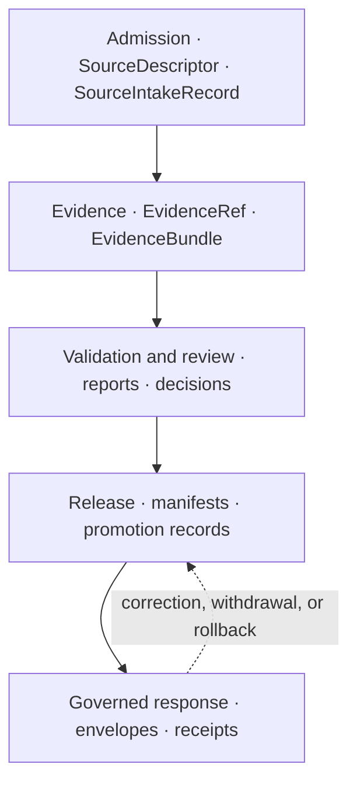

<!-- [KFM_META_BLOCK_V2]
doc_id: kfm://doc/architecture-governed-api-lifecycle-gates
title: Governed API — Lifecycle Gates
type: standard
version: v0.2
status: draft
owners: API steward + Release steward · NEEDS VERIFICATION
created: 2026-05-24
updated: 2026-08-12
policy_label: public
related:
  - README.md
  - ../governed-api.md
  - ../cross-domain/trust-membrane.md
  - ../release-discipline.md
  - ENVELOPES.md
  - THREAT_MODEL.md
  - ERROR_CODES.md
tags: [kfm, architecture, governed-api, lifecycle, promotion-gates, doctrine]
notes:
  - PROPOSED. Maps governed-api.md §6 (request flow) and §11.2 (rollback) against synthesis §8 (promotion gates A–G).
  - Release-state enforcement is the API's strongest read of the trust membrane.
  - PROPOSED. Adds the Pass 20 EXP-012 cross-family resource lifecycle and API ownership map.
[/KFM_META_BLOCK_V2] -->

<a id="top"></a>

# Governed API — Lifecycle Gates

> *How API admission interacts with the seven promotion gates A–G. Release-state enforcement: only `PUBLISHED` content reaches `ANSWER`; rollback is a release-plane action that the API reflects, not an API-plane edit.*


-blue)


**Status:** draft · **Owners:** API steward + Release steward *(NEEDS VERIFICATION)* · **Last updated:** 2026-08-12

> [!IMPORTANT]
> **The API does not create release state — it reflects it.** Promotion is governed inside the membrane *(`kfm_unified_doctrine_synthesis.md` §§7–8, CONFIRMED)*; the API checks **at request time** that the content it is about to surface has passed the gates that apply. Skipping a gate inside is a doctrine violation; skipping the API's check is a membrane breach.

> [!NOTE]
> **This doc maps gates to per-request API behavior.** It does not redefine the gates *(synthesis §8 is canonical)*; it tells implementers which gate produces which API outcome on which request.

---

## Table of contents

1. [Scope](#1-scope)
2. [Gates A–G — at-a-glance](#2-gates-ag--at-a-glance)
3. [Build-time vs request-time enforcement](#3-build-time-vs-request-time-enforcement)
4. [Per-gate API behavior](#4-per-gate-api-behavior)
5. [Release-state matrix](#5-release-state-matrix)
5A. [Resource lifecycle and API ownership map](#5a-resource-lifecycle-and-api-ownership-map)
6. [Rollback — what the API does](#6-rollback--what-the-api-does)
7. [Worked example — feature click during rollback](#7-worked-example--feature-click-during-rollback)
8. [Anti-patterns](#8-anti-patterns)
9. [Open questions and ADR triggers](#9-open-questions-and-adr-triggers)
10. [Related docs](#10-related-docs)
11. [Appendix](#11-appendix)

---

## 1. Scope

This doc tells API implementers and reviewers **how the seven promotion gates manifest at request time**: which gate's failure produces which envelope outcome, what fields carry the evidence, and how rollback interacts with in-flight requests.

> [!TIP]
> **When this doc binds.** Designing a new route, adding a new payload shape, hardening release-state handling, or auditing whether a request can leak content from a state that has not promoted.

[↑ Back to top](#top)

---

## 2. Gates A–G — at-a-glance

> **Evidence basis:** `kfm_unified_doctrine_synthesis.md` §8 *(promotion gates A–G, CONFIRMED)*. The gates are canonical; this section is the API-side summary.

| Gate | Question | Build-time enforcement | Request-time enforcement *(API)* |
|---|---|---|---|
| **A — Source admission** | Did the source admit through `SourceDescriptor` with role and rights known? | Connector schema, OPA at admission. | API resolver refuses unresolvable source ids → `ABSTAIN` `evidence/unresolved`. |
| **B — Provenance** | Is acquisition timestamped and traceable? | Provenance receipts at admission. | API surfaces `release_ref` and bundle refs; missing provenance receipt → `ABSTAIN` `evidence/inconsistent-bundle`. |
| **C — Sensitivity** | Is sensitivity posture correct under the four invariants? | Cross-lane validator, OPA. | API evaluates audience-class × posture per request; mismatch → `DENY` `policy/sensitivity`. |
| **D — Validation** | Does the record satisfy schema and domain validators? | CI validators on PROCESSED. | API enforces response-schema validation; failure → `ERROR` `schema/invalid-response`. |
| **E — Evidence closure** | Does every consequential claim resolve to an `EvidenceBundle`? | Closure check at promotion. | API resolves at request time *(`EvidenceBundle` may go stale)*; unresolved → `ABSTAIN` `evidence/unresolved`. |
| **F — Review** | Has steward review been applied where required? | Steward queue cleared per posture. | API surfaces only review-cleared content; in-queue → `ABSTAIN` or `DENY` per audience. |
| **G — Release** | Is the manifest entry present with a rollback target? | Release plane writes manifest + rollback card. | API resolves `release_ref` per request; missing manifest → `ABSTAIN` `release/no-manifest`; mid-rollback → `ABSTAIN` `release/rollback-in-progress`. |

[↑ Back to top](#top)

---

## 3. Build-time vs request-time enforcement

> **Evidence basis:** `governed-api.md` §6 *(third guarantee: citation validation precedes ANSWER, CONFIRMED)*.

Build-time enforcement is necessary but **not sufficient** for the API. A bundle that resolved at promotion can become unresolvable between releases *(deleted source, schema mismatch, manifest drift)*. A sensitivity posture that was correct at promotion can change at request time *(rights revoked, lane downgraded)*.

| Gate | Why build-time alone is insufficient |
|---|---|
| A | Source id can be retired or rebound between requests. |
| B | Provenance receipt store can be inaccessible at read. |
| C | Audience class is per-request; posture is per-record but evaluated jointly. |
| D | Schemas evolve; the response shape must validate against the current schema. |
| E | Bundle resolution is a runtime fact; refs can fail. |
| F | Review state can be revoked. |
| G | Release state can flip *(rollback in progress)*. |

> [!IMPORTANT]
> **The API runs the closure check on every request.** Cached resolutions are an optimization, not a substitute. Cache invalidation is tied to release events.

[↑ Back to top](#top)

---

## 4. Per-gate API behavior

### 4.1 Gate A — Source admission

| Aspect | Detail |
|---|---|
| API check | `EvidenceRef` URIs resolve to source ids that admit through `SourceDescriptor`. |
| Failure path | `ABSTAIN` envelope with `evidence/unresolved`. |
| Receipt | Resolver report referenced in `citation_validation.report_ref`. |

### 4.2 Gate B — Provenance

| Aspect | Detail |
|---|---|
| API check | Each source resolved by the bundle has a reachable provenance receipt. |
| Failure path | `ABSTAIN` with `evidence/inconsistent-bundle`. |
| Receipt | Provenance ref carried in `EvidenceBundle`. |

### 4.3 Gate C — Sensitivity

| Aspect | Detail |
|---|---|
| API check | Joint posture across the bundle's records is evaluated against `audience_class` *(`AUDIENCE_CLASSES.md`)*; fail-closed lanes default `DENY`. |
| Failure path | `DENY` envelope with `policy/sensitivity` or `policy/fail-closed-lane`. |
| Receipt | `DecisionEnvelope.sensitivity_posture` records joint posture. |

### 4.4 Gate D — Validation

| Aspect | Detail |
|---|---|
| API check | Inbound request validates against request schema; outbound payload validates against response schema. |
| Failure path | `ERROR` with `schema/invalid-request` *(inbound)* or `schema/invalid-response` *(outbound)*. |
| Receipt | `ValidationReport` in `data/receipts/`. |

### 4.5 Gate E — Evidence closure

| Aspect | Detail |
|---|---|
| API check | Citation validator confirms every cited ref resolves to an admissible bundle. |
| Failure path | `ABSTAIN` with `evidence/unresolved` or `ai/citation-unresolved`. |
| Receipt | `CitationValidationReport` referenced by `citation_validation.report_ref`. |

### 4.6 Gate F — Review

| Aspect | Detail |
|---|---|
| API check | For lanes that require review *(fauna sensitive occurrences, archaeology exact location, etc.)*, the content's `ReviewRecord` MUST be present and not revoked. |
| Failure path | `ABSTAIN` for `public` audience; `DENY` `policy/review-required` for routes that should not surface unreviewed at all. |
| Receipt | `ReviewRecord` ref. |

### 4.7 Gate G — Release

| Aspect | Detail |
|---|---|
| API check | `release_ref` resolves; manifest state is `PUBLISHED`; rollback not in progress for that layer. |
| Failure path | `ABSTAIN` with `release/no-manifest`, `release/state-not-published`, or `release/rollback-in-progress`. |
| Receipt | `ReleaseManifest` ref in `release_ref`. |

[↑ Back to top](#top)

---

## 5. Release-state matrix

> **Evidence basis:** `kfm_unified_doctrine_synthesis.md` §7 *(lifecycle states, CONFIRMED)*; `governed-api.md` §3 invariant 2 *(lifecycle integrity, CONFIRMED)*.

| Release state of content | API behavior — `public` | API behavior — `partner` | API behavior — `steward` | API behavior — `internal` |
|---|---|---|---|---|
| `RAW` | `DENY` `release/state-not-published` | `DENY` | `DENY` | `ANSWER` only on explicit `internal` route; never on public surface. |
| `WORK` | `DENY` | `DENY` | `ANSWER` on steward review route; lane-scoped. | `ANSWER` on `internal` route. |
| `QUARANTINE` | `DENY` | `DENY` | `ANSWER` on steward review route; lane-scoped. | `ANSWER` on `internal` route. |
| `PROCESSED` *(not yet published)* | `ABSTAIN` `release/no-manifest` or `DENY` | same | `ANSWER` on steward review route. | `ANSWER` on `internal` route. |
| `PUBLISHED` | `ANSWER` *(subject to other gates)* | `ANSWER` | `ANSWER` | `ANSWER` |
| `PUBLISHED` + rollback in progress | `ABSTAIN` `release/rollback-in-progress` | `ABSTAIN` | `ANSWER` *(with rollback marker)* | `ANSWER` |

> [!CAUTION]
> **`PROCESSED` is not public.** A common confusion is treating `PROCESSED` as "ready to serve"; it is not. Only `PUBLISHED` *(with manifest and rollback target)* reaches `ANSWER` on a `public` surface.

[↑ Back to top](#top)

---

## 5A. Resource lifecycle and API ownership map

**Status:** PROPOSED reference map; completeness and runtime bindings remain NEEDS VERIFICATION.  
**Source basis:** Pass 20 EXP-012 and the Google Drive document *Kansas Frontier Matrix Improvements*.  
**Snapshot basis:** repository paths verified at `main@753dfe4c4d17482c51bdf90ae8f8bb93e8644d3c`.

> [!IMPORTANT]
> This map is navigational. The named contract, schema, policy, proof, and release homes remain authoritative for their responsibilities. The map adds no seventh API family, route, DTO, lifecycle state, policy decision, release, or publication authority.



| Resource or object family | Lifecycle position | Canonical repository home verified on the snapshot | Governing API family or membrane role | Request-time posture |
|---|---|---|---|---|
| `SourceDescriptor` | Admission before or at `RAW` | `contracts/source/source_descriptor.md`; source schema and registry homes | **Source summary resolver** | Public projection may `ANSWER` only for admitted, releasable source metadata; unresolved source identity `ABSTAIN`. |
| `SourceIntakeRecord` | Admission work item; may remain `WORK` or `QUARANTINE` | `contracts/source/source_intake_record.md` | **Review queue surface** for steward/internal handling | Not a public payload by default; unresolved or quarantined intake cannot promote. |
| `EvidenceRef` | Stable reference carried from work through release | `contracts/evidence/evidence_ref.md` | **Evidence resolver**; consumed by every family | Unresolvable reference produces `ABSTAIN evidence/unresolved`. |
| `EvidenceBundle` | Evidence closure before `PUBLISHED`; rechecked at request time | `contracts/evidence/evidence_bundle.md`; `data/proofs/evidence_bundle/` | **Evidence resolver**; support object for all families | Public-safe projection only; inconsistent or stale closure `ABSTAIN`. |
| `PolicyDecision` | Gate C/F decision at build or request time | `contracts/policy/policy_decision.md`; `policy/` | Cross-family trust-membrane control | Preserves finite `ANSWER`, `ABSTAIN`, `DENY`, or `ERROR`; internal decision detail is not exposed by default. |
| `ValidationReport` and `CitationValidationReport` | Gate D/E proof before promotion and during response validation | `contracts/data/validation_report.md`; `contracts/evidence/citation_validation_report.md`; proof homes under `data/proofs/` | Cross-family validation; citation report is especially relevant to **Focus Mode runtime** | Invalid response `ERROR`; unresolved citations `ABSTAIN`. |
| `ReviewRecord` | Gate F; steward action while `WORK` or `QUARANTINE` | `schemas/contracts/v1/governance/review_record.schema.json`; canonical narrative contract home NEEDS VERIFICATION | **Review queue surface** | Public clients do not receive the review record; uncleared review blocks or narrows promotion. |
| `PromotionDecision` and `PromotionReceipt` | Governed transition from `PROCESSED` toward `PUBLISHED` | `contracts/release/promotion_decision.md`; `contracts/release/promotion_receipt.md` | Release-plane input, visible through **Review queue** to authorized stewards | The API reads the resulting state; it does not write promotion state. |
| `ReleaseManifest` | Declares `PUBLISHED` state and rollback target | `contracts/release/release_manifest.md`; `release/` | Release reference used by all six families | Missing or non-published manifest yields `ABSTAIN` or `DENY` according to the family contract. |
| `LayerManifest` and `MapReleaseManifest` | Layer candidate in `PROCESSED`; admitted map artifact in `PUBLISHED` | `contracts/data/layer_manifest.md`; `contracts/release/map_release_manifest.md` | **Layer manifest resolver**; consumed by feature/detail and map clients | Only released, audience-safe projection can `ANSWER`; public clients never read storage directly. |
| `RuntimeResponseEnvelope` and `DecisionEnvelope` | Request-time observation of current release and policy state | `contracts/runtime/runtime_response_envelope.md`; `contracts/runtime/decision_envelope.md` | Envelope discipline across all six families; **Focus Mode runtime** uses the same membrane | Exactly one finite outcome leaves the membrane, with public-safe references. |
| `RunReceipt` and `AIReceipt` | Audit trail for pipeline or AI work | `contracts/runtime/run_receipt.md`; `contracts/runtime/ai_receipt.md`; receipt homes under `data/receipts/` | Internal audit role; referenced by governed responses where contracts allow | Receipt identifiers may be exposed; sensitive receipt bodies remain internal unless an audience-specific projection is authorized. |
| `CorrectionNotice`, `WithdrawalNotice`, and `RollbackCard` | Post-publication correction, withdrawal, or rollback marker | `contracts/correction/correction_notice.md`; `contracts/release/withdrawal_notice.md`; `contracts/release/rollback_card.md` | Release plane; reflected by **Layer manifest**, **Feature/detail**, and dependent families | In-progress rollback `ABSTAIN`; withdrawn content must not `ANSWER`; the API reflects rather than edits release state. |

### Ownership rules

1. The six canonical API families remain: Source summary, Feature/detail, Layer manifest, Evidence, Focus Mode, and Review queue.
2. Lifecycle objects cross the public boundary only through an audience-safe governed projection; internal storage, review, proof, and receipt bodies are not public APIs.
3. A contract owns meaning, a schema owns shape, policy owns admissibility, release records own publication state, and this document owns only the cross-family map.
4. Route URLs, methods, runtime wiring, and complete resource enumeration remain **NEEDS VERIFICATION**. Any new object family must update this map in the same change that introduces its governing contract or schema.
5. If this map conflicts with a canonical object-family authority, the map is wrong and must be corrected; it does not supersede that authority.

[↑ Back to top](#top)

---

## 6. Rollback — what the API does

> **Evidence basis:** `governed-api.md` §11.2 *(rollback and continuity, CONFIRMED)*; `cross-domain/shared-kernel.md` §7.

| Phase | Release plane action | API behavior |
|---|---|---|
| Rollback initiated | New `ReleaseManifest` published with `rollback_target` pointing to prior manifest. | API begins serving `ABSTAIN` `release/rollback-in-progress` for affected layers / claims to `public` / `partner`; `steward` / `internal` see `ANSWER` with rollback marker. |
| Rollback in progress | Caches invalidate; resolver re-pins to rollback target. | API resolves `release_ref` per request; cache-miss path enforces resolution. |
| Rollback complete | Prior manifest is the current `PUBLISHED` state; rollback card archives the failed manifest. | API resumes `ANSWER` for affected layers, now pinned to the rolled-back manifest. |
| Forward-fix released | New manifest replaces both prior states; rollback card preserved. | API serves the new manifest. |

| Rule | Detail |
|---|---|
| API never edits manifests | API is read-only on release state. |
| API does not "freeze" content during rollback | It abstains; abstain is the safe state. |
| Rollback marker is part of the receipt | `DecisionEnvelope.release_state_at_decision` records the state observed; the `release_ref` records the manifest pinned. |

[↑ Back to top](#top)

---

## 7. Worked example — feature click during rollback

A `public` map shell click on a hydrology feature whose layer's release manifest is mid-rollback.

| Step | Behavior |
|---|---|
| 1 — Ingress | Request schema validates; rate limit ok. |
| 2 — Policy | `DecisionEnvelope.decision = allow` for `public` × hydrology. |
| 3 — Release | Manifest resolves to a state marked `rollback-in-progress`. |
| 4 — Evidence | Resolver not invoked; closure check pre-empted. |
| 5 — Citation | Skipped. |
| 6 — Envelope | `outcome = ABSTAIN`, `reason.reason_code = release/rollback-in-progress`. |
| 7 — Receipts | `PolicyDecision`, `CitationValidationReport` *(empty)* emitted. |

> [!IMPORTANT]
> **Mid-rollback is `ABSTAIN`, not `DENY`.** The content is not policy-forbidden; it is **temporarily unavailable**. The distinction matters for client UX and for telemetry.

[↑ Back to top](#top)

---

## 8. Anti-patterns

| Anti-pattern | Mitigation |
|---|---|
| **API serves `PROCESSED` content to `public` because "validation passed"** | Only `PUBLISHED` reaches `ANSWER` on `public`. |
| **API caches `release_ref` across rollback** | Release events invalidate cache. |
| **Rollback handled by "freezing" `ANSWER`** | Abstain; do not freeze stale answers. |
| **`ABSTAIN` reason flattened to "not available"** | Stable code from `evidence/*` or `release/*`. |
| **Steward route surfaces unrelated lanes** | Steward access is lane-scoped per role claim. |
| **Build-time closure check assumed at runtime** | Runtime closure check on every request. |

[↑ Back to top](#top)

---

## 9. Open questions and ADR triggers

| Open item | Class | Suggested ADR title |
|---|---|---|
| Should rollback emit a distinct outcome value *(e.g., `UNAVAILABLE`)* instead of `ABSTAIN`? | Vocabulary | "Rollback outcome distinct from ABSTAIN". |
| Cache invalidation — pull *(re-resolve on each request)* vs push *(release event invalidates)*? | Implementation | "Release-cache invalidation". |
| Should `steward` and `internal` see rollback marker in `payload` or in `policy_decision`? | Envelope | "Rollback marker location". |
| `PROCESSED` exposure on `internal` routes — explicit allowlist or default-deny? | Authorization | "PROCESSED exposure default". |

[↑ Back to top](#top)

---

## 10. Related docs

| Reference | Role | Truth label |
|---|---|---|
| `README.md` *(this folder)* | Landing | CONFIRMED doctrine |
| `../governed-api.md` §3, §6, §11.2 | Doctrine spine | CONFIRMED doctrine |
| `../cross-domain/trust-membrane.md` §4 | Promotion gates A–G summary | CONFIRMED doctrine |
| `../release-discipline.md` | Release plane home *(scaffold; expand)* | CONFIRMED scaffold |
| `ENVELOPES.md` | `DecisionEnvelope.release_state_at_decision` | PROPOSED |
| `THREAT_MODEL.md` Boundary 3 | Release-state enforcement at the boundary | PROPOSED |
| `ERROR_CODES.md` | `release/*` and `evidence/*` codes | PROPOSED |
| `kfm_unified_doctrine_synthesis.md` §§7–8 | Lifecycle and gates canonical | CONFIRMED doctrine |

[↑ Back to top](#top)

---

## 11. Appendix

<details>
<summary><strong>11.1 Gate → outcome quick-reference</strong></summary>

```text
A — Source admission     →  ABSTAIN evidence/unresolved
B — Provenance           →  ABSTAIN evidence/inconsistent-bundle
C — Sensitivity          →  DENY    policy/sensitivity | fail-closed-lane
D — Validation           →  ERROR   schema/invalid-{request,response}
E — Evidence closure     →  ABSTAIN evidence/unresolved | ai/citation-unresolved
F — Review               →  ABSTAIN | DENY policy/review-required
G — Release              →  ABSTAIN release/{no-manifest,state-not-published,rollback-in-progress}
```

</details>

<details>
<summary><strong>11.2 Truth-label legend</strong></summary>

- **CONFIRMED** — verified this session from attached docs.
- **PROPOSED** — design / placement / inference not yet verified in implementation.
- **INFERRED** — derivable from confirmed evidence but not directly stated.
- **NEEDS VERIFICATION** — checkable, but not yet checked strongly enough to act as fact.

</details>

---

**Related (mini)** · [`README.md`](README.md) · [`../governed-api.md`](../governed-api.md) · [`ENVELOPES.md`](ENVELOPES.md) · [`THREAT_MODEL.md`](THREAT_MODEL.md) · [`ERROR_CODES.md`](ERROR_CODES.md) · [`AUDIENCE_CLASSES.md`](AUDIENCE_CLASSES.md)

**Last updated:** 2026-08-12 · **Doc version:** v0.2 · **Doc status:** draft · **Path status:** PROPOSED *(OPEN-DR-12 META)*

[↑ Back to top](#top)
