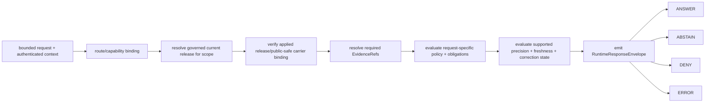
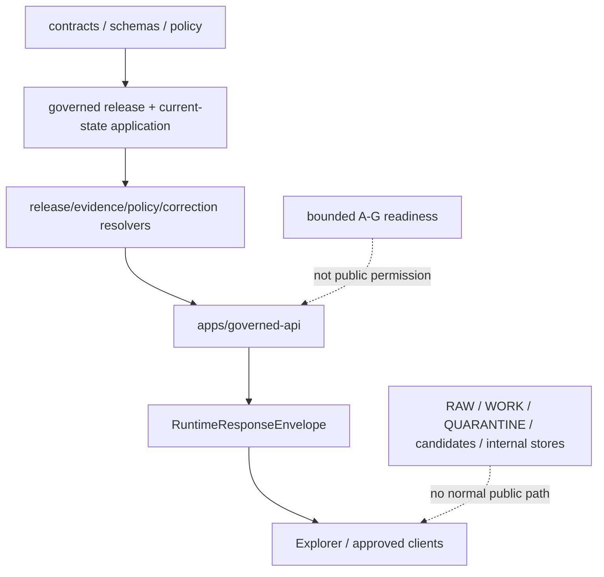

<!-- [KFM_META_BLOCK_V2]
doc_id: kfm://doc/architecture-governed-api-lifecycle-gates
title: Governed API — Lifecycle Gates
type: architecture-reference
version: v1.0-draft
prior_version: v0.2
status: "draft; repository-grounded; vocabulary-conflicted; fixture-first; request-time-enforcement-hold; transition-application-hold; no-release; no-publication"
owners:
  - "@bartytime4life — verified CODEOWNERS review route"
  - "NEEDS VERIFICATION — independent API, release, policy, evidence, review, correction, rollback, security, and operations stewardship"
created: 2026-05-24
updated: 2026-08-19
policy_label: public; architecture; governed-api; lifecycle; promotion-readiness; finite-outcomes; correction; rollback; no-publication
owning_root: docs/
current_path: docs/architecture/governed-api/LIFECYCLE_GATES.md
responsibility: >-
  Explain how lifecycle, release-readiness, transition-application, evidence,
  policy, freshness, and correction state constrain Governed API responses;
  reconcile current bounded repository evidence with legacy gate prose; and
  preserve explicit runtime, release, and publication holds without becoming
  semantic-contract, schema, policy, application, or release authority.
truth_posture: >-
  CONFIRMED existing same-path document, accepted Directory Rules placement,
  schema-backed three-route ABSTAIN scaffold, current RuntimeResponseEnvelope
  shape, bounded no-network final-readiness A-G validator, proposed release
  object profiles, empty proposed release-state register, and absence of a
  request-time lifecycle/release resolver or applied production transition;
  PROPOSED target request-time release/evidence/policy/correction composition;
  CONFLICTED lifecycle-wide and final-readiness A-G vocabularies; UNKNOWN
  deployed behavior and first governed public release; NEEDS VERIFICATION
  accepted gate vocabulary, controlled runtime-state vocabularies,
  authenticated authority, transition application, correction propagation,
  rollback operation, exact-head hosted checks, and human review.
evidence_snapshot:
  repository: bartytime4life/Kansas-Frontier-Matrix
  base_ref: main
  base_commit: 0a547c12e7965565d397fcad46d94c1c7b41f0c7
  target_prior_blob: f8e2b75e097b40abc0303ea587efdda90e8be00c
  parent_readme_blob: 09f9f95ce7400055b8018f9f159796ac35959fbb
  audience_classes_blob: 28662c84ac1347cd63f0246fc47d418f76b7ec0b
  envelopes_doc_blob: 4c80f1d1808d5bed8f56bc2fd1fb73222d65ee42
  governed_api_main_blob: 4eb335c7c0b27f62c7419c478542e8fe40e1ff38
  governed_api_route_registry_blob: 3418168d0b267160d6ad6dd87f289e880ef4a024
  governed_api_stub_blob: 371e60d9f96c78e31c8a1e6109d19dee5da4213b
  governed_api_route_test_blob: 2be20f5d93c03da7677c34b11a31875a00b2ed28
  runtime_response_contract_blob: 5060aaaa30fea37b6eeea6e1428b9effa6a163bd
  runtime_response_schema_blob: 8b86e7db8b18b65a56a4e639dfc54e1b2db93155
  promotion_gate_readme_blob: e729df0cc007e8cf0d9811afc25ec1f5ffbdffdd
  promotion_receipt_contract_blob: ed432f8e3e02d170589c9e04d78087a69346909d
  promotion_decision_contract_blob: 42295bfc83a621cf125d33aa821912b426f70bd2
  gate_outcome_mapping_blob: 89a224ca912a831816d984de281074185b70e22a
  adr_0018_blob: 51cedfdf98b92f1a9af492ce3a1cde231eed9308
  release_gates_blob: 4e6f3aa020363d23192b7d3357ea516ebb2cc87d
  release_state_machine_blob: a5bc6d9cf5497315f63d33012363a1133214867e
  release_state_register_blob: f576239f447045b04d7b30c540234d8641ceb7dc
  rollback_architecture_blob: 30609139823f3129ad4545b93a98f65246953cf2
  api_workflow_blob: 84ba16a3c36a1d58b2f6f1059a31ed6354063357
  directory_rules_blob: fd49a0b83e55cef52c1124281f093e263526898d
  open_pull_requests_touching_target_at_preflight: 0
inspection_boundary: >-
  Current-session GitHub reads covered the complete prior target, current
  Governed API parent and audience boundaries, WSGI dispatcher, route registry,
  stubs, route and boundary tests, RuntimeResponseEnvelope contract/schema,
  bounded promotion readiness, PromotionDecision, PromotionReceipt,
  GateOutcomeMapping, ADR-0018, grounded release-gate and release-state
  architecture, the empty release-state register, rollback architecture, and
  API workflow. No mounted checkout, local repository-native command, live
  identity provider, EvidenceBundle resolver, policy evaluator, release-state
  service, trusted signer, authenticated reviewer registry, transition operator,
  correction propagator, rollback operator, cache invalidation, deployment,
  public endpoint, or observed request was exercised.
related:
  - README.md
  - AUDIENCE_CLASSES.md
  - ENVELOPES.md
  - ERROR_CODES.md
  - DEPLOYMENT_RULES.md
  - README.md
  - ../publication/RELEASE_GATES.md
  - ../publication/release-state-machine.md
  - ../publication/release-objects.md
  - ../publication/CORRECTION.md
  - ../publication/ROLLBACK.md
  - ../../adr/ADR-0018-promotion-gate-sequence.md
  - ../../adr/ADR-0029-adopt-directory-governance-standard-v2.md
  - ../../doctrine/directory-rules.md
  - ../../../apps/governed-api/README.md
  - ../../../apps/governed-api/src/governed_api/main.py
  - ../../../apps/governed-api/src/governed_api/routes/registry.py
  - ../../../apps/governed-api/src/governed_api/stub.py
  - ../../../apps/governed-api/tests/test_abstain_routes.py
  - ../../../apps/governed-api/tests/test_boundary_guards.py
  - ../../../contracts/runtime/runtime_response_envelope.md
  - ../../../schemas/contracts/v1/runtime/runtime_response_envelope.schema.json
  - ../../../contracts/governance/gate_outcome_mapping.md
  - ../../../contracts/release/promotion_decision.md
  - ../../../contracts/release/promotion_receipt.md
  - ../../../control_plane/release_state_register.yaml
  - ../../../tools/validators/promotion_gate/README.md
  - ../../../.github/workflows/api-test.yml
tags:
  - kfm
  - architecture
  - governed-api
  - lifecycle
  - release-readiness
  - runtime-response-envelope
  - evidence
  - policy
  - correction
  - rollback
  - finite-outcomes
  - vocabulary-conflict
  - fail-closed
notes:
  - "v1.0-draft replaces proposal-era request-time enforcement claims with current repository evidence."
  - "The old Source-admission-through-Release A-G sequence remains visible only as conflicted lifecycle-wide lineage; the current executable A-G profile is final readiness for a declared CATALOG/TRIPLET candidate."
  - "Current Governed API routes are schema-backed ABSTAIN stubs and do not inspect lifecycle, release, evidence, policy, review, freshness, correction, or rollback state."
  - "All eleven legacy numbered sections and the stable document identity are preserved."
  - "This update changes no route, contract, schema, policy, fixture, validator, test, workflow, release state, deployment, or publication behavior."
[/KFM_META_BLOCK_V2] -->

<a id="top"></a>

# Governed API — Lifecycle Gates

> **Operating rule.** The Governed API may project only what a separately
> governed current state permits. It does not create lifecycle state, convert
> readiness into release, or turn a candidate, validator pass, decision-shaped
> record, file path, or deployment into `PUBLISHED` truth.

[](#status-and-authority)
[](#current-executable-boundary)
[](#21-current-executable-final-readiness-profile)
[](#22-lifecycle-wide-a-g-lineage)
[](#32-target-request-time-composition)
[](#52-release-state-matrix)
[](#non-effects)

> [!IMPORTANT]
> **Lifecycle stage, final-readiness result, accountable decision, transition
> application, public-serving state, runtime outcome, and correction state are
> different axes.** `PASS`, `APPROVE_READY`, `APPROVE`,
> `transition.applied: true`, a green workflow, a merged pull request, or a
> reachable artifact does not by itself authorize `ANSWER` or establish
> `PUBLISHED`.

> [!CAUTION]
> **Current code does not run lifecycle gates per request.** The WSGI scaffold
> registers only `GET /bootstrap`, `GET /layers`, and `GET /evidence`. Each
> registered route returns a schema-backed `ABSTAIN / NOT_IMPLEMENTED`
> envelope. Unknown routes and unsupported methods return safe `ERROR`
> envelopes. No inspected middleware resolves identity, capabilities,
> EvidenceBundles, policy, release state, correction state, rollback state, or
> an applied current release.

> [!WARNING]
> **A–G is overloaded in the repository.** The current executable bounded
> profile uses `identity_and_closure` through `review_and_rollback` for a
> candidate already at `CATALOG` or `TRIPLET`. Older lifecycle-wide prose uses
> A for source admission and G for release. ADR-0018 remains `proposed` with a
> `REVISE` checkpoint, so neither letter sequence may be presented as accepted
> universal doctrine.

**Quick navigation:** [Status](#status-and-authority) · [Scope](#1-scope) · [Axes](#2-gates-ag--at-a-glance) · [Enforcement](#3-build-time-vs-request-time-enforcement) · [API relevance](#4-per-gate-api-behavior) · [State matrix](#5-release-state-matrix) · [Ownership map](#5a-resource-lifecycle-and-api-ownership-map) · [Rollback](#6-rollback--what-the-api-does) · [Example](#7-worked-example--feature-click-during-rollback) · [Anti-patterns](#8-anti-patterns) · [Open work](#9-open-questions-and-adr-triggers) · [Related](#10-related-docs) · [Appendix](#11-appendix)

---

<a id="status-and-authority"></a>

## Status and authority

| Field | Current repository-grounded result |
|---|---|
| **Path** | `docs/architecture/governed-api/LIFECYCLE_GATES.md` — existing same-path architecture companion |
| **Owning root** | `docs/` — human-readable architecture explanation under accepted Directory Rules v2 |
| **Document authority** | Explanatory only; not semantic contract, machine schema, policy, runtime middleware, release decision, transition operator, correction record, rollback operator, or publication authority |
| **Current app** | Small WSGI dispatcher with three registered GET routes |
| **Current positive route behavior** | None; all three registered routes return `ABSTAIN / NOT_IMPLEMENTED` |
| **Current safe error behavior** | Unknown paths return `404` plus `ERROR / SAFE_RUNTIME_ERROR`; unsupported methods on registered paths return `405` plus the same safe error class |
| **Current envelope proof** | Route tests assert the exact RuntimeResponseEnvelope required-key set and bounded schema conformance |
| **Current lifecycle/release resolver** | Not present in the inspected app code |
| **Current final-readiness proof** | Bounded deterministic no-network A–G validator over declared synthetic packets |
| **Current release-state register** | `PROPOSED`; `entries: []` |
| **Current transition application** | `HOLD`; no production operator proved |
| **Current deployment/public operation** | `UNKNOWN`; not inferred from repository bytes |
| **Release or publication effect of this page** | None |
| **Review route** | `@bartytime4life` through CODEOWNERS; independent authority remains `NEEDS VERIFICATION` |

### Directory Rules basis

Accepted [`ADR-0029`](../../adr/ADR-0029-adopt-directory-governance-standard-v2.md)
adopts Directory Rules v2. The existing target explains a cross-root
architecture boundary and therefore remains under `docs/architecture/`.
Semantic meaning remains in `contracts/`, machine shape in `schemas/`,
admissibility in `policy/`, executable behavior in `apps/` and supporting
implementation roots, validation in `fixtures/`, `tools/validators/`, and
`tests/`, lifecycle records in governed `data/` lanes, and release,
correction, and rollback authority in their owning release surfaces.

This is a same-path `PLACE` result. No root, object family, schema home,
policy home, state store, release lane, runtime package, or public path is
created or moved.

<a id="non-effects"></a>

### Non-effects

This document update does not:

- accept ADR-0018, ADR-0004, or another proposed decision;
- rename or redefine a contract, schema, policy, reason code, lifecycle state,
  readiness status, decision outcome, or audience vocabulary;
- add request middleware, a release resolver, an EvidenceBundle resolver, a
  policy evaluator, a state register entry, a transition operator, or a cache;
- change an app route, response byte, fixture, validator, test, workflow,
  release record, correction record, rollback record, deployment, or public
  surface; or
- promote, release, deploy, publish, activate a source, or alter repository
  settings.

[Back to top](#top)

---

<a id="1-scope"></a>

## 1. Scope

This page explains how lifecycle and release information should constrain a
Governed API response, while separating that target architecture from the
current executable scaffold.

It covers:

- the canonical KFM lifecycle spine;
- the current bounded final-readiness profile;
- the conflict with legacy lifecycle-wide A–G prose;
- the boundary among readiness, decision, application, public serving, and
  runtime outcomes;
- the exact current RuntimeResponseEnvelope shape;
- the release, evidence, policy, freshness, and correction inputs a mature
  request path would need;
- fail-closed response posture for unreleased or unresolved material;
- correction, withdrawal, supersession, and rollback behavior at the API
  boundary; and
- the evidence required before any of those behaviors may be called
  implemented.

It does **not** define a production state database, current-release alias,
endpoint catalogue, authentication provider, capability model, policy bundle,
reason-code registry, release operator, cache invalidation protocol, public
payload carrier, or deployment topology.

### 1.1 State separation

A request-time outcome must not collapse these independent questions:

| Axis | Question | Current authority or evidence |
|---|---|---|
| Lifecycle stage | Where is the material in `Pre-RAW → RAW → WORK / QUARANTINE → PROCESSED → CATALOG / TRIPLET → PUBLISHED`? | Doctrine and release architecture |
| Candidate readiness | Did the bounded declared packet return `PASS`, `ABSTAIN`, `DENY`, or `ERROR`? | Promotion-gate validator |
| Readiness handoff | Is the packet `APPROVE_READY` or `BLOCKED`? | Derived bounded result |
| Promotion decision | Did a separately governed decision say `APPROVE`, `DENY`, or `ABSTAIN`? | Proposed PromotionDecision family |
| Transition application | Was an authorized exact before/after state change actually applied? | Production path `HOLD` |
| Release/current state | Which release is currently authoritative for this scope? | Proposed empty register; operational source unproved |
| Evidence state | Do the response's EvidenceRefs resolve to admissible support? | Resolver/runtime integration `HOLD` |
| Policy state | Is this caller, purpose, object, field projection, and precision allowed? | Runtime evaluator `HOLD` |
| Freshness state | Is the supported evidence current enough for the requested use? | Runtime envelope string; controlled vocabulary unresolved |
| Correction state | Is the current material normal, corrected, superseded, withdrawn, or rollback-affected? | Runtime envelope string; operational binding unresolved |
| Runtime outcome | May the client render `ANSWER`, `ABSTAIN`, `DENY`, or `ERROR`? | RuntimeResponseEnvelope |
| Client payload | What substantive released projection accompanies an `ANSWER`? | Response-resource composition remains unresolved in the current envelope family |

### 1.2 Current safe determination

The present app can prove only a narrow negative path:

```text
registered GET request
  -> route callable
  -> schema-backed ABSTAIN / NOT_IMPLEMENTED envelope

unknown route or unsupported method
  -> safe ERROR / SAFE_RUNTIME_ERROR envelope
```

No current route receives or looks up a lifecycle stage, release identifier,
PromotionReceipt, PromotionDecision, ReleaseManifest, correction notice,
RollbackCard, audience profile, capability grant, policy result, or resolved
EvidenceBundle.

[Back to top](#top)

---

<a id="2-gates-ag--at-a-glance"></a>

## 2. Gates A–G and the current vocabulary conflict

The term “lifecycle gate” has been used for at least two different
responsibilities. This edition keeps both visible and refuses to treat their
shared letters as equivalence.

<a id="21-current-executable-final-readiness-profile"></a>

### 2.1 Current executable final-readiness profile

The repository's bounded validator starts only after a candidate declares
`CATALOG` or `TRIPLET` and targets `PUBLISHED`.

| Gate | Exact executable name | Bounded declared check | Result limit |
|:---:|---|---|---|
| **A** | `identity_and_closure` | Candidate/profile/author/spec identity, lifecycle boundary, minimal manifest closure | Does not establish source authority, object existence, or complete release closure |
| **B** | `asset_integrity` | Candidate, manifest, RunReceipt, `spec_hash`, and digest-set agreement | Does not retrieve or authenticate bytes or signatures |
| **C** | `geometry_and_crs` | Declared validity, deterministic processing, `EPSG:4326`, and finite ordered bounds | Does not parse a carrier or prove public-safe geometry |
| **D** | `temporal_semantics` | Strict UTC instants, interval ordering, and supplied evaluation time | Does not prove source freshness or fitness for a request |
| **E** | `rights_and_sensitivity` | Declared profile, labels, policy result, and policy-bundle reference | Does not execute the inactive Rego stubs or prove clearance |
| **F** | `proof_and_catalog_support` | Declared evidence, attestation, STAC/DCAT/PROV, RunReceipt, and conditional AI-receipt support | Does not resolve, authenticate, or validate referenced support |
| **G** | `review_and_rollback` | Fixture-only review, actor/authority/time/separation declarations, correction lineage, and rollback support | Does not authenticate identities, authority assignments, current review, or rollback usability |

The validator emits:

```text
gate status: PASS | ABSTAIN | DENY | ERROR
precedence:  ERROR > DENY > ABSTAIN > PASS
readiness:   PASS -> APPROVE_READY
             otherwise -> BLOCKED
```

`APPROVE_READY` is a handoff for separately governed decision processing. It
is not `APPROVE`, transition application, `PUBLISHED`, release, deployment,
publication, or an API permission.

<a id="22-lifecycle-wide-a-g-lineage"></a>

### 2.2 Lifecycle-wide A–G lineage

The prior edition of this page and the older
[`promotion-gates.md`](../publication/promotion-gates.md) use:

```text
A Source admission
B Provenance
C Sensitivity
D Validation
E Evidence closure
F Review
G Release
```

Those concerns remain real across the KFM lifecycle, but the letter assignment
is **CONFLICTED** with the current executable final-readiness profile. They
must not be mapped one-to-one by letter.

| Legacy concern | Durable responsibility | Current status |
|---|---|---|
| Source admission | SourceDescriptor, rights, role, source-edge controls before or at RAW admission | Separate upstream architecture; not the bounded final-readiness validator |
| Provenance | Retrieval/transform lineage, receipts, pinned inputs | Distributed across candidate support objects and upstream processing |
| Sensitivity | Rights, sensitivity, sovereignty, harmful precision, obligations | Policy-owned; current promotion policy runtime is inactive |
| Validation | Schemas, domain/cross-domain validators, integrity checks | Multiple validators; no single universal lifecycle gate |
| Evidence closure | EvidenceRef → EvidenceBundle and claim support | Runtime resolver/integration not proved |
| Review | Qualified accountable review and separation of duties | Fixture-only final-readiness declarations; live authority unproved |
| Release | Decision, application, manifest, public carrier binding, correction, rollback | Production transition and public serving remain held |

ADR-0018 narrows its proposed scope to final readiness and records a `REVISE`
checkpoint. Acceptance, compatibility handling, and retirement or
reclassification of the lifecycle-wide letter vocabulary remain open.

<a id="23-objects-and-effects"></a>

### 2.3 Objects and effects are not gates

| Surface | Vocabulary | Current bounded meaning | Does not prove |
|---|---|---|---|
| Promotion gate result | `PASS / ABSTAIN / DENY / ERROR` | Deterministic findings over one declared packet | Policy authority, approval, release, publication |
| Readiness | `APPROVE_READY / BLOCKED` | Handoff state | Promotion decision |
| PromotionDecision | `APPROVE / DENY / ABSTAIN` | Proposed accountable decision record | Actor authenticity, transition application, public serving |
| PromotionReceipt | Seven ordered gate records plus declared transition fields | Proposed process receipt and internal-consistency profile | Decision authority or actual transition |
| ReleaseManifest | Release-set identity and state declarations | Fixture-first/proposed family | Durable application or current alias |
| RuntimeResponseEnvelope | `ANSWER / ABSTAIN / DENY / ERROR` | Client-facing finite outcome shape | Release creation or policy correctness |
| GateOutcomeMapping | Fixture-only deterministic mapping candidate | Exact local mapping consistency | Runtime emission, promotion, or answer authority |

A future adapter may translate independently established facts into a runtime
outcome. The fixture-only `GateOutcomeMapping` is not such an adapter and has
no runtime consumer.

[Back to top](#top)

---

<a id="3-build-time-vs-request-time-enforcement"></a>

## 3. Build-time versus request-time enforcement

The old page stated that relevant gates were re-run on every public request.
Current repository evidence does not support that operational claim.

<a id="31-current-executable-boundary"></a>
<a id="current-executable-boundary"></a>

### 3.1 Current executable boundary

| Surface | CONFIRMED behavior | Important limit |
|---|---|---|
| WSGI dispatcher | Dispatches registered GET routes; rejects unsupported methods and unknown paths safely | No middleware chain or dependency injection for lifecycle/release state |
| Route registry | Exactly `/bootstrap`, `/layers`, and `/evidence` | No audience, capability, state, or policy metadata |
| Registered routes | Return `ABSTAIN / NOT_IMPLEMENTED` | No answer payload, evidence resolution, release lookup, or policy evaluation |
| Error path | Returns `ERROR / SAFE_RUNTIME_ERROR` | Safe generic error only; no operational incident or retry policy |
| Route tests | Assert exact required RuntimeResponseEnvelope keys and bounded schema conformance | Subset assertion is not a full production JSON Schema engine or semantic integration proof |
| Boundary tests | Deny selected forbidden imports/path literals and check current scaffold constraints | Do not prove information-flow security or deployment isolation |
| API workflow | Runs `make governed-api-smoke` and the focused route-envelope test | Workflow result is test evidence only; this docs change does not prove an exact-head conclusion |

The current runtime therefore fails closed by abstaining before it can expose
candidate or internal data. That is useful negative evidence, but it is not an
implemented lifecycle-gate system.

<a id="32-target-request-time-composition"></a>

### 3.2 Target request-time composition — PROPOSED

A mature request path should consume already governed release and support
state, then apply request-specific evidence, policy, precision, freshness, and
correction constraints. It should **not** casually rerun the final-readiness
validator as though a client request were a promotion attempt.



Every arrow above is `PROPOSED / HOLD` for the current app except final
envelope construction for the existing negative stubs.

### 3.3 Why build-time proof remains relevant

Build and promotion evidence can support a request without becoming request
authority:

| Build/release evidence | Request-time use | Required separation |
|---|---|---|
| Candidate and artifact digests | Bind the selected released carrier | Do not accept a candidate merely because hashes match |
| Validation reports | Establish bounded structural/semantic checks | Recheck only what is request- or environment-dependent |
| Evidence support refs | Identify support graph | Resolve or safely abstain; a URI alone is not closure |
| Policy result used for release | Explain release-time posture | Evaluate caller/purpose/field/precision obligations separately |
| Review and rollback refs | Establish accountability and recovery plan | Authenticate current applicability; do not trust fixture declarations |
| Release manifest/current-state record | Select the governed public version | Require evidence of applied state, not path or filename inference |
| Correction/withdrawal records | Constrain or replace prior release | Propagate to current response and downstream caches |

### 3.4 Request-time fail-closed rule

Until an accepted contract and implementation establish a more specific rule:

- unreleased or unresolved material must not produce `ANSWER`;
- missing release-state evidence must not be inferred from storage location;
- missing EvidenceBundle closure should produce a safe non-answer;
- policy or identity failure must not degrade to anonymous success;
- stale, corrected, superseded, withdrawn, or rollback-affected state must be
  surfaced at the affected scope rather than silently ignored;
- any safe reason code must come from an accepted vocabulary, not from this
  explanatory page; and
- the client must never reconstruct an answer from a negative envelope.

Whether a specific condition maps to `ABSTAIN`, `DENY`, or `ERROR` is a
contract/policy decision. This page does not invent that mapping.

[Back to top](#top)

---

<a id="4-per-gate-api-behavior"></a>

## 4. Current A–G relevance to the Governed API

The bounded final-readiness gates are release-side evidence. The API may rely
on the resulting governed records after those records are authenticated and
applied; it does not inherit gate authority by reading them.

| Gate | What a mature API may need from the resulting release state | Current app evidence | Runtime outcome boundary |
|:---:|---|---|---|
| **A — identity and closure** | Exact current release/candidate distinction, manifest identity, specification lineage, and scope | No release resolver or state input | Missing applied-release context cannot become `ANSWER` |
| **B — asset integrity** | Digest-bound carrier selected from governed release state | No carrier loader or digest verifier | Integrity failure must fail closed; exact outcome/reason code unresolved |
| **C — geometry and CRS** | Public-safe geometry representation, supported CRS, bounds, and precision disclosure | No geometry route or adapter | Client display must not upgrade precision or undo generalization |
| **D — temporal semantics** | Supported observation interval, freshness class, release/correction timing | Envelope supports `issued_at`, `freshness`, and answer-only temporal precision; no state evaluator | Stale or unsupported time must not be silently called current |
| **E — rights and sensitivity** | Request-specific policy result and obligations for caller, purpose, field projection, and precision | No authentication or policy evaluator | Policy denial must not leak restricted payload or reasons |
| **F — proof and catalog support** | Resolved EvidenceRefs, public-safe catalog context, provenance/attestation support as required | `/evidence` is an ABSTAIN stub; no resolver | Consequential claim without support cannot be answered |
| **G — review and rollback** | Current accountable review, correction lineage, rollback target, and affected-scope state | No review registry, correction service, or rollback resolver | Affected responses must fail closed until the current safe state is established |

### 4.1 No direct gate-to-runtime conversion

The repository contains a proposed fixture-only
[`GateOutcomeMapping`](../../../contracts/governance/gate_outcome_mapping.md).
It distinguishes promotion and answer surfaces and requires evidence-state
consistency, but it:

- does not evaluate policy;
- does not resolve evidence;
- does not emit PromotionDecision or RuntimeResponseEnvelope objects;
- does not approve promotion or produce an answer; and
- has no current Governed API consumer.

Therefore:

```text
promotion PASS != runtime ANSWER
promotion DENY != proof that a particular caller must receive DENY
promotion ABSTAIN != accepted public reason-code mapping
promotion ERROR != production incident classification
```

A runtime outcome must be derived from the request, current applied release,
resolved support, policy, freshness, correction state, and accepted response
contract—not from one gate status in isolation.

### 4.2 Current RuntimeResponseEnvelope facts

The current closed schema requires:

```text
id
spec_hash
version
issued_at
outcome
reason_code
evidence_refs
policy_state
freshness
correction_state
```

For `ANSWER`, it additionally requires:

- at least one top-level EvidenceRef; and
- `precision_actually_used`, including spatial, temporal, and attribute
  precision plus its support refs and transform-receipt refs.

For `ABSTAIN`, `DENY`, and `ERROR`, `precision_actually_used` is forbidden.

The current schema does **not** define top-level `release_ref`, `payload`,
`policy_decision`, `citation_validation`, or `trace` members. Those fields
appear in older architecture prose but are not current machine-shape facts.
How substantive answer resources compose with RuntimeResponseEnvelope remains
a direct architecture and contract `HOLD`.

[Back to top](#top)

---

<a id="5-release-state-matrix"></a>

## 5. Release-state matrix

<a id="51-current-scaffold-result"></a>

### 5.1 Current scaffold result

The current routes do not inspect any state in this matrix. They return
`ABSTAIN / NOT_IMPLEMENTED` for every registered GET request. The matrix below
therefore states the **safe target architecture**, not current middleware
behavior.

<a id="52-release-state-matrix"></a>

### 5.2 Lifecycle, readiness, decision, and public-serving posture

| State or signal | What it proves | Safe target public posture | Current executable result |
|---|---|---|---|
| `Pre-RAW`, `RAW`, `WORK`, `QUARANTINE` | Internal intake or unresolved work | Never `ANSWER`; direct public access denied | App has no state input; registered routes `ABSTAIN` |
| `PROCESSED` | Derived candidate exists | No public answer from candidate alone | `ABSTAIN` stub |
| `CATALOG / TRIPLET` | Candidate catalog/graph support exists | Still pre-publication; no public answer from lifecycle state alone | `ABSTAIN` stub |
| Bounded A–G `PASS` | Declared packet is `APPROVE_READY` | Still no public answer | `ABSTAIN` stub |
| PromotionDecision `APPROVE` | Proposed accountable decision shape says approve | Still no answer until an authorized transition is actually applied and current public state is bound | `ABSTAIN` stub |
| PromotionReceipt `transition.applied: true` | Receipt is internally consistent with declared prerequisites | Not proof that application occurred | `ABSTAIN` stub |
| Schema-valid ReleaseManifest | Shape and local consistency | Not proof of durable current release or public carrier availability | `ABSTAIN` stub |
| Applied governed `PUBLISHED` release | Separately proved current public state for a bounded scope | Eligible for `ANSWER` only after request-specific evidence, policy, precision, freshness, and correction checks | No implemented path; current route remains `ABSTAIN` |
| Corrected or superseded release | Successor lineage exists or is being applied | Serve only the governed current version; preserve visible lineage | No current resolver |
| Withdrawn scope | Current public authority removed or suspended | No affected `ANSWER`; safe notice/outcome required | No current resolver |
| Rollback in progress | Recovery operation affects current state | Preserve last proved safe state or fail closed at affected scope; never guess | No current resolver |
| Rollback applied | Prior governed safe target restored through an auditable transition | Eligible only after application, current-state, evidence, policy, and correction checks | No current resolver |
| State unknown or conflicting | Current authority cannot be established | Non-answer; exact `ABSTAIN / DENY / ERROR` mapping remains policy/contract-owned | Current routes already `ABSTAIN`, but not because they performed this check |

### 5.3 Current release-state evidence

The repository contains:

- a proposed machine register with `entries: []`;
- fixture-first release and promotion object families;
- bounded readiness and synthetic rollback evidence;
- grounded architecture that explicitly holds production transition
  application; and
- no inspected Governed API release-state consumer.

The absence of register entries is not proof that no external release exists,
but it prevents this page from claiming an operational repository-backed
current release.

### 5.4 Audience does not upgrade lifecycle state

Current [`AUDIENCE_CLASSES.md`](AUDIENCE_CLASSES.md) establishes that no
canonical audience enum or enforcement layer is currently accepted. Even a
future authenticated steward or internal operator must not turn candidate
state into published state by role alone.

These remain separate:

```text
identity -> role -> capability -> object scope -> field projection
          -> lifecycle/release eligibility -> evidence/policy/correction
          -> finite runtime outcome
```

[Back to top](#top)

---

<a id="5a-resource-lifecycle-and-api-ownership-map"></a>

## 5A. Resource lifecycle and API ownership map

The prior page described six “canonical API families” and assigned lifecycle
behavior directly to route families. Current repository evidence supports a
responsibility map, not that route catalogue.

| Responsibility | Owning surface | Current evidence | Governed API relationship |
|---|---|---|---|
| Lifecycle doctrine | `docs/doctrine/` and accepted decisions | Canonical lifecycle spine is established | API consumes state; it does not author lifecycle |
| Human architecture | `docs/architecture/governed-api/`, `docs/architecture/publication/` | Mixed current and stale companions | Explanatory only |
| Runtime response meaning | `contracts/runtime/runtime_response_envelope.md` | Proposed schema-paired contract v0.4 | API emits conforming finite envelopes |
| Runtime response shape | `schemas/contracts/v1/runtime/runtime_response_envelope.schema.json` | Closed Draft 2020-12 shape with four outcomes | Current stubs exercise the negative shape |
| Final readiness | `tools/validators/promotion_gate/` plus fixtures/tests/workflow | Executable bounded no-network profile | Release-side evidence; not request middleware |
| Promotion decision | `contracts/release/promotion_decision.md` and paired schema | Proposed finite decision shape | Future state resolver may reference authenticated applied decisions |
| Promotion receipt | `contracts/release/promotion_receipt.md` and paired schema | Proposed fixture-first A–G attempt receipt | Process lineage only; not current-state authority |
| Release manifest | `contracts/release/`, `schemas/contracts/v1/release/`, `release/` | Mixed proposed/fixture-first maturity | Future API must resolve current applied release, not trust shape alone |
| Release-state register | `control_plane/release_state_register.yaml` | Proposed and empty | No current app consumer |
| Evidence resolution | evidence contracts/packages/data and governed runtime | Object families exist; request-time resolution not proved here | `/evidence` currently abstains |
| Policy and audience | `policy/`, policy contracts/schemas, identity/runtime integration | Multiple proposed fixture vocabularies; no active API evaluator proved | No current auth/capability/policy middleware |
| Correction and rollback | release/correction/rollback object families and publication architecture | Meaning and fixture/synthetic support exist; operational application held | No current API resolver or propagation |
| Current app | `apps/governed-api/` | Three schema-backed ABSTAIN routes and safe errors | Does not yet compose the trust chain |
| Public clients | Explorer/external clients through governed interfaces | Live transport and released answer path not proved | Must not read lifecycle/canonical stores directly |



### 5A.1 Current route inventory

| Route | Method | Current result | Lifecycle/release effect |
|---|---|---|---|
| `/bootstrap` | `GET` | `ABSTAIN / NOT_IMPLEMENTED` | None |
| `/layers` | `GET` | `ABSTAIN / NOT_IMPLEMENTED` | None |
| `/evidence` | `GET` | `ABSTAIN / NOT_IMPLEMENTED` | None |
| Registered path with another method | non-`GET` | `405` plus safe `ERROR` envelope | None |
| Unknown path | any | `404` plus safe `ERROR` envelope | None |

No route currently named in this table may be represented as an implemented
release, evidence-resolution, policy, correction, or rollback endpoint.

[Back to top](#top)

---

<a id="6-rollback--what-the-api-does"></a>

## 6. Rollback — what the API does

### 6.1 Current behavior

The inspected app has no rollback route, RollbackCard resolver, current-release
alias reader, correction lookup, cache invalidator, or rollback-specific reason
code. The string `correction_state: "none"` in current stubs is a fixed scaffold
value, not a live check.

The grounded rollback architecture documents meaningful fixture and synthetic
evidence, but production alias mutation, carrier restoration, downstream
invalidation, public notice, and executed recovery receipts remain held or
unknown.

### 6.2 Target API obligations — PROPOSED

A mature Governed API should be a **reader and projector** of governed rollback
state, never the authority that improvises it.

| Obligation | Target behavior | Current status |
|---|---|---|
| Resolve current state | Read an accepted, authenticated current-release source for the request scope | `HOLD` |
| Bind before/after identity | Preserve exact release/spec/artifact references | `HOLD` |
| Fail closed during uncertainty | Avoid affected `ANSWER` while current safe state is unresolved | Architecture rule; exact outcome vocabulary unresolved |
| Preserve prior safe state | Continue serving a still-authoritative prior release only when the release system proves it remains current | `HOLD` |
| Surface correction posture | Populate accepted correction/freshness state and safe notices | Envelope fields exist as strings; controlled vocabulary and resolver unbound |
| Enforce public-safe precision | Do not restore withdrawn precision or bypass redaction/generalization | `HOLD` |
| Propagate state | Ensure maps, search, exports, caches, stories, and AI consumers converge on the same current state | `HOLD` |
| Audit request projection | Emit audit-safe references without exposing internal paths or sensitive reasons | `HOLD` |
| Remain non-publisher | Never create a rollback decision merely because a request failed | Invariant |

### 6.3 No invented rollback outcome

The previous page used reason codes such as `release/rollback-in-progress`.
Current RuntimeResponseEnvelope only requires a string `reason_code`; the
repository-wide accepted public code registry and request-time rollback mapping
remain unresolved. This page therefore does not preserve those examples as
current contract facts.

The eventual mapping may distinguish:

- recoverable missing current-state context;
- policy denial;
- unavailable resolver or transition service;
- applied withdrawal; and
- rollback operation in progress.

That choice belongs to accepted contracts, schemas, policy, and operational
runbooks.

[Back to top](#top)

---

<a id="7-worked-example--feature-click-during-rollback"></a>

## 7. Worked example — feature click during rollback

This section separates **current behavior** from a **target architecture
example**.

### 7.1 Current repository behavior — CONFIRMED

A caller requests:

```http
GET /layers
```

The current route returns the required RuntimeResponseEnvelope key set with:

```json
{
  "id": "stub:layers",
  "spec_hash": "sha256:aaaaaaaaaaaaaaaaaaaaaaaaaaaaaaaaaaaaaaaaaaaaaaaaaaaaaaaaaaaaaaaa",
  "version": "v1-stub",
  "issued_at": "<UTC date-time>",
  "outcome": "ABSTAIN",
  "reason_code": "NOT_IMPLEMENTED",
  "evidence_refs": [],
  "policy_state": "baseline",
  "freshness": "current",
  "correction_state": "none"
}
```

The route does not know whether a rollback exists. It returns no layer payload,
no EvidenceBundle, no release reference, and no precision disclosure.

### 7.2 Target request flow — PROPOSED / HOLD

Assume a future feature selection references a layer whose current release is
being corrected or rolled back:

```text
1. validate request and authenticated capability context
2. resolve the accepted current release for the layer/scope
3. determine whether the prior release, successor, withdrawal, or rollback
   target is actually current
4. bind the selected public-safe carrier and its digest
5. resolve required EvidenceRefs
6. evaluate caller/purpose/field/precision policy and obligations
7. evaluate freshness and correction posture
8. emit one RuntimeResponseEnvelope
```

Possible safe terminal posture:

| Condition | Target posture | Important limit |
|---|---|---|
| Current applied safe release is proved and all request checks pass | `ANSWER` with evidence-supported precision | Substantive payload composition is still an unresolved contract decision |
| Current release cannot be established without contradiction | Non-answer | Exact `ABSTAIN / DENY / ERROR` mapping not selected here |
| Caller/purpose/field/precision is prohibited | `DENY` | No restricted payload or sensitive denial detail |
| State/evidence/policy resolver fails operationally | `ERROR` or other accepted safe mapping | Never reconstruct an answer from cached candidate state |
| Evidence is unresolved or stale for the request | `ABSTAIN` or accepted equivalent | Do not use gate `PASS` as evidence closure |
| Scope is withdrawn | Non-answer at the withdrawn scope | Preserve public correction/withdrawal lineage |

### 7.3 Client behavior

A client receiving any negative outcome must:

- clear or withhold the affected answer-shaped content;
- preserve an accessible safe explanation;
- avoid treating map absence as “no feature exists”;
- avoid reading candidate or internal stores as fallback;
- avoid retaining stale payload from a prior positive response without
  governed current-state proof; and
- retain enough response identity for correction and support workflows without
  leaking internal paths or protected details.

[Back to top](#top)

---

<a id="8-anti-patterns"></a>

## 8. Anti-patterns

| Anti-pattern | Why it fails | Safe correction |
|---|---|---|
| Treating lifecycle-wide Source-admission A–G as the current executable sequence | Conflicts with the implemented final-readiness names | Name the vocabulary and scope explicitly; keep ADR-0018 unresolved |
| Running the promotion-gate validator inside every request and calling that release enforcement | Candidate readiness is not current-state application or request policy | Resolve applied release state, then perform request-specific checks |
| `PASS` → `ANSWER` | Readiness is not runtime permission | Require applied release, evidence, policy, freshness, correction, and precision support |
| `APPROVE_READY` or PromotionDecision `APPROVE` → public | Decision/application/public-serving axes are collapsed | Require separately proved transition application and public carrier binding |
| Trusting `transition.applied: true` in a fixture/receipt | Internal consistency is not operational proof | Verify authoritative application record and current state |
| Inferring release from path, filename, Git branch, merge, workflow, badge, or reachable URL | Storage and delivery signals are not authority | Read an accepted release/current-state source |
| Audience or steward role upgrades candidate lifecycle state | Role is not release authority | Keep identity, capability, field, lifecycle, review, and release separate |
| Inventing reason codes from old docs | Public contract drifts from machine authority | Add codes through accepted contract/schema evolution |
| Returning payload on `ABSTAIN`, `DENY`, or `ERROR` | Leaks partial truth or protected data | Negative envelopes remain answer-shape free |
| Treating empty EvidenceRefs as an answer | Violates current ANSWER shape and cite-or-abstain | Resolve support or abstain |
| Reusing cached positive content after correction/withdrawal without current-state proof | Creates stale public truth | Invalidate or hold affected scope through governed release/correction flow |
| API writes lifecycle or rollback state as a side effect of GET | Collapses projection and authority | Keep transition application in separately governed write paths |
| Public client reads RAW/WORK/QUARANTINE/candidate store after API refusal | Bypasses the trust membrane | No fallback around governed interfaces |
| Documentation update represented as runtime enforcement | Confuses prose with implementation | Keep explicit HOLDs until code, tests, records, and runtime evidence close |

[Back to top](#top)

---

<a id="9-open-questions-and-adr-triggers"></a>

## 9. Open questions and ADR triggers

### 9.1 P0 — authority and vocabulary

| Item | Current status | Closure evidence |
|---|---|---|
| Accept, revise, or reject ADR-0018 final-readiness A–G | `PROPOSED / REVISE` | Accountable ADR decision plus compatibility plan |
| Classify lifecycle-wide Source-admission-through-Release A–G prose | `CONFLICTED` | Supersession, alias, crosswalk, or distinct vocabulary decision |
| Select release/current-state vocabulary | `CONFLICTED` | Accepted contracts/schemas and migration rules |
| Define transition-application authority and record | `HOLD` | Idempotent operator, exact before/after binding, authenticated actors, durable receipt, negative/replay tests |
| Establish separation of duties | `NEEDS VERIFICATION` | Named qualified roles, authority registry, review policy, independent evidence |
| Establish accepted public reason-code vocabulary | `HOLD` | Contract/schema/policy decision and compatibility tests |

### 9.2 P1 — Governed API graduation

| Item | Current status | Minimum proof |
|---|---|---|
| Release/current-state resolver | Absent | No-network adapter first; exact positive/stale/withdrawn/conflict cases |
| EvidenceRef → EvidenceBundle integration | Not wired into current routes | Bounded resolver, policy-aware outputs, no-network negative matrix |
| Request policy and capability binding | Absent | Authenticated context, route/capability/field/purpose checks, revocation cases |
| Runtime state vocabularies | Free strings | Accepted `policy_state`, `freshness`, and `correction_state` semantics |
| Answer resource composition | Unresolved | Contract/schema decision for substantive payload plus finite envelope |
| Applied-release `ANSWER` proof | Absent | One synthetic public-safe route with nonempty evidence, precision disclosure, policy/release/correction binding, and no internal-store access |
| Correction/withdrawal/rollback projection | Absent | Deterministic affected-scope cases and consumer parity |
| Cache and downstream invalidation | Absent | API, map, search, export, story, and AI convergence proof |

### 9.3 P2 — operational evidence

- deployed identity and authorization behavior;
- TLS, CORS, ingress, network segmentation, and least-privilege configuration;
- audit sink, retention, redaction, and incident response;
- release-state service availability and consistency guarantees;
- cache coherence and rollback recovery objectives;
- operational telemetry and dashboards;
- browser/client parity and accessibility; and
- production rollback rehearsal and correction propagation.

### 9.4 ADR triggers

An ADR or accepted equivalent is required before this page can safely claim:

- one canonical A–G sequence across lifecycle and final readiness;
- one release/current-state model;
- a new public RuntimeResponseEnvelope field or answer-payload composition;
- a stable public reason-code namespace;
- a production transition operator or current-release alias authority;
- direct static/public access outside the Governed API;
- a new audience, capability, reviewer, or policy vocabulary;
- changed correction, withdrawal, supersession, or rollback semantics; or
- an exception that lets a request bypass evidence, policy, release, or
  correction state.

[Back to top](#top)

---

<a id="10-related-docs"></a>

## 10. Related docs

| Reference | Role in this boundary | Current posture |
|---|---|---|
| [`README.md`](README.md) | Governed API folder boundary and current scaffold inventory | Repository-grounded; some adjacent statements may lag newer route tests |
| [`AUDIENCE_CLASSES.md`](AUDIENCE_CLASSES.md) | Separates audience, identity, capability, field, lifecycle, and outcome axes | Repository-grounded; enforcement unbound |
| [`ENVELOPES.md`](ENVELOPES.md) | Grounded envelope-family and machine-shape crosswalk | Repository-grounded; profile and composition conflicts remain visible |
| [`ERROR_CODES.md`](ERROR_CODES.md) | Reason-code architecture entry point | Requires current reconciliation before codes are treated as accepted |
| [`DEPLOYMENT_RULES.md`](DEPLOYMENT_RULES.md) | Deployment boundary | Does not prove a deployed service |
| [`../publication/RELEASE_GATES.md`](../publication/RELEASE_GATES.md) | Grounded current final-readiness evidence and gate conflict register | Repository-grounded; operational release held |
| [`../publication/release-state-machine.md`](../publication/release-state-machine.md) | Separates lifecycle, readiness, decision, application, and public state | Repository-grounded; vocabulary conflicted |
| [`../publication/release-objects.md`](../publication/release-objects.md) | Release object-family separation | Explanatory; mixed object maturity |
| [`../publication/CORRECTION.md`](../publication/CORRECTION.md) | Correction architecture | Operational propagation requires evidence |
| [`../publication/ROLLBACK.md`](../publication/ROLLBACK.md) | Grounded rollback architecture | Production rollback held |
| [`../../adr/ADR-0018-promotion-gate-sequence.md`](../../adr/ADR-0018-promotion-gate-sequence.md) | Proposed final-readiness vocabulary decision | `PROPOSED / REVISE` |
| [`../../../contracts/runtime/runtime_response_envelope.md`](../../../contracts/runtime/runtime_response_envelope.md) | Runtime response semantics | Proposed schema-paired contract |
| [`../../../schemas/contracts/v1/runtime/runtime_response_envelope.schema.json`](../../../schemas/contracts/v1/runtime/runtime_response_envelope.schema.json) | Current machine shape | Closed schema; four outcomes |
| [`../../../contracts/governance/gate_outcome_mapping.md`](../../../contracts/governance/gate_outcome_mapping.md) | Fixture-only mapping candidate | Proposed inactive; no runtime consumer |
| [`../../../contracts/release/promotion_decision.md`](../../../contracts/release/promotion_decision.md) | Separately governed promotion decision | Proposed |
| [`../../../contracts/release/promotion_receipt.md`](../../../contracts/release/promotion_receipt.md) | A–G attempt receipt | Proposed fixture-first |
| [`../../../tools/validators/promotion_gate/README.md`](../../../tools/validators/promotion_gate/README.md) | Current bounded executable profile | Implemented no-network readiness validator; non-publisher |
| [`../../../control_plane/release_state_register.yaml`](../../../control_plane/release_state_register.yaml) | Proposed release-state register | Empty; no operational entries |
| [`../../../apps/governed-api/README.md`](../../../apps/governed-api/README.md) | Deployable app boundary | Broader target architecture; current app remains scaffold |
| [`../../../.github/workflows/api-test.yml`](../../../.github/workflows/api-test.yml) | Current API test orchestration | Test evidence only |

[Back to top](#top)

---

<a id="11-appendix"></a>

## 11. Appendix

<details>
<summary><strong>11.1 Legacy A–G crosswalk</strong></summary>

The letter sequences are not equivalent. The safest crosswalk is by
responsibility, not by letter:

| Lifecycle-wide concern | Current final-readiness location, if any | What remains outside |
|---|---|---|
| Source admission | Candidate identity/refs may appear at Gate A | Actual source admission, rights approval, RAW entry |
| Provenance | Gates B and F inspect selected declared receipt/support links | Full retrieval/transform lineage and authenticity |
| Sensitivity | Gate E inspects declared policy context | Live policy evaluation and public-safe transform verification |
| Validation | Gates B–D inspect selected declared consistency | Full schema/domain/carrier/runtime validation |
| Evidence closure | Gate F inspects declared refs | EvidenceBundle resolution and claim sufficiency |
| Review | Gate G inspects fixture-only review declarations | Authenticated qualified review and current authority |
| Release | No bounded gate applies release | Decision, application, manifest/current-state mutation, public serving |

</details>

<details>
<summary><strong>11.2 Current RuntimeResponseEnvelope quick reference</strong></summary>

```text
required always:
  id
  spec_hash
  version
  issued_at
  outcome
  reason_code
  evidence_refs
  policy_state
  freshness
  correction_state

ANSWER:
  evidence_refs minItems = 1
  precision_actually_used required

ABSTAIN | DENY | ERROR:
  precision_actually_used forbidden

additionalProperties = false
```

The schema does not currently contain a substantive `payload` field or a
top-level `release_ref`. Do not copy those fields from legacy prose into runtime
objects without an accepted schema evolution.

</details>

<details>
<summary><strong>11.3 Existing validation entry points</strong></summary>

```bash
# Governed API smoke and boundary tests
make governed-api-smoke

# Focused schema-backed ABSTAIN route proof
python -m pytest \
  apps/governed-api/tests/test_abstain_routes.py \
  -q --strict-config --strict-markers

# Bounded final-readiness fixture matrix
python tools/validators/validate_promotion_gate.py --fixtures
python tools/validators/validate_review_record.py --fixtures

# Promotion attempt receipt profile
python tools/validators/release/validate_promotion_receipt.py --fixtures
python -m unittest -q tests.release.test_promotion_receipt
```

These commands are repository-defined entry points. This documentation update
does not claim they were executed locally in the current connector-only
environment.

</details>

<details>
<summary><strong>11.4 No-loss reconciliation ledger</strong></summary>

| Prior v0.2 statement | v1.0-draft disposition |
|---|---|
| Seven promotion gates A–G are the active lifecycle sequence | Preserved as legacy lifecycle-wide concern set; marked conflicted with current executable final readiness |
| API rechecks relevant gates on every request | Corrected to target architecture; current app performs no such checks |
| Public/partner/steward/internal audience matrix controls state visibility | Removed as current behavior; current audience doc proves no canonical enum or enforcement |
| `release_ref`, nested policy decision, payload, citation validation, and trace are current runtime fields | Corrected to current closed schema; answer-resource composition remains HOLD |
| Specific release/evidence reason codes are current contract | Removed as current facts; accepted public vocabulary unresolved |
| Six canonical resource route families exist | Replaced with responsibility map and exact three-route inventory |
| Rollback produces a named API abstention code and automatically invalidates caches | Corrected to operational HOLD; no current rollback resolver or invalidator |
| `PUBLISHED` material is automatically answerable | Narrowed: applied release is only one prerequisite among evidence, policy, precision, freshness, and correction checks |
| Current path remains PROPOSED under OPEN-DR-12 | Corrected: accepted ADR-0029 supports same-path docs placement |
| Documentation can describe enforcement as though live | Replaced with explicit current-code, target-architecture, and non-effect boundaries |

</details>

<details>
<summary><strong>11.5 Truth-label legend</strong></summary>

- **CONFIRMED** — verified from current pinned repository evidence or an
  accepted decision.
- **PROPOSED** — target architecture, vocabulary, behavior, or decision not
  verified as current.
- **UNKNOWN** — current evidence cannot establish the claim.
- **NEEDS VERIFICATION** — a concrete check remains before relying on the
  claim.
- **CONFLICTED** — repository surfaces assign incompatible meaning or
  authority.
- **HOLD** — do not represent the capability as implemented until the stated
  evidence closes.

</details>

---

**Related:** [`README.md`](README.md) ·
[`AUDIENCE_CLASSES.md`](AUDIENCE_CLASSES.md) ·
[`../publication/RELEASE_GATES.md`](../publication/RELEASE_GATES.md) ·
[`../publication/release-state-machine.md`](../publication/release-state-machine.md) ·
[`../../../contracts/runtime/runtime_response_envelope.md`](../../../contracts/runtime/runtime_response_envelope.md)

**Last updated:** 2026-08-19 · **Document version:** v1.0-draft ·
**Placement:** `PLACE` · **Runtime lifecycle enforcement:** `HOLD` ·
**Transition application:** `HOLD` · **Publication effect:** none

[Back to top](#top)
