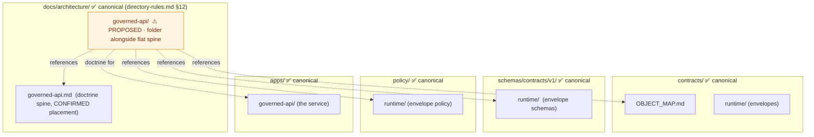
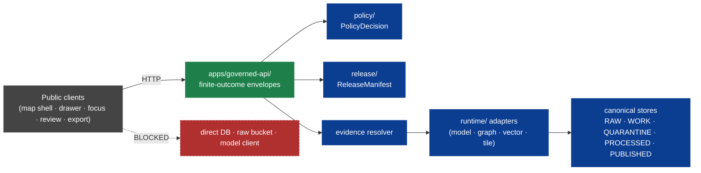

<!-- [KFM_META_BLOCK_V2]
doc_id: kfm://doc/architecture-governed-api-readme
title: Governed API — Folder Landing
type: standard
version: v0.1
status: draft
owners: API steward + Security steward · NEEDS VERIFICATION
created: 2026-05-24
updated: 2026-05-24
policy_label: public
related:
  - ../governed-api.md
  - ../cross-domain/README.md
  - ../cross-domain/trust-membrane.md
  - ../cross-domain/shared-kernel.md
  - ../directory-rules.md#12
  - ../../doctrine/trust-membrane.md
  - schemas/contracts/v1/runtime/runtime_response_envelope.schema.json
  - apps/governed-api/README.md
tags: [kfm, architecture, governed-api, trust-membrane, doctrine]
notes:
  - PROPOSED. Folder-vs-flat-file placement diverges from directory-rules.md §12 (OPEN-DR-12 META).
  - The parent docs/architecture/governed-api.md is the doctrine spine; these siblings expand specific concerns.
[/KFM_META_BLOCK_V2] -->

<a id="top"></a>

# Governed API — Folder Landing

> *Landing doc for the governed-API folder. The parent `docs/architecture/governed-api.md` is the doctrine spine; the siblings here expand specific cross-cutting concerns — threat model, audience classes, envelopes, lifecycle gates, error vocabulary, and deployment rules.*


-blue)


**Status:** draft · **Owners:** API steward + Security steward *(NEEDS VERIFICATION)* · **Last updated:** 2026-05-24

> [!IMPORTANT]
> **The governed API is the trust membrane in executable form.** It is the single public trust path for KFM clients *(parent doc `governed-api.md` §1, CONFIRMED)*. Public clients never read `RAW`, `WORK`, `QUARANTINE`, canonical stores, graph stores, vector indexes, or model runtimes; they consume `RuntimeResponseEnvelope` only.

> [!CAUTION]
> **Path placement diverges from Directory Rules v1.2 §12.** §12 shows the convention as `docs/architecture/<topic>.md` *(flat files)*; this lane introduces a `governed-api/` **subfolder** with a README inside, alongside the existing flat `docs/architecture/governed-api.md`. Recorded as **OPEN-DR-12 META (PROPOSED)** below. Treat sibling paths under this folder as PROPOSED until reconciled.

> [!NOTE]
> **What this README is not.** It is not the authoritative source for any single governed-API concept. The parent doc *(`docs/architecture/governed-api.md`)* is the doctrine spine. Each sibling here expands one specific concern; this landing links and orients.

---

## Table of contents

1. [Scope](#1-scope)
2. [Repo fit — Directory Rules basis](#2-repo-fit--directory-rules-basis)
3. [What lives here · What does not live here](#3-what-lives-here--what-does-not-live-here)
4. [Directory tree (PROPOSED)](#4-directory-tree-proposed)
5. [The governed-API landscape](#5-the-governedapi-landscape)
6. [Sibling docs at a glance](#6-sibling-docs-at-a-glance)
7. [Anti-patterns](#7-anti-patterns)
8. [Open questions and ADR triggers](#8-open-questions-and-adr-triggers)
9. [Related docs](#9-related-docs)
10. [Appendix](#10-appendix)

---

## 1. Scope

This folder gathers the cross-cutting concerns that the parent `governed-api.md` references but does not exhaust: the threat model that the deny-by-default rules defend against, the audience-class vocabulary that route classifications draw on, the envelope catalog and reason-code surface, the relationship between API admission and the lifecycle promotion gates, the canonical error vocabulary, and the operational deployment posture.

> [!TIP]
> **When to read this folder.** Reach for the parent `governed-api.md` first for the doctrine spine; reach for the siblings when you are designing or reviewing a specific concern *(e.g., authoring a new route's threat model, classifying a route's audience, drafting an envelope schema, mapping a release-state to API behavior)*.

[↑ Back to top](#top)

---

## 2. Repo fit — Directory Rules basis

### 2.1 Path divergence (must be resolved)

| Concern | Requested path | Canonical pattern *(`directory-rules.md` §12)* | Recommended resolution |
|---|---|---|---|
| Folder vs flat file | `docs/architecture/governed-api/README.md` *(folder)* alongside `docs/architecture/governed-api.md` *(flat file)* | `docs/architecture/<topic>.md` *(flat file only)* | Decide via ADR whether governed-api warrants a folder *(because it fans into six substantive sub-topics)* or keeps the flat spine plus per-topic flat files. **PROPOSED.** |
| Sub-file placement | `docs/architecture/governed-api/<TOPIC>.md` | Same `<topic>.md` would live at `docs/architecture/<topic>.md` under the flat pattern | If OPEN-DR-12 META keeps the folder, this README is the landing. If it reverts to flat, the spine stays, and these sub-files migrate one level up. |

> [!IMPORTANT]
> **OPEN-DR-12 META (PROPOSED).** Decide whether `docs/architecture/governed-api/` *(folder)* coexists with `docs/architecture/governed-api.md` *(flat spine)*, or whether the folder absorbs the spine *(rename to `README.md`)*, or whether everything flattens. Recommendation: keep the folder if there are ≥3 substantive sibling files *(there are six)*; promote the flat spine into the folder's README so the spine and the siblings share a tree. Resolution lands as an ADR amendment to `directory-rules.md` §12 or as a clarification stating both patterns are acceptable.

### 2.2 Where this folder sits



[↑ Back to top](#top)

---

## 3. What lives here · What does not live here

### 3.1 What lives here

| Content | Why it belongs in `docs/architecture/governed-api/` |
|---|---|
| Threat model that the deny-by-default rules defend against | Belongs alongside the rules they motivate; expands parent §7–§8 |
| Audience-class vocabulary and integration rules | Cross-cutting across every route; expands parent §5, §7 |
| Envelope catalog *(runtime response, decision, feature-shape)* | Indexes the envelopes the API emits; expands parent §4 |
| Lifecycle-gate interaction with API admission | Maps promotion gates A–G to per-request API behavior |
| Canonical error vocabulary for the `ERROR` outcome | Stable codes for the finite-outcome contract |
| Deployment / TLS / CORS / rate-limit / secret / log discipline | Operational expression of the trust-membrane posture; expands parent §11 |

### 3.2 What does NOT live here

| Excluded | Why | Canonical home |
|---|---|---|
| The service implementation | Implementation home | `apps/governed-api/` |
| Envelope `.schema.json` files | Schema home rule | `schemas/contracts/v1/runtime/...` |
| Rego policy for envelopes / sensitivity | Policy home rule | `policy/runtime/`, `policy/<topic>/` |
| Validators / admission-check scripts | Validator home rule | `tools/validators/<topic>/` |
| Per-domain route doctrine | Domain dossier owns route surface for that domain | `docs/domains/<domain>/API_CONTRACTS.md` |
| Per-route OpenAPI / endpoint dossiers | Service repo or `contracts/` | `contracts/api/<route>/` or `apps/governed-api/contracts/` |

> [!WARNING]
> **Do not let this lane absorb implementation.** Schemas, Rego, validators, and code stay in their canonical roots; this folder is reference-only doctrine that links to them.

[↑ Back to top](#top)

---

## 4. Directory tree (PROPOSED)

```text
docs/architecture/governed-api/        ⚠ PROPOSED · folder vs §12 flat-file pattern (OPEN-DR-12 META)
├── README.md                          ◄── this file (landing + navigation)
├── THREAT_MODEL.md                    ◄── 9 trust boundaries × threats × mitigations × fixtures (PROPOSED; expands §8)
├── AUDIENCE_CLASSES.md                ◄── public/partner/steward/internal/denied — full vocabulary, auth integration, rate tiers (PROPOSED; expands §7)
├── ENVELOPES.md                       ◄── RuntimeResponseEnvelope, DecisionEnvelope, DomainFeatureEnvelope, reason codes, error vocabulary (PROPOSED)
├── LIFECYCLE_GATES.md                 ◄── how API admission interacts with promotion gates A–G; release-state enforcement (PROPOSED)
├── ERROR_CODES.md                     ◄── canonical error vocabulary for the ERROR outcome (PROPOSED)
└── DEPLOYMENT_RULES.md                ◄── deployment posture, TLS, CORS, rate limits, secret hygiene, log discipline (PROPOSED; expands §8.1)
```

> [!NOTE]
> Each sibling is a **prose doctrine doc** that links to the parent `governed-api.md`, the canonical schema / policy / app homes, and the relevant Atlas / synthesis sections. Machine artifacts go under their canonical homes, not here.

[↑ Back to top](#top)

---

## 5. The governed-API landscape

> **Evidence basis:** `governed-api.md` §§1–11 *(parent doctrine spine, CONFIRMED)*; `kfm_unified_doctrine_synthesis.md` §11 *(finite outcome envelope, CONFIRMED)*; `directory-rules.md` §7.1 *(governed-API placement, CONFIRMED)*.



| Concern | Where it lives | Sibling doc |
|---|---|---|
| Threat boundaries the API defends | This folder | [`THREAT_MODEL.md`](THREAT_MODEL.md) |
| Who is a "client", and what they may see | This folder | [`AUDIENCE_CLASSES.md`](AUDIENCE_CLASSES.md) |
| What the API may emit | This folder | [`ENVELOPES.md`](ENVELOPES.md) |
| How lifecycle state controls what may be emitted | This folder | [`LIFECYCLE_GATES.md`](LIFECYCLE_GATES.md) |
| What `ERROR` actually says | This folder | [`ERROR_CODES.md`](ERROR_CODES.md) |
| Where the service runs and how it is hardened | This folder | [`DEPLOYMENT_RULES.md`](DEPLOYMENT_RULES.md) |

[↑ Back to top](#top)

---

## 6. Sibling docs at a glance

| Sibling | Purpose | Expands |
|---|---|---|
| [`THREAT_MODEL.md`](THREAT_MODEL.md) | Nine trust boundaries with threats and mitigations; required `runtime_proof/` fixtures. | parent §8 |
| [`AUDIENCE_CLASSES.md`](AUDIENCE_CLASSES.md) | The `public` / `partner` / `steward` / `internal` / `denied` vocabulary with auth integration and rate tiers. | parent §7 |
| [`ENVELOPES.md`](ENVELOPES.md) | Envelope catalog: `RuntimeResponseEnvelope`, `DecisionEnvelope`, `DomainFeatureEnvelope`, reason codes. | parent §4, §9 |
| [`LIFECYCLE_GATES.md`](LIFECYCLE_GATES.md) | How API admission ties to promotion gates A–G; release-state enforcement; rollback effects. | parent §6, §11.2 |
| [`ERROR_CODES.md`](ERROR_CODES.md) | Canonical error vocabulary for the `ERROR` outcome; codespace, ranges, stability. | parent §4, App. A |
| [`DEPLOYMENT_RULES.md`](DEPLOYMENT_RULES.md) | TLS, CORS, rate limits, secret hygiene, log discipline, network policy. | parent §11.1, §11.3 |

[↑ Back to top](#top)

---

## 7. Anti-patterns

| Anti-pattern | Why it breaks the trust path | Mitigation |
|---|---|---|
| **Per-domain copies of envelope doctrine** | Fragments the kernel; readers can't cross-compare. | Use envelopes from `ENVELOPES.md`; per-domain payloads slot inside. |
| **Threat-model exception not recorded in `DRIFT_REGISTER.md`** | Silent erosion of the deny-by-default posture. | Drift entry + ADR; not a one-off bypass. |
| **Audience class implied by deployment** *(e.g., "this route is internal because it's behind a VPN")* | Audience class must be a design-time contract; deployment shifts; reasoning rots. | Class declared in route metadata; OPA enforces. |
| **`ERROR` code invented per-incident** | Codespace fragments; clients can't react. | Canonical vocabulary in `ERROR_CODES.md`; new codes require an entry. |
| **CORS / rate-limit / TLS posture defined in `apps/governed-api/` ad-hoc** | Operational drift; new routes get inconsistent treatment. | Doctrine in `DEPLOYMENT_RULES.md`; service inherits. |
| **API admits content from a state the lifecycle has not released** | Trust-membrane violation. | `LIFECYCLE_GATES.md` rule: only `PUBLISHED` content reaches `ANSWER`. |

[↑ Back to top](#top)

---

## 8. Open questions and ADR triggers

| Open item | Class | Suggested ADR title *(PROPOSED)* |
|---|---|---|
| **OPEN-DR-12 META** — Reconcile `docs/architecture/governed-api/` *(folder)* with `docs/architecture/governed-api.md` *(flat spine)*. | Directory Rules §2.4 *(structural)* | "Governed-API architecture lane — folder vs flat-file vs hybrid". |
| Stabilize audience-class enum *(5 values)*. | Vocabulary | "Audience-class enumeration". |
| `DomainFeatureEnvelope` — canonical kernel object or domain-specific shape? | Object family | "DomainFeatureEnvelope unification". |
| `ERROR` code stability discipline — semver-style codespace or open registry? | Stability | "Error-code codespace governance". |
| Rate-limit tier surface — public manifest or internal-only? | Operational | "Rate-limit tier disclosure". |

[↑ Back to top](#top)

---

## 9. Related docs

| Reference | Role | Truth label |
|---|---|---|
| `docs/architecture/governed-api.md` *(parent, flat spine)* | Authoritative doctrine for the governed API | CONFIRMED doctrine |
| `docs/architecture/cross-domain/trust-membrane.md` | Cross-domain expression of the membrane | CONFIRMED doctrine |
| `docs/architecture/cross-domain/shared-kernel.md` | `DecisionEnvelope`, `EvidenceBundle`, `AIReceipt` definitions | CONFIRMED doctrine |
| `docs/architecture/cross-domain/cross-lane-relations.md` | The four invariants the API enforces at runtime | CONFIRMED doctrine |
| `docs/architecture/cross-domain/responsibility-layers.md` | API layer (5) and its relation to evidence (1), policy (2), release (4) | CONFIRMED doctrine |
| `docs/doctrine/trust-membrane.md` *(if present)* | Foundational doctrine | CONFIRMED doctrine |
| `directory-rules.md` §7.1, §12 | Governed-API and placement law | CONFIRMED doctrine |
| `kfm_unified_doctrine_synthesis.md` §11 | Finite outcome envelope | CONFIRMED doctrine |
| `contracts/OBJECT_MAP.md` | Where object meaning is canonical | CONFIRMED doctrine *(PROPOSED path)* |
| `schemas/contracts/v1/runtime/runtime_response_envelope.schema.json` | Envelope shape | PROPOSED |
| `apps/governed-api/README.md` | Service boundary | PROPOSED |

[↑ Back to top](#top)

---

## 10. Appendix

<details>
<summary><strong>10.1 Glossary</strong></summary>

| Term | Definition |
|---|---|
| **Governed API** | The single public trust path for KFM; the trust membrane in executable form. |
| **Finite-outcome contract** | The rule that every API response is `ANSWER` / `ABSTAIN` / `DENY` / `ERROR`. |
| **`RuntimeResponseEnvelope`** | The wire envelope every endpoint emits. |
| **`DecisionEnvelope`** | The envelope that pairs `PolicyDecision` with the outcome and payload reference. |
| **`DomainFeatureEnvelope`** | *(PROPOSED — see `ENVELOPES.md`)* Per-domain feature payload that slots inside `RuntimeResponseEnvelope.payload`. |
| **Audience class** | `public` / `partner` / `steward` / `internal` / `denied`. |
| **Trust boundary** | A point in the architecture where one component's assumptions about another are checked, not implied. |
| **Reason code** | A short stable identifier for why an `ABSTAIN` / `DENY` / `ERROR` was emitted. |

</details>

<details>
<summary><strong>10.2 Truth-label legend</strong></summary>

- **CONFIRMED** — verified this session from attached docs.
- **PROPOSED** — design / placement / inference not yet verified in implementation.
- **INFERRED** — derivable from confirmed evidence but not directly stated.
- **NEEDS VERIFICATION** — checkable, but not yet checked strongly enough to act as fact.

</details>

---

**Related (mini)** · [parent spine `governed-api.md`](../governed-api.md) · [`THREAT_MODEL.md`](THREAT_MODEL.md) · [`AUDIENCE_CLASSES.md`](AUDIENCE_CLASSES.md) · [`ENVELOPES.md`](ENVELOPES.md) · [`LIFECYCLE_GATES.md`](LIFECYCLE_GATES.md) · [`ERROR_CODES.md`](ERROR_CODES.md) · [`DEPLOYMENT_RULES.md`](DEPLOYMENT_RULES.md)

**Last updated:** 2026-05-24 · **Doc version:** v0.1 · **Doc status:** draft · **Path status:** PROPOSED *(OPEN-DR-12 META)*

[↑ Back to top](#top)
