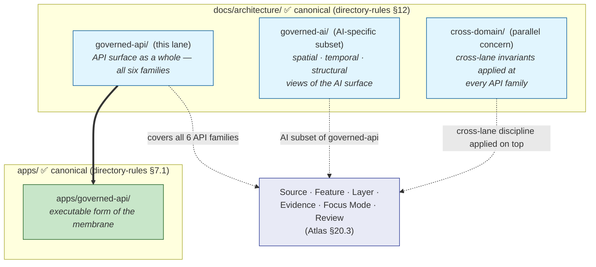

<!-- [KFM_META_BLOCK_V2]
doc_id: kfm://doc/architecture-governed-api-readme
title: Governed API
type: standard
version: v0.1
status: draft
owners: <ARCHITECTURE-DOCTRINE-OWNER> · <API-SURFACE-STEWARD> · NEEDS VERIFICATION
created: 2026-05-24
updated: 2026-05-24
policy_label: public
related:
  - directory-rules.md#7
  - directory-rules.md#12
  - ai-build-operating-contract.md#9
  - ai-build-operating-contract.md#21
  - ai-build-operating-contract.md#22
  - kfm_unified_doctrine_synthesis.md#11
  - Kansas_Frontier_Matrix_-_Domains_v1_1___Pass_23_32_Consolidated_Atlas.md#203
  - Kansas_Frontier_Matrix_-_Domains_v1_1___Pass_23_32_Consolidated_Atlas.md#2432
  - Kansas_Frontier_Matrix_-_Domains_v1_1___Pass_23_32_Consolidated_Atlas.md#2492
  - KFM_Unified_Implementation_Architecture_Build_Manual.md#16
  - Master_MapLibre_Components-Functions-Features_v2_1_FULL.md#10
  - docs/architecture/governed-ai/ROUTE_MAP.md
  - docs/architecture/governed-ai/BOUNDARIES.md
  - docs/architecture/governed-ai/CONTINUITY_NOTES.md
  - docs/architecture/cross-domain/README.md
tags: [kfm, architecture, governed-api, trust-membrane, api-surface, audience-class]
notes:
  - PROPOSED. Third folder-pattern under docs/architecture/ (after cross-domain/ and governed-ai/); same OPEN-DR-10/-11 family.
  - Triggers OPEN-DR-12 (PROPOSED) — a META-amendment to directory-rules.md §12 to permit either flat-file or folder-with-README under docs/architecture/.
  - "Governed API" definition is CONFIRMED doctrine (ai-build-operating-contract.md §9.3); folder placement is PROPOSED.
  - No mounted repo evidence in this session; all repo-shaped claims labeled PROPOSED.
[/KFM_META_BLOCK_V2] -->

<a id="top"></a>

# Governed API

> *Architecture lane for the trust membrane in interface form — the API that enforces evidence, policy, release, finite outcomes, and audit on behalf of every public client. This README is the landing for the lane; sibling docs cover threat-model, envelopes, audience classes, error vocabulary, and lifecycle gates.*


-blue)

-informational)


**Status:** draft · **Owners:** `<ARCHITECTURE-DOCTRINE-OWNER>` · `<API-SURFACE-STEWARD>` *(NEEDS VERIFICATION)* · **Last updated:** 2026-05-24

> [!IMPORTANT]
> **Definition — verbatim from doctrine.** **Governed API:** *"Interface enforcing evidence, policy, release, finite outcomes, and audit"* *(`ai-build-operating-contract.md` §9.3, **CONFIRMED**)*. It is the **trust membrane in executable form** *(`directory-rules.md` §7.1, **CONFIRMED**)*. Public clients and normal UI surfaces MUST use governed APIs and released artifacts, never canonical/internal stores or raw model outputs *(`KFM-P1-FEAT-0038`)*.

> [!CAUTION]
> **Path divergence — same family as OPEN-DR-10 and OPEN-DR-11.** This is the **third** folder pattern introduced under `docs/architecture/` *(after `cross-domain/` and `governed-ai/`)*. The systemic pattern is now clear enough to propose **OPEN-DR-12 (PROPOSED)** as a META-amendment to `directory-rules.md` §12, permitting either the flat-file pattern *(`docs/architecture/<topic>.md`)* or the folder-with-README pattern *(`docs/architecture/<topic>/README.md`)* when a topic warrants a sub-lane with multiple substantive docs. See [§2](#2-repo-fit--open-dr-12-meta-amendment-proposed).

> [!NOTE]
> **What this README is and is not.** It is the **architectural landing** for the governed-API lane — orientation, scope, sibling map. It is **not** the executable app *(that is `apps/governed-api/`)*; **not** the route inventory *(that is [`docs/architecture/governed-ai/ROUTE_MAP.md`](../governed-ai/ROUTE_MAP.md) — Atlas §20.3 names the six API families canonically)*; **not** the policy bundle *(`policy/governed_ai/` and `policy/<topic>/`)*; **not** the schema home *(`schemas/contracts/v1/runtime/`, `schemas/contracts/v1/ai/`, etc.)*. This file links them.

---

## Table of contents

1. [Scope](#1-scope)
2. [Repo fit — OPEN-DR-12 META amendment (PROPOSED)](#2-repo-fit--open-dr-12-meta-amendment-proposed)
3. [What "Governed API" means](#3-what-governed-api-means)
4. [Relationship to other architecture lanes](#4-relationship-to-other-architecture-lanes)
5. [The trust membrane in executable form](#5-the-trust-membrane-in-executable-form)
6. [The six API families *(reference)*](#6-the-six-api-families-reference)
7. [Audience classes](#7-audience-classes)
8. [Trust boundaries the API must threat-model](#8-trust-boundaries-the-api-must-threat-model)
9. [What lives here · What does not live here](#9-what-lives-here--what-does-not-live-here)
10. [Directory tree (PROPOSED)](#10-directory-tree-proposed)
11. [Anti-patterns](#11-anti-patterns)
12. [Open questions and ADR triggers](#12-open-questions-and-adr-triggers)
13. [Related docs](#13-related-docs)
14. [Appendix — glossary and reference](#14-appendix--glossary-and-reference)

---

## 1. Scope

This lane covers the **governed API as an architectural surface** — every concern that applies to the trust membrane as a whole, regardless of which API family *(source / feature / layer / evidence / focus-mode / review)* is being served. A reviewer working on a single route consults `docs/architecture/governed-ai/ROUTE_MAP.md` *(or the per-family contract under `contracts/`)*; a reviewer working on **cross-route** concerns *(threat model, envelope discipline, audience tiers, error vocabulary, lifecycle admission gates, security posture)* consults this lane.

> [!TIP]
> **When to read this lane.** Read this lane when your change is to a property of the **API surface as a whole** — for example: introducing a new envelope field, changing how audience class is enforced, adding a new error code, hardening the membrane against a newly identified threat. Single-route changes live with their route family.

[↑ Back to top](#top)

---

## 2. Repo fit — OPEN-DR-12 META amendment (PROPOSED)

### 2.1 The pattern is now systemic

| # | Folder | Introduced | Open-DR record |
|---|---|---|---|
| 1 | `docs/architecture/cross-domain/` | Prior turn *(README only)* | **OPEN-DR-10** *(folder vs flat)* |
| 2 | `docs/architecture/governed-ai/` | Prior turns *(BOUNDARIES + CONTINUITY_NOTES + ROUTE_MAP — 3 siblings)* | **OPEN-DR-11** *(folder + ALL-CAPS; 3-sibling threshold reached)* |
| 3 | `docs/architecture/governed-api/` *(this lane)* | This turn *(README — first sibling)* | **OPEN-DR-12** *(META amendment proposed; see §2.2)* |

Three folders, three open-DRs, **same divergence family**. Filing OPEN-DR-12 per-folder would multiply ADR debt without resolving the systemic question.

### 2.2 OPEN-DR-12 — META amendment (PROPOSED)

> [!IMPORTANT]
> **OPEN-DR-12 (PROPOSED).** Amend `directory-rules.md` §12 to permit either pattern under `docs/architecture/`:
>
> - **Flat-file pattern** *(current, `docs/architecture/<topic>.md`)* — appropriate when a topic resolves to a single document.
> - **Folder-with-README pattern** *(proposed, `docs/architecture/<topic>/README.md` + siblings)* — appropriate when a topic warrants multiple substantive sibling docs *(e.g., axis-specific views, sub-topic deep dives)*. The folder pattern is admissible when at least one of the following is true:
>   1. The topic has ≥3 substantive sibling docs *(as `governed-ai/` does)*.
>   2. The topic has a clearly enumerable set of sub-concerns that warrant separate documents *(threat-model, envelopes, audience classes, error vocabulary, etc., as this lane likely will)*.
>   3. The topic is itself a navigational landing for a body of governance *(as `cross-domain/` is)*.
>
> **Counter-rules preserved:** the folder MUST NOT become a parallel authority for schemas, policies, validators, or contracts — those still live under their canonical responsibility roots *(`schemas/`, `policy/`, `tools/`, `contracts/`)*.
>
> **If OPEN-DR-12 is accepted**, OPEN-DR-10 and OPEN-DR-11 resolve automatically; they cease to be per-folder questions and become applications of the amended rule. **If rejected**, all three folders flatten to `<topic>.md` files at next migration.

### 2.3 What this README assumes

Pending OPEN-DR-12, this README **assumes the folder pattern will be accepted** *(because the systemic pattern argues for it)* but labels every sibling path PROPOSED so flattening remains reversible.

[↑ Back to top](#top)

---

## 3. What "Governed API" means

> **Evidence basis:** `ai-build-operating-contract.md` §9.3 *(definition)*; `directory-rules.md` §7.1 *(executable form)*; `kfm_unified_doctrine_synthesis.md` §11 *(finite outcomes)*; `KFM-P1-FEAT-0038` *(Governed API as trust membrane)*; Atlas §19 *(Cross-Domain Systems)*. **CONFIRMED doctrine.**

The governed API is the **interface that enforces** five governance dimensions on every public response:

| Dimension | What the API enforces | Where it shows up in the contract |
|---|---|---|
| **Evidence** | `EvidenceRef` resolves to `EvidenceBundle` before a consequential claim is emitted. | `EvidenceBundle` resolver *(Atlas §20.3 family 4)*; `evidence_ids` field in `AIReceipt`; citation validation report. |
| **Policy** | `PolicyDecision` is consulted at pre-check and post-check; allow/deny/abstain/error outcomes preserved. | `policy_decision_id` on every envelope; OPA/Rego gates per family. |
| **Release** | Only `PUBLISHED` artifacts may exit the membrane; `ReleaseManifest` references included on responses where applicable. | `release_id` field; layer manifest resolver gates *(family 3)*; release state on `EvidenceBundle`. |
| **Finite outcomes** | Every response is `ANSWER` / `ABSTAIN` / `DENY` / `ERROR` *(plus optional `NARROWED` / `BOUNDED` / `HOLD` per family)*. | `RuntimeResponseEnvelope.outcome` *(Atlas §24.3.1)*. |
| **Audit** | Every consequential operation emits a receipt *(`RunReceipt`, `AIReceipt`, `GENERATED_RECEIPT`)*. | Receipt references on envelopes; trail persisted internally. |

> [!IMPORTANT]
> **"Governed" is not a quality, it is a contract.** A non-governed API can still be useful — but it is not the trust membrane. Anything labeled "governed" in KFM MUST enforce all five dimensions on every response; partial enforcement is no enforcement *(per `KFM-P1-FEAT-0038`)*.

[↑ Back to top](#top)

---

## 4. Relationship to other architecture lanes

> **Doctrine status:** the relationships below are CONFIRMED through the corpus *(each cited)*. The visual framing here is INFERRED-from-corpus *(no single carrier draws this diagram)*.



| Lane | What it covers | What it does NOT cover |
|---|---|---|
| **`docs/architecture/governed-api/`** *(this lane)* | API surface as a whole — membrane, envelopes, audience classes, threat model, error vocabulary, lifecycle gates. All six API families. | Per-route URL/method choice *(see ROUTE_MAP)*; per-family DTO details *(see ROUTE_MAP §6)*; AI-specific spatial/temporal/structural concerns *(see governed-ai/)*. |
| **`docs/architecture/governed-ai/`** | The AI **subset** of the governed API: Focus Mode, AIReceipt, model adapters. Spatial *(BOUNDARIES)*, temporal *(CONTINUITY_NOTES)*, structural *(ROUTE_MAP)*. | Non-AI route families *(Source, Feature, Layer, Evidence, Review — though ROUTE_MAP catalogues them for context)*. |
| **`docs/architecture/cross-domain/`** | The cross-lane invariants that any API family must preserve *(source role, ownership, sensitivity, `EvidenceBundle` support)*. | API-surface mechanics; route shapes. |

> [!NOTE]
> **Focus Mode is the overlap point.** Focus Mode is **both** a governed-API route family *(Atlas §20.3 family 5)* **and** the canonical AI surface. `governed-api/` owns the **API-contract** view of Focus Mode *(envelope, audience, gates)*; `governed-ai/` owns the **boundary** view *(what AI may touch, how AI work persists across time)*. Either folder can speak to Focus Mode; the two views compose without conflict.

[↑ Back to top](#top)

---

## 5. The trust membrane in executable form

> **Evidence basis:** `directory-rules.md` §7.1 *(`apps/governed-api/` role)*; `Master_MapLibre_Components-Functions-Features_v2.1_FULL.md` §10 *(governance and trust-membrane chapter)*. **CONFIRMED doctrine.**

```mermaid
flowchart LR
  subgraph CLIENT["Public clients"]
    EX["apps/explorer-web/"]
    PARTNER["partner clients"]
  end
  subgraph STEW["Steward clients"]
    RC["apps/review-console/"]
  end
  subgraph MEMBRANE["apps/governed-api/  — the trust membrane in executable form"]
    direction TB
    AUTH["audience-class admission<br/>(public · partner · steward · internal · denied)"]
    PRE["policy precheck"]
    EVD["EvidenceRef → EvidenceBundle resolution"]
    GATE["release-state · sensitivity · rights gates"]
    POST["policy postcheck · citation validation"]
    ENV["RuntimeResponseEnvelope<br/>+ receipt"]
  end
  subgraph INT["Internal — never reachable from outside the membrane"]
    RAW["RAW · WORK · QUARANTINE"]
    CANON["canonical / internal stores"]
    MODEL["direct model runtime"]
  end
  EX --> AUTH
  PARTNER --> AUTH
  RC --> AUTH
  AUTH --> PRE --> EVD --> GATE --> POST --> ENV
  ENV --> EX
  ENV --> PARTNER
  ENV --> RC
  INT -. "never crosses the membrane" .- MEMBRANE
  classDef client fill:#c8e6c9,stroke:#1b5e20;
  classDef stew fill:#e1f5fe,stroke:#01579b;
  classDef mem fill:#e8eaf6,stroke:#283593;
  classDef int fill:#ffebee,stroke:#b71c1c;
  class EX,PARTNER client;
  class RC stew;
  class AUTH,PRE,EVD,GATE,POST,ENV mem;
  class RAW,CANON,MODEL int;
```



| Layer | Role |
|---|---|
| **Audience-class admission** | Reject requests whose audience class does not match the route's contract *(public clients to internal routes, etc.)*. |
| **Policy precheck** | OPA/Rego decision before any evidence or model work; fail-closed on missing policy engine. |
| **Evidence resolution** | `EvidenceRef` → `EvidenceBundle`; closure required before consequential claims. |
| **Release / sensitivity / rights gates** | Apply `ReleaseManifest`, sensitivity matrix, and rights status; sensitive-domain defaults applied. |
| **Policy postcheck + citation validation** | Output-side gates: citations validated; sensitive content redacted; policy denials applied. |
| **Envelope + receipt emission** | Finite-outcome envelope leaves the membrane; receipt persisted internally. |

> [!IMPORTANT]
> **`apps/governed-api/` is the only public trust path.** Per `directory-rules.md` §7.1: *"`apps/governed-api/` — main trust membrane; public clients land here."* If `apps/api/` also exists, the canonical boundary MUST be declared via ADR; `apps/api/` is either deprecated, internal-only, or a narrowly documented service.

[↑ Back to top](#top)

---

## 6. The six API families *(reference)*

> **Evidence basis:** `Kansas_Frontier_Matrix_-_Domains_v1_1___Pass_23_32_Consolidated_Atlas.md` §20.3 *(Master API Surface Table)*. **CONFIRMED doctrine.**

The governed API consists of **exactly six families**. The canonical inventory and per-family detail lives in [`docs/architecture/governed-ai/ROUTE_MAP.md`](../governed-ai/ROUTE_MAP.md) *(which preserves Atlas §20.3 verbatim)*. This README does not duplicate the route table; it points at it.

| # | API family | Owned by *(API-surface view)* | Owned by *(AI-surface view)* |
|---|---|---|---|
| 1 | Source summary resolver | this lane | — |
| 2 | Domain feature/detail lookup | this lane | — |
| 3 | Layer manifest resolver | this lane | — |
| 4 | Evidence resolver | this lane | — |
| 5 | **Focus Mode runtime** | this lane *(API contract)* | `governed-ai/` *(boundary, continuity, route map)* |
| 6 | Review queue surface | this lane *(SoD enforcement)* | — |

> [!CAUTION]
> **Adding a seventh family is doctrinally heavy.** A new API family requires an ADR amending Atlas §20.3, a new outcome × surface row in §24.3.2, a new schema home, a new policy home, and an audit-gate definition. **CONFIRMED** per `ai-build-operating-contract.md` §28 *(ADR requirements)*.

[↑ Back to top](#top)

---

## 7. Audience classes

> **Evidence basis:** Pass 32 idea card `KFM-P9-PROG-0069` *(API audience class as a contract and exposure field — PROPOSED)*; `directory-rules.md` §7.1 *(app role table — public, steward, internal, restricted)*. **PROPOSED vocabulary; CONFIRMED principle.**

Every governed-API route declares its audience class on the contract *(not in middleware, not in route configuration — on the contract)*. The five classes:

| Class | Definition | Typical clients | Where it lives |
|---|---|---|---|
| **public** | Open to any client of the public governed API. | `apps/explorer-web/`; partner web apps; public datasets. | Routes serving released, public-safe projections of the six families. |
| **partner** | Open to named partner organizations under agreement. | Partner research portals; named integrations. | Routes serving restricted-tier projections with agreement-based access. |
| **steward** | Restricted to authenticated stewards / domain owners. | `apps/review-console/` users. | Review queue surface; full-projection evidence resolver; sensitive-domain views. |
| **internal** | Restricted to KFM internal infra and audit clients. | `apps/cli/`; `apps/workers/`; audit pipelines. | Receipt audit; drift register query; internal admin diagnostics. |
| **denied** | Documented as **never to be exposed** by any audience class. | — | Documented as forbidden routes *(see ROUTE_MAP §10)*; serves as the explicit no-list. |

> [!IMPORTANT]
> **Audience class is a CONTRACT property, not a route property.** A single route path may serve different **projections** to different audiences *(e.g., `EvidenceBundle` for steward includes restricted geometry; same `EvidenceBundle` for public includes only the redacted projection)*. Putting the class on the contract makes that projection a **reviewable governance decision**, not implicit middleware behavior *(per `KFM-P9-PROG-0069`)*.

> [!NOTE]
> **Future sibling.** The audience-class details *(per-route required claims, JWT/OIDC integration, rate-limit tiering, partner-agreement metadata)* belong in a dedicated `AUDIENCE_CLASSES.md` sibling, not in this README. **PROPOSED.**

[↑ Back to top](#top)

---

## 8. Trust boundaries the API must threat-model

> **Evidence basis:** `KFM_Unified_Implementation_Architecture_Build_Manual.md` §16.2 *(Trust boundaries to threat model)*; §16.3 *(Deployment rules)*. **CONFIRMED doctrine.**

The governed API does not exist in isolation; it sits at the intersection of nine trust boundaries, each with its own threat surface. **The build manual enumerates them; this lane SHOULD have a sibling threat-model doc that expands each row into a working threat model.**

| # | Boundary | Threats *(CONFIRMED — Build Manual §16.2)* |
|---|---|---|
| 1 | **External source → pre-RAW** | malicious content, source spoofing, license ambiguity, schema drift, huge payloads. |
| 2 | **RAW → WORK** | parser bugs, injection, geospatial topology failures, unbounded processing. |
| 3 | **WORK → PROCESSED** | false identity merging, temporal collapse, lost provenance. |
| 4 | **PROCESSED → PUBLISHED** | policy bypass, sensitivity leak, uncited claims, stale data. |
| 5 | **API → client** | broken object-level authorization, excessive data exposure, rate / resource abuse. |
| 6 | **Map client → API** | feature-ID tampering, bbox scraping, hidden sensitive geometry inference. |
| 7 | **UI → AI runtime** | prompt injection, source leakage, direct model access, uncited answer. |
| 8 | **Admin / review routes** | privilege escalation, audit bypass, unauthorized promotion. |
| 9 | **Artifact hosting** | in-place overwrite, stale CDN, missing signatures, range-request issues. |

### 8.1 Deployment rules summary *(CONFIRMED — Build Manual §16.3)*

- Deny by default.
- Public routes go through governed API only.
- Admin / debug / proof / source-ledger / model-health routes require authentication and authorization.
- No direct public traffic to local model runtimes.
- Do not expose Ollama *(or equivalent)* model APIs directly.
- Use TLS, rate limits, request size limits, audit logging, and safe CORS/CSP.
- Never commit secrets.
- Logs include request IDs, policy decisions, adapter metadata, citation report IDs, receipt IDs; logs **exclude** secrets, private reasoning, raw sensitive evidence, and unrestricted source dumps.
- Published artifacts are **immutable by release ID**.

> [!NOTE]
> **Future sibling.** A dedicated `THREAT_MODEL.md` sibling SHOULD expand each row above into a full threat model *(STRIDE-style or similar; per Build Manual §16.1)* with documented mitigations and test fixtures. **PROPOSED.**

[↑ Back to top](#top)

---

## 9. What lives here · What does not live here

### 9.1 What lives here

| Content | Why it belongs in `docs/architecture/governed-api/` |
|---|---|
| Cross-family API-surface concerns — envelope discipline, audience classes, error vocabulary, lifecycle admission gates, security posture, threat model | These apply to every API family and would create cross-cutting drift if owned by any single family. |
| The governed-API ↔ app-tree mapping *(`apps/governed-api/` and its peers)* | The doctrine connection between the abstract membrane and the executable form. |
| Documentation of the trust-membrane discipline at the API level | The boundary lives partly in routes, partly in policy, partly in deployment; the lane is where they cohere. |
| Anti-pattern register specific to the API surface as a whole | E.g., `apps/admin/` shortcut routing, `apps/api/` vs `apps/governed-api/` drift, parallel auth surfaces. |
| Open ADR triggers about the API surface | E.g., OPEN-DR-06 *(apps/web vs apps/explorer-web)*, OPEN-DR-12 *(this lane's META amendment)*. |

### 9.2 What does NOT live here

| Excluded | Canonical home |
|---|---|
| Per-route URL/method choices | [`docs/architecture/governed-ai/ROUTE_MAP.md` §6](../governed-ai/ROUTE_MAP.md) *(family-level)*; per-domain `docs/domains/<domain>/` *(per-feature)*. |
| API-family schemas *(`.schema.json`)* | `schemas/contracts/v1/<family-or-object>/...` |
| API-family policies *(Rego)* | `policy/governed_ai/...` for AI-runtime; `policy/<topic>/...` for cross-family. |
| AI-specific boundary, continuity, structural concerns | `docs/architecture/governed-ai/{BOUNDARIES,CONTINUITY_NOTES,ROUTE_MAP}.md` |
| Cross-lane invariants *(source role, sensitivity, ownership)* | `docs/architecture/cross-domain/README.md` |
| The executable app | `apps/governed-api/` |
| Domain-specific API contracts | `docs/domains/<domain>/` + `contracts/domains/<domain>/` |
| OpenAPI / runtime envelope specs | `schemas/contracts/v1/runtime/`; `contracts/<api-family>/` |
| Source-admission rules | `docs/architecture/sources/` *(PROPOSED future lane)* or `contracts/sources/` |

> [!WARNING]
> **Do not let this lane absorb implementation.** A doctrine lane that grows schemas, policies, validators, or app code inside `docs/` becomes a parallel authority. Same rule as cross-domain README §3.2 and governed-ai BOUNDARIES §3.

[↑ Back to top](#top)

---

## 10. Directory tree (PROPOSED)

**PROPOSED — assumes OPEN-DR-12 resolves to "permit folder pattern".** If OPEN-DR-12 is rejected, all siblings below flatten to `docs/architecture/governed-api-<topic>.md` or merge into a single `docs/architecture/governed-api.md`.

```text
docs/architecture/governed-api/        ⚠ PROPOSED · folder vs §12 flat-file pattern (OPEN-DR-12 META)
├── README.md                          ◄── this file (landing + navigation)
├── THREAT_MODEL.md                    ◄── 9 trust boundaries × threats × mitigations × fixtures (PROPOSED; expands §8)
├── AUDIENCE_CLASSES.md                ◄── public/partner/steward/internal/denied — full vocabulary, auth integration, rate tiers (PROPOSED; expands §7)
├── ENVELOPES.md                       ◄── RuntimeResponseEnvelope, DecisionEnvelope, DomainFeatureEnvelope, reason codes, error vocabulary (PROPOSED)
├── LIFECYCLE_GATES.md                 ◄── how API admission interacts with promotion gates A–G; release-state enforcement (PROPOSED)
├── ERROR_CODES.md                     ◄── canonical error vocabulary for the ERROR outcome (PROPOSED)
└── DEPLOYMENT_RULES.md                ◄── deployment posture, TLS, CORS, rate limits, secret hygiene, log discipline (PROPOSED; expands §8.1)
```

> [!NOTE]
> **Each sibling expands a section of this README.** §8 → `THREAT_MODEL.md`; §7 → `AUDIENCE_CLASSES.md`; §8.1 → `DEPLOYMENT_RULES.md`; etc. The pattern is the same as `governed-ai/` *(axis-specific deep dives)* — each sibling owns its sub-topic; the README orients.

[↑ Back to top](#top)

---

## 11. Anti-patterns

> **Evidence basis:** Atlas §24.9.2 *(Trust-membrane anti-patterns)*; `directory-rules.md` §13.5 *(placement anti-patterns)*; `ai-build-operating-contract.md` §38. **CONFIRMED doctrine.**

| Anti-pattern | Why it breaks the governed API | Mitigation |
|---|---|---|
| **Public client reads RAW / WORK / QUARANTINE.** | Trust membrane bypassed; promotion gates skipped. | Public reads go through `apps/governed-api/` only; lifecycle invariant enforced *(`directory-rules.md` §9.2)*. |
| **Map shell consumes canonical / internal store directly.** | Renderer becomes the public surface and inherits no governance. | `apps/explorer-web/` reads via `apps/governed-api/`; never from `data/raw\|work\|quarantine`. |
| **`apps/api/` becomes a shadow trust path alongside `apps/governed-api/`.** | Two competing authorities; reviewers no longer know which is canonical. | If both exist, declare canonical boundary via ADR *(per `directory-rules.md` §7.1)*; `apps/api/` is deprecated, internal-only, or narrowly documented. |
| **AI generation routed through `apps/admin/` shortcut.** | Admin bypass becomes a normal-path public route. | `apps/admin/` MUST NOT become the normal public path; justified, constrained, documented, audited *(directory-rules §7.1)*. |
| **Adding a seventh API family without ADR.** | Atlas §20.3 enumerates six; a new family is a contract-level change. | ADR required *(AIBOC §28)*; amend Atlas §20.3 + §24.3.2 + schema/policy homes + audit gates. |
| **API responses without envelope.** | Raw fluent prose / unstructured JSON breaks the finite-outcome rule. | Every response is `RuntimeResponseEnvelope` *(or family-specific extension)*; outcome ∈ `{ANSWER, ABSTAIN, DENY, ERROR}`. |
| **API exposing `policy_decision` internals.** | Leaks internal reasoning into the client surface; reviewable as a separate audit channel only. | Envelope carries `policy_decision_id` *(reference)*, not the full decision object. |
| **Audience class enforced only in middleware, not declared on contract.** | Drift between "documented who can call this" and "what middleware actually does". | Audience class on the contract *(per `KFM-P9-PROG-0069`)*; middleware validates the contract. |
| **Direct model traffic from public clients.** | UI ↔ AI runtime boundary *(Build Manual §16.2 row 7)* violated. | Model adapters live behind the governed membrane; no direct model client path *(`BOUNDARIES.md` §10)*. |
| **Logs leak private chain-of-thought, secrets, or raw sensitive evidence.** | Audit becomes an exfiltration channel. | Log discipline per Build Manual §16.3: include request IDs, policy decisions, adapter metadata, citation report IDs, receipt IDs; **exclude** secrets, private reasoning, raw sensitive evidence, unrestricted source dumps. |
| **Mutating published artifacts in place.** | Release IDs lose immutability; rollback chain breaks. | Published artifacts immutable by release ID *(Build Manual §16.3)*; new release = new manifest. |

[↑ Back to top](#top)

---

## 12. Open questions and ADR triggers

| Open item | Class | Suggested ADR title *(PROPOSED)* |
|---|---|---|
| **OPEN-DR-12 — META amendment to `directory-rules.md` §12** *(new; this turn)* — permit folder-with-README pattern under `docs/architecture/` alongside the flat-file pattern; resolves OPEN-DR-10, OPEN-DR-11 in the same stroke. | Directory Rules §12 *(structural)* | "docs/architecture/ — folder-with-README pattern admission". |
| **OPEN-DR-06** *(carried; from prior turns)* — `apps/web` vs `apps/explorer-web` canonical role. | Apps placement | "apps/web vs apps/explorer-web canonical boundary". |
| `apps/governed-api/` vs `apps/api/` canonical boundary declaration *(if both exist)*. | Apps placement | "apps/api ↔ apps/governed-api boundary". |
| Whether `apps/governed-api/` is a single deployable or fans into per-family microservices. | Deployment | "Governed-api deployment topology". |
| Whether `partner` audience class needs its own auth/rate-limit infrastructure separate from `public`. | API operations | "Audience-class infrastructure tiering". |
| Authoritative reason-code vocabulary for `ABSTAIN` / `DENY` / `ERROR` *(referenced by every envelope; lives where?)*. | Schema / vocabulary | "Governed-API reason-code vocabulary v1". |
| Whether `ConsentSidecar` *(per `KFM-P5-PROG-0005`)* introduces a seventh API family or composes into family 6 *(Review queue)*. | Object family / API family | "ConsentSidecar admission to governed-API surface". |
| Whether OpenAPI specs live under `contracts/<family>/` or `schemas/contracts/v1/<family>/`. | Schema home | "OpenAPI placement under contracts vs schemas". |
| Threat-model documentation cadence — once per release? per major boundary change? | Operations | "Threat-model review cadence". |

> [!IMPORTANT]
> **OPEN-DR-12 is the unblocker.** With three folder-pattern divergences now under `docs/architecture/`, drafting the META amendment ADR is more efficient than handling each sub-folder's OPEN-DR separately. Cite this README and the three sibling folders' READMEs as the justifying material.

[↑ Back to top](#top)

---

## 13. Related docs

| Reference | Role | Truth label |
|---|---|---|
| `ai-build-operating-contract.md` §9.3 *(definition of "Governed API")* | **Canonical definition** | CONFIRMED doctrine |
| `directory-rules.md` §7.1 *(`apps/` and roles)* | Executable-form authority | CONFIRMED doctrine |
| `directory-rules.md` §12 *(Domain Placement Law; cross-domain doctrine home)* | Placement authority | CONFIRMED doctrine |
| `Kansas_Frontier_Matrix_-_Domains_v1_1___Pass_23_32_Consolidated_Atlas.md` §20.3 *(Master API Surface Table)* | **Canonical** for the six families | CONFIRMED doctrine |
| `Kansas_Frontier_Matrix_-_Domains_v1_1___Pass_23_32_Consolidated_Atlas.md` §24.3 *(outcome envelopes)*, §24.9.2 *(trust-membrane anti-patterns)* | Outcome / anti-pattern authority | CONFIRMED doctrine |
| `KFM_Unified_Implementation_Architecture_Build_Manual.md` §16 *(security architecture — §16.2 trust boundaries to threat model; §16.3 deployment rules)* | Threat-model authority | CONFIRMED doctrine |
| `ai-build-operating-contract.md` §21 *(governed AI runtime contract)*, §22 *(map, UI, renderer contract)* | Runtime contract | CONFIRMED doctrine |
| `Master_MapLibre_Components-Functions-Features_v2.1_FULL.md` §10 *(governance and trust-membrane chapter)* | Renderer-side trust-membrane rules | CONFIRMED doctrine |
| `docs/architecture/governed-ai/ROUTE_MAP.md` | Six-family route inventory | PROPOSED placement; CONFIRMED doctrine |
| `docs/architecture/governed-ai/BOUNDARIES.md` | AI surface boundaries *(spatial)* | PROPOSED placement; CONFIRMED doctrine |
| `docs/architecture/governed-ai/CONTINUITY_NOTES.md` | AI surface continuity *(temporal)* | PROPOSED placement; CONFIRMED doctrine |
| `docs/architecture/cross-domain/README.md` | Cross-lane invariants | PROPOSED placement; CONFIRMED doctrine |
| Pass 32 idea card `KFM-P1-FEAT-0038` *(Governed API as trust membrane)* | Lineage for the membrane definition | CONFIRMED through corpus reading |
| Pass 32 idea card `KFM-P9-PROG-0069` *(API audience class as a contract)* | Audience class vocabulary | PROPOSED doctrine |

[↑ Back to top](#top)

---

## 14. Appendix — glossary and reference

<details>
<summary><strong>14.1 Glossary of governed-API vocabulary</strong></summary>

| Term | Definition *(CONFIRMED doctrine unless noted)* |
|---|---|
| **Governed API** | Interface enforcing evidence, policy, release, finite outcomes, and audit *(AIBOC §9.3 verbatim)*. |
| **Trust membrane** | Doctrine boundary that prevents raw, unreviewed, restricted, or generated state from becoming public truth *(directory-rules §19 verbatim)*. |
| **`apps/governed-api/`** | The trust membrane in executable form; main public trust path *(directory-rules §7.1)*. |
| **`RuntimeResponseEnvelope`** | Finite-outcome wrapper returned by every governed API surface *(AIBOC §21.2; Atlas §24.3.1)*. |
| **API family** | One of six categories per Atlas §20.3: source / feature / layer / evidence / focus-mode / review. |
| **Audience class** | Contract-level declaration of who may call a route *(public / partner / steward / internal / denied)*. PROPOSED per `KFM-P9-PROG-0069`. |
| **`DecisionEnvelope`** | Generic policy/governed-API outcome envelope *(MapLibre §9)*. |
| **`DomainFeatureEnvelope`** | Per-domain feature payload, wrapped in `DecisionEnvelope` *(Atlas §20.3 family 2)*. |
| **Released artifact** | Artifact in `PUBLISHED` state with `ReleaseManifest`, rollback target, and applicable receipts. The only artifact class the governed API exposes outward. |
| **Receipt** | `RunReceipt` *(governed runs)*, `AIReceipt` *(per AI inference)*, `GENERATED_RECEIPT` *(per AI-authored artifact)*. Audit spine of the governed API. |
| **Denied audience class** | The explicit no-list — routes documented as never to be exposed by any audience class. Distinct from "audience not yet defined". |

</details>

<details>
<summary><strong>14.2 The five governance dimensions the API enforces — quick reference card</strong></summary>

```text
Every governed-API response MUST enforce:

  (1) Evidence       — EvidenceRef → EvidenceBundle closure before consequential claims
  (2) Policy         — PolicyDecision consulted at pre-check and post-check; fail-closed
  (3) Release        — only PUBLISHED artifacts cross outward; ReleaseManifest references attached
  (4) Finite outcome — ANSWER · ABSTAIN · DENY · ERROR  (per family; some add HOLD/ALLOW/RESTRICT)
  (5) Audit          — receipt emitted; reference returned with the envelope

If any of (1)–(5) is missing, the surface is not "governed" — it is merely an API.
```

</details>

<details>
<summary><strong>14.3 OPEN-DR-12 — META amendment proposal text *(PROPOSED draft)*</strong></summary>

> **Amendment to `directory-rules.md` §12** *(PROPOSED draft — formal ADR pending)*:
>
> Cross-domain doctrine docs MAY take either of two structural forms:
>
> 1. **Flat-file pattern.** `docs/architecture/<topic>.md` — appropriate when the topic resolves to a single document.
> 2. **Folder-with-README pattern.** `docs/architecture/<topic>/README.md` plus topic-specific siblings — appropriate when the topic warrants multiple substantive sibling docs.
>
> The folder pattern is admissible when **at least one** of the following is true:
>
> - The topic has ≥3 substantive sibling docs.
> - The topic has a clearly enumerable set of sub-concerns that warrant separate documents.
> - The topic is itself a navigational landing for a body of governance.
>
> The folder MUST NOT become a parallel authority for schemas, policies, validators, or contracts — those still live under their canonical responsibility roots *(`schemas/`, `policy/`, `tools/`, `contracts/`)*.

</details>

<details>
<summary><strong>14.4 Truth-label legend</strong></summary>

- **CONFIRMED** — verified this session from attached docs, workspace evidence, tests, logs, or generated artifacts.
- **PROPOSED** — design, recommendation, file path, placement, or inference not yet verified in implementation.
- **INFERRED** — reasonably derivable from visible evidence but not directly stated.
- **NEEDS VERIFICATION** — checkable, but not yet checked strongly enough to act as fact.
- **UNKNOWN** — not resolvable without more evidence.
- **EXTERNAL** — sourced from authoritative external research *(not applied in this doc; no external research was triggered)*.

</details>

---

**Related (mini)** · [`ai-build-operating-contract.md` §9.3](../../../ai-build-operating-contract.md) · [`directory-rules.md` §§7.1, 12](../../../directory-rules.md) · [`Kansas_Frontier_Matrix_-_Domains_v1_1___Pass_23_32_Consolidated_Atlas.md` §§20.3, 24.3, 24.9.2](../../../Kansas_Frontier_Matrix_-_Domains_v1_1___Pass_23_32_Consolidated_Atlas.md) · [`KFM_Unified_Implementation_Architecture_Build_Manual.md` §16](../../../KFM_Unified_Implementation_Architecture_Build_Manual.md) · [`docs/architecture/governed-ai/ROUTE_MAP.md`](../governed-ai/ROUTE_MAP.md) · [`docs/architecture/cross-domain/README.md`](../cross-domain/README.md)

**Last updated:** 2026-05-24 · **Doc version:** v0.1 · **Doc status:** draft · **Path status:** PROPOSED *(OPEN-DR-12 META amendment proposed)*

[↑ Back to top](#top)
