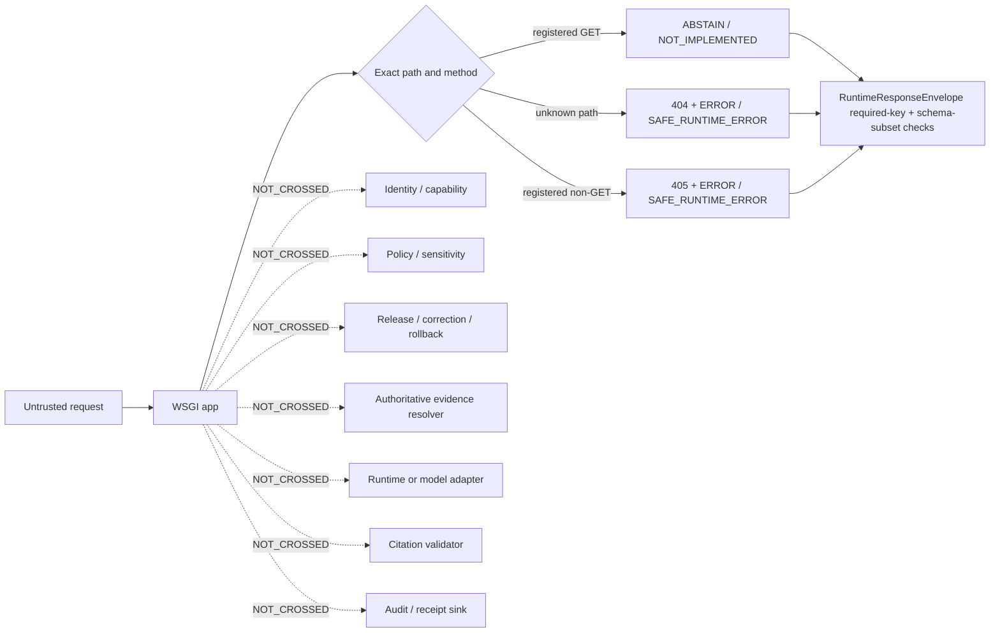

<!-- [KFM_META_BLOCK_V2]
doc_id: kfm://doc/architecture-governed-api-readme
title: Governed API Architecture Boundary
type: architecture-readme
version: v0.4
status: draft
maturity: repository-grounded; negative-envelope-executable; composed-trust-path-held; explanatory-only
owners:
  - "@bartytime4life — verified CODEOWNERS review route"
  - "NEEDS VERIFICATION — accountable architecture steward"
  - "NEEDS VERIFICATION — governed API maintainer"
  - "NEEDS VERIFICATION — security and policy reviewer"
  - "NEEDS VERIFICATION — evidence, release, correction, and independent reviewer"
created: 2026-05-24
updated: 2026-08-20
policy_label: public
truth_posture: cite-or-abstain
responsibility_root: docs/
owning_root: docs/
current_path: docs/architecture/governed-api/README.md
readme_profile: BOUNDARY_COMPACT
responsibility: "Orient reviewers to the Governed API architecture boundary, current executable negative-envelope slice, direct-child documents, cross-root authorities, validation evidence, unresolved vocabularies, landing-page lineage, deployment limits, and reversible next work without creating runtime, policy, release, deployment, or publication authority."
authority_class: explanatory architecture boundary
authority_limit: "This README explains current evidence and intended composition. It does not accept ADR-0004, define object meaning or machine shape, authenticate callers, evaluate policy, resolve evidence, authorize release, prove deployment, or publish."
canonical_relationship: "CONFIRMED current topology — this README is the active Governed API architecture landing page after merged PR #3150 retired the former flat docs/architecture/governed-api.md entrypoint; the topology fact does not accept ADR-0004 or grant runtime authority."
evidence_snapshot:
  repository: bartytime4life/Kansas-Frontier-Matrix
  base_ref: main
  base_commit: 59fd6dff1a2015fac08fc1ccd8206433f09f2013
  target_prior_blob: 09f9f95ce7400055b8018f9f159796ac35959fbb
  target_prior_content_commit: 1f8baf272db7df477ec0a1f95b6870e7f9433320
  target_prior_merge_commit: 845c8b7a9c8452e062ab55e0d4a809fd13c6239e
  directory_rules_blob: fd49a0b83e55cef52c1124281f093e263526898d
  directory_rules_adoption_adr_blob: a4de0d7a96b78da59cfc499d1025e1508afd8dd9
  root_registry_blob: 024f668b5f0a9239bafa4f8b09e2afd86300ff8c
  governed_api_app_readme_blob: 4f21150852f133ba919b11f4f8792185fa870dae
  governed_api_main_blob: 4eb335c7c0b27f62c7419c478542e8fe40e1ff38
  governed_api_routes_blob: 3418168d0b267160d6ad6dd87f289e880ef4a024
  governed_api_stub_blob: 371e60d9f96c78e31c8a1e6109d19dee5da4213b
  governed_api_route_test_blob: 2be20f5d93c03da7677c34b11a31875a00b2ed28
  governed_api_boundary_test_blob: 4035e537e6c52194928df5ab8ceb41a35f5f30ca
  runtime_response_contract_blob: 5060aaaa30fea37b6eeea6e1428b9effa6a163bd
  runtime_response_schema_blob: 8b86e7db8b18b65a56a4e639dfc54e1b2db93155
  runtime_response_validator_blob: 44ce7d51038a9adf9fcbdb18108cc27da8381e33
  runtime_response_alignment_test_blob: 746486ddc4e356d9dc28c7c46481c067f43ad23d
  runtime_response_builder_blob: 5dacededc1bda64292259ba39b6387facafbd1e8
  runtime_response_builder_test_blob: b8524a2243fcf3495c06aef62d5deba737c1acff
  evidence_resolver_readme_blob: d64f112e9fe6538178c74dd31cc751235781c7f3
  api_workflow_blob: 84ba16a3c36a1d58b2f6f1059a31ed6354063357
  audience_classes_blob: 28662c84ac1347cd63f0246fc47d418f76b7ec0b
  deployment_rules_blob: 863ce5b35138f3f8a817bbe85a89a923892215e5
  envelopes_doc_blob: 4c80f1d1808d5bed8f56bc2fd1fb73222d65ee42
  error_codes_blob: 55c0d8bc3bc97490397bf1d0407a58a27958b715
  lifecycle_gates_blob: 29b5a82fc058c7eb66228c77edf9a9a9f4d567ee
  threat_model_blob: 583db17425073995b25828818ef63b4cc7d1db73
  archaeology_boundary_blob: 39800545988acd267476b30e9da09903b7c6f72e
inspection_boundary: >-
  Current-session GitHub reads covered the complete prior target in chunks,
  current main, the eight direct children, ADR-0004 and ADR-0029, Directory
  Rules evidence recorded by the existing boundary, the Governed API WSGI
  dispatcher, exact route registry, schema-backed ABSTAIN and ERROR builders,
  app-local tests, RuntimeResponseEnvelope contract/schema/validator/alignment
  family, deterministic envelope candidate builder, evidence-resolver package
  boundary, fixture-only Explorer client, API workflow, deployment companion,
  and prior merged target PR. No mounted checkout, local repository-native
  command, identity provider, authorization middleware, live policy evaluator,
  authoritative evidence registry, release-state service, trusted signer,
  deployed service, browser transport, operational log, dashboard, or public
  request was exercised.
related:
  - ../README.md
  - ../deployment-topology.md
  - ../../adr/ADR-0004-apps-governed-api-is-the-trust-membrane.md
  - ../../adr/ADR-0029-adopt-directory-governance-standard-v2.md
  - ../../doctrine/directory-rules.md
  - ../../doctrine/trust-membrane.md
  - ../../../apps/README.md
  - ../../../apps/governed-api/README.md
  - ../../../apps/explorer-web/src/adapters/GovernedClient.ts
  - ../../../contracts/runtime/runtime_response_envelope.md
  - ../../../contracts/runtime/decision_envelope.md
  - ../../../contracts/runtime/precision_actually_used.md
  - ../../../contracts/runtime/runtime_response_http_binding_v1.md
  - ../../../schemas/contracts/v1/runtime/runtime_response_envelope.schema.json
  - ../../../fixtures/contracts/v1/runtime/runtime_response_envelope/README.md
  - ../../../packages/envelopes/src/envelopes/runtime_response.py
  - ../../../packages/evidence-resolver/README.md
  - ../../../tools/validators/validate_runtime_response_envelope.py
  - ../../../tests/contracts/test_runtime_response_contract_alignment.py
  - ../../../tests/packages/envelopes/test_runtime_response_candidate.py
  - ../../../.github/workflows/api-test.yml
tags: [kfm, architecture, governed-api, trust-membrane, runtime-response-envelope, finite-outcomes, evidence, policy, release, correction, rollback, repository-grounded, fail-closed]
notes:
  - "v0.3 reconciles the parent boundary after the executable app and all seven substantive companion documents advanced."
  - "The app now emits the exact required RuntimeResponseEnvelope field set for three ABSTAIN routes and safe 404/405 ERROR responses; the prior app-to-envelope HOLD is closed for bounded negative-envelope shape only."
  - "No substantive payload composition, evidence resolution, policy evaluation, audience enforcement, release/correction binding, live client transport, governed ANSWER path, deployment, or publication is established."
  - "Audience, public reason-code, HTTP-binding, and A-G gate vocabularies remain proposed, inactive, or conflicted as documented by their owning explanatory and contract surfaces."
  - "Merged PR #3150 retired the former flat docs/architecture/governed-api.md entrypoint; this README is the active landing page, while immutable receipts, Git history, and the pinned convergence ledger preserve historical lineage."
  - "This documentation-and-receipt update changes no route, contract, schema, policy, fixture, validator, test, workflow, package, app, runtime, data, release, deployment, or publication behavior."
[/KFM_META_BLOCK_V2] -->

<a id="top"></a>

# Governed API Architecture Boundary

> **One-line purpose.** Explain the current Governed API boundary from repository evidence: what the bounded executable scaffold proves, what the RuntimeResponseEnvelope family actually carries, which companion documents govern review, and which HOLDs remain before KFM can represent the app as a composed public trust membrane.

[](#1-purpose-authority-and-status)
[](#1-purpose-authority-and-status)
[](#5-current-executable-slice)
[](#5-current-executable-slice)
[](#6-contract-schema-validator-and-fixture-authority)
[](#10-graduation-gates)
[](#2-evidence-boundary)
[](#1-purpose-authority-and-status)

> [!IMPORTANT]
> **This README is explanatory architecture, not a trust decision.** Accepted ADR-0029 establishes Directory Rules v2 and confirms `docs/architecture/` as the human system-structure lane. ADR-0004 still has effective status `proposed`. File presence, a schema-valid response, a validator, a passing test, a pull request, or a merge does not accept ADR-0004, resolve evidence, approve policy, create release state, deploy a service, or publish a KFM claim.

> [!CAUTION]
> **The current app proves a bounded negative-envelope slice, not a complete membrane.** Repository code registers exactly three `GET` routes—`/bootstrap`, `/layers`, and `/evidence`—and returns schema-backed `ABSTAIN / NOT_IMPLEMENTED` envelopes. Unknown paths return `404` and unsupported methods on registered paths return `405`, both with a schema-backed `ERROR / SAFE_RUNTIME_ERROR` envelope. No inspected path authenticates a caller, evaluates policy, resolves an EvidenceRef to an authoritative EvidenceBundle, binds an applied release, composes a substantive answer body, or emits `ANSWER`.

> [!WARNING]
> **The flat entrypoint has been retired.** Merged [PR #3150](https://github.com/bartytime4life/Kansas-Frontier-Matrix/pull/3150) removed the former flat `docs/architecture/governed-api.md` page. This README is the active architecture landing page and direct-child index. That repository-topology fact does not accept ADR-0004, prove a complete trust membrane, or create runtime, policy, release, deployment, or publication authority.

**Quick navigation:** [Purpose](#1-purpose-authority-and-status) · [Evidence](#2-evidence-boundary) · [Directory map](#3-current-direct-child-map) · [Scope](#4-belongs-prohibited-inputs-and-outputs) · [Executable slice](#5-current-executable-slice) · [Contract stack](#6-contract-schema-validator-and-fixture-authority) · [Trust flow](#7-current-and-target-trust-flow) · [Exposure](#8-exposure-mutation-retention-and-review) · [Validation](#9-validation-and-negative-evidence) · [Graduation](#10-graduation-gates) · [Retirement](#11-overlap-migration-and-rollback-holds) · [Anti-patterns](#12-anti-patterns) · [Open work](#13-open-verification-backlog) · [Related](#14-related-surfaces) · [History](#15-change-history-and-documentation-rollback)

---

<a id="1-purpose-authority-and-status"></a>

## 1. Purpose, authority, and status

`docs/architecture/governed-api/` is the human architecture boundary for concerns that span Governed API routes and supporting responsibility roots. It explains how the configured app, runtime-response profiles, policy boundary, evidence resolution, release and correction state, client projections, validation, threat posture, and deployment posture do—or do not yet—compose.

It is not the executable membrane. The executable app is [`apps/governed-api/`](../../../apps/governed-api/README.md). This directory is not the semantic-contract authority, machine-schema authority, policy source, fixture family, validator implementation, lifecycle store, receipt store, evidence registry, release decision plane, client implementation, infrastructure configuration, or publication system.

### 1.1 Directory Rules basis

Accepted Directory Rules v2 establishes:

- `docs/` as the human-readable governance and explanation root;
- `docs/architecture/` as system structure subordinate to accepted decisions;
- `apps/` as the deployable-application root;
- `contracts/`, `schemas/`, and `policy/` as separate meaning, shape, and admissibility authorities;
- `packages/` as the reusable implementation root, not a deployable or public path;
- `tests/`, `fixtures/`, and `tools/validators/` as executable and reusable proof surfaces; and
- boundary READMEs as compact local contracts when ownership, exposure, mutation, lifecycle, or authority behavior changes.

This is a same-path update to an existing directory boundary. It creates no root, no new directory, no application, and no parallel contract, schema, policy, evidence, receipt, proof, release, or publication home.

### 1.2 Authority and maturity matrix

| Axis | Current state | Meaning |
|---|---|---|
| Document role | `BOUNDARY_COMPACT` architecture README | Human orientation, current-state map, and verification backlog only |
| Placement | **CONFIRMED active landing path** under `docs/architecture/governed-api/` | The former flat entrypoint was retired by PR #3150; placement does not establish runtime or decision authority |
| Directory Rules | **ACCEPTED** through ADR-0029 | Placement authority is in force |
| ADR-0004 | Source `draft`; effective status `proposed` | The dynamic trust-membrane decision is not accepted |
| App implementation | **PARTIAL / scaffold** | WSGI dispatcher, three `GET` routes, bounded negative responses, structural tests |
| Negative RuntimeResponseEnvelope integration | **CONFIRMED, bounded** | Registered routes and 404/405 errors use the exact required top-level field set and schema subset checks |
| Substantive answer-body composition | **HOLD** | The current closed RuntimeResponseEnvelope has no `payload` member and no governed `ANSWER` route exists |
| Reason-code registry | **UNRATIFIED / CONFLICTED** | The app uses upper-snake literals; the schema accepts a string; the historical slash catalogue is proposal lineage |
| Audience and authorization | **UNBOUND** | No accepted audience enum, identity provider, grant resolver, or route authorization was proved |
| Lifecycle/release evaluation | **NOT CROSSED in current app** | No request-time release, correction, rollback, or lifecycle resolver is wired |
| Evidence resolver | **COMPONENT PROOF only** | An internal no-network candidate package exists; it is non-authoritative and not a public API path |
| Live Explorer transport | **ABSENT in inspected adapter** | Explorer `GovernedClient.ts` is fixture-only and performs no network or lifecycle-store access |
| Deployment and public operation | **UNKNOWN / HOLD** | Placeholder image/Compose preparation exists, but no start, health, ingress, environment, or observed service proof |
| Release/publication effect | **None** | Documentation and tests cannot promote or publish |

[Back to top](#top)

---

<a id="2-evidence-boundary"></a>

## 2. Evidence boundary

The repository observations below are pinned to `main@59fd6dff1a2015fac08fc1ccd8206433f09f2013`. They describe tracked bytes and bounded deterministic behavior, not production operation.

| Surface | CONFIRMED repository observation | Limit |
|---|---|---|
| Accepted placement authority | ADR-0029 adopts the Directory Rules v2 bytes at `docs/doctrine/directory-rules.md`. | Does not accept ADR-0004 or prove a complete membrane. |
| Current folder | Eight direct Markdown files exist in `docs/architecture/governed-api/`. | Presence does not make every proposal authoritative or implemented. |
| WSGI entry | `main.py` dispatches exact path/method combinations and defaults the development helper to `127.0.0.1:8000`. | Source evidence is not packaging, ingress, deployment, or network-isolation proof. |
| Route registry | Exactly `/bootstrap`, `/layers`, and `/evidence` are registered. | The set is a scaffold manifest, not a versioned production API catalogue. |
| Registered-route output | Each registered `GET` returns `ABSTAIN`, `NOT_IMPLEMENTED`, empty `evidence_refs`, and the complete required RuntimeResponseEnvelope top-level field set. | The spec hash and state strings are scaffold placeholders; no substantive claim or EvidenceBundle is produced. |
| Negative HTTP output | Unknown paths return `404`; unsupported methods on registered paths return `405`; both emit `ERROR / SAFE_RUNTIME_ERROR` with no raw `detail`. | One coarse safe error does not establish a stable public reason registry or complete exception boundary. |
| App-local tests | Tests assert exact route inventory, exact required keys, schema subset validity, 404/405 behavior, forbidden renderer/model imports, and forbidden internal-store path literals. | These are bounded structural proofs, not authentication, policy, release, evidence, or noninterference proof. |
| RuntimeResponseEnvelope family | Contract v0.4, Draft 2020-12 schema, fixtures, validator, precision profile, alignment test, deterministic candidate builder, and focused builder tests exist. | The family remains proposed; local construction does not establish evidence sufficiency, policy allow, release, or public safety. |
| DecisionEnvelope family | A separate closed contract/schema/validator family exists. | It is not nested inside the current RuntimeResponseEnvelope and is not emitted by the scaffold route path. |
| Evidence resolver | `packages/evidence-resolver/` implements an internal, no-network, `authoritative: false` candidate check. | `RESOLVED` is not `ANSWER`; no authoritative registry or governed API consumer is established. |
| Explorer adapter | `GovernedClient.ts` validates a fixture-only browser projection and performs no network or lifecycle-store access. | No live browser-to-API flow is proved. |
| API workflow | `api-test` runs the app smoke suite and the focused schema-backed ABSTAIN route test with read-only contents permissions. | Workflow wiring or a green run is test evidence only, not release, deployment, or publication approval. |
| Deployment preparation | A loopback-only Compose placeholder, non-root placeholder image, static boundary tests, and render/build workflow are documented by the grounded deployment companion. | The image does not package/start the app; health, ingress, TLS, CORS, auth, rate, secrets, network, and observability remain unproved. |
| Retired flat architecture document | PR #3150 removed `docs/architecture/governed-api.md`; historical receipts and plans retain its lineage. | It is not an active navigation target, alias, redirect, or authority surface. |

### 2.1 Truth labels used here

- **CONFIRMED** — verified from pinned repository bytes, focused tests, or accepted authority cited by this update.
- **PROPOSED** — architecture, vocabulary, future route, or implementation target not verified as current behavior.
- **UNKNOWN** — evidence is insufficient for a stronger statement.
- **NEEDS VERIFICATION** — a concrete repository, run, review, or operational check remains.
- **CONFLICTED** — repository surfaces use incompatible shape, vocabulary, placement, or authority claims.
- **HOLD** — implementation, migration, exposure, or maturity claim must stop until the named evidence or decision closes.
- **NOT_CROSSED** — the current app does not invoke the named dependency, so neither positive nor negative composed enforcement is proved.

### 2.2 State separation

Do not collapse these axes:

| Axis | Example | What it does not prove |
|---|---|---|
| Documentation state | draft, reviewed, superseded | Runtime behavior or release state |
| ADR state | proposed, accepted, rejected | Deployment or publication |
| Source presence | file/blob exists | Correctness, integration, or operation |
| Component proof | builder, fixture, validator, package test passes | API composition or public authority |
| Runtime outcome | `ANSWER`, `ABSTAIN`, `DENY`, `ERROR` | Lifecycle transition or release approval |
| Lifecycle state | RAW through PUBLISHED | Request authorization or response safety |
| Readiness result | gate PASS / HOLD / FAIL | Accountable release decision |
| Release decision | approved, held, denied | Applied transition or deployed environment |
| Applied transition | state change recorded | Correct client cache, map, search, or AI propagation |
| Deployment state | image built, process started, environment verified | KFM publication |
| Publication state | governed exposure decision | Permanent correctness or immunity from correction |

[Back to top](#top)

---

<a id="3-current-direct-child-map"></a>

## 3. Current direct-child map

Directory Rules requires a boundary README to show the governed directory and its direct children rather than inventing a parallel subtree. The tree below is verified from the pinned repository directory response.

```text
docs/architecture/governed-api/
├── AUDIENCE_CLASSES.md       # audience/role/exposure vocabulary reconciliation
├── DEPLOYMENT_RULES.md       # deployment preparation evidence and exposure holds
├── ENVELOPES.md              # current runtime-envelope profiles and composition gaps
├── ERROR_CODES.md            # current scaffold error plus unratified catalogue lineage
├── LIFECYCLE_GATES.md        # lifecycle/readiness/request-time state separation
├── README.md                 # this boundary, evidence map, and direct-child index
├── THREAT_MODEL.md           # current scaffold guards and target trust crossings
└── archaeology.md            # sensitive-domain API boundary; no route or active policy
```

| Direct child | Current role | Current posture |
|---|---|---|
| [`AUDIENCE_CLASSES.md`](./AUDIENCE_CLASSES.md) | Separates authentication, caller role, audience, capability, exposure, field projection, lifecycle, outcome, route state, rate profile, and reviewer role. | **Repository-grounded / vocabulary conflicted / enforcement unbound**; the historical five literals are lineage, and `DENY` is an outcome rather than an audience. |
| [`DEPLOYMENT_RULES.md`](./DEPLOYMENT_RULES.md) | Separates current loopback/build preparation from the controls and proof required for a real environment. | **Repository-grounded / deployment unknown**; image packaging, startup, health, ingress, TLS, CORS, auth, rate, secrets, network, observability, release, and deployment remain held. |
| [`ENVELOPES.md`](./ENVELOPES.md) | Crosswalks RuntimeResponseEnvelope, DecisionEnvelope, the bounded candidate builder, and current scaffold responses. | **Repository-grounded / mixed maturity**; two closed profiles are present, nested composition and substantive answer-body composition are undefined, and DomainFeatureEnvelope is proposal-only. |
| [`ERROR_CODES.md`](./ERROR_CODES.md) | Records the current `SAFE_RUNTIME_ERROR` behavior and preserves the historical slash catalogue. | **Repository-grounded / registry unratified**; `reason_code` remains an unconstrained string in the schema and public compatibility is not established. |
| [`LIFECYCLE_GATES.md`](./LIFECYCLE_GATES.md) | Separates lifecycle stage, final-readiness A–G, decision, transition application, public-serving state, runtime outcome, and correction state. | **Repository-grounded / vocabulary conflicted / request-time enforcement held**; the app does not evaluate lifecycle or release state. |
| [`THREAT_MODEL.md`](./THREAT_MODEL.md) | Retains nine target trust boundaries while distinguishing current `SCAFFOLD_GUARD`, `NOT_CROSSED`, component, composed, and operational proof. | **Repository-grounded / composed trust path held**; only the small ingress/route/error/static guard surface is executable. |
| [`archaeology.md`](./archaeology.md) | Applies deny-by-default cultural-heritage and exact-location concerns to a future API projection. | **Repository-grounded architecture only**; no Archaeology route, active policy binding, approved release, or public payload is established. |

> [!IMPORTANT]
> A direct-child document can be useful and current without becoming machine, policy, release, or runtime authority. Contracts, schemas, code, tests, accepted ADRs, policy bundles, release records, and observed operation control the claims they own.

[Back to top](#top)

---

<a id="4-belongs-prohibited-inputs-and-outputs"></a>

## 4. Belongs, prohibited content, inputs, and outputs

### 4.1 What belongs here

- Cross-route architecture explanations for the configured Governed API boundary.
- A current evidence map linking app code, contracts, schemas, packages, policy surfaces, fixtures, validators, tests, clients, release objects, and deployment posture.
- Human threat-boundary, audience, envelope, error, lifecycle, correction, rollback, and exposure explanations that do not become machine authority.
- Sensitive-domain API boundary guidance when it explains composition with the shared membrane and does not duplicate domain contracts or policy.
- Explicit conflict, HOLD, migration, graduation, validation, correction, and rollback criteria.
- Direct-child navigation and local ownership/exposure/mutation/retention rules.

### 4.2 What is prohibited here

| Prohibited artifact or claim | Owning root or disposition |
|---|---|
| Executable route, middleware, serializer, or app implementation | `apps/governed-api/` |
| Reusable response builder or resolver implementation | `packages/` |
| Semantic object/API contract | `contracts/` |
| JSON Schema or generated type authority | `schemas/` |
| Allow, deny, hold, restrict, generalize, or abstain rule source | `policy/` |
| Provider/model adapter | `runtime/`, behind the app boundary |
| Source acquisition or admission implementation | `connectors/` |
| Lifecycle data, evidence objects, receipts, proofs, catalogs, or published carriers | Their governed families under `data/` |
| Release, correction, withdrawal, promotion, or rollback decision | `release/` |
| Infrastructure, secrets, network policy, environment values, and deployment configuration | `infra/`, `configs/`, app-local configuration, and external secret stores as applicable |
| Claim that a documented route or control is live without code/test/deployment evidence | `DENY` the claim; mark it `PROPOSED`, `UNKNOWN`, or `NEEDS VERIFICATION` |
| Full policy decisions, raw evidence, restricted coordinates, credentials, private prompts, exploit payloads, or production endpoints in public docs | Do not include; use bounded references and private security/incident handling |

### 4.3 Inputs

| Input | Use in this lane |
|---|---|
| Accepted Directory Rules and ADRs | Placement and decision authority |
| Current app code and route registry | Current executable surface |
| Contracts and schemas | Meaning and machine shape |
| Reusable package code | Bounded component behavior and integration limits |
| Policy, evidence, review, release, correction, and rollback surfaces | Target obligations and current integration checks |
| Fixtures, validators, and tests | Executable proof of bounded behavior |
| Client code | Verified consumer shape, failure behavior, and transport boundary |
| Workflow definitions and run results | CI wiring and exact-head evidence, kept separate |
| Runtime/deployment/log evidence | Operational maturity when available |
| Generated receipts | Per-artifact authorship and validation lineage, not proof or approval |

### 4.4 Outputs

This lane outputs only human-readable architecture guidance, navigation, evidence limits, conflict/HOLD registers, and migration or graduation criteria. It emits no runtime envelope, policy decision, EvidenceBundle, receipt instance for a request, proof, review approval, release record, deployment, published carrier, or public claim.

[Back to top](#top)

---

<a id="5-current-executable-slice"></a>

## 5. Current executable slice

### 5.1 Request matrix

| Request condition | HTTP | Current finite outcome | Current `reason_code` | Evidence posture |
|---|---:|---|---|---|
| `GET /bootstrap` | `200` | `ABSTAIN` | `NOT_IMPLEMENTED` | Empty refs; scaffold-only state strings and placeholder spec hash |
| `GET /layers` | `200` | `ABSTAIN` | `NOT_IMPLEMENTED` | No released layer or manifest resolution |
| `GET /evidence` | `200` | `ABSTAIN` | `NOT_IMPLEMENTED` | No authoritative EvidenceRef-to-EvidenceBundle resolution |
| Unknown path | `404` | `ERROR` | `SAFE_RUNTIME_ERROR` | No raw detail, stack trace, internal path, or evidence payload |
| Non-`GET` method on a registered path | `405` | `ERROR` | `SAFE_RUNTIME_ERROR` | No raw detail, stack trace, internal path, or evidence payload |

A non-`GET` request to an unknown path follows the current unknown-path branch and returns `404`; the app does not advertise a global method catalogue.

### 5.2 Current envelope shape

The registered and safe-error paths use the ten unconditional required RuntimeResponseEnvelope fields:

```text
id · spec_hash · version · issued_at · outcome · reason_code
evidence_refs · policy_state · freshness · correction_state
```

The schema is closed. `precision_actually_used` is required only for `ANSWER` and forbidden for `ABSTAIN`, `DENY`, and `ERROR`. The scaffold correctly omits it for every current response.

### 5.3 What the app proves

- A deterministic standard-library WSGI dispatch slice exists.
- The route registry is exact and covered by a manifest test.
- Registered routes fail closed with schema-backed `ABSTAIN`.
- Unknown paths and unsupported methods fail with schema-backed safe `ERROR` responses.
- App tests assert the exact required-key set and reject extra fields such as `decision`, `decision_id`, `detail`, and negative-outcome precision.
- Selected renderer/model import prefixes are absent from the app tree.
- Selected canonical/internal lifecycle-store path literals are denied by a structural test.
- The smoke suite and focused ABSTAIN test are wired into `api-test`.

### 5.4 What the app does not prove

- caller identity, workload identity, assurance level, audience, role, capability, purpose, object-level authorization, or least privilege;
- request schemas, parameter bounds, body-size limits, replay controls, CORS, rate limits, or TLS;
- authoritative EvidenceRef resolution, evidence admissibility, citation closure, or claim-scope sufficiency;
- policy precheck/postcheck, accepted policy-bundle identity, obligations, or field-level projection;
- release manifest, applied release state, freshness computation, correction, withdrawal, supersession, or rollback state;
- substantive response payload composition or any `ANSWER`;
- audit receipt persistence, trusted correlation, telemetry redaction, or operational observability;
- Explorer-to-API network transport;
- application packaging, container startup, health, ingress, deployment, uptime, capacity, or public exposure;
- absence of every possible information-flow or supply-chain defect.

> [!NOTE]
> `ABSTAIN / NOT_IMPLEMENTED` and safe `ERROR` are the correct present behavior for an incomplete surface. The next slice must close a specific request/authority dependency without inventing an `ANSWER` or weakening the negative posture.

[Back to top](#top)

---

<a id="6-contract-schema-validator-and-fixture-authority"></a>

## 6. Contract, schema, validator, package, and fixture authority

The current runtime-response family is distributed by responsibility:

| Responsibility | Current repository surface | Verified state |
|---|---|---|
| Semantic meaning | [`contracts/runtime/runtime_response_envelope.md`](../../../contracts/runtime/runtime_response_envelope.md) | v0.4 draft/proposed; documents the schema-paired field surface and answer-only precision rule |
| Precision semantics | [`contracts/runtime/precision_actually_used.md`](../../../contracts/runtime/precision_actually_used.md) | Separate semantic profile referenced by contract, schema, validator, builder, and tests |
| Machine shape | [`runtime_response_envelope.schema.json`](../../../schemas/contracts/v1/runtime/runtime_response_envelope.schema.json) | Draft 2020-12; closed object; four outcomes; conditional evidence and precision requirements |
| Reusable fixtures | [`fixtures/contracts/v1/runtime/runtime_response_envelope/`](../../../fixtures/contracts/v1/runtime/runtime_response_envelope/README.md) | Valid and invalid lanes exist |
| Validator | [`validate_runtime_response_envelope.py`](../../../tools/validators/validate_runtime_response_envelope.py) | Schema plus bounded semantic checks; no evidence, policy, review, or release authority |
| Contract/schema alignment | [`test_runtime_response_contract_alignment.py`](../../../tests/contracts/test_runtime_response_contract_alignment.py) | Checks links, documented fields, and conditional precision rules |
| Reusable candidate builder | [`packages/envelopes/.../runtime_response.py`](../../../packages/envelopes/src/envelopes/runtime_response.py) | Deterministic explicit-input construction with bounded local checks only |
| Candidate-builder tests | [`test_runtime_response_candidate.py`](../../../tests/packages/envelopes/test_runtime_response_candidate.py) | Focused positive/negative construction proof |
| Governed API scaffold builder | [`apps/governed-api/.../stub.py`](../../../apps/governed-api/src/governed_api/stub.py) | Emits bounded negative envelope shapes with scaffold values |
| App route shape test | [`test_abstain_routes.py`](../../../apps/governed-api/tests/test_abstain_routes.py) | Validates every registered route against the exact required-key set and schema subset |
| App error/boundary test | [`test_boundary_guards.py`](../../../apps/governed-api/tests/test_boundary_guards.py) | Validates 404/405 safe errors, exact routes, selected import boundaries, and internal-path literals |
| HTTP binding | [`runtime_response_http_binding_v1.md`](../../../contracts/runtime/runtime_response_http_binding_v1.md) | Proposed/inactive profile; not current deployed transport authority |

<a id="61-the-current-integration-gap"></a>

### 6.1 Current integration result and remaining composition HOLD

The v0.2 README recorded that the app emitted only a legacy decision-style field subset rather than the current RuntimeResponseEnvelope field set. Current code and tests supersede that snapshot.

**CONFIRMED closed for bounded negative shape:**

- registered routes and 404/405 paths carry the complete unconditional RuntimeResponseEnvelope field set;
- app tests derive the exact key set from the current schema's `required` array;
- app tests reject extra legacy `decision` or `detail` fields;
- negative outcomes omit `precision_actually_used` as required; and
- schema-subset checks run over the current response objects.

**Still held:**

| Gap | Current evidence-backed reason |
|---|---|
| Substantive answer body | The current closed RuntimeResponseEnvelope has no `payload`, nested DecisionEnvelope, `release_ref`, citation report, or trace member. |
| `ANSWER` outcome | No current route resolves authoritative evidence, policy, review, release, precision, freshness, correction, and rollback obligations. |
| Evidence route semantics | `/evidence` accepts no bounded request profile and returns only `ABSTAIN / NOT_IMPLEMENTED`. |
| Policy and audience | State strings are caller-supplied scaffold constants; no accepted vocabulary or evaluator binds them. |
| Reason-code compatibility | The schema accepts a string, the app uses upper-snake literals, and the historical slash catalogue is not an adopted registry. |
| HTTP profile | The WSGI status mapping is executable for the scaffold, while the separate HTTP-binding contract remains proposed/inactive. |
| Client composition | Explorer consumes a distinct fixture-only Evidence Drawer projection profile and has no live transport. |
| Release/correction application | No request-time state service or transition operator is invoked by the app. |
| Durable audit | No current route persists a receipt or writes to an audit sink. |

> [!IMPORTANT]
> Schema validity is necessary but not sufficient. A well-shaped negative response proves safe bounded serialization for the tested case; it does not prove that a future positive response is evidence-backed, policy-safe, release-bound, deployable, or publishable.

### 6.2 Companion-document reconciliation register

| Companion | Current grounded conclusion | Remaining disposition |
|---|---|---|
| `ENVELOPES.md` | Correctly records the two present closed profiles, bounded builder/scaffold proof, absent nested composition, and proposal-only DomainFeatureEnvelope. | Select a substantive payload/composition profile through contract/schema review before adding `ANSWER`. |
| `AUDIENCE_CLASSES.md` | Correctly separates multiple audience-related axes and marks all candidate vocabularies unbound. | Ratify only with contract/schema/policy/runtime/client/test closure. |
| `ERROR_CODES.md` | Correctly records `SAFE_RUNTIME_ERROR` and preserves the v0.1 catalogue as proposal lineage. | Adopt/version a registry and fallback policy before public compatibility claims. |
| `LIFECYCLE_GATES.md` | Correctly separates final-readiness A–G from legacy lifecycle-wide lettering and request-time state. | Resolve gate vocabulary and add an authoritative request-time state source before enforcement claims. |
| `THREAT_MODEL.md` | Correctly distinguishes current scaffold guards from `NOT_CROSSED`, component, composed, and operational proof. | Add composed and operational proof only as dependencies are introduced. |
| `DEPLOYMENT_RULES.md` | Correctly records placeholder image/Compose evidence and deployment HOLDs. | Package/start/health/release/deploy/verify through owning roots before any environment claim. |
| `archaeology.md` | Correctly preserves deny-by-default intent while stating no route, active policy, or release exists. | Keep protected material outside public paths until qualified authority, policy, transform, review, release, and negative tests close. |

[Back to top](#top)

---

<a id="7-current-and-target-trust-flow"></a>

## 7. Current and target trust flow

### 7.1 Current executable flow


```mermaid
flowchart LR
    client["Untrusted request"] --> wsgi["WSGI app"]
    wsgi --> dispatch{"Exact path and method"}
    dispatch -->|registered GET| abstain["ABSTAIN / NOT_IMPLEMENTED"]
    dispatch -->|unknown path| error404["404 + ERROR / SAFE_RUNTIME_ERROR"]
    dispatch -->|registered non-GET| error405["405 + ERROR / SAFE_RUNTIME_ERROR"]
    abstain --> schema["RuntimeResponseEnvelope required-key + schema-subset checks"]
    error404 --> schema
    error405 --> schema

    wsgi -. "NOT_CROSSED" .-> identity["Identity / capability"]
    wsgi -. "NOT_CROSSED" .-> policy["Policy / sensitivity"]
    wsgi -. "NOT_CROSSED" .-> release["Release / correction / rollback"]
    wsgi -. "NOT_CROSSED" .-> evidence["Authoritative evidence resolver"]
    wsgi -. "NOT_CROSSED" .-> runtime["Runtime or model adapter"]
    wsgi -. "NOT_CROSSED" .-> citation["Citation validator"]
    wsgi -. "NOT_CROSSED" .-> audit["Audit / receipt sink"]
```

### 7.2 Target composed flow — proposed, not current behavior


```mermaid
flowchart LR
    request["Bounded request + caller context"] --> ingress["Parse, limit, correlate"]
    ingress --> identity["Authenticate identity and capability"]
    identity --> prepolicy["Policy and sensitivity precheck"]
    prepolicy --> state["Release · freshness · correction · rollback"]
    state --> evidence["EvidenceRef → authoritative EvidenceBundle"]
    evidence --> postpolicy["Projection obligations and field policy"]
    postpolicy --> optional{"Model-mediated request?"}
    optional -->|no| citations["Citation validation"]
    optional -->|yes| adapter["Provider-neutral runtime adapter"]
    adapter --> citations
    citations --> response["Compose governed content + RuntimeResponseEnvelope"]
    response --> validate["Schema, semantic, non-leakage validation"]
    validate --> outcome{"ANSWER · ABSTAIN · DENY · ERROR"}
    outcome --> audit["Audit-safe receipt/reference"]
    outcome --> client["Governed client projection"]
```

The target sequence is an architecture composition. Each crossing needs its own accepted authority, bounded contract/schema, failure behavior, tests, review, release implications, and rollback. A diagram does not implement the sequence.

### 7.3 Public-boundary rule

Ordinary clients consume governed responses or separately reviewed, immutable, released public-safe artifacts. They do not read RAW, WORK, QUARANTINE, PROCESSED, candidate, canonical, evidence-internal, model-runtime, receipt, proof, review, registry, or release-internal stores directly.

### 7.4 Static delivery

A static-delivery edge may serve already released public-safe PMTiles, COG, GeoParquet, style, sprite, glyph, or catalog carriers when release identity, integrity, rights, sensitivity, correction, and rollback behavior are governed. Static delivery is not a second policy engine, API authority, source registry, or truth store.

### 7.5 Client posture

The inspected Explorer `GovernedClient.ts` remains fixture-only. A future live transport must:

- consume an accepted response/content composition rather than inventing browser-only authority;
- fail closed on malformed, unknown, or incompatible profiles;
- preserve negative, correction, withdrawn, revoked, superseded, and stale history where policy permits;
- avoid direct lifecycle, model, resolver, registry, or release-store access;
- honor evidence, precision, obligations, release, freshness, correction, and rollback state;
- implement safe compatibility fallback for unknown reason codes; and
- carry request/response correlation without exposing internal evidence, policy, prompt, path, or adapter details.

[Back to top](#top)

---

<a id="8-exposure-mutation-retention-and-review"></a>

## 8. Exposure, mutation, retention, and review

| Property | Current rule |
|---|---|
| Documentation exposure | Public; no secrets, credentials, raw sensitive evidence, restricted coordinates, private prompts, exploit payloads, or operational endpoints |
| Runtime exposure | `UNKNOWN`; must be proved from current deployment/infrastructure and observed-run evidence |
| Documentation mutation | Versioned same-path review; no generated mirror or alternate writable README |
| App mutation | Scoped app changes with direct contract/schema/policy/package/fixture/test dependencies |
| Retention | Durable architecture history in Git; accepted and historical decisions retained separately in ADRs |
| Physical storage | Git repository for docs; runtime/data/release bytes remain in their owning systems |
| Permitted writers | Repository writers routed by current CODEOWNERS; accountable role names remain `NEEDS VERIFICATION` |
| Review route | `@bartytime4life` is the verified GitHub CODEOWNERS route; routing is not stewardship, independent review, policy approval, or release authority |
| Escalation | Security-sensitive detail follows `SECURITY.md`; placement/authority conflict goes to ADR or drift/verification tracking; release defect follows correction/rollback controls |
| Correction | Correct repository claims in place; do not preserve a stale implementation claim merely because it appeared in an older README |
| Rollback | Revert this documentation/receipt slice independently; do not represent docs rollback as runtime or release rollback |

### 8.1 Re-review triggers

Re-review this boundary when:

- ADR-0004 changes status, scope, or accepted alternative;
- a compatibility request proposes restoring or redirecting the retired flat entrypoint;
- a route is added, removed, versioned, or graduates beyond the current negative scaffold;
- RuntimeResponseEnvelope, DecisionEnvelope, payload composition, HTTP binding, or reason registry changes;
- audience, identity, authorization, policy, evidence, release, correction, rollback, audit, or precision binding changes;
- an evidence-resolver or other package becomes a governed app consumer;
- a client begins live transport;
- deployment, network, secret, logging, telemetry, health, or environment posture changes;
- a security incident, correction, withdrawal, or rollback affects the membrane; or
- validation, workflow, CODEOWNERS, or required-check coverage materially changes.

[Back to top](#top)

---

<a id="9-validation-and-negative-evidence"></a>

## 9. Validation and negative evidence

### 9.1 Current repository-native checks

Run from repository root:

```bash
make governed-api-smoke

python -m pytest \
  apps/governed-api/tests/test_abstain_routes.py \
  apps/governed-api/tests/test_boundary_guards.py \
  -q --strict-config --strict-markers

python tools/validators/validate_runtime_response_envelope.py --fixtures

python -m pytest \
  tests/contracts/test_runtime_response_contract_alignment.py \
  tests/packages/envelopes/test_runtime_response_candidate.py \
  -q --strict-config --strict-markers
```

When a change touches the internal resolver candidate, also run its no-network profile:

```bash
make evidence-resolver
make evidence-resolver-deny
```

For this Markdown-and-receipt change, run the applicable documentation metadata, link, graph, stale-scan, changed-area, generated-receipt, and repository-topology checks defined by current workflows. Hosted conclusions remain separate from local/source validation.

### 9.2 What a green result proves

| Check | Bounded proof |
|---|---|
| Governed API smoke | Current app-local scaffold tests pass for the checked revision |
| Abstain route test | Every registered route preserves exact schema-backed negative response shape |
| Boundary guards | Current 404/405 behavior and selected route/import/path boundaries hold |
| Runtime envelope fixtures | Current schema plus validator checks accept/reject tracked fixtures as expected |
| Contract alignment | Contract documents the current schema and precision profile |
| Candidate-builder tests | Local explicit-input envelope construction enforces its bounded checks |
| Evidence-resolver profile | Internal no-network candidate fixtures/tests preserve package-local fail-closed outcomes |
| Generated-receipt validation | Authored artifact path/hash closure and receipt shape are intact |
| Documentation checks | Metadata, links, anchors, graph, and stale/current claims satisfy the checked rules |

### 9.3 What a green result does not prove

A green result does not prove:

- ADR acceptance or accountable human approval;
- authentication, authorization, source admission, evidence authority, policy correctness, or release approval;
- correctness of every state or reason vocabulary;
- absence of all sensitive-information flows, dependency compromise, or operational abuse;
- production deployment, uptime, capacity, TLS, CORS, rate limiting, secret hygiene, network enforcement, or audit integrity;
- live client integration or public compatibility;
- correction propagation across caches, map, search, graph, exports, and AI surfaces;
- release, promotion, deployment, publication, or public use.

### 9.4 Negative cases required before a substantive route

At minimum, a graduating route needs tests for:

- malformed, ambiguous, unsupported-version, oversized, and excessive-cardinality requests;
- unsupported method and unknown path;
- unauthenticated identity, invalid credentials, revoked identity, unauthorized capability, and purpose mismatch;
- unresolved, malformed, stale, withdrawn, superseded, corrected, revoked, or inadmissible EvidenceRef;
- source-role mismatch and insufficient claim-scope support;
- missing, stale, conflicted, or failed policy bundle;
- rights/sensitivity denial, embargo, and public-safe generalization obligations;
- missing release manifest, non-published state, withdrawn release, active correction, and rollback in progress;
- invalid response envelope or content composition;
- citation failure and unsupported precision;
- audit/receipt failure;
- provider/adapter timeout or error without raw fallback;
- unknown reason code and client compatibility fallback;
- no internal path, restricted coordinate, secret, stack trace, prompt, raw evidence, policy internals, or provider diagnostics leakage.

[Back to top](#top)

---

<a id="10-graduation-gates"></a>

## 10. Graduation gates

Do not represent the configured app as a complete dynamic public trust membrane until the applicable evidence closes.

| Gate | Required evidence | Current posture |
|---|---|---|
| Decision authority | ADR-0004 accepted, or a reviewed successor/exception explicitly governs the boundary | **HOLD — proposed** |
| Negative response contract | Current registered and safe-error paths emit complete schema-backed RuntimeResponseEnvelope negative shapes | **CONFIRMED, bounded** |
| Request contracts | Every graduating route has bounded, versioned request meaning and machine shape | **NOT PROVED** |
| Content composition | An accepted profile relates substantive content, decisions, citations, release state, and the RuntimeResponseEnvelope without schema drift | **HOLD** |
| Reason compatibility | Stable versioned reason registry, safe fallback, outcome/HTTP mapping, and client tests | **HOLD / conflicted** |
| Audience and authorization | Accepted identity, caller/capability, object/purpose, field projection, revocation, and negative tests | **NOT PROVED** |
| Evidence closure | EvidenceRefs resolve through an authoritative governed resolver; unsupported claims abstain | **COMPONENT PROOF only** |
| Policy and sensitivity | Accepted bundle identity, pre/post checks, obligations, sensitive-domain transforms, and denial tests | **NOT PROVED** |
| Release/correction | Applied release, freshness, correction, withdrawal, supersession, and rollback state are bound | **NOT PROVED** |
| Citation and precision | Claim support and actual precision are validated before `ANSWER` | **COMPONENTS present / not composed** |
| Client transport | Approved client consumes the accepted profile over governed transport and fails closed | **NOT PROVED** |
| Audit/observability | Audit-safe request/decision/receipt references and redacted operational evidence | **NOT PROVED** |
| Security/deployment | Threat mitigations, packaging, startup, TLS/network/secret posture, limits, health, and deployment evidence | **UNKNOWN / HOLD** |
| Rollback | Route/profile/client change can revert or forward-fix without creating a second writable authority | **REQUIRED** |
| Review | Named accountable and independent reviewers act; CODEOWNERS alone is insufficient | **NEEDS VERIFICATION** |

### 10.1 Smallest coherent next implementation slice

The next app slice should remain deterministic, fixture-first, and no-network. A sound candidate is a bounded `/evidence` request adapter that:

1. defines one versioned, closed request contract and schema;
2. consumes only explicit repository fixtures and the current internal evidence-resolver candidate profile;
3. preserves `UNRESOLVED -> ABSTAIN`, `DENIED -> DENY`, and package `ERROR -> ERROR`;
4. maps `RESOLVED` to a non-authoritative continuation state that still returns `ABSTAIN` until evidence authority, policy, review, release, citation, precision, and correction checks close;
5. emits the current negative RuntimeResponseEnvelope field set without adding a payload or `ANSWER`;
6. adds malformed, denied, stale, withdrawn, subject-mismatch, digest-mismatch, and leakage tests;
7. records accountable owner, allowed fixture/repository abstraction, and authoritative digest-binding decisions before implementation; and
8. updates app, contract/schema, package, test, and architecture documentation together.

That slice would prove an app-to-component crossing without pretending that a candidate `RESOLVED` result is evidence truth or a public answer.

[Back to top](#top)

---

<a id="11-overlap-migration-and-rollback-holds"></a>

## 11. Landing-page retirement, lineage, and rollback

### 11.1 Current topology

Merged [PR #3150](https://github.com/bartytime4life/Kansas-Frontier-Matrix/pull/3150) removed the former flat `docs/architecture/governed-api.md` entrypoint. The current architecture lane contains this README plus seven substantive companions. Active repository navigation must resolve here; immutable generated receipts, Git history, exploratory source maps, and the pinned Wave 0 convergence ledger may retain the former path as historical evidence.

### 11.2 Current disposition

| Question | Current answer |
|---|---|
| Which path is the active architecture landing page? | `docs/architecture/governed-api/README.md` |
| Is the former flat path present, aliased, or redirected? | **No** at the pinned tree |
| What records the retirement? | Merged PR #3150 and repository history |
| Does landing-page survival accept ADR-0004? | **No** |
| Does the retirement change app behavior or public authority? | **No; this is documentation topology only** |
| Which residual mentions are valid? | Immutable receipts and explicit historical lineage, not live links or authority claims |

### 11.3 Consumer closure

This correction updates active navigation, metadata, registers, runbooks, package documentation, security guidance, standards, examples, and fixture READMEs to the surviving landing page. It deliberately leaves commit-pinned receipts, exploratory source maps, and the Wave 0 disposition rows unchanged except for an explicit post-baseline note.

### 11.4 Documentation rollback

Revert this link-closure commit and its generated authoring receipt together to restore the prior documentation bytes. Rollback does not recreate the retired flat file and does not change app code, contracts, schemas, policy, packages, fixtures, validators, tests, workflows, data, release state, deployment, or publication.

[Back to top](#top)

---

<a id="12-anti-patterns"></a>

## 12. Anti-patterns

| Anti-pattern | Why it fails | Required response |
|---|---|---|
| Treating this README as accepted architecture authority | Documentation cannot accept ADR-0004 or change runtime behavior. | Cite accepted authority and current implementation separately. |
| Calling the current app a complete trust membrane | Schema-backed negative routes do not establish identity, evidence, policy, release, client, audit, or deployment composition. | Use `scaffold`, `bounded negative slice`, or `HOLD`; name missing gates. |
| Treating schema validity as truth | Shape does not establish evidence authority, policy allow, review, release, or public safety. | Validate the full governed flow appropriate to consequence. |
| Turning an internal `RESOLVED` candidate into `ANSWER` | The resolver package is explicit-input, no-network, and `authoritative: false`. | Continue governed checks and abstain until authority closes. |
| Adding an uncited placeholder answer to make a route look complete | Converts honest incompleteness into false authority. | Keep fail-closed outcome until dependencies close. |
| Documenting candidate route names as live | Creates client-contract drift and false operational expectations. | Verify code, request/response profiles, tests, policy, release, and deployment. |
| Treating a companion architecture page as contract, schema, or policy | Human crosswalks cannot override owning roots. | Follow the responsibility split and correct the prose when it drifts. |
| Treating `SAFE_RUNTIME_ERROR` as a stable public taxonomy | It is one coarse scaffold literal; no registry or fallback policy is adopted. | Version and review registry/compatibility before client reliance. |
| Treating an audience label as authorization | Role names do not prove identity, capability, object scope, purpose, release, or policy. | Bind separate inputs through accepted policy and tests. |
| Treating either A–G vocabulary as universal accepted doctrine | Current final-readiness and legacy lifecycle-wide letters conflict. | Resolve the vocabulary through the decision/contract surfaces. |
| Direct client access to lifecycle, evidence, registry, release, or model internals | Bypasses evidence, policy, correction, and audit gates. | Route through governed interfaces or released immutable carriers. |
| Logging raw evidence, prompts, secrets, restricted coordinates, or policy internals | Turns observability into an exfiltration surface. | Allowlist, redact, test telemetry, and fail closed. |
| Mutating a published carrier in place | Breaks release identity, correction, and rollback. | Create a new immutable identity and correction/rollback lineage. |
| Letting the directory absorb schemas, policy, fixtures, tests, packages, or app code | Creates parallel authority inside `docs/`. | Keep each artifact in its responsibility root and link it here. |
| Recreating a retired flat entrypoint as an unreviewed alias | Reintroduces competing navigation and obscures the recorded retirement. | Keep active consumers on the folder README; handle any compatibility need through explicit review, validation, and rollback. |

[Back to top](#top)

---

<a id="13-open-verification-backlog"></a>

## 13. Open verification backlog

### P0 — boundary truth and safety

- [x] Record the flat-entrypoint retirement from merged PR #3150 and close active navigation on the surviving folder README.
- [ ] Keep ADR-0004 source status, effective index status, evidence snapshot, and acceptance blockers synchronized; do not infer acceptance from implementation.
- [ ] Decide the substantive response/content composition profile before any `ANSWER`.
- [ ] Reconcile and version public reason-code, HTTP-binding, audience/authorization, and A–G gate vocabularies in their owning contract/schema/policy/decision surfaces.
- [ ] Verify authoritative evidence, policy, review, release, freshness, correction, withdrawal, rollback, citation, precision, and audit composition before any `ANSWER`.
- [ ] Verify sensitive-domain deny/generalization behavior through active policy, qualified review, release state, and executable negative fixtures.

### P1 — credible no-network client slice

- [ ] Close accountable owner, fixture/repository abstraction, and digest-binding decisions for the internal evidence-resolver candidate.
- [ ] Define and validate one bounded request profile for a fixture-only `/evidence` adapter.
- [ ] Preserve candidate `RESOLVED` as continuation rather than public `ANSWER`.
- [ ] Add deterministic `ABSTAIN`, `DENY`, and `ERROR` mappings with non-leakage tests.
- [ ] Stabilize client-safe unknown-profile and unknown-reason fallback.
- [ ] Connect a client only after the response/content profile and safe failure behavior are accepted and test-bearing.
- [ ] Preserve correction, withdrawn, superseded, revoked, stale, and denied history in the client where policy permits.

### P2 — operational maturity

- [ ] Package and start the actual app; reconcile container/Compose ports and startup contracts.
- [ ] Verify health, readiness, graceful shutdown, resource limits, dependency degradation, and restart behavior.
- [ ] Verify deployment topology, TLS, CORS, identity, authorization, rate limiting, secret management, ingress/egress policy, and administrative isolation.
- [ ] Verify redacted telemetry and receipt/audit persistence from observed runs.
- [ ] Add load, timeout, abuse, replay, cache, and dependency-failure tests.
- [ ] Confirm hosted exact-head checks and required-check/ruleset coupling.
- [ ] Perform correction, withdrawal, and rollback drills across API, client, cache, map, search, graph, exports, and AI surfaces.

[Back to top](#top)

---

<a id="14-related-surfaces"></a>

## 14. Related surfaces

### 14.1 Governing decisions and doctrine

- [ADR-0029 — Adopt Directory Governance Standard v2](../../adr/ADR-0029-adopt-directory-governance-standard-v2.md)
- [ADR-0004 — `apps/governed-api/` is the Trust Membrane](../../adr/ADR-0004-apps-governed-api-is-the-trust-membrane.md)
- [Directory Rules](../../doctrine/directory-rules.md)
- [Trust Membrane doctrine](../../doctrine/trust-membrane.md)

### 14.2 Architecture and direct companions

- [Architecture root README](../README.md)
- [Deployment topology](../deployment-topology.md)
- [Audience Classes](./AUDIENCE_CLASSES.md)
- [Deployment Rules](./DEPLOYMENT_RULES.md)
- [Envelopes](./ENVELOPES.md)
- [Error Codes](./ERROR_CODES.md)
- [Lifecycle Gates](./LIFECYCLE_GATES.md)
- [Threat Model](./THREAT_MODEL.md)
- [Archaeology boundary](./archaeology.md)

### 14.3 Implementation, contract, and proof surfaces

- [Apps root](../../../apps/README.md)
- [Governed API app](../../../apps/governed-api/README.md)
- [Governed API WSGI entry](../../../apps/governed-api/src/governed_api/main.py)
- [Governed API route registry](../../../apps/governed-api/src/governed_api/routes/registry.py)
- [Governed API negative envelope builders](../../../apps/governed-api/src/governed_api/stub.py)
- [Governed API route tests](../../../apps/governed-api/tests/test_abstain_routes.py)
- [Governed API boundary tests](../../../apps/governed-api/tests/test_boundary_guards.py)
- [Explorer fixture-only GovernedClient](../../../apps/explorer-web/src/adapters/GovernedClient.ts)
- [RuntimeResponseEnvelope contract](../../../contracts/runtime/runtime_response_envelope.md)
- [DecisionEnvelope contract](../../../contracts/runtime/decision_envelope.md)
- [PrecisionActuallyUsed contract](../../../contracts/runtime/precision_actually_used.md)
- [Inactive HTTP binding](../../../contracts/runtime/runtime_response_http_binding_v1.md)
- [RuntimeResponseEnvelope schema](../../../schemas/contracts/v1/runtime/runtime_response_envelope.schema.json)
- [RuntimeResponseEnvelope fixture family](../../../fixtures/contracts/v1/runtime/runtime_response_envelope/README.md)
- [RuntimeResponseEnvelope candidate builder](../../../packages/envelopes/src/envelopes/runtime_response.py)
- [Internal evidence-resolver candidate](../../../packages/evidence-resolver/README.md)
- [RuntimeResponseEnvelope validator](../../../tools/validators/validate_runtime_response_envelope.py)
- [Contract/schema alignment test](../../../tests/contracts/test_runtime_response_contract_alignment.py)
- [RuntimeResponseEnvelope candidate tests](../../../tests/packages/envelopes/test_runtime_response_candidate.py)
- [`api-test` workflow](../../../.github/workflows/api-test.yml)

[Back to top](#top)

---

<a id="15-change-history-and-documentation-rollback"></a>

## 15. Change history and documentation rollback

| Date | Version | Change | Effect |
|---|---|---|---|
| 2026-05-24 | v0.1 | Created and updated the initial doctrine-heavy lane README. | Established orientation but relied on pre-adoption path assumptions and proposal-shaped implementation claims. |
| 2026-08-14 | v0.2 | Reconciled the README to accepted Directory Rules v2, the then-current app/routes/tests, RuntimeResponseEnvelope family, overlap risk, validation, and graduation gates. | Documentation only; later app and companion changes made the app-to-envelope and sibling-status sections stale. |
| 2026-08-19 | v0.3 | Reconciled the boundary to current schema-backed ABSTAIN and ERROR scaffold behavior, current envelope builder/tests, internal resolver limits, all seven grounded companions, deployment preparation limits, revised graduation gates, and immediate-prior rollback. | Documentation plus generated authoring receipt only; no runtime, policy, release, deployment, or publication change. |
| 2026-08-20 | v0.4 | Reconciles merged PR #3150, makes this README the active navigation target, and preserves the former flat path only as explicit historical lineage. | Documentation link closure only; ADR-0004, runtime, policy, release, deployment, and publication remain unchanged. |

### Rollback target

```text
path: docs/architecture/governed-api/README.md
prior_blob: dc4dfb2e420f28bbd39b61ef578af4de84d1b04c
prior_base_commit: 930c31a1da9940fb21f0e060a6b0db6500d706b5
```

Reverting this document and its generated authoring receipt must not be represented as reverting app behavior, policy, evidence, release state, deployment, or publication. Those are independent responsibility surfaces.

[Back to top](#top)
