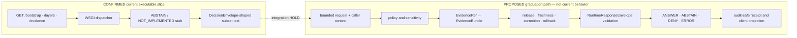

<!-- [KFM_META_BLOCK_V2]
doc_id: kfm://doc/architecture-governed-api-readme
title: Governed API Architecture Boundary
type: architecture-readme
version: v0.2
status: draft
maturity: repository-grounded; mixed-maturity; explanatory-only
owners:
  - "NEEDS VERIFICATION — architecture steward"
  - "NEEDS VERIFICATION — governed API maintainer"
  - "NEEDS VERIFICATION — security and policy reviewer"
  - "NEEDS VERIFICATION — evidence and release reviewer"
created: 2026-05-24
updated: 2026-08-14
policy_label: public
truth_posture: cite-or-abstain
responsibility_root: docs/
owning_root: docs/
current_path: docs/architecture/governed-api/README.md
readme_profile: BOUNDARY_COMPACT
responsibility: "Orient reviewers to the governed API architecture boundary, current repository evidence, direct-child documents, executable scaffold, contract/schema alignment, validation coverage, unresolved overlap, and reversible next work without creating runtime, policy, release, or publication authority."
authority_class: explanatory architecture boundary
authority_limit: "This README explains current evidence and intended boundaries. It does not accept ADR-0004, define object meaning or machine shape, evaluate policy, authorize release, prove deployment, or publish."
canonical_relationship: "CONFIRMED existing directory boundary under docs/architecture/; canonical prose ownership relative to docs/architecture/governed-api.md remains HOLD pending a reviewed overlap disposition."
evidence_snapshot:
  repository: bartytime4life/Kansas-Frontier-Matrix
  base_ref: main
  base_commit: 3974da9794fa11bd5355c49243c9193d22b9e81e
  target_prior_blob: 1c3dc3c622fcd0a7684b35ed3af93094d40636a8
  target_created_commit: 58697f43ec66e0a5bc51100a3ab79066ddc7c510
  target_last_prior_update_commit: 068a4da7beec63690889a8202a456de733f2d60e
  directory_rules_blob: fd49a0b83e55cef52c1124281f093e263526898d
  directory_rules_adoption_adr_blob: a4de0d7a96b78da59cfc499d1025e1508afd8dd9
  root_registry_blob: 024f668b5f0a9239bafa4f8b09e2afd86300ff8c
  apps_root_readme_blob: 6cd825905976b2b662e43497203206305cb78827
  governed_api_app_readme_blob: 4f21150852f133ba919b11f4f8792185fa870dae
  governed_api_main_blob: bcc8d3a0ddba4b225e962b594d548819df0cbb71
  governed_api_routes_blob: 3418168d0b267160d6ad6dd87f289e880ef4a024
  governed_api_stub_blob: 5d7c137d2e78ddfca35a1356a96333ac2e84952b
  governed_api_route_test_blob: 6474cef4f7378515ab673c288fc9daea19e388a9
  governed_api_boundary_test_blob: d84ccd2a93bdf786e8fca11ee596dcc47e543fc2
  runtime_response_contract_blob: 5060aaaa30fea37b6eeea6e1428b9effa6a163bd
  runtime_response_schema_blob: 8b86e7db8b18b65a56a4e639dfc54e1b2db93155
  runtime_response_validator_blob: 44ce7d51038a9adf9fcbdb18108cc27da8381e33
  runtime_response_alignment_test_blob: 746486ddc4e356d9dc28c7c46481c067f43ad23d
  api_workflow_blob: 84ba16a3c36a1d58b2f6f1059a31ed6354063357
  audience_classes_blob: 51a40d8deb4d43c4e6eebd57b40e54ae6852e471
  deployment_rules_blob: 977709a9f6cbac8bef8e433e0d4a0b2bf7d034aa
  envelopes_doc_blob: 0e518123aab1298a5430b8458808bc9c00072df5
  error_codes_blob: ae59686dfea140866e9b6194bb9964ade629e020
  lifecycle_gates_blob: f8e2b75e097b40abc0303ea587efdda90e8be00c
  threat_model_blob: 1e30edf28991ad558e206d5f53d9cec81083c387
  archaeology_boundary_blob: 23f05a440abc349559b3059d303d33bcd4e7f14b
related:
  - ../README.md
  - ../governed-api.md
  - ../../adr/ADR-0004-apps-governed-api-is-the-trust-membrane.md
  - ../../adr/ADR-0029-adopt-directory-governance-standard-v2.md
  - ../../doctrine/directory-rules.md
  - ../../doctrine/trust-membrane.md
  - ../../../apps/README.md
  - ../../../apps/governed-api/README.md
  - ../../../apps/explorer-web/src/adapters/GovernedClient.ts
  - ../../../contracts/runtime/runtime_response_envelope.md
  - ../../../contracts/runtime/precision_actually_used.md
  - ../../../schemas/contracts/v1/runtime/runtime_response_envelope.schema.json
  - ../../../fixtures/contracts/v1/runtime/runtime_response_envelope/README.md
  - ../../../tools/validators/validate_runtime_response_envelope.py
  - ../../../tests/contracts/test_runtime_response_contract_alignment.py
  - ../../../.github/workflows/api-test.yml
tags: [kfm, architecture, governed-api, trust-membrane, runtime-response-envelope, finite-outcomes, evidence, policy, release, correction, rollback, repository-grounded]
notes:
  - "v0.2 replaces the May 2026 pre-adoption snapshot with current repository evidence and accepted Directory Rules v2 placement authority."
  - "The prior OPEN-DR-12 folder-admission proposal is removed: this update edits an existing boundary README under the accepted docs/ architecture lane and creates no new root or authority surface."
  - "The flat docs/architecture/governed-api.md document remains an unresolved overlapping prose surface; this change moves, deletes, redirects, or canonicalizes neither path."
  - "The executable app remains a bounded fail-closed WSGI scaffold with three GET routes returning ABSTAIN / NOT_IMPLEMENTED; this README does not upgrade that maturity."
  - "The current RuntimeResponseEnvelope contract, schema, validator, fixtures, and contract-alignment test are present, but the app stubs are not wired to that client-facing envelope."
  - "This documentation-only update changes no route, contract, schema, policy, fixture, validator, workflow, app, release, deployment, or publication behavior."
[/KFM_META_BLOCK_V2] -->

<a id="top"></a>

# Governed API Architecture Boundary

> **One-line purpose.** Explain the current Governed API boundary from repository evidence: what is implemented, what remains a proposal, which companion documents exist, which contracts and checks govern the response surface, and what must close before KFM can represent the app as a complete public trust membrane.

[](#1-purpose-authority-and-status)
[](#1-purpose-authority-and-status)
[](#5-current-executable-slice)
[](#5-current-executable-slice)
[](#6-contract-schema-validator-and-fixture-authority)
[](#61-the-current-integration-gap)
[](#2-evidence-boundary)
[](#1-purpose-authority-and-status)

> [!IMPORTANT]
> **This README is explanatory architecture, not a trust decision.** Accepted ADR-0029 establishes Directory Rules v2 and confirms `docs/architecture/` as the human system-structure lane. ADR-0004 still has effective status `proposed`. File presence, an app route, a schema, a validator, a passing test, a pull request, or a merge does not accept ADR-0004, resolve evidence, approve policy, create release state, deploy a service, or publish a KFM claim.

> [!CAUTION]
> **The current app is intentionally incomplete.** Repository code confirms a small WSGI dispatcher with exactly three GET routes—`/bootstrap`, `/layers`, and `/evidence`. Every route returns a fail-closed `ABSTAIN / NOT_IMPLEMENTED` object. The app does not currently prove authentication, authorization, EvidenceRef resolution, policy evaluation, release binding, correction handling, receipt persistence, live client transport, deployed isolation, or an `ANSWER` path.

> [!WARNING]
> **Architecture prose currently overlaps.** This directory README and the flat [`docs/architecture/governed-api.md`](../governed-api.md) both discuss the governed API. No accepted migration, alias, supersession, or canonical-target record was verified for that overlap. This update treats the directory README as the boundary and direct-child index for the existing folder, but it does not silently demote, delete, redirect, or canonicalize the flat document.

**Quick navigation:** [Purpose](#1-purpose-authority-and-status) · [Evidence](#2-evidence-boundary) · [Directory map](#3-current-direct-child-map) · [Scope](#4-belongs-prohibited-inputs-and-outputs) · [Executable slice](#5-current-executable-slice) · [Contract stack](#6-contract-schema-validator-and-fixture-authority) · [Trust flow](#7-current-and-target-trust-flow) · [Exposure](#8-exposure-mutation-retention-and-review) · [Validation](#9-validation-and-negative-evidence) · [Graduation](#10-graduation-gates) · [Overlap](#11-overlap-migration-and-rollback-holds) · [Anti-patterns](#12-anti-patterns) · [Open work](#13-open-verification-backlog) · [Related](#14-related-surfaces) · [History](#15-change-history-and-documentation-rollback)

---

<a id="1-purpose-authority-and-status"></a>

## 1. Purpose, authority, and status

`docs/architecture/governed-api/` is the human architecture boundary for concerns that span Governed API routes and supporting responsibility roots. It explains how the configured app, runtime response contract, machine schema, policy boundary, evidence resolution, release state, correction state, client projections, validation, and deployment posture are intended to compose.

It is not the executable membrane. The executable app is [`apps/governed-api/`](../../../apps/governed-api/README.md). It is not the semantic contract authority, machine-schema authority, policy source, fixture family, validator implementation, lifecycle store, receipt store, release decision plane, client implementation, or deployment configuration.

### 1.1 Directory Rules basis

Accepted Directory Rules v2 establishes:

- `docs/` as the human-readable governance and explanation root;
- `docs/architecture/` as system structure subordinate to accepted decisions;
- `apps/` as the deployable-application root;
- `contracts/`, `schemas/`, and `policy/` as separate meaning, shape, and admissibility authorities;
- `tests/` and `fixtures/` as executable and reusable proof surfaces; and
- boundary READMEs as compact local contracts when ownership, exposure, mutation, lifecycle, or authority behavior changes.

This is a same-path update to an existing directory boundary. It creates no root, no new directory, no new application, and no parallel contract, schema, policy, evidence, receipt, proof, or release home.

### 1.2 Authority and maturity matrix

| Axis | Current state | Meaning |
|---|---|---|
| Document role | `BOUNDARY_COMPACT` architecture README | Human orientation and current-state map only |
| Placement | **CONFIRMED existing path** under `docs/architecture/` | Path presence is verified; prose canonicality versus the flat document is unresolved |
| Directory Rules | **ACCEPTED** through ADR-0029 | Placement authority is in force |
| ADR-0004 | Source `draft`; effective status `proposed` | Governed API trust-membrane decision is not accepted |
| App implementation | **PARTIAL / scaffold** | WSGI dispatcher, three GET routes, bounded stubs, structural tests |
| Client-facing envelope stack | **PRESENT / proposed contract family** | Contract, schema, validator, fixtures, and alignment test exist |
| App-to-envelope integration | **HOLD** | Current route objects are not RuntimeResponseEnvelope instances |
| Live Explorer transport | **ABSENT in inspected adapter** | Explorer GovernedClient is fixture-only and performs no network access |
| Policy/evidence/release runtime | **UNKNOWN / not proved** | No current app code evidence establishes the full trust flow |
| Deployment and public operation | **UNKNOWN** | No infrastructure, runtime, logs, dashboard, or observed request evidence was used here |
| Release/publication effect | **None** | Documentation cannot publish or promote |

[Back to top](#top)

---

<a id="2-evidence-boundary"></a>

## 2. Evidence boundary

The observations below are pinned to `main@3974da9794fa11bd5355c49243c9193d22b9e81e`. They describe tracked repository bytes, not production behavior.

| Surface | CONFIRMED repository observation | Limit |
|---|---|---|
| Accepted placement authority | ADR-0029 adopts the exact Directory Rules v2 bytes at `docs/doctrine/directory-rules.md`. | Does not accept ADR-0004 or prove the app is a complete membrane. |
| Current folder | Eight direct Markdown files exist in `docs/architecture/governed-api/`. | Presence does not make every statement current or authoritative. |
| Current app | `main.py` is a small WSGI dispatcher. | No auth, policy, evidence, release, or deployment maturity follows from dispatch. |
| Route registry | Exactly `/bootstrap`, `/layers`, and `/evidence` are registered. | The route list is a scaffold manifest, not the historical six-family doctrine or a production API catalogue. |
| Stub output | All registered routes emit `ABSTAIN`, reason `NOT_IMPLEMENTED`, empty evidence refs, and a zeroed SHA-256 placeholder. | A stable negative shape is not an EvidenceBundle-backed answer or accepted spec binding. |
| App-local tests | Tests cover route enumeration, deterministic abstention, unknown-route 404, method 405, forbidden imports, and internal-store path literals. | They do not prove information-flow security, authorization, policy, release, evidence closure, or deployment isolation. |
| API workflow | `api-test` runs the app smoke suite and the focused abstention-route test. | Workflow wiring is not a current hosted conclusion, required-check proof, release receipt, or publication approval. |
| RuntimeResponseEnvelope | Contract v0.4, Draft 2020-12 schema, validator, valid/invalid fixture lanes, and alignment test are present. | These surfaces define and test a proposed client envelope; the app does not emit it. |
| Explorer adapter | `GovernedClient.ts` states that it is fixture-only and performs no network or lifecycle-store access. | No live browser-to-API flow is proved. |
| Flat architecture document | `docs/architecture/governed-api.md` exists alongside this directory. | No current migration or supersession decision was established. |
| Deployment/runtime evidence | Not inspected in this documentation update. | Public operation, uptime, TLS, CORS, identity, rate limits, audit sinks, and service health remain `UNKNOWN`. |

### 2.1 Truth labels used here

- **CONFIRMED** — verified from the pinned repository bytes or accepted authority cited by this update.
- **PROPOSED** — architecture, vocabulary, future route, or implementation target not verified as current behavior.
- **UNKNOWN** — evidence is insufficient for a stronger statement.
- **NEEDS VERIFICATION** — a concrete repository, run, review, or operational check remains.
- **CONFLICTED** — two repository surfaces make incompatible shape, placement, or authority claims.
- **HOLD** — implementation or migration must stop until the stated evidence or decision closes.

### 2.2 State separation

Do not collapse these axes:

| Axis | Example current value |
|---|---|
| Truth status | `CONFIRMED`, `PROPOSED`, `UNKNOWN`, `NEEDS VERIFICATION` |
| ADR status | ADR-0004 effectively `proposed` |
| App maturity | Executable scaffold |
| Runtime outcome | Current routes return `ABSTAIN` |
| Pull-request/check state | Separate GitHub delivery evidence |
| KFM lifecycle/release state | Not changed by this document |
| Deployment state | `UNKNOWN` |
| Publication state | None |

[Back to top](#top)

---

<a id="3-current-direct-child-map"></a>

## 3. Current direct-child map

Directory Rules requires a current directory map to show the governed directory and direct children only. The tree below is verified from the pinned repository directory response.

```text
docs/architecture/governed-api/
├── AUDIENCE_CLASSES.md       # draft audience vocabulary and auth/rate posture
├── DEPLOYMENT_RULES.md       # draft deployment posture; not deployment evidence
├── ENVELOPES.md              # draft architecture catalogue; shape drift recorded below
├── ERROR_CODES.md            # draft proposed error-code vocabulary
├── LIFECYCLE_GATES.md        # draft request-time lifecycle and gate mapping
├── README.md                 # this boundary, evidence map, and direct-child index
├── THREAT_MODEL.md           # draft threat-boundary and proposed fixture map
└── archaeology.md            # draft sensitive-domain API boundary guidance
```

| Direct child | Current role | Current posture |
|---|---|---|
| [`AUDIENCE_CLASSES.md`](./AUDIENCE_CLASSES.md) | Describes `public`, `partner`, `steward`, `internal`, and `denied` audience classes. | **PROPOSED vocabulary and integration**; no accepted enum or runtime enforcement is proved. |
| [`DEPLOYMENT_RULES.md`](./DEPLOYMENT_RULES.md) | Explains TLS, CORS, rate, secret, logging, network, health, and trace posture. | **PROPOSED operational design**; not infrastructure or observed deployment evidence. |
| [`ENVELOPES.md`](./ENVELOPES.md) | Older architecture catalogue for runtime and decision envelopes. | **CONFLICTED / NEEDS RECONCILIATION** with the current RuntimeResponseEnvelope contract and schema. |
| [`ERROR_CODES.md`](./ERROR_CODES.md) | Proposes namespaced public-safe error codes. | **PROPOSED vocabulary**; no accepted registry/schema binding is proved. |
| [`LIFECYCLE_GATES.md`](./LIFECYCLE_GATES.md) | Maps lifecycle/promotion concepts to request-time outcomes. | **Architecture mapping only**; does not prove request-time enforcement. |
| [`THREAT_MODEL.md`](./THREAT_MODEL.md) | Describes nine API trust boundaries and proposed negative fixtures. | **PROPOSED mitigation/fixture map**; not a completed threat assessment or test inventory. |
| [`archaeology.md`](./archaeology.md) | Adds exact-location-deny and cultural/sensitivity guidance for Archaeology responses. | **Draft sensitive-domain boundary**; does not prove routes, policy, review, or release readiness. |

> [!IMPORTANT]
> A direct-child document can be useful without being authoritative. Where a sibling conflicts with a current contract, schema, validator, test, accepted ADR, or code path, the stronger source controls and the sibling becomes correction work.

[Back to top](#top)

---

<a id="4-belongs-prohibited-inputs-and-outputs"></a>

## 4. Belongs, prohibited content, inputs, and outputs

### 4.1 What belongs here

- Cross-route architecture explanations for the configured Governed API boundary.
- A current evidence map linking app code, contracts, schemas, policy surfaces, fixtures, validators, tests, clients, release objects, and deployment posture.
- Human threat-boundary, audience, envelope, error, lifecycle, correction, and rollback explanations that do not become machine authority.
- Sensitive-domain API boundary guidance when it explains how a domain composes with the shared membrane and does not duplicate domain contracts or policy.
- Open verification, drift, migration, and graduation criteria for the boundary.

### 4.2 What is prohibited here

| Prohibited artifact or claim | Owning root or disposition |
|---|---|
| Executable route, middleware, or app implementation | `apps/governed-api/` |
| Semantic object/API contract | `contracts/` |
| JSON Schema or generated type authority | `schemas/` |
| Allow, deny, hold, restrict, or abstain rule source | `policy/` |
| Reusable evidence, policy, citation, or envelope implementation | `packages/` |
| Provider/model adapter | `runtime/`, behind the app boundary |
| Source acquisition or admission implementation | `connectors/` |
| Lifecycle data, evidence objects, receipts, proofs, catalogs, or published carriers | Their governed families under `data/` |
| Release, correction, withdrawal, promotion, or rollback decision | `release/` |
| Infrastructure, secrets, network policy, and deployment configuration | `infra/`, app-local config, and external secret stores |
| Claim that a documented route is live without code/test/deployment evidence | `DENY` the claim; mark `PROPOSED` or `UNKNOWN` |
| Full policy decisions, raw evidence, restricted coordinates, private prompts, or secrets in public documentation | Do not include; use bounded references and private handling where required |

### 4.3 Inputs

| Input | Use in this lane |
|---|---|
| Accepted Directory Rules and ADRs | Placement and decision authority |
| Current app code and route registry | Current executable surface |
| Contracts and schemas | Meaning and machine shape |
| Policy, evidence, release, correction, and rollback surfaces | Boundary obligations and open integration checks |
| Fixtures, validators, and tests | Executable proof of bounded behavior |
| Client code | Verified consumer behavior and transport boundary |
| Workflow definitions and run results | CI wiring and exact-head evidence, kept separate |
| Runtime/deployment/log evidence | Operational maturity when available |

### 4.4 Outputs

This lane outputs only human-readable architecture guidance, navigation, verification residue, and migration/graduation criteria. It emits no runtime envelope, policy decision, receipt, proof, release record, deployment, published data, or public claim.

[Back to top](#top)

---

<a id="5-current-executable-slice"></a>

## 5. Current executable slice

### 5.1 Registered routes

| Route | Method currently accepted | Current result | Current evidence posture |
|---|---|---|---|
| `/bootstrap` | `GET` | `200 OK` with `ABSTAIN / NOT_IMPLEMENTED` | No evidence refs; placeholder spec hash |
| `/layers` | `GET` | `200 OK` with `ABSTAIN / NOT_IMPLEMENTED` | No released layer resolution |
| `/evidence` | `GET` | `200 OK` with `ABSTAIN / NOT_IMPLEMENTED` | No EvidenceRef-to-EvidenceBundle resolution |

For a registered path, non-GET methods return `405 Method Not Allowed`. Unknown paths return `404 Not Found`.

### 5.2 What the app proves

- A deterministic, no-framework WSGI dispatch slice exists.
- The route registry is explicit and tested.
- The current implementation fails closed rather than inventing an answer.
- Selected forbidden renderer/model imports are absent from the app tree.
- Selected internal lifecycle-store path literals are denied by a structural test.
- The current smoke suite is wired into `api-test`.

### 5.3 What the app does not prove

- caller identity, role, audience class, object-level authorization, or least privilege;
- request schemas, request-size limits, replay protection, CORS, rate limits, or TLS;
- evidence resolution, citation validation, or admissible EvidenceBundle closure;
- policy precheck/postcheck or accepted policy-bundle identity;
- release manifest, freshness, correction, withdrawal, supersession, or rollback state;
- a client-facing RuntimeResponseEnvelope;
- audit receipt persistence, telemetry redaction, or operational observability;
- Explorer-to-API network transport;
- deployment, uptime, isolation, public exposure, or production safety;
- any `ANSWER` response.

> [!NOTE]
> `ABSTAIN / NOT_IMPLEMENTED` is the correct present behavior for an incomplete route. It is not a defect to “fix” by fabricating an `ANSWER`. The next change must close the required contract, evidence, policy, release, and test dependencies rather than weaken the abstention.

[Back to top](#top)

---

<a id="6-contract-schema-validator-and-fixture-authority"></a>

## 6. Contract, schema, validator, and fixture authority

The current client-facing envelope stack is distributed by responsibility:

| Responsibility | Current repository surface | Verified state |
|---|---|---|
| Semantic meaning | [`contracts/runtime/runtime_response_envelope.md`](../../../contracts/runtime/runtime_response_envelope.md) | v0.4 draft; documents the current schema including answer-only precision disclosure |
| Precision semantics | [`contracts/runtime/precision_actually_used.md`](../../../contracts/runtime/precision_actually_used.md) | Separate semantic profile referenced by contract and schema |
| Machine shape | [`runtime_response_envelope.schema.json`](../../../schemas/contracts/v1/runtime/runtime_response_envelope.schema.json) | Draft 2020-12; closed object; four outcomes; conditional `ANSWER` precision/evidence requirements |
| Reusable fixtures | [`fixtures/contracts/v1/runtime/runtime_response_envelope/`](../../../fixtures/contracts/v1/runtime/runtime_response_envelope/README.md) | README plus valid and invalid lanes exist |
| Validator | [`validate_runtime_response_envelope.py`](../../../tools/validators/validate_runtime_response_envelope.py) | Schema and bounded semantic checks; no evidence/policy/release authority |
| Contract/schema alignment | [`test_runtime_response_contract_alignment.py`](../../../tests/contracts/test_runtime_response_contract_alignment.py) | Checks links, documented fields, and conditional precision rules |
| App route shape test | [`test_abstain_routes.py`](../../../apps/governed-api/tests/test_abstain_routes.py) | Validates current stubs against a DecisionEnvelope-shaped subset, not RuntimeResponseEnvelope |

### 6.1 The current integration gap

The current route object and the current RuntimeResponseEnvelope are different shapes.

| Current app stub field | RuntimeResponseEnvelope posture |
|---|---|
| `decision` | Not a RuntimeResponseEnvelope top-level field |
| `evaluated_at` | Not a RuntimeResponseEnvelope top-level field |
| `policy_family` | Not the required `policy_state` field |
| `reasons` / `obligations` | Not defined by the current closed RuntimeResponseEnvelope schema |
| Missing `policy_state` | Required by RuntimeResponseEnvelope |
| Missing `freshness` | Required by RuntimeResponseEnvelope |
| Missing `correction_state` | Required by RuntimeResponseEnvelope |

The current schema requires ten unconditional fields:

```text
id · spec_hash · version · issued_at · outcome · reason_code
evidence_refs · policy_state · freshness · correction_state
```

For `ANSWER`, it additionally requires at least one top-level EvidenceRef and a closed `precision_actually_used` object. For `ABSTAIN`, `DENY`, and `ERROR`, precision disclosure is forbidden.

**HOLD:** Do not describe the app as emitting the client-facing RuntimeResponseEnvelope until route code and tests validate the complete current schema and preserve the semantic rules enforced by the validator.

### 6.2 Companion-document conflict register

| Companion | Current conflict or limit | Required disposition |
|---|---|---|
| `ENVELOPES.md` | Describes fields such as `object_type`, `policy_decision`, `release_ref`, `payload`, `reason`, and `trace` that are not properties of the current closed RuntimeResponseEnvelope schema. | Reconcile to current contract/schema or explicitly classify as a future envelope version proposal. |
| `AUDIENCE_CLASSES.md` | Describes a five-class vocabulary and auth/rate implementation without accepted enum or runtime proof. | Keep `PROPOSED`; bind only after contract/schema/policy/test decision. |
| `ERROR_CODES.md` | Proposes a detailed public error namespace not present as a controlled enum in the current schema. | Keep `PROPOSED`; add versioning/compatibility decision before treating as public contract. |
| `LIFECYCLE_GATES.md` | Uses architecture gate mappings as though request-time checks exist. | Preserve as target design; mark enforcement `NEEDS VERIFICATION` per route. |
| `THREAT_MODEL.md` | Names proposed fixture paths not verified as complete current coverage. | Reconcile to actual tests and record uncovered threats. |
| `DEPLOYMENT_RULES.md` | Contains provider-neutral but operationally specific posture with no current deployment evidence. | Keep as design; verify against `infra/`, config, runtime, and observed deployment before operational claims. |
| `archaeology.md` | Correctly fails closed on sensitive archaeology, but no executable route/policy/release proof is established. | Keep as domain boundary guidance; connect to actual policy/tests only through a dependency-closed implementation slice. |

[Back to top](#top)

---

<a id="7-current-and-target-trust-flow"></a>

## 7. Current and target trust flow


```mermaid
flowchart LR
    subgraph CURRENT["CONFIRMED current executable slice"]
      C["GET /bootstrap · /layers · /evidence"] --> W["WSGI dispatcher"]
      W --> S["ABSTAIN / NOT_IMPLEMENTED stub"]
      S --> D["DecisionEnvelope-shaped subset test"]
    end

    subgraph TARGET["PROPOSED graduation path — not current behavior"]
      R["bounded request + caller context"] --> P["policy and sensitivity"]
      P --> E["EvidenceRef → EvidenceBundle"]
      E --> L["release · freshness · correction · rollback"]
      L --> V["RuntimeResponseEnvelope validation"]
      V --> O["ANSWER · ABSTAIN · DENY · ERROR"]
      O --> A["audit-safe receipt and client projection"]
    end

    D -. "integration HOLD" .-> R
```

### 7.1 Public-boundary rule

Ordinary clients must consume governed responses or separately reviewed, immutable, released public-safe artifacts. They must not read RAW, WORK, QUARANTINE, PROCESSED, candidate, canonical, evidence-internal, model-runtime, receipt, proof, or release-internal stores directly.

### 7.2 Static delivery

A static-delivery edge may serve already released public-safe PMTiles, COG, GeoParquet, style, sprite, glyph, or catalog carriers when release identity, integrity, rights, sensitivity, correction, and rollback behavior are governed. Static delivery is not a second policy engine, API authority, or source of truth.

### 7.3 Client posture

The inspected Explorer `GovernedClient.ts` is intentionally fixture-only. A future live transport must:

- consume the current envelope contract rather than invent a browser-only authority shape;
- fail closed on malformed or unknown outcomes;
- preserve negative, correction, and withdrawn history;
- avoid direct lifecycle/model/store access;
- honor precision, obligations, release, freshness, and correction state; and
- carry request/response correlation without exposing internal evidence or policy details.

[Back to top](#top)

---

<a id="8-exposure-mutation-retention-and-review"></a>

## 8. Exposure, mutation, retention, and review

| Property | Current rule |
|---|---|
| Documentation exposure | Public; no secrets, credentials, raw sensitive evidence, restricted coordinates, private prompts, or exploit detail |
| Runtime exposure | `UNKNOWN`; must be proved from current deployment/infrastructure evidence |
| Documentation mutation | Versioned same-path review; no generated mirror or alternate writable README |
| App mutation | Through scoped app changes with contracts/schemas/policy/tests as direct dependencies |
| Retention | Durable architecture history in Git; accepted and historical decisions retained separately in ADRs |
| Physical storage | Git repository for docs; runtime/data/release bytes remain in their owning systems |
| Permitted writers | Repository writers routed by current CODEOWNERS; role names remain `NEEDS VERIFICATION` |
| Review route | `@bartytime4life` is the verified GitHub CODEOWNERS route; routing is not stewardship, independent review, or release authority |
| Escalation | Security-sensitive detail follows `SECURITY.md`; placement/authority conflict goes to ADR or drift/verification register; release defect follows correction/rollback controls |

### 8.1 Re-review triggers

Re-review this boundary when:

- ADR-0004 changes status or scope;
- the flat-file/folder overlap is resolved;
- a route is added, removed, or graduates beyond `ABSTAIN`;
- RuntimeResponseEnvelope changes;
- an audience, auth, policy, evidence, release, correction, or audit binding changes;
- a client begins live transport;
- deployment, network, secret, logging, or telemetry posture changes;
- a security incident, correction, withdrawal, or rollback affects the membrane; or
- validation/CODEOWNERS coverage materially changes.

[Back to top](#top)

---

<a id="9-validation-and-negative-evidence"></a>

## 9. Validation and negative evidence

### 9.1 Current repository-native checks

Run from repository root:

```bash
make governed-api-smoke

python -m pytest \
  apps/governed-api/tests/test_abstain_routes.py \
  apps/governed-api/tests/test_boundary_guards.py \
  -q --strict-config --strict-markers

python tools/validators/validate_runtime_response_envelope.py --fixtures

python -m pytest \
  tests/contracts/test_runtime_response_contract_alignment.py \
  -q --strict-config --strict-markers
```

For this Markdown change, also run the applicable documentation metadata, link, graph, stale-scan, changed-area, and repository-topology checks defined by the current repository workflows.

### 9.2 What a green result proves

| Check | Bounded proof |
|---|---|
| Governed API smoke | Current app-local scaffold tests pass for the checked revision |
| Abstain route test | Registered routes preserve the current fail-closed subset shape |
| Boundary guards | Selected route/import/path literal boundaries hold |
| Runtime envelope fixtures | Current schema plus validator semantic rules accept/reject the tracked fixture family as expected |
| Contract alignment test | Contract documents the current schema and precision profile |
| Docs checks | Markdown metadata/navigation/coherence for the checked revision |

### 9.3 What a green result does not prove

A green result does not prove:

- ADR acceptance;
- authorization or audience enforcement;
- source admission, evidence resolution, policy correctness, or release approval;
- absence of all sensitive information flows;
- production deployment, uptime, capacity, TLS, CORS, rate limiting, secret hygiene, or audit integrity;
- live client integration;
- correctness of every sibling architecture proposal;
- release, promotion, deployment, or publication.

### 9.4 Negative cases required before `ANSWER`

At minimum, a graduating route needs tests for:

- malformed and oversized request;
- unsupported method and unknown path;
- unauthenticated/unauthorized audience;
- unresolved or inadmissible EvidenceRef;
- missing or stale policy bundle;
- rights/sensitivity denial and public-safe generalization obligation;
- missing release manifest, non-published state, correction, withdrawal, and rollback in progress;
- invalid response envelope;
- citation failure;
- audit/receipt failure;
- provider/adapter timeout or error without raw fallback;
- no internal path, restricted coordinate, secret, stack trace, prompt, or raw evidence leakage.

[Back to top](#top)

---

<a id="10-graduation-gates"></a>

## 10. Graduation gates

Do not represent the configured app as a complete dynamic public trust membrane until evidence closes the applicable gates.

| Gate | Required evidence | Current posture |
|---|---|---|
| Decision authority | ADR-0004 accepted, or a reviewed successor/exception explicitly governs the boundary | **HOLD — proposed** |
| Route contract | Every graduating route has bounded request and current RuntimeResponseEnvelope response contracts/schemas | **PARTIAL** |
| Envelope integration | App emits complete schema-valid envelopes and preserves answer-only precision rules | **HOLD** |
| Evidence closure | EvidenceRefs resolve through a governed resolver; unsupported claims abstain | **NOT PROVED** |
| Policy and sensitivity | Accepted policy bundle identity, pre/post checks, audience/role enforcement, negative tests | **NOT PROVED** |
| Release/correction | Release, freshness, correction, withdrawal, supersession, and rollback state are bound | **NOT PROVED** |
| Client transport | Explorer or another approved client consumes envelopes over a governed transport and fails closed | **NOT PROVED** |
| Audit/observability | Audit-safe request/decision/receipt references, redacted telemetry, operational evidence | **NOT PROVED** |
| Security/deployment | Threat mitigations, TLS/network/secret posture, load/resource limits, deployment evidence | **UNKNOWN** |
| Rollback | Route/envelope/client change can revert or forward-fix without creating a second writable authority | **REQUIRED** |
| Review | Named owners/reviewers act; CODEOWNERS alone is insufficient | **NEEDS VERIFICATION** |

### 10.1 Smallest coherent next implementation slice

A sound next app slice would remain fixture-first and no-network while it:

1. replaces one stub with a complete `ABSTAIN` RuntimeResponseEnvelope builder;
2. validates the complete current schema, including policy/freshness/correction fields;
3. keeps EvidenceRefs empty and precision absent for `ABSTAIN`;
4. adds focused invalid-envelope and leakage tests;
5. preserves the other routes as deterministic stubs;
6. updates app and architecture docs; and
7. explicitly leaves `ANSWER`, live evidence, policy, client transport, release, deployment, and publication out of scope.

That slice would close the envelope-integration gap without pretending the whole membrane is implemented.

[Back to top](#top)

---

<a id="11-overlap-migration-and-rollback-holds"></a>

## 11. Overlap, migration, and rollback holds

### 11.1 Confirmed overlap

Both paths currently exist:

```text
docs/architecture/governed-api.md
docs/architecture/governed-api/README.md
```

They overlap in purpose, route and envelope discussion, trust-membrane explanation, and proposed implementation detail. The flat document predates this folder and still has inbound references. The directory now contains seven substantive companion documents in addition to this README.

### 11.2 Current disposition

| Question | Current answer |
|---|---|
| Which path is canonical prose authority? | **HOLD — no reviewed disposition verified** |
| Is either path a generated mirror? | **No generation relationship verified** |
| Is the flat file a tombstone or redirect? | **No** |
| Is the folder approved as a replacement? | **Not established by an accepted path-specific decision** |
| May this README silently delete or supersede the flat file? | **No** |
| Does the overlap change app behavior? | **No; both are documentation surfaces** |

### 11.3 Required future convergence evidence

Before moving, flattening, redirecting, or retiring either surface:

- inventory inbound links, anchors, external references, writers, and consumers;
- classify unique content and conflicts document-by-document;
- select one writable canonical target through a reviewed path decision or ADR where authority changes;
- preserve stable links through a bounded tombstone or migration when required;
- update parent navigation and every direct consumer;
- validate links, anchors, doc graph, metadata, stale scan, and topology;
- record rollback or forward-fix behavior; and
- prove the old path has zero writers before retirement.

### 11.4 Documentation rollback

This v0.2 README can be reverted independently to prior blob `1c3dc3c622fcd0a7684b35ed3af93094d40636a8`. That restores the May 2026 text without changing the flat document, direct-child files, app code, contracts, schemas, policy, fixtures, validators, tests, workflows, release state, deployment, or publication.

[Back to top](#top)

---

<a id="12-anti-patterns"></a>

## 12. Anti-patterns

| Anti-pattern | Why it fails | Required response |
|---|---|---|
| Treating this README as accepted architecture authority | Documentation cannot accept ADR-0004 or change runtime behavior. | Cite accepted authority and current implementation separately. |
| Calling the current app a complete trust membrane | Three deterministic negative routes do not establish the trust flow. | Use `scaffold`, `partial`, or `HOLD`; name missing gates. |
| Replacing `ABSTAIN` with an uncited placeholder answer | Converts honest incompleteness into false authority. | Keep fail-closed outcome until evidence/policy/release closure exists. |
| Documenting proposed routes as live | Creates public-contract drift and false client expectations. | Verify code, tests, schemas, policy, deployment, and exact route behavior. |
| Treating `ENVELOPES.md` as machine authority | Its field sketch conflicts with the current closed schema. | Contract/schema/validator control; correct the sibling. |
| Hiding audience class only in middleware | Makes exposure semantics invisible and unauditable. | Bind audience/role through reviewed contract, policy, implementation, and tests. |
| Direct client access to lifecycle/internal/model stores | Bypasses evidence, policy, release, correction, and audit gates. | Route through governed interfaces or released immutable carriers. |
| Logging raw evidence, prompts, secrets, restricted coordinates, or policy internals | Turns observability into an exfiltration surface. | Allowlist fields, redact, test telemetry, and fail closed. |
| Mutating a published carrier in place | Breaks release identity, correction, and rollback. | New immutable release identity plus correction/rollback lineage. |
| Letting the directory absorb schemas, policy, fixtures, tests, or app code | Creates parallel authority inside `docs/`. | Keep each artifact in its responsibility root and link it here. |
| Silently choosing between flat file and folder | Erases lineage and may break consumers. | Use governed migration with inventory, compatibility, validation, and rollback. |

[Back to top](#top)

---

<a id="13-open-verification-backlog"></a>

## 13. Open verification backlog

### P0 — boundary truth and safety

- [ ] Resolve the flat-file/folder overlap through a reviewed path and migration decision.
- [ ] Keep ADR-0004 status and index synchronized; do not infer acceptance from implementation.
- [ ] Reconcile `ENVELOPES.md` with the current RuntimeResponseEnvelope contract/schema.
- [ ] Bind app stubs to the complete RuntimeResponseEnvelope or explicitly version a different client contract.
- [ ] Verify policy, evidence, release, correction, rollback, and audit integration before any `ANSWER` path.
- [ ] Verify sensitive-domain deny/generalization behavior through executable policy and negative fixtures.

### P1 — credible client slice

- [ ] Implement a no-network complete-envelope `ABSTAIN` route with focused tests.
- [ ] Define and validate bounded request schemas for each graduating route.
- [ ] Connect a client only after the envelope contract and safe failure behavior are stable.
- [ ] Preserve correction, withdrawn, superseded, stale, and denied states in the client.
- [ ] Establish exact reason-code and audience vocabularies through their proper contract/schema/policy authorities.

### P2 — operational maturity

- [ ] Verify deployment topology, TLS, CORS, rate limiting, secret management, network isolation, health, readiness, and tracing.
- [ ] Verify redacted telemetry and receipt/audit persistence from observed runs.
- [ ] Add resource budgets, load tests, timeout behavior, and abuse cases.
- [ ] Confirm hosted exact-head checks and required-check/ruleset coupling.
- [ ] Perform correction, withdrawal, and rollback drills across API, client, cache, search, graph, and released carriers.

[Back to top](#top)

---

<a id="14-related-surfaces"></a>

## 14. Related surfaces

### 14.1 Governing decisions and doctrine

- [ADR-0029 — Adopt Directory Governance Standard v2](../../adr/ADR-0029-adopt-directory-governance-standard-v2.md)
- [ADR-0004 — `apps/governed-api/` is the Trust Membrane](../../adr/ADR-0004-apps-governed-api-is-the-trust-membrane.md)
- [Directory Rules](../../doctrine/directory-rules.md)
- [Trust Membrane doctrine](../../doctrine/trust-membrane.md)

### 14.2 Architecture and direct companions

- [Architecture root README](../README.md)
- [Overlapping flat Governed API architecture document](../governed-api.md)
- [Audience Classes](./AUDIENCE_CLASSES.md)
- [Deployment Rules](./DEPLOYMENT_RULES.md)
- [Envelopes](./ENVELOPES.md)
- [Error Codes](./ERROR_CODES.md)
- [Lifecycle Gates](./LIFECYCLE_GATES.md)
- [Threat Model](./THREAT_MODEL.md)
- [Archaeology boundary](./archaeology.md)

### 14.3 Implementation and proof surfaces

- [Apps root](../../../apps/README.md)
- [Governed API app](../../../apps/governed-api/README.md)
- [Explorer fixture-only GovernedClient](../../../apps/explorer-web/src/adapters/GovernedClient.ts)
- [RuntimeResponseEnvelope contract](../../../contracts/runtime/runtime_response_envelope.md)
- [PrecisionActuallyUsed contract](../../../contracts/runtime/precision_actually_used.md)
- [RuntimeResponseEnvelope schema](../../../schemas/contracts/v1/runtime/runtime_response_envelope.schema.json)
- [RuntimeResponseEnvelope fixture family](../../../fixtures/contracts/v1/runtime/runtime_response_envelope/README.md)
- [RuntimeResponseEnvelope validator](../../../tools/validators/validate_runtime_response_envelope.py)
- [Contract/schema alignment test](../../../tests/contracts/test_runtime_response_contract_alignment.py)
- [`api-test` workflow](../../../.github/workflows/api-test.yml)

[Back to top](#top)

---

<a id="15-change-history-and-documentation-rollback"></a>

## 15. Change history and documentation rollback

| Date | Version | Change | Effect |
|---|---|---|---|
| 2026-05-24 | v0.1 | Created and updated the initial doctrine-heavy lane README. | Established orientation but relied on pre-adoption path assumptions and proposal-shaped implementation claims. |
| 2026-08-14 | v0.2 | Reconciled the README to accepted Directory Rules v2, current app/routes/tests, current RuntimeResponseEnvelope stack, actual direct children, overlap risk, validation, graduation gates, and exact rollback. | Documentation only; no runtime, policy, release, deployment, or publication change. |

### Rollback target

```text
path: docs/architecture/governed-api/README.md
prior_blob: 1c3dc3c622fcd0a7684b35ed3af93094d40636a8
```

Reverting this document must not be represented as reverting app behavior, policy, evidence, release state, deployment, or publication. Those are independent responsibility surfaces.

[Back to top](#top)
