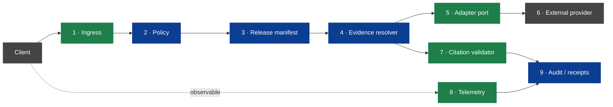

<!-- [KFM_META_BLOCK_V2]
doc_id: kfm://doc/architecture-governed-api-threat-model
title: Governed API — Threat Model
type: standard
version: v0.1
status: draft
owners: API steward + Security steward · NEEDS VERIFICATION
created: 2026-05-24
updated: 2026-05-24
policy_label: public
related:
  - README.md
  - ../governed-api.md
  - ../cross-domain/trust-membrane.md
  - AUDIENCE_CLASSES.md
  - ENVELOPES.md
  - LIFECYCLE_GATES.md
  - DEPLOYMENT_RULES.md
tags: [kfm, architecture, governed-api, threat-model, trust-boundary, doctrine]
notes:
  - PROPOSED. Expands docs/architecture/governed-api.md §8 (internal layering) and §7 (deny-by-default).
  - Required negative-state fixtures live under tests/runtime_proof/ (PROPOSED layout).
[/KFM_META_BLOCK_V2] -->

<a id="top"></a>

# Governed API — Threat Model

> *Nine trust boundaries × threats × mitigations × fixtures. The negative-state proof surface that verifies the deny-by-default posture works.*


-blue)


**Status:** draft · **Owners:** API steward + Security steward *(NEEDS VERIFICATION)* · **Last updated:** 2026-05-24

> [!IMPORTANT]
> **A trust boundary is not a wish.** It is a point in the architecture where one component's assumptions about another are **checked at runtime**, not implied by deployment. The nine boundaries below name where the governed API turns trust posture into an executable check.

> [!CAUTION]
> **An API that can only produce `ANSWER` is mis-classified as healthy.** The trust membrane is verified by the rejection paths *(`governed-api.md` §10)*. Every mitigation below is paired with a required `runtime_proof/` fixture.

---

## Table of contents

1. [Scope](#1-scope)
2. [The nine trust boundaries](#2-the-nine-trust-boundaries)
3. [Boundary 1 — Client ↔ API ingress](#3-boundary-1--client--api-ingress)
4. [Boundary 2 — API ↔ Policy](#4-boundary-2--api--policy)
5. [Boundary 3 — API ↔ Release manifest](#5-boundary-3--api--release-manifest)
6. [Boundary 4 — API ↔ Evidence resolver](#6-boundary-4--api--evidence-resolver)
7. [Boundary 5 — API ↔ Runtime adapter](#7-boundary-5--api--runtime-adapter)
8. [Boundary 6 — Runtime adapter ↔ External provider](#8-boundary-6--runtime-adapter--external-provider)
9. [Boundary 7 — API ↔ Citation validator](#9-boundary-7--api--citation-validator)
10. [Boundary 8 — API ↔ Telemetry](#10-boundary-8--api--telemetry)
11. [Boundary 9 — API ↔ Audit / Receipts store](#11-boundary-9--api--audit--receipts-store)
12. [Fixture coverage matrix](#12-fixture-coverage-matrix)
13. [Anti-patterns](#13-anti-patterns)
14. [Open questions and ADR triggers](#14-open-questions-and-adr-triggers)
15. [Related docs](#15-related-docs)
16. [Appendix](#16-appendix)

---

## 1. Scope

This doc names every boundary the governed API crosses on a single request, the threats that boundary defends, the mitigations that enforce the defense, and the fixtures that prove the mitigations work.

> [!TIP]
> **When this doc binds.** Adding a new route, adding a new envelope shape, adding a new adapter, or hardening an existing route. Reviewers compare the route's behavior to this doc's boundaries before approving.

[↑ Back to top](#top)

---

## 2. The nine trust boundaries

> **Evidence basis:** `governed-api.md` §6 *(request → response flow)*, §8 *(internal layering, CONFIRMED)*, §7 *(deny-by-default rules)*; `kfm_unified_doctrine_synthesis.md` §11.



| # | Boundary | Trust direction | Primary threats |
|---|---|---|---|
| **1** | Client ↔ API ingress | Untrusted → governed | Injection, schema spoofing, replay, oversize payload, auth bypass. |
| **2** | API ↔ Policy | Governed → governed | Policy bypass, stale policy, denial reasoning leak. |
| **3** | API ↔ Release manifest | Governed → governed | Unreleased layer exposure, stale manifest, rollback skew. |
| **4** | API ↔ Evidence resolver | Governed → governed | Unresolved reference accepted, internal id leakage. |
| **5** | API ↔ Runtime adapter | Governed → governed | Adapter bypass at route level, raw evidence passed to adapter. |
| **6** | Runtime adapter ↔ External provider | Governed → untrusted | Prompt injection, exfiltration via context, credential leak. |
| **7** | API ↔ Citation validator | Governed → governed | `ANSWER` with unresolved citations, validator skipped. |
| **8** | API ↔ Telemetry | Governed → semi-trusted | Raw evidence in events, restricted coords in events, secret leak. |
| **9** | API ↔ Audit / receipts | Governed → trusted | Missing receipts, tamperable receipts, PII in receipts. |

[↑ Back to top](#top)

---

## 3. Boundary 1 — Client ↔ API ingress

| Aspect | Detail |
|---|---|
| Direction | Untrusted client → governed API |
| Threats | Schema-spoofed request; injection into query / header / path; oversize payload; replay; auth bypass; CORS abuse; rate exhaustion. |
| Mitigations | Inbound schema validation; strict content-type; size limits; rate limits per audience class *(`AUDIENCE_CLASSES.md`)*; TLS-only; CORS allowlist *(`DEPLOYMENT_RULES.md`)*; auth at edge for non-`public` classes. |
| Outcome on failure | `ERROR` envelope with stable error code *(`ERROR_CODES.md`)*; never partial leakage. |
| Required fixtures | `tests/runtime_proof/ingress/schema_spoof_*.json`; `tests/runtime_proof/ingress/oversize_*.json`; `tests/runtime_proof/ingress/auth_bypass_*.json`; `tests/runtime_proof/ingress/cors_violation_*.json`. |

[↑ Back to top](#top)

---

## 4. Boundary 2 — API ↔ Policy

| Aspect | Detail |
|---|---|
| Direction | Governed → governed *(API → `policy/`)* |
| Threats | Route handler emits `ANSWER` before policy evaluation; stale policy bundle; denial reason leaks evidence or identifiers. |
| Mitigations | Policy evaluator invoked before resolution *(`governed-api.md` §6 guarantee)*; policy bundle pinned to release; reason codes only *(`ERROR_CODES.md`)*, never free text from policy internals. |
| Outcome on failure | `DENY` envelope with stable reason code; alternative surface may be suggested if the policy provides one. |
| Required fixtures | `tests/runtime_proof/policy/precedes_resolution_*.json`; `tests/runtime_proof/policy/sensitive_lane_denied_*.json`; `tests/runtime_proof/policy/reason_code_only_*.json`. |

[↑ Back to top](#top)

---

## 5. Boundary 3 — API ↔ Release manifest

| Aspect | Detail |
|---|---|
| Direction | Governed → governed *(API → `release/`)* |
| Threats | Unreleased layer served; manifest stale during rollback; manifest skewed between resolver and renderer. |
| Mitigations | `ReleaseManifest` resolved before evidence; manifest hash in `trace.spec_hash`; rollback target preloaded; LIFECYCLE_GATES rules enforced *(`LIFECYCLE_GATES.md`)*. |
| Outcome on failure | `ABSTAIN` if manifest missing; `DENY` if state is `WORK` / `QUARANTINE`. |
| Required fixtures | `tests/runtime_proof/release/unreleased_layer_*.json`; `tests/runtime_proof/release/stale_manifest_*.json`; `tests/runtime_proof/release/rollback_skew_*.json`. |

[↑ Back to top](#top)

---

## 6. Boundary 4 — API ↔ Evidence resolver

| Aspect | Detail |
|---|---|
| Direction | Governed → governed |
| Threats | Unresolved `EvidenceRef` slips through as `ANSWER`; internal index ids leak in response or error; resolver returns mixed-role bundle without flagging. |
| Mitigations | Resolver returns either resolved bundle or `unresolved` marker; envelope assembler refuses `ANSWER` if marker present; internal ids never appear outside `kfm://evidence/<bundle_id>` URI scheme. |
| Outcome on failure | `ABSTAIN` envelope with citation report referenced. |
| Required fixtures | `tests/runtime_proof/evidence/unresolved_ref_*.json`; `tests/runtime_proof/evidence/internal_id_leak_*.json`; `tests/runtime_proof/evidence/mixed_role_bundle_*.json`. |

[↑ Back to top](#top)

---

## 7. Boundary 5 — API ↔ Runtime adapter

| Aspect | Detail |
|---|---|
| Direction | Governed → governed *(API → `runtime/`)* |
| Threats | Route imports provider SDK directly; raw bundle / raw evidence passed to adapter; adapter sees more context than the call requires. |
| Mitigations | Provider SDKs imported only in `runtime/`; adapter port API accepts `EvidenceRef` / resolved fields only — never raw store handles; least-context principle enforced by adapter contract. |
| Outcome on failure | Build-time: code review and import-graph check fails. Runtime: adapter rejects oversized context; `ERROR` envelope. |
| Required fixtures | `tests/runtime_proof/adapter/route_imports_sdk_*.spec` *(static)*; `tests/runtime_proof/adapter/oversized_context_*.json`; `tests/runtime_proof/adapter/raw_bundle_passed_*.json`. |

[↑ Back to top](#top)

---

## 8. Boundary 6 — Runtime adapter ↔ External provider

| Aspect | Detail |
|---|---|
| Direction | Governed adapter → untrusted external provider |
| Threats | Prompt injection in provider response; exfiltration via context window; credential leak via misconfigured client; provider returns content cited as evidence by client. |
| Mitigations | Provider output passes through adapter sanitizer; `AIReceipt` records adapter, model id, hashes; provider response is NOT evidence — `EvidenceBundle` is; secrets sourced from secret store at request time, never logged. |
| Outcome on failure | `ABSTAIN` envelope; `AIReceipt` records refusal reason. |
| Required fixtures | `tests/runtime_proof/provider/prompt_injection_*.json`; `tests/runtime_proof/provider/cite_provider_output_*.json`; `tests/runtime_proof/provider/secret_in_log_*.json`. |

[↑ Back to top](#top)

---

## 9. Boundary 7 — API ↔ Citation validator

| Aspect | Detail |
|---|---|
| Direction | Governed → governed |
| Threats | Validator skipped under load; validator returns "ok" on partial resolution; cited refs differ from resolved bundle. |
| Mitigations | Citation validator is **last gate before envelope assembly** *(`governed-api.md` §6 third guarantee)*; non-resolution forces `ABSTAIN`; validator emits `CitationValidationReport` referenced by envelope. |
| Outcome on failure | `ABSTAIN` envelope with report reference; alert if validator unavailable. |
| Required fixtures | `tests/runtime_proof/citation/skipped_validator_*.json`; `tests/runtime_proof/citation/partial_resolution_*.json`; `tests/runtime_proof/citation/cited_vs_resolved_mismatch_*.json`. |

[↑ Back to top](#top)

---

## 10. Boundary 8 — API ↔ Telemetry

| Aspect | Detail |
|---|---|
| Direction | Governed → semi-trusted *(telemetry sink)* |
| Threats | Raw evidence / prompts / secrets in events; restricted coordinates in events *(geoprivacy violation)*; PII in events; high-cardinality identifiers used as labels. |
| Mitigations | Telemetry schema validation at boundary; redaction at boundary, not at sink; allowlist of event types; bounded label cardinality. |
| Outcome on failure | Event dropped at boundary; `ERROR` for `POST /telemetry` if event violates schema. |
| Required fixtures | `tests/runtime_proof/telemetry/raw_evidence_event_*.json`; `tests/runtime_proof/telemetry/restricted_coord_*.json`; `tests/runtime_proof/telemetry/secret_in_label_*.json`. |

[↑ Back to top](#top)

---

## 11. Boundary 9 — API ↔ Audit / Receipts store

| Aspect | Detail |
|---|---|
| Direction | Governed → trusted *(`data/receipts/`)* |
| Threats | Receipts not emitted; receipts incomplete *(missing `PolicyDecision`, `AIReceipt`, `CitationValidationReport`)*; receipts tamperable; receipts contain PII. |
| Mitigations | Envelope assembler emits all required receipts before response sent; receipts append-only and content-addressed; receipt schemas validate at write; PII redaction at write. |
| Outcome on failure | `ERROR` envelope at request *(API should not respond without emitting required receipts)*; operations alert on partial receipt write. |
| Required fixtures | `tests/runtime_proof/audit/missing_policy_receipt_*.json`; `tests/runtime_proof/audit/missing_ai_receipt_*.json`; `tests/runtime_proof/audit/pii_in_receipt_*.json`. |

[↑ Back to top](#top)

---

## 12. Fixture coverage matrix

> **Evidence basis:** `governed-api.md` §10 *(validators, observability, proof, CONFIRMED)*; `directory-rules.md` §6.6 *(test homes, PROPOSED layout)*.

| Boundary | `ANSWER` fixture | `ABSTAIN` fixture | `DENY` fixture | `ERROR` fixture |
|---|---|---|---|---|
| 1 · Ingress | ✓ | — | — | ✓ |
| 2 · Policy | ✓ | — | ✓ | — |
| 3 · Release | ✓ | ✓ | ✓ | — |
| 4 · Evidence | ✓ | ✓ | — | — |
| 5 · Adapter | ✓ | — | — | ✓ |
| 6 · Provider | ✓ | ✓ | — | ✓ |
| 7 · Citation | ✓ | ✓ | — | — |
| 8 · Telemetry | ✓ | — | — | ✓ |
| 9 · Audit | ✓ | — | — | ✓ |

> [!IMPORTANT]
> **Coverage means every cell has a fixture, not just the happy path.** A boundary without `ABSTAIN`/`DENY`/`ERROR` fixtures *(where applicable)* is not verified.

[↑ Back to top](#top)

---

## 13. Anti-patterns

| Anti-pattern | Mitigation |
|---|---|
| **Boundary check moved into the adapter layer** *(e.g., adapter calls policy)* | Policy evaluated by the policy evaluator before resolution; adapter receives already-permitted requests. |
| **Boundary skipped under high load** *(e.g., citation validator bypassed when slow)* | No bypass: degraded → `ABSTAIN`, not bypass → `ANSWER`. |
| **Fixture covers happy path only** | Negative-state fixtures required per matrix; reviewers check absences. |
| **Threat-model exception** *(e.g., "we allow raw evidence in telemetry for debug")* | No exception: `DRIFT_REGISTER.md` entry + ADR; not a one-off bypass. |
| **External provider response cited as evidence** | Provider response goes into `AIReceipt`; `EvidenceBundle` is unchanged. |

[↑ Back to top](#top)

---

## 14. Open questions and ADR triggers

| Open item | Class | Suggested ADR title |
|---|---|---|
| Boundary 5 — should the adapter port be a hard process boundary *(IPC)*, or in-process with import-graph enforcement? | Architecture | "Adapter port process boundary". |
| Boundary 6 — sanitizer scope: same sanitizer for all providers or per-provider? | Implementation | "Provider sanitizer scope". |
| Fixture organization — `tests/runtime_proof/<boundary>/` vs `tests/runtime_proof/<outcome>/`? | Layout | "Negative-state fixture layout". |
| Should Boundary 6 break out a sub-boundary for tile / vector / graph providers vs model providers? | Granularity | "Provider sub-boundary split". |

[↑ Back to top](#top)

---

## 15. Related docs

| Reference | Role | Truth label |
|---|---|---|
| `README.md` *(this folder)* | Landing | CONFIRMED doctrine |
| `../governed-api.md` §6, §7, §8, §10 | Doctrine spine | CONFIRMED doctrine |
| `AUDIENCE_CLASSES.md` | Boundary 1 audience-based rate limits | PROPOSED |
| `ENVELOPES.md` | Outcomes referenced at each boundary | PROPOSED |
| `LIFECYCLE_GATES.md` | Boundary 3 release-state enforcement | PROPOSED |
| `ERROR_CODES.md` | Stable reason / error codes at every boundary | PROPOSED |
| `DEPLOYMENT_RULES.md` | Boundaries 1, 8 operational hardening | PROPOSED |
| `directory-rules.md` §6.6 | Test home for `runtime_proof/` | CONFIRMED doctrine |
| `kfm_unified_doctrine_synthesis.md` §11 | Finite outcome envelope | CONFIRMED doctrine |

[↑ Back to top](#top)

---

## 16. Appendix

<details>
<summary><strong>16.1 Trust-boundary checklist — at-a-glance</strong></summary>

```text
Per request, the governed API SHOULD cross every applicable boundary:

  1 · Ingress         — schema · size · auth · rate
  2 · Policy          — PolicyDecision before resolution
  3 · Release         — ReleaseManifest pinned
  4 · Evidence        — refs resolve to bundle
  5 · Adapter         — least-context to runtime
  6 · Provider        — sanitize + receipt
  7 · Citation        — last gate before ANSWER
  8 · Telemetry       — redact at boundary
  9 · Audit           — receipts emitted before response

Skipping any boundary degrades the outcome (ABSTAIN/DENY/ERROR);
never bypass to preserve ANSWER under load.
```

</details>

<details>
<summary><strong>16.2 Truth-label legend</strong></summary>

- **CONFIRMED** — verified this session from attached docs.
- **PROPOSED** — design / placement / inference not yet verified in implementation.
- **INFERRED** — derivable from confirmed evidence but not directly stated.
- **NEEDS VERIFICATION** — checkable, but not yet checked strongly enough to act as fact.

</details>

---

**Related (mini)** · [`README.md`](README.md) · [`../governed-api.md`](../governed-api.md) · [`AUDIENCE_CLASSES.md`](AUDIENCE_CLASSES.md) · [`ENVELOPES.md`](ENVELOPES.md) · [`LIFECYCLE_GATES.md`](LIFECYCLE_GATES.md) · [`ERROR_CODES.md`](ERROR_CODES.md) · [`DEPLOYMENT_RULES.md`](DEPLOYMENT_RULES.md)

**Last updated:** 2026-05-24 · **Doc version:** v0.1 · **Doc status:** draft · **Path status:** PROPOSED *(OPEN-DR-12 META)*

[↑ Back to top](#top)
