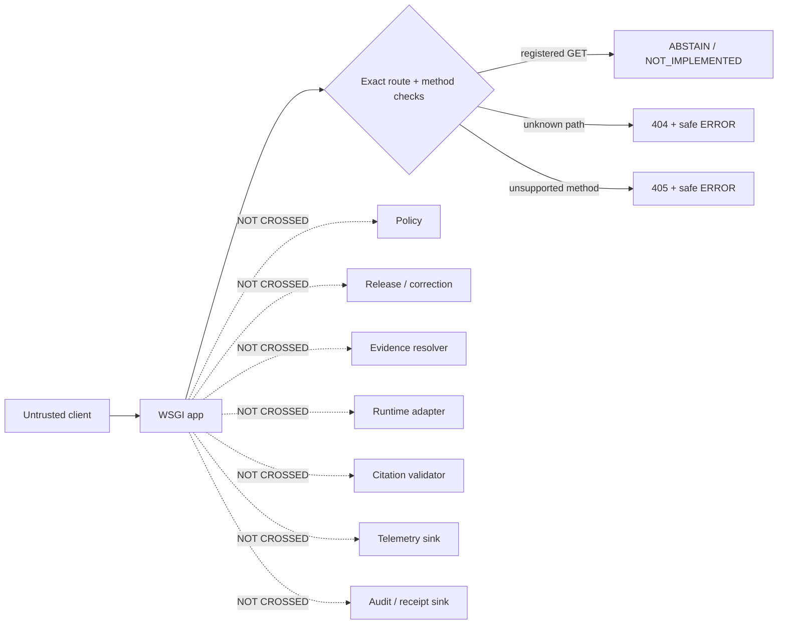

<!-- [KFM_META_BLOCK_V2]
doc_id: kfm://doc/architecture-governed-api-threat-model
title: Governed API — Threat Model
type: architecture-standard; threat-model; current-state-and-graduation-boundary
version: v0.2
status: draft; repository-grounded; scaffold-guards-partial; composed-trust-boundaries-held; non-release; non-publication
owners: "@bartytime4life via CODEOWNERS; API, security, privacy, runtime, evidence, policy, release, and independent-review ownership NEEDS VERIFICATION"
created: 2026-05-24
updated: 2026-08-19
policy_label: public; architecture; no-secrets; no-restricted-payloads; no-operational-endpoints
owning_root: docs/
current_path: docs/architecture/governed-api/THREAT_MODEL.md
responsibility: Explain the Governed API threat boundary, distinguish current executable safeguards from target mitigations, and define the evidence required before a boundary may be called enforced.
authority_limit: Human architecture guidance only; does not create authentication, authorization, policy, evidence, release, adapter, provider, citation, telemetry, audit, deployment, incident, or publication authority.
truth_posture: CONFIRMED pinned repository evidence / PROPOSED target controls / UNKNOWN deployed behavior / NEEDS VERIFICATION named owners, settings, and operational proof
evidence_snapshot:
  repository: bartytime4life/Kansas-Frontier-Matrix
  base_ref: main
  base_commit: 0a547c12e7965565d397fcad46d94c1c7b41f0c7
  prior_target_blob: 1e30edf28991ad558e206d5f53d9cec81083c387
  directory_rules_blob: fd49a0b83e55cef52c1124281f093e263526898d
  codeowners_blob: dd2a84aa514d8ecd9208bc347f90f9a2ed37dd61
  app_entry_blob: 4eb335c7c0b27f62c7419c478542e8fe40e1ff38
  route_registry_blob: 3418168d0b267160d6ad6dd87f289e880ef4a024
  stub_builder_blob: 371e60d9f96c78e31c8a1e6109d19dee5da4213b
  abstain_test_blob: 2be20f5d93c03da7677c34b11a31875a00b2ed28
  boundary_test_blob: 4035e537e6c52194928df5ab8ceb41a35f5f30ca
  runtime_envelope_schema_blob: 8b86e7db8b18b65a56a4e639dfc54e1b2db93155
  envelopes_document_blob: 4c80f1d1808d5bed8f56bc2fd1fb73222d65ee42
  runtime_proof_readme_blob: 23a259513a25ec43922f4767de8d5c05c8302ee6
  api_workflow_blob: 84ba16a3c36a1d58b2f6f1059a31ed6354063357
related:
  - README.md
  - README.md
  - ../../security/THREAT_MODEL.md
  - ../../security/AUDIT_INVARIANTS.md
  - ../../adr/ADR-0004-apps-governed-api-is-the-trust-membrane.md
  - ../../adr/ADR-0016-telemetry-redaction-posture.md
  - ../../adr/ADR-0029-adopt-directory-governance-standard-v2.md
  - ../../doctrine/directory-rules.md
  - AUDIENCE_CLASSES.md
  - ENVELOPES.md
  - LIFECYCLE_GATES.md
  - ERROR_CODES.md
  - DEPLOYMENT_RULES.md
  - ../../../apps/governed-api/src/governed_api/main.py
  - ../../../apps/governed-api/src/governed_api/routes/registry.py
  - ../../../apps/governed-api/src/governed_api/stub.py
  - ../../../apps/governed-api/tests/test_abstain_routes.py
  - ../../../apps/governed-api/tests/test_boundary_guards.py
  - ../../../schemas/contracts/v1/runtime/runtime_response_envelope.schema.json
  - ../../../policy/access/README.md
  - ../../../packages/evidence-resolver/README.md
  - ../../../runtime/model_adapters/README.md
  - ../../../tools/validators/citation/README.md
  - ../../../tests/runtime_proof/README.md
  - ../../../.github/workflows/api-test.yml
tags: [kfm, architecture, governed-api, threat-model, trust-boundary, fail-closed, finite-outcomes, evidence, policy, release, runtime, telemetry, audit]
notes:
  - "v0.2 preserves the nine-boundary vocabulary as a target threat inventory while correcting the prior implication that all nine are current runtime crossings."
  - "The executable app currently proves a small WSGI route/method/error scaffold and static boundary guards; it does not prove authentication, policy, release, evidence, adapter, provider, citation, telemetry, audit, or deployment enforcement."
  - "The legacy tests/runtime_proof/<boundary>/ fixture tree is not represented as implemented; the confirmed root currently contains shared finite-envelope and mock-selector suites plus domain routing surfaces."
  - "Accepted ADR-0029 resolves the same-path docs placement; the former OPEN-DR-12 path hold no longer applies to this edit."
[/KFM_META_BLOCK_V2] -->

<a id="top"></a>

# Governed API — Threat Model

> **Purpose.** Define what the Governed API must protect, show which safeguards are actually present in the current scaffold, and keep every unproved trust crossing on an explicit `HOLD`.

[](#current-repository-determination)
[](#current-repository-determination)
[](#boundary-1-current-evidence)
[](#boundary-1-held-controls)
[](#graduation-holds)
[](#authority-and-non-effects)

> [!IMPORTANT]
> **A threat model is not enforcement evidence.** This document can name a control, failure posture, test, or target sequence. Only current code, configuration, contracts, schemas, policy, tests, workflows, emitted artifacts, deployment evidence, and runtime observations can prove that a boundary is enforced.

> [!CAUTION]
> **A boundary that the current scaffold does not cross is `NOT_CROSSED`, not “mitigated.”** The current app never calls policy, release, evidence, model-provider, citation, telemetry, or audit services. That small attack surface is useful, but it does not prove the controls required when those dependencies are introduced.

> [!WARNING]
> **Do not put exploit payloads, credentials, private endpoints, restricted source names, protected coordinates, raw evidence, prompts, or production diagnostics in this public document or its fixtures.** Reproduction details for a real vulnerability belong in the repository's private security-reporting and incident process, not in public architecture prose.

**Quick navigation:** [Scope](#1-scope) · [Boundaries](#2-the-nine-trust-boundaries) · [Ingress](#3-boundary-1--client--api-ingress) · [Policy](#4-boundary-2--api--policy) · [Release](#5-boundary-3--api--release-manifest) · [Evidence](#6-boundary-4--api--evidence-resolver) · [Adapter](#7-boundary-5--api--runtime-adapter) · [Provider](#8-boundary-6--runtime-adapter--external-provider) · [Citation](#9-boundary-7--api--citation-validator) · [Telemetry](#10-boundary-8--api--telemetry) · [Audit](#11-boundary-9--api--audit--receipts-store) · [Proof](#12-fixture-coverage-matrix) · [Anti-patterns](#13-anti-patterns) · [Decisions](#14-open-questions-and-adr-triggers) · [References](#15-related-docs) · [Appendix](#16-appendix)

---

<a id="1-scope"></a>

## 1. Scope

This is the **Governed API-specific** threat model. The broader [`docs/security/THREAT_MODEL.md`](../../security/THREAT_MODEL.md) remains the system-wide planning view; this page narrows the analysis to the public trust membrane represented by `apps/governed-api/`, its intended dependencies, its finite response boundary, and the proof needed before substantive exposure.

### Current repository determination

At `main@0a547c12e7965565d397fcad46d94c1c7b41f0c7`, the inspected executable surface is a deliberately small standard-library WSGI scaffold:

```text
GET /bootstrap | /layers | /evidence
        |
        v
exact in-process route registry
        |
        v
ABSTAIN / NOT_IMPLEMENTED

unknown route
        |
        v
404 + ERROR / SAFE_RUNTIME_ERROR

unsupported method on a registered route
        |
        v
405 + ERROR / SAFE_RUNTIME_ERROR
```

| Surface | Current evidence | Safe conclusion |
|---|---|---|
| WSGI entry point | [`main.py`](../../../apps/governed-api/src/governed_api/main.py) | Reads `PATH_INFO` and `REQUEST_METHOD`, dispatches an exact route map, serializes JSON, and defaults `serve()` to loopback. This is source evidence, not deployment proof. |
| Route inventory | [`routes/registry.py`](../../../apps/governed-api/src/governed_api/routes/registry.py) | Exactly `/bootstrap`, `/layers`, and `/evidence` are registered. |
| Registered GET behavior | [`stub.py`](../../../apps/governed-api/src/governed_api/stub.py) and route tests | All three routes return `ABSTAIN / NOT_IMPLEMENTED`, empty evidence refs, and a placeholder `sha256:aaaa...` spec hash. |
| Negative HTTP behavior | [`test_boundary_guards.py`](../../../apps/governed-api/tests/test_boundary_guards.py) | Unknown paths return HTTP 404 and unsupported methods return HTTP 405, each with the generic finite `ERROR / SAFE_RUNTIME_ERROR` body and no raw `detail`. |
| Static boundary checks | same test module | Checks the exact route set, a narrow forbidden-import prefix list, and forbidden internal-store path literals in app source. |
| Response machine profile | [`runtime_response_envelope.schema.json`](../../../schemas/contracts/v1/runtime/runtime_response_envelope.schema.json) | Closed proposed schema with `ANSWER`, `ABSTAIN`, `DENY`, and `ERROR`; `ANSWER` requires evidence and `precision_actually_used`. |
| App workflow | [`api-test.yml`](../../../.github/workflows/api-test.yml) | Runs the app smoke suite and focused ABSTAIN shape test. A workflow file or green run is test evidence only. |
| Deployment, identity provider, proxy, policy engine, data stores, network egress, observability, audit sink | Not established by the inspected app path | Remain `UNKNOWN` or `NEEDS VERIFICATION`; do not infer them from architecture docs. |

### Authority and non-effects

Accepted ADR-0029 adopts Directory Rules v2. This existing file is human architecture guidance under `docs/`; it receives the same-path `PLACE` outcome. It does not own executable app behavior, contract meaning, schema shape, policy, fixtures, tests, telemetry instances, receipts, release decisions, infrastructure, credentials, or public state.

This update does **not**:

- accept or amend ADR-0004, ADR-0016, or another proposed decision;
- add a route, middleware, authentication provider, access grant, policy evaluator, resolver, adapter, provider, validator consumer, telemetry emitter, audit writer, proxy, deployment, or secret;
- change contracts, schemas, policy, fixtures, tests, workflows, runtime, infrastructure, configuration, release objects, or repository settings;
- transition lifecycle state, approve release, deploy, promote, publish, or activate a source; or
- claim that current source files are running in a production environment.

### Protected assets

| Asset | Threat consequence |
|---|---|
| Evidence and source-role integrity | Unsupported, mixed-role, stale, or fabricated support becomes an apparent public fact. |
| Rights, sensitivity, sovereignty, consent, and precision posture | Protected content or harmful inference becomes recoverable from an API response, error, cache, log, or derivative. |
| Caller and workload identity context | An unauthenticated or mis-bound subject receives a capability intended for another actor or service. |
| Policy, review, release, correction, withdrawal, and rollback state | A stale or bypassed decision exposes material that is unreleased, corrected, withdrawn, or outside its authorized audience. |
| Request and response integrity | Ambiguous parsing, schema drift, replay, or partial serialization changes the meaning of a finite outcome. |
| Secrets and operational configuration | Credentials, internal endpoints, provider keys, or deployment details escape through code, logs, errors, traces, or receipts. |
| Availability and bounded resource use | Resource exhaustion disables the trust membrane or pressures operators to bypass checks. |
| Audit and correction lineage | A consequential request cannot be reconstructed, challenged, corrected, or attributed without over-collecting sensitive content. |
| Software and workflow integrity | A dependency, action, generated file, configuration change, or bypass alters the boundary without review. |

### Threat actors and failure sources

This model covers malicious clients, compromised clients, malformed or adversarial source content, buggy internal components, stale caches and manifests, compromised dependencies or providers, over-privileged operators, accidental disclosure, configuration drift, rollback races, and insider misuse. It does not assume that every failure is hostile; a fail-closed system must handle mistakes and outages without silently widening access.

### Maturity vocabulary

| State | Meaning |
|---|---|
| `NOT_CROSSED` | Current app path does not invoke the dependency. No composed control is proved. |
| `SCAFFOLD_GUARD` | A narrow local guard or negative behavior is implemented and tested. |
| `COMPONENT_PROOF` | A separate component has bounded fixture/test evidence but is not integrated into the API path. |
| `COMPOSED_PROOF` | The API and dependency are exercised together with positive, negative, failure, and non-leakage tests. |
| `OPERATIONAL_PROOF` | Deployment configuration and observed runtime evidence demonstrate the control in the intended environment. |
| `HOLD` | Required evidence is missing or a governing decision is unresolved. |

[↑ Back to top](#top)

---

<a id="2-the-nine-trust-boundaries"></a>

## 2. The nine trust boundaries

The nine names from v0.1 are retained as a useful **target threat inventory**. They are not nine current runtime crossings.

### Current flow


```mermaid
flowchart LR
    client["Untrusted client"] --> wsgi["WSGI app"]
    wsgi --> routes{"Exact route + method checks"}
    routes -->|registered GET| abstain["ABSTAIN / NOT_IMPLEMENTED"]
    routes -->|unknown path| error404["404 + safe ERROR"]
    routes -->|unsupported method| error405["405 + safe ERROR"]

    wsgi -. "NOT CROSSED" .-> policy["Policy"]
    wsgi -. "NOT CROSSED" .-> release["Release / correction"]
    wsgi -. "NOT CROSSED" .-> evidence["Evidence resolver"]
    wsgi -. "NOT CROSSED" .-> adapter["Runtime adapter"]
    wsgi -. "NOT CROSSED" .-> citation["Citation validator"]
    wsgi -. "NOT CROSSED" .-> telemetry["Telemetry sink"]
    wsgi -. "NOT CROSSED" .-> audit["Audit / receipt sink"]
```

### Target flow — proposed, not implemented


```mermaid
flowchart LR
    client["Client"] --> ingress["1 · Parse and bound request"]
    ingress --> identity["Authenticated identity + capability context"]
    identity --> prepolicy["2 · Pre-resolution policy"]
    prepolicy --> release["3 · Release / correction / rollback"]
    release --> evidence["4 · Evidence resolution"]
    evidence --> postpolicy["Policy obligations on resolved projection"]
    postpolicy --> optional{"Model-mediated request?"}
    optional -->|no| citation["7 · Citation validation"]
    optional -->|yes| adapter["5 · Provider-neutral adapter"]
    adapter --> provider["6 · Admitted provider"]
    provider --> citation
    citation --> envelope["Finite response envelope"]
    envelope --> client

    ingress -. minimized event .-> telemetry["8 · Governed telemetry"]
    envelope -. audit reference .-> audit["9 · Durable audit / receipts"]
```

The exact evaluation order, including pre-resolution versus post-resolution policy, is a contract and architecture decision. The ordering above expresses two safety goals: prevent unauthorized reads before resolution and enforce obligations against the actual resolved projection before exposure.

### Boundary register

| # | Boundary | Current state | Highest evidence level | First material threat if activated |
|---:|---|---|---|---|
| 1 | Client ↔ API ingress | `SCAFFOLD_GUARD` | Exact route/method and safe error tests | Ambiguous or unbounded input, unauthenticated capability, replay, resource exhaustion. |
| 2 | API ↔ Policy | `NOT_CROSSED / HOLD` | Documentation and fixture-only policy components elsewhere | Policy bypass, stale bundle, obligation omission, sensitive denial leakage. |
| 3 | API ↔ Release manifest | `NOT_CROSSED / HOLD` | Release objects and validators may exist elsewhere; no app binding | Unreleased, withdrawn, corrected, or rollback-stale content served. |
| 4 | API ↔ Evidence resolver | `NOT_CROSSED`; separate `COMPONENT_PROOF` | Internal no-network resolver candidate | Candidate resolution promoted directly to public `ANSWER`; reference or role confusion. |
| 5 | API ↔ Runtime adapter | `NOT_CROSSED`; narrow static guard and separate selector proof | App import/path checks; mock selector component | Route bypasses adapter boundary, over-shares context, or treats output as authority. |
| 6 | Runtime adapter ↔ External provider | `NOT_CROSSED / HOLD` | No provider call in inspected app path | Prompt/tool injection, data exfiltration, credential leakage, provider-output authority drift. |
| 7 | API ↔ Citation validator | `NOT_CROSSED`; separate `COMPONENT_PROOF` | Declaration-only CitationValidationReport validator | `ANSWER` emitted with unresolved, mismatched, stale, or rights-unsafe support. |
| 8 | API ↔ Telemetry | `NOT_CROSSED / HOLD` | Separate fixture-only telemetry profiles; proposed ADR-0016 | Sensitive content, prompts, secrets, coordinates, or high-cardinality identifiers emitted. |
| 9 | API ↔ Audit / receipts | `NOT_CROSSED / HOLD` | Authoring receipts and trust-object schemas are separate families | Missing, tamperable, over-collected, or non-replayable request history. |

### Cross-cutting surfaces

The nine request-time boundaries do not replace these additional threat reviews:

- dependency and workflow supply chain;
- deployment, reverse proxy, network, TLS, CORS, cache, and secret configuration;
- source and artifact integrity;
- database/object-store permissions;
- correction, withdrawal, rollback, and cache invalidation;
- denial-of-service and capacity;
- incident detection and response;
- client rendering, export, screenshot, search, and inference leakage; and
- branch/ruleset/required-check enforcement.

Those controls live in their owning roots and need their own evidence. This document only records their relationship to the API boundary.

[↑ Back to top](#top)

---

<a id="3-boundary-1--client--api-ingress"></a>

## 3. Boundary 1 — Client ↔ API ingress

<a id="boundary-1-current-evidence"></a>

### Current evidence

| Confirmed safeguard | What it proves | What it does not prove |
|---|---|---|
| Exact in-process route registry | Requests outside the three registered paths do not reach a route handler. | Reverse-proxy routing, path normalization, host validation, query parsing, mounted prefixes, or deployment parity. |
| Registered routes accept only `GET` | `POST`, `PUT`, and `DELETE` to the current paths return HTTP 405. | Complete method coverage, `HEAD`/`OPTIONS` semantics, CSRF posture, mutation-route safety, or intermediary behavior. |
| Unknown route returns finite error | HTTP 404 uses the generic schema-backed `ERROR / SAFE_RUNTIME_ERROR` body. | Stable public error taxonomy, request correlation, localization, cache headers, or operational observability. |
| No raw `detail` field in focused negative tests | The current 404/405 bodies avoid one framework-style diagnostic field. | Absence of every sensitive header, stack trace, server banner, proxy error, or deployment diagnostic. |
| JSON serialization sets content type and length | Current response bytes are encoded consistently by the local app. | Request content-type validation, body limits, compression, streaming, character-set negotiation, or response security headers. |
| `serve()` defaults to `127.0.0.1:8000` | The source default is loopback. | Actual bind address, container/network exposure, proxy, TLS, firewall, or public deployment. |

<a id="boundary-1-held-controls"></a>

### Threats and held controls

| Threat | Required control before exposure | Current status |
|---|---|---|
| Ambiguous path, method, header, query, or body parsing | Accepted request contract, canonicalization rules, strict parser behavior, duplicate-key handling, content-type and encoding rules | `HOLD` |
| Oversized or expensive requests | Bounded headers/body/query/collections, timeouts, concurrency and work budgets, back-pressure, 413/429 semantics | `HOLD` |
| Authentication or subject confusion | Accepted identity context, credential verification, issuer/audience binding, freshness/revocation, workload identity | `HOLD` |
| Authorization bypass | Capability-specific authorization tied to object, purpose, interface, audience, time, and obligations | `HOLD` |
| Replay or duplicate side effects | Request identity, idempotency contract for mutations, replay window, nonce or equivalent where justified | `HOLD`; current routes are read-only stubs |
| CORS, CSRF, host, proxy, or TLS misconfiguration | Environment-specific ingress configuration and negative tests at the actual proxy/deployment boundary | `HOLD` |
| Error-based disclosure or enumeration | Stable public-safe reasons, constant-detail denial posture where material, no internal identifiers, bounded timing analysis | `PARTIAL` for raw `detail`; broader proof held |
| Cache confusion | Explicit cache policy by outcome, audience, release, correction, and authorization context | `HOLD` |

### Required proof

Before calling ingress enforced, prove at least:

1. exact request parsing and schema behavior for path, query, headers, and any body;
2. duplicate, malformed, oversized, unsupported-media, and resource-budget negatives;
3. authentication failure, expiry, revocation, subject mismatch, and capability denial;
4. proxy/TLS/CORS/host behavior in the intended environment;
5. safe 4xx/5xx envelopes with no sensitive reflection;
6. request identity and cache separation; and
7. tests that fail when a route bypasses the common ingress chain.

**Failure posture:** preserve HTTP semantics and return a finite public-safe negative outcome. Do not map every client fault to generic `ERROR` indefinitely; the accepted HTTP-to-outcome and reason-code contract remains unresolved.

[↑ Back to top](#top)

---

<a id="4-boundary-2--api--policy"></a>

## 4. Boundary 2 — API ↔ Policy

### Current evidence

- The current route path does not import or call a policy evaluator.
- `policy_state` in the scaffold envelope is a fixed reporting string, not an authenticated `PolicyDecision`.
- [`policy/access/README.md`](../../../policy/access/README.md) describes a repository-grounded, README-only access lane with no active authentication provider, access bundle, general evaluator, obligation interpreter, audit sink, revocation service, or production consumer.
- Separate contracts, schemas, vocabularies, validators, and fixture-only assessments prove bounded declaration consistency; they do not authorize a request.

### Threats

| Threat | Consequence |
|---|---|
| Route emits substantive output before policy evaluation | Protected or unreleased fields escape before a denial can act. |
| Client supplies or overrides policy state | Untrusted input becomes apparent authorization. |
| Stale, unpinned, or wrong-scope bundle | A request is decided under rules that do not match the release, audience, domain, or time. |
| Obligation is returned but not enforced | A nominal `ALLOW` bypasses required redaction, generalization, field suppression, delay, or audit. |
| Denial reason exposes protected facts | The refusal itself confirms a sensitive object's existence, location, identity, or status. |
| Authentication, role, audience, review, and release are collapsed | One label becomes an unintended universal grant. |
| Fail-open evaluator outage | Dependency failure widens access. |
| Cached decision survives revocation or correction | A previously valid decision authorizes stale exposure. |

### Target control contract — proposed

A composed policy boundary needs:

- verified caller/workload identity context separate from role and audience;
- one capability, governed object, purpose, interface, scope, and effective time;
- evidence, rights, sensitivity, review, release, freshness, correction, and withdrawal context appropriate to the operation;
- a pinned policy bundle or equivalent deterministic decision identity;
- finite decision, stable public-safe reason, and enforceable obligations;
- pre-resolution protection against unauthorized reads and post-resolution checks against the actual projection;
- obligation enforcement before serialization;
- revocation and cache-invalidation semantics; and
- audit-safe decision references without raw protected input.

### Required proof

| Proof family | Minimum negative cases |
|---|---|
| Ordering | Handler cannot emit substantive bytes before the required policy stages. |
| Missing/stale policy | Missing bundle, unknown version, failed evaluator, stale context, and unsupported family fail closed. |
| Identity/capability | Unauthenticated, expired, revoked, wrong subject, wrong capability, wrong object, wrong purpose, and wrong interface do not proceed. |
| Obligations | Redact/generalize/suppress/delay obligations are applied and verified, not merely returned. |
| Non-leakage | Denial body, timing, count, cache, and audit record do not reveal protected facts. |
| Replay | Same inputs and pinned policy produce reproducible decision identity; changed policy does not reuse stale cache. |

**Current finite posture:** all registered routes remain `ABSTAIN / NOT_IMPLEMENTED`; no app route emits `DENY` from policy. The schema's ability to represent `DENY` is shape capacity, not policy enforcement.

[↑ Back to top](#top)

---

<a id="5-boundary-3--api--release-manifest"></a>

## 5. Boundary 3 — API ↔ Release manifest

### Current evidence

The current app does not import or resolve a `ReleaseManifest`, `PromotionDecision`, correction notice, withdrawal record, rollback card, or published carrier. `/layers` is an `ABSTAIN / NOT_IMPLEMENTED` stub. The current machine envelope has no required `release_ref` field. The repository-grounded [`ENVELOPES.md`](ENVELOPES.md) reconciliation confirms that the current closed profile has no `release_ref`, nested `DecisionEnvelope`, citation-validation member, payload, reason object, or trace member.

### Threats

| Threat | Consequence |
|---|---|
| Unreleased or candidate artifact served | `WORK`, `QUARANTINE`, or review-only material crosses the public membrane. |
| Manifest points to different bytes than served | Integrity and provenance claims no longer match the response. |
| Rollback, withdrawal, or correction races with caches | A superseded or unsafe artifact remains reachable after state changes. |
| Release and policy use different subject identity | Approval for one artifact/version is applied to another. |
| Stale current pointer | Client receives a no-longer-current release without visible stale/correction state. |
| Partial release composition | Metadata, tile, evidence, and citation projections refer to different releases. |
| Manifest absence treated as legacy allow | Missing governance becomes implicit publication. |

### Target control contract — proposed

Before an `ANSWER` or released carrier projection:

1. resolve one immutable release identity;
2. verify subject, version, artifact digest, manifest integrity, review and promotion state;
3. verify correction, supersession, withdrawal, and rollback posture as of the request;
4. bind policy and evidence checks to the same subject;
5. apply audience-specific public-safe transforms and verify their receipts;
6. set cache identity and invalidation from release/correction state; and
7. expose only public-safe release metadata appropriate to the caller.

### Required proof

- missing, malformed, unapproved, stale, corrected, withdrawn, superseded, and digest-mismatched manifests;
- rollback race and cache invalidation;
- mixed-release composition denial;
- subject/version mismatch among manifest, evidence, policy, and served bytes;
- no direct fallback to filesystem, object store, candidate catalog, or “latest” pointer; and
- replay from immutable release and correction records.

**Failure posture:** missing or unresolved release support should prevent substantive output. Whether a specific condition maps to `ABSTAIN`, `DENY`, or `ERROR` must be defined by accepted semantics rather than improvised per route.

[↑ Back to top](#top)

---

<a id="6-boundary-4--api--evidence-resolver"></a>

## 6. Boundary 4 — API ↔ Evidence resolver

### Current evidence

- `/evidence` does not resolve evidence; it returns the same stub `ABSTAIN`.
- The current RuntimeResponseEnvelope schema can carry `evidence_refs`, and an `ANSWER` must carry at least one, but no app route produces `ANSWER`.
- [`packages/evidence-resolver/`](../../../packages/evidence-resolver/README.md) implements a standard-library, no-network, non-authoritative candidate profile. It evaluates caller-supplied objects and returns internal `RESOLVED`, `UNRESOLVED`, `DENIED`, or `ERROR` candidate states with `authoritative: false`.
- `RESOLVED` means only “continue governed checks.” It is not a public answer, evidence truth, policy approval, or release readiness.

### Threats

| Threat | Consequence |
|---|---|
| Caller-supplied candidate treated as canonical lookup | Untrusted data self-attests its evidence closure. |
| Reference resolves to wrong subject, time, geography, or source role | A real bundle supports the wrong claim. |
| Mixed-role or synthetic support loses its role | Interpretation or model output masquerades as observation. |
| Internal identifiers or store paths leak | Clients can enumerate or bypass the governed resolver. |
| Recursive, cyclic, oversized, or fan-out references | Resolver becomes a denial-of-service or data-exfiltration surface. |
| Rights/sensitivity filtered after disclosure | Protected evidence is fetched or serialized before obligations act. |
| Stale, corrected, withdrawn, or revoked evidence passes | Public output cites invalid support. |
| Partial resolution becomes `ANSWER` | Cite-or-abstain is violated. |

### Target control contract — proposed

The API integration must distinguish:

```text
candidate profile passed
        ≠
authoritative lookup completed
        ≠
claim-scope closure
        ≠
policy-safe projection
        ≠
released, citation-valid ANSWER
```

A sound resolver boundary requires an authoritative registry or lookup snapshot, deterministic subject binding, bounded recursion/fan-out, source-role preservation, temporal and correction state, rights/sensitivity-aware projection, no internal locator leakage, and a stable handoff that can only continue to later gates.

### Required proof

- missing, malformed, unknown, duplicate, cyclic, excessive-fan-out, stale, superseded, corrected, withdrawn, and revoked refs;
- subject, claim-scope, time, geography, source-role, digest, and lookup-snapshot mismatch;
- internal path/id/URL non-leakage in response, error, telemetry, and audit;
- denied evidence never fetched or serialized beyond what policy permits;
- resolver outage fails closed;
- candidate `RESOLVED` cannot directly select `ANSWER`; and
- no network or model call in fixture-only proof unless a separately admitted integration test explicitly owns it.

**Current state:** `NOT_CROSSED` in the API and `COMPONENT_PROOF` in the separate package. Integration remains `HOLD`.

[↑ Back to top](#top)

---

<a id="7-boundary-5--api--runtime-adapter"></a>

## 7. Boundary 5 — API ↔ Runtime adapter

### Current evidence

- The app does not call a runtime adapter.
- The app-local boundary test rejects source lines beginning with a narrow list of direct `maplibre`, `cesium`, and `ollama` imports and rejects configured internal-store path literals.
- [`runtime/model_adapters/`](../../../runtime/model_adapters/README.md) is the documented provider-neutral lane. A bounded `MockAdapter.py` selector and finite-envelope tests exist, but semantic request handling, evidence resolution, policy, citation, provider admission, receipt persistence, client integration, and deployment remain unproved.
- A static string-prefix scan is a useful regression guard; it is not a complete import graph, egress, capability, or process-isolation control.

### Threats

| Threat | Consequence |
|---|---|
| Route imports or calls provider-specific SDK directly | Governed orchestration and provider admission are bypassed. |
| Adapter receives raw stores, credentials, unrestricted bundles, or unnecessary context | Least-context and data-minimization boundaries collapse. |
| Adapter can mutate canonical or release state | Interpretive runtime gains truth or publication authority. |
| Adapter outcome is accepted without policy/citation checks | Generated output becomes authoritative by placement. |
| Timeout, cancellation, or retry is unbounded | Resource exhaustion, duplicate effects, or inconsistent receipts. |
| Adapter errors expose internals | Provider names, prompts, paths, stack traces, or secrets leak. |
| Multiple adapter lanes diverge | Compatibility path becomes a second authority. |

### Target control contract — proposed

- one accepted provider-neutral request/response contract;
- one canonical adapter registry and provider/model admission record;
- minimum necessary, already-authorized context;
- no direct canonical-store handles or release mutation capability;
- explicit timeout, cancellation, retry, concurrency, and output limits;
- deterministic mock-first proof;
- stable mapping from adapter-local result to later governed checks;
- safe error normalization;
- AI/runtime receipt reference where applicable; and
- static plus runtime enforcement of allowed imports, egress, tools, files, and secrets.

### Required proof

1. route cannot instantiate or import a provider client outside the admitted adapter boundary;
2. only allowlisted fields and references cross the port;
3. raw evidence/store handles, secrets, protected coordinates, prompts, and hidden internal context are rejected;
4. adapter cannot write canonical, policy, review, or release state;
5. timeout, cancellation, retry, and oversized output remain bounded;
6. mock selector behavior does not substitute for semantic orchestration;
7. adapter failure maps to a finite safe result without bypass; and
8. correction/withdrawal invalidates any derived cached output.

**Current state:** API crossing `NOT_CROSSED`; static guard `SCAFFOLD_GUARD`; mock selector `COMPONENT_PROOF`; composed adapter path `HOLD`.

[↑ Back to top](#top)

---

<a id="8-boundary-6--runtime-adapter--external-provider"></a>

## 8. Boundary 6 — Runtime adapter ↔ External provider

### Current evidence

No external model/provider call is made by the inspected Governed API path. Provider/model approval, credential custody, egress policy, tool permissions, runtime network controls, response sanitizer, operational receipt emission, and deployed provider behavior remain `UNKNOWN` or `NEEDS VERIFICATION`.

### Threats

- adversarial instructions or content embedded in evidence, metadata, retrieved text, provider output, tool results, or prior messages;
- context, prompt, evidence, identity, or protected-location exfiltration;
- credentials or private endpoints exposed in configuration, logs, exceptions, telemetry, or receipts;
- server-side request forgery or unbounded URL/tool access;
- provider/model substitution, version drift, or unreviewed fallback;
- training, retention, or secondary use inconsistent with rights and policy;
- generated output cited as source evidence;
- non-deterministic or unavailable provider behavior becoming an availability dependency;
- tool invocation mutating files, networks, policy, release, or public state; and
- cross-tenant or session context contamination.

### Target control contract — proposed

| Control family | Required posture |
|---|---|
| Admission | Provider, model, version, endpoint class, terms, data-use posture, capability, and fallback policy explicitly reviewed. |
| Egress | Deny by default; destination, DNS/proxy path, request fields, size, timeout, and tools allowlisted. |
| Secrets | Inject at runtime from approved custody; never in repo, prompt, client response, telemetry, or receipt payload. |
| Context | Minimum necessary released/evidence-safe projection; protected content remains redacted/generalized or withheld. |
| Prompt/tool safety | Treat all external and source-derived content as untrusted data; tools are capability-scoped and non-publishing. |
| Output | Provider output remains interpretive; validate structure, policy, citations, precision, and prohibited content after return. |
| Accountability | Record provider/model identity and safe hashes/references without retaining sensitive prompts or hidden reasoning. |
| Failure | No fallback that weakens policy, evidence, provider admission, or citation closure. |

### Required proof

Use synthetic, non-sensitive fixtures to prove prompt/tool injection refusal, URL/egress denial, secret non-disclosure, context minimization, provider/model pinning, timeout/cancellation, output-bound enforcement, no generated-evidence substitution, no tool mutation beyond capability, safe logs/receipts, and deterministic finite failure mapping. Operational proof must additionally inspect real network policy, secret injection, provider configuration, retention terms, and runtime observations without publishing sensitive details.

**Current state:** `NOT_CROSSED`. The absence of a provider call is the current safety property; provider-bound mitigation remains `HOLD`.

[↑ Back to top](#top)

---

<a id="9-boundary-7--api--citation-validator"></a>

## 9. Boundary 7 — API ↔ Citation validator

### Current evidence

- The current API does not call a citation validator or emit a CitationValidationReport reference.
- No app route emits `ANSWER`, so the current path cannot demonstrate citation closure.
- [`tools/validators/citation/`](../../../tools/validators/citation/README.md) contains a bounded, no-network CitationValidationReport declaration validator with synthetic fixtures and focused tests.
- That validator checks shape, declared consistency, finite precedence, identity replay, and authority effects. It explicitly does **not** contact sources, resolve evidence, authenticate bundles, evaluate rights/policy, verify release, or make a public answer safe.

### Threats

| Threat | Consequence |
|---|---|
| Validator omitted, skipped, or bypassed under load | Uncited output becomes substantive `ANSWER`. |
| Declaration-only PASS treated as authenticated truth | Caller-supplied states self-authorize. |
| Cited refs differ from resolved support or output claim | Citation is present but irrelevant or bound to another subject. |
| Partial, stale, rights-unclear, restricted, corrected, or withdrawn citation passes | Public answer looks supported while violating evidence or policy. |
| Citation text or locator leaks protected detail | The citation channel bypasses redaction/generalization. |
| Validator outage fails open | Availability pressure weakens cite-or-abstain. |
| Generated provider output becomes a citation | Model language displaces EvidenceBundle authority. |

### Target control contract — proposed

A public `ANSWER` needs a composed validation step over the exact response claims and exact resolved/released support, after transforms and before serialization. The report must bind subject, evidence refs, bundle state, source role, time, geography, rights, sensitivity, policy, review, release, correction, precision, and output citations without copying restricted content into public diagnostics.

### Required proof

- validator missing, unavailable, timed out, or returns malformed report;
- zero, partial, duplicate, irrelevant, mismatched, stale, corrected, withdrawn, restricted, rights-unclear, unreviewed, or unreleased support;
- response claim or precision exceeds cited evidence;
- citation locator reveals internal path, restricted coordinate, or hidden evidence;
- declaration-only component PASS cannot substitute for authoritative resolution;
- provider output cannot become root citation; and
- no bypass on overload.

**Failure posture:** cite or abstain. Operational faults may be `ERROR`; evidence insufficiency normally remains `ABSTAIN`; policy-prohibited disclosure remains `DENY`. Exact reason semantics require accepted vocabulary.

[↑ Back to top](#top)

---

<a id="10-boundary-8--api--telemetry"></a>

## 10. Boundary 8 — API ↔ Telemetry

### Current evidence

The inspected API has no telemetry route, event emitter, event schema binding, redactor, sink client, receipt writer, retention configuration, or dashboard integration. The v0.1 claim about `POST /telemetry` is unsupported by the current route registry.

ADR-0016 remains proposed. Separate telemetry contracts, schemas, fixture-only profiles, validators, policy-shaped files, and workflows exist, but repository evidence described there keeps the general emitter, redactor, sink, receipt, retention, and incident integration held or unknown.

### Threats

- raw evidence, prompts, query strings, response payloads, identities, tokens, secrets, internal paths, or protected coordinates emitted;
- denial reason or metric confirms existence of a restricted object;
- high-cardinality labels enable reconstruction or create cost/availability risk;
- third-party SDK adds fields or destinations outside the approved profile;
- telemetry emitted before redaction or policy;
- event and request IDs permit cross-surface re-identification;
- retention, export, dashboard, alert, or support tooling widens audience;
- debug mode becomes a permanent bypass;
- sink outage blocks safety-critical API decisions or silently drops required audit; and
- telemetry is misrepresented as evidence, proof, or publication.

### Target control contract — proposed

Telemetry is a governed egress. Define one admitted event profile per purpose, with source-side minimization, field classification, stable low-cardinality vocabulary, no raw protected values, policy-bound redaction or suppression, explicit destination and retention, access controls, safe correlation, SDK/version pinning, failure semantics, and incident/correction handling.

Operational metrics and durable audit are separate responsibilities. Do not put request reconstruction duties into lossy metrics, and do not turn a durable audit record into a high-volume analytics stream.

### Required proof

- field allowlist and unknown-field denial;
- raw evidence, prompt, token, secret, private endpoint, internal path, protected coordinate, identity, and sensitive reason suppression;
- low-cardinality label enforcement and bounded event size/rate;
- source-side redaction before transport;
- destination, transport, SDK, access, retention, and deletion controls in the target environment;
- sink outage and back-pressure behavior;
- no telemetry effect on evidence, policy, review, release, or publication; and
- correction/incident flow for an emitted unsafe event.

**Current state:** API crossing `NOT_CROSSED`; separate profiles `COMPONENT_PROOF`; general telemetry boundary and deployment `HOLD`.

[↑ Back to top](#top)

---

<a id="11-boundary-9--api--audit--receipts-store"></a>

## 11. Boundary 9 — API ↔ Audit / Receipts store

### Current evidence

- The current app does not create a request ID, transaction record, PolicyDecision, AIReceipt, CitationValidationReport reference, runtime receipt, or persistent audit event.
- `data/receipts/generated/` contains authoring provenance for repository artifacts. Those generated receipts are not request-time API audit records.
- The API workflow emits GitHub logs and step summaries only; it explicitly creates no receipt, proof, release record, deployment, or published artifact.
- The v0.1 claim that the envelope assembler writes all required receipts before responding is not implemented by the inspected app.

### Threats

| Threat | Consequence |
|---|---|
| Consequential request has no durable reference | Reviewers cannot reconstruct decision, subject, release, evidence, or correction state. |
| Receipt/audit record is mutable, partial, or detached | A later actor can change or deny the decision history. |
| Raw payload, PII, prompt, token, protected coordinate, or internal path is retained | Accountability store becomes a disclosure source. |
| Request and receipt use different subject/spec identity | Audit appears complete but refers to another operation. |
| Partial multi-record write | Policy, citation, adapter, and response records disagree. |
| Audit sink outage either fails open or causes unsafe global outage | Failure semantics become a hidden availability/security tradeoff. |
| Generated authoring receipt is treated as runtime approval | Process provenance becomes evidence, policy, review, or release authority. |
| Retention and access are undefined | Sensitive operational history persists too long or reaches the wrong audience. |

### Target control contract — proposed

A request accountability design needs:

- one accepted audit-event and request-correlation identity;
- minimal references to caller context, capability, governed subject, policy decision, release/correction state, evidence/citation report, adapter receipt, response outcome, and timing as applicable;
- content-addressing or append-only integrity appropriate to significance;
- atomicity, durable outbox, or another explicit partial-write strategy;
- no raw protected payloads or private reasoning;
- field-level access, retention, legal/privacy posture, correction and incident handling;
- replay and cross-record subject verification; and
- a documented distinction among logs, metrics, traces, runtime receipts, generated authoring receipts, proof packs, review records, and release records.

### Required proof

- missing required reference, mismatched subject/spec/release, duplicate event, partial write, tamper, replay, sink outage, and retention-expiry cases;
- no raw payload, evidence, prompt, credential, protected coordinate, internal path, or sensitive denial reason;
- authorized retrieval and denied retrieval;
- correlation without public enumeration;
- correction and incident linkage without rewriting prior history; and
- response failure semantics tested under audit unavailability.

The prior rule “never respond without every receipt” is not adopted here. Some operations may require fail-closed durable accountability; others may safely use an outbox or bounded degraded mode. That significance-based decision must be explicit, tested, and reviewed rather than assumed in architecture prose.

**Current state:** `NOT_CROSSED / HOLD`.

[↑ Back to top](#top)

---

<a id="12-fixture-coverage-matrix"></a>

## 12. Fixture coverage matrix

The previous checkmark matrix implied complete fixtures under `tests/runtime_proof/<boundary>/`. The confirmed [`tests/runtime_proof/`](../../../tests/runtime_proof/README.md) root currently contains shared finite-envelope and deterministic mock-selector suites plus domain routing surfaces; the nine boundary-specific directories and wildcard fixture families named in v0.1 are not established by the inspected root inventory.

### Current executable proof

| Proof surface | Positive or bounded case | Negative case | Scope limit |
|---|---|---|---|
| App route manifest | Exact three-route set | Unexpected route set fails test | Source-level registry only |
| Registered GET stubs | `ABSTAIN / NOT_IMPLEMENTED` and required fields | Shape/key drift fails test | No substantive route or dependency |
| Unknown path | HTTP 404 + generic finite `ERROR` | Raw `detail` forbidden | No proxy/deployment proof |
| Unsupported method | HTTP 405 + generic finite `ERROR` | POST/PUT/DELETE on registered paths | Does not cover every HTTP method/intermediary |
| Forbidden imports | Current app source lacks listed MapLibre/Cesium/Ollama import prefixes | Matching source line fails test | Narrow static string check, not complete dependency/egress proof |
| Internal-store literals | Configured forbidden path markers absent from app source | Matching literal fails test | Static source scan only |
| RuntimeResponseEnvelope fixtures | Four finite shape outcomes in shared runtime proof | Unknown/malformed shape cases | Schema/profile proof, not request composition |
| MockAdapter selector | Deterministic isolated selection over synthetic envelopes | Missing/malformed configuration and no-I/O checks | Selector proof, not semantic runtime |
| Evidence resolver candidate | Bounded no-network candidate evaluation | Negative fixtures remain non-`RESOLVED` | Internal non-authoritative component |
| Citation report validator | Declaration-consistent synthetic report | Missing/stale/denied/error and identity negatives | No source/evidence authentication |
| Telemetry profiles | Selected fixture-only profile checks | Selected prohibited-field cases | No general emitter, sink, or deployment |

### Boundary closure matrix

| Boundary | Current app crossing | Component proof elsewhere | Composed proof | Operational proof | Required before first relevant exposure |
|---:|---|---|---|---|---|
| 1 · Ingress | `SCAFFOLD_GUARD` | Some related schema/policy profiles | No | No | Request contract, identity/capability, limits, proxy/deployment negatives |
| 2 · Policy | No | Partial declaration profiles | No | No | Active evaluator, pinned policy, obligations, denial non-leakage |
| 3 · Release | No | Release object/validator surfaces not composed here | No | No | Immutable manifest and correction/rollback binding |
| 4 · Evidence | No | Candidate resolver | No | No | Authoritative lookup and claim-scope closure |
| 5 · Adapter | No | Mock selector; static app guards | No | No | Accepted port, context minimization, timeout/egress/tool controls |
| 6 · Provider | No | No provider-bound proof claimed here | No | No | Provider/model admission, egress, secrets, prompt/tool safety |
| 7 · Citation | No | Declaration validator | No | No | Exact-response citation closure over resolved/released evidence |
| 8 · Telemetry | No | Fixture-only profiles | No | No | Admitted emitter/redactor/sink/retention and incident controls |
| 9 · Audit | No | Separate receipt schemas/authoring receipts | No | No | Request audit contract, integrity, minimization, sink/failure semantics |

<a id="graduation-holds"></a>

### Graduation holds

| Proposed capability | Blocking boundaries and evidence |
|---|---|
| First substantive non-sensitive `ANSWER` | Request schema, policy, release/correction, authoritative evidence, citation, exact envelope composition, negative non-leakage |
| Sensitive or role-gated response | All above plus verified identity/capability, obligations, precision/generalization, anti-inference, independent review |
| Model-mediated response | All `ANSWER` gates plus adapter and provider admission, egress/tool/secret controls, AIReceipt behavior, post-model policy/citation checks |
| Public deployment | Ingress/proxy/TLS/CORS/host/cache/resource controls, operational telemetry and audit decisions, incident/runbook evidence, current vulnerability/dependency review |
| Mutation route | Accepted command contract, CSRF/replay/idempotency, stronger authorization, durable audit, separation of duties, correction/rollback |
| Boundary called “enforced” | At least `COMPOSED_PROOF`; operational claims additionally require `OPERATIONAL_PROOF` |

### Test-placement rule

- App-local request and serializer behavior belongs with the app's confirmed test lane under `apps/governed-api/tests/`.
- Shared cross-application runtime proof may use the confirmed `tests/runtime_proof/` root.
- Domain-specific runtime-proof placement is currently conflicted according to that root README; do not add a new domain child until the placement decision closes.
- Fixtures belong in the accepted fixture responsibility root and must be synthetic, bounded, non-sensitive, deterministic, and no-network unless an explicit integration profile says otherwise.
- A test path, fixture name, green workflow, or checkmark does not prove the control beyond what the test actually executes.

[↑ Back to top](#top)

---

<a id="13-anti-patterns"></a>

## 13. Anti-patterns

| Anti-pattern | Why it is unsafe | Required correction |
|---|---|---|
| **Architecture prose treated as middleware** | A documented gate may never execute. | Trace route code and tests to the actual common chain. |
| **`policy_state: baseline` treated as a PolicyDecision** | Static reporting text self-authorizes. | Bind an authenticated, replayable policy decision and enforce obligations. |
| **`ABSTAIN` stub treated as evidence or release checking** | The route does not resolve anything. | Keep maturity bounded until composed tests exist. |
| **Schema enum treated as implemented outcome** | `DENY` or `ANSWER` may be representable but never emitted correctly. | Prove route behavior and semantics, not only shape. |
| **Loopback source default treated as secure deployment** | Runtime configuration can expose a different bind/proxy path. | Inspect deployed ingress, network, TLS, and config evidence. |
| **CORS or TLS declared in docs** | Browser and transport controls are environment-specific. | Verify actual proxy/service configuration and negative tests. |
| **No provider import treated as provider isolation** | Dynamic imports, HTTP clients, subprocesses, tools, or egress can bypass a prefix scan. | Combine static dependency policy with runtime egress/tool controls. |
| **Component PASS promoted to composed trust** | Resolver, citation, telemetry, or mock tests do not prove API integration. | Require cross-component subject binding and negative flow tests. |
| **Boundary skipped on timeout or load** | Availability pressure becomes an authorization bypass. | Degrade to the correct finite negative result; never preserve `ANSWER` by bypass. |
| **Denial explains the protected fact** | Refusal leaks existence, location, identity, or reason. | Use public-safe stable reasons and anti-enumeration tests. |
| **Debug telemetry or audit captures raw payload** | Accountability surface becomes a secondary breach. | Minimize at source; prohibit secrets, prompts, evidence, and protected precision. |
| **Generated receipt treated as request audit or approval** | Authoring provenance is not runtime decision evidence. | Keep receipt families and authority effects separate. |
| **Green CI treated as deployment/security proof** | Workflow scope may be narrow and required-check settings unknown. | Report exact test scope and obtain operational evidence separately. |
| **Current non-crossing called mitigation** | Future implementation may introduce the threat without its control. | Keep the boundary `NOT_CROSSED / HOLD` until composed proof exists. |
| **One “admin” label bypasses capability checks** | Role collapses purpose, object, interface, time, and obligations. | Use explicit least-privilege capabilities and audited exceptional paths. |
| **Silent fallback to internal store or stale cache** | Trust membrane and correction state are bypassed. | Fail closed and test direct-path denial plus cache invalidation. |

[↑ Back to top](#top)

---

<a id="14-open-questions-and-adr-triggers"></a>

## 14. Open questions and ADR triggers

Only ADR-0029 is accepted among the numbered ADRs referenced here. The rest remain proposals unless a later accepted record says otherwise.

| Open item | Why it matters | Decision or evidence needed |
|---|---|---|
| Governed API trust-membrane decision | ADR-0004 remains effectively proposed even though the boundary is established doctrine. | Decide accepted scope without turning docs or scaffold presence into deployment authority. |
| Request and HTTP semantics | Current code has three GET routes and generic 404/405 errors only. | Accept request envelopes, canonicalization, body/header/query limits, status/outcome/reason mapping, cache rules. |
| Authentication and capability model | No current provider or runtime grant path is established. | Decide identity claims, credential verification, workload identity, revocation, capability/object/purpose/interface/time binding. |
| Audience/role vocabulary | Candidate vocabularies conflict and `DENY` is not an audience. | Reconcile through contract/schema/policy decision, not this threat model. |
| Policy evaluation order and obligations | Unauthorized reads must be prevented while obligations must apply to resolved output. | Define pre- and post-resolution gates, bundle identity, cache and revocation behavior. |
| Release/evidence/policy subject identity | Cross-object mismatch can authorize the wrong bytes or claim. | Adopt deterministic binding and composed replay tests. |
| RuntimeResponseEnvelope composition | The grounded envelope reconciliation confirms two separate closed proposed profiles, no nested composition, no current answer payload member, and conflicted reason/HTTP vocabularies. | Reconcile semantic contract, machine schema, composition, builders, fixtures, reason/HTTP vocabularies, and consumers. |
| Adapter boundary | In-process versus process-isolated, allowed code home, egress/tool/filesystem capability, timeout/retry and context contract remain open. | Architecture decision plus negative proof. |
| Provider/model admission | Terms, data use, retention, model/version identity, fallback, secret custody and operational network policy are unverified. | Security/privacy/rights review and admitted provider/model records. |
| Citation closure | Declaration validation is not authoritative source/evidence verification. | Define exact-response claim binding and fail-closed runtime consumer. |
| Telemetry posture | ADR-0016 is proposed; general emitter/redactor/sink are held. | Accept event profiles, destinations, retention, access, incidents, and failure behavior before instrumentation. |
| Audit and receipt semantics | “All writes before response” may create unsafe availability coupling; silent loss is also unsafe. | Classify operations by consequence and choose atomic/outbox/fail-closed behavior with tests. |
| Threat-proof placement | Shared runtime root exists; domain-child placement is conflicted. | Reconcile placement before new domain proof lanes; keep app-local tests app-local. |
| Public deployment ownership | Source defaults do not identify real proxy, TLS, CORS, network, secrets, cache, SLO, or incident ownership. | Current infrastructure/configuration/runtime evidence and named accountable roles. |
| Denial and error disclosure | Stable reason vocabulary and anti-enumeration posture are incomplete. | Accept public-safe codes, diagnostic separation, logging/audit policy, and compatibility rules. |
| Supply-chain and workflow significance | Workflow files exist, but required-check/ruleset coupling and operational dependency posture can change. | Current repository settings, pinning, provenance, vulnerability, and deployment evidence. |
| Correction and rollback propagation | API, cache, search, map, AI, export, telemetry, and audit may retain stale state. | One correction/withdrawal invalidation contract and rehearsal across consumers. |
| Independent security review | CODEOWNERS routes to one verified account; functional ownership and independent review remain unestablished. | Assign verified people/teams and enforce appropriate separation for high-risk changes. |

### ADR triggers

Open or amend an ADR when work would:

- accept the Governed API as a concrete trust-membrane architecture beyond existing doctrine;
- define a new public request/response profile or incompatible envelope evolution;
- choose identity, capability, policy, adapter, provider, telemetry, or audit authority;
- authorize direct public access to an internal/canonical store;
- change release, correction, withdrawal, or rollback semantics;
- admit a new root or parallel contract/schema/policy/test/receipt home;
- change sensitive-location or denial-disclosure posture;
- introduce an operational external provider or public deployment; or
- change separation-of-duties or required-review policy.

A routine implementation that conforms to an already accepted contract and stays inside an existing responsibility root may not need a new ADR, but it still needs code, fixtures, tests, review, and rollback.

[↑ Back to top](#top)

---

<a id="15-related-docs"></a>

## 15. Related docs

| Reference | Current role | Use with this document |
|---|---|---|
| [`README.md`](README.md) | Repository-grounded folder boundary and direct-child index | Parent authority and current maturity context |
| [`README.md`](README.md) | Governed API architecture landing page | Current three-route scaffold and trust-membrane invariants |
| [`../../security/THREAT_MODEL.md`](../../security/THREAT_MODEL.md) | Broader draft system threat posture | System-wide risk families; not current API enforcement proof |
| [`../../security/AUDIT_INVARIANTS.md`](../../security/AUDIT_INVARIANTS.md) | Human audit guidance | Audit-family constraints; verify current implementation separately |
| [`AUDIENCE_CLASSES.md`](AUDIENCE_CLASSES.md) | Repository-grounded audience/capability boundary | Prevent role/audience/outcome collapse |
| [`ENVELOPES.md`](ENVELOPES.md) | Repository-grounded profile reconciliation | Confirms the two separate closed proposed profiles, current schema-shaped scaffold, composition gaps, and reason/HTTP conflicts; not wire authority by itself |
| [`LIFECYCLE_GATES.md`](LIFECYCLE_GATES.md) | Proposal-era per-request lifecycle mapping | Design input; verify current release/runtime evidence |
| [`ERROR_CODES.md`](ERROR_CODES.md) | Proposal-era reason/error catalog | Current app uses `NOT_IMPLEMENTED` and `SAFE_RUNTIME_ERROR`; compatibility decision pending |
| [`DEPLOYMENT_RULES.md`](DEPLOYMENT_RULES.md) | Deployment hardening guidance | Target posture only unless matched to current infra/config/runtime evidence |
| [`ADR-0004`](../../adr/ADR-0004-apps-governed-api-is-the-trust-membrane.md) | Proposed trust-membrane decision | Doctrinal alignment without acceptance claim |
| [`ADR-0016`](../../adr/ADR-0016-telemetry-redaction-posture.md) | Proposed telemetry decision | Current fixture-only telemetry evidence and operational holds |
| [`ADR-0029`](../../adr/ADR-0029-adopt-directory-governance-standard-v2.md) | Accepted Directory Rules v2 decision | Same-path placement authority |
| [`Directory Rules`](../../doctrine/directory-rules.md) | Adopted placement doctrine through ADR-0029 | Keeps docs, app, contracts, schemas, policy, tests, data, runtime, infra, and release responsibilities separate |
| [`main.py`](../../../apps/governed-api/src/governed_api/main.py) | Current executable dispatcher | Primary current request-path evidence |
| [`routes/registry.py`](../../../apps/governed-api/src/governed_api/routes/registry.py) | Current route inventory | Exact three-route boundary |
| [`stub.py`](../../../apps/governed-api/src/governed_api/stub.py) | Current finite negative response builder | ABSTAIN and generic ERROR behavior |
| [`test_abstain_routes.py`](../../../apps/governed-api/tests/test_abstain_routes.py) | Focused app test | Registered-route shape evidence |
| [`test_boundary_guards.py`](../../../apps/governed-api/tests/test_boundary_guards.py) | Focused negative guards | 404/405, route manifest, import and internal-path checks |
| [`RuntimeResponseEnvelope` schema](../../../schemas/contracts/v1/runtime/runtime_response_envelope.schema.json) | Proposed closed machine profile | Current machine shape and finite outcome constraints |
| [`policy/access/README.md`](../../../policy/access/README.md) | Grounded access-policy boundary | Shows active authentication/evaluator/obligation gaps |
| [`packages/evidence-resolver/README.md`](../../../packages/evidence-resolver/README.md) | Internal alpha candidate resolver | Component proof that must not be promoted directly to `ANSWER` |
| [`runtime/model_adapters/README.md`](../../../runtime/model_adapters/README.md) | Provider-neutral runtime lane | Mock-first component evidence and provider/admission holds |
| [`tools/validators/citation/README.md`](../../../tools/validators/citation/README.md) | Citation declaration validator | Component proof, not source/evidence authentication |
| [`tests/runtime_proof/README.md`](../../../tests/runtime_proof/README.md) | Shared runtime-proof root | Current proof inventory and domain-placement conflict |
| [`api-test.yml`](../../../.github/workflows/api-test.yml) | Focused app workflow | Exact test orchestration; not release/deployment authority |

[↑ Back to top](#top)

---

<a id="16-appendix"></a>

## 16. Appendix

<details>
<summary><strong>16.1 Threat-review checklist</strong></summary>

For every new or materially changed route:

1. Pin the exact base, route code, request/response contract, schema, policy, fixtures, tests, configuration, and workflow evidence.
2. List the assets, caller classes, capabilities, lifecycle/release subjects, sensitive fields, external dependencies, caches, logs, telemetry, and audit effects.
3. Mark each of the nine boundaries `NOT_CROSSED`, `SCAFFOLD_GUARD`, `COMPONENT_PROOF`, `COMPOSED_PROOF`, `OPERATIONAL_PROOF`, or `HOLD`.
4. Prove malformed, missing, stale, denied, unavailable, mismatched, corrected, withdrawn, oversized, replayed, and unauthorized cases as applicable.
5. Prove no leakage through body, headers, status, timing, cache, telemetry, logs, receipts, citations, exports, or client rendering.
6. Verify direct internal-store, provider, model, filesystem, and network bypasses are denied.
7. Verify evidence, policy, review, release, correction, and rollback identities bind to the same subject/version.
8. Verify failure never widens access or promotes a negative state to `ANSWER`.
9. Record exact test and hosted-run evidence without claiming more than their scope.
10. Keep human review, deployment, release, publication, and repository-setting transitions separate.

</details>

<details>
<summary><strong>16.2 Minimal review packet before first substantive ANSWER</strong></summary>

A review packet should identify:

- exact route and request/response profiles;
- authenticated caller/workload and capability semantics;
- authoritative evidence-resolution snapshot;
- policy bundle/decision and enforced obligations;
- release, correction, withdrawal, and rollback subjects;
- citation-validation report bound to exact response claims;
- precision actually used and any generalization/redaction receipts;
- cache and invalidation rules;
- safe telemetry and audit decisions;
- positive, negative, outage, tamper, replay, and non-leakage tests;
- dependency, provider, network, secret, and deployment posture where applicable;
- correction and rollback procedure; and
- named reviewers and unresolved holds.

A checklist item may reference an owning artifact; it must not duplicate or replace that artifact's authority.

</details>

<details>
<summary><strong>16.3 Legacy v0.1 claim reconciliation</strong></summary>

| v0.1 statement | v0.2 disposition |
|---|---|
| Nine boundaries are where the API “turns posture into an executable check.” | Retained as target inventory; only ingress has bounded scaffold guards, while other crossings are not composed. |
| Every mitigation has a `tests/runtime_proof/<boundary>/` fixture family. | Corrected. The root exists, but the named boundary subtrees are not established by the inspected inventory. |
| Ingress has schema, content-type, size, rate, TLS, CORS, and auth controls. | Reclassified `PROPOSED / HOLD`; current code proves exact route/method and finite error behavior only. |
| Policy is evaluated before resolution and pinned to release. | Reclassified `NOT_CROSSED / HOLD`. |
| Release manifest resolves before evidence and binds trace hash. | Reclassified `NOT_CROSSED / HOLD`; current schema has no such required field. |
| Evidence resolver returns authoritative bundle/marker to the API. | Replaced with current internal non-authoritative candidate component boundary. |
| Routes cannot bypass an adapter port and use least-context. | Static guards retained as partial evidence; composed port remains held. |
| Provider output is sanitized and AIReceipt emitted. | Reclassified `NOT_CROSSED / HOLD`. |
| Citation validation is the last gate before ANSWER. | Retained as target safety property; current component is declaration-only and unbound. |
| `POST /telemetry` rejects unsafe events. | Removed as current claim; no such route is registered. |
| All required receipts are written before response. | Removed as current claim; significance-based failure semantics require decision and proof. |
| Path status is PROPOSED under OPEN-DR-12. | Corrected: accepted ADR-0029 supports this existing same-path human architecture document. |
| API/Security steward ownership is assigned. | Corrected to the verified CODEOWNERS route; functional ownership and independent review remain unverified. |

</details>

<details>
<summary><strong>16.4 Truth-label legend</strong></summary>

- **CONFIRMED** — verified from the pinned repository files, tests, workflow source, accepted decision, or supplied source.
- **PROPOSED** — a target control, path, behavior, or decision not accepted and proved.
- **UNKNOWN** — available evidence does not establish the answer.
- **NEEDS VERIFICATION** — a concrete repository, settings, deployment, runtime, legal, rights, or review check remains.
- **CONFLICTED** — current sources define incompatible authority, shape, vocabulary, or behavior.
- **HOLD** — work must not advance across the named boundary until required evidence closes.
- **NOT_CROSSED**, **SCAFFOLD_GUARD**, **COMPONENT_PROOF**, **COMPOSED_PROOF**, and **OPERATIONAL_PROOF** are maturity states, not replacements for the core truth labels.

</details>

### Maintenance and correction triggers

Update this document when any of these materially changes:

- route registry, methods, request parser, middleware, envelope builder, or error behavior;
- authentication, authorization, policy, release, evidence, adapter, provider, citation, telemetry, or audit integration;
- RuntimeResponseEnvelope, reason-code, audience/capability, policy, release, evidence, receipt, or telemetry contracts;
- test placement or runtime-proof profile;
- reverse proxy, network, cache, secret, deployment, observability, or incident posture;
- accepted ADR status or Directory Rules;
- correction, withdrawal, rollback, or public-client behavior; or
- a real incident demonstrates a missing threat or failed mitigation.

Corrections should preserve prior history. A security-sensitive finding may require a restricted incident record first and a later public-safe documentation correction.

### Rollback

Before merge, close the draft pull request and abandon the feature branch. After an authorized merge, revert the documentation commit and remove or supersede its generated authoring receipt through normal reviewed history. No app, credential, policy, data, cache, release, deployment, or public-state rollback is required because this update changes documentation and authoring provenance only.

---

**Related (mini):** [`README.md`](README.md) · [`AUDIENCE_CLASSES.md`](AUDIENCE_CLASSES.md) · [`ENVELOPES.md`](ENVELOPES.md) · [`LIFECYCLE_GATES.md`](LIFECYCLE_GATES.md) · [`ERROR_CODES.md`](ERROR_CODES.md) · [`DEPLOYMENT_RULES.md`](DEPLOYMENT_RULES.md)

**Last updated:** 2026-08-19 · **Doc version:** v0.2 · **Doc status:** repository-grounded draft · **Path:** accepted same-path placement under ADR-0029

[↑ Back to top](#top)
