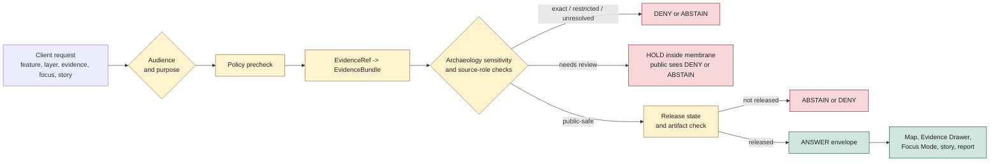

<!-- [KFM_META_BLOCK_V2]
doc_id: kfm://doc/architecture/governed-api/archaeology
title: Archaeology Governed API Boundary
type: standard
version: v0.1.0
status: draft
owners:
  - <api-surface-steward>
  - <archaeology-domain-steward>
  - <cultural-review-liaison>
  - <rights-holder-representative>
  - <sensitivity-reviewer>
  - <policy-steward>
  - <evidence-steward>
  - <release-steward>
  - <docs-steward>
created: NEEDS VERIFICATION - scaffold existed before 2026-06-29 expansion
updated: 2026-06-29
policy_label: public
truth_posture: cite-or-abstain
responsibility_root: docs/
architecture_lane: governed-api
domain: archaeology
path_posture: existing-proposed-scaffold-replaced; governed-api-folder-placement-remains-proposed-by-governed-api-readme-open-dr-12; target-path-confirmed-by-existing-file; route-shapes-and-runtime-implementation-need-verification
sensitivity_posture: T4-default; exact-location-deny; no-public-raw-work-quarantine-or-processed-path; cultural-review-required; sovereignty-review-required; rights-holder-review-required; no-life-safety-or-looting-risk-exposure; evidence-required; policy-aware; release-gated; correction-and-rollback-aware
related:
  - README.md
  - ../governed-api.md
  - ../README.md
  - ../../doctrine/directory-rules.md
  - ../../doctrine/lifecycle-law.md
  - ../../doctrine/trust-membrane.md
  - ../../domains/archaeology/README.md
  - ../../domains/archaeology/CONTINUITY_INVENTORY.md
  - ../../../data/README.md
  - ../../../data/raw/archaeology/README.md
  - ../../../data/work/archaeology/README.md
  - ../../../data/quarantine/archaeology/README.md
  - ../../../data/quarantine/archaeology/exact_geometry/README.md
  - ../../../data/processed/archaeology/README.md
  - ../../../release/README.md
tags:
  - kfm
  - architecture
  - governed-api
  - archaeology
  - cultural-heritage
  - trust-membrane
  - finite-outcomes
  - exact-location-deny
  - cultural-review
  - sovereignty
  - evidence-bundle
  - policy-decision
  - release-gated
  - cite-or-abstain
notes:
  - "This file replaces a PROPOSED scaffold at `docs/architecture/governed-api/archaeology.md`."
  - "The governed-api folder README records a folder-vs-flat-file placement issue against Directory Rules; this file keeps that uncertainty visible."
  - "This document defines the governed API boundary for Archaeology responses; it does not define executable routes, schemas, policy bundles, fixtures, validators, data payloads, or release decisions."
  - "README/path evidence does not prove route implementation, schemas, validators, policy automation, CI checks, public hosting, review completion, or release readiness."
[/KFM_META_BLOCK_V2] -->

# Archaeology Governed API Boundary

Architecture guidance for serving Archaeology and cultural-heritage material through the governed API without exposing exact locations, culturally sensitive records, unresolved rights, unreleased claims, or internal lifecycle stores.

  
  
  
  
  

**Status:** draft / architecture guidance  
**Owners:** `<api-surface-steward>`, `<archaeology-domain-steward>`, `<cultural-review-liaison>`, `<policy-steward>`, `<release-steward>`  
**Path:** `docs/architecture/governed-api/archaeology.md`  
**Quick links:** [Scope](#scope) · [Path posture](#path-posture) · [API contract](#api-contract) · [Audience classes](#audience-classes) · [Request flow](#request-flow) · [Outcome rules](#outcome-rules) · [Denied content](#denied-content) · [Placement rules](#placement-rules) · [Validation gates](#validation-gates) · [Rollback](#rollback) · [Evidence ledger](#evidence-ledger)

> [!CAUTION]
> Archaeology is a fail-closed governed API domain. Exact site geometry, burials, human remains, sacred sites, unresolved cultural sensitivity, sovereignty-restricted material, collection-security detail, private landowner detail, looting-risk exposure, and consent-bound material must not cross the public membrane unless a recorded, reviewed, redacted/generalized, evidence-backed, release-approved representation exists.

---

## Scope

This page defines how the governed API should serve Archaeology-domain material. It applies to map clicks, Evidence Drawer payloads, Focus Mode responses, story/report references, layer manifests, feature resolution, and review-console views when those surfaces touch Archaeology or cultural-heritage claims.

The page is intentionally architectural. It does not create route files, route names, DTOs, schemas, policy bundles, fixtures, validators, data payloads, release manifests, or public hosting configuration. Those live under their canonical responsibility roots.

---

## Path posture

The target file existed as a PROPOSED scaffold sourced from `docs/domains/archaeology/CONTINUITY_INVENTORY.md`. This revision keeps that lineage and replaces the scaffold with domain-specific governed API guidance.

There is one placement caveat: `docs/architecture/governed-api/README.md` records the `governed-api/` folder pattern as PROPOSED under OPEN-DR-12 because Directory Rules also show a flat `docs/architecture/<topic>.md` pattern. Until resolved, treat this file as **CONFIRMED file presence / DRAFT architecture content / PROPOSED folder placement posture**.

---

## API contract

The Archaeology governed API boundary has one job: return finite, evidence-aware, policy-aware, release-aware responses without leaking internal or sensitive material.

| API responsibility | Archaeology-specific rule |
|---|---|
| Evidence resolution | Consequential Archaeology claims must resolve to EvidenceBundle/proof support or return `ABSTAIN`. |
| Policy check | Exact-location, cultural, sovereignty, rights, consent, private-landowner, looting-risk, and collection-security controls are checked before payload emission. |
| Release check | Public responses require release state and public-safe published artifacts. Internal lifecycle paths cannot be used as normal public backing stores. |
| Geometry handling | Exact geometry is denied by default; public payloads must use approved generalization, redaction, aggregation, or omission. |
| Source role | Candidate, observed, administrative, oral-history, steward-reviewed, generated, remote-sensing, LiDAR, and 3D documentation roles stay distinct. |
| Auditability | API responses should reference policy decision, evidence/proof, release, review, correction, and rollback support where material. |
| AI boundary | AI may summarize only released/evidence-resolved Archaeology context and must not infer or reveal exact locations. |

---

## Audience classes

The governed API may need different behavior by audience, but audience class never overrides policy or release state.

| Audience | Default Archaeology access | Notes |
|---|---|---|
| Public | Generalized, released, public-safe summaries only. | No exact geometry, no sensitive joins, no unreleased candidates. |
| Partner / named agreement | Restricted views only if policy, rights, consent, review, and release/access records allow. | Must remain auditable and revocable. |
| Steward / cultural reviewer | Review-oriented access to restricted material only through authenticated, logged, least-privilege surfaces. | Still not a public path; review does not equal release. |
| Internal pipeline/runtime | May evaluate candidates and held material inside the membrane. | Must not leak to public API, map, story, report, graph, search, vector index, or AI answer. |
| Denied / unauthenticated | `DENY` or `ERROR` depending on request validity. | No existence leakage beyond policy-approved reason language. |

---

## Request flow

> [!NOTE]
> This flow is a responsibility map. It does not prove route implementation, schema wiring, policy automation, access-control middleware, or CI coverage.

---

## Outcome rules

Every public-facing Archaeology response should collapse to a finite governed outcome.

| Outcome | Archaeology use | Required posture |
|---|---|---|
| `ANSWER` | Public-safe generalized claim, released layer metadata, or evidence drawer payload. | Evidence resolved, policy allows, sensitivity transform complete, review complete where needed, release state valid. |
| `ABSTAIN` | Evidence cannot support the claim, source role is unresolved, citation cannot resolve, or the safe public scope is too weak. | No invented explanation; may offer a safer narrowed scope. |
| `DENY` | Exact location, sacred/burial/human-remains detail, looting-risk exposure, sovereignty/consent restriction, rights block, or unreleased sensitive material. | Return reason code appropriate to public disclosure rules without leaking restricted facts. |
| `ERROR` | Malformed request, schema/contract failure, unavailable policy/evidence/release dependency, or runtime failure. | No claim leakage; diagnostic stays bounded. |
| `NARROWED` / `BOUNDED` | Safer generalized region, time window, or summary is available. | Treat as a scoped `ANSWER` only when release and evidence support the narrower payload. |
| `SOURCE_STALE` | Source or release context is stale for the requested assertion. | Do not answer as current; route to correction, withdrawal, or stale-state handling. |

---

## Denied content

The API must not disclose or imply the following through payloads, error text, vector indexes, graph links, generated summaries, map highlights, story nodes, or existence probes:

- exact site coordinates or reconstructable geometry;
- sacred sites, burial sites, human-remains context, culturally restricted knowledge, or sovereignty-restricted records;
- private landowner, access, custody, repository-security, or looting-risk details;
- candidate features presented as confirmed sites;
- LiDAR, remote-sensing, 3D, or geophysics candidates presented as observed site truth;
- unreleased work, quarantine, processed, catalog, proof, receipt, source-registry, or internal review material;
- cultural/steward review notes beyond the released public-safe summary;
- hidden facts through denial phrasing, count leakage, small-area aggregation, search autocomplete, graph neighborhoods, or AI synthesis.

---

## Placement rules

This architecture doc explains behavior. It does not create implementation homes.

| Artifact | Correct home |
|---|---|
| Governed API prose architecture | `docs/architecture/governed-api/archaeology.md` while this folder pattern remains accepted or transitional. |
| Executable API code | `apps/governed-api/` if confirmed by repo/ADR. |
| Archaeology domain documentation | `docs/domains/archaeology/`. |
| Object meaning | `contracts/domains/archaeology/` when verified. |
| Machine-checkable envelopes and DTOs | `schemas/contracts/v1/...` when verified. |
| Policy rules | `policy/domains/archaeology/` or accepted sensitivity-policy roots. |
| Validators and tests | `tools/validators/`, `tests/`, and fixtures roots when verified. |
| Source captures | `data/raw/archaeology/`. |
| Working candidates | `data/work/archaeology/`. |
| Held exact geometry and sensitive material | `data/quarantine/archaeology/` and `data/quarantine/archaeology/exact_geometry/`. |
| Processed normalized artifacts | `data/processed/archaeology/`. |
| Catalog/triplet projections | `data/catalog/` and `data/triplets/`. |
| Proofs and receipts | `data/proofs/` and `data/receipts/`. |
| Released public-safe artifacts | `data/published/` after release gates. |
| Release decisions | `release/`. |

---

## Validation gates

Before any Archaeology API response can be treated as public-safe, verify:

- [ ] The request audience and purpose are authorized.
- [ ] The response does not read directly from RAW, WORK, QUARANTINE, PROCESSED, internal catalog, proof, receipt, registry, or review stores as the public path.
- [ ] EvidenceRef resolves to EvidenceBundle for consequential claims.
- [ ] Candidate-vs-confirmed status is preserved.
- [ ] Exact geometry, reconstructable geometry, and sensitive joins are denied, generalized, redacted, or omitted.
- [ ] Cultural review, sovereignty review, rights-holder review, and sensitivity review are complete where required.
- [ ] Redaction/generalization transform, policy decision, release state, correction path, and rollback target are inspectable where material.
- [ ] Public response text does not leak restricted existence, counts, geometry, review notes, or source packets.
- [ ] AI/Focus Mode responses cite released evidence or return `ABSTAIN`/`DENY`.
- [ ] Downstream map, story, report, graph, search, vector index, cache, and screenshot surfaces inherit the same denial/generalization posture.

---

## Rollback

Rollback is required when an Archaeology API response or route behavior:

- exposes exact or reconstructable sensitive geometry;
- leaks sacred, burial, human-remains, sovereignty, consent, private-landowner, collection-security, or looting-risk detail;
- presents a candidate, generated feature, LiDAR anomaly, remote-sensing anomaly, or geophysics observation as confirmed site truth;
- bypasses policy, evidence, review, release, correction, or rollback checks;
- allows public clients, map layers, stories, reports, graph/vector indexes, search, caches, screenshots, or AI answers to consume internal lifecycle stores directly;
- weakens finite-outcome behavior by returning partial truth, untyped nulls, or unbounded model output.

Rollback target: restore the last release-approved public-safe response behavior, invalidate downstream derivatives, preserve correction/withdrawal records, and keep restricted material in quarantine or controlled review lanes.

---

## Status notes

| Item | Status | Notes |
|---|---:|---|
| Target path presence | CONFIRMED | The file existed as a PROPOSED scaffold before this update. |
| Governed API folder posture | PROPOSED / NEEDS VERIFICATION | `docs/architecture/governed-api/README.md` records OPEN-DR-12 for folder-vs-flat pattern. |
| Governed API doctrine | CONFIRMED README | `docs/architecture/governed-api.md` defines finite outcomes and trust membrane responsibilities. |
| Archaeology domain sensitivity | CONFIRMED README | Archaeology docs and data lanes confirm exact-location deny, T4/default fail-closed, cultural/steward review, and no-public-path posture. |
| Exact-geometry quarantine | CONFIRMED README | `data/quarantine/archaeology/exact_geometry/README.md` confirms exact geometry is held and not public. |
| Executable route implementation, schemas, validators, policy bundles, CI, access control, release manifests, public routes | NEEDS VERIFICATION | No runtime enforcement was proven by this edit. |
| Public release readiness | DENY by default | This architecture doc cannot publish or expose Archaeology claims. |

---

## Evidence ledger

| Source | Status | Supports | Limits |
|---|---|---|---|
| Previous target file | CONFIRMED scaffold | Existing path and Continuity Inventory lineage. | Did not define governed API behavior. |
| [`README.md`](README.md) | CONFIRMED README | Governed API lane purpose, trust membrane, folder-placement caveat, audience/API-family framing. | It labels folder placement as PROPOSED/OPEN-DR-12. |
| [`../governed-api.md`](../governed-api.md) | CONFIRMED architecture doc | Trust membrane, finite outcomes, no direct internal-store public access, envelope posture. | Endpoint catalogue is PROPOSED. |
| [`../README.md`](../README.md) | CONFIRMED README | Architecture folder is explanatory and not enforcement/decision authority. | Some status language remains older and implementation-bounded. |
| [`../../doctrine/directory-rules.md`](../../doctrine/directory-rules.md) | CONFIRMED doctrine | Responsibility roots, connector non-publisher posture, data lifecycle, public-path boundaries. | Does not prove route implementation. |
| [`../../domains/archaeology/README.md`](../../domains/archaeology/README.md) | CONFIRMED domain README | Archaeology domain scope, exact-location denial, cultural/steward review, owned object families, public-safe posture. | Many implementation paths remain PROPOSED. |
| [`../../domains/archaeology/CONTINUITY_INVENTORY.md`](../../domains/archaeology/CONTINUITY_INVENTORY.md) | CONFIRMED continuity doc | Original scaffold lineage, exact-location denial, continuity of RedactionReceipt/MapReleaseManifest/finite outcomes. | Some matrix/enforcement items are PROPOSED/NEEDS VERIFICATION. |
| [`../../../data/raw/archaeology/README.md`](../../../data/raw/archaeology/README.md) | CONFIRMED README | RAW no-public-path, T4/default fail-closed, exact-location/cultural/sovereignty controls. | Does not prove source payloads or connector activation. |
| [`../../../data/work/archaeology/README.md`](../../../data/work/archaeology/README.md) | CONFIRMED README | WORK no-public-path, candidate/intermediate posture, cultural/sensitivity controls. | Does not prove work payloads or validators. |
| [`../../../data/quarantine/archaeology/README.md`](../../../data/quarantine/archaeology/README.md) | CONFIRMED README | Quarantine no-public-path hold posture and cultural/sovereignty review requirements. | Does not prove held payloads or policy automation. |
| [`../../../data/quarantine/archaeology/exact_geometry/README.md`](../../../data/quarantine/archaeology/exact_geometry/README.md) | CONFIRMED README | Exact-geometry hold lane and no map/report/story/graph/search/vector/AI use. | Does not prove held payloads or release transitions. |
| [`../../../data/processed/archaeology/README.md`](../../../data/processed/archaeology/README.md) | CONFIRMED README | Processed Archaeology is not public by placement and remains release-gated. | Does not prove processed inventory or release linkage. |

[Back to top](#top)
