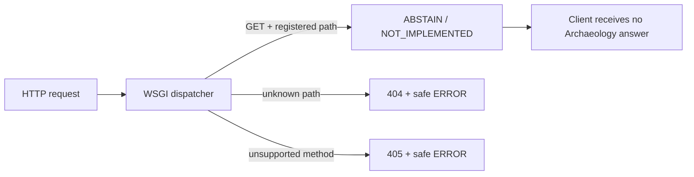
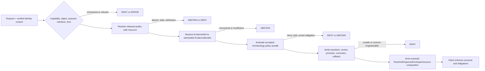

<!-- [KFM_META_BLOCK_V2]
doc_id: kfm://doc/architecture/governed-api/archaeology
title: Archaeology Governed API Boundary
type: architecture-standard
version: v0.2
status: draft; repository-grounded; architecture-only; no-archaeology-route; policy-unbound; no-release; non-publication
maturity: current-state reconciliation with dependency-ordered graduation model
owners:
  - "@bartytime4life — verified CODEOWNERS review route; archaeology, cultural-sovereignty, rights-holder, sensitivity, policy, evidence, API, security, release, correction, and independent-review assignments NEEDS VERIFICATION"
created: NEEDS VERIFICATION — scaffold existed before the 2026-06-29 expansion
updated: 2026-08-19
policy_label: public
truth_posture: cite-or-abstain
responsibility_root: docs/
owning_root: docs/
current_path: docs/architecture/governed-api/archaeology.md
responsibility: "Explain the current and intended Archaeology-facing Governed API boundary, finite outcomes, sensitive-information constraints, authority split, verified implementation limits, and graduation evidence without defining routes, object meaning, machine shape, policy, review, release, deployment, or publication."
authority_class: explanatory architecture guidance
authority_limit: "This document does not authenticate or authorize a caller, confirm an archaeological site, resolve cultural or sovereignty authority, define a policy decision, approve a transform, release an artifact, deploy a route, or publish a KFM claim."
canonical_relationship: "CONFIRMED existing same-path companion under docs/architecture/governed-api/; accepted ADR-0029 resolves placement as a docs/ architecture lane, while the broader folder-versus-flat governed-api prose overlap remains unresolved."
evidence_snapshot:
  repository: bartytime4life/Kansas-Frontier-Matrix
  base_ref: main
  base_commit: d2214bd46e78d3758b2a084a62b60eacaa98e170
  target_prior_blob: 23f05a440abc349559b3059d303d33bcd4e7f14b
  parent_readme_blob: 09f9f95ce7400055b8018f9f159796ac35959fbb
  audience_classes_blob: 28662c84c0c06d513e9e686a4bc14f031d2be024
  directory_rules_blob: fd49a0b83e55cef52c1124281f093e263526898d
  adr_0029_blob: a4de0d7a96b78da59cfc499d1025e1508afd8dd9
  adr_0004_blob: f2737900569447e8e20c8ce12b275167724b0cc5
  adr_0010_blob: 41e50801d2a7d55091319141855e1c597b3a45d5
  codeowners_blob: dd2a84aa514d8ecd9208bc347f90f9a2ed37dd61
  governed_api_main_blob: 4eb335c7c0b27f62c7419c478542e8fe40e1ff38
  governed_api_route_registry_blob: 3418168d0b267160d6ad6dd87f289e880ef4a024
  governed_api_stub_blob: 371e60d9f96c78e31c8a1e6109d19dee5da4213b
  governed_api_route_test_blob: 2be20f5d93c03da7677c34b11a31875a00b2ed28
  governed_api_boundary_test_blob: 4035e537e6c52194928df5ab8ceb41a35f5f30ca
  runtime_response_contract_blob: 5060aaaa30fea37b6eeea6e1428b9effa6a163bd
  runtime_response_schema_blob: 8b86e7db8b18b65a56a4e639dfc54e1b2db93155
  archaeology_lineage_contract_blob: 89c8e1c3cccd532370aec13ad5b3472646fc5b38
  archaeology_lineage_schema_blob: 69c13caae6111cf7860ee4a35b7a8df642808cd8
  archaeology_policy_readme_blob: d857c0eba2f97c3cab28c5dd76721b7b79942fb1
  exact_coordinate_policy_stub_blob: 39b7a18fab7e78679b2d271a7e091c4c8d5213d9
  sovereignty_policy_stub_blob: afb90fe0d1b368765a4fff5f15bd94ff64a16185
  access_policy_readme_blob: e03ffbc8fe329c2d8feddedee62a2149d25f195b
  archaeology_tests_readme_blob: 9a950b2bad9aca21402f7582e54179897041f23a
  archaeology_release_candidate_readme_blob: bc5edc7a44ea77a6b8ed25b95569646d8df72754
  archaeology_published_layers_readme_blob: 884baa8b1c12afb037cd46bed7887327c5921c26
  archaeology_workflow_blob: d51ba3b1244844a83d857a34305e1a167e20dadb
related:
  - README.md
  - AUDIENCE_CLASSES.md
  - ENVELOPES.md
  - ERROR_CODES.md
  - LIFECYCLE_GATES.md
  - THREAT_MODEL.md
  - README.md
  - ../README.md
  - ../../adr/ADR-0004-apps-governed-api-is-the-trust-membrane.md
  - ../../adr/ADR-0010-deny-by-default-for-dna-rare-species-archaeology-infrastructure.md
  - ../../adr/ADR-0029-adopt-directory-governance-standard-v2.md
  - ../../adr/ADR-archaeology-exact-location-policy.md
  - ../../doctrine/directory-rules.md
  - ../../doctrine/trust-membrane.md
  - ../../domains/archaeology/README.md
  - ../../../apps/governed-api/README.md
  - ../../../apps/governed-api/src/governed_api/main.py
  - ../../../apps/governed-api/src/governed_api/routes/registry.py
  - ../../../apps/governed-api/src/governed_api/stub.py
  - ../../../apps/governed-api/tests/test_abstain_routes.py
  - ../../../apps/governed-api/tests/test_boundary_guards.py
  - ../../../contracts/runtime/runtime_response_envelope.md
  - ../../../schemas/contracts/v1/runtime/runtime_response_envelope.schema.json
  - ../../../contracts/domains/archaeology/archaeology_decision_envelope.md
  - ../../../schemas/contracts/v1/domains/archaeology/archaeology_decision_envelope.schema.json
  - ../../../policy/access/README.md
  - ../../../policy/domains/archaeology/README.md
  - ../../../policy/sensitivity/archaeology_precise_coords_redaction.rego
  - ../../../policy/sensitivity/archaeology/sovereignty_chip_required.rego
  - ../../../tests/domains/archaeology/README.md
  - ../../../release/candidates/archaeology/README.md
  - ../../../data/published/layers/archaeology/README.md
  - ../../../.github/workflows/domain-archaeology.yml
tags: [kfm, architecture, governed-api, archaeology, cultural-heritage, sensitive-location, trust-membrane, finite-outcomes, evidence, policy, release, correction, rollback, repository-grounded]
notes:
  - "v0.2 replaces the June 2026 proposal-era account with current repository evidence and accepted Directory Rules v2 placement authority."
  - "No `/archaeology` route or archaeology payload projection is registered; the current app exposes only `/bootstrap`, `/layers`, and `/evidence`, all as schema-backed `ABSTAIN / NOT_IMPLEMENTED` stubs."
  - "The historical public/partner/steward/internal/denied audience table is not retained as current authority; the companion audience document records that vocabulary as conflicted lineage and treats `DENY` as an outcome, not an audience."
  - "`NARROWED`, `BOUNDED`, and `SOURCE_STALE` are not RuntimeResponseEnvelope outcomes. Narrowing is an answer-scope qualifier; stale source state belongs in freshness/reason/correction handling."
  - "Archaeology exact-coordinate and sovereignty Rego files remain proposed, unbound scaffolds. Documentation-level fail-closed intent must not be represented as active runtime enforcement."
  - "This update changes documentation and its generated authoring receipt only; it creates no route, contract, schema, policy, fixture, validator, test, workflow, data object, release, deployment, or publication effect."
[/KFM_META_BLOCK_V2] -->

<a id="top"></a>

# Archaeology Governed API Boundary

> **One-line purpose.** Reconcile the Archaeology-facing Governed API boundary with current repository evidence: preserve fail-closed protection for sensitive cultural-heritage information, state exactly what the current three-route scaffold does, and define the evidence required before any archaeology response can graduate beyond `ABSTAIN`.

[](#scope)
[](#current-executable-surface)
[](#current-executable-surface)
[](#current-executable-surface)
[](#archaeology-authority-and-maturity-crosswalk)
[](#lifecycle-and-public-client-boundary)
[](#scope)

> [!IMPORTANT]
> **The current executable API has no Archaeology route or Archaeology payload.** Repository code registers exactly `/bootstrap`, `/layers`, and `/evidence`. Each registered route returns a schema-backed `ABSTAIN / NOT_IMPLEMENTED` envelope; unknown paths return safe `ERROR` with `404`, and unsupported methods on registered paths return safe `ERROR` with `405`. That is useful fail-closed scaffolding, not an Archaeology API, evidence resolver, policy evaluator, released-data service, or public trust proof.

> [!CAUTION]
> **Fail-closed Archaeology intent is not current enforcement.** The exact-coordinate Rego file is an explicit proposed stub with `default deny := false` and no active deny rule. The sovereignty-chip file is an unbound proposed scaffold with `default allow := false`. The broader domain-policy lane has no accepted bundle, evaluator, decision emitter, obligation handlers, or production consumer. Protected material therefore must remain outside public and ordinary repository paths rather than relying on these files to make it safe.

> [!WARNING]
> **Do not infer a safe audience from a label.** No accepted audience enum, authentication provider, capability grant, route metadata profile, authorization middleware, revocation service, or rate-limit binding was verified. `DENY` is a finite outcome, not an audience class. Exact or reverse-engineerable protected information must not become available merely because a caller is described as a partner, steward, reviewer, operator, or internal user.

**Quick navigation:** [Scope](#scope) · [Path posture](#path-posture) · [Evidence](#evidence-boundary) · [Current API](#current-executable-surface) · [Maturity](#archaeology-authority-and-maturity-crosswalk) · [API contract](#api-contract) · [Audience](#audience-classes) · [Request flow](#request-flow) · [Outcomes](#outcome-rules) · [Denied content](#denied-content) · [Lifecycle](#lifecycle-and-public-client-boundary) · [Placement](#placement-rules) · [Validation](#validation-gates) · [Graduation](#graduation-sequence) · [ADRs](#adr-triggers-and-open-verification) · [Rollback](#rollback) · [Status](#status-notes) · [Evidence ledger](#evidence-ledger) · [Change ledger](#change-and-no-loss-ledger)

---

<a id="scope"></a>

## 1. Scope, authority, and non-effects

This page explains how Archaeology and cultural-heritage material may eventually cross the dynamic Governed API boundary. It applies to any future feature lookup, map selection, Evidence Drawer resolution, Focus Mode response, story/report reference, search result, export, graph projection, or review projection that carries or implies an Archaeology claim.

The page owns explanatory architecture only. It does **not**:

- confirm an archaeological site, feature, chronology, affiliation, ownership, or cultural meaning;
- appoint a cultural, sovereignty, rights-holder, policy, evidence, security, or release authority;
- define object meaning, JSON shape, policy logic, reason-code registry, route, DTO, payload, or credential;
- admit a source, resolve an `EvidenceRef`, approve generalization, create a review record, or bind a release;
- make a public URL, map layer, search result, generated summary, fixture, workflow, pull request, or merge safe or published; or
- authorize access to RAW, WORK, QUARANTINE, PROCESSED, internal catalog, proof, receipt, review, registry, model-runtime, or release-internal stores.

### 1.1 Current safe determination

| Claim | Status | Evidence-bounded conclusion |
|---|---|---|
| Target path and owning root | **CONFIRMED** | This is an existing human architecture companion under `docs/architecture/governed-api/`. |
| Placement authority | **CONFIRMED / accepted** | ADR-0029 adopts Directory Rules v2; the stale OPEN-DR-12 placement hold no longer applies to this same-path update. |
| Archaeology route | **CONFIRMED absent from the inspected registry** | The exact current route manifest contains only `/bootstrap`, `/layers`, and `/evidence`. |
| Archaeology response payload | **NOT ESTABLISHED** | The current runtime schema has no substantive `payload`, `release_ref`, `policy_decision`, or review field, and the legacy Archaeology envelope schema is permissive scaffolding. |
| Archaeology authorization and policy enforcement | **NOT ESTABLISHED** | Access policy is documentation-only; Archaeology Rego is scaffolded and no accepted evaluator or consumer binding was verified. |
| Archaeology release | **NONE ESTABLISHED** | The release-candidate lane reports no child dossier, approved manifest, promotion decision, or published release. |
| Public operation | **UNKNOWN** | No ingress, identity provider, deployment, runtime log, audit sink, cache behavior, or observed public request evidence is used here. |
| Publication effect of this document | **None** | Architecture prose cannot release or publish. |

[Back to top](#top)

---

<a id="path-posture"></a>

## 2. Path posture and Directory Rules basis

Accepted ADR-0029 makes Directory Rules v2 the placement authority. Under that adopted split:

- `docs/architecture/` owns human system-structure explanation;
- `apps/` owns deployable applications;
- `contracts/` owns semantic meaning;
- `schemas/` owns machine-checkable shape;
- `policy/` owns admissibility rules and obligations;
- `fixtures/`, `tools/validators/`, and `tests/` own reusable examples and enforceability proof;
- `release/` owns candidate, decision, correction, withdrawal, and rollback state; and
- `data/published/` owns released public-safe carriers, not canonical truth or release authority.

This is a same-path edit to an existing architecture document, so the placement outcome is `PLACE`. It creates no root, route, policy lane, schema home, data lane, release family, or parallel authority.

Merged [PR #3150](https://github.com/bartytime4life/Kansas-Frontier-Matrix/pull/3150) retired the former flat Governed API entrypoint. [`README.md`](README.md) is the active architecture landing page; this archaeology page preserves scope-specific lineage without creating competing authority.

[Back to top](#top)

---

<a id="evidence-boundary"></a>

## 3. Evidence boundary

Repository-current statements below are pinned to `main@d2214bd46e78d3758b2a084a62b60eacaa98e170`. They establish tracked bytes and bounded deterministic behavior, not production operation.

### 3.1 Truth labels and operational terms

| Term | Meaning in this document |
|---|---|
| `CONFIRMED` | Verified from the pinned repository bytes, an accepted decision, or a named generated artifact. |
| `PROPOSED` | Architecture, route, profile, transform, policy, or implementation not accepted and verified as current behavior. |
| `UNKNOWN` | Evidence is insufficient for a stronger statement. |
| `NEEDS VERIFICATION` | A concrete repository, review, run, or operational check remains. |
| `CONFLICTED` | Current sources claim incompatible shape, authority, vocabulary, or behavior. |
| `HOLD` | Do not graduate or expose the affected capability until the named dependency closes. |

`ANSWER`, `ABSTAIN`, `DENY`, and `ERROR` are runtime outcomes. They are not authoring truth labels, audience classes, lifecycle stages, review states, or release decisions.

### 3.2 Current versus target posture

| Concern | Current repository evidence | Graduation target |
|---|---|---|
| Dynamic API | Three global GET stubs | Reviewed route/resource contract and bounded implementation |
| Archaeology route | None registered | No route name is proposed here; route admission requires reviewed contract and compatibility analysis |
| Response shape | Closed RuntimeResponseEnvelope schema; no substantive payload field | Accepted response/resource composition that preserves finite outcomes and evidence-supported precision |
| Archaeology domain envelope | Draft-lineage contract plus empty permissive schema | Reconciled successor or explicit retirement; no parallel runtime/decision authority |
| Authentication and access | No active provider, grants, middleware, or route metadata | Verified identity context plus capability-, object-, purpose-, interface-, and time-bound authorization |
| Archaeology policy | Mixed proposed scaffolds; evaluator unbound | Accepted input profile, bundle, evaluator, normalized decisions, enforced obligations, native negative tests |
| Evidence | No Archaeology route resolver proved | Governed `EvidenceRef -> EvidenceBundle` resolution or `ABSTAIN` |
| Sensitive transforms | Documentation intent; no accepted profile or enforcement | Reviewed public-safe transform with receipt, reverse-inference tests, expiry, correction, and rollback |
| Release | No child candidate dossier or published release established | Reviewed candidate, proof, policy/review closure, manifest, correction path, rollback target |
| Client delivery | No live Archaeology API integration proved | Clients consume only permitted envelope/resource projections and released public-safe carriers |

[Back to top](#top)

---

<a id="current-executable-surface"></a>

## 4. Current executable surface

The current WSGI application is intentionally small:

```text
GET /bootstrap  -> 200 + ABSTAIN / NOT_IMPLEMENTED
GET /layers     -> 200 + ABSTAIN / NOT_IMPLEMENTED
GET /evidence   -> 200 + ABSTAIN / NOT_IMPLEMENTED
unknown path    -> 404 + safe ERROR / SAFE_RUNTIME_ERROR
non-GET method  -> 405 + safe ERROR / SAFE_RUNTIME_ERROR
```

The app-local tests verify that every registered route returns exactly the required RuntimeResponseEnvelope fields, validates against the current schema subset, carries no decision object or precision disclosure, and uses no hard-coded internal lifecycle-store path literals. Separate guards reject direct MapLibre, Cesium, and Ollama imports in the API source and pin the three-route manifest.

### 4.1 What this proves

- a deterministic fail-closed route registry exists;
- the three current route responses conform to the required top-level runtime schema shape;
- unsupported paths and methods return bounded errors; and
- selected renderer/model/import and internal-path boundaries are checked.

### 4.2 What this does not prove

- authentication, authorization, rate limiting, purpose binding, audit persistence, or revocation;
- evidence resolution, policy evaluation, cultural or sovereignty review, rights clearance, transform execution, release binding, or correction propagation;
- an Archaeology object, route, payload, `ANSWER`, client transport, deployed service, or public operation; or
- complete information-flow security, timing resistance, cache safety, log safety, or reverse-inference prevention.

The only architecture-compatible current behavior for an Archaeology request is therefore a safe negative result. A client must not synthesize an Archaeology answer from the existence of `/layers`, `/evidence`, domain schemas, published-lane directories, or documentation.

[Back to top](#top)

---

<a id="archaeology-authority-and-maturity-crosswalk"></a>

## 5. Archaeology authority and maturity crosswalk

| Surface | Current state | Safe use | Must not be claimed |
|---|---|---|---|
| [`contracts/domains/archaeology/archaeology_decision_envelope.md`](../../../contracts/domains/archaeology/archaeology_decision_envelope.md) | `draft-lineage` compatibility contract | Preserve old-name lineage and migration questions | Preferred runtime response or policy decision authority |
| Paired legacy schema | `PROPOSED`; empty `properties`; `additionalProperties: true` | Detect the unresolved scaffold | Archaeology response validation or field-level protection |
| Current RuntimeResponseEnvelope contract/schema | `PROPOSED`; closed schema; four finite outcomes; answer-only precision | Current client-envelope shape and deterministic scaffold validation | Evidence closure, policy correctness, release approval, or payload semantics |
| Exact-coordinate Rego | Proposed stub; `default deny := false`; no active deny rule | Evidence that a policy placeholder exists | Exact-coordinate denial enforcement |
| Sovereignty-chip Rego | Proposed stub; `default allow := false`; no consumer binding | Evidence of fail-closed-shaped intent | Cultural/sovereignty authority or runtime enforcement |
| Archaeology policy README and direct rules | Repository-grounded mixed scaffold; evaluator unbound | Maturity inventory and implementation requirements | Accepted bundle, production decision, or public safety |
| Archaeology tests | Thirteen named direct modules; sampled modules placeholder-only | Intended coverage map | Broad executable enforcement or passing suite |
| Archaeology workflow | One substantive synthetic ThreeDDocumentation paradata slice | Fixture-profile conformance only | Site truth, evidence closure, policy, release, or public use |
| Proof workflow job | Explicit readiness hold | Detect premature proof producer/artifact appearance | ProofPack or EvidenceBundle production |
| Release dry-run job | Explicit readiness hold | Detect premature candidate/release surface appearance | Release approval or publication readiness |
| Release candidate lane | Parent README; no child dossier established | Record absence and required review packet | Active candidate, manifest, promotion decision, or release |
| Published layer lane | Documentation and child directory contracts | Future carrier organization | Emitted layer bytes, release state, or public safety |

### 5.1 Decision status matters

- ADR-0029 is accepted and controls placement.
- ADR-0004 remains effectively proposed; the configured app is not yet an accepted complete trust membrane.
- ADR-0010 remains proposed; its deny-by-default design is not an accepted and enforced cross-domain policy.
- `ADR-archaeology-exact-location-policy.md` is a proposed scaffold, not a reviewed exact-location decision.

KFM's governing safety posture still requires uncertainty and harmful precision to fail closed. The correct current implementation response is quarantine, omission, `ABSTAIN`, `DENY`, or `ERROR`—not a claim that unfinished policy code already protects the public path.

[Back to top](#top)

---

<a id="api-contract"></a>

## 6. API contract boundary

The Archaeology-facing boundary should eventually answer one narrow question:

> May this caller receive this exact released public-safe representation, for this purpose and interface, with these evidence, policy, precision, freshness, correction, and release constraints?

It must not answer broader questions such as whether a candidate is a confirmed site, who holds cultural authority, whether rights are cleared, or whether an unreleased internal record should be exposed.

### 6.1 Current RuntimeResponseEnvelope facts

The current machine schema requires these top-level fields:

| Field | Current machine rule | Archaeology implication |
|---|---|---|
| `id` | Stable bounded identifier | Must not encode protected coordinates, names, or review substance |
| `spec_hash` | SHA-256-form lineage token | Integrity hook only; not evidence or release proof |
| `version` | Required string | Must participate in compatibility review |
| `issued_at` | Required date-time | Must not be rewritten to hide stale state |
| `outcome` | `ANSWER`, `ABSTAIN`, `DENY`, or `ERROR` | No extra domain-specific runtime outcomes |
| `reason_code` | Required string | Must be public-safe and non-leaking |
| `evidence_refs` | Required array; nonempty for `ANSWER` | Refs must resolve through governed evidence interfaces before a consequential answer |
| `policy_state` | Required string | Current controlled vocabulary remains unresolved |
| `freshness` | Required string | Staleness must not become current truth |
| `correction_state` | Required string | Withdrawal, correction, or rollback posture must remain visible |
| `precision_actually_used` | Required only for `ANSWER`; forbidden otherwise | Must report only evidence-supported, policy-safe precision and transform receipts |

The schema has `additionalProperties: false`. It currently defines no substantive `payload`, `release_ref`, `policy_decision`, `review_ref`, or archaeology-specific object field. The companion [`ENVELOPES.md`](ENVELOPES.md) describes a richer proposal-era composition, but the current contract and schema are the stronger evidence for machine shape.

### 6.2 Payload and resource HOLD

Before any Archaeology `ANSWER` route exists, KFM must choose and review one coherent composition:

1. evolve RuntimeResponseEnvelope to carry or reference a released resource; or
2. keep the envelope as a decision/status object and define a separately governed released-resource response.

Either choice requires semantic contract, schema, fixtures, validators, tests, compatibility analysis, policy binding, evidence resolution, release linkage, and client behavior. The permissive legacy `ArchaeologyDecisionEnvelope` scaffold must not be used as a shortcut.

### 6.3 Minimum target invariants

A future Archaeology response must preserve all of the following:

- **candidate is not site:** anomaly, LiDAR, geophysics, remote-sensing, model, and 3D interpretation states stay explicit;
- **source role is not authority:** observation, interpretation, administrative record, oral history, synthetic reconstruction, and steward assertion are not interchangeable;
- **review is not release:** cultural, sovereignty, rights-holder, evidence, policy, and release decisions remain separate records;
- **transform is not truth:** redaction, generalization, aggregation, omission, and delayed release are auditable derivatives;
- **precision cannot be upgraded:** requested zoom, coordinates, model confidence, or formatting cannot exceed evidence-supported and policy-permitted precision;
- **public carriers are downstream:** map tiles, search results, graph edges, stories, exports, screenshots, and AI answers cannot create or expand authority; and
- **negative outcomes are complete:** no partial payload, suggestive null, alternate endpoint, or client-side hidden field may survive an `ABSTAIN`, `DENY`, or `ERROR` result.

[Back to top](#top)

---

<a id="audience-classes"></a>

## 7. Audience, authentication, capability, and review separation

The v0.1 page presented `public`, `partner`, `steward`, `internal`, and `denied` as one ordered audience system. Current repository evidence does not support that model. The companion [`AUDIENCE_CLASSES.md`](AUDIENCE_CLASSES.md) records those literals as conflicted lineage and separates at least these axes:

| Axis | Question | Current Archaeology posture |
|---|---|---|
| Authentication context | Was a human or workload identity verified, by which provider and assurance? | No active provider confirmed |
| Caller or workload role | Which bounded role is asserted? | Candidate vocabularies only; no accepted grant binding |
| Audience profile | Which consumer class is the projection intended for? | Conflicted proposal vocabularies |
| Capability authorization | May this caller perform this operation on this object for this purpose and time? | No active evaluator or middleware confirmed |
| Field projection | Which named fields may leave the membrane? | Fixture-only candidate profiles; no Archaeology binding |
| Lifecycle/release eligibility | Is the requested representation released and current? | No Archaeology release established |
| Reviewer authority | Which qualified review responsibility is requested or recorded? | Functional assignments and decision quorum unverified |
| Runtime outcome | What did this exact request return? | Four-value RuntimeResponseEnvelope enum |

A caller's role cannot:

- confirm a site or create evidence;
- clear rights, consent, cultural restriction, sovereignty, or sensitivity;
- upgrade lifecycle or release state;
- bypass generalization or reverse-inference controls;
- turn a review route into a public route; or
- convert a negative outcome into an answer.

No existence-sensitive response should distinguish “not found” from “withheld” unless an accepted policy and threat review explicitly permits that distinction.

[Back to top](#top)

---

<a id="request-flow"></a>

## 8. Request flow

### 8.1 Current flow


```mermaid
flowchart LR
  REQ[HTTP request] --> WSGI[WSGI dispatcher]
  WSGI -->|GET + registered path| STUB[ABSTAIN / NOT_IMPLEMENTED]
  WSGI -->|unknown path| NF[404 + safe ERROR]
  WSGI -->|unsupported method| METHOD[405 + safe ERROR]
  STUB --> CLIENT[Client receives no Archaeology answer]
```

### 8.2 Graduation target


```mermaid
flowchart LR
  REQ[Request + verified identity context] --> CAP{Capability, object, purpose, interface, time}
  CAP -->|unresolved or refused| NEG1[DENY or ERROR]
  CAP --> RELEASED[Resolve released public-safe resource]
  RELEASED -->|absent, stale, withdrawn| NEG2[ABSTAIN or DENY]
  RELEASED --> EVID[Resolve EvidenceRef to admissible EvidenceBundle]
  EVID -->|unresolved or insufficient| NEG3[ABSTAIN]
  EVID --> POLICY[Evaluate accepted Archaeology policy bundle]
  POLICY -->|deny, hold, unmet obligation| NEG4[DENY or ABSTAIN]
  POLICY --> TRANSFORM[Verify transform, review, precision, correction, rollback]
  TRANSFORM -->|unsafe or reverse-engineerable| NEG5[DENY]
  TRANSFORM --> ENVELOPE[Emit reviewed RuntimeResponseEnvelope/resource composition]
  ENVELOPE --> CLIENT[Client enforces outcome and obligations]
```

This target is a responsibility sequence, not proof that the components exist. Policy and irreversible public-safety transforms must run before serialization and delivery. Client-side hiding is not a valid safety mechanism.

[Back to top](#top)

---

<a id="outcome-rules"></a>

## 9. Finite outcome rules

| Outcome | Archaeology use | Required client posture |
|---|---|---|
| `ANSWER` | A released, evidence-resolved, policy-permitted, public-safe representation exists at the disclosed precision. | Render only the reviewed resource and required notices; never infer omitted precision or fields. |
| `ABSTAIN` | Evidence, source role, freshness, correction state, release support, or safe scope is insufficient. | Show a bounded non-answer; do not synthesize likely content or expose an internal alternative. |
| `DENY` | Access, rights, consent, cultural/sovereignty, sensitivity, reverse-inference, release, or operation policy blocks delivery. | Return no protected payload; use a public-safe reason that does not confirm restricted existence. |
| `ERROR` | Request shape, route, dependency, evaluator, resolver, or runtime failed safely. | Return no partial claim; preserve an operator-correlatable but non-sensitive trace posture. |

### 9.1 Removed pseudo-outcomes

The prior page listed `NARROWED`, `BOUNDED`, and `SOURCE_STALE` beside the four machine outcomes. They are not values in the current schema:

- **narrowed/bounded** describes the scope of an `ANSWER` only after the narrower representation independently passes evidence, policy, review, release, and precision checks;
- **source stale** belongs in freshness, reason, evidence, or correction handling and normally produces `ABSTAIN`, `DENY`, or a clearly historical `ANSWER`; and
- **HOLD** may be an internal workflow or policy state, but the public runtime still emits one of the four finite outcomes.

[Back to top](#top)

---

<a id="denied-content"></a>

## 10. Protected content and anti-inference rules

A public or ordinary-client response must not disclose, confirm, narrow, or make reconstructable:

- exact or high-confidence site coordinates, shapes, bearings, elevations, access routes, or small-area joins;
- burial or human-remains context, sacred or culturally restricted places, restricted oral history, or sovereignty-bearing knowledge;
- private-landowner, custody, collection-security, repository-security, looting-risk, enforcement, or field-access detail;
- confidential consent, embargo, cultural-review, rights-holder, or steward-review substance;
- candidate features, anomalies, model detections, LiDAR signatures, geophysics results, or 3D interpretations represented as confirmed site truth;
- unreleased lifecycle material, internal evidence/proof/receipt content, policy internals, source-registry internals, review notes, model prompts, or release-internal state; or
- information recoverable through repeated queries, timing, counts, autocomplete, pagination, sorting, map zoom, tile boundaries, cache keys, error differences, graph neighborhoods, cross-domain joins, screenshots, exports, embeddings, or AI synthesis.

### 10.1 Safe public reason posture

Reason codes and messages should state only what the caller needs to act safely. They must not reveal:

- whether a protected record exists;
- which exact policy, community, reviewer, source, or location caused denial;
- how to reformulate a query to recover a protected location;
- hidden counts or nearest-neighbor relationships; or
- operational details that weaken the protection boundary.

Public diagnostics and operator diagnostics need separate, accepted handling. Neither should contain chain-of-thought, credentials, exact protected locations, or restricted review substance.

[Back to top](#top)

---

<a id="lifecycle-and-public-client-boundary"></a>

## 11. Lifecycle and public-client boundary

The lifecycle remains:

```text
RAW -> WORK / QUARANTINE -> PROCESSED -> CATALOG / TRIPLETS -> PUBLISHED
```

Promotion is a governed state transition, not a path, copy, commit, merge, workflow result, map render, generated receipt, or API response.

### 11.1 Current release evidence

The Archaeology release-candidate lane currently establishes:

- a parent review README;
- no child candidate dossier;
- no active or approved-for-manifest candidate;
- no approved manifest or promotion decision; and
- no published Archaeology release.

The published-layer tree contains documentation and child lane contracts. It does not establish emitted layer bytes, release linkage, public safety, or route availability.

### 11.2 Public-client rule

A future ordinary client may consume only:

- a governed API response that independently passes the full trust sequence; or
- an already released public-safe artifact through an accepted static-delivery edge.

Neither path may read canonical/internal lifecycle stores as its normal backing interface. A public-safe carrier does not replace EvidenceBundle, policy, review, release, correction, or rollback authority.

[Back to top](#top)

---

<a id="placement-rules"></a>

## 12. Responsibility-root placement

| Concern | Current owning home | Boundary note |
|---|---|---|
| Human Archaeology API architecture | This document under `docs/architecture/governed-api/` | Explanation only |
| Executable dynamic API | [`apps/governed-api/`](../../../apps/governed-api/README.md) | Current three-route scaffold; no Archaeology route |
| Domain meaning | [`contracts/domains/archaeology/`](../../../contracts/domains/archaeology/README.md) | Draft/mixed-maturity contracts; no runtime authority |
| Machine shape | [`schemas/contracts/v1/domains/archaeology/`](../../../schemas/contracts/v1/domains/archaeology/README.md) and runtime schemas | Mixed maturity; legacy Archaeology envelope is permissive scaffold |
| Access and Archaeology policy | [`policy/access/`](../../../policy/access/README.md) and [`policy/domains/archaeology/`](../../../policy/domains/archaeology/README.md) | Documentation/scaffold state; evaluator unbound |
| Reusable fixtures and tests | [`fixtures/domains/archaeology/`](../../../fixtures/domains/archaeology/README.md) and [`tests/domains/archaeology/`](../../../tests/domains/archaeology/README.md) | Synthetic-only expectation; broad direct enforcement unestablished |
| Validators | [`tools/validators/domains/archaeology/`](../../../tools/validators/domains/archaeology/README.md) | Mixed executable depth |
| Source/lifecycle instances | Accepted `data/registry/`, `data/raw/`, `data/work/`, `data/quarantine/`, `data/processed/`, `data/catalog/`, and `data/triplets/` lanes | Never ordinary public API paths |
| Evidence, receipts, and proofs | Distinct `data/receipts/` and `data/proofs/` lanes | References may be required; instances are not stored here |
| Candidate and release decisions | [`release/candidates/archaeology/`](../../../release/candidates/archaeology/README.md) plus shared release lanes | No current candidate or release established |
| Released map carriers | [`data/published/layers/archaeology/`](../../../data/published/layers/archaeology/README.md) | Downstream carrier only |
| Deployment and operational controls | `configs/`, `runtime/`, `infra/`, and accepted app configuration as applicable | Not established by this page |

Do not create a second Archaeology route, schema, policy, proof, release, or published-data authority merely because an older plan names a convenient path.

[Back to top](#top)

---

<a id="validation-gates"></a>

## 13. Validation, negative evidence, and stopping conditions

### 13.1 Current bounded checks

| Check surface | Current evidence | Limit |
|---|---|---|
| App route tests | Schema-backed `ABSTAIN` across all registered routes | No Archaeology route or answer |
| Boundary guards | Safe `404`/`405`, exact route manifest, forbidden imports, no internal-path literals | Not full information-flow or deployment security |
| Runtime envelope validator stack | Contract, schema, fixtures, validator, alignment tests present | Semantics, payload composition, policy and evidence binding remain incomplete |
| Archaeology domain workflow | One deterministic no-network ThreeDDocumentation paradata fixture slice | No asset read, site truth, geometry, evidence, policy, review, or release proof |
| Archaeology proof job | Explicit hold and premature-artifact detector | No proof producer or EvidenceBundle closure |
| Archaeology release dry-run job | Explicit hold and premature-candidate detector | No accepted dry-run command or reviewed candidate dossier |
| Broad Archaeology tests | Named topology; sampled direct modules placeholder-only | No broad executable enforcement established |
| Archaeology policy | Repository inventory and proposed scaffolds | No accepted evaluator, bundle, native decision suite, or consumer binding |

### 13.2 Required negative cases before any Archaeology route graduates

At minimum, deterministic synthetic tests must prove:

- exact coordinate, shape, geohash, bounding-box, tile, and nearest-neighbor requests fail closed;
- repeated queries and cross-domain joins cannot reconstruct protected precision;
- candidate, anomaly, interpretation, and reconstruction cannot be promoted to confirmed site truth;
- missing or stale EvidenceRefs, rights, consent, cultural authority, policy, review, release, correction, or rollback state never become implicit permission;
- public and operator reason paths do not leak restricted existence or details;
- `ABSTAIN`, `DENY`, and `ERROR` return no answer payload or precision disclosure;
- `ANSWER` requires resolvable evidence and discloses only supported, transformed precision;
- cache, search, graph, export, screenshot, story, map, and AI surfaces preserve denial and correction state;
- withdrawal and rollback invalidate downstream responses and derivatives; and
- all tests remain synthetic, deterministic, no-network, and free of protected information.

### 13.3 Stop conditions

Keep the route or capability on `HOLD` when any of these remains unresolved:

- response/resource contract or schema authority;
- authentication, authorization, purpose, audit, or revocation binding;
- evidence resolution and source-role semantics;
- rights, consent, cultural/sovereignty authority, sensitivity, or transform profile;
- reverse-inference risk;
- policy bundle, evaluator, obligations, and native negative tests;
- release candidate, proof, review, manifest, correction, expiry, or rollback support; or
- safe client, cache, log, deployment, and incident-response behavior.

A green documentation, schema, fixture, validator, or workflow check does not waive a stop condition.

[Back to top](#top)

---

<a id="graduation-sequence"></a>

## 14. Smallest sound graduation sequence

The current document update does not implement these steps. They are the dependency order for later reviewable work.

| Order | Bounded slice | Required evidence before advancing |
|---:|---|---|
| 1 | Reconcile Archaeology response/resource semantics | Accepted contract choice, closed schema, legacy-envelope disposition, compatibility tests |
| 2 | Define policy input and finite decision normalization | Accepted input profile, reason/obligation vocabulary, default-deny semantics, no sensitive values in output |
| 3 | Bind an evaluator to a synthetic Archaeology policy bundle | Exact bundle identity, no-network fixtures, native allow/abstain/deny/error tests, obligation enforcement |
| 4 | Prove public-safe transform and reverse-inference behavior | Synthetic geometry, transform receipts, join/query attack tests, expiry and correction rules |
| 5 | Prove evidence and release closure for one synthetic public-safe resource | EvidenceRef resolution, proof/receipt separation, reviewed candidate, manifest, rollback target |
| 6 | Add a bounded route/resource projection | Route metadata, authorization, schema validation, negative outcomes first, no direct store access |
| 7 | Admit one synthetic `ANSWER` | Nonempty evidence refs, supported precision, release/correction binding, no protected payload |
| 8 | Integrate a client and static-delivery edge if needed | Outcome/obligation parity across API, map, search, export, cache, story, and AI surfaces |
| 9 | Prove operational controls | Deployment isolation, logs/audit minimization, rate limits, revocation, monitoring, incident and rollback drills |

Each step should remain reversible and should stop before the next step when evidence is insufficient.

[Back to top](#top)

---

<a id="adr-triggers-and-open-verification"></a>

## 15. ADR triggers and open verification

### 15.1 Decision triggers

A reviewed ADR or explicit accepted decision is required when work would:

- accept or materially alter the dynamic trust-membrane role described by ADR-0004;
- accept or materially alter the sensitive-domain default described by ADR-0010;
- define the canonical Archaeology exact-location/cultural-sovereignty release rule;
- add a public route family, parallel API, or alternate direct-delivery authority;
- make one audience, role, reviewer, or access vocabulary canonical;
- choose the response-envelope/resource composition and compatibility policy;
- move, split, retire, or alias the legacy Archaeology decision-envelope family;
- create or activate a policy bundle/evaluator with release-significant effect; or
- change the owning root of evidence, policy, release, correction, rollback, or published carriers.

### 15.2 Open verification register

| Item | Status | Closure evidence |
|---|---|---|
| Functional Archaeology and cultural/sovereignty owners | `NEEDS VERIFICATION` | Accepted responsibility assignments; CODEOWNERS alone is insufficient |
| Response/resource composition | `HOLD` | Accepted semantic contract, schema, fixtures, validator, compatibility plan |
| Legacy Archaeology envelope disposition | `HOLD` | Successor or retirement decision plus reference migration |
| Authentication and capability authorization | `UNKNOWN` | Provider, verifier, grant/capability registry, middleware, revocation, audit tests |
| Accepted Archaeology policy bundle/evaluator | `HOLD` | Bundle digest, selector, evaluator, native tests, obligation handlers, consumer binding |
| Cultural, sovereignty, rights, consent, and transform authority | `HOLD` | Qualified review records and accepted public-safe profiles |
| Archaeology EvidenceBundle and proof producer | `HOLD` | Deterministic producer, schema, fixtures, resolver, proof validation |
| Release candidate and dry run | `HOLD` | Reviewed child dossier, manifest path, correction and rollback rehearsal |
| Public client behavior | `UNKNOWN` | Browser/API tests and safe static-delivery evidence at an exact release |
| Operational deployment | `UNKNOWN` | Ingress, TLS/CORS, identity, rate, audit, monitoring, incident, recovery evidence |

[Back to top](#top)

---

<a id="rollback"></a>

## 16. Correction and rollback

### 16.1 Documentation rollback

This change is explanatory only. Before merge, close the pull request and delete the feature branch. After an authorized merge, revert this document and remove its generated authoring receipt. The prior document blob is:

```text
23f05a440abc349559b3059d303d33bcd4e7f14b
```

No route, dependency, data migration, cache purge, release withdrawal, deployment rollback, or public correction is required to undo this documentation change.

### 16.2 Future operational correction posture

If a future Archaeology response exposes or enables reconstruction of protected information:

1. stop the affected route, projection, artifact, cache, search, graph, export, map, story, screenshot, and AI path;
2. preserve the incident and prior release lineage without copying protected content into public records;
3. issue the required withdrawal/correction state through the release authority;
4. invalidate derivatives and client caches;
5. restore the last reviewed public-safe release or a fail-closed negative response;
6. re-run policy, reverse-inference, evidence, release, and rollback tests; and
7. resume only after independent review appropriate to the consequence.

This sequence is a target control, not proof that operational automation currently exists.

[Back to top](#top)

---

<a id="status-notes"></a>

## 17. Status notes

| Item | Current status | Consequence |
|---|---|---|
| Directory placement | `CONFIRMED / accepted` | Same-path documentation update is allowed under `docs/architecture/` |
| Governed API trust-membrane ADR | `PROPOSED` | Configured app presence does not accept the architectural decision |
| Current dynamic surface | `CONFIRMED bounded scaffold` | Three schema-backed negative routes only |
| Archaeology route/resource | `ABSENT / NOT ESTABLISHED` | No Archaeology answer should be inferred |
| Runtime outcome enum | `CONFIRMED machine shape` | `ANSWER`, `ABSTAIN`, `DENY`, `ERROR` only |
| Audience/access model | `CONFLICTED / unbound` | Old five-class table is lineage, not current authority |
| Archaeology policy | `MIXED SCAFFOLD / unbound` | Do not claim exact-coordinate or cultural policy enforcement |
| Broad Archaeology tests | `PLACEHOLDER-HEAVY` | Named files do not prove enforcement |
| ThreeDDocumentation validation | `SUBSTANTIVE synthetic slice` | Proves paradata fixture conformance only |
| Archaeology proof and release dry run | `EXPLICIT HOLD` | No proof producer, candidate dossier, release, or publication |
| Public deployment and operation | `UNKNOWN` | No operational claims are made |
| Human review | `PENDING` | This document creates no approval or authority |

[Back to top](#top)

---

<a id="evidence-ledger"></a>

## 18. Evidence ledger

| Source | Current evidence used | Limit |
|---|---|---|
| [`README.md`](README.md) | Current Governed API boundary, three-route scaffold, mixed maturity, accepted placement | Does not accept ADR-0004 or prove public operation |
| [`AUDIENCE_CLASSES.md`](AUDIENCE_CLASSES.md) | Audience-vocabulary conflict, no current auth/route binding, `DENY` outcome separation | Does not define an accepted replacement vocabulary |
| [`apps/governed-api/.../routes/registry.py`](../../../apps/governed-api/src/governed_api/routes/registry.py) | Exact three-route manifest | No Archaeology route or route metadata |
| [`apps/governed-api/.../stub.py`](../../../apps/governed-api/src/governed_api/stub.py) | Schema-shaped `ABSTAIN` and safe `ERROR` builders | No evidence, policy, release, payload, or valid production digest |
| App-local route and boundary tests | Schema conformance, safe `404`/`405`, route manifest, forbidden imports, no internal-path literals | Not full authorization, exfiltration, or deployment proof |
| [`RuntimeResponseEnvelope` contract](../../../contracts/runtime/runtime_response_envelope.md) and [schema](../../../schemas/contracts/v1/runtime/runtime_response_envelope.schema.json) | Closed current field surface, four outcomes, answer-only precision disclosure | Contract remains proposed; semantics and payload/resource composition are incomplete |
| [Legacy Archaeology envelope contract](../../../contracts/domains/archaeology/archaeology_decision_envelope.md) and [schema](../../../schemas/contracts/v1/domains/archaeology/archaeology_decision_envelope.schema.json) | Draft-lineage status and permissive empty scaffold | Cannot validate or authorize an Archaeology response |
| [`policy/access/README.md`](../../../policy/access/README.md) | Access lane is README-only; evaluator, provider, grants, middleware, audit, revocation absent/unproved | Proposed access grammar only |
| [`policy/domains/archaeology/README.md`](../../../policy/domains/archaeology/README.md) | Thirteen direct rule scaffolds, mixed polarity, no accepted bundle/evaluator/consumer, mixed schemas/tests | Documentation and inventory are not active policy |
| Exact-coordinate and sovereignty Rego stubs | Current default expressions and lack of active/bound consumer logic | Do not establish safety or authority |
| [`tests/domains/archaeology/README.md`](../../../tests/domains/archaeology/README.md) | Named test topology and placeholder-heavy direct maturity | No broad current pass rate or enforcement proof |
| [Archaeology workflow](../../../.github/workflows/domain-archaeology.yml) | One synthetic 3D paradata slice plus explicit proof/release holds | No archaeological truth, policy, proof, release, or publication |
| [`release/candidates/archaeology/README.md`](../../../release/candidates/archaeology/README.md) | No child dossier or active/approved candidate established | Bounded repository evidence, not permanent global absence |
| [`data/published/layers/archaeology/README.md`](../../../data/published/layers/archaeology/README.md) | Published-carrier directory contract | No emitted files, manifest, release, route, or public safety proof |
| [ADR-0029](../../adr/ADR-0029-adopt-directory-governance-standard-v2.md) | Accepted Directory Rules v2 placement authority | Does not accept API or sensitive-domain decisions |
| [ADR-0004](../../adr/ADR-0004-apps-governed-api-is-the-trust-membrane.md), [ADR-0010](../../adr/ADR-0010-deny-by-default-for-dna-rare-species-archaeology-infrastructure.md), and [exact-location scaffold](../../adr/ADR-archaeology-exact-location-policy.md) | Current proposed/scaffold decision status | Not binding or enforced |
| [CODEOWNERS](../../../.github/CODEOWNERS) | Verified GitHub review route to `@bartytime4life` | Not functional stewardship, cultural authority, independence, or approval evidence |

[Back to top](#top)

---

<a id="change-and-no-loss-ledger"></a>

## 19. Change and no-loss ledger

| Prior material | v0.2 disposition |
|---|---|
| Existing document ID, target path, H1, top anchor, and old section fragment names | Preserved |
| Archaeology fail-closed purpose and protected-content inventory | Preserved and strengthened as target constraints and negative-test requirements |
| OPEN-DR-12 / proposed folder placement | Corrected: accepted ADR-0029 resolves the same-path `docs/architecture/` placement |
| Five audience classes | Retained as documented lineage through `AUDIENCE_CLASSES.md`; removed as current authority here |
| Generic API responsibility table | Replaced with a current schema, route, contract, policy, release, and client maturity crosswalk |
| `NARROWED`, `BOUNDED`, `SOURCE_STALE` listed as outcomes | Corrected to answer-scope, freshness, reason, or correction qualifiers under the four machine outcomes |
| Exact-location denial phrased as implemented policy | Reclassified as required fail-closed posture; current Rego/evaluator limitations are explicit |
| Broad route/payload language | Bounded by the absence of an Archaeology route and the current schema's lack of a substantive payload field |
| Generic validation checklist | Expanded into current evidence, negative cases, stop conditions, and a dependency-ordered graduation sequence |
| Generic rollback | Split into this documentation rollback and a clearly proposed future operational correction posture |
| Evidence ledger | Replaced with pinned current repository sources and explicit limits |

Material implementation, release, deployment, publication, source activation, and repository-setting changes remain outside this documentation-only update.

[Back to top](#top)
