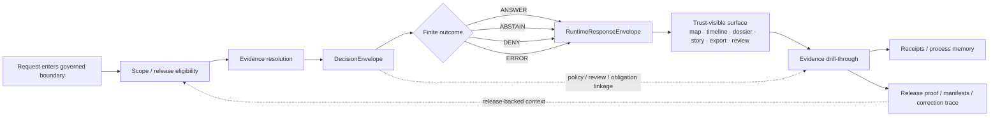
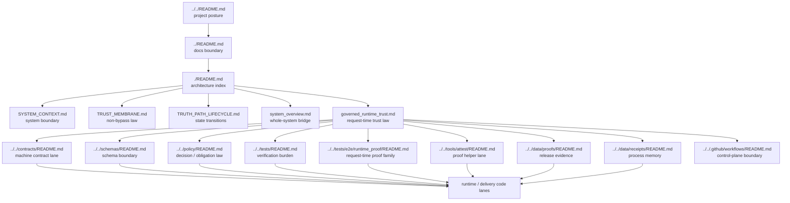

<!-- [KFM_META_BLOCK_V2]
doc_id: kfm://doc/NEEDS-VERIFICATION
title: Governed Runtime Trust
type: standard
version: v1
status: draft
owners: @bartytime4life
created: 2026-04-15
updated: 2026-04-15
policy_label: public
related: [
  ./README.md,
  ./SYSTEM_CONTEXT.md,
  ./TRUST_MEMBRANE.md,
  ./TRUTH_PATH_LIFECYCLE.md,
  ./DEPLOYMENT_TOPOLOGY.md,
  ./system_overview.md,
  ../../contracts/README.md,
  ../../schemas/README.md,
  ../../policy/README.md,
  ../../tests/README.md,
  ../../tests/e2e/runtime_proof/README.md,
  ../../tools/attest/README.md,
  ../../data/receipts/README.md,
  ../../data/proofs/README.md,
  ../../.github/workflows/README.md
]
tags: [kfm, architecture, runtime, trust, evidence, policy, proofs, receipts]
notes: [New architecture companion requested at docs/architecture/governed_runtime_trust.md. doc_id remains reviewable until governance records assign a stable identifier. This note is doctrine-grounded and public-main repo-bounded; runtime implementation depth, schema inventory, and workflow enforcement remain explicitly bounded.]
[/KFM_META_BLOCK_V2] -->

# Governed Runtime Trust

Architecture note for how KFM turns release evidence, policy, and request-time proof into **trust-visible runtime behavior** without bypassing the trust membrane.

> **Status:** draft · **Surface maturity:** new architecture companion, doctrine-grounded, public-main repo-bounded  
> **Owners:** `@bartytime4life`  
>        
> **Quick jumps:** [Scope](#scope) · [Repo fit](#repo-fit) · [Baseline & evidence basis](#baseline--evidence-basis) · [Accepted inputs](#accepted-inputs) · [Exclusions](#exclusions) · [Runtime trust model](#runtime-trust-model) · [Trust objects](#runtime-trust-objects) · [Decision flow](#decision-flow) · [Runtime surfaces](#runtime-surfaces-and-visible-state) · [Promotion and correction linkage](#promotion-and-correction-linkage) · [Proof burden](#proof-burden--review-checks) · [Diagram](#diagram) · [Tables](#reference-tables) · [Task list](#task-list--definition-of-done) · [FAQ](#faq) · [Appendix](#appendix)  
> **Repo fit:** `docs/architecture/governed_runtime_trust.md` · local companions [`./SYSTEM_CONTEXT.md`](./SYSTEM_CONTEXT.md), [`./TRUST_MEMBRANE.md`](./TRUST_MEMBRANE.md), [`./TRUTH_PATH_LIFECYCLE.md`](./TRUTH_PATH_LIFECYCLE.md), [`./system_overview.md`](./system_overview.md) · machine-facing neighbors [`../../contracts/README.md`](../../contracts/README.md), [`../../schemas/README.md`](../../schemas/README.md), [`../../policy/README.md`](../../policy/README.md), [`../../tests/README.md`](../../tests/README.md), [`../../tests/e2e/runtime_proof/README.md`](../../tests/e2e/runtime_proof/README.md) · release-evidence neighbors [`../../data/proofs/README.md`](../../data/proofs/README.md), [`../../data/receipts/README.md`](../../data/receipts/README.md) · helper lane [`../../tools/attest/README.md`](../../tools/attest/README.md) · control-plane boundary [`../../.github/workflows/README.md`](../../.github/workflows/README.md)

> [!IMPORTANT]
> This note explains **runtime trust law and composition**, not proof that every named object, schema, worker, or UI control is already implemented on the active branch.
>
> In KFM terms, runtime trust is real only when outward behavior remains downstream of:
>
> - promoted scope
> - evidence resolution
> - policy evaluation
> - release / freshness state
> - visible correction state
> - finite request outcomes

---

## Scope

This file explains the **runtime side of KFM trust**: what must happen between a request entering the governed boundary and a trust-visible result leaving it.

Use this note when the question is architectural:

- What makes a runtime answer, layer, map state, or export trustworthy in KFM?
- Which objects carry runtime accountability?
- How do proofs, receipts, policy, and correction state connect at request time?
- Which negative states must stay visible instead of being polished away?
- What other repo surfaces must move when runtime trust behavior changes?

Do **not** use this file as the authoritative home for:

- machine-readable contracts or schemas
- policy rule bodies or obligation logic
- workflow YAML or merge-gate implementation
- runtime service code, workers, UI component code, or storage adapters
- emitted proof packs, receipts, or audit bundles themselves

[Back to top](#governed-runtime-trust)

---

## Repo fit

| Field | Value |
|---|---|
| **Path** | `docs/architecture/governed_runtime_trust.md` |
| **Primary role** | Architecture companion for request-time trust law, trust-visible runtime state, and runtime proof boundaries |
| **Upstream doctrine** | [`../../README.md`](../../README.md), [`../README.md`](../README.md), [`./README.md`](./README.md), [`./SYSTEM_CONTEXT.md`](./SYSTEM_CONTEXT.md), [`./TRUST_MEMBRANE.md`](./TRUST_MEMBRANE.md), [`./TRUTH_PATH_LIFECYCLE.md`](./TRUTH_PATH_LIFECYCLE.md), [`./system_overview.md`](./system_overview.md) |
| **Machine-facing neighbors** | [`../../contracts/README.md`](../../contracts/README.md), [`../../schemas/README.md`](../../schemas/README.md), [`../../policy/README.md`](../../policy/README.md), [`../../tests/README.md`](../../tests/README.md), [`../../tests/e2e/runtime_proof/README.md`](../../tests/e2e/runtime_proof/README.md), [`../../.github/workflows/README.md`](../../.github/workflows/README.md) |
| **Release / evidence neighbors** | [`../../data/proofs/README.md`](../../data/proofs/README.md), [`../../data/receipts/README.md`](../../data/receipts/README.md) |
| **Helper / support neighbor** | [`../../tools/attest/README.md`](../../tools/attest/README.md) |
| **Why it exists** | To keep runtime trust legible as a governed architecture concern rather than scattering it across policy prose, tests, release notes, and UI hints |

### Accepted inputs

This note should accept material such as:

- request-time trust law
- runtime proof object relationships
- finite outcome rules
- release / proof / receipt / correction linkage
- trust-visible shell expectations
- architecture-level runtime review criteria
- explicitly bounded implementation guidance that does **not** overclaim current branch maturity

### Exclusions

Keep the following in their owning surfaces instead:

| Do not put this here | Keep it instead |
|---|---|
| Canonical JSON Schemas, payload definitions, vocabularies | [`../../contracts/README.md`](../../contracts/README.md), [`../../schemas/README.md`](../../schemas/README.md) |
| Executable policy logic, allow/deny/obligation rules | [`../../policy/README.md`](../../policy/README.md) |
| End-to-end test cases, fixtures, runtime proof drills | [`../../tests/README.md`](../../tests/README.md), [`../../tests/e2e/runtime_proof/README.md`](../../tests/e2e/runtime_proof/README.md) |
| Proof packs, release manifests, supersession / rollback artifacts | [`../../data/proofs/README.md`](../../data/proofs/README.md) |
| Process-memory receipts and replay trails | [`../../data/receipts/README.md`](../../data/receipts/README.md) |
| Verifier helpers, digests, attestation code | [`../../tools/attest/README.md`](../../tools/attest/README.md) |
| Workflow enforcement claims or checked-in YAML certainty | [`../../.github/workflows/README.md`](../../.github/workflows/README.md) |
| Browser workers, API handlers, UI component code, adapters | runtime/service-local code lanes |

[Back to top](#governed-runtime-trust)

---

## Baseline & evidence basis

### Baseline used for this note

The governing baseline for this file is the **existing architecture doctrine already visible in `docs/architecture/`**, especially:

- [`./TRUST_MEMBRANE.md`](./TRUST_MEMBRANE.md)
- [`./TRUTH_PATH_LIFECYCLE.md`](./TRUTH_PATH_LIFECYCLE.md)
- [`./SYSTEM_CONTEXT.md`](./SYSTEM_CONTEXT.md)
- [`./system_overview.md`](./system_overview.md)
- [`./README.md`](./README.md)

This file is therefore a **new companion**, not a restart.

### Truth posture used here

| Label | Meaning in this document |
|---|---|
| **CONFIRMED** | Directly supported by current public-repo docs or stable KFM doctrine already reflected in visible architecture / policy / test / evidence docs |
| **INFERRED** | Conservative structural completion strongly implied by those materials |
| **PROPOSED** | Repo-fit object, flow, or packaging move that matches doctrine but is not proven as current mounted implementation |
| **UNKNOWN** | Not verified strongly enough to present as current repo or runtime fact |
| **NEEDS VERIFICATION** | Important enough to name, but should be rechecked on the active branch before merge or enforcement claims |

### Working reading rule

Use the architecture companions for **runtime trust law**, and the adjacent machine / evidence lanes for **who owns enforcement, proof, and emitted artifacts**.

Do not let architecture prose silently upgrade:

- README-only lanes into implementation certainty
- historical workflow signals into current YAML inventory
- proposed runtime objects into emitted current-branch payloads

[Back to top](#governed-runtime-trust)

---

## Runtime trust model

KFM runtime trust is not a cosmetic badge or a generic “secure frontend” claim.

It is the architecture rule that says every consequential outward value remains **downstream of governed release state, evidence state, policy state, and correction state**.

### Short form

A runtime value is trustworthy in KFM only when all of the following stay intact:

1. the request crosses the **trust membrane**
2. the response remains inside promoted or otherwise policy-safe scope
3. evidence is resolvable enough to support the outward claim
4. policy can emit a bounded result, reason, and any obligations
5. release / freshness / correction state are still visible at point of use
6. the outward surface preserves a finite negative state when support is weak

### What runtime trust is **not**

It is **not** any of the following by itself:

- a signed artifact without policy and release context
- a passing helper check without an explainable trust object
- a friendly UI chip with no evidence drill-through
- a fast derived cache pretending to be authoritative truth
- a runtime answer that sounds plausible but cannot cite or abstain

> [!TIP]
> In KFM, **trust-visible runtime** means the user can encounter both:
>
> - the result
> - the reason that result is allowed, denied, partial, stale, corrected, or withheld

[Back to top](#governed-runtime-trust)

---

## Runtime trust objects

The architecture companions already establish that typed trust objects are how the membrane stays inspectable. This file narrows that idea to the runtime path.

### Core object families at runtime

| Object family | Runtime job | Architectural status here |
|---|---|---|
| `DecisionEnvelope` | Carries bounded policy result, reason, and obligations into outward behavior | **CONFIRMED doctrine** |
| `ReviewRecord` | Preserves human approval / denial / escalation context where review matters | **CONFIRMED doctrine** |
| `EvidenceBundle` | Carries support for a feature, claim, story node, export preview, or answer | **CONFIRMED doctrine** |
| `RuntimeResponseEnvelope` | Makes request-time outcome accountable and trust-visible | **CONFIRMED doctrine** |
| `ReleaseManifest` / `ReleaseProofPack` | Establish release-backed trust context for derived/runtime surfaces | **CONFIRMED doctrine** |
| Receipts / validation reports | Preserve replayable process memory and runtime-adjacent traceability | **CONFIRMED doctrine**, but emitted inventory is branch-bounded |
| Digest / signature / attestation helpers | Support proof checking and summarization | **CONFIRMED lane role** for `tools/attest/`; exact helper inventory remains branch-bounded |
| Tile / map trust receipt, trust chip, evidence drawer state, timeline entry, federation state | Concrete runtime packaging candidates for trust-visible behavior | **PROPOSED** |

### Governing split that must remain visible

| Surface | What it preserves | Must not collapse into |
|---|---|---|
| `data/receipts/` | Process memory, replay, validation, audit-facing run context | release evidence or canonical policy truth |
| `data/proofs/` | Release-significant proof, promotion / rollback / correction trace | process-memory receipts or hidden runtime state |
| Runtime envelope objects | Request-time accountable outward behavior | ad hoc UI state with no evidence or policy lineage |
| Derived delivery surfaces | Maps, tiles, vectors, scenes, search, exports | authoritative canonical truth |

> [!WARNING]
> `receipt ≠ proof ≠ catalog ≠ publication`
>
> That split is already doctrinally explicit in the visible repo and remains load-bearing here.

[Back to top](#governed-runtime-trust)

---

## Decision flow

The runtime path should be read as **architecture law first**, not as proof that every box below is already implemented exactly as drawn on current `main`.



### Runtime flow laws

| Law | Minimum consequence |
|---|---|
| **Scope first** | Runtime behavior does not treat “found something” as equivalent to “allowed to show it” |
| **Evidence before confidence** | Consequential outward values remain downstream of evidence resolution |
| **Decision before polish** | Policy outcome, reason, and obligations outrank presentation convenience |
| **Finite outcomes only** | `ANSWER`, `ABSTAIN`, `DENY`, and `ERROR` remain first-class runtime outcomes |
| **Evidence drill-through required** | Trust-visible surfaces keep a route to evidence, release state, and correction state |
| **Fail closed** | Weak support produces negative or partial state instead of silent confidence |

### Outcome grammar

The strongest visible runtime-proof doctrine already treats these as the core runtime outcomes:

| Outcome | Meaning |
|---|---|
| `ANSWER` | Evidence-backed, policy-safe, bounded outward result |
| `ABSTAIN` | Support is too weak, partial, unresolved, or insufficient for a valid answer |
| `DENY` | Policy blocks the requested action or outward surface |
| `ERROR` | The governed path could not complete within runtime constraints |

[Back to top](#governed-runtime-trust)

---

## Runtime surfaces and visible state

KFM architecture already treats runtime trust as **surface-visible**, not hidden behind logs or implied by confidence.

### Surfaces that inherit runtime trust burden

| Surface | Runtime trust consequence |
|---|---|
| Map / Explorer | Must expose time scope, layer state, freshness, and route to evidence |
| Timeline | Must preserve valid-time context, compare basis, and stale / corrected cues |
| Dossier | Must stay tied to evidence, dependencies, and trust-visible context |
| Story surface | Must remain evidence-linked, dated, and correction-aware |
| Evidence Drawer | Must expose the runtime trust story instead of merely decorating it |
| Focus / bounded runtime answer | Must stay retrieval-bounded, citation-checked, and finite-outcome-limited |
| Export / review handoff | Must inherit release scope, evidence linkage, and correction lineage |

### Visible state that must not disappear

The trust membrane and runtime-proof surfaces together imply that these states are architecturally valid outputs:

- promoted
- partial
- generalized
- stale-visible
- source-dependent
- conflicted
- corrected / superseded
- withdrawn
- denied
- abstained
- error

> [!IMPORTANT]
> A smooth UI that hides `abstain`, `deny`, stale state, or correction state is architecturally worse than a plainer UI that keeps them visible.

### Trust-visible runtime packaging

The visible repo confirms the **Evidence Drawer** as a load-bearing architecture concept and confirms runtime-proof doctrine around request-time evidence resolution. What remains **PROPOSED** is the exact packaging of those runtime cues into one canonical runtime-trust family.

A doctrine-aligned thin slice would likely include:

| Candidate runtime-trust element | Status here | Why it fits |
|---|---|---|
| Trust chip / state badge | **PROPOSED** | Compact outward state cue at point of use |
| Evidence drawer detail panel | **CONFIRMED concept**, exact implementation **UNKNOWN** | Matches trust-visible shell law |
| Runtime trust receipt | **PROPOSED** | Makes request-time trust replayable without collapsing into release proof |
| Evidence timeline entry | **PROPOSED** | Keeps verification, correction, and supersession time-visible |
| Federated trust panel | **PROPOSED** | Makes cross-source consistency or conflict inspectable |
| Split-view conflict inspection | **PROPOSED** | Keeps disagreement explainable instead of rhetorical |

[Back to top](#governed-runtime-trust)

---

## Promotion and correction linkage

Runtime trust in KFM is downstream of the truth path. It is not a second, looser regime.

### Relationship to the truth path

`TRUTH_PATH_LIFECYCLE.md` makes the lifecycle law explicit:

`Source edge → RAW → WORK / QUARANTINE → PROCESSED → CATALOG → PUBLISHED`

Runtime trust therefore depends on two things at once:

1. **authoritative lifecycle discipline**
2. **runtime accountability objects**

### What runtime trust inherits from promotion

| Upstream state | Runtime implication |
|---|---|
| Promoted release | Eligible to participate in outward runtime confidence |
| Review hold / unresolved gate | Must not quietly appear as public-safe confidence |
| Missing release-proof context | Runtime confidence should stay bounded or fail closed |
| Superseded / corrected release | Runtime surfaces must expose correction lineage |
| Withdrawn / revoked release | Runtime surfaces must not keep presenting stale confidence as current truth |

### Correction rule

The architecture companions and evidence lanes together imply a strict rule:

> Correction, supersession, withdrawal, and rollback must travel **forward** into trust-visible runtime surfaces.

That means runtime trust is incomplete when:

- the evidence drawer is current but the map is stale
- the release is corrected but the outward claim still presents as clean
- the export omits the correction lineage that the runtime already knows

### Promotion / runtime consistency

The workflow lane is README-only on current public `main`, but its documented role is still trust-significant. The architecture rule here is therefore conservative:

- workflow and promotion automation are the **control-plane expression** of governed trust
- runtime trust must not contradict release / promotion truth
- the exact checked-in enforcement depth of that automation remains **NEEDS VERIFICATION** on the active branch

[Back to top](#governed-runtime-trust)

---

## Cross-source trust and bounded disagreement

A single verified source is not always enough for a trustworthy runtime answer.

The trust membrane, runtime-proof doctrine, and correction-visible shell law all imply a second runtime burden: **joint sufficiency**.

### Architecture rule

Individually supported sources are **not automatically jointly sufficient**.

### Why this matters

KFM’s map-first and time-aware shell means a user can encounter multiple valid surfaces at once:

- hydrology
- hazard layers
- habitat / land-cover context
- story excerpts
- derived projections
- historical overlays

Runtime trust therefore has to preserve not only **support**, but also **compatibility**.

### Federated trust posture

The exact machine contract is **PROPOSED**, but the architectural need is strong:

| Federated state | Runtime consequence |
|---|---|
| Consistent | normal trust-visible render / answer path |
| Divergent but bounded | trust-visible caution, basis shown, maybe still answerable |
| Material conflict | `ABSTAIN` or constrained render path |
| Insufficient evidence | `ABSTAIN` |
| Revoked / withdrawn participant present | deny participation from that source |

> [!NOTE]
> The repo currently gives a strong doctrinal basis for **cite or abstain**, **correction-visible state**, and **derived layers staying derived**. Extending that into explicit cross-source conflict contracts is a natural KFM move, but it should still be labeled **PROPOSED** until contracts, schemas, and tests land.

[Back to top](#governed-runtime-trust)

---

## Runtime boundary map

This file sits between system law and implementation.



[Back to top](#governed-runtime-trust)

---

## Reference tables

### What is settled vs still bounded

| Topic | Current status | Why |
|---|---|---|
| Trust membrane as a load-bearing law | **CONFIRMED** | Explicit in `TRUST_MEMBRANE.md` and repeated across visible doctrine |
| Lifecycle law and publication boundary | **CONFIRMED** | Explicit in `TRUTH_PATH_LIFECYCLE.md` |
| Runtime finite outcomes `ANSWER / ABSTAIN / DENY / ERROR` | **CONFIRMED** | Explicit in runtime-proof README and trust-membrane doctrine |
| Evidence Drawer as trust-visible concept | **CONFIRMED** | Explicit in visible architecture docs |
| `tools/attest/` as proof / digest / attestation helper lane | **CONFIRMED** | Explicit in `tools/attest/README.md` |
| `data/receipts/` as process-memory surface | **CONFIRMED** | Explicit in `data/receipts/README.md` |
| `data/proofs/` as release-evidence surface | **CONFIRMED** | Explicit in `data/proofs/README.md` |
| `.github/workflows/` as current public README-only lane | **CONFIRMED** | Explicit in `.github/workflows/README.md` |
| Exact runtime trust object inventory on active branch | **UNKNOWN / NEEDS VERIFICATION** | Not directly verified in code from this session |
| Exact schema locations for runtime-trust payloads | **UNKNOWN / NEEDS VERIFICATION** | Schema authority is still documented as split / unresolved |
| Trust chip, evidence timeline, federation panel as landed implementation | **PROPOSED** | Architecture-consistent, not verified as current public implementation |

### Runtime trust change matrix

| Change type | Examples | Must move with it |
|---|---|---|
| Outcome change | new outward runtime result, new finite-state handling | policy docs, contracts / schemas, runtime-proof tests, workflow notes |
| Evidence packaging change | new envelope shape, trust receipt, bundle structure | contracts, schemas, tests, evidence docs, helper docs |
| Surface visibility change | chip, drawer, export, focus, compare, timeline behavior | architecture docs, product / shell docs, accessibility/trust tests |
| Promotion linkage change | release eligibility, proof-pack coupling, rollback handling | proofs docs, workflows docs, policy, runtime-proof tests |
| Correction behavior change | supersession visibility, withdrawal handling, stale-visible rules | proofs docs, receipts docs, runtime-proof tests, architecture docs |
| Cross-source trust change | disagreement thresholds, source exclusion, conflict states | policy, contracts, tests, architecture docs |

### Review questions for architecture changes touching runtime trust

| Question | Why it matters |
|---|---|
| Does the change keep outward behavior downstream of the trust membrane? | Prevents convenience bypass |
| Does the change keep `receipt ≠ proof ≠ catalog ≠ publication` visible? | Prevents surface collapse |
| Can the result still explain `why this was allowed, denied, partial, or stale`? | Prevents trust theater |
| Are negative states still first-class? | Prevents confidence laundering |
| Does correction travel forward into the trust-visible surface? | Prevents hidden stale truth |
| If the change sounds enforceable, which contract / policy / test / workflow surfaces must move too? | Prevents prose-only enforcement claims |

[Back to top](#governed-runtime-trust)

---

## Proof burden & review checks

### Minimum architecture proof burden

A runtime-trust change is not review-complete until reviewers can point to:

- the architecture boundary it changes
- the machine-facing surface that should enforce or validate it
- the negative state that still remains visible
- the evidence / proof / receipt split it preserves
- the correction or rollback behavior it implies

### Branch recheck before merge

```bash
# Architecture companions
sed -n '1,220p' docs/architecture/README.md
sed -n '1,240p' docs/architecture/SYSTEM_CONTEXT.md
sed -n '1,260p' docs/architecture/TRUST_MEMBRANE.md
sed -n '1,260p' docs/architecture/TRUTH_PATH_LIFECYCLE.md
sed -n '1,220p' docs/architecture/system_overview.md

# Runtime-trust neighbors
sed -n '1,220p' tools/attest/README.md
sed -n '1,220p' data/receipts/README.md
sed -n '1,220p' data/proofs/README.md
sed -n '1,220p' tests/README.md
sed -n '1,220p' tests/e2e/runtime_proof/README.md
sed -n '1,220p' policy/README.md
sed -n '1,220p' contracts/README.md
sed -n '1,220p' schemas/README.md
sed -n '1,220p' .github/workflows/README.md
```

### What to keep conservative in review

- current branch implementation depth
- exact payload / schema names unless directly verified
- exact workflow enforcement coverage
- live route inventories
- UI affordance inventory beyond what the branch proves
- runtime topology or trust-root handling details not directly inspected

[Back to top](#governed-runtime-trust)

---

## Task list / definition of done

- [ ] This note stays aligned with [`./TRUST_MEMBRANE.md`](./TRUST_MEMBRANE.md) and [`./TRUTH_PATH_LIFECYCLE.md`](./TRUTH_PATH_LIFECYCLE.md) when runtime-trust law changes.
- [ ] Any new runtime-trust object named here is either linked to a landed contract / schema / test surface or explicitly labeled **PROPOSED**.
- [ ] Changes that sound enforceable also update the owning machine-facing surface in the same stream: contracts, schemas, policy, tests, or workflows.
- [ ] Release evidence, process memory, and runtime envelopes remain visibly distinct.
- [ ] Negative states remain first-class in UI, export, and runtime behavior discussions.
- [ ] Correction, rollback, supersession, and withdrawal implications are reviewed instead of left implicit.
- [ ] Cross-source trust claims remain bounded unless contracts and tests prove the behavior.
- [ ] The Meta Block values are rechecked if this file is promoted from draft.

[Back to top](#governed-runtime-trust)

---

## FAQ

### Why is runtime trust an architecture topic instead of only a policy topic?

Because the trust membrane is architectural law. Policy decides outcomes, but architecture decides **where those outcomes can be bypassed, hidden, or made visible**.

### Why keep receipts and proofs separate if both help trust?

Because they answer different questions.  
Receipts preserve **process memory**. Proofs preserve **release-significant evidence**. Runtime trust depends on both without collapsing them into one bucket.

### Why keep `ABSTAIN` and `DENY` so visible?

Because KFM’s value unit is the **inspectable claim**, not the smoothest possible answer path.

### Does this file prove a landed trust-chip or evidence-timeline implementation?

No. It documents the architecture law and a doctrine-consistent shape. Exact implementation depth remains branch-bounded unless reverified in code, contracts, schemas, and tests.

[Back to top](#governed-runtime-trust)

---

## Appendix

<details>
<summary><strong>Architecture implications worth carrying forward</strong></summary>

### 1) Runtime trust is not a sidecar

If a feature changes how a user sees evidence, release state, correction state, or negative outcomes, it has changed runtime trust.

### 2) Delivery layers inherit the same burden

Maps, tiles, vectors, exports, search, and scenes remain derived. They do not get a looser trust regime just because they are fast or visually polished.

### 3) Focus and fluent answer surfaces are burden-bearing

The visible doctrine already treats bounded runtime answering as a governed surface. That means any answer-oriented feature must still preserve:

- finite outcomes
- citation / evidence checks
- policy linkage
- auditability

### 4) The control plane matters, but current public YAML depth is bounded

The workflows lane is real and trust-significant, but current public `main` still documents `.github/workflows/` as README-only. Architecture notes should therefore point to workflow responsibility without claiming checked-in enforcement coverage that the branch has not proven.

### 5) A good runtime-trust UI is not merely pretty

It should make trust legible:

- what is being shown
- why it is allowed
- what supports it
- how fresh it is
- whether it is corrected, partial, conflicted, or withheld

</details>

[Back to top](#governed-runtime-trust)