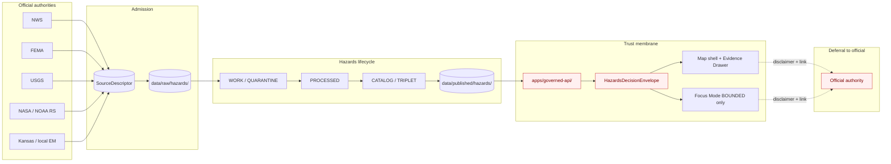

<a id="top"></a>
<!-- [KFM_META_BLOCK_V2]
doc_id: kfm://doc/architecture/hazards-trust-membrane
title: Kansas Frontier Matrix — Hazards & the Trust Membrane (Architecture Note)
type: architecture
version: v0.1 (draft)
status: draft
owners: <HAZARDS_STEWARD>, <ARCHITECTURE_STEWARD>  # PROPOSED — placeholders pending owner assignment
created: 2026-05-25
updated: 2026-05-25
policy_label: public
related:
  - docs/doctrine/directory-rules.md
  - docs/doctrine/truth-posture.md
  - docs/doctrine/trust-membrane.md
  - docs/doctrine/lifecycle-law.md
  - docs/architecture/governed-api.md
  - docs/architecture/governed-ai.md
  - docs/architecture/evidence-identity.md
  - docs/architecture/map-shell.md
  - docs/architecture/contract-schema-policy-split.md
  - docs/architecture/connected-dots-architecture-brief.md
  - docs/domains/hazards/
  - docs/adr/ADR-0001-schema-home.md
  - contracts/domains/hazards/
  - schemas/contracts/v1/hazards/
  - policy/release/hazards/
  - apps/governed-api/
  - ai-build-operating-contract.md
tags: [kfm, architecture, hazards, trust-membrane, life-safety-boundary, alert-authority, fail-closed, dom-haz]
notes:
  - All repository paths are PROPOSED; no mounted repo, CI workflow, runtime, or dashboard was inspected.
  - The doctrine that KFM Hazards is NEVER an alert authority is CONFIRMED at doctrine rank (Atlas §24.9.2, §20.5; Hazards chapter §B).
  - Source-family rights/terms are NEEDS VERIFICATION per Pass-23/32 Atlas Hazards table.
  - Placement gap flagged: hazards-trust-membrane.md is not in the directory-rules.md v1.3 §6.1 illustrative tree.
[/KFM_META_BLOCK_V2] -->

# Kansas Frontier Matrix — Hazards & the Trust Membrane

**Why the hazards lane is KFM's strictest fail-closed surface, and how the trust membrane applies when the topic itself is life-safety adjacent.**


> **Status:** draft · **Owners:** `<HAZARDS_STEWARD>`, `<ARCHITECTURE_STEWARD>` (placeholders) · **Updated:** 2026-05-25

> [!CAUTION]
> **KFM Hazards is not an emergency alert system and must not provide life-safety instructions.** Operational warnings, advisories, and watches are owned by official authorities (NWS, FEMA, USGS, state and local emergency management). KFM Hazards carries them as **context**, with **disclaimer and deferral**, and never as directive language. **[CONFIRMED — Atlas §B "Scope, boundary, and explicit non-ownership"; Atlas §24.9.2 anti-pattern; Atlas §20.5 Deny-by-Default Register]**

---

## Contents

- [1. Purpose & scope](#1-purpose--scope)
- [2. Where this note belongs](#2-where-this-note-belongs)
- [3. The headline rule — never an alert authority](#3-the-headline-rule--never-an-alert-authority)
- [4. Hazards ubiquitous language](#4-hazards-ubiquitous-language)
- [5. Source families and admission](#5-source-families-and-admission)
- [6. The trust membrane in the Hazards lane](#6-the-trust-membrane-in-the-hazards-lane)
- [7. Source-role anti-collapse in Hazards](#7-source-role-anti-collapse-in-hazards)
- [8. Stale-state and operational expiry](#8-stale-state-and-operational-expiry)
- [9. Cross-lane ownership and citation](#9-cross-lane-ownership-and-citation)
- [10. Governed AI in the Hazards lane](#10-governed-ai-in-the-hazards-lane)
- [11. Anti-patterns and DENY surfaces](#11-anti-patterns-and-deny-surfaces)
- [12. Schema, contract, and policy homes](#12-schema-contract-and-policy-homes)
- [13. Acceptance criteria](#13-acceptance-criteria)
- [14. Tensions & open questions](#14-tensions--open-questions)
- [15. Appendix — illustrative shapes](#15-appendix--illustrative-shapes)
- [16. Related docs](#16-related-docs)

---

## 1. Purpose & scope

This note is the architecture-level explanation of **how KFM's trust membrane operates in the Hazards domain (`[DOM-HAZ]`)** — where the consequences of getting it wrong are highest. It sits between the system-wide trust-membrane doctrine in `docs/doctrine/`, the architectural intersection points (`docs/architecture/governed-api.md`, `docs/architecture/governed-ai.md`, `docs/architecture/evidence-identity.md`), and the Hazards domain manual at `docs/domains/hazards/`. **[CONFIRMED — doctrine; PROPOSED — paths]**

**Why this intersection deserves its own architecture note.** Hazards is the only KFM domain where:

- The information itself is *life-safety adjacent* (floods, wildfires, smoke, drought, earthquakes, heat/cold events). **[CONFIRMED — Atlas §A]**
- KFM is explicitly **forbidden** from being the authority surface for warnings or instructions. **[CONFIRMED — Atlas §B "explicit non-ownership"]**
- The same data carries up to **eleven distinct source roles** (warning, advisory, watch, declaration, regulatory, observation, remote sensing, modeled, resilience, historical, unknown), each with a different anti-collapse posture. **[CONFIRMED — Atlas §C ubiquitous language]**
- A regulatory layer (NFHL flood zones) and an observed event (a flood) can describe overlapping spatial extents but **must never be conflated**. **[CONFIRMED — Atlas §24.1.2; cross-domain anti-pattern]**
- Stale state is operationally dangerous: an expired operational warning displayed as current is a trust-membrane failure with potential human-safety consequences. **[CONFIRMED — Atlas §I; §24.8.1]**

**In scope.** The hazards-specific trust-membrane application; the never-an-alert-authority rule; the role taxonomy and anti-collapse register for hazards; source-family admission posture; operational-expiry handling; cross-lane ownership boundaries with Hydrology / Atmosphere / Settlements / Roads; the governed-AI BOUNDED posture; hazards-specific anti-patterns; acceptance tests.

**Out of scope.** The full hazards-domain operating manual (`docs/domains/hazards/README.md` — **PROPOSED**); the system-wide trust-membrane doctrine (`docs/doctrine/trust-membrane.md` — **NEEDS VERIFICATION**); the broader Hazards source-descriptor schemas (`schemas/contracts/v1/hazards/` — **PROPOSED**); the cross-system `RuntimeResponseEnvelope` (covered in `docs/architecture/governed-ai.md` §8 — drafted in this session).

[Back to top](#top)

---

## 2. Where this note belongs

Per `directory-rules.md` v1.3 §6.1 and the *KFM Unified Implementation Architecture Build Manual* §5.1, architecture notes are placed under `docs/architecture/`. The proposed canonical path of this file is:

```text
docs/architecture/hazards-trust-membrane.md   # PROPOSED — Directory Rules §6.1, Build Manual §5.1
```

> [!CAUTION]
> **Placement gap (NEEDS VERIFICATION).** The illustrative `docs/architecture/` tree in `directory-rules.md` v1.3 §6.1 lists `README.md`, `system-context.md`, `deployment-topology.md`, `governed-api.md`, `map-shell.md`, and `contract-schema-policy-split.md` — but **does not** list `hazards-trust-membrane.md`. The rationale for adding it is the same as the rationale for `maplibre-3d.md` (a v1.3 addition): a cross-cutting architectural concern whose intersection with a specific surface is substantial enough to deserve its own note. Resolution by ADR or by amendment to Directory Rules, tracked in §14 HAZ-Q1 and surfaced in `docs/registers/DRIFT_REGISTER.md`.

**Why `docs/architecture/` rather than `docs/domains/hazards/`.** This note's primary subject is the **trust membrane** — a cross-cutting architectural invariant — applied to the **hazards** lane. The hazards-domain operating manual (object families, source admission runbooks, validator inventories) belongs at `docs/domains/hazards/`; that doc and this one are complements, not duplicates. Per Build Manual §5.1: *Architecture notes* → `docs/architecture/`; *Domain docs* → `docs/domains/<domain>/`. **[CONFIRMED at doctrine; PROPOSED at slot]**

| Question | Where the answer lives | Status |
|---|---|---|
| What is the system-wide trust membrane? | `docs/doctrine/trust-membrane.md` | **NEEDS VERIFICATION** — referenced from directory-rules.md |
| What does it mean for the Hazards lane specifically? | **This note** (`docs/architecture/hazards-trust-membrane.md`) | **PROPOSED** |
| What does the Hazards domain own and do? | `docs/domains/hazards/README.md` | **PROPOSED — not yet authored** |
| What are the Hazards object schemas? | `schemas/contracts/v1/hazards/` | **PROPOSED** — Atlas §24.13 crosswalk |
| What are the Hazards object meanings? | `contracts/domains/hazards/` | **PROPOSED** — Directory Rules §6.3 (domains family) |
| What gates Hazards release? | `policy/release/hazards/` | **PROPOSED** — Atlas §24.13 crosswalk |

[Back to top](#top)

---

## 3. The headline rule — never an alert authority

The single most important rule in the Hazards lane:

> [!IMPORTANT]
> **KFM Hazards is not an emergency alert system and must not provide life-safety instructions.** Hydrology, Atmosphere/Air, Settlements, Roads, and other lanes own their canonical sources; KFM Hazards carries them as **context** within governed surfaces. **[CONFIRMED — Atlas §B "Scope, boundary, and explicit non-ownership"]**

**Operational consequences of the rule** (CONFIRMED at doctrine rank):

| Surface | Required posture |
|---|---|
| Public UI badges, popups, drawer | Contextual language only. **No imperative verbs** (e.g., "evacuate", "shelter", "do not enter"). |
| Evidence Drawer disclaimer | Visible: "KFM is not an alert authority. For current warnings, consult the official source." Required test (Atlas §K "Evidence Drawer disclaimer tests"). |
| Governed-API responses | `HazardsDecisionEnvelope` returns context with attribution; never instructions. |
| Focus Mode answers | `BOUNDED` outcome only; defer to official; include disclaimer in `visible_limitations`. |
| Tile layers and map styles | Visually distinguish context from official-source rendering; release-state badges visible. |
| Release manifests | Required; rollback target required; correction path required. **[CONFIRMED — Atlas §M]** |

**The Deny-by-Default register** (Atlas §20.5) records this lane explicitly:

| Domain/surface | Denied by default | Allowed only when |
|---|---|---|
| **Hazards** | emergency instructions or KFM as alert authority | **never allowed as KFM authority** **[CONFIRMED — Atlas §20.5]** |
| **Emergency-alert boundary** (Hazards, Hydrology, Air) | KFM used as life-safety instruction | **never** **[CONFIRMED — Atlas §20.5]** |

[Back to top](#top)

---

## 4. Hazards ubiquitous language

The Hazards lane uses an **eleven-term role vocabulary** — `CONFIRMED terms / PROPOSED field realizations` per Atlas §C. Each term is **constrained by source role, evidence, time, and release state**; collapsing any two of them is an anti-collapse violation (see §7).

| Term | What it means | Identity-bearing? |
|---|---|---|
| `historical_event_record` | Past event captured in an archival record (e.g., a 1951 flood account). | Yes — fixed at admission. |
| `operational_warning` | A current, active warning from an official authority. **Has an expiry.** | Yes — also bound to a temporal window. |
| `operational_advisory` | A current advisory (lower severity than warning). **Has an expiry.** | Yes — temporally bound. |
| `operational_watch` | Conditions favor an event; not yet a warning. **Has an expiry.** | Yes — temporally bound. |
| `administrative_declaration` | An administrative act (e.g., FEMA Disaster Declaration). | Yes — fixed at admission. |
| `regulatory_context` | A regulatory determination (e.g., NFHL flood-zone designation). **Never an event.** | Yes — never relabeled. |
| `scientific_observation` | A direct measurement (e.g., USGS earthquake magnitude). | Yes — fixed at admission. |
| `remote_sensing_detection` | A satellite or remote detection (e.g., FIRMS active-fire pixel, HMS smoke plume). | Yes — fixed at admission. |
| `modeled_derivative` | A model output (e.g., smoke trajectory). **Never an observation.** | Yes — carries model identity. |
| `resilience_analysis` | A derived analysis (e.g., exposure summary). | Yes — carries inputs and method. |
| `unknown_unclassified` | Pending classification; **stays in QUARANTINE** until resolved. | Yes — quarantine until classified. |

**[CONFIRMED — Atlas §C ubiquitous language; PROPOSED field-level realization in schemas]**

> [!NOTE]
> The role taxonomy is *part of identity*, not just metadata. Per `docs/architecture/evidence-identity.md` §4.2 (drafted in this session), the deterministic identity hash for a Hazards object is computed over `source_id ‖ object_role ‖ temporal_scope ‖ normalized_digest` — so a `Wildfire Detection` with `source_role = remote_sensing_detection` is a *different object* from a `Wildfire Detection` with `source_role = modeled_derivative`, even if they cover the same spatial extent. **[CONFIRMED — Atlas §E identity rule; cross-ref evidence-identity.md §4.2]**

[Back to top](#top)

---

## 5. Source families and admission

The Hazards domain admits source families across **eight** named groups. Each carries authority/observation/context/model role *as the source role requires*; **rights and current terms are NEEDS VERIFICATION** until rights review completes; **sensitive joins fail closed.**

| Source family | Typical role(s) | Cadence posture | Sensitivity note |
|---|---|---|---|
| **NOAA Storm Events / NCEI-style records** | Historical event records; archival observation. | Vintage-specific. | Public; cite source vintage. |
| **NWS alerts / warnings / advisories / watches** | `operational_warning`, `operational_advisory`, `operational_watch`. | Short-lived; **has expiry**. | Public; but never as KFM-as-authority. |
| **FEMA Disaster Declarations / OpenFEMA** | `administrative_declaration`. | Event-cadence. | Public; cite issuer. |
| **FEMA NFHL / MSC flood hazard context** | `regulatory_context` (flood-zone designations). | Release-versioned. | **T0 regulatory**; never relabeled "observed flood". **[CONFIRMED — Atlas §24.1.2; Atlas Object Family Matrix]** |
| **USGS Earthquake Catalog** | `scientific_observation` (instrumented magnitudes, locations). | Continuous updates; cite catalog version. | Public. |
| **NOAA HMS Fire and Smoke** | `remote_sensing_detection` (smoke plumes) and analyst-assessed context. | Daily-or-faster. | Public; preserve analyst-assessment caveats. |
| **NASA FIRMS active fire** | `remote_sensing_detection` (active-fire pixels). | Near-real-time, but **NRT product**. | Public; preserve NRT vs standard-product distinction. |
| **Kansas / local emergency context** | Mixed roles per admission. | Per-source. | Per-source; rights review required. |

**[CONFIRMED — Atlas §D "Key source families"; rights "NEEDS VERIFICATION" per Atlas Hazards table]**

Companion authorities cited from elsewhere — already named in Atlas idea cards as **public-safety-relevant** with **non-negotiable version discipline** — include:

- **FEMA NFHL** (canonical flood-hazard authority). **[CONFIRMED — KFM-P2-IDEA-0026]**
- **USACE NLD** (National Levee Database). **[CONFIRMED — KFM-P2-IDEA-0026]**
- **USACE NID** (National Inventory of Dams). **[CONFIRMED — KFM-P2-IDEA-0026]**

> [!WARNING]
> **NID dam-failure inundation fields are sensitive.** Pass-10 / Pass-23 doctrine directs that these fields be classified as **restricted-precise** and held under sensitivity policy. **[CONFIRMED — KFM-P2-IDEA-0026 "Tensions"]**

[Back to top](#top)

---

## 6. The trust membrane in the Hazards lane

The system-wide trust membrane (CONFIRMED doctrine glossary: *"the boundary that prevents raw, unreviewed, restricted, or generated state from becoming public truth"*) applies in the Hazards lane with the additional constraint that **even released public-safe content must not function as alert authority**. The flow:



**Key properties of the hazards membrane** (CONFIRMED at doctrine rank):

| Property | Where enforced |
|---|---|
| No public client reads RAW / WORK / QUARANTINE. | `apps/governed-api/` is the only public path. **[CONFIRMED — Atlas §24.9.2; Directory Rules §11]** |
| Released hazards artifacts carry release/rollback closure. | Atlas §M; `policy/release/hazards/`. |
| Operational warning state never appears "current" after expiry. | Atlas §I; validators §K "operational expiry/freshness tests". |
| Evidence Drawer carries the disclaimer on every hazards-feature click. | Atlas §K "Evidence Drawer disclaimer tests". |
| Focus Mode answers are `BOUNDED`; defer to official; cite. | AI Build Operating Contract §23.2; see §10 below. |
| Regulatory and observed lanes are visibly separated in UI. | Atlas §24.1.2 cross-domain anti-pattern; banner in UI. |

> [!IMPORTANT]
> **Style-only hiding fails this test.** A tile that styles a sensitive hazards layer "invisible" but is still in the public tileset can be revealed by anyone with browser devtools. Hazards-sensitive geometry must be **transformed before publication** (generalize, withhold, deny), not merely hidden. **[CONFIRMED — Atlas §24.10 risk register; cross-cutting with sensitivity doctrine]**

[Back to top](#top)

---

## 7. Source-role anti-collapse in Hazards

The Hazards lane is where the Master Source-Role Anti-Collapse Register (Atlas §24.1) is **most acute**. Two pairs are especially load-bearing:

> [!WARNING]
> **Regulatory layer ≠ observed event.** NFHL flood-zone *designations* are regulatory determinations; they are **never** flood *events*. Joining an NFHL polygon with an event timeline as if it were an observation collapses the lane and produces misleading public claims. **[CONFIRMED — Atlas §24.1.2; cross-domain anti-pattern; matches Hydrology / Air / Hazards row]**

> [!WARNING]
> **Modeled derivative ≠ observation.** A smoke-trajectory model, a heat-index map, and a flood-inundation model are *modeled derivatives*. They are cited with **model identity, run receipt, and bounds**, never as ground observations. The `Wildfire Detection` object can be either remote-sensing (FIRMS) or modeled (HMS analyst), and the role attaches to identity. **[CONFIRMED — Atlas §24.1.1 "Modeled" row; Atlas §24.1.2 anti-pattern]**

### 7.1 Allowed and forbidden joins (Atlas §24.1.2 rows applying to Hazards)

| Join pattern | Allowed? | DENY surface |
|---|---|---|
| Observed `Hazard Event` + `EvidenceBundle` + `release_state` → public claim. | **Allowed** | n/a |
| Regulatory `NFHL_zone` *as context* alongside observed events with **separate UI lane**. | **Allowed** | n/a |
| Regulatory `NFHL_zone` cited *as event evidence*. | **DENY** | `apps/governed-api/`; `policy/release/hazards/`. **[CONFIRMED — Atlas §24.1.2 first row]** |
| Modeled `SmokeContext` cited *as observation*. | **DENY** | Citation validator; Focus Mode. **[CONFIRMED — Atlas §24.1.2 second-modeling row]** |
| Aggregate hazards summary cited as per-place truth. | **DENY** | Aggregation-receipt guard. **[CONFIRMED — Atlas §24.1.2]** |
| `unknown_unclassified` admitted but not yet classified → published. | **DENY** (stays in QUARANTINE). | Promotion gate. **[CONFIRMED — Atlas §I "unknown source roles are quarantined"]** |
| Expired `operational_warning` rendered as current. | **DENY** | Operational-expiry validator. **[CONFIRMED — Atlas §I "expired operational context cannot appear as current warning state"]** |
| Promotion that "upgrades" a `modeled_derivative` to `scientific_observation`. | **DENY** | Source-role anti-collapse validator; corrections require new descriptor + CorrectionNotice. **[CONFIRMED — Atlas §24.9.3]** |

[Back to top](#top)

---

## 8. Stale-state and operational expiry

Hazards is the lane where **stale-state markers carry the highest operational stakes**. The stale-vs-wrong distinction (Atlas §24.8.1) applies here with extra discipline.

| Marker | What triggers it | UI signal | Required action |
|---|---|---|---|
| **Operational expiry** | `operational_warning`/`advisory`/`watch` valid-until time has passed. | Expired-warning badge in Evidence Drawer; remove from "current" layer. | Move to historical context; do **not** render as current. **[CONFIRMED — Atlas §I; §K "operational expiry/freshness tests"]** |
| **Source freshness expired** | `SourceDescriptor` cadence elapsed without new admission (e.g., NWS feed stalled). | Stale-source badge; layer freshness indicator. | Re-admit or supersede; mark dependent claims stale. **[CONFIRMED — Atlas §24.8.1]** |
| **Schema version drift** | Object schema upgraded past the published claim's schema version. | Schema-drift badge; show migration ADR if any. | Migrate, re-validate, re-release; or mark stale. **[CONFIRMED — Atlas §24.8.1]** |
| **Model version superseded** | `ModelRunReceipt` references an older model than current (smoke/flood/heat models). | Model-version badge with new model identity. | Re-run; supersede; or mark stale. **[CONFIRMED — Atlas §24.8.1]** |
| **Rights status changed** | `SourceDescriptor` rights change. | Rights-changed badge. | Re-evaluate tier; emit `CorrectionNotice` if necessary. **[CONFIRMED — Atlas §24.8.1]** |
| **Policy version changed** | Policy referenced by `PolicyDecision` was superseded. | Policy-version badge. | Re-run gate; potentially supersede release. **[CONFIRMED — Atlas §24.8.1]** |

> [!IMPORTANT]
> **Stale is not wrong; both are visible.** A stale claim is one whose evidence, source freshness, or context has aged past tolerance; a wrong claim is one whose substance is incorrect. Both have traceable lifecycles. **[CONFIRMED — Atlas §24.8.1]** In Hazards, *stale presented as current is a trust-membrane failure with potential human-safety consequence* — which is why the operational-expiry validator is a Hazards-specific test in Atlas §K.

[Back to top](#top)

---

## 9. Cross-lane ownership and citation

Hazards intersects four other domains heavily. The boundary rule is uniform: **citation, not absorption** — the canonical source stays with the owning lane. **[CONFIRMED — Atlas §F cross-lane relations]**

| KFM lane | What Hazards cites from there | Constraint |
|---|---|---|
| **Hydrology** | `HUC / Watershed / Reach`, `GaugeSite`, `FlowObservation`, **`NFHL_zone` (regulatory)**. | Preserve role separation; `NFHL_zone` is `regulatory_context`, not an event. **[CONFIRMED — Atlas Object Family Matrix; Atlas §24.1.2]** |
| **Atmosphere / Air** | Smoke plumes, AQI advisories, fire-weather, heat/cold context. | Source-role anti-collapse is *acute* in Air; carry it through. **[CONFIRMED — Atlas §F; Atlas DOM-AIR row]** |
| **Settlements / Infrastructure** | Exposure, lifelines, dependencies (with critical-asset deny lane). | Cross-cite without exposing critical-asset detail. **[CONFIRMED — Atlas §F]** |
| **Roads / Rail** | Closures, detours, bridge/crossing exposure, resilience. | Cite; respect Roads ownership of network identity. **[CONFIRMED — Atlas §F]** |

**Companion citation lanes** (referenced from Hazards, owned elsewhere):

- **USACE NLD / NID** — levee/dam systems. Owned outside Hazards; cited as infrastructure context with **restricted-precise** fields. **[CONFIRMED — KFM-P2-IDEA-0026]**
- **FEMA NFHL** — owned by Hydrology in Atlas Object Family Matrix; Hazards cites for regulatory context. **[CONFIRMED — Atlas Object Family Matrix]**

> [!NOTE]
> **What Hazards owns** (CONFIRMED — Atlas §B): `Hazard Event`, `Hazard Observation`, `Warning Context`, `Advisory Context`, `Disaster Declaration`, `Flood Context`, `Wildfire Detection`, `SmokeContext`, `Drought Indicator`, `Earthquake Event`, `Heat Cold Event`, `Exposure Summary`, `Resilience Summary`, `Hazard Timeline`, `ImpactArea`. **What Hazards explicitly does not own:** the canonical sources of Hydrology / Atmosphere / Settlements / Roads; the emergency-alert authority surface. **[CONFIRMED — Atlas §B]**

[Back to top](#top)

---

## 10. Governed AI in the Hazards lane

The general governed-AI contract (`docs/architecture/governed-ai.md` — drafted in this session) applies to Hazards with **strictly tightened defaults**.

| Rule | General KFM AI | **Hazards-specific** |
|---|---|---|
| Required outcome | `ANSWER` / `ABSTAIN` / `DENY` / `ERROR` | `BOUNDED` answers only; defer to official sources. **[CONFIRMED — AI Build Operating Contract §23.2]** |
| Cite-or-abstain | Mandatory | Mandatory; **plus disclaimer text in `visible_limitations`**. |
| Required receipts/manifests | `AIReceipt`, `RuntimeResponseEnvelope` | Plus `CitationValidationReport`, `PolicyDecision`. **[CONFIRMED — AI Build Operating Contract §23.2]** |
| Required reviewer beyond domain steward | Per sensitivity | **Hazards steward** (named row in §23.2). |
| Allowed actions | Summarize, compare, explain, draft steward notes | Same — but **never** issue directive language; never serve as alert. **[CONFIRMED — Atlas §L; Atlas §24.9.2 anti-pattern]** |
| Forbidden actions | Uncited claims; raw-model fallback; CoT-as-evidence | Plus **any imperative language** ("evacuate", "shelter", "do not enter"); plus **synthesizing a warning** the AI was not given. |

> [!IMPORTANT]
> **Focus Mode is a map-context interpreter, not a warning surface.** It can answer "What does this NFHL Zone AE designation mean?" with a cited explanation. It must **not** answer "Should I evacuate?" — that question routes to official sources with a disclaimer. **[CONFIRMED — Atlas §L; AI Build Operating Contract §23.2]**

**Required disclaimer pattern** (PROPOSED, derived from Atlas §B + AI Build Operating Contract §23.2):

```text
KFM is not an emergency alert system. For current warnings, watches, and life-safety
instructions, consult the official source: <linked official authority>. Information
shown here is contextual and may be stale.
```

[Back to top](#top)

---

## 11. Anti-patterns and DENY surfaces

Drawn from Atlas §24.9.2 and §24.1.2, with Hazards-specific rows.

| Anti-pattern | What goes wrong | DENY surface |
|---|---|---|
| **KFM used as alert / instruction authority.** | Out-of-scope use of governed evidence as life-safety guidance. | Hazards / Air / Hydrology surfaces; governed-API; Focus Mode. **[CONFIRMED — Atlas §24.9.2]** |
| **Regulatory layer cited as event evidence** (e.g., NFHL zone → "this is a flood"). | Source-role collapse; misleading public claim. | `apps/governed-api/`; UI lane separation banner. **[CONFIRMED — Atlas §24.1.2]** |
| **Modeled derivative presented as observation** (e.g., smoke model as observed plume). | AI / map becomes its own truth source. | Citation validator; Focus Mode. **[CONFIRMED — Atlas §24.1.2]** |
| **Expired warning rendered as current.** | Stale-as-current operational failure. | Operational-expiry validator. **[CONFIRMED — Atlas §I; §K]** |
| **Source-role upgrade** (e.g., `modeled` → `observed` at promotion). | Identity collapse; promotion bypasses anti-collapse rule. | Promotion gate; new descriptor + `CorrectionNotice` required. **[CONFIRMED — Atlas §24.9.3]** |
| **Aggregate hazards summary cited as per-place truth.** | Geometry-scope drift on join. | Aggregation-receipt guard; matrix-cell semantics. **[CONFIRMED — Atlas §24.1.2]** |
| **`unknown_unclassified` published.** | Quarantine bypassed; unverified state goes public. | Promotion gate; release manifest closure. **[CONFIRMED — Atlas §I]** |
| **AI synthesizes a warning the source did not issue.** | AI becomes alert author; cite-or-abstain bypassed. | Focus Mode; citation validator; AIReceipt. **[CONFIRMED — Atlas §L; AI Build Operating Contract §21]** |
| **Style-only hiding of sensitive hazards geometry** (e.g., NID dam-failure inundation). | Public client devtools reveal "hidden" data. | Tile-set transform validator; sensitivity policy. **[CONFIRMED — KFM-P2-IDEA-0026; Atlas §24.10]** |
| **Direct browser fetch of NWS / FEMA / FIRMS endpoints.** | Trust membrane bypassed; no AIReceipt; no governance. | `apps/governed-api/` is the only public path. **[CONFIRMED — Atlas §24.9.2]** |
| **Release without ReleaseManifest or rollback target.** | A faulty hazards release cannot be rolled back. | Release queue; release authority. **[CONFIRMED — Atlas §24.9.2; §M]** |
| **Re-publishing a correction without invalidating derivatives.** | Stale derivatives persist in graph / tile / story. | `CorrectionNotice` MUST list invalidated derivatives; `RollbackCard` if needed. **[CONFIRMED — Atlas §24.9.3]** |

[Back to top](#top)

---

## 12. Schema, contract, and policy homes

All paths in this table are **PROPOSED** until verified against a mounted repository. They follow `directory-rules.md` v1.3 §6.3, §6.4, §6.5, and Atlas §24.13 crosswalk.

| Artifact | Proposed home | Status |
|---|---|---|
| Hazards object meanings (Markdown) | `contracts/domains/hazards/` | **PROPOSED** — Directory Rules §6.3 (`contracts/domains/` family) |
| Hazards object schemas | `schemas/contracts/v1/hazards/` | **PROPOSED** — Atlas §24.13 crosswalk; Directory Rules §6.4 |
| Hazards source-descriptor schemas | `schemas/contracts/v1/source/source_descriptor.json` (cross-cutting) + Hazards-family extensions | **PROPOSED** — Directory Rules §7.4 (ADR-0001 schema home) |
| Hazards release policy | `policy/release/hazards/` | **PROPOSED** — Atlas §24.13 crosswalk |
| Hazards-specific sensitivity (e.g., NID dam-failure inundation) | `policy/sensitivity/hazards/` *(PROPOSED extension to policy/)* | **PROPOSED** — derived from KFM-P2-IDEA-0026 |
| Domain operating manual | `docs/domains/hazards/README.md` | **PROPOSED — not yet authored** |
| Source-refresh runbook(s) | `docs/runbooks/hazards/<source>_refresh_runbook.md` (Pattern A) **or** `docs/runbooks/hazards_<source>_refresh.md` (Pattern B) | **PROPOSED** — Pattern choice pending ADR per Directory Rules §6.1 OPEN-DR-02 |
| RAW captures | `data/raw/hazards/` | **PROPOSED** — Directory Rules §9.1 lifecycle table |
| Published artifacts | `data/published/hazards/` | **PROPOSED** — Directory Rules §9.1 |
| Public route surface | `apps/governed-api/` | **CONFIRMED at commit** — Directory Rules §11; live-repo evidence per *Repository Structure Guiding Document* v0.1 |
| Validators | `tools/validators/validate_hazards_operational_expiry.py`, `tools/validators/validate_hazards_source_role_anti_collapse.py`, `tools/validators/validate_hazards_drawer_disclaimer.py`, `tools/validators/validate_hazards_emergency_alert_denial.py` | **PROPOSED** — flat validator naming per Directory Rules §6.7.2 |
| Hazards fixtures | `fixtures/{valid,invalid}/hazards/` | **PROPOSED** — Directory Rules §6.6 |

> [!NOTE]
> Atlas §24.13 names `policy/release/hazards/` *specifically* for this lane — distinct from the `policy/sensitivity/` lanes used by Archaeology, Fauna, Flora, People, and Infrastructure. The reason is doctrinal: hazards content is largely **public**, but its **release posture** must enforce the not-an-alert-authority rule. Sensitivity adjustments (e.g., NID dam-failure inundation) live in a `policy/sensitivity/hazards/` extension when needed. **[CONFIRMED — Atlas §24.13; PROPOSED — sensitivity extension]**

[Back to top](#top)

---

## 13. Acceptance criteria

Implementation maturity for this note's content is verified by the tests below. **All are PROPOSED** until fixtures land in a mounted repository. The list mirrors Atlas §K with extensions for the architectural intersection.

| # | Test | Expected behavior |
|---|---|---|
| 1 | **Source-role anti-collapse** | A promotion attempt that re-labels `source_role` (e.g., `modeled` → `observed`, `regulatory` → `event`) is rejected; correction goes via new descriptor + `CorrectionNotice`. **[CONFIRMED — Atlas §K]** |
| 2 | **Temporal-role validators** | `observation_time`, `valid_time`, `retrieval_time`, `release_time`, `correction_time` stay distinct where material. **[CONFIRMED — Atlas §E temporal handling; Atlas §K]** |
| 3 | **Emergency-alert denial** | Any attempt to serve `HazardsDecisionEnvelope` with imperative language or "official authority" framing is rejected. **[CONFIRMED — Atlas §K]** |
| 4 | **Operational expiry / freshness** | Expired `operational_warning`/`advisory`/`watch` cannot appear as current; layer freshness indicator updates; dependent claims marked stale. **[CONFIRMED — Atlas §I; §K]** |
| 5 | **Catalog closure** | Every released Hazards artifact has STAC item, DCAT distribution, PROV provenance, `EvidenceBundle`, digests, and rollback target. **[CONFIRMED — Atlas §K; §M]** |
| 6 | **Evidence Drawer disclaimer** | Every hazards-feature click shows the not-an-alert-authority disclaimer with link to the official source. **[CONFIRMED — Atlas §K]** |
| 7 | **UI no-direct-source** | Public client cannot fetch NWS / FEMA / FIRMS / USGS endpoints directly; all traffic flows through `apps/governed-api/`. **[CONFIRMED — Atlas §K; §24.9.2]** |
| 8 | **Regulatory ↔ observed lane separation** | NFHL zones never join an event timeline; UI banner indicates regulatory context. **[CONFIRMED — Atlas §24.1.2]** |
| 9 | **AI BOUNDED-only** | Focus Mode answers in Hazards return `BOUNDED` outcome with disclaimer in `visible_limitations`; imperative-language detector rejects directive prose. **[CONFIRMED — AI Build Operating Contract §23.2]** |
| 10 | **AI synthesized-warning denial** | If the AI emits a warning, watch, or advisory that does not appear in the cited `EvidenceBundle`, the output is rejected and the AI ABSTAINs. **[CONFIRMED — AI Build Operating Contract §21]** |
| 11 | **Sensitive-geometry transform** | NID dam-failure inundation and similar restricted-precise fields are **transformed before publication**; style-only hiding fails the test. **[CONFIRMED — KFM-P2-IDEA-0026; Atlas §24.10]** |
| 12 | **Release / correction / rollback drill** | Every Hazards release has a valid rollback target; a withdrawal does not silently delete history; correction notices invalidate downstream derivatives. **[CONFIRMED — Atlas §M; §24.9.3]** |
| 13 | **`unknown_unclassified` quarantine** | Sources admitted with `source_role = unknown_unclassified` stay in QUARANTINE; no PUBLISHED edge. **[CONFIRMED — Atlas §I]** |
| 14 | **Cross-lane citation preservation** | NFHL citations preserve Hydrology ownership; USACE NLD/NID citations preserve Infrastructure context; Air smoke citations preserve Atmosphere ownership. **[CONFIRMED — Atlas §F]** |

[Back to top](#top)

---

## 14. Tensions & open questions

| ID | Tension | Status |
|---|---|---|
| **HAZ-Q1** | **Placement gap.** `docs/architecture/hazards-trust-membrane.md` is not in `directory-rules.md` v1.3 §6.1 illustrative tree. Symmetric with `governed-ai.md` and `evidence-identity.md` gaps flagged in this session. | **NEEDS VERIFICATION** — surface in `docs/registers/DRIFT_REGISTER.md`; resolve by ADR or amendment |
| **HAZ-Q2** | **Runbook naming pattern.** Hazards has eight source families; per `directory-rules.md` §6.1 OPEN-DR-02, the choice between Pattern A (`docs/runbooks/hazards/<source>_refresh_runbook.md`) and Pattern B (`docs/runbooks/hazards_<source>_refresh.md`) is open. With multiple sources per domain, Pattern A scales better. | **PROPOSED** — Pattern A; ADR pending |
| **HAZ-Q3** | **Rights and current terms** for NOAA / NWS / FEMA / USGS / NASA / Kansas-local source families. The Atlas marks all rows as **NEEDS VERIFICATION**. | **NEEDS VERIFICATION** — Atlas §D |
| **HAZ-Q4** | **NRT vs standard-product distinction** for FIRMS active fire. The NRT product has different latency and validation than the standard product; this distinction must be carried through release manifests and `AIReceipt`. | **PROPOSED** — capture as `source_descriptor` field |
| **HAZ-Q5** | **NID dam-failure inundation classification.** Pass-23 names these fields as restricted-precise; the exact field list and transform policy are not pinned. | **PROPOSED** — `policy/sensitivity/hazards/nid_restricted_fields.md` pending |
| **HAZ-Q6** | **Operational-expiry semantics across sources.** NWS warnings have well-defined valid-until times; some advisories do not; a uniform "treat-as-expired-after" policy is open. | **PROPOSED** |
| **HAZ-Q7** | **Imperative-language detector** for AI output. Acceptance test #9 requires rejection of directive prose; the detector is not specified. | **PROPOSED** — likely a curated banned-phrase list plus a structural classifier |
| **HAZ-Q8** | **Disclaimer rendering** in tile labels, popups, and screenshots. Where the disclaimer must appear is well-defined for Evidence Drawer; the rules for export, screenshot, story-snapshot, and AI export are not. | **PROPOSED** — `policy/release/hazards/disclaimer_propagation.md` pending |
| **HAZ-Q9** | **Cross-lane regulatory-vs-event UI lane separation.** Atlas §24.1.2 requires a "banner in UI"; the exact UI implementation is not pinned. | **PROPOSED** |
| **HAZ-Q10** | **Heat / Cold Event role assignment.** Heat-Cold Events can be `scientific_observation`, `operational_advisory`, or `modeled_derivative` depending on source. The mapping table per source family is not yet authored. | **PROPOSED** |

[Back to top](#top)

---

## 15. Appendix — illustrative shapes

> [!NOTE]
> The shapes below are **illustrative, not authoritative**. They reflect the PROPOSED schemas in Atlas §J and the role taxonomy in Atlas §C. Once canonical schemas land under `schemas/contracts/v1/hazards/`, that file — not this appendix — is the source of truth.

<details>
<summary><strong>A. Illustrative <code>HazardsDecisionEnvelope</code> — ANSWER case for an observed wildfire (PROPOSED)</strong></summary>

```json
{
  "schema": "kfm.hazards.decision_envelope.v1",
  "request_id": "haz_req:<NEEDS_VERIFICATION>",
  "outcome": "ANSWER",
  "object_type": "Wildfire Detection",
  "source_role": "remote_sensing_detection",
  "object_payload": {
    "detection_id": "kfm://hazards/wildfire-detection/<NEEDS_VERIFICATION>",
    "detected_at": "2026-05-25T12:00:00Z",
    "spatial_extent_generalized": "<grid-cell or generalized geometry>",
    "source_authority": "NASA FIRMS",
    "product_tier": "NRT"
  },
  "evidence_refs": [
    { "ref_id": "kfm://evidence-ref/<NEEDS_VERIFICATION>",
      "resolved_bundle_id": "kfm://evidence-bundle/<NEEDS_VERIFICATION>" }
  ],
  "policy_decision_id": "policy:<NEEDS_VERIFICATION>",
  "release_id": "release:<NEEDS_VERIFICATION>",
  "rollback_target": "release:<NEEDS_VERIFICATION>",
  "visible_limitations": [
    "Source: NASA FIRMS NRT product. NRT data are unvalidated; standard product supersedes.",
    "KFM is not an emergency alert system. For current fire warnings, consult <linked official authority>.",
    "Generalized geometry. Exact coordinates withheld per policy."
  ],
  "disclaimer": "KFM is not an emergency alert system."
}
```
</details>

<details>
<summary><strong>B. Illustrative <code>HazardsDecisionEnvelope</code> — DENY case for an imperative AI prompt (PROPOSED)</strong></summary>

```json
{
  "schema": "kfm.hazards.decision_envelope.v1",
  "request_id": "haz_req:<NEEDS_VERIFICATION>",
  "outcome": "DENY",
  "object_type": null,
  "object_payload": null,
  "evidence_refs": [],
  "policy_decision_id": "policy:<NEEDS_VERIFICATION>",
  "denial_reason": {
    "code": "DENIED_BY_POLICY",
    "subcode": "OUT_OF_SCOPE_LIFE_SAFETY_DIRECTIVE",
    "detail": "KFM Hazards does not issue life-safety instructions. Request routed to official authority."
  },
  "release_id": null,
  "alternative_surface": "<linked official authority for the requested area and time>",
  "visible_limitations": [
    "This request asked KFM to act as an alert authority. KFM declines by design."
  ]
}
```
</details>

<details>
<summary><strong>C. Illustrative <code>HazardsDecisionEnvelope</code> — ABSTAIN case for an expired warning (PROPOSED)</strong></summary>

```json
{
  "schema": "kfm.hazards.decision_envelope.v1",
  "request_id": "haz_req:<NEEDS_VERIFICATION>",
  "outcome": "ABSTAIN",
  "object_type": "Warning Context",
  "source_role": "operational_warning",
  "object_payload": null,
  "evidence_refs": [],
  "abstain_reason": {
    "code": "SOURCE_STALE",
    "subcode": "OPERATIONAL_EXPIRY",
    "detail": "The most recent NWS warning for this location and time expired at <valid_until>. No current warning is in the released bundle."
  },
  "policy_decision_id": "policy:<NEEDS_VERIFICATION>",
  "release_id": null,
  "alternative_surface": "<linked official authority for current warnings>",
  "visible_limitations": [
    "Expired operational context is not rendered as current.",
    "KFM is not an emergency alert system."
  ]
}
```
</details>

<details>
<summary><strong>D. Illustrative Focus Mode disclaimer wiring (PROPOSED)</strong></summary>

Per `docs/architecture/governed-ai.md` §8 (drafted in this session), the `RuntimeResponseEnvelope` carries `visible_limitations`. In the Hazards lane, **every** Focus Mode response includes the disclaimer in that field, regardless of outcome:

```json
{
  "schema": "kfm.runtime.response_envelope.v1",
  "outcome": "BOUNDED",
  "answer": "<bounded cited explanation>",
  "citations": [
    { "ref_id": "kfm://evidence-ref/<NEEDS_VERIFICATION>",
      "resolved_bundle_id": "kfm://evidence-bundle/<NEEDS_VERIFICATION>" }
  ],
  "visible_limitations": [
    "KFM is not an emergency alert system. For current warnings, watches, and life-safety instructions, consult the official source: <linked official authority>.",
    "Information shown here is contextual and may be stale."
  ],
  "ai_receipt_id": "receipt:ai:<NEEDS_VERIFICATION>"
}
```

Acceptance test #9 ("AI BOUNDED-only") asserts that `visible_limitations` contains the disclaimer string for every Hazards Focus Mode response.

</details>

<details>
<summary><strong>E. Hazards source-family admission matrix (PROPOSED extension to Atlas §D)</strong></summary>

| Source family | Role taxonomy applied | Rights | Cadence | Sensitivity policy |
|---|---|---|---|---|
| NOAA Storm Events / NCEI | `historical_event_record` (default) | **NEEDS VERIFICATION** | Vintage-specific | Public |
| NWS alerts / warnings / advisories / watches | `operational_warning` / `operational_advisory` / `operational_watch` | **NEEDS VERIFICATION** | Short, **has expiry** | Public; never as KFM authority |
| FEMA Disaster Declarations / OpenFEMA | `administrative_declaration` | **NEEDS VERIFICATION** | Event-cadence | Public |
| FEMA NFHL / MSC | `regulatory_context` | **NEEDS VERIFICATION** | Release-versioned | T0 regulatory; cross-lane Hydrology |
| USGS Earthquake Catalog | `scientific_observation` | **NEEDS VERIFICATION** | Continuous; cite catalog version | Public |
| NOAA HMS Fire and Smoke | `remote_sensing_detection` + analyst `modeled_derivative` (separate roles) | **NEEDS VERIFICATION** | Daily-or-faster | Public; preserve analyst caveats |
| NASA FIRMS active fire | `remote_sensing_detection` | **NEEDS VERIFICATION** | NRT cadence | Public; **carry NRT vs standard distinction** |
| Kansas / local emergency context | Per-source admission | **NEEDS VERIFICATION** | Per-source | Per-source; rights review required |
| USACE NLD | (companion lane) infrastructure context | **NEEDS VERIFICATION** | Release-versioned | T0 infrastructure |
| USACE NID | (companion lane) infrastructure context | **NEEDS VERIFICATION** | Release-versioned | **Restricted-precise** fields (dam-failure inundation) |

</details>

[Back to top](#top)

---

## 16. Related docs

| Doc | Relationship | Status |
|---|---|---|
| `docs/doctrine/directory-rules.md` (v1.3) | Placement authority; Atlas §24.13 schema-home crosswalk. | **CONFIRMED — attached** |
| `docs/doctrine/truth-posture.md` | Cite-or-abstain at full doctrinal depth. | **NEEDS VERIFICATION** — referenced from directory-rules.md |
| `docs/doctrine/trust-membrane.md` | The system-wide invariant this note specializes to Hazards. | **NEEDS VERIFICATION** — referenced from directory-rules.md |
| `docs/doctrine/lifecycle-law.md` | RAW → PUBLISHED phase law applied in §6. | **NEEDS VERIFICATION** — referenced from directory-rules.md |
| `docs/architecture/governed-api.md` | The executable trust membrane the Hazards lane sits behind. | **NEEDS VERIFICATION** — listed in directory-rules.md v1.3 §6.1 tree |
| `docs/architecture/governed-ai.md` | AI rule, finite outcomes, AIReceipt, and the BOUNDED extension cited in §10. | **PROPOSED at path** — drafted in this session |
| `docs/architecture/evidence-identity.md` | EvidenceBundle / EvidenceRef / spec_hash contract; the source-role-aware identity rule cited in §4. | **PROPOSED at path** — drafted in this session |
| `docs/architecture/map-shell.md` | Click-to-truth wiring; UI lane separation cited in §11. | **NEEDS VERIFICATION** — listed in directory-rules.md v1.3 §6.1 tree |
| `docs/architecture/contract-schema-policy-split.md` | Why meaning / shape / admissibility / proof are separate. | **NEEDS VERIFICATION** — referenced from directory-rules.md |
| `docs/architecture/connected-dots-architecture-brief.md` §9 | How governed AI fits the larger trust spine. | **PROPOSED at path** — CONFIRMED authored prior session |
| `docs/domains/hazards/README.md` | Hazards operating manual; object families, source admission runbooks, validator inventories. | **PROPOSED — not yet authored** |
| `docs/standards/PROV.md` | Provenance vocabulary for hazards events and modeled derivatives. | **CONFIRMED authored prior session**; naming variance with `PROVENANCE.md` tracked elsewhere |
| `docs/standards/ISO-19115.md` | Geographic metadata for released hazards layers. | **CONFIRMED authored prior session** |
| `docs/standards/OGC-API-TILES.md` | Tile delivery standard for hazards layers. | **CONFIRMED authored prior session** |
| `docs/adr/ADR-0001-schema-home.md` | Why `schemas/contracts/v1/hazards/` is canonical. | **PROPOSED at path** — CONFIRMED referenced |
| `contracts/domains/hazards/` | Semantic Markdown for Hazards objects. | **PROPOSED — not yet authored** |
| `schemas/contracts/v1/hazards/` | Hazards object schemas (Hazard Event, Wildfire Detection, SmokeContext, …). | **PROPOSED** — Atlas §24.13 |
| `policy/release/hazards/` | Hazards release policy (not-an-alert-authority enforcement). | **PROPOSED** — Atlas §24.13 |
| `apps/governed-api/` | The only public path Hazards traffic flows through. | **CONFIRMED at commit `b6a27916…`** — Directory Rules §11 |
| `ai-build-operating-contract.md` §§20–23 | Governed-AI contract; sensitive-domain decision matrix Hazards row. | **CONFIRMED — attached** |
| `KFM_Unified_Implementation_Architecture_Build_Manual.md` §15 | Governed AI and Focus Mode — flow text, envelope sketch. | **CONFIRMED — attached** |
| `kfm_unified_doctrine_synthesis.md` §§20–21, §29 | AI rule; AIReceipt skeleton; anti-pattern register; risk register Hazards rows. | **CONFIRMED — attached** |
| `Kansas_Frontier_Matrix_-_Domains_v1_1___Pass_23_32_Consolidated_Atlas.md` §12 (Hazards chapter), §§19, 20.5, 24.1, 24.8, 24.9, 24.10, 24.13 | The doctrinal source for everything in this note. | **CONFIRMED — attached** |
| `KFM_Components_Pass_10_Idea_Index_Category_Atlas_and_Expansion_Dossier` — KFM-P2-IDEA-0026 | FEMA NFHL / USACE NLD / USACE NID public-safety doctrine. | **CONFIRMED — attached** |

---

**Last updated:** 2026-05-25 · **Edition:** v0.1 (draft) · **Spec hash:** *PROPOSED — to be emitted via canonical JCS+SHA-256 once a hashing tool is wired.* · [Back to top](#top)
