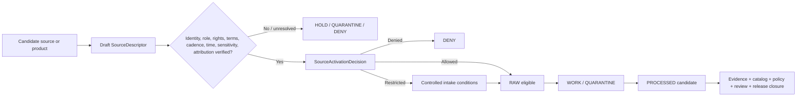
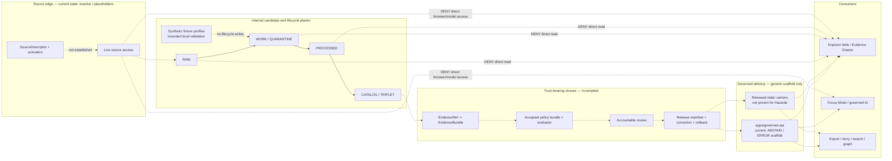
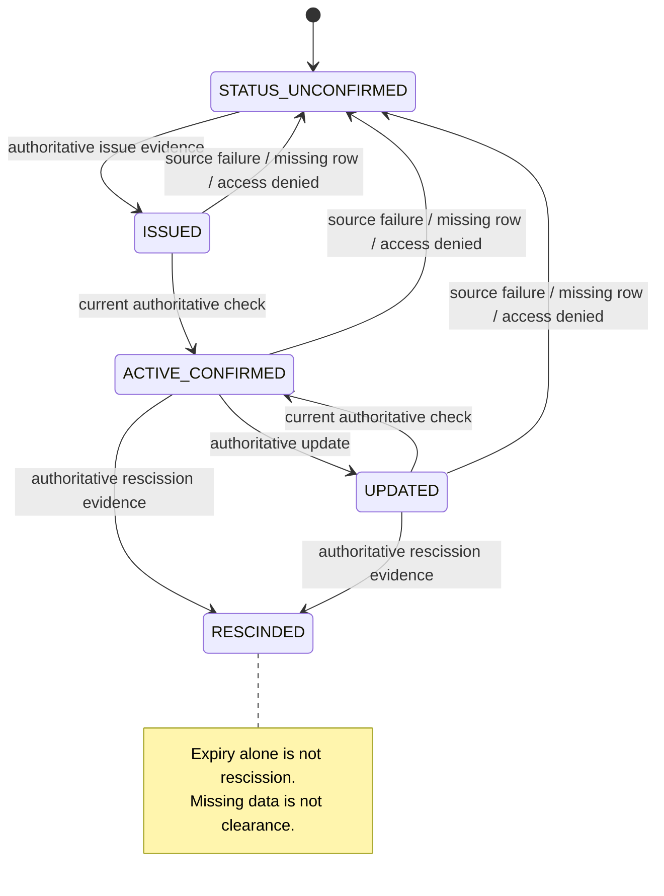

<!-- [KFM_META_BLOCK_V2]
doc_id: kfm://doc/architecture/hazards-trust-membrane
title: Hazards Trust Membrane — Current Architecture and Enforcement Boundary
type: architecture-reference
version: v2.0.0-draft
status: draft; repository-grounded; implementation-partial; source-inactive; policy-inactive; release-unproven; not-for-life-safety
owners:
  - "@bartytime4life — verified CODEOWNERS review route"
  - "Hazards, emergency-management boundary, source, evidence, policy, release, security, and independent-review stewardship NEEDS VERIFICATION"
created: 2026-05-25
updated: 2026-08-18
policy_label: public
owning_root: docs/
responsibility: Explain how the Hazards lane composes source admission, source-role preservation, temporal authority, evidence, policy, review, release, governed delivery, correction, and rollback without becoming an alert, life-safety, regulatory, health, or engineering authority.
truth_posture: cite-or-abstain
current_path: docs/architecture/hazards-trust-membrane.md
evidence_snapshot:
  repository: bartytime4life/Kansas-Frontier-Matrix
  base_ref: main
  base_commit: 109c8fd52ceaed9c6628f9364f88dc18449903e6
  prior_blob: 0d78b4fa0c080b8d7a2532c46ba46a51d9f326ed
  directory_rules_blob: fd49a0b83e55cef52c1124281f093e263526898d
  directory_rules_decision: ADR-0029 accepted
related:
  - ./README.md
  - ./TRUST_MEMBRANE.md
  - ./governed-api.md
  - ./contract-schema-policy-split.md
  - ../doctrine/directory-rules.md
  - ../adr/ADR-0029-adopt-directory-governance-standard-v2.md
  - ../domains/hazards/README.md
  - ../domains/hazards/LIFE_SAFETY_BOUNDARY.md
  - ../domains/hazards/PUBLICATION_AND_BOUNDARY.md
  - ../domains/hazards/SOURCE_ROLE_MATRIX.md
  - ../domains/hazards/DROUGHT_ANTI_COLLAPSE.md
  - ../../contracts/domains/hazards/README.md
  - ../../contracts/domains/hazards/hazards_decision_envelope.md
  - ../../contracts/domains/hazards/drinking_water_advisory.md
  - ../../contracts/domains/hazards/nfhl_nld_nid_source_role_profile.md
  - ../../schemas/contracts/v1/domains/hazards/hazards_decision_envelope.schema.json
  - ../../policy/domains/hazards/README.md
  - ../../data/registry/sources/hazards/README.md
  - ../../tools/validators/domains/hazards/
  - ../../tools/validators/hazards/
  - ../../tests/domains/hazards/
  - ../../tests/validators/domains/hazards/
notes:
  - "Same-path documentation modernization only. No contract, schema, policy, source, validator, workflow, evidence, release, runtime, deployment, or publication behavior changes."
  - "The accepted Directory Rules make docs/architecture/ the explanatory home for this existing cross-cutting page; domain meaning and the life-safety boundary remain owned by their domain/doctrine surfaces."
  - "Current repository evidence proves several deterministic, synthetic, no-network Hazards validation profiles. It does not prove an active Hazards source, policy evaluator, EvidenceBundle resolver integration, public API answer, map layer, Focus Mode answer, release, or publication."
  - "The generic HazardsDecisionEnvelope semantic contract remains draft and its paired schema is an empty permissive scaffold."
  - "KFM is never the issuer, interpreter, confirmer, rescinder, or replacement for official emergency, warning, health, engineering, or regulatory instructions."
[/KFM_META_BLOCK_V2] -->

<a id="top"></a>

# Hazards Trust Membrane — Current Architecture and Enforcement Boundary

> **Operating rule.** KFM may preserve, analyze, relate, and explain released hazard evidence and official-source context. It must never issue, interpret, confirm, clear, replace, or operationalize emergency alerts, life-safety instructions, public-health guidance, engineering safety determinations, or regulatory decisions.


| Field | Current bounded result |
|---|---|
| **Evidence snapshot** | `main@109c8fd52ceaed9c6628f9364f88dc18449903e6` |
| **Document role** | Cross-root architecture explanation under `docs/architecture/`; not doctrine, source admission, contract, schema, policy, evidence, review, release, runtime, or publication authority |
| **Directory authority** | Directory Rules v2 is adopted through [`ADR-0029`](../adr/ADR-0029-adopt-directory-governance-standard-v2.md); this existing path receives the same-path `PLACE` result |
| **Hazards semantic surface** | Substantial draft domain and contract documentation exists; authority and implementation maturity vary by object family |
| **Generic public envelope** | [`HazardsDecisionEnvelope`](../../contracts/domains/hazards/hazards_decision_envelope.md) is a draft semantic contract; its paired schema is an empty permissive scaffold |
| **Bounded executable profiles** | Deterministic, fixture-only work exists for drinking-water advisory false-clear controls, NFHL/NLD/NID source-role separation, U.S. Drought Monitor materiality, and drought-family anti-collapse |
| **Source admission** | The Hazards source registry contains an orientation README and a `PROPOSED` NOAA Storm Events placeholder; no admitted active Hazards source is proved |
| **Policy** | The repository-grounded Hazards policy README records default-only Rego scaffolds, no native Hazards Rego tests, no active bundle/evaluator binding, and no public authority |
| **Dynamic delivery** | The general Governed API is a fail-closed `ABSTAIN / ERROR` scaffold; no Hazards-specific evidence-backed `ANSWER` integration is proved |
| **Release/publication** | No active Hazards release candidate, proof payload, release binding, rollback execution, published carrier, map layer, or public parity is proved |
| **Verified GitHub review route** | `@bartytime4life` through `CODEOWNERS`; specialist and independent review assignments remain `NEEDS VERIFICATION` |
| **Publication effect of this page** | None |

> [!CAUTION]
> **Not for life safety.** Nothing in KFM—this page, a contract, schema, fixture, validator, workflow, receipt, map, model, AI response, pull request, merge, or badge—makes KFM an operational warning or emergency authority. People must use the applicable official authority and current official channel for decisions that affect life, health, property, travel, evacuation, sheltering, response, or engineering safety.

> [!IMPORTANT]
> **Current implementation is narrower than the doctrine.** The repository proves selected synthetic validation mechanics and a general fail-closed API scaffold. It does not prove live source currentness, an active Hazards policy evaluator, authoritative evidence resolution, a released public Hazards product, or a production Hazards answer.

## Quick navigation

- [1. Purpose & scope](#1-purpose--scope)
- [2. Where this note belongs](#2-where-this-note-belongs)
- [3. The headline rule — never an alert authority](#3-the-headline-rule--never-an-alert-authority)
- [4. Hazards ubiquitous language](#4-hazards-ubiquitous-language)
- [5. Source families and admission](#5-source-families-and-admission)
- [6. The trust membrane in the Hazards lane](#6-the-trust-membrane-in-the-hazards-lane)
- [7. Source-role anti-collapse in Hazards](#7-source-role-anti-collapse-in-hazards)
- [8. Stale-state and operational expiry](#8-stale-state-and-operational-expiry)
- [9. Cross-lane ownership and citation](#9-cross-lane-ownership-and-citation)
- [10. Governed AI in the Hazards lane](#10-governed-ai-in-the-hazards-lane)
- [11. Anti-patterns and DENY surfaces](#11-anti-patterns-and-deny-surfaces)
- [12. Schema, contract, and policy homes](#12-schema-contract-and-policy-homes)
- [13. Acceptance criteria](#13-acceptance-criteria)
- [14. Tensions & open questions](#14-tensions--open-questions)
- [15. Appendix — illustrative shapes](#15-appendix--illustrative-shapes)
- [16. Related docs](#16-related-docs)

---

<a id="1-purpose--scope"></a>

## 1. Purpose & scope

This page explains the Hazards specialization of KFM's system-wide trust membrane: how hazard-related source material may move from candidate discovery toward evidence-backed, policy-checked, released public context without silently acquiring stronger authority than its source, time support, evidence, review state, or release state permits.

The Hazards lane is consequential because the same visual or textual artifact can be misread in several dangerous ways:

- a regulatory map can be mistaken for an observed event;
- a detection can be mistaken for confirmation;
- a model can be mistaken for an observation;
- an aggregate can be mistaken for a precise local condition;
- an administrative declaration can be mistaken for measured impact;
- an expired warning can be mistaken for current operational guidance;
- a missing source row or failed check can be mistaken for rescission or safety;
- a map, summary, or AI answer can be mistaken for official instruction.

The trust membrane exists to prevent those authority upgrades.

### 1.1 What this page explains

- the not-for-life-safety boundary;
- the difference between source role, Hazards knowledge character, object family, currentness, and release state;
- the current source-admission, policy, validation, evidence, release, API, UI, and AI boundaries;
- the distinction between locally valid fixture profiles and operational/public authority;
- cross-lane ownership for Hydrology, Atmosphere/Air, Infrastructure, Transportation, Agriculture, Soil, Habitat, and other neighboring contexts;
- the correction, withdrawal, stale-state, and rollback obligations for public Hazards derivatives;
- the evidence required before any Hazards surface may graduate beyond fixture-only work.

### 1.2 Non-effects

This page does **not**:

- activate, access, poll, admit, or authenticate any external source;
- establish current weather, warning, fire, smoke, flood, earthquake, drought, drinking-water, infrastructure, or emergency-management conditions;
- create or change a Hazards contract, schema, source descriptor, policy rule, validator, fixture, test, workflow, evidence bundle, release manifest, rollback card, API route, map layer, export, search projection, or AI behavior;
- accept a Hazards policy bundle or make an existing Rego scaffold operative;
- convert a validator `PASS` into an `ANSWER`, policy decision, review approval, release decision, or public-use permission;
- authorize direct source access from a browser or model runtime;
- provide health, legal, insurance, engineering, emergency, evacuation, travel, shelter, rescue, treatment, or regulatory advice;
- release, deploy, promote, or publish anything.

[Back to top](#top)

---

<a id="2-where-this-note-belongs"></a>

## 2. Where this note belongs

### 2.1 Responsibility signature

| Axis | Classification |
|---|---|
| `artifact_kind` | Human architecture reference |
| `authority_owner` | `docs/` explanatory architecture |
| `lifecycle_stage` | Not applicable |
| `execution_role` | None |
| `scope_kind` | Hazards specialization of a cross-domain trust boundary |
| `exposure` | Public documentation; no operational payloads or protected coordinates |
| `mutability` | Versioned replacement at an existing tracked path |
| `retention` | Durable documentation history |
| `placement_outcome` | `PLACE` at `docs/architecture/hazards-trust-membrane.md` |
| `authority_not_held` | Hazards doctrine, source admission, object meaning, machine shape, policy, evidence, review, release, runtime, deployment, or public truth |

Accepted [`ADR-0029`](../adr/ADR-0029-adopt-directory-governance-standard-v2.md) makes [`docs/doctrine/directory-rules.md`](../doctrine/directory-rules.md) the placement authority. This page already exists in the cross-cutting explanatory architecture root and is being modernized in place. It creates no root, domain, object family, policy family, source registry, or public product.

### 2.2 Authority split

| Question | Owning surface |
|---|---|
| What is the system-wide trust membrane? | [`TRUST_MEMBRANE.md`](./TRUST_MEMBRANE.md) and trust-membrane doctrine |
| What does the Hazards lane mean and what is its life-safety boundary? | [`docs/domains/hazards/`](../domains/hazards/README.md), especially [`LIFE_SAFETY_BOUNDARY.md`](../domains/hazards/LIFE_SAFETY_BOUNDARY.md) and [`PUBLICATION_AND_BOUNDARY.md`](../domains/hazards/PUBLICATION_AND_BOUNDARY.md) |
| What does a Hazards object mean? | [`contracts/domains/hazards/`](../../contracts/domains/hazards/README.md) |
| What fields and constraints are machine-checkable? | [`schemas/contracts/v1/domains/hazards/`](../../schemas/contracts/v1/domains/hazards/README.md) |
| May a Hazards operation proceed? | [`policy/domains/hazards/`](../../policy/domains/hazards/README.md) after an accepted bundle/evaluator binding exists |
| What proves bounded behavior? | Hazards fixtures, tests, validators, and exact workflow runs |
| What admits a source? | The accepted source registry, descriptor, and activation-decision authorities |
| What makes a public Hazards product released? | Evidence/proof closure, review, policy, release records, correction support, and rollback support |
| What serves a public response? | Governed API and released public-safe carriers |
| What this page owns | The human-readable map of how those responsibilities compose |

> [!NOTE]
> Domain documents and earlier plans contain stale or proposed path and implementation claims. Current repository evidence wins for current behavior; accepted doctrine and ADRs remain controlling for authority.

### 2.3 Review standing

[`.github/CODEOWNERS`](../../.github/CODEOWNERS) verifies `@bartytime4life` as the repository review route. It explicitly does not prove Hazards expertise, emergency-management authority, source stewardship, policy approval, release authority, or independent review. Those assignments remain `NEEDS VERIFICATION`.

[Back to top](#top)

---

<a id="3-the-headline-rule--never-an-alert-authority"></a>

## 3. The headline rule — never an alert authority

KFM Hazards may carry **released context about an official product**. It may not become the issuer, interpreter, confirmer, rescinder, or operational relay for that product.

### 3.1 The permanent boundary

KFM must not:

- issue a warning, watch, advisory, evacuation, shelter, rescue, routing, closure, treatment, or response instruction;
- tell a user that a place, route, structure, water system, community, or person is safe or unsafe for operational action;
- confirm that an official warning is current without a released, current, authority-bound product and an explicit safe use approved by policy;
- infer that a warning or advisory ended because a row disappeared, a fetch failed, a page changed, a timestamp elapsed, or a model stopped showing a condition;
- reinterpret regulatory or administrative source language as KFM guidance;
- make an engineering condition, structural fitness, legal, insurance, health, or regulatory determination;
- use AI to paraphrase an official instruction into new operational guidance;
- let a map color, popup, animation, badge, notification, or layer visibility imply official action.

The domain documents describe KFM-as-alert-authority as permanently denied. Current executable Hazards policy does **not** yet prove that denial through an active evaluator; therefore all integration remains fail-closed.

### 3.2 What KFM may eventually do after governed release

A released Hazards surface may:

- state that a named official source issued or recorded a named product;
- show the product's released spatial and temporal support at an approved precision;
- distinguish issue, valid, expiry, retrieval, release, correction, and withdrawal times;
- identify the source role and object family;
- display a visible not-for-life-safety disclaimer;
- direct the user to a released official-source reference;
- explain what KFM withheld, generalized, or could not verify;
- provide historical, research, planning, resilience, or evidentiary context;
- return `ABSTAIN`, `DENY`, or `ERROR` when current support is insufficient.

A referral is a pointer to the owning authority. It is not KFM's restatement, interpretation, or endorsement of operational instructions.

### 3.3 Validator and workflow non-effects

A Hazards validator `PASS` may establish only the local property named by its profile. It does not establish:

- current real-world status;
- live source access or source admission;
- evidence resolution;
- policy approval;
- review approval;
- release readiness;
- public safety;
- alert authority;
- a public API answer;
- deployment or publication.

[Back to top](#top)

---

<a id="4-hazards-ubiquitous-language"></a>

## 4. Hazards ubiquitous language

Trust depends on keeping several independent axes visible.

### 4.1 Source role

Current Hazards documentation converges on seven semantic source roles. Individual profiles may use schema-specific casing or constants, but they must map without changing meaning.

| Semantic role | What it may support | What it must not become |
|---|---|---|
| `observed` | A method- and time-bounded observation, detection, or measured event record | Universal truth, safety determination, forecast, or legal status |
| `regulatory` | A designation or boundary with stated jurisdiction, version, and effect | Observed event, current condition, or engineering conclusion |
| `modeled` | A forecast, classification, scenario, susceptibility, trajectory, risk, or analytical derivative | Observation or official current condition |
| `aggregate` | A summary over a declared population, area, interval, or category | Parcel-, person-, facility-, or point-specific truth |
| `administrative` | A declaration, notice, roster, grant, action, program, or accounting record | Measured impact or physical condition without separate evidence |
| `candidate` | An unresolved report, detection, intake record, or pre-authority object | Public truth or release-ready evidence |
| `synthetic` | Fixture, reconstruction, simulation, generated example, or test data | Observed reality or official event status |

### 4.2 Knowledge character is separate

Hazards-specific knowledge character describes **what kind of Hazards object or claim** is being carried. It is not a substitute for source role.

Examples include:

- historical event record;
- operational warning or advisory context;
- regulatory flood-hazard baseline;
- remote-sensing detection;
- drought classification or materiality assessment;
- administrative declaration;
- modeled smoke, exposure, or risk context;
- infrastructure inventory reference;
- drinking-water advisory profile;
- synthetic validation case.

A `regulatory flood-hazard baseline` can have the source role `regulatory`. A `remote-sensing detection` may be `observed` or `candidate` depending on the admitted product and review state. A `drought classification` may be `modeled` or `aggregate`. The labels answer different questions and must not be fused.

### 4.3 Object family, claim, and status remain separate

At minimum, reviewers must distinguish:

1. **Source identity and role** — who produced the material and what class of support it can provide.
2. **Object family** — event, observation, warning context, advisory context, regulatory context, detection, declaration, indicator, exposure summary, or another accepted family.
3. **Claim type** — occurrence, currentness, condition, designation, impact, relation, trend, cause, or operational instruction.
4. **Temporal posture** — observed, issued, valid, expired, superseded, retrieved, released, corrected, or withdrawn.
5. **Evidence posture** — unresolved reference, resolved bundle, conflict, stale support, or no support.
6. **Policy/review posture** — allowed, abstained, denied, held, or failed evaluation.
7. **Release posture** — candidate, released, corrected, withdrawn, or rolled back.
8. **Public representation** — exact, generalized, aggregated, redacted, delayed, or denied.

No single status field may safely stand in for all eight.

[Back to top](#top)

---

<a id="5-source-families-and-admission"></a>

## 5. Source families and admission

### 5.1 Current repository state

The current subtype-first Hazards source registry contains:

- [`README.md`](../../data/registry/sources/hazards/README.md), an experimental orientation and admission-control boundary; and
- [`noaa.storm_events.yaml`](../../data/registry/sources/hazards/noaa.storm_events.yaml), a `PROPOSED` placeholder containing no operational descriptor fields.

Domain-first registry material also exists elsewhere under `data/registry/hazards/`. That topology is `CONFLICTED / NEEDS VERIFICATION`. This page does not choose a winner, create an alias, or authorize migration.

No current repository evidence inspected for this page proves an admitted, active, rights-cleared, current Hazards source or a live connector-to-public path.

### 5.2 Candidate source families

The repository discusses these families as candidates or context. Their current endpoints, product versions, terms, rights, cadence, attribution, authority scope, and activation state must be verified independently before use.

| Candidate family | Typical Hazards use | Mandatory anti-collapse boundary |
|---|---|---|
| Historical storm or event archives | Historical event/observation context | Narrative or administrative records do not automatically prove every physical impact |
| Operational warnings, watches, and advisories | Time-bounded official-source context | Never KFM-issued guidance; issue/expiry/currentness and official referral required |
| Disaster declarations and emergency-management records | Administrative or regulatory context | Declaration is not measured damage, exposure, or current condition |
| Regulatory flood-hazard mapping | Regulatory context | Regulatory baseline is not observed inundation, current flood, or forecast |
| Earthquake observations | Event/observation context | Preserve magnitude type, revision, location uncertainty, and source time |
| Fire and smoke detections or models | Detection/model context | Detection is not perimeter or legal fire status; model is not observation |
| Drought classifications and indicators | Classification/aggregate/model context | Classification is not precipitation, groundwater, reservoir, crop impact, or legal declaration |
| Levee, dam, and infrastructure inventories | Public-safe inventory context | Inventory is not operational condition, protection level, failure probability, or engineering safety |
| Drinking-water advisories | Volatile advisory context | Missing data or expiry is not rescission; service area is not automatically a municipal boundary |
| State, local, tribal, or regional resilience material | Administrative/model/aggregate planning context | Planning material is not current event or emergency instruction |

### 5.3 Required admission path


```mermaid
flowchart LR
  C["Candidate source or product"] --> D["Draft SourceDescriptor"]
  D --> V{"Identity, role, rights, terms, cadence, time, sensitivity, attribution verified?"}
  V -->|"No / unresolved"| H["HOLD / QUARANTINE / DENY"]
  V -->|"Yes"| A["SourceActivationDecision"]
  A -->|"Denied"| X["DENY"]
  A -->|"Restricted"| R["Controlled intake conditions"]
  A -->|"Allowed"| RAW["RAW eligible"]
  R --> RAW
  RAW --> WQ["WORK / QUARANTINE"]
  WQ --> P["PROCESSED candidate"]
  P --> CLOSURE["Evidence + catalog + policy + review + release closure"]
```

The diagram is a governed requirement, not a claim that the flow is operational.

### 5.4 Source-edge requirements

Before any real Hazards payload enters RAW, the admitted source profile must define:

- source-native identity and stable product identity;
- issuer and authority scope;
- source role and Hazards knowledge character;
- current endpoint/product and access method;
- rights, terms, redistribution, attribution, and retention posture;
- source time, update/publication time, retrieval time, valid interval, expiry rules, and revision behavior;
- spatial support, geometry role, precision, and sensitive attributes;
- missing-row, access-denied, malformed, rate-limited, not-modified, and source-conflict semantics;
- correction, withdrawal, supersession, and replay behavior;
- credential, network, cache, and logging posture;
- source activation state and reviewer authority;
- no direct public or model-runtime access.

[Back to top](#top)

---

<a id="6-the-trust-membrane-in-the-hazards-lane"></a>

## 6. The trust membrane in the Hazards lane

The Hazards membrane is not one endpoint or disclaimer. It is the composition of source admission, lifecycle separation, source-role preservation, temporal authority, evidence resolution, policy, review, release, governed delivery, and correction.


```mermaid
flowchart LR
  subgraph EDGE["Source edge — current state: inactive / placeholders"]
    SD["SourceDescriptor + activation"]
    LIVE["Live source access"]
    SD -. "not established" .-> LIVE
  end

  subgraph INTERNAL["Internal candidate and lifecycle planes"]
    RAW["RAW"]
    WQ["WORK / QUARANTINE"]
    PROC["PROCESSED"]
    CAT["CATALOG / TRIPLET"]
    FIX["Synthetic fixture profiles\nbounded local validation"]
    LIVE -.-> RAW
    RAW --> WQ --> PROC --> CAT
    FIX -. "no lifecycle writes" .-> WQ
  end

  subgraph TRUST["Trust-bearing closure — incomplete"]
    EVD["EvidenceRef -> EvidenceBundle"]
    POL["Accepted policy bundle + evaluator"]
    REV["Accountable review"]
    REL["Release manifest + correction + rollback"]
    CAT -.-> EVD
    EVD -.-> POL
    POL -.-> REV
    REV -.-> REL
  end

  subgraph DELIVERY["Governed delivery — generic scaffold only"]
    API["apps/governed-api\ncurrent: ABSTAIN / ERROR scaffold"]
    STATIC["Released static carriers\nnot proven for Hazards"]
    REL -.-> API
    REL -.-> STATIC
  end

  subgraph CLIENTS["Consumers"]
    WEB["Explorer Web / Evidence Drawer"]
    AI["Focus Mode / governed AI"]
    EXPORT["Export / story / search / graph"]
    API -.-> WEB
    API -.-> AI
    API -.-> EXPORT
    STATIC -.-> WEB
    STATIC -.-> EXPORT
  end

  RAW -. "DENY direct read" .-> WEB
  WQ -. "DENY direct read" .-> WEB
  PROC -. "DENY direct read" .-> WEB
  LIVE -. "DENY direct browser/model access" .-> WEB
  LIVE -. "DENY direct browser/model access" .-> AI
```

Dashed arrows identify required or possible future integration. They are **not** implementation claims.

### 6.1 Two separate governed transitions

#### Transition A — promotion into released state

A Hazards candidate may move from cataloged internal state to released state only after the applicable identity, evidence, source-role, time, rights, sensitivity, policy, review, integrity, correction, and rollback requirements close.

#### Transition B — exposure to a consumer

A released artifact may reach a public or role-gated consumer only through a governed projection that enforces audience, precision, currentness, correction, and denial obligations. Release does not automatically authorize every audience, field, geometry, export, query, or AI use.

### 6.2 Hazards-specific membrane gates

| Gate | Required question | Fail-closed result |
|---|---|---|
| **Alert-authority gate** | Could the output be interpreted as KFM emergency or life-safety guidance? | `DENY` |
| **Source-role gate** | Does every claim remain inside the admitted source role and object family? | `DENY` or `ABSTAIN` |
| **Temporal-authority gate** | Are issue, valid, expiry, source, retrieval, release, correction, and withdrawal states sufficient for the requested use? | `ABSTAIN`, `DENY`, or `HOLD` |
| **False-clear gate** | Does absence, failure, expiry, or stale state incorrectly clear a prior condition or advisory? | `DENY` |
| **Evidence gate** | Can the consequential claim resolve to admissible evidence? | `ABSTAIN` |
| **Policy/review gate** | Is an accepted rule set evaluated and are required reviewers accountable? | `DENY`, `ABSTAIN`, or `HOLD` |
| **Precision/sensitivity gate** | Would the representation expose restricted infrastructure, private, cultural, or harmful precision? | Redact/generalize before delivery or `DENY` |
| **Release gate** | Is there an applicable release decision, correction path, and rollback target? | `HOLD` / no public crossing |
| **Consumer gate** | Does the API/UI/AI/export enforce every obligation and avoid internal-store access? | `DENY` or `ERROR` |

### 6.3 Current proven implementation slices

The repository currently proves only bounded local mechanics:

| Profile | Proven local behavior | Explicit non-effect |
|---|---|---|
| [`DrinkingWaterAdvisory`](../../contracts/domains/hazards/drinking_water_advisory.md) | Closed fixture profile separates system identity, issue/rescission authority, service-area scope, source failures, and false-clear semantics | No live source, health determination, alert, public guidance, lifecycle write, release, or publication |
| [`NFHL/NLD/NID Source-Role Profile`](../../contracts/domains/hazards/nfhl_nld_nid_source_role_profile.md) | Closed fixture profile separates regulatory flood baseline and infrastructure inventory from observed flooding and engineering condition; requires public-safe projections | No source admission, current condition, engineering safety, evidence bundle, policy, release, map, or public product |
| [`USDM materiality validator`](../../tools/validators/domains/hazards/validate_usdm_materiality.py) | Deterministically classifies synthetic weekly snapshot change as unchanged, semantic non-event, material promotion candidate, or undetermined hold | A materiality result is not drought truth, impact evidence, policy, promotion, release, or publication |
| [`drought-family validator`](../../tools/validators/hazards/validate_drought_families.py) | Preserves drought observation and declaration family separation in a split validator home | Does not activate a source or make public drought claims |

These profiles are valuable because they prove denial and abstention behavior. They are not a shortcut around the remaining membrane.

[Back to top](#top)

---

<a id="7-source-role-anti-collapse-in-hazards"></a>

## 7. Source-role anti-collapse in Hazards

### 7.1 Denied authority upgrades

| Input or relation | Unsafe upgrade | Required posture |
|---|---|---|
| Regulatory flood-hazard geometry | “Observed flooding exists here now” | `DENY`; regulatory context remains regulatory |
| Levee or dam inventory record | “This structure is safe, unsafe, protecting, failing, or operational” | `DENY`; inventory is not condition or engineering assessment |
| Sensor or remote-sensing detection | “A confirmed event/perimeter exists” | `ABSTAIN` or `DENY` without accepted corroboration and semantics |
| Model or forecast | “This was observed” | `DENY`; preserve model identity, run, uncertainty, and valid interval |
| Aggregate drought or exposure summary | “This parcel, facility, person, or precise location has this condition” | `DENY`; preserve aggregation support |
| Disaster declaration | “Measured damage or current physical condition is established” | `DENY` without separate evidence |
| Operational warning/advisory context | “KFM instructs the user to act” | `DENY`; context plus official referral only |
| Candidate report or connector output | “Published Hazards fact” | `DENY`; remain in WORK/QUARANTINE |
| Synthetic fixture or generated text | “Observed real-world status” | `DENY` |
| Spatial co-location | “Causation, protection, impact, or operational dependency” | `ABSTAIN` until relation semantics and evidence close |
| Validator `PASS` | “Policy/release/public use allowed” | `DENY` the escalation |
| Map styling or hidden field | “Sensitive geometry was transformed” | `DENY`; style is not redaction/generalization |

### 7.2 Current negative-proof examples

The NFHL/NLD/NID tests prove that:

- NFHL cannot be relabeled as observed flood truth;
- NLD cannot be relabeled as current operational condition;
- exact operational detail is denied;
- missing generalization support is denied;
- unavailable source support returns `ABSTAIN` instead of fabricated zero/safety;
- identity, time, relation order, and source-native identity conflicts fail closed;
- validation is no-network and diagnostics do not echo test values.

The drinking-water advisory tests prove that:

- source failures remain `STATUS_UNCONFIRMED`;
- only a complete, authoritative rescission can clear a prior advisory;
- municipal or administrative context cannot masquerade as service area;
- expiry does not constitute rescission;
- every valid fixture keeps public use, alerts, release, and all authority effects false;
- unsafe JSON, duplicate keys, non-finite numbers, and symbolic links return `ERROR`.

The U.S. Drought Monitor materiality tests prove that:

- weekly classification change can be categorized deterministically;
- geometry-only change returns `HOLD`;
- severe-category appearance can trigger a material candidate;
- legal/administrative declaration fields are not admitted into the classification snapshot;
- `PROMOTION_CANDIDATE` is a workflow label, not promotion authority.

### 7.3 Endpoint evidence is not relation evidence

A cross-lane Hazards derivative needs:

1. valid endpoint identity;
2. valid endpoint source-role and temporal support;
3. evidence for each endpoint claim;
4. a named relationship meaning;
5. evidence supporting that relationship;
6. policy for the composition;
7. review of sensitivity and consequence;
8. release/correction/rollback closure.

Co-location, shared geography, matching dates, or a common identifier may identify a **candidate relation**. They do not establish cause, impact, protection, exposure, safety, or official status.

[Back to top](#top)

---

<a id="8-stale-state-and-operational-expiry"></a>

## 8. Stale-state and operational expiry

Hazards currentness is multidimensional. A single `updated_at` field is not enough.

### 8.1 Time kinds that may matter

| Time kind | Meaning |
|---|---|
| `event_time` / `observed_at` | When the physical event or observation occurred |
| `issued_at` | When an authority issued a product |
| `valid_from` / `valid_until` / `expires_at` | The product's declared validity |
| `source_updated_at` | When the source changed the record/product |
| `retrieved_at` | When KFM obtained or checked the source |
| `classified_at` / `model_run_at` | When a classification/model was produced |
| `released_at` | When a governed KFM derivative entered released state |
| `corrected_at` / `withdrawn_at` | When a correction or withdrawal became effective |
| `superseded_at` | When a newer source or KFM object replaced the prior one |

A response must use the time kinds appropriate to its claim. Retrieval time cannot substitute for issue time, and release time cannot make stale source support current.

### 8.2 False-clear rules

The following are not authoritative clearance, rescission, or safety evidence:

- source returned `NOT_FOUND`;
- access was denied;
- a request was rate limited;
- parsing failed;
- a status check failed;
- a complete-snapshot row disappeared;
- a page or endpoint changed shape;
- a warning expired;
- a model stopped displaying a condition;
- a connector stopped running;
- the last KFM release aged past its freshness target.

The safe result is `STATUS_UNCONFIRMED`, `STALE`, `ABSTAIN`, `DENY`, `HOLD`, or `ERROR` as defined by the applicable contract and policy—not an inferred clear.

### 8.3 Expiry and rescission are separate

An expiry can end the declared valid interval of one product. It does not necessarily prove that:

- the underlying condition ended;
- the issuing authority rescinded or cleared an advisory;
- a successor product does not exist;
- KFM has current source access;
- the last public derivative should remain visible;
- a user can safely act.

The drinking-water fixture profile implements this distinction locally. It does not establish how every future warning family handles expiry and rescission.

### 8.4 Correction and stale propagation

A public Hazards architecture must eventually prove that a correction, withdrawal, supersession, or stale-state transition propagates to:

- EvidenceBundle and citations;
- catalog and graph projections;
- release manifests;
- API responses;
- map layers and tile/cache state;
- Evidence Drawer;
- search and exports;
- stories and screenshots where traceability is available;
- governed-AI retrieval and answer eligibility;
- rollback targets and prior release lineage.

Silent regeneration is not correction.

[Back to top](#top)

---

<a id="9-cross-lane-ownership-and-citation"></a>

## 9. Cross-lane ownership and citation

Hazards is a context and consequence lane. It must not absorb the canonical truth owned by neighboring domains.

| Neighboring lane | Owns | Hazards may do | Hazards must not do |
|---|---|---|---|
| Hydrology | Water observations, gauges, waterbody/reach identity, hydrologic topology, and accepted water-domain semantics | Cite released water context for flood/drought analysis | Rewrite gauge truth, water identity, or hydrologic semantics |
| Atmosphere/Air | Weather, air-quality, smoke, forecast, and atmospheric observation/model semantics | Cite released weather/smoke context | Relabel atmospheric model/observation as Hazards-owned truth |
| Settlements/Infrastructure | Asset identity, facilities, dependencies, and condition records | Build public-safe exposure summaries after composition review | Publish restricted details or infer condition/safety |
| Roads/Rail/Trade | Network identity, route status, closures, detours, crossings | Cite released transportation context | Issue routing or travel-safety instructions |
| Agriculture | Crop, field, livestock, irrigation, and agricultural impact semantics | Relate released impact context | Infer loss or operational advice from a hazard layer alone |
| Soil | Soil properties and moisture support | Cite released soil context for drought/flood analysis | Turn soil indicators into hazard occurrence without relation evidence |
| Habitat/Fauna/Flora | Ecological identity, observations, sensitivity, and habitat context | Relate released ecological impact context | Expose protected locations or claim causal impact without evidence |
| Geology | Geologic units, seismic/geotechnical context, subsurface references | Cite released geology context | Make engineering/site-safety determinations |
| People/Land | Living-person, parcel, title, ownership, and private-land assertions | Use only approved public-safe aggregate context | Expose or infer living-person/private-property detail |
| Archaeology/Cultural heritage | Cultural authority, sensitivity, and precise-location controls | Use only steward-approved generalized context | Reveal or infer protected locations |

### 9.1 Cross-lane candidate rule

A Hazards join or graph edge is downstream of both domains. It must preserve:

- each endpoint's owning domain;
- source descriptor and source role;
- spatial and temporal support;
- evidence references;
- sensitivity and rights posture;
- public-safe geometry;
- relation meaning and relation evidence;
- correction dependencies;
- release identity.

The composition inherits the strictest applicable posture and may become **more restrictive** because the combination reveals information that neither endpoint exposes alone.

### 9.2 NFHL and infrastructure tension

Current repository work places an NFHL/NLD/NID source-role profile under Hazards to prove anti-collapse mechanics. Domain documentation also assigns canonical water and infrastructure truth to Hydrology and Settlements/Infrastructure. This is not permission for Hazards to own those sources universally. The accepted ownership and cross-lane relation semantics remain `NEEDS VERIFICATION`.

[Back to top](#top)

---

<a id="10-governed-ai-in-the-hazards-lane"></a>

## 10. Governed AI in the Hazards lane

No current repository evidence inspected for this page proves a live Hazards Focus Mode, a Hazards-specific model adapter, or an evidence-backed Hazards `ANSWER`.

### 10.1 Required order

A future Hazards-capable AI path must:

```text
define the exact question and audience
  -> resolve released public-safe candidate records
  -> resolve EvidenceRef to EvidenceBundle
  -> verify source role and object family
  -> verify temporal support and stale/expiry state
  -> evaluate policy and sensitivity
  -> verify release/correction state
  -> generate a bounded explanation or finite negative outcome
  -> validate citations and record the effective model/prompt/receipt posture
```

Generated language never substitutes for a missing stage.

### 10.2 Finite outcomes

| Outcome | Hazards meaning |
|---|---|
| `ANSWER` | A bounded, non-operational explanation is supported by released evidence, policy allows it, source role and time are explicit, and required official-source referral/disclaimer obligations are present |
| `ABSTAIN` | Evidence, source role, relation support, currentness, scope, or citation support is insufficient |
| `DENY` | The request seeks life-safety instructions, current operational authority, restricted detail, unsafe precision, unreleased data, direct source access, or another prohibited use |
| `ERROR` | Evidence resolver, policy evaluator, release lookup, validator, model adapter, or runtime dependency failed; never fall back to an ungoverned answer |

### 10.3 Denied AI behavior

Governed AI must not:

- answer “what should I do right now?” from KFM Hazards data;
- summarize current warnings from direct source endpoints;
- infer that an advisory has ended;
- convert map pixels, colors, feature visibility, or model output into evidence;
- expose hidden fields, precise infrastructure, private locations, or policy denial reasons that are themselves restricted;
- use an AI-generated citation or paraphrase as evidence;
- present synthetic fixtures as real Kansas events;
- propose map actions that bypass the Governed API or released carriers;
- generate evacuation, sheltering, routing, treatment, structural, water-use, or emergency instructions.

The safe response may explain KFM's boundary and point to a released official-source reference when one is available. Exact UI copy and runtime binding remain `PROPOSED`.

[Back to top](#top)

---

<a id="11-anti-patterns-and-deny-surfaces"></a>

## 11. Anti-patterns and DENY surfaces

| Anti-pattern | Why it violates the membrane | Required result |
|---|---|---|
| Browser or model fetches an operational source directly | Bypasses source admission, evidence, policy, release, correction, and audit | `DENY` |
| Current warning copied into UI from connector output | Candidate/source state becomes public authority | `DENY` |
| Missing row clears prior advisory | False-clear risk | `DENY` |
| Expiry is treated as rescission | Temporal-authority collapse | `DENY` |
| Regulatory polygon rendered as observed inundation | Source-role collapse | `DENY` |
| Inventory point/line used as structural-condition evidence | Engineering-authority overreach | `DENY` |
| Detection presented as confirmed event/perimeter | Evidence and object-family overclaim | `DENY` or `ABSTAIN` |
| Model presented as observation | Source-role collapse | `DENY` |
| Aggregate presented as precise place/person/facility truth | Spatial-support collapse | `DENY` |
| Administrative declaration presented as measured impact | Claim-type collapse | `DENY` |
| Candidate/synthetic fixture enters public map/search/AI | Lifecycle and reality-boundary violation | `DENY` |
| Validator `PASS` treated as policy allow | Validator is not policy authority | `DENY` escalation |
| Policy scaffold filename treated as active enforcement | File presence does not prove operative rule/evaluator binding | `HOLD` |
| Generic Hazards envelope schema treated as enforced DTO | Paired schema is empty and permissive | `ERROR`, `ABSTAIN`, or block graduation |
| Style filter hides sensitive geometry | Hiding is not transformation; data can leak through queries/tiles/exports | Transform before delivery or `DENY` |
| Co-location interpreted as causation/impact/protection | Relation evidence missing | `ABSTAIN` |
| Map badge or animation implies urgency or official action | UI becomes an ungoverned alert surface | `DENY` |
| AI restates official instructions | KFM becomes a derivative operational authority | `DENY` |
| Release record missing correction/rollback path | Public state cannot be safely corrected | `HOLD` |
| Current source rights/terms assumed from old docs | Source admission unsupported | `HOLD` / `NEEDS VERIFICATION` |
| Hazards absorbs Hydrology/Air/Infrastructure truth | Domain authority collapse | `DENY` or split relation |
| Direct write from watcher/CI into PUBLISHED | Watcher becomes publisher | `DENY` |
| Documentation says “implemented” without code/test/runtime evidence | Persuasive overclaim | Correct claim or `UNKNOWN` |

[Back to top](#top)

---

<a id="12-schema-contract-and-policy-homes"></a>

## 12. Schema, contract, and policy homes

### 12.1 Current responsibility map

| Responsibility | Current surface | Current bounded posture |
|---|---|---|
| Cross-cutting Hazards trust explanation | This page | Repository-grounded architecture documentation |
| Hazards domain boundary | [`docs/domains/hazards/`](../domains/hazards/README.md) | Extensive draft doctrine/architecture; some current-state inventories are stale |
| Semantic meaning | [`contracts/domains/hazards/`](../../contracts/domains/hazards/README.md) | Mix of expanded contracts and scaffolds |
| Generic feature/detail envelope meaning | [`hazards_decision_envelope.md`](../../contracts/domains/hazards/hazards_decision_envelope.md) | Draft semantic contract |
| Generic feature/detail envelope shape | [`hazards_decision_envelope.schema.json`](../../schemas/contracts/v1/domains/hazards/hazards_decision_envelope.schema.json) | `PROPOSED`, empty `properties`, no required fields, `additionalProperties: true` |
| Drinking-water advisory profile | Contract, closed schema, fixtures, validator, tests, and workflow | Substantive, synthetic, inactive, no-network, no public authority |
| NFHL/NLD/NID source-role profile | Contract, closed schema, fixtures, validator, tests, and workflow | Substantive, synthetic, inactive, no-network, no source/release authority |
| U.S. Drought Monitor materiality | Fixtures, validator, tests, workflow/Make target | Substantive comparison profile; not source admission or promotion |
| Drought family separation | Contracts/schemas plus [`tools/validators/hazards/`](../../tools/validators/hazards/README.md) | Substantive validator in a split/legacy validator home |
| Hazards policy source | [`policy/domains/hazards/`](../../policy/domains/hazards/README.md) | Canonical placement; default-only/inactive rule sources, no active evaluator binding |
| Hazards source registry | [`data/registry/sources/hazards/`](../../data/registry/sources/hazards/README.md) | Orientation README plus a `PROPOSED` NOAA placeholder; topology conflict remains |
| Evidence/proof support | [`data/proofs/hazards/`](../../data/proofs/hazards/README.md) and evidence authorities | No active Hazards proof payload/public evidence path proved |
| Release candidates | [`release/candidates/hazards/`](../../release/candidates/hazards/README.md) | Holds/placeholders; no active public release proved |
| Dynamic public boundary | [`apps/governed-api/`](../../apps/governed-api/README.md) | General `ABSTAIN / ERROR` scaffold; no Hazards `ANSWER` integration proved |
| Public client | Explorer Web and governed adapter surfaces | No live Hazards public layer/answer proved |

### 12.2 Validator maturity is mixed

At the evidence snapshot:

- `tools/validators/domains/hazards/` contains substantive validators for drinking-water advisory, NFHL/NLD/NID source-role, and USDM materiality;
- the same directory still contains `NotImplementedError` placeholders for catalog matrix, evidence bundle, schema, and source descriptor validation;
- `tools/validators/hazards/` contains a substantive drought-family validator and represents a split validator home;
- tests exist in both `tests/domains/hazards/` and `tests/validators/domains/hazards/`;
- workflow presence proves orchestration bytes exist, not that every required check is passing, required by branch protection, or deployed.

This page records the split; it does not migrate or normalize it.

### 12.3 Policy maturity is inactive

The repository-grounded Hazards policy README records:

- seven proposed default-only Rego files;
- no operative Hazards rule bodies;
- no native Hazards Rego tests;
- conflicting local `allow := false` and `deny := false` default styles;
- no accepted immutable Hazards bundle;
- no bound evaluator or authenticated decision emitter;
- no governed consumer enforcement or public behavior.

Therefore no documentation may claim a Hazards policy `ALLOW`, active deny gate, or released policy decision.

### 12.4 Generic envelope maturity is insufficient for public integration

The semantic contract describes intended fields and finite outcomes, but the paired JSON Schema does not enforce them. A public Hazards endpoint must not graduate by citing the Markdown contract alone. Fielded schema, valid/invalid fixtures, validators, policy binding, compatibility tests, and consumer tests are still required.

[Back to top](#top)

---

<a id="13-acceptance-criteria"></a>

## 13. Acceptance criteria

### 13.1 Acceptance for this documentation change

This same-path modernization is complete only when:

- the file remains at `docs/architecture/hazards-trust-membrane.md`;
- the original 16 section/appendix anchors remain resolvable;
- the accepted Directory Rules and current repository evidence replace obsolete no-repo claims;
- the not-for-life-safety boundary remains explicit and stronger than presentation goals;
- current bounded validators are distinguished from inactive source, policy, evidence, release, API, and publication state;
- no live source, current hazard, current warning, public answer, release, deployment, or publication is implied;
- all added repository-relative links resolve at the pinned base;
- Markdown, Mermaid, HTML comments, tables, and details blocks are structurally balanced;
- rollback is one-file revert.

### 13.2 Current bounded-profile evidence

| Profile | Current deterministic evidence | What it does not prove |
|---|---|---|
| Drinking-water advisory | Test matrix: `5 PASS`, `12 DENY`, `1 ERROR`; source failures remain unconfirmed; authoritative rescission only; no-network/import guard; all public/release effects false | Current advisory, health guidance, source admission, evidence, policy, release, or public use |
| NFHL/NLD/NID | Test matrix: `2 PASS`, `2 ABSTAIN`, `10 DENY`, `0 ERROR`; closed schema; source-role, precision, time, identity, relation, no-network, and non-echo checks | Current flooding, structure condition, engineering safety, source admission, or public layer |
| USDM materiality | Four valid states: unchanged/non-event, semantic non-material/non-event, material/promotion candidate, geometry-only/hold; exact invalid finding checks | Drought condition truth, impact, declaration, promotion approval, or publication |
| Drought families | Separate observation and declaration families with anti-collapse validation | Live source, complete domain policy, evidence resolution, or release |

### 13.3 Required closure before the first public Hazards `ANSWER`

A future public Hazards `ANSWER` requires, at minimum:

1. one product-specific, rights-reviewed, active source descriptor;
2. immutable or reproducible source capture with revision/correction semantics;
3. accepted semantic contract and closed machine schema for the specific object/profile;
4. deterministic positive, abstain, deny, stale, false-clear, sensitive, and error fixtures;
5. validator and policy tests with finite outcomes;
6. an accepted immutable policy bundle and bound evaluator;
7. accountable Hazards, source, rights/sensitivity, security, and release review;
8. authoritative EvidenceRef-to-EvidenceBundle resolution;
9. released public-safe geometry and field projection;
10. catalog/proof/release closure with correction and rollback targets;
11. Governed API integration that never reads RAW/WORK/QUARANTINE directly;
12. Explorer/Evidence Drawer/AI tests for disclaimer, official referral, stale state, denial, and no direct source/model access;
13. correction, withdrawal, cache invalidation, search/map/export/AI propagation, and rollback rehearsal;
14. hosted exact-head validation and required-check evidence appropriate to the change;
15. observed runtime evidence for the released scope.

### 13.4 Repository-native validation surfaces

Relevant existing commands include:

```bash
make hazards-validate
python -m unittest tests.domains.hazards.test_drinking_water_advisory --verbose
python -m unittest discover \
  --start-directory tests/validators/domains/hazards \
  --pattern 'test_validate_nfhl_nld_nid_source_role_profile.py' \
  --verbose
make governed-api-verify
make boundary-guards
make publish-check
make release-dry-run
```

The presence of a command does not mean it was run in this documentation edit. Hosted and local execution evidence must be reported separately.

### 13.5 Rollback

Rollback is a one-file revert to prior blob `0d78b4fa0c080b8d7a2532c46ba46a51d9f326ed`. No schema, source, data, policy, evidence, release, runtime, deployment, or public state requires migration or restoration.

[Back to top](#top)

---

<a id="14-tensions--open-questions"></a>

## 14. Tensions & open questions

| # | Question or tension | Current status | Evidence required to resolve |
|---:|---|---|---|
| 1 | Who holds accountable Hazards, emergency-management boundary, source, evidence, policy, security, release, and independent-review roles? | `NEEDS VERIFICATION` | Human assignments and review authority |
| 2 | Which Hazards semantic contracts and schemas are accepted versus draft/scaffold? | `CONFLICTED / NEEDS VERIFICATION` | Contract/schema registry and acceptance records |
| 3 | How will the generic HazardsDecisionEnvelope be fielded without duplicating RuntimeResponseEnvelope authority? | `PROPOSED` | Contract/schema compatibility decision and fixtures |
| 4 | Which source registry topology is canonical: subtype-first `data/registry/sources/hazards/` or domain-first companions? | `CONFLICTED` | Directory decision, migration record, zero-divergence proof |
| 5 | Which real Hazards source product is the first admissible source, and what are its current terms, rights, cadence, identity, and revision semantics? | `UNKNOWN` | Authoritative source review and SourceActivationDecision |
| 6 | How are source-role casing and profile-specific enums mapped to the seven semantic roles? | `NEEDS VERIFICATION` | Published language/contract mapping and compatibility tests |
| 7 | Which validator home survives: `tools/validators/domains/hazards/` or `tools/validators/hazards/`? | `CONFLICTED` | Directory/alias decision and migration plan |
| 8 | How do Hydrology, Hazards, and Infrastructure divide NFHL/NLD/NID source ownership, context, and relation semantics? | `NEEDS DECISION` | Domain-owner review and cross-lane contract |
| 9 | Which warning/advisory families require explicit rescission versus expiry-only historical closure? | `NEEDS VERIFICATION` | Product-specific authority semantics and negative fixtures |
| 10 | What public precision is safe for dams, levees, critical assets, private water systems, or other sensitive infrastructure? | `NEEDS VERIFICATION` | Security/sensitivity policy, transforms, receipts, and tests |
| 11 | What is the accepted Hazards policy entrypoint, decision vocabulary, bundle identity, and evaluator binding? | `UNKNOWN / HOLD` | Accepted policy profile, native tests, immutable bundle, consumer integration |
| 12 | Which evidence resolver/repository abstraction may supply Hazards EvidenceBundles? | `HOLD` | Accountable ownership, digest binding, repository-local fixtures, integration tests |
| 13 | What makes an official-source referral safe, current, and non-operational in API/UI/AI? | `PROPOSED` | DTO/schema, policy obligations, UX copy, accessibility and negative tests |
| 14 | How do correction and withdrawal propagate through tiles, caches, search, graphs, exports, stories, and AI? | `UNKNOWN` | End-to-end correction/rollback rehearsal |
| 15 | Is a public Hazards product needed before policy/evidence/release closure is complete? | `DENY` | Closure must precede product graduation |
| 16 | Which current domain docs should be corrected because they still describe absent files or older repo state? | `NEEDS VERIFICATION` | Documentation-neighborhood audit and bounded follow-up PRs |

[Back to top](#top)

---

<a id="15-appendix--illustrative-shapes"></a>

## 15. Appendix — illustrative shapes

The shapes below explain invariants. They are **not schemas**, live payloads, current source records, or public API examples.

### 15.1 False-clear state machine


```mermaid
stateDiagram-v2
  [*] --> STATUS_UNCONFIRMED
  STATUS_UNCONFIRMED --> ISSUED: authoritative issue evidence
  ISSUED --> ACTIVE_CONFIRMED: current authoritative check
  ACTIVE_CONFIRMED --> UPDATED: authoritative update
  UPDATED --> ACTIVE_CONFIRMED: current authoritative check
  ACTIVE_CONFIRMED --> RESCINDED: authoritative rescission evidence
  UPDATED --> RESCINDED: authoritative rescission evidence

  ISSUED --> STATUS_UNCONFIRMED: source failure / missing row / access denied
  ACTIVE_CONFIRMED --> STATUS_UNCONFIRMED: source failure / missing row / access denied
  UPDATED --> STATUS_UNCONFIRMED: source failure / missing row / access denied

  note right of RESCINDED
    Expiry alone is not rescission.
    Missing data is not clearance.
  end note
```

The exact states and transitions are profile-specific. The invariant is that failure, absence, or expiry cannot manufacture a clear.

### 15.2 Source-role review card

```text
Source identity:
Product/version:
Issuing authority:
Source role:
Hazards knowledge character:
Object family:
Claim requested:
Spatial support:
Temporal support:
Evidence support:
Rights/sensitivity:
Currentness/expiry:
Policy/review state:
Release/correction state:
Allowed representation:
Required disclaimer/referral:
Finite outcome:
```

A reviewer should be able to fill every line from authoritative objects or return a finite negative outcome.

### 15.3 Public-response decision sketch

```text
if request seeks life-safety or operational instruction:
    DENY

elif no released public-safe candidate:
    ABSTAIN

elif evidence cannot resolve:
    ABSTAIN

elif source role, object family, time, or relation is unresolved:
    ABSTAIN or DENY

elif policy/evaluator is unavailable:
    ERROR or DENY

elif sensitivity, rights, precision, or release state blocks exposure:
    DENY

else:
    ANSWER with bounded claim, citations, stale/correction state,
    not-for-life-safety posture, and official-source referral
```

### 15.4 Reviewer questions before any public Hazards change

- What exact claim does the public carrier make or imply?
- Which admitted source and source role support it?
- What does the source **not** support?
- Which time kinds determine currentness?
- Can source failure, absence, expiry, or stale state create a false clear?
- Does the composition expose critical infrastructure, private, cultural, or other restricted detail?
- Is relationship evidence separate from endpoint evidence?
- Which accepted policy bundle and evaluator produced the decision?
- Which reviewer is accountable for Hazards and release significance?
- Which EvidenceBundle, release manifest, correction notice, and rollback target apply?
- Can map, search, export, cache, or AI leak more than the approved representation?
- How will a correction or withdrawal reach every consumer?
- Does any wording, color, badge, animation, notification, or AI response resemble an alert or instruction?
- What is the exact safe outcome when any dependency fails?

[Back to top](#top)

---

<a id="16-related-docs"></a>

## 16. Related docs

### Governing architecture and placement

- [System-wide Trust Membrane](./TRUST_MEMBRANE.md)
- [Governed API architecture](./governed-api.md)
- [Contract / schema / policy split](./contract-schema-policy-split.md)
- [Directory Rules v2](../doctrine/directory-rules.md)
- [ADR-0029 — adopt Directory Governance Standard v2](../adr/ADR-0029-adopt-directory-governance-standard-v2.md)
- [Architecture folder README](./README.md)

### Hazards domain boundary

- [Hazards domain README](../domains/hazards/README.md)
- [Life Safety Boundary](../domains/hazards/LIFE_SAFETY_BOUNDARY.md)
- [Publication and Boundary](../domains/hazards/PUBLICATION_AND_BOUNDARY.md)
- [Source Role Matrix](../domains/hazards/SOURCE_ROLE_MATRIX.md)
- [Drought Anti-Collapse](../domains/hazards/DROUGHT_ANTI_COLLAPSE.md)
- [Hazards API contracts](../domains/hazards/API_CONTRACTS.md)

### Meaning, shape, policy, and source control

- [Hazards contract root](../../contracts/domains/hazards/README.md)
- [Hazards Decision Envelope contract](../../contracts/domains/hazards/hazards_decision_envelope.md)
- [Hazards Decision Envelope schema scaffold](../../schemas/contracts/v1/domains/hazards/hazards_decision_envelope.schema.json)
- [Hazards policy boundary](../../policy/domains/hazards/README.md)
- [Hazards source registry](../../data/registry/sources/hazards/README.md)
- [Proposed NOAA Storm Events registry placeholder](../../data/registry/sources/hazards/noaa.storm_events.yaml)

### Current bounded implementation profiles

- [DrinkingWaterAdvisory contract](../../contracts/domains/hazards/drinking_water_advisory.md)
- [DrinkingWaterAdvisory validator](../../tools/validators/domains/hazards/validate_drinking_water_advisory.py)
- [DrinkingWaterAdvisory tests](../../tests/domains/hazards/test_drinking_water_advisory.py)
- [DrinkingWaterAdvisory workflow](../../.github/workflows/drinking-water-advisory.yml)
- [NFHL/NLD/NID source-role contract](../../contracts/domains/hazards/nfhl_nld_nid_source_role_profile.md)
- [NFHL/NLD/NID source-role tests](../../tests/validators/domains/hazards/test_validate_nfhl_nld_nid_source_role_profile.py)
- [NFHL/NLD/NID source-role workflow](../../.github/workflows/nfhl-nld-nid-source-role-profile.yml)
- [USDM materiality validator](../../tools/validators/domains/hazards/validate_usdm_materiality.py)
- [USDM materiality tests](../../tests/domains/hazards/test_validate_usdm_materiality.py)
- [Hazards validator index](../../tools/validators/domains/hazards/README.md)
- [Drought-family validator compatibility home](../../tools/validators/hazards/README.md)

### Delivery and release boundaries

- [General Governed API README](../../apps/governed-api/README.md)
- [General public-client governed adapter](../../apps/explorer-web/src/adapters/GovernedClient.ts)
- [Hazards proof lane README](../../data/proofs/hazards/README.md)
- [Hazards release-candidate README](../../release/candidates/hazards/README.md)
- [Release root README](../../release/README.md)

---

### Footer

| Field | Value |
|---|---|
| **Document class** | Hazards-specific cross-cutting architecture explanation |
| **Current implementation posture** | Selected synthetic validators are substantive; source, policy, evidence-resolution, public API, release, and publication closure remain inactive, absent, held, or unproved |
| **Authority not held** | Alert, life-safety, health, engineering, regulatory, source, evidence, policy, review, release, runtime, or publication authority |
| **Evidence snapshot** | `main@109c8fd52ceaed9c6628f9364f88dc18449903e6` |
| **Prior blob / rollback target** | `0d78b4fa0c080b8d7a2532c46ba46a51d9f326ed` |
| **Verified review route** | `@bartytime4life` through CODEOWNERS; specialist and independent review remain `NEEDS VERIFICATION` |
| **Last updated** | 2026-08-18 |

[Back to top](#top)
