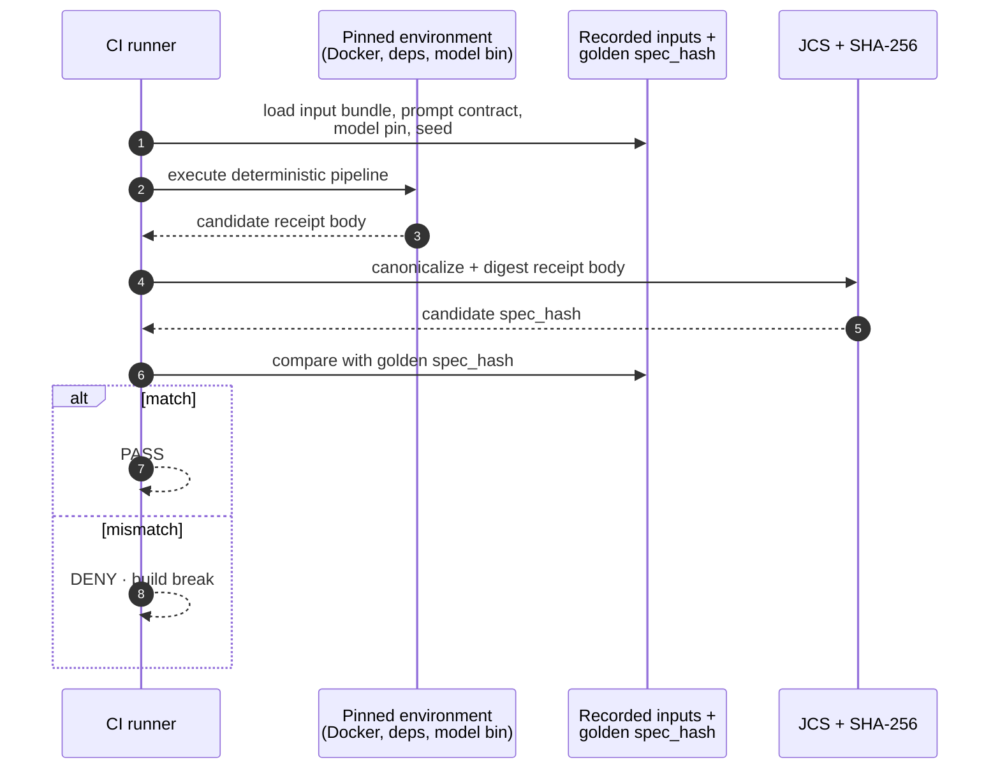

<a id="top"></a>

<!-- [KFM_META_BLOCK_V2]
doc_id: kfm://doc/architecture/identity-and-spec-hash
title: Identity and spec_hash — KFM Architecture
type: architecture
subtype: identity-and-hashing-doctrine
version: v1 (draft)
status: draft
owners: <architecture-stewards>  # PLACEHOLDER — assign before review
created: 2026-05-25
updated: 2026-05-25
policy_label: public
related:
  - docs/doctrine/directory-rules.md                            # v1.3 — placement authority
  - docs/doctrine/lifecycle-law.md                              # RAW → … → PUBLISHED invariant
  - docs/doctrine/truth-posture.md
  - docs/doctrine/trust-membrane.md
  - docs/architecture/contract-schema-policy-split.md           # responsibility split
  - docs/architecture/governed-api.md                           # trust-membrane boundary
  - docs/architecture/maplibre-3d.md                            # sole-renderer doctrine (PROPOSED ADR)
  - docs/standards/PROV.md                                      # PROV-O / PAV profile
  - docs/standards/CANONICALIZATION.md                          # PROPOSED — JCS vs URDNA2015 decision matrix
  - docs/standards/RUN_RECEIPT.md                               # PROPOSED — receipt schema doc
  - docs/standards/PMTILES.md
  - docs/standards/ISO-19115.md
  - docs/adr/ADR-0001-schema-home.md                            # schema-home convention
  - schemas/contracts/v1/evidence/                              # PROPOSED schema family
  - schemas/contracts/v1/core/run_receipt.v1.schema.json        # PROPOSED
  - tools/spec_hash/                                            # PROPOSED helper home
  - tools/replay/                                               # PROPOSED replay harness home
tags: [kfm, architecture, identity, hashing, spec_hash, jcs, sha256, receipts, replay, governance]
notes:
  - "Identity is computed, not assigned. Every trust-bearing record carries a spec_hash."
  - "No mounted repo was inspected during authoring. Every path below is PROPOSED unless explicitly labelled CONFIRMED."
  - "Doctrine is CONFIRMED in the Pass-10 Idea Index (C1-01, C1-02, C5-04, C8-04, C8-05) and the Unified Implementation Architecture Build Manual §7.2–§7.3. Implementation maturity is UNKNOWN this session."
[/KFM_META_BLOCK_V2] -->

# Identity and `spec_hash` — KFM Architecture

> *Trust-bearing records in KFM are identified by **what they are**, not where they live. Identity is computed from canonical bytes; equality is a hash comparison; promotion is a closed loop over that hash.*


<!-- TODO — wire CI badge once docs-lint workflow is named and pinned -->


| Field | Value |
|---|---|
| **Status** | `draft` |
| **Owners** | `<architecture-stewards>` *(PLACEHOLDER — assign before review)* |
| **Last reviewed** | 2026-05-25 |
| **Doctrine basis** | Pass-10 Idea Index C1-01, C1-02, C5-04, C8-04, C8-05 *(all `CONFIRMED` in corpus)* · Unified Implementation Architecture Build Manual §7.2 / §7.3 · Unified Doctrine Synthesis §13 · `directory-rules.md` v1.3 |
| **Implementation maturity** | `UNKNOWN` — no mounted repo, runtime, CI logs, or dashboards were inspected this session |
| **Authority class** | Architecture doctrine (subordinate to `docs/doctrine/`; coordinates with `docs/adr/`) |

---

## Quick jump

- [1. Why identity matters](#1-why-identity-matters)
- [2. Two rules, one loop](#2-two-rules-one-loop)
- [3. `spec_hash`: RFC 8785 JCS + SHA-256](#3-spec_hash-rfc-8785-jcs--sha-256)
- [4. The KFM hash family](#4-the-kfm-hash-family)
- [5. Stable IDs and deterministic naming](#5-stable-ids-and-deterministic-naming)
- [6. The receipt envelope](#6-the-receipt-envelope)
- [7. Promotion gate: spec-hash match](#7-promotion-gate-spec-hash-match)
- [8. Replay verification](#8-replay-verification)
- [9. JCS vs URDNA2015 — canonicalization choice](#9-jcs-vs-urdna2015--canonicalization-choice)
- [10. Tooling and placement](#10-tooling-and-placement)
- [11. Tensions and limitations](#11-tensions-and-limitations)
- [12. Open questions](#12-open-questions)
- [13. Related docs](#13-related-docs)
- [Appendix A — Worked illustrative examples](#appendix-a--worked-illustrative-examples)

---

<a id="1-why-identity-matters"></a>

## 1. Why identity matters

KFM is a governed, evidence-first system. Receipts, EvidenceBundles, PolicyDecisions, PromotionDecisions, AIReceipts, RunReceipts, manifests, and release records are the **trust-bearing records** that travel through the lifecycle. If two such records collide silently — or if a record drifts between authoring and runtime — the entire chain of evidence collapses.

> [!IMPORTANT]
> **Identity precedes attributes.** Following the Domain-Driven Design *Entity* pattern (paraphrased: *"When an object is distinguished by its identity rather than its attributes, make this primary to its definition; define an operation that is guaranteed to produce a unique result for each object."*), KFM treats every trust-bearing record as an Entity whose identity is a computed digest of its canonical content. Attribute equality is not identity equality.

`CONFIRMED` at doctrine level — the Pass-10 corpus calls deterministic identity one of the *eight load-bearing themes*:

> *"Identity in the corpus is computed, not assigned. Spec hashes are RFC 8785 JCS canonicalization plus SHA-256 (C1-02). Evidence bundles are content-addressed (C8-04). … The pattern lets the system verify identity without trusting any naming authority, and it lets identity survive movement across storage tiers, republication, and toolchain advances."* — Pass-10 §7.3 Deterministic Identity

[↑ back to top](#top)

---

<a id="2-two-rules-one-loop"></a>

## 2. Two rules, one loop

Identity in KFM rests on **two rules** that compose into **one loop**:

| Rule | Statement | Status |
|---|---|---|
| **R1 — Canonical content → digest** | Compute `spec_hash` over **canonical bytes** (RFC 8785 JCS) of the record, then SHA-256. Record as `jcs:sha256:<hex>`. | `CONFIRMED` doctrine (Pass-10 C1-02) |
| **R2 — Stored digest → re-verified digest** | At every governance boundary (promotion, replay, runtime resolution), **recompute** the digest from the checked-in/canonical form and **compare** to the stored value. Mismatch fails closed. | `CONFIRMED` doctrine (Pass-10 C5-04; Pass-32 KFM-P5-PROG-0010) |

The loop is what makes governance **reproducible**: an auditor can recompute and verify any KFM receipt months or years later, against the same canonical bytes, with the same algorithm.

```mermaid
flowchart LR
  A["Record body<br/>(JSON / JSON-LD)"]:::body
  B["JCS canonicalization<br/>(RFC 8785)"]:::norm
  C["SHA-256"]:::hash
  D["spec_hash<br/>jcs:sha256:&lt;hex&gt;"]:::id
  E["Receipt / manifest /<br/>EvidenceBundle"]:::record
  F["Promotion gate<br/>(re-compute & compare)"]:::gate
  G{"Match?"}:::decide
  H[["Promote / Publish"]]:::ok
  I[["DENY · build break"]]:::deny

  A --> B --> C --> D
  D -. embedded in .-> E
  E --> F --> G
  G -- yes --> H
  G -- no  --> I

  classDef body fill:#eef6ff,stroke:#1f6feb,color:#0a2540;
  classDef norm fill:#fff4cf,stroke:#bf8700,color:#3b2f00;
  classDef hash fill:#fde7ef,stroke:#cf222e,color:#5c0010;
  classDef id   fill:#d4f5dd,stroke:#1a7f37,color:#053a1a;
  classDef record fill:#f3eaff,stroke:#6f42c1,color:#2b1259;
  classDef gate fill:#fff,stroke:#57606a,color:#24292f,stroke-dasharray: 3 3;
  classDef decide fill:#eaeef2,stroke:#57606a,color:#24292f;
  classDef ok fill:#1a7f37,stroke:#053a1a,color:#fff;
  classDef deny fill:#cf222e,stroke:#5c0010,color:#fff;
```



[↑ back to top](#top)

---

<a id="3-spec_hash-rfc-8785-jcs--sha-256"></a>

## 3. `spec_hash`: RFC 8785 JCS + SHA-256

`CONFIRMED` (Pass-10 C1-02):

> *"The `spec_hash` for a dataset entry, model spec, contract, or evidence bundle is computed by canonicalizing the JSON via RFC 8785 JCS (JSON Canonicalization Scheme) and then taking SHA-256 over the canonical bytes; it is recorded as `jcs:sha256:<hex>`."*

### 3.1 What JCS does

`EXTERNAL/CONFIRMED-IN-CORPUS` — RFC 8785 JCS imposes:

- **Deterministic key ordering** (lexicographic sort over Unicode code-point sequences).
- **Whitespace elimination** (no insignificant whitespace).
- **Number normalization** (one canonical representation per numeric value).
- **String normalization** (canonical escaping).

The result is a byte string that is identical regardless of which tool serialized the JSON. Hashing the **developer-formatted** JSON is *explicitly not acceptable* in KFM, because trivial reformatting would produce different hashes and break re-runs and audits. *(`CONFIRMED` — Pass-10 C1-02 detailed explanation.)*

### 3.2 What gets hashed

| Layer | What is canonicalized for `spec_hash` |
|---|---|
| **RunReceipt** | The canonical receipt body (excluding signatures and any post-hoc attestations). |
| **AIReceipt** | Provider, model, parameters, prompt-contract reference, citation validation, policy decision, finite outcome — never private chain-of-thought. |
| **EvidenceBundle** | Graph fragment + cited run receipts + authority crosswalks; one top-level `spec_hash` per Pass-10 C8-04. |
| **PolicyDecision** | Inputs, rule set version, decision, reasons (with sensitive reasons redacted per the public-safe profile). |
| **PromotionDecision** | Inputs, gates A–G outcomes, signatures references. |
| **LayerManifest / StyleManifest / TileArtifactManifest / MapReleaseManifest** | The canonical manifest body; per `directory-rules.md` v1.3 §6.4 these live under `schemas/contracts/v1/maplibre/` and are evaluated against MapLibre as sole renderer (PROPOSED ADR). |
| **Contracts and schemas** | The canonical contract or schema body; promotion verifies that the receipt's `spec_hash` matches a freshly recomputed JCS+SHA-256 of the checked-in spec (Pass-10 C5-04). |

### 3.3 What is **not** part of `spec_hash`

> [!CAUTION]
> Signatures, transparency-log entries, storage paths, retrieval timestamps, file names, and any field added by the signing or storage layer are **outside** the canonical body. Including them would make the digest unstable. `CONFIRMED` — this is implied by C1-02 (the receipt's hash must be reproducible from the canonical body alone) and made explicit by C1-03 (signatures are stored alongside the receipt, not embedded in the canonical hashed body).

[↑ back to top](#top)

---

<a id="4-the-kfm-hash-family"></a>

## 4. The KFM hash family

`CONFIRMED` at doctrine level — Unified Implementation Architecture Build Manual §7.3:

| Hash | Purpose | Notes |
|---|---|---|
| **`content_hash`** | Hash of bytes or canonical JSON body. | The generic content digest. |
| **`spec_hash`** | Hash of canonical run / config / schema / policy body **used to produce output**. | The KFM identity primitive. Always `jcs:sha256:<hex>` for JSON. |
| **`geometry_hash`** | Hash of normalized geometry with CRS and precision rules. | Powers deterministic spatial joins (e.g., station → HUC12). |
| **`style_hash`** | Hash of style JSON and dependent sprites/glyphs where meaningful. | Used by MapLibre StyleManifest discipline. |
| **`artifact_hash`** | Hash of PMTiles / COG / GeoParquet / report / export. | Per-artifact integrity; surfaces in STAC `file:checksum`. |
| **`merkle_root`** | Tamper-evident release-file-set root. | One per `MapReleaseManifest`; powers rollback discipline. |

> [!NOTE]
> **Hash algorithm selection is an ADR-class decision.** SHA-256 is the safe universal baseline. BLAKE3 may be adopted for high-speed artifact sidecars (e.g., PMTiles) if the project accepts the dependency and policy posture. *(`CONFIRMED` — Build Manual §7.3.)* No ADR has yet pinned BLAKE3 for any KFM artifact; this is `PROPOSED` and tracked as an open question (see §12).

[↑ back to top](#top)

---

<a id="5-stable-ids-and-deterministic-naming"></a>

## 5. Stable IDs and deterministic naming

`spec_hash` is the **identity primitive**; stable IDs are the **human-readable handles** that resolve to records by deterministic rule. Both must agree.

### 5.1 The KFM stable-ID pattern

`CONFIRMED` (Build Manual §7.2):

```text
<namespace>:<object_family>:<stable_key>:<version_or_hash>
```

Illustrative examples (also from Build Manual §7.2):

```text
source:usgs:wbd:huc12:v2026-verified
bundle:hydrology:huc12:sha256-…
layer:hydrology:huc12_public:v1
release:map:hydrology_huc12:2026-05-20
claim:frontier:county_year:ks_1870:sha256-…
```

### 5.2 Required identity inputs

`CONFIRMED` (Build Manual §7.2):

- Source ID and authority role.
- Domain object family.
- Spatial reference and geometry fingerprint *(when geometry matters)*.
- Valid time, source time, retrieval time, release time *(where material)*.
- Canonicalized payload hash.
- Schema version.
- Transform / policy version *(where output is derived or public-safe)*.

> [!IMPORTANT]
> **Source role is fixed at admission and never upgraded by promotion** (e.g., `modeled` does not become `observed` after a publication run). `CONFIRMED` — Doctrine Synthesis §13. This is an invariant of KFM's source-role anti-collapse register.

### 5.3 Stable IDs vs. `spec_hash` — division of labor

| Aspect | Stable ID | `spec_hash` |
|---|---|---|
| **Audience** | Humans, link targets, log lines, citation footnotes. | Machines, gates, replay verifiers, content stores. |
| **Lifetime** | Stable across reformatting and benign edits. | Changes whenever the canonical body changes. |
| **Equality** | String equality on the ID. | Byte equality on the digest. |
| **Where stored** | `data/registry/...`, `release/manifests/...`, document front matter. *(PROPOSED placement per Directory Rules v1.3 §6.)* | Embedded in every receipt, manifest, EvidenceBundle, STAC `kfm:provenance` block, and DCAT distribution. |

[↑ back to top](#top)

---

<a id="6-the-receipt-envelope"></a>

## 6. The receipt envelope

`CONFIRMED` (Pass-10 C1-01) — the **Universal Run Receipt** is the envelope through which `spec_hash` becomes operational. The common required fields are:

| Field | Type | Notes |
|---|---|---|
| `dataset_id` | string | Stable source/dataset identity. |
| `dataset_version` | string | Version key (date, semver, or content tag). |
| `fetch_time` | ISO 8601 timestamp | When the source was retrieved. |
| `source_url` | URL | Authoritative source URL. |
| `http_validators` | object | `{etag, last_modified}` at fetch — feeds smart-sync. |
| `spec_hash` | string | `jcs:sha256:<hex>` over the canonical run/spec body. |
| `run_id` | string | Stable run identifier (OpenLineage-compatible). |
| `orchestrator` | string | E.g., `dagster`, `prefect`, `temporal`. |
| `transform_git_sha` | string | Commit SHA of the transform code. |
| `artifacts[]` | array | `{path, digest}` per emitted artifact. |
| `rights_spdx` | SPDX expr | E.g., `CC0-1.0`, `CC-BY-4.0`. |
| `attestations[]` | array | E.g., `{type: 'cosign', bundle_digest: 'sha256:...'}`. |

> [!NOTE]
> The Pass-10 corpus flags that **field naming drifts** across recipes (`fetch_time` vs `fetched_at`; `http_validators` vs `source_validators`). The expansion direction `CONFIRMED` in the corpus is to adopt **one canonical schema (`run_receipt.v1`)** and pin its registry id. Proposed canonical home: `schemas/contracts/v1/core/run_receipt.v1.schema.json` *(`PROPOSED` — `NEEDS VERIFICATION` against the schema-home convention in ADR-0001).*

<details>
<summary><strong>Receipt taxonomy reference (click to expand)</strong></summary>

`CONFIRMED` from the Doctrine Synthesis §12 receipt catalog and the Build Manual §7.1 envelope table. Every entry below is a record family that carries a `spec_hash`:

| Record family | Purpose | Stage |
|---|---|---|
| `EventEnvelope` | Watcher / upload / source-change event captured before RAW. | Pre-RAW |
| `EventRunReceipt` | Signed pre-RAW admission receipt. | Pre-RAW |
| `SourceIntakeRecord` | Admission decision for a new source/idea packet. | Pre-RAW |
| `RunReceipt` | Pipeline/tool action pinned to inputs, outputs, policy, hashes, versions. | All stages |
| `AIReceipt` | Model/tool invocation metadata; **no private chain-of-thought**. | Focus Mode / governed AI |
| `EvidenceRef` | Small pointer to evidence requiring resolution. | Catalog / Runtime |
| `EvidenceBundle` | Resolved, policy-safe evidence context (content-addressed). | Proofs / Published |
| `ValidationReport` | Schema, geometry, catalog, citation, policy check result. | Proofs / QA |
| `CitationValidationReport` | Claim ↔ citation pass/fail. | Catalog / Release |
| `RedactionReceipt` | Public-safe transformation of a sensitive field/geometry. | Pre-Release |
| `AggregationReceipt` | Bin/cell aggregation protecting underlying records. | Pre-Release |
| `PolicyDecision` | Allow / deny / abstain / error with reasons. | Policy / Receipts |
| `PromotionDecision` / `PromotionReceipt` | Outcome of Gates A–G. | Release |
| `ReleaseManifest` / `MapReleaseManifest` | Released artifact set + digests + rollback target. | Release |
| `VerifyReceipt` | Runtime verification (`digest_verified`, `bounds_verified`, …). | Runtime |
| `RollbackCard` | Prior manifest + artifact digests + cache-invalidation steps. | Recovery |
| `CorrectionNotice` | Public correction or supersession notice. | Published |
| `RecompileManifest` | Deterministic inputs/outputs for recompiled docs/indexes. | Control loop |

> *`directory-rules.md` v1.3 §13: trust-bearing receipts live under `data/receipts/`, `data/proofs/`, or `release/` — **never** under `artifacts/`, which is build/docs/QA scratch only.* `CONFIRMED` at doctrine level; `PROPOSED` until verified in a mounted repo.

</details>

[↑ back to top](#top)

---

<a id="7-promotion-gate-spec-hash-match"></a>

## 7. Promotion gate: spec-hash match

`CONFIRMED` (Pass-10 C5-04):

> *"Promotion verifies that the receipt's `spec_hash` matches a freshly recomputed JCS+SHA-256 of the checked-in spec; mismatch is a hard fail."*

This is the rule that turns a receipt from a *claim* into *evidence*. The hash recorded at run time must equal the hash CI computes against the spec at merge time. If the spec changed between the run and the merge, the hashes diverge, and the gate intervenes.

| Property | Effect |
|---|---|
| **Correctness** | Confirms that the spec being promoted really is what was run. |
| **Attack-surface reduction** | A tampered spec cannot ride a previously-valid receipt to publication. |
| **Auditability** | Auditors can recompute and verify months or years later, against the same bytes. |
| **Idempotence** | No-op promotions become detectable (Pass-10 C3-04: skip when `spec_hash` unchanged). |

### 7.1 Where the gate is enforced

| Surface | Enforcement | Status |
|---|---|---|
| **CI** | Conftest / OPA bundle gates evaluate `spec_hash` equality against the checked-in spec. | `CONFIRMED` doctrine (C5-02 / C5-04) · `PROPOSED` placement: `policy/promotion/` |
| **Runtime admission** | OPA Gatekeeper (or equivalent VAW) runs the same Rego bundle as CI — **policy parity**. | `CONFIRMED` doctrine (C5-03, C5-05) · `UNKNOWN` implementation maturity |
| **Pre-commit** | Optional hook that warns when a spec file is not canonicalized. | `PROPOSED` (C5-04 Expansion Direction) |
| **`packages/evidence-resolver/`** | Resolves `EvidenceRef → EvidenceBundle` and re-verifies the bundle digest before the runtime serves it. | `PROPOSED` placement; `UNKNOWN` implementation |

> [!WARNING]
> **Policy parity is required.** The same OPA bundle digest must be referenced by both CI workflows and runtime deployment manifests, or the spec-hash gate becomes policy theatre. `CONFIRMED` doctrine — Pass-10 C5-03. Implementation maturity in the live KFM repo is `UNKNOWN`.

[↑ back to top](#top)

---

<a id="8-replay-verification"></a>

## 8. Replay verification

`CONFIRMED` doctrine (Pass-32 `KFM-P5-PROG-0010`; Doctrine Synthesis §13):

> *"Given the same input evidence, the same prompt contract (same hash), the same model + parameter pin, and the same seed, the system must produce a `RunReceipt` (or `AIReceipt`) whose canonical hash matches the previously recorded golden hash. **Replay drift is a build break.**"*

Replay verification is the **strongest form of the canonicalization rule**: if canonicalization is correct and the inputs are pinned, the output hash is fixed.



### 8.1 Replay flow (PROPOSED placement)

| Step | Artifact | Proposed path |
|---|---|---|
| 1 | Replay runner | `tools/replay/replay_run.py` *(`PROPOSED` — Pass-32 KFM-P5-PROG-0010)* |
| 2 | Per-use-case harness | `tests/replay/test_replay_<use_case>.py` *(`PROPOSED`)* |
| 3 | Cached non-deterministic responses | `tests/replay/fixtures/<use_case>/cached_responses/` *(`PROPOSED`; cache must itself be content-addressed)* |
| 4 | Golden hashes | Recorded alongside fixtures; format is `jcs:sha256:<hex>`. *(`PROPOSED`)* |
| 5 | Pinned environment | Docker image with explicit versions: Python, dependency lock, model bin hash, random seed. *(`PROPOSED`)* |

> [!TIP]
> **Replay applies to non-AI deterministic pipelines too.** The corpus calls out the COMID → HUC12 crosswalk as a canonical example of a non-AI replay-able pipeline. Any pipeline whose output is supposed to be a pure function of its inputs is a replay candidate. `CONFIRMED` doctrine.

### 8.2 Remote / non-deterministic dependencies

When a pipeline depends on a remote resource (model API, web source, etc.) whose determinism cannot be guaranteed, replay **must** use **content-addressed cached responses** under `tests/replay/fixtures/<use_case>/cached_responses/`. `CONFIRMED` doctrine; `PROPOSED` placement.

[↑ back to top](#top)

---

<a id="9-jcs-vs-urdna2015--canonicalization-choice"></a>

## 9. JCS vs URDNA2015 — canonicalization choice

`CONFIRMED` (Pass-10 C8-05):

> *"The KFM default for receipts and bundle hashes is JCS, with URDNA2015 reserved for cases where RDF semantic equivalence is the relevant invariant."*

| Aspect | JCS (RFC 8785) | URDNA2015 |
|---|---|---|
| **Layer** | JSON | RDF dataset (N-Quads) |
| **Determinism** | Byte-level via key sort and number/string normalization. | RDF dataset normalization, including blank-node labeling. |
| **Speed** | Fast; widely implemented. | Slower; varies across implementations on blank-nodes and datatype literals. |
| **KFM usage** | **Default** for all receipts, manifests, EvidenceBundles, spec_hash. | **Reserved** for cases where RDF-semantic equivalence is the relevant invariant (e.g., federated SPARQL merging KFM bundles with non-KFM RDF). |
| **Choice recording** | Embedded in the receipt prefix `jcs:sha256:...`. | Would be recorded as a different prefix (e.g., `urdna2015:sha256:...`). `PROPOSED`. |

> [!IMPORTANT]
> **Ad-hoc canonicalization choices produce drift.** Two implementations of the same logical bundle can disagree if one uses JCS and the other uses URDNA2015. Codifying JCS as the default eliminates that class of drift. `CONFIRMED` — Pass-10 C8-05.

The decision matrix for when (if ever) to switch to URDNA2015 belongs in `docs/standards/CANONICALIZATION.md` *(`PROPOSED` — Pass-10 C1-02 Expansion Direction; `NEEDS VERIFICATION` whether that file already exists in the mounted repo).*

[↑ back to top](#top)

---

<a id="10-tooling-and-placement"></a>

## 10. Tooling and placement

> **Directory Rules basis (`directory-rules.md` v1.3):** root folders are responsibility roots, not topic buckets. Trust tooling that is durable graduates from `scripts/` into `tools/`; machine schemas live under `schemas/contracts/v1/<family>/` per ADR-0001; admissibility lives in `policy/`. *(`CONFIRMED` doctrine.)* All paths below are `PROPOSED` until verified in a mounted repo.

### 10.1 Helpers and CLIs

| Artifact | Proposed path | Status | Source |
|---|---|---|---|
| Reference JCS+SHA-256 helper (Python) | `tools/spec_hash/jcs_hash.py` | `PROPOSED` | Pass-10 C1-02 Expansion |
| `kfm-hash` CLI (multi-language wrappers) | `tools/spec_hash/` *(parent)* | `PROPOSED` | Pass-10 C1-02 Suggested Future Work |
| Pre-commit hook (warn-on-uncanonicalized spec) | `.pre-commit-config.yaml` + `tools/spec_hash/precommit/` | `PROPOSED` | Pass-10 C5-04 Expansion |
| Replay runner | `tools/replay/replay_run.py` | `PROPOSED` | Pass-32 KFM-P5-PROG-0010 |
| Spec-hash gate validator | `tools/validators/validate_spec_hash.py` | `PROPOSED` | Inferred from C5-04 |

### 10.2 Schemas (machine shape)

| Schema | Proposed home | Status |
|---|---|---|
| `run_receipt.v1.schema.json` | `schemas/contracts/v1/core/` | `PROPOSED` (Pass-10 C1-01 Suggested Future Work) |
| `evidence_bundle.v1.schema.json` | `schemas/contracts/v1/evidence/` | `PROPOSED` (Pass-32 KFM-P26-PROG-0004) |
| `evidence_ref.v1.schema.json` | `schemas/contracts/v1/evidence/` | `PROPOSED` (Pass-32 KFM-P26-PROG-0005) |
| `ai_receipt.v1.schema.json` | `schemas/contracts/v1/ai/` | `PROPOSED` |
| `policy_decision.v1.schema.json` | `schemas/contracts/v1/policy/` | `PROPOSED` |
| `promotion_decision.v1.schema.json` | `schemas/contracts/v1/promotion/` | `PROPOSED` |
| `release_manifest.v1.schema.json` | `schemas/contracts/v1/release/` | `PROPOSED` |

### 10.3 Adjacent doctrine

| Doc | Role | Status |
|---|---|---|
| `docs/doctrine/directory-rules.md` v1.3 | Placement authority. | `CONFIRMED` doctrine. |
| `docs/doctrine/lifecycle-law.md` | RAW → WORK/QUARANTINE → PROCESSED → CATALOG/TRIPLET → PUBLISHED invariant. | `CONFIRMED` doctrine. |
| `docs/architecture/contract-schema-policy-split.md` | `contracts/` = meaning · `schemas/` = shape · `policy/` = admissibility. | `CONFIRMED` doctrine; file presence `NEEDS VERIFICATION`. |
| `docs/architecture/governed-api.md` | Trust-membrane boundary; the only public path. | `CONFIRMED` doctrine; file presence `NEEDS VERIFICATION`. |
| `docs/standards/PROV.md` | PROV-O / PAV provenance profile. | Authored prior session; `NEEDS VERIFICATION` in mounted repo. |
| `docs/standards/CANONICALIZATION.md` | JCS-vs-URDNA2015 decision matrix. | `PROPOSED` (Pass-10 C1-02 Expansion Direction). |
| `docs/standards/RUN_RECEIPT.md` | Receipt schema documentation. | `PROPOSED` (Pass-10 C1-01 Suggested Future Work). |

[↑ back to top](#top)

---

<a id="11-tensions-and-limitations"></a>

## 11. Tensions and limitations

`CONFIRMED` at corpus level — the Pass-10 dossier explicitly enumerates these tensions:

| # | Tension | Source |
|---|---|---|
| T1 | **JCS library maturity varies across language ecosystems.** One Pass-10 recipe shows the placeholder *"replace this with a real JCS lib once you lock your runtime."* KFM must pin one JCS implementation per language (Python, TypeScript, Go) before relying on cross-runtime hash equality. | Pass-10 C1-02 |
| T2 | **Whitespace or context-list edits in JSON-LD can change JCS bytes without changing semantics.** Authors must learn to canonicalize **before** committing; pre-commit hook is the proposed mitigation. | Pass-10 C5-04 |
| T3 | **JCS and URDNA2015 can disagree for the same logical bundle.** JSON-LD round-tripping is not an identity transformation. The choice must be policy-driven, not ad-hoc. | Pass-10 C8-05 |
| T4 | **No single canonical KFM run-receipt JSON Schema is referenced consistently** across the corpus. Field-naming drift (`fetch_time` vs `fetched_at`; `http_validators` vs `source_validators`) is historical, not substantive — but it must be reconciled by adopting `run_receipt.v1` as the canonical schema. | Pass-10 C1-01 |
| T5 | **BLAKE3 vs SHA-256 vs dual-hash receipts is unresolved for future passes** (Pass-23 KFM-P1-PROG-0016 Open Question). SHA-256 is the safe universal baseline; BLAKE3 is a permitted optimization for PMTiles sidecars under an ADR. No ADR is pinned. | Build Manual §7.3; Pass-23 KFM-P1-PROG-0016 |
| T6 | **Source-rights, sensitivity, and policy posture interact with hashing.** Redaction transforms produce new `spec_hash` values; the redacted version is a distinct identity from the unredacted version, and the linkage is recorded in `RedactionReceipt`. *(`CONFIRMED` doctrine; `PROPOSED` schema home.)* | Doctrine Synthesis §13 |

> [!NOTE]
> None of these tensions undermines the core rule. They are operational disciplines that must be enforced by tooling (pinned JCS lib, pre-commit hook, ADR-pinned algorithm choice) for the doctrine to hold in practice.

[↑ back to top](#top)

---

<a id="12-open-questions"></a>

## 12. Open questions

`NEEDS VERIFICATION` / `UNKNOWN` items that this doc cannot resolve without mounted-repo evidence or an ADR:

| OQ # | Status | Question |
|---|---|---|
| OQ-IDH-01 | `UNKNOWN` | Should the canonical receipt include the OpenLineage `run_id` **directly** or carry it **by reference**? *(Pass-10 C1-01 Open Question.)* |
| OQ-IDH-02 | `UNKNOWN` | Where exactly should receipts live: object store keyed by digest, immutable bucket, OCI artifact, or in-repo under `data/AUDIT`? *(Pass-10 C1-01 Open Question.)* `directory-rules.md` v1.3 §13 prefers `data/receipts/` / `data/proofs/` / `release/` — `NEEDS VERIFICATION` against the mounted repo. |
| OQ-IDH-03 | `UNKNOWN` | Should the canonical form of a JSON-LD spec be JCS or URDNA2015? *(Pass-10 C5-04 / C8-05.)* This is an ADR-class decision. |
| OQ-IDH-04 | `NEEDS VERIFICATION` | Should KFM standardize on **BLAKE3**, **SHA-256**, or **dual-hash receipts** for future passes? *(Pass-23 KFM-P1-PROG-0016.)* |
| OQ-IDH-05 | `NEEDS VERIFICATION` | Which JCS implementation is pinned for Python (`rfc8785` vs `jcs`), TypeScript, and Go? *(Pass-10 C1-02 Expansion Direction.)* |
| OQ-IDH-06 | `NEEDS VERIFICATION` | Does `docs/standards/CANONICALIZATION.md` already exist in the mounted repo, or is it still to be authored? |
| OQ-IDH-07 | `NEEDS VERIFICATION` | Does `tools/spec_hash/` already exist, or is it still `PROPOSED`? Does the `kfm-hash` CLI exist? |
| OQ-IDH-08 | `UNKNOWN` | Which graph documents (if any) actually require URDNA2015 today, given that most KFM artifacts are JSON, not RDF? *(Pass-10 C1-02 Open Question.)* |
| OQ-IDH-09 | `NEEDS VERIFICATION` | Are receipts schema-validated in CI today? `Pass-10 C1-01 Suggested Future Work` proposes a Conftest fixture set with "good" and "bad" receipts; mounted-repo evidence has not been inspected. |
| OQ-IDH-10 | `NEEDS VERIFICATION` | Does any current `policy/promotion/` Rego bundle already enforce spec-hash match? Is policy parity between CI and runtime live? *(Pass-10 C5-03 / C5-04.)* |

[↑ back to top](#top)

---

<a id="13-related-docs"></a>

## 13. Related docs

| Doc | Why it matters here | Status |
|---|---|---|
| `docs/doctrine/directory-rules.md` (v1.3) | Placement authority for every path in this document. | `CONFIRMED` doctrine. |
| `docs/doctrine/lifecycle-law.md` | The lifecycle invariant that `spec_hash` enforces across. | `CONFIRMED` doctrine; file presence `NEEDS VERIFICATION`. |
| `docs/doctrine/truth-posture.md` | Cite-or-abstain default; receipts are how citations resolve. | `NEEDS VERIFICATION`. |
| `docs/doctrine/trust-membrane.md` | The boundary `spec_hash` protects. | `NEEDS VERIFICATION`. |
| `docs/architecture/contract-schema-policy-split.md` | Why `spec_hash` lives in `schemas/`, gate logic in `policy/`, meaning in `contracts/`. | `NEEDS VERIFICATION`. |
| `docs/architecture/governed-api.md` | Where runtime verification of `spec_hash` is enforced before public exposure. | `NEEDS VERIFICATION`. |
| `docs/architecture/maplibre-3d.md` | Renderer-decision doctrine; LayerManifest / StyleManifest / RepresentationReceipt all carry `spec_hash`. | `CONFIRMED` authored; `PROPOSED` ADR. |
| `docs/standards/PROV.md` | PROV-O / PAV provenance profile referenced by EvidenceBundles. | Authored prior session; `NEEDS VERIFICATION` in repo. |
| `docs/standards/CANONICALIZATION.md` | JCS-vs-URDNA2015 decision matrix. | `PROPOSED`. |
| `docs/standards/RUN_RECEIPT.md` | Receipt schema documentation. | `PROPOSED`. |
| `docs/adr/ADR-0001-schema-home.md` | Schema-home convention (`schemas/contracts/v1/<family>/`). | `CONFIRMED` referenced in `directory-rules.md` v1.3; file presence `NEEDS VERIFICATION`. |
| `docs/adr/ADR-NNNN-canonicalization-choice.md` | `PROPOSED` ADR pinning JCS for JSON / when URDNA2015 applies. | `PROPOSED`. |
| `docs/adr/ADR-NNNN-hash-algorithm.md` | `PROPOSED` ADR pinning SHA-256 universal baseline and BLAKE3 usage envelope. | `PROPOSED`. |

[↑ back to top](#top)

---

<a id="appendix-a--worked-illustrative-examples"></a>

## Appendix A — Worked illustrative examples

> [!WARNING]
> **Illustrative only.** The hex digests below are **not** real KFM hashes. They are stand-ins to show shape and structure. Do not cite them as evidence. Real hashes are computed by a pinned JCS implementation against the canonical receipt body.

<details>
<summary><strong>A.1 — A minimal RunReceipt (illustrative shape)</strong></summary>

```json
{
  "dataset_id": "source:usgs:wbd:huc12",
  "dataset_version": "v2026-verified",
  "fetch_time": "2026-05-20T14:03:11Z",
  "source_url": "https://example.invalid/wbd/HU12.zip",
  "http_validators": {
    "etag": "\"abc123-illustrative\"",
    "last_modified": "Wed, 20 May 2026 13:50:02 GMT"
  },
  "spec_hash": "jcs:sha256:0000000000000000000000000000000000000000000000000000000000000000",
  "run_id": "ol:run:0000-illustrative",
  "orchestrator": "dagster",
  "transform_git_sha": "0000000000000000000000000000000000000000",
  "artifacts": [
    { "path": "data/processed/hydrology/huc12.parquet",
      "digest": "sha256:0000000000000000000000000000000000000000000000000000000000000000" }
  ],
  "rights_spdx": "CC0-1.0",
  "attestations": [
    { "type": "cosign",
      "bundle_digest": "sha256:0000000000000000000000000000000000000000000000000000000000000000" }
  ]
}
```

</details>

<details>
<summary><strong>A.2 — Reference JCS+SHA-256 helper (illustrative Python sketch)</strong></summary>

> **`PROPOSED`** — sketch only. Pin a real JCS library (`rfc8785` or `jcs`) before adopting. **Do not ship this stub.**

```python
# tools/spec_hash/jcs_hash.py  (PROPOSED — Pass-10 C1-02 Expansion)
# ILLUSTRATIVE. Replace the JCS step with a pinned library.

import hashlib
import json

def jcs_canonicalize(obj) -> bytes:
    """Stub. Replace with a pinned RFC 8785 JCS implementation.

    Real JCS requires deterministic key ordering, number normalization,
    and string normalization per RFC 8785. The line below is NOT JCS;
    it is a placeholder so this module imports cleanly.
    """
    raise NotImplementedError(
        "Pin a real JCS implementation (rfc8785, jcs, or equivalent) "
        "before computing KFM spec_hash values."
    )

def spec_hash(obj) -> str:
    canonical = jcs_canonicalize(obj)
    digest = hashlib.sha256(canonical).hexdigest()
    return f"jcs:sha256:{digest}"
```

</details>

<details>
<summary><strong>A.3 — Pre-commit hook shape (illustrative)</strong></summary>

> **`PROPOSED`** — shape only. The hook should warn (not block) until JCS tooling is pinned.

```yaml
# .pre-commit-config.yaml (ILLUSTRATIVE)
repos:
  - repo: local
    hooks:
      - id: kfm-spec-hash-canonicalize
        name: KFM spec_hash · canonicalize-on-commit (warn)
        entry: python tools/spec_hash/precommit/check_canonical.py
        language: system
        files: '\.(json|jsonld|spec\.json)$'
        verbose: true
```

</details>

<details>
<summary><strong>A.4 — Replay invariant (illustrative pseudocode)</strong></summary>

```text
# tools/replay/replay_run.py  (PROPOSED — Pass-32 KFM-P5-PROG-0010)
# ILLUSTRATIVE PSEUDOCODE.

inputs       = load_input_bundle(use_case)
contract     = load_prompt_contract(use_case)
model_pin    = load_model_pin(use_case)
seed         = load_seed(use_case)
golden_hash  = load_golden_hash(use_case)

receipt      = execute_pinned(inputs, contract, model_pin, seed)
candidate    = spec_hash(receipt)         # jcs:sha256:<hex>

if candidate != golden_hash:
    fail("Replay drift — build break")
else:
    pass
```

</details>

[↑ back to top](#top)

---

<!-- ---------------------------------------------------------------- -->

> **Last updated:** 2026-05-25 · **Status:** draft · **Doctrine basis:** Pass-10 C1-01 / C1-02 / C5-04 / C8-04 / C8-05; Build Manual §7.2–§7.3; Doctrine Synthesis §13; `directory-rules.md` v1.3.

[↑ Back to top](#top)
