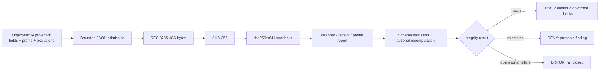

<a id="top"></a>

<!-- [KFM_META_BLOCK_V2]
doc_id: kfm://doc/architecture/identity-and-spec-hash
title: Identity and spec_hash — Current Architecture and Migration Boundary
type: architecture
subtype: identity-and-hashing-architecture
version: v1.1
status: draft; repository-grounded; explanatory; mixed-maturity; non-authoritative
owners:
  - "NEEDS VERIFICATION — repository documentation review route"
  - "NEEDS VERIFICATION — identity and canonicalization steward"
created: 2026-05-25
updated: 2026-08-19
policy_label: public; architecture; identity; hashing; integrity; no-release-authority
current_path: docs/architecture/identity-and-spec-hash.md
owning_root: docs/
responsibility: "Explain how current KFM content-digest, activity-identity, object-identity, receipt, validation, replay, and migration surfaces compose without transferring authority among contracts, schemas, policy, implementation, evidence, data, or release roots."
truth_posture: "CONFIRMED current path, adopted placement authority, bounded JCS plus SHA-256 implementation, current sha256 grammar, schema, validator, fixtures, tests, workflow, GeoJSON structural profile, RunReceipt shape, and identity-package scaffold / PROPOSED ADR-0013 target grammar and run-id grammar / CONFLICTED wrapper, wire-format, case-collision, and documentation-status surfaces / UNKNOWN exhaustive consumers, cross-language parity, production use, runtime promotion parity, and public reliance / NEEDS VERIFICATION owners, ADR disposition, migration, exact-head hosted proof, and object-family hash-domain registry"
evidence_snapshot:
  repository: bartytime4life/Kansas-Frontier-Matrix
  base_ref: main
  base_commit: 232f7aeda87abbc46c85a8dd37b75cc9def8a2c5
  target_prior_blob: 5eec8425cdddfd2f6910c9ba8869ad67b0b08d26
  directory_rules_blob: fd49a0b83e55cef52c1124281f093e263526898d
  directory_rules_decision_blob: a4de0d7a96b78da59cfc499d1025e1508afd8dd9
  identity_adr_blob: 9c216990d74cd4cb259a1a6a4e4221bc59e8b166
  canonicalization_standard_blob: dc1a945417e0abf6761ccb4980f03433d8e2ba64
  evidence_identity_architecture_blob: 30dda6ace1d34f847b90f3c8183d61ca1154020c
  spec_hash_contract_blob: 0c2c1161ddb565d4f9f17ef81080b27b8d951937
  spec_hash_schema_blob: 80b496b01b8de8c0e8ba67bf020977e6b1f3c652
  hashing_package_manifest_blob: 0466047f5a738aae1d51e78f579a057a869f1900
  hashing_core_blob: a609eac44b1a5f24bd9ba449afedfeec7dd17e8e
  hashing_cli_blob: 860b7f04ad6b4ab2144ed61fb896100e1a8577bc
  hashing_geojson_blob: 2db35caf8aa0bb8ff0c582e03c1a57b1caf8e358
  spec_hash_tool_readme_blob: d32d907128e5602736449c521298442e9f427f76
  spec_hash_validator_blob: e83a8707548c35411d1fc61911f499ac7ca6d517
  spec_hash_tests_blob: ce981cede288facfa449026e422acfe60a6e4d5d
  spec_hash_workflow_blob: 1da612211bf0d2e0bf339561bc06f336111d614e
  run_receipt_schema_blob: c930ff0fd4da34d8b4ff202d9fd576110258974c
  identity_package_readme_blob: 7362df62340d27334242a8f5cebfa8909317d4b8
related:
  - docs/doctrine/directory-rules.md
  - docs/adr/ADR-0029-adopt-directory-governance-standard-v2.md
  - docs/adr/ADR-0013-spec_hash-and-run_id-identity-grammar.md
  - docs/architecture/evidence-identity.md
  - docs/architecture/contract-schema-policy-split.md
  - docs/standards/CANONICALIZATION.md
  - docs/standards/canonicalization.md
  - contracts/common/spec_hash.md
  - contracts/runtime/run_receipt.md
  - schemas/contracts/v1/common/spec_hash.schema.json
  - schemas/contracts/v1/runtime/run_receipt.schema.json
  - packages/hashing/pyproject.toml
  - packages/hashing/src/hashing/core.py
  - packages/hashing/src/hashing/cli.py
  - packages/hashing/src/hashing/geojson.py
  - packages/identity/README.md
  - tools/spec_hash/README.md
  - tools/spec_hash/spec_hash.py
  - tools/validators/validate_spec_hash.py
  - tools/validators/validate_run_receipt.py
  - fixtures/contracts/v1/common/spec_hash/
  - tests/validators/test_validate_spec_hash.py
  - tests/validators/test_validate_spec_hash_geojson.py
  - tests/validators/test_validate_run_receipt.py
  - .github/workflows/spec-hash.yml
tags: [kfm, architecture, identity, content-identity, activity-identity, object-identity, spec-hash, run-id, rfc8785, jcs, sha256, receipts, replay, migration, governance]
notes:
  - "v1.1 replaces the May 2026 proposal-only posture with a current-repository architecture explanation pinned to main@232f7aeda87abbc46c85a8dd37b75cc9def8a2c5."
  - "Current executable content identity is RFC 8785 JCS plus SHA-256 serialized as sha256:<64-lowercase-hex>."
  - "ADR-0013 remains proposed; jcs:sha256:<hex> and run:<orchestrator>:<ULID> are candidate target grammars, not current write behavior."
  - "Hash equality is integrity evidence only. It does not establish semantic equality outside a declared hash domain or grant source, evidence, policy, review, promotion, release, publication, or public-use authority."
  - "This documentation change modifies no contract, schema, package, validator, fixture, test, workflow, data, receipt, proof, release, runtime, deployment, or publication state."
[/KFM_META_BLOCK_V2] -->

# Identity and `spec_hash` — Current Architecture and Migration Boundary

> KFM separates **content identity**, **activity identity**, and **domain object identity**. The repository has a bounded content-digest implementation; it does not yet have one accepted universal identity grammar.

[](#current-status)
[](../adr/ADR-0029-adopt-directory-governance-standard-v2.md)
[](../../packages/hashing/src/hashing/core.py)
[](../../schemas/contracts/v1/common/spec_hash.schema.json)
[](../adr/ADR-0013-spec_hash-and-run_id-identity-grammar.md)
[](../../packages/identity/README.md)
[](#authority-boundary)

> [!IMPORTANT]
> **This page explains composition; it does not create authority.** Contracts define meaning, schemas define machine shape, object-family code defines bounded behavior, policy decides admissibility, governed data carries instances, and release records decide promotion, correction, withdrawal, and rollback.

> [!CAUTION]
> **Current wire behavior differs from the proposed ADR target.** The implemented hash package canonicalizes JSON with RFC 8785 JCS and emits `sha256:<64-lowercase-hex>`. The candidate `jcs:sha256:<hex>` form remains proposed and conflicted under ADR-0013. Do not silently translate between them.

> [!WARNING]
> **A matching digest is not truth.** It proves only equality under the same admitted value, field projection, normalization profile, canonicalization profile, and algorithm. It does not establish source authority, evidence sufficiency, semantic equivalence, rights, sensitivity, policy approval, review, release, publication, or fitness for use.

<a id="current-status"></a>

## Current status

| Surface | Repository-grounded state at `main@232f7aeda87…` | Claim limit |
|---|---|---|
| Placement authority | ADR-0029 is accepted and adopts `docs/doctrine/directory-rules.md` as the writable Directory Rules authority. | Establishes this page's explanatory `docs/architecture/` placement; it does not make the page a contract or decision record. |
| Generic JSON digest | `packages/hashing` `0.1.0` uses pinned `rfc8785==0.1.4`, RFC 8785 JCS, and SHA-256. | Bounded Python implementation only; no universal cross-language parity claim. |
| Executable wire grammar | `sha256:<64-lowercase-hex>`. | Current write behavior; not the ADR-0013 candidate grammar. |
| Common machine wrapper | `{ "value": "sha256:<hex>" }` in the proposed common schema. | Shape only; canonicalization context is not carried in the wrapper. |
| Validator | `validate_spec_hash.py` validates the wrapper and optionally recomputes a caller-supplied JSON subject. | Finite integrity result only; no evidence, policy, review, or release authority. |
| GeoJSON structural profile | `kfm-geojson-feature-digest-v1` computes separate geometry and record digests bound to declared CRS and coordinate precision. | Structural equality only; no reprojection, topology repair, ring rotation, collection sorting, or spatial-equivalence proof. |
| RunReceipt | Current schema carries scalar `spec_hash`, broad `run_id`, required lineage fields, and an optional Smart Sync profile. | No verified `run:<orchestrator>:<ULID>` generator and no universal receipt-self-hash rule. |
| Identity package | `packages/identity/` remains a documented `0.0.0` scaffold with an empty import initializer. | No accepted universal object-ID or activity-ID implementation. |
| Dedicated workflow | `.github/workflows/spec-hash.yml` runs no-network tests, fixture validation, and generated-receipt integrity for its path-filtered implementation surface. | Workflow presence is not exact-head success evidence for this docs-only change. |
| Runtime and publication | No inspected evidence establishes production reliance or public release authority from these digest surfaces. | `UNKNOWN`; remains fail-closed. |

<a id="authority-boundary"></a>

### Authority boundary

| Question | Owning surface |
|---|---|
| What does `spec_hash` mean? | [`contracts/common/spec_hash.md`](../../contracts/common/spec_hash.md) |
| What shape is machine-valid? | [`schemas/contracts/v1/common/spec_hash.schema.json`](../../schemas/contracts/v1/common/spec_hash.schema.json) and consuming schemas |
| What bytes are currently produced and compared? | [`packages/hashing/`](../../packages/hashing/README.md), the thin tool wrapper, validators, fixtures, and tests |
| What should the future shared grammar be? | Proposed [`ADR-0013`](../adr/ADR-0013-spec_hash-and-run_id-identity-grammar.md), after acceptance or rejection |
| What makes two domain objects the same entity? | The owning domain contract and its source/time/geometry/correction rules |
| Which activity produced a result? | `run_id` in the governing runtime/receipt contract; current grammar remains broad |
| May a claim or artifact be exposed? | Evidence, rights, sensitivity, policy, review, release, correction, and rollback authorities |
| What does this page own? | Human-readable cross-root architecture explanation only |

---

## Quick jump

- [1. Why identity matters](#1-why-identity-matters)
- [2. Two rules, one loop](#2-two-rules-one-loop)
- [3. `spec_hash`: RFC 8785 JCS + SHA-256](#3-spec_hash-rfc-8785-jcs--sha-256)
- [4. The KFM hash family](#4-the-kfm-hash-family)
- [5. Stable IDs and deterministic naming](#5-stable-ids-and-deterministic-naming)
- [6. The receipt envelope](#6-the-receipt-envelope)
- [7. Promotion gate: spec-hash match](#7-promotion-gate-spec-hash-match)
- [8. Replay verification](#8-replay-verification)
- [9. JCS vs. RDF canonicalization](#9-jcs-vs-urdna2015--canonicalization-choice)
- [10. Tooling and placement](#10-tooling-and-placement)
- [11. Tensions and limitations](#11-tensions-and-limitations)
- [12. Open questions](#12-open-questions)
- [13. Related docs](#13-related-docs)
- [Appendix A — Worked illustrative examples](#appendix-a--worked-illustrative-examples)

---

<a id="1-why-identity-matters"></a>

## 1. Why identity matters

KFM needs identity for deduplication, provenance, replay, evidence resolution, correction, supersession, catalog closure, release, withdrawal, and rollback. Those needs do **not** all use one identifier.

| Identity class | Question answered | Current posture |
|---|---|---|
| **Content identity** | What exact admitted value produced this digest? | Bounded implementation through `spec_hash`. |
| **Activity identity** | Which governed execution produced or evaluated something? | Current `run_id` schema is broad; candidate ULID grammar remains proposed. |
| **Domain object identity** | Which source/time/geometry-aware entity is this? | Owned by domain contracts, not by the generic hash package. |
| **Reference identity** | Which governed object should a pointer resolve to? | Owned by the relevant reference contract, such as `EvidenceRef`. |
| **Release identity** | Which reviewed release, correction, withdrawal, or rollback state applies? | Owned by release records, not by content hashes. |

The prior slogan “identity is computed, not assigned” is therefore too broad as an implementation statement. A narrower rule is accurate:

> **Content digests are computed; activity IDs are issued; domain identities are defined by their owning contracts; reference and release identities remain separate governed families.**

Two records can share a `spec_hash` and still represent different activities. Two domain records can refer to the same real-world entity while having different content digests because their valid time, source role, geometry profile, or correction state differs. Conversely, equal-looking JSON under different field projections or normalization profiles is not safely comparable.

[Back to top](#top)

---

<a id="2-two-rules-one-loop"></a>

## 2. Two rules, one loop

The current architecture is a seven-step integrity loop:

1. **The object-family owner defines the hash domain.** It selects fields, exclusions, normalization, CRS, precision, and versioned profile inputs.
2. **The bounded loader admits a JSON value.** Unsafe files, duplicate keys, invalid UTF-8, non-standard numeric constants, non-finite values, and excessive size or structure fail safely.
3. **RFC 8785 JCS produces canonical UTF-8 bytes.** The generic package applies no implicit object-family transforms.
4. **SHA-256 produces the current scalar identifier.** The executable form is `sha256:<64-lowercase-hex>`.
5. **A governing object records the digest and context.** The common wrapper, RunReceipt, GeoJSON report, or another object-family contract defines where and what the digest means.
6. **A verifier recomputes under the same profile.** A mismatch returns a bounded negative result; operational failure returns an error.
7. **Governed checks continue.** A match may support later evidence, policy, review, or release work; it never promotes automatically.


```mermaid
flowchart LR
    A["Object-family projection<br/>fields + profile + exclusions"] --> B["Bounded JSON admission"]
    B --> C["RFC 8785 JCS bytes"]
    C --> D["SHA-256"]
    D --> E["sha256:&lt;64 lower hex&gt;"]
    E --> F["Wrapper / receipt / profile report"]
    F --> G["Schema validation + optional recomputation"]
    G --> H{"Integrity result"}
    H -- match --> I["PASS: continue governed checks"]
    H -- mismatch --> J["DENY: preserve finding"]
    H -- operational failure --> K["ERROR: fail closed"]
```

The loop is deterministic only when every compared producer uses the same input projection and normalization profile. JCS alone cannot decide which fields belong in the preimage.

[Back to top](#top)

---

<a id="3-spec_hash-rfc-8785-jcs--sha-256"></a>

## 3. `spec_hash`: RFC 8785 JCS + SHA-256

### 3.1 Current implementation

[`packages/hashing/src/hashing/core.py`](../../packages/hashing/src/hashing/core.py) currently defines:

| Property | Current behavior |
|---|---|
| Package | `kfm-hashing` `0.1.0` |
| Runtime | Python `>=3.11` |
| Canonicalization dependency | `rfc8785==0.1.4` |
| Canonicalization profile | `RFC8785-JCS` |
| Hash algorithm | SHA-256 |
| Scalar output | `sha256:<64-lowercase-hex>` |
| Comparison | Constant-time string comparison through `hmac.compare_digest` |
| Network | None |
| Authority | Integrity computation only |

The loader applies bounded input controls:

- regular, non-symlink file requirement;
- maximum 1,000,000 input bytes;
- UTF-8 decoding;
- duplicate-key rejection;
- non-standard numeric-constant rejection;
- finite-number requirement;
- integer text limited to 512 digits before JCS admission;
- maximum depth of 64; and
- maximum 4,096 document nodes.

These are implementation bounds for this package, not universal limits for all KFM object families.

### 3.2 Current grammar versus candidate grammar

| Form | State | Meaning |
|---|---|---|
| `sha256:<64-lowercase-hex>` | **CONFIRMED current executable form** | Current package, validator, common schema, and RunReceipt schema. |
| `{ "value": "sha256:<hex>" }` | **CONFIRMED current common wrapper; schema status proposed** | Common value-object shape. |
| `jcs:sha256:<hex>` | **PROPOSED / CONFLICTED** | Candidate profile-tagged form in ADR-0013; not current write behavior. |
| `run:<orchestrator>:<ULID>` | **PROPOSED** | Candidate activity-identity form in ADR-0013; no verified generator or enforcement path. |

JCS use does not make the active prefix `jcs:`. The current grammar records only the digest algorithm. Migrating to a profile-tagged form requires an accepted decision, producer and consumer inventory, dual-read or explicit break policy, fixtures, validators, correction lineage, and rollback.

### 3.3 Commands

```bash
python tools/spec_hash/spec_hash.py compute path/to/subject.json

python tools/spec_hash/spec_hash.py verify \
  path/to/subject.json \
  path/to/spec_hash.json

python tools/validators/validate_spec_hash.py --fixtures

python tools/validators/validate_spec_hash.py \
  --candidate path/to/spec_hash.json \
  --subject path/to/subject.json
```

Use the shared package or thin wrapper. Do not replace RFC 8785 with `json.dumps(sort_keys=True)` or copy an illustrative stub into production.

### 3.4 Finite results

The CLI and validator distinguish:

- creation and match results;
- mismatch or schema-invalid results;
- malformed input, unavailable schema, and canonicalization errors; and
- explicit non-effects showing that no source, evidence, policy, promotion, release, publication, or public-use authority is created.

[Back to top](#top)

---

<a id="4-the-kfm-hash-family"></a>

## 4. The KFM hash family

The repository does not yet establish one universal, fully adopted “hash family” grammar. It establishes bounded profiles and many object-family digest fields.

| Digest surface | Current behavior | Boundary |
|---|---|---|
| `spec_hash` | Generic RFC 8785 JCS + SHA-256 content digest. | The caller owns the admitted preimage. |
| `geometry_sha256` | GeoJSON structural geometry digest under `kfm-geojson-feature-digest-v1`, declared CRS, and coordinate precision. | Coordinate and collection order remain significant; no topology equivalence. |
| `record_sha256` | Feature-record digest binding the structural geometry digest to selected properties and optional feature ID. | Caller-declared property exclusions are part of the profile. |
| RunReceipt `spec_hash` | Scalar `sha256:<hex>` field. | Current schema does not explain which external specification body is hashed. |
| Smart Sync `prior_content_digest` / `content_digest` | Scalar SHA-256 digests inside the optional RunReceipt profile. | Transport-decision lineage, not `spec_hash` identity or release proof. |
| Artifact, manifest, style, Merkle, signature, and attestation digests | Present in other object-family designs and implementations. | Their inclusion rules, algorithms, and authority belong to those families; this page does not define a universal projection. |

> [!IMPORTANT]
> **Never compare unlike profiles.** A generic `spec_hash`, GeoJSON `geometry_sha256`, artifact byte digest, signature digest, and release-set root answer different questions even when they all use SHA-256.

Algorithm expansion—such as BLAKE3 or dual-hash records—remains an ADR- and migration-sensitive decision. The current shared implementation uses SHA-256 only.

[Back to top](#top)

---

<a id="5-stable-ids-and-deterministic-naming"></a>

## 5. Stable IDs and deterministic naming

`spec_hash` is not a universal KFM object ID. Stable identifiers must preserve the owning object's semantics.

| Identifier | Stability rule | Owner |
|---|---|---|
| `spec_hash` | Changes when the admitted preimage changes. | Common content-integrity contract plus object-family projection. |
| `run_id` | Unique for one governed activity; stable throughout that activity. | Runtime/receipt identity contract. |
| Source-native ID | Preserves the issuing source's identifier and authority role. | Source and domain contracts. |
| Domain object ID | Encodes or references domain-specific sameness, time, geography, lineage, and correction rules. | Owning domain contract. |
| Evidence or release reference | Resolves to a governed object and state; must not be inferred from a bare digest. | Evidence or release family. |

Current repository evidence does **not** establish one accepted pattern such as `<namespace>:<object_family>:<stable_key>:<version_or_hash>` for every object. That form remains planning lineage unless an owning contract or accepted ADR adopts it for a bounded profile.

### 5.1 Identity inputs that commonly matter

Depending on the object family, deterministic identity can require:

- source ID and fixed authority role;
- native identifier or governed stable key;
- domain object kind;
- spatial reference, geometry profile, and geometry digest;
- valid, source, retrieval, transaction, review, release, and correction time;
- schema, transform, policy, or normalization version;
- canonical content digest; and
- alias, supersession, correction, or tombstone lineage.

Source role does not become stronger because an object is processed or released. A modeled object does not become observed by promotion.

### 5.2 Identity package boundary

`packages/identity/` is currently a scaffold: documentation, `0.0.0` placeholder metadata, and an empty import initializer. It does not yet prove a parser, generator, profile registry, collision authority, exported API, dedicated tests, workflow, publishing configuration, or executable consumers.

The package must not absorb domain-specific sameness, actor authentication, credentials, consent, rights, evidence resolution, or release authority.

[Back to top](#top)

---

<a id="6-the-receipt-envelope"></a>

## 6. The receipt envelope

The current RunReceipt schema is narrower and more concrete than the previous “universal receipt” table in this page.

### 6.1 Current required fields

| Field | Current machine shape | Role |
|---|---|---|
| `run_id` | String matching `^[a-z][a-z0-9_:.-]*$` | Activity reference under a broad current grammar. |
| `stage` | String | Declared execution stage. |
| `inputs` | Array of strings | Input references. |
| `outputs` | Array of strings | Output references. |
| `code_ref` | String | Code or implementation reference. |
| `spec_hash` | Scalar `sha256:<64-lowercase-hex>` | Current specification/content-integrity reference. |
| `source_descriptor_refs` | Array of strings | Source-descriptor references. |
| `validation_refs` | Array of strings | Validation references. |
| `outcome` | `SUCCESS`, `PARTIAL`, or `FAIL` | Bounded execution outcome. |

The schema also contains an optional, closed Smart Sync profile for one HTTP conditional-polling decision. It distinguishes `200` and `304`, materialize and no-op outcomes, validator drift, prior receipt/content binding, and request/response validators. That profile does not authenticate a request, perform a fetch, admit data, or authorize release.

### 6.2 What the receipt does not prove

A structurally valid RunReceipt does not prove:

- that its inputs or outputs exist;
- that `spec_hash` was recomputed from the intended preimage;
- source authority or rights;
- evidence closure or citation accuracy;
- policy or human-review approval;
- promotion, release, publication, or public safety; or
- adoption of the candidate `run_id` grammar.

Receipts, proofs, evidence bundles, policy decisions, promotion decisions, release manifests, corrections, and rollback records remain distinct object families.

[Back to top](#top)

---

<a id="7-promotion-gate-spec-hash-match"></a>

## 7. Promotion gate: spec-hash match

This legacy heading is retained for inbound-link compatibility. The current repository establishes a **bounded integrity validator**, not a universal promotion gate.

[`tools/validators/validate_spec_hash.py`](../../tools/validators/validate_spec_hash.py) can:

1. validate the common wrapper against its JSON Schema;
2. optionally load a caller-supplied JSON subject;
3. recompute RFC 8785 JCS plus SHA-256;
4. compare expected and actual values; and
5. return finite `PASS`, `DENY`, or `ERROR` with stable findings and explicit non-effects.

| Result | What it supports | What must still happen |
|---|---|---|
| `PASS` | The wrapper is valid and, when supplied, the subject matches under the current profile. | Evidence, provenance, rights, sensitivity, policy, review, release, correction, and rollback checks. |
| `DENY` | Shape or digest comparison failed. | Preserve the finding; do not promote by fallback. |
| `ERROR` | Input, schema loading, or canonicalization failed. | Repair or abstain; never convert failure into allow. |

The checked-in workflow exercises the bounded implementation paths. Its current path filters do not include this architecture page, so a docs-only edit does not itself prove or exercise the implementation workflow.

> [!WARNING]
> **Digest validation is not `PromotionDecision`.** Any release gate that consumes the result must identify the exact hash domain, validator version, policy bundle, evidence and review state, release candidate, and rollback target. No universal CI/runtime OPA parity claim is established by the evidence inspected for this page.

[Back to top](#top)

---

<a id="8-replay-verification"></a>

## 8. Replay verification

Replay is meaningful only for a declared deterministic profile.

### 8.1 What is currently proved

Focused tests establish bounded deterministic properties for the Python hashing slice:

- known RFC 8785 canonical bytes;
- object-key-order invariance;
- SHA-256 agreement over canonical bytes;
- fixture polarity;
- stored-versus-recomputed match and mismatch;
- duplicate-key and non-finite-value rejection;
- unsafe-integer canonicalization failure;
- input immutability; and
- deterministic CLI output.

GeoJSON tests cover the separate structural profile and its declared CRS, coordinate precision, geometry digest, record digest, property exclusions, and feature-ID behavior.

### 8.2 What is not proved

Current evidence does not establish:

- universal whole-pipeline replay;
- deterministic remote-model or live-source replay;
- cross-language parity;
- reproducible container or dependency closure for every consumer;
- a production golden-receipt registry;
- automatic correction propagation from replay drift; or
- public release fitness.

A future replay profile must pin the input bundle, projection, normalization profile, code and dependency state, environment, expected digest, finite failure semantics, correction path, and rollback behavior. Cached responses remain fixtures, not source authority.

[Back to top](#top)

---

<a id="9-jcs-vs-urdna2015--canonicalization-choice"></a>

## 9. JCS versus RDF canonicalization

The current repository has one verified canonicalization path in this slice: RFC 8785 JCS for admitted JSON values.

| Concern | Current disposition |
|---|---|
| JSON and JSON-shaped JSON-LD | RFC 8785 JCS plus SHA-256 is implemented. |
| Active scalar grammar | `sha256:<hex>`. |
| Candidate profile-tagged grammar | `jcs:sha256:<hex>` remains proposed. |
| RDF dataset canonicalization | No executable KFM path, prefix, fixtures, validator, or consumer was verified. |
| URDNA2015 terminology | Historical/predecessor terminology; the current W3C Recommendation is RDFC-1.0. |
| JSON/RDF dual identity | No adopted KFM rule or implementation verified. |

Do not emit `urdna2015:`, `rdfc:`, or another RDF prefix until an accepted decision defines admitted datasets, canonical N-Quads, digest grammar, resource limits, W3C test vectors, cross-implementation parity, producer/consumer closure, migration, correction, and rollback.

The repository also contains both uppercase and lowercase canonicalization documents with the same document identity. That case collision remains a separate `HOLD`; this page does not select, rename, merge, or retire either path.

[Back to top](#top)

---

<a id="10-tooling-and-placement"></a>

## 10. Tooling and placement

**Directory Rules basis:** accepted ADR-0029 places human-readable cross-root architecture under `docs/architecture/`. Reusable implementation belongs in `packages/`; operator and CI tooling in `tools/`; semantic meaning in `contracts/`; machine shape in `schemas/`; examples in `fixtures/`; enforceability in `tests/` and workflows; governed instances in `data/`; and release decisions in `release/`.

| Responsibility | Current surface | Status |
|---|---|---|
| Architecture explanation | `docs/architecture/identity-and-spec-hash.md` | This page; explanatory only. |
| Candidate shared grammar | `docs/adr/ADR-0013-...md` | Proposed. |
| Current canonicalization guidance | `docs/standards/CANONICALIZATION.md` | Repository-grounded draft; case collision held. |
| Semantic hash meaning | `contracts/common/spec_hash.md` | Draft; validator-status prose is stale. |
| Common machine shape | `schemas/contracts/v1/common/spec_hash.schema.json` | Proposed schema. |
| RunReceipt machine shape | `schemas/contracts/v1/runtime/run_receipt.schema.json` | Proposed schema with substantive constraints. |
| Reusable implementation | `packages/hashing/src/hashing/` | Bounded implementation. |
| General identity package | `packages/identity/` | Scaffold. |
| Operator wrapper | `tools/spec_hash/spec_hash.py` | Thin wrapper. |
| Validator | `tools/validators/validate_spec_hash.py` | Implemented bounded validator. |
| Fixtures and focused tests | `fixtures/contracts/v1/common/spec_hash/`, `tests/validators/test_validate_spec_hash*.py` | Present and covered by the dedicated workflow. |
| Workflow | `.github/workflows/spec-hash.yml` | Checked in; exact-head run status is separate evidence. |

No new path, parallel identity store, registry, schema home, policy home, receipt home, proof home, or release authority is introduced by this documentation change.

[Back to top](#top)

---

<a id="11-tensions-and-limitations"></a>

## 11. Tensions and limitations

| ID | Current tension | Consequence |
|---|---|---|
| IDH-DRIFT-01 | Current wire grammar is `sha256:<hex>`; ADR-0013 proposes `jcs:sha256:<hex>`. | Migration remains blocked pending decision and consumer closure. |
| IDH-DRIFT-02 | Common `SpecHash` is an object wrapper; RunReceipt carries a scalar. | Adapters need explicit projection and validation rules; do not coerce silently. |
| IDH-DRIFT-03 | The generic package canonicalizes values but does not define object-family field projection. | Equal algorithms are insufficient when preimages differ. |
| IDH-DRIFT-04 | RunReceipt accepts a broad `run_id`; the ULID grammar is proposed only. | No universal activity-ID generation or collision guarantee can be claimed. |
| IDH-DRIFT-05 | `packages/identity/` is a scaffold while identity prose is extensive. | Documentation must not imply exported APIs, consumers, or package maturity. |
| IDH-DRIFT-06 | GeoJSON equality is structural under a declared profile, not topological or semantic equality. | Spatial consumers need separate normalization and equivalence contracts. |
| IDH-DRIFT-07 | Python parity is tested; TypeScript, Go, Java, Rust, and other producer parity is unverified. | Cross-language publication should remain held until common vectors pass. |
| IDH-DRIFT-08 | Uppercase and lowercase canonicalization documents coexist. | Link and document-identity migration remains on `HOLD`. |
| IDH-DRIFT-09 | `contracts/common/spec_hash.md` still describes the validator as a placeholder, while the validator is implemented. | Contract documentation status is stale and needs a separate same-path correction. |
| IDH-DRIFT-10 | Checked-in workflow presence does not establish exact-head hosted success or production use. | Report workflow state separately from implementation and release maturity. |

None of these tensions permits guessing. They define bounded next decisions and tests.

[Back to top](#top)

---

<a id="12-open-questions"></a>

## 12. Open questions

| ID | Status | Required resolution |
|---|---|---|
| OQ-IDH-01 | `DECISION REQUIRED` | Accept, revise, or reject ADR-0013's `jcs:sha256:` and `run:<orchestrator>:<ULID>` targets. |
| OQ-IDH-02 | `NEEDS VERIFICATION` | Inventory every `spec_hash` producer and consumer before defining a wire-format migration. |
| OQ-IDH-03 | `NEEDS VERIFICATION` | Decide whether wrapper and scalar forms remain separate profiles or converge through a versioned adapter. |
| OQ-IDH-04 | `PROPOSED` | Create an object-family hash-domain registry only if existing contracts cannot carry profile, exclusions, normalization, and version cleanly. |
| OQ-IDH-05 | `NEEDS VERIFICATION` | Establish cross-language RFC 8785 and digest vectors before non-Python producers are admitted. |
| OQ-IDH-06 | `NEEDS VERIFICATION` | Define and implement a governed `run_id` generator, parser, retry/collision behavior, and migration path. |
| OQ-IDH-07 | `HOLD` | Resolve the `CANONICALIZATION.md` / `canonicalization.md` case collision without losing anchors or consumers. |
| OQ-IDH-08 | `UNKNOWN` | Determine whether any real KFM object family needs RDF dataset identity and RDFC-1.0. |
| OQ-IDH-09 | `NEEDS VERIFICATION` | Recheck exact-head `spec-hash` workflow and generated-receipt integrity when implementation surfaces change. |
| OQ-IDH-10 | `NEEDS VERIFICATION` | Identify any production, runtime-promotion, catalog, or release consumer that treats digest match as a gate, and verify its fail-closed behavior. |
| OQ-IDH-11 | `NEEDS VERIFICATION` | Correct stale validator-status prose in the common semantic contract without changing its meaning or schema. |
| OQ-IDH-12 | `UNKNOWN` | Decide whether `packages/identity/` should become an executable shared kernel or remain a documented boundary while domain profiles stay local. |

[Back to top](#top)

---

<a id="13-related-docs"></a>

## 13. Related docs

| Surface | Relationship | Current status |
|---|---|---|
| [`docs/doctrine/directory-rules.md`](../doctrine/directory-rules.md) | Placement authority adopted by ADR-0029. | Accepted bytes; implementation of all topology rules remains partial. |
| [`ADR-0029`](../adr/ADR-0029-adopt-directory-governance-standard-v2.md) | Makes Directory Rules v2 effective. | Accepted. |
| [`ADR-0013`](../adr/ADR-0013-spec_hash-and-run_id-identity-grammar.md) | Candidate content/activity grammar and migration decision. | Proposed; current grammar conflicted with target. |
| [`docs/standards/CANONICALIZATION.md`](../standards/CANONICALIZATION.md) | Current implementation guidance and RDF migration boundary. | Draft; repository-grounded; case collision held. |
| [`docs/architecture/evidence-identity.md`](./evidence-identity.md) | EvidenceRef, EvidenceBundle, verification-history, resolver, and public-answer boundary. | Repository-grounded draft. |
| [`contracts/common/spec_hash.md`](../../contracts/common/spec_hash.md) | Semantic meaning of the common value object. | Draft; validator-status prose stale. |
| [`contracts/runtime/run_receipt.md`](../../contracts/runtime/run_receipt.md) | Semantic meaning of activity receipts. | Draft / mixed maturity. |
| [`schemas/contracts/v1/common/spec_hash.schema.json`](../../schemas/contracts/v1/common/spec_hash.schema.json) | Common wrapper shape and current scalar grammar. | Proposed schema. |
| [`schemas/contracts/v1/runtime/run_receipt.schema.json`](../../schemas/contracts/v1/runtime/run_receipt.schema.json) | RunReceipt shape and Smart Sync constraints. | Proposed schema. |
| [`packages/hashing/`](../../packages/hashing/README.md) | Reusable JCS, SHA-256, CLI, and GeoJSON implementation. | Bounded implementation. |
| [`packages/identity/`](../../packages/identity/README.md) | Future general identity package boundary. | Scaffold. |
| [`tools/spec_hash/`](../../tools/spec_hash/README.md) | Repository-facing compute/verify commands and non-effects. | Implemented bounded tool. |

[Back to top](#top)

---

<a id="appendix-a--worked-illustrative-examples"></a>

## Appendix A — Worked illustrative examples

> [!WARNING]
> These examples show current shapes and control flow. Placeholder digests are not evidence and must not be copied into governed records.

### A.1 Compute a current `spec_hash`

Subject:

```json
{
  "b": 1,
  "a": 2
}
```

Command:

```bash
python tools/spec_hash/spec_hash.py compute subject.json
```

The result is a deterministic JSON report containing a `spec_hash` with this shape:

```text
sha256:<64-lowercase-hex>
```

Reformatting or reversing the object-key order does not change the digest. Changing a value, array order, field projection, or normalization profile can.

### A.2 Verify the common wrapper

```json
{
  "value": "sha256:0123456789abcdef0123456789abcdef0123456789abcdef0123456789abcdef"
}
```

Shape-only validation checks the schema. Adding `--subject` recomputes the admitted JSON subject and compares it with `value`.

| Result | Meaning |
|---|---|
| `PASS` | Shape is valid and, when a subject is supplied, the digest matches. |
| `DENY` | Shape is invalid or the recomputed digest differs. |
| `ERROR` | Input, schema loading, or canonicalization failed. |

None of these outcomes is a release decision.

### A.3 GeoJSON structural profile

```bash
python tools/spec_hash/spec_hash.py geojson-feature \
  feature.json \
  --crs EPSG:4326 \
  --precision 7
```

The report carries separate `geometry_sha256` and `record_sha256` values plus the profile, CRS, precision, excluded property keys, and feature-ID inclusion flag. Equality applies only under that exact profile.

### A.4 Migration gate for `sha256:` → `jcs:sha256:`

A legitimate migration requires all of the following:

- accepted or revised ADR-0013;
- complete producer and consumer inventory;
- explicit wrapper/scalar compatibility decision;
- new schemas, contracts, fixtures, validators, and golden vectors;
- dual-read or declared breaking-change window;
- cross-language parity evidence;
- correction and supersession links for historical records;
- release and rollback plan; and
- proof that no code silently rewrites identifiers.

[Back to top](#top)

---

## Change record, validation, and rollback

### Material correction from v1

This revision preserves the tracked path and legacy section anchors while correcting the prior proposal-only narrative:

- current repository implementation is no longer described as `UNKNOWN`;
- `sha256:<hex>` replaces `jcs:sha256:<hex>` as the current executable grammar;
- ADR-0013's target forms remain visibly proposed;
- content, activity, domain, reference, and release identity are separated;
- current package, validator, tests, workflow, GeoJSON profile, RunReceipt schema, and identity scaffold are mapped to their actual responsibilities;
- unsupported universal OPA/runtime-promotion and replay claims are removed;
- hash-domain projection and wrapper/scalar conflicts are made explicit; and
- public authority remains fail-closed.

### Validation target

For a documentation-only change, verify:

- Markdown source structure, balanced fences, tables, and Mermaid blocks;
- all repository-relative links resolve at the exact branch head;
- preserved legacy anchors remain unique;
- no malformed generated citation tokens or placeholder CI badges remain;
- the diff contains only this architecture file; and
- hosted documentation and aggregate checks are reported separately from the checked-in implementation workflow.

The existing implementation can be rechecked independently with:

```bash
python -m unittest discover \
  --start-directory tests/validators \
  --pattern 'test_validate_spec_hash*.py' \
  --verbose

python tools/validators/validate_spec_hash.py --fixtures
```

This docs-only update does not claim those commands were executed locally unless a test log tied to the branch head proves it.

### Rollback

Before merge, close the draft pull request and delete the feature branch. After an authorized merge, revert the documentation commit. No data, schema, contract, policy, package, workflow, runtime, release, cache, or publication rollback is required because this change alters explanatory Markdown only.

> **Last updated:** 2026-08-19 · **Status:** repository-grounded draft · **Publication effect:** none.

[Back to top](#top)
