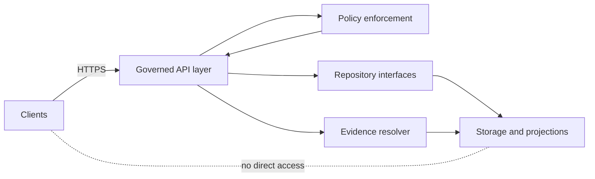

<!-- [KFM_META_BLOCK_V2]
doc_id: kfm://doc/7b02eaa0-173a-4b8b-b2f8-5f1a6b6d4201
title: API Layer Contract
type: standard
version: v1
status: draft
owners: ["@kfm-platform", "@kfm-governance"]
created: 2026-03-04
updated: 2026-03-04
policy_label: public
related: [
  "docs/architecture/README.md",
  "docs/architecture/interfaces/EVIDENCE_RESOLVER_CONTRACT.md",
  "docs/architecture/interfaces/DATA_PROMOTION_CONTRACT.md",
  "contracts/schemas/*",
  "policy/*"
]
tags: ["kfm", "architecture", "interfaces", "api", "contract", "trust-membrane"]
notes: [
  "This contract defines the governed API boundary between clients and KFM data/services.",
  "It is written to be test-enforced (fail-closed) and evidence-first."
]
[/KFM_META_BLOCK_V2] -->

# API Layer Contract

One-line purpose: define the **governed API layer** contract that enforces KFM policy, provenance, and “cite-or-abstain” behavior for Map, Story, and Focus Mode.

> **Status:** draft · **Contract version:** v1 · **Policy label:** public  
> **Owners:** @kfm-platform · @kfm-governance  
> **Non-negotiables:** trust membrane, policy-safe errors, evidence resolution, audit receipts

---

## Evidence status legend

This document is intentionally explicit about what is **already required** vs what is **an implementation proposal**.

- **CONFIRMED** — present in KFM vNext design docs and treated as non-negotiable behavior.
- **PROPOSED** — a concrete, implementable choice not yet confirmed as the repo’s current behavior.
- **UNKNOWN** — not found in available sources; includes the minimum steps required to confirm.

---

## Scope

- **CONFIRMED:** This contract governs the API boundary used by **Map Explorer**, **Stories**, **Catalog**, and **Focus Mode** clients.
- **CONFIRMED:** The API layer is the **trust membrane**: clients never access storage or databases directly; policy and evidence are applied here.
- **PROPOSED:** “API layer” includes:
  - HTTP REST endpoints under `/api/v1/...`
  - a Policy Enforcement Point that evaluates policies and applies obligations
  - an Evidence Resolver endpoint used by UI, Story publishing, and Focus Mode

### Non-goals

- **CONFIRMED:** This contract does not allow clients to bypass governance by reading from DB/storage directly.
- **PROPOSED:** This contract does not specify internal storage schema; it specifies **stable external DTOs** only.
- **PROPOSED:** This contract does not define pipeline ETL behavior (see Data Promotion Contract instead).

---

## Where it fits in the system



- **CONFIRMED:** The UI is a governed client: it renders what the API returns and does not hold privileged credentials.
- **CONFIRMED:** Canonical “truth” artifacts live in object storage plus catalogs and provenance; databases and indexes are rebuildable projections.
- **CONFIRMED:** Backend logic should use repository interfaces and must not bypass them to reach storage.

---

## Contract invariants

### Trust membrane rules

- **CONFIRMED:** **No direct client access** to DB/storage.
- **CONFIRMED:** Backend access to storage/DB/search/graph must go through **repository interfaces**.
- **CONFIRMED:** All data returned to clients must be **policy-filtered** and **policy-labeled**.
- **PROPOSED:** Enforce with *both*:
  - network policy (private subnets / security groups / service mesh allowlists)
  - static checks in CI (denylist of direct DB client usage in UI packages)

### Evidence-first rules

- **CONFIRMED:** A “citation” is an **EvidenceRef** that resolves to an **EvidenceBundle**, not a pasted URL.
- **CONFIRMED:** Story publishing and Focus Mode have a hard gate: **citations must resolve and be policy-allowed** or the system must narrow scope / abstain.
- **CONFIRMED:** Evidence resolution must apply policy and redaction obligations.

### Fail-closed rules

- **CONFIRMED:** If policy cannot be evaluated, default is **deny**.
- **CONFIRMED:** If an EvidenceRef cannot be resolved, default is **deny** for publication flows and **abstain** for Focus Mode.
- **PROPOSED:** If an endpoint cannot safely determine whether something exists without leaking, respond with a policy-safe error shape and behavior consistent with the 403/404 alignment rules below.

---

## API-wide conventions

### Transport and formats

- **PROPOSED:** Base URL: `https://<host>/api/v1`
- **PROPOSED:** All request and response bodies use `application/json; charset=utf-8` unless otherwise specified.
- **PROPOSED:** Time format: RFC 3339 timestamps in UTC (e.g., `2026-03-04T18:22:01Z`).

### Authentication and authorization

- **CONFIRMED:** Clients do not embed privileged credentials.
- **PROPOSED:** Auth is bearer-token based (JWT or opaque token) with role claims evaluated by policy.
- **PROPOSED:** Every request is evaluated with:
  - `principal_id`
  - `roles`
  - `policy_context` (tenant, environment, purpose, if applicable)

### Correlation and idempotency

- **PROPOSED:** Clients send `X-Request-Id` (UUID). Server echoes `X-Request-Id`.
- **PROPOSED:** Governed write-like operations (e.g., Story publish) accept `Idempotency-Key`.

### Pagination

- **PROPOSED:** List endpoints support:
  - `limit` (default 50, max 500)
  - `cursor` (opaque)
  - deterministic ordering by stable key

### Caching

- **CONFIRMED:** Tile delivery caching must vary by policy/auth context.
- **PROPOSED:** Use `Vary: Authorization, X-Policy-Context` and include `Cache-Control` policies per endpoint.

---

## Common response requirements

### Common fields

- **CONFIRMED:** Every response includes, when applicable:
  - `dataset_version_id`
  - artifact digests
  - a policy label
  - `audit_ref` for governed operations
- **PROPOSED:** Standard response envelope:

```json
{
  "policy": {
    "decision": "allow",
    "policy_label": "public",
    "obligations_applied": []
  },
  "audit_ref": "kfm://audit/entry/123",
  "data": {}
}
```

**Notes**
- **CONFIRMED:** `audit_ref` is required for governed operations such as Focus Mode and Story publish.
- **PROPOSED:** For read-only endpoints, `audit_ref` MAY be omitted unless policy requires traceability.

### Policy object

- **CONFIRMED:** Policy decisions can include obligations (e.g., redaction/generalization).
- **PROPOSED:** `policy` object fields:
  - `decision`: `allow | deny`
  - `policy_label`: `public | restricted | ...`
  - `obligations_applied`: list of machine-readable obligations (e.g., `geometry_generalized:h3_r6`)

### Dataset version object

- **PROPOSED:** When a response is dataset-derived, return:

```json
{
  "dataset_version_id": "2026-02.abcd1234",
  "digests": {
    "dcat_sha256": "sha256:...",
    "stac_sha256": "sha256:...",
    "prov_sha256": "sha256:..."
  }
}
```

---

## Error contract

- **CONFIRMED:** Errors use a **stable error model** that includes an `error_code`, a policy-safe `message`, and `audit_ref`.
- **CONFIRMED:** Avoid leaking existence through differences in error shape or behavior; align 403/404 with policy.

**PROPOSED error shape**

```json
{
  "error": {
    "error_code": "POLICY_DENY",
    "message": "Not available.",
    "audit_ref": "kfm://audit/entry/456",
    "remediation": {
      "hint": "Request access or choose a public dataset."
    }
  }
}
```

**PROPOSED 403/404 alignment**

- For protected resources, respond with the **same error_code family** and avoid revealing whether a resource exists.
- Log the precise reason internally (redacted log policy applies).

---

## API surface

This list is the minimum governed surface required for Map, Story, and Focus Mode.

| Method | Path | Purpose | Governance notes | Status |
|---:|---|---|---|---|
| GET | `/api/v1/catalog/datasets` | Dataset discovery via catalogs | Hide restricted by default; filter by role | **CONFIRMED** |
| GET | `/api/v1/datasets/{dataset_version_id}/query` | Query a policy-safe slice by bbox, time, filters | Enforce policy; generalize outputs if required | **CONFIRMED** |
| GET | `/api/v1/tiles/{layer_id}/{z}/{x}/{y}` | Tile delivery | Only policy-safe tiles; cache varies by policy/auth | **CONFIRMED** |
| GET | `/api/v1/stac/collections` | Browse STAC collections | Cross-linked to DCAT/PROV; returns digests | **CONFIRMED** |
| GET | `/api/v1/stac/items` | Browse/query STAC items | Cross-linked to DCAT/PROV; returns digests | **CONFIRMED** |
| POST | `/api/v1/evidence/resolve` | Resolve EvidenceRef into EvidenceBundle | Fail closed if unresolvable/unauthorized | **CONFIRMED** |
| GET | `/api/v1/lineage/{dataset_id}` | Lineage graph and run receipts | May redact sensitive fields | **CONFIRMED** |
| GET | `/api/v1/story` | Read Story Nodes | Returned stories must be policy-safe | **CONFIRMED** |
| POST | `/api/v1/story` | Publish Story Nodes | Requires review state and resolvable citations | **CONFIRMED** |
| POST | `/api/v1/focus/ask` | Focus Mode Q&A with citations | Must cite or abstain; governed run with receipt | **CONFIRMED** |

---

## Evidence resolver contract

### Endpoint

- **CONFIRMED:** `POST /api/v1/evidence/resolve`

### Input

- **PROPOSED:** EvidenceRef is a typed reference:

```json
{
  "kind": "stac",
  "ref": {
    "collection_id": "storms",
    "item_id": "storm-2026-02-19"
  }
}
```

### Output

- **CONFIRMED:** The resolver returns an EvidenceBundle that includes:
  - bundle id and digests
  - dataset_version_id
  - policy decision and obligations
  - license attribution
  - provenance run id
  - artifact list with digests and media types
  - checks summary and audit_ref

**CONFIRMED template**

```json
{
  "bundle_id": "sha256:bundle...",
  "dataset_version_id": "2026-02.abcd1234",
  "title": "Storm event record: 2026-02-19",
  "policy": {
    "decision": "allow",
    "policy_label": "public",
    "obligations_applied": []
  },
  "license": { "spdx": "CC-BY-4.0", "attribution": "Source org" },
  "provenance": { "run_id": "kfm://run/2026-02-20T12:00:00Z.abcd" },
  "artifacts": [
    { "href": "processed/events.parquet", "digest": "sha256:2222", "media_type": "application/x-parquet" }
  ],
  "checks": { "catalog_valid": true, "links_ok": true },
  "audit_ref": "kfm://audit/entry/123"
}
```

### Required behaviors

- **CONFIRMED:** Fail closed if:
  - EvidenceRef is unresolvable
  - EvidenceRef resolves to something not permitted for the caller
- **PROPOSED:** Resolver must be usable by UI in at most 2 calls:
  1) UI receives EvidenceRefs from other endpoints
  2) UI resolves to EvidenceBundles for display

---

## Dataset discovery and querying

### Dataset discovery

- **CONFIRMED:** `GET /api/v1/catalog/datasets`
- **PROPOSED response fields:**
  - dataset_id
  - dataset_version_id
  - title, description
  - policy_label
  - last_run_ts
  - license summary (spdx + attribution short)

### Dataset slice query

- **CONFIRMED:** `GET /api/v1/datasets/{dataset_version_id}/query`
- **PROPOSED query params:**
  - `bbox` as `minLon,minLat,maxLon,maxLat`
  - `time` as `start,end` (RFC 3339)
  - `filters` as URL-encoded JSON or repeated `filter=` params
  - `format` as `geojson | parquet | json` depending on dataset projection

- **CONFIRMED:** The API must enforce policy and may return generalized outputs if required.

---

## Tiles contract

- **CONFIRMED:** `GET /api/v1/tiles/{layer_id}/{z}/{x}/{y}`

**PROPOSED behaviors**
- Return 204 when a tile is empty after policy filtering.
- Include `dataset_version_id` and `policy_label` in response headers:
  - `X-KFM-Dataset-Version-Id`
  - `X-KFM-Policy-Label`
- Ensure caching varies by authorization/policy context.

---

## Lineage contract

- **CONFIRMED:** `GET /api/v1/lineage/{dataset_id}`

**PROPOSED output**
- dataset_id
- latest dataset_version_id
- run receipts list with digests
- edges suitable for graph rendering
- policy redactions applied where needed

---

## Story contract

- **CONFIRMED:** Story publishing is governed and requires review state and resolvable citations.
- **PROPOSED:** Story publish accepts:
  - markdown content
  - view_state
  - list of EvidenceRefs referenced by the story

- **PROPOSED:** On publish, the API verifies:
  - every EvidenceRef resolves
  - every resolved EvidenceBundle is policy-allowed
  - all rights metadata is present

---

## Focus Mode contract

- **CONFIRMED:** Focus Mode is a governed run with a receipt.
- **CONFIRMED:** Control loop includes policy pre-check, retrieval plan, evidence retrieval, evidence bundling, synthesis, hard citation verification, and audit receipt creation.

### Endpoint

- **CONFIRMED:** `POST /api/v1/focus/ask`

### Input

- **CONFIRMED:** Inputs include user query, optional view_state, and user role/policy context.
- **PROPOSED request shape**

```json
{
  "query": "What floods occurred in Kansas in 1951 and what evidence supports it?",
  "view_state": {
    "bbox": [-102.1, 36.9, -94.6, 40.1],
    "time_window": ["1951-01-01T00:00:00Z", "1951-12-31T23:59:59Z"],
    "active_layers": ["hydrology:nwis", "events:storms"]
  }
}
```

### Output

- **CONFIRMED:** Outputs include answer text, citations as EvidenceRefs, and an audit_ref.
- **PROPOSED response shape**

```json
{
  "policy": { "decision": "allow", "policy_label": "public", "obligations_applied": [] },
  "audit_ref": "kfm://run/2026-03-04T18:22:01Z.q1w2e3",
  "answer": {
    "text": "…",
    "citations": [
      { "kind": "stac", "ref": { "collection_id": "storms", "item_id": "storm-1951-07-xx" } }
    ],
    "abstained": false
  }
}
```

### Required behaviors

- **CONFIRMED:** If citations cannot be verified and resolved as policy-allowed, Focus Mode must abstain or reduce scope.
- **PROPOSED:** The service stores a run receipt containing:
  - query hash
  - EvidenceBundle digests
  - policy decisions and obligations
  - model identifier and version
  - latency and output hash

---

## Audit and observability

- **CONFIRMED:** Every governed operation must emit an audit log record that includes who, what, when, why, inputs and outputs by digest, and policy decisions.
- **CONFIRMED:** Audit logs are sensitive and must follow redaction and retention policy.

**PROPOSED minimal audit log schema**

```json
{
  "audit_ref": "kfm://audit/entry/123",
  "ts": "2026-03-04T18:22:01Z",
  "principal_id": "user:123",
  "roles": ["public"],
  "endpoint": "POST /api/v1/focus/ask",
  "request_id": "9e1f...",
  "policy": { "decision": "allow", "policy_label": "public", "reason_codes": [] },
  "inputs": { "digests": ["sha256:..."] },
  "outputs": { "digests": ["sha256:..."] }
}
```

---

## Test and CI gates

This contract is only meaningful if it is enforced automatically.

- **CONFIRMED:** Contract tests and schema linting must block merges on regressions.
- **PROPOSED:** Minimum gate suite:
  - OpenAPI schema snapshot tests
  - JSON Schema validation for DTOs and error model
  - Policy fixture tests for allow/deny and obligations
  - 403/404 leakage tests
  - Evidence resolver integration tests
  - “cite-or-abstain” Focus Mode golden query harness

---

## Unknowns and minimum verification steps

- **UNKNOWN:** Exact path names in the current repo for:
  - schema files
  - policy bundles
  - OpenAPI source of truth
- **UNKNOWN:** Current authentication mechanism and role model.

**Minimum steps to confirm**
1. Locate existing API spec files and confirm canonical base path and endpoint names.
2. Identify the current policy evaluation mechanism and how obligations are surfaced.
3. Confirm whether `audit_ref` is required on all endpoints or only governed operations.
4. Confirm which endpoints already exist and add missing ones behind `/api/v1` only.

---
