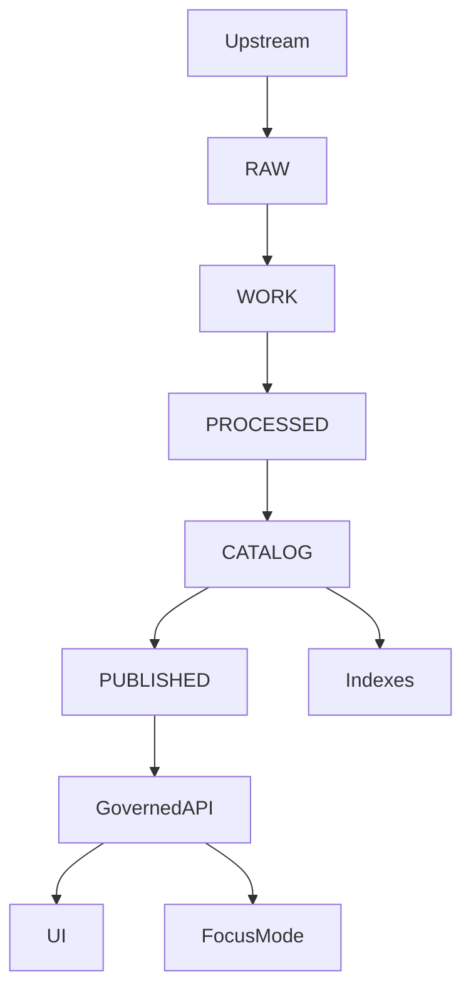

<!-- [KFM_META_BLOCK_V2]
doc_id: kfm://doc/af95a260-3c16-4506-92bb-b31f195cb120
title: CATALOG Triplet Contract
type: standard
version: v1
status: draft
owners: [TODO-kfm-platform, TODO-data-stewards]
created: 2026-03-04
updated: 2026-03-04
policy_label: public
related: [
  kfm://concept/truth-path,
  kfm://concept/promotion-contract,
  kfm://concept/evidence-resolver,
  docs/architecture/interfaces/,
  contracts/
]
tags: [kfm, architecture, interface, catalog, dcat, stac, prov, promotion-contract]
notes: [
  "Defines the CATALOG zone 'triplet' (DCAT+STAC+PROV) as an enforceable interface boundary.",
  "Primary enforcement target: Promotion Contract Gate D (Catalog triplet validation)."
]
[/KFM_META_BLOCK_V2] -->

# CATALOG Triplet Contract
Defines the **minimum required artifacts + cross-links** for the **CATALOG zone** evidence surface (**DCAT + STAC + PROV**) so promotion can be validated and **EvidenceRefs resolve deterministically**.

---

## Impact
**Status:** draft (not yet ratified)  
**Owners:** TODO-kfm-platform, TODO-data-stewards  
**Primary gate:** Promotion Contract — **Gate D (Catalog triplet validation)**  
**Policy label:** public

Badges (placeholders):
- [](#impact)
- [](#catalog-triplet-contract)
- [](#validation-and-ci-gates)
- [](#policy-and-sensitivity)

Quick links:
- [Scope](#scope)
- [Where it fits](#where-it-fits)
- [Artifact set](#artifact-set)
- [Requirements registry](#requirements-registry)
- [Cross-linking rules](#cross-linking-rules)
- [Validation and CI gates](#validation-and-ci-gates)
- [Definition of Done](#definition-of-done)
- [Unknowns](#unknowns-and-minimum-verification-steps)

---

## Scope
**In scope**
- The **CATALOG/TRIPLET** artifact surface for a **single dataset_version_id**:
  - **DCAT** dataset metadata record (dataset-level “what is this?”)
  - **STAC** collection/item metadata (asset-level “what files exist?”)
  - **PROV** lineage bundle (process-level “how was it produced?”)
- The **cross-links** required so navigation and citations are deterministic.
- The **minimum validations** required for promotion gates (fail-closed).

**Out of scope**
- Defining upstream ingestion mechanics (connectors), QA thresholds, or run receipt schemas (handled by other contracts/gates).
- Runtime API responses (governed API / evidence resolver contracts live elsewhere).
- Detailed domain schemas (soil, census, archaeology, etc.) beyond what must be referenced by the triplet.

---

## Where it fits
This contract is the interface boundary between **pipeline outputs** and **runtime surfaces**.



**Contract intent:** if a dataset version is promoted to **PUBLISHED**, its **CATALOG triplet MUST be complete, valid, and cross-linked**.

---

## Normative language
This document uses:
- **MUST / MUST NOT**: required for compliance (promotion gate failure if violated)
- **SHOULD / SHOULD NOT**: strongly recommended; deviations must be justified and recorded
- **MAY**: optional

**Evidence discipline tags**
- **[CONFIRMED]**: requirement is explicitly stated as a KFM invariant / gate expectation
- **[PROPOSED]**: requirement is documented as a proposed minimum profile/pattern; treat as draft until ratified
- **[UNKNOWN]**: not yet specified; includes minimum verification steps to make it CONFIRMED

---

## Definitions
- **dataset_id**: stable dataset identifier used across DCAT/STAC/PROV and citations.
- **dataset_version_id**: immutable version identifier for a dataset release/promotion unit.
- **triplet**: the set `{DCAT dataset record, STAC collection/item(s), PROV bundle}` for one dataset_version_id.
- **artifact**: a concrete file/object produced by the pipeline (raw/work/processed/catalog).
- **distribution** (DCAT): a concrete access representation of an artifact class (e.g., “GeoParquet”, “COG”, “PMTiles”, “STAC Item JSON”).
- **asset** (STAC): an artifact link with media type and integrity metadata.
- **EvidenceRef**: a resolvable reference that the evidence resolver can map to an EvidenceBundle without guessing.
- **policy_label**: sensitivity classification used by policy enforcement to allow/deny access and apply obligations.
- **obligations**: policy-mandated transformations or UX notices (e.g., “geometry generalized”).

---

## Artifact set
### Required outputs per dataset_version_id
| Artifact | Status | Required | Notes |
|---|---:|:---:|---|
| DCAT dataset record (JSON-LD) | [CONFIRMED] | ✅ | Dataset-level metadata; license/rights; distributions; links to PROV. |
| STAC item(s) (JSON) | [CONFIRMED] | ✅ | Asset-level metadata; extents; assets; integrity; links to DCAT + PROV. |
| STAC collection (JSON) | [PROPOSED] | ✅/⚠️ | REQUIRED when multiple items or time/version grouping is needed; MAY be omitted for single-item datasets. |
| PROV bundle (JSON-LD or PROV-JSON) | [CONFIRMED] | ✅ | Lineage: entities/activities/agents; environment/tooling capture; policy decisions (as references). |
| Triplet manifest (single “index” file) | [PROPOSED] | ⚠️ | Strongly recommended to make Gate D deterministic and tooling-simple. |
| Run receipt link(s) | [CONFIRMED] | ⚠️ | Gate F is separate, but Gate D must be able to *resolve* links to receipts where present. |

---

## Requirements registry
### R0 — Base invariants
| ID | Status | Requirement | Verification (fail-closed) |
|---|---|---|---|
| CTC-R0-001 | [CONFIRMED] | A dataset_version_id MUST NOT be promoted unless the triplet exists. | CI gate checks file presence + schema validation. |
| CTC-R0-002 | [CONFIRMED] | DCAT, STAC, and PROV MUST validate against their declared KFM profiles. | `validate_dcat`, `validate_stac`, `validate_prov` (or equivalents). |
| CTC-R0-003 | [CONFIRMED] | The triplet MUST cross-link so EvidenceRefs resolve **without guessing**. | Crosslink checker; link-check; evidence resolver unit test. |
| CTC-R0-004 | [CONFIRMED] | Each triplet component MUST carry dataset_id and dataset_version_id (directly or by deterministic derivation). | Lint rule + schema requirement. |
| CTC-R0-005 | [CONFIRMED] | The triplet MUST be policy-label aware (policy_label present; obligations discoverable). | Conftest/OPA policy tests; metadata lint. |

---

## DCAT requirements
> DCAT answers: “What is this dataset? Who published it? What is the license? What are the distributions?”

### DCAT minimum fields
| ID | Status | Requirement | Verification |
|---|---|---|---|
| CTC-DCAT-001 | [PROPOSED] | DCAT record MUST be typed as a dataset (`dcat:Dataset`). | JSON-LD shape validation. |
| CTC-DCAT-002 | [PROPOSED] | MUST include: title, description, publisher, license or rights. | JSON-LD shape validation. |
| CTC-DCAT-003 | [PROPOSED] | MUST include: theme (controlled vocabulary) and spatial + temporal coverage. | Controlled-vocab lint + shape validation. |
| CTC-DCAT-004 | [PROPOSED] | MUST include ≥1 distribution (`dcat:distribution`) per artifact class intended for use in PUBLISHED. | Distribution count rule. |
| CTC-DCAT-005 | [PROPOSED] | MUST link to PROV bundle/activity via `prov:wasGeneratedBy` (or equivalent resolvable predicate). | Crosslink checker. |
| CTC-DCAT-006 | [CONFIRMED] | MUST include policy_label and identifiers (dataset_id, dataset_version_id). | Lint rule + schema requirement. |

### DCAT distribution integrity
| ID | Status | Requirement | Verification |
|---|---|---|---|
| CTC-DCAT-INT-001 | [PROPOSED] | Each distribution SHOULD include artifact digests (sha256) and media type. | Integrity checker. |
| CTC-DCAT-INT-002 | [PROPOSED] | Distribution access URLs MUST be resolvable by governed services (not “guessable” relative paths in UI code). | Link-checker + API resolver tests. |

---

## STAC requirements
> STAC answers: “What assets exist? What are their spatiotemporal extents? Where are the files?”

### STAC Collection minimum (when used)
| ID | Status | Requirement | Verification |
|---|---|---|---|
| CTC-STAC-COL-001 | [PROPOSED] | Collection MUST include id, title, description, extent (spatial bbox; temporal interval), and license. | STAC validation + extension validation. |
| CTC-STAC-COL-002 | [PROPOSED] | Collection MUST link to the DCAT dataset record (`rel="describedby"` or equivalent). | Crosslink checker. |
| CTC-STAC-COL-003 | [PROPOSED] | Collection MUST include dataset_version_id and policy label. | Lint rule + schema requirement. |

### STAC Item minimum
| ID | Status | Requirement | Verification |
|---|---|---|---|
| CTC-STAC-ITEM-001 | [PROPOSED] | Item MUST include id and geometry or bbox. | STAC validation. |
| CTC-STAC-ITEM-002 | [PROPOSED] | Item MUST include datetime OR start/end. | STAC validation + lint. |
| CTC-STAC-ITEM-003 | [PROPOSED] | Item MUST include assets with `href`, `media_type/type`, roles, and checksums. | STAC validation + integrity checker. |
| CTC-STAC-ITEM-004 | [PROPOSED] | Item MUST link to DCAT distribution(s) that describe the same processed artifacts. | Crosslink checker. |
| CTC-STAC-ITEM-005 | [PROPOSED] | Item MUST link to PROV activity bundle and/or run receipt. | Crosslink checker + resolver test. |
| CTC-STAC-ITEM-006 | [CONFIRMED] | Item MUST carry policy label and identifiers (dataset_id, dataset_version_id). | Lint rule + schema requirement. |
| CTC-STAC-ITEM-007 | [PROPOSED] | Geometry/bbox MUST be consistent with policy_label obligations (e.g., generalized or omitted when required). | Policy tests + geometry lint. |

---

## PROV requirements
> PROV answers: “How were these outputs created? Which inputs, which tools, which parameters?”

### PROV minimum bundle
| ID | Status | Requirement | Verification |
|---|---|---|---|
| CTC-PROV-001 | [PROPOSED] | MUST include at least one `prov:Activity` representing the pipeline run that generated the dataset_version_id. | PROV validation. |
| CTC-PROV-002 | [PROPOSED] | MUST include `prov:Entity` nodes for each referenced artifact class: raw, work (if any), processed, catalog. | PROV validation + completeness lint. |
| CTC-PROV-003 | [PROPOSED] | MUST include `prov:Agent` for pipeline/software AND steward/promotion events (where applicable). | PROV validation + lint. |
| CTC-PROV-004 | [PROPOSED] | MUST include `prov:used` and `prov:wasGeneratedBy` edges linking inputs→activities→outputs. | PROV validation + graph check. |
| CTC-PROV-005 | [PROPOSED] | MUST capture environment: container image digest, git commit, parameter hash (or equivalent). | PROV lint + CI injection test. |
| CTC-PROV-006 | [PROPOSED] | MUST carry policy decision references (decision_id + obligations) as resolvable references. | Policy/evidence resolver tests. |

---

## Cross-linking rules
### Goal
Make navigation deterministic:
- DCAT → distributions → artifacts (and digests)
- DCAT → PROV bundle
- STAC collection/item → DCAT dataset/distributions
- STAC item → PROV activity and/or run receipt
- EvidenceRef schemes resolve into these objects **without guessing**

### Link matrix (required)
| From | To | Status | Required link type |
|---|---|---|---|
| DCAT dataset | PROV bundle/activity | [PROPOSED] | `prov:wasGeneratedBy` (or equivalent resolvable predicate) |
| DCAT dataset | STAC (collection/item) | [PROPOSED] | Distribution describing STAC JSON OR `dct:references` link |
| STAC collection | DCAT dataset | [PROPOSED] | STAC `links[]` with `rel="describedby"` |
| STAC item | DCAT distribution(s) | [PROPOSED] | STAC `links[]` with `rel="describedby"` or `rel="via"` (choose one and enforce) |
| STAC item | PROV activity / run receipt | [PROPOSED] | STAC `links[]` with `rel="derived_from"` (or equivalent enforced rel) |
| PROV entity | Artifact location | [PROPOSED] | `prov:location` points to the same href/path used by STAC/DCAT (or a digest-addressed equivalent) |

**CTC-XREF-001 [CONFIRMED]**: link traversal MUST NOT require heuristics (no “guessing” file names or folders).

---

## Policy and sensitivity
### policy_label (starter list)
| Value | Status | Meaning (summary) |
|---|---|---|
| public | [PROPOSED] | Fully shareable in runtime surfaces. |
| public_generalized | [PROPOSED] | Shareable but geometry/fields generalized; UI must show notice obligation. |
| restricted | [PROPOSED] | Metadata visible; artifact links gated by role/approval. |
| restricted_sensitive_location | [PROPOSED] | Strong protections; location generalized/withheld; default deny for exports. |
| internal | [PROPOSED] | Visible only to internal roles. |
| embargoed | [PROPOSED] | Time-gated; release date required. |
| quarantine | [PROPOSED] | Not promotable; catalog exists only for internal triage. |

### Required policy fields
| ID | Status | Requirement | Verification |
|---|---|---|---|
| CTC-POL-001 | [CONFIRMED] | DCAT, STAC, and PROV MUST expose policy_label as a first-class field. | Metadata lint + conftest. |
| CTC-POL-002 | [CONFIRMED] | If policy_label implies obligations, obligations MUST be discoverable via evidence resolution (and/or referenced from PROV). | Evidence resolver tests. |
| CTC-POL-003 | [PROPOSED] | If policy_label is restricted*, catalogs MAY expose only “metadata stubs” and MUST avoid direct public hrefs. | Policy tests + link-checker. |

---

## Validation and CI gates
### Gate D — Catalog triplet validation (fail-closed)
| Check | Status | What fails the gate |
|---|---|---|
| Schema validation | [CONFIRMED] | Any of DCAT/STAC/PROV fails profile validation. |
| Crosslink validation | [CONFIRMED] | Missing or broken links; IDs don’t align; EvidenceRefs don’t resolve deterministically. |
| Integrity validation | [PROPOSED] | Missing checksums/media types for referenced assets; digest mismatch. |
| Policy validation | [CONFIRMED] | Missing policy_label; policy tests fail; restricted content accidentally exposed as public. |

### Recommended tooling hooks (non-authoritative names)
**These are examples; the contract is the behavior, not the script name.**
- `validate_dcat` (JSON-LD shape)
- `validate_stac` (STAC 1.0 + extensions)
- `validate_prov` (PROV-JSON/JSON-LD checks)
- `xref_triplet` (cross-link checker)
- `check_assets` (digest + media type)
- `conftest` (OPA/Rego policy tests)

---

## Examples
> Examples are intentionally small; treat them as **structure hints**, not full schemas.

### Example STAC Item (skeleton)
```json
{
  "stac_version": "1.0.0",
  "type": "Feature",
  "id": "example_dataset__2026-01-01",
  "bbox": [-102.0, 36.9, -94.6, 40.0],
  "geometry": null,
  "properties": {
    "datetime": "2026-01-01T00:00:00Z",
    "kfm:dataset_id": "kfm:example/example_dataset",
    "kfm:dataset_version_id": "kfm:example/example_dataset@2026-01-01",
    "kfm:policy_label": "public"
  },
  "assets": {
    "data": {
      "href": "s3://kfm/processed/example/example_dataset/2026-01-01/data.parquet",
      "type": "application/x-parquet",
      "roles": ["data"],
      "checksum:sha256": "TODO"
    }
  },
  "links": [
    { "rel": "describedby", "href": "s3://kfm/catalog/dcat/example_dataset__2026-01-01.jsonld", "type": "application/ld+json" },
    { "rel": "derived_from", "href": "s3://kfm/catalog/prov/example_dataset__2026-01-01.prov.json", "type": "application/json" }
  ]
}
```

### Example DCAT Dataset (skeleton)
```json
{
  "@context": "https://www.w3.org/ns/dcat3.jsonld",
  "@type": "dcat:Dataset",
  "dct:title": "Example Dataset",
  "dct:description": "Example description.",
  "dct:publisher": { "@type": "foaf:Organization", "foaf:name": "TODO" },
  "dct:license": "CC-BY-4.0",
  "dct:identifier": [
    "kfm:example/example_dataset",
    "kfm:example/example_dataset@2026-01-01"
  ],
  "kfm:dataset_id": "kfm:example/example_dataset",
  "kfm:dataset_version_id": "kfm:example/example_dataset@2026-01-01",
  "kfm:policy_label": "public",
  "dcat:distribution": [
    {
      "@type": "dcat:Distribution",
      "dct:title": "GeoParquet distribution",
      "dcat:accessURL": "s3://kfm/processed/example/example_dataset/2026-01-01/data.parquet",
      "dcat:mediaType": "application/x-parquet",
      "spdx:checksum": "sha256:TODO"
    }
  ],
  "prov:wasGeneratedBy": "s3://kfm/catalog/prov/example_dataset__2026-01-01.prov.json"
}
```

### Example PROV Bundle (skeleton)
```json
{
  "entity": {
    "raw:input_1": { "prov:label": "Upstream payload", "prov:location": "s3://kfm/raw/.../payload.json" },
    "processed:data": { "prov:label": "Processed GeoParquet", "prov:location": "s3://kfm/processed/.../data.parquet" },
    "catalog:stac_item": { "prov:label": "STAC Item JSON", "prov:location": "s3://kfm/catalog/stac/.../item.json" },
    "catalog:dcat": { "prov:label": "DCAT JSON-LD", "prov:location": "s3://kfm/catalog/dcat/.../dataset.jsonld" }
  },
  "activity": {
    "act:run": {
      "prov:label": "Pipeline run",
      "prov:startedAtTime": "2026-01-01T00:00:00Z",
      "prov:endedAtTime": "2026-01-01T00:10:00Z",
      "kfm:git_sha": "TODO",
      "kfm:container_digest": "TODO",
      "kfm:parameter_hash": "TODO"
    }
  },
  "agent": {
    "agent:pipeline": { "prov:type": "prov:SoftwareAgent", "prov:label": "KFM pipeline runner" }
  },
  "wasAssociatedWith": {
    "waw_1": { "prov:activity": "act:run", "prov:agent": "agent:pipeline" }
  },
  "used": {
    "u1": { "prov:activity": "act:run", "prov:entity": "raw:input_1" }
  },
  "wasGeneratedBy": {
    "g1": { "prov:entity": "processed:data", "prov:activity": "act:run" },
    "g2": { "prov:entity": "catalog:stac_item", "prov:activity": "act:run" },
    "g3": { "prov:entity": "catalog:dcat", "prov:activity": "act:run" }
  }
}
```

---

## Definition of Done
Use this checklist when authoring a dataset promotion PR.

- [ ] **Triplet exists** for dataset_version_id (DCAT + STAC + PROV).
- [ ] **Schema validations pass** for DCAT/STAC/PROV profiles.
- [ ] **Cross-links verified**: DCAT↔STAC↔PROV navigation works without guessing.
- [ ] **Integrity metadata present**: assets/distributions have media type + digest (as required by policy).
- [ ] **policy_label present** in all three artifacts; obligations represented and testable.
- [ ] **Evidence resolution test** passes for at least:
  - [ ] DCAT record ref
  - [ ] STAC item ref
  - [ ] PROV activity/entity ref

---

## Unknowns and minimum verification steps
| Topic | Status | Minimum step to confirm |
|---|---|---|
| Canonical on-disk paths for triplet artifacts | [UNKNOWN] | Verify current repo conventions under `data/catalog/{dcat,stac,prov}`; record as an ADR or update this contract. |
| Exact KFM namespaces/field names (`kfm:*`) for dataset_id/version/policy | [UNKNOWN] | Locate existing JSON Schemas / validators; align field names and enforce in schemas. |
| Which DCAT profile is authoritative (DCAT v3 vs DCAT-US alignment) | [UNKNOWN] | Decide governance target; update contracts/ with profile schemas and examples. |
| Which STAC link rel values are enforced (`describedby`, `derived_from`, `via`, etc.) | [UNKNOWN] | Choose one rel mapping; encode as lint rule + link checker. |
| Minimum PROV serialization format (PROV-JSON vs JSON-LD PROV-O) | [UNKNOWN] | Select canonical format; ship validator and fixtures; update contract examples. |

---

## Appendix
<details>
<summary>Proposed reference layout (example only)</summary>

> This is a **PROPOSED** convention and must be verified against the live repo before enforcement.

```text
data/
  raw/
  work/
  processed/
    <theme>/
      <dataset>/
        <version>/
          manifest.json
          SHA256SUMS.txt
          LICENSE.txt
  catalog/
    dcat/
      datasets/
        <dataset>__<version>.jsonld
    stac/
      collections/
        <dataset>.json
      items/
        <dataset>__<version>.json
    prov/
      <dataset>__<version>.prov.json
```
</details>

---

## Back to top
- [Back to top](#catalog-triplet-contract)
