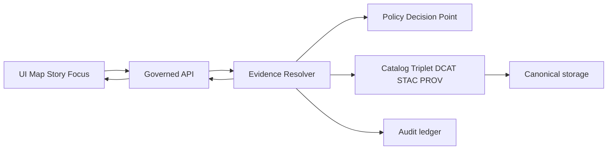

<!-- [KFM_META_BLOCK_V2]
doc_id: kfm://doc/3a9a6c59-5f7f-4a50-b02d-4a6e0b2c5012
title: Evidence Resolver Contract
type: standard
version: v1
status: draft
owners: TODO:kfm-architecture
created: 2026-03-04
updated: 2026-03-04
policy_label: public
related: [
  "docs/architecture/interfaces/",
  "docs/architecture/*",
  "contracts/schemas/*"
]
tags: [kfm, architecture, interface, evidence, policy, provenance]
notes: [
  "Normative contract for resolving EvidenceRefs into policy-allowed EvidenceBundles.",
  "Uses CONFIRMED/PROPOSED/UNKNOWN evidence discipline; unknowns are explicitly listed."
]
[/KFM_META_BLOCK_V2] -->

# Evidence Resolver Contract
One-line purpose: **Define the governed, fail-closed interface that resolves `EvidenceRef` → `EvidenceBundle` for Map/Story/Focus.**

---

## Impact
- **Status:** draft (contract-first; intended to be test-enforced)
- **Owners:** TODO:kfm-architecture (needs governance assignment)
- **Stability:** `/api/v1` MUST be backwards-compatible; breaking changes require `/api/v2`

Badges (placeholders):
- 
- 
- 

Quick nav:
- [Scope](#scope)
- [Where it fits](#where-it-fits)
- [Contract invariants](#contract-invariants)
- [Core concepts](#core-concepts)
- [HTTP contract](#http-contract)
- [EvidenceRef schemes and grammar](#evidenceref-schemes-and-grammar)
- [EvidenceBundle contract](#evidencebundle-contract)
- [Policy and obligations](#policy-and-obligations)
- [Errors](#errors)
- [CI and test gates](#ci-and-test-gates)
- [Versioning](#versioning)
- [Open questions](#open-questions)

---

## Scope
This document is the **normative contract** for the Evidence Resolver boundary.

- **CONFIRMED:** An Evidence Resolver turns `EvidenceRef` into an inspectable `EvidenceBundle` (not “LLM citations”), and both **Story publishing** and **Focus Mode** treat “all citations resolve + policy-allowed” as a **hard gate** (fail-closed).  
- **CONFIRMED:** The Evidence Resolver is a **policy enforcement point** (PEP) and must apply policy + obligations before returning evidence.  
- **PROPOSED:** This contract is implemented as an HTTP service (`POST /api/v1/evidence/resolve`) and optionally as an in-process interface used by the governed API layer.

Out of scope:
- Policy authoring (OPA/Rego rules), except for the shape of policy inputs/outputs.
- Data ingestion / pipeline design, except where needed to define inputs (catalog triplet + receipts).
- UI implementation details, except minimal UX-facing fields (“human card” and “policy-safe errors”).

---

## Where it fits
### Upstream dependencies
- **CONFIRMED:** Catalog triplet: **DCAT** (dataset metadata), **STAC** (assets), **PROV** (lineage), cross-linked so EvidenceRefs resolve without guessing.
- **CONFIRMED:** Policy Decision Point (PDP) with shared semantics in CI and runtime (fixtures-driven).

### Downstream consumers
- **CONFIRMED:** Map Explorer “Evidence Drawer” (inspect feature/layer evidence).
- **CONFIRMED:** Story Node publishing (PR/CI citation linting + resolution gate).
- **CONFIRMED:** Focus Mode (governed Q&A with a citation verification hard gate and an audit receipt).

---

## Contract invariants
These are **non-negotiable** and should be encoded as tests that fail closed.

- **CONFIRMED — Trust membrane:** clients (UI/external) never access storage/DB directly; access crosses governed APIs that apply policy, redaction, and logging.
- **CONFIRMED — Cite-or-abstain:** if citations cannot be verified (resolved + allowed), the system must narrow scope or abstain.
- **CONFIRMED — Policy-safe behavior:** do not leak restricted existence via error differences; align 403/404 behavior with policy posture.
- **CONFIRMED — Bundle immutability:** bundles are immutable by digest; cache and signatures rely on stable digests.
- **CONFIRMED — Parse without network:** EvidenceRefs must be parseable without network calls.

---

## Core concepts

### EvidenceRef
A **citation primitive** that can be deterministically parsed and resolved.

- **CONFIRMED:** EvidenceRefs are *not* free-form URLs; they are canonical references to immutable IDs and, when needed, a span/anchor into a source.

### EvidenceBundle
The **resolution product** returned by the resolver.

- **CONFIRMED:** Must include: bundle id/digest, policy decision + obligations, renderable “cards” (human view), machine metadata (dataset_version_id, artifact digests, provenance links, rights metadata), and audit references.

### Policy decision and obligations
- **CONFIRMED:** Policy evaluation returns allow/deny plus obligations (e.g., generalize geometry, remove attributes) and reason codes suitable for audit/UX.
- **PROPOSED:** Resolver returns both the decision and an explicit statement of which obligations were applied.

### Audit reference
- **CONFIRMED:** Governed operations should emit an `audit_ref` usable for review and debugging.

---

## HTTP contract

### Endpoint
- **CONFIRMED:** `POST /api/v1/evidence/resolve`  
  Purpose: Resolve one or more EvidenceRefs into EvidenceBundles (or policy-safe errors).  
  Posture: **Fail closed** if unresolvable/unauthorized.

### Request
**PROPOSED shape** (JSON):

```json
{
  "refs": [
    "doc://sha256:abcd...#page=12&span=1832:1935",
    "stac://collection123/item456#asset=cog",
    "dcat://dataset_version:2026-02.abcd1234"
  ],
  "context": {
    "principal": {
      "role": "public"
    },
    "purpose": "ui_evidence_drawer",
    "target_policy_label": "public"
  }
}
```

Rules:
- **CONFIRMED:** EvidenceRefs MUST be syntactically validated before resolution.
- **PROPOSED:** Resolver SHOULD accept a list for batch resolution (UI efficiency).
- **PROPOSED:** `target_policy_label` enables “is this citation allowed in this Story Node / publication target?” checks without the UI making policy decisions.

### Response
**PROPOSED shape** (JSON):

```json
{
  "audit_ref": "kfm://audit/entry/123",
  "results": [
    {
      "ref": "doc://sha256:abcd...#page=12&span=1832:1935",
      "status": "allowed",
      "bundle": {
        "bundle_id": "sha256:bundle...",
        "dataset_version_id": "2026-02.abcd1234",
        "title": "Storm event record: 2026-02-19",
        "policy": {
          "decision": "allow",
          "policy_label": "public",
          "obligations_applied": []
        },
        "license": { "spdx": "CC-BY-4.0", "attribution": "Source org" },
        "provenance": { "run_id": "kfm://run/2026-02-20T12:00:00Z.abcd" },
        "artifacts": [
          {
            "href": "processed/events.parquet",
            "digest": "sha256:2222",
            "media_type": "application/x-parquet"
          }
        ],
        "checks": { "catalog_valid": true, "links_ok": true },
        "audit_ref": "kfm://audit/entry/123"
      }
    },
    {
      "ref": "dcat://dataset_version:restricted-thing",
      "status": "denied",
      "error": {
        "error_code": "EVIDENCE_POLICY_DENIED",
        "message": "Evidence is not available for this context.",
        "audit_ref": "kfm://audit/entry/123",
        "remediation": [
          "Try a broader geographic area or a public_generalized layer.",
          "Request steward review if you believe access is appropriate."
        ]
      }
    }
  ]
}
```

Response guarantees:
- **CONFIRMED:** Errors use a stable error model including `error_code`, policy-safe `message`, and `audit_ref`.
- **CONFIRMED:** Responses include policy label and (when applicable) dataset_version_id and artifact digests.

---

## EvidenceRef schemes and grammar

### Minimum scheme set
- **CONFIRMED:** `dcat://…` resolves to dataset/distribution metadata.
- **CONFIRMED:** `stac://…` resolves to collection/item/asset metadata.
- **CONFIRMED:** `prov://…` resolves to run lineage.
- **CONFIRMED:** `doc://…` resolves to governed documents with page/span anchors.
- **PROPOSED/OPTIONAL:** `graph://…` resolves to entity relations (if enabled).

### Parse rules
- **CONFIRMED:** MUST be parseable without network calls.
- **CONFIRMED:** Resolver must validate syntax and return policy-safe errors (no leakage).

### Recommended reference forms (PROPOSED)
| Scheme | Purpose | Example |
|---|---|---|
| `dcat://` | Dataset/distribution | `dcat://dataset_version:2026-02.abcd1234#dist=pmtiles` |
| `stac://` | Collection/item/asset | `stac://kfm-col/scene-0001#asset=cog` |
| `prov://` | Run lineage | `prov://kfm://run/2026-02-20T12:00:00Z.abcd` |
| `doc://` | Document span | `doc://sha256:abcd...#page=12&span=1832:1935` |
| `graph://` | Entity relationship | `graph://place/kfm.place.12345` |

> NOTE: The exact identifier formats (`dataset_version_id`, STAC ids, PROV ids) are governed by the catalog profiles; this doc only standardizes EvidenceRef parsing and resolution behavior.

### Document citations: spans and page anchors
- **CONFIRMED:** For scanned/OCR documents, citations should point to a page and a span.
- **CONFIRMED:** Recommended approach is character offsets for text highlighting; optional bounding boxes may be included when available (for precise visual highlight).

---

## EvidenceBundle contract

### Required fields
- **CONFIRMED:** `bundle_id` and digest identity.
- **CONFIRMED:** `policy` decision + obligations (and which obligations were applied).
- **CONFIRMED:** “Cards” (renderable evidence cards) and machine metadata including:
  - dataset_version_id
  - artifact digests
  - provenance links
  - rights metadata
- **CONFIRMED:** `audit_ref`

### Bundling rules
- **CONFIRMED:** Bundles are immutable by digest.
- **CONFIRMED:** Bundles may include multiple cards (e.g., dataset + run receipt + specific asset).
- **CONFIRMED:** Bundles must not include restricted artifacts for unauthorized roles.

### Metadata-only mode
- **CONFIRMED:** If rights do not allow mirroring, the system may operate in “metadata-only reference” mode (catalog item without mirroring it).
- **PROPOSED:** In metadata-only mode, the bundle MUST still include license/rights fields, but MUST NOT expose restricted artifact links.

---

## Policy and obligations

### Resolver responsibilities
- **CONFIRMED:** Apply policy checks before resolving evidence and rendering bundles.
- **CONFIRMED:** Default deny posture for sensitive-location and restricted datasets is recommended; public representations should be separate generalized derivatives where allowed.

### Obligations
Obligations are returned by policy and must be enforced by the resolver and/or downstream governed endpoints.

Examples (non-exhaustive):
- generalize geometry (grid/aggregation/jitter)
- remove sensitive attributes
- coarsen time (day → month)
- suppress small counts (minimum thresholds)

**PROPOSED enforcement rule:** the Evidence Resolver SHOULD return `obligations_applied` and SHOULD link to a redaction/generalization receipt when transformations are required.

---

## Errors

### Stable error model (CONFIRMED intent)
All errors MUST be policy-safe and stable:

```json
{
  "error_code": "EVIDENCE_REF_INVALID",
  "message": "Invalid EvidenceRef syntax.",
  "audit_ref": "kfm://audit/entry/123",
  "remediation": ["Fix scheme/anchor format.", "Run citation lint locally."]
}
```

### Recommended error codes (PROPOSED)
| error_code | Meaning | Notes |
|---|---|---|
| `EVIDENCE_REF_INVALID` | Syntax/grammar invalid | Must not trigger network calls |
| `EVIDENCE_NOT_FOUND` | Ref resolves to nothing | Must not leak restricted existence |
| `EVIDENCE_POLICY_DENIED` | Policy denied | Message must be policy-safe |
| `EVIDENCE_RIGHTS_MISSING` | Rights metadata required but missing | Blocks story publish when media included |
| `EVIDENCE_RESOLUTION_FAILED` | Internal resolution error | Includes audit_ref for debugging |
| `EVIDENCE_TIMEOUT` | Timeout | Should be retry-safe |

**CONFIRMED:** Avoid leaking sensitive existence through error differences; align 403/404 behavior with policy.

---

## CI and test gates

### Citation linting and verification
- **CONFIRMED:** CI must validate citations:
  - syntax check for EvidenceRefs
  - resolver check: resolver can resolve refs in a test environment
  - policy check: citations allowed for intended policy label
  - rights check: if media is included, rights metadata exists
- **CONFIRMED:** Story Nodes cannot be merged if citations fail (primary anti-hallucination gate for narratives).

### Minimum test categories touching this contract
- **CONFIRMED:** Policy tests: fixture-driven allow/deny + obligations.
- **CONFIRMED:** Contract tests: schema diff checks and DTO validation.
- **CONFIRMED:** Integration tests: evidence resolver resolves sample `dcat/stac/prov/doc` refs; enforces policy; no restricted leakage.

### Definition of Done for an Evidence Resolver implementation (PROPOSED checklist)
- [ ] OpenAPI (or equivalent) contract published for `/api/v1/evidence/resolve`
- [ ] JSON schemas for request/response (and examples: valid + invalid) validated in CI
- [ ] Policy fixtures cover allow/deny + obligations for each scheme
- [ ] “No restricted leakage” tests (including error-shape equivalence)
- [ ] Bundle digest stability tests (same input + same context → same `bundle_id`)
- [ ] Batch request handling tested (UI efficiency)
- [ ] Audit logging emits `audit_ref` and policy decision summary without PII leakage

---

## Versioning
- **CONFIRMED:** Freeze `/api/v1` semantics; only add backwards-compatible fields.
- **CONFIRMED:** Introduce `/api/v2` only for breaking changes.
- **PROPOSED:** Version schemas explicitly (e.g., `evidence_bundle_v1.schema.json`) and enforce via contract tests.

---

## Open questions
These must be resolved to make the contract fully enforceable in production.

- **UNKNOWN (decision needed):** Identity provider (OIDC) choice and exact role taxonomy; whether ABAC is required for partner datasets.
- **UNKNOWN:** Canonical identifier formats for `dataset_version_id`, PROV run ids, and graph ids across all stores (must be standardized in catalog profiles).
- **UNKNOWN:** Cache strategy for resolver outputs under mixed public/restricted contexts (must be keyed to policy context to avoid leakage).

Smallest verification steps to close unknowns:
1. Confirm authN/authZ approach and role model in the repo (or ADR).
2. Publish identifier format spec for dataset/version/run ids and update catalog validators.
3. Add cache policy tests ensuring no cross-context leakage (public vs restricted).

---

## Appendix: Conceptual flow


_Back to top:_ [Evidence Resolver Contract](#evidence-resolver-contract)
