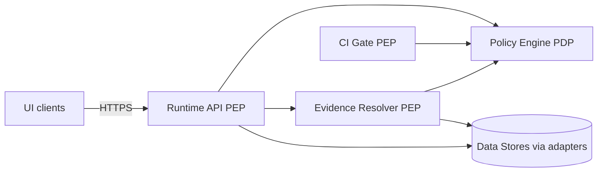

<!-- [KFM_META_BLOCK_V2]
doc_id: kfm://doc/1b4f4f80-7c9b-4a6a-97d3-58c8dd9c2e38
title: Policy Engine Contract (PDP ↔ PEP)
type: standard
version: v1
status: draft
owners: [platform, governance]
created: 2026-03-04
updated: 2026-03-04
policy_label: public
related: []
tags: [kfm, architecture, policy, opa, rego]
notes: ["Defines stable input/output shapes and fail-closed semantics for policy evaluation. Baseline PDP is OPA/Rego, but the contract is engine-agnostic."]
[/KFM_META_BLOCK_V2] -->

# Policy Engine Contract (PDP ↔ PEP)
One-line purpose: define the **stable interface** between Policy Enforcement Points (PEPs) and the Policy Decision Point (PDP) so KFM can enforce **default-deny / fail-closed** policy in **CI** and **runtime** using the same semantics.

## Where this fits
- **PDP**: Policy engine runtime (baseline: OPA + Rego policy bundles).
- **PEPs** (callers):
  - Runtime API (dataset discovery/query, tiles, exports)
  - Evidence resolver (EvidenceRef → EvidenceBundle)
  - Story publishing gate
  - Focus Mode request gate (pre-check + citation verification)
  - CI gates (Conftest/OPA over fixtures and run receipts)

## Non-goals
- Defining the full policy set (rules live in the policy bundle).
- Choosing an IdP/identity schema (principal attributes are inputs here, not defined here).
- Defining evidence resolver or run-receipt schemas in full (only the handshake points).

## Vocabulary
- **PDP (Policy Decision Point)**: computes decisions (allow/deny) and obligations from inputs.
- **PEP (Policy Enforcement Point)**: enforces the PDP decision (filters data, applies redaction, blocks, logs).
- **Obligation**: required enforcement action (e.g., *generalize geometry to grid*, *drop PII field*, *add attribution*).
- **Policy bundle**: versioned, test-backed policy package loaded by CI and runtime.


## Architecture invariant (trust membrane)
KFM treats policy as a **hard boundary**:
- The UI **must not** make policy decisions.
- If the PDP is unavailable, times out, or returns an invalid response, the PEP **must deny** (fail-closed).
- CI and runtime **must** share the same policy semantics (or at minimum, the same fixtures and outcomes). If they diverge, CI guarantees are meaningless.



## Contract surfaces
This contract standardizes three surfaces:
1. **Policy evaluation request/response** (PEP → PDP)
2. **Bundle/version identity** (PDP configuration and decision traceability)
3. **Enforcement receipt hooks** (PEP proves obligations were applied where required)

---

# 1) Policy Evaluation API

## 1.1 Transport options (PDP implementations)
This contract is **engine-agnostic**; the baseline implementation uses OPA and may be invoked as:
- **in-process library** (low latency; same pod/container)
- **sidecar** (typical for service meshes)
- **remote service** (central PDP; require caching and SLOs)

If OPA is used, the concrete HTTP endpoint is typically an OPA `/v1/data/<package>/<rule>` query (exact package paths are bundle-defined).

## 1.2 Determinism requirements
The PDP **must** behave deterministically given the same:
- policy bundle digest/version,
- canonicalized input,
- and evaluation context (time, role, zone).

The PEP **should** treat the PDP as pure (no side effects) and separately write audit logs/receipts.

---

# 2) Request schema (PolicyInput)

## 2.1 PolicyInput (required fields)
PEPs **must** send a single JSON object as `input` with:

- `request_id` (string, required): caller-generated stable ID (UUID ok).
- `action` (string, required): e.g., `catalog.discover`, `dataset.query`, `tiles.get`, `evidence.resolve`, `story.publish`, `focus.ask`.
- `principal` (object, required): who is asking.
- `resource` (object, required): what is being accessed or produced.
- `context` (object, required): additional constraints (view_state, bbox/time, purpose).
- `policy_bundle` (object, required): identity of the policy bundle in force.
- `target_zone` (string, required): RAW | WORK | PROCESSED | PUBLISHED (or equivalent).

### principal (minimum)
- `subject_id` (string): stable user/service identity.
- `roles` (string[]): e.g., `public`, `contributor`, `steward`, `operator`.
- `attributes` (object): optional ABAC attributes (org, project, agreements).

### resource (minimum)
- `kind` (string): `dataset`, `asset`, `tile`, `story_node`, `focus_answer`, `evidence_bundle`, `run_receipt`.
- `id` (string): stable identifier (e.g., dataset_version_id, bundle_id, tile key).
- `policy_label` (string, optional): if already known from catalogs (e.g., `public`, `restricted`).
- `license` (object, optional): SPDX id and attribution if applicable.

### context (minimum)
- `purpose` (string, optional): e.g., `browse`, `download`, `analysis`, `publish`.
- `view_state` (object, optional): map bbox/time/layers (if the caller is map-driven).
- `requested_fields` (string[], optional): for field-level policy (PII/rare fields).
- `sensitivity_hints` (object, optional): if the caller already detected risk (defense-in-depth).

### policy_bundle (minimum)
- `bundle_id` (string): human-friendly ID (e.g., `kfm/policy@2026-03-01`).
- `bundle_digest` (string): immutable digest (e.g., `sha256:...`).
- `rego_version` (number, optional): if using OPA bundles; typically `1` when Rego v1 is enforced.

> NOTE: PEPs should canonicalize `input` before hashing and logging. The PDP should not rely on key order.


# 3) Response schema (PolicyDecision)

## 3.1 PolicyDecision (required fields)
The PDP **must** return a JSON object with:

- `request_id` (string, required): echo from input.
- `decision` (string, required): `allow` | `deny`.
- `allow` (boolean, required): convenience mirror (`decision == "allow"`).
- `deny_reasons` (array, required): empty when allowed. Each item is a structured object (not a free-form string).
- `obligations` (array, required): required enforcement actions (may be empty).
- `policy` (object, required): policy metadata and trace fields.
- `audit` (object, required): trace hooks for logs/receipts.

### deny_reasons[] (shape)
Each reason is:

- `code` (string): stable machine code (e.g., `ROLE_FORBIDDEN`, `RESTRICTED_LABEL`, `LICENSE_UNKNOWN`, `PDP_UNAVAILABLE`).
- `severity` (string): `deny` | `warn`.
- `message_safe` (string): user-safe message (must not leak restricted existence/details).
- `details` (object, optional): only for internal logs; do not return to public users unless policy allows.

### obligations[] (shape)
Each obligation is:

- `id` (string): stable obligation ID (e.g., `redaction.generalize_v1_3`).
- `kind` (string): `redaction` | `field_mask` | `aggregation` | `attribution` | `rate_limit` | `cache_control` | `log` | `metadata_only`.
- `params` (object): obligation-specific parameters.
- `must_record_in_prov` (boolean): whether the obligation must be recorded as a PROV activity/entity.
- `blocking` (boolean): if true, the PEP must deny if it cannot apply the obligation.

### policy (shape)
- `policy_label` (string): the effective label after evaluation.
- `bundle_id` / `bundle_digest` (string): echo from input (or resolved by PDP).
- `bundle_build` (object, optional): commit SHA, build timestamp, CI run id.
- `decision_hash` (string, optional): digest of (bundle_digest + canonical_input + decision); useful for receipts.

### audit (shape)
- `audit_ref` (string): stable reference for follow-up (e.g., `kfm://audit/...`).
- `log_level` (string): `none` | `minimal` | `standard` | `full` (PEP may still restrict where logs go).
- `redact_input` (boolean): whether raw input text (e.g., Focus prompt) must be hashed/summarized instead of stored verbatim.

## 3.2 Fail-closed semantics (normative)
PEP behavior on failure modes:

- PDP timeout/unavailable → treat as `deny` with `PDP_UNAVAILABLE`.
- PDP returns invalid JSON or missing required fields → treat as `deny` with `PDP_INVALID_RESPONSE`.
- PDP returns `allow` but with a `blocking` obligation the PEP cannot apply → treat as `deny` with `OBLIGATION_UNFULFILLABLE`.
- Deny responses returned to non-privileged users **must not** leak: “this exists but you can't see it”.

---

# 4) Obligation enforcement (PEP responsibilities)

## 4.1 Enforcement model
The PDP **decides**; the PEP **enforces**.

Enforcement happens in layers:
- **Pre-check**: block early (before DB calls) when the request is clearly disallowed.
- **Query shaping**: add filters / bounding / projection limits.
- **Transform**: generalize, redact, aggregate.
- **Response shaping**: drop fields, attach attribution, attach evidence links, enforce cache controls.
- **Receipt**: record what happened (and what policy bundle was used).

## 4.2 “Proof of enforcement” hook
When a response is **published** (zone transition into `PUBLISHED`, or story/focus output emitted), the PEP **should** attach an enforcement receipt that includes:
- `request_id`
- `audit_ref`
- `policy.bundle_digest`
- `policy.decision_hash` (if provided)
- `obligations_applied[]` (ids)
- `obligations_failed[]` (ids; must be empty if publish succeeded)
- `output_digest` (sha256 of the emitted artifact)
- `provenance_ref` (run_id / PROV bundle id)

This receipt may be embedded in:
- a run_receipt JSON artifact (CI / pipelines),
- a PROV entity/activity,
- an OCI referrer/attestation (if using OCI evidence bundles).

---

# 5) Policy bundle contract

## 5.1 Bundle identity (required)
Runtime services and CI **must** be able to point to the exact policy code used. Minimum identifiers:
- `bundle_id` (human-friendly)
- `bundle_digest` (immutable; sha256)
- `rego_version` (if using OPA bundles; strongly recommended to set `1` for Rego v1)

## 5.2 Rego v1 readiness (baseline)
If using OPA/Rego, policy repos **should** be v1-clean and CI should include:
- `opa fmt --write --v0-v1`
- `opa check --v0-v1 --strict`

Policy bundle `.manifest` should declare `rego_version: 1`, with optional per-file overrides via `file_rego_versions` during migration.

---

# 6) Canonical examples

## 6.1 Example: dataset discovery (public user)

### Request (PEP → PDP)
```json
{
  "input": {
    "request_id": "c7d1e0bb-2f02-4c85-9d75-0c5f4a2c04d3",
    "action": "catalog.discover",
    "principal": {"subject_id": "anon", "roles": ["public"], "attributes": {}},
    "resource": {"kind": "dataset", "id": "catalog", "policy_label": "public"},
    "context": {"purpose": "browse"},
    "policy_bundle": {"bundle_id": "kfm/policy@2026-03-01", "bundle_digest": "sha256:...", "rego_version": 1},
    "target_zone": "PUBLISHED"
  }
}
```

### Response (PDP → PEP)
```json
{
  "request_id": "c7d1e0bb-2f02-4c85-9d75-0c5f4a2c04d3",
  "decision": "allow",
  "allow": true,
  "deny_reasons": [],
  "obligations": [
    {"id": "cache.public_short", "kind": "cache_control", "params": {"max_age_s": 60}, "must_record_in_prov": false, "blocking": false}
  ],
  "policy": {"policy_label": "public", "bundle_id": "kfm/policy@2026-03-01", "bundle_digest": "sha256:..."},
  "audit": {"audit_ref": "kfm://audit/2026-03-04/abcd", "log_level": "minimal", "redact_input": true}
}
```

## 6.2 Example: evidence resolve (restricted dataset)
PDP may deny, or allow with obligations like generalization + “metadata-only reference”.

---

# 7) CI conformance requirements

## 7.1 Fixture-driven policy tests
Policy bundles **must** ship fixtures that exercise:
- allow/deny outcomes,
- obligation outputs,
- “safe error” behavior (no leakage),
- Rego version compatibility.

CI PEP uses Conftest (or direct OPA) to run fixtures and fail closed.

## 7.2 Runtime/CI equivalence
A change that would alter runtime decisions **must** be visible in CI fixtures (or the change is incomplete). Treat fixtures as the “unit tests” of governance.

---

# 8) Open questions (track as ADRs)
- Identity model: RBAC only vs RBAC + ABAC, and which attributes matter.
- Audit ledger storage and retention.
- Whether the PDP is embedded, sidecar, or central; and its latency/SLO budget.
- Whether policy decisions are cached, and how cache keys are constructed safely.

